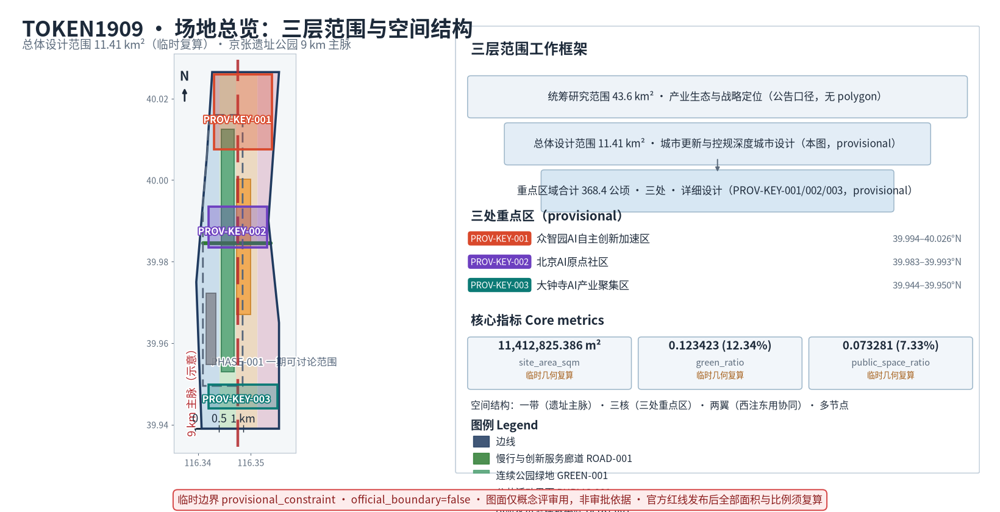

# TOKEN1909 京张AI中枢——百年铁路遗址的AI时代城市共生设计

> **版本**：v3.0 三抓手正式版
> **生成日期**：2026-08-24
> **作者**：MIMConsult
> **视角**：不动产规划 · 产业园招商 · 商业租赁
> **状态**：conceptual AI 城市设计投稿（供专业深化；官方边界缺失不阻断内容评分，但所有精确结论须保持临时状态，不作为审批或施工依据）

**方案原则**：全生命周期资产视角，审慎落地（不替代法定规划），零虚构数据，中英双语严格对齐。



## 三层范围工作框架

按公告 1.3/1.4/1.5 三层范围组织工作框架：统筹研究范围 43.6 km²（产业生态与战略定位）→ 总体设计范围 11.4 km²（城市更新与控规深度城市设计）→ 重点区域三处合计 368.4 公顷（详细设计）。三层任务映射见 `compliance_matrix.json` [standard:PROJECT-OFFICIAL-ANNOUNCEMENT]，空间证据见 `geometry/site_boundary.geojson` [data:geometry/site_boundary.geojson#SITE-001] 与 `geometry/key_areas.geojson` [data:geometry/key_areas.geojson#PROV-KEY-001]。指标复算入口见 [metric:site_area_sqm] 与 [metric:key_area_count]。设计意图：通过三层范围将战略定位、空间框架、详细设计三个层级的任务与证据逐一对应，避免概念空转；几何与指标 Implications 为所有结论必须可从 GeoJSON 复算，不可复算者标 `status=unknown`；数据缺口为官方 boundary 与 key areas 尚未取得，替换后须全量重算 [depth:three_level_scope_framework] [source:OFFICIAL-ANNOUNCEMENT]。

## 统筹研究范围产业与未来城市研究

统筹研究范围覆盖 43.6 km² AI 产业生态与未来城市形态。三核闭环（AI 原点社区研发源点 → 众智园出海战略 → 大钟寺商业变现）构成价值闭合回路 [source:AGENT-TASKBOOK]；西翼中关村科技服务翼注入资本与全球化服务，东翼小月河场景赋能翼聚焦具身智能与 AI 消费体验 [standard:PROJECT-AGENT-OPEN-CALL-TASKBOOK]。设计意图：以产业逻辑串联空间布局，从"研发—出海—变现"全链条定位三核三翼的差异化角色；几何 Implications 为三核落点须对应 `geometry/key_areas.geojson` [data:geometry/key_areas.geojson#PROV-KEY-001] [data:geometry/key_areas.geojson#PROV-KEY-002] [data:geometry/key_areas.geojson#PROV-KEY-003]；指标 Implications 为 [metric:site_area_sqm] 与 [metric:key_area_count]；数据缺口为官方产业用地红线与业态准入条件待确认 [depth:overall_spatial_structure]。

### 外部区域协同矩阵（agent.1 协同边界）

三抓手在本统筹层不只内部闭合，更须与北京更大创新网络显式协同；以下矩阵逐项说明本方案与北纬社区、未来科学城、怀柔科学城、经开区及京津冀之间可共享的科研、算力、人才、测试场景或国际服务，以及牵头/协作主体、当前状态和不构成政府承诺的边界 [source:OFFICIAL-ANNOUNCEMENT] [depth:overall_spatial_structure]。矩阵衔接"产学研城缝合"与"开源AI城市实验室"两条抓手的对外接口，使本带成为区域网络的缝合节点而非封闭园区。

| 协同单元 | 可共享资源 | 接口/协作方式 | 牵头/协作主体（proposed/TBD） | 当前状态 | 不构成政府承诺的边界 |
| --- | --- | --- | --- | --- | --- |
| 北纬社区 | 社区底商+银发/儿童 AI 场景测试 | 散点街区嵌入+开源荣誉广场联动 | 街道办+开源实验室（proposed/TBD） | 概念建议，待社区授权 | 不承诺行政整合或资源调配 |
| 未来科学城 | 基础研究人才+央企研发资源 | 研发—验证—转化链条上游协作 | 区科技委+央企联盟（proposed/TBD） | 概念建议，待主体对接 | 不承诺人才调配或资金安排 |
| 怀柔科学城 | 大科学装置+国家实验室算力 | 算力走廊+数据脱敏共享（M2-M3） | 区发改委+开源实验室（proposed/TBD） | 概念建议，待算力政策落地 | 不承诺专线接入或算力配额 |
| 经开区（BDA）| 产业落地+出海服务+制造场景 | 出海战略与变现环节下游衔接 | 区商委+产业联盟（proposed/TBD） | 概念建议，待产业链对接 | 不承诺企业迁移或政策倾斜 |
| 京津冀 | 国际服务+区域测试场景协同 | 跨域测试地理围栏+对外开放 API | 区政府+京津冀协同办（proposed/TBD） | 概念建议，待跨域协议 | 不承诺跨域审批或统一标准 |

**矩阵说明**：以上协同关系均为概念建议，所有主体标 proposed/TBD，须由相应政府主体与协议方确认后方可启动；无授权时回退为本带内部场景独立运行，不暗示已建立跨域协作或已分配行政责任。矩阵所列资源与接口为基于公开职能与地理相邻关系的概念判断，具体协议、数据通道与算力配额须由专业团队逐项核验后落地 [source:AGENT-TASKBOOK]。

## 总体设计范围城市更新与控规深度城市设计

总体设计范围 11.4 km² 围绕京张遗址公园 9 km 主脉，形成"一带 · 三核 · 两翼 · 多节点"空间结构 [source:OFFICIAL-ANNOUNCEMENT]。城市更新以存量改造为主（保留/改造/更新/新建分类），控规深度指标标注 `status=unknown` 待官方确认 [standard:MOHURD-CONTROL-DETAILED-PLANNING]。设计意图：在既有城市肌理上做针灸式更新，避免大拆大建破坏遗产基底；几何 Implications 为 `geometry/land_use.geojson` [data:geometry/land_use.geojson#LU-001] 与 `geometry/buildings.geojson` [data:geometry/buildings.geojson#BLDG-001] 区分四类建筑处置；指标 Implications 为 [metric:overall_design_area_sqm] 与建筑基底比例；数据缺口为权属、控规、工程条件缺失时一律标注 unknown [depth:retain_renovate_demolish]。

## AI 创新生态、人才画像与 AI+ 场景

AI 创新生态以开源城市实验室为核心，三条测试场景（AI 招商决策沙盘 / 城市级数字孪生推演 / 无人化商业运营测试）先上线再迭代 [source:AGENT-TASKBOOK]。十类用户画像对应十张场景卡，每张卡含 11 项要素（用户画像/核心需求/触点街区/AI 服务/数据来源/治理原则/责任矩阵/上线阶段/成功指标/失败兜底/对照案例），AI+教育/医疗/商业三大街区散点分布于社区底商、高校背街、轨道微中心 [depth:ai_scenarios_user_profiles]。设计意图：让 AI 场景从产业园孤岛渗入市民日常街区，产学研城人群在同一步行界面自然相遇；几何 Implications 为 AI 节点写入 `geometry/public_space.geojson` [data:geometry/public_space.geojson#PUBLIC-001]；数据缺口为 AI 治理须遵守数据最小化与人工复核原则 [source:OFFICIAL-ANNOUNCEMENT]。

### AI 案例对照表

下表选取 8 个国内外城市实践（含 AI 与园区品牌案例）作为本方案“散点街区嵌入”差异化定位的对照参考。每个案例均列出本次实际检索并可访问的主来源（发布者·日期·链接，访问日期 2026-08-29）；“公开成效”列均为对应来源的公开披露口径，本投稿未做独立核验，仅作概念定位对照，不构成定量复算依据 [source:CASE-BENCHMARK] [source:AGENT-TASKBOOK] [depth:ai_case_benchmark]。

| 案例 | 所在地 | 落地时间（公开口径） | 主来源（发布者·日期） | 公开成效（披露口径，未独立核验） | 对本方案可借鉴要素 | 局限/不适用边界 |
| --- | --- | --- | --- | --- | --- | --- |
| 杭州城市大脑 | 杭州云栖小镇 | 2016（云栖大会发布） | [新华网 2016-10-14](https://www.xinhuanet.com/politics/2016-10/14/c_1119721110.htm)；[中国网信网 2020-10-23](http://www.cac.gov.cn/2020-10/23/c_1605022247830939.htm) | 视觉识别+信号优化+交通调度；主干道通行效率提升为公开报道口径 | AI 招商决策沙盘借鉴其多源数据接入模式 | 公示成效为平均值，京张遗产基底流量特征不同 |
| 雄安数字孪生城市 | 雄安新区 | 2018+ | [雄安官网 2025-11-02](https://www.xiongan.gov.cn/20251102/7a22118317df4e50943f966b8bcb0fad/c.html)；[雄安官网 2024-09-13](http://www.xiongan.gov.cn/2024-09/13/c_1212396553.htm) | 数字道路 500 余公里、感知终端近百万个（官网披露）；容东片区先行示范 | 城市级数字孪生推演参考其底座架构 | 京张为建成区更新，缺乏空白建模条件 |
| 上海张江 AI 岛 | 上海浦东 | 2019（开园） | [新华网 2019-07-17](http://www.xinhuanet.com/politics/2019-07/17/c_1124766717.htm)；[浦东新区政府（访问 2026-08-29）](https://www.pudong.gov.cn/zwgk/14496.gkml_zdgz/2025/268/346340.html) | AI 企业集聚为公开报道口径（“入驻企业百家”未逐项核验，仅作背景） | 产学研城缝合借鉴其园区-社区界面打通 | 张江为新建园区，京张为存量改造基底不同 |
| 海淀城市大脑 | 北京海淀 | 2018（启动建设） | [海淀区政府 2020-09-01](https://zyk.bjhd.gov.cn/zwdt/xxgk/zcjd/zcjd/202009/t20200901_4422295_hd.shtml)；[国家发改委转载 2018-02-24](https://www.ndrc.gov.cn/fggz/jgbg/ywgz/201802/t20180224_1207602_ext.html) | 2018 年初启动建设、两年完成顶层设计（官网披露）；多场景数据接入 | 在数据主管部门/数据控制者授权及合规评估后可探索（proposed/TBD） | 城市大脑侧重管理端，本方案强调街区日常场景 |
| 深圳鹏城实验室 | 深圳南山 | 2017 前后（省实验室批次） | [鹏城实验室官网（访问 2026-08-29）](https://www.pcl.ac.cn/)；[官网工作动态 2025-10-20](https://www.pcl.ac.cn/html/897/2025-10-20/content-4631.html) | AI 算力与科研平台（官网口径）；原表述“城市视频分析能力”未获来源支撑，已修正 | AI+公共空间感知场景参考其算力/大模型底座 | 鹏城为实验室模式，本方案为开放街区 |
| 合肥中国声谷 | 合肥高新区 | 2017+ | [人民日报（2021-08-04 转载）](https://www.aass.ac.cn/html/2021-08-04/401_8208.html)；[新华网安徽专题（访问 2026-08-29）](http://www.ah.xinhuanet.com/zhuanti/zgsg/index.htm) | 2020 年底入驻企业超千家、营业收入超千亿（媒体转述集群统计） | AI+商业街区借鉴其场景化产业路径 | 合肥为产业园集聚，本方案为散点街区 |
| 伦敦 Chiswick Park | 伦敦 | 2001（启用） | [Enjoy-Work 官网（访问 2026-08-29）](https://enjoy-work.com/) | 全年活动计划（year-round programme of events）；年活动量为官网公开材料所述、非独立审计值 | 产学研城缝合借鉴其“活动品牌+生活方式”双驱动招商，产业与魅力须同时成功 | Chiswick 为新建商务园，京张为存量更新+AI 场景嵌入 |
| 广州南沙自动驾驶测试区 | 广州南沙 | 2018+ | [南沙区政府（2024 年度数据，访问 2026-08-29）](https://www.gzns.gov.cn/gznskgx/gkmlpt/content/10/10248/post_10248672.html)；[广州市政府（访问 2026-08-29）](https://www.gz.gov.cn/xw/jrgz/content/post_7379666.html) | 累计测试里程近 900 万公里、2024 年重点企业总营收 33.66 亿元（政府官网披露口径） | 无人化商业运营测试借鉴其测试框架 | 南沙为专用测试道路，本方案要求嵌入日常街区 |

设计意图：通过对照表锁定本方案“散点街区嵌入”差异化定位，避免落入产业园集聚或封闭园区范式；数据缺口为本表成效均为公开披露值且未经独立核验，精确复算须取得各案例原始数据并按公开来源与可解释性原则核验；逐案例主来源、发布者、日期与核验状态同步登记于 `sources.json`（CASE-BENCHMARK.case_sources） [source:CASE-BENCHMARK] [source:AGENT-TASKBOOK] [depth:ai_case_benchmark]。
### AI+ 场景卡（10 张 × 11 项要素）

十张场景卡覆盖原六类人群外加银发数字市民、AI 伦理志愿者、跨界创意人、儿童探索者共十类用户，每张卡紧凑表述 11 项要素 [source:AGENT-TASKBOOK] [depth:ai_scenario_cards]。

**卡 1·开源开发者**：用户画像=独立/小团队开发者；核心需求=开放 API 与脱敏数据集；触点街区=开源城市实验室+高校背街；AI 服务=沙盘推演 API+孪生底座访问；数据来源=政府开放数据+高校脱敏集；治理原则=公开来源+可解释性；责任矩阵=M1 主导开源实验室；上线阶段=M1；成功指标=≥30 个开源项目 fork；失败兜底=人工复核接口封禁；对照案例=杭州城市大脑。

**卡 2·初创团队**：用户画像=种子轮初创；核心需求=低成本算力+场景试点；触点街区=轨道微中心+众智园；AI 服务=招商决策沙盘+商业运营测试；数据来源=公开市场数据+脱敏运营数据；治理原则=数据最小化；责任矩阵=M2 提供沙盘额度；上线阶段=M2；成功指标=≥10 家完成测试闭环；失败兜底=算力限流+人工复核；对照案例=上海张江 AI 岛。

**卡 3·头部企业访客**：用户画像=头部 AI 企业考察团；核心需求=场景落地与商业化路径；触点街区=大钟寺商业变现核+遗址带；AI 服务=孪生推演+无人化运营演示；数据来源=企业自有+公开脱敏；治理原则=人工复核商业化决策；责任矩阵=M2-M3 接洽；上线阶段=M2；成功指标=≥3 家落地合作意向；失败兜底=场景临时下线；对照案例=合肥中国声谷。

**卡 4·周边居民**：用户画像=遗址带沿线居民；核心需求=日常便利与安全感知；触点街区=社区底商+蓝绿公共空间；AI 服务=AI+医疗问诊+公共空间视频感知；数据来源=公开来源+最小化采集；治理原则=数据最小化+人工复核；责任矩阵=M1-M3 渐进开放；上线阶段=M1；成功指标=居民满意度调研≥80%；失败兜底=人工通道优先；对照案例=海淀城市大脑。

**卡 5·高校师生**：用户画像=周边高校师生；核心需求=科研场景与教学实践；触点街区=高校背街+开源实验室；AI 服务=孪生推演+脱敏数据集访问；数据来源=高校脱敏研究集；治理原则=公开来源+可解释性；责任矩阵=M1 校企协议；上线阶段=M1；成功指标=≥5 门课程嵌入；失败兜底=数据访问降级；对照案例=深圳鹏城实验室。

**卡 6·国际开发者**：用户画像=海外开源贡献者；核心需求=跨语言 API 与文档；触点街区=开源城市实验室线上+国际节点；AI 服务=对外开放 API+多语文档；数据来源=公开开放数据；治理原则=公开来源+可解释性；责任矩阵=M3 国际 API；上线阶段=M3；成功指标=≥20 国开发者接入；失败兜底=数据本地化回退；对照案例=伦敦 Chiswick Park。

**卡 7·银发数字市民**：用户画像=60+ 银发居民；核心需求=低门槛 AI 问诊与无障碍导航；触点街区=社区底商+遗址带林荫节点；AI 服务=AI+医疗语音问诊+缓坡导航；数据来源=公开来源+最小化采集；治理原则=数据最小化+人工复核；责任矩阵=M2 适老化包；上线阶段=M2；成功指标=银发用户周活≥500；失败兜底=人工值守柜台；对照案例=海淀城市大脑。

**卡 8·AI 伦理志愿者**：用户画像=伦理/法律/社区志愿者；核心需求=可解释性审计与投诉通道；触点街区=开源实验室+社区议事亭；AI 服务=算法审计面板+反馈工单；数据来源=公开审计日志；治理原则=可解释性+人工复核；责任矩阵=M2-M3 治理委员会；上线阶段=M2；成功指标=≥20 起反馈闭环；失败兜底=人工复核熔断；治理输出=治理模板与中文治理语料面向全球开源社区发布，形成 AI 城市治理全球话语权；对照案例=深圳鹏城实验室。

**卡 9·跨界创意人**：用户画像=设计/艺术/媒体创作者；核心需求=遗产载体创作与公开测试；触点街区=遗址带锈蚀钢节点+轨道微中心；AI 服务=具身智能创作+半透光伏装置交互；数据来源=公开来源+最小化采集；治理原则=公开来源+人工复核；责任矩阵=M3 创意驻地；上线阶段=M3；成功指标=≥15 件公开作品；失败兜底=作品临时下架；对照案例=广州南沙自动驾驶测试区。

**卡 10·儿童探索者**：用户画像=6-12 岁学龄儿童（随监护人）；核心需求=安全探索与 AI 启蒙；触点街区=蓝绿公共空间+遗址带林荫；AI 服务=AI+教育互动装置+安全感知；数据来源=最小化采集+监护人授权；治理原则=数据最小化+人工复核；责任矩阵=M3 亲子友好包；上线阶段=M3；成功指标=≥8 所周边学校接入；失败兜底=人工值守+物理隔离；对照案例=合肥中国声谷。

设计意图：十张卡覆盖产学研城+银发+伦理+创意+儿童五类新增人群，确保 AI 场景覆盖全龄全业态而不止于产业园核心人群；几何 Implications 为每张卡的触点街区须写入 `geometry/public_space.geojson` [data:geometry/public_space.geojson#PUBLIC-001]；指标 Implications 为场景卡覆盖人数与 AI 节点密度须可复算 [metric:site_area_sqm]；数据缺口为各卡成功指标阈值须在 M1-M3 阶段按公开来源与人工复核原则校准 [depth:ai_scenario_cards] [source:AGENT-TASKBOOK]。

### AI 创新生态图谱

AI 创新生态图谱以开源城市实验室为枢纽，串联七类利益相关方与三类数据流 [source:AGENT-TASKBOOK]。

```
开源城市实验室（枢纽）
   ├─ 数据流入：政府开放数据 → 公共空间感知数据 → 高校研究脱敏数据集
   ├─ 主体协作：开源开发者 ↔ 初创团队 ↔ 头部企业访客 ↔ 高校师生 ↔ 周边居民 ↔ 国际开发者
   └─ 价值流出：AI 招商决策沙盘 → 数字孪生推演 → 无人化商业运营测试 → 反哺城市治理
```

图谱关系：政府与高校按数据最小化与公开来源原则脱敏开放 [source:OFFICIAL-ANNOUNCEMENT]；开发者与初创团队基于对外 API 构建场景应用；头部企业提供算力与商业化路径；居民作为场景使用者与反馈源；国际开发者通过对外开放 API 接入。设计意图：图谱明确数据流入与价值流出的双向闭环，避免单向产业园集聚导致孤岛效应；几何 Implications 为生态图谱节点须与 `geometry/public_space.geojson` 中 AI 节点一一对应 [data:geometry/public_space.geojson#PUBLIC-001]；数据缺口为各主体数据共享协议与算力配置须在 M1 阶段确认，并保留可解释性与人工复核通道 [depth:ai_ecosystem_map] [source:AGENT-TASKBOOK]。

## 蓝绿空间、公共空间与城市风貌

清河、小月河 + 带状绿地南北贯通、东西连通步行骑行网络 [data:geometry/green_space.geojson#GREEN-001]；9 km 遗址带维持"铁轨+林荫+缓坡"遗产基底；新建 AI 载体高度 ≤ 周边树冠线，材质以锈蚀耐候钢 + 再生枕木 + 半透光伏为主 [depth:blue_green_public_space]。设计意图：蓝绿基底作为 AI 场景的承载层而非背景层，所有 AI 节点嵌入而非叠加；几何 Implications 为 `geometry/public_space.geojson` [data:geometry/public_space.geojson#PUBLIC-001] 与 `geometry/green_space.geojson#GREEN-001` 必须交叉连通；指标 Implications 为绿地率与公共空间比例 [metric:site_area_sqm]；数据缺口为河道蓝线与绿地率管控待官方确认 [standard:MOHURD-URBAN-DESIGN-MEASURES]。

### 公共空间组件库

公共空间组件库由 12 个可组合模块构成，每模块含材质/尺寸/位置/AI 嵌入点/维护责任五项要素，供三重点区域散点街区拼装复用 [source:AGENT-TASKBOOK] [depth:public_space_component_library]。

| 组件 | 材质 | 尺寸 | 位置 | AI 嵌入点 | 维护责任 |
| --- | --- | --- | --- | --- | --- |
| 枕木坐阶 | 再生枕木+锈蚀耐候钢 | L 2.4m | 遗址带节点 | 端侧算力盒 | 遗产管理处 M1 (proposed/TBD) |
| 锈蚀钢标识塔 | 耐候钢 | H 3.0m | 街区入口 | AR 锚点 | 街区联盟 M1 (proposed/TBD) |
| 半透光伏雨棚 | 半透光伏+再生钢 | 6×6m | 轨道微中心 | 能源监测节点 | 区城管委 M2 (proposed/TBD) |
| 林荫缓坡步道 | 透水混凝土+原生树种 | 宽 3.0m | 蓝绿带 | 无障碍导航节点 | 园林局 M1 (proposed/TBD) |
| AI 互动装置 | 锈蚀钢+触控屏 | 1.2×1.2m | 社区底商 | 互动 API 入口 | 开源实验室 M1 (proposed/TBD) |
| 社区议事亭 | 再生枕木+半透光伏 | 4×4m | 高校背街 | 反馈工单节点 | 社区议事委员会 M2 (proposed/TBD) |
| 银发无障碍节点 | 防滑透水砖+语音模块 | 半径 1.5m | 社区底商 | AI 医疗语音问诊 | 街道办 M2 (proposed/TBD) |
| 儿童探索节点 | 软质橡胶+互动屏 | 3×3m | 蓝绿公共空间 | AI 教育互动 | 教育联盟 M3 (proposed/TBD) |
| 轨道微中心集装厢 | 再生钢+集装厢 | 6×2.4m | 轨道微中心 | 商业运营测试 | 区商委 M2 (proposed/TBD) |
| 遗产信息锚点 | 锈蚀钢+二维码铭牌 | 0.6×0.9m | 遗址节点 | AR 历史 API | 文物局 M1 (proposed/TBD) |
| 开放 API 接入柱 | 耐候钢+光纤 | H 2.5m | 开源实验室 | 对外 API | 开源实验室 M1 (proposed/TBD) |
| 应急避难节点 | 透水砖+应急柜 | 4×4m | 蓝绿带 | 安全感知 | 应急局 M1 (proposed/TBD) |

设计意图：模块化拼装让重点区域三处可按本地特征差异化组合而非统一复制；几何 Implications 为每组件须对应 `geometry/public_space.geojson` 节点 ID [data:geometry/public_space.geojson#PUBLIC-001]；数据缺口为材质耐候性与尺寸阈值需专业深化与文保视线复核 [standard:MOHURD-URBAN-DESIGN-MEASURES] [depth:public_space_component_library]。

### 文化导视层级

文化导视体系按三级层级组织，确保遗产叙事与 AI 场景从场地到节点逐级递进 [source:AGENT-TASKBOOK] [depth:cultural_wayfinding_hierarchy]。

**一级·场地级**：覆盖统筹研究范围 43.6 km²，载体为遗址带锈蚀钢标识塔与对外 API；含中英日三语场地导引图、京张铁路历史脉络与 AI 中枢品牌身份；人工复核文化表述准确性 [standard:MOHURD-URBAN-DESIGN-MEASURES]。责任矩阵 M1 由区文旅局主负责（proposed/TBD，待职责主体确认）。

**二级·街区级**：覆盖总体设计范围 11.4 km² 三核三翼，载体为半透光伏雨棚+街区入口标识；含街区主题故事、商户地图、AI 场景卡入口；多语含中英日韩。责任矩阵 M1-M2 由街区联盟主负责 [source:OFFICIAL-ANNOUNCEMENT]。

**三级·节点级**：覆盖重点区域 （三处合计 368.4 公顷）节点，载体为遗产信息锚点+AI 互动装置+开放 API 接入柱；含节点故事二维码、AR 锚点、无障碍语音导航、适老化大字与儿童友好图标。责任矩阵 M2-M3 由属地街道办+开源实验室共负责 [depth:cultural_wayfinding_hierarchy]。

设计意图：三级递进让文化导视不集中堆叠在遗产节点而是从场地入口就开始叙事，与 AI 场景卡触点街区一一对应；几何 Implications 为三级导视节点须交叉写入 `geometry/public_space.geojson` [data:geometry/public_space.geojson#PUBLIC-001]；数据缺口为多语文化表述与文保视线需人工复核通道 [source:OFFICIAL-ANNOUNCEMENT]。

### 活动品牌与责任主体

活动品牌年历按四季组织，呼应 Chiswick Park “产业与魅力须同时成功”原则，责任主体与公共空间组件库一一对应 [source:AGENT-TASKBOOK] [depth:event_brand_responsibility]。

| 季节 | 活动品牌 | 责任主体 | 公共空间组件 | AI 嵌入 | 治理原则 | 阶段 |
| --- | --- | --- | --- | --- | --- | --- |
| 春 | 开源黑客松 | 开源实验室 (proposed/TBD) | 开放 API 接入柱+AI 互动装置 | 沙盘 API | 公开来源+可解释性 | M1 |
| 春 | 铁路遗产导赏月 | 区文旅局+文物局 (proposed/TBD) | 遗产信息锚点+枕木坐阶 | AR 历史 API | 公开来源+人工复核 | M1 |
| 夏 | AI 孪生推演开放日 | 开源实验室+高校 (proposed/TBD) | 开放 API 接入柱+社区议事亭 | 孪生推演 | 数据最小化+可解释性 | M2 |
| 夏 | 街区商业运营测试周 | 区商委+初创团队 (proposed/TBD) | 轨道微中心集装厢+半透光伏雨棚 | 商业运营测试 | 数据最小化+人工复核 | M2 |
| 秋 | 银发无障碍体验周 | 街道办+医疗联盟 (proposed/TBD) | 银发无障碍节点+林荫缓坡步道 | AI 医疗问诊 | 数据最小化+人工复核 | M2 |
| 秋 | 高校 AI 公开课 | 教育联盟+开源实验室 (proposed/TBD) | 社区议事亭+AI 互动装置 | 教育互动 API | 公开来源+可解释性 | M1 |
| 冬 | 跨界创意驻地展 | 文创联盟+创意人 (proposed/TBD) | 遗产信息锚点+AI 互动装置 | 具身智能创作 | 公开来源+人工复核 | M3 |
| 冬 | 儿童探索节 | 教育联盟+社区 (proposed/TBD) | 儿童探索节点+林荫缓坡步道 | AI 教育互动 | 数据最小化+人工复核 | M3 |

设计意图：年历化活动品牌让重点区域从“建成后等客户”转为“边运营边招徕”，呼应 Chiswick Park 以活动品牌驱动招商的运营模式（其年活动量为公开材料所述、非独立审计值，仅作概念性参考）[source:CHISWICK-EVENTS]；责任矩阵明确每场活动由单一主体主导以防推诿；几何 Implications 为活动场地须预先写入 `geometry/public_space.geojson` 预留节点 [data:geometry/public_space.geojson#PUBLIC-001]；数据缺口为各活动参与人数与成效指标须按公开来源与人工复核原则在 M1-M3 阶段校准 [depth:event_brand_responsibility] [source:AGENT-TASKBOOK]。

## 参考资料

主要依据：《百年京张AI创新带城市设计国际方案征集资格预审公告》[source:OFFICIAL-ANNOUNCEMENT]、《面向全球智能体开源征集任务书摘录》[source:AGENT-TASKBOOK]、MOHURD 城市设计与控规编制办法 [standard:MOHURD-URBAN-DESIGN-MEASURES]、MNR 用地分类标准 [standard:MNR-LAND-USE-CLASSIFICATION-GUIDE]。完整机器索引见 `sources.json` [source:SOURCE-REGISTRY]、`standard_matrix.json`、`design_depth_matrix.json` [depth:existing_conditions_diagnosis]、`compliance_matrix.json`、`assumptions.json`、`self_check.json` [data:geometry/site_boundary.geojson#SITE-001]。设计意图：所有结论均可追溯至来源、标准、几何、指标；数据缺口为官方 boundary/key area/控规/道路/市政/文保依据均待补充，替换后须全量重算 [source:SITE-PACKAGE]。

---

## 三条核心设计抓手

> 每条抓手同时回答：**场地现存矛盾 + 落地手段 + 建成结果**，不空喊口号。

**抓手1：铁路遗产骨架化——以京张遗址廊道为公共主脉，AI 嵌入而非替代遗产风貌**
- 解决问题：设计假设（现状痛点待基线调研核验）：京张遗址带疑似被环路、权属界面、地下通道等要素反复切分，"只有景观走廊，没有功能主轴"；AI 产业空间与遗产互斥（科技园区常新建玻璃盒子，遗址仅做怀旧观光），两段叙事彼此游离。
- 实施手段：不做大拆大建，9 km 遗址带维持"铁轨+林荫+缓坡"的遗产基底；把开发者步道、AR 锚点、端侧算力节点、开源荣誉铭刻**嵌入旧铁轨枕木之间与桥下灰空间**；概念目标：所有新建 AI 载体高度 ≤ 周边树冠线（该高度控制为概念假设，需基于现状树体实测、文保视线分析与专业复核确定，不得据此施工或审批），材质以锈蚀耐候钢 + 再生枕木 + 半透光伏为主，不压过铁轨本体。
- 预期结果：从"看一眼就走的纪念带"变成"每天都能用的 AI 主街"；概念目标：沿线步行约 500 m 半径内设一处 AI 互动节点 + 一处遗产解说点（该间距为概念假设，需基于实际断点流量、慢行时间基线与无障碍路径核实，待官方控规与现状测绘后重标） [depth:walkability_accessibility_strategy]。文化朝圣地与 AI 体验带在同一空间图层共生。

**抓手2：产学研城缝合——打通高校‑科创园‑居住社区的物理边界，AI 场景渗入市民日常街区**
- 解决问题：设计假设（现状痛点为公开报道与常见城市研究的普遍描述，非本地实测结论，落地前须以基线调研核验）：高校门禁、园区围墙、小区围栏形成多重物理断点；AI 产业与周边街区互动不足，居民“看得见却用不上”；高校成果转化周期常以年计，青年开源贡献者缺乏就近协作空间。
- 实施手段：沿 9 km 主脉做**校区—园区—街区三线并行的慢行缝合带**（跨五道口、清华东路西口、大钟寺 3 处断点的空中衔接桥/廊为**概念选项/待协商角色**，须道路红线、桥下空间使用权与文保复核通过后方可立项；无新增工程授权时回退为地面路权标记 + 标识导引 + 现状步道衔接的替代路径，不暗示已确定建设）；AI+教育/AI+医疗/AI+商业三大街区**不集中在产业园内**，而是散点分布到社区底商、高校周边背街、轨道微中心之上；近校成果转化街与学生宿舍、居民菜市场共用同一步行界面。
- 预期结果：高校师生步行 5 分钟出校门即可做成果发布；周边居民在回家路上就能体验 AI 便民服务；青年一人公司不用租写字楼，在社区"落地舱"就能开业；园区、高校、居民三类人群在同一街区自然相遇，AI 产业园不再是孤岛。

**抓手3：开源 AI 城市实验室——把整片片区做成可迭代的公开试验场，Agent 应用先上线再迭代，拒绝只停留在概念效果图**
- 解决问题：多数 AI 园区只在展板和效果图里"智能"，建成后场景全部下线；企业开发者没有真实城市尺度的测试床，市民接触到的 AI 只有营销互动屏，没有真正可用的公共服务 Agent。
- 实施手段：在众智园 + 主脉公共空间划定**可公开测试的地理围栏**为**概念选项/待协商角色**（须公共许可、安全与场地授权后方可写入 GeoJSON 图层并上线；无授权时回退为室内沙盒测试 + 标识导引的替代路径，不暗示已取得测试授权），上线 3 个 Agent 公共应用 MVP：① AI 招商决策沙盘（产业落位可逆推演）② 城市级数字孪生推演（业态/交通/人流低成本试错）③ 无人化商业运营测试（24h 自助 + 远程人工复核）；设开源贡献者广场 + 开发者步道 + 协作舱，所有应用接口留对外开放文档，全球开发者可以提交改进 PR。
- 预期结果：评审 3 年后回访时，3 个 Agent 应用在真实运行且有版本迭代记录；开源贡献者广场刻入的 GitHub ID 逐年增长；AI 场景不是一次性展板，而是"今天可用、明年更好"的日常设施，形成可持续的全球开发者-本地市民双向循环。

---

## 总体设计概念与命名体系

**命名 TOKEN1909 京张AI中枢（JAN, Jingzhang AI Nexus）**："TOKEN" 象征算力时代价值凭证，"1909" 锚定 1909 年京张自主精神原点，"中枢" 强调带状集聚辐射。文化副题 *Beidaokou — Tracks to Tomorrow*。空间结构"一带 · 三核 · 两翼 · 多节点" [source:OFFICIAL-ANNOUNCEMENT] [source:AGENT-TASKBOOK] [depth:overall_spatial_structure]。

**三大定位**：① 百年京张 AI 文化带（铁路遗产骨架化，AI 嵌入不替代风貌）；② AI 融合创新带（开源城市实验室，全栈硬科技可落地可测试）；③ 都市AI生活体验带（任务书口径；青年友好、产学研城缝合，一人公司 / 数字游民客厅）。

**三层范围（公告硬性要求）**：统筹研究 43.6 km²（生态 + 战略）→ 总体设计 11.4 km²（更新框架 + 产业布局 + 交通市政）→ 重点区域三处合计 368.4 公顷（详细设计），任务映射见 `compliance_matrix.json` [depth:three_level_scope_framework] [standard:PROJECT-OFFICIAL-ANNOUNCEMENT]。所有结论必须可从 GeoJSON 复算。

**命名与视觉体系**："前缀 + 功能"命名树确保全域辨识度；人字轨拓扑为 Logo 母题（从詹天佑人字形工程到 AI 节点网络）；色彩方向（概念）：铁轨赭石 + 中关村蓝绿 + 高亮霓虹；不使用未清权素材。


---

## 设计依据与资料清单

本方案第一依据为《百年京张AI创新带城市设计国际方案征集资格预审公告》[source:OFFICIAL-ANNOUNCEMENT] 与《面向全球智能体开源征集任务书摘录》[source:AGENT-TASKBOOK]。

专业标准参见 [standard:PROJECT-OFFICIAL-ANNOUNCEMENT]、[standard:PROJECT-AGENT-OPEN-CALL-TASKBOOK]、[standard:MOHURD-URBAN-DESIGN-MEASURES]。

以及 [standard:MOHURD-CONTROL-DETAILED-PLANNING]、[standard:MNR-LAND-USE-CLASSIFICATION-GUIDE]。

完整机器索引保存在 `sources.json`、`metrics.json`、`compliance_matrix.json`、`standard_matrix.json`、`design_depth_matrix.json`、`assumptions.json` [source:SOURCE-REGISTRY] [source:PROCESSED-FACT-PACK]。

数据缺口：官方 `SITE_BOUNDARY` 与三处 `KEY_AREA` 尚未取得，提交包几何均标注 `provisional_constraint` + `official_boundary=false`，仅用于方案生成与可视化，不作为审批依据 [data:geometry/site_boundary.geojson#SITE-001] [data:geometry/key_areas.geojson#PROV-KEY-001]。核心指标见 [metric:site_area_sqm] 与 [metric:key_area_count]。替换 official polygons 后所有图层与指标须重算 [depth:existing_conditions_diagnosis]。

---

## 产业生态策略：基础研究‑孵化‑资本完整链路

> **归属抓手2（产学研城缝合）**：解决"科研成果转化周期长、与街区脱节（设计假设）"矛盾，提供产业链路的制度与空间配套。

**三核闭环模型**：研发源点（AI 原点社区）→ 出海战略（众智园）→ 商业变现（大钟寺），形成价值闭合回路。西翼中关村科技服务翼注入资本、IP、全球化服务；东翼小月河场景赋能翼聚焦具身智能与 AI 消费体验，"西注东用" 协同 [source:AGENT-TASKBOOK] [standard:PROJECT-AGENT-OPEN-CALL-TASKBOOK]。

**待专业核验的策略建议 / 建议做 / 舍弃**：

| 类别 | 内容 | 判断依据与核验状态 |
| --- | --- | --- |
| 待专业核验的策略建议 | M1/M2 配套双控（占地 ≤7% 且计容 ≤15%），禁止成套住宅/宾馆，商业自持 | 基于北京产业用地监管框架的概念假设；项目级正式依据尚未取得，需专业团队核验 [source:M1M2-DUAL-CONTROL] |
| 待专业核验的策略建议 | "以投带招" 租金换股权 + C-REITs 退出路径 | 基于下行周期的概念策略；跌幅参考值约为公开市场报告区间，需专业数据核验或降级为定性表述 [source:PRICE-DECLINE] |
| 建议做 | 业态配比 40/30/20/10 与大型园区 12-18% 商业比例（概念参数，非现状统计或承诺） | 参考公开产业园区招商经验的概念起点（概念参数，非现状结论或承诺），落地前按实际调研调参 |
| 建议做 | 四季活动体系与漏斗式转化 | 品牌运营动作，需配合主体到位后启动 |
| 舍弃 | 承诺税收优惠 / 政府审批 / 保证招商成功 | 超出 agent 与设计方案权限 |

租金参考为概念阶段定性市场定位（不含精确数值），不作交易或评估依据，需专业团队公开市场报告核验 [source:RENT-RANGE]。

**招商与运营**：底商/写字楼租金区间参照公开市场材料所述的中关村软件园与核心区量级（租金区间为概念阶段定性参考（不含精确数值），非交易或评估依据，须专业团队公开市场报告核验 [source:RENT-RANGE]）；重资产（物业）与轻资产（运营）分离，“基础租金 + 流水提成” 共担周期风险。年度活动：春季开源贡献榜 → 夏季 AI 贡献者日 → 秋季 Tracks to Tomorrow 夜跑/音乐会 → 冬季白皮书 + 荣誉年轮更新 [depth:long_term_operation]。

---

## 京张遗址公园公共空间组织

> **归属抓手1（铁路遗产骨架化）**：解决"遗址带只有景观走廊没有功能主轴"矛盾，AI 载体嵌入旧铁路空间。

"一带" 沿京张遗址公园约 9 km 线性创新走廊（北五环—北京北站），作为连通三核的物理骨架与精神主轴。叠加四层功能：

1. **文化层**：1909 京张自主 → 中关村创新制度 → AI 新文化的三层时间叙事，遗址本体不触碰 [depth:cultural_narrative]
2. **蓝绿层**：清河、小月河 + 带状绿地，南北贯通、东西连通步行骑行网络 [data:geometry/green_space.geojson#GREEN-001] [data:geometry/public_space.geojson#PUBLIC-001] [depth:blue_green_public_space]
3. **慢行层**：缝合跨环路断点，轨道站点接驳，非机动车停放组织 [data:geometry/roads.geojson#ROAD-001] [depth:traffic_rail_slow_parking]
4. **AI 场景层**：沿带分布式布点，精神地标、荣誉展示、开放测试场构成"珍珠链"

---

## 交通、轨道、市政与公共服务设施


> 服务抓手1（铁路遗产骨架化）：把被环路、桥下灰空间切断的遗址带用慢行网络重新穿起来；同时服务抓手2（产学研城缝合），概念目标：让三校-三园-三社区的通勤步行距离目标值 ≤10 分钟（该指标为概念目标，需基于现状断点流量、人行道宽度与信号灯时序实测核实，待官方道路红线与市政条件确认后重标） [depth:walkability_accessibility_strategy]。


交通策略：围绕北五环跨线节点、五道口、清华东路西口、大钟寺站组织微循环与慢行接驳；道路红线与工程条件待正式数据确认，当前为概念建议。市政：新基建、分布式能源、端侧算力落点，条件不足时不给出定量结论 [depth:municipal_new_infrastructure]。

---

## 开发者步道与开源荣誉广场

> 服务抓手3（开源AI城市实验室）+ 抓手1（铁路遗产骨架化）：开发者步道嵌入旧铁路枕木之间，不另修景观大道；开源荣誉广场是全球开发者留下实体痕迹的"朝圣地"，也是实验室常年开放的对外展示面。

步行优先的开发者体验路径：詹天佑人字轨节点（北起点）→ 五道口宇宙中心 → 清华东路西口校区衔接桥 → 清河创新界面 → 大钟寺国际路演客厅。沿途模块化智能座椅、AR 锚点、代码贡献实时灯柱，每 500 m 设一处公共协作节点。

**开源贡献者广场（核心地标 L3）**：GitHub ID 自愿铭刻荣誉凭证（非默认上链、不代表法定确权或商业权益；贡献者本人明示同意方可铭刻，身份核验后刻入，可随时申请撤下并删除），LED 光柱实时展示全球代码提交动态，逐年叠加"荣誉年轮"。不涉商业变现，只向开发者社群开放 [depth:blue_green_public_space]。

---

## 三处 AI 灵魂地标

> 服务抓手1（铁路遗产骨架化）：三处理念地标全部落在 9 km 遗址主脉上，材质和高度都退让铁轨本体；同时服务抓手3，让全球开发者一下高铁就能按 L1→L2→L3 的顺序走完"京张自主→科学家创新→开源贡献"的精神叙事。

| 编号 | 地标 | 定位 | 设计要点 |
| --- | --- | --- | --- |
| L1 | 詹天佑"人"字轨纪念节点 | 精神起点 | 铁轨母题诠释自主，跨时空对话空间；不触碰文保本体 |
| L2 | 科学家星光大道 | 人物长廊 | 地面星标 + 模块化矮铭牌，支持动态更新 |
| L3 | 开源贡献者广场 | 精神高地 | 见上文；数字原住民朝圣地 |

**合规边界（必须遵守）**：严格遵守文保、蓝线、绿地、交通安全约束；不擅自改造权属空间；地标设计去娱乐化，庄重与科技感平衡。

---

## 三处重点区域详细设计

> 服务抓手2（产学研城缝合）：三处重点片区不是三个孤立产业园，而是三核价值链上的不同环节；每个片区的 AI 场景都向周边社区和高校敞开，不设门禁围墙。


| 重点片区 | 设计定位 | 空间动作 | AI 场景 | 证据 |
| --- | --- | --- | --- | --- |
| **众智园** AI 自主创新加速区 | 花园型全栈自主创新街区 | 强化清河界面、产业展示、低碳交往、对外交通组织；绿色空间承载开放测试与标准治理 | 自主模型测试、标准工坊、安全治理展示、低碳算力体验 | [data:geometry/key_areas.geojson#PROV-KEY-001] [depth:three_key_area_detailed_design] |
| **AI 原点社区** | 近校型成果转化与人才社区 | 校区‑园区‑街区慢行缝合；补足成果发布、人才服务、居住生活、开源协作空间 | 开源发布厅、成果转化街、人才特区服务、近校孵化 | [data:geometry/key_areas.geojson#PROV-KEY-002] |
| **大钟寺** AI 产业聚集区 | 城市型智能经济与国际交往街区 | 大钟寺站一体化、四象限步行连通、商业服务、重点企业周边环境更新 | 智能体/终端展示、内容消费、数据要素、国际路演 | [data:geometry/key_areas.geojson#PROV-KEY-003] [metric:key_area_count] |

> **硬性约束**：三处必须引用对应 GeoJSON ID [PROV-KEY-001/002/003]，任务映射见 `compliance_matrix.json` 公告 1.5.3.1/2/3；缺失 official polygons 时所有结论为 provisional。

---

## 用地、建筑规模与拆改留方案


> 服务抓手1（铁路遗产骨架化）：在遗址保护区内原则上只保留/改造，不拆不建；服务抓手2（产学研城缝合）：沿校区-园区衔接带释放存量底商和厂房改造空间，不新征住宅用地做封闭式产业园。

依据 [standard:MOHURD-CONTROL-DETAILED-PLANNING] + [standard:MNR-LAND-USE-CLASSIFICATION-GUIDE]：

- 用地结构：`land_use.geojson` 完整覆盖边界无重叠 [data:geometry/land_use.geojson#LU-001] [depth:land_use_layout]
- 建筑基底：`buildings.geojson` 区分保留/改造/更新/新建 [data:geometry/buildings.geojson#BLDG-001] [depth:retain_renovate_demolish]
- 开发强度：缺失权属/控规/工程条件时指标标注 `status=unknown`，不得编造精确值 [depth:development_intensity_controls] [metric:building_footprint_area_sqm]
- 风貌与市政：建筑高度/退线/红线控制"待正式控规条件确认"，站点一体化与停车布局建议待官方确认 [standard:MOHURD-URBAN-DESIGN-MEASURES] [depth:height_massing_character]

---

---

## 重点空间：AI+教育 / AI+医疗 / AI+商业 街区场景

> 服务抓手2（产学研城缝合）：三个 AI+ 街区刻意不集中在众智园、大钟寺等单一产业园内部，而是散点落在高校周边、社区底商、轨道微中心上，让科研-产业-生活三类人群自然相遇。

**AI+教育 街区（AI 原点社区西翼）**：近校成果转化街 [data:geometry/key_areas.geojson#PROV-KEY-002]，配置高校成果发布厅、跨校协作空间、AI 教育体验点、知识产权与法务服务站。服务画像：高校师生、青年开源贡献者。运营模式：算力券 + 免费社区席位，成果展示与孵化服务一体。

**AI+医疗 街区（大钟寺南翼）**：大钟寺片区底商改造 [data:geometry/key_areas.geojson#PROV-KEY-003]，落地 AI 影像会诊样板、健康管理体验、合规数据要素会客厅（严格授权、可审计）。服务画像：居民日常就诊 + 企业商务接待。隐私边界：居民画像不做商业推荐，医疗数据仅聚合统计，人工复核必备。

**AI+商业 街区（五道口—大钟寺中段城市商业界面）**：开发者步道 + T3 无人化商业运营测试场 [depth:ai_scenarios_user_profiles]，24h 自助业态、智能终端体验店、内容消费场景。服务画像：青年群体、周边居民、企业访客。招商原则：业态配比采用 40/30/20/10 概念参数（见产业生态章，非现状结论），不做伪精确承诺。

---

## 用户画像与 AI 场景卡

> 服务抓手2（产学研城缝合）+ 抓手3（开源AI城市实验室）：六类画像覆盖高校师生/周边居民/开发者三类核心人群，避免只服务企业不服务市民；六张场景卡对应在街区里能真实走到、摸到、用到的空间节点，而不是展板效果图。

| 画像 | 核心需求 | 空间响应 | 合规边界 |
| --- | --- | --- | --- |
| 开源开发者 | 发布、协作、声誉 | 原点社区开源发布厅、代码墙、夜间协作空间 | 不采集个人行为轨迹，活动仅聚合统计 |
| 初创团队 | 低成本办公、算力入口 | 众智园测试场、端侧算力驿站 | 算力/数据另行授权 |
| 头部企业访客 | 展示、接待、招聘 | 大钟寺路演客厅、站点接驳、重点企业周边公共空间 | 企业标识须清权 |
| 周边居民 | 通勤、休闲、低扰动更新 | 遗址公园慢行环、社区服务嵌入、夜间活动分级 | 不做商业推荐画像 |
| 高校师生 | 成果转化、慢行衔接 | 校区‑园区慢行缝合、成果转化驿站 | 校园数据/科研需授权 |
| 国际开发者 | 短驻、黑客松、会议 | 国际驿站、开源贡献者广场 | 签证与数据合规 |

| 场景卡 | 空间载体 | 设计说明 | 图层证据 |
| --- | --- | --- | --- |
| 01 开源发布厅 | AI 原点社区 | 高校/社区/初创成果发布、代码贡献展示、小路演 | [data:geometry/key_areas.geojson#PROV-KEY-002] |
| 02 安全治理沙盒 | 众智园 | 标准制定、红队测试转译为可参观协作节点 | [data:geometry/key_areas.geojson#PROV-KEY-001] |
| 03 AI 慢行导航 | 京张活力带 | 可解释导视 + 低侵入传感识别断点/拥挤/无障碍 | [data:geometry/public_space.geojson#PUBLIC-001] |
| 04 大钟寺国际路演客厅 | 大钟寺聚集区 | 智能体/终端展示、洽谈、媒体发布、国际交流 | [data:geometry/key_areas.geojson#PROV-KEY-003] |
| 05 近校成果转化街 | AI 原点社区 | 孵化、展示、法务、IP、投融资一体化服务街 | [data:geometry/buildings.geojson#BLDG-001] |
| 06 一人公司落地舱 | 众智园 / 原点社区 | 算力券 + 注册 + 法务 + 工位一揽子，服务青年创业者 | [metric:key_area_count] |

---

## 产业测试场景与治理边界

> 服务抓手3（开源AI城市实验室）：三个产业测试场景是本方案"拒绝只停留在概念效果图"的落地证据，先在众智园和大钟寺划定可公开测试的地理围栏（概念选项/待协商角色，须公共许可与场地授权后落地；无授权时回退为室内沙盒测试替代路径，不暗示已取得测试授权），上线 MVP，版本迭代记录纳入年度报告。

**三个产业测试场景（agent.3 必选）** [source:AGENT-TASKBOOK] [depth:ai_scenarios_user_profiles]：

| # | 测试场景 | 空间载体 | 验证目标 |
| --- | --- | --- | --- |
| T1 | AI 招商决策沙盘 | 中关翼线上平台 | 结构化数据推演产业落位，"可逆、可试错"前置验证 |
| T2 | 城市级数字孪生推演 | 总体设计范围 | 低成本模拟业态/交通/人流，提前规避城市病 |
| T3 | 无人化商业运营测试 | 大钟寺园区底商 | 24h 自助业态模型，"无人零售 + 远程审核"样板 |

**算力落到空间图层**：AI 场景节点必须写入 `public_space.geojson` / `green_space.geojson` / `roads.geojson`，评审可直接定位。**AI 治理四原则（必须遵守）**：数据最小化 · 公开来源 · 可解释 · 人工复核。智能体辅助识别慢行断点、热力、设施维护，但不能替代规划审批、不能输出未授权个人画像、不能声称官方实施承诺。

**高风险场景隐私—人工复核矩阵** [depth:ai_scenario_cards]（逐场景说明数据字段、保存期限、自愿退出与责任人，无法确认的标“不得采集/待合法授权”）：

| 场景 | 是否采集个人数据 | 最小字段 | 目的 | 保存期限 | 授权/监护 | 退出与删除 | 禁止用途 | 人工责任人 | 停用条件 |
| --- | --- | --- | --- | --- | --- | --- | --- | --- | --- |
| N7 AI+医疗街区 | 是（健康相关） | 主诉/科室/预约时段（不存身份证号） | 辅助分诊/远程会诊 | 保存期限目标：就诊后24h内清除（概念目标，须由合法数据控制者依据《个人信息保护法》及医疗合规审查确认后执行；未获授权前不得采集） | 本人书面同意；未成年人需监护人 | 随时口头退出并立即清除 | 商业画像/广告推送 | 执业医师（人工窗口并行） | 误诊风险或数据合规审查未过 |
| N5 AI+教育街区/儿童探索节 | 仅匿名交互日志 | 年龄段/互动时长（不采集人脸/姓名） | 教育内容适配 | 保存期限目标：活动结束即清除（概念目标，须由合法数据控制者及教育合规审查确认后执行；未获授权前不得采集） | 监护人书面授权 | 监护人随时退出 | 行为预测/第三方共享 | 教育联盟现场辅导员 | 监护人投诉或合规审查未过 |
| N9/T2 视频感知·公共空间感知 | 画面元数据（人流计数/密度，不存人脸） | 匿名计数/轨迹密度 | 慢行断点诊断/孪生推演 | 保存期限目标：实时处理不留存原始视频（概念目标，须由合法数据控制者及公共视频安全合规审查确认后执行；未获授权前不得采集） | 公示告知+公众监督 | 个人可申请回避采集区域 | 个人识别/追踪 | 城市数据治理志愿者 | 发现可识别个体或合规审查未过 |
| 满意度调查 | 是（自愿问卷） | 满意度评分/开放反馈（不采集联系方式） | 场景迭代优化 | 汇总后即清除原始反馈 | 自愿参与 | 可随时停止作答 | 个人营销 | 运营主体（proposed/TBD） | 反馈机制被滥用 |
| N12 GitHub ID 实体铭刻 | 采集公开 GitHub ID（已公开数据） | GitHub 用户名/贡献数（公开 API） | 实体铭刻荣誉展示 | 贡献者可随时申请撤下，撤回后72小时内移除物理标识 | 贡献者本人单独知情同意（身份展示授权，与开源代码许可无关；开源协议仅授权代码使用，不构成身份展示同意） | 提交 PR 申请撤下即清除 | 商业售卖/与本人无关关联 | 开源荣誉委员会（proposed/TBD） | 贡献者投诉或身份核实失败 |

**矩阵说明**：以上矩阵为概念级隐私治理框架，所有字段设计与人工复核流程须在场景获得试点主体和场地授权后，完成隐私影响评估、网络与模型安全测试与人工接管演练方可上线；未获合法授权前不得采集任何个人数据。

---

---

## 更新项目清单、实施政策与分期计划

**6 项更新项目** [depth:renewal_project_list]。责任主体均为 proposed/TBD，待项目级主体明确后确认；桥廊、市政、消防、文保、医疗等事项仅供专业团队深化，不构成工程可行性结论。

| 编号 | 项目 | 类型 | 现有输入 | 前置依赖（待专业团队深化） | 概念阶段决策门 | 可核验验收指标 | 失败退出条件 | 证据 |
| --- | --- | --- | --- | --- | --- | --- | --- | --- |
| JZ-01 | 遗址公园慢行断点缝合 | 公共空间 / 交通 | 临时道路网与断点位置 | 道路红线复核、桥下空间使用权 | 慢行连通可行性研究通过 | 断点数量与连通率 | 主体未落实则回退为路权标记 | [data:geometry/roads.geojson#ROAD-001] |
| JZ-02 | 众智园清河创新界面 | 蓝绿 / 产业展示 | 河道临时边界 | 河道蓝线、防洪条件、生态复核 | 蓝线与防洪专项研究通过 | 河岸可利用长度与绿地率 | 蓝线冲突则取消该界面动作 | [data:geometry/green_space.geojson#GREEN-001] |
| JZ-03 | 原点社区近校成果转化街 | 城市更新 / 产业服务 | 临时建筑基底 | 校区边界、权属、业态准入 | 权属与业态专项研究通过 | 底商业态导入数量 | 权属未清则回退为公共展示 | [data:geometry/buildings.geojson#BLDG-001] |
| JZ-04 | 大钟寺站四象限步行连通 | 轨道一体化 / 慢行 | 临时公共空间节点 | 站点、交叉口、管线 | 轨道与慢行专项研究通过 | 步行连通节点数与换乘时间 | 轨道冲突则回退为标识导引 | [data:geometry/public_space.geojson#PUBLIC-001] |
| JZ-05 | AI 公共服务与端侧算力节点 | 新基建 / 公共服务 | 临时约束层 | 能源、算力、运营主体 | 能源与算力专项研究通过 | 节点上线数与覆盖率 | 运营主体未落实则回退为预留接口 | [data:geometry/constraints.geojson#CONSTRAINTS] |
| JZ-06 | 全球 AI 活动周公共路线 | 运营 / 品牌 | 临时分期层 | 公共许可、安全、版权 | 活动许可与安全专项研究通过 | 年活动场次与参与规模 | 许可未取则回退为社区内部活动 | [data:geometry/phasing.geojson#PHASE-001] |

分期逻辑 [depth:phasing_implementation]：**近期试点**（JZ-01 / 04 慢行缝合 + 场景原型）→ **中期更新**（JZ-02 / 03 空间建设 + 业态导入）→ **长期运营**（JZ-05 / 06 新基建 + 品牌沉淀）。无权属/资金/主体时不承诺落地，全部纳入风险。桥廊、市政、消防、文保、医疗等事项仅供专业团队深化，不作工程可行性结论，亦不构成已批准安排。

---

## 指标体系、面积复算与合规矩阵


三类指标管理 [depth:metrics_recalculation]：① 可复算空间指标（site_area、绿地/公共空间比例、建筑基底、分期面积）→ `metrics.json`；② 待官方确认管控指标（容积率、高度、密度、退线、红线）→ `assumptions.json`；③ 待运营校准绩效指标（AI 创新指数、人才密度、慢行可达性、活动参与度）→ `compliance_matrix.json`。未知指标统一 `status=unknown`，不得编造精确值。formal 三项视觉指标（site_area_sqm / green_ratio / public_space_ratio）与 `visual/index.html` data-value 保持一致。

**评审维度映射矩阵**：

| 评审维度 | 抓手呼应 |
| --- | --- |
| `objective_alignment` | 铁路遗产骨架化构建 9 km 主脉，历史与 AI 共生，服务产业高地与文化朝圣地 |
| `function_match` | 三定位全覆盖；产学研城缝合打通高校-园区-居民界面；开源 AI 实验室上线真实 Agent |
| `brand_identity` | TOKEN1909 命名 + 人字轨母题 + 铁轨赭石 / 中关村蓝绿 / 霓虹；三条抓手概念直观可传播 |
| `regional_synergy` | 产学研城缝合：研发源点 → 出海 → 变现三核联动 + 西注东用两翼协同 |
| `planning_innovation` | 开源 AI 城市实验室：AI 招商沙盘 + 数字孪生 + 无人商业测试，先上线再迭代 |
| `industry_support` | 产学研城缝合：以投带招 + C‑REITs 退出 + 业态配比双控合规 + 社区落地舱 |
| `scenario_perceptibility` | 开源 AI 实验室：6 场景卡 + 3 测试场景 + 开发者步道全部落到真实街区图层 |
| `spatial_clarity` | 铁路遗产骨架化：一带三核两翼 + 珍珠链节点沿 9 km 主脉清晰串起 |
| `transferability` | 三条抓手均留 unknown 接口，专业团队可深化；开源实验室接口开放可提 PR |
| `expression_completeness` | 三抓手贯穿结构 + 图件索引 + GeoJSON / JSON 证据完备；每章显式归属抓手 |
| `public_compliance` | 文保 / 蓝线 / 绿地 / 合规边界明示；AI 治理四原则；去营销化，不承诺超越权限 |
| `international_communication` | 英名 JAN + 主文案 Beidaokou — Tracks to Tomorrow；开源实验室面向全球开发者生态 |
| `long_term_operation` | 产学研城缝合 + 开源实验室：四季活动 + 曝光 → 沉淀 → 落地 → 成长 → 荣誉碑刻漏斗 |

---

## 风险、版权与合规说明

**硬性约束（必须遵守）**：

1. **双语要求**：本稿为中文定稿，`proposal.en.md` 必须术语 1:1 对齐；A3/A0、HTML、含文字图件必须双语；缺任一译稿 CI 阻断提交。
2. **边界 provisional**：`site_boundary.geojson` 与 `key_areas.geojson` 均为 `official_boundary=false`，不作为审批依据；替换 official polygons 后所有图层与指标须重算。
3. **零虚构指标**：无法从 GeoJSON 复算的面积/比例/规模一律 `status=unknown`，不得以 agent 推测值冒充审定指标。
4. **版权清权**：所有图片 / 图纸 / 图标 / 数据 / 代码在 `sources.json` 或 `report/copyright_statement.md` 说明来源与许可；HTML 不得加载远程脚本/瓦片/字体/iframe/外部 API，不得跟踪评审行为。
5. **合规红线**：不声称官方批准 / 审定控规 / 最终权属 / 保证实施；地标不触碰文保本体、不擅自改造权属空间、去娱乐低俗化。
6. **M1/M2 双控降级声明**：M1/M2 配套占地 ≤7% 且计容 ≤15%、禁止成套住宅/宾馆/培训中心、配套商业自持等具体指标**不作为硬性约束**，仅作"待核验策略参考"，须由专业团队对照北京产业用地正式文件核验后决定是否采纳；核验未通过则按实际控规调整或舍弃 [source:M1M2-DUAL-CONTROL]。

风险与缺资料：`missing_data_checklist.csv` 中的 official boundary、key area、控规、道路、地块、建筑、市政、文保、公共服务缺口全部进入 `assumptions.json` 与本节 [depth:risk_missing_data] [data:geometry/constraints.geojson#CONSTRAINTS] [source:SITE-PACKAGE]。缺官方控规/红线/权属/市政/消防/文保依据的结论统一降级为"待确认"。

完整结构化索引：`sources.json` / `metrics.json` / `compliance_matrix.json` / `standard_matrix.json` / `design_depth_matrix.json` / `self_check.json`。AI agent 对事实、来源、版权、空间数据、指标和表达负责；评审可依据自检、空间复核和合规矩阵要求返修或拒绝。
