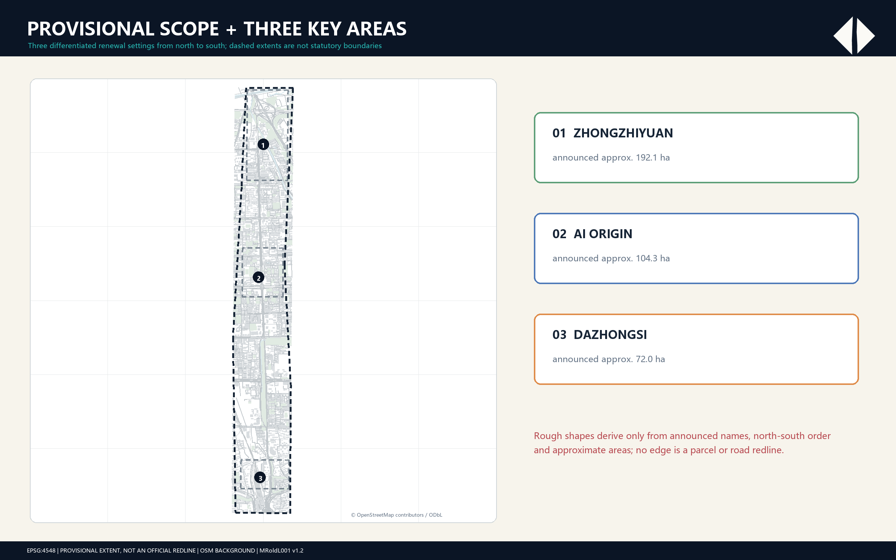
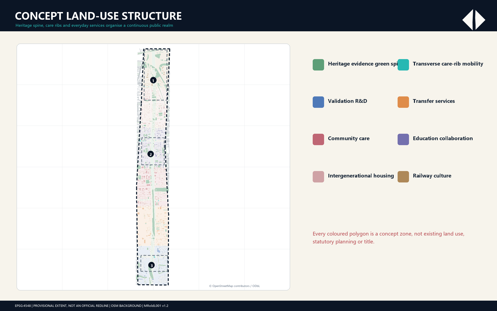
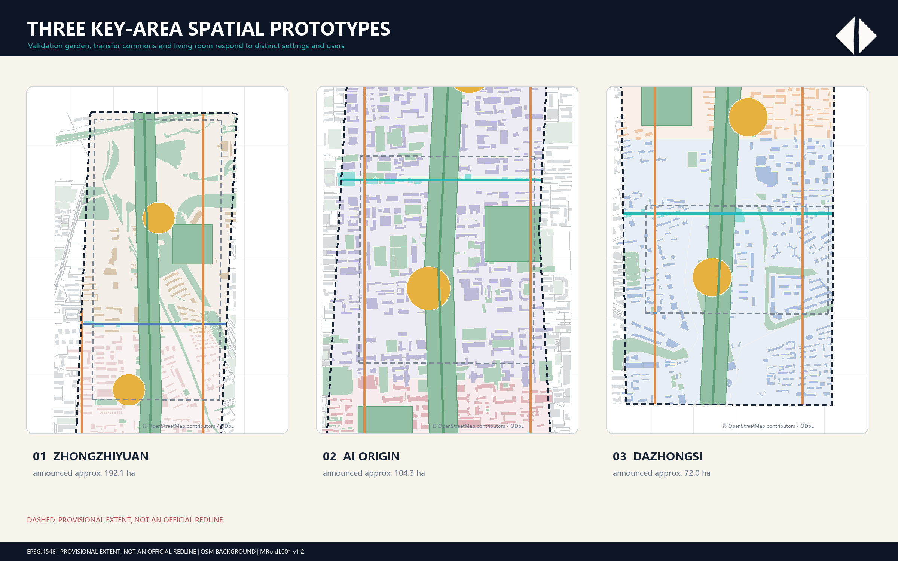
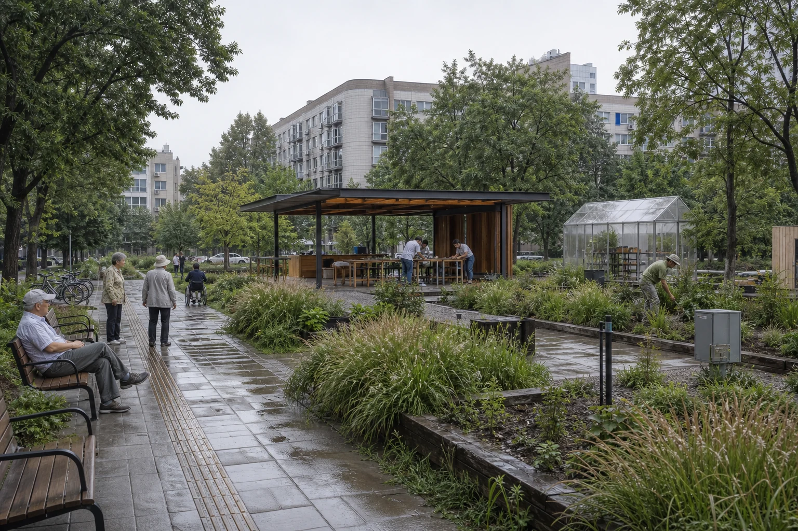
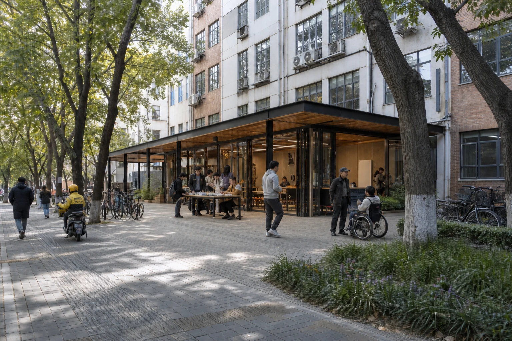
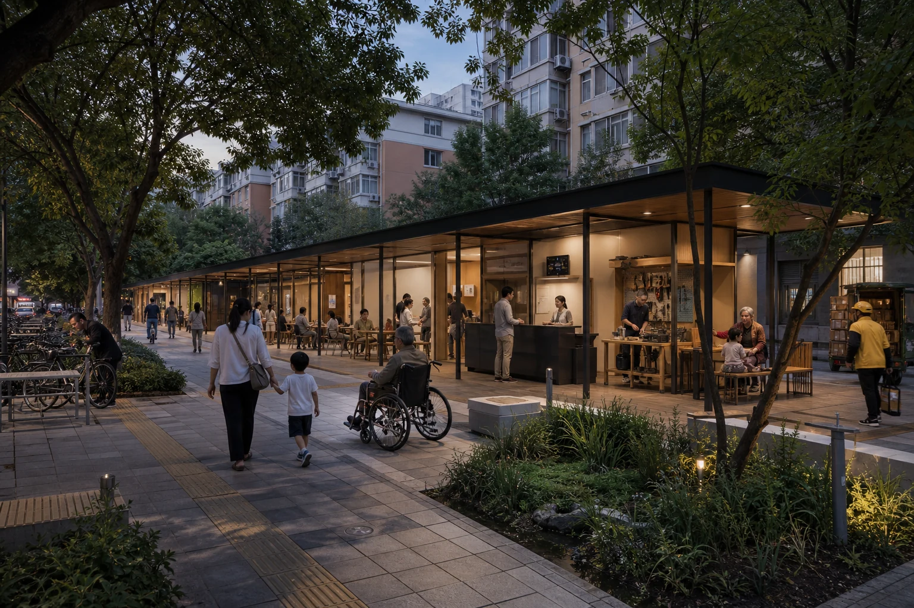
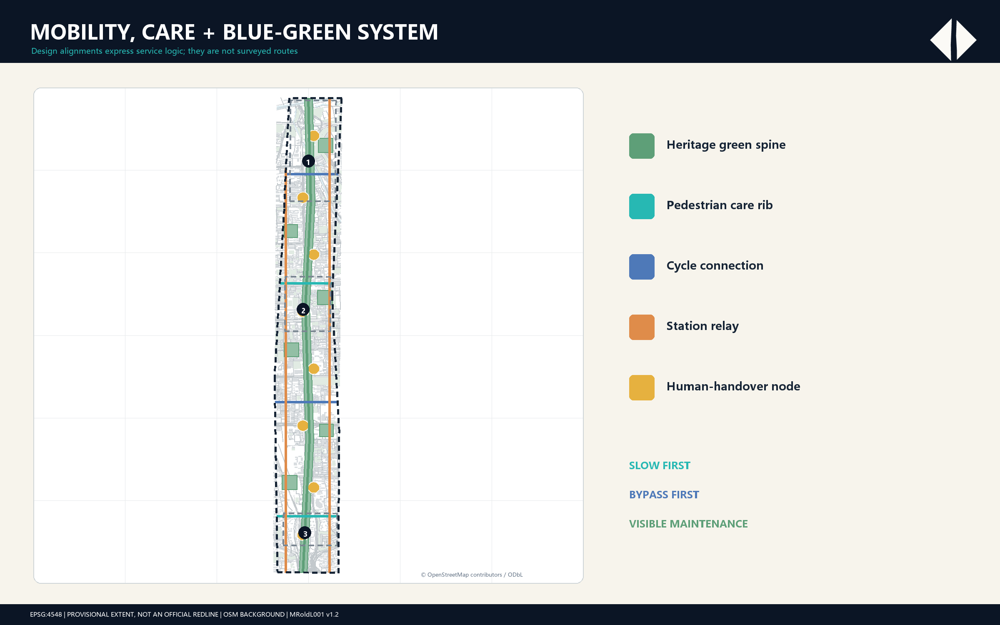
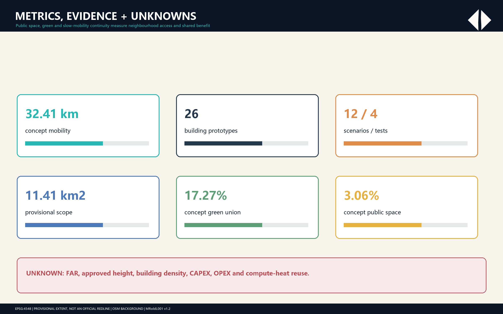

# Jing-Zhang Civic Stack

> Make every layer of intelligence visible, handover-ready, retireable, and beneficial to everyday life.

## Name and Mark

“Jing-Zhang” carries the public memory of the Centennial Jing-Zhang Railway into the present Haidian innovation-belt task; “Civic Stack” binds innovation return, care and public review into one spatial responsibility. A deep-navy diamond is split from top to bottom by a void abstracted from the submission’s provisional narrow, turning Jing-Zhang Belt geometry. The open void signals a continuous evidence line, while the two halves pair innovation with everyday city life. The void is an identity abstraction, not an official boundary replica. The mark is an original proposal—not an official mark, approval or endorsement of any organizer, government, railway operator, park or partner. The full lock-up and reduced diamond support drawings, web pages, wayfinding and material labels. [depth:identity_system]

## Design Basis and Source List

This package enters the related GitHub open call for AI agents; it does not claim applicant status in the Centennial Jing-Zhang AI Innovation Belt International Urban Design Solicitation. Its prequalification application closed on 18 May 2026. The evidence ladder is official announcement, repository taskbook, registered public data, then design inference. The announcement describes approximately 43.6 km² for coordinated research, 11.4 km² for overall design, and three key areas totaling 368.4 ha. Those quantities establish scope but never reverse-engineer a precise boundary. [source:OFFICIAL-ANNOUNCEMENT]

No cleared exact polygon is available. The package therefore inherits the repository’s provisional overall and key-area geometry without moving Dazhongsi, clips every design layer in EPSG:4548, and marks every boundary `official_boundary=false`. When official polygons arrive, land use, buildings, mobility, green/public space, phases, metrics, drawings and manifest hashes must all be regenerated together. [data:geometry/site_boundary.geojson#PROV-SITE-001]

Only repository-cleared material, government pages, first-party case pages and a registered fixed OpenStreetMap vector extract are used. OSM supplies background context only and does not enter boundaries, areas or controls. No government image, map tile, corporate logo or peer submission is copied. The missing official geometry must not block content review, but the package is never a statutory plan, approval basis, engineering location or ownership finding. [source:SOURCE-REGISTRY] [source:OSM-CONTEXT-20260812]

## Three-Level Scope Framework

Jing-Zhang Civic Stack turns the three scopes into one handover-ready system. The coordinated scale first studies knowledge, talent, compute services and public-benefit coordination among universities, research, companies and neighborhoods within the 43.6 km² Haidian scope. Links across Beijing–Tianjin–Hebei are outside-scope concepts, not an official boundary or an established partnership. The overall scale uses an abstract railway “evidence line” and four transverse “care ribs”; the detailed scale tests three distinct stack yards. Zhongzhiyuan is a Full-Stack Validation Garden, AI Origin an Open-Source Transfer Commons, and Dazhongsi a 15-Minute Living Room. [depth:three_level_scope_framework]

Five interoperable city layers carry the idea: heritage/ground preserves evidence and a walkable interface; mobility/care guarantees phone-free, accessible and night-work routes; energy/compute puts edge devices, rainwater, shade and possible heat exchange behind engineering gates; data/scenario limits purpose, time and deletion; governance/memory records responsibility, appeal, handover and retirement. The spatial formula is one evidence line, four care ribs, three stack yards and two return loops to Zhongguancun services and the Xiaoyue River blue-green system. [depth:overall_spatial_structure]

Every node answers who benefits, who maintains it, what happens offline and when it stops. This makes the framework transferable to projects and procurement, instead of another generic “belt plus three centers” slogan. All alignments remain conceptual inside the provisional viewport. [data:geometry/key_areas.geojson#PROV-KEY-001]

## Coordinated Research Area: Industry and Future City Research

The innovation chain makes both innovation cost and public return visible. Research institutions define testable questions; Origin offers a low-cost open-source transfer clinic; Zhongzhiyuan tests safety, energy and maintenance in bounded yards; Dazhongsi places mature services in a 15-minute living room for residents and small merchants to evaluate; the Zhongguancun service wing supplies legal, IP and finance support. Any outside-scope Beijing–Tianjin–Hebei exchange of training, testing, talent or ecological scenarios remains a concept and must carry a public-benefit clause; it is not an announced partnership. [source:AGENT-TASKBOOK]

The three non-negotiable qualities are handover-ready, circular and beneficial. Handover-ready means staffed windows, paper routes, physical stop controls and offline drills. Circular includes rainwater, components, device retirement, maintenance labor and only metered, engineering-approved heat exchange. Beneficial means a public service still works without a smartphone and does not treat children, older people, disabled people or night workers as edge cases. Four landmarks—the Railway Memory Gate, Full-Stack Greenhouse, Open-Source Transfer Hall and Civic Stack Beacon—make those obligations legible without equating AI with a giant screen. [metric:landmark_count]

Six first-party cases provide mechanisms, not templates. Land law, platform authority, investment and institutional mandates are explicitly not imported. [source:CASE-QUAYSIDE-AGREEMENT]

| Case | Transferable mechanism | Jing-Zhang translation / limit |
| --- | --- | --- |
| Toronto Quayside | Development-partner agreement and public-objective review | A Civic Stack Passport and annual public review; land/governance structure is not copied |
| Cambridge The Foundry | Community-dedicated, inclusive innovation space | A low-threshold transfer clinic at Origin; no assumption that property is available |
| King’s Cross / Knowledge Quarter | Heritage anchor, institution alliance and curation | Railway evidence line and cross-institution table; no copied commercial model |
| Helsinki Kalasatama | Bounded agile pilots | Entry and stop gates for four tests; no performance claim before local evidence |
| Singapore Punggol Digital District | Campus-industry flexibility and a government-developed proprietary district digital platform | Interoperable spatial/data interfaces, with open standards as a local goal; no imported platform authority |
| Montreal Mila | Nonprofit, multi-university and open-science AI-community anchor | An independent-review seat in Dazhongsi’s public marketplace; no claimed partnership |

## Overall Design Area: Urban Renewal and Regulatory-Plan-Level Urban Design

A complete, gap-free conceptual land-use layer is the machine base. It combines the heritage green spine, four care-rib mobility bands, and research, commercial-service, community-service, education, residential and cultural bands. The partition tests functional adjacency and public interfaces; it does not replace current land use, ownership or a regulatory plan. [data:geometry/land_use.geojson#LU-001]

Renewal follows an evidence gate: build a verified record of age, structure, use, ownership, carbon and heritage; let qualified teams recommend retain, repair, add or replace; then require public-benefit, fire, utility, mobility and cost review before any approval. The submitted footprints are civic-unit envelopes for testing courtyards, staffed ground floors, detachable service spines, shade and roof-water interfaces. No real building is selected for demolition and no invented floor count, height or FAR is stated. [depth:retain_renovate_demolish]

Three physical sections remain deliberately different: a greenhouse–test yard–Qinghe interface in the north; a shallow transfer hall–shared workshop–care street in the middle; and a neighborhood porch–everyday services–data-rights window in the south. Missing road, utility, fire and heritage controls stay explicit in `constraints.geojson`. [data:geometry/constraints.geojson#CONSTRAINT-001]

## Detailed Design of Key Areas

Zhongzhiyuan is a Full-Stack Validation Garden rather than a closed showroom. The formal notice establishes the Zhongzhiyuan key area and task; a recent government-platform article describes Xuebeiyuan only as a core carrier for the northern AI acceleration area, not as the whole Zhongzhiyuan key area. A detachable greenhouse and public test yard expose rainwater, noise, energy, safety and human bypass. A pilot enters only with an operator, insurance, baseline, stop threshold and recovery plan; failure returns it to the lab. Maintenance staff and everyday walkers are named beneficiaries. [source:OFFICIAL-ANNOUNCEMENT] [source:ZHONGZHIYUAN-CARRIER]

*Zhongzhiyuan · Full-Stack Validation Garden | AI-generated concept view. Based on public site context and this proposal's prototype, it depicts a demountable greenhouse, rain gardens, continuous accessible walking and a staffed maintenance interface. It is not a current-condition photograph, record of construction, or engineering location.*

AI Origin is an Open-Source Transfer Commons: shallow halls, shared workshops, talent services, affordable short-term work and a multi-generation care street. A walk-in human clinic assembles code, copyright, model cards, data permission, pilot contracts and retirement clauses. The publicly discussed roughly 3 km² AI Origin district and the announced 104.3-ha key area are different scales and are never conflated. [source:AI-ORIGIN-UPDATE]

*Beijing AI Origin · Ground-Floor Co-Creation Commons | AI-generated concept view. Retaining the scale of existing lanes and mature tree shade, it shows a lightweight single-storey intervention for shared workshops, staffed advice and intergenerational care. It is not a current-condition photograph, record of construction, or approved building design.*

Dazhongsi is a 15-Minute Living Room. At this stage it is a walkable, weather-protected, staffed everyday-service frontage embedded in the existing mixed neighborhood; small merchants, device repair, culture, international exchange, data rights and night-worker services mix inside. The Civic Stack Beacon displays service hours, energy, maintenance duty and appeal—not advertising rank. Its provisional polygon is not moved or used for parcel conclusions. [source:OFFICIAL-ANNOUNCEMENT] [data:geometry/key_areas.geojson#PROV-KEY-003]

*Dazhongsi · 15-Minute Living Room | AI-generated concept view. The scene focuses on an all-weather porch, neighborhood market, device repair, care and staffed inquiry. It is not a current-condition photograph, record of construction, or implementation plan.*

All three use one Civic Stack Passport, but their section, primary users, operations and stop rules differ. The key-area figure therefore pairs each spatial prototype with operating responsibility, human handover and stop conditions; the mechanism can survive a future boundary replacement while every location is recalculated. [depth:three_key_area_detailed_design]

## AI Innovation Ecosystem, Personas, and AI+ Scenarios

Every scenario carries a Civic Stack Passport: problem baseline, beneficiary, spatial boundary, service window, minimum data, energy budget, maintenance labor, human-equivalent route, success and stop thresholds, appeal, deletion and retirement proof. It is available on paper and at a staffed desk as well as digitally. All twelve cards include human handover; four are tests whose success means only that a local gate was passed, never that government adoption is secured. [metric:scenario_count]

Talent includes those who operate, repair, care and use the district—not just machine-learning engineers. Six priority personas are recruitment and evaluation prompts, not profiles derived from tracking or claims of consent. No persona may determine eligibility, price, enforcement or commercial targeting unless the affected person can inspect and correct it. [metric:persona_count]

| Priority persona | Need that technology must not replace | Spatial and service commitment |
| --- | --- | --- |
| Children and caregivers | No identification, continuous visibility, safe pause | Staffed after-school window, paper pickup, shade seating and ad-free route |
| Older people | Plain language, a person to ask, no automated diagnosis | Human desk, telephone entry, large type and revocable data consent |
| Wheelchair, low-vision and Deaf users | Step-free continuity and tactile/auditory redundancy | Four care ribs, tactile map, human escort and obstruction work order |
| Night maintenance workers | Safe hours, accessible keys/tools and offline work | Handover locker, quiet window, rest point and workload review |
| Couriers and small merchants | Lawful loading, affordable service and no platform lock-in | Timed shared access, hand-cart fallback and offline business desk |
| Developers and start-ups | Affordable tests, explicit responsibility and an exit | Transfer clinic, validation garden, independent review and retirement clause |

| ID and scenario | Baseline, place and window | Success / stop rule | Human equivalent, accountability and retirement |
| --- | --- | --- | --- |
| 01 **Phone-free commute relay (test)** | Human wayfinding and existing signs; station–park–workplace at sampled peaks | Pass when a blind trial is understandable without extra detour; stop on misdirection, crowding or complaint threshold | Paper map and steward; transport/venue share duty; aggregate counts deleted after 30 days |
| 02 Accessible walking guidance | On-site access audit; four care ribs by day | Pass when wheelchair and low-vision participants can finish independently; stop on unverified obstruction or conflicting cue | Tactile signs and human escort; weekly operator review; same-day appeal and withdrawal |
| 03 **Night maintenance handover drill (test)** | Manual work orders; corridor nodes in a declared quiet window | Pass when a human takes over within ten minutes of disconnection; stop on missed tasks or unsafe workload | Phone, paper order and key locker; property operator accountable; de-identified log retired at closure |
| 04 **Low-speed delivery quiet window (test)** | Walking delivery; Origin Community local route off peak | Pass with no conflict and less heavy carrying; stop on near miss, geofence breach or noise complaint | Hand cart; carrier accountable; location retained briefly on device only |
| 05 **Stormwater civic-control pilot (test)** | Manual inspection; six rain courts before/after rain | Pass when sensors agree with staff gauge and bypass works; stop on abnormal level or calibration loss | Manual gate and inspection sheet; landscape/drainage joint duty; event data archived seasonally |
| 06 Compute-heat exchange exhibit | Metering baseline absent; conceptual lab-to-greenhouse edge at Zhongzhiyuan | Pass only after engineering meters prove net benefit; stop on safety, noise or efficiency failure | Conventional heat and isolation bypass; energy operator accountable; no operation before approval |
| 07 Open-source transfer clinic | Dispersed advice baseline; Origin transfer hall on appointment | Pass when legal, IP and pilot routes are explained together; stop on conflict or unqualified advice | Accredited in-person desk; park operator accountable; minimum records with consent-based retention |
| 08 Child-care interchange | Caregiver-accompanied baseline; station–school/community after class | Pass when caregivers confirm a clear route without profiling; stop on any child identification or nudging | Adult steward and paper pickup token; public-service body accountable; no child trajectory stored |
| 09 Older-person health navigation | Phone/counter baseline; community nodes by day | Pass when a person reaches a lawful service, never an automated diagnosis; stop on medical overreach | Phone and social worker; service station accountable; sensitive data excluded from public system |
| 10 Data-rights window | Separate operator helpdesks; three stack yards at fixed hours | Pass when a person can inspect purpose, withdraw consent and appeal; stop if controller cannot be identified | Paper request and human officer; controller accountable; keep only the legally necessary audit chain |
| 11 Railway evidence walk | Public records and existing interpretation; green spine all day | Pass when every story is traceable and fact is separated from inference; stop on source dispute or heritage objection | Printed guide and curator review; culture operator accountable; version archive, no visitor tracking |
| 12 International contribution ledger | Event roster baseline; Dazhongsi 15-minute living room during events | Pass when model, material, labor and public-decision contributions are legible; stop on unclear permission or discriminatory ranking | Physical notice and appeal desk; organizer accountable; publish only licensed attribution |

The portfolio connects place and industry: Zhongzhiyuan tests devices and environmental interfaces, Origin handles open-source and enterprise transfer, and Dazhongsi tests daily legibility. Shared data-rights windows, independent review and a retirement ledger make AI a procurable, stoppable and maintainable city service. [standard:PROJECT-AGENT-OPEN-CALL-TASKBOOK]

## Land Use, Building Scale, and Retain-Renovate-Demolish Strategy

Land codes use the repository’s registered subset of the national spatial-use classification, and shared-boundary geometry guarantees coverage without area overlap. Research, commerce, community service, education, housing, culture, mobility and park space are conceptual functions. Official parcels, use rights, intensity and facility standards are absent; calculated areas support internal consistency only. [standard:MNR-LAND-USE-CLASSIFICATION-GUIDE]

Four combinable building components form the prototype language: a 12–18 m shallow adaptable work band, a staffed street-service gallery, a detachable equipment/logistics spine, and a shade-and-rain courtyard. Zhongzhiyuan favors test boxes and bypasses; Origin small shared workshops and intergenerational care; Dazhongsi divisible market halls and night repair. Footprint area is computable, but total floor area, FAR, height, density and setbacks remain unknown. [metric:building_footprint_area_sqm]

AI imagery or assumed age never decides retain/renovate/demolish. Retain needs structural and use evidence; repair needs pathology and heritage review; add needs capacity, fire and carbon review; replace needs proof of superior public value plus ownership and relocation due process. No existing building is marked for demolition. The envelopes must later be matched to or deleted against a surveyed inventory. [depth:height_massing_character]

## Transport, Rail, Municipal Infrastructure, and Public Services

Walking, cycling, wheelchairs and station relay come first. The evidence line gives north–south continuity; four care ribs stitch east–west; two abstract relay lines flag interfaces that need verification with Wudaokou, Qinghuadongluxikou and Dazhongsi. None is a road redline. Next-stage work must audit grade, curb, signal, shade, night lighting, conflicts, cycle parking and accessibility on site. [data:geometry/roads.geojson#ROAD-001]

The street section hides intelligence in maintainable parts: clear footway, tactile edge, tree/rain band, timed shared-service lane and openable equipment strip. Low-speed delivery is limited to off-peak local trials and stops on a near miss, geofence breach or complaint; a hand cart is equivalent fallback. Night maintenance receives lighting, rest, key storage and offline work orders, and algorithms cannot compress safe working time. [metric:conceptual_mobility_length_m]

Utilities follow “bypass before connection.” Edge compute has power-off and human-service substitutes; rain courts have overflow and manual gates; heat exchange requires a verified source, sink, route, safety case and annual net benefit. No capacity promise is made without fire, drainage, power, telecom, gas and waste data. Public services prioritize a visible desk, phone and paper, and include maintenance workplaces in the plan. [depth:municipal_new_infrastructure]

## Blue-Green Network, Public Space, and Urban Character

The blue-green concept consists of an approximately 150 m design-width heritage green spine, six shade-and-rain civic courts and eight handover nodes. The spine carries walking, cycling, railway interpretation and habitat continuity; care ribs reconnect campuses, workplaces, neighborhoods and stations. Visible gauges, overflows, resilient planting and sittable edges let maintainers and the public understand performance. Computed green/public area is a design metric, not an approved ratio. [metric:green_ratio]

Circularity includes water, components and labor. Roof and paved runoff enters a court, is detained, reused or safely bypassed; detachable equipment records repair and retirement; compute heat connects only after meters prove annual net benefit. Without hydrology, soil, tree, utility and energy data, every claim remains a concept and no saving is invented. [source:BEIJING-SPONGE]

Character combines railway evidence, everyday care and visible maintenance instead of spectacle screens: durable masonry/recycled-metal bases, tactile timber/shade pieces, blue-green detachable service bands and copper lines separating fact from inference. Heritage authorities must confirm protected areas and narratives. All four landmarks are low-glare, switchable, staff-explainable, bilingual and accessible. [source:QINGHUAYUAN-HERITAGE]

## Renewal Projects, Implementation Policy, and Phasing

Delivery is gate-based, not a calendar promise. Phase 1 secures official spatial data, surveys ownership/heritage/utilities/access, names operators and runs four bounded tests. Phase 2 admits stack-yard construction only after independent review, funding, design and permits. Phase 3 expands after public-benefit evaluation and permits underperforming services to retire. The phasing polygons are work groups, not a government schedule or investment commitment. [data:geometry/phasing.geojson#PHASE-001]

Nine packages are proposed: official base map/evidence room; field audit of the evidence line and care ribs; Zhongzhiyuan greenhouse; Origin transfer hall; Dazhongsi 15-minute living room; eight handover nodes; six rain courts; passport/rights-window/independent-review system; and an annual Jing-Zhang Civic Benefit Week. Each requires owner/operator, property, design, permission, funding, procurement, insurance, maintenance, appeal and exit before crossing its gate. [depth:renewal_project_list]

CAPEX and OPEX remain unknown. The next stage builds a whole-life schedule for surveys, public realm/buildings, equipment, data governance, staff, energy, insurance, renewal and retirement. Procurement acceptance includes phone-free service, accessibility, maintenance workplaces, public hours, energy caps, deletion and handover. Quarterly open days, semiannual handover drills and annual independent review remain subject to an operating agreement. [metric:capital_cost_cny]

## Metrics, Area Recalculation, and Compliance Matrix

All spatial metrics are recomputed in EPSG:4548. The provisional polygon measures 11,412,825 m²; the design green-space union 1,971,089 m² (17.27%); public-space union 349,575 m² (3.06%); and conceptual building-footprint union 1,559,777 m². These values check geometry consistency and are not precise existing conditions or statutory controls. Official polygons trigger new drawings, numbers and hashes. [metric:site_area_sqm]

Public-benefit coverage includes 12 scenario cards, 4 test scenarios, 6 priority personas and 4 landmarks. Passport and human-handover coverage are 100%; designed non-digital coverage is 100% for applicable public-service scenarios. The percentages mean the requirement is present in the documents, not that field service has passed. Blind trials, disability participation, work orders, meters and independent review are still required. [metric:human_fallback_coverage_ratio]

Metrics are split into geometry-derived areas/lengths/counts; controls requiring official FAR, height, density, setback and green requirements; and operational outcomes requiring field evidence. The latter two remain unknown with reasons and formulas. Twenty-three tasks link to narrative, layers, PDFs, HTML, sources and checks in the compliance matrix, while the standard and depth matrices cover professional obligations. [depth:metrics_recalculation]

## Risk, Copyright, and Compliance

Privacy is controlled through minimization, edge processing, deletion, human appeal and an independent impact assessment. Technical maturity is controlled through bounded samples, time/space limits, bypasses and stop thresholds. Equity is controlled through six priority personas, non-phone routes, accessibility trials and no differential pricing. Implementation crosses a gate only after property, heritage, utility, fire, funding and operator evidence. Maintenance includes night work, cleaning, repair and retirement in both space and OPEX. [source:BEIJING-AI-AGENT-MEASURES]

Spatial dispute is the immediate priority: the overall and three key polygons are rough. Dazhongsi’s diagram cannot support a parcel conclusion. Footprints are not a building survey, mobility lines are not redlines, design ratios are not approved controls, phases are not promises, and heat exchange is not an achieved saving. Every figure and HTML page repeats this limitation. [depth:risk_missing_data]

OpenAI Codex produced the text, graphics and three concept views from public material and the original design. No commercial tile or remote service is loaded; the submitted GeoJSON and metrics plus a legibility-only fixed OSM extract feed the Pillow/ReportLab graphics. OpenAI image generation produced the three site-prototype views, each captioned as neither current condition nor completion evidence. Government and case pages are paraphrased and deep-linked; peer submissions are neither copied nor used as generation inputs. The license is COMMUNITY-DISPLAY-ONLY and `report/copyright_statement.md` records the asset chain. No participation, partnership, funding, approval or operating agreement is invented. [source:SITE-PACKAGE] [source:OSM-CONTEXT-20260812]

## References

The readable project entry points are the official announcement and repository taskbook [source:OFFICIAL-ANNOUNCEMENT], the provisional-boundary basis [source:BOUNDARY-SOURCE], and the repository source registry [source:SOURCE-REGISTRY]. A fixed OSM extract provides legibility-only context in figures [source:OSM-CONTEXT-20260812]. Current context comes from first-party government pages for the open call, Zhongzhiyuan, AI Origin, talent services, Jing-Zhang Park, sponge-city practice, Qinghua East Road public space, Qinghuayuan heritage and Beijing’s AI-agent measures.

Comparative sources are first-party pages only: Waterfront Toronto Quayside [source:CASE-QUAYSIDE-AGREEMENT], Cambridge The Foundry [source:CASE-CAMBRIDGE-FOUNDRY], King’s Cross and Knowledge Quarter [source:CASE-KINGS-CROSS], Helsinki Kalasatama and Forum Virium agile pilots [source:CASE-AGILE-PILOTS], Singapore Punggol Digital District and its government-developed district digital platform [source:CASE-SINGAPORE-ODP], and Montreal Mila [source:CASE-MILA]. Citation does not imply endorsement.

Machine evidence comprises nine GeoJSON files, metrics, assumptions, compliance/standard/depth matrices, self-check, offline HTML and bilingual A3/A0 PDFs. Read the five diagrams and A3 narrative first, then verify geometry and formulas. Provisional, conceptual, pending and unknown states are preserved in both languages. [data:geometry/constraints.geojson#CONSTRAINT-001]
