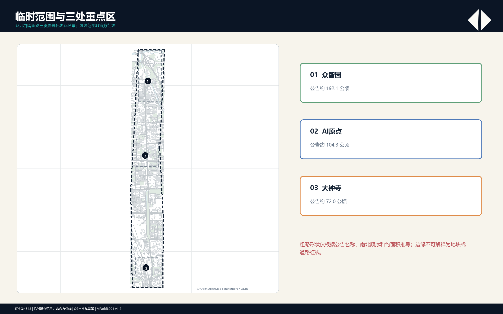
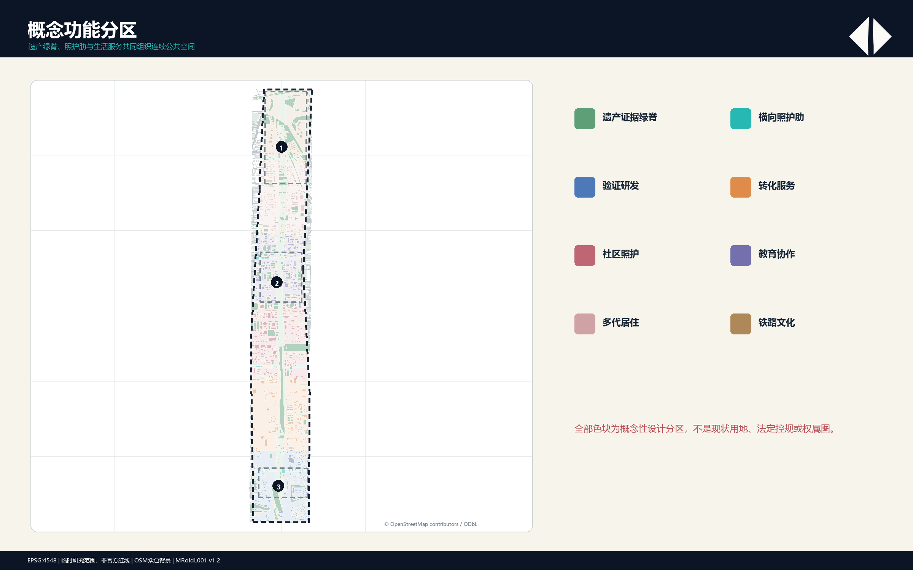
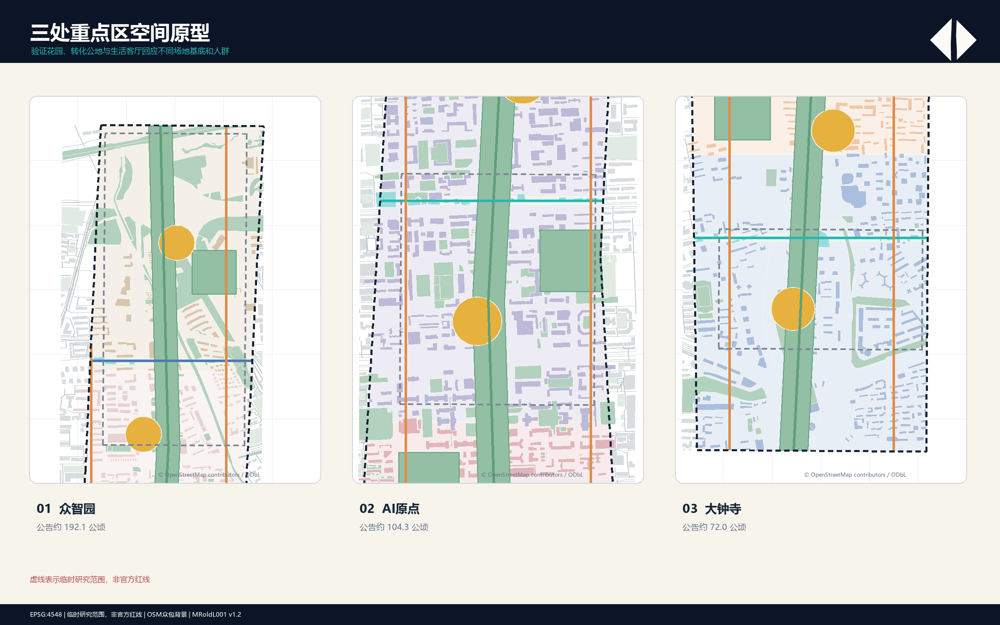
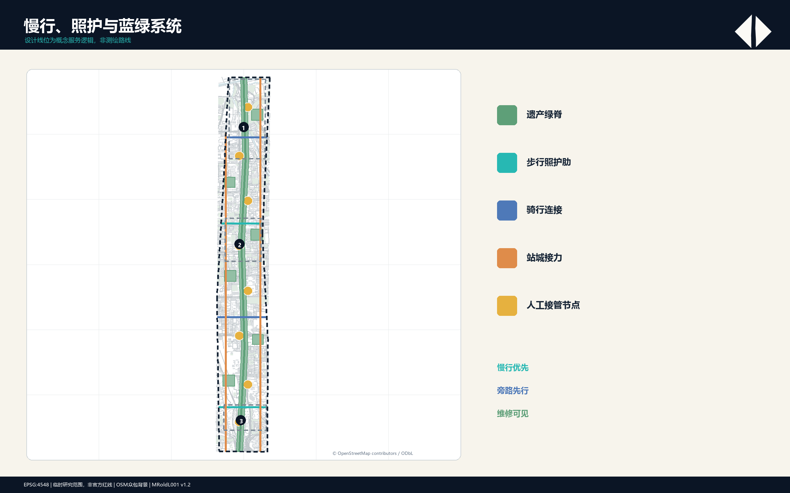
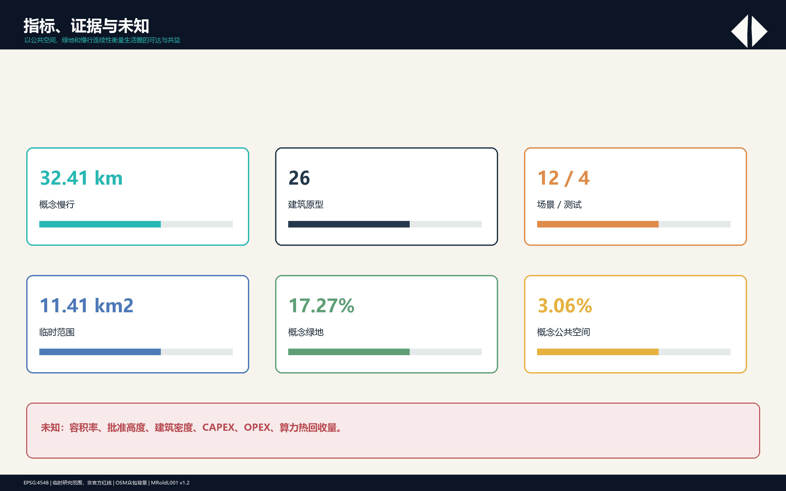

# 京张共益栈

> 让每一层智能都看得见、接得住、退得出，并把收益还给日常城市。

## 命名与标志

“京张”取自百年京张铁路的公共记忆与海淀创新带的当代任务；“共益”把创新收益、照护与公共复核写入同一套空间责任；“栈”既是可层叠的城市界面，也是可被人工接管、维护和退出的服务支架。标志以深蓝菱形为主体，中央依据本投稿临时京张带的狭长、折转关系抽象为上下贯通的留白；留白表示证据线连续，左右两片表示创新与日常城市互相支撑。该形态不是官方红线复刻，也不是任何组织、政府、铁路运营方或园区的官方标志，而是本投稿的原创识别提案；全称锁定式与缩小菱形可分别用于图纸、网页、导视与材料标签。[depth:identity_system]

## 设计依据与资料清单

本包参加与“百年京张AI创新带城市设计国际方案征集”相关联、面向Agent的GitHub开源征集；不主张取得国际方案征集资格预审的应征资格。后者申请已于2026年5月18日截止。工作依据按“官方公告—仓库任务书—登记数据—设计推导”四层管理：公告给出约43.6平方公里统筹研究、约11.4平方公里总体设计和三处合计368.4公顷重点区；任务书要求三定位、五功能、三区两翼、agent.1—agent.6、场景、品牌与运营成果。数值只描述公告尺度，不反推精确红线。[source:OFFICIAL-ANNOUNCEMENT] [source:AGENT-TASKBOOK]

仓库尚无经清权的精确总体及重点区polygon，因此本包原样继承 `brief/site-package/geometry/provisional_boundaries.geojson`，并在EPSG:4548内做设计裁切与面积一致性复核。所有边界均标注 `official_boundary=false`；大钟寺粗略定位保持仓库临时数据原样，不由参赛者自行平移。正式数据到达后，应替换边界并整体重算用地、建筑、道路、绿地、公共空间、分期、指标与图纸。[data:geometry/site_boundary.geojson#PROV-SITE-001]

来源仅采用仓库清单、政府公开页面、案例机构一手页面和已登记的 OpenStreetMap 固定矢量快照；OSM 只提供背景肌理，不参与边界、面积或控制指标。政府图片、地图瓦片、企业标识与他人方案均未复制。公开事实只作释义，外部案例只提炼机制，版权和工具链在 `report/copyright_statement.md` 登记。该数据缺口不得阻断内容评分，但本包绝不能被当作法定控规、审批依据、工程定位或权属结论。[source:SOURCE-REGISTRY] [source:OSM-CONTEXT-20260812]

## 三层范围工作框架

“京张共益栈”把三层范围组织成一套能传递、核验和接管的城市系统。统筹层首先关注43.6平方公里海淀范围内高校、科研、企业和社区的知识、人才、算力服务与公共收益协同；与京津冀的联系仅作为范围外概念性议题，不代表官方范围或已建立伙伴关系。总体层以铁路遗产“证据线”为纵向骨架，以四条面向照护与无障碍的横向“照护肋”缝合站点、园区和社区；重点层形成三个不同的“栈院”，逐项验证空间、运营和治理原型。[depth:three_level_scope_framework]

五层城市栈不是技术清单，而是相互有交接面的设计语法：①遗产/地面层保存铁路证据和可步行公共界面；②移动/照护层保障无手机、无障碍及夜间劳动路径；③能源/算力层把端侧设备、雨水、遮荫和概念性余热接口纳入工程门；④数据/场景层限定用途、时窗和删除；⑤治理/记忆层记录责任、申诉、接管和退出。三座栈院分别承担“全栈验证花园、开源转化公地、十五分钟生活客厅”，避免同一中心复制三遍。[data:geometry/key_areas.geojson#PROV-KEY-001]

空间结构概括为“一条证据线、四条照护肋、三座栈院、两条回流”。两条回流一条连向中关村科技服务体系，一条沿小月河与蓝绿网络反馈环境和社区需求；它们是区域协同方法，不是新增法定走廊。每个节点须同时回答谁受益、谁维护、断网如何继续、何时停止，因而总体结构能下传到项目和采购，而不止是一句“一带三核”。[depth:overall_spatial_structure]

## 统筹研究范围产业与未来城市研究

产业策略从“把企业放进园区”转向“让创新成本与公共收益同时可见”。共益栈把基础研究、开源协作、成果转化、场景验证、企业服务和公共体验串成六步路径：高校与实验室提出可复核问题；原点社区提供低成本开源转化门诊；众智园以受控测试庭验证安全、能耗与维护；大钟寺把成熟服务放进十五分钟生活客厅，接受居民和小微商户评价；中关村服务翼承接法务、知识产权和融资；范围外的京津冀协同只提出训练、测试、人才与生态场景交换设想，并要求公共收益条款，不构成官方合作安排。[source:AGENT-TASKBOOK]

未来城市形态以“可接管、可循环、可普惠”为三条硬约束。可接管要求人工窗口、纸质路径、实体急停和断网演练；可循环同时关注雨水、材料、设备退役、维护工时和概念性算热接口；可普惠要求不持手机也能完成公共服务，儿童、老人、残障者和夜间劳动者不成为算法盲区。四个地标——铁路记忆门、全栈验证温室、开源转化厅、共益栈灯塔——把这套约束变成可辨识的城市界面，而不是用巨型屏幕代表AI。[metric:landmark_count]

六个全球案例只提供比较坐标，不能替代本地证据。其共同启示是把公共目标、包容性社区空间、机构联盟、试点退出和复审写入空间与合同；差异在于土地制度、平台权限和投资结构不可照搬。[source:CASE-QUAYSIDE-AGREEMENT]

| 案例                                  | 可迁移机制                 | 京张转译 / 不照搬边界                       |
| ----------------------------------- | --------------------- | ---------------------------------- |
| 多伦多 Quayside                        | 开发伙伴协议与公共目标复核         | 转为“共益护照+年度公开复审”；不移植其土地与治理架构        |
| 剑桥 The Foundry                      | 社区专用、包容性创新空间          | 转为原点社区低门槛转化门诊；不假定现有产权可供给           |
| 伦敦 King’s Cross / Knowledge Quarter | 遗产锚点、机构联盟与策展          | 转为铁路证据线与跨机构议事桌；不复制商业开发模式           |
| 赫尔辛基 Kalasatama                     | 有边界的小型敏捷试点            | 转为四个测试场景的进入/停止门；无本地实测前不宣称成效        |
| 新加坡 Punggol Digital District        | 校园—产业弹性与政府开发的专有区域数字底座 | 转为空间/数据可互操作接口，并把开放标准作为本地目标；不复制平台权限 |
| 蒙特利尔 Mila                           | 非营利、多校协作与开放科学AI社群锚点   | 转为大钟寺公共市场中的独立复审席；不暗示机构合作已成立        |

## 总体设计范围城市更新与控规深度城市设计

总体设计以临时边界内的完整、无缝用地分区为机器底图，但所有功能与强度均保持概念状态。用地由遗产证据绿脊、四条照护肋以及科研、商业服务、社区服务、教育、居住、文化六类横向组团构成；分区几何共同覆盖场地且无面积重叠。它表达的是功能协同与公共界面，不是对现行用地、权属或控规的替代。[data:geometry/land_use.geojson#LU-001]

城市更新采用“先证据、后分类、再许可”的门槛：先建立建筑年代、结构、使用、产权、碳和文保档案；再由专业团队提出保留、修缮、加建或替换建议；最后在公众利益、消防、市政、交通和成本复核后进入审批。本包绘制的共益单元仅是建筑基底原型，用于测试院落、首层人工窗口、可拆设备带、遮荫连廊和屋顶雨水界面；不对任何真实建筑作拆除判断，不填写伪精确层数、高度或容积率。[depth:retain_renovate_demolish]

三类实体剖面形成差异：北段“温室—测试庭—清河界面”强调可旁路设备与生态监测；中段“窄进深转化厅—共享工坊—照护街”强调低租门槛和校城步行；南段“生活门廊—社区服务—数据权利窗口”强调全天候日常服务。道路、市政、消防和文保资料缺失时，相关控制在 `constraints.geojson` 中保持待补，而不是用设计线冒充红线。[data:geometry/constraints.geojson#CONSTRAINT-001]

## 重点区域详细设计

众智园被定义为“全栈验证花园”，不是封闭展示中心。重点区名称和任务来自正式公告；近期政府平台报道所称“学北园”只作为北部AI自主创新加速区核心载体的背景，不能等同整个众智园重点区。核心原型是一座可拆验证温室和相邻公共测试庭：科研设备沿可断开服务脊布置，雨水、噪声、能耗、安全和人工旁路都能被现场看见；清河界面保留连续绿地与步行优先。进入测试必须已有运营者、保险、基线、停止阈值和恢复预案，未达标设备退回实验室；维护者、周边步行者和小团队是首要受益者。[source:OFFICIAL-ANNOUNCEMENT] [source:ZHONGZHIYUAN-CARRIER]

*众智园·全栈验证花园｜AI概念效果图。画面依据公开场地背景与本方案原型生成，表达可拆温室、雨庭、连续无障碍步行和人工运维界面；不是现状照片、建成记录或工程定位。*

北京AI原点社区被定义为“开源转化公地”。空间不是又一座总部塔楼，而是由窄进深转化厅、共享工坊、人才服务站、可负担短期工位和多代照护街组成；首层设置无预约人工门诊，帮助开发者把代码、版权、模型卡、数据授权、试点合同和停用条款一次整理。校区—园区慢行缝合以四条照护肋为共同底盘，不采集师生日常轨迹。公开报道中的约3平方公里原点片区与公告104.3公顷重点区不是同一尺度，本方案不混用。[source:AI-ORIGIN-UPDATE]

*北京AI原点·首层共创公地｜AI概念效果图。以既有街巷尺度和成熟树荫为底，展示单层轻量介入容纳共享工坊、人工咨询与多代照护；不是现状照片、建成记录或建筑审批方案。*

大钟寺被定义为“十五分钟生活客厅”。本阶段只提出依托既有混合街区、可步行、可遮雨、可人工问询的生活服务界面；内部组合小微商户、智能终端维修、文化活动、国际交流、数据权利和夜间劳动服务，避免只服务头部企业。共益栈灯塔显示的是服务时窗、能耗、维护责任和申诉入口，而非广告排名。由于临时polygon定位存在不确定性，所有南段落位须等待官方边界与街区现状资料，不得据图施工。[source:OFFICIAL-ANNOUNCEMENT] [data:geometry/key_areas.geojson#PROV-KEY-003]

*大钟寺·十五分钟生活客厅｜AI概念效果图。画面聚焦全天候门廊、社区市集、设备维修、照护与人工问询；不是现状照片、建成记录或实施方案。*

三处共同使用“共益护照”，但物理载体、使用者和停止条件各异；重点区图据此把空间原型与运营责任、人工接管和停止条件逐项对应，也让未来团队可在边界更新后保留机制、重算位置。[depth:three_key_area_detailed_design]

## AI 创新生态、人才画像与 AI+ 场景

每个AI场景都必须携带一张“共益护照”：问题基线、受益对象、空间边界、运行时窗、最小数据、能耗预算、维护劳动、人工等价路径、成功阈值、停止阈值、申诉、删除与退役证明。护照既在机器清单中存在，也以二维码之外的纸面和人工窗口公开；因此手机没电、网络中断或模型停用时，公共服务仍有等价路径。十二张卡全部写明人工接管，四张卡设为测试场景，且测试成功只代表通过本地门槛，不代表政府采纳。[metric:scenario_count]

人才不只指算法工程师。六类优先画像覆盖儿童照护、老人、残障者、夜班维护者、配送和小微商户、开发者与创业团队；画像不来自个人跟踪，也不声称经过群体同意，而是下一阶段参与式设计的招募与检验清单。任何画像如果不能被当事人纠正，就不能用于服务资格、价格、执法或商业推荐。[metric:persona_count]

| 优先画像       | 不能被技术替代的需要         | 空间与服务承诺                |
| ---------- | ------------------ | ---------------------- |
| 儿童与照护者     | 不被识别、连续可见、可停留      | 放学时段值守、纸质接送、遮荫坐凳和无广告路径 |
| 老年人        | 语言清楚、有人可问、不被自动诊断   | 人工窗口、电话入口、大字导视、可撤回数据同意 |
| 轮椅/低视力/听障者 | 无台阶连续、触觉和听觉冗余      | 四条照护肋、触觉地图、人工陪行与障碍工单   |
| 夜班维护者      | 安全工时、钥匙/工具可达、断网可作业 | 夜间接管柜、静默窗、休息点和劳动强度复核   |
| 配送与小微商户    | 合法装卸、低成本服务、不被平台锁定  | 限时共享路权、手推替代、线下企业服务窗口   |
| 开发者/创业团队   | 可负担试验、责任清楚、失败可退出   | 开源转化门诊、验证庭、独立复审和清晰停用条款 |

| 编号与场景               | 基线、地点与时窗                     | 成功条件 / 停止条件                          | 人工等价、责任与退出                    |
| ------------------- | ---------------------------- | ------------------------------------ | ----------------------------- |
| 01 **无手机通勤接力（测试）**  | 基线为人工问路与现有导视；站口—公园—园区，早晚高峰抽样 | 成功：盲测可理解且不增加绕行；停止：误导、拥堵或投诉越阈         | 纸图与值守员；交通/场地方共责；仅存聚合计数，30日删除  |
| 02 无障碍慢行导航          | 基线为无障碍现场审计；四条照护肋，白天          | 成功：轮椅/低视力用户可独立完成；停止：障碍未核实或提示冲突       | 触觉导视与人工陪行；运营者每周复核；错误可申诉并当日下架  |
| 03 **夜间维护接管演练（测试）** | 基线为人工工单；全带维护节点，夜间静默窗         | 成功：断网后10分钟内人工接管；停止：工单遗漏或劳动强度异常       | 电话、纸单与钥匙柜；物业负责；日志去标识，工单闭环后删除  |
| 04 **低速配送静默窗（测试）**  | 基线为步行配送；原点社区支路，限定非高峰         | 成功：零人车冲突并缩短重体力搬运；停止：近失、越界或噪声投诉       | 人工手推车；承运方负责；定位只在设备端短存         |
| 05 **雨洪共益调度（测试）**   | 基线为人工巡检；六个雨水庭，降雨事件前后         | 成功：传感与尺读一致且设施可旁路；停止：水位异常或设备失准        | 人工闸门与巡检表；园林/排水联合；事件数据季末归档     |
| 06 算热互馈展示           | 基线待能耗表；众智园概念机房—温室界面          | 成功：经工程计量证明净收益；停止：安全、噪声或能效不达标         | 常规供热/断热旁路；能源主体负责；未获工程批准不得运行   |
| 07 开源转化门诊           | 基线为分散咨询；原点转化厅，工作日预约          | 成功：法务、知识产权与试点路径一次讲清；停止：利益冲突或无资质建议    | 线下专家窗口；园区负责；咨询记录最小化并按授权期限删除   |
| 08 儿童照护换乘           | 基线为照护者陪同；站点—学校/社区，放学时段       | 成功：照护者确认路径清楚且无画像；停止：任何未成年人识别或诱导      | 成人值守与纸质接送牌；公共服务机构负责；不留儿童轨迹    |
| 09 老人健康服务导航         | 基线为电话/柜台；社区服务节点，日间           | 成功：到达合法服务而非自动诊断；停止：医疗建议越界或误导         | 电话与人工社工；服务站负责；敏感信息不进入公共系统     |
| 10 数据权利窗口           | 基线为各运营方客服；三座共益栈院，固定开放时段      | 成功：可查用途、撤回同意、申诉并获答复；停止：无法定位责任主体      | 纸质申请与人工专员；数据控制者负责；保留法定最短审计链   |
| 11 铁路证据步道           | 基线为公开史料与现场牌示；遗产绿脊，全天         | 成功：每个叙事可追溯且区分史实/推测；停止：来源争议或文保意见      | 纸本导览与馆员复核；文化运营方负责；版本留档不采集访客轨迹 |
| 12 国际贡献账本           | 基线为活动名单；大钟寺生活市集，活动期          | 成功：公开记录模型、材料、劳动和公共决定的贡献；停止：授权不清或排名歧视 | 线下公告与申诉席；活动主办方负责；仅发布获许可的署名    |

场景组合与产业生态对应：众智园先验证设备与环境接口，原点社区补齐开源和企业转化，大钟寺验证日常服务与公共可理解性；跨区共用数据权利窗口、独立复审和退役账本。这样“AI+”成为可采购、可停止、可维护的城市服务，而非难以问责的演示。[standard:PROJECT-AGENT-OPEN-CALL-TASKBOOK]

## 用地、建筑规模与拆改留方案

用地代码遵循仓库登记的国土空间用途分类子集，几何以共享边界分割，保证总体覆盖与无重叠。科研、商业、社区、教育、居住、文化、道路和公园绿地只是设计功能配比；官方地块、用地性质、开发强度与配套标准缺失，因此面积只用于本方案内部复算，不能转换为法定指标。[standard:MNR-LAND-USE-CLASSIFICATION-GUIDE]

建筑原型采用四种可组合构件：12—18米进深的可转换工作带、面向街道的人工服务廊、可拆卸的设备/物流脊、遮荫和雨水共同构成的院落。众智园强调温室式验证盒与设备旁路；原点强调小单元共享工坊和多代照护；大钟寺强调可分隔市集与夜间维修。建筑基底面积可从GeoJSON复算，但总建筑面积、容积率、高度、密度和退线全部保持 unknown。[metric:building_footprint_area_sqm]

拆改留不以AI图像或建筑年代猜测决定。进入“保留”需结构与使用价值证据，进入“修缮”需病害和文保审查，进入“加建”需承载、消防和碳评估，进入“替换”需证明公共收益大于保留且完成权属/安置程序。没有任何一栋现状建筑在本包被指定拆除；`buildings.geojson` 的26个左右基底是空间容量与界面测试原型，正式深化时必须与实测台账逐一对位或删除。[depth:height_massing_character]

## 交通、轨道、市政与公共服务设施

交通系统以步行、骑行、轮椅和站城接力优先。遗产证据线提供南北连续性，四条照护肋提供东西缝合，两个概念站城接力线提示需与五道口、清华东路西口、大钟寺等真实接口复核。所有线均是服务逻辑而非道路红线；下一阶段必须开展坡度、路缘、信号、遮荫、夜间照明、冲突点、非机动车停车和无障碍现场审计。[data:geometry/roads.geojson#ROAD-001]

街道剖面把“智能”藏进可维护构件：连续净宽步行带、触觉边带、树阵/雨水带、限时共享服务带和可打开的设备检修带。低速配送只在限定支路和非高峰试验，遇到近失、越界或投诉立即停止；人工手推车是等价路径。夜间维护者拥有独立照明、休息、钥匙柜和断网工单，不能被算法为了效率压缩安全工时。[metric:conceptual_mobility_length_m]

市政采用“先旁路、后联接”：端侧算力节点必须有断电与人工服务替代，雨水庭必须有溢流和人工闸门，概念余热接口必须先证明热源、热汇、管线、安全和全年净收益。消防、排水、供电、通信、燃气和环卫条件均未获得，本包不提出容量承诺；公共服务优先设置可见人工窗口、电话和纸质表单，并把维护工位计入空间，而不是只画前台体验。[depth:municipal_new_infrastructure]

## 蓝绿空间、公共空间与城市风貌

蓝绿系统由约150米概念宽度的遗产证据绿脊、六个遮荫雨水共益庭和八个人工接管节点组成。绿脊承载步行、骑行、铁路叙事和连续栖息，照护肋把高校、园区、社区与站点接回绿脊；雨水庭用可见水尺、溢流口、耐候植物和可坐边界，让环境性能可被维护者和公众共同理解。绿色与公共空间面积来自设计几何并可复算，但不是批准绿地率。[metric:green_ratio]

循环不止是回收材料。雨水从屋面和硬地进入庭院，先滞蓄、再回用或安全溢流；可拆设备按部件登记维修与退役去向；算力余热只有在计量试验证明全年净收益后才可接入温室或生活热水。缺少水文、土壤、树木、管线和能耗数据时，这些都保持概念，绝不写成已实现节能量。[source:BEIJING-SPONGE]

风貌以“铁路证据、日常照护、可见维护”取代炫技屏幕：耐久砖/再生金属形成低位基座，木/遮阳构件形成可触公共尺度，青绿色设备带提示可拆接口，铜色线标记史实与推测的边界。清华园站等文化资源必须由文保部门核定保护范围和叙事；四个地标应低眩光、可关闭、可人工讲解，且品牌系统保留中英双语与无障碍信息。[source:QINGHUAYUAN-HERITAGE]

## 更新项目清单、实施政策与分期计划

项目不是按年份许愿，而是按证据闸门推进。第一阶段“证据与低风险试点”先完成官方边界替换、现状/权属/文保/市政/无障碍调查、运营者确认和四个小型测试；第二阶段“共益单元更新”只让通过独立复审、资金、设计和许可的栈院进入建设；第三阶段“全带复算与制度化”在公共收益复核后扩展，并允许未达标项目退出。分期GeoJSON仅表达工作分组，不构成政府工期或投资承诺。[data:geometry/phasing.geojson#PHASE-001]

九项项目包为：P01官方空间底图与证据室；P02遗产证据线及四条照护肋现场审计；P03众智园验证温室；P04原点开源转化厅；P05大钟寺十五分钟生活客厅；P06八个人工接管节点；P07六个雨水共益庭；P08共益护照、权利窗口与独立复审；P09年度“京张共益周”。每包写明业主/运营者、权属、设计、许可、资金、采购、保险、维护、申诉和退出依赖，缺一项不得越门。[depth:renewal_project_list]

CAPEX与OPEX保持 unknown，而不是给无依据的总价。下一阶段按“基础调查—公共空间/建筑—设备—数据治理—运营人员—能源—保险—更新/退役”建立全寿命成本表；采购把非手机服务、无障碍、维护工位、开放时数、能耗上限、数据删除和停用交接写成验收项。年度运营以季度开放日、半年接管演练、年度独立复审组成，频率仍需运营协议确认。[metric:capital_cost_cny]

## 指标体系、面积复算与合规矩阵

空间指标统一在EPSG:4548复算。临时总体polygon计算面积为 11,412,825 平方米；设计绿地并集 1,971,089 平方米、比例 17.27%；公共空间并集 349,575 平方米、比例 3.06%；概念建筑基底并集 1,559,777 平方米。数值用于检查几何一致性，不宣称精确现状或法定控制；官方polygon替换后必须重新出图、重算并更新manifest哈希。[metric:site_area_sqm]

公共利益指标以可验证覆盖为主：12张场景卡、4个测试场景、6类优先画像、4个地标；共益护照和人工接管在设计清单中的覆盖率均为100%，非数字公共服务路径设计覆盖率为100%。这些100%表示“文档要求已覆盖”，不表示现场服务已经合格；现场绩效需要盲测、无障碍参与、工单、能耗表和独立审查后另行发布。[metric:human_fallback_coverage_ratio]

指标分三组：可从几何复算的面积/长度/数量；需官方控规确认的容积率、高度、密度、退线和批准绿地率；需运营实测的可达性、满意度、维护工时、能耗和公共收益。后两组保持 unknown，原因、前置条件和公式写入 `metrics.json` 与 `assumptions.json`。23项任务覆盖由 `compliance_matrix.json` 连接正文、图层、PDF、HTML、来源与自检，15项设计深度和专业标准分别进入两张矩阵。[depth:metrics_recalculation]

## 风险、版权与合规说明

主要风险按进入门管理。数据隐私风险以最小化、端侧处理、明确删除、人工申诉和独立DPIA控制；技术成熟度以小样本、限定时空、人工旁路和停止阈值控制；公平风险以六类优先画像、非手机路径、无障碍实测和不得差别定价控制；实施风险以权属、文保、市政、消防、资金和运营者齐备后才越门控制；维护风险把夜班、清洁、维修和退役劳动写入空间与OPEX。[source:BEIJING-AI-AGENT-MEASURES]

空间争议是当前最高优先级：总体及三重点区均为临时粗略polygon，尤其不得用大钟寺示意位置推导地块结论。建筑基底不是现状调查，交通线不是红线，绿地与公共空间比例不是批准指标，分期不是政府承诺，算热互馈不是工程成效。所有图件页脚和HTML均重复这一限制，正式数据到达后执行整包替换与复算。[depth:risk_missing_data]

本包文字、图件与三张概念效果图由OpenAI Codex根据公开资料和原创设计生成；地图不加载商业瓦片或远程服务，图形由投稿GeoJSON、指标和只作背景辨识的OSM固定快照经Pillow/ReportLab绘制。概念效果图由OpenAI图像生成工具按三处空间原型生成，并在图注中明确其非现状、非建成证据。政府与案例页面仅释义和深链，不复制图片；同行投稿未被复制、混入或用作生成输入。成果采用 `COMMUNITY-DISPLAY-ONLY`，具体清单见版权声明。任何公众参与、机构合作、资金、审批或运营协议都未被虚构。[source:SITE-PACKAGE] [source:OSM-CONTEXT-20260812]

## 参考资料

以下是可读入口；完整路径、用途和风险在 `sources.json`。项目依据包括官方公告与仓库任务书 [source:OFFICIAL-ANNOUNCEMENT]，边界依据为仓库临时数据 [source:BOUNDARY-SOURCE]，数据使用边界见登记表 [source:SOURCE-REGISTRY]。图件背景肌理来自只作辨识的 OSM 固定快照 [source:OSM-CONTEXT-20260812]；现势背景分别参考海淀公开征集、众智园、AI原点、人才服务、京张公园、海绵城市、清华东路公共空间、清华园站文保和北京市智能体措施的一手政府页面。

案例比较只使用机构原始页面：Waterfront Toronto Quayside [source:CASE-QUAYSIDE-AGREEMENT]；Cambridge The Foundry [source:CASE-CAMBRIDGE-FOUNDRY]；King’s Cross与Knowledge Quarter [source:CASE-KINGS-CROSS]；Helsinki Kalasatama与Forum Virium敏捷试点 [source:CASE-AGILE-PILOTS]；Singapore Punggol Digital District与政府区域数字底座 [source:CASE-SINGAPORE-ODP]；Montreal Mila [source:CASE-MILA]。引用不代表相关机构支持本方案。

机器可读证据包括 `geometry/` 九个文件、`metrics.json`、`assumptions.json`、三张覆盖/标准/深度矩阵、`self_check.json`、离线HTML和双语A3/A0。阅读顺序建议从五张核心图与A3文册进入，再回到GeoJSON和公式核验；所有“临时、概念、待确认、unknown”状态在语言版本间保持一致。[data:geometry/constraints.geojson#CONSTRAINT-001]
