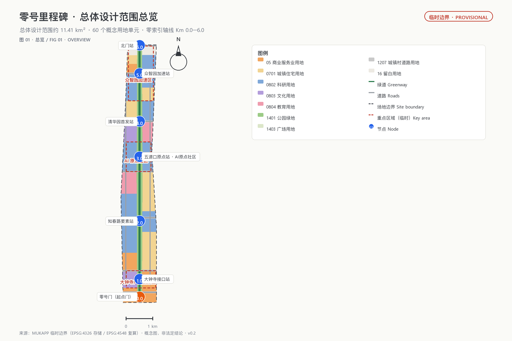
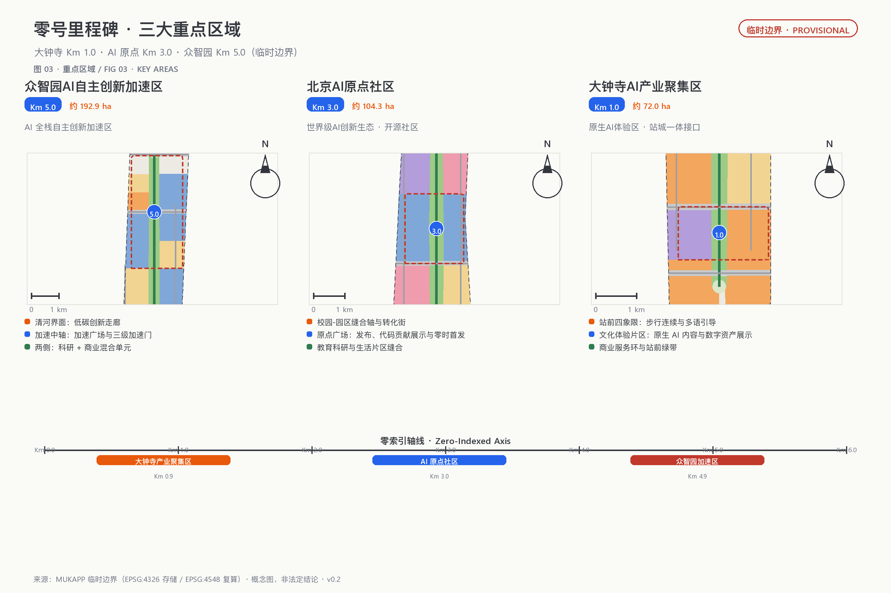
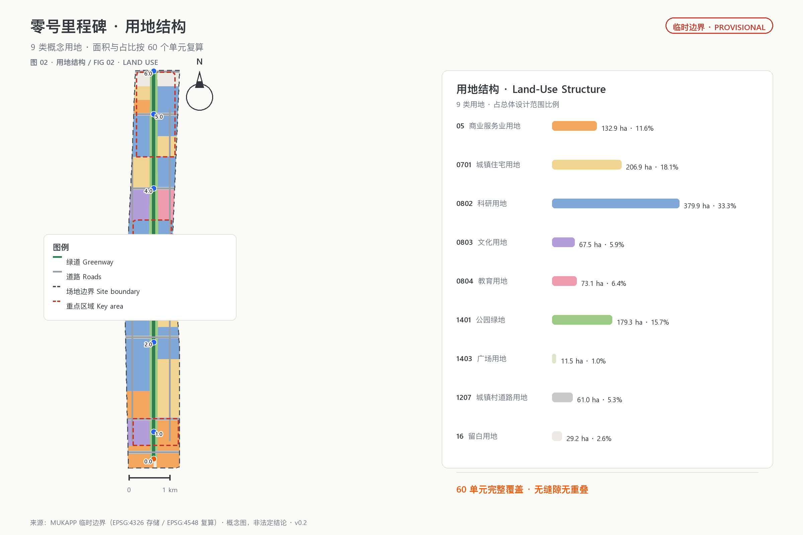
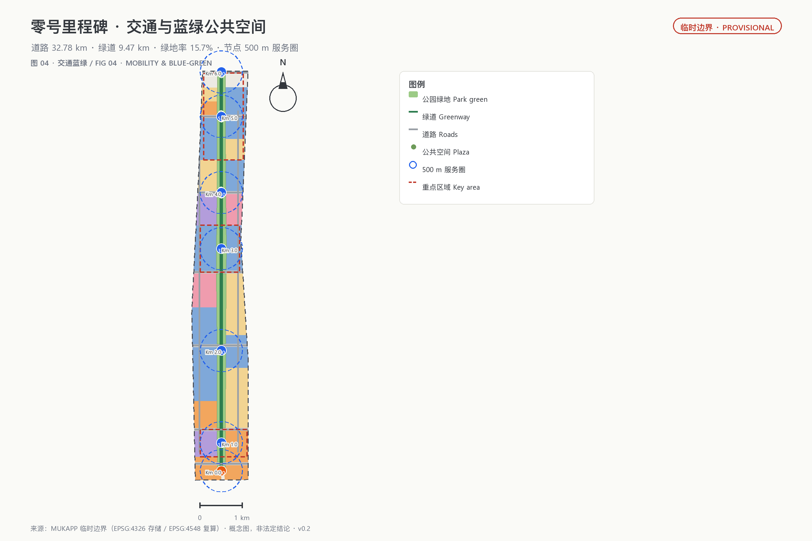
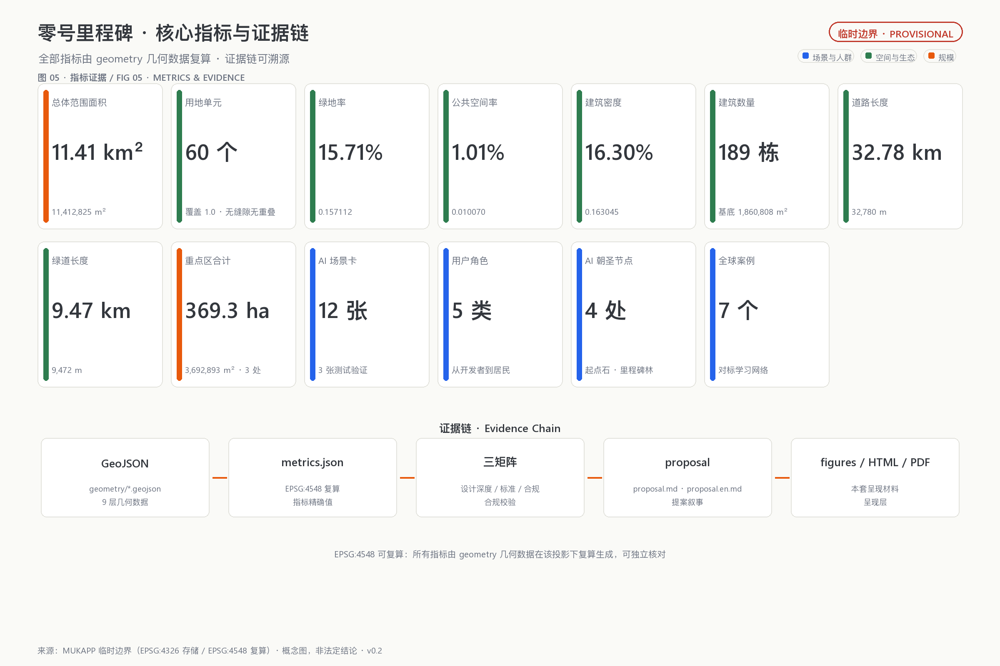

# Zero Milestone: Urban Design for the Jing-Zhang AI Origin Belt

> **ZERO MILESTONE · 京张AI原点带**。The 0 km point of the Jing-Zhang Railway is at Beijing North Station (formerly Xizhimen Station)—the "kilometer zero" of the first trunk railway designed and built independently by Chinese engineers. Programmers count from zero; AI is built on 0s and 1s. This proposal organizes the innovation belt as a **Zero-Indexed Axis**: from Km 0.0 in the south to Km 6.0 in the north, every node is numbered with a dual "railway kilometer post + computer index" language, turning the century-old railway milestone into the public addressing language of the AI era, so that every act of innovation starts again from "kilometer zero."

All spatial, activity, policy, investment, and phasing proposals in this package are **open co-creation concepts, reference schemes, or material for professional teams to deepen**; they do not replace formal planning, do not constitute government-approved conclusions, and imply no parcel-level demolition/renovation, road redline, or engineering implementation decisions [source:AGENT-TASKBOOK]. Because official `SITE_BOUNDARY` and `KEY_AREA` polygons are not yet available, this proposal is generated from the repository-maintainer-registered provisional boundary; all geometry is `official_boundary=false`, `geometry_role=provisional_constraint`, usable only for generation, display, discussion, and in-package self-check [source:BOUNDARY-SOURCE] [source:KEY-AREA-SOURCE]. When official polygons are released, the site boundary, key areas, land use, buildings, roads, green/public space, phasing, metrics, figures, HTML, and PDFs must be regenerated in sequence.

> **Executive summary (seven lines)**
> 1. Core proposition: the railway's 0 km and programmers' zero-indexing are the same story—every technological revolution restarts counting at zero; the belt therefore becomes a Zero-Indexed Axis.
> 2. Spatial response: one axis, seven nodes, three areas and two wings; the three key areas become the Interface (Dazhongsi), Origin (Wudaokou), and Acceleration (Zhongzhiyuan) segments.
> 3. Cultural anchors: Km 0.0 Gateway, Km 3.0 AI Origin Stone, Km 4.0 Qinghuayuan First Platform, and the Agent Milestone Grove—directly echoing the organizer's own "Milestone" commemoration system.
> 4. Implementation start: phase one focuses on the Km 3-4 Origin-Qinghuayuan core and the zero-index wayfinding system, then expands north and south.
> 5. Public value: zero-barrier experience (usable without any app), no-AI equivalent service guarantee, and appeal/rollback at every node.
> 6. Evidence status: all geometry is provisional; spatial metrics are reproducible from in-package geometry in EPSG:4548 to the same digit.
> 7. Decision boundary: all spatial and operational proposals are concepts, not statutory planning or government-approved conclusions.

## 1. Design Basis and Source List

This formal proposal takes the Announcement on International Solicitation for Urban Design of the Centennial Jing-Zhang AI Innovation Belt, issued by the Haidian Branch of the Beijing Municipal Commission of Planning and Natural Resources, as its primary basis [standard:PROJECT-OFFICIAL-ANNOUNCEMENT] [source:OFFICIAL-ANNOUNCEMENT], and the Agent Open Call Taskbook as its secondary basis [standard:PROJECT-AGENT-OPEN-CALL-TASKBOOK] [source:AGENT-TASKBOOK], with the machine-readable design brief, allowed design space, source list, enums, planning limits, standard snapshots, and schemas under `brief/site-package/` as the working basis [source:SITE-PACKAGE]. The public source registry `data/source_registry.json` distinguishes formal-ready, background-only, and provisional-only material [source:SOURCE-REGISTRY]; the processed fact pack `data/processed/agent_fact_pack.md` is only a reading aid, not an additional authority [source:PROCESSED-FACT-PACK].

Following the registry's use boundaries, this proposal uses only the official announcement, the cleared taskbook, the repository-registered standard snapshots, and the provisional boundary as evidence; it uses no non-public maps, internal tables, uncleared images, or fabricated official endorsements. The announcement requires regulatory-plan-level urban design depth and detailed-design depth for the key areas [standard:MOHURD-CONTROL-DETAILED-PLANNING]; land use follows the national territorial land-use classification [standard:MNR-LAND-USE-CLASSIFICATION-GUIDE]; urban design coordination follows the Urban Design Administration Measures [standard:MOHURD-URBAN-DESIGN-MEASURES]. The architecture design-depth standard is registered only as a pending reference because its official text is not yet in the repository and is not treated as a satisfied authority [standard:MOHURD-ARCH-DESIGN-DEPTH-2016].

The package's authority order is: GeoJSON → metrics → the three matrices → manifest/sources/assumptions/self_check → proposal.md → figures → HTML → PDF. `proposal.md` is the only primary human-readable proposal; every spatial judgment in the text traces back to layers, metrics, and sources: the boundary is [data:geometry/site_boundary.geojson#SITE-001], the key areas are [data:geometry/key_areas.geojson#PROV-KEY-001] through [data:geometry/key_areas.geojson#PROV-KEY-003], area recomputation is [metric:site_area_sqm] and [metric:key_area_count], and task coverage is in `compliance_matrix.json` [depth:existing_conditions_diagnosis] [depth:risk_missing_data].

## 2. Three-Level Scope Framework

All three scope levels share the same "zero-index" language: the **coordinated research area** answers "where is the origin and how does innovation relay," the **overall design area** answers "how does the Zero-Indexed Axis land on the map," and the **key areas** answer "how do the three nodes reach detailed-design depth." Kilometer posts count from zero, turning the cascade from industrial strategy to block design into an addressable, numbered, traceable axis [source:AGENT-TASKBOOK].

| Level | Design question | Zero-index landing | Proposal answer | Data anchor |
| --- | --- | --- | --- | --- |
| Coordinated research area (~43.6 km²) | How to organize the AI industry ecosystem and future urban form | An innovation relay chain: origin (0) → validation → open source → experience → governance | Three-areas-two-wings loop and global AI event system | `compliance_matrix.json`, `standard_matrix.json` [depth:three_level_scope_framework] |
| Overall design area (~11.4 km²) | How to map industry space, urban renewal, transport, and character | One axis, seven nodes, two wings, three bands; nodes numbered Km 0.0-Km 6.0 | Land use, buildings, roads, green, public space, and phasing layers | [data:geometry/land_use.geojson#LU-001], [data:geometry/roads.geojson#RD-GREENWAY] [depth:overall_spatial_structure] |
| Key areas (~368.4 ha) | How the three areas reach detailed-design depth | Three node stations: Interface / Origin / Acceleration | Positioning, spatial moves, AI scenarios, and implementation dependencies per area | [data:geometry/key_areas.geojson#PROV-KEY-001], [data:geometry/key_areas.geojson#PROV-KEY-002], [data:geometry/key_areas.geojson#PROV-KEY-003] |

The boundary and key areas are currently provisional: `geometry/site_boundary.geojson` comes from the maintainer-registered rough polygon, with the announced text limits of North Fifth Ring Road, Xueyuan Road/Xitucheng Road, Xizhimen Outer Street, and Dazhongsi East Road/Hekui Road [source:BOUNDARY-SOURCE]; the three key areas are also temporary position proxies [source:KEY-AREA-SOURCE]. The provisional area recomputes to [metric:site_area_sqm]; this only checks in-package consistency and does not replace the announced approximate values or official polygons. Provisional boundaries must not be used as official redlines, approval, ownership, expropriation, or precise-area bases. Two known spatial uncertainties are registered: the provisional Dazhongsi polygon's centroid is about 2.26 km from the real Dazhongsi station (Issue #1029), and the OSM-mapped heritage park is about 412.5 m from the provisional overall-design polygon (Issue #846); both affect only the precision of temporary positioning, not the structural logic of the Zero-Indexed Axis, and a full package recalculation is required when official polygons arrive [depth:metrics_recalculation].

## 3. Coordinated Research Area: Industry and Future City Research

### Naming, Logo, and the Three-Areas-Two-Wings Loop

The primary name is "**零号里程碑**" (Zero Milestone, ZM), with the subtitle "京张AI原点带 / Jing-Zhang AI Origin Belt." The naming logic rests on a dual origin: the Jing-Zhang Railway's 0 km point at Beijing North Station (formerly Xizhimen Station) is the "kilometer zero" of China's independently built railways; programmers index arrays from zero, and AI is built on 0s and 1s. Organizing the belt as a sequence of nodes numbered from zero merges the railway's milestone language with computing's zero-indexing into one public addressing system—every node has a Km number, every public space has an index address [source:AGENT-TASKBOOK] [standard:PROJECT-AGENT-OPEN-CALL-TASKBOOK].

The naming system has four element families:

- **Km nodes (index stations)**: Km 0.0 Gateway → Km 1.0 Dazhongsi Interface Station → Km 2.0 Zhichunlu Factor Station → Km 3.0 Wudaokou Origin Station → Km 4.0 Qinghuayuan First Platform → Km 5.0 Zhongzhiyuan Acceleration Station → Km 6.0 North Gate; numbers are addresses, wayfinding is indexing.
- **Two wings (branches)**: the Zhongguancun Technology Service Wing = "zero-cost factor wing" (capital, IP, compute, data, compliance interfaces); the Xiaoyuehe Scenario Empowerment Wing = "zero-barrier scenario wing" (scenario sandboxes, public experience, daily services).
- **Milestones (landmarks)**: the 0 Milestone, the AI Origin Stone, the Qinghuayuan First Platform, and the Agent Milestone Grove—a "milestone lineage" that can grow year by year.
- **Zero Hour (events)**: the annual "Zero Hour · Global AI Release Week" and other operating brands.

The Logo direction is "a 0|1 milestone standing on rail sleepers": the front face carries the railway's 0 km scale, the back carries binary 0 and 1, and the base's two sleeper lines symbolize the historical gauge of the Jing-Zhang Railway and China's independent innovation. Zero simultaneously stands for the railway's 0 km, AI's 0/1, and programmers' zero-indexing. The VI palette uses Jing-Zhang iron gray (heritage), Haidian blue (innovation), and signal orange (future-facing vitality), with high-contrast, tactile, and bilingual versions; no corporate trademarks, portraits, existing railway marks, or unauthorized fonts are used [standard:PROJECT-AGENT-OPEN-CALL-TASKBOOK].

The three positioning statements translate into three bands: the Centennial Jing-Zhang Culture Band = **the Zero Timeline** (heritage narrative counting from the 0 km of 1905); the Urban AI Life Experience Band = **the Zero-Barrier Experience Band** (no app, no account, no-AI equivalent guarantee); the AI Convergence Innovation Band = **the Zero-to-One Innovation Band** (the idea 0 → product 1 metaphor). The five functions land as: Zhongzhiyuan's full-stack self-reliance and governance validation (Acceleration home), AI Origin's world-class ecosystem and open-source system (Origin home), Dazhongsi and Xiaoyuehe's AI+ scenarios and native-AI consumption (Interface and scenario wing), the whole axis's intelligent vital AI city, and the Zhongguancun wing's global factor allocation. The three areas are not islands: public problems travel north into R&D validation, failures and improvement feedback return south to urban life, and the two wings supply factors and scenarios—a closed loop [source:AGENT-TASKBOOK].

### Seven Global Mechanism Case Studies

This proposal borrows mechanisms only; it does not transplant images or claim endorsement by any case party:

| Case | Transferable mechanism | Zero Milestone landing |
| --- | --- | --- |
| Stanford Research Park (campus-industry-city symbiosis) | University origination, enterprise conversion, block symbiosis | AI Origin Community's campus-park stitching axis and conversion street [source:CASE-STANFORD-RP] |
| one-north, Singapore | Mixed research-industry-living ecosystem units | Zhongzhiyuan's mixed research-commercial-green units [source:CASE-SG-ONENORTH] |
| Marunouchi, Tokyo (station-city integration) | Station-hub and business-district integrated renewal | Dazhongsi four-quadrant pedestrian connectivity and business frontage [source:CASE-TOKYO-MARUNOUCHI] |
| Xili International Science & Education City, Shenzhen | Campus-park-community tri-integration | Education-research stitching at the Origin and Qinghuayuan segments [source:CASE-SZ-XILI] |
| King's Cross, London | Railway-heritage renewal and public-space operation | Long-term operation of the heritage park green belt and node plazas [source:CASE-LONDON-KX] |
| Kalasatama, Helsinki | Small agile pilots and open public data | Amber time-limited pilots and no-AI equivalent guarantee [source:CASE-HELSINKI-KALA] |
| Hangzhou West Sci-Tech Innovation Corridor | Corridor-style spatial governance and factor organization | Three-areas-two-wings synergy and metric governance of the axis [source:CASE-HZ-WEST] |

The case count is [metric:global_case_study_count]. The ecosystem map consists of eight auditable interfaces: land supplies reversible carriers, space supplies graded boundaries, industry raises real problems, capital funds time-limited prototypes, talent forms cross-disciplinary teams, compute is risk-graded, data is minimized, and scenarios are jointly closed out by users and operators. Every interface names its applicant, maintainer, reviewer, term, exit condition, and public knowledge output; no corporate rosters, investment sums, output values, or policy commitments are fabricated [depth:phasing_implementation].

### Regional Innovation Synergy: Origin Relay

The taskbook requires synergy with the North Campus community, Future Science City, Huairou Science City, the Economic-Technological Development Area, and the Beijing-Tianjin-Hebei region [source:AGENT-TASKBOOK]. This proposal organizes that synergy as an **Origin Relay** (concept): Future Science City and Huairou Science City carry basic research and source innovation as the "origin end"; within the belt, Zhongzhiyuan completes full-stack validation (acceleration end), AI Origin completes open-source conversion (origin end), and Dazhongsi completes experience and consumption amplification (interface end); the Economic-Technological Development Area and the Beijing-Tianjin-Hebei urban cluster receive manufacturing and scale landing as the "amplification end"; the North Campus community serves as the belt's living support and talent transfer node. The relay rule follows the zero-index language: before a result "restarts counting at zero" at a downstream node, it must be validated and rights-cleared at the upstream node; failed pilots roll back in place and transfer no risk downstream. Regional synergy expresses only mechanism directions and constitutes no cross-regional investment, policy, or implementation commitments.

### Planning Innovation: The Addressable City

The taskbook's planning-innovation dimension asks for valuable ideas on comprehensive planning, spatial-industrial integration, and territorial spatial planning innovation [source:AGENT-TASKBOOK]. This proposal's answer: organize urban public space as an **addressable data structure**—every node has a Km index, a state (0 = pending, 1 = running, -1 = rolled back), an accountable party, and a lifecycle. Planning deliverables evolve from static atlases into recomputable data packages (GeoJSON → metrics → three matrices → readable text), where every number traces to geometry, formulas, and assumptions; design conclusions (concept layer) and statutory controls (regulatory-plan layer) remain in separate columns, statutory indicators without evidence stay unknown, and official data triggers a full-package recalculation when it arrives. This is not a digital-twin real-time mirror but a recomputable, auditable planning method [depth:metrics_recalculation].

## 4. Overall Design Area: Urban Renewal and Regulatory-Plan-Level Urban Design

The overall design area (~11.4 km²) is organized around the **Zero-Indexed Axis** as its backbone: a green belt about 150-200 m wide runs along the heritage park line, with "research and education west, residential and commercial east, functions gathered at nodes" on both sides, forming a one-axis-seven-nodes, three-bands-two-wings structure [data:geometry/land_use.geojson#LU-001]. Sixty shared-boundary land-use units fully cover the provisional site (in-package recomputed coverage 100%, unit count [metric:land_use_count]) in national land-use codes: research (0802) concentrates around Zhongzhiyuan and the Origin (~3.799 million m² [metric:land_use_0802_sqm]), commercial services (05) line the gateways and nodes (~1.329 million m²), residential (0701) forms east-west living patches (~2.069 million m² [metric:land_use_0701_sqm]), cultural (0803) anchors Dazhongsi and Qinghuayuan (~0.675 million m² [metric:land_use_0803_sqm]), education (0804) serves the mid-belt university strip (~0.731 million m² [metric:land_use_0804_sqm]), and reserve (16) keeps north and south gateway flexibility (~0.292 million m² [metric:land_use_16_sqm]). This zoning validates functional mix, continuous open space, and topology; it does not represent existing or statutory land use and must be rebuilt when official parcels and regulatory conditions arrive.

Renewal follows a "**time-limited pilot—annual review—expand or roll back**" method: green services open directly and accept appeals; amber pilots carry terms, evaluation, and human review; red pilots are evaluated, remediated, or retired, with removable equipment and reversible data [depth:retain_renovate_demolish]. The 189 conceptual building footprints total about 1.861 million m², a building density of about 0.16 [metric:building_footprint_area_sqm] [metric:building_density]; they only test spatial capacity and industry-space supply logic, do not represent real buildings, and imply no building-level retain/renovate/demolish conclusions [data:geometry/buildings.geojson#BLDG-001]. Building height, gross floor area, FAR, setbacks, and density controls lack official basis and remain unknown [metric:floor_area_ratio] [metric:building_height_max_m]; this proposal offers only a character method: open ground floors, low information planes, removable components, and continuous eaves along the axis, avoiding towers, giant screens, or imitation heritage elements as substitutes for publicness. Precise height, massing, roof, color, and frontage require professional deepening under official regulatory and heritage materials [depth:height_massing_character] [standard:MOHURD-CONTROL-DETAILED-PLANNING].

Municipal and new infrastructure follows "maintainable, disconnectable, retirable": edge compute and sensing share removable equipment belts, retaining basic lighting, seating, toilets, drinking water, and barrier-free passage; every device has an owner, energy record, offline behavior, human alternative, and retirement date [depth:municipal_new_infrastructure]. Because pipeline, energy, fire, flood, and drainage data are missing, no capacity or engineering alignment conclusions are made.

### Spatial-Industrial Integration: The Index Grid

Industry is not allocated once per parcel but supplied dynamically by **index state**—land use supplies carriers; the state layer decides the mode of supply:

| Land-use code | Industrial role in the index grid | Mode of supply |
| --- | --- | --- |
| Research 0802 | Validation and origination carriers (Zhongzhiyuan Acceleration, Origin open-source blocks) | Long-term stable; test space supplied by term [data:geometry/land_use.geojson#LU-026] |
| Commercial services 05 | Experience and consumption frontages (Dazhongsi station front, node scenario streets) | Green services stable; scenario space rotates with state audits [data:geometry/land_use.geojson#LU-002] |
| Residential 0701 | Daily living (east-west living patches) | Services embedded in communities; no-AI equivalent guarantee [data:geometry/land_use.geojson#LU-006] |
| Education 0804 | Origination and talent (university strip) | Campus-park-city stitching and conversion interfaces [data:geometry/land_use.geojson#LU-013] |
| Park green 1401 | Public interface of the axis (heritage park green belt) | Always open; components removable [data:geometry/green_space.geojson#GREEN-001] |
| Reserve 16 | Flexible carriers with pending state (north and south gateways) | Reserved until state is clear; no preset functions [data:geometry/land_use.geojson#LU-052] |

Three integration rules: first, amber industry space is term-supplied—pilots are evaluated at term end and expand green or turn red, never becoming de facto permanent occupation; second, green service space is stably supplied—public service spatial commitments do not break when operators change; third, red space can be reclaimed and reallocated—retired equipment is removed and the carrier returns to the allocatable pool. Spatial supply follows innovation state rather than a one-time leasing drawing; this mechanism constitutes no leasing, investment, or output commitments [depth:land_use_layout].

## 5. Detailed Design of Key Areas

The three key areas are organized as three node stations sharing a "five-question gate": before any AI scenario enters, it must answer "whom it serves, what data it uses, who reviews it, how failures exit, and what public value remains" [depth:three_key_area_detailed_design]. The in-package recomputed provisional areas are about 1.929 million m² (Zhongzhiyuan), 1.043 million m² (AI Origin), and 0.720 million m² (Dazhongsi), totaling [metric:key_area_total_sqm]—close to the announced ~192.1 / 104.3 / 72.0 ha, indicating plausible magnitudes for the temporary positions; official polygons will supersede them [data:geometry/key_areas.geojson#PROV-KEY-001] through [data:geometry/key_areas.geojson#PROV-KEY-003].

### 5.1 Zhongzhiyuan Acceleration Station｜Km 5.0｜AI Full-Stack Validation Area (~1.929 million m²)

Zhongzhiyuan carries "the AI full-stack self-reliance system and global voice in AI governance" [source:AGENT-TASKBOOK]. Its spatial structure is "Qinghe frontage—acceleration axis—research units": a low-carbon innovation corridor along the Qinghe river [data:geometry/green_space.geojson#GREEN-002] (conceptual position), an acceleration plaza on the axis [data:geometry/public_space.geojson#PUBLIC-006], and research land [data:geometry/land_use.geojson#LU-044] with commercial services [data:geometry/land_use.geojson#LU-046] on both sides. The acceleration gate has three levels: virtual evaluation → controlled laboratory → real-street pilot; every pilot has a term, evaluation, human review, and an exit channel, matching the zero-to-one entrepreneurship metaphor. Buildings are mainly AI R&D and incubators [data:geometry/buildings.geojson#BLDG-001]; conceptual footprints do not represent real buildings. External transport, the Qinghe frontage, and cross-ring-road nodes await road redlines and engineering conditions [depth:traffic_rail_slow_parking]. Implementation risks are mainly missing official polygons, regulatory indicators, and the Qinghe blue line [depth:risk_missing_data].

### 5.2 AI Origin Station｜Km 3.0｜Near-Campus Open-Source Community (~1.043 million m²)

The AI Origin Community carries "the world-class AI innovation ecosystem" and the open-source system [source:AGENT-TASKBOOK]. Its spatial structure is "campus-park stitching axis—Origin Plaza—living patches": the Origin Plaza [data:geometry/public_space.geojson#PUBLIC-004] hosts releases, code contribution displays, and Zero Hour launches; research land [data:geometry/land_use.geojson#LU-028] carries incubation and collaboration, while education land and living patches [data:geometry/land_use.geojson#LU-013] serve talent housing. The near-campus conversion street provides incubation, display, legal, IP, and investment services, emphasizing an "open source first, convert later" mechanism: public knowledge enters the commons, and results return to the community under license. Slow-traffic stitching, station integration, and building retain/renovate/demolish await campus boundaries, ownership, and ground-floor program confirmation.

### 5.3 Dazhongsi Interface Station｜Km 1.0｜Native-AI Experience Area (~0.720 million m²)

Dazhongsi carries "native-AI new business formats," the urban gateway, and international exchange [source:AGENT-TASKBOOK]. Its spatial structure is "station-front four quadrants—cultural experience patch—commercial service ring": the interface plaza [data:geometry/public_space.geojson#PUBLIC-002] provides multilingual guidance, AI rights explanation, and human service; cultural land [data:geometry/land_use.geojson#LU-020] hosts native-AI content and digital-asset displays, commercial land [data:geometry/land_use.geojson#LU-018] carries consumption and business, and the station-front green belt combines planned green space with public activity. Rail integration is proposed only as directional strategy—four-quadrant pedestrian continuity, orderly non-motorized parking, and clear transfers—pending road redlines, ridership, entrances, and municipal data. All experience scenarios hold "optional and exitable" as the floor: basic services remain available without AI, and high-impact judgments return to humans.

## 6. AI Innovation Ecosystem, Personas, and AI+ Scenarios

The AI innovation ecosystem is organized in five stages—origination (0), validation, open source, experience, governance—mapping one-to-one to the three areas and two wings [standard:PROJECT-AGENT-OPEN-CALL-TASKBOOK]. This proposal forms 5 user personas:

| Persona | Typical needs | Spatial response | Self-check boundary |
| --- | --- | --- | --- |
| Open-source developers (zero-index contributors) | Release, collaboration, testing, community reputation | Origin Plaza, public code wall, night collaboration space | No personal behavior tracking; event data aggregated only |
| Startups and research teams | Low-cost offices, compute access, product testbeds | Zhongzhiyuan shared test field, edge compute stations, acceleration gate | Compute and data services require separate authorization |
| Leading enterprises and international visitors | Showcase, business, international reception, hiring | Dazhongsi station-front interface, international roadshow lounge, Zero Hour releases | Enterprise marks and cases must be rights-cleared |
| Neighborhood residents (incl. elderly and children) | Commuting, leisure, community services, low-disruption renewal | Axis slow-traffic loop, embedded community services, no-AI equivalent paths | Resident profiles never used for commercial recommendation |
| University faculty and students | Conversion, cross-campus collaboration, daily walking | Campus-park stitching, conversion street, AI education experience points | Campus data and research results require authorization |

The persona count is [metric:user_persona_count]. There are 12 AI scenario cards (concepts), 3 of which are industry test/validation scenarios [metric:ai_scenario_node_count] [metric:ai_test_scenario_count]:

| No. | Scenario card | Spatial carrier | Scenario type | State |
| --- | --- | --- | --- | --- |
| SC-01 | Open-Source Release Hall | AI Origin Plaza | Community operation | Green |
| SC-02 | Model Evaluation & Red-Team Sandbox | Zhongzhiyuan Acceleration Plaza | **Industry test/validation** | Amber |
| SC-03 | Edge Compute Station | Axis public-service node | New infrastructure | Green/Amber |
| SC-04 | Zero-Barrier Slow-Traffic Navigation | Heritage park greenway [data:geometry/roads.geojson#RD-GREENWAY] | Public service | Green |
| SC-05 | Dazhongsi International Roadshow Lounge | Dazhongsi station-front interface | Industry service | Green |
| SC-06 | Qinghe Low-Carbon Test Interface | Zhongzhiyuan Qinghe frontage | **Industry test/validation** | Amber |
| SC-07 | Zhichunlu Data-Factor Lounge | Zhichunlu Factor Station | Data governance | Amber |
| SC-08 | Origin Co-Translation Court | AI Origin Community | **Industry test/validation** | Amber |
| SC-09 | Community AI Life Demo Street | East-west living patches | Public service | Green |
| SC-10 | Zero Hour · Global Release Route | Axis public-space system | Event operation | Green |
| SC-11 | City-Agent Public Audit Desk | Zhongzhiyuan governance node | Governance | Amber/Red |
| SC-12 | No-AI Equivalent Service Point | Community public-service node | Public guarantee | Green |

Each card states its users, spatial location, operating data, privacy boundary, human review, operator, and risks, and is registered in `compliance_matrix.json` and `visual/index.html`. The table above is the scenario-space-operation mapping: each card pairs a spatial carrier, a state, and operating requirements (term, evaluation, human review, exit channel), addressing the Xiaoyuehe wing's public experience route; the mapping can deepen as official materials arrive. All scenarios are concepts, not approved operations; privacy and data use follow minimization, public sourcing, explainability, and human review [source:AGENT-TASKBOOK]. City agents may assist in identifying slow-traffic gaps, public-space heat, facility maintenance, and event safety risks, but cannot replace planning approval, output unauthorized personal profiles, or claim official implementation commitments.

## 7. Land Use, Building Scale, and Retain-Renovate-Demolish Strategy

The land-use plan follows [standard:MNR-LAND-USE-CLASSIFICATION-GUIDE]: 60 units fully cover the provisional site without gaps or overlaps (in-package recomputed coverage 100%, unit count [metric:land_use_count], covered area [metric:land_use_area_sqm]). The structure is dominated by research (0802, ~3.799 million m² [metric:land_use_0802_sqm]), residential (0701, ~2.069 million m² [metric:land_use_0701_sqm]), and commercial (05, ~1.329 million m² [metric:land_use_05_sqm]), with green (1401) of about 1.793 million m² [metric:green_space_area_sqm] along the Zero-Indexed Axis and reserve (16) of about 0.292 million m² at the gateways.

The 189 conceptual building footprints total about 1.861 million m², a building density of about 0.16 [metric:building_footprint_area_sqm] [metric:building_density]; they only test spatial capacity and industry-space supply logic, do not represent real buildings, and imply no building-level retain/renovate/demolish conclusions [depth:retain_renovate_demolish]. Building programs are mainly AI R&D, offices, incubators, and housing. Statutory indicators—FAR, height, density, setbacks, green ratio—lack official regulatory conditions and remain unknown or pending, without manufactured precision [metric:floor_area_ratio]. Retain/renovate/demolish classification lacks existing-building, age, structure, ownership, and heritage data; this proposal gives no parcel-level conclusions, only the "time-limited pilot—annual review—expand or roll back" judgment framework [depth:development_intensity_controls].

## 8. Transport, Rail, Municipal Infrastructure, and Public Services

The transport plan addresses station integration, street micro-circulation, slow-traffic gaps, parking, and non-motorized organization [depth:traffic_rail_slow_parking]. The conceptual network—transverse arterial bands, east-west longitudinal collectors, and the axis greenway—totals about 32.8 km [metric:road_length_m], of which the greenway is about 9.5 km [metric:greenway_length_m] [data:geometry/roads.geojson#RD-GREENWAY]. Key coverage includes Dazhongsi four-quadrant pedestrian connectivity, Zhichunlu slow-traffic stitching, Wudaokou and Qinghua East Road West slow-traffic mending, and cross-ring-road nodes of the heritage park; all roads are directional strategy pending official road redlines, sections, and intersection channelization [source:BOUNDARY-SOURCE].

Municipal and public services cover innovation service platforms, talent life services, new infrastructure, distributed energy, and edge compute [depth:municipal_new_infrastructure]; missing pipeline, energy, drainage, flood, and fire data are prerequisites for formal deepening [depth:risk_missing_data]. Public services follow a "10-minute node service circle" (concept): every Km node provides public toilets, barrier-free drinking water, AEDs, human service windows, and no-AI equivalent service points so that essential tasks remain possible without smart devices.

## 9. Blue-Green Network, Public Space, and Urban Character

The blue-green network uses the heritage-park Zero-Indexed Axis green belt as its backbone [data:geometry/green_space.geojson#GREEN-001] through [data:geometry/green_space.geojson#GREEN-008], integrating the Qinghe frontage, the Xiaoyuehe direction, and north-south gateway green wedges. The belt simultaneously achieves **east-west stitching and north-south connection**: a continuous slow-traffic and activity corridor runs north-south, while node stitching axes connect campuses, parks, and stations east-west, mending the historic east-west severance left by the railway. The green ratio is about 15.7% [metric:green_ratio]; the seven node plazas total about 0.115 million m² [metric:public_space_area_sqm] [metric:public_space_ratio] [data:geometry/public_space.geojson#PUBLIC-001] through [data:geometry/public_space.geojson#PUBLIC-007], shared with slow traffic, activities, and AI display.

**Public-space component library** (concept): zero-index milestone posts (kilometer post + index + state light), information kiosks, paved index bands, state displays, and barrier-free reading facilities form a combinable kit; components are removable, removable-able, and retirable, returning to a bare state on decommission without irreversible urban traces [depth:blue_green_public_space].

**Honor display system** (concept, echoing the organizer's own "Milestone" commemoration system): the 0 Milestone inscribes the first participating agents and contributors; the AI Origin Stone records open-source contributors and public knowledge; the Agent Milestone Grove adds one milestone each year for the most outstanding annual contributions. Honor displays record public contributions only, carry no commercial naming, and do not conflict with the belt's overall Logo system [source:AGENT-TASKBOOK].

The urban character fuses Jing-Zhang railway history, Zhongguancun innovation culture, and AI new culture into four AI pilgrimage landmarks (concepts) [metric:ai_pilgrimage_landmark_count]:

1. **The 0 Milestone** (Km 0.0, south gateway / Beijing North Station direction): a full-scale railway milestone installation—"Jing-Zhang Railway 0 km · 1905" on one face, binary 0/1 and the AI origin manifesto on the other; both a heritage landmark and a global developer check-in point.
2. **The AI Origin Stone** (Km 3.0, AI Origin Community): an honor node for open-source contributors, inscribing contributors and public knowledge, carrying the "contributions are remembered" principle [source:AGENT-TASKBOOK].
3. **The Qinghuayuan First Platform** (Km 4.0): a "first platform" cultural origin around the Qinghuayuan station heritage resource, hosting the centennial Jing-Zhang narrative and Zhan Tianyou memorial content (conceptual position; heritage scope and construction-control zones await official data).
4. **The Agent Milestone Grove** (along the Zero-Indexed Axis): one milestone per year for outstanding annual contributions—a growing, renewable public commemoration system.

All landmarks, wayfinding, logos, fonts, images, and personal marks are rights-cleared; conceptual landmarks are not presented as approved construction and avoid vulgarization or influencer-style treatment [source:AGENT-TASKBOOK].

## 10. Renewal Projects, Implementation Policy, and Phasing

The implementation plan is expressed in three phases in `geometry/phasing.geojson` [data:geometry/phasing.geojson#PHASE-01] through [data:geometry/phasing.geojson#PHASE-03] [depth:renewal_project_list] [depth:phasing_implementation]:

| No. | Project | Type | Phase | Key dependencies | Evidence |
| --- | --- | --- | --- | --- | --- |
| ZM-01 | Zero-index wayfinding & kilometer-post system | Public space/brand | Near term | Public-space permits, heritage compatibility | [data:geometry/roads.geojson#RD-GREENWAY] |
| ZM-02 | Origin-Qinghuayuan core stitching (Km 3-4) | Urban renewal/slow traffic | Near term | Campus boundary, ownership, heritage scope | [data:geometry/public_space.geojson#PUBLIC-004] |
| ZM-03 | Zhongzhiyuan Qinghe low-carbon frontage | Blue-green/industry display | Near term | Qinghe blue line, flood conditions | [data:geometry/green_space.geojson#GREEN-002] |
| ZM-04 | Dazhongsi four-quadrant pedestrian connectivity | Station integration/slow traffic | Mid term | Station, intersections, municipal pipelines | [data:geometry/public_space.geojson#PUBLIC-002] |
| ZM-05 | Zhichunlu data-factor lounge | Industry service/renewal | Mid term | Land permits, data-compliance framework | [data:geometry/land_use.geojson#LU-026] |
| ZM-06 | Seven node plazas | Public space/brand | Mid term | Land permits, event safety, rights clearance | [data:geometry/public_space.geojson#PUBLIC-001] |
| ZM-07 | Milestone Grove & contribution wall | Honor/public art | Long term | Approvals, heritage, commemoration rules | [data:geometry/phasing.geojson#PHASE-03] |
| ZM-08 | No-AI equivalent service-point network | Public service/new infrastructure | Long term | Energy, operators, human staffing | [data:geometry/constraints.geojson#CONSTRAINT-001] |

### Global AI Event System and Long-Term Operation (concepts)

- **Annual event system**: "**Zero Hour**" as the annual spine—Zero Hour launch (global release at the stroke of New Year midnight), Spring Open-Source Co-creation Week, Summer Controlled-Test Season, Autumn Release Week, and Winter Governance Review Week; Zero Hour is both a temporal symbol (counting from zero) and an event brand [source:AGENT-TASKBOOK].
- **Event brand and communication visual system**: the 0|1 milestone as the visual motif, with bilingual, high-contrast, and tactile versions, distinct from but compatible with the belt's Logo system.
- **Developer community operation**: a five-stage path—"Board at Km 0.0 (Onboarding)—Find Your Index (Locate)—Commit—Release—Rollback"—with clear contribution paths, review gates, and public knowledge outputs.
- **Open scenario operation**: open days, time-limited pilots, public closure, and retirement announcements, alongside the city-agent public audit desk.
- **Public experience and landmark operation**: the 0 Milestone, Origin Stone, First Platform, and Milestone Grove as long-term brand assets with maintenance and retirement mechanisms.
- **International communication and conversion pathway**: the dual-origin narrative of "restarting from kilometer zero" as the city's public discourse to attract global developers, enterprises, and governors; all recruitment, funding, and policy items are concept directions, not commitments.

**Implementers and annual review** (concepts): government and professional teams deepen the statutory and engineering layers; enterprises and universities co-build scenarios and test spaces; residents and developers participate in evaluation through appeals, reviews, and events; maintainers and review teams own the evidence chain and state audits. Annual review indicators are suggested as measurable items—scenario openings, on-time pilot completion rate, appeal response time, rollback execution rate, public-space event counts, and satisfaction sampling; all require operating data for calibration, and this draft provides only the framework without preset targets [depth:renewal_project_list].

## 11. Metrics, Area Recalculation, and Compliance Matrix

The indicator system has three families: spatial metrics (recomputable from submitted geometry), control metrics (requiring official regulatory support), and performance metrics (requiring operating data) [depth:metrics_recalculation]. Spatial metrics retain full recomputed values (e.g., site area 11,412,825.386 m² [metric:site_area_sqm]); decimal places mean "a third party can reproduce the same digit from the same geometry," not that external facts share that precision, and approximate values are never rewritten as false precision:

- **Spatial metrics (areas, known)**: overall-design area [metric:site_area_sqm], key-area total [metric:key_area_total_sqm], land-use coverage [metric:land_use_area_sqm], building footprint [metric:building_footprint_area_sqm];

- **Spatial metrics (ratios and lengths, known)**: building density [metric:building_density], green area and ratio [metric:green_space_area_sqm] [metric:green_ratio], public-space area and ratio [metric:public_space_area_sqm] [metric:public_space_ratio], road and greenway lengths [metric:road_length_m] [metric:greenway_length_m];

- **Spatial metrics (phases, known)**: three phase areas [metric:phase_1_area_sqm] [metric:phase_2_area_sqm] [metric:phase_3_area_sqm];

- **Control metrics (unknown)**: FAR [metric:floor_area_ratio], building height [metric:building_height_max_m], setbacks [metric:setback_m], with reasons registered pending official regulatory conditions;

- **Performance metrics (known counts)**: scenario cards [metric:ai_scenario_node_count], test/validation scenarios [metric:ai_test_scenario_count], personas [metric:user_persona_count], landmarks [metric:ai_pilgrimage_landmark_count], and global cases [metric:global_case_study_count].

`compliance_matrix.json` covers every mandatory task of announcement sections 1.3, 1.4, 1.5 and taskbook agent.1–agent.6, mapping each to report sections, layers, metrics, drawings, HTML pages, sources, assumptions, and self-checks; `standard_matrix.json` covers all mandatory professional standards; `design_depth_matrix.json` marks every required depth item complete. `scripts/spatial_review.py` and `scripts/visual_review.py` results serve as formal self-check evidence, and displayed HTML values stay consistent with the metrics [data:geometry/site_boundary.geojson#SITE-001].

## 12. Risk, Copyright, and Compliance

### Risk matrix

| Risk | This-round handling | Required before deepening | No. |
| --- | --- | --- | --- |
| Missing official boundary and key-area polygons | Provisional boundary used and labeled in text/HTML/matrices; not presented as official | Full-package recalculation after obtaining qualification files or official CAD/GIS | R-01 |
| Provisional Dazhongsi polygon offset (~2.26 km from the real station) | Directional placeholder only; registered in constraints and assumptions (Issue #1029) | Replace and recompute areas with official polygons | R-02 |
| Provisional overall-design polygon does not intersect OSM heritage park (~412.5 m) | Cultural narrative does not depend on the temporary polygon's spatial match (Issue #846) | Recheck green belt and heritage-park relation with official boundary | R-03 |
| Missing regulatory indicators (FAR, height, density, setbacks, green ratio) | Kept unknown with reasons registered | Fill from official regulatory conditions and recompute | R-04 |
| Missing existing buildings, ownership, heritage, municipal data | Retain/renovate/demolish limited to a judgment framework, no parcel conclusions | Deepen after professional site surveys | R-05 |
| External data licensing and reuse terms | Only public/cleared sources used and registered item by item [source:SITE-PACKAGE] | Continuously verify and register changes | R-06 |

### Copyright and compliance

All cited materials come from official public channels, repository-registered standard snapshots, or user-provided cleared materials; all text, geometry, diagrams, PDFs, and static HTML are generated by the declared agent, and `visual/index.html` depends on no remote resources. No images, fonts, trademarks, portraits, or case identities are used without authorization; cases contribute mechanisms only, not images [source:AGENT-TASKBOOK]. This proposal does not claim official approval, approved regulatory plans, final land ownership, final construction scale, or guaranteed implementation. The AI agent is responsible for facts, sources, copyright, spatial data, metrics, and expression; maintainers and professional reviewers may require repair or rejection based on self-check results, spatial review, and the compliance matrix. The detailed asset list and redistribution notes are in `report/copyright_statement.md`. Bilingual terminology follows the event glossary where applicable.

## 13. References

- Haidian Branch, Beijing Municipal Commission of Planning and Natural Resources: Announcement on International Solicitation for Urban Design of the Centennial Jing-Zhang AI Innovation Belt (2026-05-09).
- Agent Open Call Taskbook for the "Centennial Jing-Zhang AI Innovation Belt Urban Design Open Solicitation" (user-provided cleared document, 2026-05-18).
- Ministry of Housing and Urban-Rural Development, PRC: Urban Design Administration Measures (2017).
- Ministry of Housing and Urban-Rural Development, PRC: Measures for Compilation, Review and Approval of Regulatory Detailed Plans for Cities and Towns.
- Ministry of Natural Resources, PRC: Guidelines for Land-Use and Sea-Use Classification in Territorial Spatial Survey, Planning and Use Control (2023-11-22).
- Beijing Municipal Science and Technology Commission & Zhongguancun Administrative Committee: "Three Areas, Two Wings: Building a World-Class AI Cluster" (2026-04-03).
- Haidian District People's Government: "Haidian's '1+X+1' Modern Industrial System" (2026-03-02).
- OpenStreetMap base data and ODbL license notes (background and issue discussion only; not a boundary basis).
- Repository maintainers: Provisional rough polygons for the three scope levels and three key areas (2026-06-05).
- Public case materials: Stanford Research Park, one-north, Marunouchi, Xili, King's Cross, Kalasatama, Hangzhou West Sci-Tech Innovation Corridor (mechanisms only).
- Full machine index: `sources.json`, `metrics.json`, `compliance_matrix.json`, `standard_matrix.json`, and `design_depth_matrix.json`. [source:SOURCE-REGISTRY]
