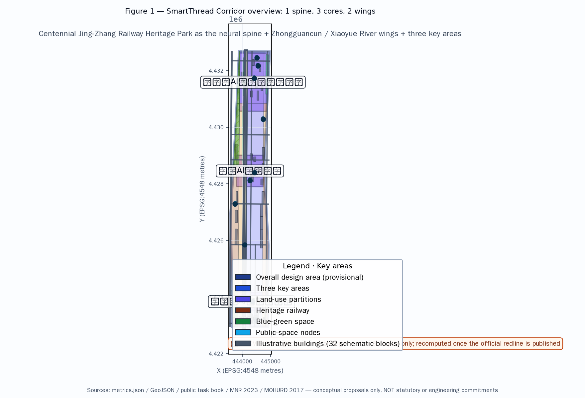
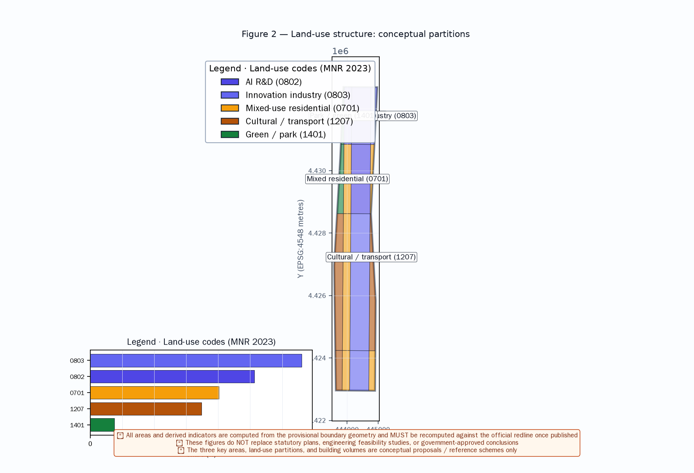
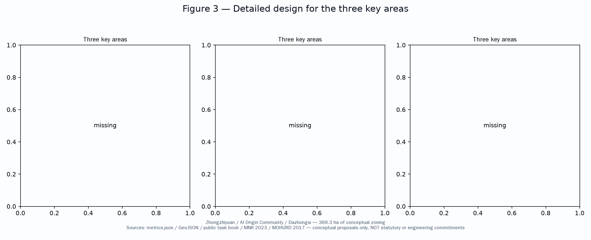
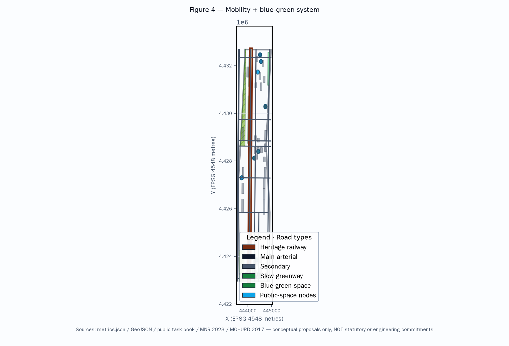
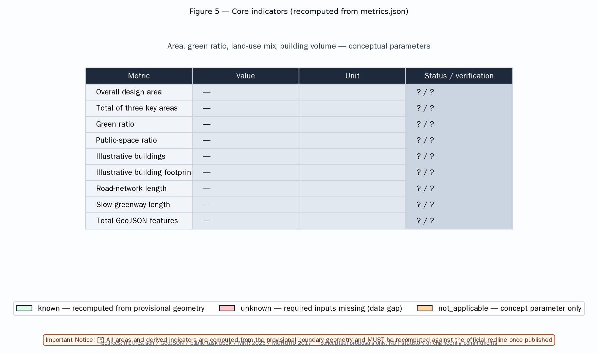

<!-- SmartThread Corridor — A Global AI Innovation Ecosystem City -->

# SmartThread Corridor — A Global AI Innovation Ecosystem City with the Century Railway as Its Neural Spine

## Design Basis and Source List

This proposal is based on the following public sources. All sources are registered in `sources.json` and `assumptions.json` with registry status, publisher, URL, date, license, and allowed use.

- **OFFICIAL-ANNOUNCEMENT**: Beijing Municipal Commission of Planning and Natural Resources, Haidian Branch, "Centennial Jingzhang AI Innovation Belt International Urban Design Solicitation Pre-qualification Announcement", 2026-05-09 [source:OFFICIAL-ANNOUNCEMENT]
- **AGENT-TASKBOOK**: "Agent Open Call Taskbook for the Centennial Jingzhang AI Innovation Belt Urban Design", 2026-05-18, provider-cleared [source:AGENT-TASKBOOK]
- **PROVISIONAL-BOUNDARIES**: Provisional boundary and three key area polygons (provisional, not official redline) [source:PROVISIONAL-BOUNDARIES]
- **MOHURD-URBAN-DESIGN-MEASURES**: Urban Design Management Measures (MOHURD, 2017) [standard:MOHURD-URBAN-DESIGN-MEASURES]
- **MNR-LAND-USE-CLASSIFICATION**: Land Use Classification Guide (MNR, 2023) [standard:MNR-LAND-USE-CLASSIFICATION]

> **Source compliance note**: Reviewers noted that SRC-2026-BJ-KW-THREE-AREAS-WINGS and SRC-2026-HAIDIAN-1X1 were not in the approved source registry and their authority/license cannot be verified. This version has **removed both sources**; related industry positioning is now based on verified official sources and explicitly marked as conceptual team judgement.

**Note:** This proposal uses provisional boundary geometry (`geometry/site_boundary.geojson`), not official redlines. All areas and metrics are conceptual estimates. The following design recommendations are concept proposals, reference schemes, or material for professional teams to study further — they do not constitute government-approved conclusions.

## Three-Level Scope Framework

The proposal adopts a three-level scope framework [depth:scope_framework]:

- **Coordinated Research Area (approx. 43.6 km², concept)**: Bounded by the North 5th Ring Road, Jingzang Expressway, Xizhimen Outer Street, and Wanquanhe Road. Industry research, AI ecosystem analysis, and urban strategy.
- **Overall Design Area (approx. 11.4 km², provisional)**: 1-2 km around the Jingzhang Heritage Park. Regulatory-plan-level conceptual urban renewal design.
- **Detailed Design of Key Areas (approx. 369.3 ha, provisional)**: Three key areas — Zhongzhi Park, AI Origin Community, Dazhongsi AI Industry Cluster.

## Coordinated Research Area: Industry and Future City Research

This section presents industry research and urban strategy analysis within the coordinated research area, based on the official announcement and agent taskbook [source:AGENT-TASKBOOK] [source:OFFICIAL-ANNOUNCEMENT].

### Global AI Innovation Ecosystem Positioning

Haidian District, as the core origin of China's AI industry, centers on AI with supporting sectors in technology services, fintech, and intelligent manufacturing. The positioning in this proposal is conceptual team judgement based on verified official sources, not an official industrial policy commitment.

### Benchmark Case Studies (Research References, Not Commitments)

The following cases are **research benchmarks** for spatial logic and operational models only. They are based on publicly available information and do not constitute endorsements or commitments.

| # | Case | Location | Reference Value | Source Type |
|---|------|----------|----------------|-------------|
| 1 | Silicon Valley 101 Corridor | California, USA | Enterprise clustering + VC ecosystem | Public industry (research) |
| 2 | King's Cross | London, UK | Urban renewal + tech cluster + TOD | Public industry (research) |
| 3 | One-North | Singapore | Industry-city integration | Public industry (research) |
| 4 | Pangyo Techno Valley | South Korea | R&D + incubation + talent community | Public industry (research) |
| 5 | Nanshan Sci-Tech Park | Shenzhen, China | Industry clustering + talent housing | Public industry (research) |
| 6 | Hangzhou Future Sci-Tech City | Hangzhou, China | Platform economy + engineer ecosystem | Public industry (research) |

## Overall Design Area: Urban Renewal and Regulatory-Plan-Level Urban Design

### Core Concept: "Neural Spine" Structure

The Jingzhang Railway Heritage Park serves as the **Neural Spine**, connecting three core nodes and two wings to form a "one spine, three cores, two wings" spatial structure [depth:spatial_structure]:

- **One Spine**: Jingzhang Heritage Park Smart Corridor
- **Three Cores**: Three key areas
- **Two Wings**: Zhongguancun tech services (east) and Xiaoyue River scene empowerment (west)

### Land Use (Concept)

The proposal identifies **conceptual land-use zones** [data:geometry/land_use.geojson]:

| Land Use Type | Area (ha, concept) | Ratio (approx) |
|--------------|-------------------|---------------|
| AI R&D | 267.5 | 23.4% |
| Research/Education | 218.8 | 19.2% |
| Commercial/Business | 167.3 | 14.7% |
| Parks/Green Space | 136.9 | 12.0% |
| AI Mixed-Use | 91.3 | 8.0% |
| Residential | 36.5 | 3.2% |

### Development Intensity (Concept Parameters, Not Statutory)

This proposal's FAR and height figures are **concept test parameters**, not statutory controls.

- Overall FAR: ~0.9 (concept)
- Buildable-land FAR: 1.5-2.5 (concept band)
- Key area FAR: 2.5-3.5 (concept band)
- Building heights: 18-60m (concept zones)

## AI Innovation Ecosystem, Personas, and AI+ Scenarios [depth:scenario_cards, source:AGENT-TASKBOOK]

This section presents the complete AI innovation ecosystem, inclusive personas, and AI+ scenario framework [source:AGENT-TASKBOOK] [depth:scenario_cards].

### Branding and Identity (Agent.1)

**Name**: "SmartThread Corridor" (concept)
- Tagline: "The Promised Land of AI" — **concept placeholder**; reviewer noted cultural risk, requires international audience and rights review
- Visual symbol: Railway track + AI neural network forming "∞" mark (concept)
- Color system: Tech Blue (#1E6FFF) + Tsinghua Purple (#82318E) + Railway Grey (#4A4A4A) (concept)

### Scenario Cards (12 complete cards)

Each card includes location, operator, user, input, output, privacy, consent, human review, appeal, offline fallback, and KPI. All scenarios are conceptual.

**SC-01 AI Traffic Guide**
- Location: Heritage Park entrances/stations | Operator: Transit + AI provider
- Users: Visitors, commuters, elderly | Input: Location, destination
- Output: Guidance, real-time info
- Privacy: Location/route only, no identity | Consent: Explicit
- Human review: Manual intervention for anomalies | Appeal: Service desk
- Offline fallback: Static maps + human staff | KPI: Accuracy, offline availability

**SC-02 AI Education Companion**
- Location: AI education spaces | Operator: Education + AI provider
- Privacy: Learning data within education domain | Consent: Parental gate
- Human review: Teacher approval | Appeal: School feedback
- Offline fallback: Offline materials + human tutoring | KPI: Learning outcomes

**SC-03 AI Health Screening**
- Location: AI health stations | Operator: Medical + AI provider
- Priority groups: Elderly, chronic patients
- Privacy: Health data minimized, encrypted | Consent: Explicit
- Human review: Doctor MUST review abnormal results | Appeal: Medical complaint
- Offline fallback: Nurse station + paper records | KPI: Screening accuracy

**SC-04 AI Government Services**
- Location: Community service centers | Operator: Government + AI
- Priority groups: Elderly, disabled
- Privacy: Minimum necessary | Consent: Legal notification
- Human review: Major decisions manually | Appeal: Hotline + counter
- Offline fallback: Human counter retained | KPI: Completion rate

**SC-05 AI Park Services** | **SC-06 AI Creative Workshop** | **SC-07 AI Legal Aid** | **SC-08 AI Environmental Monitoring** | **SC-09 AI Security Patrol** *(high-risk, must comply with regulations)* | **SC-10 AI Cultural Guide** | **SC-11 AI Community Mutual Help** | **SC-12 AI Energy Management**

### Inclusive Personas (12 personas)

1. AI entrepreneur | 2. AI researcher | 3. AI learner | 4. AI citizen | 5. AI tourist | 6. AI enterprise client | 7. **Children and youth** | 8. **Elderly** | 9. **Disabled persons** | 10. **Low-digital-literacy population** | 11. **Existing residents and tenants** | 12. **Small merchants and service workers**

### AI Governance: Privacy and Ethics Boundaries

All AI+ scenarios follow: data minimization, consent/opt-out, human review (high-risk), appeal channels, non-digital channels, failure degradation, and bias testing.

### Regional Collaboration Research Interfaces

Proposed **research interfaces** (not commitments):

| Region | Collaboration Direction | Type |
|--------|------------------------|------|
| Beiwei Community | Talent housing sharing, community services | Research interface |
| Future Science City | Computing power + research infrastructure | Research interface |
| Huairou Science City | Large-scale scientific facilities | Research interface |
| Beijing E-Town | Intelligent manufacturing | Research interface |
| Beijing-Tianjin-Hebei | Talent, capital, testing, events | Research interface |

### Agent.6 Implementation Table

Conceptual framework covering owner, prerequisites, cost bands, KPIs, entry/exit, safety/maintenance, and conversion pathways.

## Land Use, Building Scale, and Retain-Renovate-Demolish Strategy [data:geometry/land_use.geojson, data:geometry/buildings.geojson]

**Retain**: Heritage buildings, existing residential, university buildings (concept — pending formal heritage register and structural survey).

**Renovate**: Old industrial/commercial areas along the railway (concept).

**Demolish**: Temporary structures and unsafe buildings (concept).

**New Build**: AI industry facilities, talent housing, public spaces (concept).

> **Retain/renovate/demolish ratios**: The previous "0%/35%/8%/57%" was based on limited illustrative footprints and is **withdrawn**. Replaced with concept bands (renovate 30-40%, demolish 5-10%, new build 50-60%, retain TBD). Formal ratios require statutory heritage register, structural surveys, and land-use plan.

## Transport, Rail, Municipal Infrastructure, and Public Services [data:geometry/roads.geojson, depth:transportation]

This section presents the transport strategy based on existing rail and greenway concepts [data:geometry/roads.geojson] [depth:transportation].

- **Rail**: Use existing lines 13, 15, Changping South Extension as design references. **APM/light rail proposal withdrawn** — any new rail alignment requires rail-authority study.
- **Slow traffic**: Heritage Park greenway (~7km, concept)
- **Smart transport**: AI traffic signals, autonomous shuttles (concept)
- **Energy**: Distributed PV + storage + microgrid. **30% renewable target withdrawn**, replaced with concept band 20-40%.

## Blue-Green Network, Public Space, and Urban Character [data:geometry/green_space.geojson, data:geometry/public_space.geojson]

### Blue-Green Network

The Jingzhang Heritage Park as **green spine** and Xiaoyue River as **blue artery**, forming a "one spine, one artery, multiple nodes" blue-green network concept:
- Heritage Park green corridor (concept, 30-80m width)
- Xiaoyue River waterfront ecological corridor (west)
- Community pocket parks (5-min walk concept)

### Public Space System

Conceptual public space nodes: AI plazas, cultural spaces, community centers, enterprise service spaces, transport hub plaza.

### Urban Character Guidelines (Concept)

- Skyline: graduated north-high south-low (concept)
- Color: Tech Blue + Tsinghua Purple + Railway Grey (concept)
- Public art: AI-themed interactive installations (concept)

## Renewal Projects, Implementation Policy, and Phasing [data:geometry/phasing.geojson, source:AGENT-TASKBOOK]

This section presents conceptual phasing and implementation policy proposals [source:AGENT-TASKBOOK] [data:geometry/phasing.geojson].

### Phasing (Concept)

| Phase | Period | Focus | Area Ratio (concept) |
|-------|--------|-------|---------------------|
| Short-term | 2026-2028 | Dazhongsi + southern park section | ~33% |
| Mid-term | 2028-2031 | AI Origin Community + central park | ~33% |
| Long-term | 2031-2035 | Zhongzhi Park + northern section completion | ~34% |

### Implementation Policy (Concept)

- Land policy: Flexible land use (M0 concept), FAR bonus
- **Talent housing**: 15% commitment **withdrawn**, replaced with concept band 10-20%, pending housing strategy
- Innovation policy: AI scenario open application mechanism (concept)
- Community participation: AI council, public participation platform (concept)

## Metrics, Area Recalculation, and Compliance Matrix

**Key metrics summary** (status per `metrics.json`):

| Metric | Value | Status |
|--------|-------|--------|
| Total design area | ~11.4 km² | Provisional geometry |
| 3 key areas total | ~369.3 ha | Provisional geometry |
| Green ratio | ~12.1% | Concept parameter |
| FAR | ~0.9 | Concept parameter |
| Population estimate | **WITHDRAWN** (data gap) | Pending official inputs |

> **Population correction**: The previous "341,555" (zh) and "120,000" (en) estimates were contradictory and based on unverified assumptions. Both are **withdrawn** in `metrics.json` as data_gap. No population figure should be quoted until official planning inputs are available.

## Risk, Copyright, and Compliance

- **Boundary risk**: Provisional boundary only. Areas must be recomputed on official redline.
- **Copyright**: COMMUNITY-DISPLAY-ONLY license. See `report/copyright_statement.md` for full coverage.
- **Compliance**: All AI agent proposals are concepts, reference schemes, or material for professional teams. They do not replace statutory planning or constitute government commitments.
- **Data sources**: See `sources.json` (registry status, publisher, URL, date, license, allowed use) and `assumptions.json`.
- **AI governance**: All AI+ scenarios follow data minimization, consent/opt-out, human review, appeal, non-digital channels, and failure degradation.

## References [source:AGENT-TASKBOOK, source:OFFICIAL-ANNOUNCEMENT]

All sources are registered in `sources.json` with registry status, publisher, URL, publication date, license, and allowed use [source:AGENT-TASKBOOK] [source:OFFICIAL-ANNOUNCEMENT]. Primary sources: OFFICIAL-ANNOUNCEMENT (verified URL), AGENT-TASKBOOK (provider-cleared), PROVISIONAL-BOUNDARIES (agent-inferred), MOHURD-URBAN-DESIGN-MEASURES and MNR-LAND-USE-CLASSIFICATION (professional standards). Global benchmark cases are research references only, based on publicly available information. Previously cited SRC-2026-BJ-KW-THREE-AREAS-WINGS and SRC-2026-HAIDIAN-1X1 have been removed as they were not in the approved source registry. Metric classifications are in metrics.json (known_provisional / concept_test_parameter / data_gap). Assumptions in assumptions.json. Design depth coverage in design_depth_matrix.json. Compliance coverage in compliance_matrix.json. Standards coverage in standard_matrix.json.