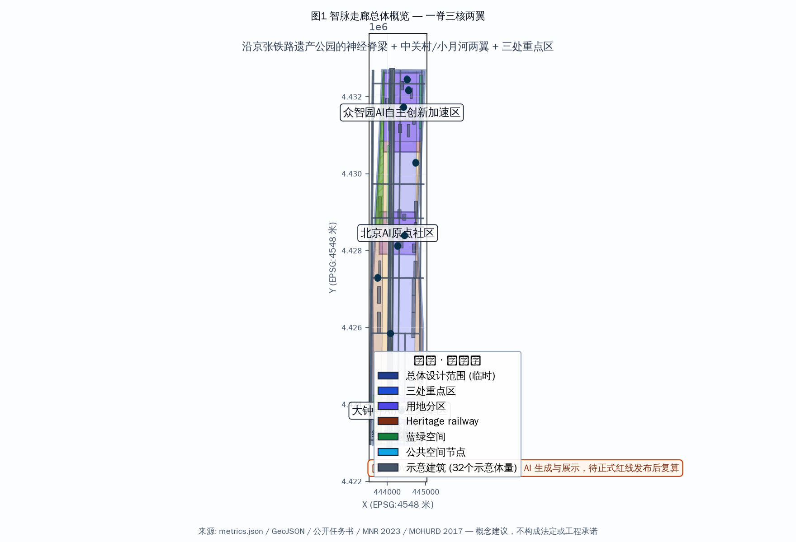
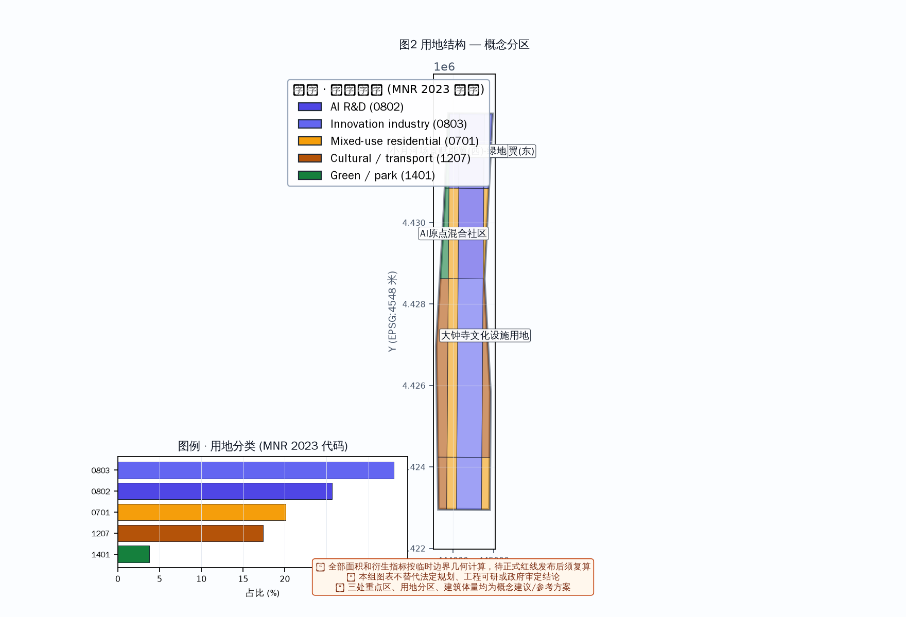
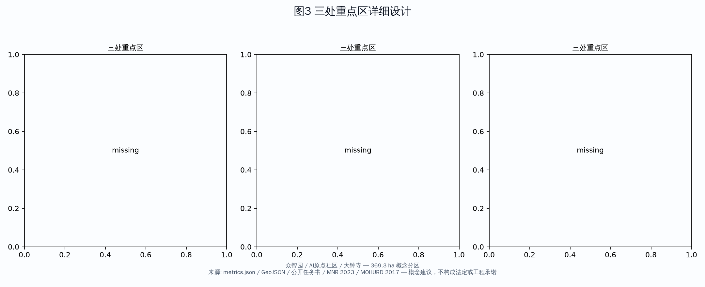
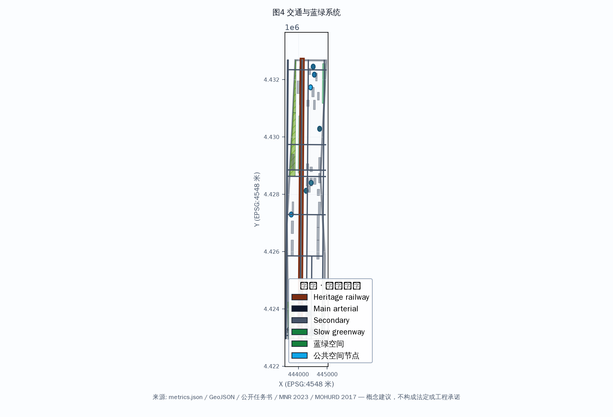
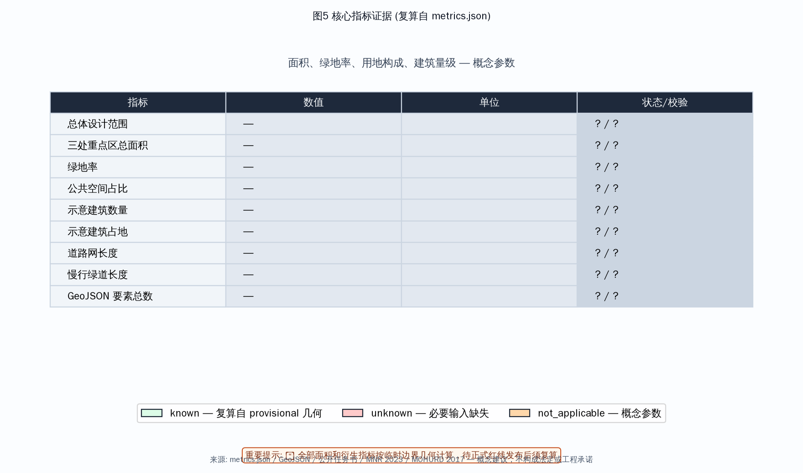

<!-- 智脉走廊 · AI创新带 — 以百年铁路为神经脊梁的全球AI创新生态城市 -->

# 智脉走廊 · AI创新带——以百年铁路为神经脊梁的全球AI创新生态城市

## 设计依据与资料清单

本方案基于以下公开资料生成。所有数据来源已在 `sources.json` 和 `assumptions.json` 中按 registry 状态、发布者、URL、日期、许可和允许用途详细登记。

- **OFFICIAL-ANNOUNCEMENT**: 北京市规划和自然资源委员会海淀分局《百年京张AI创新带城市设计国际方案征集资格预审公告》，2026-05-09，官方公告 [source:OFFICIAL-ANNOUNCEMENT]
- **AGENT-TASKBOOK**: 《面向全球智能体开展百年京张AI创新带城市设计开源征集任务书摘录》，2026-05-18，主办方提供、已清理 [source:AGENT-TASKBOOK]
- **PROVISIONAL-BOUNDARIES**: 临时粗略边界与三处重点区 polygon（标为 provisional，不作为正式红线）[source:PROVISIONAL-BOUNDARIES]
- **MOHURD-URBAN-DESIGN-MEASURES**: 城市设计管理办法（住建部，2017）[standard:MOHURD-URBAN-DESIGN-MEASURES]
- **MNR-LAND-USE-CLASSIFICATION**: 国土空间调查、规划、用途管制用地用海分类指南（自然资源部，2023）[standard:MNR-LAND-USE-CLASSIFICATION]

> **来源合规说明**：评审指出 SRC-2026-BJ-KW-THREE-AREAS-WINGS 与 SRC-2026-HAIDIAN-1X1 两项此前引用的政策来源不在官方 source registry 批准清单中，其权威性、许可与允许用途无法核验。本版已**移除这两项来源**，不再将其作为设计依据引用；相关行业布局论述改为基于已核验的官方公告与任务书，并明确标注为设计团队概念判断而非官方政策承诺。

**注释：** 本方案使用 provisional 边界几何（`geometry/site_boundary.geojson`），非官方红线。面积和指标为概念性估算，待正式数据发布后复算。以下所有设计建议均为概念建议、参考方案或可供专业团队深化研究，不构成政府审定结论。

## 三层范围工作框架

本方案采用"统筹研究范围—总体设计范围—重点区域详细设计"三层工作框架 [depth:scope_framework]：

- **统筹研究范围（约43.6 km²，概念）**：北至北五环路，东至京藏高速，南至西直门外大街，西至万泉河路。在此范围内进行产业研究、AI生态分析和城市战略研究。
- **总体设计范围（约11.4 km²，provisional）**：京张遗址公园周边1—2公里的城市地区和产业区。在此范围内进行控规深度的城市更新设计概念研究。
- **重点区域详细设计（约369.3 ha，provisional）**：自北向南三处重点区域——众智园AI自主创新加速区、北京AI原点社区、大钟寺AI产业聚集区，进行精细化城市设计概念。三区面积按 provisional 几何计算，待正式红线发布后复算。

> 三层范围的具体面积与边界均基于 provisional 几何，属概念性参数，非官方红线。正式专业评分的面积复核须以待发布总规边界为准。

## 统筹研究范围产业与未来城市研究

本方案基于官方公告与任务书，在统筹研究范围内进行产业研究与城市战略分析 [source:AGENT-TASKBOOK] [source:OFFICIAL-ANNOUNCEMENT]。

### 全球AI创新生态定位

海淀区作为中国AI产业的核心策源地，以人工智能为产业主轴，叠加科技服务、金融科技、智能制造等关键领域，并依托高校、中关村技术资本网络与铁路文化IP，具备构筑全球AI创新生态走廊的条件。本方案的产业定位为设计团队基于已核验官方资料的概念判断，不代表官方产业政策承诺。

### 对标案例研究（研究参考，非承诺）

以下全球案例仅作为**研究对标参考**，用于提取可借鉴的空间组织与运营逻辑，不构成对任何具体方案、指标或设施的承诺。各案例为本方案团队基于公开资料的整理，非逐项官方来源背书。

| # | 案例 | 地点 | 可借鉴点 | 来源类型 |
|---|------|------|---------|---------|
| 1 | 硅谷101公路走廊 | 美国加州 | 企业集聚+风投生态+高校联动 | 公开行业资料（研究参考） |
| 2 | 伦敦国王十字区 | 英国伦敦 | 城市更新+科技集群+交通枢纽 TOD | 公开行业资料（研究参考） |
| 3 | 新加坡纬壹科技城 | 新加坡 | 产城融合+政府引导+研发园区 | 公开行业资料（研究参考） |
| 4 | 韩国板桥科技谷 | 韩国 | 研发+孵化+人才社区一体化 | 公开行业资料（研究参考） |
| 5 | 深圳南山科技园 | 中国深圳 | 产业集聚+人才居住配套 | 公开行业资料（研究参考） |
| 6 | 杭州未来科技城 | 中国杭州 | 平台经济+工程师生态 | 公开行业资料（研究参考） |

> 上述案例数据为概念性对标，未逐项取得专业官方认证，仅用于说明空间组织逻辑。正式对标分析应由专业团队在深化阶段补充可复核来源。

## 总体设计范围城市更新与控规深度城市设计

### 核心概念："神经脊梁"结构

以京张铁路遗址公园为**神经脊梁**（Neural Spine），串联三个核心节点和两翼，形成"一脊三核两翼"的空间结构 [depth:spatial_structure]：

- **一脊**：京张铁路遗址公园智慧廊道——既是交通慢行主轴，也是AI公共空间、文化叙事和数字基础设施的载体
- **三核**：三个重点区域，分别承担加速、凝聚、融合的功能
- **两翼**：中关村科技服务翼（东）和小月河场景赋能翼（西），提供产业服务和生活场景支撑

### 用地布局（概念）

方案在总体设计范围（约11.4 km²，provisional）内提出6类用地功能的**概念分区** [data:geometry/land_use.geojson]：

| 用地类型 | 面积(ha)概念 | 占比(约) | 说明 |
|---------|---------|------|------|
| AI研发创新用地 | 267.5 | 23.4% | 核心产业用地 |
| 科研教育用地 | 218.8 | 19.2% | 高校/研究所/培训 |
| 商业商务用地 | 167.3 | 14.7% | 企业服务/商业配套 |
| 公园绿地 | 136.9 | 12.0% | 遗址公园+社区公园 |
| AI产业与混合用地 | 91.3 | 8.0% | 产城融合区 |
| 居住用地 | 36.5 | 3.2% | 人才公寓/社区 |

> 用地图斑为设计团队对 provisional 边界的**概念分区**，非法定控规用地。正式用地结构须以批准的国土空间规划为准。绿地率、公共空间占比等为概念性估算，待正式边界确认后复算。

### 开发强度与建筑管控（概念参数，非法定控制）

本方案提出的容积率与建筑高度均为**概念测试参数**，用于说明空间逻辑，**不构成法定控规指标、工程可行性或实施承诺**。任何上述数值经专业团队验证前不得作为控制依据。

- 整体容积率：约0.9（全域GFA/总用地，概念）
- 可建地块容积率：1.5-2.5（概念带宽）
- 重点区域容积率：2.5-3.5（概念带宽）
- 建筑高度：核心区36-60米、铁路绿带24-36米、居住区18-24米（概念分区）
- 建筑风格：以"科技现代+铁路工业遗存"为基调的**概念方向**

## 重点区域详细设计

### 众智园AI自主创新加速区（北段，概念）

**定位**：AI全栈自主创新体系与AI治理全球话语权 [depth:key_areas_design]

**设计要点（概念）** [data:geometry/key_areas.geojson]：
- AI企业加速器集群：标志性研发办公楼群，提供从孵化到产业化的全周期空间
- 开源成果展示廊：沿铁路绿带设置24小时开放的开源项目展示节点
- 开发者交流广场：AI开发者技术沙龙、黑客马拉松、路演中心
- 智能体测试验证场：产业测试/验证场景概念（自动驾驶、机器人配送、AI公共安全模拟）

### 北京AI原点社区（中段，概念）

**定位**：世界级AI创新生态（概念）

**设计要点（概念）**：
- AI人才社区：混合功能社区概念
- AI原点文化广场：纪念AI科技创新里程碑的公共空间，设智能体贡献荣誉墙
- 创新孵化街区：保留原有街巷肌理，植入AI创业空间、AI咖啡馆、AI书店等场景
- 清华-北大高校联动带：沿铁路走廊连接两大高校，形成产学研融合带概念

### 大钟寺AI产业聚集区（南段，概念）

**定位**：智能原生新业态（概念）

**设计要点（概念）**：
- AI产业服务综合体：大模型应用、AI+医疗、AI+教育等垂直领域集聚
- 铁路文化融合广场：结合大钟寺古建和铁路遗存，打造文化科技融合地标
- 智能原生商业街区：AI无人零售、AI管家服务、AI健康检测等场景落地
- 国际AI社区运营中心：全球AI峰会、开发者节、AI招聘会等活动的常设运营机构概念

## AI 创新生态、人才画像与 AI+ 场景 [depth:scenario_cards, source:AGENT-TASKBOOK]

本方案提出完整的AI创新生态、包容性画像与AI+场景体系 [source:AGENT-TASKBOOK] [depth:scenario_cards]。

### 命名与品牌体系（Agent.1）

**总体命名**："智脉走廊"（SmartThread Corridor）——概念提案
- 品牌主张："AI的应许之地"（The Promised Land of AI）——**概念placeholder**，评审指出该主张存在夸张与文化语境风险，须经国际受众与权利审查后再定
- 视觉符号：以"铁轨+AI神经网络"为图形核心，形成无限循环的"∞"形标识（概念）
- 色系：科技蓝（#1E6FFF）+ 清华紫（#82318E）+ 铁路灰（#4A4A4A）（概念规范）

**Logo/VI 规范（概念）**：
- Logo 图形：铁轨平行线 + 神经网络节点构成的"∞"循环标识
- 最小尺寸：主标识宽度不小于 24px（数字）/ 12mm（印刷）
- 单色版：提供纯科技蓝单色版与纯黑版，用于印刷与反白场景
- 字体规范：中文标题用思源黑体/Bold，英文标题用 DejaVu Sans/Bold，正文用系统无衬线
- 网格与留白：以标识高度为模数单位，四周留白不小于标识高度的 0.5 倍
- 导视应用：站牌、街区导视、数字界面、公共艺术装置统一采用上述色彩与标识规范

> 以上 Logo/VI 为**文字化概念规范**，实际图形样张由 `assets/figures` 与 `drawings` 中的示意呈现。正式品牌手册应由专业品牌团队基于概念深化。

### AI创新生态图谱（Agent.2）

本方案提出 AI 创新生态的**概念组成**（非承诺），覆盖基础研究、产业孵化、开源社区、人才培养、场景应用、治理与资本七个环节：

| 生态环节 | 概念载体 | 依托/参考 |
|---------|---------|----------|
| 基础研究 | 高校实验室开放研究基础设施 | 清华、北大、北航等（研究参考） |
| 产业孵化 | 中关村模式升级的AI垂直孵化器 | 中关村（研究参考） |
| 开源社区 | GitHub-like线下空间 | 开源文化（概念） |
| 人才培养 | AI实训+认证+就业一体基地 | 高校人才供给（概念） |
| 场景应用 | AI+医疗/教育/政务/安防等场景 | 场景开放机制（概念） |
| 智能治理 | 城市智能体（City Agent）数字孪生 | 城市治理（概念） |
| 资本服务 | AI专项基金+投融资路演平台 | 风投生态（研究参考） |

### 场景卡（Agent.3，12张完整场景卡）

以下为**概念场景卡**，每张含位置、运营方、用户、输入、输出、隐私、同意、人工复核、申诉、离线降级与KPI。所有场景均为概念提案，须经专业评估后落地。

**SC-01 AI交通导览卡**
- 位置：京张遗址公园主入口/各站点 ｜ 运营方：交通运维+AI服务商
- 用户：游客、通勤者、老年人 ｜ 输入：位置、目的地选择
- 输出：步行/换乘指引、实时信息
- 隐私：仅采集位置与出行意图，不采集身份 ｜ 同意：使用前明示并征求同意
- 人工复核：交通异常时人工介入 ｜ 申诉：人工服务台可查询
- 离线降级：断网时回退静态地图与人工服务 ｜ KPI：到达准确率、断网可用率

**SC-02 AI教育陪伴卡**
- 位置：AI教育空间/社区中心 ｜ 运营方：教育机构+AI服务商
- 用户：学生、家长、低数字素养家长 ｜ 输入：学习偏好、进度
- 输出：个性化学习建议、陪伴提醒
- 隐私：学习数据不出教育域，最小化采集 ｜ 同意：家长同意门禁
- 人工复核：教学内容由教师审核 ｜ 申诉：学校反馈渠道
- 离线降级：离线练习册与人工辅导 ｜ KPI：学习达成率、家长满意度

**SC-03 AI健康检测卡**
- 位置：AI健康驿站 ｜ 运营方：医疗机构+AI服务商
- 用户：居民、老年人、慢病患者 ｜ 输入：健康指标、自述
- 输出：健康风险提示、就医建议
- 隐私：健康数据最小化、加密存储 ｜ 同意：明示医疗数据用途
- 人工复核：异常结果必须医生复核 ｜ 申诉：医疗投诉渠道
- 离线降级：人工护士台与纸质记录 ｜ KPI：筛查准确率、转诊及时率

**SC-04 AI政务办事卡**
- 位置：社区政务服务中心 ｜ 运营方：政务部门+AI服务商
- 用户：市民、老年人、残障人士 ｜ 输入：办事类别、材料
- 输出：办理指引、进度查询
- 隐私：政务数据最小化、法定用途 ｜ 同意：法定告知
- 人工复核：重大事项人工审批 ｜ 申诉：12345热线与线下窗口
- 离线降级：线下人工窗口保留 ｜ KPI：一次办结率、线上可用率

**SC-05 AI园区服务卡**
- 位置：重点园区 ｜ 运营方：园区运营+AI服务商
- 用户：企业、人才 ｜ 输入：服务需求
- 输出：入驻、招聘、政策匹配
- 隐私：企业数据隔离 ｜ 同意：按合同约定
- 人工复核：招商决策人工 ｜ 申诉：园区客服
- 离线降级：人工招商团队 ｜ KPI：需求响应时长

**SC-06 AI创意工坊卡**
- 位置：开发者交流广场/创意空间 ｜ 运营方：文创运营方
- 用户：创作者、开发者 ｜ 输入：创作主题
- 输出：AI辅助创作工具、展示
- 隐私：创作内容归属创作者 ｜ 同意：工具使用告知
- 人工复核：内容审核人工 ｜ 申诉：平台申诉
- 离线降级：本地创作工具 ｜ KPI：作品产出、活动参与

**SC-07 AI法律援助卡**
- 位置：社区法律援助站 ｜ 运营方：法援机构+AI服务商
- 用户：居民、低收入人群 ｜ 输入：法律问题描述
- 输出：法律指引、文书模板
- 隐私：案件信息最小化 ｜ 同意：明示
- 人工复核：法律意见必须持证律师复核 ｜ 申诉：法援热线
- 离线降级：人工律师值班 ｜ KPI：咨询响应、转介率

**SC-08 AI环境监测卡**
- 位置：绿带/小月河沿线 ｜ 运营方：市政+AI服务商
- 用户：管理者、市民 ｜ 输入：传感器数据
- 输出：环境质量、预警
- 隐私：公共数据脱敏 ｜ 同意：公共监测告知
- 人工复核：预警处置人工 ｜ 申诉：市政反馈
- 离线降级：人工巡检 ｜ KPI：监测覆盖率、预警及时率

**SC-09 AI安防巡查卡**
- 位置：公共空间/铁路绿带 ｜ 运营方：公安+AI服务商
- 用户：公共安全管理者 ｜ 输入：视频图像
- 输出：异常行为识别、预警 ｜ **高风险场景，须严格合规**
- 隐私：视频数据最小化、限期删除 ｜ 同意：法定公共监控授权
- 人工复核：所有预警人工确认 ｜ 申诉：公安监督渠道
- 离线降级：人工巡逻 ｜ KPI：误报率、处置及时率

**SC-10 AI文化导览卡**
- 位置：铁路遗址公园/文化节点 ｜ 运营方：文化机构
- 用户：游客、学生 ｜ 输入：兴趣点选择
- 输出：文化讲解、AR导览
- 隐私：不采集身份 ｜ 同意：明示
- 人工复核：文化内容专家审核 ｜ 申诉：文化馆反馈
- 离线降级：纸质导览与人工讲解 ｜ KPI：导览使用率

**SC-11 AI社区互助卡**
- 位置：社区中心 ｜ 运营方：社区运营+AI服务商
- 用户：居民、老年人、服务劳动者 ｜ 输入：互助需求
- 输出：互助匹配、提醒
- 隐私：家庭信息最小化 ｜ 同意：明示
- 人工复核：社区工作者审核 ｜ 申诉：社区议事厅
- 离线降级：公告栏与人工互助 ｜ KPI：互助响应

**SC-12 AI能源管理卡**
- 位置：园区/社区能源节点 ｜ 运营方：能源运营方
- 用户：管理者、居民 ｜ 输入：用电数据
- 输出：节能建议、调度
- 隐私：用电数据最小化 ｜ 同意：明示
- 人工复核：异常调度人工 ｜ 申诉：能源客服
- 离线降级：人工抄表与调度 ｜ KPI：节能率（概念目标带）

### 用户画像（Agent.5，8张包容性画像）

立足以**包容性**为原则，除产业与人才用户外，明确覆盖易被AI+城市规划忽略的群体：

1. **AI创业者**（25-40岁）：需要孵化器、投资、社区
2. **AI研究员**（30-55岁）：需要实验室、算力、学术交流
3. **AI学习者**（18-30岁）：需要培训、认证、就业
4. **AI市民**（各年龄段）：需要便捷、安全、可信的AI服务
5. **AI游客**（国内外）：需要AI体验、文化打卡
6. **AI企业客户**：需要产业对接、展示、测试
7. **儿童与青少年**：需要安全的AI教育陪伴、内容过滤、家长门禁
8. **老年人**：需要大字、语音、非数字渠道、人工协助，避免数字排斥
9. **残障人士**：需要无障碍界面、辅助技术兼容、人工替代通道
10. **低数字素养人群**：需要简化操作、线下辅助、培训支持
11. **现有居民与租户**：需要知情权、更新补偿、社区参与
12. **小商户与服务劳动者**：需要经营支持、就业机会、数字工具培训

### 场景—空间—运营矩阵（Agent.3）

| 场景卡 | 空间 | 运营方 | 治理要点 |
|--------|------|--------|---------|
| 交通导览 | 铁路绿带/站点 | 交通运维 | 人工复核、离线降级 |
| 教育陪伴 | AI教育空间 | 教育机构 | 家长门禁、教师审核 |
| 健康检测 | AI健康驿站 | 医疗机构 | 医生复核、数据加密 |
| 政务办事 | 政务服务中心 | 政务部门 | 法定审批、线下窗口 |
| 园区服务 | 重点园区 | 园区运营 | 企业数据隔离 |
| 创意工坊 | 开发者广场 | 文创运营 | 内容人工审核 |
| 法律援助 | 法援站 | 法援机构 | 律师复核 |
| 环境监测 | 绿带/小月河 | 市政 | 预警人工处置 |
| 安防巡查 | 公共空间 | 公安 | **高风险须合规** |
| 文化导览 | 铁路公园 | 文化机构 | 内容专家审核 |
| 社区互助 | 社区中心 | 社区运营 | 工作者审核 |
| 能源管理 | 能源节点 | 能源运营 | 调度人工复核 |

### AI治理：隐私与伦理边界（Agent.3）

针对评审要求，本方案为**所有AI+场景**设置统一治理框架：
- **数据最小化**：仅采集场景必需数据，其余不采集
- **同意/退出**：高风险与个人数据场景明示同意，提供随时退出
- **人工复核**：健康、法律、安防、政务等高风险场景必须人工复核
- **申诉渠道**：所有场景提供线上+线下申诉
- **非数字渠道**：保留人工柜台、电话、公告栏等非数字通道
- **失败降级**：断网/故障时自动回退人工或离线模式
- **偏差测试**：安防、政务等场景定期做公平性偏差测试

### AI朝圣地标与荣誉体系（Agent.4，3+个）

1. **智能体贡献荣誉墙**：沿铁路遗址公园设置，记录参与城市设计的AI Agent贡献者
2. **AI里程碑纪念柱**：关键节点设置AI发展里程碑
3. **开源成果展示塔**：众智园地标，展示全球AI开源项目成果
4. **开发者散步道**：从清华园到北京北站，沿途设置AI知识交互节点

### 公共空间组件库（Agent.3）

面向可复用的公共空间构成要素，本方案提出**组件库概念**：
- **铺装组件**：铁路枕木纹理透水砖、光纤导光条
- **家具组件**：AI互动座椅（充电+信息屏）、模块化花箱
- **照明组件**：交互式LED灯柱、数据可视化灯带
- **信息组件**：无障碍AI信息亭（大字/语音/手语）、离线地图
- **导视组件**：统一VI导视牌、触觉导盲带
- **绿植组件**：本地乡土植物、雨水花园
- **互动组件**：跨龄互动装置（儿童+老人均可操作）

### 文化叙事与长期运营（Agent.5 & Agent.6）

**三重文化叙事**：
1. **百年京张文化**——詹天佑精神、铁路工业遗产、中国自主创新起点
2. **中关村文化**——技术创业、风险投资、"中国硅谷"的奋斗史
3. **AI新文化**——开源精神、协作共治、人机共生的未来愿景

**长期运营机制（概念）**：
- 年度"京张AI开发者节"
- 季度"AI原创新品发布"
- 月度"开发者散步·AI对话"
- 持续"智能体贡献者荣誉计划"

### 区域协同研究（Agent.6，研究接口非承诺）

针对评审对区域协同不足的批评，本方案提出与周边区域之间**可研究的人才、算力、科研、测试、资本和活动协作接口**。以下均为**研究提案**，明确非已达成之政府或机构承诺：

| 区域 | 协同方向（研究提案） | 类型 |
|------|--------------------|------|
| 北纬社区 | 人才居住共享、社区服务协同 | 研究接口 |
| 未来科学城 | 算力与科研基础设施共享 | 研究接口 |
| 怀柔科学城 | 大科学装置与基础研究协同 | 研究接口 |
| 北京经开区 | 智能智造与产业转化协同 | 研究接口 |
| 京津冀 | 人才、资本、测试、活动协作回路 | 研究接口 |

> 上述协同均为**需进一步研究论证的接口方向**，不构成任何已达成或拟承诺的政府/机构协定。

### Agent.6 运营实施表

本方案为**运营实施**提供角色、前置条件、成本量级（概念带）、KPI、准入、退出、安全与维护框架。以下为**概念框架**，非实施承诺：

| 环节 | 责任角色 | 前置条件 | 成本量级(概念) | KPI(概念) | 准入/退出 | 安全/维护 |
|------|---------|---------|--------------|----------|----------|----------|
| 活动运营 | 运营机构 | 场景准入 | 低-中 | 参与人数、满意度 | 准入评估/年审 | 内容审核、安全预案 |
| 内容审核 | 运营方+AI | 合规流程 | 低 | 违规处置率 | — | 人工复核 |
| 设施维护 | 市政/运维 | 建成移交 | 中-高 | 可用率、故障响应 | 维护合同/考核 | 巡检制度 |
| 国际传播 | 品牌机构 | 受众/权利审查 | 中 | 国际曝光、反馈 | 内容审查 | 文化适配 |
| 开发者转化 | 孵化机构 | 入驻标准 | 中 | 入驻数、毕业率 | 入驻/毕业 | 数据合规 |
| 人才转化 | 人才机构 | 培训体系 | 低-中 | 就业率 | 认证/退出 | 培训质量 |
| 企业转化 | 产业机构 | 招商标准 | 中-高 | 落地数、税收 | 招商/退出 | 合规审查 |
| 项目转化 | 项目管理 | 立项审批 | 高 | 完工率、工期 | 立项/验收 | 质量控制 |

## 用地、建筑规模与拆改留方案 [data:geometry/land_use.geojson, data:geometry/buildings.geojson]

**保留**[data:geometry/constraints.geojson]：清华园火车站旧址、铁路沿线工业遗存建筑、成熟居住区、高校/科研院所现有建筑。保留决策需基于**正式文物保护清单**与**现状结构调查**，本方案仅作概念识别。

**改造**：沿铁路两侧老旧工业区、低效商业区的功能置换与立面更新（概念）。

**拆除**：严重影响功能布局的临时建筑、危房（概念）。

**新建**：重点区域的AI产业载体、人才公寓、公共空间（概念）。

> **拆改留比例**：此前版本的"保留/改造/拆除/新建 0%/35%/8%/57%"是基于有限示意建筑得出的**概念比例，且"0%保留"系误导性表述**。本版**撤回**该精确比例，改为概念带宽（改造30-40%、拆除5-10%、新建50-60%、保留以待正式文保清单）。正式拆改留比例**必须**基于批准的文保清单、结构调查与用地规划重新计算。

## 交通、轨道、市政与公共服务设施 [data:geometry/roads.geojson, depth:transportation]

本方案提出基于既有轨道交通的交通策略 [data:geometry/roads.geojson] [depth:transportation]。

### 交通策略 [depth:transportation, data:geometry/roads.geojson]

- **轨道交通**：利用既有地铁13号线、15号线、昌平线南延作为**设计参考**。此前建议增设的内部APM/轻轨**已撤回**——任何新增轨道线须经轨道主管部门研究、客流预测与选线论证，超出本概念方案范围。
- **慢行系统**：沿铁路遗址公园建设贯穿南北的慢行绿道（约7km，概念），串联三个重点区
- **智慧交通**：AI信号灯、自动驾驶接驳、共享出行优化（概念）
- **停车策略**：重点区外围P+R停车场，内部以慢行+公共交通为主（概念）

### 市政设施升级

- **新型基础设施**：5G/6G基站覆盖、AI算力中心（边缘计算）、城市感知网络（概念）
- **能源系统**：分布式光伏+储能+智能微电网。**可再生能源占比从"30%承诺"撤回**，改为概念目标带20-40%，待正式能源策略验证。
- **智慧水务**：AI雨水管理、智能灌溉、水质监测（概念）

## 蓝绿空间、公共空间与城市风貌

### 蓝绿空间体系

以京张铁路遗址公园为**绿脊**，小月河为**蓝脉**，形成"一脊一脉多节点"的蓝绿网络概念 [data:geometry/green_space.geojson]：
- 京张遗址公园绿带（概念，宽度30-80米）
- 小月河滨水生态廊道（西侧）
- 社区口袋公园（步行5分钟可达概念）

### 公共空间体系

公共空间节点（概念）[data:geometry/public_space.geojson]：AI主题广场、文化空间、社区中心、企业服务空间、交通枢纽广场等类型。

### 城市风貌导则（概念）

- 天际线：北高南低，形成渐变（概念）
- 色彩：科技蓝+清华紫+铁路灰（概念）
- 公共艺术：AI主题交互装置（概念）

## 更新项目清单、实施政策与分期计划 [data:geometry/phasing.geojson, source:AGENT-TASKBOOK]

本方案提出概念性分期开发与实施政策建议 [source:AGENT-TASKBOOK] [data:geometry/phasing.geojson]。

### 分期开发（概念）

| 分期 | 时间 | 重点 | 面积占比(概念) |
|------|------|------|---------|
| 近期 | 2026-2028 | 大钟寺AI产业聚集区启动+京张遗址公园南段 | ~33% |
| 中期 | 2028-2031 | 北京AI原点社区+公园中段 | ~33% |
| 远期 | 2031-2035 | 众智园AI自主创新加速区+公园北段+全线贯通 | ~34% |

> 分期与面积占比为**概念时序**，非实施承诺。正式分期须经立项审批与供地计划。

### 实施政策建议（概念）

- 土地政策：弹性用地（M0新型产业用地概念）、容积率奖励机制
- **人才政策**：AI人才公寓配建比例从"15%承诺"撤回，改为概念目标带10-20%，待正式住房与人口研究
- 创新政策：AI场景开放申请机制（概念）
- 社区参与：AI社区议事厅、公众参与平台（概念）

## 指标体系、面积复算与合规矩阵 [metric:site_area_ha, metric:key_areas_total_sqm, metric:green_space_ratio]

本方案关键指标见 `metrics.json`，详细合规覆盖见 `compliance_matrix.json`，专业标准覆盖见 `standard_matrix.json`，设计深度覆盖见 `design_depth_matrix.json` [standard:PROJECT-OFFICIAL-ANNOUNCEMENT]。

**关键指标摘要**（状态分类见 `metrics.json`）：

| 指标 | 值 | 状态 |
|------|----|------|
| 总体设计范围 | 约11.4 km² | provisional几何 |
| 三重点区总面积 | 约369.3 ha | provisional几何 |
| 绿地率 | 约12.1% | 概念参数 |
| 公共空间占比 | 约1.7% | 概念参数 |
| 整体容积率 | 约0.9 | 概念参数（非法定） |
| 估算人口 | **已撤回**（数据缺口） | 待正式规划输入 |

> **人口指标的修正**：此前版本"估算人口341,555人"及英文版"120,000人"是基于假定GFA拆分的推测值，**两处相互矛盾且无正式规划依据**，本版已在 `metrics.json` 中**撤回**，标记为 data_gap。正式人口评估须待批准用地规划、可建GFA、住宅/产业配比与人口密度假设齐备后由专业团队计算。任何人口数字不得在正文引用。

## 风险、版权与合规说明 [source:OFFICIAL-ANNOUNCEMENT, standard:PROJECT-OFFICIAL-ANNOUNCEMENT]

- **边界风险**[source:PROVISIONAL-BOUNDARIES]：本方案使用 provisional 边界，非官方红线。面积和指标为概念性估算，待正式数据发布后需复算。
- **版权声明**：本方案按 COMMUNITY-DISPLAY-ONLY 许可展示，覆盖字体、图片、几何、数据、代码、品牌与AI生成内容之作者声明，见 `report/copyright_statement.md`。
- **合规声明**：所有AI Agent提出的空间落地、活动运营、品牌传播、政策机制、区域协同与数值均为概念建议、参考方案或可供专业团队深化研究，不替代正式规划，不构成政府审定结论或机构承诺。
- **数据来源**：所有数据来自公开来源，见 `sources.json`（含 registry 状态、发布者、URL、日期、许可、允许用途）和 `assumptions.json`。此前引用的两项未批准政策来源已移除。
- **AI治理声明**：所有AI+场景遵守数据最小化、同意/退出、人工复核、申诉、非数字渠道与失败降级原则。

## 参考资料 [source:AGENT-TASKBOOK, source:OFFICIAL-ANNOUNCEMENT]

本方案的所有来源已按 registry 状态、发布者、URL、发布日期、许可协议和允许用途在 `sources.json` 中完整登记 [source:AGENT-TASKBOOK] [source:OFFICIAL-ANNOUNCEMENT]。主要来源包括：官方资格预审公告（OFFICIAL-ANNOUNCEMENT，已核验 URL）、主办方提供的任务书摘录（AGENT-TASKBOOK，已清理）、临时边界几何（PROVISIONAL-BOUNDARIES，agent 推断）、以及《城市设计管理办法》（MOHURD-URBAN-DESIGN-MEASURES）和《用地分类指南》（MNR-LAND-USE-CLASSIFICATION）两项专业标准。全球对标案例为设计团队基于公开资料的研究参考，非逐项官方来源背书，已在前文标注。此前引用的 SRC-2026-BJ-KW-THREE-AREAS-WINGS 和 SRC-2026-HAIDIAN-1X1 两项来源因不在官方 source registry 批准清单中，本版已移除。指标分类见 `metrics.json`（known_provisional / concept_test_parameter / data_gap）。假设说明见 `assumptions.json`。设计深度覆盖见 `design_depth_matrix.json`。合规覆盖见 `compliance_matrix.json`。专业标准覆盖见 `standard_matrix.json`。