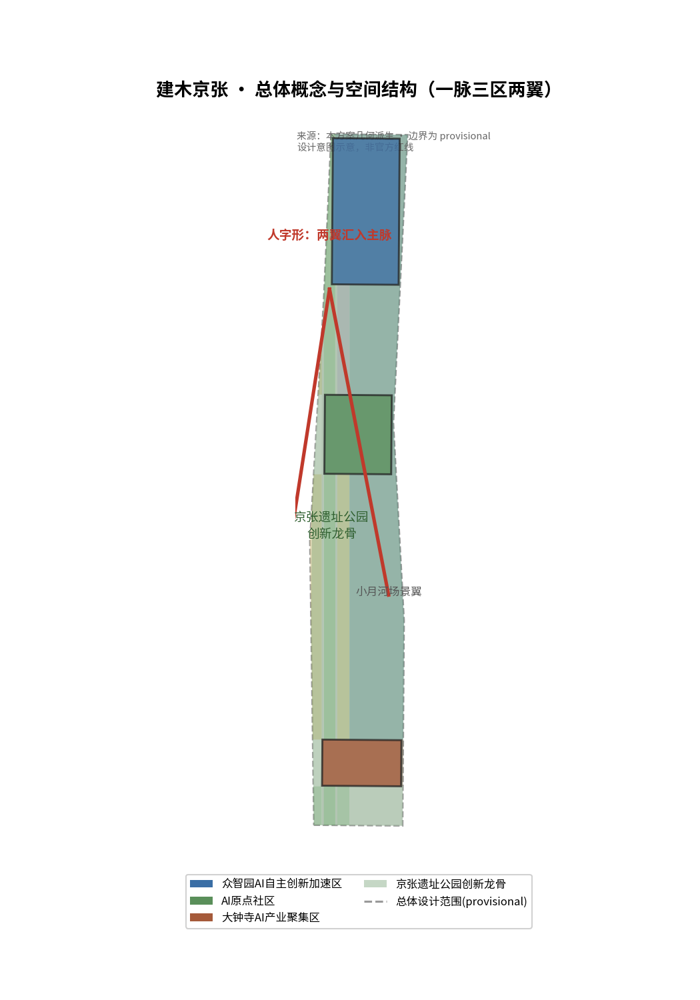
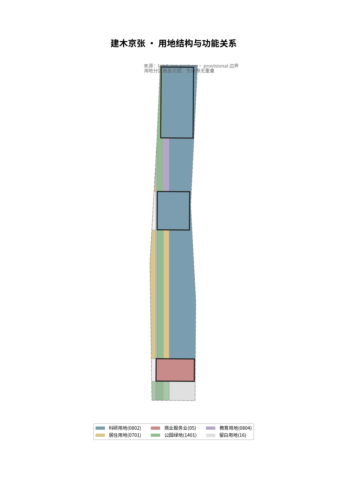
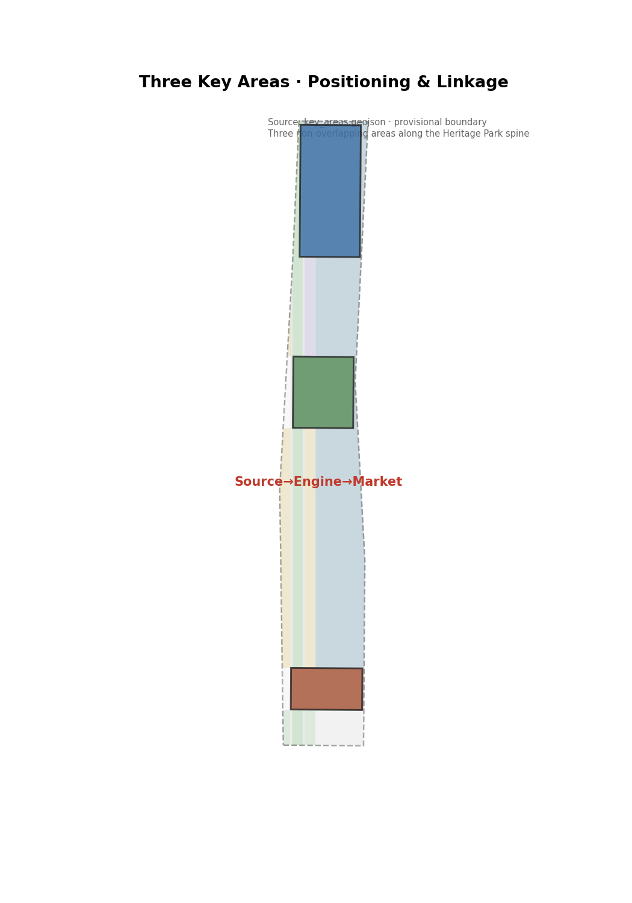
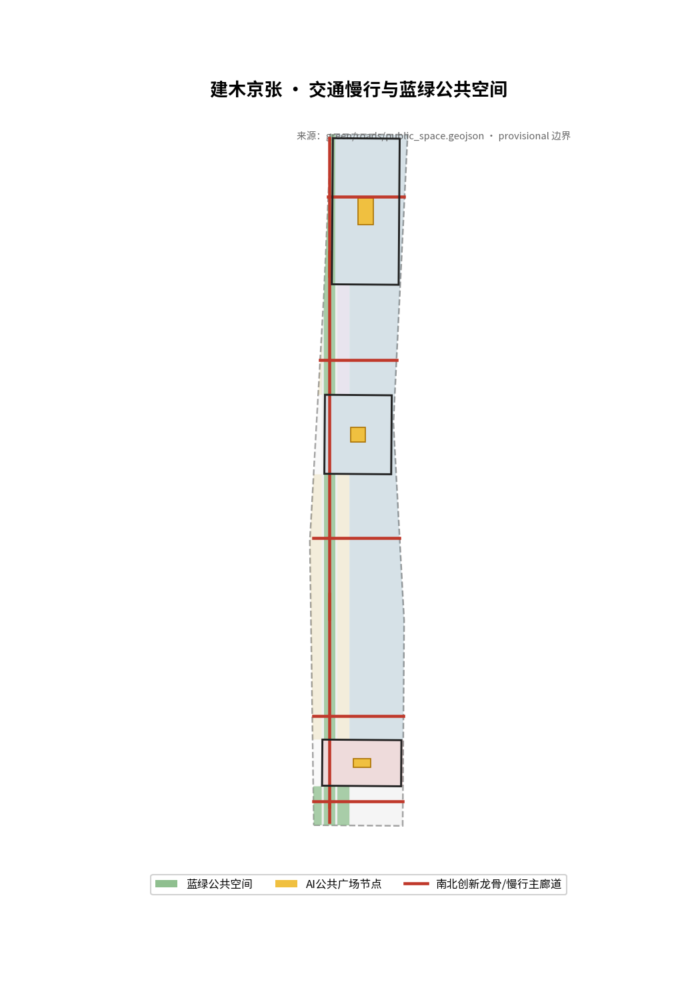
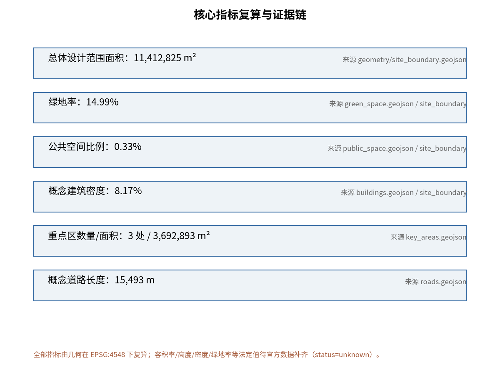

# Jianmu Jing-Zhang: From Self-Reliant Railway to Self-Reliant AI Innovation Belt

## Design Basis and Source List

This proposal is strictly generated from public or rights-cleared materials. All spatial conclusions are **conceptual suggestions and reference proposals for deepening study by professional teams**; they do not replace formal plans and do not constitute government-endorsed conclusions.

Core bases include: the *Notice of Pre-qualification for the International Urban Design Solicitation for the Centennial Jing-Zhang AI Innovation Belt* issued by the Haidian Branch of the Beijing Municipal Commission of Planning and Natural Resources (the three-tier scope, the three key areas, and the design tasks all follow this document) [source:SRC-2026-BJ-GH-QUAL-PREANNOUNCEMENT][standard:PROJECT-OFFICIAL-ANNOUNCEMENT]; the agent-facing task book excerpt (three major positionings, five major functions, three areas and two wings, six agent tasks) [source:SRC-2026-0518-AGENT-OPEN-CALL-TASKBOOK][standard:PROJECT-AGENT-OPEN-CALL-TASKBOOK]; the Ministry of Housing and Urban-Rural Development's *Urban Design Administrative Measures* and *Administrative Measures for the Formulation and Approval of Regulatory Detailed Plans for Cities and Towns* [standard:MOHURD-URBAN-DESIGN-MEASURES][standard:MOHURD-CONTROL-DETAILED-PLANNING]; the Ministry of Natural Resources' *Classification Guide for Land Use and Sea Use in Territorial Spatial Survey, Planning, and Use Control* [standard:MNR-LAND-USE-CLASSIFICATION-GUIDE]; background materials include the Beijing Municipal Science and Technology Commission's "Three Areas, Two Wings" layout and Haidian District's "1+X+1" industrial system [source:SRC-2026-BJ-KW-THREE-AREAS-WINGS][source:SRC-2026-HAIDIAN-1X1].

**Boundary status statement**: As of the generation of this proposal, the soliciting party has not yet published the official statutory boundary polygon file. This proposal uses the temporary coarse boundary (provisional boundary) provided in the repository to generate schematic geometry, which has been registered as `provisional_constraint` per the rules and is not used for official red lines, approvals, or precise area conclusions [source:SRC-PROVISIONAL-BOUNDARIES-2026]. Official statutory control indicators such as floor area ratio, building height, building density, green ratio, and setbacks have not yet been provided [data:geometry/constraints.geojson]; all are treated as **pending official data**, and no values are assumed.

Image sources and derivation: all figures in this proposal are derived from the same set of GeoJSON, indicators, and matrices; they are human-readable interpretations and do not constitute authoritative data [data:geometry/site_boundary.geojson][metric:site_area_sqm].

## Three-Tier Scope Working Framework

The three-tier scope is a cascading framework of "industrial strategy — overall design — area deepening," in which this proposal applies different working depths and modes of expression at each tier.

**Comprehensive research scope** (approx. 43.6 km²; bounded by the North Fifth Ring Road to the north, the Jingzang Expressway to the east, Xizhimen Outer Street to the south, and Wanquanhe Road to the west): focused on industrial strategy and future-city research, it answers "the role of the AI Innovation Belt in Beijing's innovation landscape" and outputs the three major positionings, the five major functions, the three-areas-two-wings synergy loop, and global ecosystem case studies [source:SRC-2026-BJ-GH-QUAL-PREANNOUNCEMENT][source:SRC-2026-BJ-KW-THREE-AREAS-WINGS]. This tier does not output plot-level conclusions [data:geometry/site_boundary.geojson#SITE-001].

**Overall design scope** (approx. 11.4 km²): all geometry and indicators of this proposal fall within this tier, developed under the **framework of the urban design depth of a regulatory detailed plan** as required by the announcement (statutory control indicators are pending official data; this tier is a conceptual design response). With the Jing-Zhang Heritage Park as the north–south innovation backbone, it organizes the six layers of land use, buildings, transportation, blue-green, and phasing [data:geometry/land_use.geojson][data:geometry/roads.geojson][data:geometry/phasing.geojson], and all indicators are recalculated from the geometry under EPSG:4548 [metric:site_area_sqm].

**Key area scope** (approx. 368.4 ha): the Zhongzhiyuan AI Independent Innovation Acceleration Area (approx. 192.1 ha), the Beijing AI Origin Community (approx. 104.3 ha), and the Dazhongsi AI Industry Cluster (approx. 72.0 ha) are distributed from north to south along the Jing-Zhang Heritage Park [data:geometry/key_areas.geojson][metric:key_area_count][metric:key_area_area_sqm]. The three areas do not overlap and all lie within the overall design scope; each area is deepened through seven elements — "positioning + spatial structure + building renewal + transportation and slow mobility + public space + AI scenarios + implementation risks" [depth:three_key_area_detailed_design].

**provisional boundary limitation**: the three-tier scope and the three key area polygons are all temporary coarse replacement boundaries; after the official polygon is released, all layers, indicators, and drawings must be recalculated [depth:risk_missing_data].

## Comprehensive Research Scope: Industry and Future-City Research

### Overall Concept: Jianmu Jing-Zhang

This proposal puts forward the "**Jianmu Jing-Zhang**" (Jianmu Jing-Zhang, abbreviated as Jianmu) as the primary name of the belt. The name draws on the "**Jianmu**" of the *Classic of Mountains and Seas · Hainei Nan Jing* — the world-tree connecting heaven and earth, the heavenly ladder by which the many lords ascended and descended between heaven and earth [source:SRC-2026-BJ-GH-QUAL-PREANNOUNCEMENT]. Its resonance lies in three things. First, **the image of a ladder**: the Jing-Zhang Railway (1905–1909) was the first trunk railway in China to be surveyed, designed, and constructed by Chinese people themselves, crossing the Badaling ridge with a "renzi (人) form" (herringbone) alignment — itself a "ladder scaling mountains and ridges"; a century later, the same land takes on the mission of an "AI Innovation Belt," becoming a new ladder by which humanity ascends toward an intelligent future. Second, **the two-way passage between heaven and earth**: the Jianmu, "the ladder by which the many lords ascended and descended between heaven and earth," is a channel for the exchange of wisdom across all realms; the AI Innovation Belt is precisely the thoroughfare through which global talent, data, models, and computing power "ascend and seek" via Jing-Zhang. Third, **the root of self-reliance**: the Jianmu, "made by the Yellow Emperor," is the tree of the founding of civilization; the Jing-Zhang Railway is likewise the origin of China's engineering self-reliance. From a **self-reliant railway** to **self-reliant computing power, self-reliant models, self-reliant data, and a self-reliant ecosystem**, "self-reliance" is the enduring thread running through all of them.

**From the renzi (人) form railway to the Jianmu heavenly ladder (symbols and narrative in homology)**: this proposal is threaded through by two sets of symbols — the **renzi (人) form** is the root of history (the symbol of Zhan Tianyou's self-reliant innovation), and the **Jianmu** is the ladder to the future (the symbol of connecting to the intelligent era). First, the spatial structure itself is "renzi (人) form + Jianmu" — the two innovation wings (the Zhongguancun service wing and the Xiaoyuehe scenario wing) merge into the main meridian like branches of the Jianmu, while the main meridian links the three areas like the trunk of the Jianmu, embodying "the convergence of independent innovation" [depth:overall_spatial_structure]. Second, the road grid adopts a renzi (人) topology at the wing–meridian junctions, the "Renzi (人) Plaza" recurs as a prototype of public space, building clusters are organized along the renzi (人) fabric of the Jianmu trunk, and the wayfinding system and the logo echo it [agent.1]. Third, the "renzi (人) form" carries a dual meaning — it is both the self-reliance of "man" taming the mountains a century ago and the self-reliance of "man" taming intelligence today; the "Jianmu" then channels this self-reliance toward "connection" — "other mountains" and "self-reliance," China and the world, railway and intelligence, all threaded through by this one world-tree connecting heaven and earth.

The logic for implementing the three major positionings: the **Centennial Jing-Zhang Cultural Belt** is carried by the heritage park backbone and the railway narrative; the **Urban AI Lifestyle Experience Belt** is carried by the Xiaoyuehe scenario wing and the ten scenario cards; the **AI Integration Innovation Belt** is carried by the three-areas-two-wings industrial spatial structure [source:SRC-2026-0518-AGENT-OPEN-CALL-TASKBOOK].

### Three Areas, Two Wings: Synergy Loop and Functional Permeation

The three key areas and the two wings are not closed "clean partitions" but a spectrum of **functionally continuous, mutually permeating** zones [depth:overall_spatial_structure]:

- **Zhongzhiyuan AI Independent Innovation Acceleration Area** (north): an AI full-stack independent innovation system and global discourse power in AI governance — the full-stack layout of computing power, models, data, and applications, assuming the role of "self-reliant engine" [data:geometry/key_areas.geojson#PROV-KEY-001].
- **Beijing AI Origin Community** (center): a world-class AI innovation ecosystem — talent, entrepreneurship, and open-source community, assuming the role of "origin of innovation" [data:geometry/key_areas.geojson#PROV-KEY-002].
- **Dazhongsi AI Industry Cluster** (south): intelligent-native new business forms — AI+ consumption, commerce, and scenario market, assuming the role of "scenario market" [data:geometry/key_areas.geojson#PROV-KEY-003].
- **Zhongguancun Technology Service Wing** (west wing): global allocation of factors, Zhongguancun IP and capital empowerment, assuming the role of "service artery."
- **Xiaoyuehe Scenario Enablement Wing** (east wing): AI scenario enablement and an intelligent vital city, assuming the role of "living showcase."

**Functional permeation** is embodied in three flows of circulation: first, the **talent flow** — startup teams from the Origin Community bring scenarios to Dazhongsi for implementation and return to the Origin with results to be open-sourced, and technical teams from Zhongzhiyuan run co-creation workshops in the Origin Community, with the three areas sharing the same talent pool [agent.2]; second, the **factor flow** — capital and IP from the Zhongguancun wing permeate the three areas, while the open scenarios of the Xiaoyuehe wing feed demand back to them [depth:land_use_layout]; third, the **open-source flow** — the open-source community network spans the three areas, with code, models, and data flowing freely among them. Synergy loop: **origin (talent) → engine (technology) → market (scenarios) → feeding back to the origin**, with the two wings accelerating the loop from the "factor end" and the "demand end" respectively [source:SRC-2026-BJ-KW-THREE-AREAS-WINGS].

### Global AI Innovation Ecosystem Case Studies (case → lesson → implementation)

The cases serve only as references for ecosystem mechanisms; no company lists or investment data are fabricated. Each case extracts only the single lesson most critical to the "Jianmu Jing-Zhang" and translates it into implementable space or mechanisms [source:SRC-2026-HAIDIAN-1X1]:

1. **Silicon Valley–Stanford Corridor**: the lesson is that "the university–capital–entrepreneurship positive feedback loop must be geographically dense." Implementation: the Origin Community sits adjacent to universities and research institutes, and the Zhongguancun wing provides capital and IP nearby, compressing the spatial distance between achievement and translation [depth:land_use_layout].
2. **Boston Kendall Square**: the lesson is that "laboratories must not only do research but share the same level as translation and enterprises." Implementation: the shared ground floors of the key areas provide a continuous "research results–pilot production–enterprise" space, serving research and translation by day and the community in the evening.
3. **London King's Cross**: the lesson is that "railway heritage renewal must not only create green space but become an innovation engine." Implementation: the Jing-Zhang Heritage Park is not ancillary greenery but the innovation backbone and public living room of the whole belt [agent.4].
4. **Hong Kong–Shenzhen Hetao**: the lesson is that "institutional opening-up creates factor flows." Implementation: the Zhongguancun service wing is designed as an interface for cross-border factor allocation and institutional innovation [agent.2].
5. **Hangzhou Future Sci-Tech City**: the lesson is that "scenarios are the primary driving force for AI industry implementation." Implementation: the Xiaoyuehe scenario wing opens new scenarios on a quarterly basis, forcing technological iteration.
6. **Singapore one-north**: the lesson is that "industry-city integration must combine 'work–live–learn–play'." Implementation: the public space network of the three areas carries mixed functions rather than single-industry blocks.
7. **Tokyo Marunouchi**: the lesson is that "rail hubs are the anchor of innovation agglomeration." Implementation: the Zhiyi · Commuter Hub (SC-01) uses the rail station as the anchor to organize station-city-integrated innovation services [agent.3].

### Naming System and Logo Direction

- Primary name: Jianmu Jing-Zhang (Jianmu).
- The naming system is unified as "**Trunk–Branch–Canopy**" (干—枝—荫, the Jianmu imagery): the **Trunk** (the innovative main corridor), the **Branch** (key areas and districts), and the **Canopy** (community-level AI scenario stations); the belt-wide wayfinding system follows this hierarchy. The scenario cards retain the vernacular name "Zhiyi" (智驿, the station under the canopy) [agent.1][depth:overall_spatial_structure].
- Logo direction: based on the **Jianmu world-tree connecting heaven and earth** as the prototype — the tree root is embedded with a "renzi (人) form" (the historical root of self-reliance), the trunk rises to heaven (the future ladder of connection), and the branches and leaves spread to both sides (two-wing synergy); the color palette adopts the green of the Jing-Zhang Railway's green carriages, intelligent blue, and a limestone tone, expressing the fusion of "history × technology × land." The logo is a conceptual direction and does not involve existing trademarks or font licenses [depth:height_massing_character].

## Overall Design Scope: Urban Renewal and Regulatory-Plan-Depth Urban Design

### Spatial Structure: One Jianmu, Three Areas, Two Wings

The overall design scope is organized by "**One Jianmu, Three Areas, Two Wings**": the One Jianmu is the north–south innovation backbone along the Jing-Zhang Heritage Park (the main corridor of park green space and public space) [data:geometry/green_space.geojson]; the Three Areas are the three key areas of Zhongzhiyuan, the Origin Community, and Dazhongsi [data:geometry/key_areas.geojson]; the Two Wings are the Zhongguancun service wing and the Xiaoyuehe scenario wing on the east side of the Jing-Zhang Heritage Park [data:geometry/land_use.geojson]. The core design actions are **east–west stitching and north–south threading**: using the heritage park as the seam to repair the east–west urban fabric severed by the railway and establish a continuous public space network [depth:blue_green_public_space].

### Overall Urban Renewal Framework

Renewal targets are organized along the three categories of "retain–renovate–new" [data:geometry/buildings.geojson][depth:retain_renovate_demolish]:

- **Retain**: historic buildings, railway cultural relics, and intact neighborhood fabric — centered on the heritage park and heritage-protection elements [data:geometry/constraints.geojson];
- **Renovate**: aging buildings around research institutes and inefficient space in industrial parks — upgraded into innovation incubation and scenario space;
- **New**: incremental space for AI industries within the key areas — indicated as conceptual buildings, without statutory demolition/renovation/retention conclusions [metric:building_footprint_area_sqm].

**Synergistic mechanism for existing institutions (the "co-governance" dimension)**: the areas along the Jing-Zhang Heritage Park are not a vacuum but a dense belt of universities and research institutes such as Peking University, Tsinghua University, and the Chinese Academy of Sciences, together with numerous existing institutions. The proposal's "renovation" rests on **synergy rather than displacement** [depth:retain_renovate_demolish]: first, the current users, property holders, and spatial clearance feasibility of renovation targets must be confirmed through on-site investigation and are listed as items pending official/professional data [depth:risk_missing_data]; second, a "campus–district co-construction, institute–institute co-operation" mechanism is suggested — shared laboratories and co-creation workshops are opened to existing institutions, and renovation is oriented toward functional upgrading rather than relocation; third, the Zhongguancun service wing assumes the relay role of "decongestion–transformation," helping existing institutions convert inefficient space into innovation assets [agent.2]. These mechanisms are all conceptual suggestions; specific property-rights negotiation and implementation paths require deepening by professional teams and relevant authorities.

The industrial function ratios and building scales are all conceptual design quantities; statutory floor area ratios, heights, and densities will be recalculated after the official control conditions are provided [metric:floor_area_ratio][metric:building_height_m].

### Jing-Zhang Heritage Park Vitality Belt

The heritage park is not an "annex to green space" but the **innovation backbone and public living room** of the whole belt: a continuous north–south slow-mobility system links the public nodes of the three areas [depth:traffic_rail_slow_parking]; cultural exhibition, AI scenario experience, and community service facilities are arranged along both sides of the park [data:geometry/public_space.geojson]; character control belts are set along both sides of the park to protect the historic environment and the skyline [data:geometry/constraints.geojson].

## Key Area Detailed Design

Each of the three key areas is organized by "positioning + spatial structure + building renewal + transportation and slow mobility + public space + AI scenarios + implementation risks"; the conclusions are conceptual suggestions for professional teams to deepen.

### Zhongzhiyuan AI Independent Innovation Acceleration Area (approx. 192.1 ha)

- **Positioning**: an AI full-stack independent innovation engine — full-stack self-reliance in computing power, models, data, and applications [data:geometry/key_areas.geojson#PROV-KEY-001].
- **Spatial structure**: organized as "computing core + common platform + validation clusters," with the east–west industrial axis connecting to the north–south backbone.
- **Building renewal**: mainly new conceptual buildings, while preserving the existing fabric of research institutes [metric:building_footprint_area_sqm].
- **Transportation and slow mobility**: external connections rely on the North Fifth Ring Road and rail stations; internally, a slow-mobility-first approach links the clusters.
- **Public space**: one "Computing Plaza" is provided as a display space for full-stack self-reliant achievements.
- **AI scenarios**: corresponds to industrial test-and-validation scenarios such as "Test Ground · Autonomous Driving Shuttle Service" [agent.3].
- **Implementation risks**: the energy consumption of computing infrastructure and municipal capacity require professional assessment and are listed as items to be confirmed [depth:risk_missing_data].

### Beijing AI Origin Community (approx. 104.3 ha)

- **Positioning**: the origin of a world-class AI innovation ecosystem — talent, entrepreneurship, and open-source community [data:geometry/key_areas.geojson#PROV-KEY-002].
- **Spatial structure**: anchored dually by universities/research institutes and rail stations, compounding "entrepreneurship blocks + shared laboratories + community living circles."
- **Building renewal**: retain and renovate in parallel; aging buildings are renovated into shared laboratories and co-creation workshops [data:geometry/buildings.geojson].
- **Transportation and slow mobility**: integrated design of the rail station with station-city integration; full coverage of the community-level slow-mobility network.
- **Public space**: a "Herringbone Plaza" (AI exchange plaza) is provided as the core public space of the whole belt [depth:blue_green_public_space].
- **AI scenarios**: corresponds to scenario cards such as "Open Co-creation Workshop" and "Community School" [agent.3].
- **Implementation risks**: the ownership of universities and research institutes is complex; renewal requires coordination between campus and local ownership, listed as an item to be confirmed.

### Dazhongsi AI Industry Cluster (approx. 72.0 ha)

- **Positioning**: intelligent-native new business forms — AI+ consumption, commerce, and scenario market [data:geometry/key_areas.geojson#PROV-KEY-003].
- **Spatial structure**: organized by a commercial vitality axis combining "AI market + business offices + scenario experience."
- **Building renewal**: a mix of renovation and new construction to activate existing commercial space.
- **Transportation and slow mobility**: organized around rail stations and main urban roads; a pedestrian-first commercial quarter.
- **Public space**: an "AI Market Plaza" is provided to host scenario experiences and public activities [data:geometry/public_space.geojson].
- **AI scenarios**: corresponds to scenario cards such as "AI Market" and "Zhiyi · Consumer Experience" [agent.3].
- **Implementation risks**: commercial renewal involves property rights and operating entities; the operating mechanism is listed as an item to be confirmed.

## AI Innovation Ecosystem, Talent Profiles, and AI+ Scenarios

### Five Major Functional Anchors

The AI full-stack independent innovation system (Zhongzhiyuan), the world-class AI innovation ecosystem (Origin Community), the new paradigm of AI+ scenario enablement (Dazhongsi + Xiaoyuehe wing), the intelligent AI vital city (belt-wide public space), and global discourse power in AI governance (event system and forums) — the five functions are each anchored to space, scenarios, and operating mechanisms [source:SRC-2026-0518-AGENT-OPEN-CALL-TASKBOOK].

### AI Scenario Cards (10 cards, 3 of which are industrial test-and-validation scenarios)

The ten scenario cards fall into three categories, each with an irreplaceable position:

- **Jing-Zhang-exclusive scenarios** (SC-01 Commuter Hub, SC-05 Jing-Zhang AI Guide, SC-10 Open Co-creation Workshop): without the railway heritage, the railway narrative, and the open-source community of the "Jianmu Jing-Zhang," these cards would not hold — they are unique to this belt [agent.3];
- **AI industrial test-and-validation scenarios** (SC-06 autonomous driving shuttle service, SC-07 low-altitude logistics, SC-08 embodied AI): relying on the full-stack self-reliance and test grounds of Zhongzhiyuan, these are the industry-driving cards with the highest "AI density" [agent.3];
- **Ethical-boundary demonstration scenarios** (SC-02 Community School, SC-03 Health Cabin, SC-04 Legal Consultation Booth, SC-09 AI Market): these scenarios may look like standard smart-city offerings, but their positioning in this proposal is precisely to **demonstrate the boundary enforcement of "human final judgment"** — any conclusion involving medical care, law, qualifications, or minors is transferred to human handling, using real scenarios to demonstrate AI's restraint and responsibility boundaries rather than technological showmanship [agent.3][source:SRC-2026-0518-AGENT-OPEN-CALL-TASKBOOK].

| No. | Scenario Card | Spatial Placement | Target Users | Privacy / Human Review Boundary |
|---|---|---|---|---|
| SC-01 | Zhiyi · Commuter Hub (integrated AI rail transfer) | Origin Community rail station | Commuters | Anonymous passenger-flow data only; human service as fallback |
| SC-02 | Zhiyi · Community School (AI+ education) | Origin Community living circle | Students, parents | Data minimization for minors; teacher review |
| SC-03 | Zhiyi · Health Cabin (AI-assisted health screening) | Community station | Residents | Medical conclusions must be transferred to human professionals; does not replace diagnosis or treatment |
| SC-04 | Zhiyi · Legal Consultation Booth (AI+ law) | Community station | Residents, entrepreneurs | Qualification, IP, and legal conclusions must be transferred to human professionals |
| SC-05 | Heritage Park · Jing-Zhang AI Guide (AI+ cultural tourism) | Jing-Zhang Heritage Park | Visitors | Public historical materials only; guide content human-reviewed |
| SC-06 | **Test Ground · Autonomous Driving Shuttle Service** (industrial test-validation 1) | Zhongzhiyuan–Xiaoyuehe testing loop | Testing enterprises, passengers | Closed/controlled sections; safety officers on duty; data compliance |
| SC-07 | **Test Ground · Low-Altitude Logistics Corridor** (industrial test-validation 2) | North wing of Zhongzhiyuan | Testing enterprises | Airspace compliance as a prerequisite; zero tolerance for no-fly zones |
| SC-08 | **Test Ground · Embodied AI Experience** (industrial test-validation 3) | Dazhongsi scenario hall | Enterprises, public | On-site desensitization of sensor data; human inspection |
| SC-09 | AI Market (AI+ consumption/commerce) | Dazhongsi vitality axis | Consumers, merchants | Data minimization for transactions; no forced facial recognition |
| SC-10 | Open Co-creation Workshop (AI+ entrepreneurship) | Origin Community entrepreneurship block | Developers, startup teams | Voluntary and traceable code and data contributions |

All ten scenario cards are mapped to spatial locations, operating entities, and visualization layers [agent.3][data:geometry/phasing.geojson]; conclusions involving qualifications, intellectual property, medical care, and law are all transferred to human handling, consistent with the "human final judgment" co-creation charter [source:SRC-2026-0518-AGENT-OPEN-CALL-TASKBOOK].

### User Profiles (5 types)

- **P1 Young developers**: open-source contributors active in co-creation workshops and developer communities, concerned with the openness of computing power and data.
- **P2 Researchers**: institute researchers who need a continuous laboratory–translation–enterprise space.
- **P3 Entrepreneurs**: AI startup teams needing the trinity of capital, IP, and scenarios supported by the Zhongguancun service wing.
- **P4 Community residents**: original residents and new citizens who need a service fallback that works without relying on smart devices.
- **P5 Urban visitors**: AI culture experience seekers who need a perceptible, narratable pilgrimage route.

## Land Use, Building Scale, and Retain-Renovate-New Scheme

### Land Use Layout

The land use zoning of the overall design scope is recalculated from the geometry under EPSG:4548, with complete coverage and no gaps or overlaps, covering ten land-use categories including industry, residential, public services, roads, and blue-green space [depth:land_use_layout]:

- Research land (0802) approx. 693.6 ha, accounting for 60.8% — corresponding to the core industrial function of the AI Innovation Belt [metric:land_use_0802_area_sqm];
- Urban residential land (0701) approx. 119.7 ha — corresponding to talent livability needs [metric:land_use_0701_area_sqm];
- Park green space (1401) approx. 115.5 ha and protective green space (1402) approx. 15.6 ha — corresponding to blue-green public space, with a conceptual green ratio of about 11.5% [metric:land_use_1401_area_sqm][metric:green_ratio];
- Commercial and service land (05) approx. 75.1 ha — corresponding to the intelligent-native new business forms of Dazhongsi [metric:land_use_05_area_sqm];
- Public service land: education (0804) approx. 26.3 ha, sports (0805) approx. 8.1 ha, health care (0806) approx. 9.1 ha — corresponding to talent and community service facilities [metric:land_use_0804_area_sqm][metric:land_use_0806_area_sqm];
- Urban road land (1207) approx. 37.0 ha — corresponding to the innovation-spine companion roads and district road network [metric:land_use_1207_area_sqm];
- Reserved blank land (16) approx. 41.4 ha — providing flexibility for future functions [metric:land_use_16_area_sqm].

### Building Scale

The conceptual building footprint totals approx. 93.2 ha (building density approx. 8.2%) [metric:building_density]. **Statutory floor area ratios, heights, densities, green ratios, and setbacks are not provided and are uniformly treated as pending official data; this proposal does not assume any statutory control values** [metric:floor_area_ratio][metric:building_height_m].

### Retain-Renovate-New Logic

The three categories operate in parallel — retain (historic and heritage-protected, intact fabric), renovate (inefficient buildings converted into innovation space), and new (incremental space in key areas); plot-level retain/renovate/new conclusions await the official existing-building and ownership data and are to be deepened by professional teams [depth:retain_renovate_demolish].

## Transportation, Rail, Municipal, and Public Service Facilities

- **Road micro-circulation**: the north–south innovation backbone runs through as the main slow-mobility corridor, and east–west branch roads are densified to connect the three areas and two wings [data:geometry/roads.geojson][metric:road_length_m].
- **Integrated rail station**: the AI Origin Community rail station serves as a demonstration of "station-city integration," where the Zhiyi · Commuter Hub scenario is implemented [agent.3].
- **Slow-mobility system**: continuous pedestrian paths plus cycle tracks in the heritage park, with slow mobility prioritized across the belt; parking and non-motorized vehicle organization are handled per the regulatory conditions pending confirmation [standard:MOHURD-CONTROL-DETAILED-PLANNING].
- **Municipal and new infrastructure**: distributed energy, edge computing power, and sensing networks integrated with conventional municipal infrastructure, proposed as a conceptual strategy; municipal capacity assessment is listed as an item for professional confirmation [depth:municipal_new_infrastructure].
- **Public service facilities**: innovation service platforms and talent life services are laid out along the "Zhiyi" network, covering the living circles of the three areas.

## Blue-Green Space, Public Space, and Urban Character

### Blue-Green System

With the Jing-Zhang Heritage Park as the north–south main meridian [depth:blue_green_public_space], it links the Xiaoyuehe blue-green space and the park green spaces of each district to form a "one meridian, many pearls" blue-green network [data:geometry/green_space.geojson][metric:green_space_area_sqm]. The green ratio is approx. 11.5% (conceptual value); official green-space indicators are pending [metric:green_ratio].

### AI Public Spaces and Pilgrimage Landmarks (3 sites)

1. **Jing-Zhang Origin Monument**: located at the northern end of the heritage park, commemorating the origin of China's self-reliant railway, inscribing the spirit of "independent innovation" and designed as one with the cultural narrative [agent.4][agent.5].
2. **Herringbone Plaza**: a large public plaza modeled on Zhan Tianyou's zigzag alignment, hosting AI exchanges, developer events, and public gatherings [depth:overall_spatial_structure].
3. **AI Glory Colonnade**: an honor display system along the heritage park showcasing open-source contributors, innovative enterprises, and AI milestones, corresponding to the "honor display system" task [agent.4].

All landmarks are conceptual directions; they do not involve authorized portraits, trademarks, or images and are not described as approved for construction [depth:risk_missing_data].

### Urban Character

With the character control belt of the heritage park as the core constraint [data:geometry/constraints.geojson], control directions for building height, massing, style, and color are proposed in accordance with the requirements of the Urban Design Administrative Measures [standard:MOHURD-URBAN-DESIGN-MEASURES]; specific control values await the official conditions.

## Renewal Project List, Implementation Policy, and Phasing Plan

### Phased Implementation (short–medium–long term, with trigger conditions)

The phasing records not only time but "**what must be achieved to trigger the next phase**"; all of it is conceptual, with specific fiscal and implementation arrangements pending deepening by professional teams [depth:phasing_implementation]:

- **Short term (2026–2028) · Origin Community pilot**: the pilot projects are the shared laboratories, integrated rail station-city, and open co-creation workshop of the Origin Community [data:geometry/phasing.geojson#PH-P1]. **Trigger for the medium term**: at least one shared laboratory completes a co-construction agreement, the rail station renovation completes project initiation, and the first developer community is launched and operating.
- **Medium term (2028–2031) · Zhongzhiyuan full-stack self-reliance**: computing core, common platforms, and autonomous driving / low-altitude / embodied test-and-validation scenarios [data:geometry/phasing.geojson#PH-P2]. **Trigger for the long term**: the computing platform confirms its key partners, and at least one industrial test scenario is approved for controlled operation.
- **Long term (2031–2035) · Dazhongsi scenario market and belt-wide operation**: AI market, Jing-Zhang AI Festival event system, and brand asset accumulation [data:geometry/phasing.geojson#PH-P3]. **Completion markers**: the scenario-market operating entity is established, the annual event system forms a stable brand, and the three-areas-two-wings synergy loop is running through.

### Global AI Innovation Event System and Long-Term Operation (conceptual mechanism)

- **Annual event system**: the "Jing-Zhang AI Festival" (developer conference + open-source marathon + scenario open season) is a conceptual suggestion and is not presented as a confirmed arrangement [agent.6];
- **Developer community operation**: open co-creation workshops + online community + contributor honor system;
- **Scenario open operation**: the Xiaoyuehe scenario wing opens new scenarios on a quarterly basis for public booking and experience;
- **International outreach and business attraction**: the Jianmu brand + global AI pilgrimage route + enterprise matchmaking mechanism; the mechanism is a conceptual direction and does not constitute investment-attraction commitments [agent.6].

## Indicator System, Area Recalculation, and Compliance Matrix

All indicators are recalculated from the geometry under EPSG:4548, with sources, formulas, and confidence levels recorded in metrics.json [metric:site_area_sqm][metric:green_ratio][metric:public_space_ratio]. **Precision note**: area values are precise to the square meter but are based on the provisional boundary; **numerical precision does not imply the official precision of the boundary** — once the official polygon is released, all indicators must be recalculated against the new geometry [depth:metrics_recalculation].

| Indicator | Value | Unit | Design Meaning |
|---|---|---|---|
| Overall design scope area | 11,412,825 | m² | Recalculated from geometry, consistent with the announced approx. 11.4 km² |
| Green space area / green ratio | 1,310,355 / 11.48% | m² / — | Supports talent livability and the blue-green network |
| Public space area / ratio | 169,140 / 1.48% | m² / — | Key-area plazas + innovation-spine public nodes |
| Conceptual building footprint / density | 932,400 / 8.17% | m² / — | Conceptual design quantity, non-statutory |
| Key area count / area | 3 / 3,684,000 | pcs / m² | Announced 368.4 ha (192.1 + 104.3 + 72.0) |
| Road land / conceptual road length | 370,415 / 15,493 | m² / m | Conceptual road network and companion roads |
| Public service land | 434,173 | m² | Geometry sum: education 26.3 + sports 8.1 + health care 9.1 ha ≈ 43.4 ha |

Task coverage, professional standards, and design depth are registered respectively in the task coverage matrix, the professional standards matrix, and the design depth matrix, covering all tasks of announcement sections 1.3/1.4/1.5 and the six agent tasks agent.1–agent.6 [depth:metrics_recalculation].

## Risks, Copyright, and Compliance Notes

- **Legality of materials**: all materials come from public or rights-cleared sources, registered in sources.json [source:SRC-2026-BJ-GH-QUAL-PREANNOUNCEMENT];
- **Boundary risk**: the provisional boundary is not used for official red lines; after the official polygon is released, all geometry and indicators must be recalculated [source:SRC-PROVISIONAL-BOUNDARIES-2026];
- **Data gaps**: statutory control indicators, existing buildings, ownership, engineering, and municipal conditions all await official/professional data [depth:risk_missing_data];
- **Privacy protection**: data minimization in the scenario cards; medical/legal/qualification conclusions are all transferred to human professionals [agent.3];
- **AI generation responsibility**: this proposal is generated by the agent **Heiyao** (based on the deepseek-v4-flash-0731 model) on the BitFun platform in collaboration with a human author, based solely on public materials; all spatial suggestions are conceptual suggestions and do not constitute planning, approval, or investment conclusions;
- **Copyright**: the copyright statement for the text and figures of this proposal is in report/copyright_statement.md; the historical elements, trademarks, fonts, and images involved are not used without authorization.

## References

The following are the primary materials that shaped this proposal (full machine index in sources.json) [source:SRC-2026-BJ-GH-QUAL-PREANNOUNCEMENT]:

1. Haidian Branch, Beijing Municipal Commission of Planning and Natural Resources: *Notice of Pre-qualification for the International Urban Design Solicitation for the Centennial Jing-Zhang AI Innovation Belt* (2026-05-09)
2. *Excerpt of the Task Book for the Open-Source Solicitation of the Centennial Jing-Zhang AI Innovation Belt Urban Design Addressed to Global AI Agents* (rights-cleared document provided by the user)
3. Beijing Municipal Science and Technology Commission, Zhongguancun Administrative Committee: *"Three Areas, Two Wings" to Build a World-Class AI Agglomeration*
4. Haidian District People's Government: *Layout for Building the "1+X+1" Modern Industrial System of Haidian District*
5. Ministry of Housing and Urban-Rural Development: *Urban Design Administrative Measures* (2017)
6. Ministry of Housing and Urban-Rural Development: *Administrative Measures for the Formulation and Approval of Regulatory Detailed Plans for Cities and Towns*
7. Ministry of Natural Resources: *Classification Guide for Land Use and Sea Use in Territorial Spatial Survey, Planning, and Use Control*
8. Cyberspace Administration of China et al.: *Interim Measures for the Administration of Generative Artificial Intelligence Services*
9. Standing Committee of the National People's Congress: *Law of the People's Republic of China on the Construction of an Accessible Environment*
10. General Office of the State Council: *Implementation Plan on Effectively Solving the Difficulties of the Elderly in Using Intelligent Technologies* (Guobanfa [2020] No. 45)
11. Publicly available research materials on the history of the Jing-Zhang Railway (the historical facts of Zhan Tianyou and the self-reliant construction of the Jing-Zhang Railway)
12. Repository of the open-source solicitation for the Centennial Jing-Zhang AI Innovation Belt urban design: site package, provisional geometry, and evaluation rules documents