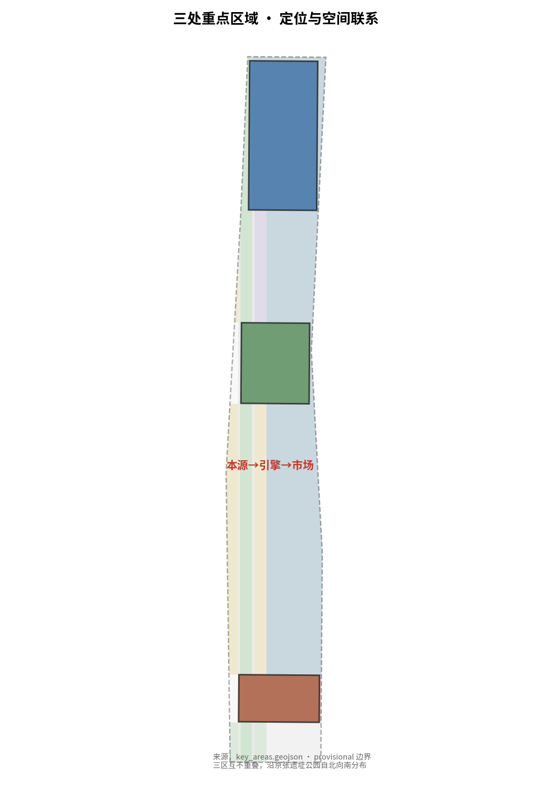

# 建木京张：从自主铁路到自主AI创新带

## 设计依据与资料清单

本方案严格基于公开或清权资料生成，全部空间结论均为**概念建议、参考方案，可供专业团队深化研究**，不替代正式规划，不构成政府审定结论。

核心依据包括：北京市规划和自然资源委员会海淀分局发布的《百年京张AI创新带城市设计国际方案征集资格预审公告》（三类范围、三处重点区域、设计任务均以此为准）[source:SRC-2026-BJ-GH-QUAL-PREANNOUNCEMENT][standard:PROJECT-OFFICIAL-ANNOUNCEMENT]；面向智能体任务书摘录（三大定位、五大功能、三区两翼、六项智能体任务）[source:SRC-2026-0518-AGENT-OPEN-CALL-TASKBOOK][standard:PROJECT-AGENT-OPEN-CALL-TASKBOOK]；住建部《城市设计管理办法》与《城市、镇控制性详细规划编制审批办法》[standard:MOHURD-URBAN-DESIGN-MEASURES][standard:MOHURD-CONTROL-DETAILED-PLANNING]。

背景依据包括：自然资源部《国土空间调查、规划、用途管制用地用海分类指南》[standard:MNR-LAND-USE-CLASSIFICATION-GUIDE]，以及北京市科委"三区两翼"布局与海淀区"1+X+1"产业体系[source:SRC-2026-BJ-KW-THREE-AREAS-WINGS][source:SRC-2026-HAIDIAN-1X1]。

**边界状态声明**：截至本方案生成时，征集方尚未发布官方法定边界多边形文件。本方案使用仓库提供的临时粗略边界（provisional boundary）生成示意几何，已按规则登记为`provisional_constraint`，不用于官方红线、审批或精确面积结论 [source:SRC-PROVISIONAL-BOUNDARIES-2026]。官方法定容积率、建筑高度、建筑密度、绿地率、退线等控制指标尚未提供[data:geometry/constraints.geojson]，全部按"待正式数据补齐"处理，不推定数值。

图片来源与派生关系：本方案全部图件由同一套 GeoJSON、指标与矩阵派生，为人读层解释，不构成权威数据 [data:geometry/site_boundary.geojson][metric:site_area_sqm]。

## 三层范围工作框架

三层范围是"产业战略—总体设计—片区深化"的逐级传导框架，本方案在每一层采用不同的工作深度与表达方式。

**统筹研究范围**（约43.6平方公里，北至北五环路、东至京藏高速、南至西直门外大街、西至万泉河路）：以产业战略与未来城市研究为主，回答"AI创新带在北京创新版图中的角色"，输出三大定位、五大功能、三区两翼协同回路与全球生态案例[source:SRC-2026-BJ-GH-QUAL-PREANNOUNCEMENT][source:SRC-2026-BJ-KW-THREE-AREAS-WINGS]。本层不输出具体地块结论[data:geometry/site_boundary.geojson#SITE-001]。

**总体设计范围**（约11.4平方公里）：本方案的全部几何与指标均落在此层，按公告要求在**控制性详细规划的城市设计深度框架**下展开（法定控制指标待官方条件补齐，本层为概念性设计响应）。以京张遗址公园为南北创新龙骨，组织用地、建筑、交通、蓝绿、分期六大图层[data:geometry/land_use.geojson][data:geometry/roads.geojson][data:geometry/phasing.geojson]，全部指标由几何在EPSG:4548下复算[metric:site_area_sqm]。

**重点区域范围**（约368.4公顷）：众智园AI自主创新加速区（约192.1公顷）、北京AI原点社区（约104.3公顷）、大钟寺AI产业聚集区（约72.0公顷）三处重点区自北向南沿京张遗址公园分布[data:geometry/key_areas.geojson][metric:key_area_count][metric:key_area_area_sqm]。三区互不重叠、全部位于总体设计范围内，每区按"定位+空间结构+建筑更新+交通慢行+公共空间+AI场景+实施风险"七要素深化[depth:three_key_area_detailed_design]。

**provisional 边界限制**：三层范围与三处重点区多边形均为临时粗略替代边界，替换官方 polygon 后需同步重算全部图层、指标与图纸[depth:risk_missing_data]。

## 统筹研究范围产业与未来城市研究

### 总体概念：建木京张

本方案提出"**建木京张**"（Jianmu Jing-Zhang，简称 Jianmu）作为一带主名称。命名取《山海经·海内南经》"**建木**"——众帝所自上下的通天神树、天地之间的天梯[source:SRC-2026-BJ-GH-QUAL-PREANNOUNCEMENT]。其契合有三：其一，**梯之象**——京张铁路（1905—1909）是中国人自行勘测、设计、施工的第一条干线铁路，以"人字形"线路翻越八达岭，本身就是一座"翻山越岭的天梯"；百年之后，同一片土地承担"AI创新带"使命，成为人类通往智能未来的新的天梯。其二，**上下之通**——建木"众帝所自上下"，是各界智慧往还的通道；AI创新带正是全球人才、数据、模型、算力经由京张"上下求索"的通路。其三，**自主之根**——建木"黄帝所为"，是文明创始之树；京张铁路亦是中国工程自主创新的原点，从**自主铁路**到**自主算力、自主模型、自主数据、自主生态**，"自主"二字一以贯之。

**从人字形铁路到建木天梯（符号与叙事同构）**：本方案以两组符号贯穿——**人字形**是历史之根（詹天佑自主创新的符号），**建木**是未来之梯（连接智能时代的符号）。其一，空间结构本身即"人字形+建木"——两条创新翼（中关村服务翼、小月河场景翼）如建木之枝汇入主脉，主脉如建木之干串联三区，是"自主创新的汇聚"[depth:overall_spatial_structure]。其二，道路网格在翼脉交汇处采用"人字"拓扑，公共空间以"人字广场"为原型反复出现，建筑组团沿建木之干的人字肌理组织，导视与Logo与之呼应[agent.1]。其三，"人字形"承载双重含义——既是一百年前"人"驾驭山川的自主，也是今天"人"驾驭智能的自主；"建木"则把这份自主引向"连接"——“他山"与"自立"、中国与世界、铁路与智能，都由这一株通天神树贯通。

三大定位的落地逻辑：**百年京张文化带**由遗址公园龙骨与铁路叙事承载；**都市AI生活体验带**由小月河场景翼与十张场景卡承载；**AI融合创新带**由三区两翼的产业空间结构承载[source:SRC-2026-0518-AGENT-OPEN-CALL-TASKBOOK]。

### 三区两翼：协同回路与功能渗透

三个重点区与两翼不是封闭的"干净分区"，而是一个**功能连续、相互渗透**的谱系[depth:overall_spatial_structure]：

- **众智园AI自主创新加速区**（北）：AI全栈自主创新体系与AI治理全球话语权——算力、模型、数据、应用全栈布局，承担"自主引擎"角色[data:geometry/key_areas.geojson#PROV-KEY-001]。
- **北京AI原点社区**（中）：世界级AI创新生态——人才、创业、开源社区，承担"创新本源"角色[data:geometry/key_areas.geojson#PROV-KEY-002]。
- **大钟寺AI产业聚集区**（南）：智能原生新业态——AI+消费、商务、场景市场，承担"场景市场"角色[data:geometry/key_areas.geojson#PROV-KEY-003]。
- **中关村科技服务翼**（西翼）：要素全球化配置、中关村IP与资本赋能，承担"服务动脉"角色。
- **小月河场景赋能翼**（东翼）：AI场景赋能与智能化活力城市，承担"生活秀场"角色。

**功能渗透**体现为三重流动机制：其一，**人才流**——原点社区创业团队到大钟寺做场景落地、携结果回原点开源，众智园技术团队到原点社区开共同工坊，三区共享同一人才池[agent.2]；其二，**要素流**——中关村翼的资本与IP向三区渗透，小月河翼的开放场景向三区回传需求[depth:land_use_layout]；其三，**开源流**——开源社区网络横跨三区，代码、模型、数据在三区之间自由流动。协同回路：**本源（人才）→ 引擎（技术）→ 市场（场景）→ 反哺本源**，两翼分别从"要素端"与"需求端"加速循环[source:SRC-2026-BJ-KW-THREE-AREAS-WINGS]。

### 全球AI创新生态案例（案例→教训→落地）

案例仅作生态机制借鉴，不编造企业名单与投资数据；每个案例只提炼一条对"建木京张"最关键的教训，并转化为可落地的空间或机制[source:SRC-2026-HAIDIAN-1X1]：

1. **硅谷-斯坦福走廊**：教训是"大学-资本-创业的正反馈必须在地理上密接"。落地：原点社区紧邻高校院所，中关村翼就近提供资本与IP，压缩"成果-转化"的空间距离[depth:land_use_layout]。
2. **波士顿 Kendall Square**：教训是"实验室不能只做研究，要和转化、企业同层"。落地：重点区共享首层设"科研成果-中试-企业"连续空间，白天科研转化、晚间服务社区。
3. **伦敦国王十字区**：教训是"铁路遗址更新不能只做绿地，要成为创新引擎"。落地：京张遗址公园不是附属绿化，而是全带创新龙骨与公共客厅[agent.4]。
4. **深圳-香港河套**：教训是"制度型开放创造要素流动"。落地：中关村服务翼设计为跨境要素配置与制度创新接口[agent.2]。
5. **杭州未来科技城**：教训是"场景是AI产业落地的第一推动力"。落地：小月河场景翼按季度开放新场景，倒逼技术迭代。
6. **新加坡纬壹科技城**：教训是"产城融合要'工作-生活-学习-娱乐'一体"。落地：三区公共空间网络承载混合功能，而非单一产业街区。
7. **东京丸之内**：教训是"轨道枢纽是创新集聚的锚点"。落地：智驿·通勤枢纽（SC-01）以轨道站点为锚组织站城一体化的创新服务[agent.3]。

### 命名体系与Logo方向

- 主名：建木京张 / Jianmu Jing-Zhang（Jianmu）
- 命名体系统一为"**干—枝—荫**"（建木意象）：干（创新主干廊道）、枝（重点区与片区）、荫（社区级AI场景驿站），全带导视系统沿用该层级；场景卡沿用通俗名"智驿"（荫下之驿）[agent.1][depth:overall_spatial_structure]。
- Logo方向：以**建木通天神树**为原型——树根嵌"人字形"（历史自主之根），树干通天（未来连接之梯），枝叶向两侧伸展（两翼协同）；色彩采用京张铁路绿皮车绿、智能蓝与石灰基调，表达"历史×技术×土地"的融合。Logo为概念方向，不涉及既定商标与字体授权[depth:height_massing_character]。

## 总体设计范围城市更新与控规深度城市设计

### 空间结构：一脉三区两翼

总体设计范围以"**一脉三区两翼**"组织：一脉为沿京张遗址公园的南北创新龙骨（公园绿地与公共空间主廊道）[data:geometry/green_space.geojson]；三区为众智园、原点社区、大钟寺三处重点区[data:geometry/key_areas.geojson]；两翼为中关村服务翼与京张遗址公园东侧的小月河场景翼[data:geometry/land_use.geojson]。核心设计动作是**东西缝合、南北贯通**：以遗址公园为缝合线，消除铁路割裂的东西城市肌理，建立连续的公共空间网络[depth:blue_green_public_space]。

### 城市更新总体框架

更新对象沿"保留—改造—新建"三类组织[data:geometry/buildings.geojson][depth:retain_renovate_demolish]：

- **保留**：历史建筑、铁路文化遗存、完整街区肌理——以遗址公园与文保要素为核心[data:geometry/constraints.geojson]；
- **改造**：科研院所周边老旧楼宇、产业园区低效空间——提升为创新孵化与场景空间；
- **新建**：重点区内面向AI产业的增量空间——以概念建筑示意，不给出法定拆改留结论[metric:building_footprint_area_sqm]。

**存量机构协同机制（"他治"维度）**：京张遗址公园沿线不是真空地带，而是北大、清华、中科院等高校院所与大量存量机构密集区。方案的"改造"建立在**协同而非置换**之上[depth:retain_renovate_demolish]：其一，改造对象的现状使用主体、产权主体与空间腾退可行性需现场调查后确认，列为待官方/专业数据补齐事项[depth:risk_missing_data]；其二，建议"校地共建、院所共营"机制——共享实验室、共同工坊向存量机构开放，改造以功能升级为导向而非搬迁导向；其三，中关村服务翼承担"疏解-转化"接驳角色，帮助存量机构把低效空间转化为创新资产[agent.2]。这些机制均为概念建议，具体产权协商与实施路径需专业团队与相关部门深化。

产业功能比例与建筑规模均为概念性设计量，法定容积率、高度、密度待官方控制条件补齐后复算[metric:floor_area_ratio][metric:building_height_m]。

### 京张遗址公园活力带

遗址公园不是"绿地附属"，而是全带的**创新龙骨与公共客厅**：南北贯通连续慢行系统，串联三区公共节点[depth:traffic_rail_slow_parking]；公园两侧布置文化展示、AI场景体验与社区服务设施[data:geometry/public_space.geojson]；风貌控制带沿公园两侧设置，保护历史环境与天际线[data:geometry/constraints.geojson]。

## 重点区域详细设计

三处重点区均以"定位+空间结构+建筑更新+交通慢行+公共空间+AI场景+实施风险"组织，结论为概念建议，供专业团队深化。

### 众智园AI自主创新加速区（约192.1公顷）

- **定位**：AI全栈自主创新引擎——算力、模型、数据、应用全栈自主[data:geometry/key_areas.geojson#PROV-KEY-001]。
- **空间结构**：以"算力核心+共性平台+验证组团"组织，东西向产业轴与南北龙骨相接。
- **建筑更新**：以新建概念建筑为主，保留既有科研院所肌理[metric:building_footprint_area_sqm]。
- **交通慢行**：依托北五环与轨道站点组织对外联系，内部以慢行优先连接各组团。
- **公共空间**：设"算力广场"一处，作为全栈自主成果展示空间。
- **AI场景**：对应"测试场·自动驾驶接驳"等产业测试验证场景[agent.3]。
- **实施风险**：算力基础设施能耗与市政承载需专业测算；区内及周边科研院所、存量机构参与共建机制需现场协商权属与使用主体，均列为待确认事项[depth:risk_missing_data]。

### 北京AI原点社区（约104.3公顷）

- **定位**：世界级AI创新生态本源——人才、创业、开源社区[data:geometry/key_areas.geojson#PROV-KEY-002]。
- **空间结构**：以高校院所与轨道站点为双锚点，"创业街区+共享实验室+社区生活圈"复合。
- **建筑更新**：保留-改造并举，老旧楼宇改造为共享实验室与共创工坊[data:geometry/buildings.geojson]。
- **交通慢行**：轨道站点一体化设计，站城融合；社区级慢行网络全覆盖。
- **公共空间**：设"人字广场"（AI交流广场），为全带核心公共空间[depth:blue_green_public_space]。
- **AI场景**：对应"开源共创工坊""社区学堂"等场景卡[agent.3]。
- **实施风险**：高校院所权属复杂，更新需协同校地权属，列为待确认事项。

### 大钟寺AI产业聚集区（约72.0公顷）

- **定位**：智能原生新业态——AI+消费、商务、场景市场[data:geometry/key_areas.geojson#PROV-KEY-003]。
- **空间结构**：以商业活力轴组织"AI市集+商务办公+场景体验"。
- **建筑更新**：以改造与新建结合，激活存量商业空间。
- **交通慢行**：依托轨道站点与城市主干路组织，人行优先的商业街区。
- **公共空间**：设"AI市集广场"，承载场景体验与公共活动[data:geometry/public_space.geojson]。
- **AI场景**：对应"AI市集""智驿·消费体验"等场景卡[agent.3]。
- **实施风险**：商业更新涉及产权与运营主体，运营机制列为待确认事项。

## AI 创新生态、人才画像与 AI+ 场景

### 五大功能锚点

AI全栈自主创新体系（众智园）、世界级AI创新生态（原点社区）、AI+场景赋能新范式（大钟寺+小月河翼）、智能化AI活力城市（全域公共空间）、AI治理全球话语权（活动体系与论坛）——五大功能分别落到空间、场景与运营机制[source:SRC-2026-0518-AGENT-OPEN-CALL-TASKBOOK]。

### AI 场景卡（10张，其中3张产业测试验证场景）

十张场景卡分三类，各有其不可替代的位置：

- **京张专属场景**（SC-01通勤枢纽、SC-05京张AI导览、SC-10开源共创工坊）：脱离"建木京张"的轨道遗址、铁路叙事与开源社区，这几张卡不成立——它们是这条带独有的[agent.3]；
- **AI产业测试验证场景**（SC-06自动驾驶接驳、SC-07低空物流、SC-08具身智能）：依托众智园全栈自主与测试场地，是"AI浓度"最高的产业带动卡[agent.3]；
- **伦理边界示范场景**（SC-02社区学堂、SC-03健康小屋、SC-04法律咨询亭、SC-09AI市集）：这类场景看似是智慧城市"标配"，但它们在方案中的定位恰恰是**展示"人类最终判断"的边界执行**——凡是涉医疗、法律、资格、未成年人的结论一律转人工，用实际场景示范AI的克制与责任边界，而非技术炫示[agent.3][source:SRC-2026-0518-AGENT-OPEN-CALL-TASKBOOK]。

| 编号 | 场景卡 | 空间落位 | 服务对象 | 隐私/人工复核边界 |
|---|---|---|---|---|
| SC-01 | 智驿·通勤枢纽（轨道AI一体化换乘） | 原点社区轨道站点 | 通勤者 | 仅匿名客流数据，人工服务兜底 |
| SC-02 | 智驿·社区学堂（AI+教育） | 原点社区生活圈 | 学生、家长 | 未成年人数据最小化，教师复核 |
| SC-03 | 智驿·健康小屋（AI辅助健康筛查） | 社区驿站 | 居民 | 医疗结论必须转人工，不替代诊疗 |
| SC-04 | 智驿·法律咨询亭（AI+法律） | 社区驿站 | 居民、创业者 | 资格、知识产权、法律结论必须转人工 |
| SC-05 | 遗址公园·京张AI导览（AI+文旅） | 京张遗址公园 | 游客 | 仅公开历史资料，导览内容人工审核 |
| SC-06 | **测试场·自动驾驶接驳**（产业测试验证1） | 众智园-小月河测试环线 | 测试企业、乘客 | 封闭/受控路段，安全员值守，数据合规 |
| SC-07 | **测试场·低空物流走廊**（产业测试验证2） | 众智园北翼 | 测试企业 | 空域合规前置，禁飞区零容忍 |
| SC-08 | **测试场·具身智能体验**（产业测试验证3） | 大钟寺场景馆 | 企业、公众 | 传感器数据现场脱敏，人工巡检 |
| SC-09 | AI市集（AI+消费/商务） | 大钟寺活力轴 | 消费者、商户 | 交易数据最小化，不强制刷脸 |
| SC-10 | 开源共创工坊（AI+创业） | 原点社区创业街区 | 开发者、初创团队 | 代码与数据贡献自愿、可追溯 |

十张场景卡全部映射到空间位置、运营主体与可视化图层[agent.3][data:geometry/phasing.geojson]，涉及资格、知识产权、医疗、法律的结论一律转人工处理，符合"人类最终判断"共创宪章[source:SRC-2026-0518-AGENT-OPEN-CALL-TASKBOOK]。

### 用户画像（5类）

- **P1 青年开发者**：开源贡献者，活跃于共创工坊与开发者社区，关注算力与数据开放。
- **P2 科研人员**：院所研究员，需要实验室-转化-企业的连续空间。
- **P3 创业者**：AI初创团队，需要资本、IP、场景三位一体的中关村服务翼支撑。
- **P4 社区居民**：原住民与新市民，需要不依赖智能设备也能获得的服务兜底。
- **P5 城市游客**：AI文化体验者，需要可感知、可讲述的朝圣路线。

## 用地、建筑规模与拆改留方案

### 用地布局

总体设计范围用地分区由几何在EPSG:4548下复算，覆盖完整、无缝隙无重叠，含产业、居住、公共服务、道路、蓝绿等十类用地[depth:land_use_layout]：

- 科研用地（0802）约693.6公顷，占60.8%——对应AI创新带核心产业功能[metric:land_use_0802_area_sqm]；
- 城镇住宅用地（0701）约119.7公顷——对应人才宜居需求[metric:land_use_0701_area_sqm]；
- 公园绿地（1401）约115.5公顷、防护绿地（1402）约15.6公顷——对应蓝绿公共空间，绿地率约11.5%[metric:land_use_1401_area_sqm][metric:green_ratio]；
- 商业服务业用地（05）约75.1公顷——对应大钟寺智能原生新业态[metric:land_use_05_area_sqm]；
- 公共服务用地：教育（0804）约26.3公顷、体育（0805）约8.1公顷、医疗卫生（0806）约9.1公顷——对应人才与社区服务设施[metric:land_use_0804_area_sqm][metric:land_use_0806_area_sqm]；
- 城镇村道路用地（1207）约37.0公顷——对应创新龙骨伴行与片区路网[metric:land_use_1207_area_sqm]；
- 留白用地（16）约41.4公顷——为未来功能预留弹性[metric:land_use_16_area_sqm]。

### 建筑规模

概念建筑基底约93.2公顷（建筑密度约8.2%）[metric:building_density]。**法定容积率、高度、密度、绿地率与退线均未提供，统一按待正式数据补齐处理**，本方案不推定任何法定控制值[metric:floor_area_ratio][metric:building_height_m]。

### 拆改留逻辑

保留（历史与文保、完整肌理）、改造（低效楼宇转创新空间）、新建（重点区增量）三类并举，具体地块拆改留结论待官方现状建筑与权属数据补齐后由专业团队深化[depth:retain_renovate_demolish]。

## 交通、轨道、市政与公共服务设施

- **道路微循环**：南北创新龙骨贯通慢行主廊道，东西支路加密连接三区与两翼[data:geometry/roads.geojson][metric:road_length_m]。
- **轨道站点一体化**：AI原点社区轨道站为"站城融合"示范，智驿·通勤枢纽场景落地于此[agent.3]。
- **慢行系统**：遗址公园连续步道+骑行道，全带慢行优先；停车与非机动车组织按待确认控规条件处理[standard:MOHURD-CONTROL-DETAILED-PLANNING]。
- **市政与新型基础设施**：分布式能源、端侧算力、感知网络与传统市政融合，作为概念策略提出，市政容量测算列为待专业确认事项[depth:municipal_new_infrastructure]。
- **公共服务设施**：创新服务平台、人才生活服务随"智驿"网络布局，覆盖三区生活圈。

## 蓝绿空间、公共空间与城市风貌

### 蓝绿系统

以京张遗址公园为南北主脉[depth:blue_green_public_space]，串联小月河蓝绿空间与各片区公园绿地，形成"一脉多珠"的蓝绿网络[data:geometry/green_space.geojson][metric:green_space_area_sqm]。绿地率约11.5%（概念值），官方绿地指标待补[metric:green_ratio]。

### AI公共空间与朝圣地标（3处）

1. **京张原点纪念碑**：设于遗址公园北端，纪念中国自主铁路的起点，铭刻"自主创新"精神，与文化叙事一体设计[agent.4][agent.5]。
2. **人字广场**：以詹天佑人字形线路为原型的大型公共广场，承载AI交流、开发者活动与公共集会[depth:overall_spatial_structure]。
3. **AI荣耀柱廊**：沿遗址公园设荣誉展示体系，展示开源贡献者、创新企业与AI里程碑，对应"荣誉展示体系"任务[agent.4]。

地标均为概念方向，不涉及授权肖像、商标与图像，不写成已批准建设[depth:risk_missing_data]。

### 城市风貌

以遗址公园风貌控制带为核心约束[data:geometry/constraints.geojson]，建筑高度、体量、风格色彩控制按城市设计管理办法要求提出控制方向[standard:MOHURD-URBAN-DESIGN-MEASURES]，具体控制值待官方条件补齐。

## 更新项目清单、实施政策与分期计划

### 分期实施（近—中—长期，含触发条件）

分期不只写时间，更写"**做到什么程度才触发下一阶段**"，全部为概念建议，具体财政与实施安排待专业团队深化[depth:phasing_implementation]：

- **近期（2026—2028）· 原点社区先导**：先导项目为原点社区共享实验室、轨道站城一体化与开源共创工坊[data:geometry/phasing.geojson#PH-P1]。**触发中期条件**：至少一处共享实验室完成共建签约、轨道站点改造完成立项、首批开发者社区落地对外运营。
- **中期（2028—2031）· 众智园全栈自主**：算力核心、共性平台、自动驾驶/低空/具身测试验证场景[data:geometry/phasing.geojson#PH-P2]。**触发长期条件**：算力平台完成关键伙伴确认、至少一个产业测试场景获批受控运行。
- **长期（2031—2035）· 大钟寺场景市场与全域运营**：AI市集、京张AI节活动体系、品牌资产沉淀[data:geometry/phasing.geojson#PH-P3]。**完成标志**：场景市场运营主体确立、年度活动体系形成稳定品牌、三区两翼协同回路跑通。

### 全球AI创新活动体系与长期运营（概念机制）

- **年度活动体系**："京张AI节"（开发者大会+开源马拉松+场景开放季），为概念建议，不表述为已确定安排[agent.6]；
- **开发者社区运营**：开源共创工坊+线上社区+贡献者荣誉体系；
- **场景开放运营**：小月河场景翼按季度开放新场景，公众预约体验；
- **国际传播与招引转化**：Jianmu品牌+全球AI朝圣路线+企业对接机制，机制为概念方向，不构成招商承诺[agent.6]。

## 指标体系、面积复算与合规矩阵

全部指标由几何在EPSG:4548下复算，来源、公式与置信度记录于metrics.json[metric:site_area_sqm][metric:green_ratio][metric:public_space_ratio]。**精度注记**：面积数值精确到平方米，但建基于 provisional 临时边界，**数值精度不代表边界的官方精度**；官方 polygon 发布后需按新几何复算全部指标[depth:metrics_recalculation]。

| 指标 | 数值 | 单位 | 设计含义 |
|---|---|---|---|
| 总体设计范围面积 | 11,412,825 | m² | 几何复算，与公告约11.4km²吻合 |
| 绿地面积/绿地率 | 1,310,355 / 11.48% | m² / — | 支撑人才宜居与蓝绿网络 |
| 公共空间面积/比例 | 169,140 / 1.48% | m² / — | 三处重点区广场+龙骨公共节点 |
| 概念建筑基底/密度 | 932,400 / 8.17% | m² / — | 概念设计量，非法定 |
| 重点区数量/面积 | 3 / 3,684,000 | 个 / m² | 公告值368.4ha（192.1+104.3+72.0） |
| 道路用地/道路长度 | 370,415 / 15,493 | m² / m | 概念路网与伴行道路 |
| 公共服务用地 | 434,173 | m² | 几何加总：教育26.3+体育8.1+医疗9.1ha≈43.4ha |

任务覆盖、专业标准与设计深度分别登记于任务覆盖矩阵、专业标准矩阵与设计深度矩阵，覆盖公告1.3/1.4/1.5全部任务与agent.1—agent.6六项智能体任务[depth:metrics_recalculation]。

## 风险、版权与合规说明

- **资料合法性**：资料全部来自公开或清权来源，来源登记于sources.json[source:SRC-2026-BJ-GH-QUAL-PREANNOUNCEMENT]；
- **边界风险**：provisional边界不用于官方红线，官方polygon发布后全部几何与指标需重算[source:SRC-PROVISIONAL-BOUNDARIES-2026]；
- **数据缺口**：法定控制指标、现状建筑、权属、工程与市政条件均待官方/专业数据补齐[depth:risk_missing_data]；
- **隐私保护**：场景卡数据最小化，医疗/法律/资格结论一律转人工[agent.3]；
- **AI生成责任**：本方案由智能体**黑耀**（基于 deepseek-v4-flash-0731 模型）在 BitFun 平台上与人类作者协作、仅基于公开资料生成，全部空间建议为概念建议，不构成规划、审批或投资结论；
- **版权**：本方案文本与图件版权声明见report/copyright_statement.md；涉及的历史、商标、字体、图像均未未经授权使用。

## 参考资料

以下为主要影响方案判断的材料（完整机器索引见 sources.json）[source:SRC-2026-BJ-GH-QUAL-PREANNOUNCEMENT]：

1. 北京市规划和自然资源委员会海淀分局：《百年京张AI创新带城市设计国际方案征集资格预审公告》（2026-05-09）
2. 《面向全球智能体开展百年京张AI创新带城市设计开源征集任务书摘录》（用户提供清权文档）
3. 北京市科委、中关村管委会：《"三区两翼"打造世界级AI集聚地》
4. 海淀区人民政府：《海淀区"1+X+1"现代化产业体系建设布局》
5. 住建部：《城市设计管理办法》（2017）
6. 住建部：《城市、镇控制性详细规划编制审批办法》
7. 自然资源部：《国土空间调查、规划、用途管制用地用海分类指南》
8. 国家网信办等：《生成式人工智能服务管理暂行办法》
9. 全国人大常委会：《中华人民共和国无障碍环境建设法》
10. 国务院办公厅：《关于切实解决老年人运用智能技术困难实施方案》（国办发〔2020〕45号）
11. 京张铁路历史研究公开资料（詹天佑与京张铁路自主建设史实）
12. 百年京张AI创新带城市设计开源征集仓库：站点包、provisional几何与评审规则文档