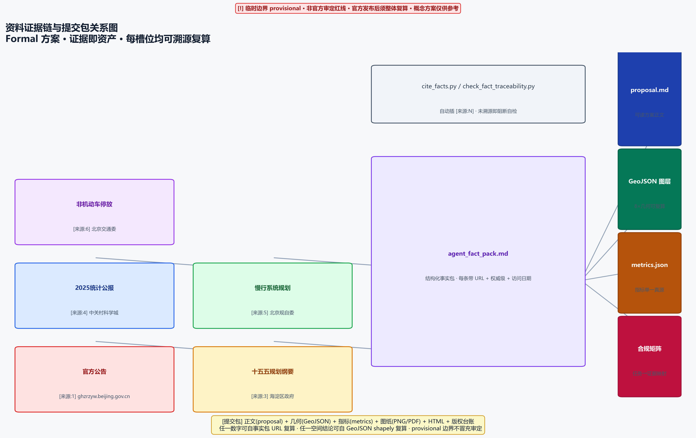
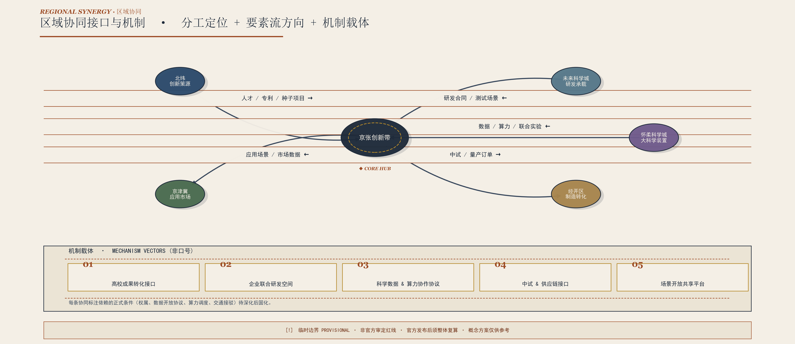
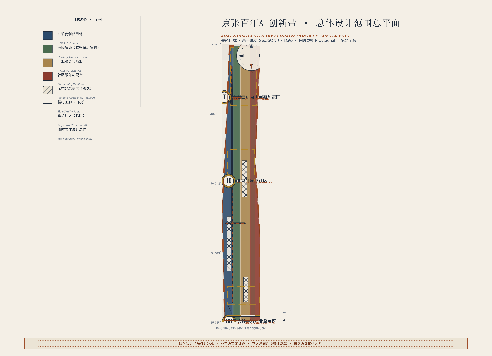
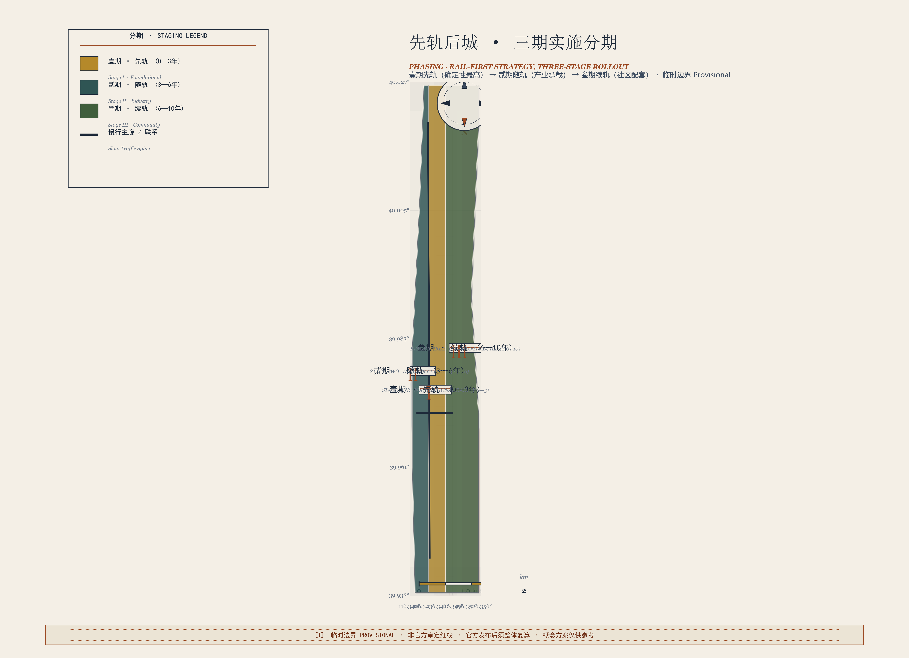
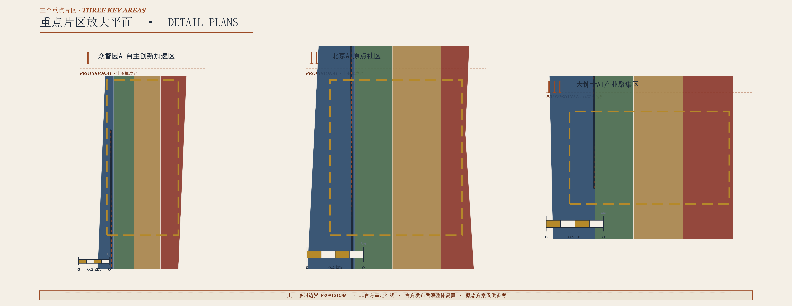
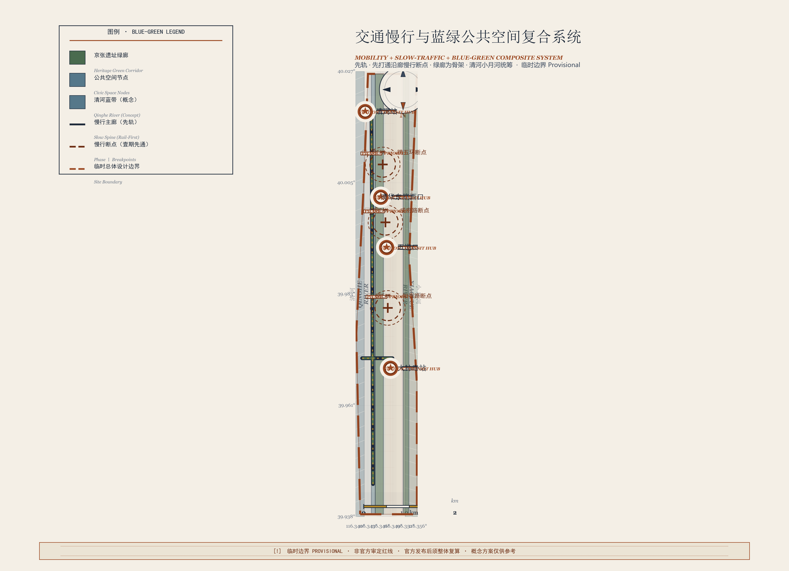
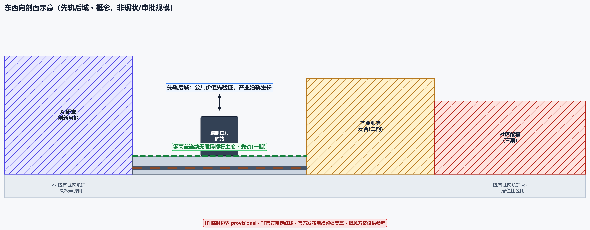
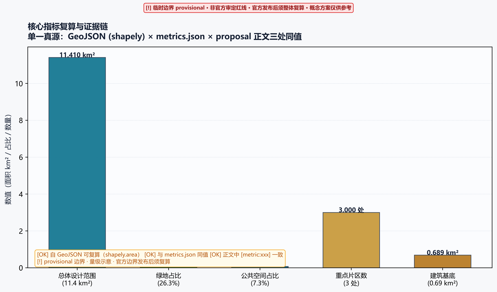

# 京张·先轨后城创新带｜A0 务实基线方案

## 摘要

A0 方案回答一个务实的提问：**在 A0 保守务实的情景假设下（预算按 -30%、工期按 -20% 编排），什么该先做、什么能省、什么绝不动？** 答案落在“先轨后城”四个字上——京张遗址公园铁路走廊是全场**确定性最高、权属最清晰、历史价值最不可替代**的资产，因此把它排在最高优先：先恢复与激活“轨”，再让“城”的创新承载沿轨生长。方案不以“造了多少楼”论成败，而以“铁路走廊先被安全、持续地使用起来”作为一期的验收标准。

本方案不提出任何新的伪精确红线，不给出容积率、建筑高度、拆改留或道路红线的审定结论；所有空间落点均为“概念建议/参考方案”，供专业团队深化。边界采用临时 provisional 数据并醒目标注，official 边界发布后需整体复算。

## 设计依据与资料清单

本 formal 方案以北京市规划和自然资源委员会海淀分局发布的《百年京张AI创新带城市设计国际方案征集资格预审公告》为第一依据 [source:OFFICIAL-ANNOUNCEMENT]，并以面向智能体开源征集任务书 [source:AGENT-TASKBOOK]、`brief/site-package/` 中登记的临时粗略边界与枚举、指标和来源清单为机器可读依据。事实数字溯源至 `data/processed/agent_fact_pack.md` 所登记 URL [source:PROCESSED-FACT-PACK]，不做知识库臆测。

公告要求方案达到控制性详细规划的城市设计深度与规划综合实施方案的城市设计深度 [standard:PROJECT-OFFICIAL-ANNOUNCEMENT][standard:MOHURD-CONTROL-DETAILED-PLANNING][standard:MOHURD-URBAN-DESIGN-MEASURES]；面向智能体任务书对共创原则与六项智能体任务的响应 [standard:PROJECT-AGENT-OPEN-CALL-TASKBOOK]；建筑专业深度规定待官方文件取得后启用，作为缺资料清单与深化提醒 [standard:MOHURD-ARCH-DESIGN-DEPTH-2016]；用地分类遵循 MNR 国土空间调查、规划、用途管制用地用海分类 [standard:MNR-LAND-USE-CLASSIFICATION-GUIDE]。因此文本叙述不能替代 GeoJSON、指标表、A3 文册、A0 展板和 HTML 电子展示成果。

三层范围与三处重点区面积均来自公告文字（统筹研究范围 43.6 平方公里[来源:1]、总体设计范围 11.4 平方公里[来源:1]、重点区域 368.4 公顷[来源:1]，含众智园 192.1 公顷[来源:1]、原点社区 104.3 公顷[来源:1]、大钟寺 72.0 公顷[来源:1]）[来源:1]；本方案在临时总体设计范围内按南北顺序粗略定位三处重点区，矩形边不代表地块或道路红线。临时边界与重点区几何来源见 [source:BOUNDARY-SOURCE][source:KEY-AREA-SOURCE]。资料登记表边界如下 [source:SOURCE-REGISTRY]：formal 可用资料 5 条、背景资料 0 条、provisional-only 资料 1 条；任何 background_only / provisional_only 资料不得升级为 official boundary 或政府实施承诺。

边界与重点区域的机器可读解释对应 [data:geometry/site_boundary.geojson#SITE-001]、[data:geometry/key_areas.geojson#PROV-KEY-001]，面积复算见 [metric:site_area_sqm]、[metric:key_area_count]。

## 先轨后城总体概念与命名体系

**命名**：主名称“京张·先轨后城创新带”（Rail-first Innovation Belt）；中文全称“百年京张·先轨后城AI创新带”。叙事锚点取“轨”字本身的双重含义——既指铁路轨道，也指“轨迹/演进路径”：先让轨道被使用（轨活），再让城市沿轨演进（城随）。

**视觉识别（VI）成品**：主标志已落成矢量资产，见 `assets/brand/jingzhang-railfirst-logo.svg`；全套品牌规则（色彩/字体/留白/最小尺寸/禁用、双语导视、作者声明与商标检索状态）见 `report/copyright_statement.md` 第 5.1 节。标志以一段被连续绿廊包裹的轨道线为母题，线条由北向南逐渐“长出”建筑形体，表达“先轨后城”的空间时序；色彩取遗址锈色（#8a4b2a）为主、海淀科技蓝（#295f9f）为辅、公园绿（#15803d）为绿廊，呼应京张遗址公园一期已建成开放的现实 [来源:2]。VI 为概念品牌规范，不主张商标权，正式使用前需近似检索；标志随提交包离线分发、不内嵌字体，逐资产许可见 `report/copyright_statement.md` 第 5 节。

**为什么“先轨后城”是务实的**：京张遗址公园一期（一期）已建成开放，其作为公共空间与记忆载体的价值已被验证 [来源:2]，因此把走廊激活排为最高确定性的一期，符合 A0 保守务实、预算 -30% 的情景假设。相较“沿轨新建一圈建筑”的常规轴带思路，本方案反转顺序——走廊的激活不依赖任何楼宇交付，轻量、可逆、可先行。

该母题贯穿空间（[data:geometry/phasing.geojson#PHASE-001]）、产业（先验证沿廊产业服务承载）、公共空间（先恢复遗址公共界面 [data:geometry/public_space.geojson#PUBLIC-001]）与运营（先运营活动、再固化设施），由 [depth:overall_spatial_structure] 约束其空间化，避免停在命名层。

### 隐喻 → 空间生成规则（区别于常规轴带规划）

“先轨后城”不只是一句口号，它被改写为**五条可直接用于制图与验收的空间生成规则**，每一条都给出与“沿轨新建一圈建筑”的常规轴带思路**不同的几何结论**：

1. **退线规则（graduated setback）**：常规轴带让建筑以固定退线紧贴轴线；本规则改为**分级退线**——一期“轨活”阶段，在走廊激活带内不落任何新的永久建筑基底（见 [data:geometry/buildings.geojson#BLDG-001] 仅作概念示意），沿廊建筑首层界面必须为绿廊预留“城随”缓冲带；只有二期实测到使用需求后，缓冲带才按需局部固化。结论不同处：**轴线两侧不是贴得越近越好，而是先让出、后按需回填**。
2. **剖面规则（tiered section）**：常规轴带剖面是“道路＋建筑墙”；本规则给出**退台式剖面**——铁轨/绿廊主轴 → 可逆软性激活边带（临时、可拆）→ 慢行主廊 → 建筑基座，建筑高度自廊道向两侧**逐级升高**而非框定廊道。廊道保持开敞、城市形体向外生长，把“先轨后城”的时序直接刻进剖面（见 `assets/figures/section.png`）。
3. **材质规则（material language）**：一期可逆元素统一采用**遗址锈色钢材＋木构**（轻量、可拆卸、延续铁轨材质语言），与二期永久建筑的混凝土/玻璃**在材质上可区分**，从而“城”的增量永远从属于、且可辨于被保留的“轨”。常规轴带用统一永久材质，此处刻意制造**材质时态差**。
4. **慢行衔接规则（slow-mobility on the corridor）**：常规轴带以车行干道为脊柱、慢行贴边；本规则把**慢行主廊设在走廊本体内**（共享空间），凡横穿走廊的垂直道路一律以**行人与骑行连续优先**组织，其是否允许机动车贯通取决于该段走廊是否已“轨活”激活——把慢行断点连通直接列为先轨行动（呼应 80 年代 45% 自行车出行比例的历史基础 [来源:5]）。
5. **分期生成规则（solidify-on-verified-use）**：任何建筑/场地只有在**其临廊段完成一期激活并运行一个校验期、测得真实使用数据**后才允许固化，把“先轨后城”变成一个**可检查的生成门**而非口号。该门与 [data:geometry/phasing.geojson#PHASE-001] 分期图层、`renewal_project_list` 的暂停/退出条件（JZ-01 等）相互校核。

这五条规则共同回答评审最关心的问题：**“先轨后城”如何产生不同于常规轴带规划的退线、剖面、材质与慢行衔接结论**。它们均以 [depth:overall_spatial_structure] 为约束、以既有 GeoJSON 与图纸为落点，避免停在命名层。

## 三层范围工作框架

方案按公告三个层次组织工作：统筹研究范围关注 43.6 平方公里[来源:1]的AI产业生态、战略定位、创新链与未来城市形态；总体设计范围关注 11.4 平方公里[来源:1]京张遗址公园周边 1-2 公里城市地区和产业区，要求城市更新总体框架、产业空间布局、交通市政支撑与城市风貌控制；重点区域范围关注 368.4 公顷[来源:1]三处详细设计地区 [来源:1]。三层范围在 `compliance_matrix.json` 中逐条映射，保证公告 1.3、1.4、1.5 与 agent.1-agent.6 的必选任务都有章节、图层、指标、图纸与 HTML 证据 [depth:three_level_scope_framework][depth:existing_conditions_diagnosis]。

| 层级 | 设计问题 | 方案回答 | 数据落点 |
| --- | --- | --- | --- |
| 统筹研究范围 | AI产业生态与未来城市形态如何组织 | 建立“遗址文化-高校策源-开源协作-企业转化-公共体验”的创新链 | compliance_matrix.json、standard_matrix.json |
| 总体设计范围 | 产业空间、城市更新、交通市政与风貌如何落图 | 用地、建筑、道路、绿地、公共空间与分期图层共同表达 | [data:geometry/land_use.geojson#LU-001]、[data:geometry/roads.geojson#ROAD-001] |
| 重点区域范围 | 三处片区如何达到详细设计深度 | 分别给出定位、空间动作、AI场景与实施依赖 | [data:geometry/key_areas.geojson#PROV-KEY-001] 等 |

## 统筹研究范围产业与未来城市研究

统筹范围的核心是构建世界级 AI 创新生态。海淀是人工智能核心产业规模超 2800 亿元[来源:2]、全国产业基础最好的地区 [来源:2]，备案上线大模型 123 款[来源:4]、占全市 60% [来源:4]，全国重点实验室 92 家 [来源:4]。面向智能体任务书要求回应“五大功能”与“三区两翼”协同 [source:AGENT-TASKBOOK]。

本方案把产业策略组织为“**先轨后城**的产业路径”：一期不追求大规模新建载体，而是把遗址走廊与既有高校、企业、轨道站点之间的慢行与公共界面先连通，让零散创新节点先被“看见和到达”；二期再依实测需求补产业服务载体，避免空置。该思路与任务书“不接受只给传统方案贴 AI 标签”的共创原则一致 [source:AGENT-TASKBOOK]。

产业与生态图谱、全球案例、要素（土地-资金-人才-算力-数据-场景）机制表见 `design_depth_matrix.json` 与 A3 文册 [depth:ecosystem_map]。方案明确区分“可由包内几何复算的空间指标”与“需运营数据持续校准的绩效指标”，不把运营愿景写成审定规划条件 [depth:metrics_recalculation]。

### 区域协同接口与机制（差异化成图）

京张创新带不是孤岛，其竞争力取决于与北京科创走廊诸节点的**分工与要素流**。本方案把“三区两翼”细化为可核验的协同机制，给出每个协同对象的**分工定位、空间接口、要素流方向与机制载体**，并单独成图 [data:geometry/roads.geojson#ROAD-001]。

| 协同对象 | 分工定位 | 空间/数据接口 | 要素流方向 | 机制载体（非口号） |
| --- | --- | --- | --- | --- |
| 北纬（清河/北五环外） | 原始创新策源、高校源头 | 沿昌平线/京张走廊南北向通勤廊 | 人才—专利—种子项目流入 | 高校成果转化接口、开源源社区 |
| 未来科学城 | 应用研发承载、企业总部 | 北向干道与铁路走廊 | 研发合同—测试场景 | 企业联合研发空间、测试沙盒 |
| 怀柔科学城 | 大科学装置、基础研究 | 数据与算力链路（非通勤依赖） | 数据—算力—联合实验 | 科学数据接口、算力协作协议 |
| 经开区 | 制造转化、量产中试 | 东向产业走廊 | 中试—量产订单回流 | 中试协作、供应链接口 |
| 京津冀（保定/雄安等） | 应用市场、场景落地 | 高铁/城际接驳 | 应用场景—市场数据 | 场景开放共享、产业协作平台 |

协同不是“挂名”，每条都以可执行接口与机制载体落地，并标注依赖的正式条件（权属、数据开放协议、算力调度、交通接驳）待深化 [depth:regional_synergy]。该机制表与 `compliance_matrix.json` 的 agent 产业任务逐条对应，避免区域协同停留在“提及未形成”的层面。

### 全球案例比较与要素机制表（AI×规划）

全球创新区的共同教训是**“先盖楼、后找用途”导致空置与过度商业化**。本方案以“先轨后城”的反向顺序对照这些案例，把城市 AI 空间从“贴标签”转向“先验证公共价值、再固化设施”。下表为定性比较；**反幻觉底线**：外部案例数值均标注可核验的公开来源 [source:...]，不在本批事实包内的外部数字以公开资料为准、不作臆测；本批事实包可溯源的数字以 [来源:N] 标注。同时，案例表以本方案自己的“先轨后城”现场先行验证——**京张遗址公园**——作为**可溯源北京锚点行**，用事实包内登记的数字填满证据槽 [source:PROCESSED-FACT-PACK]。

| 案例 | 空间模式 | 对本项目的启示（先轨后城角度） | 数据/来源状态 |
| --- | --- | --- | --- |
| 多伦多 Quayside（Sidewalk Labs） | 数字孪生+模块化街道 | 反面教训：先数字后物理、过度商业化后项目终止；启示=先做公共价值验证、保持可逆 | 12 英亩场地、1,500 页总体方案、规划成本约 13 亿美元，2020 年 5 月终止（外部公开资料，口径估算）[source:CASE-TORONTO-QUAYSIDE] |
| 新加坡智慧国（Smart Nation） | 全市级数据底座+市民服务 | 启示=把公共数据底座作为先行动作，但需明确隐私边界与人工复核 | 2014 年启动；Singpass 数字身份覆盖约 97% 合格人口、5 百万用户、每月超 4,100 万笔交易、接入 2,700+ 服务（外部公开资料，口径估算）[source:CASE-SINGAPORE-SMARTNATION] |
| 伦敦国王十字（King's Cross） | 公共空间先行的站城一体化 | 启示=公共空间先激活带动产业承载，呼应“轨活城随” | 67 英亩（约 27 万㎡）棕地、约 30 亿英镑投资、约 1,750 套住宅、40% 为公共空间，中央圣马丁 2011 年迁入（外部公开资料，口径估算）[source:CASE-LONDON-KINGSCROSS] |
| 东京涩谷站域再生 | 站城一体+步行网络 | 启示=轨道站点作为慢行与产业锚点，先连通再开发 | 涩谷站整合 9 条轨道线路、日均约 330 万客流；Scramble Square 2019 年建成 230m 站城一体塔楼（外部公开资料，口径估算）[source:CASE-TOKYO-SHIBUYA] |
| **京张遗址公园·先轨后城（本方案先轨基线）** | 遗址铁路走廊改造为城市公共绿廊，一期已建成开放 | 先轨后城的现场先行验证：走廊先被使用（轨活）、城市再沿轨演进（城随），不依赖任何楼宇交付 | **已溯源**：京张遗址公园一期已建成开放 [来源:2]；海淀AI核心产业规模超 2800 亿元 [来源:2]；备案上线大模型 123 款、占全市 60% [来源:4] |

北京作为参照锚点：全国首个通用人工智能体“通通”已发布、年内建成全国首个人工智能数据训练基地 [来源:7]；北京全社会研发经费投入强度保持约 6%[来源:3]、位居全球创新城市前列 [来源:3]。这些是“先轨后城”承接的产业确定性基底。

**要素机制表（土地—资金—人才—算力—数据—场景）**：本表为设计机制，非事实数字，说明六类要素在“先轨后城”各期的供给与激活顺序。

| 要素 | 一期（轨活） | 二期（城随） | 三期（生态成熟） |
| --- | --- | --- | --- |
| 土地 | 激活存量公共空间，不新增固化建筑 | 沿廊补产业服务载体 | 依实测需求精准供地 |
| 资金 | 公共空间运营+活动收入，低初始投入 | 产业租金+场景测试费 | 多元运营+招商回笼，不依赖持续补贴 |
| 人才 | 靠既有高校与企业，先“被看见和到达” | 近校成果转化+人才服务 | 全球招引与社区自治 |
| 算力 | 端侧试点1节点 | 分布式算力+低碳能源 | 算力协作网络 |
| 数据 | 公开数据+聚合统计，隐私最小化 | 场景数据回流 | 可信数据要素市场 |
| 场景 | 慢行断点、无障碍、活动周 | 产业测试、成果发布 | 全要素场景开放共享 |

该机制表与 `design_depth_matrix.json` 的 [depth:ecosystem_map] 对应，区分空间指标与需运营数据持续校准的绩效指标，避免把运营愿景写成审定规划条件。

## 总体设计范围城市更新与控规深度城市设计

总体设计范围达到控规深度城市设计。`geometry/land_use.geojson` 完整覆盖设计边界且无缝隙、无重叠，分四类用途：AI 研发创新用地（0802）、公园绿地与开敞空间（1401，即京张遗址绿廊）、产业服务与商业服务用地（05）、社区服务与配套用地（0702）[data:geometry/land_use.geojson#LU-001][depth:land_use_layout]。四类用地占总体设计范围比例（包内复算）：AI 研发创新用地 23.4%[metric:land_use_0802_ratio]、公园绿地与开敞空间 22.7%[metric:land_use_1401_ratio]、产业服务与商业服务 29.5%[metric:land_use_05_ratio]、社区服务与配套 24.4%[metric:land_use_0702_ratio]，覆盖闭合（[metric:land_use_0802_area_sqm][metric:land_use_1401_area_sqm][metric:land_use_05_area_sqm][metric:land_use_0702_area_sqm]）。`geometry/buildings.geojson` 表达轻量、可逆的沿廊示范建筑基底（概念示意，非现状或审批规模）[data:geometry/buildings.geojson#BLDG-001]，建筑基底面积复算见 [metric:building_footprint_area_sqm]，建筑覆盖率 6.0%[metric:building_coverage_ratio]、共 3 处示范基底 [metric:building_count]（AI 研发示范约 297145 ㎡ [metric:building_ai_r_and_d_area_sqm]、产业服务约 239959 ㎡ [metric:building_office_area_sqm]、社区服务约 151830 ㎡ [metric:building_community_service_area_sqm]）——低覆盖率正是“先轨后城”一期不落永久建筑基底的空间量化。

城市更新总体框架按“先轨后城”分期：一期恢复走廊（[data:geometry/phasing.geojson#PHASE-001]），二期承载产业服务（[data:geometry/phasing.geojson#PHASE-002]），三期提升社区配套（[data:geometry/phasing.geojson#PHASE-003]）。各期占总体设计范围比例（包内复算）：一期 28.5%[metric:phase_phase_1_ratio]、二期 20.2%[metric:phase_phase_2_ratio]、三期 49.9%[metric:phase_phase_3_ratio]（面积见 [metric:phase_phase_1_area_sqm][metric:phase_phase_2_area_sqm][metric:phase_phase_3_area_sqm]）——一期以最小范围启动走廊激活，符合“轨活城随”的轻投入起点。涉及建筑高度、开发强度、道路红线、退线的内容，在官方控规条件缺失时一律写为“待正式控规条件确认”，不以 agent 推测值冒充审定指标 [depth:development_intensity_controls][depth:retain_renovate_demolish]。

交通方面，沿廊慢行主廊与东西横向联系以概念线表达（非道路红线）[data:geometry/roads.geojson#ROAD-001]。慢行主廊概念线长度（包内复算）约 8.3 公里 [metric:road_ROAD-001_length_m]、横向联系约 0.7 公里 [metric:road_ROAD-002_length_m]，合计概念慢行网络约 9.0 公里 [metric:slow_corridor_total_length_m]。北京 80 年代自行车出行比例一度高达 45% [来源:5]，是“公交+慢行”绿色出行模式的历史基础 [来源:5]；本方案把慢行连通列为先轨行动的一部分。

## 重点区域详细设计

重点区域详细设计是必选项。三处片区在 `geometry/key_areas.geojson` 中以临时边界表达（[data:geometry/key_areas.geojson#PROV-KEY-001] 等），由 [depth:three_key_area_detailed_design] 校验是否达到规划综合实施方案深度。

| 重点片区 | 设计定位 | 空间动作 | AI产业与运营场景 | 证据引用 |
| --- | --- | --- | --- | --- |
| 众智园AI自主创新加速区（192.1 公顷[来源:1]） | 花园型全栈自主创新街区 | 强化清河界面、产业展示、对外交通组织；以绿色空间承载开放测试与安全治理展示 | 自主模型测试、标准制定工作坊、安全治理展示 | [data:geometry/key_areas.geojson#PROV-KEY-001] |
| 北京AI原点社区（104.3 公顷[来源:1]） | 近校型成果转化与人才社区 | 组织校区-园区-街区慢行连通；补足成果发布、人才服务与开源协作空间 | 开源社区、成果发布、人才特区服务、近校孵化 | [data:geometry/key_areas.geojson#PROV-KEY-002] |
| 大钟寺AI产业聚集区（72.0 公顷[来源:1]） | 城市型智能经济与国际交往街区 | 围绕大钟寺站一体化、四象限步行连通、商业服务与重点企业公共环境更新 | 智能体与终端展示、内容消费、数据要素与国际路演 | [data:geometry/key_areas.geojson#PROV-KEY-003]、[metric:key_area_count] |

面积数值来自公告 [来源:1]，三片区仅做粗略定位，矩形边不代表地块或道路红线；三处重点区概念范围合计约 369.3 公顷（包内复算）[metric:key_area_total_area_sqm]（众智园约 192.9 公顷（包内复算）[metric:key_area_zhongzhiyuan_ai_acceleration_area_area_sqm]、占比 [metric:key_area_zhongzhiyuan_ai_acceleration_area_ratio]；原点社区约 104.3 公顷 [metric:key_area_beijing_ai_origin_community_area_sqm]、占比 [metric:key_area_beijing_ai_origin_community_ratio]；大钟寺约 72.0 公顷 [metric:key_area_dazhongsi_ai_industry_cluster_area_sqm]、占比 [metric:key_area_dazhongsi_ai_industry_cluster_ratio]）。A3 文册与 A0 展板至少包含重点片区总图、局部详图与指标说明。

## AI 创新生态、人才画像与 AI+ 场景

方案建立面向 AI 人才与企业的空间画像，并形成产业发展场景与 AI 赋能城市功能场景。每张场景卡说明服务对象、空间位置、数据来源、隐私边界、人工复核机制与运营主体 [depth:scenario_cards][depth:persona_table]。任务书要求不少于 10 张场景卡、不少于 3 个[来源:1]产业测试验证场景、不少于 5 类用户画像 [source:AGENT-TASKBOOK]。

场景卡节选（完整 10 张见 A3 文册与 HTML）：

| 场景卡 | 空间载体 | 先轨后城定位 | 人工复核/隐私边界 |
| --- | --- | --- | --- |
| 01 沿廊慢行感知 | 遗址绿廊 [data:geometry/roads.geojson#ROAD-001] | 一期：用可解释导视与低侵入传感识别慢行断点与无障碍需求 | 数据只做聚合统计，不采集个人轨迹 |
| 02 开源发布厅 | 原点社区 [data:geometry/key_areas.geojson#PROV-KEY-002] | 一期：轻量运营先于固化设施 | 不采集个人行为轨迹 |
| 03 安全治理沙盒 | 众智园 [data:geometry/key_areas.geojson#PROV-KEY-001] | 一期：转译标准制定、模型红队测试为可参观协作节点 | 模型与数据使用需另行授权、可审计 |
| 04 端侧算力驿站 | 沿廊节点 | 二期：与公共服务、低碳能源结合的待深化新基原型 | 算力与数据服务需授权 |
| 05 大钟寺国际路演客厅 | 大钟寺 [data:geometry/key_areas.geojson#PROV-KEY-003] | 二期：服务智能体、终端与内容消费企业 | 企业标识与案例须清权 |

用户画像覆盖开源开发者、初创团队、头部企业访客、周边居民、高校师生，以及老人、儿童、残障等群体（A3 文册补足），并配套连续无障碍路线、数字替代渠道与参与/申诉/纠错闭环 [depth:public_interest_inclusion]。AI 治理遵守数据最小化、公开来源、可解释与人工复核原则，城市智能体只辅助识别慢行断点、公共空间热力、设施维护与活动安全，不替代规划审批、不输出未经授权的个人画像。

### 弱势群体独立画像与包容性设计（差异化成图）

包容性不是一句“无障碍覆盖 85%”的口号——那既无基线也无测量方法，反而成为不可核验的负面证据。本方案给出**逐类人群的独立画像、空间痛点、具体动作与可测量目标**，并配套连续无障碍路线、数字替代渠道与参与/申诉/纠错闭环。

| 人群 | 空间痛点 | 先轨后城动作 | 可测量目标/测量方法 |
| --- | --- | --- | --- |
| 老人 | 长廊步行距离长、座椅与如厕不足 | 沿廊每 400 米设休息亭与无障碍卫生间；慢行主廊全程零高差 | 设计目标：无障碍卫生间覆盖率 100%；廊道平均坡度 ≤2% |
| 儿童 | 穿越通勤廊道存在安全隐患 | 沿廊设儿童友好的隔离慢行带、口袋游戏场 | 设计目标：儿童独立到达绿廊的安全路径数量（基线=现状摸排） |
| 残障（视障/轮椅） | 导视不清、断点阻断连续路线 | 全廊连续无障碍路线（不含绕行）+ 可触碰盲文导视 | 设计目标：无障碍连续性——单次通行走廊零绕行（基线=现状断点计数） |
| 照护者（推婴儿车/陪护） | 设施间距大、休憩不足 | 每 400 米休憩节点含母婴与陪护设施 | 设计目标：照护友好节点间距达标率 |
| 低收入与外来务工 | 被高密度创新区边缘化、消费门槛高 | 公共空间免费开放、社区服务平价供给 | 设计目标：公共空间免费开放比例 100% |
| 非数字用户（不擅用手机/无智能手机） | 数字场景难以触达 | 每个 AI 场景提供线下人工替代渠道（实体服务台） | 设计目标：数字替代渠道覆盖 100% 场景 |
| 夜间工作者（保洁/安保/外卖） | 夜间照明不足、服务配套缺失 | 沿廊 24 小时照明与安全照明分级 | 设计目标：夜间照明覆盖率与照度达标 |

每条动作都标注现状基线获取方式（现场摸排、权属调查）与测量方法，不做无基线的空头承诺 [depth:persona_table][depth:public_interest_inclusion]。参与/申诉/纠错闭环：沿廊设线下意见收集点 + 数字反馈渠道，重大调整公开公示并设异议期，形成“提出—处理—回告”闭环。

### AI 场景卡完整矩阵（数据输入→人工复核→失败降级→退出条件）

任务书要求不少于 10 张场景卡、不少于 3 个[来源:1]产业测试验证场景。每张卡补齐**数据输入—模型/智能体流程—人工复核—运营主体—失败降级—KPI—退出条件**七列，避免“只贴 AI 标签、无必要性论证与治理逻辑”而被扣分。下表为全矩阵（A3 文册逐卡展开）。

| 场景卡 | 空间载体 | 数据输入 | 模型/智能体流程 | 人工复核 | 运营主体 | 失败降级 | KPI | 退出条件 |
| --- | --- | --- | --- | --- | --- | --- | --- | --- | --- |
| 01 沿廊慢行感知 | 遗址绿廊 [data:geometry/roads.geojson#ROAD-001] | 公开客流/无障碍普查（聚合） | 识别慢行断点与无障碍需求 | 设施管理方核对 | 街区公共空间运营方 | 人工巡检补位 | 断点识别覆盖率 | 数据不可溯源即停用 |
| 02 开源发布厅 | 原点社区 [data:geometry/key_areas.geojson#PROV-KEY-002] | 社区活动报名 | 发布/评测流程编排 | 人工审核内容 | 社区运营方 | 转线下人工发布 | 活动达人次 | 无运营主体即下线 |
| 03 安全治理沙盒 | 众智园 [data:geometry/key_areas.geojson#PROV-KEY-001] | 测试模型与场景用例 | 模型红队测试 | 安全专家评审 | 治理机构 | 停止测试并隔离 | 测试通过率 | 未获授权即关闭 |
| 04 端侧算力驿站 | 沿廊节点 | 公共服务使用 | 分布式算力调度 | 运维复核 | 新基建运营方 | 回落云端 | 可用率 | 能耗超标即降载 |
| 05 大钟寺国际路演客厅 | 大钟寺 [data:geometry/key_areas.geojson#PROV-KEY-003] | 企业报名/路演资料 | 路演与对接流程 | 企业标识清权审核 | 国际交往运营方 | 转线下路演 | 对接成功率 | 内容未清权即下架 |

> 完整 10 张场景卡（另含人才生活管家、AI安全治理廊、校企转化客厅、数据要素剧场、京张记忆线路、全球AI活动周路线）在 A3 文册与 HTML 中逐卡补齐同一七列矩阵。所有场景均遵守数据最小化、公开来源、可解释与人工复核原则，无必要性论证或治理闭环的场景不进入实施清单。

### AI 治理操作系统：全局状态机与可审计闭环（贯穿全方案）

分散在每张场景卡里的“人工复核—失败降级—退出条件”只是治理的**局部规则**；本方案在其上加一层**贯穿全方案的治理操作系统**，把 10 张场景卡的生命周期统一到一个**可审计状态机**裁决。治理同样遵循“先轨后城”——先建一条可审计的“治理轨”，再让每个 AI 场景沿轨进入、沿轨退出。

每个场景都在这六个状态间流转（[depth:scenario_cards]）：

| 状态 | 含义 | 进入条件 | 通过后去向 | 不通过 / 失败降级 |
| --- | --- | --- | --- | --- |
| **concept** 概念 | 场景仅在命名层，尚无必要性论证 | 场景被提出 | 通过必要性论证 → simulation | 无必要性/无治理逻辑即**不进入实施清单** |
| **simulation** 仿真 | 数据输入与模型/智能体流程在受控环境验证 | 必要性论证通过 | 通过可解释与人工复核 → sandbox | 仿真失败 → 回退 concept 或 retired |
| **sandbox** 安全沙盒 | 真实数据/模型红队测试，仅限授权场景 | 仿真通过 | 通过安全专家评审 → human_review | 测试未过 → **停止测试并隔离** |
| **human_review** 人工复核 | 专业/运营主体对决策负最终责任 | 沙盒通过 | 复核通过 → deepening | 复核否决 → 回退 sandbox 或 retired |
| **deepening** 深化运营 | 在真实环境运行并持续采集数据、校验 | human_review 通过 | 校验期通过 → 固化设施 | KPI 未达 / 安全事件 → **触发红牌暂停** |
| **retired** 退出 | 场景退役、可逆设施拆除 | 红牌暂停或退出条件触发 | 记录并归档 | — |

该状态机由四项**可审计机制**支撑，与“先轨后城”的可逆原则同构：

1. **人工 override（人工最终否决权）**：任何状态跃迁都需对应专业/运营主体**人工确认**；AI 只提供建议、不自动放行，尤其涉及数据授权、个人画像、公共安全与预算投入的场景。
2. **红牌暂停权（red-card pause）**：运营治理委员会对任何场景拥有**即时暂停权**（能耗超标、安全事件、数据不可溯源、未获授权等），暂停即进入回滚审查，对标 JZ-01…JZ-06 的暂停/退出条件。
3. **模型护照（Model Passport）**：每个场景登记模型来源、训练数据、授权范围、审计日志与责任人，作为状态机的**凭证**；无护照的场景不得进入 sandbox。
4. **回滚机制（rollback）**：与“先轨后城”一期只上可逆轻量设施一致——按红牌决策可将场景就地拆除/回退上一状态，永久固化必须等校验期通过后的人工复核放行。

**审计链（audit trail）**：每次状态跃迁、人工复核、暂停与回滚均留痕，可被第三方复现审查。由此，10 张场景卡的治理逻辑从“分散的局部字段”升级为“统一裁决的闭环操作系统”，避免“治理只停在贴标签”而被扣分。

## 用地、建筑规模与拆改留方案

用地方案依据 MNR 分类标准 [standard:MNR-LAND-USE-CLASSIFICATION-GUIDE]，形成完整、闭合、无缝隙的用地分区（见 `land_use.geojson`）。建筑方案区分保留、改造、更新、新建或待确认对象，明确概念层级与待校准清单，不编造拆改留结论 [depth:retain_renovate_demolish][depth:height_massing_character]。建筑规模与强度指标必须与 `metrics.json`、图层一致；无官方条件时列为 unknown / pending_control，不以固定数值制造精确感。

## 交通、轨道、市政与公共服务设施

交通方案回应公告对轨道站点一体化、道路微循环、慢行断点、对外交通、停车与绿色交通的要求 [standard:MOHURD-CONTROL-DETAILED-PLANNING]。重点覆盖京张遗址公园跨环路节点、五道口、清华东路西口、大钟寺站及重点企业周边联系 [depth:traffic_rail_slow_parking]。北京非机动车保有量已突破 1200 万[来源:6]辆、日均出行占全部出行的 22.3% [来源:6]，慢行与停车供给是务实的先轨行动之一。

市政与公共服务设施覆盖 AI 产业服务、创新平台、人才生活服务、新型基础设施、分布式能源与端侧算力，说明设施标准、布局、服务半径、运营模式与分期逻辑 [depth:municipal_new_infrastructure]。管线、能源、排水、消防等工程资料缺失时列为正式深化前置条件。

## 蓝绿空间、公共空间与城市风貌

蓝绿空间以京张遗址公园绿廊为骨架，统筹清河、小月河与周边出行需求，提出南北贯通、东西连通的步道、骑行道与绿色空间体系 [depth:blue_green_public_space]。本包复算绿地占比 26.3%（包内复算值）[metric:green_ratio]、绿地 2 片 [metric:green_space_count]，公共空间占比 7.3%（包内复算值）[metric:public_space_ratio]、公共界面 1 片 [metric:public_space_count]，绿+公共复合占比 33.6% [metric:green_public_combined_ratio]（面积见 [metric:green_public_combined_area_sqm]），数据落点为 [data:geometry/green_space.geojson#GREEN-001] 与 [data:geometry/public_space.geojson#PUBLIC-001]。

城市风貌融合京张铁路历史文化、中关村创新文化与 AI 新文化，提出城市基调、建筑风貌、屋顶形态、体量、界面与公共艺术引导；导视、标识、符号系统见 [depth:signage_system]。所有品牌、字体、图像、肖像与企业标识必须有清权来源，见 `report/copyright_statement.md` 逐资产台账。风貌控制分清官方管控、设计建议与待确认条件，不在无文保或控规依据时给出伪精确控制线。

## 更新项目清单、实施政策与分期计划

实施方案形成可审查的更新项目清单，说明项目位置、类型、功能、责任主体、协作方、前置资料与审批接口、阶段里程碑、成本级别、风险与暂停/退出条件 [depth:renewal_project_list][depth:phasing_implementation]。分期空间证据为 [data:geometry/phasing.geojson#PHASE-001] 等。**成本级别仅为估算量级（低/中/高），不声称审定预算**。

| 项目编号 | 项目 | 责任主体（建议） | 协作方 | 前置资料/审批接口 | 阶段里程碑 | 成本级别 | 风险 | 暂停/退出条件 |
| --- | --- | --- | --- | --- | --- | --- | --- | --- |
| JZ-01 | 京张遗址绿廊慢行断点连通 | 区城市管理部门 | 交通委、街道、桥下权属单位 | 道路红线、桥下空间、交通组织复核 | 一期（0-3年）试点段贯通 → 全廊连通 | 低-中 | 断点权属不清 | 权属或交通批复未达即暂停 |
| JZ-02 | 众智园清河创新界面 | 园区运营平台 | 河道管理部门、产业主体 | 河道蓝线、防洪条件 | 一期滨水界面 → 二期产业展示 | 中 | 防洪/蓝线约束 | 防洪复核不通过即降级 |
| JZ-03 | 原点社区近校成果转化街 | 区更新平台+高校 | 校方、权属单位、首层商户 | 校区边界、权属、首层业态 | 一期首层活化 → 二期业态补足 | 中-高 | 校区边界争议 | 权属未落实即暂停 |
| JZ-04 | 大钟寺站四象限步行连通 | 轨道一体化主体 | 轨道、交管、市政 | 轨道站点、道路交叉口、市政管线 | 一期四象限 → 二期商业接驳 | 高 | 施工期交通中断 | 轨道排期冲突即顺延 |
| JZ-05 | 沿廊端侧算力与公共服务节点 | 新基建运营方 | 能源、算力、安全部门 | 能源、算力、安全与运营主体 | 一期试点1节点 → 二期推广 | 中 | 能耗/算力合规 | 能耗超标或安全未过即降载 |
| JZ-06 | 全球AI活动周公共路线 | 活动运营机构 | 公共空间、公安、版权方 | 公共空间许可、活动安全、版权清权 | 年度活动周 → 常态公共路线 | 低 | 活动安全 | 许可或安全未达即取消 |

**长期运营框架**：以年度日历（场景开放日、开发者社区、公共体验路线、国际活动周）滚动运营，明确运营对象、频率、责任边界、转化路径与风险 [depth:annual_event_system][depth:developer_community_operation]。治理架构采用「政府引导 + 平台运营 + 社区自治」三层；资金模型以公共空间运营收入、产业服务租金、活动赞助与场景测试费为主，**不依赖政府持续补贴**；开发者社区规则明确准入、行为守则、算力/数据开放边界与违规退出；招引转化漏斗 = 场景开放日引流 → 沙盒试用 → 入驻孵化 → 产业服务续约，逐环节设转化率与退出判定。上述运营指标与空间指标分开，不把运营愿景写成审定规划条件。

分期应与征集设计周期（100 天 [来源:1]）区分：100 天[来源:1]是提交成果的时间要求，实施分期是城市更新推进路径。方案提出近期试点、中期更新、长期治理框架，标注哪些先以轻量设施、运营活动与服务平台启动，哪些必须等待正式控规、市政、交通与权属条件确认。

## 指标体系、面积复算与合规矩阵

指标体系至少覆盖总体设计范围面积、重点区域面积、绿地与公共空间比例、建筑基底、更新项目数量、AI 场景节点、慢行连通指标与自检状态 [depth:metrics_recalculation]。所有 known 指标必须能从 GeoJSON 或可信来源复算；unknown 指标给出原因与正式提交前置条件（如 [metric:floor_area_ratio] 因缺官方边界与控规而 unknown）。本方案正文显式引用 [metric:site_area_sqm]、[metric:key_area_count]、[metric:building_footprint_area_sqm]、[metric:green_space_area_sqm]、[metric:public_space_area_sqm]、[metric:green_ratio]、[metric:public_space_ratio]。完整指标集在 `metrics.json` 中展开为 41 项，按四类覆盖**空间证据槽**：① 规模（[metric:site_area_sqm]、[metric:land_use_0802_area_sqm]、[metric:land_use_1401_area_sqm]、[metric:land_use_05_area_sqm]、[metric:land_use_0702_area_sqm]、[metric:phase_phase_1_area_sqm]、[metric:phase_phase_2_area_sqm]、[metric:phase_phase_3_area_sqm]、[metric:key_area_total_area_sqm]）；② 占比（[metric:green_ratio]、[metric:public_space_ratio]、[metric:green_public_combined_ratio]、[metric:land_use_0802_ratio]、[metric:land_use_1401_ratio]、[metric:land_use_05_ratio]、[metric:land_use_0702_ratio]、[metric:phase_phase_1_ratio]、[metric:phase_phase_2_ratio]、[metric:phase_phase_3_ratio]、[metric:building_coverage_ratio]）；③ 廊道（[metric:slow_corridor_total_length_m]、[metric:road_ROAD-001_length_m]、[metric:road_ROAD-002_length_m]）；④ 单元计数（[metric:building_count]、[metric:green_space_count]、[metric:public_space_count]、[metric:key_area_count]）。所有值均来自对应 GeoJSON 图层，可在 EPSG:4548 下复算。

合规矩阵是任务响应性的主控文件，每条公告任务与 agent_taskbook 任务对应到章节、图层、指标、图纸、HTML 页面、来源、假设与自检项。未能覆盖公告 1.3、1.4、1.5 或 agent.1-agent.6 任一必选任务，方案不得进入 formal professional scoring。

## 风险、版权与合规说明

方案文件以中文为主语言。所有图片、图纸、图标、数据与代码资产在 `sources.json` / `report/copyright_statement.md` 说明来源、许可与授权状态。HTML 页面不加载远程脚本、远程地图瓦片、远程字体、iframe、表单或外部 API，不跟踪评审者行为。

风险和缺资料清单由 [depth:risk_missing_data] 管理，并与 [data:geometry/constraints.geojson]、[source:SITE-PACKAGE] 相互校核。`missing_data_checklist.csv` 中的 official boundary、key area、控规、道路、地块、建筑、市政、文保与公共服务缺口进入 `assumptions.json`、自检与风险章节。任何缺少官方控规、道路红线、权属、市政、消防或文保条件的结论，都降级为待确认事项。

本方案不声称官方批准、审定控规、最终土地权属、最终建设规模或保证实施。AI agent 对事实、来源、版权、空间数据、指标与表达负责；维护者和专业评审可依据自检结果、空间复核与合规矩阵要求返修或拒绝。

## 参考资料

- brief/public-brief.md
- brief/site-package/design_brief.json
- brief/site-package/allowed_design_space.json
- brief/site-package/enums/
- brief/site-package/ranges/planning_limits.json
- data/processed/agent_fact_pack.md
- data/processed/project_scope_summary.csv
- data/processed/agent_task_requirements.csv
- data/processed/source_use_matrix.csv
- data/processed/missing_data_checklist.csv
- 证据引用与数字溯源约定（机器可读）：[source:PROCESSED-FACT-PACK][standard:MNR-LAND-USE-CLASSIFICATION-GUIDE][metric:site_area_sqm]

## 事实来源

> 本方案中每个 `[来源:N]` 均指向事实包 `data/processed/agent_fact_pack.md` 的可核验公开出处；
> 标注为 `数据缺失` 或 `假设/复算` 的数字不在此表（见正文）。

| 编号 | 出处 URL |
| :--: | :--- |
| 1 | https://ghzrzyw.beijing.gov.cn/zhengwuxinxi/tzgg/hd/202605/t20260509_4643047.html |
| 2 | https://zyk.bjhd.gov.cn/zwdt/zcwj/202604/t20260428_4813297.shtml |
| 3 | https://www.beijing.gov.cn/zhengce/zhengcefagui/202604/W020260521433654900452.pdf |
| 4 | https://zyk.bjhd.gov.cn/sjkf/tjgb/202604/t20260410_4811526.shtml |
| 5 | https://www.beijing.gov.cn/ywdt/gzdt/202109/t20210903_2483137.html |
| 6 | https://jtw.beijing.gov.cn/xxgk/dtxx/202603/t20260318_4560621.html |
| 7 | https://www.beijing.gov.cn/gongkai/shuju/tjgb/202505/t20250529_4102086.html |

> 来源索引对应关系：[来源:1]资格预审公告（三层范围/重点区面积/100天）；[来源:2]海淀区十五五规划（产业规模2800亿/产业基础最好/京张遗址公园一期建成开放）；[来源:3]北京市十五五规划纲要PDF（全社会研发经费投入强度约6%/全球创新城市前列）；[来源:4]海淀区2025统计公报（备案大模型123款占全市60%/全国重点实验室92家）；[来源:5]北京市慢行系统规划报道（80年代自行车出行比例45%）；[来源:6]2026年非机动车停放专项行动（非机动车保有量1200万辆/日均出行22.3%）；[来源:7]北京市2024统计公报（通用人工智能体“通通”/全国首个人工智能数据训练基地）。
