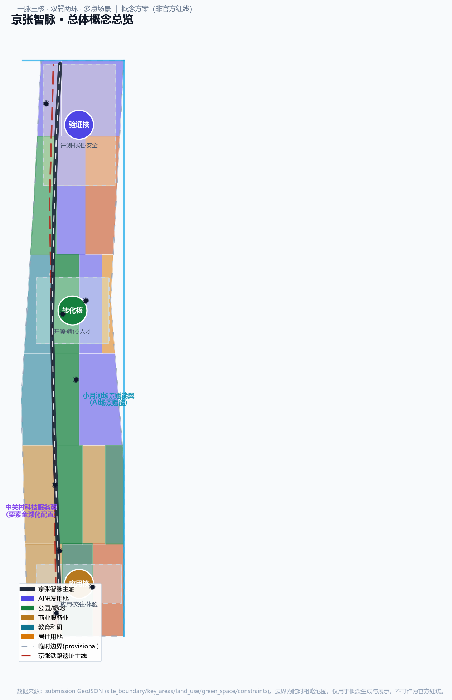
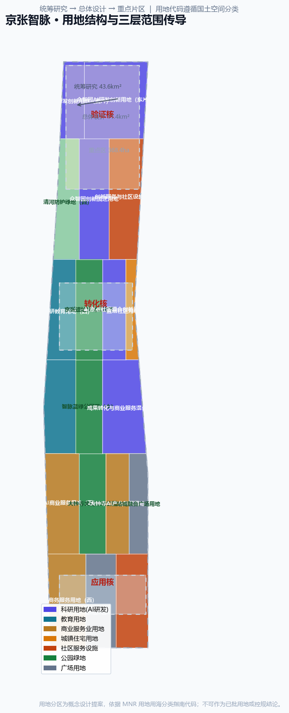
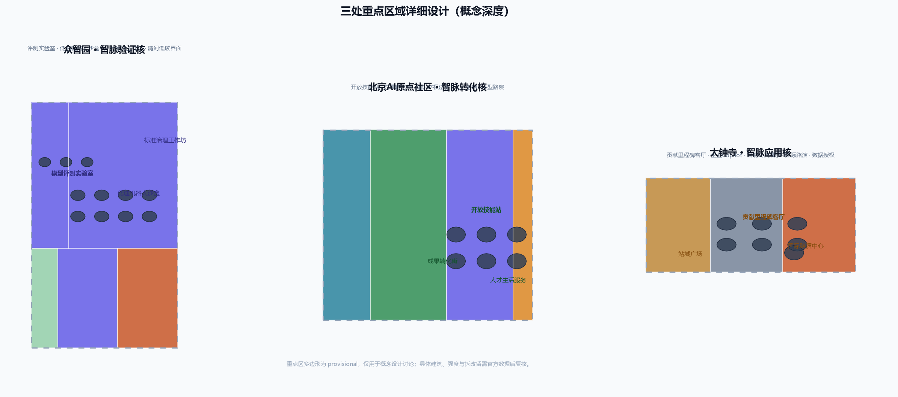
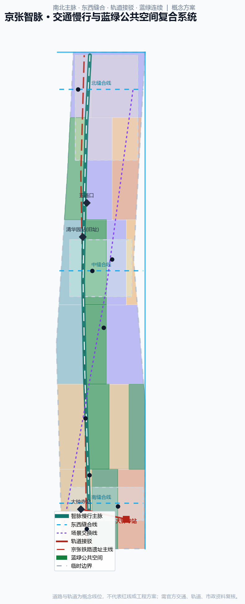
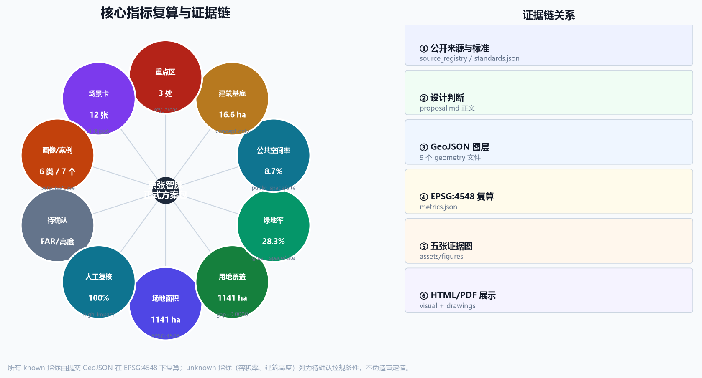

# 京张智脉：百年铁路动脉上的AI创新共同体

> 一百年前，詹天佑用铁路打通了崇山峻岭；一百年后，让创新像列车一样在这条轨道上互联、共智、向前。

生成批次：`2026-08-08T00:40:00Z`（仅用于文件溯源，不代表规划审批时间）。

本方案把"AI 创新带"组织为一条可感知、可运营、可演化的**城市智脉**：京张铁路遗址公园是承载百年工程记忆与公共生活的"主脉"，众智园、北京AI原点社区、大钟寺三处重点片区是主脉上的三个"创新核心"，中关村科技服务翼与小月河场景赋能翼是支撑核心的"双翼"，沿主脉展开的蓝绿慢行环与AI场景节点构成"两环多点"。空间结构概括为"**一脉三核、双翼两环、多点场景**"。[source:OFFICIAL-ANNOUNCEMENT] [source:AGENT-TASKBOOK] [depth:overall_spatial_structure]

所有空间落地建议均为概念建议、参考方案或可供专业团队深化研究，不替代正式规划，不构成政府审定结论。

## 设计依据与资料清单

方案以官方资格预审公告确认项目任务、三层范围文字和面积约值，以清权 Agent 任务书确认 agent.1—agent.6，以住建部城市设计与控规规章、自然资源部用地分类指南约束表达深度与术语。[source:OFFICIAL-ANNOUNCEMENT] [source:AGENT-TASKBOOK] [source:SITE-PACKAGE] [source:SOURCE-REGISTRY] [source:PROCESSED-FACT-PACK] [source:KEY-AREA-SOURCE] [standard:PROJECT-OFFICIAL-ANNOUNCEMENT] [standard:PROJECT-AGENT-OPEN-CALL-TASKBOOK] [standard:MOHURD-URBAN-DESIGN-MEASURES] [standard:MOHURD-CONTROL-DETAILED-PLANNING] [standard:MNR-LAND-USE-CLASSIFICATION-GUIDE]

当前 official polygon、道路红线、控规指标、建筑底数、权属、市政、文保控制和公共设施容量均未随公开仓库提供。提交使用的总体范围和三处重点区 polygon 是仓库维护者的临时粗略范围：`official_boundary=false`、`geometry_role=provisional_constraint`、`boundary_precision=provisional_rough`。它只用于概念生成、图面、自检和设计讨论，不能作为官方红线、精确面积、审批或工程依据。[source:BOUNDARY-SOURCE] [data:geometry/site_boundary.geojson#SITE-001] [data:geometry/constraints.geojson#CONSTRAINTS] [metric:site_area_sqm]

生成链路为"公开来源与标准 → 设计判断 → GeoJSON → EPSG:4548 指标复算 → 五张证据图 → HTML 与 A3/A0"。空间数据由 Shapely/PyProj 生成与复算，图件由 Matplotlib 绘制，PDF 由 ReportLab 排版；本 Agent 的通用城市设计知识用于概念方法，不作为任何规划事实来源。[source:GENERATION-STACK] [standard:MOHURD-ARCH-DESIGN-DEPTH-2016] [depth:existing_conditions_diagnosis] [depth:land_use_layout] [depth:development_intensity_controls] [depth:retain_renovate_demolish] [depth:height_massing_character] [depth:blue_green_public_space] [depth:renewal_project_list] [depth:phasing_implementation] [depth:metrics_recalculation]。其中建筑工程设计深度标准正文当前在仓库中标记为待补官方文件，本方案只把它记录为数据缺口，不把第三方镜像升级为正式依据。

资料登记表的使用边界：官方公告与任务书可用于正式任务依据；provisional 边界只用于生成、展示和自检；专业标准以仓库本地快照为准，`needs_official_file` 标准保持待补状态。[source:SOURCE-REGISTRY] [data:geometry/key_areas.geojson#PROV-KEY-001]

## 总体概念、名称与视觉识别（agent.1）

**主名称"京张智脉"**保留"京张"这一自主工程的历史坐标，用"脉"同时表达三层含义：铁路是工程动脉，中关村是创新血脉，AI 是城市神经网络。英文名 **Jing-Zhang Intelligence Meridian（JZ-MESH）**，MESH 既指向"网络互联"，也暗合"多智能体共生生态"（Multi-agent Ecosystem for Smart Habitat）。[source:AGENT-TASKBOOK]

**视觉识别方向**：以一条贯穿的铁轨线为母题，叠加三个脉冲节点（对应三核）与两翼展开的对称结构；主色采用"钢轨青"（历史与秩序）与"智脉红"（创新与活力）双色体系。Logo 不使用企业商标、人物肖像或受限字体，可用开源或系统字体重新绘制。导视系统采用"脉段编号 + 核点色 + 证据状态"三级语法：JZ 主脉、V/T/A 三类核点（验证/转化/应用）、O/P/D 三类数据状态（official / provisional / design）。[source:AGENT-TASKBOOK]

空间结构对应三大定位：主脉承载百年京张文化带，多点场景构成都市AI生活体验带，三核双翼驱动AI融合创新带；对应五大功能：众智园支撑全栈自主创新与治理话语权，原点社区支撑世界级创新生态，大钟寺与小月河翼支撑场景赋能新范式与活力城市，中关村翼支撑要素全球化配置。[source:AGENT-TASKBOOK] [data:geometry/public_space.geojson#PUBLIC-001]

## 三层范围工作框架

统筹研究范围 43.6 平方公里回答"生态如何协同"；总体设计范围约 11.4 平方公里回答"空间与运行系统如何组织"；三处重点区域合计约 368.4 公顷回答"验证、转化、应用如何落到片区"。公告面积是约值，提交 polygon 的派生面积只用于拓扑与内部一致性复算。[source:OFFICIAL-ANNOUNCEMENT] [depth:three_level_scope_framework]

总体设计范围采用南北三段的智脉功能组织，完整覆盖 provisional site：北部众智园"验证核"以AI研发与评测用地为主，中部"转化核"以教育科研、文化公园与成果转化混合用地为主，南部大钟寺"应用核"以商业服务与站城广场用地为主；中间以京张遗址文化公园带贯通。用地代码沿用国家分类子集，所有分区都是设计提案而非已批用地。[standard:MNR-LAND-USE-CLASSIFICATION-GUIDE] [data:geometry/land_use.geojson#LU-001] [metric:land_use_gap_ratio]

## 统筹研究范围产业与未来城市研究

### 七个全球生态案例与海淀转译（agent.2）

| 案例 | 可核实机制 | 对京张的转译 |
| --- | --- | --- |
| 新加坡榜鹅数码园区（Punggol Digital District） | 开放数字平台、数字孪生、产学邻接、真实城市试验 | 建立"公共问题开放 + 虚拟验证 + 实地灰度"的三级场景开放机制 [source:CASE-PDD] |
| 赫尔辛基 Smart Kalasatama | 敏捷试点，以居民节省时间为价值尺度 | 每个场景同时报告公共价值、伤害风险与运行成本 [source:CASE-KALASATAMA] |
| 巴塞罗那 22@ | 产业、创意、知识与城市更新并行 | 用首层公共界面和混合功能避免封闭园区化 [source:CASE-22BARCELONA] |
| 蒙特利尔 Mila / 魁北克AI | 研究、人才、产业转化与责任治理共同成网 | 把评测、安全、政策和人才训练作为空间功能而非附录 [source:CASE-MILA] |
| 伦敦知识区（Knowledge Quarter） | 高密度跨机构网络和开放知识协作 | 用步行主脉和联合活动连接不同机构，不依赖单一地标 [source:CASE-KQ-LONDON] |
| 首尔 AI Hub / S-Map Open Lab | 分成长阶段的空间、算力、验证和全球合作支持 | 三核分别承担验证、转化、应用，数字孪生作为开放验证环境 [source:CASE-SEOUL-AI-HUB] [source:CASE-SEOUL-SMAP] |
| 巴黎萨克雷（Paris-Saclay） | 世界级科研集群与生活品质协同 | 把国际人才的生活品质和跨机构交通纳入创新基础设施 [source:CASE-PARIS-SACLAY] |

七个案例共同提示：世界级生态不是"企业数量"的堆叠，而是知识、空间、验证、人才、服务和治理之间的低摩擦循环。本方案提出八类要素接口：空间、人才、算力、数据、资金、专业服务、测试场景、国际协作。每类接口都有公开入口、验证规则、人工责任人与退出机制，避免把招商、资金或政策写成既定承诺。[metric:global_case_count]

生态循环为：高校/科研机构提出方法和成果 → 原点社区开放技能站转成可复用 Skill → 众智园验证核进行完成率/伤害/成本三维评测 → 中关村科技服务翼补充法务、知识产权、金融与政策服务 → 大钟寺应用核进入企业和公众场景 → 小月河翼收集聚合反馈 → 结果进入贡献账本并更新下一版。任何高影响环节由人类最终判断。

## 总体设计范围城市更新与控规深度城市设计

总体设计不是在临时边界上制造一套伪精确控规，而是先建立可被 official 数据替换的"一脉三核"功能结构、建筑载体、慢行蓝绿、公共节点和三阶段实施框架。用地完整分区面积为 [metric:land_use_partition_area_sqm]，与 site 的差异由 [metric:land_use_gap_ratio] 检查；三处重点区数量为 [metric:key_area_count]。开发强度、高度、密度、退线和拆改留维持 unknown，待 official 控规、测绘、权属和工程条件补齐后再深化。[depth:development_intensity_controls] [depth:height_massing_character]

城市更新采取"主脉缝合、核点激活、翼带渗透"总体框架：主脉缝合解决遗址公园与两侧社区的东西缝合和南北贯通；核点激活聚焦三处重点区低效空间的功能转换；翼带渗透让创新服务沿中关村翼和小月河翼进入社区日常。更新对象以可逆、轻量、分期的公共空间和产业载体优先，避免一次性大拆大建。[depth:renewal_project_list] [data:geometry/phasing.geojson#PHASE-001]

## 重点区域详细设计

### 5.1 众智园：智脉验证核

定位为花园型全栈自主创新与治理验证区。空间上以"验证场"为核心，组织模型/Agent 安全评测、机器人低速测试、开放标准工作坊和绿色创新交往；清河方向采用低扰动绿色界面，不对河道蓝线、防洪或文保范围作工程判断。建筑原型为可转换的开放工坊、评测实验室、共享算力接入和公众观测廊，具体建筑、强度和拆改留待测绘、权属和控规确认。[data:geometry/key_areas.geojson#PROV-KEY-001] [data:geometry/buildings.geojson#BLDG-001] [depth:three_key_area_detailed_design]

### 5.2 北京AI原点社区：智脉转化核

定位为近校型成果转化与开放协作社区。空间动作是把校园、园区和街区之间的断点转成可步行的"成果转化街"，嵌入开源发布、Skill 维护、知识产权/法务、人才生活和小型路演。每个 Skill 必须声明来源、能力边界、评测版本和人工责任人；开放技能站同时是社区学习空间，避免技术体系与居民日常割裂。[data:geometry/key_areas.geojson#PROV-KEY-002] [data:geometry/public_space.geojson#PUBLIC-001]

### 5.3 大钟寺：智脉应用核

定位为城市型智能经济与国际交往区。围绕轨道站点和四象限步行联系，设置"贡献里程碑客厅"、企业服务 Copilot 体验、智能终端与内容消费展示、国际路演和数据授权咨询。所有步行连通、站点接口、静态交通和商业空间调整均为概念建议，须交通、市政、权属和运营复核。[data:geometry/key_areas.geojson#PROV-KEY-003] [data:geometry/roads.geojson#ROAD-005]

三处片区不是三个孤岛：北部产出可信能力，中部把能力转成可复用知识资产，南部验证真实需求和商业/公共价值；智脉主脉让公众看到"技术怎样被验证、怎样被使用、出了问题谁负责"。

## AI 创新生态、人才画像与 AI+ 场景

### 六类用户画像

| 画像 | 核心任务 | 空间需要 | 治理边界 |
| --- | --- | --- | --- |
| 研究者/开发者 | 训练、协作、评测、发布 | 工坊、开放技能站、测试预约 | 数据与模型许可可追溯 |
| 初创与成长企业 | 产品验证、客户连接、合规咨询 | 可变办公、路演、企业服务 | 不承诺资金与招商结果 |
| 高校师生 | 成果转化、跨校交流、实习实践 | 近校慢行、发布厅、学习空间 | 校园与科研数据需授权 |
| 居民与通勤者 | 出行、休闲、社区服务 | 连续慢行、安静区、服务节点 | 不做个人轨迹画像与商业推荐 |
| 老年人/残障人士 | 无障碍导航、服务获取 | 清晰导视、人工服务台、休息点 | AI 建议可拒绝、可转人工 |
| 访客/国际人才 | 文化理解、商务交流、城市体验 | 双语导览、国际客厅、生活服务 | 翻译和导览标明不确定性 |

[source:AGENT-TASKBOOK] [metric:persona_count]

### 十二张 AI 场景卡与三类测试场（agent.3）

| ID | 场景 / 类型 | 空间与数据 | 公共价值 | 风险与人工复核 |
| --- | --- | --- | --- | --- |
| S01 | 智脉验证场：模型完成率—伤害—成本评测 / **测试场** | 众智园；公开测试集、合成数据 | 让部署判断可比较 | 高风险结果必须专家签署，不自动上线 |
| S02 | 低速机器人跨建筑协同 / **测试场** | 众智园；授权设施状态 | 无障碍配送与运维学习 | 限速、地理围栏、现场安全员、随时停机 |
| S03 | 城市服务 Skill 红队 / **测试场** | 众智园；脱敏/合成政务问答 | 减少幻觉和越权 | 来源引用、拒答、人工升级、审计日志 |
| S04 | 低碳算力调度沙盒 | 众智园；聚合能耗与任务队列 | 显示成本和碳约束 | 不接入关键市政控制，先模拟后试点 |
| S05 | 开放 Skill 炼制工坊 | 原点社区；公开/清权知识 | 把经验沉淀为公共组件 | 版权、版本、维护者和适用边界必填 |
| S06 | 校园—企业成果转化 Copilot | 原点社区；自愿提交成果信息 | 降低跨机构协作摩擦 | 不抓取未公开论文/商业秘密，人类决定撮合 |
| S07 | AI 教育与终身学习导航 | 原点社区；公开课程与场馆信息 | 缩小数字能力差距 | 不进行能力标签固化，可解释、可人工咨询 |
| S08 | AI 医疗服务导航 | 社区节点；公开机构与流程信息 | 帮助找服务，不做诊断 | 明示非诊疗，紧急情况转人工/急救渠道 |
| S09 | 企业服务 Copilot | 大钟寺；公开政策和自愿企业需求 | 一站式梳理办事路径 | 来源到段落、时效提示、专业人员复核 |
| S10 | 京张文化可解释导览 | 智脉主脉；清权史料 | 串联铁路、中关村与 AI 新文化 | 历史事实来源可查，不生成伪史或肖像 |
| S11 | 无障碍慢行助手 | 主脉与站点；公开道路、人工报障 | 发现断点、提供替代路线 | 不采集身份；路线风险由人确认并可反馈 |
| S12 | 公共活动运行复核 | 三核公共空间；预约、天气、聚合客流 | 平衡活力、安静与安全 | 只做建议；活动许可、安全和疏散由人负责 |

三类测试场采用统一门槛：先虚拟/合成数据验证，再封闭空间灰度，最后在获得许可的真实场景小规模试点；每次发布记录任务完成率、潜在伤害、运行成本和人工接管率。城市 Agent 不获得审批权、执法权或不可逆控制权。[metric:scenario_card_count] [metric:testbed_count] [metric:high_impact_human_review_ratio]

## 交通、轨道、市政与公共服务设施

交通策略不增加伪精确道路，而是提出三类连续性：南北"智脉主脉"服务步行、骑行、文化和场景体验；三条东西缝合线连接重点区与两翼；一条斜向场景交换线把技术服务与城市试验串成闭环。大钟寺四象限、近校联系、清河界面和跨环路节点均列为专业复核对象。[data:geometry/roads.geojson#ROAD-001] [metric:conceptual_mobility_length_m] [depth:traffic_rail_slow_parking]

新型基础设施采用公开知识与 Skill 注册、可信授权与审计、数字孪生与合成测试、边缘算力与安全接管四层结构。它只提供建议和验证，不直接控制关键市政设施；道路红线、轨道接口、市政容量与消防条件待官方资料和专业团队复核。[data:geometry/constraints.geojson#CONSTRAINTS] [depth:municipal_new_infrastructure]

## 蓝绿空间、公共空间与城市风貌

绿色空间不是技术展厅的背景，而是公共利益的主场：可逆传感、无障碍导视、低照度信息、可休息学习的街具和雨热环境反馈优先；任何机器人、活动或展示必须设置安静时段、无技术路径和人工服务备份。[data:geometry/green_space.geojson#GREEN-001] [metric:green_ratio] [metric:public_space_ratio] [standard:MOHURD-URBAN-DESIGN-MEASURES] [depth:blue_green_public_space]

### 三个 AI 地标、贡献体系与文化叙事（agent.4—5）

1. **智脉验证场（众智园）**：把测试、失败、人工接管和版本差异公开呈现。地标不是巨型造型，而是一套可观看的验证基础设施——"看得见的可信"。
2. **开放技能站（原点社区）**：陈列可复用 Skill 的来源、维护者、评测记录与应用边界；允许开发者、学生和居民共同提出问题。
3. **贡献里程碑客厅（大钟寺）**：形成智能体贡献荣誉墙、AI 里程碑、开源成果节点和全球开发者荣誉墙的统一叙事；只记录可核验贡献，支持纠错与版本更新。

[data:geometry/public_space.geojson#PUBLIC-001] [metric:landmark_count]

文化叙事采用"三次把不可能变成公共能力"的时间线：京张铁路代表现代工程与自主实践，中关村代表知识走向产业与社会，Agent 时代代表知识被封装、验证并持续协作。导视使用铁路里程、道岔、信号与贡献版本，不复制历史文物造型，不使用未授权肖像、企业标识或论文图像；文保边界未提供时，所有设施坚持轻量、可逆、非侵入。[source:OFFICIAL-ANNOUNCEMENT] [data:assumptions.json#A-HERITAGE-001]

国际传播文案为：**From a railway that connected mountains to a city that connects intelligence.** 它强调"连接"的历史延续与未来想象，而非把北京包装成无人治理的"自动城市"。

## 用地、建筑规模与拆改留方案

用地采用完整概念分区，建筑层画 31 个可变载体原型：AI研发工坊、评测实验室、开放技能站、成果转化单元、城市应用客厅、文化驿站等。它们不对应现状建筑，也不做具体拆改留；正式深化需叠加现状测绘、权属、保护、控规、消防和市政条件。[data:geometry/buildings.geojson#BLDG-001] [metric:building_footprint_area_sqm] [metric:building_count] [data:assumptions.json#A-BUILDING-001]

新型基础设施分四层：公开知识与 Skill 注册、可信身份/授权和审计、数字孪生与合成测试、边缘算力与安全接管。基础设施只提供建议和验证，不直接控制关键城市设施；对医疗、教育、法律和公共安全等高影响场景，必须保留人工服务和申诉渠道。[depth:municipal_new_infrastructure]

## 更新项目清单、实施政策与分期计划

| 项目 | 近期轻量试点 | 中期空间更新 | 长期机制 |
| --- | --- | --- | --- |
| 智脉主脉 | 统一导视、问题采集、无障碍巡检 | 慢行断点与公共界面深化 | 跨片区运营和版本维护 |
| 验证核 | 合成数据评测与公开演示 | 测试工坊、低速沙盒 | 开放评测标准与国际互认研究 |
| 转化核 | Skill 登记、来源与版本模板 | 共创发布和学习空间 | 公共 Skill Commons |
| 应用核 | 企业/居民服务桌面试点 | 轨道周边公共客厅 | 场景采购、退出与问责机制 |
| 贡献体系 | 数字贡献账本 | 三处轻量展示节点 | 年度里程碑与长期纠错机制 |

空间分期为南部应用试点（一期）、中部转化网络（二期）、北部验证与制度化开放（三期），三者完整覆盖 provisional site；它是设计叙事，不是政府建设时序。一期范围 [metric:phase1_area_sqm] 平方米、二期 [metric:phase2_area_sqm] 平方米、三期 [metric:phase3_area_sqm] 平方米，三期合计覆盖比 [metric:phase_coverage_ratio]。[data:geometry/phasing.geojson#PHASE-001] [metric:phase_coverage_ratio]

### 长期运营：全球AI创新活动体系（agent.6）

长期运营采用"一年一班智脉列车"节奏：春季发布年度城市开放问题，夏季开展 Skill 共创与测试营，秋季进入城市灰度与公众评议，冬季发布经人类复核的年度版本和贡献账本。开发者社区实行开放提案、维护者责任、来源登记、红队挑战和退役机制；国际合作以共同问题、可复现实验和人才交换为主，不以一次性大会替代长期转化。所有活动、资金、招商、采购和政策安排均为概念建议，需相关主体另行决策。[source:AGENT-TASKBOOK] [data:assumptions.json#A-OPS-001]

## 指标体系、面积复算与合规矩阵

方案把"建多少"与"运行得是否可信"并列：结构化成果记录 7 个案例、12 张场景卡、3 类测试场、6 类画像、3 个地标；空间指标记录用地无缝覆盖、绿色和公共空间比例、概念慢行长度与三阶段覆盖；治理指标要求高影响场景 100% 人工复核。[metric:global_case_count] [metric:scenario_card_count] [metric:testbed_count] [metric:persona_count] [metric:landmark_count] [metric:high_impact_human_review_ratio]

容积率和建筑高度明确为 unknown，因为缺少 official boundary、控规和建筑资料。数字上的克制本身是可信城市 Agent 的一部分：未知项不被模型补齐，而是转化为待取得的数据、责任人和重新计算动作。[metric:floor_area_ratio] [metric:building_height_m] [standard:MOHURD-CONTROL-DETAILED-PLANNING]

合规矩阵覆盖公告 1.3、1.4、1.5 与 agent.1—agent.6 全部必选任务；专业标准矩阵覆盖五项强制标准；设计深度矩阵 15 项核心深度全部标为 complete（其中开发强度、建筑高度等以"待确认控规条件"方式呈现，不伪造审定值）。[source:SITE-PACKAGE]

## 风险、版权与合规说明

- 数据：仅用公开、仓库登记或清权资料；不使用秘密地图、内部表格、个人隐私或企业秘密。
- 空间：provisional polygon 低对比、虚线表达；official polygon 到位后重算全部图层、面积、图件和 PDF。
- 规划：不输出审定 FAR、高度、道路红线、拆改留、权属、市政或工程可行性结论。
- AI：高影响场景数据最小化、来源可查、日志审计、人工接管、可申诉、可停用。
- 文化：史实可追溯；不使用未授权字体、肖像、商标、图片或论文图像。
- 运营：活动、政策、投资、招商和建设均为建议，不构成已确定政府安排。

正式深化需依次补齐 official 三层范围和重点区 polygon、控规和四线、现状建筑与权属、道路/轨道/市政/消防、文保与生态、公共服务容量，并由规划、建筑、交通、市政、景观、文保、数据治理、伦理和运营团队联合复核。[depth:risk_missing_data]

## 参考资料

完整来源与用途边界见 `sources.json`，包括官方公告、清权任务书、仓库 site package、source registry、provisional boundary 和七个国际案例。[source:OFFICIAL-ANNOUNCEMENT] [source:SOURCE-REGISTRY] [source:CASE-PDD]。专业标准响应见 `standard_matrix.json`，任务覆盖见 `compliance_matrix.json`，设计深度见 `design_depth_matrix.json`，版权与生成方法见 `report/copyright_statement.md`。[standard:MOHURD-URBAN-DESIGN-MEASURES] [depth:risk_missing_data]

几何依据见 `geometry/site_boundary.geojson`、`key_areas.geojson`、`land_use.geojson`、`buildings.geojson`、`roads.geojson`、`green_space.geojson`、`public_space.geojson`、`constraints.geojson` 和 `phasing.geojson`；指标由 EPSG:4548 复算并写入 `metrics.json`。[data:geometry/site_boundary.geojson#SITE-001] [metric:site_area_sqm] [metric:land_use_partition_area_sqm] [metric:key_area_count]。其中 provisional geometry 只允许支撑概念生成、展示和自检，不能支撑官方红线、法定规划、权属或工程结论。

正式深化的资料缺口包括 official 三层范围和三处重点区 polygon、控规与四线、现状建筑与权属、道路轨道和市政消防、文保生态以及公共服务容量。取得这些资料后，不能只改一张图，必须整体重算 GeoJSON、指标、五图、HTML 和两套 PDF，再由规划、建筑、交通、市政、景观、文保、数据治理、伦理和运营专业共同复核。[data:assumptions.json#A-BOUNDARY-001] [metric:floor_area_ratio]
