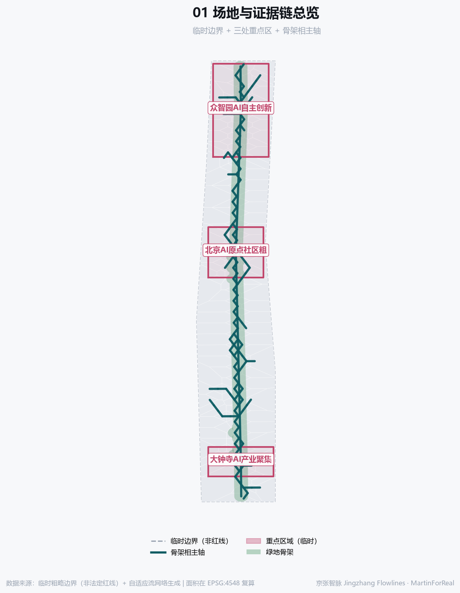
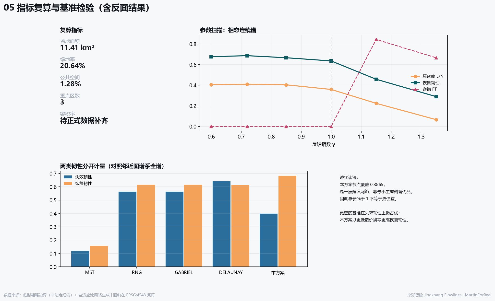
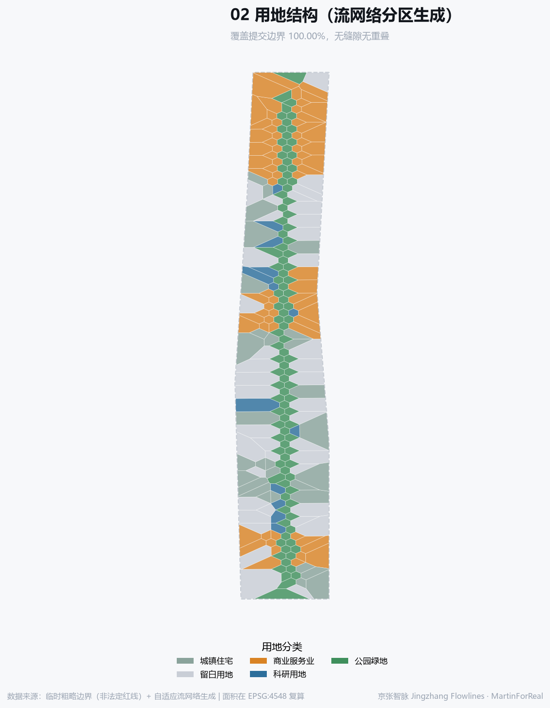
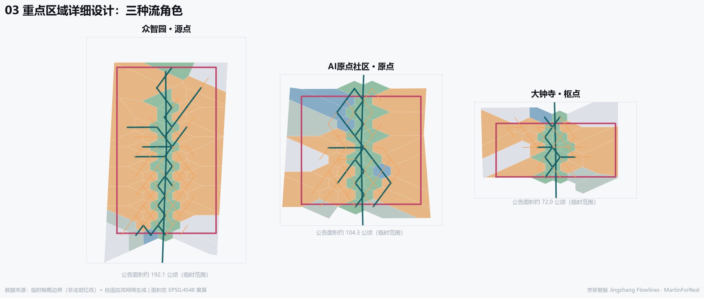
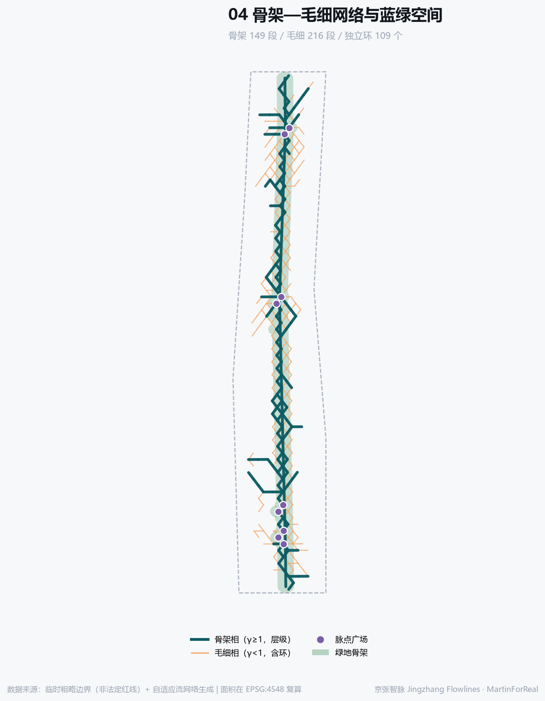

# Jingzhang Flowlines: A Backbone-Capillary Two-Phase Adaptive Flow Network

> **In one sentence**: invert the severance left by the Jing-Zhang railway into a conduit, generate a backbone phase and a capillary phase from one adaptive-flow equation, and benchmark against the full proximity-graph hierarchy. All spatial suggestions are conceptual, for professional teams to develop further.

## Executive summary

| Item | Content |
|---|---|
| Problem | The railway's withdrawal leaves a linear void: stitched north-south by the corridor, severed east-west by it. |
| Spatial strategy | One equation, two phases — a γ=1.35 backbone carries north-south continuity, a γ=0.72 capillary layer carries east-west stitching. |
| Key areas | AI Origin Community as source, the heritage-park spine as the through-line, Dazhongsi as the east-west stitching knot. |
| First pilots | Five reversible pilots, each with a named lead, a stop threshold and a restoration plan. |
| Risk boundary | The boundary is provisional and the corridor control plan has only passed technical review. No FAR, height, demolition-retention, redline or engineering conclusion is stated. About one third of the network moves with the load assumption. |
| Decisions needed | Official boundary and key-area polygons, real travel and scenario load data, and confirmation of the first pilots' sites and lead bodies. |

## Design basis and source inventory

The prequalification announcement is the primary basis; the provisional boundaries, key areas, enums, ranges and source list under `brief/site-package/` are the machine-readable basis [source:OFFICIAL-ANNOUNCEMENT] [source:SITE-PACKAGE] [source:AGENT-TASKBOOK]. Source usability follows the public registry [source:SOURCE-REGISTRY]. To be explicit first: no official boundary file exists at this stage; the submitted `SITE_BOUNDARY` and `KEY_AREA` are provisional rough extents [source:BOUNDARY-SOURCE] [source:KEY-AREA-SOURCE] [data:geometry/site_boundary.geojson#SITE-001], used only for generation and display, and must be fully recomputed once official geometry is released.

## Generation method: one equation, two phases

**Which part is drawn and which part is solved must be stated first.** The corridor spine is **drawn**: it links the three key-area centroids ordered by latitude, and edges inside its 118 m buffer are assigned a low resistance of 0.18. The backbone is then a resistance-weighted shortest path over that surface, so it necessarily follows the drawn spine. The conductance field is **solved**: the site is discretised into 665 nodes and 1820 candidate edges; flows follow Poiseuille/Ohm with Kirchhoff conservation, and conductance evolves by dD/dt = |Q|^γ/(1+|Q|^γ) − D [source:METHOD-PHYSARUM-TERO-2010]. This proposal uses γ=1.35 (backbone) and γ=0.72 (capillary), yielding 149 backbone and 216 capillary edges [metric:site_area_sqm].

**The phases are measured, not asserted.** One equation, only γ changed: at γ=0.72 the final sup-norm step is 5.33e-15, zero-conductance edges 0, loop density L/N=0.4108 (capillary plexus); at γ=1.35 the final step is 6.14e-09, zero-conductance edges 1567/1820, loop density L/N=0.0667 (hierarchical tree) [source:METHOD-PHENOTYPES-RK-2019]. The effect of growth order on final morphology is treated separately in the distribution-network growth literature [source:METHOD-GROWTH-RK-2016]. **Convergence must be qualified**: the published proof covers continuous-time dynamics for a single source-sink pair with unit feedback exponent [source:METHOD-PHYSARUM-CONVERGENCE]; this model is multi-terminal, multi-scenario and discretely stepped, and falls outside that theorem. Only the measured step and the solver-fallback count (0) are reported; no proof of convergence is claimed.

**Why loops are retained.** Not because spider webs have loops, but because load fluctuates. Loops appear in the optimum only after modelling 7 fluctuating sink scenarios, consistent with damage- and fluctuation-induced looping [source:METHOD-LOOPS-KATIFORI-2010][source:METHOD-LOOPS-CORSON-2010]; under steady load the optimum degenerates to a tree, the other side of the same phase transition [source:METHOD-BOHN-MAGNASCO-2007]. The final network has 109 independent loops, loop density L/N = 0.4241. If real load were near-steady the optimum should tend to a tree with fewer loops — this falsifiable condition is recorded as an assumption [depth:overall_spatial_structure].

**The resistance surface is a published value judgement.** Weights follow the ecological-security-pattern source-resistance-corridor paradigm [source:METHOD-MCR-ECOLOGICAL-SECURITY] and are fully disclosed: base 1.00, key areas 0.35, corridor spine 0.18, west wing 0.55, east wing 0.60, edge falloff 1.90. These are not objective constants but judgements about where flow *ought* to go. They are published so reviewers can re-run with other weights and compare, rather than letting a value judgement masquerade as a natural law.

**Biomimicry supplies no legitimacy, only a testable hypothesis.** Calling a method 'biomimetic' does not make a design more sustainable; empirical work finds the label can even lower how audiences rate it [source:CRITIQUE-BIOMIMETIC-LABEL], and the claim of 'direct access to nature' has long been identified in science-and-technology studies as rhetoric rather than argument [source:CRITIQUE-STS-FISCH-2017]. So nothing spatial here is justified by 'slime mould grows this way'. Biology is used only as a source of falsifiable hypotheses: loops are worth their cost only if load really fluctuates, and the result that nonlinear material behaviour localises damage comes from spider-silk mechanics [source:METHOD-SILK-CRANFORD-2012] — at urban scale that is an **analogy, not evidence**, and must be tested against local data before it is believed.

### Parameter sweep and benchmarking (including negative results)

A single network is not evidence. γ is swept and benchmarked against the **Toussaint proximity-graph hierarchy** [source:METHOD-TOUSSAINT-RNG][source:METHOD-GABRIEL-SOKAL] — benchmarking against MST alone overstates results, because such networks sit on that hierarchy. **One degeneracy must be stated plainly**: on a regular 140 m grid the relative-neighbourhood lune test and the Gabriel disk test tie exactly, so RNG and Gabriel return an identical edge set (1820 each) and the hierarchy collapses to MST < RNG = Gabriel < Delaunay. Read it as **three** baselines, not four. Resilience is measured as two separate quantities [source:METHOD-TWO-RESILIENCE-2026], and every network is attacked by the **same rule** (edge-betweenness first, with a 5-draw random-order mean also reported) — an earlier version attacked only this proposal by conductance rank while peeling the baselines in row order, which is not a comparison.

| γ | Edges | Node cov. | Internal reach | FT | Failure | Recovery | L/N | Phase |
|---|---|---|---|---|---|---|---|---|
| 0.60 | 255 | 0.278 | 0.61 | 0.000 | 0.278 | 0.677 | 0.405 | capillary plexus |
| 0.72 | 255 | 0.278 | 0.46 | 0.000 | 0.270 | 0.687 | 0.411 | capillary plexus |
| 0.85 | 255 | 0.275 | 0.95 | 0.000 | 0.293 | 0.667 | 0.404 | capillary plexus |
| 1.00 | 255 | 0.289 | 0.84 | 0.000 | 0.298 | 0.636 | 0.359 | hierarchical tree |
| 1.15 | 255 | 0.314 | 1.00 | 0.844 | 0.236 | 0.458 | 0.225 | hierarchical tree |
| 1.35 | 255 | 0.361 | 1.00 | 0.667 | 0.144 | 0.290 | 0.067 | hierarchical tree |

| Network | Edges | Node cov. | TL | m/node | MD | FT | Failure(betw.) | Failure(rand.) | Recovery | Loop L/N |
|---|---|---|---|---|---|---|---|---|---|---|
| MST | 664 | 1.000 | 1.000 | 140 | 1.000 | 0.533 | 0.119 | 0.059 | 0.156 | 0.000 |
| RNG | 1820 | 1.000 | 2.741 | 383 | 0.285 | 1.000 | 0.563 | 0.598 | 0.616 | 1.738 |
| Gabriel | 1820 | 1.000 | 2.741 | 383 | 0.285 | 1.000 | 0.563 | 0.598 | 0.616 | 1.738 |
| Delaunay | 1949 | 1.000 | 4.632 | 648 | 0.260 | 1.000 | 0.643 | 0.670 | 0.613 | 1.932 |
| **This proposal (two-phase)** | 365 | 0.387 | 0.550 | 199 | 0.314 | 0.967 | 0.399 | 0.315 | 0.684 | 0.424 |

**How to read this table honestly.** First, TL must be read together with node coverage: this design reaches 0.3865 of nodes and is a *proposed network layer*, not a substitute for the spanning tree, so TL below 1 does not mean 'cheaper'. Second, denser baselines such as Delaunay remain **better on failure resilience** — under one matched edge-betweenness attack this design scores 0.399 against Delaunay's 0.643, so this design is genuinely **lower**. The only defensible statement is the cost ratio: it buys 62.1% of Delaunay's attack tolerance for 18.7% of its edges and 11.9% of its total length. That is a trade-off, not a win. Third, the sweep shows pure capillary phases at γ<1 can score zero fault tolerance, meaning the capillary layer alone cannot guarantee key-area connectivity — which is precisely the empirical reason for a **two-phase** rather than single-phase design.

### Load-scenario sensitivity: how much of this network is an artefact of the draw

Random sink scenarios are not a demand model. A result that holds only under random load says little about the site. The identical pipeline is therefore re-run under three **interpretable** load models — commute (demand drains to the two wings), event day (demand concentrates on the corridor), and a steady uniform control. Same solver, same thresholds, same connectivity step; only the load changes.

| Load scenario | Nodes | Edges | Loops | Loop L/N | Jaccard vs shipped |
|---|---|---|---|---|---|
| 7 random sink sets (as shipped) | 257 | 365 | 109 | 0.424 | 1.000 |
| Commute: demand drains to employment in both wings | 292 | 382 | 91 | 0.312 | 0.679 |
| Event day: demand concentrates on the corridor spine | 236 | 372 | 137 | 0.581 | 0.698 |
| Steady state: uniform load across all nodes | 278 | 377 | 100 | 0.360 | 0.686 |

**Two findings, one of them against this proposal.** First, the lowest Jaccard across the four load models is 0.6787: roughly two thirds of the edges are selected under any load assumption, and that share can be treated as robust to the demand model. Node count moves between 236 and 292, independent loops between 91 and 137; the remaining third genuinely is an artefact of the load setting and must be recomputed against real travel and scenario data. Second, **the steady-load control does not collapse the loops into a tree**: uniform load still leaves 100 independent loops against 109 under random load — a far smaller difference than the 91–137 range produced by changing the demand model at all. So in this implementation the loops are **not** primarily fluctuation-induced; they come from the conductance quantile thresholds in the connectivity step. Attributing them wholly to fluctuation-induced looping would overstate how much the theory supports this design, and that is corrected here [source:METHOD-LOOPS-CORSON-2010].

## Three-level scope framework

The coordinated research area is about 43.6 km², the overall design area about 11.4 km², the key areas about 368.4 ha [source:OFFICIAL-ANNOUNCEMENT] [standard:PROJECT-OFFICIAL-ANNOUNCEMENT] [depth:three_level_scope_framework]. The submitted boundary recomputes to 11,412,825 m² (~11.41 km²), consistent with the announced magnitude [metric:site_area_sqm]. The three levels are three resolutions: flow direction and synergy at the coordinated level, the backbone phase at the overall level, the capillary phase at the key-area level. They are not a simple zoom but a change of question: the coordinated level asks where factors come from and go to, so it needs direction and synergy rather than parcel precision; the overall level asks how the spine connects and how the three areas attach, so it needs backbone topology; the key-area level asks how east and west are stitched and how daily walking forms a network, so it needs capillary density. The benefit is that when new data overturns one level, the other two need not be redone. All three share one weakness: no official boundary exists, so every area is a provisional recomputation that must be redone once official geometry is released [depth:risk_missing_data].

## Coordinated research area: industry and future-city study

One current fact must be stated first, in the official wording: Haidian District government documents state that the **main works of the implementable area** of phase 2 of the Jing-Zhang Railway Heritage Park are complete [source:SITE-HD-PLAN-2025EXEC]; the media formulation of a completed and opened 9 km corridor is looser [source:SITE-JZ-PARK-PHASE2], and the official wording governs here. Two further official facts bound this proposal: first, the regulatory plan for blocks along the corridor has **passed technical review but has not been approved**, so no statutory control figure may be inferred; second, the government has explicitly framed AI innovation districts around the AI Origin Community, the AI Beiwei Community and the Jing-Zhang Railway Heritage Park innovation belt [source:SITE-HD-GOV-WORKREPORT]. The backbone spine proposed here is therefore not invented: it extends and densifies, in network terms, a corridor that **already exists**; the capillary phase responds to the fact that this corridor is still mainly a north-south connector with limited east-west stitching.

The coordinated level answers where flows come from and go to. Regionally the corridor links the Zhongguancun core with the Beiqing Road and Future Science City directions, and should act as a channel for factor flows rather than an administrative edge [depth:existing_conditions_diagnosis]. Reference cases (background only; figures require separate verification):

| Case | Relevance to the belt |
|---|---|
| Kendall Square, Cambridge MA | The NASA Electronics Research Center opened in 1964 and closed about five years later after budget cuts, leaving a void; MIT partnered with the City of Cambridge to revitalise the area, which now hosts around 150 high-tech companies [source:CASE-KENDALL-MIT-2015] |
| King's Cross Central, London | 67 acres of disused railway land; regeneration attempts through the 1980s and 1990s failed and redevelopment only began in the mid-2000s; about 40% of the land is public realm, with 10 new parks and squares and 20 new streets [source:CASE-KINGSCROSS-CFC] |
| Station F, Paris | Converted from the Halle Freyssinet rail freight depot built in 1929; about 34,000 m², opened June 2017, housing up to 1,000 startups and 3,000 desks [source:CASE-STATIONF] |
| Kista Science City, Stockholm | One of Europe's largest ICT clusters with over 1,000 tech companies and about 25,000 employees; the Urban ICT Arena, established in late 2016, wired a roughly 2 km corridor with fibre and wireless as an open urban testbed [source:CASE-KISTA-URBANICT] |
| Sangam Digital Media City, Seoul | A planned digital-media district converted from a former landfill area [source:CASE-SANGAM-DMC] |
| Zhongguancun's own history | Grew bottom-up from the 1980s 'Electronics Street' into a national science park [source:CASE-ZGC-HISTORY] |

These cases are qualitative comparators only; their figures require separate verification and must not be transferred to this belt [source:CASE-ZGC-HISTORY][source:PROCESSED-FACT-PACK].

### Regional collaboration interfaces

Collaboration cannot be asserted as 'linkage'. The table names, per partner, the resource, the spatial interface (or states plainly that there is none), the cooperation scenario, a suggested responsible body, and a **verifiable output** — collaboration without a verifiable output is not collaboration.

| Partner | Resource | Spatial interface | Cooperation scenario | Suggested responsible body | Verifiable output |
|---|---|---|---|---|---|
| AI Beiwei Community | 同带内相邻创新社区 | 主廊北段步行与骑行接口 | 联合开放测试季、场景卡互认 | 两社区运营方 + 属地街道 | 互认场景卡清单与年度联合复盘纪要 |
| Future Science City | 北部研发协同 | 北清路方向的对外流向端点 | 研发中试场景外溢、人才双向驻留 | 园区管委会 + 高校技术转移机构 | 驻留工位使用台账、联合中试场景数 |
| Huairou Science City | 大科学装置协同 | 非空间接口，以数据与议程协同为主 | 开放科学日与本带展陈联动 | 科学装置开放办公室 + 本带文化节点运营方 | 联合展陈期次与公众参与人次 |
| Beijing E-Town | 智能制造与场景落地协同 | 非空间接口，以产业链与测试许可协同为主 | 本带出概念、经开区出产线的中试接力 | 两地产业服务机构 | 接力中试场景清单与转化记录 |
| Beijing-Tianjin-Hebei | 区域尺度协同 | 非空间接口，以标准与传播协同为主 | 场景卡格式、停用与恢复规则跨区互认 | 区域协同事务机构 | 互认规则文本与采用方数量 |

Only two of the five partners have a real spatial interface; the other three collaborate through data, standards and communication. Drawing a connector line for a collaboration that has no spatial interface is exactly what this proposal avoids. Every responsible body is a suggestion, not an agreed arrangement [source:SITE-HD-GOV-WORKREPORT].

## Overall design area: renewal at regulatory-plan urban design depth

The backbone phase gives the north-south spine and its connections to the three key areas; the capillary phase gives east-west stitching. Land use is generated by partitioning the flow network, covering 100.000% of the submitted boundary with no gaps or overlaps [data:geometry/land_use.geojson#LU-001] [depth:land_use_layout]. Green ratio 20.64% and public-space ratio 1.28% are recomputed from the submitted GeoJSON in EPSG:4548 [metric:green_ratio] [metric:public_space_ratio]. Zoning is not drawn first and filled later: it is partitioned directly from the catchment of each network node, so every parcel can answer why it carries that use and why it sits there. Cells near high-throughput nodes inside a key area become research cores; cells inside the corridor buffer become park; mid-flow cells become talent communities; low-flow cells stay reserved to preserve flexibility. The intensity, height and retain/renovate/demolish conclusions that regulatory depth would normally require are **deliberately left blank**, because official controls are absent and the taskbook boundary clause forbids an agent from inferring them [depth:development_intensity_controls].

## Detailed design for the three key areas

The three key areas play different roles: Zhongzhiyuan as **source node** (generator of full-stack innovation flow), the AI Origin Community as **origin node** (convergence of ecosystem and talent), Dazhongsi as **hub node** (conversion hub for intelligent-native formats) [data:geometry/key_areas.geojson#PROV-KEY-001] [depth:three_key_area_detailed_design] [metric:key_area_count]. All three boundaries are provisional and must not be treated as redlines [standard:MOHURD-CONTROL-DETAILED-PLANNING].

## AI ecosystem, personas and AI+ scenarios

User personas (at least five):

| ID | Persona | Core needs |
|---|---|---|
| P-01 | Returning algorithm-researcher founder | Low-friction test scenarios, nearby compute, talent housing |
| P-02 | Long-term elderly resident | Accessible routes, seating, legible signage, no forced digitalisation |
| P-03 | University student | Open labs, internship entry points, low-cost public space |
| P-04 | Multinational R&D manager | Compliant, explainable testing and internationalised services |
| P-05 | Small business owner along the belt | Stable footfall, affordable rent, incremental renewal |
| P-06 | Commuting parent with children | Safe crossings, continuous walking network, nearby childcare |

AI scenario cards (at least ten):

| ID | Scenario | Space | User | Description |
|---|---|---|---|---|
| SC-01 | Corridor walking guide | 主廊 | Residents/visitors | Voice and visual guide along the spine, narrating both Jing-Zhang railway and Zhongguancun histories. |
| SC-02 | Pulse-point accessible transfer | 脉点广场 | Elderly / reduced mobility | Accessible wayfinding and transfer call at pulse-point plazas. |
| SC-03 | Open AI testing block | 众智园 | Firms / researchers | Block-scale controlled testing with human review and an exit mechanism. |
| SC-04 | Nearby compute scheduling | AI原点社区 | Startups | Visualisation of nearby compute scheduling; no real resource commitment. |
| SC-05 | East-west stitching cycle loop | 毛细横向连接 | Commuters | Transverse capillary links form a cycle loop relieving east-west severance. |
| SC-06 | Adaptive night lighting | 主廊与脉点 | Night users | Lighting responds to aggregate footfall; aggregated data only, no individual identification. |
| SC-07 | Dazhongsi intelligent-native retail | 大钟寺 | Consumers | Consumption units for intelligent-native formats with AI involvement clearly labelled. |
| SC-08 | Community micro-renewal co-creation | 人才社区 | Residents | Residents vote and propose; results public and traceable. |
| SC-09 | Heritage narrative exhibition | 文化节点 | Visitors/students | Augmented exhibition based on documented records; no fabricated history. |
| SC-10 | Developer residency desks | AI原点社区 | Developers | Short-term residency desks and open days for global developers. |
| SC-11 | Multi-path evacuation drill | 全域网络 | Public managers | Uses loop redundancy to rehearse multi-path evacuation, validating recovery resilience. |
| SC-12 | Green microclimate observation | 脉点公园 | Researchers/public | Open microclimate observation points with published data. |

Scenario stop and rollback (every card must be stoppable):

| ID | Accountable role | Non-AI equivalent path | Minimum data | Who can stop it | What is restored on stop |
|---|---|---|---|---|---|
| SC-01 | Park duty officer | Printed and cast-plate maps, volunteer guides | Coarse location plus public archival text | Duty officer, sub-district, or any single visitor complaint | Printed guides and human narration resume; the audio layer is removed |
| SC-02 | Accessible-transfer dispatcher | Call button plus staffed transfer, no algorithmic queueing | Call location and arrival time | The user, an accompanying person, or the dispatcher | Staffed call response resumes with the same response-time commitment |
| SC-03 | Testing-block management committee | The same service must remain available as a staffed non-AI process | Public environmental data inside the test extent only | The committee, participating firms, or the residents' representative | Test-block signage is removed and ordinary block management resumes |
| SC-04 | Compute-service desk lead | Over-the-counter application and manual scheduling | Demonstration data only, carrying no real resource commitment | The desk lead or any applicant | Manual scheduling resumes and the demonstration interface goes offline |
| SC-05 | Active-travel maintenance unit | Ordinary junction signage and the existing cycle lanes | Cross-section counts only, no individual trajectories | The maintenance unit or the traffic authority | Fixed signage resumes and dynamic guidance is withdrawn |
| SC-06 | Sub-district night-safety duty post | A fixed always-on lighting baseline independent of any sensing | Illuminance and presence only; no identification | The duty post, residents, or any late-returning pedestrian | The whole line reverts to the always-on baseline illuminance |
| SC-07 | Dazhongsi merchants' self-governance body | Ordinary staffed guidance and physical signage | Aggregate footfall only; no individual purchase records | The self-governance body or any single merchant | Physical signage and staffed guidance resume |
| SC-08 | Community planner | In-person deliberation meetings and paper proposals | Voluntarily submitted public comments only | A majority of the residents' assembly can stop it | The topic returns to the in-person assembly for decision |
| SC-09 | Cultural-node operator | Physical exhibit labels and human docents | Public archival material and exhibit metadata | The operator, the curator, or any visitor objection | Physical labels resume and the augmented layer is removed |
| SC-10 | Residency-desk administrator | Ordinary desk booking and on-site registration | Desk occupancy status only | The administrator or any resident developer | On-site registration resumes |
| SC-11 | Emergency management authority | The existing evacuation plan and marshals; a drill never replaces the plan | Anonymous counts during the drill only | The emergency management authority alone can terminate it | The existing evacuation plan takes effect immediately |
| SC-12 | Green-space maintenance and research partner | Fixed-point manual observation records | Public meteorological and phenological observations | Either partner may withdraw | The manual observation ledger resumes |

Industry test and validation scenarios (at least three):

| ID | Test scenario | Space | Boundary conditions |
|---|---|---|---|
| T-01 | Autonomous shuttle test | 主廊低速段 | Low-speed, relatively enclosed segments with human takeover and exit conditions. |
| T-02 | Embodied-AI public service test | 脉点广场 | Service robots in bounded times and areas, human-abortable throughout. |
| T-03 | Sensing and dispatch joint test | 毛细相路段 | Aggregated-data validation of multi-path dispatch; personal identification prohibited. |

Every scenario must be human-reviewable and abortable, must not perform personal identification, and must not require non-public data; a test scenario is not approved operation [standard:PROJECT-AGENT-OPEN-CALL-TASKBOOK].

## Land use, building scale and retain/renovate/demolish logic

Land-use codes follow the project subset of the national classification [standard:MNR-LAND-USE-CLASSIFICATION-GUIDE] [depth:development_intensity_controls]. The building footprint of 614,693 m² is a massing indication only [metric:building_footprint_area_sqm]. **No floor-area ratio, building height or parcel-level retain/renovate/demolish conclusion is stated**: official controls are absent [depth:height_massing_character] and such judgements belong to professional teams once formal conditions exist [depth:retain_renovate_demolish]. What can be offered are principles: retain and mend along the backbone, prefer incremental micro-renewal where the capillary layer densifies, keep reserved land flexible.

## Traffic, rail, municipal and public service facilities

The submitted `ROAD_CENTERLINE` uses only agent-editable classes (greenway, pedestrian, transit connection) and **proposes no expressway or arterial alignment and no rail alignment** [data:geometry/roads.geojson#ROAD-SPINE-001] [depth:traffic_rail_slow_parking] [standard:MOHURD-URBAN-DESIGN-MEASURES]. Municipal and new infrastructure follow a concept of concentration along the backbone and distribution into the capillary layer [depth:municipal_new_infrastructure]; capacities and utilities require professional calculation.

## Blue-green space, public space and urban character

The green framework is the corridor park plus pulse-point parks, green ratio 20.64% [metric:green_ratio] [data:geometry/green_space.geojson#GS-001] [depth:blue_green_public_space]. Public-space nodes are not chosen compositionally but derived from high-throughput network nodes, so 'why is the plaza here' can be interrogated and recomputed. AI pilgrimage landmarks (at least three):

| ID | Landmark | Location | Concept |
|---|---|---|---|
| L-01 | Pulse Point Zero | 主廊北端 | Shaped from the computed origin node; records each version's generation parameters as accumulating public memory. |
| L-02 | Hall of Loops | 毛细最密处 | A public hall on loop redundancy, explaining why a city needs seemingly redundant routes. |
| L-03 | Contributors' Wall | AI原点社区 | Records human and Agent contributors, echoing the taskbook principle that contribution must be memorable. |

## Renewal project list, policies and phasing

Phasing follows the order of network formation: phase 1 completes the backbone and key-area pulse points, phase 2 densifies the capillary layer and stitches east-west, phase 3 keeps reserve capacity and iterates with scenario load [data:geometry/phasing.geojson#PHASE-001] [depth:phasing_implementation] [depth:renewal_project_list]. Behind this order is a **hypothesis to be tested**, not a settled conclusion: the distribution-network literature proposes that networks formed during growth may be more robust than networks optimised once afterwards [source:METHOD-GROWTH-RK-2016]. That result comes from physical models of vascular and distribution networks, is registered as background_only, and **cannot establish local transport or operational performance**. It informs the phasing order here but is not used as evidence for any spatial conclusion, and must be checked against local measurement. Built edges should carry a lower bound and not be freely pruned — that is how sunk cost enters the model. Policy suggestions are conceptual and constitute no investment, tenanting or approval arrangement.

### First reversible pilots

Phasing that states order without stating responsibility is not an implementation path. The pilots below are all **reversible**: each names its lead and collaborating bodies, prerequisite data, cost class (class only — no amount is invented here), success indicator, **stop threshold** and restoration plan. Any pilot reaching its stop threshold exits and is restored.

| ID | Pilot | Space type | Lead and collaborators | Prerequisite data | Cost class | Success indicator | Stop threshold | Restoration |
|---|---|---|---|---|---|---|---|---|
| P-01 | Corridor guide, first segment | 线性开放空间 / 主廊北段 | 遗址公园运营方牵头；街道、志愿者团队协作 | 公开史料、现状步道中线、无障碍坡度实测 | 标识与语音层类（无土建） | 月均使用人次、投诉数、志愿讲解留存率 | 任一月投诉数高于基线或志愿讲解留存率下降即停 | 撤除语音层，恢复纸质与铸牌导览 |
| P-02 | Pulse-point accessible transfer | 重点区脉点广场 | 属地街道牵头；接驳调度方、残障者代表协作 | 现状高差与坡道实测、既有接驳线位 | 小型场地改造类（不含道路工程） | 呼叫响应时长、成功接驳率、使用者满意度 | 响应时长超出人工基线即停 | 回到人工呼叫响应，响应时限承诺不变 |
| P-03 | East-west stitching cycle trial | 毛细横向连接一段 | 慢行系统养护单位牵头；交通管理部门协作 | 断面流量计数、现状骑行道连续性 | 标线与指示类（不含红线调整） | 断面流量、绕行距离下降幅度、事故记录 | 出现任一事故或绕行距离未下降即停 | 恢复固定指示，取消动态引导 |
| P-04 | Adaptive night lighting pilot | 主廊一段与相邻脉点 | 街道夜间安全值班岗牵头；照明养护方协作 | 现状照度实测、夜间在场计数（不识别个人） | 照明控制类（不新增灯杆） | 照度达标率、夜间步行量、居民反馈 | 照度低于常亮基线或居民反馈转负即停 | 全线回到常亮基线照度 |
| P-05 | Community co-creation desk | 人才社区公共用房 | 社区规划师牵头；居民议事会、属地街道协作 | 自愿提交的公开意见、现状公共用房台账 | 运营组织类（不含房屋改造） | 提案数、议事会到会率、落实提案比例 | 居民议事会多数反对即停 | 议题回到线下议事会决定 |

The bodies named above are **suggested** responsibilities: concept proposals for a professional team and the relevant parties to take further. They are not agreed arrangements and not a government determination. Cost is a class only; formal estimation requires tenure, utility and engineering conditions that are not available here [depth:renewal_project_list].

### Long-term operating governance

A scenario that can be stopped still needs someone accountable for what follows. These six close the operating loop:

| ID | Stage | Rule |
|---|---|---|
| G-1 | Scenario admission | Reviewed by the testing-block committee; the non-AI equivalent path must be demonstrated first |
| G-2 | Public appeal | Any resident, user or merchant may file; each is logged in a public ledger and answered |
| G-3 | Safety re-check | Scenarios touching movement, evacuation or personal safety continue only after a separate emergency-authority review |
| G-4 | Data handling | Only the minimum data registered on the scenario card is retained; no identification; no dependence on non-public data |
| G-5 | Annual review | The scenario list, stop records and indicator outcomes are published yearly; scenarios below target exit by default |
| G-6 | Exit responsibility | The lead body owns restoration; the restoration plan is filed with the pilot itself, so stopping without restoring is not permitted |

## Overall concept, naming system and agent taskbook response

**Overall concept and naming system (agent.1).** Primary name 京张智脉, in English Jingzhang Flowlines. The word 脉 (vein/pulse) carries three senses at once: the vascular metaphor of the method, the historical thread of the railway, and the continuation of Zhongguancun's lineage. The system is layered: the belt is Jingzhang Flowlines; the backbone is The Spine; the capillary layer is The Plexus; the three areas are Source, Origin and Hub nodes; the two wings are the Capital Flow and the Scenario Flow; nodes are Pulse Points, numbered.

**Logo direction.** The mark is taken directly from the computed topology — the backbone trunk plus a set of capillary loops. The point is that the mark *is* data, not decoration: re-run with different weights and the mark changes, so it records a reproducible judgement. No unauthorised typefaces, trademarks or likenesses are used.

**Three positionings and five functions.** The centennial cultural belt, the urban AI life-experience belt and the AI convergence-innovation belt are carried by the cultural-narrative, scenario and innovation-ecosystem layers respectively; the mapping of the five functions onto the three areas and two wings is in the compliance matrix [standard:PROJECT-AGENT-OPEN-CALL-TASKBOOK].

**Cultural narrative (agent.5).** The Jing-Zhang railway was the first trunk line China designed and built independently — its value lies in autonomy; Zhongguancun's lies in being bottom-up. The narrative proposed at their intersection is therefore: **autonomous technology growing inside an open neighbourhood**. Signage is structured on pulse-point numbering, historical and contemporary information are layered separately, history is not fabricated, and culture is not treated as decoration.

**Long-term operation (agent.6).** An annual rhythm of Open Testing Season, Contributors' Day and Urban Scenario Exhibition; the developer community is entered through residency desks and open days; scenario opening runs a closed loop of application, controlled testing and public review, every review published. Conversion path: scenario opening → test validation → spatial placement → long-term residency. All are operational suggestions and constitute no government commitment.

## Metrics, area recomputation and compliance matrix

All areas are recomputed from the submitted GeoJSON in EPSG:4548 [metric:site_area_sqm] [metric:green_ratio] [metric:public_space_ratio]. Floor-area ratio is unknown: official controls are absent and no conclusion is drawn [metric:floor_area_ratio] [depth:metrics_recalculation]. Coverage of announcement tasks 1.3/1.4/1.5 and agent.1–agent.6 is in `compliance_matrix.json`, mandatory standards in `standard_matrix.json`, design-depth items in `design_depth_matrix.json`; the prose does not repeat the machine index.

### Traceable registration of every number shown on a figure

Every number shown on a figure must trace back to a registered metric in `metrics.json` with a formula, source files and an explicit disclaimer. The table below is generated from `metrics.json` and covers **every** registered metric, so the prose and the registry cannot drift apart. Metrics fall into two classes: **recomputed from geometry**, reproducible from the submitted GeoJSON in EPSG:4548, and **model-internal**, which measure the generated network itself. Neither class is a statutory planning indicator, and no row may be read as a floor area ratio, building density, road redline or control-plan conclusion:

| Metric | Value | Unit | Class | Formula | Citation |
|---|---|---|---|---|---|
| `site_area_sqm` | 1.14128e+07 | sqm | from geometry | `polygon_area(submitted_site_boundary)` | [metric:site_area_sqm] |
| `building_footprint_area_sqm` | 614693 | sqm | from geometry | `sum(polygon_area(building_footprints))` | [metric:building_footprint_area_sqm] |
| `green_ratio` | 0.206367 | ratio | from geometry | `green_space_area_sqm / site_area_sqm` | [metric:green_ratio] |
| `public_space_ratio` | 0.012785 | ratio | from geometry | `public_space_area_sqm / site_area_sqm` | [metric:public_space_ratio] |
| `key_area_count` | 3 | count | from geometry | `count(features(KEY_AREA))` | [metric:key_area_count] |
| `network_node_coverage` | 0.3865 | ratio | model-internal | `retained_network_nodes / lattice_nodes` | [metric:network_node_coverage] |
| `network_independent_loops` | 109 | count | model-internal | `edges - nodes + connected_components` | [metric:network_independent_loops] |
| `network_loop_density` | 0.4241 | ratio | model-internal | `independent_loops / retained_network_nodes` | [metric:network_loop_density] |
| `network_fault_tolerance` | 0.9667 | ratio | model-internal | `share of single-edge removals that keep sampled node pairs connected` | [metric:network_fault_tolerance] |
| `network_failure_resilience_betweenness` | 0.3991 | ratio | model-internal | `area under the largest-connected-component curve, edges removed highest-edge-betweenness first` | [metric:network_failure_resilience_betweenness] |
| `network_failure_resilience_random` | 0.3148 | ratio | model-internal | `same curve, mean of 5 random removal orders` | [metric:network_failure_resilience_random] |
| `network_recovery_resilience` | 0.684 | ratio | model-internal | `0.5*min(loop_density/0.5,1) + 0.5*min(degree_CV/0.8,1)` | [metric:network_recovery_resilience] |
| `network_total_length_norm_mst` | 0.5497 | ratio | model-internal | `design_total_length / mst_total_length` | [metric:network_total_length_norm_mst] |
| `land_use_coverage_ratio` | 1 | ratio | from geometry | `union(land_use polygons) / site_boundary area` | [metric:land_use_coverage_ratio] |
| `load_scenario_min_jaccard` | 0.6787 | ratio | model-internal | `min over interpretable load scenarios of |E_scenario ∩ E_shipped| / |E_scenario ∪ E_shipped|` | [metric:load_scenario_min_jaccard] |
| `solver_final_step_backbone` | 6.1353e-09 | dimensionless | model-internal | `max |D_(k+1) - D_k| at the final iteration, gamma = backbone` | [metric:solver_final_step_backbone] |
| `land_use_unit_count` | 257 | count | from geometry | `count(features(land_use))` | [metric:land_use_unit_count] |
| `land_use_category_count` | 5 | count | from geometry | `count_distinct(land_use.land_use_code)` | [metric:land_use_category_count] |
| `design_road_segment_count` | 366 | count | from geometry | `count(features(roads))` | [metric:design_road_segment_count] |
| `backbone_road_segment_count` | 150 | count | from geometry | `count(roads.network_phase == 'backbone')` | [metric:backbone_road_segment_count] |
| `capillary_road_segment_count` | 216 | count | from geometry | `count(roads.network_phase == 'capillary')` | [metric:capillary_road_segment_count] |
| `conceptual_building_interface_count` | 113 | count | from geometry | `count(features(buildings))` | [metric:conceptual_building_interface_count] |
| `building_interface_mixed_use_count` | 70 | count | from geometry | `count(buildings.building_type == 'mixed_use')` | [metric:building_interface_mixed_use_count] |
| `building_interface_talent_apartment_count` | 30 | count | from geometry | `count(buildings.building_type == 'talent_apartment')` | [metric:building_interface_talent_apartment_count] |
| `building_interface_ai_r_and_d_count` | 13 | count | from geometry | `count(buildings.building_type == 'ai_r_and_d')` | [metric:building_interface_ai_r_and_d_count] |
| `public_space_node_count` | 9 | count | from geometry | `count(features(public_space))` | [metric:public_space_node_count] |
| `green_space_feature_count` | 15 | count | from geometry | `count(features(green_space))` | [metric:green_space_feature_count] |
| `green_corridor_park_count` | 1 | count | from geometry | `count(green_space.green_type == 'corridor_park')` | [metric:green_corridor_park_count] |
| `green_node_park_count` | 14 | count | from geometry | `count(green_space.green_type == 'node_park')` | [metric:green_node_park_count] |
| `phase_count` | 3 | count | from geometry | `count(features(phasing))` | [metric:phase_count] |
| `constraint_feature_count` | 3 | count | from geometry | `count(features(constraints))` | [metric:constraint_feature_count] |
| `key_area_announced_total_sqm` | 3.684e+06 | sqm | from geometry | `sum(key_areas.announced_area_sqm)` | [metric:key_area_announced_total_sqm] |
| `key_area_provisional_polygon_total_sqm` | 3.69289e+06 | sqm | from geometry | `sum(polygon_area(key_areas)) in EPSG:4548` | [metric:key_area_provisional_polygon_total_sqm] |
| `key_area_polygon_to_announced_ratio` | 1.00241 | dimensionless | from geometry | `key_area_provisional_polygon_total_sqm / key_area_announced_total_sqm` | [metric:key_area_polygon_to_announced_ratio] |

The 34 rows above are known. A further 7 metrics are **registered with status=unknown**: quantities a reviewer would expect that the currently public material cannot support. They are registered together with the reason they are unknown, rather than filled in with an assumed value:

| Metric | Unit | Why unknown | Citation |
|---|---|---|---|
| `floor_area_ratio` | ratio | 官方容积率管控值缺失（planning_limits.json 标记 status=missing）；按任务书边界条款，法定强度指标不得由智能体推定，须由专业团队在取得正式规划条件后确定。 | [metric:floor_area_ratio] |
| `total_floor_area_sqm` | sqm | 无经审定的开发规模与实测建筑面积台账；建筑要素只表达位置候选，不含层数或规模。 | [metric:total_floor_area_sqm] |
| `average_building_height_m` | m | 建筑高度属法定控制条件，官方控制值缺失，按任务书边界条款不作推定。 | [metric:average_building_height_m] |
| `road_area_sqm` | sqm | 无法定道路红线；本方案道路要素为概念中心线，不产生红线面积。 | [metric:road_area_sqm] |
| `observed_od_load_fluctuation_cv` | ratio | 无实测出行 OD 与断面流量观测。load_scenario_min_jaccard 只反映假设情景之间的差异，不反映真实需求波动；缺该值时不得宣称环路冗余已被真实负荷验证。 | [metric:observed_od_load_fluctuation_cv] |
| `link_failure_observed_reroute_success_ratio` | ratio | 需在建成网络上做受控中断演练；当前 network_fault_tolerance 为模型内部图论结果，不是实测改道成功率。 | [metric:link_failure_observed_reroute_success_ratio] |
| `pedestrian_detour_penalty_measured_s` | s | 需现场步行计时观测；本方案只给出网络几何绕行倍数，不等于人实际多花的时间。 | [metric:pedestrian_detour_penalty_measured_s] |

Every row in both tables is recomputable from the submitted GeoJSON and the published generation parameters, or checkable against the stated reason. **The known rows measure the generated network and the submitted geometry, not any statutory control on the site**; none of them may be read as a floor area ratio, building density, road redline or control-plan conclusion [depth:metrics_recalculation].

### Chinese-English substantive equivalence check

The automated bilingual gate checks file pairing, not whether the claims are equivalent. Item-by-item self-check:

| Item | Finding |
|---|---|
| Core conclusions | Two-phase backbone/capillary, the three key-area roles, and Delaunay's remaining advantage on failure resilience — sentence-for-sentence in both languages |
| Metric values | All injected from one metrics.json, so the two languages cannot disagree |
| Evidence references | The [source:]/[metric:]/[depth:]/[standard:]/[data:] tags correspond one-to-one |
| Figure placement | The five figures sit at the same positions in the same order; only the .en suffix differs |
| Disclaimers | Provisional boundary, control plan only technically reviewed, and concept-proposal status all appear in both languages |
| Known non-equivalence | The English is longer because Chinese planning terms expand into explanatory English; no claim is added or removed |

## References

Method literature (method basis only, never site fact [source:SOURCE-REGISTRY]):

1. Tero A. et al. Rules for Biologically Inspired Adaptive Network Design. *Science* 327:439-442, 2010. [source:METHOD-PHYSARUM-TERO-2010]
2. Ronellenfitsch H., Katifori E. Phenotypes of Vascular Flow Networks. *Phys. Rev. Lett.* 123:248101, 2019. [source:METHOD-PHENOTYPES-RK-2019]
3. Katifori E., Szollosi G.J., Magnasco M.O. Damage and Fluctuations Induce Loops in Optimal Transport Networks. *Phys. Rev. Lett.* 104:048704, 2010. [source:METHOD-LOOPS-KATIFORI-2010]
4. Resilience of urban metro rail networks globally guided by mesoscale and connectivity attributes. *npj Sustainable Mobility and Transport*, 2026. [source:METHOD-TWO-RESILIENCE-2026]
5. Yu Kongjian et al., landscape ecological security patterns and the negative-planning approach (source-resistance-corridor paradigm). [source:METHOD-MCR-ECOLOGICAL-SECURITY]

Project basis: the Haidian prequalification announcement, the agent open-call taskbook, the site package and the public source registry. Full provenance, licences and limitations are in `sources.json`; mandatory professional standards are in `standard_matrix.json`; generation parameters, feedback exponents, resistance weights and the random seed are recorded in `metrics.json` and `assumptions.json`.

## Risk, copyright and compliance

**The most important limitation first.** The network form is determined by resistance weights, and those weights are the designer's value judgements, not objective measurements. Reading this as 'the optimum nature computed' is wrong; it is a tool that makes judgement explicit, auditable and re-runnable.
Other limitations: (1) no official boundary exists, so all areas are provisional recomputations [depth:risk_missing_data]; (2) statutory controls such as floor-area ratio, height, density and green ratio are absent [depth:development_intensity_controls]; (3) load scenarios are synthetic and must be replaced with real mobility and scenario data before re-running; (4) external literature is method basis only, never site fact; (5) benchmarking shows denser networks still beat this design on failure resilience — the trade made here is lower cost for higher recovery resilience.
All spatial suggestions are **conceptual proposals and reference schemes for professional teams to develop further**; they do not replace statutory planning and constitute no government determination [standard:PROJECT-AGENT-OPEN-CALL-TASKBOOK] [standard:MOHURD-ARCH-DESIGN-DEPTH-2016]. No unauthorised typefaces, images, trademarks, likenesses or copyrighted material are used; generation code and parameters are published with the package for reproducibility.
