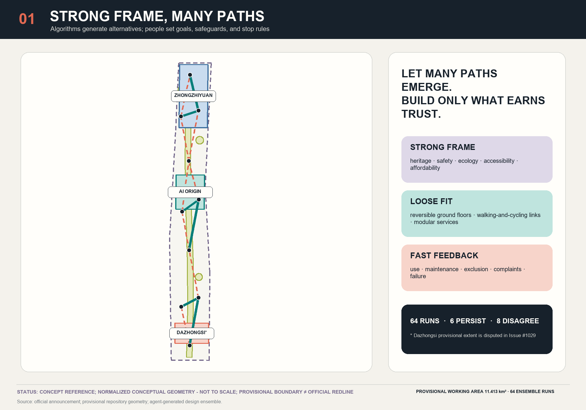
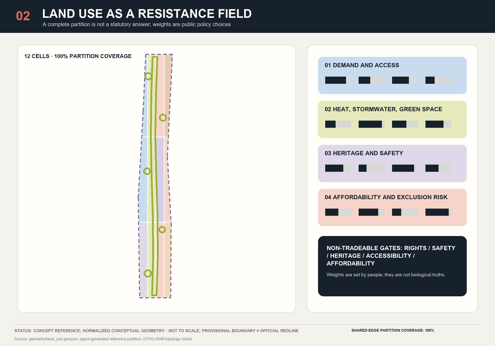
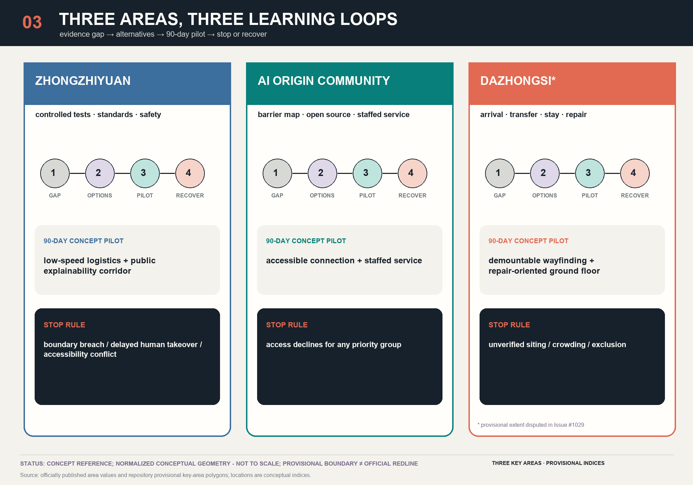
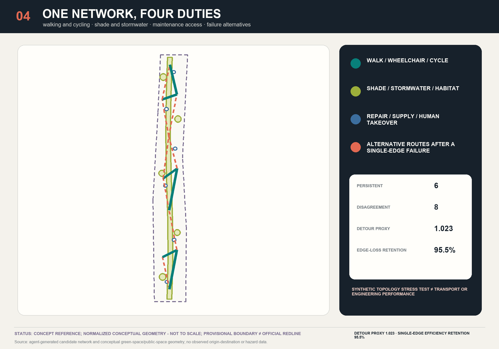
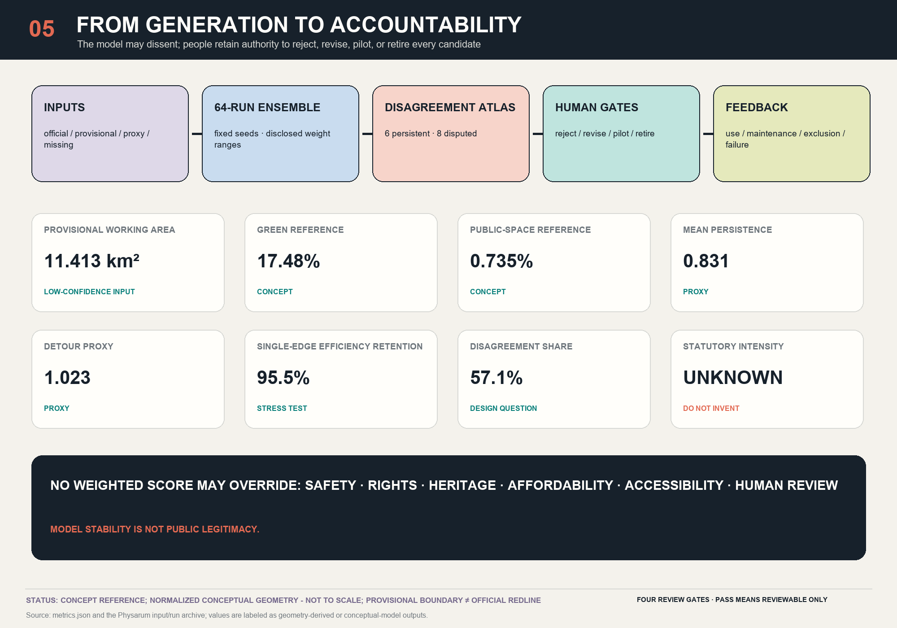

**Let many paths emerge. Build only the connections that earn trust.** This proposal neither asks slime mould to “plan Beijing” nor adopts its yellow biomorphic form as an urban image. The computation it actually runs is a seeded Kruskal topology and selection-instability probe over a hand-declared candidate set: it reports how often each candidate connection is selected across seeded runs, and it computes no movement, demand, engineering feasibility, accessibility, biological adaptation, or public preference, and proves no optimality for Beijing. The actual design products are an **Adaptive Network Disagreement Atlas** and an “Explore—Compare—Pilot—Learn” protocol. Beijing’s strategic infrastructure, heritage, ecology, safety, accessibility, and affordability form the strong frame; reversible ground floors, walking-and-cycling links, public services, and developer spaces provide loose fit; and evidence about use, maintenance, exclusion, complaints, and failure supplies fast feedback. The model can only pose questions. People and accountable institutions determine the goals, red lines, stop conditions, and final actions.

## Design Basis and Source List

The formal announcement and repository site package provide the factual starting point: the Coordinated Research Area is approximately 43.6 km², the Overall Design Area approximately 11.4 km², and the three Key Areas approximately 368.4 ha in total. These official area figures do not mean that exact official polygons are already available in the repository. Recalculation of the submitted SITE-001 geometry gives 11.413 km²; this value describes a low-confidence provisional working geometry, not a new official area determination.[source:OFFICIAL-ANNOUNCEMENT] [data:geometry/site_boundary.geojson#SITE-001] [metric:site_area_sqm]

Evidence is managed in four tiers: (1) the announcement, laws, and ministry standards define the tasks and non-negotiable obligations; (2) registered public materials support usable facts; (3) provisional boundaries and inferred layers support concept generation only; and (4) agent-generated layers and algorithms support comparison only. Issue #846 reports that the overall provisional polygon may be displaced; Issue #1029 questions a discrepancy of approximately 2.26 km between the provisional Dazhongsi polygon and the station; and Issue #1774 records that the heritage, rail, water, and planning-control layers remain incomplete. Every placement is therefore a conceptual recommendation or reference scheme for professional teams to develop further. None provides evidence for parcel demolition, station interfaces, engineering feasibility, or statutory approval.[source:ISSUE-846] [source:ISSUE-1029] [source:ISSUE-1774]

Methodological evidence is likewise tiered. Living *Physarum polycephalum* can serve as a biological analogue computer under controlled laboratory conditions. A Physarum-inspired algorithm is a researcher-configured tool whose nodes, resistance, parameters, and thresholds generate alternative networks. Urban complex-adaptive governance, by contrast, concerns rights, history, conflict, budgets, and accountability and cannot be inferred directly from biological behaviour. The Tokyo study connected 36 researcher-selected centres and compared aggregate graph measures across 21 experimental networks; it did not “design Tokyo.” Emergence can also produce segregation and harm, so every claim of resilience must ask: **resilience for whom, against which risks, and at whose cost?** [source:PHYSARUM-MAZE-2000] [source:PHYSARUM-TOKYO-2010] [source:SCHELLING-1971]

Generation statement: the text, bilingual figures, GeoJSON, offline viewer, and PDFs were generated by OpenAI Codex (GPT-5 family), and three body sections and one contract case in this round were written by Anthropic Claude Opus 5. Geometry and metrics were recalculated by local deterministic scripts in EPSG:4548. Papers and cases are cited without reusing third-party imagery or non-public maps. Full provenance is recorded in `sources.json`, model disclosure in `agent.json`, and authorship by round together with generation and copyright limitations in `report/copyright_statement.md`.[standard:PROJECT-OFFICIAL-ANNOUNCEMENT] [depth:existing_conditions_diagnosis]

## Three-Level Scope Framework

The three levels are not the same plan enlarged three times; they are three distinct scales of decision-making. The approximately 43.6 km² Coordinated Research Area calibrates the network of universities, research institutes, companies, capital, public services, and everyday life. The approximately 11.4 km² Overall Design Area supports a non-statutory spatial structure, a reference land-use partition, and system interfaces. The three Key Areas support 90-day reversible pilots, accountable owners, and stop rules. Their published official areas are 192.1 ha for Zhongzhiyuan, 104.3 ha for the Beijing AI Origin Community, and 72.0 ha for Dazhongsi, while the submitted polygons remain provisional indices.[source:AGENT-TASKBOOK] [data:geometry/key_areas.geojson] [metric:key_area_count]

The working framework is “strong frame—loose fit—fast feedback.” The strong frame encompasses formal planning, Jing-Zhang heritage value, blue-green safety, fire protection and utilities, accessibility, privacy, affordability, and human review; no optimisation may trade away these thresholds through a weighted average. Loose fit includes modular ground floors, temporary passages, time sharing, barriers mapped by communities, demountable shade, and low-speed services. Fast feedback carries aggregate use, accessibility failures, maintenance hours, complaints, algorithmic exclusion, and ecological effects into the next iteration instead of fixing the first output as permanent construction.[standard:MOHURD-URBAN-DESIGN-MEASURES] [depth:three_level_scope_framework]

In the spatial package, SITE-001 is shown as a low-contrast dashed constraint. Twelve land-use cells with shared boundaries provide 100% topological coverage; six civic rooms and the green spine are reference proposals; and candidate corridors are classified as persistent, disputed, or not selected according to recurrence. “Complete coverage” proves only that the submitted file contains no gaps or overlaps. It does not establish land-use suitability or statutory validity.[data:geometry/land_use.geojson] [metric:land_use_partition_coverage_ratio] [standard:MNR-LAND-USE-CLASSIFICATION-GUIDE]

Every iteration must follow the same sequence: synchronise public evidence; verify the permitted use of each source; rebuild the provisional working frame; generate multiple networks; first apply hard gates for rights, safety, heritage, climate, and accessibility; then publish the non-dominated alternatives and points of disagreement; and only then select a reversible pilot. When official polygons become available, the entire package must be recalculated rather than cosmetically replacing a single line with a “more precise” one.[source:SOURCE-REGISTRY] [data:assumptions.json#A-BOUNDARY-001]

## Coordinated Research Area: Industry and Future City Research

The primary identity is **ADAPTIVE JING-ZHANG / 京张应变**, described as “An Adaptive Civic Network for Centennial Jing-Zhang,” with the operating line “Explore—Compare—Pilot—Learn.” The branch–test–rejoin glyph places two anchors on a restrained railway datum and divides into three paths of different weights: one persists, one remains dashed for debate, and one fades into retirement. It reads simultaneously as a rail switch, an evidence path, and an open graph, without depicting slime mould, a brain, a leaf, or a neural network. Line weight denotes ensemble recurrence; dashed lines denote provisional or candidate status; coral denotes disagreement; graphite denotes the locked frame; and blue-green denotes civic and ecological value.

The three positioning statements become operational relationships. The Centennial Jing-Zhang Cultural Belt carries time and public memory. The Metropolitan AI Life Experience Belt makes everyday services accessible to residents without imposing a digital threshold. The AI Integrated Innovation Belt links research, validation, procurement, and maintenance. The five functions become a controlled testing interface for full-stack independent innovation; a shared platform for a world-class AI innovation ecosystem; a city-problem register for AI+ scenario enablement; reversible public space for an intelligent and lively city; and public audit and exit mechanisms for contributing to global AI-governance discourse.[source:AGENT-TASKBOOK] [standard:PROJECT-AGENT-OPEN-CALL-TASKBOOK]

“Three Zones–Two Wings” does not mean five isolated islands. Zhongzhiyuan supports full-stack independent innovation and governance validation; the Beijing AI Origin Community supports near-campus transfer and an open community; and Dazhongsi supports AI-native urban activities and urban arrival. The Zhongguancun Technology-Service Wing connects capital, intellectual property, standards, and international services. The Xiaoyuehe Scenario-Empowerment Wing connects real civic problems, blue-green systems, and routine maintenance. The AI ecosystem map is therefore organised as **resource—interface—space—public value**: universities, companies, and compute resources enter three types of test space through open challenges and a shared compliance desk, then return value to the city through procurement, training, community service, and knowledge archiving—not through a wall of company logos.[data:geometry/key_areas.geojson] [depth:overall_spatial_structure]

Six international precedents contribute mechanisms rather than imported imagery. Singapore’s one-north/LaunchPad demonstrates a public platform with differentiated nodes; Seoul AI Hub demonstrates city-supported training, incubation, and demonstration; Paris-Saclay/DATAIA demonstrates a federated institutional network; Montréal’s Mila demonstrates a non-profit interface between research and responsibility; Kendall Square demonstrates a planning bargain that links innovation-driven land value to housing, active ground floors, and public space; and Helsinki Smart Kalasatama demonstrates small tests in a real community, adoption gates, and retirement rules. All reported quantities are treated as activity indicators, not as proof that agglomeration causes public benefit.[source:CASE-ONE-NORTH] [source:CASE-SEOUL-AI-HUB] [source:CASE-KALASATAMA]

Negative precedents matter as well. Toronto Quayside shows why public control, privacy, intellectual-property rules, benefit sharing, and termination rights must precede technology deployment. Research density does not automatically produce affordable living, round-the-clock urban life, or neighbourhood justice. Adaptive Jing-Zhang therefore does not use “attracting global talent” to conceal costs borne by existing residents; it treats rental stability, accessibility, non-digital channels, low-cost space for small teams, and maintenance employment as ecosystem infrastructure.[source:CASE-QUAYSIDE] [depth:existing_conditions_diagnosis]

### Regional Innovation Synergy Relationships

The taskbook's regional-synergy review dimension names the Beiwei Community, Future Science City, Huairou Science City, the Economic-Technological Development Area, and the Beijing-Tianjin-Hebei region. This package holds no primary record of any of the five, so each row registers only the four things this package can be held to: the potential relationship, the evidence still required, the proposed review route requiring confirmation, and the claim limit. No row assigns a receiving duty to any body.

| Counterpart | Potential relationship (proposal only) | Evidence still required | Proposed review route requiring confirmation | Uncertainty and claim limit |
|---|---|---|---|---|
| RS01 Beiwei Community | The taskbook lists it as a synergy counterpart. The most this proposal can offer is a shared template of published scenario records and stop rules, so that AI services in both places can be reviewed against one standard. | Confirmation from the responsible authority of the community's current governing body, of which service records may be published, and of whether it accepts the same stop rules. | Would require confirmation and receipt by the district-level authority together with the body that operates the community; this proposal cannot name the receiving body. | This package holds no record of the community's present condition and asserts no existing agreement, joint programme, or data exchange. |
| RS02 Future Science City | The possible relationship is limited to method: offering this package's published reproducer, gate register, and failure-mode table as a comparable review format. | A statement of its current research and translation arrangements, and whether any existing procedure accepts an external review format. | Would require confirmation and receipt by the municipal science and technology authority; this proposal cannot name the receiving body. | Asserts no intent to cooperate, institutional relationship, movement of people, or delivered project. |
| RS03 Huairou Science City | The possible relationship is limited to shared vocabulary: offering this package's evidence grading and non-tradeable gates as citable definitions, so that review conclusions on comparable AI services can be compared across sites. | A published list of its service types, and whether its review procedure permits citing an externally defined gate. | Would require confirmation and receipt by the municipal science and technology authority together with the district government of the site; this proposal cannot name the receiving body. | Asserts no shared facility, compute allocation, data exchange, or spatial connection. |
| RS04 Economic-Technological Development Area | The possible relationship is limited to the direction of the questions: the S01-S10 scenario records can serve as a list from which the industrial side may judge which questions are worth defining jointly. | A published statement of its industrial and service needs, and the procurement and compliance procedure any joint work would have to follow. | Would require confirmation and receipt by the municipal industry authority together with the administrative body of the area; this proposal cannot name the receiving body. | Asserts no procurement, investment, company location, or capacity arrangement. |
| RS05 Beijing-Tianjin-Hebei region | The possible relationship is limited to a shared format: writing this package's published stop rules, non-digital fallback requirements, and failure-mode table in a form other cities can cite directly. | A statement of the coordination arrangements that already exist at regional level, and which level of authority may receive a cross-provincial request for a shared format. | Would require confirmation and receipt by an existing coordination mechanism at provincial or municipal level or above; this proposal cannot name the receiving body. | Asserts no regional agreement, route, investment, relocation, or administrative arrangement. |

Regional synergy: brief/site-package/agent_taskbook.json#/review_dimensions/3 [source:AGENT-TASKBOOK] (taskbook_naming_only) All five rows are questions, not conclusions. No row records an existing agreement, route, investment, commitment, precise geographical relationship, or implementation fact. The English names of the five counterparts are working translations of the taskbook's Chinese names; the taskbook itself publishes no English name.

## Overall Design Area: Urban Renewal and Regulatory-Plan-Level Urban Design

The overall concept is **“one spine, three zones, two wings, one public ledger.”** The Jing-Zhang Climate-Memory Green Spine combines heritage narrative, shade, stormwater detention, and slow mobility. The three Key Areas use different learning loops. The two wings exchange professional resources and real urban challenges. A public “choice ledger” records why each candidate persists or remains disputed, who benefits, who bears the worst-case impact, and when the intervention must stop. This is not a completed masterplan but a spatial protocol that professional teams can continue to develop.[data:geometry/green_space.geojson#GREEN-001] [data:geometry/public_space.geojson#PUBLIC-001] [depth:overall_spatial_structure]

The v0 run uses ten normalised conceptual nodes, 24 candidate edges, and 64 fixed integer seeds. Within human-defined ranges, each run varies weights for length, equity gain, climate gain, heritage review, and maintenance; constructs a minimum-cost spanning tree; and adds two redundancy edges. A recurrence frequency of at least 0.70 defines a persistent candidate; a frequency of at least 0.35 but below 0.70 defines a disagreement candidate; and lower-frequency edges are excluded by rule in this run. The result comprises 6 persistent candidates and 8 disagreement candidates; the denominator of the disagreement share is the 14 edges that meet the 0.35 qualification rule, so the share is 8/14 = 57.1%, not a share of the 11 edges that each run produces by construction and not a share of the 24 candidate edges that were considered. The exact name of this computation is a **seeded Kruskal topology and selection-instability probe over a hand-declared candidate set**. The connectivity of each run and the count of exactly 11 selected edges are guaranteed by construction and are therefore not findings. It does not compute movement, demand, engineering feasibility, accessibility, biological adaptation, public preference, or optimality for Beijing. Physarum is methodological lineage only—not an implemented flux–conductivity equation, a travel-demand model, or biological proof of optimality.[metric:ensemble_run_count] [metric:persistent_corridor_count] [metric:disagreement_corridor_count]

Disagreement between the algorithm and the city is not a finding. A persistent edge only means that this edge stayed stable under the disclosed low-confidence proxy assumptions and the declared weight-and-jitter specification, and it still requires human review. A disagreement edge only means selection instability for that edge under the same declared specification: its use is to put review questions to people—which weight set is adopted, who benefits, who bears the worst-case impact, and when the work must stop—not to report an observed conflict in Beijing and not to establish a confirmed real-world trade-off. The zero-jitter comparison pins that down: rerunning the same 64 seeds with the per-edge jitter set to zero moves 8 edges between status classes and empties the disagreement band, so the band is a product of this rule set and this jitter specification. Edges excluded by rule remain in the run archive so that the submission does not cherry-pick attractive results. Inputs, run weights, and edge sets are published in `visual/assets/physarum-inputs.json` and `physarum-runs.json`. The companion standard-library Node.js script `visual/assets/reproduce_physarum.js` uses an original JavaScript implementation of CPython’s integer-seeded MT19937 draw semantics under IEEE-754 double-precision arithmetic. The reproducer performs 633 field-by-field comparisons, independently recomputes 7 derived metrics, and expects 0 mismatches; a separate isolated tamper suite mutates only temporary copies, proving that the comparison actually detects a corrupted record while both frozen data assets stay byte-identical. It reproduces the published execution, not the empirical truth or planning validity of the proxy.[source:ISSUE-1781] [source:ISSUE-2170]

Regulatory-depth content is divided into known, proposed, and pending confirmation. The complete reference land-use partition, building prototypes, candidate network, green space, public services, and phasing are recalculable. FAR, total floor area, height, density, setbacks, road redlines, facility standards, fire access, utility capacity, and heritage controls remain unknown. The proposal does not fill unknown fields with “reasonable ranges,” because an invented control value is more dangerous than an explicit gap.[standard:MOHURD-CONTROL-DETAILED-PLANNING] [metric:floor_area_ratio] [metric:approved_height_limit_m]

### The Complex Adaptive System Operating Model

This section demotes “complex adaptive system” from rhetoric to rules that can be checked. The agents are not an abstract “city” but the four categories of role already named in the renewal-action governance register — operating role, maintainer, beneficiary, and worst-affected group — plus a stop-authority holder independent of the operator. Each agent holds only local information: the operator sees today’s opening and closing, the maintainer sees spare parts and work orders, a resident sees their own stretch of street, and no party sees the whole. The local rules are therefore short: open during the published hours; issue a receipt on intake; stop when a named stop trigger appears; clear the site item by item against the dismantling list; and write down what could not be done rather than omitting it.[source:PORTUGALI-SELF-ORGANIZING-1997] [depth:renewal_project_list]

The state variables are not model outputs but the observed metric already registered for each of P00 through P11: the number of access interruptions and the interval before an alternative route is provided for P01; the fulfilment rate of published opening hours and the number of refused-entry events for P02; the number of takeover events and the interval to completed takeover for P06; and the share of deployed equipment models covered by spare parts for P10. All of them are operational counts, and every one can be recorded by staff on site without a sensor, so no acquisition system has to be built first in order to make the work observable — which is simultaneously a privacy constraint, because a metric that can be kept on paper produces no re-identifiable personal data.[data:geometry/phasing.geojson] [data:assumptions.json#A-PILOT-001]

Feedback loops come in two families and exist in pairs. The balancing loop is “observed metric crosses the stop trigger → stop authority acts → rollback → physical restoration”; the proposal writes this loop for every action and splits the stop authority across at least two mutually independent parties, so that the party running an intervention cannot both execute it and absolve itself. The reinforcing loop is the conversion chain: public question intake → open challenge → compliance sandbox → 90-day public pilot → four human gates → procurement or institutional adoption → scale-up with a maintenance budget. There is exactly one design rule: **no reinforcing loop may be established without a balancing loop that a different party can trigger**; the speed limit on the reinforcing loop is set by the evidence the balancing loop can produce, not by funding or by a communications schedule.[source:OSTROM-COMMONS-1990] [source:OSTROM-POLYCENTRIC-2010]

Attractors are what this proposal has most reason to guard against, because they form without anyone acting in bad faith. The first is the stable-edge attractor: once the 6 persistent candidates are cited often enough, they attract investment first and justification second, until “the model is stable” is read as “this ought to be built”; the countermeasure is that P11 registers “the number of candidates added or removed that year” as an observed metric and requires any change to the candidate set to state its reason, so what is recomputed each year is the candidate set itself rather than the same hand-declared edges. The second is the showcase attractor: a pilot that photographs well is easier to renew; the countermeasure is that every observed metric is an operational count rather than a headcount. The third is the maintenance-debt attractor: deployment outruns repair capacity, so liability lands before capability does; the countermeasure is the hard rule in P10 that no equipment model without spare parts and a named maintainer enters deployment.[metric:persistent_corridor_count] [source:HOLLING-ADAPTIVE-CYCLE-2001]

A threshold has to be published as both its rule value and its reachable value. 0.70 and 0.35 are the written rules, but the closest values a 64-run ensemble can actually take are 45/64 = 0.703125 and 23/64 = 0.359375, and the two are not the same object; a system governed by thresholds that publishes only the rule value reports a precision it does not have. The same discipline applies to operational thresholds: any “stop after N occurrences” clause must state who counts N, over what window, and whether the default is to stop or to continue when the count itself fails. This proposal defaults to stopping, on the grounds that a failed count is precisely the moment the system loses its basis for judging whether to stop.[metric:ensemble_run_count] [data:assumptions.json#A-WEIGHTS-001]

Path dependence determines what may be tried and what may not. The proposal separates the system into two layers. The fast layer is movable furniture, demountable modules, floor treatments that do not penetrate the slab, and notices that can be withdrawn; its recovery is carried by the dismantling list and the restoration verification record. The slow layer is records already published, arrival patterns already changed, operators already displaced, and expectations already formed, and none of it leaves with the components. The “residual liability” column of the register is exactly the ledger of the slow layer: a withdrawn erroneous record may still be in use downstream, and decisions a retired model already caused are not reversed automatically. The reversibility claim in this proposal is therefore limited strictly to the fast layer, under a rule stated in advance: **irreversibility may be spent only where a named party has already accepted the corresponding residual liability**. No such party exists today, which is why `D12` stays open and every action remains without authorisation and without funding.[source:SHEARING-LAYERS-BRAND-1994] [source:OPEN-BUILDING-HABRAKEN-2021] [source:REAL-OPTIONS-NEUFVILLE-2003]

Learning does not happen automatically. Ensemble recomputation, public pilots, and annual review produce learning only when three conditions hold at once: the observed metric is genuinely recorded, negative results are published as openly as positive ones, and the previous round’s judgement can be overturned by the next. On the third condition this proposal does not overwrite history — a withdrawn version keeps the record that it existed and was withdrawn, and an earlier year’s recomputation is not rewritten by a later one. All of this sits in the operating-agreement layer, whose existence still depends on the operating authority named by `D16`, which this proposal does not establish on anyone’s behalf. The complex-adaptive-systems literature cited in this section supplies concepts and vocabulary only; it establishes no fact about this site, no control value, and no professional review conclusion. Two of those entries, `REAL-OPTIONS-NEUFVILLE-2003` and `CAS-DYNAMIC-CITIES-2018`, carry a title and an author recorded in the source ledger as not transcribed from the source, so they are cited by registered identifier for the vocabulary they contribute and nothing specific is asserted on their authority.[source:HOLLING-1973] [source:CAS-DYNAMIC-CITIES-2018] [depth:phasing_implementation]

### The Five Layers of the Slime-Mould Method and the Zero-Jitter Comparison

In this proposal “slime mould” is a five-rung ladder. Each rung licenses a different kind of conclusion, and **no rung may be skipped**: a rung may be cited only in support of what the rung below it has actually established.

| Layer | Artefact in this package | What it can support | What it cannot support |
|---|---|---|---|
| 1. Biological precedent | The maze experiments, the adaptive network model, and its Tokyo experiment, all published by others | The observation that a decentralised organism can produce a network balancing cost against redundancy without central planning | Any conclusion about Beijing; transplanting the organism’s objective function to a city; any optimality |
| 2. Computational analogy | Exactly one idea is borrowed: repeating a run under perturbation separates robust connections from disputed ones. In this package it is implemented as a seeded Kruskal topology and selection-instability probe | Treating “disagreement between runs” as an instrument for asking questions | Calling the output a slime-mould simulation; the flux–conductivity equation is not implemented anywhere in this package |
| 3. Deterministic reproducer | `visual/assets/reproduce_physarum.js`: 64 fixed seeds, 633 field-by-field comparisons, 7 independently recomputed derived metrics, 0 expected mismatches, plus an isolated tamper suite that mutates only temporary copies | That the published numbers are the numbers the published inputs produce | That those inputs are true of Beijing |
| 4. Ablation comparison | `visual/assets/physarum-zero-jitter-ablation.json`: the per-edge jitter term is set to zero while the draw order and the values of the five weights stay exactly the same | Naming which single input produces the disagreement band | How Beijing would behave |
| 5. Planning judgement | 8 disagreement candidates enter public discussion, 6 persistent candidates still require human review, and none of them enters engineering design | The order of precedence between professional work and public discussion | Approval, funding, or engineering feasibility |

The result at the fourth rung belongs in the body text precisely because it counts against this proposal. With jitter set to zero, 8 of the 24 candidate edges change status (`E01`, `E05`, `E08`, `E12`, `E13`, `E16`, `E17`, `E19`) and the largest frequency change is 0.546875; persistent edges rise from 6 to 11, while **the disagreement band falls to 0 edges** and the persistence graph stays connected. In other words, the disagreement band on which this proposal builds its questions is produced by one declared input perturbation; it is not a property discovered in Beijing. Five edges (`E01`, `E02`, `E16`, `E17`, `E19`) still change selection across seeds once jitter is zero, but not one of them lands inside the 0.35 to 0.70 band.[metric:disagreement_corridor_count] [metric:persistent_corridor_count]

This disclosure does not weaken the method; it bounds it. The purpose of the disagreement band is to turn “where is this proposal least certain about its own weighting” into a list that can be argued about in public. It was never a measurement of movement, demand, or preference in Beijing, and jitter is a declared input perturbation rather than measurement error, so it represents no real-world uncertainty and the stable selections obtained by zeroing it are not thereby more correct. If a future year’s recomputation removes jitter or changes its range, the size of the disagreement band will change with it, which is why P11 requires every recomputation to publish the primary run alongside the zero-jitter comparison and to state the reason for any addition to or removal from the candidate set.[metric:mean_persistent_frequency] [depth:metrics_recalculation]

## Detailed Design of Key Areas

All three Key Areas use the same learning framework but answer different questions: existing gap → multiple alternatives → 90-day reversible pilot → stop and recovery. Provisional polygons group the tasks; they do not assert exact corners, station entrances, or ownership. Every pilot card must identify the beneficiary, accountable role, observed metric, worst-affected group, stop trigger, and recovery action. No intervention may proceed to engineering design until official boundaries, existing-condition surveys, and professional controls are available.[data:geometry/key_areas.geojson#PROV-KEY-001] [data:assumptions.json#A-BOUNDARY-001]

**Zhongzhiyuan AI Independent Innovation Acceleration Area:** full-stack R&D, safety governance, standards validation, edge computing, and low-speed logistics are organised through three interfaces—controlled testing, public explanation, and human takeover. Reference prototypes include a bookable enclosed test court, a public explainability gallery, ground-floor repair and standards desks, and a logistics handover point that does not collect facial data. A 90-day pilot tests service routes and maintenance responsibility only; it stops if it creates an accessibility conflict, intrudes into public space, exceeds the takeover time limit, or crosses a predefined complaint threshold. Every proposed physical placement remains part of a reference scheme.[data:geometry/buildings.geojson] [depth:three_key_area_detailed_design]

**Beijing AI Origin Community:** a resident-and-developer “everyday barriers map” corrects an overly narrow campus-transfer narrative. Prototypes include walking- and wheelchair-priority seams between campuses and parks, an open-source release hall, a shared service desk for residents and talent, quiet night workrooms, childcare, and affordable food interfaces. Digital navigation must have equivalent paper maps, on-site staff, and telephone channels. Each persona is constructed from public aggregate data only, and no vulnerability is inferred from a name or movement trace. A pilot cannot scale if it reduces access for older people, disabled people, carers, or non-smartphone users.[standard:BARRIER-FREE-ENVIRONMENT-LAW] [data:assumptions.json#A-EQUITY-001]

**Dazhongsi AI Industry Cluster:** the subject is six kinds of use: urban arrival, intelligent terminals, content consumption, repair, enterprise services, and international presentations. This proposal states nothing about what already stands on the site or how it is built. Because Issue #1029 questions the location of the provisional polygon, the proposal draws no exact station–city interface. It defines four performance stages—arrive, transfer, stay, and repair—and assigns a professional study of step-free connections across all four quadrants. A 90-day test is carried entirely by demountable, movable modules: guidance, shade, staffed service, and a repair bay. How those modules would meet existing construction, levels, or evacuation conditions is unsurveyed, and nothing here implies permanent junction or rail works.[source:ISSUE-1029] [data:geometry/key_areas.geojson#PROV-KEY-003]

The three “AI pilgrimage landmarks” are not expensive icon buildings. The **Jing-Zhang Memory Compiler** juxtaposes railway engineering records, oral histories, and AI interpretation while allowing human correction. The **AI Origin Open Registry** records open-source contributions, failed experiments, and civic questions rather than displaying only celebrated individuals. The **Model Commons and Appeal Table** lets people inspect scenario data cards, submit corrections, choose staffed processing, and observe model retirement. These landmarks respectively serve history, co-creation, and accountability, and all remain conceptual nodes for professional teams to develop further.[source:AGENT-TASKBOOK] [depth:height_massing_character]

### Key-Area Component and Route Register

The register below records every component and every proposed step-free chain in the three key areas as a checkable entry: a stable ID, a bilingual name, its content, an exact per-entry evidence reference, and the unresolved D gates that block it. Every entry is a conceptual proposal, not authorized and not funded; an unresolved D gate is a blocking condition, not a footnote.

The key-area plate architecture is 3 areas × 5 concepts = 15 plates, published as 30 bilingual artifacts (one Chinese and one English file per plate). The five concepts are 01 situation, claim and limits; 02 program and flows; 03 reversible module sections; 04 access, operations and seasons; 05 governance, stop and evidence. A section dimension has exactly two admissible bases. proposed_module means the dimension is a module this proposal itself proposes, stated in metres; it is not a statement about existing conditions, and no party has verified it. pending means the dimension is unknown: the unit is still metres, the value must be null, and the record names the evidence that would resolve it and the trigger to recompute. No section dimension may be inferred from a standard clause, from a site photograph, or from the provisional geometry in this package: a provisional extent is not a survey, and printing its span on a section would treat a boundary this proposal itself disputes as a construction quantity.

#### Zhongzhiyuan AI Acceleration Area

Role: Controlled testing and governance verification · Announced area: 192.1 ha · Lab 1

This area answers one question: what a low-speed machine is allowed to do on a street with people on it, who stops it, and who repairs it afterwards. It is the only one of the three labs that runs controlled equipment testing.

**Components**

| ID | Name | Content | Evidence reference | Blocked by |
|---|---|---|---|---|
| Z-C01 | Controlled Test Loop | A time-boxed low-speed test loop marked by movable barriers, with test and non-test hours posted separately. The barriers are not fixed to the ground. | component:Z-C01 \| plate:ZZY-02 \| source:AGENT-TASKBOOK \| data:assumptions.json#A-PILOT-001 | D10 D12 |
| Z-C02 | Stop Button and Human Takeover Post | One physical stop button per loop segment and one on-duty human takeover operator. Stop authority is named and the takeover procedure is on paper, so it needs no app. | component:Z-C02 \| plate:ZZY-05 \| source:ISSUE-2170 \| standard:GENERATIVE-AI-INTERIM-MEASURES | D10 D16 |
| Z-C03 | Public Test Log Desk | At the close of each test day the day's decisions and aggregate counts are posted at the desk. Decisions and aggregate evidence references only; no personal data. | component:Z-C03 \| plate:ZZY-05 \| source:OSTROM-COMMONS-1990 \| standard:GENERATIVE-AI-INTERIM-MEASURES | D11 |
| Z-C04 | Parts and Repair Bay | A repair bay and parts rack established at the same time as the test loop. Equipment without an available bay and a named maintainer may not enter a test window. | component:Z-C04 \| plate:ZZY-03 \| source:SHEARING-LAYERS-BRAND-1994 \| data:assumptions.json#A-PILOT-001 | D12 |
| Z-C05 | Boundary Notice and Exit | Every opening in the test boundary carries a bilingual notice and a threshold-free exit stating the day's test, how to stop it, and where complaints go. | component:Z-C05 \| plate:ZZY-04 \| standard:BARRIER-FREE-ENVIRONMENT-LAW \| source:AGENT-TASKBOOK | D07 |

**Proposed step-free chains**

| ID | Name | Content | Evidence reference | Blocked by |
|---|---|---|---|---|
| Z-R01 | Public observation loop (step-free throughout) | The proposed public observation loop, step-free throughout; it never enters the controlled-test area and does not depend on whether a test window is open. | route:Z-R01 \| plate:ZZY-02 \| standard:BARRIER-FREE-ENVIRONMENT-LAW \| metric:public_space_ratio | D05 D07 |
| Z-R04 | Emergency egress and rescue route (step-free throughout) | The proposed emergency egress route, set out step-free; its width, gradient and final alignment stand only once a qualified professional has verified them. | route:Z-R04 \| plate:ZZY-02 \| section:ZZY-SEC-B \| source:HOLLING-1973 | D05 D06 D07 |

**Winter operation:** Winter shortens the test window and gives clearing and de-icing priority to the spine and the bypass. Under no test arrangement may the spine be closed by ice or snow without an alternative path. The choice and frequency of de-icing material belongs in the maintenance schedule, not in this proposal's performance claims.

**Maintenance duty:** Every test unit is paired with a named maintainer and a parts slot; if the maintainer is absent the unit loses its test eligibility. Maintenance obligations, annual amounts, and restoration funding all depend on D12 and are not activated before it is obtained.

**Phase 1 conceptual envelope ENV-ZY-01:** One 90-day reversible passage pilot: movable barriers, no penetration of the ground surface, restored to its prior state at closure against a dismantling checklist with a retained restoration verification record. — reversible · not authorized · unfunded · Blocked by: D10 D12

**Plates**

**ZZY-01 · situation, claim and limits**: Spatial mode: provisional working extent. The plan is drawn over the provisional working extent, not inside an official boundary. When the official polygon is published the compositional relationships survive and every coordinate and area is voided and redrawn. The public observation loop neither enters the controlled test field nor passes through it as a condition of use: if the test field is suspended or closed, the observation loop remains complete and walkable.

**ZZY-02 · program and flows**: Zhongzhiyuan · conditional ground plan: public observation set beside controlled testing. ZZY-PLAN-01 sets out 9 elements (Z-E01 Z-E02 Z-E03 Z-E04 Z-E05 Z-E06 Z-E07 Z-E08 Z-E09) and keys two cuts to the sections: A — cut across the separation zone between the observation gallery and the controlled test enclosure (ZZY-SEC-A); B — cut along the logistics spine, through a maintenance face and an emergency turning bay (ZZY-SEC-B).

**ZZY-03 · reversible module sections**: Section A: separation of public observation from controlled testing (ZZY-SEC-A) and Section B: logistics, maintenance and emergency recovery (ZZY-SEC-B). The two sections carry 8 dimensions between them: 4 are modules this proposal itself proposes (proposed_module), stated in metres and unverified, and 4 are pending, left null in metres and each carrying the trigger that would recompute it. A section dimension admits no third basis: a span read off the geometry already in this package may not be printed as one.

**ZZY-04 · access, operations and seasons**: ZZY-SFC-01 runs 7 nodes (Arrival threshold, First decision point with orientation board, Rest point with backed seating, Toilet direction point, Staffed service desk, Public observation platform, Exit threshold) across 6 segments as a proposed step-free chain; it is proposed, verified=false, its accessibility gate is G5:pending, and survey and professional audit are both pending. Its 6 equivalent channels (tactile visual_contrast audio staffed paper telephone) are all proposed_pending_audit, and its 7 operating modes (day night event snow maintenance power_failure digital_failure) each declare availability, manual fallback, stop action and recovery condition. The winter case is carried on ZZY-SEC-B across 8 topics, and the 2 snow storage bays (Z-SS1 Z-SS2) overlap neither the step-free chain nor the guidance strip: Snow storage is always placed off the step-free chain and off the guidance strip; where no compliant bay exists the snow is carried away rather than heaped nearby. The pilot is 90 days and sufficient_for_year_round is false. A ninety-day pilot can only evidence ninety days. Winter icing, summer downpour and the full-year maintenance load all fall outside its observation window and no year-round performance may be inferred from it.

**ZZY-05 · governance, stop and evidence**: Phase 1 in this area is expressed only as the removable envelope ZZY-P1-ENV. Removal: Every component is mechanically fixed, dismantled in reverse order and carried away whole; removal requires no destructive work. Reinstatement: After removal the original paving or ground cover is reinstated, with extent and build-up annotated on Section B; restoration capacity has not been confirmed by any party. Residual liability: Residual liability for dismantling, removal and reinstatement has no holder; no work may begin before one is named. The envelope is not_authorized and unfunded, and is blocked by D01 D05 D09. Its 2 seasonal thresholds — ZZY-TH-01 time to restore the chain after snowfall (proposed target: the step-free chain is cleared first once snowfall stops); ZZY-TH-02 year-round availability of the public observation loop (proposed target: suspension of the test field does not close the observation loop) — all hold approved_threshold null and pilot_start_allowed false; no pilot may start before a threshold is approved.

#### Beijing AI Origin Community

Role: Campus-adjacent transfer and resident-led correction · Announced area: 104.3 ha · Lab 2

This area answers a different question: how the people who live next to a system correct it when they had no part in designing it. It runs no equipment testing; it runs registration, appeal, and receipt.

**Components**

| ID | Name | Content | Evidence reference | Blocked by |
|---|---|---|---|---|
| O-C01 | Open Registry Desk | Registers the name, responsible body, operating hours, and stop method of every AI+ scenario running in the area; the register is publicly readable. | component:O-C01 \| plate:AIO-05 \| standard:GENERATIVE-AI-INTERIM-MEASURES \| source:OSTROM-POLYCENTRIC-2010 | D11 D16 |
| O-C02 | Resident Correction Table | A paper correction table open at fixed hours where residents may correct any registered entry. The original record is retained and marked as corrected. | component:O-C02 \| plate:AIO-05 \| source:OSTROM-COMMONS-1990 \| data:assumptions.json#A-EQUITY-001 | D11 |
| O-C03 | Ground-Floor Shared Workroom | Shared work positions in existing ground-floor space, divided on open-building lines into support and infill: the support is untouched, the infill is replaceable. Until the existing-building determination is complete this remains a proposal hypothesis. | component:O-C03 \| plate:AIO-03 \| source:OPEN-BUILDING-HABRAKEN-2021 \| data:assumptions.json#A-BUILDING-001 | D04 D06 |
| O-C04 | Lit and Sheltered Segment | Lighting and shelter improvement along the segment residents walk daily, covering first the stretch with the heaviest night use and the densest complaints. Illuminance targets depend on on-site measurement and no numeric claim is made before it. | component:O-C04 \| plate:AIO-04 \| standard:ELDERLY-SMART-TECH-PLAN-2020-45 \| data:assumptions.json#A-EQUITY-001 | D05 D12 |
| O-C05 | Appeal Box and Receipt Board | A non-digital appeal channel: submitting a paper appeal returns a numbered receipt and the outcome is posted against that number. An arrangement requiring appeals to pass through an application is not accepted. | component:O-C05 \| plate:AIO-05 \| standard:ELDERLY-SMART-TECH-PLAN-2020-45 \| source:BEIJING-RESPONSIBILITY-PLANNER-2024 | D16 |

**Proposed step-free chains**

| ID | Name | Content | Evidence reference | Blocked by |
|---|---|---|---|---|
| O-R01 | Daily service line (step-free throughout) | The proposed daily service line, step-free throughout, connecting the staffed points that work without a phone. | route:O-R01 \| plate:AIO-02 \| component:O-C04 \| standard:BARRIER-FREE-ENVIRONMENT-LAW | D05 D07 |
| O-R02 | Release commons approach (step-free throughout) | The proposed step-free approach to the release commons; the commons itself runs on published rules of assembly and has no access control. | route:O-R02 \| plate:AIO-02 \| component:O-C01 \| source:OSTROM-COMMONS-1990 | D05 D07 |
| O-R03 | Care frontage approach (step-free throughout) | The proposed step-free approach to the care, quiet and affordable frontage; the tenure of that frontage and any existing ground-floor space remain undetermined. | route:O-R03 \| plate:AIO-02 \| section:AIO-SEC-A \| standard:BARRIER-FREE-ENVIRONMENT-LAW | D04 D07 |
| O-R04 | Conditional slow seam route (step-free throughout) | A conditional step-free slow-seam route. It does not stand until D04, D05, D08, D12 and D16 are all closed; any segment touching a road or a crossing is held with D08. | route:O-R04 \| plate:AIO-02 \| section:AIO-SEC-B \| data:assumptions.json#A-NETWORK-001 | D04 D05 D08 D12 D16 |

**Winter operation:** Winter reverses the clearing order: the daily-use and night-priority segments are cleared before any demonstration stretch. The correction table and appeal box keep an indoor or sheltered position through winter so the non-digital channel is never interrupted by season.

**Maintenance duty:** The registry desk and receipt board are maintained weekly by a named body; if maintenance lapses the corresponding scenario loses its registration standing under the posted rule. Staffing, budget, and term depend on D12 and D16.

**Phase 1 conceptual envelope ENV-AO-01:** One reversible pairing of a ground-floor shared workroom and a registry desk: existing ground-floor space only, demountable furniture and partitions, leaving no irreversible alteration at closure. — reversible · not authorized · unfunded · Blocked by: D04 D06 D12

**Plates**

**AIO-01 · situation, claim and limits**: Spatial mode: provisional working extent. The plan places only the components and relationships this proposal puts forward; it depicts no existing tenure, boundary or building stock. The base is the provisional working extent and is redrawn when the official polygon is published. This area draws and infers no campus gates, boundaries, access controls, ownership, rights of way, parcels or existing ground-floor space. The slow seam is annotated conditional precisely because whether it can exist depends on one of those unknowns. 7 categories are explicitly not claimed: campus_gates, boundaries, access_controls, ownership, rights_of_way, parcels, existing_ground_floor_space.

**AIO-02 · program and flows**: AI Origin Community · conditional ground plan: the release commons sharing ground with daily service. AIO-PLAN-01 sets out 9 elements (O-E01 O-E02 O-E03 O-E04 O-E05 O-E06 O-E07 O-E08 O-E09) and keys two cuts to the sections: A — cut across the release commons, the staffed service position and the care frontage (AIO-SEC-A); B — cut along the slow seam, through the quiet frontage and the winter shelter position (AIO-SEC-B).

**AIO-03 · reversible module sections**: Section A: release commons, staffed service and care frontage (AIO-SEC-A) and Section B: slow seam, quiet frontage, winter shelter and maintenance (AIO-SEC-B). The two sections carry 8 dimensions between them: 4 are modules this proposal itself proposes (proposed_module), stated in metres and unverified, and 4 are pending, left null in metres and each carrying the trigger that would recompute it. A section dimension admits no third basis: a span read off the geometry already in this package may not be printed as one.

**AIO-04 · access, operations and seasons**: AIO-SFC-01 runs 7 nodes (Frontage arrival face, Decision point at the edge of the commons, Sheltered rest point, Toilet direction point, Staffed and non-digital service positions, Model release commons, Frontage exit face) across 6 segments as a proposed step-free chain; it is proposed, verified=false, its accessibility gate is G5:pending, and survey and professional audit are both pending. Its 6 equivalent channels (tactile visual_contrast audio staffed paper telephone) are all proposed_pending_audit, and its 7 operating modes (day night event snow maintenance power_failure digital_failure) each declare availability, manual fallback, stop action and recovery condition. The winter case is carried on AIO-SEC-B across 8 topics, and the 2 snow storage bays (O-SS1 O-SS2) overlap neither the step-free chain nor the guidance strip: Storage sits outside the frontage movement band and the guidance strip and never blocks the way into the non-digital service position; where no compliant place exists the snow is carried away. The pilot is 90 days and sufficient_for_year_round is false. A ninety-day pilot covers ninety days. Winter icing, summer heat and the seasonal swing in care demand fall outside its observation window and no year-round conclusion follows from it.

**AIO-05 · governance, stop and evidence**: Phase 1 in this area is expressed only as the removable envelope AIO-P1-ENV. Removal: Components are mechanically fixed above the existing ground, dismantled whole and carried away without damaging the original paving. Reinstatement: After removal the original frontage paving and ground cover are reinstated, with the extent annotated on Section B; restoration capacity has not been confirmed by any party. Residual liability: Residual liability for removal, transport and reinstatement has no holder; if the slow seam were built and then withdrawn, liability for its reinstatement is equally undetermined. The envelope is not_authorized and unfunded, and is blocked by D02 D06 D11. Its 2 seasonal thresholds — AIO-TH-01 year-round availability of the non-digital channel (proposed target: a digital failure does not reduce non-digital processing capacity); AIO-TH-02 retention of frontage chain clear width in winter (proposed target: stored snow never occupies the frontage movement band during clearing) — all hold approved_threshold null and pilot_start_allowed false; no pilot may start before a threshold is approved.

#### Dazhongsi AI Industry Cluster

Role: Arrival, repair, and urban service interface · Announced area: 72 ha · Lab 3 · non-georeferenced

This area answers a third question: what can still be designed responsibly when the position itself cannot be confirmed. The answer is a set of performance modules that depend on no coordinate: arrival, repair, service, and waiting.

> **non-georeferenced** Issue #1029 disputes the position of the provisional Dazhongsi polygon relative to the station. The area is therefore treated as neither a station nor a georeferenced parcel: no entrance, road, crossing, parcel, distance, or positive station relationship is drawn or claimed. It is expressed only as non-georeferenced performance tasks.

**Components**

| ID | Name | Content | Evidence reference | Blocked by |
|---|---|---|---|---|
| D-C01 | Arrival Module | A coordinate-independent arrival unit: an enquiry position, seating, shelter, and bilingual guidance. Which arrival point it serves is decided by later evidence and is not specified here. | component:D-C01 \| plate:DZS-02 \| source:ISSUE-1029 \| data:assumptions.json#A-BOUNDARY-001 | D02 D03 D08 |
| D-C02 | Repair and Parts Module | A shared repair bay and parts library serving the pilot equipment of the whole belt; this is where the three labs' repair capacity sits. | component:D-C02 \| plate:DZS-03 \| source:SHEARING-LAYERS-BRAND-1994 \| data:assumptions.json#A-PILOT-001 | D02 D12 |
| D-C03 | Urban Service Counter Module | A counter unit placing open-source enterprise services beside public services, offering a paper path and a digital path side by side. | component:D-C03 \| plate:DZS-04 \| standard:ELDERLY-SMART-TECH-PLAN-2020-45 \| source:CASE-ONE-NORTH | D02 D16 |
| D-C04 | Sheltered Waiting Module | A covered waiting unit with seating, gaining a windbreak face in winter and keeping cross-ventilation in summer. It claims no position relative to any station. | component:D-C04 \| plate:DZS-04 \| data:assumptions.json#A-CLIMATE-001 \| source:CASE-SEOUL-AI-HUB | D02 D13 |
| D-C05 | Maintainer Station Module | A fixed station and training position for maintainers. A maintenance commitment without a station counts toward no implementation-capacity claim. | component:D-C05 \| plate:DZS-02 \| source:BLUEVIEW-RENEWAL-CASE-2026 \| data:assumptions.json#A-PILOT-001 | D12 D16 |

**Proposed step-free chains**

| ID | Name | Content | Evidence reference | Blocked by |
|---|---|---|---|---|
| D-R01 | Order link from the arrive position to the transfer position (step-free throughout) | The order link from the arrive position to the transfer position, put forward as step-free; it carries no position, distance or level and establishes no relationship to the station. | route:D-R01 \| plate:DZS-02 \| component:D-C01 \| source:ISSUE-1029 | D03 D05 |
| D-R02 | Order link from the transfer position to the stay position (step-free throughout) | The order link from the transfer position to the stay position, put forward as step-free; the four quadrant positions are to be assigned by survey. | route:D-R02 \| plate:DZS-02 \| component:D-C02 \| source:ISSUE-1029 | D03 D05 |
| D-R03 | Order link from the stay position to the repair position (step-free throughout) | The order link from the stay position to the repair position, put forward as step-free; this drawing is not to scale and is not georeferenced. | route:D-R03 \| plate:DZS-02 \| component:D-C03 \| source:ISSUE-1029 | D03 D05 |

**Winter operation:** In winter a demountable windbreak face is added to the sheltered waiting module and the service counter's queueing sequence moves under cover. Because the area is not georeferenced, winter measures describe the modules' own performance only, never the treatment of any street or forecourt.

**Maintenance duty:** The repair and parts module is where the belt's maintenance capacity actually sits; its parts list, maintainer roster, and training records are updated quarterly. All maintenance obligations and funding states depend on D12 and remain unfunded until it is obtained.

**Phase 1 conceptual envelope ENV-DZ-01:** One reversible set of arrival and repair modules: every element is demountable and movable, removed item by item at closure. Not georeferenced; placement waits on the official polygon. How the modules would meet existing construction, levels or evacuation conditions is unsurveyed. — reversible · not authorized · unfunded · Blocked by: D02 D03 D06 D12

**Plates**

**DZS-01 · situation, claim and limits**: Spatial mode: not-to-scale, non-georeferenced topology. The diagram states only the order between four performance positions: arrive, transfer, stay, repair. The four sit in four quadrants, and the quadrants carry no direction, no distance and no land claim; where each position actually lands is to be assigned after survey. Issue #1029 records a questioned discrepancy of approximately 2.26 km between the provisional extent and the station reference; this drawing establishes no station relationship. If official positional evidence is obtained later, its effect is to void this topology and redesign Lab 3, not to confirm the diagram. 3 categories of evidence are excluded for that reason: buildings, phasing, station_position.

**DZS-02 · program and flows**: Dazhongsi · four-position performance topology (not to scale, not georeferenced). DZS-TOPO-01 sets out 9 elements (D-E01 D-E02 D-E03 D-E04 D-E05 D-E06 D-E07 D-E08 D-E09) and keys two cuts to the sections: A — cut through the proposed cycle parking and repair module, involving no position at all (DZS-SEC-A); B — cut through the proposed stay and shelter module (DZS-SEC-B).

**DZS-03 · reversible module sections**: Section A: proposed cycle parking and repair module (DZS-SEC-A) and Section B: proposed stay and shelter module (DZS-SEC-B). The two sections carry 8 dimensions between them: 5 are modules this proposal itself proposes (proposed_module), stated in metres and unverified, and 3 are pending, left null in metres and each carrying the trigger that would recompute it. A section dimension admits no third basis: a span read off the geometry already in this package may not be printed as one.

**DZS-04 · access, operations and seasons**: DZS-SFC-01 runs 7 nodes (Arrive position, Direction decision position, Sheltered stay position, Toilet direction position, Staffed service position, Cycle repair position, Departure position) across 6 segments as a proposed step-free chain; it is proposed, verified=false, its accessibility gate is G5:pending, and survey and professional audit are both pending. This chain is an order between the four positions, not a route that has been placed. The real length, gradient and crossfall of every link await survey. Its 6 equivalent channels (tactile visual_contrast audio staffed paper telephone) are all proposed_pending_audit, and its 7 operating modes (day night event snow maintenance power_failure digital_failure) each declare availability, manual fallback, stop action and recovery condition. The winter case is carried on DZS-SEC-B across 8 topics, and the 2 snow storage bays (D-SS1 D-SS2) overlap neither the step-free chain nor the guidance strip: Storage may occupy no link of the order chain and may not block the staffed position or the non-digital processing module; where no compliant place exists the snow is carried away. The pilot is 90 days and sufficient_for_year_round is false. A ninety-day pilot speaks only for ninety days. No position here has been assigned, so a pilot cannot even hold the positional conditions constant, let alone support a year-round inference.

**DZS-05 · governance, stop and evidence**: Phase 1 in this area is expressed only as the removable envelope DZS-P1-ENV. Removal: The modules are mechanically fixed and are put forward as dismantled whole and carried away with no destructive work. Reinstatement: At closure the set is removed item by item against a dismantling checklist, with a record retained. What reinstating the ground would involve depends on conditions nobody has surveyed; neither a restoration method nor a restoration capacity has been confirmed by any party, and Section A draws the module build-up alone, never a site build-up. Residual liability: Residual liability has no holder. If official positional evidence is obtained later, this envelope is voided together with the topology and redesigned, and who carries the cost of that redesign is equally undetermined. The envelope is not_authorized and unfunded, and is blocked by D03 D07 D14. Its 2 seasonal thresholds — DZS-TH-01 year-round availability of the sheltered stay position (proposed target: the stay position does not close in winter because of ice or lying snow); DZS-TH-02 hours the cycle repair position is usable (proposed target: the repair position is usable during published hours and requires no device) — all hold approved_threshold null and pilot_start_allowed false; no pilot may start before a threshold is approved.

## AI Innovation Ecosystem, Personas, and AI+ Scenarios

Six personas preserve conflict instead of designing for an “average user.” A wheelchair user or blind commuter needs continuous accessibility and multimodal guidance. An older resident needs on-site assistance and services that do not require an app. An open-source developer needs low-cost collaboration, access to compute, and recognition for contributions. A start-up needs a chain connecting compliance, testing, procurement, and repair. A site maintainer needs diagnosable equipment, spare parts, and clear work orders. A carer or visitor needs predictable routes, places to rest, toilets, and language support. No persona is an individual score, and no attribute is inferred from a face, name, or individual movement trace.[standard:ELDERLY-SMART-TECH-PLAN-2020-45] [depth:existing_conditions_diagnosis]

Ten scenario cards use a common “location type—minimum data—human review—non-digital alternative—accountable operator—stop rule” format:

| ID | Scenario and primary user | Place type and minimum data | Human review, fallback, and operator gate |
|---|---|---|---|
| S01 | Accessible slow-mobility guidance for disabled people and carers | The setting comprises civic rooms and candidate slow-mobility links; the system uses only reviewed segment attributes. | Field verification, a paper map, and a hotline are provided; the subdistrict office and an accessibility organisation can suspend erroneous segments. |
| S02 | Jing-Zhang cultural interpretation for residents and visitors | The setting comprises memory nodes; the system uses public archives and licensed oral histories. | A curator reviews the output, and screen-free audio and text formats remain available; users can appeal errors, and versions are retained. |
| S03 | Public-service navigation for older and new residents | The service operates at a staffed desk and uses a public institutional directory without creating a personal profile. | A staffed counter, telephone service, and paper list remain available; the responsible authority corrects errors. |
| S04 | Health-service triage for everyday users | The service operates at a community service point and uses only the minimum information volunteered by the user. | A clinician makes the final decision, and offline registration remains available; the system does not diagnose, and unsafe output takes the service offline. |
| S05 | Legal and compliance orientation for small teams and residents | The service operates on a shared-service ground floor and uses public law and text volunteered by the user. | A lawyer reviews the output, and in-person consultation remains available; the service never substitutes for legal advice. |
| S06 | An enterprise-service copilot for start-ups | The service operates at an open-innovation node and uses public policy and self-declared enterprise needs. | A service officer confirms the route, and paper processing remains available; the system never awards support automatically. |
| S07 | Low-speed delivery and repair for maintainers and merchants | The service operates in a controlled test court and at a handover point; it uses device status and an anonymised work order. | Remote takeover and on-site guidance are provided, with manual delivery as a fallback; a boundary breach stops the test. |
| S08 | Heatwave shade operations for outdoor workers and pedestrians | The service operates along the green spine and in civic rooms; it uses public weather data and facility status. | Operations staff review the output, and fixed shade and drinking water remain available; the service makes no claim to predict individual health. |
| S09 | Event-day flow support for visitors and neighbouring communities | The service operates along a temporary event route and uses aggregate counts without facial recognition. | Security and accessibility leads make the decision, and static signs remain available; crowding or exclusion triggers a downgrade. |
| S10 | Appeals and model retirement for everyone | The service operates at the Model Commons and uses records of versions, errors, and complaints. | Staffed processing and paper forms remain available; unanswered issues stay public and can trigger a pause. |

Three industry test and validation scenarios must remain controlled. T1 tests the interoperability of edge computing and open models, including interfaces, energy use, logs, and exit. T2 tests low-speed robots over the “last 200 metres,” including accessibility priority, human takeover, and repair. T3 tests multimodal public-service guidance, including consistency among Braille, audio, and paper maps and recovery from errors. Passing a test means only that a preregistered pilot condition was met; it does not constitute product endorsement, a procurement commitment, or authorisation for district-wide deployment.[source:AGENT-TASKBOOK] [standard:GENERATIVE-AI-INTERIM-MEASURES]

Data governance follows the rule “do not collect what is unnecessary.” It prioritises public directories, facility status, and aggregate counts; prohibits facial-recognition access control in public space, emotion recognition, and concealed individual scoring; requires high-impact outputs to display their sources, confidence, accountable party, and route to human review; and provides every service with a non-digital equivalent. Safety, accessibility, privacy, and protection against exclusion are prior gates, not algorithmic weights.[depth:municipal_new_infrastructure] [data:assumptions.json#A-PILOT-001]

### Taskbook Supplement: Precedents, Heritage Park, and Pathways to Operation

#### Six-Case Comparison Table

| Case | Transferable mechanism | Limitation or failure warning | Adaptation for Jing-Zhang |
|---|---|---|---|
| Singapore one-north / LaunchPad | A public master developer links differentiated spaces, venture support, and community infrastructure. | The new Kampong AI remains at an early stage; occupancy does not prove public value. | Open challenges, low-cost space, and everyday services pass through the same adoption gates, so company counts do not substitute for outcomes.[source:CASE-ONE-NORTH] |
| Seoul AI Hub | A city-supported chain connects training, incubation, infrastructure, demonstration, and internationalisation. | A hub programme does not automatically produce neighbourhood-wide benefit. | Resident-defined problems enter the test register, and the human-takeover, non-digital fallback, and exit rules are published.[source:CASE-SEOUL-AI-HUB] |
| Paris-Saclay / DATAIA | A federated network connects universities, research bodies, doctoral training, compute, and industry partners. | Research density does not guarantee integrated governance, urban vitality, or wider diffusion. | A shared compliance desk and cross-institutional challenges avoid treating one landmark as a complete ecosystem.[source:CASE-PARIS-SACLAY] |
| Montréal Mila | A nonprofit research institute connects universities, industry partners, talent, and responsible AI. | Institutional influence is not evidence of adequate housing, access, or neighbourhood equity. | Responsible research, public explanation, and local maintenance jobs are treated as ecosystem infrastructure.[source:CASE-MILA] |
| Kendall Square | Planning and phased development convert innovation-driven land value into housing, public space, and active ground floors. | A concentration of laboratories can become a daytime enclave and raise costs. | Affordable space, public ground floors, accessibility, and round-the-clock services become prior conditions.[source:CASE-KENDALL] |
| Helsinki Smart Kalasatama | Micro-pilots in a real community connect adoption gates, procurement paths, and retirement mechanisms. | The number of pilots does not equal permanent adoption; failure must remain recoverable. | Every 90-day pilot preregisters an owner, adoption threshold, maintenance budget, stop trigger, and recovery method.[source:CASE-KALASATAMA] |

#### Jing-Zhang Heritage Park and “East–West Stitching, North–South Continuity”

In this proposal, the **Jing-Zhang Heritage Park** is a networked public-realm concept, not a newly designated statutory park boundary. North–south continuity forms a continuous green spine by combining Jing-Zhang railway memory, slow mobility, shade, stormwater functions, and maintenance access. East–west stitching uses reversible interfaces among campuses, parks, and neighbourhoods to address gaps in accessibility and public-service connections. “East–West Stitching, North–South Continuity” is defined first as a set of performance requirements: verify every break, compare multiple paths, preserve alternatives for failure, and refuse to depict permanent crossings until redlines, ownership, heritage, fire, rail, and utility evidence are available.[data:geometry/green_space.geojson#GREEN-001] [data:geometry/roads.geojson] [data:assumptions.json#A-BOUNDARY-001]

#### Honor-Display System and Public-Space Component Library

The **honor-display system** is neither a celebrity wall nor a single ranking. With voluntary authorisation, it recognises open-source contributors, residents who register problems, accessibility testers, repairers, people who disclose failures, and organisations that sustain long-term maintenance. Each record identifies the contribution, evidence, beneficiaries, disputes, and review date, and remains accessible on paper and through staffed enquiry. The **public-space component library** catalogues reversible prototypes such as demountable guidance, shaded seating, wheelchair passing places, permeable paving, rain gardens, staffed service desks, repair cabinets, and quiet-work canopies. Each component card records its appropriate context, accessibility performance, material source, maintenance owner, data-minimisation rule, and recovery method. These are families of conceptual and reference components; their dimensions, structures, fire safety, and engineering details remain for professional teams to develop.[source:AGENT-TASKBOOK] [standard:PROJECT-AGENT-OPEN-CALL-TASKBOOK]

#### Event Brand, Communication System, and Participant-to-Adoption/Investment Path

The proposed annual umbrella brand is **ADAPTIVE JING-ZHANG OPEN SEASON / 京张应变开放季**. Four seasonal programmes share the branch–test–rejoin mark and a graphite, blue-green, coral, and violet visual grammar. Every poster, sign, and web page must distinguish verified, provisional, proxy, and missing evidence; provide content in both Chinese and English, accessible contrast, and plain-text or paper alternatives; and never present a generated image as an official map. For each participant, the conversion path is explicit: civic problem registration → open challenge and small-team matching → compliance sandbox or controlled test → 90-day public pilot → four human review gates for residents, professional disciplines, maintenance, and rights → an option for procurement, impact investment, or institutional adoption → scaling with a maintenance budget, or public retirement. An investment option is not confirmed funding, and no project enters the adoption register without passing equity, privacy, accessibility, maintenance, and statutory review.[source:AGENT-TASKBOOK] [standard:PROJECT-AGENT-OPEN-CALL-TASKBOOK]

## Land Use, Building Scale, and Retain-Renovate-Demolish Strategy

`land_use.geojson` uses 12 cells with shared boundaries to cover the provisional SITE-001 completely. A subset of the natural-resources land-use classification expresses research (0802), cultural and educational uses (0803/0804), commercial services (05), residential and community services (0701/0702), and park green space (1401). These cells form a reference framework for mixed uses and public interfaces, not a land-use permit. The green strip crosses all three segments instead of concentrating ecology at the edge. Coverage is 1.0, with no topological gaps or overlaps.[data:geometry/land_use.geojson] [metric:land_use_partition_coverage_ratio]

The building strategy first distinguishes “retain after verification—light retrofit—reversible addition—pending professional judgement” instead of assigning buildings directly to retain, retrofit, or remove categories. Eight BLDG prototypes occupy only 3.536 ha and represent search envelopes for demountable ground floors, shared services, and test interfaces; they are not an existing-building inventory, a total floor-area calculation, or a demolition schedule. Retention is prioritised for spaces with continuing use, cultural memory, and repair value. Light retrofit adds accessibility, power, ventilation, fire safety, and open ground floors. Reversible additions must permit recovery. Any removal awaits evidence about ownership, surveys, structure, fire safety, heritage, and social impact.[data:geometry/buildings.geojson] [metric:building_footprint_area_sqm] [depth:retain_renovate_demolish]

Development intensity is governed through explicit nulls. Because official parcels, FAR, height, density, setbacks, green-space ratio, and total floor area are unavailable, the proposal does not disguise precedent ranges or algorithmic outputs as planning controls. Professional development should establish a parcel-by-parcel table linking approved conditions, existing capacity, public-service load, retrofit carbon, affordability, and heritage view corridors before determining height and massing. The civic interface takes priority over a signature skyline: continuous ground floors, visible entrances, shade, seating, toilets, night-time safety, and quiet edges are baseline performance requirements.[metric:floor_area_ratio] [metric:approved_height_limit_m] [standard:MOHURD-CONTROL-DETAILED-PLANNING]

The formal language draws on the legible construction of railway engineering and Zhongguancun’s culture of open experimentation: readable structures, replaceable parts, maintainable materials, restrained lighting, and visible repair. It neither imitates steam-era ornament nor uses giant screens to represent AI. Identity and wayfinding must remain legible in monochrome, recognisable at 24 pixels, available in tactile and auditory formats, and able to distinguish temporary from permanent conditions at a glance.[depth:height_massing_character] [standard:MOHURD-URBAN-DESIGN-MEASURES]

## Transport, Rail, Municipal Infrastructure, and Public Services

The candidate network follows this priority order: walking and wheelchair movement → cycling → public-transport transfer → low-speed services → motor-vehicle microcirculation. Six persistent candidates are shown as solid blue-green lines and eight disagreement candidates as dashed coral lines; the mean recurrence of persistent candidates is 0.831. The mean network detour index of 1.023 is the ratio of shortest-path to straight-line distance between normalised conceptual nodes. It is a topology screen, not a forecast of minutes, passenger flows, or accessibility.[data:geometry/roads.geojson] [metric:mean_persistent_frequency] [metric:network_detour_factor]

After removal of a single edge, an average of 95.5% of global efficiency is retained. This tests the principle that the network should not place every option on one edge; it does not represent bridge safety, evacuation capacity, or disaster probability. Without official evidence for roads, rail entrances, origin–destination demand, speeds, redlines, and existing accessibility, the proposal defines performance tasks only: continuity, limited detour, intelligibility, places to rest, all-weather protection, transfers that avoid hazardous interfaces, and staffed or physical alternatives when systems fail.[metric:single_edge_loss_retention] [data:assumptions.json#A-NETWORK-001]

The utility strategy is “low-tech fallback, open interface, compute on demand.” Every AI node must first provide power, communications, drainage, fire protection, ventilation, maintenance access, and non-digital service before adding edge computing. Sensors collect only the minimum data required to complete the task; devices require a means of physical disconnection, life-cycle disclosure, provision of spare parts, and an accountable operating unit. Waste-heat recovery, shared cooling, stormwater detention, and charging loads require engineering calculations after capacity evidence becomes available and cannot be claimed from the diagram.[depth:municipal_new_infrastructure] [source:ISSUE-1774]

Public services use a verifiable checklist that goes beyond the “15-minute” slogan: can people with different abilities and caring responsibilities arrive; are seating, toilets, and shade available; who intervenes when a digital service fails; is night-time use safe; and can maintainers reach the equipment? Rail connections specify accessibility and four-quadrant connectivity as performance requirements without drawing exact station works. Parking moves towards sharing and demand management, while quantities remain pending transport assessment.[standard:BARRIER-FREE-ENVIRONMENT-LAW] [depth:traffic_rail_slow_parking]

## Blue-Green Network, Public Space, and Urban Character

The reference green spine covers approximately 199.5 ha, or 17.48% of the provisional working polygon. Six reversible civic rooms cover approximately 8.4 ha, or 0.735%. Both values can be recalculated from the submitted geometry, but both describe conceptual design rather than an existing green-space survey or an approved green-space ratio. The spine combines continuous shade, stormwater detention, slow mobility, ecological stepping stones, and heritage interpretation; each function requires validation with the corresponding professional evidence.[metric:green_space_area_sqm] [metric:green_ratio] [metric:public_space_area_sqm]

Public space is not an anteroom to an AI showroom. The six civic rooms respectively reserve space for quiet sitting, co-working, children’s activities and caregiving, repair, accessible transfer, and public appeals. The public network remains free to use, requires no biometric identification, and retains quiet routes on event days. Blue-green facilities must be tested for cleaning, snow, extreme heat, heavy rain, mosquitoes, night lighting, and maintenance budgets. If maintenance fails, a pilot can be removed or downgraded instead of transferring risk to cleaners and neighbouring communities.[data:geometry/public_space.geojson#PUBLIC-001] [data:assumptions.json#A-CLIMATE-001]

The cultural narrative has three chapters. **The railway connected Beijing with the world**, foregrounding engineering, labour, and public memory. **Zhongguancun turned knowledge into open experimentation**, while acknowledging tensions among growth, housing, and the everyday city. **AI culture writes explainability, appeal, and retirement into public space**, rather than equating the future with screens. Interpretation along the corridor presents successes, failures, disputes, and the work of maintenance staff together, avoiding a “heroic history” that erases collective labour.[source:OFFICIAL-ANNOUNCEMENT] [depth:blue_green_public_space]

Character control concerns performance rather than historical pastiche. Heritage interfaces remain low-light, reversible, and visually subordinate. Innovation interfaces use open ground floors, legible construction, and visible testing and repair. Residential interfaces control noise, logistics, and night lighting. All conclusions about height, colour, materials, and view corridors remain pending confirmation by heritage and urban-design professionals.[standard:MOHURD-URBAN-DESIGN-MEASURES] [data:assumptions.json#A-CONTROLS-001]

## Renewal Projects, Implementation Policy, and Phasing

The project package is ordered “evidence first, then space, then institutions”: P00, a shared official-data and community-barrier base map; P01, three 90-day reversible passage pilots; P02, six civic rooms; P03, the Jing-Zhang Memory Compiler; P04, the AI Origin Open Registry; P05, the Model Commons and Appeal Table; P06, the Zhongzhiyuan controlled robot test; P07, the Dazhongsi arrival and repair module set; P08, a green-spine shade and stormwater demonstration segment; P09, the open-source enterprise service desk; P10, maintainer training and a spare-parts library; and P11, the annual recalculation of the Disagreement Atlas. Each requires a public owner, a professional gate, a beneficiary group, the worst-case impact, a stop trigger, and a recovery action.[depth:renewal_project_list] [data:geometry/phasing.geojson]

Phase 0 verifies redlines, ownership, existing conditions, heritage, mobility, blue-green systems, utilities, and distributional impacts. Phase 1 places small, demountable 90-day pilots within a **maximum search envelope** of approximately 21.2 ha; their actual footprint must be smaller. Phase 2 tests connections, maintenance, and exclusion across two seasons. Phase 3 allows institutionalisation only after human review, public feedback, and professional evidence have satisfied their respective gates. At every phase, an intervention may be rejected, revised, tested under controlled conditions, piloted publicly, or retired.[metric:phase1_reversible_area_sqm] [depth:phasing_implementation]

Policy tools include a recovery bond for temporary-use permits; a procurement path for open challenges; quotas for low-cost space and local services; algorithm and data cards; accessibility and non-digital-equivalence clauses; full-life-cycle maintenance budgets; and operating contracts that define complaint and correction deadlines without misrepresenting them as statutory. A record of every project version, failure, and reason for retirement enters a public knowledge base. Land and construction permissions remain subject to formal processes.[standard:PROJECT-AGENT-OPEN-CALL-TASKBOOK] [data:assumptions.json#A-PILOT-001]

Annual operations are proposed as a four-season rhythm: a spring “City Problem Register,” a summer “Heatwave and Blue-Green Stress Test,” an autumn “Global AI Public-Interest Week,” and a winter “Model Retirement and Maintenance Assembly.” The developer community is proposed to maintain open-source office hours, resident problem clinics, maintainer certification, a micro-repair fund, and an annual data audit. Success is not measured by attendance alone, but by problems closed, accessibility failures repaired, maintenance completed, public objections resolved, and co-governance by local organisations.

### Renewal Action Governance Register

The register below is a decision table for the twelve actions P00-P11, one row per action, giving the action, its phase, the accountable role, the observation metric, the stop condition, the rollback, and its unresolved D gates. Every role is a function, never a named organisation, person, budget, tenure, or professional approval.

Registering an action does not make it authorized, funded, or established as feasible. Every row carries not_authorized, unfunded, and its unresolved D gates at the same time; an unresolved D gate is a blocking condition, not a footnote.

The full contract stays in visual/assets/action-governance.json: every action still registers a maintainer, a beneficiary, the worst-affected group, a proposed target, a stop authority, a physical restoration, a residual liability, and a non-digital fallback—eight further clauses—while the table below prints only the seven columns needed to hold someone to something. All twelve actions are not_authorized and unfunded, so no row repeats that; G01 in run-contract-tests.js still checks every one of the twelve clauses.

| Action (id and name) | Phase | Operator role | Observation metric | Stop trigger | Rollback | Unresolved D gates |
|---|---|---|---|---|---|---|
| P00 Common Evidence Base | Phase 0 | Evidence registrar: a commissioned role that assembles official drawings and resident obstacle reports and records the conflicts between them instead of reconciling them. | Count of registered conflicts and the share of them that names the source responsible for resolving each one. | A record appears that is keyed to an individual's identity, address, or movement, or an assertion about existing conditions appears without a source. | Withdraw the affected version and keep a record that it existed and why it was withdrawn; history is not overwritten. | D01 D02 D04 D11 |
| P01 Three 90-Day Passage Pilots | Phase 1 | Pilot operator: one on-site lead per key area, responsible for the day's opening and closing, for executing a stop, and for verifying restoration. | Number of recorded interruptions to the chain during the pilot, and the interval between each interruption and the provision of an alternative path. | The chain develops a break with no alternative, or any segment's clear width, gradient, or surface condition falls below the existing condition. | Roll each segment back to its pre-pilot access arrangement and post which segments were rolled back and why. | D05 D07 D08 D12 |
| P02 Six Civic Rooms | Phase 1 | Civic room attendant: opens the room during posted hours and logs why people came and which questions went unanswered, never who came. | The share of posted hours actually kept, and the number of refused-entry events each with its written reason. | An entry rule appears that is conditioned on identity, appearance, or ability to spend, or two consecutive posted sessions go unopened. | Close that room and refer the services it carried to an already-posted alternative location. | D04 D06 D10 D12 |
| P03 Jing-Zhang Memory Compiler | Phase 1 | Memory compiler attendant: presents railway engineering records, oral history, and machine-generated explanation side by side and receives corrections against any of the three. | Corrections received, the share of them answered, and the time taken to answer. | A machine-generated explanation is displayed as if it were the record itself, or an oral-history contributor's permission is used beyond what was agreed. | Take the disputed explanation down and keep the record that it was shown and why it came down. | D09 D11 D12 |
| P04 AI Origin Open Registry | Phase 1 | Registry attendant: receives entries for open-source contributions, failed experiments, and public questions, and issues a receipt number on the spot. | Receipts issued and the share of them closed; only aggregate counts are published. | A record that can be traced to an individual appears on the public face, or a receipt number cannot be looked up. | Close the public face and keep receipt lookup and staffed intake running until the problem is publicly explained. | D11 D12 D16 |
| P05 Model Commons and Appeal Table | Phase 1 | Appeal handler: receives objections to any deployed model and publishes the objection, the response, and the model version together. | Objections received, the share that triggered human review, and the number of model versions retired. | A high-impact automated output appears with no route to human review, or a version stays in use without explanation after an objection. | Withdraw the disputed version, revert to staffed handling, and publish the reason and time of withdrawal. | D11 D12 D16 |
| P06 Controlled Robot Test | Phase 2 | Controlled-test operator: schedules test windows inside the Zhongzhiyuan test loop and posts one on-duty human takeover operator per segment. | Number of takeover events, the interval from trigger to completed takeover, and the number of incursions into public space. | A takeover overruns, a unit crosses the test boundary, an accessibility conflict occurs, or either the maintainer or the parts slot is absent. | Cancel the remaining test windows, return the units to the repair bay, and restore the loop to ordinary passage. | D07 D10 D12 D16 |
| P07 Arrival and Repair Module Set | Phase 2 | Arrival and repair module-set operator: organises arrival, waiting, staying, and repair as non-georeferenced performance tasks and claims no station relationship of any kind. | Hours the repair bay is actually available within posted hours, and the running count of unfinished work orders. | Any design move or published statement appears that presupposes a station position, entrance, road, or crossing. | Withdraw the statement and publish a correction; stop operating the module set and remove it item by item against the dismantling checklist. Who resumes use afterwards, and in what state, is undetermined. | D03 D04 D06 D12 |
| P08 Shade and Stormwater Segment | Phase 2 | Sample-segment operator: trials shade and stormwater handling within one segment of the green spine and publishes seasonal observation records. | Number of gaps in continuous shade within the segment, and the observed time for surface water to clear after rainfall. | New ponding appears downstream, or a shade element moves under wind or snow load. | Remove the shade elements, restore the original drainage path, and publish the downstream observations. | D05 D12 D13 |
| P09 Open-Source Service Desk | Phase 2 | Service-desk attendant: gives small teams in-person guidance on compliance, testing, and procurement routes, and records questions left unresolved. | Number of recorded unresolved questions, and the share of guidance entries past their review date. | The desk issues something framed as legal advice or as a professional approval determination. | Withdraw that guidance and notify the teams that already relied on it. | D12 D16 |
| P10 Maintenance Parts Library | Phase 2 | Training and parts-library operator: runs maintainer training and manages parts lending so repair capacity exists at the same time as deployed equipment. | Number of maintainers who completed training, and the share of deployed equipment types covered by parts in stock. | A deployed equipment type turns out to have no parts or no named maintainer. | That type leaves deployment until parts and a maintainer are in place. | D12 D16 |
| P11 Annual Atlas Rerun | Phase 3 | Rerun convenor: reruns the topology proxy ensemble once a year on that year's available inputs and publishes the result alongside the previous year's. | Number of candidate edges that changed status against the previous year, and the number of candidates added or removed that year. | A rerun result is presented as a computed conclusion about movement, demand, accessibility, public preference, or optimality for Beijing. | Withdraw that publication, publish a correction, and keep the record of the withdrawn version. | D16 D17 |

## Metrics, Area Recalculation, and Compliance Matrix

Metrics fall into three classes. Class A contains values that can be recalculated from the submitted geometry: the provisional SITE-001 covers 11.413 km², the reference green space covers 199.5 ha, the public space covers 8.4 ha, and the building prototypes cover 3.536 ha. Calculation confidence is high, while input confidence remains low. Class B contains conceptual-model outputs: 64 runs, 6 persistent candidates, 8 disagreement candidates, a detour index of 1.023, and 95.5% retention after a single-edge failure. These values describe only the behaviour of the disclosed proxy graph. Class C contains official or professional metrics that must remain unknown: FAR, height, ridership, observed accessibility, flood depth, heritage impact, utility capacity, and engineering cost.[metric:official_overall_design_area_sqm] [metric:green_ratio] [metric:public_space_ratio]

| Metric | Formula and denominator | Result or state | Interpretive boundary |
|---|---|---|---|
| Land-use coverage | The formula is `union(land use) / SITE-001`. | 1.000 | The result establishes topological coverage only. |
| Ensemble runs | The count uses run records with seeds 0–63. | 64 | The result is a reproducible execution count. |
| Persistent corridors | The frequency is at least 0.70; across 64 runs the smallest reachable qualifying frequency is 45/64 = 0.703125. | 6 | Model stability does not establish public legitimacy. |
| Disagreement corridors | The frequency is at least 0.35 and below 0.70; across 64 runs the smallest reachable qualifying frequency is 23/64 = 0.359375. | 8 | Every candidate requires human review. |
| Mean persistence | The formula averages the frequency of persistent edges. | 0.831 | The result depends on the proxy weights. |
| Detour index | The formula divides the network shortest-path distance by the straight-line distance. | 1.023 | The result is not an observed travel time. |
| Single-edge retention | The formula divides efficiency after each edge removal by baseline efficiency. | 0.955 | The result is not a measure of engineering resilience. |
| Disagreement share | The formula divides the 8 disagreement edges by the 14 edges that meet the 0.35 qualification rule. | 0.571 | The result makes model uncertainty visible. |

Every custom metric in `metrics.json` records its status, value, unit, source files, formula, confidence, and assumptions. The run records contain every edge selection, including failed outcomes; no “best” seed was chosen. The comparability concern in Issue #1781 is addressed through fixed identifiers, denominators, and thresholds. Key metrics appear directly in the figures, narrative, and offline viewer so that review does not depend on opening auxiliary files.[metric:disagreement_share] [source:ISSUE-1781] [source:ISSUE-2170]

The denominators, the rounding rule, and the difference between the two denominators are disclosed in full here, with no implicit convention left unstated. The only ratio denominator the publication surfaces use is the provisional SITE-001 area recalculated from the submitted geometry, 11,412,825.386 m²; the official announcement publishes an overall design area of 11,400,000 m², that is 11.4 km². The two differ by 12,825.386 m², which is 1.28 ha, or 0.1125% of the official value. That difference is a bookkeeping difference between a provisional working polygon and an official text area. It is not a measured boundary difference, and it does not indicate that the official boundary lies that distance away in any direction. Every percentage is rounded ROUND_HALF_UP to two decimal places, and every hectare display is rounded ROUND_HALF_UP to one decimal place. Both results for the same numerator are therefore written out: the reference green space of 199.5 ha gives 17.48% under the provisional denominator and 17.50% under the official denominator, a difference of +0.02 percentage points; the park green and open space land use, code 1401 at 320.4 ha, gives 28.07% under the provisional denominator and 28.11% under the official denominator, a difference of +0.03 percentage points. Every publication surface uses the provisional denominator, that is 17.48% and 28.07%; the official-denominator figures appear only in this difference disclosure, and the two bases are never mixed. The provisional SITE-001 total is 1,141.3 ha. Once the official polygon closes `D01`, every ratio is recomputed for the package as a whole rather than edited in place.[metric:site_area_sqm] [metric:official_overall_design_area_sqm] [metric:green_ratio]

The compliance matrix covers the announcement’s 17 tasks and the six agent workstreams. The standards matrix covers every mandatory standard. The design-depth matrix marks all 15 required items “complete” **as conceptual or reference deliverables**, while the structured evidence-limit field makes the evidence gaps explicit. The four gates are deterministic validation, spatial topology, offline visual safety, and professional evidence review. Passing them establishes review readiness only; it does not establish eligibility for professional scoring, government approval, or implementation certainty.[standard:PROJECT-OFFICIAL-ANNOUNCEMENT] [depth:metrics_recalculation]

Two technical specifications are registered separately in the standards matrix, and registration is not itself a finding of applicability. `GB 55019-2021`, the General Code for Building Environment, is registered as a mandatory national code; the registration establishes only that the code exists and has been in force since 2022-04-01. This package holds no cleared copy of the clause text, so it makes no clause-applicability judgement, cites no clause number, and derives no dimension from the code; the accessibility design review and the pre-opening instrumented audit held by `D07` both remain open. `DB11/T 2209-2023` is registered as a Beijing municipal local standard, and the registration establishes only that the standard exists; until a competent mobility or transport professional records applicability in writing against the exact cleared edition and the clauses cited, `D08` remains open and every artifact touching road, crossing, or walking-and-cycling dimensions stays held. Both rows carry `applicability_status: unverified` and `review_status: data_gap`. In this matrix `mandatory` means “a mandatory response this submission must make”, so both rows take `false` while applicability is unverified; that value says nothing about the legal character of `GB 55019-2021`, which remains a mandatory national code.[standard:GB-55019-2021] [standard:DB11-T-2209-2023]

## Risk, Copyright, and Compliance

The primary risk is not a computational error but the presentation of low-confidence inputs as a precise representation of Beijing. Boundary displacement would contaminate land-use, station–city, area, and case-location conclusions, so the entire package must be recalculated when official polygons become available. The second risk is optimisation lock-in: stable edges can exclude small groups, raise land costs, harm heritage, or transfer climate risk. Rights, safety, accessibility, heritage, affordability, and public review therefore precede Pareto comparison. The third risk is sensor expansion: every scenario defaults to data minimisation, no facial recognition, staffed processing, a complaint channel, and a physical disconnect.[source:ISSUE-846] [standard:BARRIER-FREE-ENVIRONMENT-LAW] [depth:risk_missing_data]

Missing professional evidence includes exact official boundaries at all three levels; ownership and parcels; existing buildings; approved FAR, height, density, and setbacks; road and rail redlines; heritage cores and construction-control zones; existing water systems and flood and heat risks; utility capacity; fire access; origin–destination demand; and aggregate population data. Missing evidence does not mean that an intervention is unconstrained; it means that the relevant gate remains unresolved. Every proposal for a crossing, demolition, underground intervention, bridge, utility line, or station-entrance action requires the corresponding professional team and statutory process.[data:geometry/constraints.geojson#CONSTRAINT-BOUNDARY-VERIFY] [data:assumptions.json#A-CONTROLS-001]

“Physarum-inspired” describes only a transparent computational-feedback metaphor. It does not prove that a network with similar morphology is socially, culturally, ecologically, or technically optimal. People define the nodes, constraints, objectives, parameters, thresholds, and evaluation scales; this v0 run explicitly uses a simple topology proxy rather than a complete biophysical model. Every corridor remains a conceptual recommendation, a reference scheme, or a spatial hypothesis for professional teams to investigate further. None replaces formal planning or constitutes a government-approved or implementation-ready conclusion.[source:PHYSARUM-MODEL-2007] [source:HOLLING-1973]

The work is licensed under CC-BY-SA-4.0. Third-party papers, policies, and case materials are not reproduced in the package; only links and summaries are retained. Submission-generated graphics display the provisional-boundary status on every figure. The offline HTML loads no remote scripts, fonts, tiles, APIs, forms, or trackers. Future public feedback must be handled through a formal channel with an accountable operator rather than collected through the static competition artifact.

### Systemic Failure Modes and Their Stop Mechanisms

The three paragraphs above cover evidence risk and power risk. This section adds the failure modes that arise at the level of the system: none of them requires anyone to act in bad faith, and each occurs whenever the loops are paired wrongly. In the first five rows, the “registered sign clause” and “registered stop clause” columns quote word for word a clause already registered for that action in the renewal action governance register, and each cell names the field it quotes — registered metric, registered stop trigger, proposed target, or rollback — so this section introduces no new monitoring commitment and rewords no clause; the “how it would appear here” column is this proposal’s reading and quotes nothing. The sixth row is a rule stated by this proposal in the overall design area chapter and not yet registered as a clause of any action; the seventh is a construction discipline of this package rather than an on-site clause.[depth:risk_missing_data] [source:SCHELLING-1971]

| Failure mode | How it would appear here | Registered sign clause | Registered stop clause |
|---|---|---|---|
| Lock-in | Stable edges are cited until they attract investment first and justification second; the sign is a rerun that returns the same drawing year after year | Registered metric P11: Number of candidate edges that changed status against the previous year, and the number of candidates added or removed that year. | Proposed target P11: Every rerun publishes the primary run and the zero-jitter comparison together, and any change to the candidate set states its reason. |
| Cascade | A test segment moves a problem downstream instead of solving it | Registered stop trigger P08: New ponding appears downstream, or a shade element moves under wind or snow load. | Rollback P08: Remove the shade elements, restore the original drainage path, and publish the downstream observations. |
| Indicator capture | The way things are recorded changes to make a metric look good, instead of the service changing; the sign is that answer share and answer time distort together | Registered metric P03: Corrections received, the share of them answered, and the time taken to answer. | Proposed target P03: Every correction receives a written answer from a named role; corrections that go unanswered stay publicly visible rather than disappearing. |
| Hardened exclusion | Staffing rules treat a class of user as suspect by default | Registered stop trigger P02: An entry rule appears that is conditioned on identity, appearance, or ability to spend, or two consecutive posted sessions go unopened. | Proposed target P02: Every refused entry leaves a written reason and can be appealed; a refusal without a reason counts as an operating failure. |
| Maintenance debt | Deployment outruns repair capacity, so liability lands before capability does | Registered stop trigger P10: A deployed equipment type turns out to have no parts or no named maintainer. | Rollback P10: That type leaves deployment until parts and a maintainer are in place. |
| Threshold failure | Governance rests on “stop after N occurrences,” but the count itself lapses or has no owner | A gap opens in the count record and nobody claims it | A rule stated by this proposal: a failed count is equivalent to a stop trigger. Not yet registered as a clause of any action |
| Duplicated authority | One fact has two writable homes and the two drift apart | The same value differs between two published surfaces | Single-source records plus a deterministic regeneration comparison; this is a construction discipline of the package, not an on-site clause |

This table is not a decorative version of the risk list; it has one concrete use. When any action is proposed, whoever proposes it must be able to say which row it sits in, who executes the stop mechanism in that row, and on which sign. An action that cannot be placed does not enter a pilot. The sixth and seventh rows show that the correspondence is itself incomplete: registered stop mechanisms cover the first five failure modes, while the last two currently have only a written rule in this proposal and no named party to execute it.[source:HOLLING-ADAPTIVE-CYCLE-2001] [depth:phasing_implementation]

## References

Core methodological sources include the maze experiment by Nakagaki, Yamada, and Tóth (2000); the adaptive-network mathematical model (2007) and Greater Tokyo experiment (2010) by Tero and colleagues; the China transport analogy by Adamatzky, Yang, and Zhao (2013); the stepwise-growth/Toronto template by Kay and colleagues (2022); and the Wuhan emergency exploration by Tan and colleagues (2023). These sources support methodological and critical context only. None provides evidence for Beijing’s boundaries, demand, heritage, flood conditions, or approvals.[source:PHYSARUM-MAZE-2000] [source:PHYSARUM-TOKYO-2010] [source:PHYSARUM-TORONTO-2022]

The complex-adaptive interpretation also draws on Jacobs’s “organised complexity,” Alexander’s overlapping semilattice, Schelling’s harmful emergence, Holling’s resilience, and contemporary multiscale urban complexity. The proposal uses these ideas to resist single-optimum and biological-determinist claims, not as site evidence. Complete DOIs and stable URLs are recorded in `sources.json`.[source:SCHELLING-1971] [source:HOLLING-1973]

The international cases are one-north, Seoul AI Hub, Paris-Saclay/DATAIA, Mila, Kendall Square, and Smart Kalasatama, with Quayside serving as a governance warning. The announcement, taskbook, site package, standards, and repository Issues form the evidence chain for the Beijing project. The access location and permitted use of every cited source are registered in the structured source table.[source:CASE-PARIS-SACLAY] [source:CASE-MILA] [source:CASE-KENDALL]

The conclusion is deliberately narrow: **Adaptive Jing-Zhang is not a “slime-mould city.” It is an urban learning system that uses a seeded Kruskal topology and selection-instability probe — registered in the source ledger as Physarum lineage, not as a biological mechanism — to ask better spatial questions, makes disagreement between the algorithm and Beijing visible, and returns the authority to test, reject, revise, and retire interventions to people.**

People and accountable institutions retain authority to reject, revise, pilot, or retire every candidate.
