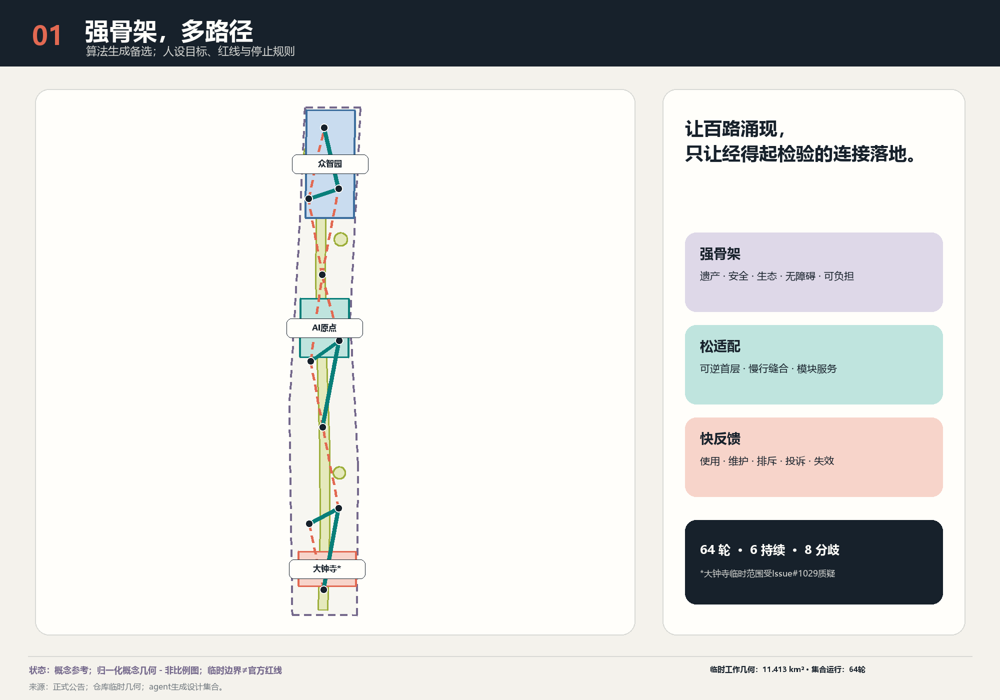
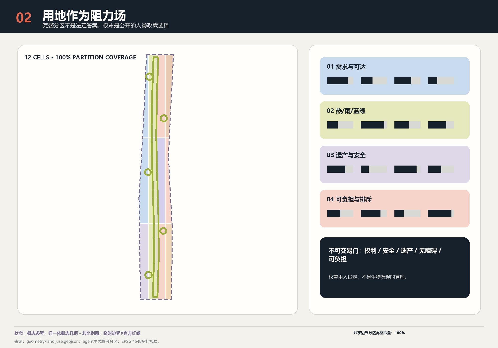
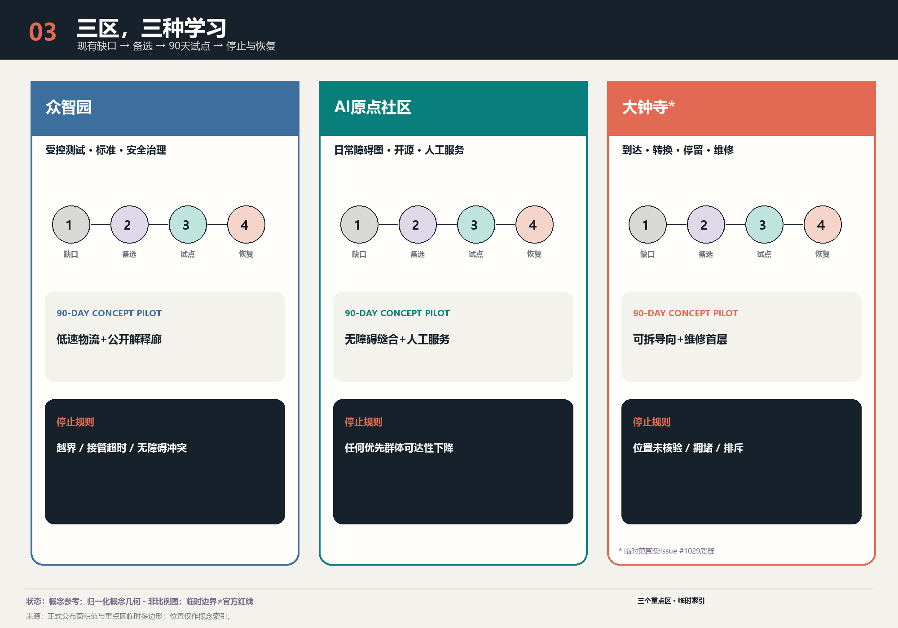
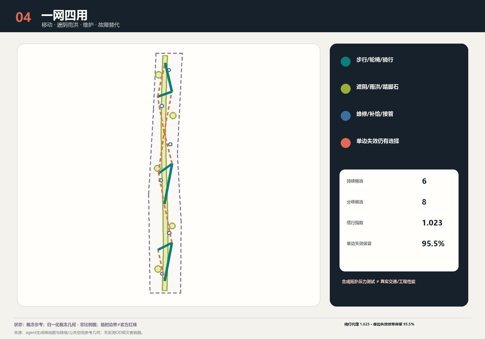
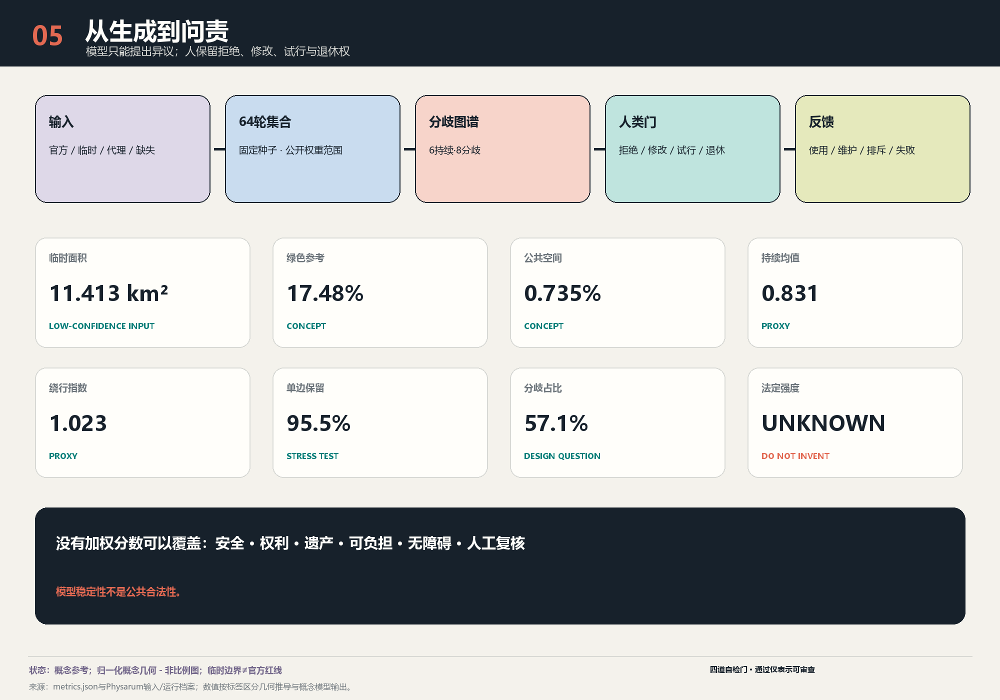

**让百路涌现，只让经得起检验的连接落地。** 本方案不让黏菌“规划北京”，也不把黄色生物形态当作城市意象。它实际执行的计算是在人工声明候选集上运行的带种子 Kruskal 拓扑与选择不稳定性探针：只报告每条候选连接在多次带种子运行中的入选频率，不计算出行、需求、工程可行性、无障碍水平、生物适应与公众偏好，也不证明对北京的最优性；真正的设计成果是**自适应网络分歧图谱**和“探索—比较—试行—学习”协议。北京的战略基础设施、遗产、生态、安全、无障碍与可负担性构成强骨架；可逆首层、慢行缝合、公共服务与开发者空间形成松适配；使用、维护、排斥、投诉和失效证据形成快反馈。模型只能提出问题，人和负责任的机构决定目标、红线、停止条件和最终行动。

## 设计依据与资料清单

方案以正式公告和仓库场地包为事实起点：统筹研究范围约 43.6 平方公里、总体设计范围约 11.4 平方公里、三处重点区域合计约 368.4 公顷；但这些官方面积并不等于仓库中已经存在精确官方 polygon。提交的 SITE-001 面积复算为 11.413 平方公里，仅描述临时工作几何，置信度低，不是新的官方面积结论。[source:OFFICIAL-ANNOUNCEMENT] [data:geometry/site_boundary.geojson#SITE-001] [metric:site_area_sqm]

证据按四级管理：①公告、法律和部委标准决定任务与不可越界事项；②公开登记资料描述可用事实；③临时边界与推断层只支持概念生成；④agent 生成图层与算法只支持比较。Issue #846 指出总体临时 polygon 可能偏移，Issue #1029 指出大钟寺临时 polygon 与车站存在约 2.26 公里的质疑偏差，Issue #1774 记录遗产、轨道、水系与管控层仍不完整。因此所有落位均是“概念建议、参考方案、可供专业团队深化研究”，不能用于地块拆迁、车站接口、工程可行性或法定审批。[source:ISSUE-846] [source:ISSUE-1029] [source:ISSUE-1774]

方法证据也分层：活体 *Physarum polycephalum* 是实验条件下的生物模拟计算；黏菌启发算法是研究者设定节点、阻力、参数与阈值的备选网络工具；城市复杂适应性治理则涉及权利、历史、冲突、预算和问责，不能从生物行为直接推导。东京研究连接的是研究者选定的 36 个中心，并在 21 个实验网络上比较聚合图指标；它没有“设计东京”。涌现也可能产生隔离和伤害，所以必须追问：**为谁的韧性、抵抗什么风险、由谁承担成本？** [source:PHYSARUM-MAZE-2000] [source:PHYSARUM-TOKYO-2010] [source:SCHELLING-1971]

生成声明：正文、双语图件、GeoJSON、离线网页和 PDF 由 OpenAI Codex（GPT-5 family）生成，本轮另有三节正文与一条契约用例由 Anthropic Claude Opus 5 撰写，几何与指标由本地确定性脚本在 EPSG:4548 下复算；论文与案例只作引用，没有复用第三方图像或秘密地图。完整出处在 `sources.json`，模型披露在 `agent.json`，分轮作者、生成限制与版权在 `report/copyright_statement.md`。[standard:PROJECT-OFFICIAL-ANNOUNCEMENT] [depth:existing_conditions_diagnosis]

## 三层范围工作框架

三层范围不是把同一张总图放大三次，而是三种决策尺度。约 43.6 平方公里的统筹研究范围用于校准高校、研究机构、企业、资本、公共服务和生活网络；约 11.4 平方公里的总体设计范围用于提出非正式的空间结构、用地参考分区和系统接口；三处重点区域用于设计90天可逆试点、责任主体和停止规则。三处官方面积分别为众智园 192.1 公顷、北京AI原点社区 104.3 公顷、大钟寺 72.0 公顷，但提交 polygon 仍是临时索引。[source:AGENT-TASKBOOK] [data:geometry/key_areas.geojson] [metric:key_area_count]

工作框架是“强骨架—松适配—快反馈”。强骨架包括正式规划、京张遗产价值、蓝绿安全、消防与市政、无障碍、隐私、可负担性和人工复核；任何优化不能以加权平均换掉这些门槛。松适配包括模块化首层、临时通道、时段共享、社区画出的障碍、可拆卸遮阴和低速服务。快反馈把聚合使用量、无障碍失败、维护工时、投诉、算法排斥和生态影响写进下一轮，而不是把第一次输出固化成永久工程。[standard:MOHURD-URBAN-DESIGN-MEASURES] [depth:three_level_scope_framework]

在图层上，SITE-001 是低对比虚线约束，12 个共享边界的用地单元构成100%拓扑覆盖，六个城市客厅和绿色脊是参考方案，候选廊道以出现频率区分持续、分歧与淘汰。这里的“完整覆盖”只证明提交文件没有缝隙和重叠，不证明地类适宜性或法定效力。[data:geometry/land_use.geojson] [metric:land_use_partition_coverage_ratio] [standard:MNR-LAND-USE-CLASSIFICATION-GUIDE]

每次迭代必须按同一顺序执行：同步公开资料；核对来源允许用途；重建临时工作框；生成多个网络；先过权利、安全、遗产、气候与无障碍硬门；再公开未被支配的备选方案和分歧；最后才选择可逆试点。官方 polygon 到位时整包重算，不能只把一条线替换成“更精确”的图。[source:SOURCE-REGISTRY] [data:assumptions.json#A-BOUNDARY-001]

## 统筹研究范围产业与未来城市研究

品牌主名为**“京张应变 / ADAPTIVE JING-ZHANG”**，描述名为“百年京张自适应公共网络”，运行短句为“探索—比较—试行—学习”。主标志是“分支—检验—再汇合”字形：两点落在克制的铁路基准线上，三条不同粗细的路径分叉，一条持续、一条虚线待议、一条渐隐退休；它同时像道岔、证据路径和开放图，不画黏菌、脑、叶片或神经网络。线宽表示集合出现率，虚线表示临时或候选，珊瑚色表示分歧，石墨表示锁定框架，蓝绿色表示公共与生态价值。

三大定位被转成可操作关系：百年京张文化带负责时间与公共记忆；都市AI生活体验带负责居民可进入、无数字门槛的日常服务；AI融合创新带负责研究—验证—采购—维护链。五大功能分别落到：全栈自主创新的可控测试接口、世界级AI创新生态的共享平台、AI+场景赋能的城市问题清单、智能化活力城市的可逆公共空间、AI治理全球话语权的公开审计与退出机制。[source:AGENT-TASKBOOK] [standard:PROJECT-AGENT-OPEN-CALL-TASKBOOK]

“三区两翼”不是五个孤岛。众智园承担全栈自主创新与治理验证，北京AI原点社区承担近校转化与开放社区，大钟寺承担智能原生业态和城市到达；中关村科技服务翼把资本、知识产权、标准和国际服务接入，小月河场景赋能翼把真实公共问题、蓝绿系统和日常维护接入。AI生态地图因此按“资源—接口—空间—公共价值”组织：高校/企业/算力通过开放挑战与共享合规台进入三类试验场，再以采购、培训、社区服务和知识归档回到城市，而不是只画企业Logo墙。[data:geometry/key_areas.geojson] [depth:overall_spatial_structure]

六个全球先例只提取机制，不移植形象：新加坡 one-north/LaunchPad 说明公共平台与差异节点；首尔AI Hub 说明城市支持的训练、孵化和演示；Paris-Saclay/DATAIA 说明联邦式机构网络；蒙特利尔 Mila 说明非营利研究与责任界面；Kendall Square 说明创新地价必须交换住房、活跃首层和公共空间；Helsinki Smart Kalasatama 说明真实社区小试、采用门和退休规则。所有数量只视为活动指标，不能证明集聚导致公共利益。[source:CASE-ONE-NORTH] [source:CASE-SEOUL-AI-HUB] [source:CASE-KALASATAMA]

反例同样重要：Toronto Quayside 提醒公共控制、隐私、知识产权、利益分享和终止权必须先于技术部署；研究密度也不会自动产生负担得起的居住、全天候生活或街区公平。京张因此不以“吸引全球人才”掩盖本地居民成本，而把租赁稳定、无障碍、非数字通道、小团队低成本空间和维护岗位列为生态基础设施。[source:CASE-QUAYSIDE] [depth:existing_conditions_diagnosis]

### 区域创新协同关系

任务书的评审维度“区域协同性”点名北纬社区、未来科学城、怀柔科学城、经开区与京津冀。本包对这五个对象没有任何一手资料，因此只登记四件可以由本包负责的事：可能的关系、仍需的证据、拟议审核路径（待确认）、主张限度。本表不指定任何机构的受理职责。

| 协同对象 | 可能的关系（仅为提议） | 仍需的证据 | 拟议审核路径（待确认） | 不确定性与主张限度 |
|---|---|---|---|---|
| RS01 北纬社区 | 任务书把它列为协同对象。本方案可提出的关系上限是共用同一套公开的场景登记与停止规则模板，使两地的 AI 服务能被同一套标准审查。 | 需要主管部门确认该社区现行的治理主体、可公开的服务清单，以及是否接受同一套停止规则。 | 须经确认，并由区级主管部门与该社区运营主体共同受理；本方案无权指定受理机构。 | 本包没有该社区的现状资料，不主张任何既有协议、共建关系或数据互通。 |
| RS02 未来科学城 | 可能的关系限于方法互认：把本包公开的复算脚本、门禁登记与失效模式表作为可比较的评审格式提出。 | 需要对方现行研究与转化机制的说明，以及是否存在接受外部评审格式的既有程序。 | 须经确认，并由市级科技主管部门受理；本方案无权指定受理机构。 | 不主张任何合作意向、机构关系、人员流动或已落地项目。 |
| RS03 怀柔科学城 | 可能的关系限于共同语言：把本包的证据分级与不可交易门作为可引用的定义提出，便于跨场地比较同类 AI 服务的审查结论。 | 需要对方公开的服务类型清单，以及其审查程序是否允许引用外部定义的门禁。 | 须经确认，并由市级科技主管部门与所在区人民政府共同受理；本方案无权指定受理机构。 | 不主张设施共享、算力调度、数据互通或任何空间联系。 |
| RS04 经开区 | 可能的关系限于问题方向：本包的 S01—S10 场景登记可作为一份问题清单，供产业侧判断哪些问题值得共同定义。 | 需要对方公开的产业与服务需求说明，以及任何联合工作须遵循的采购与合规程序。 | 须经确认，并由市级产业主管部门与该区管理机构共同受理；本方案无权指定受理机构。 | 不主张任何采购、投资、企业落户或产能安排。 |
| RS05 京津冀 | 可能的关系限于格式互认：把本包公开的停止规则、非数字替代要求与失效模式表写成其他城市可直接引用的格式。 | 需要区域层面已有协同机制的说明，以及哪一级机构有权受理跨省市的格式互认。 | 须经确认，并由省市级以上的既有协同机制受理；本方案无权指定受理机构。 | 不主张任何区域协议、线路、投资、迁移或行政安排。 |

区域协同：brief/site-package/agent_taskbook.json#/review_dimensions/3 [source:AGENT-TASKBOOK]（taskbook_naming_only）五行都是提问，不是结论。本表不记录任何既有协议、线路、投资、承诺、精确地理关系或实施事实；五个对象的英文名称是任务书中文名的工作译名，任务书本身不发布英文名。

## 总体设计范围城市更新与控规深度城市设计

总体概念是**“一脊、三区、两翼、一册账”**：京张气候记忆绿脊承接遗产叙事、遮阴、滞蓄和慢行；三处重点区采用不同学习回路；两翼交换专业资源与真实场景；公开“选择账”记录每条候选为何持续、为何争议、谁受益、最坏影响落在谁身上、何时停止。它不是一张完成式总平面，而是能被专业团队接续的空间协议。[data:geometry/green_space.geojson#GREEN-001] [data:geometry/public_space.geojson#PUBLIC-001] [depth:overall_spatial_structure]

本次 v0 运行采用10个归一化概念节点、24条候选边、64个固定整数种子。每轮在人设范围内变化长度、权益增益、气候增益、遗产审查和维护权重，以最小成本生成一棵连通树并增加两条冗余边；出现频率至少0.70的是持续候选，0.35至0.70的是分歧候选，其余在本轮淘汰。结果为 6 条持续候选和 8 条分歧候选；分歧占比的分母是达到 0.35 资格规则的 14 条边，即 8/14 = 57.1%，不是任一轮按构造产生的 11 条边，也不是曾被考虑的 24 条候选边。该计算的准确名称是**在人工声明候选集上运行的带种子 Kruskal 拓扑与选择不稳定性探针**。每轮的连通性和恰好 11 条入选边由算法构造保证，因此不是发现。它不计算出行、需求、工程可行性、无障碍水平、生物适应、公众偏好，也不证明对北京的最优性。黏菌只是方法谱系，不是已实现的通量—导度方程，也不是交通需求模型或生物最优证明。[metric:ensemble_run_count] [metric:persistent_corridor_count] [metric:disagreement_corridor_count]

算法与城市之间的分歧不是发现。持续边只表示这条边在已公开的低置信度代理假设、声明的权重区间与抖动设定下保持稳定，仍需人工审查；分歧边只表示同一条边在同一套声明设定下出现选择不稳定性，它的用途是据此向人提出审查问题——采用哪一组权重、谁受益、最坏影响落在谁身上、何时停止——而不是被观测到的北京冲突，也不是已确认的真实权衡。零抖动对照把这一点写死：把每条边的 jitter 置零后重跑同一组 64 个种子，共有 8 条边改变状态、分歧带归零，可见该分歧带是本判据与本抖动设定的产物。淘汰边也被保留在运行记录，避免只展示漂亮结果。输入、每轮权重与边集合分别公开在 `visual/assets/physarum-inputs.json` 和 `physarum-runs.json`；标准库 Node.js 脚本 `visual/assets/reproduce_physarum.js` 以原生 JavaScript 复现 CPython 整数种子 MT19937 抽样语义，并在 IEEE-754 双精度下重算 0—63 号种子，并逐项核对边序、权重、频率与状态。复算器执行 633 项逐字段比对、独立重算 7 项派生指标，期望不匹配数为 0；另有一套隔离篡改测试只改动临时副本，用以证明比对确实能发现被篡改的记录，而两个冻结数据资产逐字节不变。可复现的是已公开的计算执行，不是这些低置信度代理输入的城市真实性。[source:ISSUE-1781] [source:ISSUE-2170]

控规深度以“已知—建议—待确认”拆分：完整用地分区、参考建筑原型、候选路网、绿地、公服和分期可复算；容积率、总建筑量、高度、密度、退线、道路红线、设施标准、消防、市政容量和文保控制明确为未知。对未知字段不填“合理范围”，因为虚构控制值比空白更危险。[standard:MOHURD-CONTROL-DETAILED-PLANNING] [metric:floor_area_ratio] [metric:approved_height_limit_m]

### 复杂适应系统运行模型

本节把“复杂适应系统”从修辞降为可检查的运行规则。系统的主体不是抽象的“城市”，而是更新行动治理登记表中已具名的四类角色：运营角色、维护者、受益者与最坏受影响群体，再加上独立于运营方的停止权限持有者。每一类主体只掌握局部信息——运营者看得见当日开闭，维护者看得见备件与工单，居民看得见自己那一段路——没有任何一方看得见全局。局部规则因此写得很短：按公告时段开放；受理即给回执；具名停止触发出现即停；撤场按拆卸清单逐件核销；做不到的事写进记录而不是省略。[source:PORTUGALI-SELF-ORGANIZING-1997] [depth:renewal_project_list]

系统的状态变量不是模型输出，而是 P00—P11 每一项已登记的观察指标：P01 的通行中断次数与替代路径提供间隔、P02 的开放时段履行率与被拒进入事件数、P06 的接管事件数与接管完成间隔、P10 的备件覆盖机型比例。它们全部是运营计数，任何一项都能由现场人工在没有传感器的条件下记录，因此不需要为了“可观测”先建设一套采集系统——这一点同时是隐私约束：可用纸笔记录的指标不产生可再识别的个人数据。[data:geometry/phasing.geojson] [data:assumptions.json#A-PILOT-001]

反馈回路分两族，并且成对存在。抑制回路是“观察指标越过停止触发 → 停止权限执行 → 回退 → 实物恢复”；本方案为每一项行动都写了这一条，并把停止权限拆给至少两个互相独立的主体，使运行方不能既执行又免责。放大回路是转化链：公众问题登记 → 开放挑战 → 合规沙箱 → 90 天公共试点 → 四道人工门 → 采购或机构采用 → 有维护预算的规模化。设计规则只有一条：**任何放大回路都不得在缺少一条由另一方触发的抑制回路的情况下建立**；放大回路的速度上限由抑制回路能够产生的证据决定，而不是由资金或宣传节奏决定。[source:OSTROM-COMMONS-1990] [source:OSTROM-POLYCENTRIC-2010]

吸引子是本方案最需要提防的东西，因为它们不靠任何一方有恶意就会形成。第一个是稳定边吸引子：6 条持续候选一旦被反复引用，就会先吸引投资、再吸引论证，最后把“模型稳定”读成“应当建设”；对应机制是 P11 把“当年新增或移除的候选边数”列为观察指标，并要求候选集合的任何增减都写明理由——每年重算的因此是候选集合本身，而不是同一批手工声明的边。第二个是展示吸引子：拍照好看的试点更容易续期；对应机制是观察指标一律取运营计数而不是人次。第三个是维护债吸引子：部署速度超过修理能力，责任先落地而能力后到位；对应机制是 P10 的硬规则——无备件、无具名维护者的设备型号不进入部署。[metric:persistent_corridor_count] [source:HOLLING-ADAPTIVE-CYCLE-2001]

阈值必须同时公布规则值与可达值。0.70 与 0.35 是写下来的规则，但 64 轮集合能取到的最接近值是 45/64 = 0.703125 与 23/64 = 0.359375，两者不是同一个对象；以阈值治理的系统如果只公布规则值，就会报出自己并不具备的精度。同一纪律适用于运营阈值：任何“超过 N 次即停”的条款都必须写明 N 由谁计数、在什么时段内计数，以及计数本身失效时默认停还是默认继续。本方案取默认停，理由是计数失效时系统恰好失去了判断该不该停的依据。[metric:ensemble_run_count] [data:assumptions.json#A-WEIGHTS-001]

路径依赖决定了什么可以试、什么不能试。本方案把系统分成两层：快层是可搬移家具、可拆卸模块、不打孔的地面做法与可撤回的公告，其恢复由拆卸清单与恢复验证记录承担；慢层是已经发布的记录、已经改变的到达方式、已经被替代的经营者与已经形成的预期，它们不随构件一起撤走。登记表中的“剩余责任”正是慢层的账：被下游引用的错误记录撤回后仍可能被继续使用，退休模型此前造成的决定不会自动撤销。因此本方案的可逆性主张严格限于快层，并把一条规则写在前面：**只有在具名主体已接受相应剩余责任时才可支出不可逆性**。今天没有这样的主体，`D12` 因此保持开放，全部行动保持未获授权与未获资金。[source:SHEARING-LAYERS-BRAND-1994] [source:OPEN-BUILDING-HABRAKEN-2021] [source:REAL-OPTIONS-NEUFVILLE-2003]

学习不是自动发生的。集合复算、公共试点与年度复核只有在三件事同时成立时才产生学习：观察指标被真正记录、否定结果与肯定结果同等公开、上一轮的判断可以被下一轮推翻。本方案对第三件事的做法是不覆盖历史——撤回的版本保留其曾存在与被撤回的记录，旧年份的复算不被新年份改写。以上全部属于运营协议层，其成立仍依赖 `D16` 所指的运营职权，本方案不代其确立。本节引用的复杂适应系统文献只提供概念与词汇，不构成本场地的事实、控制值或专业审查结论；其中 `REAL-OPTIONS-NEUFVILLE-2003` 与 `CAS-DYNAMIC-CITIES-2018` 两条在来源账本中题名与作者未从来源转录，因此只按其登记标识符引用其贡献的词汇，不据以主张任何具体表述。[source:HOLLING-1973] [source:CAS-DYNAMIC-CITIES-2018] [depth:phasing_implementation]

### 黏菌方法的五层阶梯与零抖动对照

“黏菌”在本方案里是一条五层阶梯，每一层能够授权的结论不同，并且**不得跨级**：任何一层只能被引用来支持它下一层实际证成的东西。

| 层 | 在本包中的实体 | 它能支持的 | 它不能支持的 |
|---|---|---|---|
| 一 生物先例 | 由他人发表的迷宫实验、适应网络模型及其东京实验 | 去中心生物体能在没有中央计划的条件下产出兼顾成本与冗余的网络这一观察 | 关于北京的任何结论；把生物体的目标函数移植到城市；任何最优性 |
| 二 计算类比 | 被借用的只有一个想法：在扰动下重复运行可以区分哪些连接稳健、哪些有争议；它在本包中实现为带种子的 Kruskal 拓扑与选择不稳定性探针 | 把“运行之间的分歧”当作提问工具 | 把输出称为黏菌仿真；通量—导度方程在本包中并未实现 |
| 三 确定性复算器 | `visual/assets/reproduce_physarum.js`：64 个固定种子、633 项逐字段比对、7 项独立重算的派生指标、期望不匹配 0，另有只改临时副本的隔离篡改测试 | 已公布的数就是已公布输入所产生的数 | 这些输入对北京为真 |
| 四 消融对照 | `visual/assets/physarum-zero-jitter-ablation.json`：把每条边的 jitter 项置零，五个权重的抽取次序与取值完全不变 | 指名分歧带由哪一项输入产生 | 北京会如何表现 |
| 五 规划判断 | 8 条分歧候选进入公共讨论，6 条持续候选仍需人工审查，任何一条都不进入工程设计 | 专业工作与公共讨论的先后次序 | 批准、资金或工程可行性 |

第四层的结果值得写进正文，因为它对本方案不利。把 jitter 置零之后，24 条候选边中有 8 条改变状态（`E01`、`E05`、`E08`、`E12`、`E13`、`E16`、`E17`、`E19`），最大频率变化 0.546875；持续边由 6 条变为 11 条，而**分歧带变为 0 条**，持续图仍然连通。换句话说，本方案赖以提问的那条分歧带，是由一项被声明的输入扰动产生的，不是从北京身上发现的性质。仍有 5 条边（`E01`、`E02`、`E16`、`E17`、`E19`）在 jitter 置零后依旧随种子改变入选，但没有一条落进 0.35 至 0.70 区间。[metric:disagreement_corridor_count] [metric:persistent_corridor_count]

这项披露不削弱方法，而是界定它。分歧带的作用是把“本方案在哪里对自己的权重设定最不确定”变成可以公开讨论的清单，它从来不是关于北京交通、需求或偏好的测量；jitter 是被声明的输入扰动，不是测量误差，也不代表现实世界的不确定度，置零后得到的稳定选择并不因此更正确。若某一年的复算取消 jitter 或改变其范围，分歧带的规模会随之改变，因此 P11 要求每次复算同时公布主运行与零抖动对照，并写明候选集合任何增减的理由。[metric:mean_persistent_frequency] [depth:metrics_recalculation]

## 重点区域详细设计

三处重点区用同一学习框架但回答不同问题：现有缺口→多组备选→90天可逆试点→停止与恢复。临时 polygon 只负责把任务分组，不负责声称具体街角、站口或产权。每处试点卡都必须写受益者、责任角色、观察指标、最坏受影响群体、停机触发和撤场恢复；官方边界、现状测绘和专业条件不到位时不得进入工程设计。[data:geometry/key_areas.geojson#PROV-KEY-001] [data:assumptions.json#A-BOUNDARY-001]

**众智园AI自主创新加速区**：把全栈研发、安全治理、标准验证、端侧算力和低速物流组织为“受控测试—公开解释—人工接管”三层界面。空间原型包括可预约的封闭测试庭、面向公众的可解释展示廊、维修与标准咨询首层、以及不采集人脸的物流交接点。90天试点只测试不同服务路线和维护责任；若无障碍冲突、误入公共空间、接管超时或投诉超过预设阈值即停。所有物理位置是参考方案。[data:geometry/buildings.geojson] [depth:three_key_area_detailed_design]

**北京AI原点社区**：以居民和开发者共同画出的“日常障碍图”校正近校转化叙事。原型包括步行/轮椅优先的校区—园区缝合、开源发布厅、人才与居民共享服务台、夜间安静工作室、托育和可负担餐饮接口。数字导航必须有纸质地图、现场人员和电话渠道；任何画像只用公开聚合数据，不从姓名或轨迹推断脆弱性。试点若让老人、残障者、照护者或非智能手机用户的可达性下降则不扩展。[standard:BARRIER-FREE-ENVIRONMENT-LAW] [data:assumptions.json#A-EQUITY-001]

**大钟寺AI产业聚集区**：以城市到达、智能终端、内容消费、维修、企业服务与国际路演六类使用为对象；本方案不陈述该处现状的建成情况与建造方式。由于临时 polygon 位置受到Issue质疑，本方案不画精确站城接口，只提出“到达—转换—停留—维修”四段性能要求和四象限无障碍连通的专业深化任务。90天试点全部由可拆卸、可搬移的模块承担：导向、遮阴、值守服务与维修位；模块与既有建造、竖向及疏散条件如何相接尚未勘测，本方案也不做永久路口或轨道施工结论。[source:ISSUE-1029] [data:geometry/key_areas.geojson#PROV-KEY-003]

三处“AI朝圣地标”也不是昂贵图标建筑：①**京张记忆编译站**把铁路工程档案、口述史和AI解释并置，允许人工纠错；②**AI原点开放登记台**记录开源贡献、失败实验和公众问题，而非只展示名人；③**模型公地与申诉桌**让人查看场景数据说明、提出纠错、选择人工办理并观察模型退休。它们分别服务历史、共同创造和问责，均为可供专业团队深化的概念节点。[source:AGENT-TASKBOOK] [depth:height_massing_character]

### 重点区构件与路径登记表

下表把三处重点区的每个构件与每条提议无障碍连续路径登记为可核对条目：稳定编号、双语名称、内容、逐条精确证据引用与阻断它的未关闭 D 门。全部条目均为概念建议，未获授权、未获资金；未关闭的 D 门是阻断条件，不是备注。

重点区图版架构为 3 个片区 × 5 个主题 = 15 张图版，双语共 30 件产物（每张图版一个中文件、一个英文件）。五个主题依次为：01 现状、主张与限度；02 项目与流线；03 可逆模块剖面；04 到达、运行与季节；05 治理、停止与证据。剖面尺寸只有两种依据。proposed_module 表示该尺寸是本方案自己提出的模数，以米计，不是对现状的陈述，也未经任何一方核验；pending 表示未知，单位同样为米，取值必须为空，并写明取得何种证据后由谁复算。不得从规范条文、场地照片或本包的临时几何推出剖面尺寸：临时范围不是实测，把它的跨度标在剖面上，等于把一条本方案自己声明存疑的边界当成施工尺寸。

#### 众智园AI自主创新加速区

角色: 受控测试与治理验证 · 公告面积: 192.1 ha · Lab 1

本区回答一个问题：一台低速机器在有人的街道上被允许做什么，由谁停下它，停下之后谁来修。它是三个实验室里唯一进行受控设备测试的场地。

**构件**

| 编号 | 名称 | 内容 | 证据引用 | 受阻于 |
|---|---|---|---|---|
| Z-C01 | 受控测试环路 | 限时开放的低速测试环路，边界用可搬移护栏标示，测试时段与非测试时段分开公告。护栏不固定于路面。 | component:Z-C01 \| plate:ZZY-02 \| source:AGENT-TASKBOOK \| data:assumptions.json#A-PILOT-001 | D10 D12 |
| Z-C02 | 停止按钮与人工接管岗 | 环路每段设一处物理停止按钮与一名在岗人工接管者。停止权限具名，接管流程为纸质，不依赖任何应用。 | component:Z-C02 \| plate:ZZY-05 \| source:ISSUE-2170 \| standard:GENERATIVE-AI-INTERIM-MEASURES | D10 D16 |
| Z-C03 | 测试日志公开台 | 每个测试日结束时把当日决定与聚合计数张贴到公开台，只登记决定与聚合证据引用，不登记个人数据。 | component:Z-C03 \| plate:ZZY-05 \| source:OSTROM-COMMONS-1990 \| standard:GENERATIVE-AI-INTERIM-MEASURES | D11 |
| Z-C04 | 备件与维修间 | 与测试环路同期建立的维修位与备件架。没有可用维修位与具名维护者的设备不得进入测试时段。 | component:Z-C04 \| plate:ZZY-03 \| source:SHEARING-LAYERS-BRAND-1994 \| data:assumptions.json#A-PILOT-001 | D12 |
| Z-C05 | 边界告示与退出口 | 测试边界每处开口设双语告示与无门槛退出口，写明当日测试内容、停止方式与投诉去向。 | component:Z-C05 \| plate:ZZY-04 \| standard:BARRIER-FREE-ENVIRONMENT-LAW \| source:AGENT-TASKBOOK | D07 |

**提议的无障碍连续路径**

| 编号 | 名称 | 内容 | 证据引用 | 受阻于 |
|---|---|---|---|---|
| Z-R01 | 公众观察环线（全程无台阶） | 拟建的公众观察环线，全程无台阶，且不进入受控试验区，也不依赖试验时段的开闭。 | route:Z-R01 \| plate:ZZY-02 \| standard:BARRIER-FREE-ENVIRONMENT-LAW \| metric:public_space_ratio | D05 D07 |
| Z-R04 | 应急撤离与救援通道（全程无台阶） | 拟建的应急撤离通道，按无台阶设置；其宽度、坡度与最终线位须经有资格的专业人员核定后方可成立。 | route:Z-R04 \| plate:ZZY-02 \| section:ZZY-SEC-B \| source:HOLLING-1973 | D05 D06 D07 |

**冬季运行：** 冬季测试时段缩短并优先保证主链与旁路的清扫与除冰；主链在任何测试安排下都不得因结冰或积雪封闭而无替代路径。除冰材料的选择与频次写入维护表，不写入本方案的性能声明。

**维护责任：** 每台测试设备对应一名具名维护者与一个备件位；维护者缺位即停止该设备的测试资格。维护义务、年度金额与恢复资金全部依赖 D12，未取得前不激活。

**Phase 1 概念体量 ENV-ZY-01：** 一处 90 天可逆通行试点：可搬移护栏、地面不打孔、结束时按拆卸清单恢复原状并留存恢复验证记录。 — 可逆 · 未授权 · 未拨款 · 受阻于: D10 D12

**图版**

**ZZY-01 · 现状、主张与限度**：空间表达方式：临时工作范围。本平面以临时工作范围为底，不是官方边界内的设计。官方多边形一经发布，构图关系保留，坐标与面积全部作废重绘。公众观察环线不进入受控试验场，也不以其为通过条件：试验场停用或封闭时，观察环线仍然完整可走。

**ZZY-02 · 项目与流线**：众智园 · 有条件地面平面：公众观察与受控试验的并置。ZZY-PLAN-01 落位 9 个构成元素（Z-E01 Z-E02 Z-E03 Z-E04 Z-E05 Z-E06 Z-E07 Z-E08 Z-E09），并以剖切号与两张剖面对应：A—横切观察廊与受控试验舱之间的分隔带（ZZY-SEC-A）；B—纵切物流脊线，经维护面与应急回车位（ZZY-SEC-B）。

**ZZY-03 · 可逆模块剖面**：剖面 A：公众观察与受控试验的分离（ZZY-SEC-A） 与 剖面 B：物流、维护与应急恢复（ZZY-SEC-B）。两张剖面共标注 8 项尺寸：4 项为本方案自提模数（proposed_module），以米计且未经核验；4 项为 pending，以米计、取值全部留空，并各自注明复算触发条件。剖面尺寸不接受第三种依据：自本包既有几何读出的跨度不得作为剖面尺寸使用。

**ZZY-04 · 到达、运行与季节**：ZZY-SFC-01 以 7 个节点（到达门槛、首个抉择点与总平面牌、带靠背休息位、卫生间指向点、值守服务台、公众观察平台、离场门槛）与 6 段构成一条建议的无障碍连续路径；状态为 proposed、verified=false，无障碍闸口 G5:pending，测量与专业审核均为 pending。等效渠道 6 类（tactile visual_contrast audio staffed paper telephone）全部为 proposed_pending_audit；运行工况 7 种（day night event snow maintenance power_failure digital_failure）各自声明可用性、人工替代、停止动作与恢复条件。冬季工况以 ZZY-SEC-B 为底图展开 8 个专题；融雪暂存位 2 处（Z-SS1 Z-SS2）不与无障碍链路或导向条重叠——融雪暂存位一律设于无障碍链路与导向条之外；无合规暂存位时须外运，不得就近堆放。试点为 90 天，sufficient_for_year_round 为 false。九十天试点只能证明九十天内的表现。冬季结冰、夏季暴雨与全年维护负荷均不在其观测窗口之内，不得据此推断全年性能。

**ZZY-05 · 治理、停止与证据**：本区第一期只以可撤除信封 ZZY-P1-ENV 表达。撤除：所有构件以机械连接固定，可按相反顺序拆卸并整体运离；拆卸不需破坏性作业。恢复：撤除后恢复原铺装或原地表覆盖，恢复范围与做法在剖面 B 上标注；恢复能力尚未由任何一方确认。剩余责任：拆除、运离与恢复的剩余责任尚无承担主体；在主体确定之前不得开工。该信封未获授权（not_authorized）、未获资金（unfunded），受 D01 D05 D09 阻断。2 项季节阈值——ZZY-TH-01 除雪后链路恢复时限（建议目标：降雪停止后优先清理无障碍链路）；ZZY-TH-02 公众观察环线全年可用率（建议目标：试验场停用不影响观察环线开放）——的 approved_threshold 均为空、pilot_start_allowed 均为 false；在阈值获批之前不得开始试点。

#### 北京AI原点社区

角色: 近校转化与居民共同校正 · 公告面积: 104.3 ha · Lab 2

本区回答另一个问题：住在旁边的人如何改正一个他们没有参与设计的系统。它不做设备测试，做的是登记、申诉与回执。

**构件**

| 编号 | 名称 | 内容 | 证据引用 | 受阻于 |
|---|---|---|---|---|
| O-C01 | 开放登记台 | 对在本区运行的每个 AI+ 场景登记名称、责任机构、运行时段与停止方式，登记内容公开可查。 | component:O-C01 \| plate:AIO-05 \| standard:GENERATIVE-AI-INTERIM-MEASURES \| source:OSTROM-POLYCENTRIC-2010 | D11 D16 |
| O-C02 | 居民校正桌 | 固定时段开放的纸质校正桌，居民可对任一登记条目提出更正；原记录保留并标注已被更正。 | component:O-C02 \| plate:AIO-05 \| source:OSTROM-COMMONS-1990 \| data:assumptions.json#A-EQUITY-001 | D11 |
| O-C03 | 首层共享工作间 | 利用既有首层空间的共享工作位，按开放建筑的支撑体与填充体划分：支撑体不动，填充体可换。既有建筑认定未完成前只作方案假设。 | component:O-C03 \| plate:AIO-03 \| source:OPEN-BUILDING-HABRAKEN-2021 \| data:assumptions.json#A-BUILDING-001 | D04 D06 |
| O-C04 | 夜间照明与遮蔽段 | 沿居民日常步行段的照明与遮蔽改善，优先覆盖夜间使用最多、投诉最集中的一段。照度目标依赖现场实测，未测前不作数值声明。 | component:O-C04 \| plate:AIO-04 \| standard:ELDERLY-SMART-TECH-PLAN-2020-45 \| data:assumptions.json#A-EQUITY-001 | D05 D12 |
| O-C05 | 申诉信箱与回执板 | 非数字申诉通道：投递纸质申诉即取得编号回执，处理结果按编号公示。不接受申诉必须经由应用提交的安排。 | component:O-C05 \| plate:AIO-05 \| standard:ELDERLY-SMART-TECH-PLAN-2020-45 \| source:BEIJING-RESPONSIBILITY-PLANNER-2024 | D16 |

**提议的无障碍连续路径**

| 编号 | 名称 | 内容 | 证据引用 | 受阻于 |
|---|---|---|---|---|
| O-R01 | 日常服务动线（全程无台阶） | 拟建的日常服务动线，全程无台阶，连接有人值守且不依赖手机的服务点。 | route:O-R01 \| plate:AIO-02 \| component:O-C04 \| standard:BARRIER-FREE-ENVIRONMENT-LAW | D05 D07 |
| O-R02 | 发布公地到达动线（全程无台阶） | 到达发布公地的拟建无台阶动线；公地本身按公开的议事规则运行，不设门禁。 | route:O-R02 \| plate:AIO-02 \| component:O-C01 \| source:OSTROM-COMMONS-1990 | D05 D07 |
| O-R03 | 照护沿街面到达动线（全程无台阶） | 到达照护、安静与可负担沿街面的拟建无台阶动线；该沿街面的权属与任何既有首层空间保持未定。 | route:O-R03 \| plate:AIO-02 \| section:AIO-SEC-A \| standard:BARRIER-FREE-ENVIRONMENT-LAW | D04 D07 |
| O-R04 | 有条件慢行缝路径（全程无台阶） | 条件性的无台阶慢行缝路径。在 D04、D05、D08、D12、D16 全部关闭之前它不成立；任何触及道路或过街的段落随 D08 一并 hold。 | route:O-R04 \| plate:AIO-02 \| section:AIO-SEC-B \| data:assumptions.json#A-NETWORK-001 | D04 D05 D08 D12 D16 |

**冬季运行：** 冬季把清扫与除冰顺序倒过来：先清居民日常段与夜间优先段，再清示范性路段。校正桌与申诉信箱在冬季保持室内或有遮蔽的位置，不因季节中断非数字通道。

**维护责任：** 登记台与回执板由具名机构按周维护，缺维护即按公示规则暂停对应场景的登记资格。相关人员、预算与期限依赖 D12 与 D16。

**Phase 1 概念体量 ENV-AO-01：** 一处可逆的首层共享工作间与登记台组合：只使用既有首层空间，家具与隔断可拆卸，结束时不留下不可复原的改动。 — 可逆 · 未授权 · 未拨款 · 受阻于: D04 D06 D12

**图版**

**AIO-01 · 现状、主张与限度**：空间表达方式：临时工作范围。本平面只落位方案自己提出的构件与关系，不描绘现状权属、界线或既有房屋。底图为临时工作范围，官方多边形发布后重绘。本片区不绘制、不推断园区门禁、界线、通行控制、权属、通行权、地块或既有底层空间。慢行缝之所以标注为有条件，正因为其成立与否取决于上述任一未知项。明确不主张的项目共 7 类：campus_gates、boundaries、access_controls、ownership、rights_of_way、parcels、existing_ground_floor_space。

**AIO-02 · 项目与流线**：AI 原点社区 · 有条件地面平面：发布公地与日常服务的共处。AIO-PLAN-01 落位 9 个构成元素（O-E01 O-E02 O-E03 O-E04 O-E05 O-E06 O-E07 O-E08 O-E09），并以剖切号与两张剖面对应：A—横切发布公地、值守服务位与照护沿街面（AIO-SEC-A）；B—纵切慢行缝，经安静沿街面与冬季避风位（AIO-SEC-B）。

**AIO-03 · 可逆模块剖面**：剖面 A：发布公地、值守服务与照护沿街面（AIO-SEC-A） 与 剖面 B：慢行缝、安静沿街面、冬季避风与维护（AIO-SEC-B）。两张剖面共标注 8 项尺寸：4 项为本方案自提模数（proposed_module），以米计且未经核验；4 项为 pending，以米计、取值全部留空，并各自注明复算触发条件。剖面尺寸不接受第三种依据：自本包既有几何读出的跨度不得作为剖面尺寸使用。

**AIO-04 · 到达、运行与季节**：AIO-SFC-01 以 7 个节点（沿街到达面、公地边缘抉择点、避风休息位、卫生间指向点、有人值守与非数字服务位、模型发布公地、沿街离场面）与 6 段构成一条建议的无障碍连续路径；状态为 proposed、verified=false，无障碍闸口 G5:pending，测量与专业审核均为 pending。等效渠道 6 类（tactile visual_contrast audio staffed paper telephone）全部为 proposed_pending_audit；运行工况 7 种（day night event snow maintenance power_failure digital_failure）各自声明可用性、人工替代、停止动作与恢复条件。冬季工况以 AIO-SEC-B 为底图展开 8 个专题；融雪暂存位 2 处（O-SS1 O-SS2）不与无障碍链路或导向条重叠——暂存位一律位于沿街通行带与导向条之外，且不得堵塞非数字服务位入口；无合规位置时外运。试点为 90 天，sufficient_for_year_round 为 false。九十天试点只覆盖九十天。冬季结冰、夏季高温与全年照护需求的季节波动不在观测窗口内，不能据此得出全年结论。

**AIO-05 · 治理、停止与证据**：本区第一期只以可撤除信封 AIO-P1-ENV 表达。撤除：构件以机械连接固定于既有地面之上，可整体拆卸运离，不破坏原铺装。恢复：撤除后恢复原沿街铺装与地表覆盖，恢复范围在剖面 B 上标注；恢复能力尚未由任何一方确认。剩余责任：撤除、运离与恢复的剩余责任尚无承担主体；慢行缝一旦实施又撤除，其恢复责任同样未定。该信封未获授权（not_authorized）、未获资金（unfunded），受 D02 D06 D11 阻断。2 项季节阈值——AIO-TH-01 非数字渠道全年可用率（建议目标：数字系统失效不减少非数字办理能力）；AIO-TH-02 冬季沿街链路净宽保持率（建议目标：清雪期间沿街通行带不被暂存雪占用）——的 approved_threshold 均为空、pilot_start_allowed 均为 false；在阈值获批之前不得开始试点。

#### 大钟寺AI产业聚集区

角色: 到达、维修与城市服务界面 · 公告面积: 72 ha · Lab 3 · 无地理参照

本区回答第三个问题：当位置本身还不能确认时，还能负责任地设计什么。答案是一组不依赖坐标的性能模块：到达、维修、服务与等候。

> **无地理参照** Issue #1029 对大钟寺临时 polygon 与车站的位置关系提出质疑。本方案因此不把大钟寺作为站点或已定位片区处理：不画出入口、道路、过街、地块、距离，也不声称与任何车站存在正向空间关系。该片区只以非定位的性能任务表达。

**构件**

| 编号 | 名称 | 内容 | 证据引用 | 受阻于 |
|---|---|---|---|---|
| D-C01 | 到达模块 | 一个不依赖坐标的到达单元：问询位、坐处、遮蔽与双语指引。它对接哪一处到达点由后续证据决定，本方案不指定。 | component:D-C01 \| plate:DZS-02 \| source:ISSUE-1029 \| data:assumptions.json#A-BOUNDARY-001 | D02 D03 D08 |
| D-C02 | 维修与备件模块 | 面向本带全部试点设备的集中维修位与备件库，是三个实验室共用的维修能力所在。 | component:D-C02 \| plate:DZS-03 \| source:SHEARING-LAYERS-BRAND-1994 \| data:assumptions.json#A-PILOT-001 | D02 D12 |
| D-C03 | 城市服务柜台模块 | 把开源企业服务与公共服务并置的柜台单元，同时提供纸质与数字两条办理路径。 | component:D-C03 \| plate:DZS-04 \| standard:ELDERLY-SMART-TECH-PLAN-2020-45 \| source:CASE-ONE-NORTH | D02 D16 |
| D-C04 | 遮蔽等候模块 | 带顶与坐处的等候单元，冬季加设挡风面，夏季保持通风。它不声称与任何车站的相对位置。 | component:D-C04 \| plate:DZS-04 \| data:assumptions.json#A-CLIMATE-001 \| source:CASE-SEOUL-AI-HUB | D02 D13 |
| D-C05 | 维护者驻点模块 | 维护者的固定驻点与培训位。没有驻点的维护承诺不计入任何实施能力声明。 | component:D-C05 \| plate:DZS-02 \| source:BLUEVIEW-RENEWAL-CASE-2026 \| data:assumptions.json#A-PILOT-001 | D12 D16 |

**提议的无障碍连续路径**

| 编号 | 名称 | 内容 | 证据引用 | 受阻于 |
|---|---|---|---|---|
| D-R01 | 到达位至换乘位的次序连线（全程无台阶） | 到达位至换乘位的次序连线，按无台阶提出；不含位置、距离与标高，也不建立与车站的空间关系。 | route:D-R01 \| plate:DZS-02 \| component:D-C01 \| source:ISSUE-1029 | D03 D05 |
| D-R02 | 换乘位至停留位的次序连线（全程无台阶） | 换乘位至停留位的次序连线，按无台阶提出；四个象限位置待测量后指定。 | route:D-R02 \| plate:DZS-02 \| component:D-C02 \| source:ISSUE-1029 | D03 D05 |
| D-R03 | 停留位至维修位的次序连线（全程无台阶） | 停留位至维修位的次序连线，按无台阶提出；本图不按比例，也不作地理配准。 | route:D-R03 \| plate:DZS-02 \| component:D-C03 \| source:ISSUE-1029 | D03 D05 |

**冬季运行：** 冬季在遮蔽等候模块加设可拆卸挡风面，并把服务柜台的排队序列移入有顶范围。因为本区不作定位，冬季措施只写模块自身的性能，不写任何街道或站前空间的处理。

**维护责任：** 维修与备件模块是本带维护能力的实际所在，其配件清单、维护者名册与培训记录按季更新。所有维护义务与资金状态依赖 D12，未取得前保持 unfunded。

**Phase 1 概念体量 ENV-DZ-01：** 一组可逆的到达与维修模块：全部构件可拆卸、可搬移，结束时逐件撤除。不作定位，落位待官方 polygon 取得后确定；模块与既有建造、竖向及疏散条件如何相接尚未勘测。 — 可逆 · 未授权 · 未拨款 · 受阻于: D02 D03 D06 D12

**图版**

**DZS-01 · 现状、主张与限度**：空间表达方式：非比例、非定位拓扑。本图只表达四个性能位之间的先后关系：到达、换乘、停留、维修。四位落于四象限之内，象限本身不代表方位、距离或用地；每个位的实际落位待测量后指定。Issue #1029 记录临时范围与车站参照之间存在约 2.26 公里的质疑偏差；本图不建立车站空间关系。若日后取得官方定位证据，其作用是使本拓扑图作废并重做实验室三，而不是证实本图。本区据此排除 3 类证据：buildings、phasing、station_position。

**DZS-02 · 项目与流线**：大钟寺 · 四位性能拓扑（非比例、非定位）。DZS-TOPO-01 落位 9 个构成元素（D-E01 D-E02 D-E03 D-E04 D-E05 D-E06 D-E07 D-E08 D-E09），并以剖切号与两张剖面对应：A—剖切建议的自行车停放与维修模块，不涉及任何落位（DZS-SEC-A）；B—剖切建议的停留与遮蔽模块（DZS-SEC-B）。

**DZS-03 · 可逆模块剖面**：剖面 A：建议的自行车停放与维修模块（DZS-SEC-A） 与 剖面 B：建议的停留与遮蔽模块（DZS-SEC-B）。两张剖面共标注 8 项尺寸：5 项为本方案自提模数（proposed_module），以米计且未经核验；3 项为 pending，以米计、取值全部留空，并各自注明复算触发条件。剖面尺寸不接受第三种依据：自本包既有几何读出的跨度不得作为剖面尺寸使用。

**DZS-04 · 到达、运行与季节**：DZS-SFC-01 以 7 个节点（到达位、方向抉择位、遮蔽停留位、卫生间指向位、值守服务位、自行车维修位、离开位）与 6 段构成一条建议的无障碍连续路径；状态为 proposed、verified=false，无障碍闸口 G5:pending，测量与专业审核均为 pending。本链路是四位之间的次序链，不是一条已落位的路径。每一节的实际长度、坡度与横坡都待测量后确定。等效渠道 6 类（tactile visual_contrast audio staffed paper telephone）全部为 proposed_pending_audit；运行工况 7 种（day night event snow maintenance power_failure digital_failure）各自声明可用性、人工替代、停止动作与恢复条件。冬季工况以 DZS-SEC-B 为底图展开 8 个专题；融雪暂存位 2 处（D-SS1 D-SS2）不与无障碍链路或导向条重叠——暂存位不得占用四位之间的任何一节次序链，也不得堵塞值守位与非数字办理模块；无合规位置时外运。试点为 90 天，sufficient_for_year_round 为 false。九十天试点只能说明九十天。本片区落位尚未指定，试点结果连位置条件都无法固定，更不足以推断全年性能。

**DZS-05 · 治理、停止与证据**：本区第一期只以可撤除信封 DZS-P1-ENV 表达。撤除：模块以机械连接固定，按可整体拆卸运离提出，不需破坏性作业。恢复：撤场按拆卸清单逐件移除并留存记录。撤除后地表以何种做法恢复，取决于尚未勘测的现状；恢复做法与恢复能力均未由任何一方确认，剖面 A 只画模块自身的做法，不画任何场地做法。剩余责任：剩余责任尚无承担主体。若日后取得官方定位证据，本信封连同拓扑图一并作废重做，重做成本的承担主体同样未定。该信封未获授权（not_authorized）、未获资金（unfunded），受 D03 D07 D14 阻断。2 项季节阈值——DZS-TH-01 遮蔽停留位全年可用率（建议目标：冬季不因结冰或积雪关闭停留位）；DZS-TH-02 自行车维修位可用时段（建议目标：公布时段内维修位可用且不要求使用设备）——的 approved_threshold 均为空、pilot_start_allowed 均为 false；在阈值获批之前不得开始试点。

## AI 创新生态、人才画像与 AI+ 场景

六类画像覆盖冲突而不追求“平均用户”：轮椅/盲人通勤者需要连续无障碍与多模态导向；老年居民需要现场人工与不使用App也能办事；开源开发者需要低成本协作、算力入口和贡献声誉；初创团队需要合规、测试、采购和维修链；园区维护者需要可诊断设备、备件和明确工单；照护者/访客需要可预测路线、休息、厕所和语言支持。任何画像都不是个人打分，不用人脸、姓名或单体轨迹推断属性。[standard:ELDERLY-SMART-TECH-PLAN-2020-45] [depth:existing_conditions_diagnosis]

十张场景卡使用统一的“位置类型—最小数据—人工复核—非数字替代—责任人—停止规则”格式：

| ID | 场景 / 首要用户 | 位置类型与最小数据 | 人工、替代与运营门 |
|---|---|---|---|
| S01 | 无障碍慢行导航 / 残障者、照护者 | 城市客厅与慢行候选；仅用经审查的路段属性 | 现场核路、纸图与热线；街道+无障碍组织可暂停错误路段 |
| S02 | 京张文化解释 / 居民、访客 | 记忆节点；公开档案与经授权口述史 | 策展人复核、无屏音频/文字；错误可申诉并留版本 |
| S03 | 公共服务导航 / 老人与新居民 | 服务台；机构公开目录，不建个人画像 | 人工窗口、电话与纸质清单；主管部门负责纠错 |
| S04 | 健康服务分流 / 日常使用者 | 社区服务点；用户主动输入的最少信息 | 医务人员最终判断、线下挂号；不作诊断，异常即下线 |
| S05 | 法律与合规初筛 / 小团队、居民 | 共享服务首层；公开法规与用户自愿文本 | 律师复核、现场咨询；不代替法律意见 |
| S06 | 企业服务副驾 / 初创团队 | 开放创新节点；公开政策与企业自报需求 | 服务专员确认、纸质办理；不得自动决定资助 |
| S07 | 低速配送与维修 / 维护者、商户 | 受控测试庭与交接点；设备状态和匿名工单 | 远程接管+现场引导，人工配送兜底；越界即停 |
| S08 | 热浪遮阴调度 / 户外工作者、行人 | 绿脊与城市客厅；气象公开数据和设施状态 | 城市运维复核、固定遮阴/饮水兜底；不得声称预测个体健康 |
| S09 | 活动日人流辅助 / 访客、沿线社区 | 临时活动路线；聚合计数，不用人脸 | 安保和无障碍负责人决策，静态标识兜底；拥堵或排斥即降级 |
| S10 | 申诉与模型退休 / 所有人 | 模型公地；版本、错误和投诉记录 | 人工受理、线下表格；未答复问题公开并可触发暂停 |

三类产业测试验证场景必须在受控范围内：T1 端侧算力与开放模型互操作，验证接口、能耗、日志和退出；T2 低速机器人“最后200米”，验证无障碍优先、人工接管和维修；T3 公共服务多模态导航，验证盲文/语音/纸图一致性与错误恢复。测试通过只表示达到预先登记的试点条件，不等于产品背书、采购承诺或全区部署。[source:AGENT-TASKBOOK] [standard:GENERATIVE-AI-INTERIM-MEASURES]

数据治理遵守“没有必要就不采集”：优先使用公开目录、设施状态和聚合计数；禁止人脸识别式公共空间门禁、情绪识别和隐性个人评分；高影响输出必须显示来源、置信度、责任方与人工复核入口；每个服务都有非数字等价路径。安全、无障碍、隐私和反排斥是先验门，不是算法权重。[depth:municipal_new_infrastructure] [data:assumptions.json#A-PILOT-001]

### 任务书补充交付：案例、遗址公园与运营转化

#### 六个案例对照表

| 案例 | 可转移机制 | 局限或失败警示 | 京张适配动作 |
|---|---|---|---|
| 新加坡 one-north / LaunchPad | 公共主开发者把差异化空间、创业支持和社区基础设施联动 | 新的 Kampong AI 仍处早期，入驻量不能证明公共价值 | 以开放挑战、低成本空间和日常服务共同进入采用门，不以企业数量替代成效。[source:CASE-ONE-NORTH] |
| 首尔 AI Hub | 城市支持的训练、孵化、基础设施、演示和国际化链条 | 园区项目不自动转化为街区普惠 | 让居民问题进入试验清单，并公开人工接管、非数字替代与退出规则。[source:CASE-SEOUL-AI-HUB] |
| Paris-Saclay / DATAIA | 高校、研究机构、博士培养、算力与产业伙伴的联合网络 | 研究密度不等于治理整合、城市活力或扩散成效 | 采用共享合规台和跨机构任务制，避免把一座地标当作完整生态。[source:CASE-PARIS-SACLAY] |
| 蒙特利尔 Mila | 非营利研究机构连接大学、企业伙伴、人才与负责任 AI | 机构影响不能替代住房、可达性和街区公平证据 | 将责任研究、公开说明和本地维护岗位纳入生态基础设施。[source:CASE-MILA] |
| Kendall Square | 以规划和开发分期把创新地价转化为住房、公共空间和活跃首层 | 实验室集聚可能形成昼间孤岛并推高成本 | 把可负担空间、公共首层、无障碍和全时段服务写成前置门槛。[source:CASE-KENDALL] |
| Helsinki Smart Kalasatama | 真实社区小试、采用门、采购路径和可退休机制 | 试点数量不等于永久采用，失败必须可恢复 | 每个 90 天试点预先写责任人、采用阈值、维护预算、停止触发和撤场方法。[source:CASE-KALASATAMA] |

#### 京张遗址公园与“东西缝合、南北贯通”

**京张遗址公园**在本方案中是一条网络化公共空间概念，不是新划定的法定公园边界：北—南以京张铁路记忆、慢行、遮阴、雨洪与维护通道形成连续绿脊；东—西以校园、园区、社区之间的可逆“缝合接口”补足无障碍和公共服务联系。所谓“东西缝合、南北贯通”首先是性能任务：核验每个断点、比较多条路径、保留故障替代，并在红线、产权、文保、消防、轨道和市政资料齐备前拒绝画成永久穿越工程。[data:geometry/green_space.geojson#GREEN-001] [data:geometry/roads.geojson] [data:assumptions.json#A-BOUNDARY-001]

#### 荣誉展示体系与公共空间组件库

**荣誉展示体系**不做名人墙或单一排名，而在自愿授权下展示开源贡献者、居民问题提出者、无障碍测试者、维修者、失败披露者和长期维护组织；每条荣誉记录同时标注贡献、证据、受益者、争议和复核日期，并提供纸质与现场查询。**公共空间组件库**收录可拆导向、遮阴座椅、轮椅会车点、透水铺装、雨水花池、人工服务台、维修柜、安静工作棚等可逆原型；每个组件卡记录适用场景、无障碍性能、材料来源、维护责任、数据最小化和恢复方法。组件是概念/参考族谱，尺寸、结构、消防和工程做法仍待专业团队深化。[source:AGENT-TASKBOOK] [standard:PROJECT-AGENT-OPEN-CALL-TASKBOOK]

#### 活动品牌、传播视觉与参与—采用—投资转化路径

年度总品牌建议为**“京张应变开放季 / ADAPTIVE JING-ZHANG OPEN SEASON”**，四季活动共用“分支—检验—再汇合”标志和石墨/蓝绿/珊瑚/紫色视觉语法；所有海报、导视和网页必须并列标注“已核实、临时、代理、缺失”，使用中英双语、无障碍对比度、纯文本/纸质版本，不把生成图当作官方地图。转化链明确为：公众问题登记 → 开放挑战与小团队配对 → 合规沙箱/受控测试 → 90 天公共试点 → 居民、专业、维护与权利四道人工门 → 采购、影响投资或机构采用备选 → 有维护预算的规模化，或公开退休。任何投资意向都不是已确认资金；未通过公平、隐私、无障碍、维护或法定审查的项目不得进入采用清单。[source:AGENT-TASKBOOK] [standard:PROJECT-AGENT-OPEN-CALL-TASKBOOK]

## 用地、建筑规模与拆改留方案

`land_use.geojson` 用12个共享边界单元完整覆盖临时 SITE-001，以自然资源分类子集表达科研(0802)、文化/教育(0803/0804)、商业服务(05)、居住/社区服务(0701/0702)与公园绿地(1401)。这些单元是“用途混合与公共接口”的参考棋盘，不是用地许可；绿色条带穿过三段而非把生态集中到边缘。覆盖率为1.0，拓扑无缝且无重叠。[data:geometry/land_use.geojson] [metric:land_use_partition_coverage_ratio]

建筑策略先分“核验后保留—轻改—可逆增补—待专业判断”，而不是直接分拆改留。八个 BLDG 原型只占 3.536 公顷，表示可拆卸首层、共享服务与测试接口的搜索包络，不是全区建筑基底、建筑总量或拆迁清单。保留优先适用于有持续使用、文化记忆和可修复价值的空间；轻改增加无障碍、电力、通风、消防和开放首层；可逆增补必须能恢复；任何拆除都等待权属、测绘、结构、消防、文保与社会影响评估。[data:geometry/buildings.geojson] [metric:building_footprint_area_sqm] [depth:retain_renovate_demolish]

开发强度采用空值治理。由于官方地块、容积率、高度、密度、退线、绿地率和总建筑量缺失，本方案不把案例范围或算法输出伪装成控制指标。专业深化时按地块建立“已批准条件—现状容量—公共服务承载—改造碳—可负担性—遗产视廊”表，再决定高度与体量。公共界面优先于标志性天际线：连续首层、可见入口、遮阴、座椅、厕所、夜间安全和安静边界是基本性能。[metric:floor_area_ratio] [metric:approved_height_limit_m] [standard:MOHURD-CONTROL-DETAILED-PLANNING]

形态语言取自铁路工程的清晰构造和中关村的开放试验：可读结构、可替换构件、耐维护材料、克制灯光与可见修补，不模仿蒸汽时代装饰，也不用巨大屏幕代表AI。标志和导视必须黑白可读、24像素可识别、可触摸/可听，并让临时与永久一眼可分。[depth:height_massing_character] [standard:MOHURD-URBAN-DESIGN-MEASURES]

## 交通、轨道、市政与公共服务设施

候选网络优先顺序是步行与轮椅→骑行→公共交通换乘→低速服务→机动车微循环。六条持续候选以蓝绿色实线表达，八条分歧候选以珊瑚虚线表达；平均持续出现率为 0.831。网络平均绕行指数 1.023 是归一化概念节点的最短路/直线距离，只是拓扑筛查，不是分钟、客流或可达性预测。[data:geometry/roads.geojson] [metric:mean_persistent_frequency] [metric:network_detour_factor]

单边移除后全局效率平均保留 95.5%，用于检验“不要把全部选择押在一条边上”；它不代表桥梁安全、疏散能力或灾害概率。没有官方道路、轨道站口、OD、速度、红线和无障碍现状时，方案只给出性能任务：连续、少绕行、可理解、可休息、全天候、换乘不跨越危险界面、故障时仍有人工和实体路线。[metric:single_edge_loss_retention] [data:assumptions.json#A-NETWORK-001]

市政策略是“低技术兜底、开放接口、按需计算”。每个AI节点先具备电力、通信、排水、消防、通风、维修与无数字服务，再叠加端侧算力；传感器只采完成任务所需的最小数据，设备必须有物理断开、生命周期、备件和责任单位。废热回收、共享冷源、雨洪滞蓄和充电负荷需要工程团队在容量资料到位后计算，不能从图面宣称。[depth:municipal_new_infrastructure] [source:ISSUE-1774]

公共服务采用“15分钟口号之外”的可验证清单：不同能力和照护责任的人能否到达、是否有座椅/厕所/遮阴、数字失败时谁能处理、夜间是否安全、维护者能否进场。轨道接驳只提出无障碍和四象限连通性能，不画精确站口工程。停车以共享和需求管理为方向，但数量等待交通评估。[standard:BARRIER-FREE-ENVIRONMENT-LAW] [depth:traffic_rail_slow_parking]

## 蓝绿空间、公共空间与城市风貌

参考绿脊面积约 199.5 公顷，占临时工作 polygon 的 17.48%；六座可逆城市客厅约 8.4 公顷，占 0.735%。数值可以从提交几何复算，但两者都是概念设计，不是现状绿地调查或审定绿地率。绿脊同时承担连续遮阴、雨水延滞、慢行、生态踏脚石和遗产解释，任何一项都需要相应专业数据验证。[metric:green_space_area_sqm] [metric:green_ratio] [metric:public_space_area_sqm]

公共空间不是AI展厅的前厅。六座城市客厅分别预留静坐、共同工作、儿童/照护、维修、无障碍换乘和公共申诉；公共网络免费、不需要生物识别，活动日也保留安静通道。蓝绿设施要测试清扫、积雪、极端热、暴雨、蚊虫、夜间照明和运维预算；如果维护失败，试点可拆除或降级，而不是把风险转给保洁员和邻里。[data:geometry/public_space.geojson#PUBLIC-001] [data:assumptions.json#A-CLIMATE-001]

文化叙事分三章：**铁路把北京与世界连接**，强调工程、劳动与公共记忆；**中关村把知识变成开放试验**，同时承认增长、住房与日常城市的张力；**AI文化把可解释、可申诉、可退休写进公共空间**，不把未来等同于屏幕。沿线导览同时展示成功、失败、争议和维护者，避免“英雄史”抹去集体劳动。[source:OFFICIAL-ANNOUNCEMENT] [depth:blue_green_public_space]

风貌控制是性能而非仿古：遗产界面低亮度、可逆、不过度竞争；创新界面开放首层、清晰构造、可看见的测试和维修；居住界面控制噪声、物流与夜间光。所有高度、色彩、材料和视廊都等待文保与城市设计专业确认。[standard:MOHURD-URBAN-DESIGN-MEASURES] [data:assumptions.json#A-CONTROLS-001]

## 更新项目清单、实施政策与分期计划

项目包按“先证据、后空间、再制度”排序：P00 官方数据与社区障碍共同底图；P01 三处90天可逆通行试点；P02 六座城市客厅；P03 京张记忆编译站；P04 AI原点开放登记台；P05 模型公地与申诉桌；P06 众智园受控机器人测试；P07 大钟寺到达与维修模块组；P08 绿脊遮阴与雨洪样段；P09 开源企业服务台；P10 维护者培训与备件库；P11 分歧图谱年度复算。每项都有公共负责人、专业门、受益群体、最坏影响、停止触发和恢复动作。[depth:renewal_project_list] [data:geometry/phasing.geojson]

Phase 0 先核验红线、权属、现状、文保、交通、蓝绿、市政与人群影响；Phase 1 在约 21.2 公顷的**最大搜索包络**内布置小尺度、可拆的90天试点，实际占地须更小；Phase 2 跨两个季节验证连接、维护与排斥；Phase 3 只有在人工审查、公共反馈和专业证据通过后才可能制度化。任何阶段都可“拒绝、修改、受控测试、公开试点、退休”。[metric:phase1_reversible_area_sqm] [depth:phasing_implementation]

政策工具包括：临时使用许可的恢复保证金；开放挑战的采购路径；低成本空间与本地服务配额；算法/数据说明卡；无障碍与非数字等价条款；维护全生命周期预算；投诉和纠错时限由运营合同明确而不是伪称法定；所有项目版本、失败和退休原因进入公共知识库。土地与建设许可仍依正式制度。[standard:PROJECT-AGENT-OPEN-CALL-TASKBOOK] [data:assumptions.json#A-PILOT-001]

建议年度运营形成四季节奏：春季“城市问题登记”、夏季“热浪与蓝绿压力测试”、秋季“全球AI公共利益周”、冬季“模型退休与维护大会”。开发者社区建议常态运行开源办公时段、居民问题诊所、维护者认证、小额修复基金和年度数据审计；活动成功不以人次唯一衡量，而看问题关闭、无障碍失败修复、维护完成、公众异议处理和本地组织共治。

### 更新行动治理登记表

下表为 P00—P11 十二项行动的决策表，每项行动一行，逐行给出行动、阶段、问责角色、观察指标、停止条件、回退与未关闭的 D 门。所有角色均为职能描述，不指名任何机构、个人、预算、权属或专业批准。

登记一项行动不等于该行动已获批准、已获资金或已确认可行。每一行都同时携带 not_authorized、unfunded 与未关闭的 D 门；未关闭的 D 门是阻断条件，不是备注。

完整合同保留在 visual/assets/action-governance.json：每项行动仍登记维护者、受益者、最坏受影响群体、建议目标、停止权限、实物恢复、剩余责任与非数字替代共八项条款，本表只印出追责所需的七列。十二项行动的授权状态一律为 not_authorized、资金状态一律为 unfunded，因此不再逐行重复；run-contract-tests.js 的 G01 仍逐项校验全部十二项条款。

| 行动（编号与名称） | 阶段 | 运营角色 | 观察指标 | 停止触发 | 回退 | 未关闭的 D 门 |
|---|---|---|---|---|---|---|
| P00 共同证据底图 | Phase 0 | 证据登记员：受委托汇集官方图件与居民障碍报告，并对两者的冲突作记录而非调和。 | 已登记冲突条目数，以及其中标注了责任来源方的比例。 | 出现以个人身份、住址或轨迹为单位的记录，或出现未标注来源的现状断言。 | 撤回受影响版本，保留其存在与撤回理由的记录，不覆盖历史。 | D01 D02 D04 D11 |
| P01 三处90天可逆通行试点 | Phase 1 | 试点运营者：在三处重点区各设一名现场负责人，负责当日开闭、停止执行与恢复验证。 | 试点期内被记录的通行中断次数，以及每次中断从发生到提供替代路径的间隔。 | 连续路径出现无替代的断点，或任一段落的净宽、坡度或地面状态低于现状水平。 | 按段回退到试点前的通行安排，并公告回退段落与理由。 | D05 D07 D08 D12 |
| P02 六座城市客厅 | Phase 1 | 城市客厅值守者：按公告时段开放，登记到访事由与未答复问题，不登记到访者身份。 | 开放时段的实际履行率，以及被拒绝进入的事件数与各自的书面理由。 | 出现以身份、外观或消费能力为条件的进入规则，或连续两个公告时段未开放。 | 关闭该处客厅并把其承担的服务转介到已公告的替代地点。 | D04 D06 D10 D12 |
| P03 京张记忆编译站 | Phase 1 | 记忆编译值守者：把铁路工程档案、口述史与机器生成的解释并列陈列，并受理对任一条的纠错。 | 已受理纠错数、其中已作出回应的比例，以及回应所用的时间。 | 机器生成的解释被展示为档案本身，或口述史提供者的授权被超出约定范围使用。 | 下架争议解释，保留其曾展示的记录与下架理由。 | D09 D11 D12 |
| P04 AI原点开放登记台 | Phase 1 | 登记台值守者：受理开源贡献、失败实验与公众问题的登记，并当场给出回执编号。 | 已发出回执数与其中已闭环的比例；公开面只发布聚合计数。 | 公开面出现可指向个人的记录，或回执编号无法查到状态。 | 关闭公开面，保留回执查询与人工受理，直至问题被公开说明。 | D11 D12 D16 |
| P05 模型公地与申诉桌 | Phase 1 | 申诉受理者：受理对任一部署模型的异议，并把异议、回应与模型版本一并公开。 | 已受理异议数、已触发人工复核的比例与已退休模型版本数。 | 出现无人工复核入口的高影响自动化输出，或某版本在收到异议后仍在无说明情况下继续使用。 | 停用争议版本，回到人工办理，并公开停用理由与时间。 | D11 D12 D16 |
| P06 众智园受控机器人测试 | Phase 2 | 受控测试运营者：在众智园测试环路内安排测试时段，并在每段配置一名在岗人工接管者。 | 接管事件数、从触发到接管完成的间隔，以及误入公共空间的次数。 | 接管超时、设备越过测试边界、无障碍冲突事件，或维护者与备件位任一缺位。 | 取消后续测试时段，设备退回维修间，环路恢复为普通通行。 | D07 D10 D12 D16 |
| P07 大钟寺到达与维修模块组 | Phase 2 | 到达与维修模块组运营者：按非地理配准的性能任务组织到达、换乘等候、停留与维修四类使用，不主张任何站点关系。 | 公告时段内维修位可用小时数，以及未完成工单的滚存数量。 | 出现任何以站点位置、出入口、道路或过街为前提的设计动作或宣传表述。 | 撤回该表述并公开更正；停止运行该模块组并按拆卸清单逐件撤除。撤除后由谁接续使用、以何种状态接续，尚未确定。 | D03 D04 D06 D12 |
| P08 绿脊遮阴与雨洪样段 | Phase 2 | 样段运营者：在一段绿脊内试验遮阴与雨洪处理，并按季节公布观察记录。 | 样段内连续遮阴的缺口数，以及降雨后地面积水消退所需的观察时长。 | 下游出现新增积水，或遮阴构件在风、雪荷载下出现位移。 | 拆除遮阴构件并恢复原排水路径，公开下游观察结果。 | D05 D12 D13 |
| P09 开源企业服务台 | Phase 2 | 服务台值守者：为小团队提供合规、测试与采购路径的现场咨询，并记录未解决问题。 | 已记录的未解决问题数，以及指引条目超过复核日期的比例。 | 服务台给出被表述为法律意见或专业审批结论的内容。 | 下架该条指引并通知已引用它的团队。 | D12 D16 |
| P10 维护者培训与备件库 | Phase 2 | 培训与备件库运营者：组织维护者培训并管理备件借还，使维修能力与设备部署同步存在。 | 已完成培训的维护者数与在库备件覆盖的设备型号比例。 | 出现已部署但无备件或无具名维护者的设备型号。 | 该型号退出部署直至备件与维护者到位。 | D12 D16 |
| P11 分歧图谱年度复算 | Phase 3 | 复算主持者：每年用当年可得的输入重跑一次拓扑代理集合，并把结果与上一年并列公布。 | 与上一年相比改变状态的候选边数，以及当年新增或移除的候选边数。 | 复算结果被表述为出行、需求、可达性、公众偏好或北京最优的计算结论。 | 撤回该次发布并公开更正，保留被撤回版本的记录。 | D16 D17 |

## 指标体系、面积复算与合规矩阵

指标分三类。A类是提交几何可复算值：临时 SITE-001 为 11.413 平方公里，绿色参考 199.5 公顷，公共空间 8.4 公顷，建筑原型 3.536 公顷；它们的计算置信度高，但输入置信度低。B类是概念模型值：64轮、6条持续、8条分歧、绕行 1.023、单边失效保留 95.5%；只说明已公开代理图的行为。C类是必须留空的官方/专业指标：容积率、高度、客流、真实可达性、洪水深度、遗产影响、市政容量和工程成本。[metric:official_overall_design_area_sqm] [metric:green_ratio] [metric:public_space_ratio]

| 指标 | 公式与分母 | 结果 / 状态 | 解释边界 |
|---|---|---|---|
| 用地覆盖 | union(用地)/SITE-001 | 1.000 | 只证拓扑完整 |
| 集合轮数 | run records，种子0—63 | 64 | 可复算执行数 |
| 持续廊道 | 频率≥0.70；64 轮下最小可达频率是 45/64 = 0.703125 | 6条 | 模型稳定≠公共合法 |
| 分歧廊道 | 0.35≤频率<0.70；64 轮下最小可达频率是 23/64 = 0.359375 | 8条 | 进入人类审查 |
| 持续均值 | 持续边频率均值 | 0.831 | 依赖代理权重 |
| 绕行指数 | 网络最短路/直线 | 1.023 | 非真实出行时间 |
| 单边失效保留 | 移除每边后效率/基准 | 0.955 | 非工程韧性 |
| 分歧占比 | 8 条分歧边/达到0.35资格规则的14条边 | 0.571 | 展示不确定性 |

所有自定义指标在 `metrics.json` 写明状态、值、单位、源文件、公式、置信度与假设；运行记录包含失败之外的所有边选择，没有挑最佳种子。Issue #1781 的可比性问题通过固定ID、分母和阈值回应。关键指标在图、正文和离线 viewer 直接可见，避免评分系统打不开辅助文件。[metric:disagreement_share] [source:ISSUE-1781] [source:ISSUE-2170]

面积与比例的分母、取整规则以及两套分母之间的差额在此完整披露，不留隐含约定。本包发布面使用的唯一比例分母，是由提交几何复算得到的临时 SITE-001 面积 11,412,825.386 平方米；官方公告发布的总体设计范围面积为 11,400,000 平方米，即 11.4 平方公里。两者相差 12,825.386 平方米，即 1.28 公顷，占官方值的 0.1125%。这个差额是临时工作 polygon 与官方文字面积之间的记账差，不是实测边界差异，也不表示官方边界在任何方向上偏移了这个距离。所有百分比按 ROUND_HALF_UP 保留两位小数，所有公顷显示按 ROUND_HALF_UP 保留一位小数。同一分子在两套分母下的两个结果因此都写出：绿色参考 199.5 公顷在临时分母下为 17.48%，在官方分母下为 17.50%，相差 +0.02 个百分点；公园绿地与开敞空间用地（代码 1401，320.4 公顷）在临时分母下为 28.07%，在官方分母下为 28.11%，相差 +0.03 个百分点。发布面一律采用临时分母口径，即 17.48% 与 28.07%；官方分母口径只作为本段差额披露出现，两套口径不得混用。临时 SITE-001 总面积为 1,141.3 公顷。官方 polygon 使 `D01` 关闭后，全部比例整包重算，而不是就地改写。[metric:site_area_sqm] [metric:official_overall_design_area_sqm] [metric:green_ratio]

合规矩阵覆盖公告17项任务和六项代理任务；标准矩阵覆盖全部强制标准；深度矩阵把15项必选深度标为作为概念/参考方案“complete”，同时用 结构化资料缺口字段 明示资料缺口。四道门依次是确定性校验、空间拓扑、离线视觉安全和专业证据审查；通过只表示包可审查，不表示专业评分资格、政府批准或实施确定。[standard:PROJECT-OFFICIAL-ANNOUNCEMENT] [depth:metrics_recalculation]

两项技术规范在标准矩阵中单独登记，且登记本身不构成适用性结论。`GB 55019-2021`（建筑环境通用规范）以强制性国家规范的身份登记，登记只证明该规范存在并自 2022-04-01 起施行；本包未持有已清权的条文正文，因此不作条款适用性判断、不引用条文编号、不产生任何标准派生尺寸，`D07` 所持的无障碍设计审查与开放前实测审计保持开放。`DB11/T 2209-2023` 以北京市地方标准的身份登记，登记只证明该标准存在；在具备资质的交通或慢行专业人员针对确切的已清权版本与所引条文作出书面适用性记录之前，`D08` 保持开放，所有触及道路、过街与慢行尺寸的成果同时挂起。两行的 `applicability_status` 均为 `unverified`，`review_status` 均为 `data_gap`；`mandatory` 在本矩阵中的含义是“本次提交必须作出的强制回应”，因此在适用性未证实期间两行取 `false`，这不改变 `GB 55019-2021` 本身作为强制性国家规范的法律性质。[standard:GB-55019-2021] [standard:DB11-T-2209-2023]

## 风险、版权与合规说明

首要风险不是算法算错，而是把低置信度输入包装成精确北京。边界偏移会连带污染用地、站城、面积与案例位置；因此官方 polygon 到位后必须整包重算。第二是优化锁定：稳定边可能排斥小群体、提高地价、损害遗产或转移气候风险；所以权利、安全、无障碍、遗产、可负担性和公共复核先于Pareto比较。第三是传感器扩张：所有场景默认最少数据、无脸识别、人工办理、投诉入口和物理断开。[source:ISSUE-846] [standard:BARRIER-FREE-ENVIRONMENT-LAW] [depth:risk_missing_data]

专业缺资料清单包括：三层精确官方边界、权属与地块、现状建筑、批准容积率/高度/密度/退线、道路和轨道红线、文保核心与建设控制、现状水系与洪水/热风险、市政容量、消防、OD和人群聚合数据。缺失不是“无约束”，而是未解决门。任何跨越、拆除、地下、桥梁、管线或站口动作都需相应专业团队与法定程序。[data:geometry/constraints.geojson#CONSTRAINT-BOUNDARY-VERIFY] [data:assumptions.json#A-CONTROLS-001]

“黏菌启发”只描述透明的计算反馈隐喻，不证明形态相似的网络在社会、文化、生态或工程意义上最优。节点、约束、目标、参数、阈值和评价尺度由人设定；本次 v0 甚至明确采用简单拓扑代理而非完整生物物理模型。所有廊道仍是概念建议、参考方案或可供专业团队深化研究的空间假设，不替代正式规划，不构成政府审定或实施结论。[source:PHYSARUM-MODEL-2007] [source:HOLLING-1973]

成果采用 CC-BY-SA-4.0；第三方论文、政策和案例不随包复制，仅保留链接和摘要。图形由提交者生成，临时边界状态在每张图中可见。离线 HTML 不加载远程脚本、字体、瓦片、API、表单或追踪器；公共反馈需要未来由有责任主体的正式渠道承接，而不是在静态作品中收集。

### 系统性失效模式与停止机制对照

上面三段写的是资料风险与权力风险。本节补上系统层面的失效模式：它们都不需要任何一方有恶意，只要回路配错就会发生。前五行的“登记的征兆条款”与“登记的停止条款”两栏逐字引用更新行动治理登记表中该项行动已登记的条款，并在单元格内写明引用的是哪一个字段——观察指标、停止触发、提议目标还是回滚——因此本节不新增任何观测承诺，也不改写任何条款措辞；“在本方案中的具体形态”一栏是本方案的解读，不引用登记表。第六行是本方案在总体设计范围一章提出的运行规则、尚未登记为任何一项行动的条款，第七行是本包的构造纪律而不是现场条款。[depth:risk_missing_data] [source:SCHELLING-1971]

| 失效模式 | 在本方案中的具体形态 | 登记的征兆条款 | 登记的停止条款 |
|---|---|---|---|
| 锁定 | 稳定边被反复引用后先获投资、再获论证；征兆是复算年年得出同一张图 | 观察指标 P11：与上一年相比改变状态的候选边数，以及当年新增或移除的候选边数。 | 提议目标 P11：每次复算都同时公布主运行与零抖动对照；候选集合的任何增减都写明理由。 |
| 级联 | 一处样段把问题转移到下游而不是解决它 | 停止触发 P08：下游出现新增积水，或遮阴构件在风、雪荷载下出现位移。 | 回滚 P08：拆除遮阴构件并恢复原排水路径，公开下游观察结果。 |
| 指标俘获 | 为使指标好看而改变记录方式，而不是改变服务本身；征兆是回应比例与回应时长同时失真 | 观察指标 P03：已受理纠错数、其中已作出回应的比例，以及回应所用的时间。 | 提议目标 P03：每条纠错都得到署名角色的书面回应；未回应的纠错公开可见而不是消失。 |
| 排除固化 | 值守规则把某类使用者默认为可疑 | 停止触发 P02：出现以身份、外观或消费能力为条件的进入规则，或连续两个公告时段未开放。 | 提议目标 P02：每一起拒绝进入都留下书面理由并可申诉；无理由拒绝视为运营失效。 |
| 维护债 | 部署速度超过修理能力，责任先落地而能力后到位 | 停止触发 P10：出现已部署但无备件或无具名维护者的设备型号。 | 回滚 P10：该型号退出部署直至备件与维护者到位。 |
| 阈值失灵 | 以“超过 N 次即停”治理，但计数本身中断或无人负责 | 计数记录出现空档且无人认领 | 本方案提出的运行规则：计数失效等同于停止触发。尚未登记为任何一项行动的条款 |
| 权威重复 | 同一事实存在两个可写位置，两处各自漂移 | 同一数值在两个展示面上不一致 | 单一来源记录加确定性再生成比对；这是本包的构造纪律，不是现场条款 |

这张表不是风险清单的装饰版，它有一个具体用途：任何一项行动被提议时，提议方必须能指出自己落在哪一行，以及那一行的停止机制由谁执行、在什么征兆下执行。指不出来的行动不进入试点。表中第六行与第七行说明这套对照本身尚不完整——已登记的停止机制覆盖前五种失效模式，后两种目前只有本方案的书面规则，没有具名执行者。[source:HOLLING-ADAPTIVE-CYCLE-2001] [depth:phasing_implementation]

## 参考资料

核心方法文献包括 Nakagaki、Yamada 与 Tóth 的迷宫实验（2000），Tero 等的适应网络数学模型（2007）与Greater Tokyo实验（2010），Adamatzky、Yang 与 Zhao 的中国交通类比（2013），Kay 等的步进增长/多伦多模板（2022），Tan 等的武汉应急探索（2023）。这些文献只支持方法与批判背景，不提供北京边界、客流、文保、洪水或审批依据。[source:PHYSARUM-MAZE-2000] [source:PHYSARUM-TOKYO-2010] [source:PHYSARUM-TORONTO-2022]

复杂适应性城市的解释同时受 Jacobs 的“有组织复杂性”、Alexander 的半格重叠、Schelling 的有害涌现、Holling 的韧性和当代多尺度城市复杂性启发；本方案用它们抵抗单一最优和生物决定论，而不是把理论名字当作场地证据。完整 DOI 和稳定 URL 见 `sources.json`。[source:SCHELLING-1971] [source:HOLLING-1973]

全球案例为 one-north、Seoul AI Hub、Paris-Saclay/DATAIA、Mila、Kendall Square 和 Smart Kalasatama，并以 Quayside 作为治理警示。公告、任务书、场地包、标准和仓库 Issues 构成北京项目证据链；所有引用的访问位置和用途均在结构化来源表中登记。[source:CASE-PARIS-SACLAY] [source:CASE-MILA] [source:CASE-KENDALL]

结论只有一句：**京张应变不是“黏菌城市”，而是一个用带种子 Kruskal 拓扑与选择不稳定性探针（在来源账本中登记为黏菌方法谱系，而非生物机制）提出更好空间问题、公开算法与北京的分歧，并把测试、拒绝、修改和退休权交回人的城市学习系统。**
