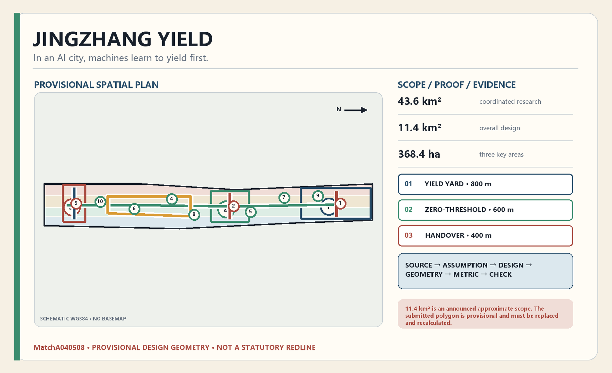
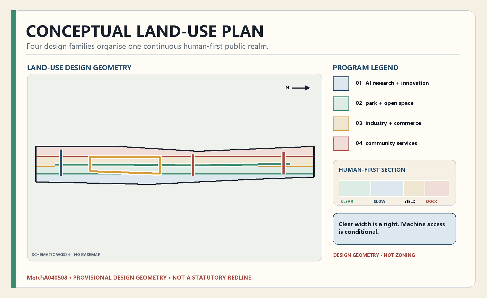
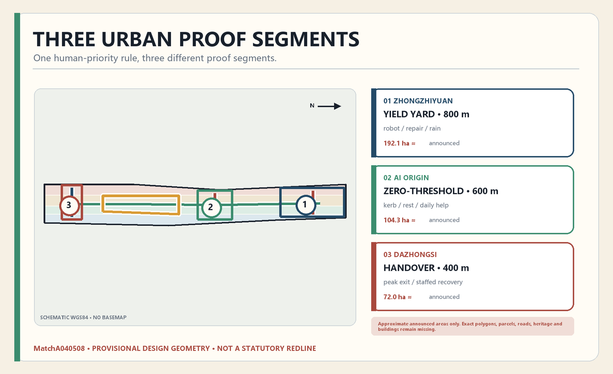
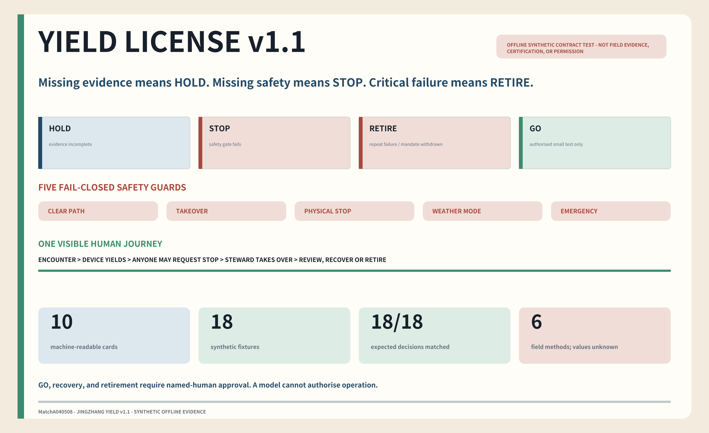
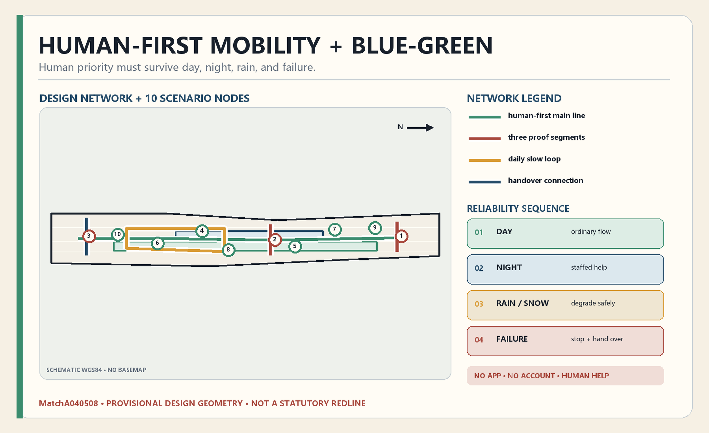
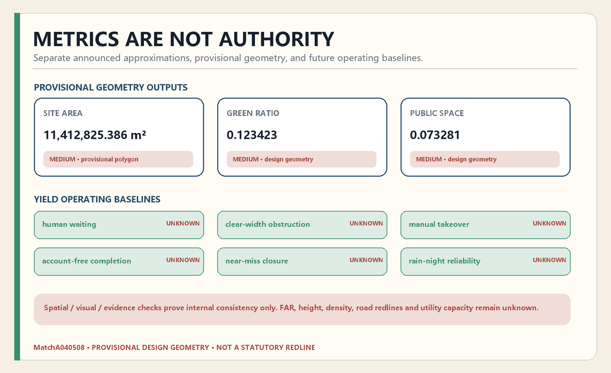

# JINGZHANG YIELD / 京张让路

> In an AI city, machines learn to yield first.

Railways are valuable not simply because they make movement faster, but because they establish legible priorities, signals, platforms, and handovers. When AI enters the urban ground plane, the same basic questions return: when a wheelchair user, child, older person, cyclist, night worker, service cart, and low-speed robot meet, who moves first, where does the machine wait, and who takes responsibility when it fails? JINGZHANG YIELD answers with three 400–800 m conceptual proof segments. It converts human priority into continuous clear width, passing bays, docking and repair places, ordinary signs, account-free service, and physical stop points. GitHub user MatchA040508 is recorded as the first traceable contributor to this proposal; future public attribution must remain voluntary, correctable, and withdrawable.

## Design Basis and Source List

The official announcement defines the three scope levels, three key areas, professional task, and required planning depth. It is a qualification announcement for an international professional design solicitation: it does not grant an individual GitHub participant eligibility for the professional bid. GitHub attribution, agent participation, and the open-source submission workflow come from the repository’s agent taskbook and are not presented as government-issued bidder status. Neither source replaces statutory controls, surveyed parcels, building inventories, road redlines, or implementation approvals. [source:OFFICIAL-ANNOUNCEMENT] [source:AGENT-TASKBOOK]

The repository explicitly lacks surveyed official polygons for the overall design area and the three key areas. This package therefore uses the supplied rough provisional geometry only for concept generation, topology checking, and review orientation. All such objects remain marked provisional constraint, official boundary=false, and medium confidence. Their calculated areas are not existing-condition findings, statutory indicators, or approval commitments. When official boundaries and controls arrive, all nine GeoJSON layers, their metrics, figures, HTML, and PDFs must be regenerated together. [data:geometry/site_boundary.geojson#SITE-001]

Evidence is organised as source → assumption → design → geometry → metric → self-check. Primary planning references define what may be claimed; AI, accessibility, and older-person policy references define service boundaries. Eight global cases are drawn from first-party public pages and used only to compare mechanisms. The processed fact pack is a navigation aid, not an independent authority. [standard:PROJECT-OFFICIAL-ANNOUNCEMENT]

## Three-Level Scope Framework

The coordinated research area, announced as approximately 43.6 km², addresses the AI ecosystem, knowledge networks, talent, and future-city relationships. The overall design area, announced as approximately 11.4 km², addresses renewal, land use, mobility, blue-green systems, infrastructure, and public services. The three key areas, announced as approximately 368.4 hectares combined, are the scale for detailed spatial and operating tests. These published approximate values describe task scale; the provisional polygons do not replace them as legal geometry. [depth:three_level_scope_framework]

The proposal is structured as three proof segments, two equivalent service paths, six yielding actions, and ten public tasks. The proof segments are a controlled shared street at Zhongzhiyuan, a campus–neighbourhood threshold street at Beijing AI Origin Community, and a station–heritage handover interface at Dazhongsi. Every segment is intentionally bounded to a conceptual 400–800 m length so that human-scale sections and day/night/rain/snow sequences can be tested before corridor-wide claims are made. [data:geometry/key_areas.geojson#PROV-KEY-001]

The two service paths are an AI-assisted path and an equally usable ordinary path that requires no app or account and retains staffed help. The six actions are HUMAN FIRST, SLOW, STOP, DOCK, HAND OVER, and RECOVER. Each segment preserves an unobstructed accessible band; robots use only a marked shared band, pull into passing bays, dock in service zones, communicate through visual, audible, tactile, and written cues, and can be stopped physically by a named steward. Lines in the drawings are conceptual relationships, not approved roads, rail works, or crossings. [standard:MOHURD-URBAN-DESIGN-MEASURES]

## Coordinated Research Area: Industry and Future City Research

The wider ecosystem is organised around four connected chains and one public ground: research, open collaboration, enterprise validation, and daily-life service, all meeting in streets and public rooms that multiple groups can use. Universities contribute research and talent; open-source maintainers contribute reproducibility; enterprises contribute cleared test tasks; public-service staff and residents contribute practical problems, accountability, and human review. The technology-service wing supports intellectual property, legal, finance, standards, and international cooperation. The scenario wing turns accessibility, maintenance, blue-green care, culture, and ordinary service into bounded public-interest test questions. [source:PROCESSED-FACT-PACK]

Eight global references are read through mechanism, precondition, local translation, and non-transferable limits. Singapore one-north informs the proximity of research, enterprise, and everyday facilities. [source:CASE-ONE-NORTH] Helsinki Mobility Lab demonstrates collaborative testing by a city, companies, researchers, and residents in a real urban environment; its project page is not interpreted as Beijing’s permission regime. [source:CASE-HELSINKI-MOBILITY-LAB] Barcelona’s municipal material positions 22@ as an innovation district within an economic-transition agenda; public-realm and community improvement remain local design requirements rather than claims proved by that single source. [source:CASE-BARCELONA-22AT] Seoul AI Hub shows that talent, startup, R&D-facility, and industry collaboration can be organised through a public platform. [source:CASE-SEOUL-AI-HUB] Station F demonstrates the co-location of startup programmes with visa, finance, and administrative services; “spatial efficiency” remains a proposal inference. [source:CASE-STATION-F] Mila supports industry partnership and open science; responsible AI requires a separate dedicated source. [source:CASE-MILA] London Knowledge Quarter supports a network of knowledge, cultural, research, and technology institutions, but does not by itself prove railway-heritage renewal. [source:CASE-KNOWLEDGE-QUARTER] The City of Cambridge’s Kendall Square study supports walkability, mixed use, public space, and proximity to an anchor university. [source:CASE-KENDALL-SQUARE]

Haidian’s distinctive interface is the ordinary street: real enough to expose conflicts but controlled enough to stop safely. Human waiting time, clear-width obstruction, near misses, manual takeover, account-free completion, and rain-night reliability become public evidence. The visual identity expresses this priority: white is the human clear band, signal green is conditional low-speed movement, brick red means stop and hand over, and steel blue denotes the responsibility chain. It avoids platform logos and corporate trademarks. [standard:PROJECT-AGENT-OPEN-CALL-TASKBOOK]

## Overall Design Area: Urban Renewal and Regulatory-Plan-Level Urban Design

Renewal follows a sequence of baseline, reversible prototype, independent review, and only then deeper construction. The current conceptual land-use model divides the provisional area into AI research and innovation, green and open space, industry and commercial service, and community service. These topologically coherent polygons test capacity relationships; they are not statutory parcels or zoning. [data:geometry/land_use.geojson#LU-001]

Three types of interface organise the work. Along the heritage corridor, the priority is continuous walking, cycling, accessibility, shade, rest, cultural explanation, and night safety. In innovation streets, existing indoor space is reused for testing, repair, documentation, and enterprise support. At transit interfaces, the priority is step-free arrival, readable ground-floor edges, short crossings, ordinary information, and human help. Any bridge, tunnel, rail crossing, or carriageway change remains a professional study dependency. [standard:MOHURD-CONTROL-DETAILED-PLANNING]

Building, green-space, and public-space layers express design capacity, not surveyed baselines. The illustrative building footprint checks whether a proposal still leaves room for public life; it is not a demolition or construction quantity. Floor-area ratio, gross floor area, height, density, setbacks, parking, and infrastructure capacity remain unknown. Permanent interventions require official controls, building and ownership data, heritage screening, transport review, utilities, accessibility review, and public participation. [metric:building_footprint_area_sqm]

## Detailed Design of Key Areas

**Zhongzhiyuan — Yield Yard.** The northern proof segment is a controlled shared street with a continuous accessible clear band, robot passing bays, docking/charging, and a repair base. Empty, loaded, failed, night, and rain/snow conditions are tested separately. The conceptual landmark, the Human-First Beacon, communicates speed permission, stop status, and the named takeover steward in simple green, amber, and red states; it never displays personal tracks. The announced 192.1 ha is a task descriptor, while the rough rectangle remains non-statutory. [data:geometry/key_areas.geojson#PROV-KEY-001]

**Beijing AI Origin Community — Zero-Threshold Street.** The central proof segment concentrates on fine-grained conflicts at campus gates, shop doors, kerbs, ramps, tree pits, deliveries, bicycles, and waiting. The Zero-Threshold Arcade combines an ordinary help desk, wheelchair rest point, open rule library, and voluntary contributor record. Its value lies in solving thresholds and everyday service, not in a futuristic object. Exact siting and building form remain dependent on ownership, building, and heritage evidence. [data:geometry/key_areas.geojson#PROV-KEY-002]

**Dazhongsi — Handover Exchange.** The southern proof segment tests how devices leave the principal route before peak flow, transfer goods or service to a steward, and recover without blocking wheelchairs, prams, or hurried passengers. The Handover Clock publishes current staffing status and aggregate takeover/recovery performance, while providing ordinary bilingual signs, complaint routes, and opt-out choices. Product demonstration never takes priority over passage. [data:geometry/key_areas.geojson#PROV-KEY-003]

The common rule is human first, machines slow, failures owned by a person. The north tests equipment and repair, the centre tests thresholds and daily conflict, and the south tests peak interchange and handover. All three record permission, version, near miss, complaint, recovery, and retirement. Their landmarks begin as reversible public devices; no building approval, institutional launch, or funded programme is claimed. [depth:three_key_area_detailed_design]

## AI Innovation Ecosystem, Personas, and AI+ Scenarios

Seven overlapping personas shape the design: open-source maintainers; university researchers and students; startup teams and product managers; city operations and public-service staff; residents, older adults, and caregivers; disabled people and people with low digital literacy; and international visitors and partners. The design does not turn these groups into commercial profiles. Maintainers need versioned rules, researchers need lawful and reproducible evidence, operators need escalation, residents need ordinary choices, accessibility co-testing must be voluntary and withdrawable and let participants stop a test, and visitors need human-reviewed multilingual information. The Barrier-Free Environment Construction Law supports equal access to facilities, information, and services; it does not replace the separate verification of lawful basis, notice and consent, minimum necessity, retention, or deletion for personal-information processing. [source:DATA-SRC-BARRIER-FREE-ENVIRONMENT-LAW]

The ten scenarios are proposals; T1–T3 are industry-validation concepts, not certified or operating centres.

| ID | Scenario and location | Experience | Boundary and evidence |
| --- | --- | --- | --- |
| T1 | Low-speed robot yielding protocol, Zhongzhiyuan | Wheelchair users, children, and robots meet in a controlled street | Record human waiting, clear-width obstruction, near misses, and physical stops |
| T2 | Threshold and kerb sensing, AI Origin | Co-test gates, doors, ramps, trees, bicycles, and deliveries | Voluntary participation, minimum collection, human verification, no movement profiles |
| T3 | Station-terminal handover, Dazhongsi | Devices exit peak routes and hand tasks to staff | Measure takeover and recovery; failures may not block an accessible route |
| 04 | Medicine and care, dual channel | A device delivers to a staffed point; phone and walk-in collection remain | Minimise health data; emergencies remain human-led |
| 05 | Library and learning cart | Reserved books and learning material travel at low speed | Children first, fixed docking, no unpermitted entry |
| 06 | Night repair and help | Workers receive lighting, repair, and answered help points | No individual tracking; a steward can stop equipment physically |
| 07 | Blue-green maintenance yielding | Maintenance avoids walkers, resting places, and sensitive times | Published operating windows; on-site people retain highest authority |
| 08 | Account-free daily services | AI explanation exists alongside paper and staffed routes | Measure account-free completion; collect no irrelevant identity data |
| 09 | Rain/snow reliability rehearsal | Test wet, cold, pooled-water, and low-visibility degradation | If thresholds fail, autonomous operation stops or transfers to a person |
| 10 | City Issue→PR rule table | Residents submit conflicts; maintainers propose spatial or rule repairs | Version every decision and record verification, reuse, rollback, and retirement |

All scenarios follow Issue → data and rights check → controlled prototype → human and public review → limited release → independent review → Merge, Rollback, or Retire. This is a proposal-defined reversible governance lifecycle, not a statutory approval process. [source:AGENT-TASKBOOK] Only where a scenario actually constitutes a public-facing generative-AI service in China is the Interim Measures for Generative Artificial Intelligence Services used, within its scope, as an external boundary for content, data, personal information, complaints, and provider responsibility. The Measures do not approve this project or certify low-speed-robot traffic safety. [source:DATA-SRC-GENERATIVE-AI-INTERIM-MEASURES] Each scenario has a named person, baseline, start gate, stop threshold, physical takeover, recovery condition, and retirement evidence. Scenario points in GeoJSON are medium-confidence concept locations and require later ownership, transport, heritage, and facility verification. [metric:scenario_node_count]

### Executable Yield Protocol v1.1

This iteration turns all ten scenario cards into one permission contract in `visual/assets/protocol/scenario_cards.json`. Every scenario must first pass five HOLD gates: site permission, data and rights clearance, a named human owner, an independent reviewer, and a non-digital fallback channel. Any missing safety gate—human clear path, manual takeover, physical stop, applicable weather mode, or emergency channel—fails closed to STOP. Repeated critical failure or withdrawal of the operating mandate takes priority and returns RETIRE. Only a fully complete contract returns GO, and GO means only “eligible for an authorised small-scale test,” never approved, certified, or safe to run unattended. [metric:yield_protocol_fail_closed_guard_count]

| Decision | Trigger | Human action | Re-entry condition |
| --- | --- | --- | --- |
| HOLD | Permission, rights, ownership, review, or fallback evidence is incomplete | Do not open the test; complete the evidence | The corresponding human role signs the missing item |
| STOP | Clear path, takeover, physical stop, weather, or emergency channel fails | Stop, isolate the device, and restore human passage | Review the issue, repeat the drill, and obtain authorised approval |
| RETIRE | Critical failure repeats or the operating mandate is withdrawn | Close the use and preserve incident and retirement records | No automatic restart; treat it as a new proposal |
| GO | Every gate passes | Test only inside the approved time, place, and envelope | Recheck for each window; do not inherit GO |

The dependency-free verifier `visual/assets/protocol/run_tabletop.js` reruns 18 deterministic synthetic cases: 10 complete cases return GO, 2 missing readiness/review evidence return HOLD, 4 missing safety guards return STOP, and 2 retirement triggers return RETIRE. All 18/18 match their expected decisions. [metric:yield_protocol_fixture_count] [metric:yield_protocol_expected_outcome_match_ratio] The 1.0 value is an internal contract-test match ratio, not a safety, reliability, or satisfaction rate. `visual/assets/protocol/baseline_measurement_plan.json` separately defines collection method, strata, quality gate, and prohibited inference for the six still-unknown operating metrics; no target or observed value is inserted before real survey, permission, professional review, and participant protection. The RACI also ensures that GO, recovery, and retirement remain named-human decisions.

## Land Use, Building Scale, and Retain-Renovate-Demolish Strategy

The four conceptual land-use families test a mixed district: AI research and innovation; industry and commercial service; community service and support; and parks, green, and open space. Research and test functions are paired with legal, intellectual-property, finance, maintenance, public-service, learning, care, culture, and everyday needs. The partition is cut from one provisional topology and must not enter a statutory schedule. [standard:MNR-LAND-USE-CLASSIFICATION-GUIDE]

Building decisions use six states: retain, repair, adapt, replace, new, and unverified. Retain where cultural, social, carbon, or use value is strong; repair safety and performance; adapt sound structures for new functions; consider replacement only after evidence; build new only after capacity and public-benefit review; and leave an object unverified whenever information is missing. Parcel ownership, building survey, structural safety, occupation, carbon, heritage, and displacement evidence are required before a building receives a definitive state. [depth:retain_renovate_demolish]

The current 310,807.184 m² illustrative footprint is only a design-geometry output used to test containment and spatial balance. It is neither an existing-building census nor a planned construction quantity. FAR, total floor area, density, and height remain unknown. The three landmarks therefore begin as reversible indoor adaptations or lightweight public devices. [data:geometry/buildings.geojson#BLDG-001]

Urban character is not produced by a uniform “AI style.” Heritage edges preserve readable time layers and low-glare materials; innovation edges favour open ground floors and changeable modules; neighbourhood edges protect daylight, quiet, children, older people, accessibility, and small businesses. Technology stays replaceable and repairable rather than becoming an irreversible architectural dependency. [standard:MOHURD-URBAN-DESIGN-MEASURES]

## Transport, Rail, Municipal Infrastructure, and Public Services

Mobility is organised around the human clear band, a marked low-speed shared band, passing bays, docking/repair places, and three station handover interfaces. A wider innovation loop connects research, test, and service organisations; a daily-life loop connects homes, parks, culture, ordinary services, and transit. The lines in roads.geojson express desired roles, not road redlines, rail protection limits, signal plans, or engineering approval. [data:geometry/roads.geojson#ROAD-001]

“Uninterrupted, understandable, and helpable” is the walking standard. The Barrier-Free Environment Construction Law provides the legal direction for equal passage, information access, and public services; continuous clear width, facility dimensions, and engineering details still require verification against applicable national and Beijing technical standards in formal design. [source:DATA-SRC-BARRIER-FREE-ENVIRONMENT-LAW] AI may identify steps, blocked clear width, temporary occupation, lighting, or crowding. Not retaining identifiable personal tracks, stating route limitations, and retaining ordinary signs and staffed information are proposal commitments for data and service design, not claims proved by the accessibility law alone. Rest, water, shade, accessible toilets, and bicycle parking are requirements to investigate against real service baselines, not invented quantities.

Infrastructure follows minimum connection, tiered permission, and human takeover. Tests prefer isolated networks, auditable logs, synthetic or rights-cleared data, edge processing, and defined retention. Face recognition and mandatory accounts are not defaults. Complete electricity, drainage, heat, communications, waste, fire, and emergency capacity data are absent, so this proposal defines interfaces rather than unsupported loads or costs. [depth:municipal_new_infrastructure]

Public services use a dual channel. An agent can translate, explain forms, or guide a person, but staff, phone, paper, or a physical counter remain. [source:DATA-SRC-ELDERLY-SMART-TECH-PLAN-2020-45] Labelling generated output, enabling correction, and naming a responsible handler are proposal governance requirements; the applicable labelling duty must be checked against the rules in force when a service launches. AI never replaces emergency response, professional judgement, or authorised decisions. Schools, healthcare, care, culture, sport, childcare, and community-service changes require population, catchment, capacity, and statutory evidence.

## Blue-Green Network, Public Space, and Urban Character

The Qinghe, Xiaoyue River, Jing-Zhang heritage park, street trees, and small open spaces are treated as one walkable, restable, learnable, and maintainable public system. Ecology, stormwater, shade, and ordinary recreation come before technology display. A blue-green maintenance assistant may organise authorised environmental information and work orders, but cannot directly control engineering. Hydrology, flood, soil, habitat, and protected-line details remain professional gaps. [data:geometry/green_space.geojson#GREEN-001]

Public space has three rhythms: the heritage route supports continuous walking and cultural reading; the three proof segments concentrate testing and handover; and neighbourhood corners support rest, care, and ordinary service. The current public-space area and ratio are design geometry, not current-provision or statutory targets. Ownership, openness, sunlight, noise, accessibility, fire, and operating responsibility must be checked before a permanent classification. [data:geometry/public_space.geojson#PUBLIC-001]

The three pilgrimage landmarks express rights rather than scale. The Human-First Beacon shows when machines must yield; the Zero-Threshold Arcade provides wheelchair rest, ordinary help, and an open rule library; the Handover Clock says who takes responsibility and how quickly. Steel blue, signal green, brick red, and paper cream form a restrained system. Excessive media façades, cyber-neon spectacle, and platform branding are rejected. [depth:height_massing_character]

Cultural narration remains source-linked and human-reviewed. Generated interpretation is labelled and correctable, while contested stories remain visible. A calm, device-optional public space is treated as a valid and necessary part of an AI innovation district.

## Renewal Projects, Implementation Policy, and Phasing

The ten scenarios form the project list, supported by official-data replacement, an accessibility baseline, and a yielding-protocol evidence format. The first reversible works are three proof segments, three staffed points, a continuous-clear-width marking kit, passing bays, docking/repair places, ordinary wayfinding, and physical stop points. Medicine, books, repair, maintenance, and other device services begin only after physical space and responsibility chains pass review. Each project card records location, person responsible, permission, baseline, start gate, stop threshold, takeover, recovery, operating cost, and retirement evidence. [depth:renewal_project_list]

Phase 0—Baseline (conceptual months 0–6) replaces official geometry and collects manual observations of waiting, obstruction, near misses, account-free completion, and night help. Phase 1—Prototype (6–18) tests markings, movable protection, passing bays, staffed points, and physical stops. Phase 2—Merge (18–36) expands only cases that pass safety, accessibility, rain/snow, and public review. Phase 3—Long-Term Support (after 36) considers permanent work only through statutory and engineering procedures and maintains an annual retirement process. The periods are a sequencing concept, not a government schedule. [data:geometry/phasing.geojson#PHASE-001]

A conceptual Yield Stewardship Desk brings planners, street maintainers, researchers, enterprises, residents, accessibility representatives, heritage, and data governance into the same review. It does not replace approval. It turns spatial conflicts, prototypes, near-miss evidence, public comments, and versions into reviewable records. Each high-risk scenario has an independent reviewer, named human owner, physical stop, and recovery route. These responsibility, stop, recovery, and review mechanisms are operating-design choices derived from the repository’s co-creation principles, not statutory approval clauses in the Interim Measures for Generative Artificial Intelligence Services. [source:AGENT-TASKBOOK]

Long-term value is measured by maintained rights rather than opening-day spectacle. Suggested operating measures include human waiting, clear-width obstruction minutes, manual takeover, account-free completion, near-miss closure, rain-night reliability, accessibility defects, and retirement. Public contributor records connect a volunteered GitHub name, proposal path, version, date, and licence, with correction and withdrawal available.

## Metrics, Area Recalculation, and Compliance Matrix

Three classes of metric are separated. Published approximate values describe scope: 43.6 km², 11.4 km², and 192.1/104.3/72.0 ha for the key areas. Provisional geometry outputs—11,412,825.386 m² site area, 310,807.184 m² illustrative footprint, 0.123423 illustrative green ratio, and 0.073281 illustrative public-space ratio—test topology and display consistency. Yield operating measures remain unknown until prototypes produce a baseline. [metric:site_area_sqm] [metric:green_ratio] [metric:public_space_ratio] Four additional package metrics describe reviewable assets only: ten cards, 18 synthetic fixtures, five fail-closed safety gates, and a 1.0 expected-outcome match ratio. They must never be mixed with field performance. [metric:yield_protocol_card_count]

The provisional area is calculated in EPSG:4548. Green and public-space ratios use projected union area divided by the same provisional site area; building footprint sums illustrative polygons. One calculation source feeds metrics, figures, HTML, and PDFs. Computational consistency does not create source authority. A formal boundary replacement triggers regeneration of all layers and outputs. [depth:metrics_recalculation]

The compliance matrix covers the 17 announcement tasks and agent.1–agent.6; the standard matrix covers five mandatory project/planning references; the depth matrix covers 15 professional dimensions. Every item maps prose, geometry, metrics, drawings, visual sections, sources, assumptions, and self-check. Spatial, visual, professional, and deterministic checks establish internal consistency only; they do not establish statutory compliance or constructability. [standard:MOHURD-CONTROL-DETAILED-PLANNING]

FAR, height, density, setbacks, road redlines, and utility capacity remain unknown. Numerical precision must never conceal provisional inputs. Human-scale operating KPIs are defined now but receive no invented target or measured value before a real baseline exists.

## Risk, Copyright, and Compliance

The primary data gaps are official overall and key-area polygons; FAR, height, density, green control, and setbacks; road redlines and sections; parcels and ownership; surveyed buildings; heritage boundaries; municipal capacities; and public-service baselines. All current corridors, nodes, buildings, and ratios are conceptual review material, not approval, acquisition, construction, or investment evidence. [depth:risk_missing_data]

AI risks include privacy, bias, unsafe automation, vendor lock-in, digital exclusion, poor weather performance, and unclear maintenance. Data minimisation, purpose limitation, public or appropriately authorised sources, generated-content labelling, human review, logs, complaint, physical stop, safe degradation, rollback, and retirement are proposal-defined design controls. Before implementation, lawful basis, notice and consent, retention and deletion, and generated-content labelling duties must be checked item by item against the personal-information and online-information-service rules then in force; neither accessibility law nor the older-person plan substitutes for that review. Older people, disabled people, children, caregivers, and people with low digital literacy retain a non-digital path. The existing older-person plan directly supports only the direction of keeping smart and traditional service channels in parallel. [source:DATA-SRC-ELDERLY-SMART-TECH-PLAN-2020-45]

Original text, diagrams, structured data, layouts, and PDFs are contributed under COMMUNITY-DISPLAY-ONLY subject to repository rules. External sources retain their own rights. No corporate logos, Octocat, third-party photographs, hidden remote scripts, or unauthorised personal data are used. Global cases are compared briefly and point to first-party sources. [source:SOURCE-REGISTRY]

Nothing here represents planning approval, procurement, funding, partnership endorsement, landowner consent, construction permission, certification, or an operating public service. AI assists; authorised people decide. Permanent work remains subject to planning, engineering, heritage, environmental, accessibility, financial, and public-review procedures.

## References

Primary project references are the Haidian branch’s official qualification announcement, the repository agent taskbook, the structured site package, source registry, processed fact pack, and provisional boundary file. Planning references are the *Urban Design Management Measures*, the *Measures for the Preparation and Approval of Regulatory Detailed Plans for Cities and Towns*, and the *Guidelines for Classification of Land and Sea Use for Territorial-Space Survey, Planning, and Use Control*. AI and inclusion references include the interim generative-AI measures, the Barrier-Free Environment Construction Law, and the national older-person smart-technology plan. [source:OFFICIAL-ANNOUNCEMENT] [source:SITE-PACKAGE] [source:AGENT-TASKBOOK] [standard:MOHURD-URBAN-DESIGN-MEASURES] [standard:MOHURD-CONTROL-DETAILED-PLANNING] [standard:MNR-LAND-USE-CLASSIFICATION-GUIDE] IDs, URLs, uses, dates, and limitations for the announcement, selected policies, and cases are stored in sources.json. Formal planning-source details are registered through the repository SOURCE-REGISTRY, which standard_matrix.json currently references in aggregate. Until itemised standard-source records are added to this submission directory, the evidence chain is not described as fully closed. [source:SOURCE-REGISTRY]

The eight first-party case sources are JTC’s Singapore one-north page [source:CASE-ONE-NORTH]; Forum Virium Helsinki’s Mobility Lab page [source:CASE-HELSINKI-MOBILITY-LAB]; Barcelona City Council’s economic-agenda material [source:CASE-BARCELONA-22AT]; the Seoul Metropolitan Government’s Seoul AI Hub page [source:CASE-SEOUL-AI-HUB]; Station F’s official site [source:CASE-STATION-F]; Mila’s industry-partnership page [source:CASE-MILA]; London Knowledge Quarter’s official network site [source:CASE-KNOWLEDGE-QUARTER]; and the City of Cambridge’s Kendall Square planning study [source:CASE-KENDALL-SQUARE]. They support only the mechanisms, testbeds, institutional collaboration, economic transition, public-space approaches, or startup services explicitly stated by each source. They do not support unregistered statistics or commitments, nor automatically prove permission regimes, responsible AI, railway-heritage renewal, or spatial efficiency.

Spatial evidence is stored in the nine geometry files; metrics and assumptions in metrics.json and assumptions.json; requirement coverage in the compliance, standard, and depth matrices; and machine self-check results in self_check.json. All live under MatchA040508’s single submission directory for local review, future PR scope review, and version history. [data:geometry/constraints.geojson#GAP-BOUNDARY-001]

This v1.1 proposal was updated on 2026-08-13; the existing retrieval date for the global case pages remains 2026-08-11. Sources, policies, schemas, and repository state may change and should be refreshed before each remote iteration. The author, model disclosure, path, Yield Protocol, and verification record are stored in proposal.md, agent.json, manifest.json, and Git history. Any field implementation still requires separate authorisation and professional confirmation.
