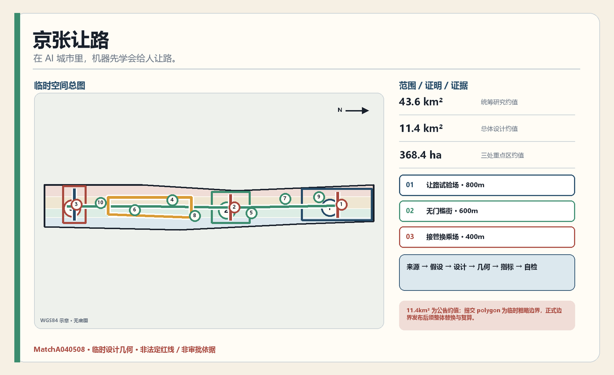
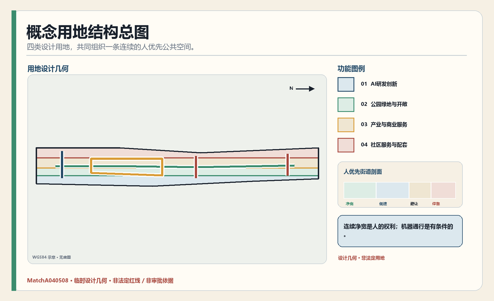
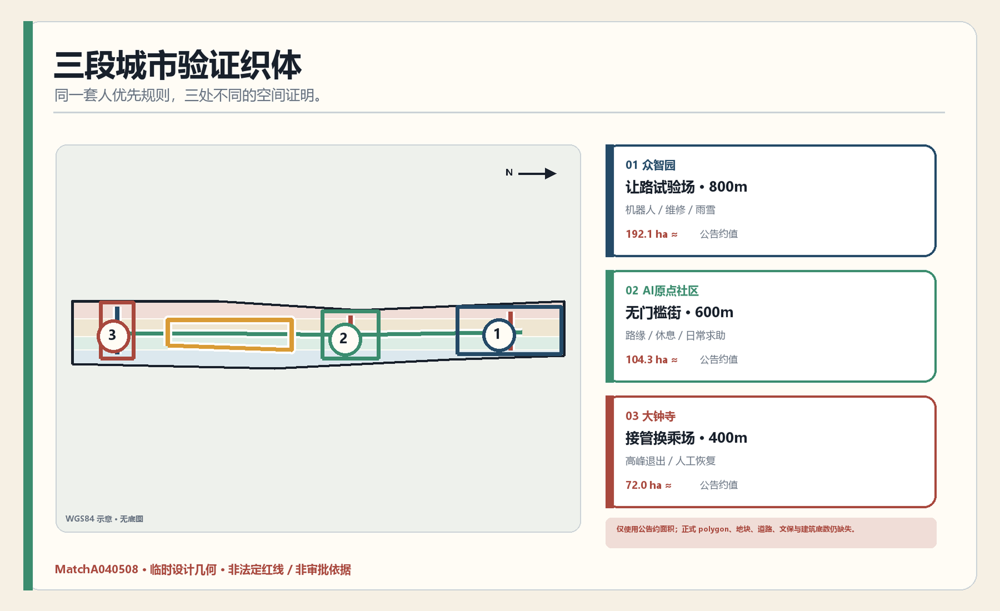
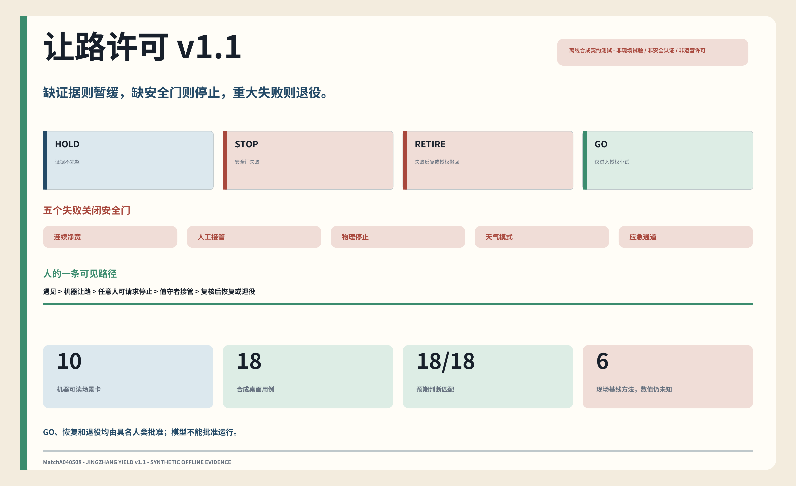
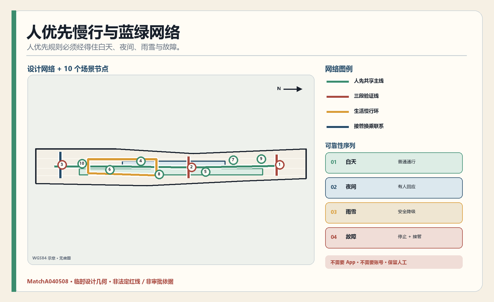
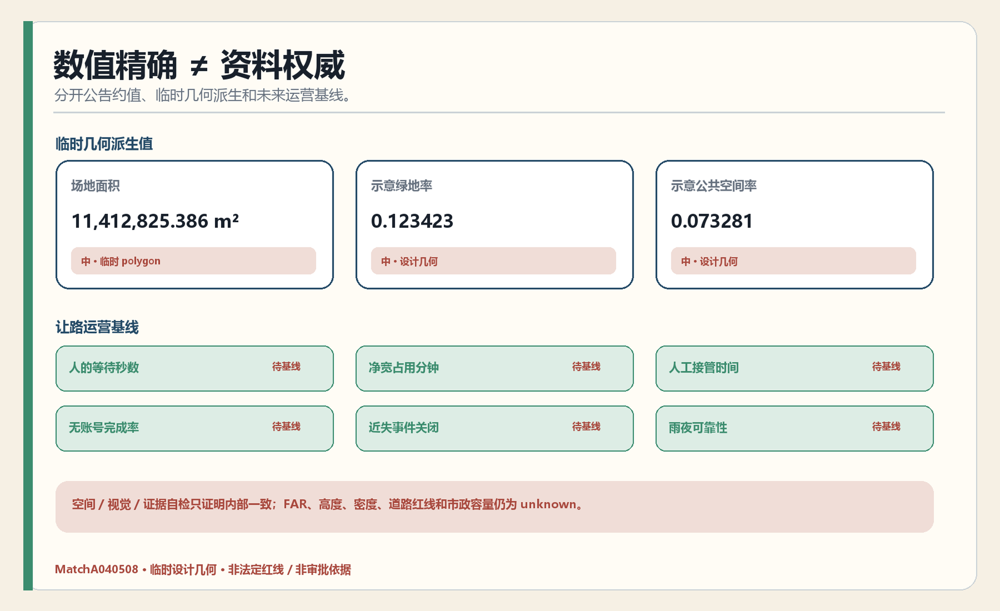

# 京张让路 / JINGZHANG YIELD

> 在AI城市里，机器先学会给人让路。  
> In an AI city, machines learn to yield first.

铁路的价值不是让所有人跑得更快，而是建立清楚的优先、信号、站台与交接规则。AI进入城市地面以后，同样需要先回答一个基本问题：当轮椅、儿童、老人、骑行者、夜间劳动者、清运车辆和低速机器人相遇，谁先行、谁等待、在哪里停、故障由谁接管？本方案不把百年京张AI创新带想象成一次性“生成”的科技新城，而用三段400—800米概念证明段，把“人优先”落实为连续净宽、错车湾、停靠维修位、普通标识、无账号服务和物理停止装置。规则由开发者、科研人员、企业、居民与公共管理者共同维护；作者 GitHub 名称 MatchA040508 作为第一条可追溯贡献进入提交包，未来公开署名仅在自愿、可纠错、可退出的前提下记录。

## 设计依据与资料清单

本方案首先遵循公开征集公告所明确的三层范围、三处重点区域和成果深度，再使用面向智能体任务书组织AI生态、场景、品牌与运营内容。[source:OFFICIAL-ANNOUNCEMENT] [source:AGENT-TASKBOOK] 公告是面向专业设计机构的国际方案征集资格预审文件，只支撑专业任务范围、成果要求和资格预审语境；GitHub署名、智能体参与和开源提交工作流来自仓库任务书，不被表述为政府公告授予的个人参赛资格或正式投标身份。公告给出的统筹研究范围约43.6平方公里、总体设计范围约11.4平方公里、三处重点区合计约368.4公顷均属于公开文字约值；它们能够支撑任务规模和工作层级，却不能替代正式范围坐标、地块线或道路红线。机器可读的来源登记、事实包、范围摘要和缺资料清单只承担导航与审计作用，任何事实判断仍回到登记的原始材料。

当前资料包明确缺少三层范围和三处重点区的正式多边形。本成果因此沿用组织方提供的临时粗略几何，统一标记为 provisional constraint、official boundary=false、medium confidence，并在正文、图件、指标和HTML中重复提醒。临时几何只用于概念生成、拓扑自检和审阅定位；场地面积、绿地比例、公共空间比例和示意建筑基底都是这套临时几何的派生值，不是现状调查结论、法定指标或审批承诺。[data:geometry/site_boundary.geojson#SITE-001] 一旦正式边界、控规、建筑底数或工程资料补齐，九类GeoJSON与全部指标应成套复算，不能局部替换。

专业依据分为三层：项目任务依据负责“做什么”，城乡规划和城市设计公开规范负责“如何表达”，生成式AI、无障碍和适老政策负责“场景如何守边界”。本方案仅把已登记且可公开核验的材料列入正式证据；尚未取得官方文件或来源网址的参考项只进入待补清单，不被写成强制结论。[standard:PROJECT-OFFICIAL-ANNOUNCEMENT] 8个全球案例均采用园区、城市或机构的一级公开页面，提炼机制而非复制数字。图中证据链把“来源—假设—设计—几何—指标—自检”连接起来，便于人类评审追问每一项判断。

## 三层范围工作框架

统筹研究范围回答“怎样形成世界级AI创新生态”，总体设计范围回答“产业、更新、交通、蓝绿和公共服务怎样组成一条城市带”，重点区域回答“哪些空间与运营原型可以率先验证”。[depth:three_level_scope_framework] 三个层次不是三套孤立图纸，而是一条从战略到空间再到行动的证据链：上位判断必须能在总体结构中找到载体，总体结构必须能在重点区和更新项目中找到验证场景，重点区经验又要能反馈产业生态与公共治理。

总体空间由“三段证明、两条等价路径、六个让路动作、十个公共任务”构成。三段证明分别落在众智园的受控共享街道、北京AI原点社区的校园—社区门槛街、大钟寺的站城—遗产换乘界面，每段只选400—800米概念范围，以人体尺度剖面和日夜雨雪序列讲清规则。两条等价路径是AI辅助路径与不需要App、不需要账号、有人值守的普通路径。六个动作是人先、减速、停止、停靠、交接、恢复。十个公共任务把送药、图书、维修、清运、导览和应急求助等日常需求放进同一审计框架。[data:geometry/key_areas.geojson#PROV-KEY-001]

每段证明段采用同一空间语法：沿建筑或绿地保留连续无障碍净宽，人和轮椅拥有最高优先；低速设备只能在标记的共享带运行；错车湾用于避让而不是临时堆物；停靠带集中充电、装卸、维修和故障隔离；路口设置能被人看懂的灯光、声音、触觉和文字提示；物理停止点允许值守者立即接管。十个节点对应十张场景卡，每一节点均采用 Issue—Prototype—Review—Merge/Rollback/Retire 的生命周期。图面连线只表达概念联系，不代表道路、轨道或地下工程已经确定。[standard:MOHURD-URBAN-DESIGN-MEASURES]

三层范围的工作成果分别落在产业机制、总体结构、重点区动作、项目清单、机器图层和指标矩阵中。43.6平方公里层级不生成伪精确空间边界，11.4平方公里层级使用临时范围进行设计测试，368.4公顷层级仅以公告约面积和临时多边形建立索引。这样既能让内容进入公开讨论，也能清楚区分“已知事实、设计建议、待核条件”三种状态，避免用视觉精度掩盖资料精度。

## 统筹研究范围产业与未来城市研究

本方案把AI创新生态理解为“四链一公地”：科研成果链、开源协作链、企业验证链、人才生活链，共同依托可被多方使用的城市公共空间与治理协议。高校院所贡献研究和人才，开源社区贡献可复现工具与协作文化，企业贡献真实但清权的测试任务，公共部门和居民贡献城市问题、服务经验和人工复核。[source:PROCESSED-FACT-PACK] 科技服务翼提供知识产权、法务、投融资、国际合作和标准咨询；场景赋能翼把社区、蓝绿、无障碍、文化与日常服务转化为可受控验证的公共任务。

全球参照不以“像某个园区”为目标，而按“机制—适用条件—海淀转译—不可照搬”四步使用。Singapore one-north提示科研、产业与日常设施的邻近协同。[source:CASE-ONE-NORTH] Helsinki Mobility Lab提示在真实城市环境中由城市、企业、研究机构与居民协作测试；本稿不把项目页进一步解释为北京的许可规则。[source:CASE-HELSINKI-MOBILITY-LAB] Barcelona市政府材料提示22@在城市经济议程中的创新区与产业转型角色；公共空间和社区改善只作为本方案的在地设计要求，不由该单一来源代证。[source:CASE-BARCELONA-22AT] Seoul AI Hub提示人才、创业、研发设施和产业协作可由公共平台组织。[source:CASE-SEOUL-AI-HUB] Paris Station F提示创业项目与签证、融资、行政等服务可以集中共址；“空间效率”仅是本方案推论。[source:CASE-STATION-F] Montréal Mila提示产业合作与开放科学并置；负责任AI须由专门来源另行支撑。[source:CASE-MILA] London Knowledge Quarter提示知识、文化、科研与技术机构的联盟网络，不单独支撑铁路遗产更新。[source:CASE-KNOWLEDGE-QUARTER] Cambridge Kendall Square的市政府规划研究提示锚点高校、步行、混合用途与公共空间的近距离耦合。[source:CASE-KENDALL-SQUARE]

海淀的转译不是复制税收政策、企业数量或建筑形象，而是形成三个公共接口：第一，用真实街道但受控时段验证低速机器人、人机交互和辅助技术；第二，不强制下载应用、保留人工值守和普通标识的等价服务；第三，把净宽占用、人的等待时间、人工接管、近失事件和雨夜可靠性记录为可审计证据。面向全球人才的吸引力来自“可以把研究放进普通人的具体城市问题、可以安全失败、可以留下可追溯修复”，而不只来自地标建筑。年度 Yield Audit、Urban Field Lab 与 Reliability Review 仅为运营概念建议，时间、主办方和公共资源安排仍需后续协商。

品牌叙事把铁路信号转译为城市让路语言：白色连续线表示不可被机器占用的人行净宽，信号绿表示设备可以低速通过，砖红表示必须停止并交给人，钢蓝表示可追溯的责任链。统一英文传播句为 In an AI city, machines learn to yield first. 视觉系统使用铁路钢蓝、信号绿、遗产砖红和纸本米白，以“人形在前、机器退后”的错位双线构图；不使用 GitHub、Octocat 或任何企业商标来制造不当关联。[standard:PROJECT-AGENT-OPEN-CALL-TASKBOOK]

## 总体设计范围城市更新与控规深度城市设计

总体设计采用“先校底数、再做可逆原型、通过评审后加深”的更新路径。临时用地结构把范围分为AI研发创新、公园绿地与开敞空间、产业与商业服务、社区服务与配套四类概念区，形成连续但不被误读为法定地块的空间模型。[data:geometry/land_use.geojson#LU-001] 四个面状单元由同一临时边界切分并通过拓扑自检，目的在于测试产业、生活、公共空间之间的容量关系；其分类、边界和面积均须在正式用地、权属和控规资料到位后重做。

更新策略围绕三类界面展开。遗址主线优先补足步行、骑行、无障碍、遮阴、休憩、文化解释和夜间安全；创新街区优先盘活既有室内空间，嵌入共享测试、开源发布、企业服务和学习社交功能；轨道节点优先改善站城步行接驳、首层公共界面和跨街联系。任何跨铁路、跨快速路或改变道路断面的动作均只画成待研究连接，不写成确定工程。[standard:MOHURD-CONTROL-DETAILED-PLANNING]

建筑、绿地和公共空间图层表达设计承载关系而非现状台账。示意建筑基底用于检查空间是否还能容纳开放空间和慢行网络，不代表具体建筑可拆、可建或已测绘；示意绿地与公共空间用于检验连续性，不代表规划绿地率目标。[metric:building_footprint_area_sqm] 法定容积率、建筑高度、建筑密度、退线、停车指标和市政容量均保持 unknown，避免以算法补齐不存在的数据。正式深化前应取得现状建筑、产权、文保、道路红线、轨道保护、市政管线和公共服务底数，建立逐栋逐地块的 retain—renovate—demolish 决策表。

实施上优先选择“低扰动、可关闭、可复用”的空间：既有室内展陈、可移动家具、临时导视、预约式测试、公开工作坊和小尺度景观维护。只有当正式规划条件、专业评估、公众反馈、无障碍验证与资金运维方案同时满足时，才进入永久建筑或基础设施设计。此路径让城市更新像可靠软件一样拥有测试环境和回滚机制，同时保留规划审批与专业判断的完整权责。

## 重点区域详细设计

北部众智园定位为“让路试验场 / Yield Yard”。建议在受控共享街道概念段中设置连续净宽、机器人错车湾、停靠充电和维修基地，分别验证空载、满载、故障、夜间和雨雪状态。地标“人先灯塔 / Human-First Beacon”用人人看得懂的绿、黄、红状态公开当前速度、权限和接管责任，不展示个人轨迹，也不做企业排行榜。[data:geometry/key_areas.geojson#PROV-KEY-001] 公告约面积192.1公顷只用于任务量级；临时矩形不得解释为地块或道路红线。

中部北京AI原点社区定位为“无门槛街 / Zero-Threshold Street”。它连接高校、社区和创新空间，集中解决校门、店门、路缘、树池、外卖停靠和自行车之间的细颗粒冲突。地标“无门槛廊 / Zero-Threshold Arcade”同时是普通问路台、轮椅休息点、开源规则阅览架和贡献者谱；MatchA040508 及后续维护者可以自愿留下可纠错记录。[data:geometry/key_areas.geojson#PROV-KEY-002] 在文保、产权和建筑底数不足时，地标先采用既有室内空间或可逆展陈。

南部大钟寺定位为“接管换乘场 / Handover Exchange”。它面向站城、遗产、商业和高峰客流，验证低速设备如何在进站前退出主通道、如何把物品或服务交给人、如何在故障时不阻塞轮椅和婴儿车。地标“接管钟亭 / Handover Clock”公开平均接管时间、故障恢复和人工值守状态，提供多语普通标识、投诉与退出入口，不把产品演示置于通行之上。[data:geometry/key_areas.geojson#PROV-KEY-003]

三地共同遵循“人先、机器慢、故障有人管”：北部验证设备和维修，中部验证门槛与日常冲突，南部验证高峰换乘与人工交接；统一登记权限、测试版本、近失事件、公众投诉和退役记录。[depth:three_key_area_detailed_design] 每个重点区的正式详细设计仍须补齐功能业态、逐栋规模、拆改留、交通组织、市政承载、公共空间与实施项目的测绘证据；本轮成果提供的是可审计的证明段和运营规则，而不是法定控制图则。

## AI 创新生态、人才画像与 AI+ 场景

七类核心使用者为：开源开发者与维护者、高校科研人员与学生、初创团队与产品经理、城市运营与公共服务人员、居民及老年人和照护者、残障及低数字素养使用者、国际访客与合作方。每类画像都从真实任务出发而非建立商业个人标签：协作和发布需要版本记录，科研转化需要授权接口，产品试验需要受控环境，城市运维需要人工裁定，居民服务需要双通道，无障碍共测必须自愿、可退出并允许参与者停止测试，国际交流需要有人审校的多语内容。无障碍环境建设法支撑平等使用设施、信息和服务的方向，但不替代个人信息处理所需的合法性基础、告知同意、最小必要和保存删除核验。[source:DATA-SRC-BARRIER-FREE-ENVIRONMENT-LAW]

十张场景卡形成“三区产业验证 + 全带公共应用”组合：

| 编号 | 场景与落位 | 核心体验 | 数据与治理边界 |
| --- | --- | --- | --- |
| T1 | 低速机器人让路协议验证·众智园 | 轮椅、儿童与机器人在受控街段相遇 | 记录人的等待、净宽占用、近失和物理停止，不宣称政府认证 |
| T2 | 门槛与路缘感知验证·原点社区 | 共测校门、店门、坡道、树池与临停冲突 | 自愿参与、最小采集、人工复核，不建立个人行动画像 |
| T3 | 站城终端交接验证·大钟寺 | 设备在高峰前退出主通道并把任务交给值守者 | 测人工接管和恢复时间，故障不得堵塞无障碍路线 |
| 04 | 送药与照护双通道·社区节点 | 机器人送至值守台，居民也可电话或现场领取 | 医疗信息最小化，紧急情况由人处理，AI不是唯一入口 |
| 05 | 图书与学习小车·高校—社区 | 低速配送预约图书与学习材料 | 儿童优先、固定停靠、不进入未经许可空间 |
| 06 | 夜间维修与求助·遗址主线 | 夜班人员获得照明、报修和有人回应的求助点 | 不追踪个体，值守人可一键停机并记录恢复责任 |
| 07 | 蓝绿维护让路·开放空间 | 维护设备避开散步、休息和生态敏感时段 | 仅按公开时段作业，现场人员拥有最高控制权 |
| 08 | 无账号生活服务·社区节点 | 解释、翻译和表单协助，同时保留纸面和人工 | 统计无账号完成率，不采集无关身份信息 |
| 09 | 雨雪可靠性演练·三段证明段 | 检验湿滑、积水、低温和视线受限时的降级 | 不达阈值即停止自主运行，转人工或暂停服务 |
| 10 | 城市Issue→PR规则台·全带 | 居民提交问题，维护者给出空间或规则修复 | 全程版本化，统计核实、复用、回滚和退役，不追求自动决策率 |

T1—T3是产业测试验证概念，不是已挂牌机构或认证中心。所有场景统一通过 Issue → 数据与权利检查 → 受控原型 → 人工和公众评审 → 小规模发布 → 独立复核 → Merge、Rollback 或 Retire；这是本方案自设的可逆治理生命周期，不是法规规定的审批流程。[source:AGENT-TASKBOOK] 只有场景实际构成面向境内公众的生成式人工智能服务时，才在其适用范围内把《生成式人工智能服务管理暂行办法》作为内容、数据、个人信息、投诉和服务责任的外部边界；该办法不构成项目批准或低速机器人交通安全认证。[source:DATA-SRC-GENERATIVE-AI-INTERIM-MEASURES] 场景节点在GeoJSON中以十个概念点表达，位置置信度为 medium，只表示与三段证明和主线的关系；正式选址需通过产权、交通、文保和设施承载核验。[metric:scenario_node_count]

### 可执行让路协议 v1.1

本轮把十张场景卡落实为 `visual/assets/protocol/scenario_cards.json` 中的统一许可契约。任何场景都必须先取得五项 HOLD 门禁——场地许可、数据与权利清权、具名人类责任人、独立复核者和非数字替代通道；连续人行净宽、人工接管、物理停止、适用天气模式和应急通道五项安全门中任一缺失，判断必须失败关闭为 STOP。反复重大失败或运营授权撤回优先触发 RETIRE。只有全部门禁通过才是 GO，而 GO 仍只代表“可以进入被授权的小规模验证”，不代表批准、认证或可无人值守运行。[metric:yield_protocol_fail_closed_guard_count]

| 决策 | 触发条件 | 人类动作 | 重新进入条件 |
| --- | --- | --- | --- |
| HOLD | 许可、清权、责任、复核或替代通道不完整 | 不开放测试，补齐证据 | 缺项由相应人类责任角色签署 |
| STOP | 净宽、接管、物理停止、天气或应急通道不满足 | 立即停机、隔离设备、恢复人的通行 | 复核问题、重新演练并由授权人批准 |
| RETIRE | 重大失败反复发生或授权撤回 | 关闭用途、保留事故与退役记录 | 不自动恢复；必须作为新方案重新论证 |
| GO | 所有门禁通过 | 仅在批准时段、地点和包线内验证 | 每个窗口重新检查，不跨窗口继承 |

离线桌面验证器 `visual/assets/protocol/run_tabletop.js` 对 18 个合成用例进行确定性复跑：10 个完整用例进入 GO，2 个缺许可/复核证据的用例 HOLD，4 个安全门缺失的用例 STOP，2 个退役触发用例 RETIRE，18/18 与预期一致。[metric:yield_protocol_fixture_count] [metric:yield_protocol_expected_outcome_match_ratio] 这个 1.0 是内部契约测试匹配率，不是安全率、可靠性或公众满意度。`visual/assets/protocol/baseline_measurement_plan.json` 另行规定六项 unknown 运营指标的现场采集方法、分层、质量门和禁止推断；在真实踏勘、授权、专业复核和参与者保护完成前，仍不填任何目标值或观测值。RACI 同时确保 GO、恢复和退役都只能由具名人类负责。

## 用地、建筑规模与拆改留方案

用地模型采用四个连续概念分区来检验混合与平衡，不把它们命名为正式地块。AI研发创新区承载科研、孵化和受控测试；产业与商业服务区承载知识产权、法务、投融资、国际交往与消费；社区服务与配套区承载居住、教育、健康、文化和双通道公共服务；公园绿地与开敞空间区承载遗址叙事、慢行、休憩和低扰动场景。[standard:MNR-LAND-USE-CLASSIFICATION-GUIDE] 用地边界由同一临时场地拓扑切分，面积只反映当前方案模型，不能写入控规指标表。

拆改留采用“留、修、适、替、新、待核”六级方法而非先下结论。留：具有文保、历史、良好使用或低碳价值的建筑优先保留；修：修缮结构与性能；适：通过适应性再利用嵌入新功能；替：确认低效且无保留价值后再讨论替换；新：仅在容量和公共利益论证后提出新建；待核：资料不足时不得归类。[depth:retain_renovate_demolish] 正式决策需要逐栋现状、权属、结构安全、碳排、租用状态和文化价值证据，并由专业团队和相关权利人确认。

当前建筑图层中的310,807.184平方米仅为一个“示意设计建筑基底”派生值，用于自动检查建筑、绿地和公共空间不会明显越过临时边界。[data:geometry/buildings.geojson#BLDG-001] 它既不是现状建筑总基底，也不是规划建设量。总建筑规模、容积率、建筑密度和高度全部维持 unknown；图册中不得把示意体量渲染成确定建筑方案。正式深化应先建立建筑底图，再按三类重点区分别形成逐栋拆改留表、首层功能表、公共界面图和分期成本估算。

空间品质控制不以统一造型制造“AI感”。遗址沿线强调连续尺度、可阅读的历史层次和低干扰材料；创新节点强调开放首层、共享空间和可变模块；社区界面强调日照、安静、儿童与老人安全、无障碍和小店连续性。三个地标先作为公共制度和内容地标，以可逆、低扰动方式验证使用需求，待正式边界、文保、高度和消防条件明确后再进入建筑设计。[standard:MOHURD-URBAN-DESIGN-MEASURES]

## 交通、轨道、市政与公共服务设施

交通结构由“开源主线 + 创新环 + 生活环 + 三站接驳”组成。[data:geometry/roads.geojson#ROAD-001] 主线优先服务步行和骑行连续性，创新环连接高校、研发、测试和企业服务，生活环连接社区、蓝绿、文化、消费与公共服务。三站接驳分别强化众智园对外联系、原点社区校区—园区缝合、大钟寺站城界面。所有线位均是概念廊道，不代表现状道路、规划道路红线、轨道保护区或跨越工程；正式方案需以交通调查、道路红线、轨道保护、消防和产权资料校核。

慢行系统以“不中断、看得懂、能求助”为标准。无障碍环境建设法为平等通行、信息交流和公共服务提供法律方向；连续净宽、设施尺寸和工程做法仍须在正式设计中按适用的国家及北京技术标准复核。[source:DATA-SRC-BARRIER-FREE-ENVIRONMENT-LAW] AI只辅助识别坡度、台阶、临时占用、照明或拥挤等问题；不保留可识别个人轨迹、说明路线推荐限制并保留人工信息台和普通标识，是本方案的数据与服务设计承诺，不由无障碍法单独证明。站点、学校、社区和公园之间设置概念性休息点、饮水、遮阴、无障碍卫生间与非机动车停放接口，具体数量和服务半径待公共服务底数与客流调查确认。

市政和新型基础设施遵循“最小接入、分层授权、人工可接管”。测试环境优先采用隔离网络、可审计日志、合成或清权数据、端侧处理和明确的数据保留期限；公共空间设备不得以人脸识别或强制账号作为默认入口。算力、电力、给排水、热力、通信、环卫、应急和消防容量当前均无完整底数，因此只提出接口原则，不给出未经复核的容量和工程投资。[depth:municipal_new_infrastructure]

公共服务采用AI与人工并行的“双通道”：智能体可解释表单、提供多语翻译和服务导航，但现场、电话、纸面或人工窗口必须保留。[source:DATA-SRC-ELDERLY-SMART-TECH-PLAN-2020-45] 系统输出标注生成属性、支持纠错并留下处理责任人，属于本方案治理要求；具体标识义务须按服务上线时适用的现行规则复核。学校、医疗、养老、文体、托育和社区服务设施的增补应先核对人口、服务半径、现状容量和法定标准。本方案把需求登记和无障碍共测纳入场景，却不以技术演示替代基本公共服务供给。

## 蓝绿空间、公共空间与城市风貌

蓝绿结构把清河、小月河、京张遗址公园与街区开放空间视为一个“可走、可停、可学习、可维护”的公共系统。[data:geometry/green_space.geojson#GREEN-001] 绿地连续性优先服务生态、雨洪、遮阴和日常休闲，AI蓝绿管家只整合公开或经授权的环境信息，辅助灌溉、维护和活动安排；它不直接控制工程设备，误报和建议均进入人工派单与关闭记录。水系、蓝线、海绵指标和防洪条件缺失时，不绘制伪精确工程断面。

公共空间按三种节奏组织：遗址主线是连续慢行与文化阅读的“长节奏”，三处重点区是测试、发布和交流的“节点节奏”，社区与街角是休息、照护和日常服务的“微节奏”。[data:geometry/public_space.geojson#PUBLIC-001] 示意公共空间面积和比例仅用于检查方案模型；正式方案需结合权属、现状开放性、日照、噪声、无障碍、消防和运营责任重新界定。活动密度以不挤压居民日常和生态容量为前提，夜间活动采用分区、预约与可投诉机制。

城市风貌以“铁路工程的克制 + 开源系统的清晰 + 海淀日常的温度”为原则。钢蓝表现结构与可信，信号绿表现开放与通过，砖红提示历史与人工校验，米白保证长文和图纸阅读。平行轨线在节点处分支、评审、合并或回滚，成为导视和数字界面的共同语法；不追求大面积发光屏、赛博霓虹或同质化玻璃造型。[depth:height_massing_character] 历史叙事必须可追溯，生成式讲解由策展人员审核并公开纠错入口。

三个朝圣地标都以公共权利而非体量取胜：人先灯塔让任何人看懂机器何时必须让路，无门槛廊提供轮椅休息、普通问路和开源规则，接管钟亭公开故障由谁、在多久内接管。它们先以可逆设施运行，以人的等待、净宽被占分钟数、无账号完成、雨夜可靠、无障碍缺陷关闭和场景退役闭环衡量价值。

## 更新项目清单、实施政策与分期计划

更新项目清单与十个场景一一对应，并另设三项底座工作：正式数据校核、公共空间无障碍基线、让路协议与事故证据格式。首批可逆项目包括北部让路试验场、中部门槛街、南部接管换乘场、三处人工值守台、连续净宽标线、错车湾、停靠维修位、普通导视和物理停止点；送药、图书、维修、清运等服务只在实体空间和责任链通过后小规模测试。[depth:renewal_project_list] 每个项目卡记录空间载体、责任人、权限、基线、启动阈值、停止阈值、人工接管、恢复、运维成本和退役证据。

分期采用软件版本式四阶段。Phase 0—Baseline（概念0—6个月）取得并校核正式边界、控规、建筑、文保、交通与市政资料，同时用人工观察建立行人等待、净宽占用、近失、无账号完成与夜间求助基线；Phase 1—Prototype（概念6—18个月）用标线、移动护栏、错车湾、值守台和物理停止点测试T1—T3；Phase 2—Merge（概念18—36个月）只扩大通过安全、无障碍、雨雪和公众评审的场景；Phase 3—LTS（概念36个月以后）在法定规划与工程审查完成后深化永久空间并建立年度退役机制。[data:geometry/phasing.geojson#PHASE-001]

建议设置概念性的 Yield Stewardship Desk，由专业规划团队、街道维护者、科研与产业伙伴、居民和无障碍代表、文化遗产与数据治理人员共同参与。它不替代行政审批，而负责把问题、空间冲突、原型、近失证据、意见和版本整理成可审查材料。每个场景设一名人类责任人、一处物理停止点和一条恢复路径；高风险用途须独立复核。项目只有同时满足资料、合规、专业、使用与运维条件才可从 Prototype 进入 Merge。这些责任、停止、恢复和复核机制是本方案根据仓库共创原则提出的运营设计，不是《生成式人工智能服务管理暂行办法》的法定审批条款。[source:AGENT-TASKBOOK]

长期价值由“被持续维护”而非“按时开幕”衡量。建议公开年度场景登记、通过与退役理由、无障碍缺陷关闭率、90日持续贡献者、开放协议和外部复用成果；个人信息、企业秘密和安全细节不进入公开台账。贡献者谱把 GitHub 名称、提案路径、版本、时间与许可关联，必须自愿加入、允许更正与退出，避免把公共荣誉变成不可撤销的个人画像。

## 指标体系、面积复算与合规矩阵

指标分为三类。第一类是公告约值：43.6平方公里统筹研究范围、11.4平方公里总体设计范围、192.1/104.3/72.0公顷三处重点区，用于描述任务量级；第二类是临时几何派生：场地11,412,825.386平方米、示意建筑基底310,807.184平方米、示意绿地率0.123423、示意公共空间率0.073281，用于拓扑与视觉一致性检查；第三类是让路运营KPI，包括人的等待秒数、连续净宽被占分钟、人工接管与恢复时间、无账号完成率、近失事件、雨夜可靠性、无障碍缺陷关闭和投诉退役闭环，原型运行前均保持 unknown。[metric:site_area_sqm] [metric:green_ratio] [metric:public_space_ratio] 另有四项协议包指标只描述可复核资产本身：10张场景卡、18个合成用例、5个失败关闭安全门和1.0预期结果匹配率；它们不得与现场绩效混用。[metric:yield_protocol_card_count]

临时场地面积通过EPSG:4548投影计算多边形面积；绿地率和公共空间率分别由同一坐标系下的面状并集面积除以临时场地面积；建筑基底为示意建筑多边形面积之和。面积声明与几何复算采用同源函数，图件和HTML从 metrics.json 读取相同数字，避免人工抄录。[depth:metrics_recalculation] 但算法一致不等于资料权威：三项比率必须显示“设计示意/临时边界派生”，取得正式边界后九个图层与指标全部重算。

合规矩阵覆盖公告1.3—1.5的17项任务和智能体任务agent.1—agent.6；标准矩阵覆盖项目公告、智能体任务书、城市设计管理、控规编制和用地分类五项必需标准；深度矩阵覆盖现状诊断、三层范围、总体结构、用地、强度、建筑、交通、市政、蓝绿、重点区、项目、分期、指标和风险15项。[standard:MOHURD-CONTROL-DETAILED-PLANNING] 每一项都映射正文、图层、指标、图册、视觉页、来源、假设和自检，使评审能够从结论回到证据。

空间、自检、视觉和专业证据四道门只证明提交包内部一致、文件齐全和风险提示存在，不证明法定合规或工程可实施。FAR、高度、密度、退线、道路红线、设施容量等保持未知；运营KPI在原型运行前不填入目标值。这样的指标体系把“可计算”和“可决策”分开，防止一张精确到小数点的图掩盖基础资料仍是临时状态。

## 风险、版权与合规说明

首要风险是数据精度。GAP-BOUNDARY-001/002 表示三层范围和三个重点区正式polygon缺失；GAP-CONTROL-001 表示FAR、高度、密度、绿地控制和退线缺失；GAP-ROAD、PARCEL、BUILDING、HERITAGE、MUNICIPAL、SERVICE 分别表示道路红线与断面、权属地块、建筑底数、文保范围、市政容量和公共服务底数缺失。[depth:risk_missing_data] 因此所有连线、节点、建筑和比率均是概念讨论材料，不能作为报批、征地、施工或投资依据。

AI场景的核心风险包括隐私、偏差、错误自动化、厂商锁定、数字排斥和运维失责。数据最小化、目的限定、公开来源或适当授权、生成内容标识、人工复核、日志、申诉、回滚和退役是本方案提出的设计控制；具体个人信息处理的合法性基础、告知同意、保存删除以及生成内容标识义务，必须在实施前按届时适用的个人信息保护和网络信息服务规则逐项核验，不能由无障碍法或适老方案代替。老年人、残障人士和低数字素养人群必须拥有非数字入口；现有适老方案只直接支撑智能与传统服务并行的方向。[source:DATA-SRC-ELDERLY-SMART-TECH-PLAN-2020-45] 城市智能体只提供辅助建议，不替代规划审批、专业判断、公共服务责任或紧急处置指挥。

本提交的文字、结构化数据、图表与PDF为本次AI辅助创作成果，许可采用 COMMUNITY-DISPLAY-ONLY，以仓库规则为准。引用的公告、政策、标准、案例页面和临时资料保持原有权利，不因被列入来源表而改变许可；未使用第三方商标、Octocat、企业Logo、抓取照片或未经授权的个人数据。全球案例只作机制比较，所有转述均保持简短并指向一级来源。[source:SOURCE-REGISTRY]

实施风险由“小步、可逆、可审计”降低：先在既有室内或低扰动设施中测试；公众能看到AI何时参与并能选择人工渠道；高风险场景设独立复核；系统失效时有安全降级；项目终止时可撤除设备并删除超期数据。空间争议由正式资料和公众协商解决，技术成熟度由可复现实验而非宣传口号判断，运维成本须随项目卡进入年度评估。本方案不代表任何政府安排、建设决定或企业认证。

## 参考资料

项目一级来源包括：北京市规划和自然资源委员会海淀分局发布的资格预审公告 [source:OFFICIAL-ANNOUNCEMENT]；仓库中的面向智能体任务书、结构化设计简报、允许设计空间、来源登记、临时边界和处理后事实包 [source:SITE-PACKAGE] [source:AGENT-TASKBOOK]；《城市设计管理办法》《城市、镇控制性详细规划编制审批办法》《国土空间调查、规划、用途管制用地用海分类指南》以及生成式AI、无障碍和适老相关公开政策。[standard:MOHURD-URBAN-DESIGN-MEASURES] [standard:MOHURD-CONTROL-DETAILED-PLANNING] [standard:MNR-LAND-USE-CLASSIFICATION-GUIDE] 项目公告、选用政策和案例的ID、网址、用途、获取日期与限制记录在 sources.json；规划标准的正式来源详情由仓库 SOURCE-REGISTRY 登记，standard_matrix.json 当前通过该登记汇总关联。在提交目录补齐逐项标准来源记录前，本稿不把这条链表述为完全闭合。[source:SOURCE-REGISTRY]

全球案例一级公开来源包括 JTC 的 Singapore one-north 园区页面 [source:CASE-ONE-NORTH]、Forum Virium Helsinki 的 Mobility Lab 项目页 [source:CASE-HELSINKI-MOBILITY-LAB]、Barcelona 市政府的经济议程材料 [source:CASE-BARCELONA-22AT]、Seoul Metropolitan Government 的 Seoul AI Hub 页面 [source:CASE-SEOUL-AI-HUB]、Station F 官方页面 [source:CASE-STATION-F]、Mila 官方产业合作页面 [source:CASE-MILA]、London Knowledge Quarter 官方网络页面 [source:CASE-KNOWLEDGE-QUARTER]，以及 Cambridge 市政府 Kendall Square 规划研究 [source:CASE-KENDALL-SQUARE]。这些材料仅支撑各自明确写明的园区机制、测试平台、机构协作、经济转型、公共空间或创业服务比较；不支撑未经登记的企业数、投资额、产值、政策承诺，也不自动支撑许可规则、负责任AI、铁路遗产更新或空间效率等二次推论。

空间依据以 geometry/site_boundary.geojson 和 geometry/key_areas.geojson 的临时对象为准，设计图层包括 land_use、buildings、roads、green_space、public_space、constraints 与 phasing；指标依据为 metrics.json，假设依据为 assumptions.json，覆盖证据依据为 compliance_matrix、standard_matrix 和 design_depth_matrix，自检依据为 self_check.json。[data:geometry/constraints.geojson#GAP-BOUNDARY-001] 所有路径均位于 MatchA040508 的单一提交目录，便于本地审阅、未来PR差异审查和长期版本追溯。

本方案 v1.1 更新于2026-08-13；全球案例页面的既有获取日期仍为2026-08-11。若页面、政策、项目任务或仓库schema后续更新，应以新版本重新核验，不把本稿视为持续有效的事实快照。作者署名、模型声明、提交路径、让路协议和验证记录同时写入 proposal.md、agent.json、manifest.json 与Git历史；现场实施仍须另行取得授权与专业确认。
