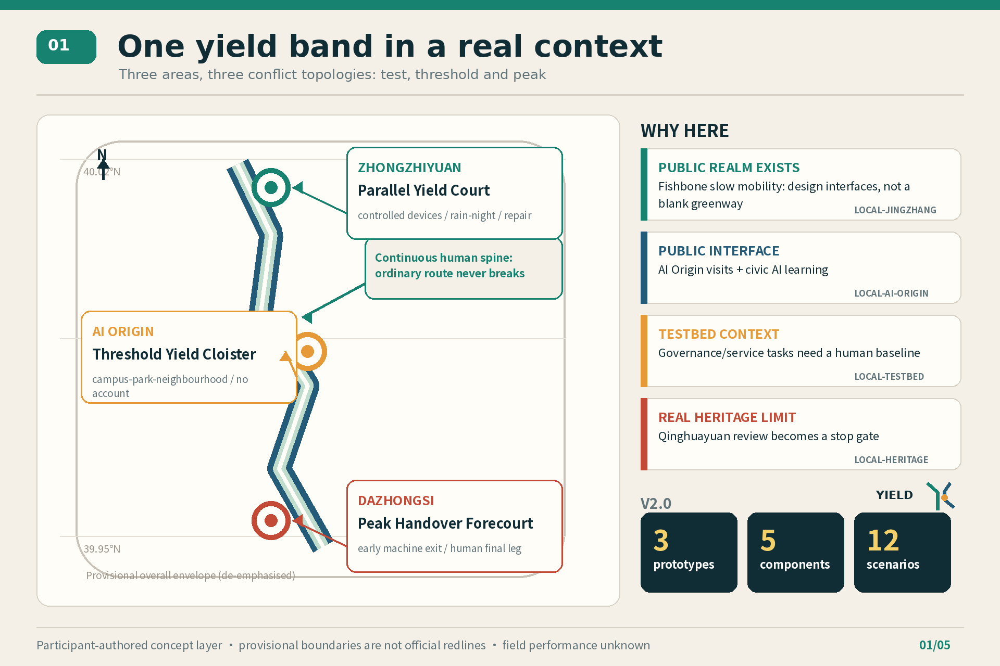
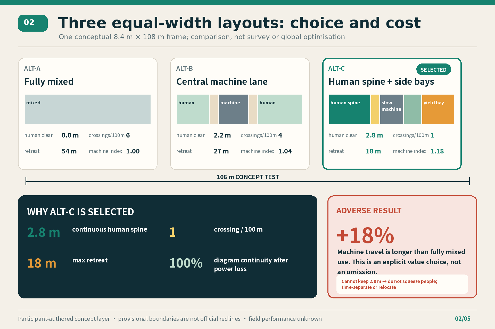
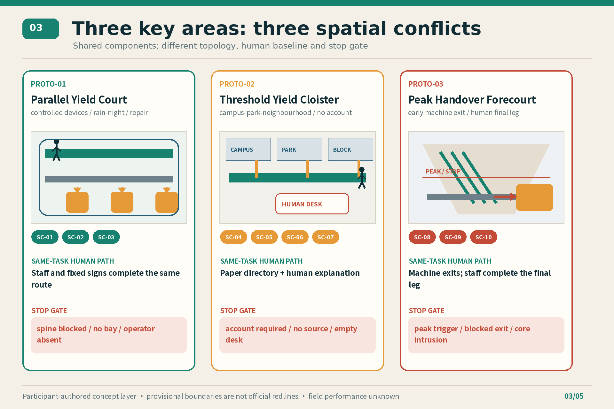
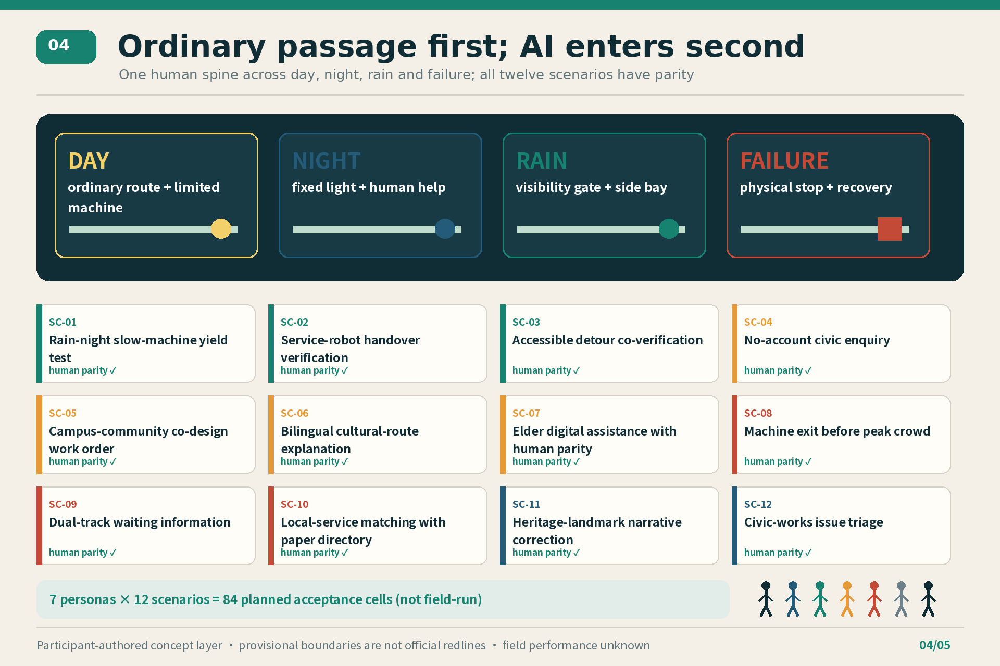
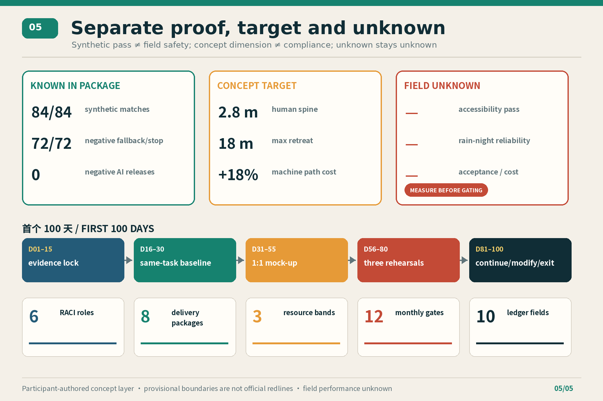

# JINGZHANG YIELD v2.0 / 京张让路 v2.0

> In an AI city, machines learn to yield first.  
> 在 AI 城市里，机器先学会给人让路。

## 60-second review summary

| Review question | v2.0 answer |
| --- | --- |
| What is original? | This is not another “smart corridor”. Five physical components share one public ground plane: a **continuous human spine, slow-machine band, side yield bay, staffed handover desk, and physical stop/recovery marker**. Machines must move sideways out of the way; the ordinary human route stays continuous. |
| Why here? | The Jing-Zhang heritage public realm already has north-south and east-west slow-mobility connections; AI Origin has hosted public visits and civic AI learning; Haidian has publicly described real-world urban-governance and public-service testing; the former Qinghuayuan Station has a real heritage protection boundary. The proposal therefore designs the interface between existing public space and AI testing rather than drawing a blank technology city inside a provisional outline. [source:LOCAL-JINGZHANG-PHASE2-20260713] [source:LOCAL-AI-ORIGIN-PUBLIC-OPENING-20260806] [source:LOCAL-CIVIC-AI-CLASS-20260803] [source:LOCAL-HAIDIAN-REALWORLD-TESTBED-20260724] [source:LOCAL-QINGHUAYUAN-HERITAGE-CONTROL-20260214] |
| What changes physically? | Zhongzhiyuan becomes a Parallel Yield Court; AI Origin a Threshold Yield Cloister; Dazhongsi a Peak Handover Forecourt. These are three different conflict topologies: controlled testing, campus-park-community thresholds, and machine exit before peak crowds. |
| What is auditable? | Within one conceptual 8.4 m by 108 m test frame, fully mixed, central-machine-lane and continuous-human-spine layouts are compared. The selected layout keeps a 2.8 m human spine, one crossing per 100 m and an 18 m maximum retreat distance, but its machine path index is 18% worse than the mixed option. Twelve contracts × seven conditions produce 84 synthetic rehearsals: 84/84 match expectation, 72/72 negative cases fall back or stop, and no negative case continues AI operation. [metric:layout_alternative_count] [metric:machine_path_penalty_ratio] [metric:yield_tabletop_fixture_count] |
| What remains unknown? | Official overall and key-area polygons, roads, ownership, heritage and utility baselines, surveyed clear widths, real-user acceptance, rain-night reliability, cost and authorised operators all remain unknown. A tabletop result is not field safety or public acceptance. [metric:floor_area_ratio] [metric:field_public_acceptance_ratio] |

The adverse result is retained rather than hidden: ALT-C makes machine travel 18% longer. It buys a continuous human route, a physical retreat position and an ordinary public space that still works after power loss. If field survey cannot preserve the 2.8 m spine, or if detour pressure creates a new hazard, the rule is not to squeeze people: operation drops to time-separated L1 service or the machine route moves. [data:visual/assets/v2/layout-comparison.json#ALT-C] The 2.8 m, 8.4 m and 108 m values are participant-authored comparison parameters, not surveyed dimensions, accessibility certification, fire review or approved sections. [metric:selected_protected_human_width_m]

Human priority is tested through five questions: can the same task be completed without an account, network or electricity; can a machine reach a side bay within 18 m; can on-site staff stop it physically; how quickly does ordinary service recover; and who may continue, modify or retire the scenario? Space, service contracts, implementation packages and the annual ledger all answer these questions.

## Design Basis and Source List

The official announcement, structured site package and agent taskbook define the task boundary. [source:OFFICIAL-ANNOUNCEMENT] [source:SITE-PACKAGE] [source:AGENT-TASKBOOK] The announcement supports the three scope levels, three key areas, professional outputs and approximate-area context. GitHub attribution, six agent tasks, bilingual delivery and the open workflow come from the repository taskbook; none is presented as government-issued professional bidder status for MatchA040508. The processed fact pack remains a navigation aid, not a new authority. [source:PROCESSED-FACT-PACK]

The overall area and three key areas still use organiser-supplied rough provisional geometry. [source:BOUNDARY-SOURCE] [source:KEY-AREA-SOURCE] Every boundary remains `official_boundary=false` and is used only for concept generation, topology checks and review orientation. The calculated 11,412,825.386 sqm site area and the illustrative green/public-space ratios are not existing-condition findings, statutory controls or approvals. [data:geometry/site_boundary.geojson#SITE-001] [metric:site_area_sqm] When official boundaries, ownership, controls, roads, buildings, heritage or utilities arrive, all nine GeoJSON layers, 45 metrics, five figure pairs, HTML and PDFs must be regenerated together.

The standards chain has three levels: the announcement and taskbook define what to answer; public urban-design, regulatory-planning, land-use and design-depth references define evidence and professional handover; privacy, synthetic-content, accessibility and older-person references define what must be checked before deployment. [standard:PROJECT-OFFICIAL-ANNOUNCEMENT] [standard:PROJECT-AGENT-OPEN-CALL-TASKBOOK] [standard:MOHURD-URBAN-DESIGN-MEASURES] [standard:MOHURD-CONTROL-DETAILED-PLANNING] [standard:MNR-LAND-USE-CLASSIFICATION-GUIDE] [standard:MOHURD-ARCH-DESIGN-DEPTH-2016] The repository source registry anchors formal references; conceptual dimensions are never claimed as code compliance. [source:SOURCE-REGISTRY]

Five new local sources support only specific contexts: a completed public-realm and slow-mobility network, public access at AI Origin, civic AI courses, Haidian's real-world testbed direction, and the existence of a heritage protection/control boundary at Qinghuayuan Station. They do not provide redlines, operating authority or design approval. No webpage map, photograph or graphic is copied.

## Three-Level Scope Framework

The strategic scope asks how a world-class AI ecosystem is formed; the overall design scope asks how industry, renewal, mobility, blue-green systems and public service become a recoverable urban belt; the key areas ask which physical and operational contracts can be tested first. [depth:three_level_scope_framework] Strategy must reach a spatial carrier, the carrier must reach a package with stop conditions, and evidence from a pilot must return to the public ledger and the next planning round.

The three strategic positions become public commitments: a global AI innovation origin must allow research to enter real but controlled problems; a future AI-city demonstrator must retain ordinary services independent of models; a Centennial Jing-Zhang pilgrimage place must put culture, correction and public memory before product display. Five functions are innovation, industry service, scenario validation, public life and cultural communication. Three zones and two wings form a loop: Zhongzhiyuan tests full-stack devices; AI Origin connects campus, park and neighbourhood; Dazhongsi handles industrial, consumer and transport handover; the Zhongguancun service wing supplies legal, standards, finance and international interfaces; the Xiaoyue River scenario wing converts ecology and everyday issues into controlled tasks.

The structure is “one yield band, three conflicts, five components, twelve scenarios”. The five components are a conceptual 2.8 m human spine, 0.6 m tactile/safety buffer, 1.6 m slow-machine band, 1.2 m green/furniture buffer and 2.2 m side yield/handover bay, totalling 8.4 m. [metric:physical_component_count] Each key area uses a 108 m reference for comparison, but professional teams must remake all locations and dimensions from survey. [metric:comparison_segment_length_m] [metric:comparison_total_width_m]

Three rules prevent machines taking over: the human spine is continuous and crossings are concentrated; conceptual bays at 36 m centres limit one-way retreat to 18 m; and network loss, power loss, operator absence, data-scope breach or obstruction stops the machine and restores the same-task human route. [metric:selected_crossings_per_100m] [metric:selected_max_yield_distance_m] [metric:selected_emergency_path_continuity_ratio] These are design hypotheses, not roads or engineering alignments. [data:geometry/roads.geojson#ROAD-001]

## Coordinated Research Area: Industry and Future City Research

The ecosystem is “four chains and one commons”: research outcomes, open-source collaboration, enterprise validation and everyday talent life share a civic testing commons. Land provides reversible windows; space provides separation and handover; industry supplies cleared real tasks; resources enter only after authorisation through L1/L2/L3 bands; talent joins through courses and open contributions; compute handles only contract-permitted tasks; data has purpose, scope and deletion records; and a scenario opens only with a same-task human baseline and exit rule.

Eight global cases contribute mechanisms, not transferred numbers or policies: Singapore one-north for research-enterprise-life proximity; Helsinki Mobility Lab for multi-party urban testing; Barcelona 22@ material for innovation-district economic transformation; Seoul AI Hub for public organisation of talent and R&D services; Station F for co-located startup support; Mila for research-industry partnership; London Knowledge Quarter for knowledge-cultural alliances; and a Cambridge Kendall Square study for anchors, walking and public space. [source:CASE-ONE-NORTH] [source:CASE-HELSINKI-MOBILITY-LAB] [source:CASE-BARCELONA-22AT] [source:CASE-SEOUL-AI-HUB] [source:CASE-STATION-F] [source:CASE-MILA] [source:CASE-KNOWLEDGE-QUARTER] [source:CASE-KENDALL-SQUARE] Local translation binds “can test” to “can yield, stop and recover”. [metric:global_case_count]

Local evidence sharpens the brief. Because the Jing-Zhang phase-two public realm already supports walking, cycling, children, nature learning and exercise, v2 designs machine interfaces with existing public life rather than a generic green stripe. Because AI Origin already has visitor and public-learning contexts, the cloister serves visitors, residents and low-digital-literacy users, not developers alone. Haidian's public testbed context requires auditable governance and public-service contracts. Qinghuayuan heritage information makes heritage review a stop gate rather than styling. [metric:local_official_context_source_count]

Regional collaboration defines task interfaces that still require authorisation; it does not claim an existing agreement. The Beiwei Community interface would collect ordinary-passage, older-person and accessibility feedback. Future Science City and Huairou Science City would exchange research questions, test methods and failure cases. Beijing E-Town would connect device manufacturing, maintenance and supply-chain traceability. A Beijing-Tianjin-Hebei interface would share bilingual scenario cards, same-task baselines and exit-capable protocols without pooling personal trajectories across regions. [source:AGENT-TASKBOOK] Each interface must reconfirm a named actor, cleared data, a time window and an exit condition or remain a research suggestion.

The name remains **JINGZHANG YIELD / 京张让路**. The identity combines a continuous “human line” and a machine line that steps aside to form Y. Paper white is ordinary service, rail blue an accountable chain, signal green limited passage, and heritage red stop/handover. The human line is never cut. The project identity remains separate from cultural wayfinding and uses no company mark, Octocat, portrait or uncleared font. The international line is: **In an AI city, machines learn to yield first.**

| Agent task | Visible v2.0 output |
| --- | --- |
| agent.1 overall concept | Name, identity, three positions/five functions, three zones/two wings, yield band and three-layout comparison |
| agent.2 AI ecosystem | Eight cases, four chains/one commons, eight enabling factors and zone/wing interfaces |
| agent.3 AI+ scenarios | Twelve contracts, three validation scenarios, seven personas, 84-cell acceptance plan, human/data/stop/recovery fields |
| agent.4 public space | Five-component library, three non-isomorphic prototypes, three reversible landmarks and a correctable credit system |
| agent.5 cultural narrative | Track-signal-platform-handover story, bilingual wayfinding, source/correction cards and international line |
| agent.6 long-term operation | Eight packages, First 100 Days, six-role RACI, twelve-month gates and ten-field annual ledger |

## Overall Design Area: Urban Renewal and Regulatory-Plan-Level Urban Design

The overall design does not treat the provisional boundary as empty land awaiting colour. It treats the formed public realm, park thresholds, peak movement and heritage limits as four existing constraints. A continuous ordinary route organises the spatial skeleton while machine interfaces move to the side. The three key areas divide conflict into parallel testing, threshold switching and peak exit; links among Zhongzhiyuan, AI Origin and Dazhongsi remain conceptual and do not invent road redlines, rail alignments or permanent buildings. [depth:overall_spatial_structure] The differentiating mechanism is “machine steps aside, ordinary route stays continuous, physical stop gate, same-task recovery”. It is not an equipment platform or a mixed-traffic model; it joins section design, service contracts and exit governance into one reversible urban-design system.

At the overall scale, the decision order is to prove the same-task human route, then select reversible components and machine windows, and only then discuss device scale. Seven design/constraint layers and two scope layers express land use, buildings, roads, green space, public space, constraints and phasing. Every area or ratio derived from provisional geometry is only an internal package-consistency result. [data:geometry/site_boundary.geojson#SITE-001] If official boundaries, ownership, heritage, utilities, mobility or building surveys change, the layout, metrics, packages, figures and implementation order must be recalculated together. [depth:existing_conditions_diagnosis]

## Land Use, Building Scale, and Retain-Renovate-Demolish Strategy

The renewal sequence is evidence lock, same-task baseline, 1:1 reversible mock-up, three limited windows, then renew/modify/exit. Four conceptual land-use families test functional relationships without becoming statutory parcels. [data:geometry/land_use.geojson#LU-001] Public classification vocabulary informs later work, while legal use, boundary, development rights and capacity remain within formal procedure. [source:DATA-SRC-MNR-LAND-USE-CLASSIFICATION-202311]

The building layer checks conceptual carrying capacity only. Its 310,807.184 sqm illustrative footprint is neither survey nor a retain/demolish instruction. [data:geometry/buildings.geojson#BLDG-001] [metric:building_footprint_area_sqm] A later building-by-building retain-renovate-demolish register must include ownership, structure, heritage, use, fire, accessibility, carbon and cost evidence. [depth:retain_renovate_demolish] FAR, height, density, setbacks, parking and utility capacity remain unknown. [depth:development_intensity_controls] [depth:height_massing_character]

| Metric | ALT-A fully mixed | ALT-B central machine lane | ALT-C human spine + side bays |
| --- | ---: | ---: | ---: |
| Protected continuous human width (concept) | 0.0 m | 2.2 m | **2.8 m** |
| Human-machine crossings per conceptual 100 m | 6 | 4 | **1** |
| Maximum retreat distance | 54 m | 27 m | **18 m** |
| Human continuity after power loss | 0% | 50% | **100%** |
| Machine path index | **1.00** | 1.04 | **1.18 (worst)** |

ALT-C reduces conceptual crossings by roughly 83% compared with fully mixed use but increases machine travel by 18%. [metric:selected_machine_path_index] This adverse result is accepted because the objective protects ordinary passage and recoverability first. If the operating objective changes to machine-scale efficiency, another option may win. Three points are not a global optimisation proof; they make the value choice auditable.

The package contains seven design/constraint layers and two scope layers. [depth:land_use_layout] [depth:overall_spatial_structure] Connections are concepts for professional study, not road redlines, rail alignments, bridges, tunnels, utilities or underground engineering. [depth:existing_conditions_diagnosis]

## Detailed Design of Key Areas

**PROTO-01 Zhongzhiyuan Parallel Yield Court** places the human spine and slow-machine band side by side across a controlled 108 m reference. Side bays handle retreat, maintenance, charging isolation and staffed cart handover. Rain, night, network loss, full load and staff absence enter rehearsals. A Human-First Signal displays only test window, stop state and responsible role. It stops when the spine is obstructed, a machine cannot reach a bay, staff are absent or visibility fails. [data:geometry/key_areas.geojson#PROV-KEY-001]

**PROTO-02 AI Origin Threshold Yield Cloister** places no-account enquiry, a paper directory, staffed explanation, bilingual culture and elder assistance together at campus-park-community interfaces. AI is an optional layer, not the price of entry. A Threshold Y Cloister shows versions, sources, corrections and the human entrance. It stops when an account becomes mandatory, a source is missing, the desk is empty or the translation changes meaning. [data:geometry/key_areas.geojson#PROV-KEY-002]

**PROTO-03 Dazhongsi Peak Handover Forecourt** removes machines before the peak crowd core and hands objects or information to people at the edge. Waiting information appears through timestamped AI text, a staffed board and fixed signs. A Handover Clock shows exit windows, staffing and recovery. It stops when a peak threshold triggers, an exit is blocked, a machine enters the core or handover fails. [data:geometry/key_areas.geojson#PROV-KEY-003]

All three use the five components, but their topologies differ: parallel testing in the north, threshold switching in the middle, peak exit in the south. [depth:three_key_area_detailed_design] The three landmarks begin as reversible, non-infrastructure elements and require ownership, accessibility, fire, heritage, traffic and public review.

## AI Innovation Ecosystem, Personas, and AI+ Scenarios

Seven personas are acceptance lenses, not interviewed populations: an older local resident; a wheelchair, low-vision or mobility-limited user; a person without a smartphone or with low digital literacy; a student/researcher/developer; a district worker/small enterprise/service worker; a commuter/visitor/child/carer; and frontline operation, cleaning, security and emergency staff. [metric:persona_count] Each has a rejection condition: account-gated ordinary service, obstruction of the human spine, machine-made peak crowding or recovery that depends on a remote vendor.

| Scenario | Spatial prototype | Same-task human/low-tech route | Primary stop |
| --- | --- | --- | --- |
| SC-01 rain-night slow-machine test* | Parallel Court | Machines off; staff, fixed light and paper signs | Spine blocked, poor visibility, no bay |
| SC-02 service-robot handover* | Parallel Court | Staff cart to the same desk | No staff, token mismatch, conflict |
| SC-03 accessible detour co-verification* | Parallel Court | Staff patrol, fixed help and paper map | Unchecked route, unknown width, conflict |
| SC-04 no-account civic enquiry | Threshold Cloister | Paper directory, fixed map, staffed desk | No source, out-of-scope answer, login |
| SC-05 campus-community work order | Threshold Cloister | Recorder logs and routes a paper form | No receiver, sensitive content, auto-dispatch |
| SC-06 bilingual cultural route | Threshold Cloister | Bilingual sign, leaflet and guide | Unsourced history, meaning drift, rights gap |
| SC-07 elder assistance with parity | Threshold Cloister | Staff, telephone and paper instruction | Confusion, high consequence, credentials |
| SC-08 machine exit before peak | Handover Forecourt | Staff cart at edge, final leg on foot | Peak trigger, blocked exit, core intrusion |
| SC-09 dual-track waiting information | Handover Forecourt | Board, fixed signs and announcement | Stale or inconsistent information |
| SC-10 local-service matching | Handover Forecourt | Same-category paper directory and staff | Hidden paid ranking, stale listing |
| SC-11 heritage narrative correction | Landmark route | Source plaque, paper correction, contact | Source conflict, rights gap, no expert |
| SC-12 civic-works triage | Stewardship desk | Telephone, paper work order, staffed desk | No receiver, emergency, sensitive data |

The asterisk marks three conceptual industry-validation scenarios, not approved or accredited facilities. [metric:industry_validation_scenario_count] All twelve specify a same-task human route, proposed operator, stop and recovery fields. [metric:scenario_contract_count] [metric:same_task_human_baseline_coverage_ratio] [metric:operator_role_coverage_ratio] [metric:stop_recovery_coverage_ratio] Twelve × seven creates 84 planned acceptance cells, not completed co-design. [metric:scenario_persona_acceptance_cell_count]

The offline script runs one normal and six negative cases per scenario: no account, network loss, human takeover request, data-scope breach, human-spine obstruction and operator absence. All 84 decisions match the declared contract; all 72 negative cases fall back or stop; zero negative case continues AI. [metric:yield_tabletop_negative_fixture_count] [metric:yield_tabletop_unsafe_release_count] [metric:yield_tabletop_pass_ratio] This proves closure of participant-authored rules under synthetic input only, not model capability, field safety, accessibility, utility or public acceptance.

Privacy, generative-AI governance, synthetic-content labelling and GB 45438-2025 are applicability references for deployment review. [source:DATA-SRC-PIPL-2021] [source:DATA-SRC-GENERATIVE-AI-INTERIM-MEASURES] [source:DATA-SRC-AI-GENERATED-CONTENT-LABELING-2025] [source:DATA-SRC-GB-45438-2025] The proposal neither claims every scenario is automatically subject to the same provision nor equates compliance with project approval.

## Blue-Green Network, Public Space, and Urban Character

The published phase-two Jing-Zhang public realm includes a fishbone slow-mobility network connecting walking, cycling, children, nature learning and exercise. [source:LOCAL-JINGZHANG-PHASE2-20260713] v2 therefore uses “continuous ordinary route + side machine interface”. Landscape, shade, seating and culture are not long-term equipment storage; machine docking, charging, maintenance and sensing remain lateral, limited and removable. Ordinary signs, lighting and human help work first in night, rain and failure.

The three pilgrimage landmarks mean “see priority, cross a threshold, complete a handover”. Each includes a source plaque, version, correction card and ordinary service entrance. The credit system records proposal path, version, contribution and licence, not behavioural scores, and permits correction or withdrawal. Rail, signal, platform and handover become civic responsibility rather than decorative nostalgia. [depth:blue_green_public_space]

The Beijing Cultural Heritage Bureau page confirms a protection boundary and construction-control zone for the former Qinghuayuan Station. The proposal does not digitise an authoritative polygon from webpage text or propose permanent construction there. [source:LOCAL-QINGHUAYUAN-HERITAGE-CONTROL-20260214] Any affected work stops at G0 pending authoritative GIS, professional review and approval.

## Transport, Rail, Municipal Infrastructure, and Public Services

Movement priority is walking, wheelchair and emergency ordinary paths; then cycling and staffed service; then time-limited slow machines. Conceptual links do not alter road redlines, rail protection or bridge/tunnel design. [depth:traffic_rail_slow_parking] Parking, loading, fire access, station connection and peak flow require formal survey and professional review. [data:geometry/roads.geojson#ROAD-001]

Intelligent infrastructure is minimum, lateral, stoppable and removable. Local physical stop outranks cloud control; public information has fixed and staffed versions; sensing collects anonymous task state only; logs separate service, appeal and safety purposes and expire; face identification, cross-site tracking and automatic enforcement are excluded. Utilities, power, communications, drainage, lighting and fire capacity remain unknown, so L2/L3 cannot become permanent design. [depth:municipal_new_infrastructure]

The Barrier-Free Environment Law and GB 55019-2021 inform later professional review, but this package does not claim that its 2.8 m concept line has passed compliance. [source:DATA-SRC-BARRIER-FREE-ENVIRONMENT-LAW] [source:DATA-SRC-GB55019-2021] Parallel smart and traditional service is informed by older-person policy, while actual duty requires an authorised operator. [source:DATA-SRC-ELDERLY-SMART-TECH-PLAN-2020-45]

## Renewal Projects, Implementation Policy, and Phasing

The First 100 Days are five exit-capable work packages, not a construction countdown: D01–15 locks evidence; D16–30 creates paper, on-site and no-device same-task baselines; D31–55 builds one reversible 1:1 reference mock-up; D56–80 rehearses network loss, error, staff absence, rain-night and peaks; D81–100 records continue/modify/exit. [metric:first_100_day_work_package_count] Missing ordinary routes, named responsibility, maintenance resources or retirement stops the sequence.

Phase evaluation metrics include ordinary-route clear width, human-baseline completion ratio, stop-to-recovery time, complaint-closure ratio, event counts and maintenance feedback. An authorised operator must monitor these field indicators by scenario; package-level synthetic rehearsals cannot replace them. Community and accessibility groups join acceptance, the site operator owns routine stop/recovery, and professional teams review space and data.

Six suggested roles are authorised planning lead, site operation, university/industry test, community/accessibility panel, safety/rights review and heritage/public-realm professional. [metric:raci_role_count] Community/accessibility holds accountability for ordinary route and acceptance; professional/test roles deliver AI contracts; site operation owns daily stop and restoration. These are role types, not appointments.

Eight packages cover the three prototypes, human-spine marking, twelve service contracts, public error/retirement ledger, Yield School/annual drills, and first-year observation/recalculation. [metric:implementation_package_count] Each has an authorisation boundary, relative L1/L2/L3 resource band, entry, stop and restoration. Resource bands are not currency estimates or funding promises. [metric:resource_band_count]

The twelve-month cycle runs evidence, baseline, section review, mock-up, power/network loss, public acceptance, limited window, rain-night-peak, complaint/recovery, maintenance/cost, renewal draft and annual decision. [metric:annual_program_month_count] A ten-field public ledger records scenario, site/operator, human baseline, data scope, accessibility findings, incidents, takeover/recovery, complaint resolution, renew/modify/exit and next review/expiry. [metric:public_ledger_field_count] It excludes personal data, trade secrets, security details and chain of thought. [depth:phasing_implementation]

Long-term activity includes Yield School civic classes, developer negative-test days, three-site takeover drills, public ledger review and an international Open Yield Review. AI Origin's civic-learning context is relevant, but the reported 108 citywide courses are not turned into a promised project schedule. [source:LOCAL-CIVIC-AI-CLASS-20260803]

## Metrics, Area Recalculation, and Compliance Matrix

Forty-five metrics form three groups. Package-recalculable spatial/task quantities include provisional site, illustrative building, green/public-space ratios, three key areas, twelve nodes, three landmarks and three validation scenarios. [metric:green_ratio] [metric:public_space_ratio] [metric:key_area_count] [metric:scenario_node_count] [metric:landmark_count] Design/protocol evidence includes three prototypes, five components, three layouts, the 108 m/8.4 m frame, 2.8 m spine, one crossing, 18 m retreat, diagrammatic continuity, 1.18 machine index, twelve contracts, seven personas, 84 cells, 84 rehearsals, eight packages, five 100-day blocks, six roles, three resource bands, twelve months and ten ledger fields. [metric:spatial_prototype_count] [metric:scenario_persona_acceptance_cell_count] Field outcomes remain unknown: ordinary-service wait, stop-to-recovery, accessible route, no-account completion, near misses, rain-night result and public acceptance. [metric:field_human_wait_seconds] [metric:field_recovery_seconds] [metric:field_accessible_route_pass_ratio] [metric:field_no_account_completion_ratio] [metric:field_near_miss_count] [metric:field_rain_night_pass_ratio]

Site, green, public space and building footprints share one EPSG:4548 consistency function; algorithmic consistency does not make the source authoritative. [depth:metrics_recalculation] Official geometry must replace scope layers first, followed by land use, buildings, roads, green, public space, constraints, phasing, metrics and every visual.

The compliance matrix covers announcement 1.3–1.5 and agent.1–agent.6; the standard matrix covers six references; the depth matrix covers fifteen professional items. [depth:renewal_project_list] The 2016 design-depth reference guides handover only and does not give this proposal a seal or construction-document status. [source:DATA-SRC-MOHURD-ARCH-DESIGN-DEPTH-2016]

The figure separates known package facts, conceptual design targets and field unknowns. 84/84 is a synthetic rule result; 2.8 m is a concept target; zero field incident, public acceptance, accessibility pass and cost have no value. Four machine gates prove internal package structure, not construction feasibility, approval or safety.

## Risk, Copyright, and Compliance

The highest risk is data precision and misplaced authority: official scopes, roads, ownership, buildings, heritage, utilities, services and cost are incomplete. [depth:risk_missing_data] Approximate announcement areas describe task scale only; provisional polygons, lines, sections and ratios cannot support approval, land acquisition, construction, investment or “implemented” publicity.

The second risk is AI capture of ordinary service. Controls are same-task human/paper routes, no account, physical stop, accountable role, appeal, rollback, deletion and annual retirement. Emergencies, important legal/financial consequences, missing sources, data-scope breaches, automatic adverse decisions or unavailable human channels stop AI. Deployment owners must test privacy, notice/consent, retention/deletion, labelling and cybersecurity obligations under then-applicable law.

The third risk is spatial and cultural harm. Unresolved walking, fire, accessibility, peak flow, stormwater, night noise, heritage or existing-facility conditions block L2/L3. Heritage polygons are not recreated from webpage prose; private buildings and marks are not appropriated; a landmark never displaces ordinary passage.

Text, structured data, programmatic figures, HTML and PDFs are AI-assisted original work for this submission. External announcements, law, standards and case pages retain their rights. Noto Sans CJK SC is used for local rasterisation and embedded PDF subsets under SIL Open Font License 1.1. [source:ASSET-NOTO-CJK-SC] No peer proposal visual, text, data or design is copied; no webpage photograph, remote tile, company logo, portrait, private or non-public data is used. Offline HTML has no CDN, remote script/font/API, iframe or form.

This is an open co-creation proposal. Every spatial, operational, branding and policy item is a concept suggestion, reference option or material for professional deepening. It is not a statutory plan, government decision, procurement, investment, construction, operation or certification.

## References

Project/repository sources: announcement, site package, taskbook, source registry, fact pack and provisional scopes. [source:OFFICIAL-ANNOUNCEMENT] [source:SITE-PACKAGE] [source:AGENT-TASKBOOK] [source:SOURCE-REGISTRY] [source:PROCESSED-FACT-PACK] [source:BOUNDARY-SOURCE] [source:KEY-AREA-SOURCE]

Planning/design sources: urban design measures, regulatory-planning approval measures, land/sea-use classification guide and 2016 architectural design-document depth reference. [source:DATA-SRC-MOHURD-URBAN-DESIGN-MEASURES] [source:DATA-SRC-MOHURD-CONTROL-DETAILED-PLANNING] [source:DATA-SRC-MNR-LAND-USE-CLASSIFICATION-202311] [source:DATA-SRC-MOHURD-ARCH-DESIGN-DEPTH-2016]

AI, rights and inclusion sources: interim generative-AI measures, synthetic-content labelling measures, GB 45438-2025, PIPL, Barrier-Free Environment Law, GB 55019-2021 and older-person smart-technology plan. [source:DATA-SRC-GENERATIVE-AI-INTERIM-MEASURES] [source:DATA-SRC-AI-GENERATED-CONTENT-LABELING-2025] [source:DATA-SRC-GB-45438-2025] [source:DATA-SRC-PIPL-2021] [source:DATA-SRC-BARRIER-FREE-ENVIRONMENT-LAW] [source:DATA-SRC-GB55019-2021] [source:DATA-SRC-ELDERLY-SMART-TECH-PLAN-2020-45]

Publishers, URLs, dates, uses and limitations for five 2026 local sources and eight global cases are in `sources.json`. Machine paths for figures, metrics and assumptions are in `manifest.json`. This version is dated 2026-08-21 and must be revalidated when pages, policy, taskbook or schema changes.
