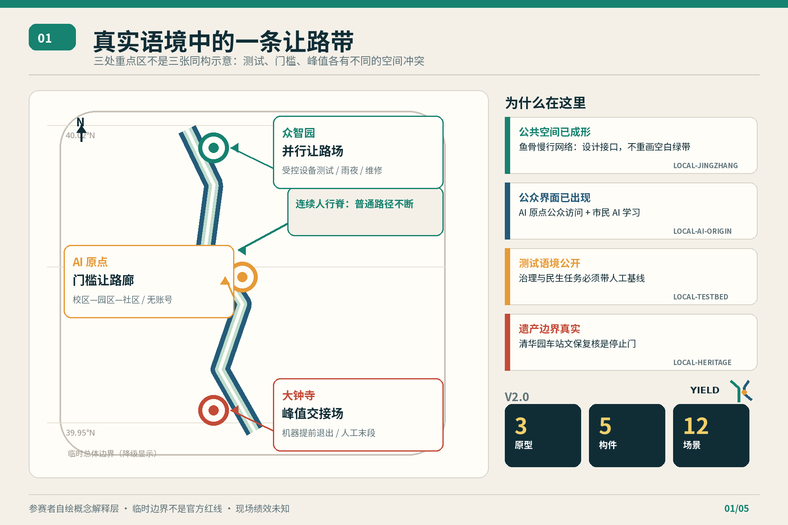
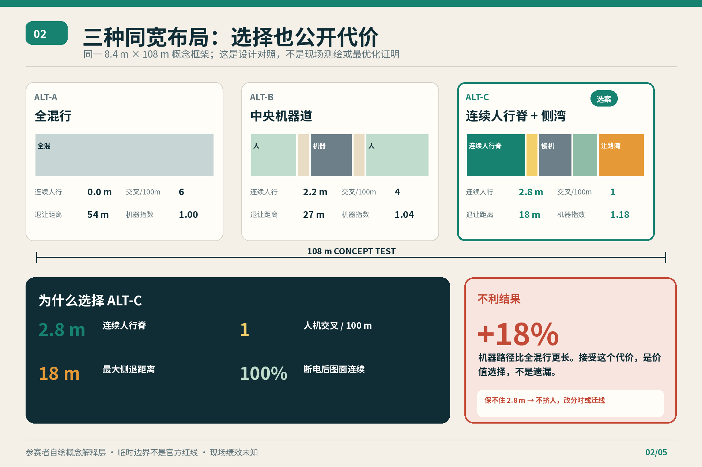
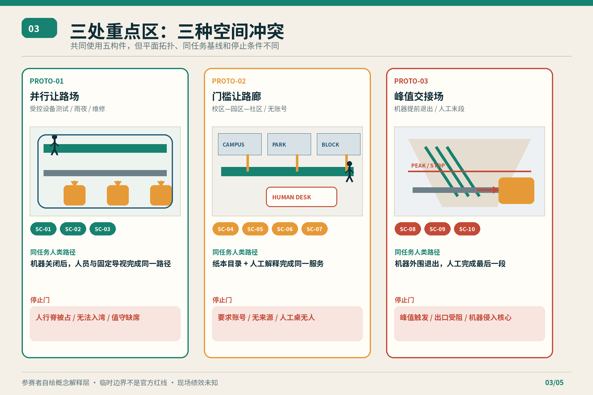
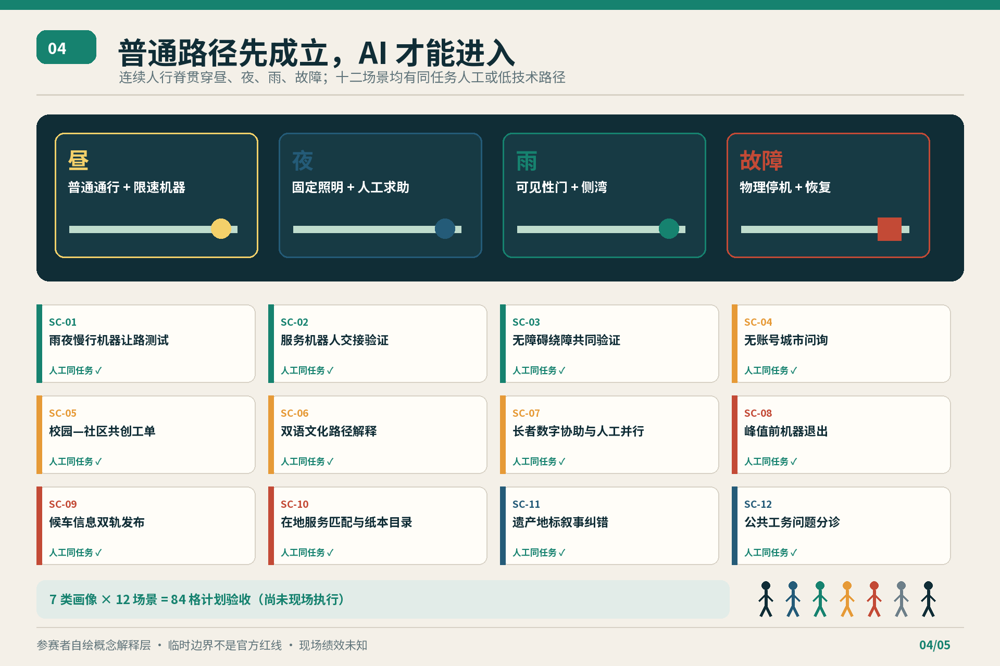
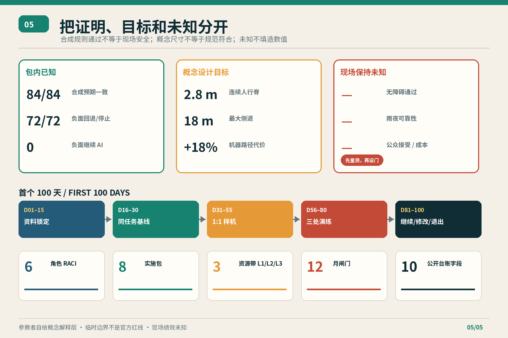

# 京张让路 v2.0 / JINGZHANG YIELD v2.0

> 在 AI 城市里，机器先学会给人让路。  
> In an AI city, machines learn to yield first.

## 60 秒评审摘要

| 评审问题 | v2.0 的回答 |
| --- | --- |
| 原创机制是什么？ | 不是再做一条“智慧走廊”，而是在同一公共地面内设置**连续人行脊、慢速机器带、侧置让路湾、人工交接台、物理停止/恢复标记**五件实体构件。机器必须侧向退出，人类普通路径不断。 |
| 为什么在京张？ | 京张遗址公共空间已形成南北联通、东西联动的慢行语境。[source:LOCAL-JINGZHANG-PHASE2-20260713] AI 原点已有公众开放与市民 AI 学习活动。[source:LOCAL-AI-ORIGIN-PUBLIC-OPENING-20260806] [source:LOCAL-CIVIC-AI-CLASS-20260803] 海淀公开提出城市治理、民生服务实景测试。[source:LOCAL-HAIDIAN-REALWORLD-TESTBED-20260724] 清华园车站旧址存在真实文保边界。[source:LOCAL-QINGHUAYUAN-HERITAGE-CONTROL-20260214] 方案因此设计“现有公共空间与 AI 测试如何交接”，而不是把临时边界画成空白新城。 |
| 空间上改变什么？ | 众智园做“并行让路场”，AI 原点做“门槛让路廊”，大钟寺做“峰值交接场”；三者不是同一张图换标题，而分别解决受控测试、校园—园区—社区门槛、峰值人群前机器退出。 |
| 有什么可复核证据？ | 同一 8.4 米、108 米概念测试框架比较全混行、中央机器道、连续人行脊三种布局；选案保留 2.8 米人行脊、每百米 1 次交叉、18 米最大让路距离，但机器路径指数比全混行高 18%。另有 12 份场景合同 × 7 条条件 = 84 条合成桌面演练，84/84 与预期一致，72/72 负面条件回退或停止，0 条负面用例继续 AI 放行。[metric:layout_alternative_count] [metric:machine_path_penalty_ratio] [metric:yield_tabletop_fixture_count] |
| 什么仍未知？ | 正式总体边界、三处重点区 polygon、道路/权属/文保/市政底数、现场净宽、真实用户接受度、雨夜可靠性、成本和运营主体均未知；桌面测试不等于现场安全或公众认可。[metric:floor_area_ratio] [metric:field_public_acceptance_ratio] |

核心取舍是可见的：选案把机器路径变长 18%，并不宣称“所有指标最优”。它换来连续的人类优先路径、物理退出位和断电后的普通公共空间恢复。如果现场测量无法保住 2.8 米人行脊，或机器绕行造成新的不安全压力，规则不是压缩人行空间，而是降级为分时 L1 运营或迁移机器路线。[data:visual/assets/v2/layout-comparison.json#ALT-C] 2.8 米、8.4 米和 108 米均为参赛者提出的概念对照参数，不是测绘值、无障碍认证、消防结论或已批准断面。[metric:selected_protected_human_width_m]

本成果把“人优先”从价值宣言转成五个可问的问题：人是否有不依赖账号、网络或电力的同任务路径；机器能否在 18 米内退出；现场人员能否物理停机；普通服务多久恢复；谁有权决定继续、修改或退出。空间、AI 服务合同、实施包和年度台账都围绕这五问组织。

## 设计依据与资料清单

任务边界来自公开征集公告、仓库结构化 site package 与面向智能体任务书。[source:OFFICIAL-ANNOUNCEMENT] [source:SITE-PACKAGE] [source:AGENT-TASKBOOK] 公告支撑三层范围、三处重点区域、专业成果和约面积语境；GitHub 署名、智能体六项任务、双语与开源工作流来自仓库任务书，不被表述为政府授予 MatchA040508 的正式投标身份。处理后事实包只作导航，不成为新的权威来源。[source:PROCESSED-FACT-PACK]

总体设计范围和三处重点区仍使用组织方提供的临时粗略几何。[source:BOUNDARY-SOURCE] [source:KEY-AREA-SOURCE] `official_boundary=false`，只用于概念生成、拓扑自检和审阅定位；11,412,825.386 平方米场地值、示意绿地率与公共空间率均由此派生，不是现状调查、法定指标或审批承诺。[data:geometry/site_boundary.geojson#SITE-001] [metric:site_area_sqm] 一旦正式边界、权属、控规、道路、建筑、文保或市政资料到位，九类 GeoJSON、45 个指标、五组图、HTML 与 PDF 必须成套复算。

专业标准链分三层：项目公告和智能体任务书规定“做什么”。[standard:PROJECT-OFFICIAL-ANNOUNCEMENT] [standard:PROJECT-AGENT-OPEN-CALL-TASKBOOK] 城市设计、控规与用地分类材料规定空间判断如何留证。[standard:MOHURD-URBAN-DESIGN-MEASURES] [standard:MOHURD-CONTROL-DETAILED-PLANNING] [standard:MNR-LAND-USE-CLASSIFICATION-GUIDE] 设计文件深度材料规定如何交接给后续专业团队。[standard:MOHURD-ARCH-DESIGN-DEPTH-2016] 个人信息、生成内容标识、无障碍与适老公开材料则用于部署前逐项适用性复核。标准登记由仓库来源注册表校核；本提案不把概念尺寸写成规范符合性结论。[source:SOURCE-REGISTRY]

五条新增在地来源只支撑具体语境：已完成公共空间与鱼骨慢行网络、AI 原点公众访问、市民 AI 课程、海淀实景测试方向、清华园车站旧址保护与建控边界的存在。它们不提供本项目红线、运营授权或设计批准；未复制网页地图、照片或图形。图面中的场地关系均为提交者自绘的概念解释层。

## 三层范围工作框架

统筹研究范围回答“怎样形成世界级 AI 创新生态”；总体设计范围回答“产业、更新、交通、蓝绿、公共服务如何组成一条可恢复的城市带”；重点区域回答“哪些实体空间和运营合同可以先被验证”。[depth:three_level_scope_framework] 三层通过一条证据链相连：战略判断必须落到空间载体，空间载体必须落到项目包与停止条件，试点结果又必须回写公共台账和下一轮规划。

三大定位被重新翻译为三种公共承诺：全球 AI 创新策源地需要允许研究进入真实但受控的问题；未来 AI 城市样板需要保留不依赖模型的普通服务；百年京张 AI 朝圣地需要把文化、纠错和公共记忆置于产品展示之前。五大功能对应创新策源、产业服务、场景验证、公共生活、文化传播。三区两翼形成闭环：众智园验证全栈与设备，AI 原点连接校区—园区—街区，大钟寺完成产业/消费/交通交接；中关村科技服务翼提供法务、标准、投融资与国际协作接口，小月河场景赋能翼把生态、社区与日常问题转成受控任务。

总体结构是“一条让路带、三种冲突、五件构件、十二场景”。一条带是不可被机器占用的连续人行脊；三种冲突是受控设备测试、门槛服务切换、峰值人群交接；五件构件是 2.8 米概念人行脊、0.6 米触觉/安全缓冲、1.6 米慢速机器带、1.2 米绿化/家具缓冲、2.2 米侧置让路/人工交接湾，合计 8.4 米概念参考宽度。[metric:physical_component_count] 三重点区均用 108 米参考段比较，但正式选址与尺寸须由专业团队根据实测条件重做。[metric:comparison_segment_length_m] [metric:comparison_total_width_m]

三条尺度规则避免机器反客为主：第一，人行脊连续，机器跨越点集中而非随机；第二，让路湾按 36 米中心间距概念布置，使最大单向退出距离为 18 米；第三，断网、断电、值守缺席、数据越界或人行脊被占时，机器停止并恢复人工同任务路径。[metric:selected_crossings_per_100m] [metric:selected_max_yield_distance_m] [metric:selected_emergency_path_continuity_ratio] 这些是对照用设计假设，不是既有道路或工程线位。[data:geometry/roads.geojson#ROAD-001]

## 统筹研究范围产业与未来城市研究

产业生态采用“四链一公地”：科研成果链、开源协作链、企业验证链、人才生活链，共同使用一套城市公共测试公地。土地提供可逆窗口，空间提供人机分离与交接，产业提供真实但清权的任务，资金在授权后按 L1/L2/L3 资源带进入，人才通过课程与开源贡献参与，算力只处理合同允许的最少任务，数据保留目的/范围/删除记录，场景以同任务人工基线和退出条件开放。

八个全球案例只提炼机制，不转移统计、政策或建筑形象。Singapore one-north 提示科研—企业—生活邻近。[source:CASE-ONE-NORTH] Helsinki Mobility Lab 提示真实城市中的多方测试。[source:CASE-HELSINKI-MOBILITY-LAB] Barcelona 22@ 相关市政材料提示创新区与经济转型。[source:CASE-BARCELONA-22AT] Seoul AI Hub 提示公共平台组织人才与研发服务。[source:CASE-SEOUL-AI-HUB]

Station F 提示创业支持共址。[source:CASE-STATION-F] Mila 提示研究—产业合作。[source:CASE-MILA] London Knowledge Quarter 提示知识与文化联盟。[source:CASE-KNOWLEDGE-QUARTER] Kendall Square 市政研究提示锚点机构、步行与公共空间的耦合。[source:CASE-KENDALL-SQUARE] 本地转译不是复制企业数量、税制或产值，而是把“能测试”与“能让路、能停、能恢复”绑定。[metric:global_case_count]

在地证据进一步收紧设计：京张二期已形成慢行与社区功能节点，所以方案不再画一条抽象绿色长带，而设计机器如何嵌入现有步行、骑行、儿童、植物科普和运动界面；AI 原点已有公众访问与市民课程，因此门槛廊必须面向访客、居民和低数字素养用户，而非只服务开发者；海淀实景测试语境要求把城市治理与民生任务放进可审计合同；清华园车站旧址文保信息使“遗产/公共空间专业复核”成为停止门，而非风格装饰。[metric:local_official_context_source_count]

区域协同只定义待授权的任务接口，不声称已有合作协议：北纬社区接口收集普通通行、长者与无障碍反馈；未来科学城与怀柔科学城接口交换研究问题、测试方法和失败案例；经开区接口面向设备制造、维修与供应链可追溯；京津冀接口输出双语场景卡、同任务基线和可退出协议，不跨区域汇集个人轨迹。[source:AGENT-TASKBOOK] 每个接口都必须由具名主体、清权数据、时间窗口和退出条件重新确认，否则只保留为研究建议。

品牌仍称“京张让路 / JINGZHANG YIELD”。Logo 方向是一条连续的“人线”与一条在节点处侧退的“机器线”，共同构成 Y：白/纸本米色代表普通服务，铁路钢蓝代表责任链，信号绿代表限定通行，遗产砖红代表停止与交接。人线永不被机器线截断；整体 Logo 与文化导视分开使用，不借用企业商标、GitHub Octocat、人物肖像或未经授权字体。国际传播句为：**In an AI city, machines learn to yield first.**

六项智能体任务的可交接成果如下：

| 任务 | v2.0 可见交付 |
| --- | --- |
| agent.1 总体概念 | 名称/英文名/Logo 方向、三定位五功能、三区两翼、一条让路带与三种布局对照 |
| agent.2 AI 生态 | 8 个案例、四链一公地、8 类要素与众智园—原点—科技服务翼接口 |
| agent.3 AI+ 场景 | 12 张合同、3 项产业验证、7 类画像、84 格验收矩阵、人工基线/数据/停止/恢复字段 |
| agent.4 公共空间 | 五构件组件库、三处非同构原型、三座可逆地标、公共荣誉与纠错机制 |
| agent.5 文化叙事 | “轨道—信号—站台—交接”叙事、双语导视、来源牌与纠错卡、国际传播句 |
| agent.6 长期运营 | 8 个实施包、首个 100 天、6 角色 RACI、12 月闸门、10 字段年度台账 |

## 总体设计范围城市更新与控规深度城市设计

总体设计不把临时边界当成等待填色的空地，而把已经形成的公共空间、园区界面、交通峰值和遗产限制视为四类既有约束。空间骨架由连续普通路径组织，机器接口退到侧边；三处重点区按“并行测试—门槛切换—峰值退出”分担冲突；众智园、AI 原点与大钟寺之间只建立概念协作关系，不擅自画设道路红线、轨道线位或永久建筑。[depth:overall_spatial_structure] 差异化机制是“机器侧退、普通路径不断、实体停止门、同任务恢复”：它不是设备平台或共享混行模式，而是把空间断面、服务合同与退出治理组成一套可逆城市设计体系。

总体层的判断顺序是先验证人类同任务路径，再选择可逆构件与机器窗口，最后才讨论设备规模。七类设计/约束图层和两类范围图层共同表达用地、建筑、道路、绿地、公共空间、约束与分期关系；任何从临时 geometry 派生的面积和比率都只用于包内一致性复算。[data:geometry/site_boundary.geojson#SITE-001] 如果正式边界、权属、文保、市政、交通或建筑调查改变，布局、指标、项目包、图件和实施顺序必须一起重算，不能只改数字或图例。[depth:existing_conditions_diagnosis]

## 用地、建筑规模与拆改留方案

更新路径不是先画永久建筑，而是“证据锁定—同任务基线—1:1 可逆样机—三处限定窗口—续期/修改/退出”。临时用地结构仍把范围分为 AI 研发创新、公园绿地与开敞空间、产业商业服务、社区服务配套四类概念区，用于检验功能关系，不作为法定地块。[data:geometry/land_use.geojson#LU-001] 用地分类词汇参考公开指南，但正式用途、边界、开发权和容量必须回到法定程序。[source:DATA-SRC-MNR-LAND-USE-CLASSIFICATION-202311]

建筑图层只用于检查概念承载关系，示意基底 310,807.184 平方米不代表现状测绘或具体拆改留。[data:geometry/buildings.geojson#BLDG-001] [metric:building_footprint_area_sqm] 正式深化需要逐栋建立 retain—renovate—demolish 台账，记录权属、结构、文保、使用、消防、无障碍、碳和成本证据。[depth:retain_renovate_demolish] 容积率、建筑高度、密度、退线、停车和市政容量保持 unknown。[depth:development_intensity_controls] [depth:height_massing_character]

三种同宽布局的结论不是主观偏好：

| 指标 | ALT-A 全混行 | ALT-B 中央机器道 | ALT-C 连续人行脊 + 侧湾 |
| --- | ---: | ---: | ---: |
| 受保护连续人行净宽（概念） | 0.0 m | 2.2 m | **2.8 m** |
| 人机交叉（每 100 m 概念布置） | 6 | 4 | **1** |
| 最大让路距离 | 54 m | 27 m | **18 m** |
| 断电后人行连续率 | 0% | 50% | **100%** |
| 机器路径指数 | **1.00** | 1.04 | **1.18（最差）** |

ALT-C 将概念人机交叉相对全混行减少约 83%，但机器路径增长 18%。[metric:selected_machine_path_index] 这项不利结果被保留，因为本方案的目标函数先保护普通通行和恢复能力；若后续运营目标改为设备规模效率，ALT-A 或 ALT-B 可能在某些指标更优，必须重新决策。三点比较不是全局最优化证明，只是把空间价值选择变成可复算问题。

总体设计图层由 land_use、buildings、roads、green_space、public_space、constraints、phasing 七类设计/约束图层与 site_boundary、key_areas 两类范围图层组成。[depth:land_use_layout] [depth:overall_spatial_structure] 图层中的连接只表示可供专业团队深化的概念建议，不是道路红线、轨道线位、桥隧、市政或地下工程结论。[depth:existing_conditions_diagnosis]

## 重点区域详细设计

**PROTO-01 众智园“并行让路场 / Parallel Yield Court”**：以受控 108 米参考段并列人行脊和慢速机器带，侧湾承担让路、维修、充电隔离与人工推车交接；雨、夜、网络丢失、设备满载、值守缺席均进入演练。地标“人先信号柱”只显示测试窗口、停止状态和责任角色，不显示个人轨迹。停止条件是人行脊被占、机器无法在 18 米内入湾、值守缺席或可见性失败。[data:geometry/key_areas.geojson#PROV-KEY-001]

**PROTO-02 AI 原点“门槛让路廊 / Threshold Yield Cloister”**：在校区—园区—街区界面把无账号城市问询、纸本目录、人工解释桌、双语文化路径和长者协助并排设置；AI 是可退出的附加层，不是进入公共服务的门票。地标“无门槛 Y 廊”把贡献版本、来源、纠错与人工入口放在同一界面。停止条件是账号成为必要条件、来源缺失、人工桌无人或双语含义不等价。[data:geometry/key_areas.geojson#PROV-KEY-002]

**PROTO-03 大钟寺“峰值交接场 / Peak Handover Forecourt”**：机器在峰值核心区之前退出，物品与信息在外围交给人；候车信息同时由带时间戳的 AI 说明、人工白板与固定导视发布。地标“交接钟”以普通钟面显示机器退出窗、人工值守和恢复状态。停止条件是峰值阈值触发、出口受阻、机器进入人群核心或人工交接失败。[data:geometry/key_areas.geojson#PROV-KEY-003]

三处共同使用五件实体构件，但空间拓扑和责任不同：北部“并行测试”，中部“门槛切换”，南部“峰值退出”。[depth:three_key_area_detailed_design] 三座地标均先采用可逆、非基础设施式构件，必须经过权属、无障碍、消防、遗产、交通和公众评审；不擅自改造企业建筑或文保环境。

## AI 创新生态、人才画像与 AI+ 场景

七类画像不是声称采访过的真实人群，而是验收视角：P1 周边长者居民；P2 轮椅、低视力或行动不便使用者；P3 无智能手机或低数字素养使用者；P4 学生、研究者与开发者；P5 园区工作者、小微企业与服务人员；P6 通勤者、游客、亲子与照护者；P7 一线运营、保洁、安保与应急人员。[metric:persona_count] 每类都拥有“拒绝条件”，例如账号成为普通服务前提、人行脊被占、峰值被机器制造停留、系统故障只能等待远程厂商。

十二项场景均包含空间、同任务人工基线、建议责任角色、最少数据、禁止数据、停止条件、恢复动作和现场待测指标：

| 场景 | 重点空间 | 同任务人工/低技术路径 | 主要停止条件 |
| --- | --- | --- | --- |
| SC-01 雨夜慢行机器让路测试* | 并行让路场 | 关闭机器，人员 + 固定照明 + 纸牌引导 | 人行脊受阻、可见性失败、无法入湾 |
| SC-02 服务机器人交接验证* | 并行让路场 | 人工推车送达同一交接台 | 无值守、令牌不符、冲突或网络失停 |
| SC-03 无障碍绕障共同验证* | 并行让路场 | 人工巡查、固定求助、纸质绕行图 | 未现场复核、净宽未知、方向冲突 |
| SC-04 无账号城市问询 | 门槛让路廊 | 纸本目录、固定地图、人工问询 | 无来源、越界回答、要求登录 |
| SC-05 校园—社区共创工单 | 门槛让路廊 | 记录员用纸表登记并转交 | 无责任接收者、敏感内容、自动分派 |
| SC-06 双语文化路径解释 | 门槛让路廊 | 双语实体牌、折页、志愿讲解 | 史实无来源、翻译改义、权利不清 |
| SC-07 长者数字协助与人工并行 | 门槛让路廊 | 人工、电话、纸质说明 | 困惑、重要后果、索取凭证、无人支持 |
| SC-08 峰值前机器退出 | 峰值交接场 | 外围人工推车，末段步行 | 峰值触发、出口受阻、机器侵入核心 |
| SC-09 候车信息双轨发布 | 峰值交接场 | 白板、固定导视、人工广播 | 信息过时、无不确定性、双轨不一致 |
| SC-10 在地服务匹配与纸本目录 | 峰值交接场 | 相同分类的纸本目录与人工问询 | 隐藏付费排序、目录过期、投诉未结 |
| SC-11 遗产地标叙事纠错 | 三地标路径 | 来源牌、纸质纠错卡、人工联系 | 来源冲突、版权不清、无人专业复核 |
| SC-12 公共工务问题分诊 | 让路治理桌 | 电话、纸工单、人工服务台 | 无接收者、紧急事件、敏感数据、自动执法 |

带 * 的三项是产业测试验证概念，不是已获批准或认证的测试机构。[metric:industry_validation_scenario_count]

本包共有 12 份场景合同。[metric:scenario_contract_count] 每一份都提供同任务人类路径。[metric:same_task_human_baseline_coverage_ratio] 每一份也指定建议运营角色。[metric:operator_role_coverage_ratio] 停止与恢复字段同样覆盖全部合同。[metric:stop_recovery_coverage_ratio] 12 × 7 形成 84 格计划验收矩阵，但尚未开展现场共创或真实用户验证。[metric:scenario_persona_acceptance_cell_count]

离线脚本对每个场景运行 1 条正常条件和 6 条负面条件：无账号、断网、请求人工接管、数据越界、人行脊受阻、值守缺席。84/84 与合同预期一致；72 条负面条件全部转人工或停止；负面继续 AI 放行为 0。[metric:yield_tabletop_negative_fixture_count] [metric:yield_tabletop_unsafe_release_count] [metric:yield_tabletop_pass_ratio] 这只证明参与者编写的规则在合成输入下闭合，不证明模型能力、现场安全、无障碍、可用性或公众接受。

个人信息保护法用于核对合法性基础、告知、最小化和权利路径。[source:DATA-SRC-PIPL-2021] 生成式 AI 暂行管理材料用于核对具体服务类型的适用性。[source:DATA-SRC-GENERATIVE-AI-INTERIM-MEASURES] 生成合成内容标识办法与 GB 45438-2025 分别用于核对标识义务和技术实现背景。[source:DATA-SRC-AI-GENERATED-CONTENT-LABELING-2025] [source:DATA-SRC-GB-45438-2025] 它们都只是部署前逐项复核来源；本方案不声称每个场景自动适用同一条款，也不把规则遵循等同于项目审批。

## 蓝绿空间、公共空间与城市风貌

京张遗址公共空间二期公开信息说明现有鱼骨状慢行网络串联步行、骑行、儿童、科普和运动节点。[source:LOCAL-JINGZHANG-PHASE2-20260713] v2 的蓝绿策略因此是“连续普通路径 + 侧置机器接口”：绿地、雨水、树荫、坐凳与文化构件不被设备长期占用；机器停靠、充电、维修和数据采集必须侧置、限时、可撤；夜间与雨雪首先保证普通导视、照明和人工求助。

三座朝圣地标分别表达“看见优先、跨过门槛、完成交接”，共同使用来源牌、版本号、纠错卡和普通服务入口。荣誉系统记录提案路径、版本、贡献类型和许可，不展示个人行为评分；参与者可更正和退出。京张文化不是贴在设备上的复古纹样，而是把铁路的轨道、信号、站台、交接和时刻制度转成可读的城市责任语言。[depth:blue_green_public_space]

清华园车站旧址的保护范围与建设控制地带由北京市文物局公开页面确认存在；本提案不据网页文字自行绘制权威 polygon，也不提出在那里新建永久构筑物。[source:LOCAL-QINGHUAYUAN-HERITAGE-CONTROL-20260214] 任何涉及文保本体、历史环境或建控地带的设计都在 G0 停止，等待权威 GIS、专业评估与审批。城市风貌以低对比可逆构件、纸本米白、铁路钢蓝、信号绿和遗产砖红建立识别，不用屏幕亮度制造“科技感”。

## 交通、轨道、市政与公共服务设施

交通层级按人行、轮椅与应急普通路径优先，其次骑行和人工服务，再次限定时段的低速机器。概念连接不改变道路红线、轨道保护范围或桥隧方案。[depth:traffic_rail_slow_parking] 道路图层只表达设计关系；停车、装卸、消防、轨道接驳和峰值客流均需正式交通调查与专业复核。[data:geometry/roads.geojson#ROAD-001]

智能基础设施采用“最小、侧置、可停、可拆”：本地物理停止优先于云端命令；公共信息有固定牌和人工版；传感只采任务需要的匿名状态；日志区分服务、申诉与安全目的；到期删除；不做人脸识别、跨场跟踪或自动执法。市政、电力、通信、排水、照明和消防容量保持未知，L2/L3 设施在资料不足时不得进入永久设计。[depth:municipal_new_infrastructure]

无障碍环境建设法和 GB 55019-2021 为后续专业设计提供方向与强制工程复核背景，但本包不声称 2.8 米概念线已经通过规范审查。[source:DATA-SRC-BARRIER-FREE-ENVIRONMENT-LAW] [source:DATA-SRC-GB55019-2021] 智能与传统服务并行的方向参考适老政策，实际服务责任仍由授权主体确认。[source:DATA-SRC-ELDERLY-SMART-TECH-PLAN-2020-45]

## 更新项目清单、实施政策与分期计划

首个 100 天是五个可退出工作包，而不是开工倒计时：D01–15 锁定边界/权属/管线/文保与数据责任；D16–30 建立纸本、现场、无设备的同任务基线；D31–55 制作一段 1:1 可逆参考样机；D56–80 做断网、错误、人员缺席、雨夜与峰值演练；D81–100 形成继续/修改/退出记录。[metric:first_100_day_work_package_count] 每一步都有 exit 条件，缺少普通路径、具名责任人、维护资源或退役方案就停止。

阶段评估指标包括普通路径净宽、人工基线完成比例、停止至恢复时长、投诉闭环比例、事件数量与维护反馈；这些现场指标必须由授权主体按场景持续监测，不能用包内合成演练值替代。社区与无障碍小组参与验收，场地运营者负责日常停止和恢复，专业团队负责空间与数据复核。

六个建议角色为授权规划牵头、场地运营、高校/产业测试、社区与无障碍小组、安全/权利复核、遗产/公共空间专业。[metric:raci_role_count] RACI 的关键反转是：普通人行路径和无障碍验收由社区/无障碍视角拥有问责权，AI 合同由专业与测试团队负责，日常停机和复原由场地运营负责；任何角色名称都是建议类型，不是政府或机构任命。

八个实施包为 IP-01 并行让路场、IP-02 门槛让路廊、IP-03 峰值交接场、IP-04 连续人行脊标识、IP-05 十二场景合同、IP-06 公开差错/退役台账、IP-07 让路学校与年度演练、IP-08 首年三节点观察与复算。[metric:implementation_package_count] 每包包含授权后责任人、L1/L2/L3 相对资源带、进入条件、停止条件和复原动作；资源带不是人民币概算或资金承诺。[metric:resource_band_count]

十二个月运行周期从资料锁定、基线、断面复核、样机、断电/断网、公众验收到限定窗口、雨夜峰值、投诉恢复、维护成本、续期草案和年度决定。[metric:annual_program_month_count] 年度公开台账仅保留 10 个非个人字段：场景、场地/运营、人工基线、数据范围、无障碍发现、事件/近失、接管恢复、投诉闭环、续期/修改/退出、下一次复核/失效日期。[metric:public_ledger_field_count] 个人信息、企业秘密、安全细节和思维链不进入公开台账。[depth:phasing_implementation]

长期活动系统包括 Yield School 市民课程、开发者负面测试日、三地人工接管演练、年度公共台账审议和国际 Open Yield Review。AI 原点已有面向市民的 AI 学习语境，但本方案不把报道中的 108 堂市级课程变成本项目既定日程。[source:LOCAL-CIVIC-AI-CLASS-20260803] 活动品牌、主办方、预算、时间和外部发布须另行授权。

## 指标体系、面积复算与合规矩阵

45 个指标被分成三组。第一组是提交包可复算的空间与任务数量：临时场地面积和示意建筑基底；示意绿地率与公共空间率。[metric:green_ratio] [metric:public_space_ratio] 三处重点区有独立节点。[metric:key_area_count] 公共空间图层登记 12 个场景节点。[metric:scenario_node_count] 三座可逆地标也在包内逐项登记。[metric:landmark_count]

第二组是设计/协议证据：3 原型、5 构件、3 布局、108 米/8.4 米框架、2.8 米人行脊、1 次交叉、18 米让路距离、100% 图面连续、1.18 机器路径指数、12 合同、7 画像、84 格、84 桌面用例、8 实施包、5 个百日工作包、6 角色、3 资源带、12 月、10 台账字段。[metric:spatial_prototype_count] [metric:scenario_persona_acceptance_cell_count]

第三组是现场保持 unknown 的结果：普通服务等待和停止到恢复没有观测值。[metric:field_human_wait_seconds] [metric:field_recovery_seconds] 无障碍路线与无账号完成需要真实用户、同任务基线和质量门。[metric:field_accessible_route_pass_ratio] [metric:field_no_account_completion_ratio] 近失、雨夜通过和公众接受同样不能由桌面演练推断。[metric:field_near_miss_count] [metric:field_rain_night_pass_ratio]

场地、绿地、公共空间与建筑基底继续使用同一 EPSG:4548 派生函数做内部一致性检查；算法一致不等于资料权威。[depth:metrics_recalculation] 正式边界到位后，必须先替换 site/key-area geometry，再依次复算用地、建筑、道路、绿地、公共空间、约束、分期和所有图面；不能只修改 manifest 数字。

合规矩阵覆盖公告 1.3–1.5 与 agent.1–agent.6；标准矩阵覆盖六条来源/标准；深度矩阵覆盖现状、三层范围、结构、用地、强度、体量风貌、拆改留、交通、市政、蓝绿、三重点区、项目、分期、指标、风险共 15 项。[depth:renewal_project_list] 每项都映射正文、图层、指标、图纸、来源、假设与自检。设计文件深度规定只作为后续专业交接基准，不冒充本方案具有签章或施工图深度。[source:DATA-SRC-MOHURD-ARCH-DESIGN-DEPTH-2016]

图中把“已知包内事实、概念设计目标、现场未知”分栏：84/84 是包内合成规则结果；2.8 米是概念目标；现场零事故、公众接受、无障碍通过和成本没有数值。四道机器门只证明包内确定性、空间文件、视觉包装和专业证据结构通过，不证明项目可建、已批或安全。

## 风险、版权与合规说明

最高优先级风险是资料精度与权责错位：正式边界、重点区、道路、权属、建筑、文保、市政、服务和成本底数不足。[depth:risk_missing_data] 约 11.4 平方公里、192.1/104.3/72.0 公顷等公告约值只说明任务量级；所有临时 polygon、连线、参考段和比率不得用于报批、征地、施工、投资或宣传已实施。

第二类风险是公共服务被 AI 绑架。控制措施是同任务人工/纸本路径、无账号、物理停止、具名责任、申诉、回滚、删除和年度退役。出现紧急事项、重要法律/财务后果、来源缺失、数据越界、自动不利决定或人工渠道不可用时，AI 层停止。具体个人信息处理合法性、告知同意、保存删除、生成内容标识与网络安全义务必须由实施主体按届时适用法律逐项核验。

第三类风险是空间与文化伤害。人行脊、消防、无障碍、峰值客流、雨洪、夜间安静、遗产环境和现有公共设施任何一项无法确认，都阻止 L2/L3。文保范围不从网页文字自行数字化，企业建筑与商标不擅自使用，地标不以网红互动牺牲普通通行。

本提交的正文、结构化数据、程序化图表、HTML 与 PDF 为本次 AI 辅助创作；外部公告、政策、标准和案例保持原有权利。Noto Sans CJK SC 来自 Noto Fonts 项目，按 SIL Open Font License 1.1 用于本地栅格化和 PDF 字体子集。[source:ASSET-NOTO-CJK-SC] 未复制其他投稿的视觉、文字、数据或设计；未使用网页照片、远程地图瓦片、企业 Logo、人物肖像、隐私或非公开数据。离线 HTML 不含 CDN、远程脚本、字体、API、iframe 或表单。

本方案为开放共创建议，所有空间落地、活动运营、品牌传播和政策机制均是“概念建议”“参考方案”或“可供专业团队深化研究”。它不替代正式规划，不构成政府审定、采购、投资、建设、运营或专业认证结论。

## 参考资料

项目任务范围来自公开公告、site package 与智能体任务书。[source:OFFICIAL-ANNOUNCEMENT] [source:SITE-PACKAGE] [source:AGENT-TASKBOOK] 来源注册表用于复核标识符和用途边界。[source:SOURCE-REGISTRY] 处理后事实包只作导航，不替代原始材料。[source:PROCESSED-FACT-PACK] 临时总体边界和重点区来源分别登记，均不冒充官方红线。[source:BOUNDARY-SOURCE] [source:KEY-AREA-SOURCE]

规划与城市设计判断参考《城市设计管理办法》和《城市、镇控制性详细规划编制审批办法》。[source:DATA-SRC-MOHURD-URBAN-DESIGN-MEASURES] [source:DATA-SRC-MOHURD-CONTROL-DETAILED-PLANNING] 用地词汇与后续交接深度分别参考分类指南和《建筑工程设计文件编制深度规定（2016 年版）》。[source:DATA-SRC-MNR-LAND-USE-CLASSIFICATION-202311] [source:DATA-SRC-MOHURD-ARCH-DESIGN-DEPTH-2016] 四者均只按 sources/standard matrix 登记的用途使用。

AI 服务与生成内容标识的适用性参考暂行管理材料、标识办法和 GB 45438-2025。[source:DATA-SRC-GENERATIVE-AI-INTERIM-MEASURES] [source:DATA-SRC-AI-GENERATED-CONTENT-LABELING-2025] [source:DATA-SRC-GB-45438-2025] 个人数据边界参考个人信息保护法。[source:DATA-SRC-PIPL-2021] 无障碍的法律与工程复核背景分别来自无障碍环境建设法和 GB 55019-2021。[source:DATA-SRC-BARRIER-FREE-ENVIRONMENT-LAW] [source:DATA-SRC-GB55019-2021] 智能与传统服务并行的方向参考适老智能技术方案。[source:DATA-SRC-ELDERLY-SMART-TECH-PLAN-2020-45]

五条 2026 在地公开语境与八个全球机制案例的发布者、网址、日期、用途和限制记录在 `sources.json`；图件、指标与假设的机器路径记录在 `manifest.json`。本版日期为 2026-08-21；网页、政策、任务书或 schema 更新后应重新核验，不把本稿视为永久有效事实快照。
