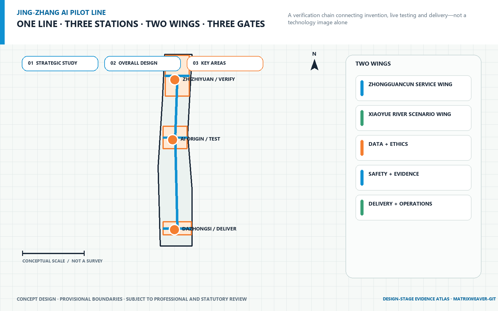
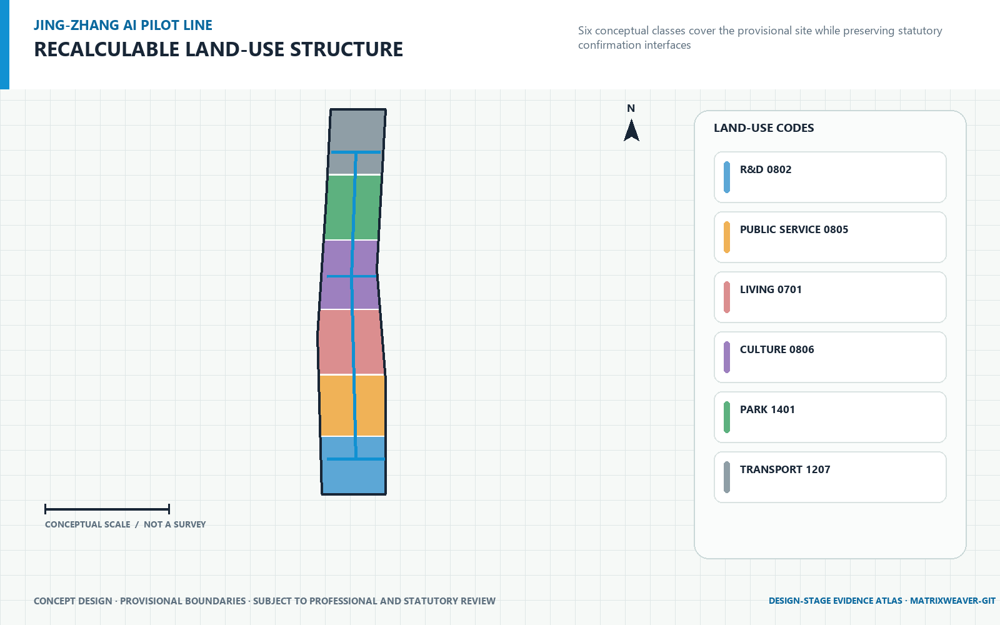
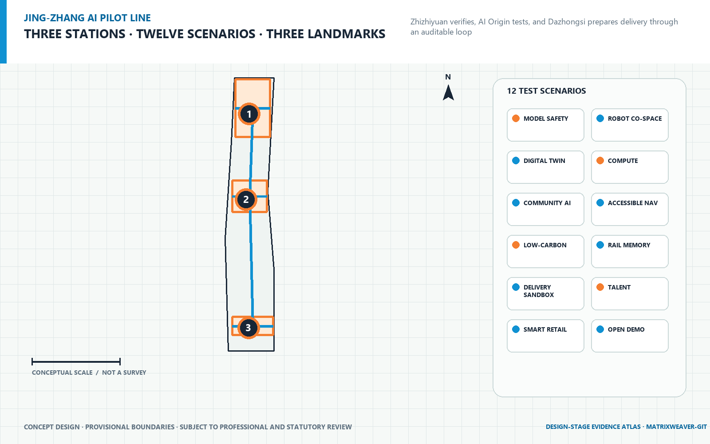
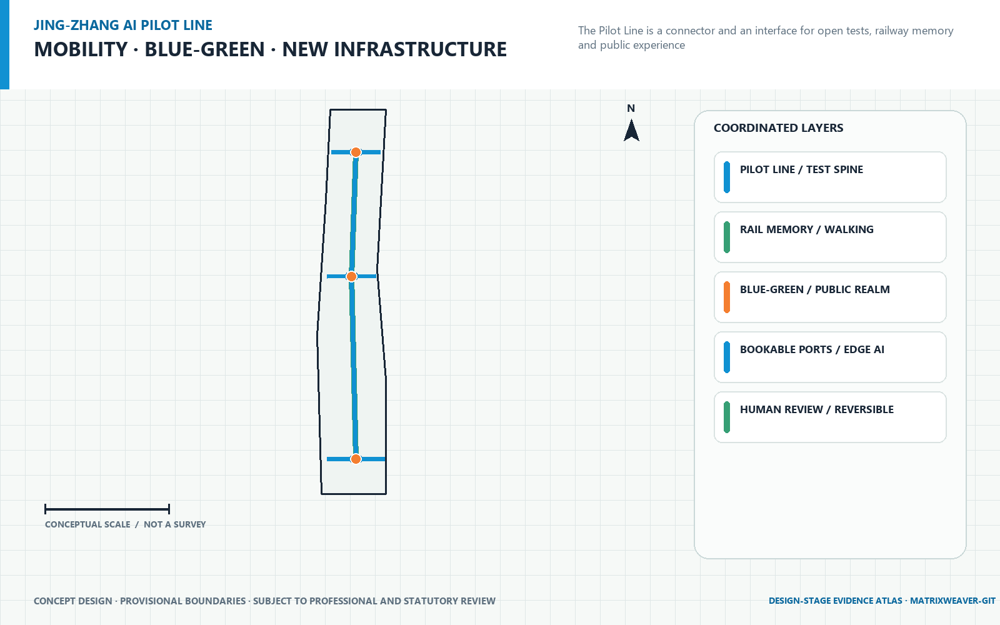
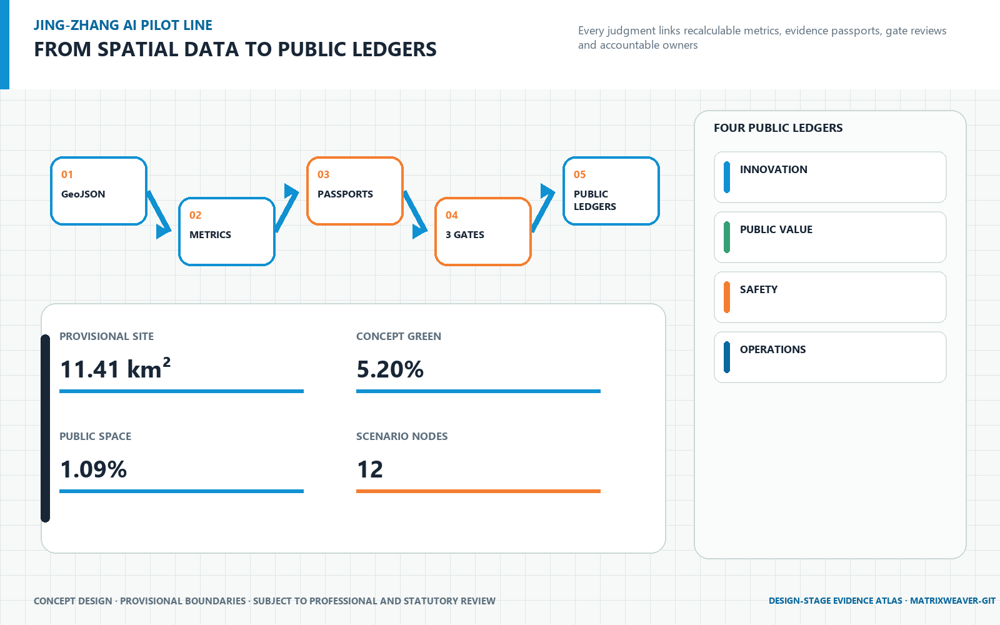

# JINGZHANG PILOT LINE / 京张中试线

> From AI prototype to trusted urban product | Meridian Weaver Agent (经纬织城智能体)

<!-- section:executive_summary -->

## Executive Summary

This proposal defines the Centennial Jing-Zhang AI Innovation Belt as **city-scale AI pilot infrastructure**, not merely an industrial park, display corridor or scenario list. Its central question is how models and robots can produce traceable, reusable, contestable and pausable engineering, public-value and delivery evidence before entering real urban operation. **One line, three stations, two wings and three gates** answer that question. One Pilot Line unifies open challenges, test tools, evidence passports and delivery interfaces; three stations perform integration piloting, trust co-testing and market delivery; two wings connect technology services and open scenarios; three gates decide pass, limited operation, rework or pause. [source:OFFICIAL-ANNOUNCEMENT] [source:AGENT-TASKBOOK] [requirement:1.3] [requirement:agent.1]

The proposal does not promise an acceleration percentage without a baseline. It first makes innovation efficiency measurable: time to first pilot and evidence reuse retain formulas, accountable owners and collection methods. [metric:time_to_pilot] [metric:evidence_reuse_rate] Failure closure, delivery readiness and shared-facility utilization establish baselines in the first operating period, followed by annual public trends. [metric:failure_closure_time] [metric:delivery_readiness_rate]

Spatial work uses the repository **Provisional Boundary** with `official_boundary=false`. It supports conceptual generation, discussion and temporary recalculation only. Every spatial project is a **Conceptual Recommendation** and must be replaced and recalculated when official data becomes available. [source:BOUNDARY-SOURCE] [depth:risk_missing_data]

<!-- section:basis -->

## Design Basis and Source List

The official announcement of the Centennial Jing-Zhang AI Innovation Belt Open Call for Urban Design is the first authority for the three scope levels, three key areas, design tasks and deliverable context. The agent taskbook adds ten co-creation principles, three positions, five functions, Three Zones and Two Wings, and six tasks from agent.1 to agent.6. [source:OFFICIAL-ANNOUNCEMENT] [source:AGENT-TASKBOOK] [requirement:1.4] [standard:PROJECT-OFFICIAL-ANNOUNCEMENT] [standard:PROJECT-AGENT-OPEN-CALL-TASKBOOK]

The evidence hierarchy is: registered official or rights-cleared original material; structured brief and standards snapshots; GeoJSON and recalculable metrics; task, standard and depth matrices; narrative and display artifacts. `data/processed/agent_fact_pack.md` is a reading aid and does not upgrade source status. Six global cases are used only for mechanism comparison. No external image, project scale or promotional number enters the formal graphics. [source:SOURCE-REGISTRY] [source:PROCESSED-FACT-PACK] [depth:existing_conditions_diagnosis]

Professional boundaries require compliance with urban-design management, separation of statutory controls from design recommendations and registered land-use codes. Where project-specific accessibility, generative-AI, regulatory, heritage or utility conclusions are unavailable, the proposal states performance requirements subject to Human Review. [standard:MOHURD-URBAN-DESIGN-MEASURES] [standard:MOHURD-CONTROL-DETAILED-PLANNING] [standard:MNR-LAND-USE-CLASSIFICATION-GUIDE]

<!-- section:three_scopes -->

## Three-Level Scope Framework

| Working level | Task | Proposal output | Factual boundary |
| --- | --- | --- | --- |
| Coordinated Research Area | AI industry ecosystem, strategic position and future urban form across the 43.6 km² research context | One line/three stations/two wings/three gates, industry–test–delivery chain, case transfer and annual operations | Research context only; no precise design redline is submitted for this level |
| Overall Design Area | Urban-renewal framework, industrial space, mobility, municipal support and character across the 11.4 km² context | Complete land-use partition, conceptual buildings, roads and active mobility, Blue-Green Space, constraints and three phase layers | Repository Provisional Boundary; area supports temporary recalculation only |
| Key-Area Detailed Design Area | Detailed design for three areas totalling approximately 368.4 ha in the taskbook | Three station prototypes, 12 scenarios, three landmarks, spatial carriers and phased projects | Three provisional rectangles are not parcels, road redlines or ownership boundaries |

This framework responds to announcement tasks 1.4 and 1.5: the strategic level does not fabricate detailed spatial data; the overall level supplies reviewable topology and metrics; the key-area level ties AI industry and testing to space, users, operators and exit mechanisms. [requirement:1.4] [requirement:1.5] [depth:three_level_scope_framework]

<!-- section:industry_future_city -->

## Coordinated Research Area: Industry and Future City Research

AI industrial competitiveness is not only a count of companies. It is the shared capacity to turn prototypes into trusted urban products. Shared instruments, edge-cloud environments, red-team tests, user research, compliance translation, procurement interfaces and operating training become public technical infrastructure along the line. This reduces duplicated test environments while retaining human accountability. [requirement:agent.2] [depth:municipal_new_infrastructure]

| User | Critical need | Proposal response |
| --- | --- | --- |
| AI start-up team | Gain rapid access to real scenarios, shared tools and clear admission rules. | Open admission, shared equipment, version records and real scenarios |
| University researcher and developer | Reuse test scripts, open interfaces and publishable failure lessons. | Open scripts, interfaces, failure library and cross-station retesting |
| Resident and everyday user | Informed participation, human service, appeal and opt-out routes. | Informed choice, human service, appeal, withdrawal and exit |
| Front-line public-service staff | Receive explainable assistance without being displaced by automation. | Explainable assistance, human takeover, training and accountability |
| Procurement and city-operations staff | Clarify liability, cost, training, maintenance and exit conditions. | Evidence passport, procurement interface, operating manual and exit conditions |
| Global partner, investor and visitor | Understand capabilities, limits and collaboration routes through bilingual evidence. | Bilingual display, comparable evidence, case route and partner matching |

A future city for talent does not treat daily life as an accessory to research. Housing, health-service navigation, walking and cycling, accessibility, night-time public space, cultural learning and global exchange all enter co-testing. Residents are users and co-reviewers who can contest, withdraw and trigger a stop. [requirement:1.3.3] [requirement:agent.3] [depth:blue_green_public_space]

<!-- section:overall_structure -->

## Overall Design Area: Urban Renewal and Regulatory-Plan-Level Urban Design

**One line: JINGZHANG PILOT LINE.** It unifies open challenges, Scenario Access, test tools, evidence records, public feedback and delivery interfaces. Railway memory becomes a language of version, mileage, signal and station rather than a high-tech form that covers history. [requirement:agent.1] [requirement:agent.5]

**Three stations:** Zhongzhiyuan Integration Pilot Station, Beijing AI Origin Trust Co-testing Station, Dazhongsi Market Delivery Station. They are not three competing park brands. They are one product-maturity chain: the north asks whether a system can work; the middle asks whether it deserves a place in public life; the south asks whether it can be procured, maintained and exited.

**Two wings:** the Zhongguancun Technology Services Wing will connect intellectual property, capital, professional services and global innovation resources. The Xiaoyue River Scenario Enablement Wing will provide open scenarios, everyday-life testing and a continuous public-space experience. Together they bring professional services and everyday-life scenarios into the pilot process instead of reducing scenario access to ungoverned trials. [requirement:agent.2] [requirement:agent.3]

**Three gates:** Engineering Qualification Gate, Public Value Gate, Delivery Readiness Gate. Green proceeds; amber runs within limits and returns for rework; red pauses immediately for review. Safety, privacy or material public-interest risk has unconditional stop authority. [source:AGENT-TASKBOOK] [depth:overall_spatial_structure]

<!-- section:key_areas -->

## Detailed Design of Key Areas

### 1. Zhongzhiyuan AI Independent Innovation Acceleration Area: Zhongzhiyuan Integration Pilot Station

**Spatial prototype: One Spine · Two Loops · Four Test Courtyards.** Assemble models, hardware, data and safety capabilities into systems ready for real-world trials. The spine carries shared equipment, open standards, system integration and safety testing. Loops, streets and quadrants are not statutory roads or construction boundaries; they are a conceptual spatial grammar for test flows, public interfaces and delivery accountability. Building footprints represent movable, demountable and extensible pilot components. Any Demolish–Renovate–Retain Strategy must be refined after surveys, ownership and engineering conditions are available. [source:BOUNDARY-SOURCE] [requirement:1.5.3.1] [depth:three_key_area_detailed_design]

Four station scenarios correspond to embodied AI, urban intelligence, trusted computing and innovation services. Each follows one evidence passport from version and input through human takeover, pass/fail conditions, evidence output and exit. Passing a test does not erase failure records; operating limits and residual risks travel to the next station. [source:AGENT-TASKBOOK] [requirement:agent.2] [requirement:agent.3]

### 2. Beijing AI Origin Community: Beijing AI Origin Trust Co-testing Station

**Spatial prototype: One Co-test Street · Three Interfaces · Six Micro-courtyards.** Let residents, developers and public-service staff verify public value under pausable and appealable conditions. The spine carries shared equipment, open standards, system integration and safety testing. Loops, streets and quadrants are not statutory roads or construction boundaries; they are a conceptual spatial grammar for test flows, public interfaces and delivery accountability. Building footprints represent movable, demountable and extensible pilot components. Any Demolish–Renovate–Retain Strategy must be refined after surveys, ownership and engineering conditions are available. [source:BOUNDARY-SOURCE] [requirement:1.5.3.2] [depth:three_key_area_detailed_design]

Four station scenarios correspond to embodied AI, urban intelligence, trusted computing and innovation services. Each follows one evidence passport from version and input through human takeover, pass/fail conditions, evidence output and exit. Passing a test does not erase failure records; operating limits and residual risks travel to the next station. [source:AGENT-TASKBOOK] [requirement:agent.2] [requirement:agent.3]

### 3. Dazhongsi AI Industry Cluster: Dazhongsi Market Delivery Station

**Spatial prototype: One Hub · Four Quadrants · One Delivery Salon.** Translate test evidence into procurement, operations, training, insurance, exit and replication packages. The spine carries shared equipment, open standards, system integration and safety testing. Loops, streets and quadrants are not statutory roads or construction boundaries; they are a conceptual spatial grammar for test flows, public interfaces and delivery accountability. Building footprints represent movable, demountable and extensible pilot components. Any Demolish–Renovate–Retain Strategy must be refined after surveys, ownership and engineering conditions are available. [source:BOUNDARY-SOURCE] [requirement:1.5.3.3] [depth:three_key_area_detailed_design]

Four station scenarios correspond to embodied AI, urban intelligence, trusted computing and innovation services. Each follows one evidence passport from version and input through human takeover, pass/fail conditions, evidence output and exit. Passing a test does not erase failure records; operating limits and residual risks travel to the next station. [source:AGENT-TASKBOOK] [requirement:agent.2] [requirement:agent.3]

<!-- section:pilot_mechanism -->

## AI Innovation Ecosystem, Personas, and AI+ Scenarios

AI industrial competitiveness is not only a count of companies. It is the shared capacity to turn prototypes into trusted urban products. Shared instruments, edge-cloud environments, red-team tests, user research, compliance translation, procurement interfaces and operating training become public technical infrastructure along the line. This reduces duplicated test environments while retaining human accountability. [requirement:agent.2] [depth:municipal_new_infrastructure]

| User | Critical need | Proposal response |
| --- | --- | --- |
| AI start-up team | Gain rapid access to real scenarios, shared tools and clear admission rules. | Open admission, shared equipment, version records and real scenarios |
| University researcher and developer | Reuse test scripts, open interfaces and publishable failure lessons. | Open scripts, interfaces, failure library and cross-station retesting |
| Resident and everyday user | Informed participation, human service, appeal and opt-out routes. | Informed choice, human service, appeal, withdrawal and exit |
| Front-line public-service staff | Receive explainable assistance without being displaced by automation. | Explainable assistance, human takeover, training and accountability |
| Procurement and city-operations staff | Clarify liability, cost, training, maintenance and exit conditions. | Evidence passport, procurement interface, operating manual and exit conditions |
| Global partner, investor and visitor | Understand capabilities, limits and collaboration routes through bilingual evidence. | Bilingual display, comparable evidence, case route and partner matching |

A future city for talent does not treat daily life as an accessory to research. Housing, health-service navigation, walking and cycling, accessibility, night-time public space, cultural learning and global exchange all enter co-testing. Residents are users and co-reviewers who can contest, withdraw and trigger a stop. [requirement:1.3.3] [requirement:agent.3] [depth:blue_green_public_space]

### Three decision gates

1. **Engineering Qualification Gate:** Verify reliability, interoperability, failure boundaries, energy use, edge-cloud coordination and red-team results.
2. **Public Value Gate:** Verify explainability, fairness, privacy, accessibility, human takeover, appeals and real-use feedback.
3. **Delivery Readiness Gate:** Verify procurement interfaces, operating manuals, training duties, insurance links, replication and exit conditions.

Every gate can return pass, limited operation, rework or pause. Entering a display is never a default success. Every project maintains an evidence passport with scenario, project and version IDs; inputs and data permission; human takeover; pass/fail conditions; test logs; public feedback; remediation; operating limits; accountable operator; and exit. The open package contains the protocol structure, not personal data or trade secrets. [source:AGENT-TASKBOOK] [requirement:agent.4]

### Twelve priority Testing and Validation Scenarios

| ID | Scenario | Station | Target users | Test/failure and evidence | Gates |
| --- | --- | --- | --- | --- | --- |
| `embodied_multi_robot` | Multi-robot Coordination Yard | Zhongzhiyuan Integration Pilot Station | AI start-up team, University researcher and developer | Success: Complete the task while meeting preset avoidance, stop, recovery and coordination criteria. Failure: Localization loss, boundary breach, failed stop, collision near-miss or missing telemetry. Evidence: Version log, failure library, stop record, retest result and operating envelope. | Engineering Qualification Gate, Public Value Gate |
| `edge_cloud_coordination` | Edge-cloud Coordination Loop | Zhongzhiyuan Integration Pilot Station | AI start-up team, University researcher and developer, Procurement and city-operations staff | Success: Maintain graceful degradation under disconnection, latency and compute switching. Failure: Data overreach, unexplained outage, energy anomaly or absent degradation path. Evidence: Interoperability report, latency/energy curves, degradation playbook and recovery log. | Engineering Qualification Gate, Delivery Readiness Gate |
| `trusted_red_team` | Safety Red-team and Failure Library | Zhongzhiyuan Integration Pilot Station | University researcher and developer, Procurement and city-operations staff | Success: High-risk paths are found, reproduced, fixed and closed in regression testing. Failure: Irreproducible risk, undocumented fix, unauthorized disclosure or regression failure. Evidence: Severity level, reproduction script, remediation evidence, residual risk and disclosure boundary. | Engineering Qualification Gate, Public Value Gate |
| `open_standard_toolchain` | Open-standard Toolchain | Zhongzhiyuan Integration Pilot Station | AI start-up team, University researcher and developer, Global partner, investor and visitor | Success: Different teams reproduce tests with the same scripts and identify licence duties. Failure: Locked interfaces, unrunnable scripts, unknown dependencies or licence conflict. Evidence: Reusable scripts, interface-conformance report, SBOM and licence register. | Engineering Qualification Gate, Delivery Readiness Gate |
| `community_assistive_robot` | Community Assistive Co-test Yard | Beijing AI Origin Trust Co-testing Station | Resident and everyday user, Front-line public-service staff, University researcher and developer | Success: Users opt in knowingly, tasks complete, and human service remains available. Failure: Blocked passage, misidentification, denied human service or material discomfort. Evidence: Co-test log, accessibility review, takeover drill and user feedback. | Public Value Gate |
| `public_service_cotest` | Public-service Co-test Street | Beijing AI Origin Trust Co-testing Station | Resident and everyday user, Front-line public-service staff | Success: Navigation is accurate, sources visible, stale content detectable and human access unimpaired. Failure: Overreaching advice, wrong policy interpretation, personal-data capture or hidden human access. Evidence: Q&A versions, error samples, human handoff rate, appeals and corrections. | Public Value Gate, Delivery Readiness Gate |
| `privacy_fairness_sandbox` | Privacy and Fairness Sandbox | Beijing AI Origin Trust Co-testing Station | Resident and everyday user, Front-line public-service staff, University researcher and developer | Success: Bias, leakage and unexplained disparity are detected with a remediation path. Failure: Misused sensitive attributes, failed deletion, unexplained disparity or unanswered appeal. Evidence: Data lineage, subgroup evaluation, deletion drill, model card and remediation record. | Public Value Gate |
| `user_research_micro_courtyard` | User-research Micro-courtyard | Beijing AI Origin Trust Co-testing Station | Resident and everyday user, Front-line public-service staff, AI start-up team | Success: Users of different abilities and ages understand tasks, withdraw data and receive results. Failure: Coerced participation, failed withdrawal, unanswered feedback or overstated representativeness. Evidence: Consent record, participant mix, issue list, product changes and follow-up result. | Public Value Gate, Delivery Readiness Gate |
| `terminal_training_field` | Terminal Experience and Training Field | Dazhongsi Market Delivery Station | Procurement and city-operations staff, Front-line public-service staff, Global partner, investor and visitor | Success: Different roles complete onboarding, incident response and shutdown tasks. Failure: Training relies on tacit knowledge, incidents cannot be handled or liability is unclear. Evidence: Training assessment, usability issues, response time and responsibility matrix. | Engineering Qualification Gate, Delivery Readiness Gate |
| `urban_product_delivery` | Urban-product Delivery Hall | Dazhongsi Market Delivery Station | AI start-up team, Procurement and city-operations staff, Global partner, investor and visitor | Success: Buyers use one evidence base to judge operating limits, total cost and exit duties. Failure: Success-only display, missing costs, unmaintainable product or orphaned exit duties. Evidence: Readiness checklist, TCO assumptions, SLA, operating manual and exit plan. | Delivery Readiness Gate |
| `compliance_translation_workbench` | Compliance Translation Workbench | Dazhongsi Market Delivery Station | AI start-up team, Procurement and city-operations staff, Global partner, investor and visitor | Success: Technical evidence is translated into verifiable duties, controls, exceptions and human accountability. Failure: Recommendations are presented as approval, scope is omitted or automation replaces professional advice. Evidence: Applicability matrix, control evidence, exception list and professional review note. | Public Value Gate, Delivery Readiness Gate |
| `international_delivery_salon` | International Delivery Salon | Dazhongsi Market Delivery Station | Global partner, investor and visitor, AI start-up team, Procurement and city-operations staff | Success: External partners distinguish reusable modules, locally retested items and non-transferable conditions. Failure: Promotion replaces evidence, translation changes conclusions or intent is presented as official arrangement. Evidence: Bilingual gap table, replication prerequisites, partner feedback and follow-on test plan. | Delivery Readiness Gate |

All twelve cards can output test evidence and at least three are explicit industrial Testing and Validation Scenarios. Every card connects target users, spatial carrier, operator, gates and exit. See `visual/assets/evidence-passports.json`. [metric:scenario_node_count] [depth:three_key_area_detailed_design]

<!-- section:land_use_buildings -->

## Land Use, Building Scale, and Retain-Renovate-Demolish Strategy

The Overall Design Area is organized into six conceptual land-use families: research and innovation, mixed research, public service, residential life, civic public space, and streets and movement. Six polygons cover the repository Provisional Boundary without material overlap, with area recalculated from `geometry/land_use.geojson` in EPSG:4548. They describe the relationship among industry, daily life, services and open space; they are not statutory land-use approvals. [metric:site_area_sqm] [depth:land_use_layout]

Twelve conceptual building footprints carry integration testing, trust co-testing, market delivery, shared facilities and supporting services. `building_footprint_area_sqm` counts proposal footprints only and does not infer gross floor area. Because surveyed buildings, storeys, ownership, structural condition and regulatory controls are unavailable, `floor_area_ratio` and `regulated_building_height_m` remain explicitly unknown rather than being filled with assumed values. [metric:building_footprint_area_sqm] [depth:development_intensity_controls]

Retain, renovate or demolish follows a “survey first, classify second, reversible first” procedure. No building is assigned for demolition before heritage, structural and ownership surveys. Reusable fabric is prioritized for repair and adaptive reuse; new launch units favour movable and replaceable components. Building-by-building decisions require cleared tenure, heritage, structure, fire, accessibility and investment review. Every current footprint remains a Conceptual Recommendation. [depth:retain_renovate_demolish] [source:BOUNDARY-SOURCE]

<!-- section:mobility_bluegreen -->

## Transport, Rail, Municipal Infrastructure, and Public Services

The road layer adds only conceptual secondary, pedestrian, greenway and transit-connection networks editable by an agent. It does not create or modify official expressway or arterial status. The Pilot Line spine crosses all three provisional key areas; three station interfaces transfer people, equipment, samples and evidence. No centreline is a road redline. [source:BOUNDARY-SOURCE] [metric:road_length_m] [depth:traffic_rail_slow_parking]

The Blue-Green Space system links Jing-Zhang railway memory, a continuous green corridor, three station public spaces and the Xiaoyue River Scenario Enablement Wing. Green and public-space ratios are recalculated only from conceptual GeoJSON and are not statutory planning indicators. Public spaces retain human service, accessible bypasses, low-stimulation rest, visible stops and non-participation routes. [metric:green_ratio] [metric:public_space_ratio] [requirement:agent.4] [depth:blue_green_public_space]

Municipal and New Infrastructure follows three principles: shared, measurable and degradable. Test compute and energy are metered separately; edge-cloud outages degrade safely; sensing is minimized; logs follow permission; equipment is replaceable. Capacity, energy savings and utility feasibility await official data and operator review. [depth:municipal_new_infrastructure]

<!-- section:culture_landmarks -->

## Blue-Green Network, Public Space, and Urban Character

The Blue-Green Network acts as continuous public infrastructure that can be delivered in sections. A Jing-Zhang memory greenway carries active mobility, ecological infiltration and version-mileage storytelling; three station public spaces support test observation, civic co-review and bypasses for non-participants; the Xiaoyue River Scenario Enablement Wing connects community life to seasonal water and landscape conditions. Green and public-space layers stay inside the provisional site. Their current ratios are concept recalculations, not statutory park, green-space or river-management boundaries. [metric:green_ratio] [metric:public_space_ratio] [depth:blue_green_public_space]

Legibility and the right to exit define urban character. High-risk devices receive visible stop interfaces; testing and ordinary movement are distinguished through ground treatment, lighting and reversible edge elements; night scenes avoid excessive brightness; and every station provides human service, accessible alternatives, low-stimulation resting places and non-participation routes. Permanent height, colour, material and heritage relationships remain subject to regulatory, conservation and landscape review.

Jing-Zhang railway culture represents crossing, engineering, time, stations and public connection. Zhongguancun culture represents experimentation, open source, talent, knowledge exchange and industrial transfer. AI new culture represents explainability, verifiability, pausability and shared human-machine responsibility. A common mileage, signal colour, version mark and evidence-passport language connects them. The proposal neither constructs a faux-historic scene nor reduces AI to floating screens. [requirement:agent.5]

| Landmark | Station | Public meaning | Professional boundary |
| --- | --- | --- | --- |
| Open Signal Platform | Zhongzhiyuan Integration Pilot Station | Display open protocols, key contributors, system versions and embodied-AI trials as the Pilot Line starting point. | Public-space component, not an approved building height, investment or construction project |
| Trust Milestone | Beijing AI Origin Trust Co-testing Station | Show passes, failures, public feedback and remediation together, making contestability part of innovation culture. | Public-space component, not an approved building height, investment or construction project |
| Delivery Beacon | Dazhongsi Market Delivery Station | Organize evidence passports, procurement interfaces, operating duties and replication partners into an urban-AI delivery foyer. | Public-space component, not an approved building height, investment or construction project |

An annual Jing-Zhang AI Pilot Week, quarterly urban open challenges, monthly open failure reviews, developer residencies and operator certification, and a Global City Partner Day form a long-term activity system. These are operating recommendations to be confirmed by future accountable organizations. International exchange intent is not presented as a confirmed official arrangement. [requirement:agent.6]

<!-- section:global_cases -->

## Global Cases and Transferable Mechanisms

External cases answer only which mechanism may transfer. They do not dictate size, architectural form or promotional performance for Jing-Zhang. First-party sources, access dates, uses and limitations are registered in `sources.json`; no external case image is used. [source:SOURCE-REGISTRY]

| Global case | Verifiable first-party source | Mechanism translated to Jing-Zhang |
| --- | --- | --- |
| Singapore one-north | https://www.jtc.gov.sg/find-land/jtc-key-estates/one-north?estate=one-north | Translate into three specialized stations, shared tools and modular launch space without importing project scale. |
| Paris-Saclay Urban Campus | https://epa-paris-saclay.fr/le-territoire/campus-urbain-palaiseau/ | Co-build pilot facilities with housing, mobility, public services and everyday urban life. |
| Pittsburgh Hazelwood Green and CMU RIC | https://hazelwoodgreen.com/whats-here/; https://www.cmu.edu/cdfd/buildings/ric/index.html | Combine Jing-Zhang industrial memory, robotics piloting and public learning without copying external form. |
| Knowledge Quarter London | https://www.knowledgequarter.london/ | Connect existing institutions through a joint office, annual events and resource recognition rather than one mega-campus. |
| Toronto MaRS Discovery District | https://www.marsdd.com/about/ | Embed professional services, market connections and impact evaluation in the delivery station. |
| Taipei Smart City Living Lab | https://smartcity.taipei/en/cp.aspx?n=C36B8D41EE52BB3A | Form a full loop of open challenges, site admission, evidence records and exit mechanisms. |

Together, six cases support three conclusions: innovation districts need specialist roles while mixing with everyday urban life; live testing requires a public platform, admission and exit; long-term competitiveness depends on partner networks, evidence recognition and professional services rather than a one-time construction peak. [requirement:agent.2] [requirement:agent.6]

<!-- section:implementation -->

## Renewal Projects, Implementation Policy, and Phasing

The minimum viable system is `1 + 3 + 12 + 1`: one pilot protocol, three lightweight launch units, twelve priority scenarios and one annual public report. Institutions and evidence come before decisions on permanent capital space, reducing the risk of locking in heavy assets under data gaps. [depth:renewal_project_list]

| Phase | Conceptual action | Exit/adjustment |
| --- | --- | --- |
| 0–12 months: system first, lightweight launch | Set up the joint office, establish baselines, publish open challenges and launch three stations with movable elements. | Each period exits weak, high-risk or accountability-orphaned projects through evidence ledgers |
| 12–36 months: connect three stations and network evidence | Share instruments, scripts and booking systems; run annual red-team tests and public review. | Each period exits weak, high-risk or accountability-orphaned projects through evidence ledgers |
| After 36 months: expand evidence and update dynamically | Replicate verified modules, exit weak or high-risk scenarios and connect cross-regional testing and procurement partners. | Each period exits weak, high-risk or accountability-orphaned projects through evidence ledgers |

Time expresses a governance rhythm only; it is not a government commitment or approved development schedule. Three non-overlapping conceptual phase polygons cover the Overall Design Area for recalculation and later replacement, but they are not acquisition, land-supply or construction boundaries. [metric:phase_0_12_area_sqm] [depth:phasing_implementation]

Four-party governance includes public authorities, universities and institutes, communities and the public, and companies and operators. The Jing-Zhang Pilot Line Joint Office maintains protocols, admission, evidence passports, cross-station scheduling and annual reports. Four annual ledgers cover industry efficiency, public trust, spatial vitality, and resources and environment. Green, amber and red decisions and failure reviews enter the annual public report. [requirement:agent.6]

<!-- section:metrics_evidence -->

## Metrics, Area Recalculation, and Compliance Matrix

GeoJSON is the spatial authority layer. `metrics.json` recalculates area and length in EPSG:4548. `visual/assets/evidence-passports.json` records scenario protocols. Three matrices connect tasks, standards and design depth to narrative sections, layers, metrics, drawings and self-checks. Web and PDF artifacts read these values and may not invent visual numbers. [depth:metrics_recalculation]

| Metric ID | Status | Value | Unit | Recalculation/collection rule |
| --- | --- | ---: | --- | --- |
| `site_area_sqm` | known | 11,412,825.385554 | sqm | area(transform(submitted_provisional_site_boundary, EPSG:4548)) |
| `building_footprint_area_sqm` | known | 336,695.321554 | sqm | sum(area(transform(building_footprints, EPSG:4548))) |
| `green_space_area_sqm` | known | 593,964.326184 | sqm | area(union(transform(green_space, EPSG:4548))) |
| `green_ratio` | known | 0.052044 | ratio | green_space_area_sqm / site_area_sqm |
| `public_space_area_sqm` | known | 124,442.561362 | sqm | area(union(transform(public_space, EPSG:4548))) |
| `public_space_ratio` | known | 0.010904 | ratio | public_space_area_sqm / site_area_sqm |
| `road_length_m` | known | 10,745.491875 | m | sum(length(transform(road_centerlines, EPSG:4548))) |
| `key_area_count` | known | 3.000000 | count | count(key_area_features) |
| `building_count` | known | 12.000000 | count | count(conceptual_building_footprints) |
| `scenario_node_count` | known | 12.000000 | count | count(approved_scenario_cards) |
| `time_to_pilot` | unknown | baseline required | days | Date of first live trial minus date of open challenge publication. |
| `evidence_reuse_rate` | unknown | baseline required | ratio | Evidence items validly reused by later projects divided by all reusable evidence items. |
| `failure_closure_time` | unknown | baseline required | days | Remediation closure time minus first confirmed risk time. |
| `delivery_readiness_rate` | unknown | baseline required | ratio | Projects with procurement, operations, training, liability and exit materials divided by projects entering delivery review. |
| `shared_facility_utilization` | unknown | baseline required | ratio | Valid test-use time divided by bookable open time. |

Land use covers the provisional Overall Design Area without material overlap. Buildings, green space, public space and phase polygons remain inside the site. Three phase polygons cover it without overlap. [metric:site_area_sqm] [metric:building_footprint_area_sqm] `floor_area_ratio` and `regulated_building_height_m` remain unknown because the official boundary, surveyed floorspace and statutory controls are unavailable. [depth:land_use_layout] [depth:development_intensity_controls]

<!-- section:risks_copyright -->

## Risk, Copyright, and Compliance

Eight data gaps are registered separately in `assumptions.json`: official precise boundary, regulatory controls, road redlines, ownership, existing buildings, municipal capacity, heritage controls, and investment/schedule. Each record states impact, prohibited claim and closure action. When official data arrives, recalculation starts from GeoJSON rather than changing web copy alone. [source:BOUNDARY-SOURCE] [depth:risk_missing_data]

The proposal includes no personal data, internal material, trade secret or uncleared external image. Text, graphic language, code and figures generated from proposal GeoJSON/metrics are original to this submission. Repository sources retain their registered status. Locally installed fonts only rasterize text; no font file is redistributed. See `report/copyright_statement.md`.

A machine-validation PASS only means that the package can enter intake and content review; it **does not mean an award, approval or implementation**. A Provisional Boundary does not become an Official Planning Boundary, conceptual buildings do not become a Demolish–Renovate–Retain decision, and conceptual phases do not become fiscal, procurement or construction commitments. [standard:MOHURD-CONTROL-DETAILED-PLANNING]

<!-- section:references -->

## References

This section provides review entry points rather than a second source of truth. Every citation first registers source status, permitted use and limitation in `sources.json`; claim-adjacent evidence markers then connect it to a design judgment. If repository originals, structured snapshots and proposal inferences conflict, the higher-authority layer governs and the unresolved matter is recorded in `assumptions.json`. [source:SITE-PACKAGE] [source:SOURCE-REGISTRY]

- `brief/site-package/design_brief.json` and `agent_taskbook.json`: official-call and agent tasks. [source:OFFICIAL-ANNOUNCEMENT] [source:AGENT-TASKBOOK]
- `brief/site-package/geometry/provisional_boundaries.geojson`: provisional spatial constraints.
- `brief/site-package/standards/standards.json` and local standard snapshots: professional-standard registry.
- `data/source_registry.json` and `data/processed/agent_fact_pack.md`: source status and reading navigation.
- `geometry/*.geojson`, `metrics.json`, `sources.json`, `assumptions.json`, `visual/assets/evidence-passports.json`, three matrices and `self_check.json`: complete machine evidence layer.

Review starts with the source, standard, depth and metric marker next to a claim, continues through task coverage in the matrices, and ends with a recalculation of GeoJSON and metric formulas. Announcement tasks 1.3, 1.4 and 1.5 and agent.1 through agent.6 are indexed in `compliance_matrix.json`; `standard_matrix.json` records the response to each standard; `design_depth_matrix.json` locates every urban-design depth item. Missing information remains a registered gap until its closure action is completed.

Task index: [requirement:1.3] [requirement:1.4] [requirement:1.5]. Agent task index: [requirement:agent.1] [requirement:agent.2] [requirement:agent.3] [requirement:agent.4] [requirement:agent.5] [requirement:agent.6]
