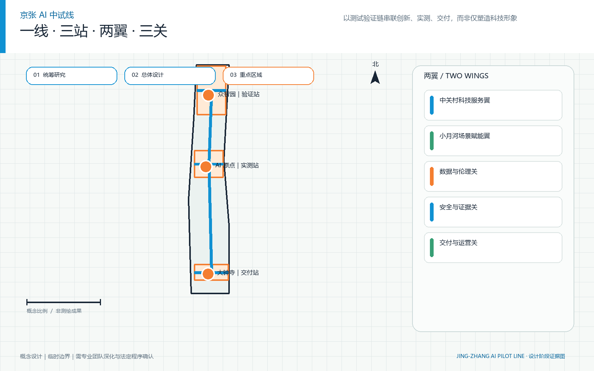
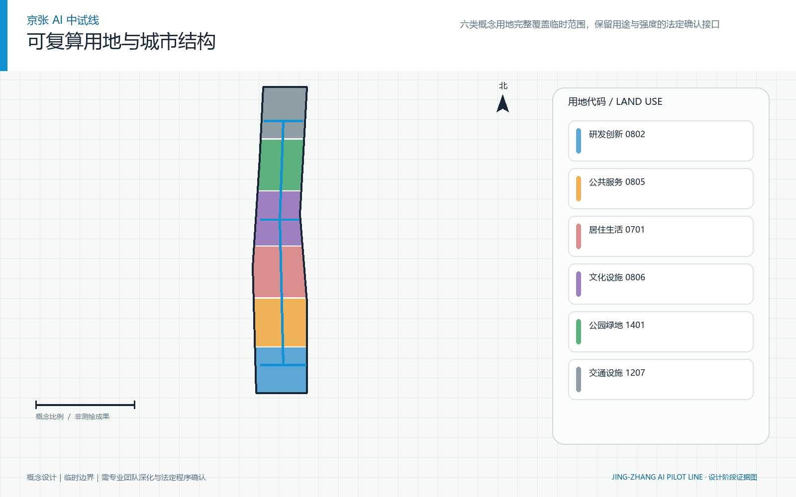
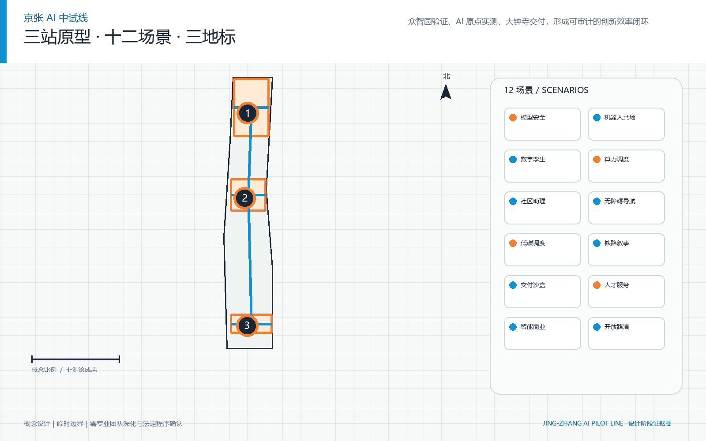
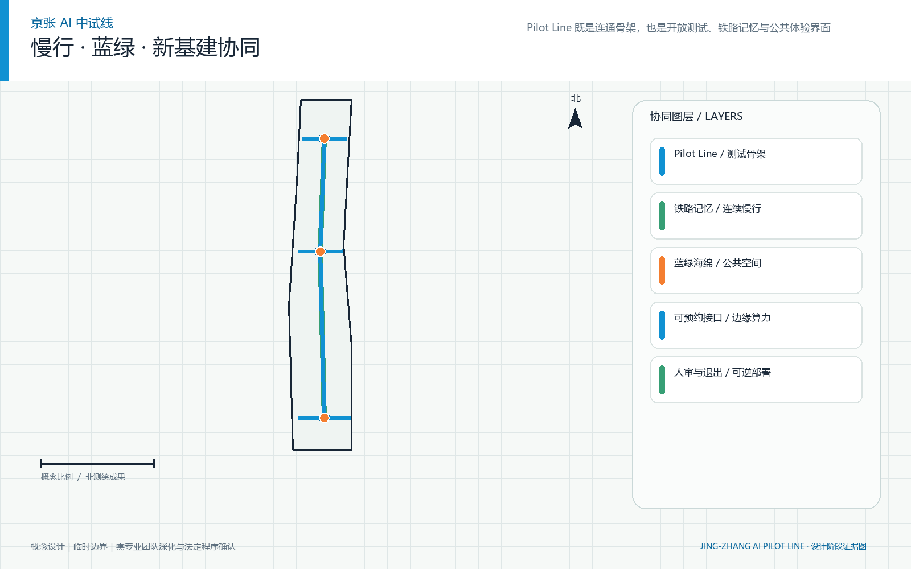
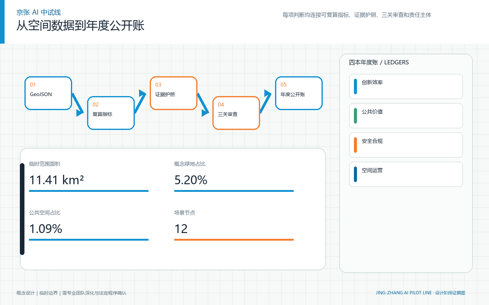

# 京张中试线 / JINGZHANG PILOT LINE

> 从 AI 原型到可信城市产品｜经纬织城智能体（Meridian Weaver Agent）

<!-- section:executive_summary -->

## 执行摘要

本方案把百年京张 AI 创新带定义为一套**城市级 AI 中试基础设施**，而不只是产业园、展示廊道或场景清单。核心问题是：模型或机器人进入城市真实运行前，如何形成可追踪、可复用、可质疑、可暂停的工程证据、公共价值证据和交付证据。方案以**一线、三站、两翼、三关**回答这个问题：一条京张中试线统一公开命题、测试工具、证据护照和交付接口；三站分别完成集成中试、可信共测和市场交付；两翼接入科技服务与开放场景；三关决定通过、限域、返工或暂停。[source:OFFICIAL-ANNOUNCEMENT] [source:AGENT-TASKBOOK] [requirement:1.3] [requirement:agent.1]

目标不是在缺少基线时承诺“提速百分比”，而是先把创新效率变成可计量流程：首次实测周期和证据复用率均保留公式、责任方与采集方法。[metric:time_to_pilot] [metric:evidence_reuse_rate] 失效闭环时间、交付就绪率和共享设施利用率由首期运营建立基线，随后按年度公开趋势。[metric:failure_closure_time] [metric:delivery_readiness_rate]

空间表达采用仓库提供的 **Provisional Boundary（临时边界）**。其 `official_boundary=false`，只支持概念生成、讨论和临时复算；本方案所有空间项目均为 **Conceptual Recommendation（概念建议）**，待官方资料到位后整体替换和重算。[source:BOUNDARY-SOURCE] [depth:risk_missing_data]

<!-- section:basis -->

## 设计依据与资料清单

《百年京张 AI 创新带城市设计开源征集》公告是三层范围、三处重点区域、设计任务与成果语境的第一依据；面向智能体任务书补充十条共创原则、三大定位、五大功能、三区两翼和 agent.1—agent.6 六项任务。[source:OFFICIAL-ANNOUNCEMENT] [source:AGENT-TASKBOOK] [requirement:1.4] [standard:PROJECT-OFFICIAL-ANNOUNCEMENT] [standard:PROJECT-AGENT-OPEN-CALL-TASKBOOK]

资料权威顺序为：仓库登记的官方/已清权原始资料，结构化 brief 与标准快照，GeoJSON 与可复算指标，任务/标准/深度矩阵，正文和展示成果。`data/processed/agent_fact_pack.md` 只是阅读导航，不升级任何来源状态。六个全球案例只比较机制，外部图片、规模和宣传数字均不进入正式图面。[source:SOURCE-REGISTRY] [source:PROCESSED-FACT-PACK] [depth:existing_conditions_diagnosis]

专业底线包括：遵守城市设计管理要求，区分法定控制与设计建议，使用登记的国土空间用途代码；缺少无障碍、生成式 AI、控规、文保或市政具体结论时，方案只提出需要人工复核的性能要求。[standard:MOHURD-URBAN-DESIGN-MEASURES] [standard:MOHURD-CONTROL-DETAILED-PLANNING] [standard:MNR-LAND-USE-CLASSIFICATION-GUIDE]

<!-- section:three_scopes -->

## 三层范围工作框架

| 工作层 | 任务 | 本方案成果 | 事实边界 |
| --- | --- | --- | --- |
| 统筹研究范围 | 43.6 平方公里层面的产业生态、战略定位与未来城市形态研究 | 一线三站两翼三关、产业—测试—交付链、案例迁移和年度运营 | 只作研究语境，不提交精确研究范围设计红线 |
| 总体设计范围 | 11.4 平方公里层面的城市更新总体框架、产业空间、交通市政与风貌 | 完整用地分区、概念建筑、道路慢行、蓝绿公共空间、约束和三阶段图层 | 采用仓库临时边界，面积仅供临时复算 |
| 重点区域范围 | 三处约 368.4 公顷片区的重点精细化设计 | 三站原型、12 场景、3 地标、空间载体与分期项目 | 三个临时矩形不得解释为地块、道路红线或产权边界 |

该框架逐项回应公告 1.4 与 1.5：战略层不伪造详细空间数据，总体层建立可审查的拓扑和指标，重点区层把 AI 产业和测试验证落到空间、使用者、运营者和退出机制。[requirement:1.4] [requirement:1.5] [depth:three_level_scope_framework]

<!-- section:industry_future_city -->

## 统筹研究范围产业与未来城市研究

AI 产业竞争力不只取决于企业数量，更取决于把原型变成可信城市产品的共同能力。本方案把共享仪器、端云环境、红队测试、用户研究、合规翻译、采购接口和运维培训组织为沿线公共技术基础设施，降低每个团队重复搭建测试环境的成本，同时保留人类责任。[requirement:agent.2] [depth:municipal_new_infrastructure]

| 使用者 | 关键需要 | 方案响应 |
| --- | --- | --- |
| AI 创业团队 | 快速获得真实场景、共享工具和清晰准入。 | 公开准入、共享设备、版本记录与真实场景 |
| 高校研究者与开发者 | 复用测试脚本、开放接口和可发表的失败经验。 | 开放脚本、接口、失效库与跨站复测 |
| 社区居民与日常使用者 | 知情参与、人工服务、可申诉与可退出。 | 知情选择、人工服务、申诉、撤回与退出 |
| 公共服务一线人员 | 在不被自动化替代的前提下获得可解释辅助。 | 解释辅助、人工接管、培训与责任边界 |
| 采购与城市运营人员 | 明确责任、成本、培训、维护与退出条件。 | 证据护照、采购接口、运维手册与退出条件 |
| 国际伙伴、投资人与访客 | 以双语证据快速理解能力、边界与合作入口。 | 双语展示、可比证据、案例路线与伙伴对接 |

面向人才的未来城市不把生活配套视为研发之后的附属品。住房、健康服务导航、步行骑行、无障碍、夜间公共空间、文化学习和国际交往都进入共测范围；居民既是服务使用者，也是可以质疑、撤回和触发停机的共同评审者。[requirement:1.3.3] [requirement:agent.3] [depth:blue_green_public_space]

<!-- section:overall_structure -->

## 总体设计范围城市更新与控规深度城市设计

**一线：京张中试线。** 统一公开命题、场景准入、测试工具、证据记录、公众反馈和交付接口。铁路记忆被转译为“版本—里程—信号—到站”的证据语言，而不是用高科技造型覆盖历史。[requirement:agent.1] [requirement:agent.5]

**三站：** 众智园集成中试站、北京 AI 原点可信共测站、大钟寺市场交付站。三站不是三个互相竞争的园区品牌，而是一条产品成熟链：北段解决“能否工作”，中段解决“是否值得进入公共生活”，南段解决“能否被采购、维护和退出”。

**两翼：** 中关村科技服务翼负责连接知识产权、资本、专业服务与全球创新要素。；小月河场景赋能翼负责提供开放场景、日常生活测试与连续公共空间体验。。两翼使专业服务与日常生活场景同时进入中试，而不是让场景开放沦为无规则试用。[requirement:agent.2] [requirement:agent.3]

**三关：** 工程合格证、公共价值证、交付就绪证。绿灯进入下一阶段；黄灯限域运行并返工；红灯立即暂停并复盘。安全、隐私或重大公共利益风险拥有无条件停机权。[source:AGENT-TASKBOOK] [depth:overall_spatial_structure]

<!-- section:key_areas -->

## 重点区域详细设计

### 1. 众智园 AI 自主创新加速区：众智园集成中试站

**空间原型：一脊·两环·四类试验院。** 把模型、硬件、数据与安全能力装配为可进入真实场景的系统。 “一脊”承载共享设备、开放标准、系统集成和安全测试；“环/街/象限”不是法定道路或建设红线，而是组织测试流程、公众接口与交付责任的概念空间语法。建筑基底采用可移动、可拆卸、可扩展的中试构件，实际拆改留须待现状测绘、权属和工程条件补齐后深化。[source:BOUNDARY-SOURCE] [requirement:1.5.3.1] [depth:three_key_area_detailed_design]

站内四类场景分别对应具身智能、城市智能、可信计算和创新服务。每个场景从版本、输入、人工接管、通过/失败条件、证据输出到退出方式保持同一证据护照；通过测试并不抹去失败记录，而是把适用边界与残余风险一起带到下一站。[source:AGENT-TASKBOOK] [requirement:agent.2] [requirement:agent.3]

### 2. 北京 AI 原点社区：北京 AI 原点可信共测站

**空间原型：一街·三接口·六类微院。** 让居民、研发者与公共服务人员在可暂停、可申诉的条件下共同验证公共价值。 “一脊”承载共享设备、开放标准、系统集成和安全测试；“环/街/象限”不是法定道路或建设红线，而是组织测试流程、公众接口与交付责任的概念空间语法。建筑基底采用可移动、可拆卸、可扩展的中试构件，实际拆改留须待现状测绘、权属和工程条件补齐后深化。[source:BOUNDARY-SOURCE] [requirement:1.5.3.2] [depth:three_key_area_detailed_design]

站内四类场景分别对应具身智能、城市智能、可信计算和创新服务。每个场景从版本、输入、人工接管、通过/失败条件、证据输出到退出方式保持同一证据护照；通过测试并不抹去失败记录，而是把适用边界与残余风险一起带到下一站。[source:AGENT-TASKBOOK] [requirement:agent.2] [requirement:agent.3]

### 3. 大钟寺 AI 产业聚集区：大钟寺市场交付站

**空间原型：一站·四象限·一座交付客厅。** 把测试证据转译为采购、运维、培训、保险、退出与规模复制材料。 “一脊”承载共享设备、开放标准、系统集成和安全测试；“环/街/象限”不是法定道路或建设红线，而是组织测试流程、公众接口与交付责任的概念空间语法。建筑基底采用可移动、可拆卸、可扩展的中试构件，实际拆改留须待现状测绘、权属和工程条件补齐后深化。[source:BOUNDARY-SOURCE] [requirement:1.5.3.3] [depth:three_key_area_detailed_design]

站内四类场景分别对应具身智能、城市智能、可信计算和创新服务。每个场景从版本、输入、人工接管、通过/失败条件、证据输出到退出方式保持同一证据护照；通过测试并不抹去失败记录，而是把适用边界与残余风险一起带到下一站。[source:AGENT-TASKBOOK] [requirement:agent.2] [requirement:agent.3]

<!-- section:pilot_mechanism -->

## AI 创新生态、人才画像与 AI+ 场景

AI 产业竞争力不只取决于企业数量，更取决于把原型变成可信城市产品的共同能力。本方案把共享仪器、端云环境、红队测试、用户研究、合规翻译、采购接口和运维培训组织为沿线公共技术基础设施，降低每个团队重复搭建测试环境的成本，同时保留人类责任。[requirement:agent.2] [depth:municipal_new_infrastructure]

| 使用者 | 关键需要 | 方案响应 |
| --- | --- | --- |
| AI 创业团队 | 快速获得真实场景、共享工具和清晰准入。 | 公开准入、共享设备、版本记录与真实场景 |
| 高校研究者与开发者 | 复用测试脚本、开放接口和可发表的失败经验。 | 开放脚本、接口、失效库与跨站复测 |
| 社区居民与日常使用者 | 知情参与、人工服务、可申诉与可退出。 | 知情选择、人工服务、申诉、撤回与退出 |
| 公共服务一线人员 | 在不被自动化替代的前提下获得可解释辅助。 | 解释辅助、人工接管、培训与责任边界 |
| 采购与城市运营人员 | 明确责任、成本、培训、维护与退出条件。 | 证据护照、采购接口、运维手册与退出条件 |
| 国际伙伴、投资人与访客 | 以双语证据快速理解能力、边界与合作入口。 | 双语展示、可比证据、案例路线与伙伴对接 |

面向人才的未来城市不把生活配套视为研发之后的附属品。住房、健康服务导航、步行骑行、无障碍、夜间公共空间、文化学习和国际交往都进入共测范围；居民既是服务使用者，也是可以质疑、撤回和触发停机的共同评审者。[requirement:1.3.3] [requirement:agent.3] [depth:blue_green_public_space]

### 三道决策门

1. **工程合格证：** 核验可靠性、互操作、故障边界、能耗、端云协同与安全红队结果。
2. **公共价值证：** 核验可解释性、公平、隐私、无障碍、人工接管、申诉与真实使用反馈。
3. **交付就绪证：** 核验采购接口、运维手册、培训责任、保险衔接、复制与退出条件。

三关均可给出通过、限域运行、返工或暂停；不存在“进入展示即默认成功”。每个项目维护证据护照，至少包含场景/项目/版本编号、输入和数据许可、人工接管、成功/失败条件、测试日志、公众反馈、整改、适用边界、责任方和退出方式。公开包只含协议结构，不含个人数据或商业秘密信息。[source:AGENT-TASKBOOK] [requirement:agent.4]

### 十二类优先中试场景

| ID | 场景 | 所在站 | 目标用户 | 测试/失败与证据 | 三关 |
| --- | --- | --- | --- | --- | --- |
| `embodied_multi_robot` | 多机协同试验院 | 众智园集成中试站 | AI 创业团队、高校研究者与开发者 | 成功：完成规定任务且避让、急停、恢复和协同均达到预设测试口径。 失败：失去定位、越界、无法急停、碰撞险情或遥测缺失。 证据：版本日志、失效库、急停记录、复测结果与适用边界。 | 工程合格证、公共价值证 |
| `edge_cloud_coordination` | 端云协同试验环 | 众智园集成中试站 | AI 创业团队、高校研究者与开发者、采购与城市运营人员 | 成功：在断网、延迟和算力切换条件下保持可降级服务。 失败：数据越权、不可解释中断、能耗异常或无降级路径。 证据：互操作报告、延迟/能耗曲线、降级剧本和恢复日志。 | 工程合格证、交付就绪证 |
| `trusted_red_team` | 安全红队与失效库 | 众智园集成中试站 | 高校研究者与开发者、采购与城市运营人员 | 成功：高风险路径被发现、复现、修复并在回归测试中关闭。 失败：风险不可复现、修复无记录、越权泄露或回归失败。 证据：漏洞分级、复现脚本、整改证据、残余风险和披露边界。 | 工程合格证、公共价值证 |
| `open_standard_toolchain` | 开放标准工具链 | 众智园集成中试站 | AI 创业团队、高校研究者与开发者、国际伙伴、投资人与访客 | 成功：不同团队可按相同脚本复现实验并识别许可责任。 失败：接口锁定、脚本不可运行、依赖不明或许可冲突。 证据：可复用脚本、接口一致性报告、SBOM 与许可清单。 | 工程合格证、交付就绪证 |
| `community_assistive_robot` | 社区辅助共测院 | 北京 AI 原点可信共测站 | 社区居民与日常使用者、公共服务一线人员、高校研究者与开发者 | 成功：使用者知情选择，辅助任务完成且人工服务始终可达。 失败：阻挡通行、误识别、拒绝人工服务或引发显著不适。 证据：共测日志、无障碍复核、人工接管演练与用户反馈。 | 公共价值证 |
| `public_service_cotest` | 公共服务共测街 | 北京 AI 原点可信共测站 | 社区居民与日常使用者、公共服务一线人员 | 成功：导航准确、来源可见、过期内容可发现且人工入口不降级。 失败：越权建议、错误政策解释、个人数据误采或人工入口隐藏。 证据：问答版本、错误样本、转人工比例、申诉与更正记录。 | 公共价值证、交付就绪证 |
| `privacy_fairness_sandbox` | 隐私与公平沙盒 | 北京 AI 原点可信共测站 | 社区居民与日常使用者、公共服务一线人员、高校研究者与开发者 | 成功：偏差、泄露和不可解释差异可被检测并形成整改路径。 失败：敏感属性滥用、无法删除、差异无解释或申诉无回应。 证据：数据谱系、分组评测、删除演练、模型卡和整改记录。 | 公共价值证 |
| `user_research_micro_courtyard` | 用户研究微院 | 北京 AI 原点可信共测站 | 社区居民与日常使用者、公共服务一线人员、AI 创业团队 | 成功：不同能力与年龄使用者可理解任务、撤回数据并获得结果反馈。 失败：诱导参与、撤回失效、反馈无回应或样本代表性被夸大。 证据：同意记录、参与结构、问题清单、产品修改与回访结果。 | 公共价值证、交付就绪证 |
| `terminal_training_field` | 终端体验与培训场 | 大钟寺市场交付站 | 采购与城市运营人员、公共服务一线人员、国际伙伴、投资人与访客 | 成功：不同角色完成上手、异常处置和退出操作。 失败：培训依赖口头经验、异常无法处置或责任边界不明。 证据：培训考核、可用性问题、处置时长和责任矩阵。 | 工程合格证、交付就绪证 |
| `urban_product_delivery` | 城市产品交付厅 | 大钟寺市场交付站 | AI 创业团队、采购与城市运营人员、国际伙伴、投资人与访客 | 成功：采购方可据同一证据判断适用边界、总成本和退出责任。 失败：只展示成功案例、成本缺项、无法维护或退出责任悬空。 证据：交付就绪清单、TCO 假设、SLA、运维手册与退出方案。 | 交付就绪证 |
| `compliance_translation_workbench` | 合规翻译工作台 | 大钟寺市场交付站 | AI 创业团队、采购与城市运营人员、国际伙伴、投资人与访客 | 成功：技术证据被翻译为可核验义务、控制、例外和人工责任。 失败：把建议写成审批结论、遗漏适用范围或用自动化替代专业意见。 证据：适用性矩阵、控制证据、例外清单与专业复核签注。 | 公共价值证、交付就绪证 |
| `international_delivery_salon` | 国际交付客厅 | 大钟寺市场交付站 | 国际伙伴、投资人与访客、AI 创业团队、采购与城市运营人员 | 成功：外部伙伴能区分可复制模块、待本地验证事项与不可迁移条件。 失败：宣传替代证据、翻译改变结论或把交流意向写成官方安排。 证据：双语差异表、复制前置条件、伙伴反馈与后续测试计划。 | 交付就绪证 |

十二张场景卡全部能输出测试证据，其中至少三张为明确产业测试验证场景；每张卡均连接目标用户、空间载体、运营主体、三关和退出方式。证据护照见 `visual/assets/evidence-passports.json`。[metric:scenario_node_count] [depth:three_key_area_detailed_design]

<!-- section:land_use_buildings -->

## 用地、建筑规模与拆改留方案

总体设计范围被组织为六类概念用地：科创研发、研发混合、公共服务、居住生活、城市公共空间和道路交通。六类多边形完整覆盖仓库临时边界且无实质重叠，面积由 `geometry/land_use.geojson` 在 EPSG:4548 中复算；它们表达产业—生活—公共服务—开放空间之间的结构关系，不是法定用地审批结论。[metric:site_area_sqm] [depth:land_use_layout]

十二个概念建筑足迹分别承载集成测试、可信共测、市场交付、共享设施和配套服务。`building_footprint_area_sqm` 只统计方案足迹，不推算总建筑面积；因为缺少测绘建筑、层数、产权、结构安全和控规条件，`floor_area_ratio` 与 `regulated_building_height_m` 明确保留为 unknown，不用假设数字填补专业资料缺口。[metric:building_footprint_area_sqm] [depth:development_intensity_controls]

拆改留采用“先调查、后分类、可逆优先”的程序：历史与结构调查前不指定拆除对象；可利用建筑优先修缮和适应性再利用；新增单元优先采用可移动、可拆换构件；只有在权属、文保、结构、消防、无障碍和实施资金均完成专业审查后，才形成逐栋保留、改造或拆除清单。现阶段建筑图层均标记为 Conceptual Recommendation。[depth:retain_renovate_demolish] [source:BOUNDARY-SOURCE]

<!-- section:mobility_bluegreen -->

## 交通、轨道、市政与公共服务设施

道路图层只新增次级、步行、绿道和轨道接驳等可由 agent 表达的概念网络，不创建或修改快速路、主干路的官方状态。京张中试线主轴穿过三处临时重点区，三条站内接口承担人流、设备、样本和证据的换乘；所有中心线都不代表道路红线。[source:BOUNDARY-SOURCE] [metric:road_length_m] [depth:traffic_rail_slow_parking]

蓝绿系统把京张铁路记忆、连续绿廊、三站公共空间与小月河场景赋能连接起来。绿地率和公共空间率仅由当前概念 GeoJSON 复算，不作为法定绿地或规划指标。公共空间必须保留人工服务、无障碍绕行、低刺激停留、可见急停和不参与通道。[metric:green_ratio] [metric:public_space_ratio] [requirement:agent.4] [depth:blue_green_public_space]

市政与新型基础设施采用“共享、可计量、可降级”原则：测试算力和能源独立计量，端云中断可降级，传感最小化，日志按授权留存，设备可拆换。容量、能耗节约和管线可行性待正式资料与运营方复核。[depth:municipal_new_infrastructure]

<!-- section:culture_landmarks -->

## 蓝绿空间、公共空间与城市风貌

蓝绿空间形成一条连续但可分段实施的公共基础设施：京张记忆绿廊承担慢行、生态渗透和版本里程叙事；三站公共空间承接测试观察、公众共评和非参与者绕行；小月河场景赋能翼连接社区日常与季节性水绿环境。绿地和公共空间图层保持在临时范围内，现有比例是概念方案复算值，不替代法定绿地、公园边界或河道管理要求。[metric:green_ratio] [metric:public_space_ratio] [depth:blue_green_public_space]

公共空间设计以可理解和可退出为风貌底线：高风险设备设置可见停机界面，测试区与普通通行区用地面、灯光和边界构件区分，夜间避免过度亮化，所有站点提供人工服务、无障碍替代路线、低刺激停留点和不参与通道。永久构筑物的高度、色彩、材料与历史环境关系仍需文保、控规和景观专业审查。

京张铁路文化对应“跨越、工程、时间、站点和公共连接”；中关村文化对应“试错、开源、人才、知识交换和产业转化”；AI 新文化对应“可解释、可验证、可暂停、人与机器共同负责”。三者通过统一里程号、信号色、版本标记和证据护照连接，不制造仿古场景，也不把 AI 做成悬浮屏幕装饰。[requirement:agent.5]

| 地标 | 所在站 | 公共意义 | 专业边界 |
| --- | --- | --- | --- |
| 开源信号台 | 众智园集成中试站 | 展示开放协议、关键贡献者、系统版本与具身智能实测，作为中试线起点。 | 公共空间组件，非已批准建筑高度、投资或建设项目 |
| 可信里程碑 | 北京 AI 原点可信共测站 | 同时展示通过、失败、公众反馈和整改记录，把可被质疑写入创新文化。 | 公共空间组件，非已批准建筑高度、投资或建设项目 |
| 交付灯塔 | 大钟寺市场交付站 | 把证据护照、采购接口、运维责任与复制伙伴组织为城市 AI 产品的交付门厅。 | 公共空间组件，非已批准建筑高度、投资或建设项目 |

年度“京张 AI 中试周”、季度城市公开命题、月度失效复盘开放日、开发者驻留与运营人员认证、国际城市伙伴日形成长期活动体系。所有活动都是运营建议，须由未来责任主体确认；国际交流意向不写成已确认官方安排。[requirement:agent.6]

<!-- section:global_cases -->

## 全球案例与可转化机制

外部案例只回答“什么机制值得迁移”，不回答“京张应复制多大、建成何种造型或达到何种宣传指标”。一手来源登记于 `sources.json`，获取日期、用途与限制可追踪；本方案不使用外部案例图片。[source:SOURCE-REGISTRY]

| 全球案例 | 可核查一手源 | 对京张的机制转化 |
| --- | --- | --- |
| 新加坡 one-north | https://www.jtc.gov.sg/find-land/jtc-key-estates/one-north?estate=one-north | 转化为三站专业分工、共享工具和模块化启动空间，不套用项目规模。 |
| 巴黎 Paris-Saclay 城市校园 | https://epa-paris-saclay.fr/le-territoire/campus-urbain-palaiseau/ | 让中试设施与住房、交通、公共服务和日常城市共同建设。 |
| 匹兹堡 Hazelwood Green 与 CMU RIC | https://hazelwoodgreen.com/whats-here/；https://www.cmu.edu/cdfd/buildings/ric/index.html | 组合京张工业记忆、机器人中试与公众学习，不复制外部形态。 |
| 伦敦 Knowledge Quarter | https://www.knowledgequarter.london/ | 以联合办公室、年度活动和资源互认连接既有机构，而非依赖单一超级园区。 |
| 多伦多 MaRS Discovery District | https://www.marsdd.com/about/ | 把专业服务、市场连接和影响评价嵌入交付站。 |
| 台北 Smart City Living Lab | https://smartcity.taipei/en/cp.aspx?n=C36B8D41EE52BB3A | 形成公开命题、场域准入、实证记录和退出机制的完整循环。 |

六个案例共同支持三条判断：创新区需要专业分工但必须与日常城市混合；真实场景试验必须有公共平台、准入和退出；长期竞争力依靠伙伴网络、证据互认和专业服务，而不是一次性建设高潮。[requirement:agent.2] [requirement:agent.6]

<!-- section:implementation -->

## 更新项目清单、实施政策与分期计划

最小可运行系统采用 `1 + 3 + 12 + 1`：一套中试协议、三个轻量启动单元、十二类优先场景、一份年度公开报告。先建立制度与证据，再决定永久空间投入，减少在数据不足时锁定重资产的风险。[depth:renewal_project_list]

| 阶段 | 概念行动 | 退出/调整机制 |
| --- | --- | --- |
| 0—12 个月：系统先行、轻量启动 | 建立联合办公室、完成基线、发布公开命题，以可移动构件启动三站。 | 每期依据证据账退出低效、高风险或责任不清项目 |
| 12—36 个月：三站联动、证据成网 | 共享仪器、脚本和预约系统，开展年度红队测试与公众评议。 | 每期依据证据账退出低效、高风险或责任不清项目 |
| 36 个月后：证据扩张、动态更新 | 复制已验证模块，退出低效或高风险场景，连接跨区域测试与采购伙伴。 | 每期依据证据账退出低效、高风险或责任不清项目 |

时间仅表达治理节奏，不构成政府承诺或正式开发时序。图层把总体范围分为三块互不重叠的概念阶段面，便于复算和后续替换，但不等于实际征拆、供地或施工边界。[metric:phase_0_12_area_sqm] [depth:phasing_implementation]

四方共治包括公共部门、高校院所、社区公众、企业与运营方。京张中试线联合办公室维护协议、准入、证据护照、跨站调度和年度报告。 四本年度账分别是产业效率账、公共信任账、空间活力账、资源环境账；绿/黄/红结果和失败复盘进入年度公开报告。[requirement:agent.6]

<!-- section:metrics_evidence -->

## 指标体系、面积复算与合规矩阵

GeoJSON 是空间权威层；`metrics.json` 在 EPSG:4548 中复算面积和长度；`visual/assets/evidence-passports.json` 记录场景协议；三类矩阵把任务、标准和设计深度映射到正文、图层、指标、图件和自检。网页与 PDF 只读取这些值，禁止为视觉效果另造数字。[depth:metrics_recalculation]

| 指标 ID | 状态 | 值 | 单位 | 复算/采集说明 |
| --- | --- | ---: | --- | --- |
| `site_area_sqm` | known | 11,412,825.385554 | sqm | area(transform(submitted_provisional_site_boundary, EPSG:4548)) |
| `building_footprint_area_sqm` | known | 336,695.321554 | sqm | sum(area(transform(building_footprints, EPSG:4548))) |
| `green_space_area_sqm` | known | 593,964.326184 | sqm | area(union(transform(green_space, EPSG:4548))) |
| `green_ratio` | known | 0.052044 | ratio | green_space_area_sqm / site_area_sqm |
| `public_space_area_sqm` | known | 124,442.561362 | sqm | area(union(transform(public_space, EPSG:4548))) |
| `public_space_ratio` | known | 0.010904 | ratio | public_space_area_sqm / site_area_sqm |
| `road_length_m` | known | 10,745.491875 | m | sum(length(transform(road_centerlines, EPSG:4548))) |
| `key_area_count` | known | 3.000000 | count | count(key_area_features) |
| `building_count` | known | 12.000000 | count | count(conceptual_building_footprints) |
| `scenario_node_count` | known | 12.000000 | count | count(approved_scenario_cards) |
| `time_to_pilot` | unknown | 待建立基线 | days | Date of first live trial minus date of open challenge publication. |
| `evidence_reuse_rate` | unknown | 待建立基线 | ratio | Evidence items validly reused by later projects divided by all reusable evidence items. |
| `failure_closure_time` | unknown | 待建立基线 | days | Remediation closure time minus first confirmed risk time. |
| `delivery_readiness_rate` | unknown | 待建立基线 | ratio | Projects with procurement, operations, training, liability and exit materials divided by projects entering delivery review. |
| `shared_facility_utilization` | unknown | 待建立基线 | ratio | Valid test-use time divided by bookable open time. |

用地完整覆盖临时总体设计范围且无实质重叠；建筑、绿地、公共空间和分期面均位于场地内；三阶段面完整覆盖且不重叠。[metric:site_area_sqm] [metric:building_footprint_area_sqm] `floor_area_ratio` 和 `regulated_building_height_m` 保持 unknown，因为缺少官方边界、现状建筑规模和法定控制条件。[depth:land_use_layout] [depth:development_intensity_controls]

<!-- section:risks_copyright -->

## 风险、版权与合规说明

八类资料缺口在 `assumptions.json` 中分别登记：官方精确边界、控规条件、道路红线、权属、现状建筑、市政容量、文保控制和投资/时序。每项包含影响、禁止主张和关闭动作。待官方资料到位后，必须从 GeoJSON 开始重算，而不是只修改网页文字。[source:BOUNDARY-SOURCE] [depth:risk_missing_data]

本方案不包含个人数据、未授权的内部信息、商业秘密信息或未清权外部图片。文字、图形语言、代码和由本方案 GeoJSON/指标生成的图件为本次投稿原创；仓库资料保留原始来源状态；本机字体仅用于栅格化文字，不分发字体文件。完整说明见 `report/copyright_statement.md`。

机器验证 PASS 只表示投稿包具备进入基础检查与内容评审的条件，**不代表获奖、批准或实施**。临时边界不成为官方红线，概念建筑不成为拆改留决定，概念分期不成为财政、采购或施工承诺。[standard:MOHURD-CONTROL-DETAILED-PLANNING]

<!-- section:references -->

## 参考资料

本节给出审阅入口而不是另建一套事实来源。所有引用先在 `sources.json` 登记来源状态、用途和限制，再由正文证据标记连接到具体判断；如仓库原始资料、结构化快照与本方案推断发生冲突，以更高权威层级为准，并在 `assumptions.json` 登记待关闭问题。[source:SITE-PACKAGE] [source:SOURCE-REGISTRY]

- `brief/site-package/design_brief.json` 与 `agent_taskbook.json`：公告任务与智能体任务。[source:OFFICIAL-ANNOUNCEMENT] [source:AGENT-TASKBOOK]
- `brief/site-package/geometry/provisional_boundaries.geojson`：临时范围约束。
- `brief/site-package/standards/standards.json` 与本地标准快照：专业标准登记。
- `data/source_registry.json` 与 `data/processed/agent_fact_pack.md`：来源状态与阅读导航。
- `geometry/*.geojson`、`metrics.json`、`sources.json`、`assumptions.json`、`visual/assets/evidence-passports.json`、三类矩阵与 `self_check.json`：完整机器证据层。

阅读时先核对正文主张旁的 source、standard、depth 和 metric 标记，再进入矩阵检查任务覆盖，最后回到 GeoJSON 和指标公式复算。公告 1.3、1.4、1.5 与 agent.1—agent.6 均由 `compliance_matrix.json` 建立逐项索引；`standard_matrix.json` 说明标准如何被回应；`design_depth_matrix.json` 说明每项城市设计深度的交付位置。资料缺口不会被包装为成果，须按关闭动作补齐后再更新版本。

任务索引：[requirement:1.3] [requirement:1.4] [requirement:1.5]；智能体任务索引：[requirement:agent.1] [requirement:agent.2] [requirement:agent.3] [requirement:agent.4] [requirement:agent.5] [requirement:agent.6]
