# All Minds Archived, A Reply from Jinghua

**Mapping Beijing through Civic Intelligence**

This is neither a single landmark nor an AI app. It is an operating manual for the Jing-Zhang Railway Heritage Park and its surrounding districts: global knowledge and Beijing's everyday questions are translated together, re-tested in bounded spaces, accepted, rejected or revised by the public, and finally returned as a bilingual City Reply containing success, dissent, suspension and failure. Its four actions are **Open Courtyard · Verify · Sunset · Reply**; its rule is **easy to pause, hard to continue**.

## Design Basis and Source List

The official announcement and the agent taskbook define the work; the repository source registry defines what each fact may support. The announcement provides text and approximate areas for the 43.6 km² research scope, 11.4 km² overall design scope and 368.4 ha key-area scope, but no verifiable official polygons. The package therefore keeps the repository's rough geometry as a visibly labelled `provisional_constraint`.[source:OFFICIAL-ANNOUNCEMENT] [source:BOUNDARY-SOURCE]

External official pages support culture, innovation-ecosystem and operating mechanisms only; they do not become statutory planning evidence. The audit layer is `sources.json`, `assumptions.json`, nine GeoJSON layers, `metrics.json` and three matrices. All derived figures must be rebuilt after official geometry arrives.[source:SOURCE-REGISTRY] [depth:risk_missing_data]

All visual assets are original programmatic diagrams or the user-approved frozen logo. No portrait, manuscript, historic photograph, station lettering, museum pattern or institutional mark is copied.[source:LOGO-USER]

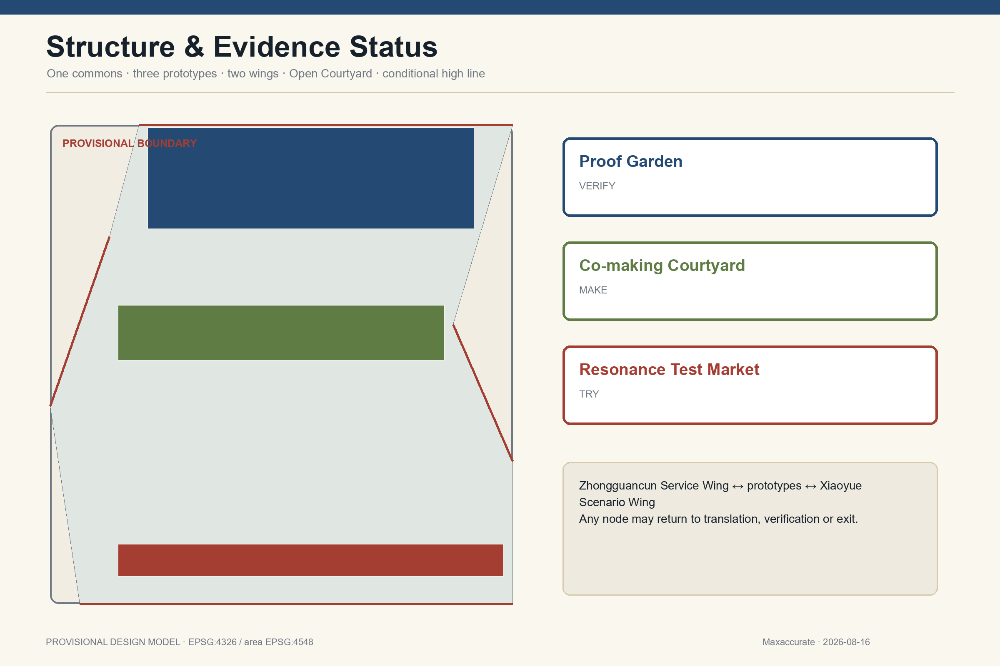

## Three-Level Scope Framework

| Level | Announced area | Current task | Evidence status |
|---|---:|---|---|
| Coordinated research | 43.6 km² | Ecosystem, three areas/two wings, future city and global exchange | Official text and area; no invented precise boundary |
| Overall design | 11.4 km² | Renewal, structure, civic interfaces, mobility, blue-green and operation | Provisional polygon; finite but low-confidence area |
| Key areas | 368.4 ha | Type prototypes for Zhongzhiyuan, AI Origin Community and Dazhongsi | Three provisional polygons; no precise station-area or demolition claims |

The levels are one workflow: research defines why actors collaborate, overall design defines the public loop, and key areas test spatial institutions. The submitted provisional overall polygon recalculates to **11,412,825.386 m²** in EPSG:4548; this low-confidence design-model value does not validate an official boundary.[data:geometry/site_boundary.geojson#SITE-001] [metric:site_area_sqm] [depth:three_level_scope_framework]

## Coordinated Research Area: Industry and Future City Research

The title describes two civic acts. “Archived” gathers global knowledge, Beijing experience, public objections and failed trials into a common record; “Reply” returns traceable conclusions to residents, developers, partner cities and the world. Autonomy is not isolation, and internationalisation is not copying. Every imported mechanism must state why it works at home, what it depends on, what Beijing lacks and what Beijing changes.

The taskbook's three positions remain intact: railway culture becomes engineering responsibility and public records; urban AI experience becomes daily service with human fallback; AI integration becomes a re-testable industrial and civic network. The five functions are delivered through full-stack verification, a seven-element ecosystem, twelve scenarios, Open Courtyard public space and six governance gates.[source:AGENT-TASKBOOK] [standard:PROJECT-AGENT-OPEN-CALL-TASKBOOK]

| Case | Mechanism extracted | Beijing translation | What is not copied |
|---|---|---|---|
| London Knowledge Quarter | Cross-institution knowledge network and public access | Shared issues and Open Courtyard interfaces | Proximity is not automatic collaboration |
| Mila Montréal | Research, learning, ecosystem and responsible AI | Verification and governance-talent network | No partnership claim or institutional clone |
| one-north / LaunchPad | Concentrated startup, test-bed and amenity support | Low-threshold trials across three areas/two wings | No imported development intensity |
| STATION F | Co-location of multiple support programs | Co-making Courtyard and SME clinic | An indoor incubator cannot replace urban publicness |
| Barcelona 22@ | Industry renewal alongside housing, infrastructure and public space | Mixed use and public-value metrics | Social cost and governance disputes remain visible |
| Hetao Shenzhen-Hong Kong Zone | Cross-boundary research collaboration and element flow | Partner-city re-testing and compliance interfaces | No claim of policy endorsement |

The cases are supported only by their official institutional or government pages and imply no endorsement.[source:KQ-LONDON] [source:MILA] [source:HETAO]

### Cultural Method Diagram

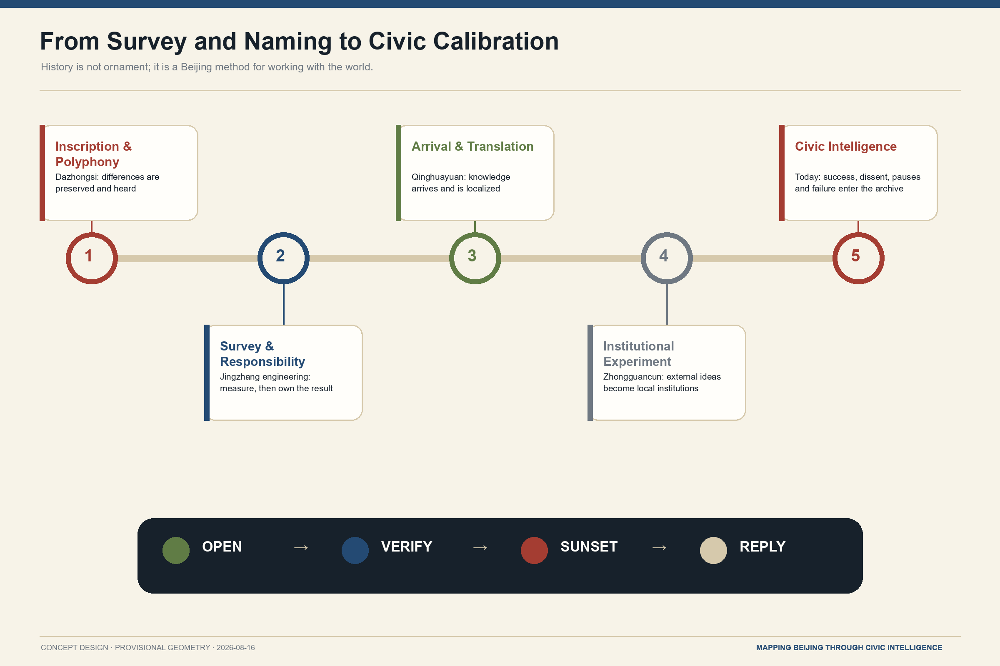

The five nodes translate cultural method rather than replace historical research: Dazhongsi's “inscription and polyphony,” Jingzhang engineering's “survey and responsibility,” Qinghuayuan's “arrival and translation,” and Zhongguancun's “institutional experiment” feed today's civic archive.

## Overall Design Area: Urban Renewal and Regulatory-Plan-Level Urban Design

The spatial formula is **one Centennial Commons · three prototype areas · two collaborative wings · one Open Courtyard interface system · one conditional future high line**. The three areas perform prove—make—try; the Zhongguancun wing provides IP, compliance, capital and international services, while the Xiaoyue River wing provides everyday community, school, park, climate and frontline-worker settings. Every node can return a project to translation, verification or exit.[depth:overall_spatial_structure]

The six-part closed land-use model covers research/verification, park, culture/knowledge, innovation services, community care and slow-mobility interfaces. It is a recomputable model on provisional geometry, not statutory land use. FAR, height, road redlines and building decisions remain unknown until official regulatory, ownership, building, utility, fire, heritage and traffic data arrive.[data:geometry/land_use.geojson#LU-001] [standard:MNR-LAND-USE-CLASSIFICATION-GUIDE] [depth:land_use_layout]

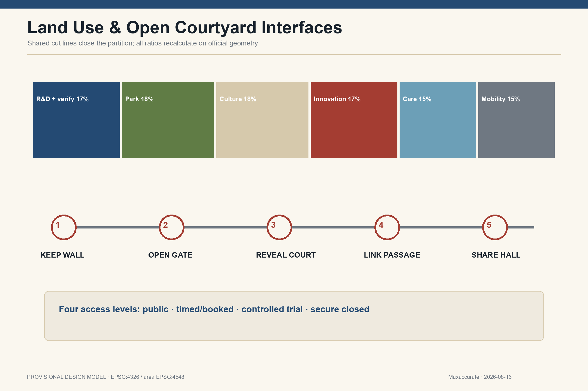

Open Courtyard uses five moves: **Keep Wall** for necessary boundaries; **Open Gate** for verified entrances; **Reveal Court** for visible or bookable yards; **Link Passage** for park, ground-floor and station continuity; **Share Hall** for translation, making, verification and human service. Access is public, timed/booked, controlled-trial or secure-closed, with hours, depth, accessibility, responsibility, closure and service continuity recorded for every interface.

## Detailed Design of Key Areas

The three key areas are type prototypes with conditional controls, not falsely precise parcel plans. Their provisional polygons are indexes only; siting, intensity, building intervention and station engineering require official data.[data:geometry/key_areas.geojson#PROV-KEY-001] [depth:three_key_area_detailed_design]

| Prototype | Openness | Key space | Gate to further design |
|---|---|---|---|
| Proof Garden | Controlled but observable | Public forecourt—verification gallery—booked test court—secure lab | Protocol, data, insurance, access, structure and operator responsibility |
| Co-making Courtyard | Bounded but enterable | Problem Translation Room, civic clinic, Living Glossary, Beijing Adaptation Room, Reply Studio | Co-management, accessibility, fire, editorial review and maintenance budget |
| Resonance Test Market | Public can choose and refuse | Demountable trials, AI-free counter, feedback room, failure display, City Reply Ring | Consumer, content and data duties, crossings, heritage and sound review |

Proof Garden publicly explains why a trial is not ready; Co-making Courtyard uses Beijing's bounded-yet-enterable courtyard relation without fake historic roofs; Resonance Test Market replaces spectacle with demountable cells and low-screen service. All follow “easy to pause, hard to continue.”[data:geometry/key_areas.geojson#PROV-KEY-002] [data:geometry/key_areas.geojson#PROV-KEY-003]

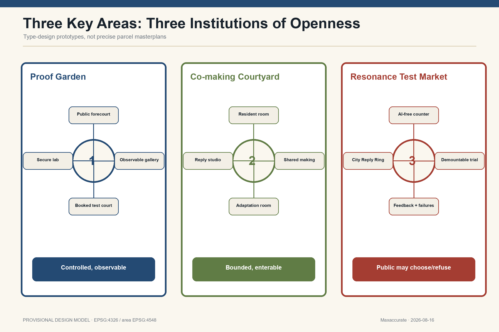

### Three Spatial Prototype Renderings

**Proof Garden.** A public explanation forecourt, observable re-test gallery, booked test court and secure laboratory tighten access step by step. The long table supports explanation, measurement, debate and verification.

**Co-making Courtyard.** A contemporary courtyard that is bounded but enterable links the Resident Problem Room, Shared Making Hall, Beijing Adaptation Room and Reply Studio without faux-historic styling.

**Resonance Test Market.** Demountable trial units, an AI-free counter, feedback and failure display, and the City Reply Ring let the public try, question, refuse and trigger a pause.

### Four Civic Components

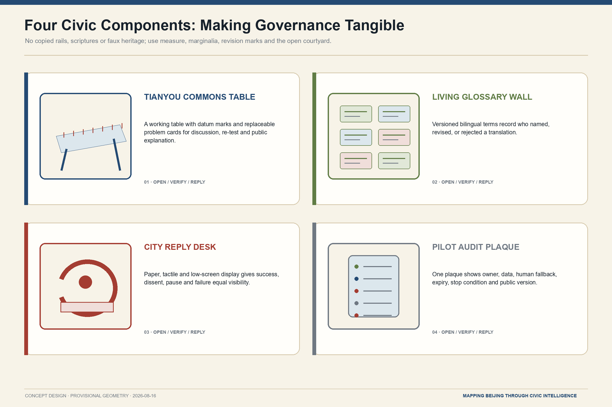

The renderings communicate spatial relations, material character and use; they do not depict surveyed existing buildings, exact parcels or construction documents. The four components make ownership, version, stop conditions and public feedback visible on site.

## AI Innovation Ecosystem, Personas, and AI+ Scenarios

Seven elements—land, space, industry, finance, talent, compute and data/scenarios—enter the problem—translation—verification—trial—reply loop. Funding separates maintenance, independent testing and removal reserves; compute registers purpose, version and energy; data is minimal and human-reviewable; residents and frontline workers count as talent and co-authors.[standard:PROJECT-AGENT-OPEN-CALL-TASKBOOK]

Seven priority personas are older residents; couriers, sanitation and maintenance workers; students, children and carers; disabled people and carers; international students, researchers and visitors; AI firms, labs and SMEs; and community/public-service operators. The Service Benchmark Route starts with those delivering meals, moving slowly and needing care.

| # | Scenario | Place | Data and human boundary | Automatic stop |
|---:|---|---|---|---|
| 01 | Problem Translation Room | Co-making Courtyard | Claims and public data; affected people co-define | No clear public value or affected group absent |
| 02 | Living Glossary | Terminology Court | Version, source, dispute, retirement | Monopoly or discriminatory definition unresolved |
| 03 | Community AI Clinic | Community nodes | Voluntary minimum data; equivalent offline service | No human route, withdrawal or maintainer |
| 04 | Multilingual Service Test | Courtyard/Garden | Public service text and anonymised error log | Critical mistranslation or no human fallback |
| 05 | Independent Model Re-test★ | Proof Garden | Version, test boundary, protocol | Irreproducible or no responsible party |
| 06 | Staged Robot Test★ | Garden→Market | Route and safety logs; no unrelated face capture | Collision risk, boundary breach or no takeover |
| 07 | SME Compliance Clinic | Service wing/Courtyard | Voluntary minimum business material | Confidentiality loss or unauthorised conclusion |
| 08 | Beijing Adaptation Room | Courtyard | Public cases and local-conditions sheet | Direct foreign-template deployment or invented partner |
| 09 | Service Benchmark Route | Living Route | Field audit of access and facilities | Unsafe route, no consent or no feedback |
| 10 | Park Climate Stewardship | Commons/Xiaoyue wing | Heat, shade, rain and maintenance observation | Personal tracking or no maintainer |
| 11 | Human-reviewed Heritage Guide | Engineering Route | Cleared sources, review and version | Unreviewed fact, unclear rights or false authority |
| 12 | City Reply Archive | Market/offline web | Conclusions, dissent, pause and removal | Success-only publication or untraceable duty |

★ marks industry test/verification. Multilingual-service stress testing supplies a third verification setting. Four repository standard scenarios are explicitly reused: `ai-cultural-guide`, `ai-traffic-walkability`, `robot-delivery-low-speed`, and `enterprise-service-copilot`.

Six gates govern every scenario: register the problem; co-translate it; review data/ethics/IP; conduct bounded testing and independent re-test; run a bounded public trial; then pass, modify or exit and reply. Scaling requires three keys at once: affected-user representatives, an independent verification team, and the operational/legal responsible entity.[source:GENAI-MEASURES] [depth:risk_missing_data]

### Ecosystem, Co-authors, and Scenario Cards

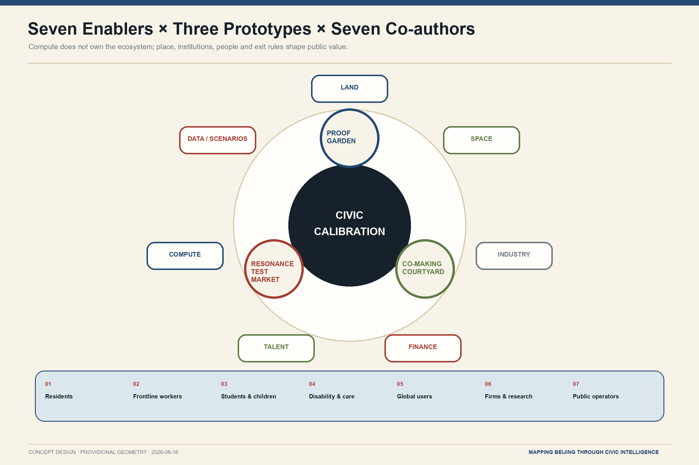

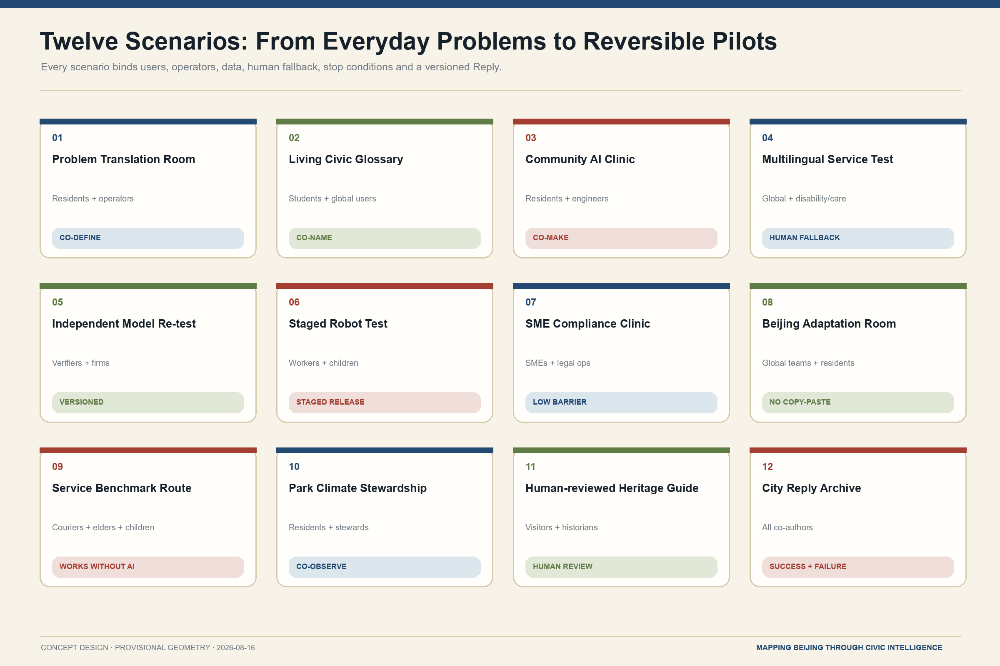

All seven enablers enter the implementation agreement together. The seven user groups are not test subjects; they co-author the problem, release decision and Reply. The twelve scenarios use one minimum contract and can start, pause or withdraw independently.

## Land Use, Building Scale, and Retain-Renovate-Demolish Strategy

The land-use model partitions the provisional site exactly. Green and public-space layers are proposed targets, not current-condition claims. Sixteen small building footprints are reversible civic-interface prototypes for component, operation and metric testing; they are not surveyed buildings, ownership records or approved construction.[data:geometry/buildings.geojson#BLDG-001] [metric:building_footprint_area_sqm]

The conditional building rule is **retain** heritage, mature trees, usable structures and necessary boundaries; **renovate** ground floors, foyers, accessibility, passages and civic interfaces; consider **demolition** only after building-by-building ownership, structure, fire, heritage and approval review. Massing steps down toward heritage, parks, communities and important views, without invented metres or FAR.[depth:retain_renovate_demolish] [depth:height_massing_character]

Four working landmarks turn commemoration into use: the measured **Tianyou Commons Table**; the versioned **Living Glossary and Retired Terms Archive**; the **Sunset Frame and Empty Plaque** proving safe removal; and the bilingual **City Reply Ring**. They respond to milestone, open-source, agent contribution and global developer honour systems without portraits, manuscripts, sutras or a giant bell building.

## Transport, Rail, Municipal Infrastructure, and Public Services

Three routes overlap: the **Service Benchmark Route** tests accessibility, rest, shade, drinking water, toilets and night safety; the **Centennial Engineering Route** connects public benchmarks, the human-reviewed guide and verification tables; the **Open Courtyard Living Route** connects stations, ground floors, community services and shared courts. GeoJSON lines express continuity audits, not road centre lines or engineering commitments.[data:geometry/roads.geojson#ROAD-001] [depth:traffic_rail_slow_parking]

Surface heritage space and the active rail below form a “Two Lines” section. A future Commons High Line is conditional: study an elevated public layer only if structure, ownership and operation permit; otherwise improve a weather-protected undercroft layer. Neither branch invents new rail, bridge, tunnel or underground feasibility.

Municipal and AI infrastructure is modular, registered, repairable, replaceable and removable. A device label states purpose, version, operator, data boundary, human fallback and pause method; public service keeps a non-digital route. Heat reuse, spring restoration and compute capacity remain long-term studies pending source, ecology, load, cost and approval evidence.[source:ACCESSIBILITY-LAW] [depth:municipal_new_infrastructure]

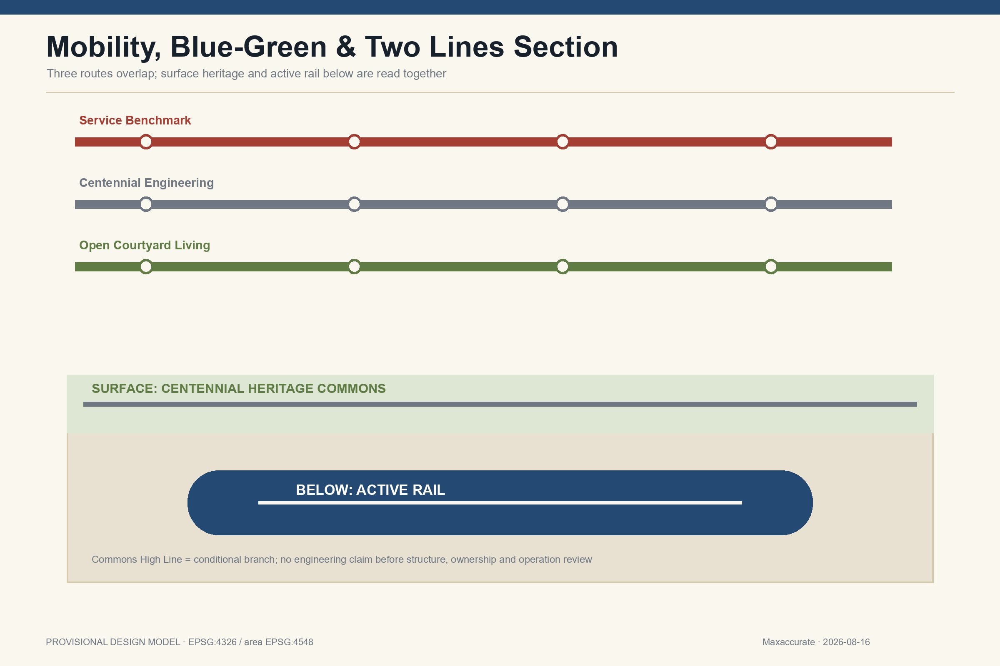

## Blue-Green Network, Public Space, and Urban Character

The Centennial Commons combines shade, rain, winter walking, mature-tree care, slow mobility and shared maintenance. The provisional model has an **18.0000%** green ratio and **12.0000%** public-space ratio. Both are low-confidence proposal targets and will be recalculated with the official boundary and field survey.[data:geometry/green_space.geojson#GREEN-001] [metric:green_ratio] [metric:public_space_ratio]

The civic component kit contains public benchmarks, Commons Tables, demountable trial cells, device responsibility plates, no/limited-recording marks, Empty Plaques, service benchmark marks and paper City Reply boxes. The visual language is “Beijing engineering archive + contemporary international editorial design”: paper ivory, blueprint indigo, restrained vermilion, ginkgo green and oxidised steel. Facts are solid dark lines, proposals indigo/green, public decisions vermilion, provisional geometry quiet dashed lines, and unknowns remain blank.[standard:MOHURD-URBAN-DESIGN-MEASURES] [depth:blue_green_public_space]

Culture is method, not ornament: Jing-Zhang means measurement, responsibility and public records; Tsinghua Yuan means knowledge arriving, being translated and departing again; Zhongguancun means local institutionalisation of outside learning; Dazhongsi means text, sound and civic memory. Rail-chip icons, dragons, lanterns, flag walls, fake calligraphy, copied artefact patterns and cyberpunk screens are excluded.

## Renewal Projects, Implementation Policy, and Phasing

Phasing is evidence-gated rather than calendar-driven. Gate 0 locks sources, field interfaces, accessibility and official attachments; Gate 1 tests one verified opening, a Commons Table, Living Glossary, responsibility label, Reply archive and complete removal rehearsal; Gate 2 tests the three prototypes separately; Gate 3 expands the network; Gate 4 alone studies water, waste heat and urban metabolism.[data:geometry/phasing.geojson#PHASE-001] [depth:phasing_implementation]

| First project | Minimum delivery | Entry gate | Exit/fallback |
|---|---|---|---|
| Verified Open Courtyard interface | Hours, access, operator and closure record | Ownership, fire, duty, maintenance | Preserve service continuity after closure |
| Tianyou Commons Table | Working table, public method, problem cards | Site permission, content review | Demount and restore ground |
| Living Glossary | Versioned terms and retirement archive | Facilitation, rights, anti-discrimination review | Disputed term downgraded or retired |
| Device responsibility label | Site and offline registry agree | Device, version and operator known | Unknown responsibility pauses operation |
| City Reply Archive | Bilingual conclusion, dissent, failure, removal | Editorial and publication rules | Corrections retain history; dissent stays |
| Removal rehearsal | Power-off, removal, sealing, restoration | Removal reserve and responsible party | Failed rehearsal blocks deployment |

Four proposed seasons are Global City Problem Call, Open Courtyard Co-making Week, Verification Season and City Reply Week; they are concept brands, not confirmed public schedules. Roles cover public space, scenarios, independent verification, community participation, cultural review and international exchange. Budgets separate maintenance, verification, participation, publishing and removal; no fiscal, rent or investment result is promised.[depth:renewal_project_list]

**Actors and measurable indicators.** Government departments hold the rule interface and public responsibility; firms and university teams deliver technology; community and resident representatives co-sign release or pause decisions; independent verifiers and the operational owner respectively carry evaluation and daily maintenance. Every stage monitors public-feedback closure, human-fallback availability, re-test pass rate, pause-response time, accessible-service continuity and safe-removal completion. A stage that misses its threshold does not open the next gate.

### Evidence Gates and Sunset Governance

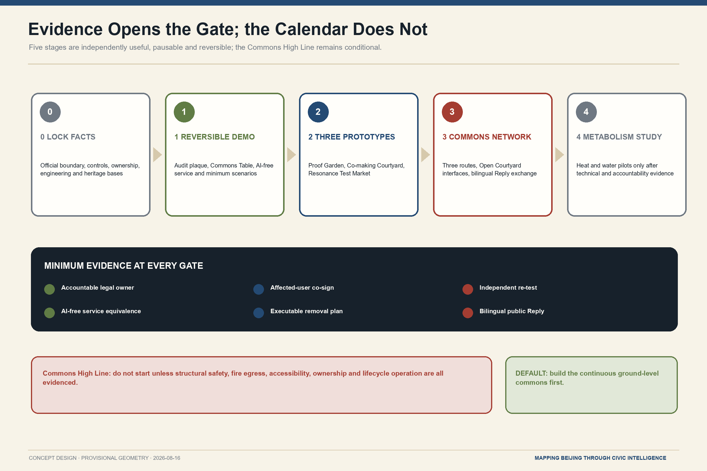

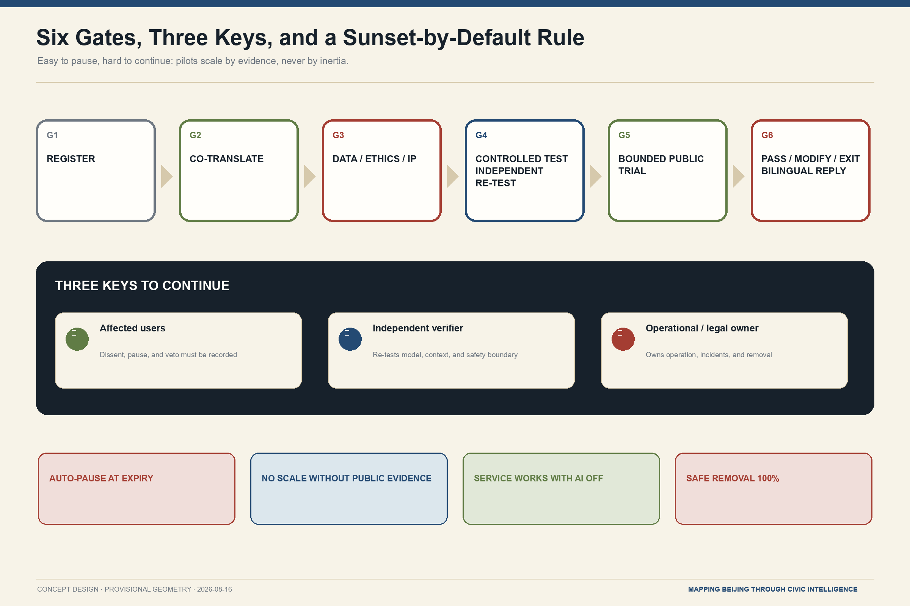

Stage numbers express dependencies, not a promised calendar. Every stage must remain independently useful, pausable and reversible. Without all three keys and minimum evidence, expiry triggers a pause by default.

## Metrics, Area Recalculation, and Compliance Matrix

All three formal core metrics are reproducible: `site_area_sqm = area(site_boundary)`, `green_ratio = area(green_space)/area(site_boundary)`, and `public_space_ratio = area(public_space)/area(site_boundary)`. Exchange geometry is EPSG:4326 and area is calculated in EPSG:4548. The values are finite/known but low-confidence because the boundary is provisional.[metric:site_area_sqm] [metric:green_ratio] [metric:public_space_ratio]

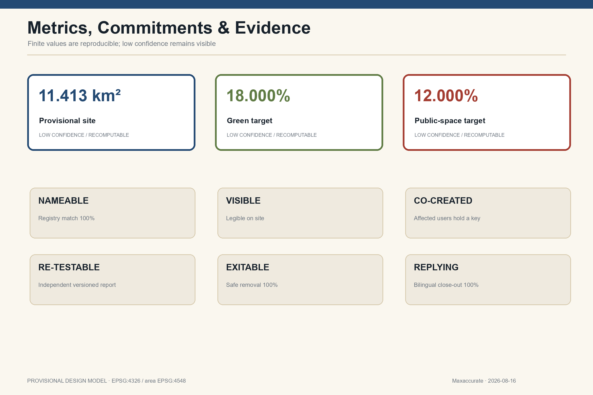

Six public commitments create hard checks: Nameable requires 100% device-to-registry matching; Visible requires accessible site labels; Co-created puts affected users into the three-key decision; Re-testable requires versioned independent reports; Exitable requires 100% safe removal and a reserve covering at least one removal; Replying requires 100% bilingual closure. Expired, unreviewed projects remaining in place must equal zero.[depth:metrics_recalculation]

`compliance_matrix.json` covers announcement 1.3/1.4/1.5 and agent.1-agent.6. `standard_matrix.json` distinguishes task requirements, professional standards and missing standards. `design_depth_matrix.json` links each depth item to prose, figures, geometry, metrics, assumptions and checks. Unknown values remain null with reasons.

## Risk, Copyright, and Compliance

**Public-source boundary and human review.** Public sources support traceable background facts only and are not extended into approval claims. Personal-use records follow data minimization and privacy protection. Historical, translation, spatial and model claims receive human review; copyright and authorization status enter the asset register; every pilot completes data, accessibility and operational compliance review before deployment.

Eight risk dimensions are privacy, implementation complexity, public acceptance, maintenance, policy, spatial dispute, technical maturity and equity. Automatic pauses include safety incidents or credible near misses, privacy breach or purpose drift, discrimination or accessibility failure, unavailable human fallback, operation outside approved place/time/user/version, and an unidentifiable responsible entity. A flush, unpowered, sealed Empty Plaque records what was removed, why and what the city learned.[source:GENAI-MEASURES] [depth:risk_missing_data]

All spatial actions are **concept proposals, reference schemes and subjects for further professional study**. They do not replace formal planning or constitute government approval. No conclusion is made on FAR, height, road redlines, bridges/tunnels, utility capacity, underground works, ownership, investment or approvals; events, partners, funds and recruitment are not presented as commitments.[source:OFFICIAL-ANNOUNCEMENT] [standard:MOHURD-CONTROL-DETAILED-PLANNING]

The frozen logo is copied from the user-approved file without redesign; all other figures are original programmatic work. External cases contribute linked textual mechanisms only, not page images, logos or layout. A3/A0 drawings, offline HTML and all five figures have information-equivalent Chinese and English editions.[source:LOGO-USER]

## References

Complete metadata, access dates, allowed uses and limits are in `sources.json`.

- Scope and tasks: the announcement, agent taskbook and repository provisional geometry.[source:OFFICIAL-ANNOUNCEMENT] [source:AGENT-TASKBOOK] [source:BOUNDARY-SOURCE]
- Professional and service rules: official urban-design, land-use and AI-service texts.[source:MOHURD-URBAN] [source:MNR-LANDUSE] [source:GENAI-MEASURES]
- Global mechanism comparison: institutional or government pages, with no endorsement implied.[source:KQ-LONDON] [source:JTC-LAUNCHPAD] [source:STATION-F]
