# 群智归卷，京华回信

**Mapping Beijing through Civic Intelligence**

这不是一栋地标建筑，也不是一个 AI App，而是一套面向京张铁路遗址公园及周边片区的城市使用说明书：全球知识与北京日常问题先共同翻译，再在受控空间复验，由公众选择、拒绝或修改，最终把成功、异议、暂停和失败整理成双语“城市回信”。核心动作是 **开院 · 复验 · 日落 · 回信**；核心原则是 **暂停容易，继续困难**。

## 设计依据与资料清单

方案把公告与智能体任务书作为任务依据，把仓库来源登记表作为事实权限边界。公告提供 43.6 km² 统筹研究、11.4 km² 总体设计和 368.4 ha 重点区域等文字与面积信息；现阶段未提供可验证坐标系的官方精确 polygon，因此本包沿用仓库临时粗略几何，明确标为 `provisional_constraint`。[source:OFFICIAL-ANNOUNCEMENT] [source:BOUNDARY-SOURCE]

外部官方页面只用于提取文化、创新生态与运营机制，不自动变成法定规划依据。结构化审计层由 `sources.json`、`assumptions.json`、九类 GeoJSON、`metrics.json` 和三类矩阵组成；官方边界到位后必须替换几何并重算所有面积、比例、图件和文字。[source:SOURCE-REGISTRY] [depth:risk_missing_data]

视觉资产全部为本项目原创程序图或用户已确认的正式 Logo；未复制历史照片、人物肖像、手稿、站名字体、文物纹样和机构商标。[source:LOGO-USER]

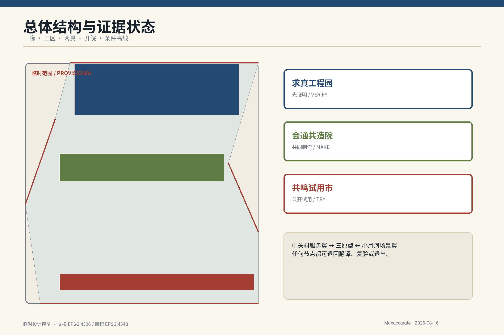

## 三层范围工作框架

| 层级 | 公告范围 | 当前设计任务 | 证据状态 |
|---|---:|---|---|
| 统筹研究 | 43.6 km² | 产业生态、三区两翼、未来城市与国际协作 | 官方文字与面积；不自行绘制精确红线 |
| 总体设计 | 11.4 km² | 更新框架、空间结构、公共界面、交通蓝绿和运营 | 临时 polygon；面积可复算但低置信度 |
| 重点区域 | 368.4 ha | 众智园、AI 原点社区、大钟寺三种类型化原型 | 三处临时 polygon；不得用于精确站城或拆改留结论 |

三层范围不是三套互不相干的图纸。统筹研究定义“为什么协作”，总体设计定义“怎样形成公共回路”，重点区域验证“什么空间制度可以运行”。提交的临时总体边界在 EPSG:4548 下复算为 **11,412,825.386 m²**，它是低置信度设计模型值，不反向证明官方边界。[data:geometry/site_boundary.geojson#SITE-001] [metric:site_area_sqm] [depth:three_level_scope_framework]

## 统筹研究范围产业与未来城市研究

主命题“群智归卷，京华回信”把“归卷”定义为收纳全球知识、北京经验、公众异议与失败记录，把“回信”定义为向居民、开发者、合作城市和世界发布可追溯结项。自主不是封闭，国际化不是复制；外部机制必须回答原场景为何有效、依赖什么、北京缺什么、北京改了什么。

三大定位按任务书原文保留：百年京张文化带被转译为工程责任与公开记录，都市 AI 生活体验带被转译为有人工兜底的日常服务，AI 融合创新带被转译为可复验的产业与公共协作网络。五大功能分别由全栈复验、七要素生态、十二场景、开院公共空间和六道治理门落实。[source:AGENT-TASKBOOK] [standard:PROJECT-AGENT-OPEN-CALL-TASKBOOK]

| 全球案例 | 只提取的机制 | 北京转化 | 禁止复制 |
|---|---|---|---|
| London Knowledge Quarter | 跨机构知识网络与公众接入 | 开院接口与共同议题 | 邻近不等于自动协同 |
| Mila Montréal | 研究、人才与负责任 AI 社群 | 求真复验与治理人才网络 | 不宣称合作或照搬机构 |
| one-north / LaunchPad | 创业、试验与配套集中 | 三区两翼低门槛试验 | 不移植开发强度 |
| STATION F | 多类支持项目共址 | 共造院与 SME 门诊 | 不让室内孵化器替代城市公共性 |
| Barcelona 22@ | 产业更新与住房、基础设施、公共空间并行 | 混合功能与公共价值指标 | 不忽略治理争议和社会成本 |
| 河套深港科技创新合作区 | 跨边界科研协作与要素连接 | 伙伴城市互测和跨域合规接口 | 不写成已获政策支持 |

这些案例分别由其机构或政府页面支撑，仅作机制比较，不表示背书。[source:KQ-LONDON] [source:MILA] [source:HETAO]

### 文化工作法图谱

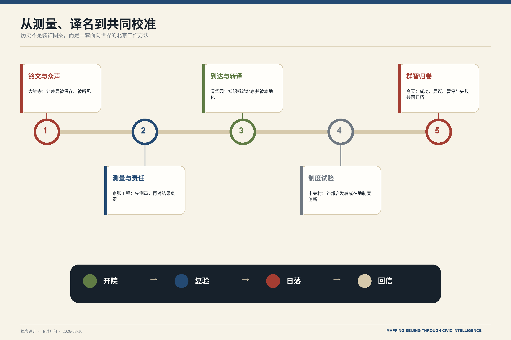

图中五个节点只表达设计转译关系，不替代历史断代研究：由大钟寺的“铭文与众声”、京张工程的“测量与责任”、清华园的“到达与转译”、中关村的“制度试验”，汇入今天的“群智归卷”。

## 总体设计范围城市更新与控规深度城市设计

空间总式为 **一条百年会通廊 · 三个设计原型区 · 两翼协作网 · 一套开院接口系统 · 一条远期条件高线**。三区分别承担“先证明—共同制作—公开试用”，中关村科技服务翼提供 IP、合规、资本与国际服务，小月河场景赋能翼提供社区、学校、公园、气候与一线劳动者的日常场景。任何节点都能把项目退回翻译、复验或退出，而不是北到南的单向流水线。[depth:overall_spatial_structure]

`land_use.geojson` 用同一临时边界的共同切割线形成六类闭合分区：科研复验、公园绿地、文化知识、创新服务、社区照护、慢行接口。该分区是可复算的设计模型，不是法定用地。容积率、高度、道路红线和具体拆改留保持 unknown，等待控规、权属、建筑、市政、消防、文保和交通资料。[data:geometry/land_use.geojson#LU-001] [standard:MNR-LAND-USE-CLASSIFICATION-GUIDE] [depth:land_use_layout]

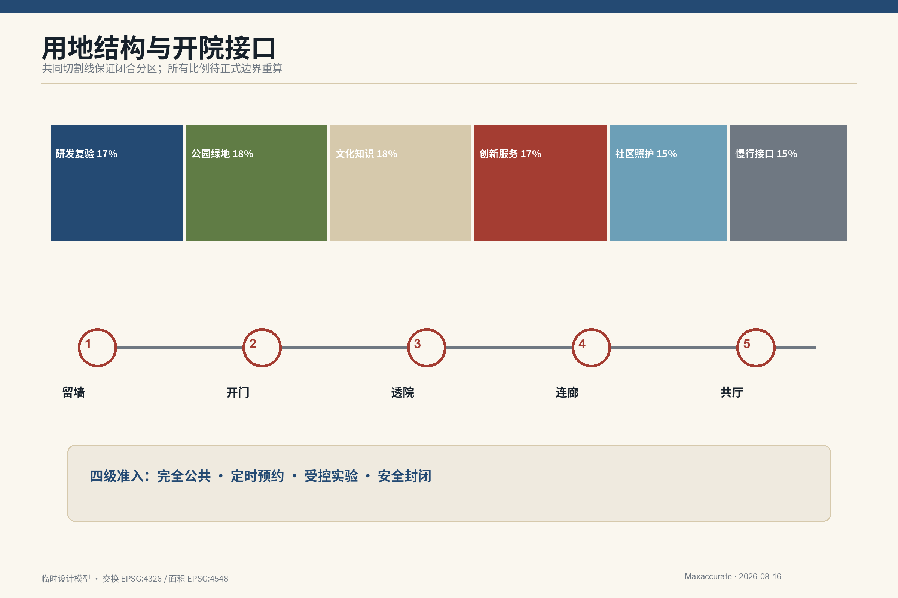

开院接口以五个动作工作：**留墙**保留必要边界，**开门**增加经核实入口，**透院**形成可见或预约院落，**连廊**连接公园、首层与站点，**共厅**承载翻译、制作、复验和人工服务。开放分为完全公共、定时预约、受控实验、安全封闭四级，每个接口登记时段、深度、无障碍、责任、关闭条件和服务延续方式。

## 重点区域详细设计

三处重点区采用“类型化设计原型 + 条件控制表”，不是伪精确地块总平。其位置以临时 polygon 为索引，具体落位、强度、拆改留和站城工程均待正式资料后深化。[data:geometry/key_areas.geojson#PROV-KEY-001] [depth:three_key_area_detailed_design]

| 原型 | 开放制度 | 核心空间 | 进入深化的条件 |
|---|---|---|---|
| 求真工程园 / Proof Garden | 受控但可观察 | 说明前场—复验廊—预约测试院—封闭实验室 | 测试协议、数据边界、保险、交通、结构与运营责任 |
| 会通共造院 / Co-making Courtyard | 有边界但可进入 | 问题翻译室、共造门诊、会通词院、国际适配室、回信编辑室 | 共管协议、无障碍、消防、内容审校与维护预算 |
| 共鸣试用市 / Resonance Test Market | 公众可选择和拒绝 | 可拆试用单元、AI-free 柜台、反馈室、失败展、城市回信环 | 消费者权益、数据内容安全、站点过街、文保与声环境 |

求真工程园不只展示通过项目，还公开“为什么不能进入日常生活”；会通共造院借鉴北京院落“有边界但可进入”的关系，不做仿古屋顶；共鸣试用市用可拆单元和低屏幕界面替代购物中心式科技大堂。三者共同执行“暂停容易，继续困难”。[data:geometry/key_areas.geojson#PROV-KEY-002] [data:geometry/key_areas.geojson#PROV-KEY-003]

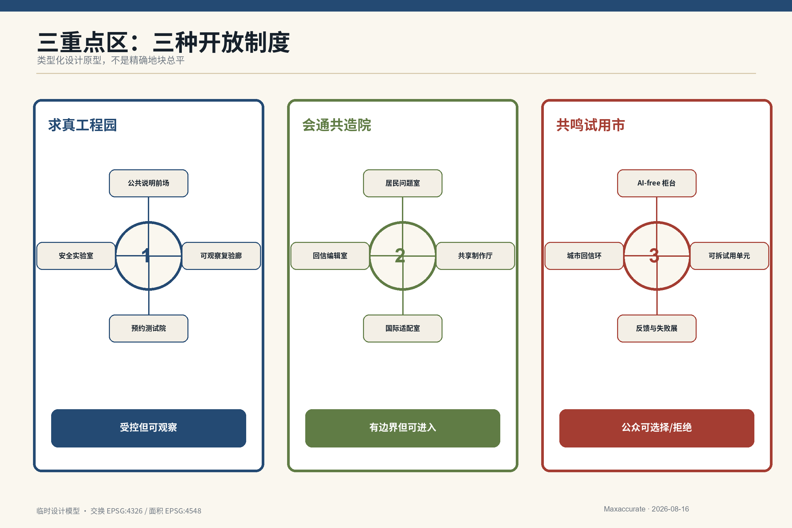

### 三个空间原型效果表达

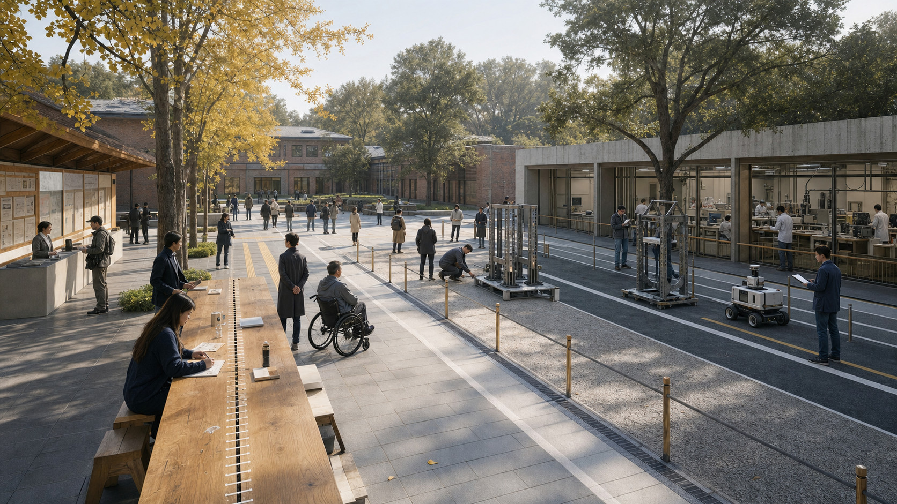

**求真工程园。** 公共说明前场、可观察复验廊、预约测试院与安全实验室逐级收紧；长桌兼具说明、测量、讨论与复验功能。

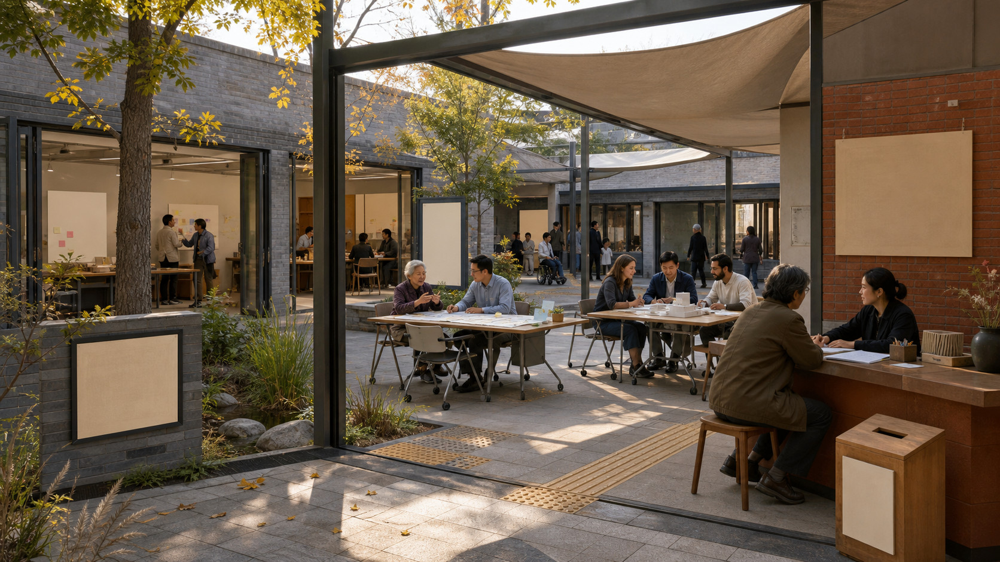

**会通共造院。** 以“有边界但可进入”的当代院落组织居民问题室、共享制作厅、国际适配室与回信编辑室，不做仿古院落。

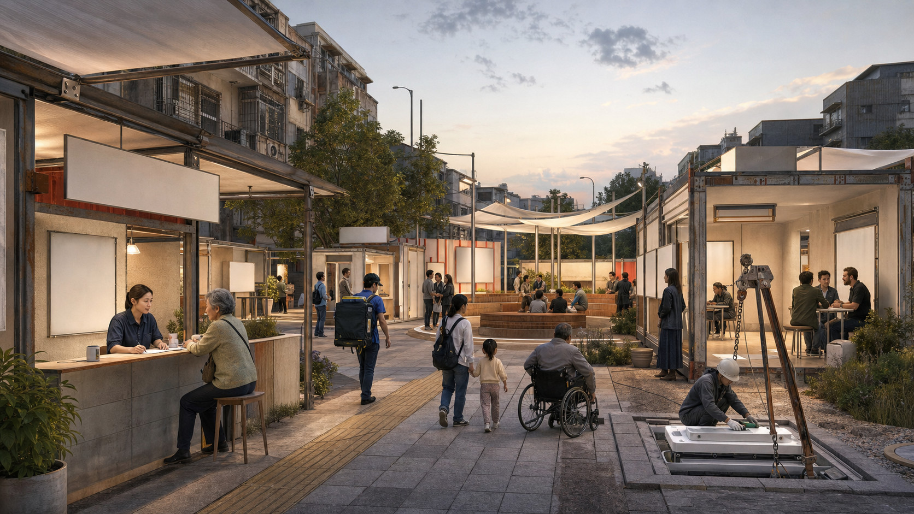

**共鸣试用市。** 可拆试用单元、AI-free 柜台、反馈与失败展、城市回信环并置，公众可以试用、质疑、拒绝并触发暂停。

### 四件公共构件

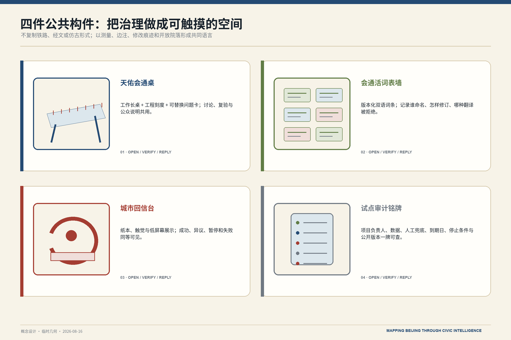

效果图用于传达空间关系、材料气质与使用场景，不表示现状建筑、准确地块或施工图。四件构件则把责任、版本、停止条件与公众反馈固定到现场。

## AI 创新生态、人才画像与 AI+ 场景

七要素生态把土地、空间、产业、资金、人才、算力、数据/场景组织进“问题—共译—复验—试用—回信”循环：资金须分列维护、复验和移除准备金；算力登记用途、版本与能耗；数据坚持最小必要与人工复核；人才包含居民和一线劳动者，不只服务开发者。[standard:PROJECT-AGENT-OPEN-CALL-TASKBOOK]

优先用户有七类：老年居民；骑手、快递、环卫与维护者；学生、儿童与监护人；残障人士与照护者；国际学生、研究者与访客；AI 企业、科研团队与中小企业；社区工作者与公共服务运营者。服务基准路线从“送饭的人、行动慢的人、需要照护的人”出发。

| # | 场景 | 空间 | 数据与人工边界 | 自动停止条件 |
|---:|---|---|---|---|
| 01 | 城市问题翻译室 | 共造院 | 诉求与公开资料；受影响者共同定义 | 公共价值不清或受影响者缺席 |
| 02 | 会通活词表 | 会通词院 | 版本、来源、争议与退役记录 | 单方垄断或歧视定义未处理 |
| 03 | 社区 AI 共造门诊 | 社区节点 | 用户自愿最小资料；线下等价服务 | 无人工服务、不可撤回或无人维护 |
| 04 | 多语公共服务测试 | 共造院/工程园 | 公开服务文本与匿名错误记录 | 关键误译或人工兜底失效 |
| 05 | 模型独立复验★ | 求真工程园 | 版本、测试边界、协议 | 不可重复或责任主体缺失 |
| 06 | 机器人分阶段测试★ | 工程园→试用市 | 路线与安全日志；不采无关人脸 | 碰撞险情、越界或无人工接管 |
| 07 | 中小企业合规门诊 | 服务翼/共造院 | 自愿提交最小企业材料 | 泄露秘密或形成未经授权结论 |
| 08 | 国际项目北京适配室 | 共造院 | 公开案例与本地条件表 | 直接部署外来模板或虚构合作 |
| 09 | 服务基准路线 | 开院生活线 | 无障碍与设施现场审计 | 路线不安全、无参与同意或不反馈 |
| 10 | 公园气候共护 | 会通廊/小月河翼 | 温湿度、树荫、雨洪与维护观察 | 越界采集行为或无人维护 |
| 11 | 京张人工审校导览 | 百年工程线 | 授权史料、审校和版本 | 史实未审、版权不清、AI 冒充权威 |
| 12 | 城市回信档案 | 试用市/离线网页 | 结项、异议、暂停、移除 | 只发布成功或责任不可追溯 |

★为产业测试验证场景；另有多语公共服务压力测试共同满足不少于三项验证场景的要求。仓库标准场景显式复用 `ai-cultural-guide`、`ai-traffic-walkability`、`robot-delivery-low-speed`、`enterprise-service-copilot`，其余为方案原生场景。

治理采用六道门：问题登记、公众与专业共译、数据/伦理/IP 审查、受控测试与独立复验、有界公众试用、通过/修改/退出与回信。扩大试点必须同时取得受影响用户代表、独立复验团队、运营与法律责任主体三把钥匙。[source:GENAI-MEASURES] [depth:risk_missing_data]

### 生态、共同作者与场景卡

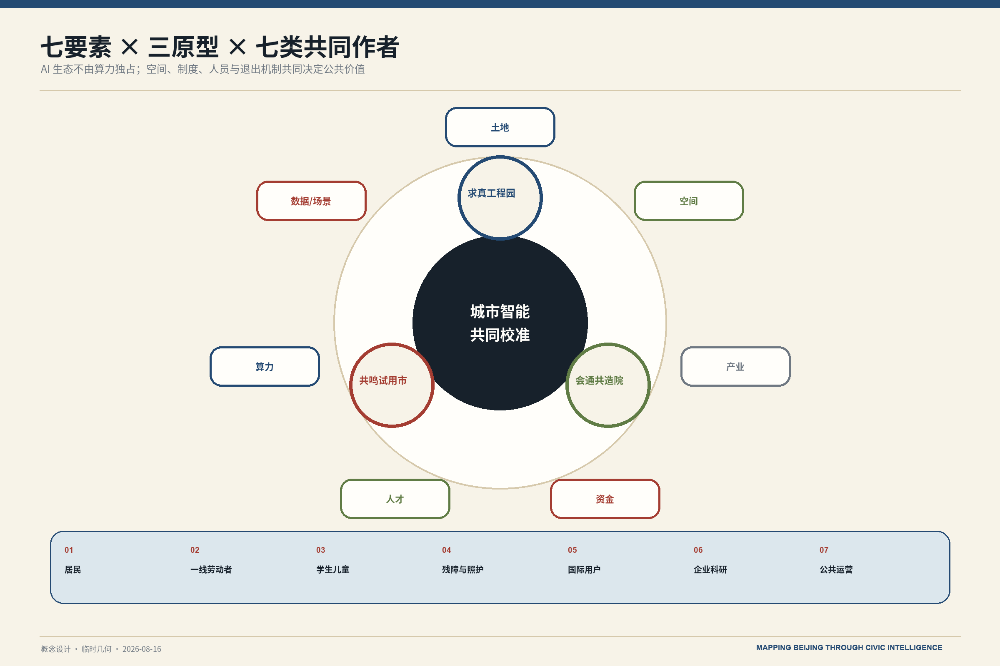

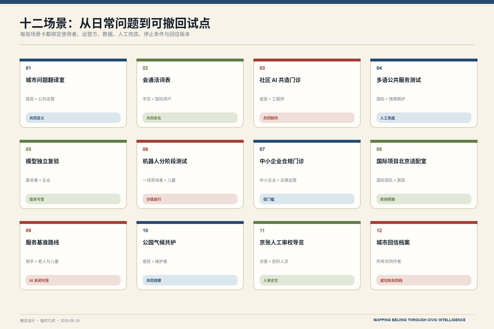

七要素必须同时进入实施协议；七类用户不是“被测试对象”，而是问题定义、放行和回信的共同作者。十二场景采用同一最小合约，可逐项启动、暂停与撤回。

## 用地、建筑规模与拆改留方案

用地模型完整分割临时边界，六类分区面积均由 EPSG:4548 几何计算；绿地和公共空间是设计目标层，并不宣称现状供给。建筑层只画 16 个可逆公共接口原型，用于演示组件、运营与面积复算，不代表现状建筑、权属或批准建设。[data:geometry/buildings.geojson#BLDG-001] [metric:building_footprint_area_sqm]

拆改留遵循条件逻辑：**留**遗产、成熟树木、可用建筑和必要安全边界；**改**首层、门厅、无障碍、连廊和公共界面；**拆**只列候选触发，不在缺少逐栋调查、权属、结构、消防、文保和审批时下结论。建筑高度向遗址、公园、社区和重要视线降阶，但不填未经发布的米数或容积率。[depth:retain_renovate_demolish] [depth:height_massing_character]

四个可使用地标是：带工程刻度与问题卡的**天佑会通台**；记录稳定/争议/退役词的**会通词院**；展示安装—暂停—移除—复原的**日落构架与空位铭板**；发布双语结项与异议的**城市回信环**。它们分别回应里程碑、开源成果、智能体贡献和全球开发者荣誉，同时避免肖像、手稿、经文和巨型钟形建筑。

## 交通、轨道、市政与公共服务设施

三条路线重叠而非彼此分离：**服务基准路线**检验无障碍、休息、遮阴、饮水、厕所和夜间安全；**百年工程线**连接水准点、人工审校导览和复验台；**开院生活线**连接站点、机构首层、社区服务与共造院。GeoJSON 中三条线仅表达连续性审计方向，不声称道路中心线或工程实施。[data:geometry/roads.geojson#ROAD-001] [depth:traffic_rail_slow_parking]

地上遗址公共空间与地下运行铁路形成“两线”剖面叙事；远期“会通高线”仅作为条件分支：若结构、权属和运营允许，研究高架公共层；否则转为桥下全天候公共层。两者都需专业团队深化，不虚构新轨道、桥隧或地下空间可行性。

市政与新基建采用“模块化、登记、可维修、可替换、可移除”：设备责任牌同步用途、版本、运营者、数据边界、人工兜底和暂停方式；公共服务保留非数字入口。涉及能源、余热、水系复流和算力容量的想法进入远期研究，待热源、水质、生态、负荷、经济和审批资料后判断。[source:ACCESSIBILITY-LAW] [depth:municipal_new_infrastructure]

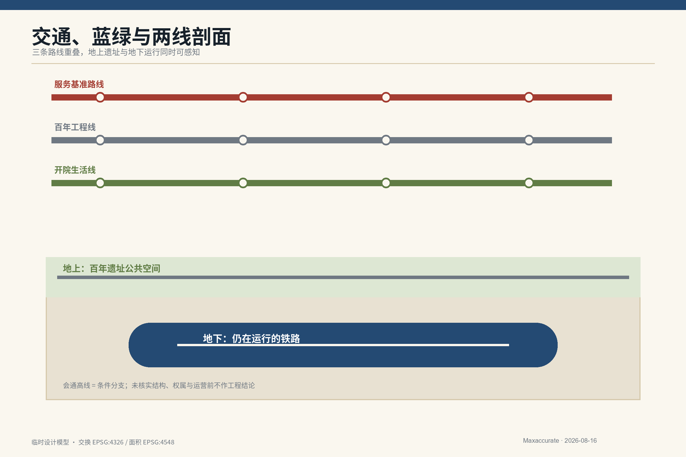

## 蓝绿空间、公共空间与城市风貌

蓝绿底盘以百年会通廊为公共主线，把遮阴、雨洪、冬季步行、成熟树木保护、慢行和共同维护纳入同一审计。临时模型的绿地比例为 **18.0000%**，公共空间比例为 **12.0000%**；两者是低置信度设计目标，正式边界与现状调查到位后复算。[data:geometry/green_space.geojson#GREEN-001] [metric:green_ratio] [metric:public_space_ratio]

公共空间组件库包括公共水准点、会通桌、可拆试用单元、设备责任牌、禁录/限录标记、空位铭板、服务基准标记和城市回信盒。城市风貌采用“北京工程档案 + 当代国际编辑设计”：纸本米白、蓝图靛蓝、克制朱砂、银杏绿和氧化钢灰；事实用深色实线，设计建议用靛蓝/绿，风险与公共决定用朱砂，临时几何用低对比虚线，未知留白。[standard:MOHURD-URBAN-DESIGN-MEASURES] [depth:blue_green_public_space]

文化不是装饰：京张铁路转译为测量、责任与公开记录；清华园转译为知识抵达、翻译和再次出发；中关村转译为外部启发的本地制度化；大钟寺转译为文字、声音与公共记忆。禁止铁轨芯片、龙灯笼、国旗拼贴、伪书法、复制文物纹样和赛博朋克大屏。

## 更新项目清单、实施政策与分期计划

分期不用日期倒推，而用证据开门。阶段 0 锁定来源、现场接口、无障碍和正式附件；阶段 1 做一个核实开院接口、会通台、词院、责任牌、回信档案和一次完整移除演练；阶段 2 分别验证三个原型；阶段 3 扩展会通网络；阶段 4 才研究水系、余热和更大尺度城市代谢。[data:geometry/phasing.geojson#PHASE-001] [depth:phasing_implementation]

| 首批项目 | 最小交付 | 进入门 | 退出/回退 |
|---|---|---|---|
| 经核实开院接口 | 时段、无障碍、运营与关闭登记 | 权属、消防、责任和维护 | 关闭后保持服务连续 |
| 天佑会通台 | 工作长桌、公开方法与问题卡 | 场地许可、内容审校 | 可拆移并复原地面 |
| 会通词院 | 版本化词表与退役词档 | 主持、版权、反歧视审查 | 争议词降级或退役 |
| 设备责任牌 | 现场信息与离线登记页一致 | 设备、版本、运营者明确 | 责任不清自动暂停 |
| 城市回信档案 | 中英结项、异议、失败、移除记录 | 编辑与公开规则 | 更正留痕，不删异议 |
| 移除演练 | 断电、拆除、密封、复原 | 移除准备金和责任人 | 失败则停止后续部署 |

运营四季为全球城市问题征集、开院共造周、求真复验季、城市回信周；这些是概念活动品牌，不是已确定政府日程。角色分为公共空间运营、场景运营、独立复验、社区参与、文化审校和国际合作，资金按维护、复验、参与、出版和移除分账，不承诺财政、租金或招商结果。[depth:renewal_project_list]

**参与主体与可衡量指标。** 政府部门负责规则接口与公共责任，企业和高校团队负责技术交付，社区与居民代表共同签署放行或暂停，独立复验团队和运营主体分别承担评估与日常维护。每一阶段监测公众反馈闭环率、人工兜底可用比例、复验通过比例、暂停响应时长、无障碍服务连续性和安全移除完成率；指标未达门槛即不进入下一阶段。

### 证据门与日落治理

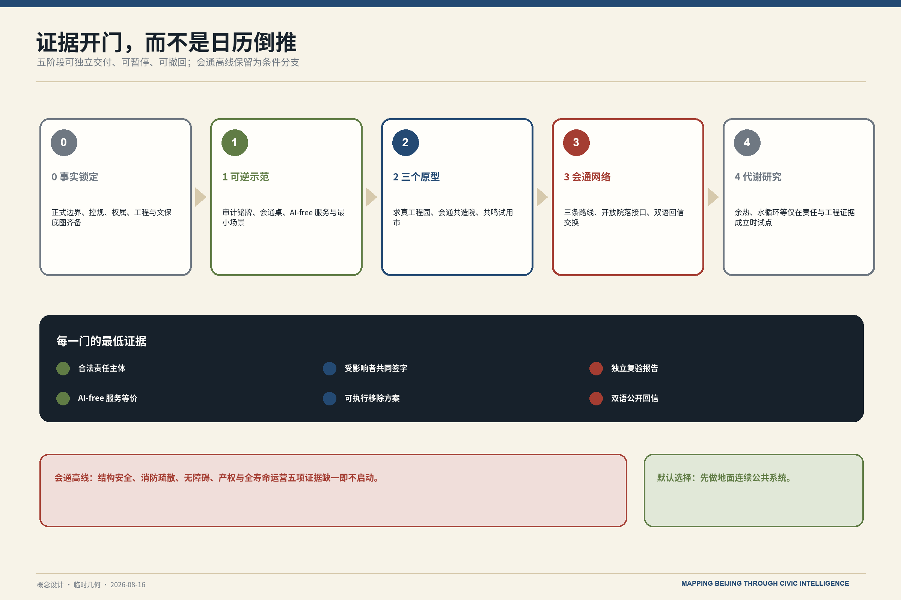

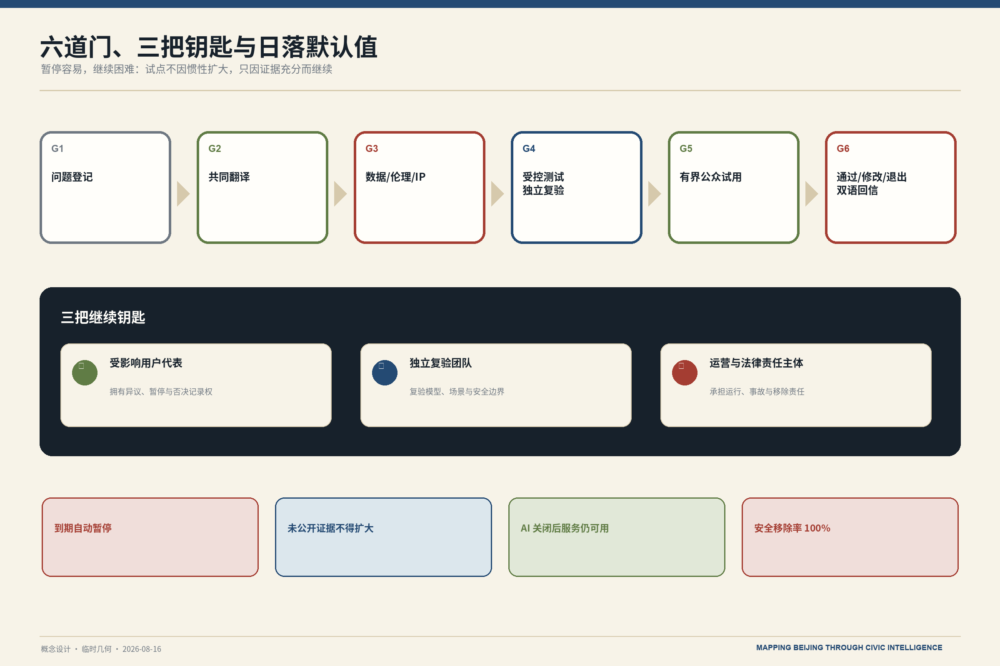

阶段编号只表达依赖关系，不承诺日历工期。每一阶段都须独立有用、可暂停、可撤回；未取得三把钥匙与最低证据时，默认到期暂停。

## 指标体系、面积复算与合规矩阵

三项 formal 核心指标均可从提交几何复算：`site_area_sqm = area(site_boundary)`，`green_ratio = area(green_space)/area(site_boundary)`，`public_space_ratio = area(public_space)/area(site_boundary)`；交换坐标为 EPSG:4326，面积统一转 EPSG:4548。由于边界为 provisional，数值虽为 finite/known，置信度仍为 low。[metric:site_area_sqm] [metric:green_ratio] [metric:public_space_ratio]

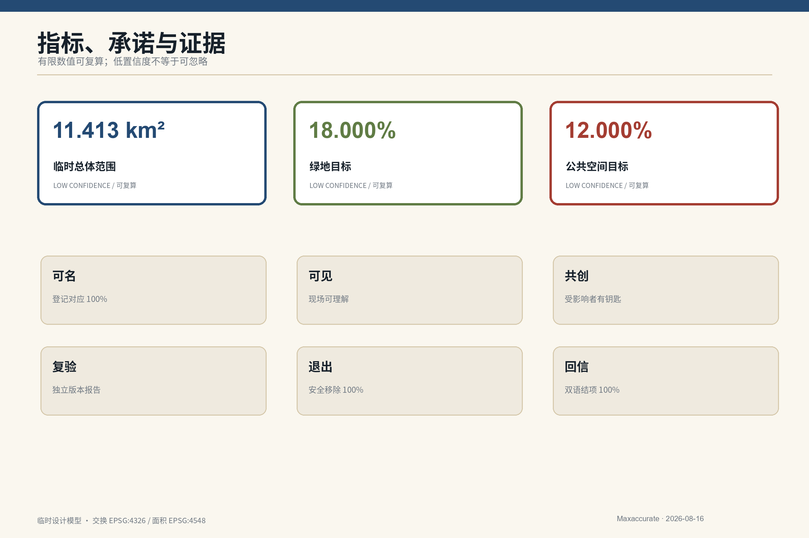

六项公共承诺提供硬核验：可名要求设备—登记对应率 100%；可见要求现场标签可达；共创要求受影响用户进入三钥决策；可复验要求版本化独立报告；可退出要求安全移除率 100% 且准备金覆盖至少 1 倍移除成本；会回信要求双语结项率 100%。到期未复核仍保留项目数必须为 0。[depth:metrics_recalculation]

`compliance_matrix.json` 覆盖公告 1.3、1.4、1.5 与 agent.1-agent.6；`standard_matrix.json` 区分项目任务、官方专业标准和缺失标准；`design_depth_matrix.json` 将每项深度挂到正文、图、几何、指标、假设和自检。未知数据保持 null 并写原因，不以综合分数掩盖差异。

## 风险、版权与合规说明

**公开资料边界与人工复核。** 公开资料只支撑可追溯的事实背景，不被延伸解释为审批依据；涉及个人使用记录时遵循最小化和隐私保护。历史、翻译、空间与模型主张均须人工复核，版权和授权状态写入资产登记，试点在部署前完成数据、无障碍与运营合规审查。

八维风险为隐私、实施复杂度、公众接受、运维、政策、空间争议、技术成熟度、公平包容。自动暂停触发包括安全事故或可信险情、隐私泄露或目的外使用、歧视或无障碍失败、人工兜底失效、越界运行、责任主体无法确认。移除后以齐平、断电、密封的空位铭板记录项目、决定和城市学习。[source:GENAI-MEASURES] [depth:risk_missing_data]

所有空间落地内容均为**概念建议、参考方案、可供专业团队深化研究**，不替代正式规划，不构成政府审定结论。方案不判断容积率、建筑高度、道路红线、桥隧、市政容量、地下工程、土地权属、投资和审批，也不把活动、合作、资金或招商写成已确定安排。[source:OFFICIAL-ANNOUNCEMENT] [standard:MOHURD-CONTROL-DETAILED-PLANNING]

正式 Logo 来自用户确认文件，保持原图不重绘；其余图件由本包程序化原创生成。外部案例只引用文字机制与链接，不复用页面图像、Logo 或版式。A3/A0、HTML 与五张核心图均提供中英文信息等价版本。[source:LOGO-USER]

## 参考资料

完整元数据、访问日期、允许用途与限制见 `sources.json`。

- 项目范围与任务：公告、智能体任务书和仓库临时几何。[source:OFFICIAL-ANNOUNCEMENT] [source:AGENT-TASKBOOK] [source:BOUNDARY-SOURCE]
- 专业与服务规则：城市设计、用地、AI 服务与无障碍公开文本。[source:MOHURD-URBAN] [source:MNR-LANDUSE] [source:GENAI-MEASURES]
- 全球机制比较：机构或政府官网，仅用于方法提取，不表示背书。[source:KQ-LONDON] [source:JTC-LAUNCHPAD] [source:STATION-F]
