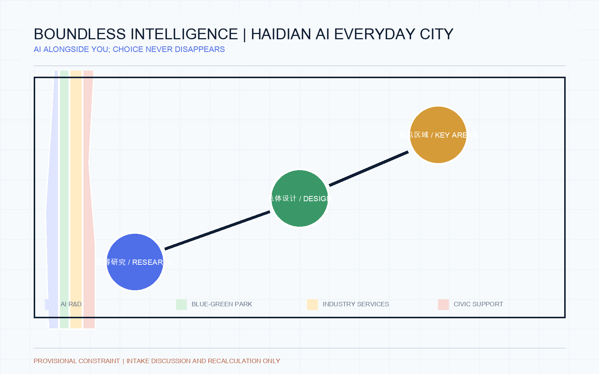
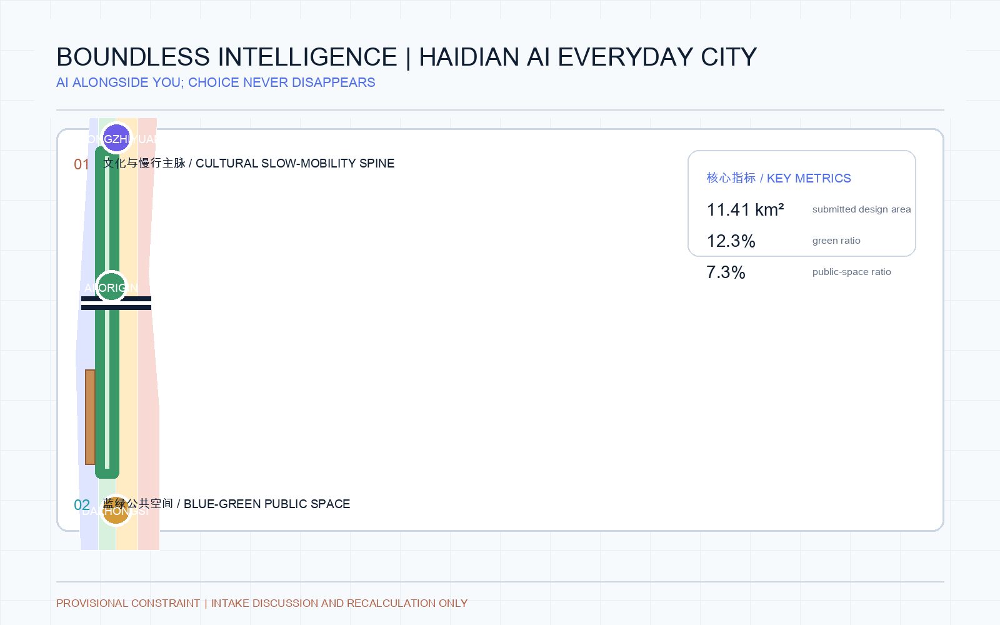
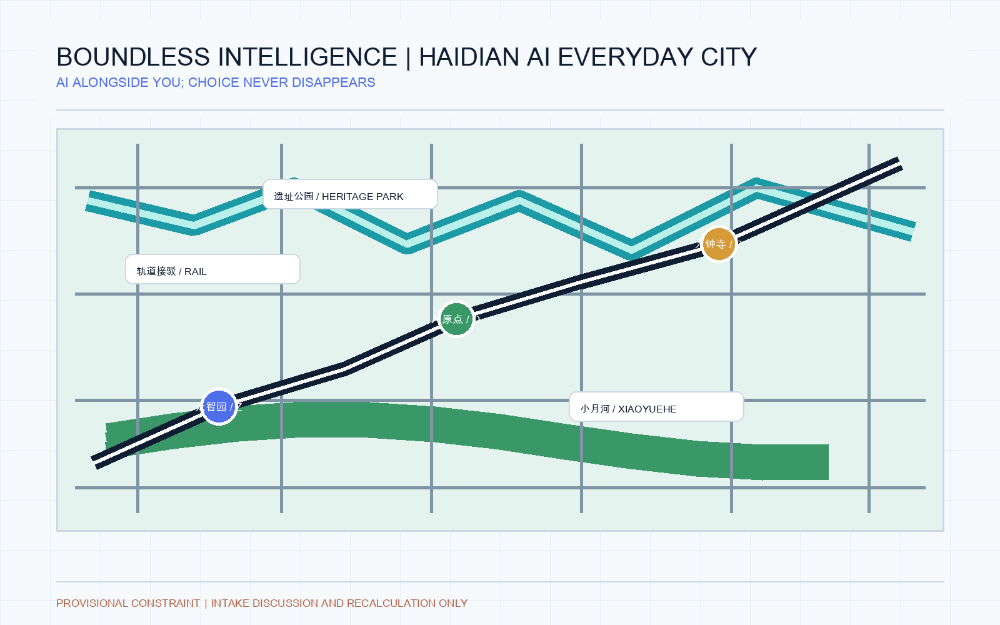
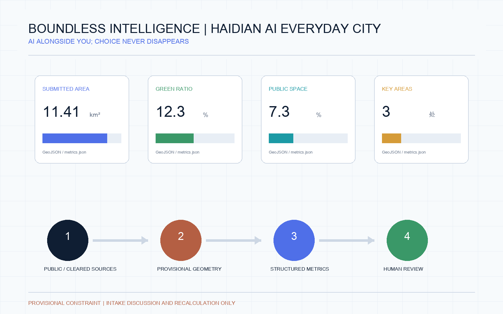

# Boundless Intelligence: Haidian AI Everyday City

> **Core concept — Boundless Intelligence.** Haidian's next stage of urban development should not merely put AI inside a phone. AI should become a visible, optional, explainable and human-substitutable layer of everyday city life. A person can travel, park, shop, eat, use public services and navigate the district without carrying a phone, while retaining cash, staffed counters, physical tickets, accessible service and non-biometric alternatives. This is an AI-agent-generated open co-creation proposal, not an approved plan, statutory redline, engineering conclusion or implementation commitment [source:AGENT-TASKBOOK] [depth:overall_spatial_structure].

The suggested name is **Boundless Intelligence: Haidian AI Everyday City**, with the line “AI alongside you; choice never disappears.” The visual mark combines an open ring, a city path and three network points. The open ring means entry and exit are both possible; the path joins transit, parking, retail, food and public service; the three points represent the three areas and two wings. Haidian brick red, Qinghe cyan, night electric blue and warm pedestrian white form the palette. No unlicensed typeface, portrait, enterprise mark or historical image is required [source:AGENT-TASKBOOK].

The proposal makes five judgments: start from arrival, parking, purchase, dining, public service and returning home; do not equate phone-free access with mandatory face recognition; connect mobility, parking, retail, food and public service through an explainable city-service layer; give the three areas differentiated roles; and reserve intensity, redlines, ownership, interfaces and engineering conclusions for official data and professional teams [standard:GENERATIVE-AI-INTERIM-MEASURES].

**One-day experience script.** “I leave my phone at home. At AI Origin Community I use an explicitly consented palm or face credential, a physical pass or a staffed counter; the system offers an accessible route. At Dazhongsi I enter parking by an authorized plate, physical ticket or staffed service. At lunch I choose face, palm, physical card, cash or human settlement. Before leaving I review the trip, payment and data permissions at a public service desk and withdraw unnecessary recognition permissions.” This is a design scenario, not an existing condition or deployment commitment [depth:ai_scenario_mapping].

## Design Basis and Source List

The formal package follows the public announcement and the cleared agent taskbook. It also reads the local site package, public source registry, enums, planning-limit ranges, standards snapshots, schemas and processed fact pack [source:OFFICIAL-ANNOUNCEMENT] [source:SOURCE-REGISTRY]. The submitted site and key-area polygons are repository-maintained rough provisional constraints. They are useful for design generation, visual review and intake self-check only; they are not official GIS/CAD redlines or precise scoring geometry [data:geometry/site_boundary.geojson#SITE-001].

The announcement gives three working scales: a 43.6 km² coordinated research area, an 11.4 km² overall design area and a 368.4 ha key detailed-design area. The package keeps these values as source-reported context and recomputes submitted geometry separately. Once official boundary files arrive, all derived layers, metrics, figures, HTML and PDFs must be regenerated [metric:site_area_sqm] [depth:existing_conditions_diagnosis].

## Three-Level Scope Framework

The coordinated research area organizes the innovation ecosystem, future-city strategy and regional connections. The overall design area translates that strategy into urban renewal, land-use structure, transport, public space, municipal interfaces and phasing. The key detailed-design area tests the strategy through three place-specific schemes. This is a workflow structure, not three new statutory boundaries [data:geometry/key_areas.geojson#PROV-KEY-001] [depth:three_level_scope_framework].

The overall spatial structure is one cultural and slow-mobility spine, three innovation nodes, two supporting wings and ten open experience scenarios. Zhongzhiyuan handles research, standards and safety testing; Beijing AI Origin Community handles university, open-source collaboration and transfer; Dazhongsi handles products, business and international exchange. The Zhongguancun service wing supports legal, IP, capital and talent services; the Xiaoyuehe scenario wing converts AI capabilities into daily public experience [data:geometry/key_areas.geojson#PROV-KEY-002].

## Coordinated Research Area: Industry and Future City Research

The ecosystem map links universities and research institutes, open-source communities, incubators, enterprise services, compute, data, standards, talent and public scenarios. It does not invent enterprise rosters, investment values, output figures or public funding promises. The land, space, industry, capital, talent, compute, data and scenario mechanisms are proposals for professional teams to test [source:AGENT-TASKBOOK] [standard:PROJECT-AGENT-OPEN-CALL-TASKBOOK].

Six public examples are used only as mechanism references: MaRS Toronto for public innovation learning; Station F for startup community and mixed space; London’s Knowledge Quarter around King’s Cross for institutional collaboration; Singapore one-north for research-life-entrepreneurship mixing; Helsinki AI Ethics for public governance discussion; and Pittsburgh Robotics Network for industry testing and talent networks. The examples are not local facts and do not imply transfer of their companies, funding or operating models [source:SOURCE-REGISTRY].

## Overall Design Area: Urban Renewal and Regulatory-Plan-Level Urban Design

The overall design proposal uses a full land-use partition, building-footprint evidence, a slow-mobility and innovation corridor, blue-green space, public interface and an initial phase layer. The design intent is to repair breaks between park, campus, enterprise and community rather than to claim a final redevelopment plan [data:geometry/land_use.geojson#LU-001] [data:geometry/roads.geojson#ROAD-001].

Retain, renovate, demolish and new-build categories remain methodological suggestions because ownership, existing-building survey, road redlines, utilities, heritage and fire conditions are incomplete. FAR, height, density, setbacks and facility standards remain pending official controls. The package records these gaps in machine-readable assumptions rather than manufacturing precise numbers [standard:MOHURD-CONTROL-DETAILED-PLANNING] [depth:development_intensity_controls].

## Detailed Design of Key Areas

**Zhongzhiyuan AI Acceleration Area** is a garden-like full-stack innovation district concept: a Qinghe interface, open testing, standards workshops, safety-governance demonstrations, low-carbon innovation exchange and external mobility connections. All are reference schemes pending ecological, flood-control, access and professional review [data:geometry/key_areas.geojson#PROV-KEY-001].

**Beijing AI Origin Community** is a near-campus transfer and talent-community concept: campus–park–street slow-mobility stitching, open-source publishing, result demonstration, IP and legal services, talent support, daily life and rail integration. It does not assume access to campus data or private property [data:geometry/key_areas.geojson#PROV-KEY-002].

**Dazhongsi AI Industry Cluster** is an urban intelligent-economy and international-exchange concept: station-area integration, four-quadrant walking connections, product and agent demonstration, content consumption, data-element discussion, business services and public-facing enterprise environments. Corporate marks and case materials require clearance [data:geometry/key_areas.geojson#PROV-KEY-003].

## AI Innovation Ecosystem, Personas, and AI+ Scenarios

The ten scenario cards cover open-source publishing, a safety-governance sandbox, an edge-compute service point, explainable AI walking guidance, an international demo lounge, a Qinghe low-carbon innovation corridor, a near-campus transfer street, a data-element meeting room, an AI daily-service street and a global AI week route. Each scenario is a conceptual test, has a spatial host, public-purpose boundary, operator to be confirmed and a human-review requirement [data:geometry/public_space.geojson#PUBLIC-001] [metric:public_space_ratio].

**Phone-free city-service layer.** 1) Public transport supports consented face or palm credentials, physical transit cards, paper tickets and staffed service, with a clear non-biometric lane. 2) Parking supports authorized plate recognition, physical tickets, human service and optional accounts for entry, wayfinding, payment and accessible transfer; the system exposes only necessary space and route information. 3) Retail and food venues can share a permissioned queue, payment and collection interface while retaining face, palm, physical card, cash and staffed settlement; biometrics must never be the only option. 4) Public service desks provide transport, events, community, accessibility and data-permission review, with printed proof and staff assistance. 5) Identity, payment and behavior data remain purpose-limited; users can review, withdraw or switch to human service. Any pilot requires privacy, security, accessibility and public-participation review [standard:GENERATIVE-AI-INTERIM-MEASURES] [standard:BARRIER-FREE-ENVIRONMENT-LAW] [depth:ai_scenario_mapping].

**Parking and food as spatial innovation.** Parking becomes an arrival–interchange–pickup–walking service: entry shows available and accessible bays, the parking level connects to AI shuttle and weather-protected paths, and exit supports human verification. Food service becomes more than ordering: queues, allergen prompts, elderly assistance, accessible pickup, surplus-food sharing and night lighting join the public-service layer. These are conceptual scenarios requiring operators, merchants, property managers and professional teams to validate [data:geometry/public_space.geojson#PUBLIC-001] [data:geometry/roads.geojson#ROAD-001].

Five personas are used for inclusive testing: open-source developers, early-stage teams, enterprise visitors, nearby residents, and university students and staff. No individual behavior trail, sensitive profile or mandatory vendor is assumed. Public service, accessibility, elderly inclusion, privacy and opt-out design must be reviewed before any pilot [standard:BARRIER-FREE-ENVIRONMENT-LAW] [standard:ELDERLY-SMART-TECH-PLAN-2020-45].

Three industry test scenarios are proposed: model evaluation and red-team review at Zhongzhiyuan; open-source-to-prototype transfer at Beijing AI Origin Community; and agent/terminal product demonstration at Dazhongsi. The tests should be staged, aggregate, auditable and reversible. They are not approved operations [source:AGENT-TASKBOOK] [depth:ai_scenario_mapping].

## Land Use, Building Scale, and Retain-Renovate-Demolish Strategy

The land-use layer uses structured national land-use terminology and partitions the submitted design polygon without leaving an unlabeled gap. Building footprints express design evidence, not a survey of existing buildings. Proposed building scale, height, density, setback and total floor area remain unknown until official controls and surveys are supplied [standard:MNR-LAND-USE-CLASSIFICATION-GUIDE] [data:geometry/buildings.geojson#BLDG-001].

The preferred renewal order is reuse first, reversible public-space improvements second, selective renovation third and new construction only after ownership, heritage, infrastructure, fire, accessibility and economic checks. The distinction protects public review from false certainty [depth:retain_renovate_demolish] [metric:building_footprint_area_sqm].

## Transport, Rail, Municipal Infrastructure, and Public Services

The mobility idea is a slow-mobility and innovation corridor that connects rail stations, the heritage park, campuses, enterprise areas and neighborhoods. It prioritizes legible walking, cycling, station interchange, bicycle parking, micro-circulation, accessible crossings and low-intrusion service nodes. Road redlines, parking supply, rail interfaces, utilities and fire conditions remain pending professional confirmation [data:geometry/roads.geojson#ROAD-001] [depth:traffic_rail_slow_parking].

Public-service and new-infrastructure proposals include innovation service desks, talent daily services, distributed energy, edge-compute service points and maintenance interfaces. They are not commitments to a specific operator, supplier, capacity or investment [depth:municipal_new_infrastructure] [standard:GENERATIVE-AI-INTERIM-MEASURES].

## Blue-Green Network, Public Space, and Urban Character

The blue-green system makes the Jing-Zhang Heritage Park the public spine and links Qinghe, Xiaoyuehe, campuses, enterprise districts and communities through a north–south route and east–west connectors. Green space and public space support everyday rest, sport, innovation exchange, accessible guidance and small public events, with the provisional constraint shown as a low-contrast boundary [data:geometry/green_space.geojson#GREEN-001] [depth:blue_green_public_space].

Three AI pilgrimage landmarks are proposed as reversible public components: the Jing-Zhang Centennial Beacon, the Open Contribution Table and the Explainable City Living Room. They should display authorized history, code, datasets, research and aggregate service indicators; they must not become surveillance screens, unreviewed claims or entertainment-only icons [data:geometry/public_space.geojson#PUBLIC-001] [source:AGENT-TASKBOOK].

## Renewal Projects, Implementation Policy, and Phasing

Six reference projects form a staged portfolio: repair park walking gaps; shape the Zhongzhiyuan Qinghe interface; create a near-campus transfer street; connect the Dazhongsi station quadrants; test public AI-service and edge-compute nodes; and operate a global AI week route. A near-term phase uses light, reversible pilots and public review; a middle phase deepens public-space and service connections; a long-term phase depends on official planning, utilities, ownership, funding and governance decisions [data:geometry/phasing.geojson#PHASE-001] [depth:phasing_implementation].

The annual operating rhythm is a spring Jing-Zhang Open Source Walk, a summer Qinghe Low-Carbon Sandbox, an autumn AI Origin Release Season and a winter public city-intelligence review. Monthly workshops, quarterly demo days and an annual public report form the developer-community cycle. These are operating concepts, not confirmed events or government arrangements [source:AGENT-TASKBOOK].

## Metrics, Area Recalculation, and Compliance Matrix

The machine layer records the submitted site area, building footprint, green ratio, public-space ratio, key-area count and pending intensity controls. Known values are calculated from GeoJSON or official text; unknown values remain explicitly pending. The current geometry is provisional, so these values describe the submitted design package rather than an official area or statutory index [metric:site_area_sqm] [metric:green_ratio].

The compliance matrix maps announcement requirements and agent.1–agent.6 to report chapters, geometry, metrics, drawings, visual sections, sources, assumptions and self-check items. The professional-standard matrix and design-depth matrix keep the machine-audit layer separate from the human narrative [source:SOURCE-REGISTRY] [depth:metrics_recalculation].

## Risk, Copyright, and Compliance

The package distinguishes submitted, reviewed, selected and implemented status. It makes no official-approval, ownership, final-capacity or construction claim. Public or cleared sources are recorded with use boundaries; provisional geometry is labelled wherever it appears. Generated renderings and diagrams are conceptual and do not represent current conditions or public consent [source:OFFICIAL-ANNOUNCEMENT] [depth:risk_missing_data].

AI pilots must minimize data, use authorized aggregate inputs, provide explanation and human review, preserve accessible non-digital service paths, and avoid individual profiling. Text, icons, fonts, images, portraits and enterprise marks require rights clearance. The local HTML is offline and contains no remote map tiles, scripts, fonts, API calls, forms, tracking or iframe [standard:GENERATIVE-AI-INTERIM-MEASURES] [standard:BARRIER-FREE-ENVIRONMENT-LAW].

## References

- `brief/site-package/design_brief.json`, `agent_taskbook.json`, `allowed_design_space.json`, ranges, schemas and standards snapshots
- `data/source_registry.json` and `data/processed/agent_fact_pack.md`
- `geometry/*.geojson`, `metrics.json`, `assumptions.json`, `compliance_matrix.json`, `standard_matrix.json`, `design_depth_matrix.json`
- The official announcement and the cleared agent taskbook listed in `sources.json`
- Complete provenance, license and limitation notes: `sources.json` and `report/copyright_statement.md` [source:SITE-PACKAGE]
