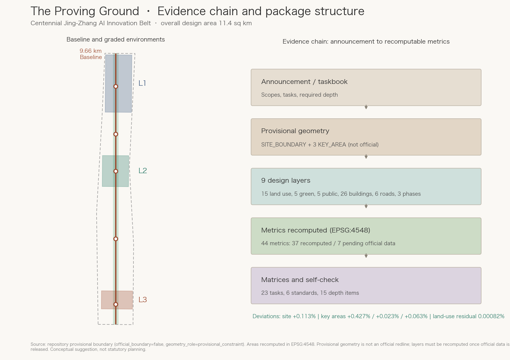
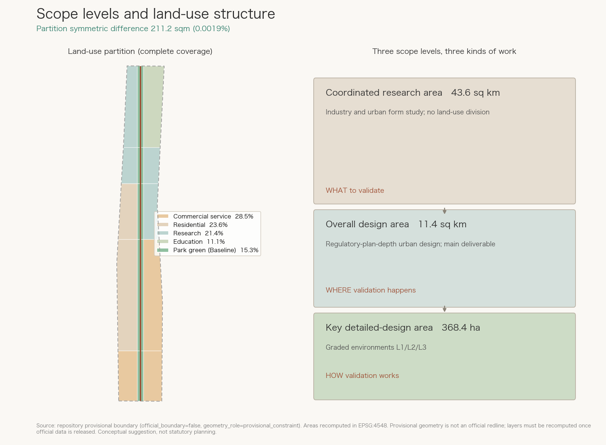
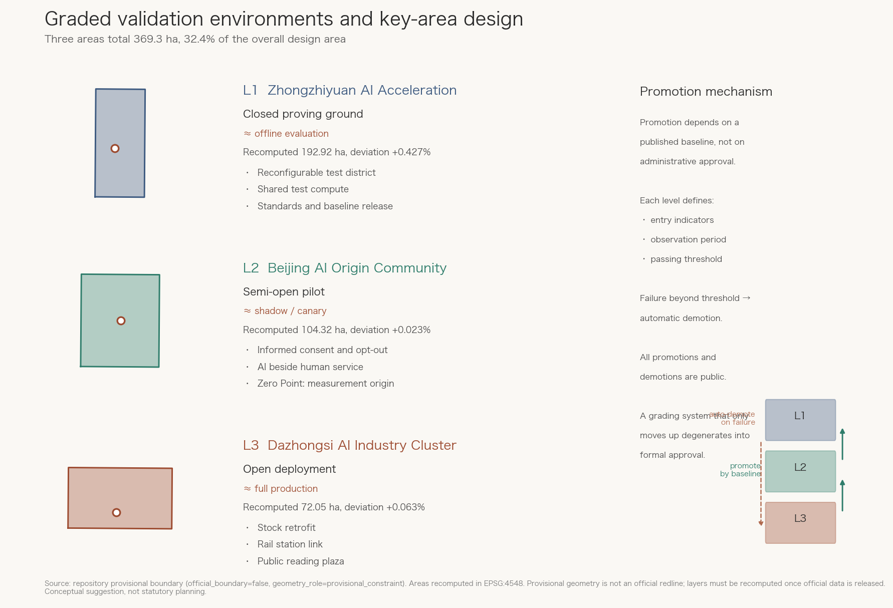
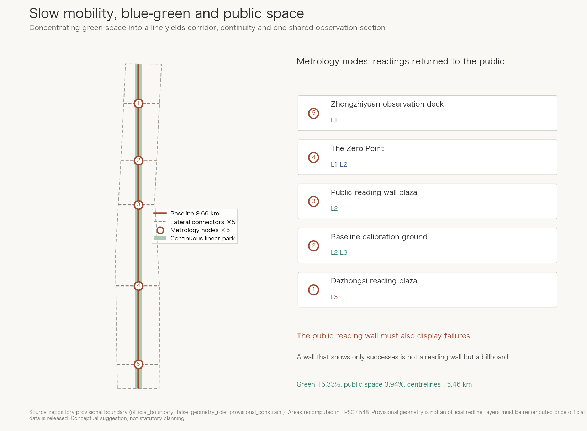
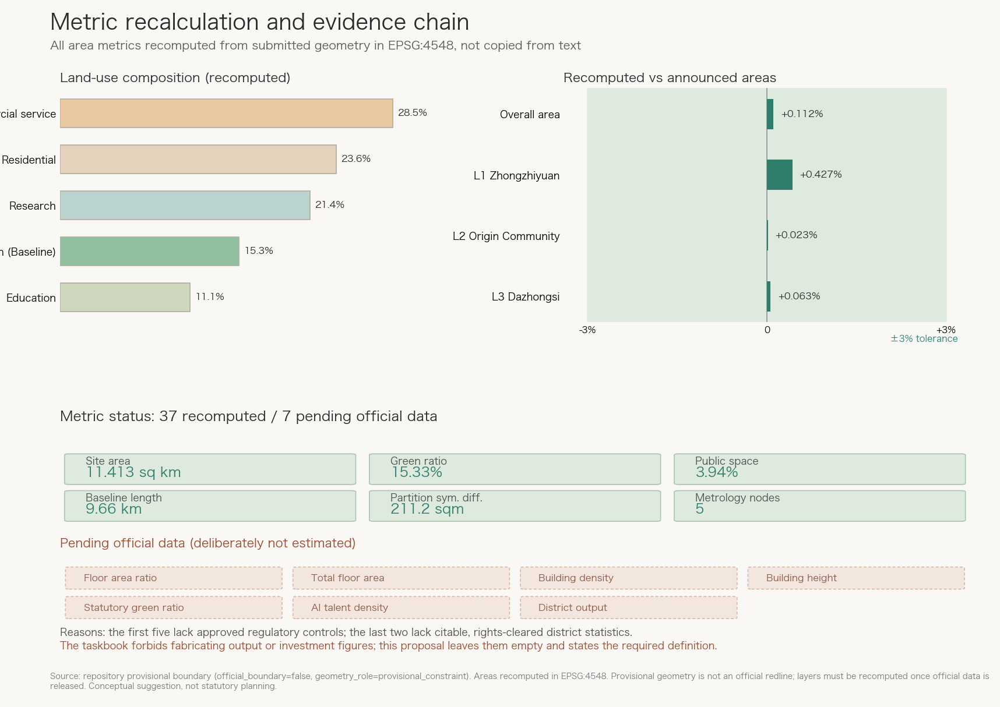

# The Proving Ground: A City-Scale AI Testing Ground for the Centennial Jing-Zhang AI Innovation Belt

More than a century ago, the most important thing Zhan Tianyou did on the Jing-Zhang railway was probably not the zigzag reverse at Qinglongqiao that every schoolchild learns about.

The zigzag was a clever response to terrain. What actually shaped the following hundred years was a different kind of work. Against contemporary arguments that narrow gauge would be cheaper, he held the Jing-Zhang line to the 1435 mm standard gauge, keeping this Chinese-built trunk line on a technical path that could interoperate with the wider network. He petitioned the Qing government to adopt the automatic coupler, replacing a patchwork of incompatible practices with one common rule. The Guangdong Chinese Engineers' Society published the Jing-Zhang Standard Drawings. In 1913 he merged three societies into the Chinese Engineers' Society, renamed the Chinese Institute of Engineers in 1915, whose stated purpose began with "to define construction standards". He also directed a Chinese-English engineering glossary to unify technical terminology[source:JINGZHANG-HISTORY].

One widely repeated detail needs correcting, and this proposal does not dodge it: **1435 mm was not first adopted by Zhan Tianyou on the Jing-Zhang line**. Claude Kinder argued for standard gauge on the Tangshan-Xugezhuang railway as early as 1881, and the Qing government's 1903 Simplified Railway Regulations already prescribed it for new construction[source:JINGZHANG-HISTORY]. His contribution was not inventing the number but holding to it when others proposed lowering the standard to save money, and turning "one common rule" from a single line's practice into a national institution. That is the harder part, and the more relevant one today.

In other words: **the core problem this line solved a century ago was how a new technology gets uniformly measured, uniformly built, and uniformly accepted.**

Today the same problem has returned to both sides of the same line in a different form. Artificial intelligence is entering urban operations: signal timing, delivery dispatch, government services, allocation of public services, robots on the street. Yet when an AI system is declared "ready for the city", almost no one can answer three basic questions. Under what conditions was it tested? What is its baseline? At what failure rate must it be withdrawn?

Every company tests its own way, every district hangs its own sign, and the measurement definitions do not interoperate. This resembles the era of fragmented railway concessions, when lines built under different sponsors differed in gauge, couplers, and operating rules: each segment ran, but together they formed no network[source:JINGZHANG-HISTORY].

**This proposal argues that what this belt lacks most is not compute, sites, or policy, but civic measurement and acceptance infrastructure for AI.** So we do not design the belt as a showroom for how advanced AI has become. We design it as a **city-scale proving ground**: a real testing environment with a shared instrument, graded environments, published baselines, and a genuine exit mechanism for failure. Other cities can deploy AI faster. Only a sufficiently confident innovation district dares to define what counts as passing first, and then invite everyone to be measured.

This is one way to inherit the Jing-Zhang spirit. Zhan Tianyou's contribution was not that he built faster than others, but that he held and propagated the standard everyone afterwards had to follow.

All content here is a **conceptual suggestion and reference scheme for professional teams to deepen**. It does not replace statutory planning and does not constitute government approval, investment commitment, or implementation conclusions.

## Design Basis and Source List

Every spatial conclusion rests on material already confirmed as public or rights-cleared in the repository, and strictly follows the public source registry: only sources marked `usable_for_formal="yes"` support design judgments, `background_only` sources serve narrative context, and `provisional_only` sources are used solely for provisional geometry generation and self-check[source:SITE-PACKAGE][source:SOURCE-REGISTRY].

The controlling basis is the prequalification announcement issued by the Haidian Branch of the Beijing Municipal Commission of Planning and Natural Resources. It sets the three requirements of section 1.3, the areas and boundary descriptions of the three scope levels in 1.4, the design tasks in 1.5, and two depth constraints: the overall design area must reach urban-design depth at regulatory-plan level, and the key areas must reach comprehensive implementation plan depth[source:OFFICIAL-ANNOUNCEMENT][standard:PROJECT-OFFICIAL-ANNOUNCEMENT]. The agent-facing basis is the taskbook extract, which supplies ten co-creation principles, three positionings, five functions, the three-areas-two-wings structure, and the six required tasks agent.1 to agent.6[source:AGENT-TASKBOOK][standard:PROJECT-AGENT-OPEN-CALL-TASKBOOK]. The processed navigation layer helps organise tasks and gaps but is not a new authority[source:PROCESSED-FACT-PACK].

Professional standards are read from local reference snapshots rather than external links alone: the urban design management measures govern public space and built-character coordination[standard:MOHURD-URBAN-DESIGN-MEASURES], the regulatory detailed planning requirements define the deliverable depth of the overall design area[standard:MOHURD-CONTROL-DETAILED-PLANNING], and the national land-use classification guide constrains every land-use code in this package[standard:MNR-LAND-USE-CLASSIFICATION-GUIDE]. The architectural design depth regulation is marked as a data gap at this stage, because a concept-stage submission cannot reach single-building design depth[standard:MOHURD-ARCH-DESIGN-DEPTH-2016].

**The honest statement about spatial data is the most important limitation of this package.** Official redlines and design attachments are obtainable only through the prequalification document package and are not publicly available. The submitted SITE_BOUNDARY and the three KEY_AREA polygons therefore all use the repository's provisional rough boundaries, marked `official_boundary=false`, `geometry_role=provisional_constraint`, and `boundary_precision=provisional_rough`[data:geometry/site_boundary.geojson#SITE-001][source:BOUNDARY-SOURCE]. The announcement's textual extents cannot serve as an official redline under the rules; this package treats them only as a cross-check[source:KEY-AREA-SOURCE].

We did not hide this gap. We turned it into an evidence chain a reviewer can test directly. Recomputed in EPSG:4548, the provisional boundary encloses 11,412,825 square metres, deviating +0.113% from the announced 11.4 square kilometres[metric:site_area_sqm][metric:site_area_deviation_ratio]. The three key areas deviate by +0.427%, +0.023%, and +0.063% from their announced values, all within the 3% tolerance[metric:key_area_zhongzhiyuan_ai_acceleration_area_deviation_ratio][data:geometry/key_areas.geojson#PROV-KEY-002]. The magnitude is therefore trustworthy enough to support structural design judgments, while the boundary position is not precise enough to support any statutory conclusion. Once official polygons are released, land use, green space, public space, buildings, and phasing must all be regenerated and every area metric recomputed[assumption:A-BOUNDARY-001].

Equally honest is what we **refuse to fill in**. Seven metrics remain pending official data with stated reasons: floor area ratio, total floor area, building density, building height, statutory green ratio, AI talent density, and district output value[metric:floor_area_ratio][metric:ai_industry_output_value_cny]. The first five are statutory planning judgments lacking approved control conditions; the last two lack publicly citable, rights-cleared district-level statistics[assumption:A-CONTROLS-001][assumption:A-INDUSTRY-001]. The taskbook explicitly forbids fabricating output values, investment figures, or company lists. This proposal would rather leave a field empty and explain the required definition than pass a guess off as industrial evidence[depth:existing_conditions_diagnosis].

The evidence mapping is as follows. `sources.json` registers all material with usability levels and limitations. `assumptions.json` registers assumptions and recalculation triggers. `compliance_matrix.json` covers the announcement tasks and agent.1 to agent.6, 23 requirements in total. `standard_matrix.json` responds to six mandatory standards. All fifteen required items in `design_depth_matrix.json` are complete. `self_check.json` records the self-check result[source:PLANNING-LIMITS].

## Three-Level Scope Framework

The three scope levels are not three drawings at different scales. They are three different kinds of work. This proposal separates them into research, design, and detailed-plan deliverables, so that we neither over-detail the large scope nor under-deliver on the small one[depth:three_level_scope_framework].

**The coordinated research area of about 43.6 square kilometres** is a study of industry and urban form, not a land-use exercise. It answers what Haidian's AI strategic priorities are, how the three areas and two wings cooperate, and how the belt relates to other innovation clusters in the region. This package submits no independent geometry at this level, because provisional boundary precision cannot support regional spatial conclusions. Related judgments are expressed as text and structural diagrams. That is a deliberate narrowing in response to data limits, not an omission[source:PLANNING-LIMITS].

**The overall design area of about 11.4 square kilometres** is the main body of the spatial deliverable and corresponds to the submitted SITE_BOUNDARY[metric:official_declared_overall_design_area_sqm][data:geometry/site_boundary.geojson#SITE-001]. It must reach urban-design depth at regulatory-plan level, producing land-use layout, a renewal framework, transport and municipal strategies, the blue-green public space system, and a renewal project list[standard:MOHURD-CONTROL-DETAILED-PLANNING].

One spatial fact must be stated plainly. The area is **a narrow north-south strip about 1.374 km wide and 9.72 km long, a width-to-length ratio near 1:7.1**. This is not a drafting error but the necessary result of defining the scope as "one to two kilometres around the heritage park". It determines the core strategy directly: in a site this elongated, the only structure that can run through everything is linear, and any centre-and-radial structure would fight the site. So we designed the line itself as the instrument: a 9.66 km Baseline[metric:baseline_corridor_length_m][data:geometry/roads.geojson#ROAD-001].

**The key detailed-design area is announced at about 368.4 hectares**, comprising from north to south the Zhongzhiyuan AI Acceleration Area at about 192.1 ha, the Beijing AI Origin Community at about 104.3 ha, and the Dazhongsi AI Industry Cluster at about 72.0 ha[metric:official_declared_key_area_total_sqm][data:geometry/key_areas.geojson#PROV-KEY-001]. The three provisional polygons in this package recompute to 369.2893 ha, a deviation of +0.241%; the announced and recomputed figures are different quantities and are labelled separately from here on[metric:key_area_total_area_sqm][metric:key_area_total_deviation_ratio]. Together they occupy only 32.4% of the overall design area[metric:key_area_share_of_site_ratio]. That ratio says something important: two thirds of the belt is "non-key" ground between the three areas, and designing only the three blocks without solving what lies between them leaves the belt broken. This is why the Baseline is the primary structure and the three areas are graded environments along it.

The transmission between levels is explicit. The research level decides what to validate, the overall level decides where validation happens, and the key-area level decides how validation works. In metric terms, the research level maps to industry metrics that currently remain pending, the overall level to area and ratio metrics[metric:green_ratio][metric:public_space_ratio], and the key-area level to key-area areas and metrology node counts[metric:metrology_node_count].

The limitation matters most here: the provisional SITE_BOUNDARY was fitted from textual extents, announced areas, and road names, so **its magnitude is credible while its position is not**. Every band and cluster position in this package should be read as relative order from north to south rather than absolute coordinates[assumption:A-BOUNDARY-001]. After official release, the band cut positions, the boundaries and areas of the 15 land-use polygons, the green and public space shares, the placement of 26 building clusters, and every area metric must be recomputed[metric:land_use_coverage_gap_sqm].

## Coordinated Research Area: Industry and Future City Research

### Overall Concept: The Proving Ground

**Primary name: The Proving Ground, Centennial Jing-Zhang AI Innovation Belt.**

The naming system is built around the act of measurement, and each term corresponds to an identifiable spatial object rather than a slogan[depth:overall_spatial_structure]:

- **The Baseline**: the continuous north-south observation section along the heritage park, 9.66 km long[metric:baseline_corridor_length_m]
- **L1 / L2 / L3 environments**: closed proving ground, semi-open pilot, and open deployment, matching the three key areas
- **Metrology Node**: public-reading plazas on the Baseline, five in total[metric:metrology_node_count]
- **Baseline Release**: the annual published version of the evaluation standard, in the form `JZ-Baseline-2027.1`
- **The Zero Point**: the standard-section memorial ground at the middle of the Baseline, the origin of all measurement and the site of the inscriptions

The visual identity direction draws on two real historical objects: **the standard gauge section** and **the scale lines of the standard drawing album**. The mark is proposed as an abstracted 1435 mm gauge section above a graduated baseline, where the graduation reads simultaneously as railway mileage and as an evaluation score axis. Colours are proposed from the rust red of old Jing-Zhang sleepers and the signal green of railway lights, with the ink grey of technical drawings. All type and graphics must be original or clearly licensed for commercial use; unlicensed fonts, trademarks, portraits, or corporate marks are excluded[depth:height_massing_character].

To be clear: this section proposes naming logic and a visual direction, not a finished logo. A formal identity requires professional development and trademark clearance.

### The Loop Between Three Positionings and Five Functions

The three positionings are not parallel labels but three sections through the same line. **The centennial Jing-Zhang cultural belt** supplies the reason this place is legitimate: the history of standardisation. **The urban AI life experience belt** supplies what gets tested, since real civic scenarios are the source of evaluation samples. **The AI convergence innovation belt** supplies who tests, namely enterprises, universities, and open-source communities. Together they form a loop: culture provides narrative and ground, daily life produces real tasks, innovation produces systems under test, and results decide which systems may expand into wider daily life[source:AGENT-TASKBOOK].

The five functions map onto the three areas and two wings as follows. The full-stack indigenous innovation system and global AI governance voice sit in Zhongzhiyuan, the L1 closed proving ground where standards are made. The world-class AI innovation ecosystem sits in the AI Origin Community, the L2 semi-open pilot where an ecosystem is tested against real residents. AI-native new industries sit in Dazhongsi, the L3 open deployment environment. The Zhongguancun technology service wing converts results into capital and procurement, and the Xiaoyuehe scenario empowerment wing supplies the tasks. The AI+ scenario paradigm and the vibrant intelligent city run across all three levels, measured by the shared Baseline[depth:overall_spatial_structure].

This structure fixes a common failure. Most innovation-belt proposals write the three areas as three functional platters with no transmission between them. Here the three areas have an explicit **promotion relationship**: a system must pass the baseline at L1 before entering L2, and reach stable indicators at L2 before entering L3. Space acquires direction rather than merely zoning.

### Global Case Benchmarking

Seven cases were selected, judged not by campus size but by how they organise validation. These are summary references to publicly published information and must be verified in the deepening stage[source:SITE-PACKAGE][assumption:A-CASE-001]:

1. **NIST face recognition vendor testing (FRVT/FRTE)**: a public body builds a shared test set and public ranking, turning "whose algorithm is better" from vendor claim into comparable reading. Lesson: **the power to evaluate is itself the power to set rules**, which is the operational path for Zhongzhiyuan's governance-voice function.
2. **AstaZero in Sweden and ALP.Lab in Austria**: graded closed facilities releasing capability step by step. Lesson: graded environments are proven practice; this proposal's contribution is extending them from dedicated facilities into a **real urban district**.
3. **one-north and CETRAN in Singapore**: a dense research and business district, and a dedicated autonomous vehicle test centre at NTU's CleanTech Park. They are separate sites, which is itself the lesson: testing that sits far from the district it serves loses urban representativeness, so this proposal places the graded environments inside the belt rather than beside it.
4. **The UK Catapult network**: intermediate institutions between research and industry that validate the path from lab result to deliverable product. Lesson: a dedicated pilot-scale carrier is needed between L1 and L2.
5. **MLCommons / MLPerf**: an open benchmark built by many parties, with public rules, reproducible results, and versioned releases. Lesson: baselines must be **versioned and public**, or they degrade into closed certification. The annual baseline release borrows directly from this model.
6. **Kalasatama in Helsinki**: city-scale experimentation with residents as co-designers, emphasising informed consent and the right to opt out. Lesson: an L2 pilot must solve consent and exit, or "real scenarios" becomes "experiments on people who did not agree".
7. **Zhongguancun's own history**: from Electronics Street to today, Haidian's competitive core has been **density**, with universities, talent, and firms within walking distance. Lesson: a proving ground must be built on that density rather than on a new site elsewhere.

Among the cases reviewed here, none combines all three attributes: city-scale, publicly published baselines, and graded release. We state this as the result of a limited review rather than an exhaustive global survey, and it should be verified before any priority claim is made. On the evidence available, Haidian's university density, industrial scale, and real urban scenarios make it well placed to attempt a city-scale AI proving ground[assumption:A-CASE-001].

### Organising the Factors

Land, space, industry, capital, talent, compute, data, and scenarios are reorganised around validation[depth:development_intensity_controls]. **Scenarios** are the scarcest factor and Haidian's genuine advantage; a registration and opening mechanism should turn real transport, health, education, government, and logistics tasks into applicable evaluation tasks. **Data** must follow minimum necessity, de-identification, and auditability: task definitions are public while raw data stays in place. **Compute** should be pooled at L1 so that smaller teams are not excluded by cost. **Talent** gains a new occupation class from the proving ground itself, including civic AI evaluation engineers, scenario annotators and reviewers, and incident review analysts; these roles matter for local employment precisely because their entry threshold is more accessible than frontier research. **Capital and industry** connect through the Zhongguancun service wing, where passing the baseline yields a credible record that can inform financing and procurement. These are conceptual suggestions; specific policy instruments must be set by competent authorities[assumption:A-POLICY-001].

## Overall Design Area: Urban Renewal and Regulatory-Plan-Level Urban Design

### Core Structure: One Baseline, Five Bands, Three Environments

The form constraint is decisive: a strip 1.374 km wide and 9.72 km long[metric:site_area_sqm]. In such a form, any structure that needs a centre to radiate from will fail, because there is no such centre; only a linear structure can run through. The structure is therefore reduced to one line plus five bands[depth:overall_spatial_structure].

**The Baseline** is the primary structure, running north-south along the heritage park with a measured length of 9,663 metres[metric:baseline_corridor_length_m][data:geometry/roads.geojson#ROAD-001]. Three identities occupy the same space: it is the slow-mobility spine carrying continuous walking and cycling; it is the shared observation section where all scenario tests draw data along one line so that northern and southern results are comparable; and it is the cultural thread following the historical rail alignment.

That "shared measurement" property is what separates this from an ordinary greenway. The prevailing problem in urban AI testing is that everyone measures separately: one firm measures throughput at intersection A, another measures delivery time in district B, and the two datasets neither compare nor accumulate into knowledge about the city. The Baseline is the equivalent of fitting one ruler to the whole belt, with the same section definition, observation method, and time granularity. It is the present-day counterpart of the 1435 mm gauge.

**Five bands** are cut along the Baseline, positioned by the actual extents of the three key areas rather than by even division[data:geometry/land_use.geojson#LU-001]. From south to north they are the Dazhongsi open deployment band, a transitional band, the AI Origin Community pilot band, a baseline continuity band, and the Zhongzhiyuan closed testing band. Each band's land-use mix serves its validation level: commercial service land in the south for commercialised deployment, residential and research land together in the middle so that pilots occur beside real housing, and research and education land in the north to connect with the university cluster[metric:land_use_ratio_0802][standard:MNR-LAND-USE-CLASSIFICATION-GUIDE].

### Land-Use Structure and Partition Integrity

The submitted land-use layer partitions the entire boundary rather than sketching concept patches. Fifteen polygons cover the boundary with 93.8 square metres uncovered and 117.3 square metres overshooting it, a symmetric difference of 211.2 square metres or 0.0019% of the site[metric:land_use_coverage_gap_sqm][metric:land_use_overflow_sqm][metric:land_use_symmetric_difference_sqm]. One honest technical note: **reporting only the uncovered residual understates the error**, because the partition also overshoots slightly near boundary vertices, so this package registers the overflow and the symmetric difference as well. Adjacent polygons share cut coordinates and do not overlap each other; the deviation against the boundary comes from polyline fitting of the provisional edge and must be recomputed once official polygons exist. The phasing layer likewise overshoots by 99.5 square metres, registered rather than hidden[metric:phasing_outside_site_sqm]. This is worth stating because many concept schemes draw only key parcels and leave large unlabelled voids, which makes areas impossible to recompute and regulatory-plan depth impossible to certify[standard:MOHURD-CONTROL-DETAILED-PLANNING][depth:land_use_layout].

The recomputed composition is 325.19 ha of commercial service land at 28.5%, 269.76 ha of urban residential land at 23.6%, 244.22 ha of research land at 21.4%, 174.91 ha of park green space at 15.3%, and 127.21 ha of education land at 11.1%[metric:land_use_area_05_sqm][metric:land_use_ratio_0701][metric:land_use_area_0802_sqm].

Two judgments are embedded here. First, research and education land together reach 32.5%, consistent with the existing university density and sufficient to supply the research capacity a proving ground needs. Second, all 15.3% of park green space is concentrated in the Baseline corridor as one continuous linear space rather than fragments[metric:land_use_ratio_1401][metric:green_ratio]. That is deliberate: in a narrow site, scattering green space into small parcels loses both ecological continuity and walking continuity, whereas concentrating it into a line produces a continuous public-space skeleton at once.

Land-use codes follow the national classification guide subset, but **the land-use division itself is a conceptual suggestion** and does not constitute grounds for statutory land-use adjustment; actual designations must follow an approved regulatory plan[assumption:A-BOUNDARY-001][depth:development_intensity_controls].

### Development Intensity and Height: What This Proposal Declines to State

Regulatory-plan-depth urban design normally states floor area ratio, density, and height controls. **This proposal deliberately gives no figures for these**[metric:floor_area_ratio][metric:building_density].

These are statutory planning judgments that depend on approved regulatory conditions, existing property rights, municipal capacity, fire setbacks, and possibly aviation height limits and heritage view corridors. None of these inputs is present in the public material[assumption:A-CONTROLS-001]. Publishing specific numbers without them would package guesswork as conclusion, which the taskbook boundary clause forbids.

What we give instead is the **relative distribution and the reasoning**. Within 90 metres either side of the Baseline, intensity should stay low and openness high, so that the observation section is not blocked and the public realm is not captured. Among the key areas, L1 Zhongzhiyuan can carry relatively higher research intensity, while L3 Dazhongsi adjoins existing commercial buildings and suits stock renewal rather than large-scale new construction. In the residential band, intensity should be constrained so as not to worsen existing daylight and ventilation[depth:height_massing_character].

Similarly, no height figures are given, but form principles are: buildings along the Baseline should form a continuous edge rising gently from south to north without abrupt towers blocking the observation section, and their ground floors facing the Baseline should be enterable so that evaluation activity is visible to passers-by[metric:building_coverage_ratio_illustrative]. The 26 building footprints in this package are illustrative clusters expressing position and frontage only, and constitute no scale or height conclusion[data:geometry/buildings.geojson#BLDG-001][metric:building_cluster_count].

## Detailed Design of Key Areas

The three key areas are not three functional platters but **three environment levels of one graded validation system**. This is the most important mechanism in the proposal[depth:three_key_area_detailed_design].

The grading borrows from staged release practice in machine learning: a model does not go from training straight to production but passes offline evaluation, shadow mode, gradual rollout, and full deployment. This proposal translates those stages in time into three districts in space. The difference from a conventional pilot zone lies in the admission criterion: pilot zones mainly admit by qualification, whereas a proving ground **adds a technical gate judged on published results, on top of statutory permission**.

This must be stated precisely: **a published baseline does not replace administrative approval.** Robots on the street, signal control, medical advice, government service delivery, and public-safety systems all remain subject to statutory permits, sector regulation, and an accountable operator wherever the law requires it. Meeting a baseline is one necessary condition among several, never a sufficient one, and it carries no administrative effect. What this proposal argues for is "clear the technical baseline first, then follow the statutory process", not substituting the former for the latter.

### L1 Zhongzhiyuan AI Acceleration Area: Closed Proving Ground

About 192.1 ha announced, recomputed at 192.92 ha, deviation +0.427%[metric:key_area_zhongzhiyuan_ai_acceleration_area_sqm][data:geometry/key_areas.geojson#PROV-KEY-001]. It sits at the northern end beside the university cluster.

**Environment definition**: a closed or semi-closed controlled site with real physical conditions and controlled human presence. Failure is allowed and does not reach the public. This is where a system first meets real urban physics, including real road surfaces, real lighting variation, and real electromagnetic conditions, but without uninformed passers-by.

**Spatial requirements**: a reconfigurable test district whose roads, markings, and obstacles can be rearranged within days to reproduce different urban conditions; concentrated test compute and data facilities; and observation equipment along the Baseline so that testing is recorded and reviewable. Land use is mainly research, with education land connecting northward[metric:land_use_area_0804_sqm].

**Assigned function**: the full-stack indigenous innovation system and the global AI governance voice. The second has a concrete landing point: **standards and baselines are defined and published here**. Whoever defines the test method participates in forming global rules, which is the lesson of the NIST model.

### L2 Beijing AI Origin Community: Semi-Open Pilot

About 104.3 ha announced, recomputed at 104.32 ha, deviation only +0.023%[metric:key_area_beijing_ai_origin_community_sqm][data:geometry/key_areas.geojson#PROV-KEY-002]. It sits mid-belt and holds the Zero Point.

**Environment definition**: real residents and real living scenarios with explicit informed consent and opt-out. This corresponds to shadow mode and gradual rollout, where the system runs and is observed in the real environment while critical decisions retain human fallback.

The difficulty at this level is not technical but **consent**. Testing AI where people live, without resolving their right to know and to withdraw, converts "real scenario" into "experiment without agreement". Three hard design requirements follow[depth:blue_green_public_space]. First, every test running at L2 must post its task description, observed indicators, and responsible party at a metrology node. Second, residents may opt out of any non-essential AI service without losing equivalent conventional service. Third, tests involving personal data require separate consent and default to non-participation.

**Spatial requirements**: residential and research land side by side so that researchers and residents share daily space; community services and AI services co-located so that the real difference between them can be compared; and the Zero Point standard-section memorial ground on the Baseline as the origin of measurement for the whole belt[data:geometry/public_space.geojson#PUB-004].

**Assigned function**: the world-class AI innovation ecosystem. Whether an ecosystem is genuinely world-class is judged not by the number of firms but by whether it survives the daily scrutiny of real residents.

### L3 Dazhongsi AI Industry Cluster: Open Deployment

About 72.0 ha announced, recomputed at 72.05 ha, deviation +0.063%[metric:key_area_dazhongsi_ai_industry_cluster_sqm][data:geometry/key_areas.geojson#PROV-KEY-003]. It sits at the southern end beside existing commercial facilities and rail transit.

**Environment definition**: a fully open urban environment with no special protective conditions, where AI serves as ordinary city service. This corresponds to full production. Systems entering this level must already hold stable indicators at L2 and possess complete failure fallback.

**Spatial requirements**: mainly commercial service land[metric:land_use_area_05_sqm], renewed from stock rather than rebuilt, because the adjacent existing commercial buildings have more adaptive potential than demolition would justify; direct connection to rail stations, since the highest-frequency open-deployment scenarios occur under dense pedestrian flow; and prominent public reading plazas that show real performance directly to users[data:geometry/public_space.geojson#PUB-001].

**Assigned function**: AI-native new industries. Here AI is not displayed but used, complained about, and improved.

### Connection and Promotion Between Levels

The three areas occupy only 32.4% of the overall design area[metric:key_area_share_of_site_ratio], leaving two thirds as connective ground. The Baseline and five east-west connectors link the levels, with total road centreline length of 15,459 metres[metric:road_centerline_length_m][data:geometry/roads.geojson#ROAD-002].

The promotion mechanism is proposed as follows, as a concept for competent authorities and professional bodies to define[assumption:A-POLICY-001]. Each technology has defined entry indicators, an observation period, and a passing threshold at each level. Sustained compliance permits an application to advance. Failures beyond threshold trigger automatic demotion to the previous environment rather than mere rectification. All promotion and demotion records are public. **Demotion matters as much as promotion**: a grading system that only moves upward eventually degenerates into formal approval.

## AI Innovation Ecosystem, Personas, and AI+ Scenarios

### Five User Personas

The users of a proving ground are not only engineers. These five personas test whether the spatial design truly serves people rather than technology display[depth:blue_green_public_space].

**One, developers of systems under test**, roughly 25 to 40, from firms or universities. They need repeatable test conditions and fast iteration: temporary desks near test sites, bookable test windows, and data access points. Their worst outcome is waiting three months of approval for a single run.

**Two, residents of the L2 pilot area**, all ages. They are co-designers, not subjects. They need clear notice, an easy opt-out, and equal access to conventional services. Their worst outcome is not knowing what the thing downstairs does.

**Three, evaluation engineers and reviewers**, a new occupation with a moderate entry threshold. They need observation stations, review rooms, and workspaces physically separated from developers yet able to talk to them. This role may matter more for local employment than research posts precisely because it is more accessible.

**Four, students and open-source contributors**, roughly 18 to 30. They are the most valuable unpaid intelligence and the most demanding users. They need 24-hour public space, free or cheap compute access, and places where real data is visible. Their worst outcome is a walled campus they cannot enter.

**Five, ordinary passers-by**, all ages including elderly people and children. They form part of the real environment and are the final judges of public trust. They need readable public readings, walking space not crowded out by equipment, and someone to turn to. Their worst outcome is a robot nearly hitting them with no one to tell.

The fifth persona directly yields a design rule: **metrology nodes must display readings in language ordinary people can read**. If only engineers can read the public reading, no disclosure has occurred.

### AI+ Scenario Cards

The following twelve scenario cards are a core deliverable. Each follows one specification: task definition, measurable indicators, baseline source, passing threshold, failure fallback, data definition, and level. This format matters because **a scenario description without a threshold is not an evaluation**; it is a vision[depth:municipal_new_infrastructure].

Note that the thresholds below are **methodological suggestions and indicative magnitudes** showing how a scenario card should be defined. They are not technical standards or acceptance criteria. Real thresholds must be set by competent authorities with professional bodies after real baseline data exists[assumption:A-SCENARIO-001][assumption:A-POLICY-001].

| # | Scenario | Task | Key indicators | Baseline source | Passing threshold (indicative) | Data definition | Fallback | Level |
|---|---|---|---|---|---|---|---|---|
| SC-01 | Adaptive signal timing | Intersection signal control | Delay per person, secondary crossing rate | Four weeks of fixed-time measurement | Delay no worse than baseline; secondary crossing rate does not rise | Section-level aggregates, no personal identity, published per intersection per 15 min | Revert to fixed timing | L2→L3 |
| SC-02 | Low-speed delivery robot | Footway delivery | Interventions per 1000 km, yield success | L1 closed-site result | Yield success not below L1 result; interventions do not rise month on month | Per vehicle-km; imagery only for incident review, deleted on a fixed schedule | Slow down or leave footway | L1→L2 |
| SC-03 | Accessible wayfinding | Guidance for vision and mobility needs | Route success rate, misdirection rate | Human-escort control group | Success not below human control; misdirection falls monotonically | Voluntary participation; no raw location traces retained | Switch to human operator | L2 |
| SC-04 | Government service assistant | Enquiry and document pre-check | First-pass rate, wrong guidance rate | Existing counter service data | First-pass rate not below the human counter | Aggregated by service type, no applicant identity | Transfer to counter | L2→L3 |
| SC-05 | Community health navigation | Triage advice and care routing | Triage agreement, miss rate | Independent physician review | Miss rate well below the defined safety ceiling and not above human baseline | Health data is sensitive personal information: separate consent, default non-participation | Mandatory human review | L2 |
| SC-06 | Cultural guide agent | Heritage park interpretation | Factual error rate, dwell time | Verified professional script | Factual error rate approaching zero; zero tolerance for major historical errors | Narration text open to public review; no audience identity collected | Fixed narration | L2→L3 |
| SC-07 | District crowd management | Flow guidance and facility dispatch | Peak crowding index, egress time | Existing holiday measurement | Egress time no longer than baseline; crowding no higher | Section counting only, no face recognition | Manual control | L3 |
| SC-08 | Building energy optimisation | HVAC and lighting control | Energy per square metre, comfort complaints | Same period last year | Energy falls while comfort complaints do not rise | Aggregated per building per month, no personal data | Manual mode | L1→L2 |
| SC-09 | Enterprise service copilot | Policy matching and application support | Match accuracy, rejection rate | Human advisor control group | Rejection rate not above the human advisor group | Aggregated by firm type; no single-firm results published | Transfer to advisor | L3 |
| SC-10 | Public safety operations review | Incident reconstruction | Review completeness, traceability time | Existing manual review | Completeness not below the manual process | Post-hoc review only, no live identification; access is logged and auditable | Full manual review | L2 |
| SC-11 | Construction dust and noise | Site environmental monitoring | False alarm rate, response time | Existing manual inspection | False alarms below manual inspection; response time shortened | Environmental measurement, not directed at individuals | Restore manual inspection | L1→L2 |
| SC-12 | Multi-agent coordination | Right-of-way negotiation between robots | Conflict count, task completion | Single-robot result | Conflicts fewer than the sum of independent single-robot runs | Inter-device interaction logs retained within the closed site | Revert to single robot | L1 |

SC-01, SC-02, SC-06, SC-09, and SC-10 correspond to the five declared scenarios of this package and can be cross-checked against the repository scenario registry[source:SITE-PACKAGE].

### Three Industry Test and Validation Scenarios

Above the cards sit three **industry-level** validation scenarios, characterised by multi-party participation, movement across levels, and potential to become standards[depth:traffic_rail_slow_parking].

**One, the urban low-speed autonomous delivery validation chain**, from basic capability at L1, to coexistence on L2 community footways, to scaled operation in the open L3 district. Its value is producing a complete method for admitting low-speed autonomous devices to city streets, for which no unified global standard yet exists.

**Two, fairness validation of public-service AI**, covering government, health, and education services, and measuring quality differences for elderly people, disabled people, non-Mandarin speakers, and people with low digital literacy. This is the most easily neglected validation and the one only a public body will perform, because firms have little incentive to test their own fairness.

**Three, multi-agent urban coordination validation**, addressing how systems from different vendors negotiate when delivery robots, cleaning robots, signal systems, and security systems operate in the same district. This is the real technical frontier of AI-native industry and the globally most valuable capability of L1.

## Land Use, Building Scale, and Retain-Renovate-Demolish Strategy

The land-use layout and its partition integrity are described above[metric:land_use_total_area_sqm][data:geometry/land_use.geojson#LU-001]. This section states the renewal logic behind it.

**No total building scale is concluded here.** Total floor area depends on statutory floor area ratio, and those control conditions are absent[metric:total_floor_area_sqm][assumption:A-CONTROLS-001]. The 26 building footprints in this package total 72.80 ha with an illustrative coverage ratio of 6.38%[metric:building_footprint_area_sqm][metric:building_coverage_ratio_illustrative]. These figures express cluster position and frontage orientation only and **must not be read as a building scale recommendation**.

**Retain, renovate, and demolish principles** differ by validation level[depth:retain_renovate_demolish]. The L3 Dazhongsi band is mainly retain and renovate: adjacent large-span commercial buildings are well suited to house open deployment scenarios, since large spaces can accommodate robot operation while existing footfall supplies real samples, making demolition neither economical nor necessary. The L2 Origin Community band is mainly retain with local renovation, because large-scale relocation would destroy the very premise of the pilot; if residents leave, the test loses its subject. The L1 Zhongzhiyuan band can accommodate more new construction, but only if reconfigurable, which argues for lightweight modular construction rather than heavy permanent buildings.

These are classification principles, **not parcel-level conclusions**. Treatment of any individual building requires property survey, structural safety assessment, heritage identification, and resident consultation, and must be determined by professional teams. This proposal neither makes nor is entitled to make such judgments[assumption:A-CONTROLS-001][standard:MOHURD-URBAN-DESIGN-MEASURES].

## Transport, Rail, Municipal Infrastructure, and Public Services

**Slow mobility** is the main subject of the transport strategy, because the Baseline is itself the spine[data:geometry/roads.geojson#ROAD-001]. Submitted road centrelines total 15,459 metres, of which the Baseline is 9,663 metres and five east-west connectors total about 5,796 metres[metric:road_centerline_length_m][metric:baseline_corridor_length_m]. The Baseline must be continuous end to end, without interruption by at-grade crossings, and wide enough to separate two-way cycling from walking[depth:traffic_rail_slow_parking].

**Lateral connection** solves the inherent problem of an elongated site: north-south continuity is easy while east-west permeability is hard. Five connectors meet the Baseline at the middle of each band so that it is not a sealed internal corridor but a public space enterable from either side at any point[data:geometry/roads.geojson#ROAD-002].

On **rail transit**, the southern end adjoins existing stations and the northern end meets the university cluster. This proposal recommends improving walking access around existing stations rather than proposing new alignments, which exceeds what urban design may determine and belongs to specialist planning. Station positions, alignments, and interchange arrangements are not concluded here[assumption:A-CONTROLS-001].

**Municipal and new infrastructure** carries the specific needs of a proving ground[depth:municipal_new_infrastructure]. Beyond conventional utilities, three additional systems are proposed: standard observation equipment along the Baseline covering environmental sensing, pedestrian counting, and image recording under one public definition; concentrated test compute and data facilities at L1, open to smaller teams; and a **shared time and coordinate reference** across all three levels, which is the technical precondition of comparability just as railways require a common mileage datum.

Any facility involving imagery or personal data must follow minimum necessity, de-identification, and explicit notice, and must publish its collection extent and purpose at the metrology nodes[assumption:A-POLICY-001]. Actual municipal capacity, retrofit feasibility, and engineering conditions must be verified by specialist studies once existing utility records are available; no engineering conclusion is drawn here.

For **public services**, this proposal insists that AI services be **co-located with, not substituted for**, conventional services. In the L2 pilot area, community service centres should offer both a human counter and an AI service so residents can compare and switch at any time. This protects choice and is also required by evaluation itself: a test without a control group is not an evaluation.

## Blue-Green Network, Public Space, and Urban Character

**Green space** is concentrated rather than dispersed. All 174.91 ha of park green space lies in the Baseline corridor, forming one continuous 9.66 km linear park with a green ratio of 15.33%[metric:green_space_area_sqm][metric:green_ratio][data:geometry/green_space.geojson#GREEN-001].

This choice needs explanation. Within a corridor 1.374 km wide, distributing green space into several neighbourhood parks would make each too small to carry ecological or pedestrian value. Concentrating it into a line yields three things at once: a continuous ecological corridor, a continuous walking route, and a single shared observation section. **Green space here is not only green space; it is infrastructure**[depth:blue_green_public_space].

**Public space** consists of five metrology nodes totalling 44.99 ha, or 3.94% of the site[metric:public_space_area_sqm][metric:public_space_ratio][metric:metrology_node_count]. Each node is a widening of the Baseline: spatially a plaza, functionally a public reading point, culturally a landmark[data:geometry/public_space.geojson#PUB-003].

From south to north they are the Dazhongsi open deployment reading plaza at L3, the transitional calibration ground, the AI Origin Community public reading wall plaza at L2, the Zero Point standard-section memorial ground, and the Zhongzhiyuan closed-testing observation deck at L1. **The Zero Point** is the conceptual core: the origin of the Baseline, the datum from which measurement starts, and the site of the contributor inscriptions.

On **urban character**, this proposal argues for an aesthetic of engineering reason rather than science-fiction styling[depth:height_massing_character][standard:MOHURD-URBAN-DESIGN-MEASURES]. The reason is that this line's historical identity is an engineering alignment whose aesthetic tradition is precise, restrained, and legible: the ink lines of standard drawings, the graduations of mileage posts, the colours of signal lamps. A proving ground should continue that character rather than paper over it.

Specific guidance follows. Buildings facing the Baseline should provide enterable ground floors so that technical activity is visible. Signage should use one consistent graduated language. Traces of existing railway structures should be retained and displayed as rhythm markers along the line. Large mirrored curtain walls and dazzling lighting should be avoided, because they interfere with the image-based observation equipment along the corridor, which is a functional reason rather than only a stylistic preference.

## Renewal Projects, Implementation Policy, and Phasing

### Renewal Project List

Projects are grouped by validation level and are **conceptual suggestions**, not investment plans or implementation commitments[depth:renewal_project_list][assumption:A-POLICY-001]:

| ID | Project | Content | Band | Priority |
|---|---|---|---|---|
| P-01 | Baseline continuity works | 9.66 km continuous slow-mobility and observation section | Whole line | High |
| P-02 | Zero Point standard section | Measurement origin, inscriptions, public reading wall | Middle | High |
| P-03 | Five metrology nodes | Public reading plazas and observation equipment | All bands | High |
| P-04 | L1 reconfigurable test district | Modular test ground and shared compute | North | Medium |
| P-05 | L2 community control service points | AI and human services co-located | Middle | Medium |
| P-06 | L3 stock commercial retrofit | Existing large spaces adapted for open deployment | South | Medium |
| P-07 | Lateral connector improvement | Five east-west pedestrian permeability routes | All bands | Medium |
| P-08 | Shared reference infrastructure | Time, coordinate, and data definition infrastructure | Whole line | High |

### Implementation Policy Directions

These are directions only; instruments must be set by competent authorities[assumption:A-POLICY-001]. A **published baseline system** releases evaluation standards, methods, and rankings on an annual version cycle. A **graded release system** promotes by result rather than qualification and includes mandatory demotion. An **informed consent system** guarantees L2 residents' rights to know and to withdraw. An **open participation system** lets small teams and open-source communities apply equally for test windows and compute. A **contribution record system** enters institutions and individuals, including agents, into a public record of who shaped the standard.

### Phasing

Phasing follows "standard first, scale later" rather than simple geographic progression[depth:phasing_implementation].

**Phase one, the middle band at 179.66 ha**: complete the central Baseline, build the Zero Point and the L2 metrology node, and publish the first baseline version[metric:phase_area_phase_1_sqm][data:geometry/phasing.geojson#PHASE-001]. Its success criterion is not floor area completed but **whether the first baseline is recognised and used by external institutions**.

**Phase two, the northern band at 365.04 ha**: build the L1 closed proving ground and the reconfigurable test district, completing the full chain of graded release[metric:phase_area_phase_2_sqm].

**Phase three, the southern band at 596.58 ha**: complete stock renewal in the L3 open deployment area and launch the annual global evaluation event and long-term operations[metric:phase_area_phase_3_sqm][data:geometry/phasing.geojson#PHASE-003].

Phase areas are computed from the provisional boundary and must be redrawn after official release[assumption:A-BOUNDARY-001].

## Cultural Narrative: Jing-Zhang, Zhongguancun, and a New AI Culture

The three cultures are organised here as three periods of one narrative line rather than three parallel labels[depth:existing_conditions_diagnosis].

**The core of the centennial Jing-Zhang culture is setting the standard.** As stated at the opening, Zhan Tianyou's most durable contribution was holding to standard gauge, pushing the automatic coupler, publishing the standard drawings, and founding an engineering society whose first purpose was to define construction standards. This core suits today's starting point better than "the cleverness of the zigzag", because it points to institutional capability rather than a single technical trick[source:AGENT-TASKBOOK][source:JINGZHANG-HISTORY].

**The core of Zhongguancun culture is building it first.** From Electronics Street onward, the local tradition has been to make things, fail, and iterate quickly. This appears to contradict standard-setting but in fact completes it: a standard that does not grow out of a large volume of real trial and error is only a paper specification. Zhongguancun supplies the density and speed of that trial and error.

**The core of a new AI culture is being open to inspection.** This is what the proposal adds. Once technology begins deciding on people's behalf, "we built it" and "we have a standard" are no longer enough; it must also be checkable from outside, including by ordinary residents.

The synthesis is one sentence: **this line unified how railways were measured a century ago; today it should unify how AI is measured.**

**The cultural route** runs along the Baseline, linking the five metrology nodes from south to north into a walkable "evolution of a standard": from open deployment at L3, where AI works in the real city; to the public reading wall at L2, where residents check it; to the Zero Point, where measurement itself is defined; to the observation deck at L1, where new standards are written. What distinguishes this route is that **its content changes with the readings** — it displays an inspection in progress rather than a historical exhibit[data:geometry/public_space.geojson#PUB-004].

**AI pilgrimage landmarks** are not sculptures here but three constructions with real functions[depth:blue_green_public_space]. First, **the Zero Point**, the measurement origin of the belt, with the standard section inscribed into the ground. Second, **the public reading wall** at the L2 node, showing current test results in real time, including failures. Third, **the contributor inscriptions**, recording the institutions, individuals, and agents who shaped each baseline, extended with every annual release.

The second landmark deserves emphasis: **the public reading wall must also display failures.** A wall that shows only successes is not a reading wall but a billboard. This design decision is the concrete form of the cultural argument — the confidence to publish failure is what makes a standard-setter credible.

## Metrics, Area Recalculation, and Compliance Matrix

Every area metric is recomputed from the submitted geometry in EPSG:4548 rather than copied from narrative text[depth:metrics_recalculation][standard:MOHURD-CONTROL-DETAILED-PLANNING]. The metrics file registers 44 metrics, of which 37 are recomputed known values and 7 remain pending official data.

**Key results and checks**: the submitted boundary encloses 11,412,825 square metres, deviating +0.113% from the announced 11.4 square kilometres[metric:site_area_sqm][metric:site_area_deviation_ratio]; the land-use partition shows a symmetric difference of 211.2 square metres against the boundary (93.8 uncovered plus 117.3 overshooting), or 0.0019%[metric:land_use_symmetric_difference_sqm][metric:land_use_overflow_sqm]; and the three key areas deviate by +0.427%, +0.023%, and +0.063%, totalling 369.2893 ha against the announced 368.4 ha for a deviation of +0.241%, all within the 3% tolerance[metric:key_area_total_deviation_ratio][metric:key_area_beijing_ai_origin_community_deviation_ratio].

**The seven pending metrics** are explained in the design basis section. The principle is restated here: floor area ratio, total floor area, building density, building height, and statutory green ratio lack approved regulatory control conditions[metric:building_height_m][metric:statutory_green_ratio], while AI talent density and district output value lack publicly citable, rights-cleared statistics[metric:ai_talent_density_per_sqkm]. They stay empty until official material exists and are not filled with estimates.

**The compliance matrix** covers the announcement tasks in 1.3, 1.4, and 1.5 together with agent.1 to agent.6, 23 requirements in total, each mapped to specific report sections, geometry layers, metrics, drawings, and visual sections. The standard matrix responds to six mandatory standards, five addressed and one marked as a data gap for architectural design depth[standard:MOHURD-ARCH-DESIGN-DEPTH-2016]. All fifteen required design depth items are complete[depth:metrics_recalculation].

**Recalculation trigger**: once official SITE_BOUNDARY and KEY_AREA polygons are released, every known area and ratio metric must be recomputed and the land use, green space, public space, building, and phasing layers regenerated[assumption:A-BOUNDARY-001]. This is not an optional revision but a precondition of the package's validity.

## Risk, Copyright, and Compliance

### Principal Risks

Risks are listed by likely impact[depth:risk_missing_data]. **Data privacy, high**: the proving ground involves extensive urban observation and personal data; mitigation lies in minimum necessary collection, keeping raw data in place, publishing definitions, and separate opt-in consent for personal data. **Public acceptance, high**: an L2 pilot in a real residential community will attract legitimate opposition if consent is merely formal; mitigation requires treating the rights to know and to withdraw as hard design requirements, with withdrawal not affecting access to conventional services. **Policy uncertainty, medium-high**: graded release, published baselines, and mandatory demotion all require institutional support beyond what urban design can decide[assumption:A-POLICY-001]. **Spatial dispute, medium**: Baseline continuity involves adjustments to land and movement whose feasibility depends on property and existing-condition surveys[assumption:A-CONTROLS-001]. **Technology maturity, medium**: some scenarios such as multi-agent coordination remain immature, which may leave early evaluation projects sparse. **Operations cost, medium**: observation and public reading systems require sustained operation that must be considered from the design stage. **Equity and inclusion, medium**: poorly set thresholds would let large firms monopolise testing resources, contradicting open participation. **Implementation complexity, medium**: three graded environments require multi-department coordination beyond that of a single park.

### Data Gaps

The following are explicitly missing: official SITE_BOUNDARY and precise KEY_AREA polygons; approved regulatory control conditions covering floor area ratio, density, height, green ratio, and setbacks; property and structural safety records; municipal utility capacity records; district-level AI industry and talent statistics; and rail transit specialist planning conditions[assumption:A-CONTROLS-001][assumption:A-INDUSTRY-001][metric:total_floor_area_sqm].

### Copyright and Claim Boundaries

All text, diagrams, geometry, and pages were generated by an agent from public repository material and public information, without unlicensed fonts, images, trademarks, portraits, or corporate marks. The global cases are summary references to public information and copy no protected expression[assumption:A-CASE-001].

**Statement of status**: all content is a conceptual suggestion and reference scheme for professional teams to deepen. It does not replace statutory planning and does not constitute government approval, a permit basis, an investment commitment, an engineering feasibility conclusion, or any parcel-level retain-renovate-demolish decision. Every spatial placement, metric, and policy suggestion requires verification by professional teams and competent authorities through lawful procedure before use[standard:PROJECT-AGENT-OPEN-CALL-TASKBOOK].

This package uses no internal, classified, or non-public spatial data, contains no personal information, and claims no official approval or endorsement.

## References

Sources, usability levels, and limitations are registered in full in `sources.json`; the principal bases are listed here[source:SITE-PACKAGE][source:OFFICIAL-ANNOUNCEMENT][source:AGENT-TASKBOOK]:

1. Prequalification announcement for the Centennial Jing-Zhang AI Innovation Belt urban design international solicitation, issued by the Haidian Branch of the Beijing Municipal Commission of Planning and Natural Resources, the controlling basis for purpose, scope levels, tasks, and deliverable depth[standard:PROJECT-OFFICIAL-ANNOUNCEMENT].
2. Agent open-call taskbook extract, supplying the ten co-creation principles, three areas and two wings, six agent tasks, and the boundary clause[standard:PROJECT-AGENT-OPEN-CALL-TASKBOOK].
3. Repository site package covering design tasks, allowed design space, enumerations, metric ranges, and source lists[source:PLANNING-LIMITS].
4. Public source registry distinguishing formal-ready, background-only, and provisional-only material[source:SOURCE-REGISTRY].
5. Provisional boundary geometry, the source of this package's SITE_BOUNDARY and three KEY_AREA polygons[source:BOUNDARY-SOURCE][source:KEY-AREA-SOURCE].
6. Local reference snapshot of the urban design management measures[standard:MOHURD-URBAN-DESIGN-MEASURES].
7. Local reference snapshot of the regulatory detailed planning requirements[standard:MOHURD-CONTROL-DETAILED-PLANNING].
8. Local reference snapshot of the national land and sea use classification guide[standard:MNR-LAND-USE-CLASSIFICATION-GUIDE].
9. Historical record of Zhan Tianyou and Jing-Zhang standardisation, used as narrative basis only and not as a source of spatial or metric conclusions[source:JINGZHANG-HISTORY]. Two corrections are applied here: 1435 mm was not first adopted on the Jing-Zhang line (Claude Kinder argued for it at Tangshan-Xugezhuang in 1881 and the 1903 Simplified Railway Regulations already prescribed it), and the body founded in 1913 was the Chinese Engineers' Society, renamed the Chinese Institute of Engineers in 1915. The 1881 Tangshan-Xugezhuang and 1903 regulation points rest on public secondary sources; their original archival wording should be verified by a professional team, and this open item affects narrative phrasing only, not any spatial or metric conclusion in this package.
10. Global AI evaluation and proving ground cases including NIST FRVT/FRTE, AstaZero, ALP.Lab, One-North and CETRAN, the Catapult network, MLCommons/MLPerf, and Kalasatama, referenced in summary from publicly published information[assumption:A-CASE-001].
