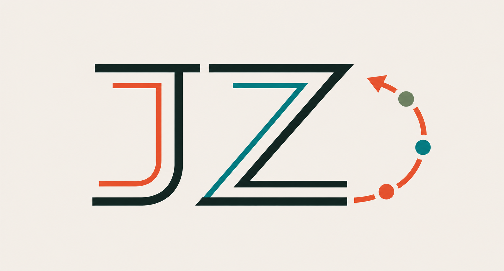
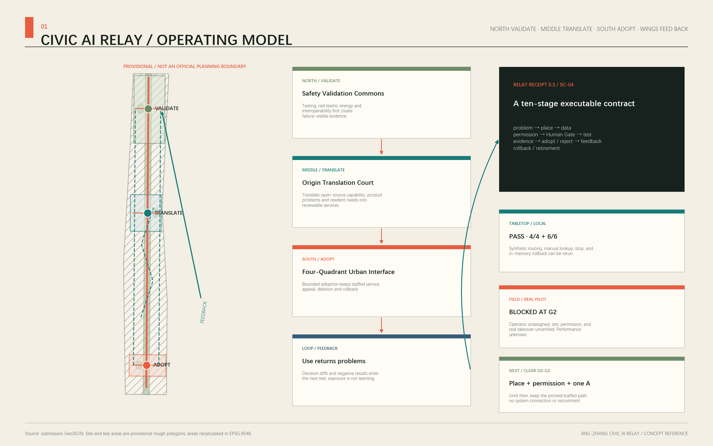
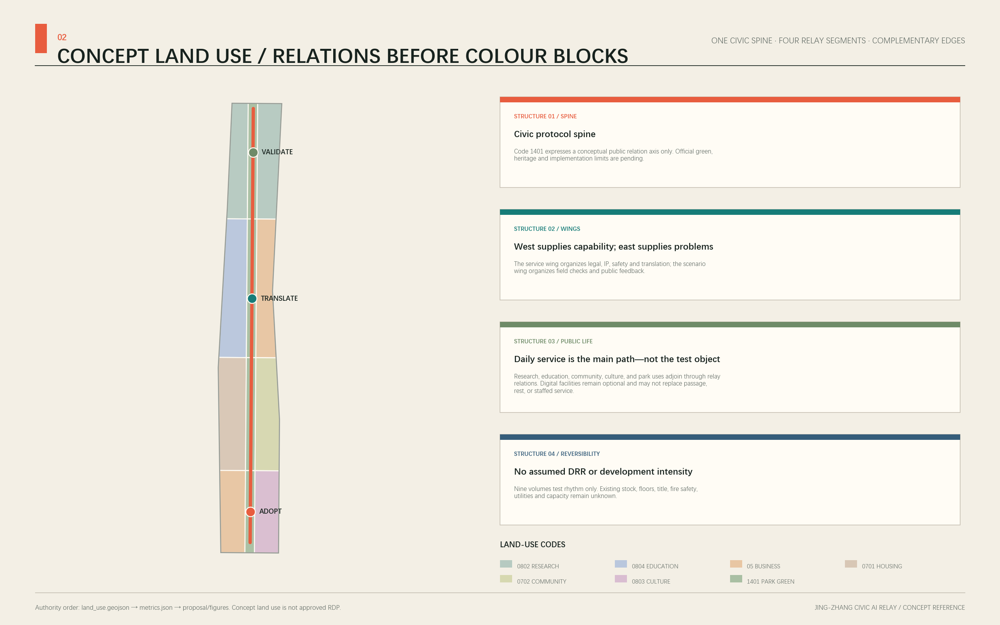
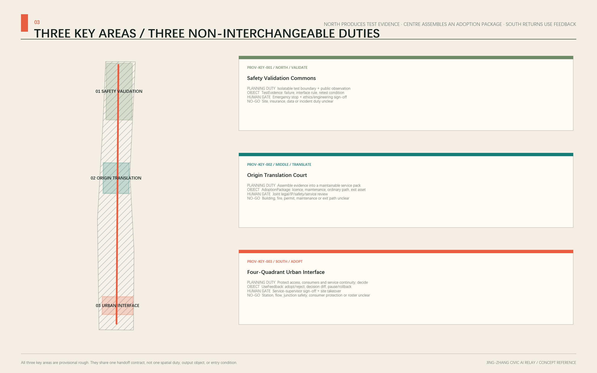
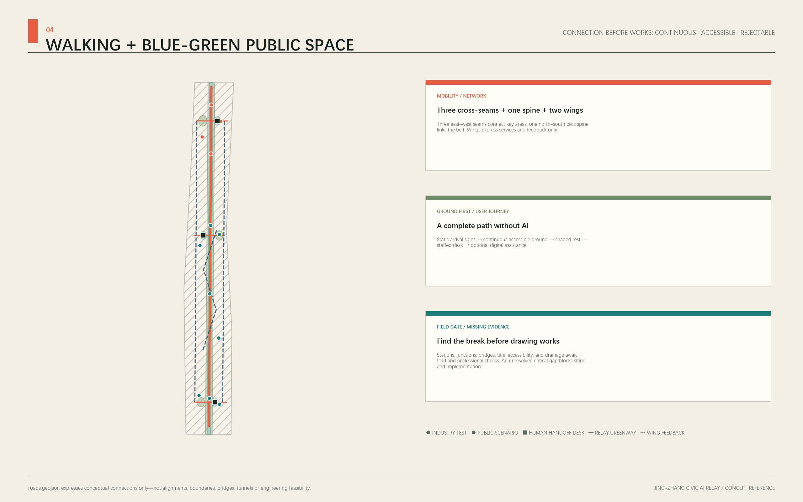
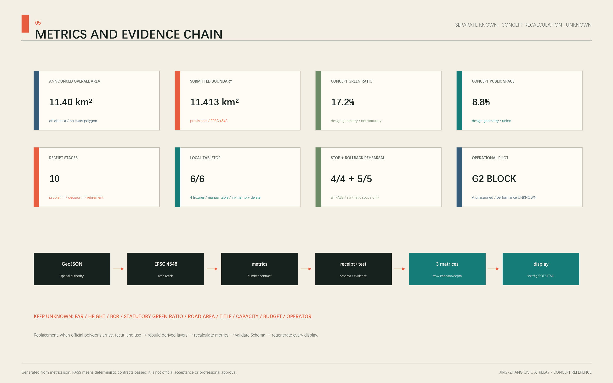

# Civic Intelligence Relay: Centennial Jing-Zhang AI Urban Learning Belt

**Primary name: Jing-Zhang Civic AI Relay** 
**Chinese name: 京张共智接力带** 
**Core judgment: the proposal does not simply connect three parks along a display axis. It creates a continuous relay in which civic problems, technical validation, product translation, urban use, public feedback, and revalidation move along the Jing-Zhang corridor. Every handoff leaves a receipt that people can question, refuse, and roll back.**

## Belt-Wide Operating Logic: Serve the City before Testing Technology

The Civic Relay is first a city operating loop, not a collection of AI exhibits. The north turns failures and retest conditions into `TestEvidence`. The centre assembles evidence, licence, maintenance, the ordinary path, and exit assets into an `AdoptionPackage`. The south protects staffed-service continuity while recording an adopt, reject, or pause decision and `UseFeedback`. The two wings return urban problems, professional capability, and negative results to the next validation cycle. [data:geometry/roads.geojson#ROAD-001] [data:geometry/public_space.geojson#PUBLIC-001]

| Relay stage | Handoff object | Direct value to the city | Condition that cannot be bypassed |
| --- | --- | --- | --- |
| Northern validation | Failure record, interface rule, retest condition | Industry teams see risk before adoption; the public sees the test boundary | No test while site, data, insurance, or incident duty is unclear |
| Central translation | Licence, maintenance, ordinary path, exit asset | Turns a prototype into an explainable, maintainable, rejectable service pack | No handoff while legal, IP, safety, maintenance, or exit duty is unclear |
| Southern adoption | Adopt/reject reason, decision diff, use feedback | Basic public service continues and negative results are disclosed | No trial while staffing, consumer protection, accessibility, or takeover is unclear |
| Two-wing feedback | De-identified problem, capability directory, review condition | Community problems and professional capability return instead of ending as event exposure | No exchange without authorization, a response path, and an exit mechanism |

For residents, commuters, and visitors, the complete journey remains static wayfinding → continuous accessible passage → shade and rest → staffed service → optional digital assistance. Refusing AI may not reduce basic service. For industry teams, value lies in turning failure into the next test condition, not in accumulating demonstrations. SC-04 only asks whether this belt-wide relationship can be rerun, blocked, and exited in one minimum slice; it does not reduce the whole innovation belt to one pilot. [metric:human_handoff_gate_count] [assumption:A-OPERATIONS-001]

## Minimum Executable Pilot: SC-04 and Relay Receipt 0.3

This iteration does not add scenarios. It narrows the existing SC-04 Urban-Service Interface Interoperability Test into the sole minimum pilot. It handles only four bundled synthetic tickets [metric:sc04_synthetic_ticket_count]. It does not connect to a real service system, process real personal data, send a message, or approve, reject, or close a real matter. The spatial point remains provisional; the real operator, duty roster, budget, field data, public-participation results, and service performance all remain unknown. [data:geometry/public_space.geojson#SC-04] [assumption:A-OPERATIONS-001]

**One Relay Receipt fixes a ten-stage execution chain: problem → place → data → system permissions → Human Gate → test → evidence → adopt/reject → feedback → rollback/retirement.** Every stage has a machine field, accountability status, and failure destination. Missing evidence leaves the item at the preceding state; multi-agent voting and promotional metrics cannot bypass a gate. [data:visual/assets/relay-receipt.schema.json] [metric:relay_receipt_stage_count]

The pilot has seven operating gates, G0–G6. [metric:sc04_pilot_gate_count] They are not spatial phases; evidence and a human signature are required to advance each one.

| State that must not be conflated | Current result | What it proves / does not prove |
| --- | --- | --- |
| Local synthetic tabletop | **PASS**: 4/4 tickets, 6/6 checks, 4/4 stop branches, and 5/5 rollback steps reproduce; in-memory records clear from 4 to 0 | Proves only that script, state, manual-table fallback, and exit branches reproduce—not real human takeover or service performance [data:visual/assets/sc04-tabletop-evidence.json] |
| Operational sandbox and field pilot | **NOT AUTHORIZED / NOT RUN**: the G2 accountable role is unassigned and G0–G1 field/data authorization is incomplete | No real-system connection, public recruitment, or adoption decision; results remain `null/unknown` [data:visual/assets/operations-matrix.json] |

| Gate | Current reviewable state | Required before the next gate | If it does not pass |
| --- | --- | --- | --- |
| G0 problem and place | Design boundary defined: four synthetic tickets, simulated counter, no real transaction | Field-check an official candidate place, title, accessibility, and service boundary | Remain a desktop fixture; no siting or public recruitment |
| G1 data and permissions | Minimum fields and read-only/write-sandbox permissions defined; external connection, identification, messaging, and real decisions prohibited | An authorized data-accountable role confirms classification, retention, deletion, logging, and permission isolation | Keep permissions disabled; allow manual comparison with the expected-queue table only |
| G2 human duty and non-AI path | Roles are defined but unassigned; printed directory and staffed referral script remain always on | Confirm one `A`, duty roster, escalation contact, takeover drill, and accessibility walk-through | No bounded trial; public service continues through the human-only path |
| G3 sandbox test | Local tabletop preflight passed; the operational sandbox remains `performance_results=null`, `run_status=not_run` | After G0–G2, an authorized team reproduces four fixtures in isolation and generates logs, human diffs, and deletion records within its real mandate | Any hard stop isolates the sandbox and starts the rollback checklist |
| G4 adopt/reject | Decision belongs to a future authorized service supervisor; current outcome is `pending` | A human signs every evidence item and may adopt, reject, pause, or require retest | No automatic launch; rejection and negative results use the same disclosure structure as adoption |
| G5 bounded trial | Entry conditions are not met | Pass the operator, place, permission, real-data necessity, insurance, appeal, maintenance, and cost gates | Any unknown keeps the work in the sandbox and away from real business |
| G6 rollback/retirement | Five exit actions are specified; no real system currently requires execution | Evidence must show permission shutdown, isolation, human fallback, log disposition, and rollback/retirement publication | A new version opens a new receipt and restarts at G0 |

The six operational acceptance criteria remain pre-deployment gates, not achieved results: the schema and example validate; 4/4 ticket identities and states are preserved; 4/4 reach the expected human queue with no high-risk auto-close; all four state-transition logs are complete; the manual path completes 4/4 after tool isolation; and before/after deletion counts plus a review record exist. [metric:sc04_acceptance_criterion_count]

The bundled command `node visual/assets/run_sc04_tabletop.js --check` reproduces the structure locally with no network call, external system, participant, or personal data: 4/4 fixture routes and manual-table paths and 6/6 tabletop checks pass. [metric:sc04_tabletop_fixture_pass_count] [metric:sc04_tabletop_acceptance_pass_count] Its evidence JSON fixes input hashes, itemized states, and a not-proven list for direct third-party comparison. [data:visual/assets/sc04-tabletop-evidence.json]

The tabletop also reproduces all four “stop and isolate” branches and five in-memory rollback steps. This tests exit logic only; it does not show that a real system has been safely rolled back. [metric:sc04_tabletop_stop_check_pass_count] [metric:sc04_tabletop_rollback_step_pass_count] A real trigger still applies “revoke permissions → stop intake and isolate → switch all work to printed/staffed handling → dispose of logs under the rule → retain only the empty fixture, incident review, and rollback receipt.”

The accountability model defines roles without inventing institutions: a future authorized service supervisor is the single `A`; fixture maintenance, service staff, and data stewardship are `R`; accessibility, safety, legal reviewers and affected users enter `C/I`. The `A` remains unassigned, so structural validation can be reproduced but a real bounded trial cannot start. [data:visual/assets/operations-matrix.json]

## Design Basis and Source Inventory

The proposal begins by separating evidence levels. The announcement and rights-cleared taskbook establish the commission boundary. Sources registered as `usable_for_formal=yes` support formal facts. [source:OFFICIAL-ANNOUNCEMENT] [source:AGENT-TASKBOOK] [source:SOURCE-REGISTRY]

The processed fact pack is a reading aid only. Provisional polygons support generation, diagrams, and intake checks only. Global precedents are background references for mechanisms. The proposal therefore does not elevate rough geometry, open basemaps, precedent experience, or agent inference into an Official Planning Boundary, Regulatory Detailed Planning conclusion, or government commitment. [source:PROCESSED-FACT-PACK] [source:SITE-PACKAGE]

The proposal's relation contract is explicit. Its goal serves both an AI Innovation Ecosystem and public interest. Spatially, a Jing-Zhang civic protocol spine connects northern validation, central translation, and southern adoption while two wings return feedback. Industrially, a problem pool, testing evidence, and adoption services form a loop. Researchers, start-ups, residents, students, commuters, operators, and visitors have different permissions and risks. Railway engineering, Zhongguancun innovation, and a challengeable AI culture form one narrative. Annual cycles maintain scenarios. Governance requires data minimization, informed choice, Human Review, appeal, and rollback. Evidence is carried through GeoJSON, metrics, matrices, drawings, and the Source Registry. [standard:PROJECT-AGENT-OPEN-CALL-TASKBOOK] [depth:existing_conditions_diagnosis]

The three overall directions are compared against the same planning questions rather than merely renamed:

| Overall direction | Main problem it solves | Gap it cannot solve alone | Position in the selected scheme |
| --- | --- | --- | --- |
| Three-Zone Park Growth | Clear industrial carriers and phasing | Risks three parallel parks with public space reduced to support use | Retained as an industrial-carrier and phasing fallback |
| Future Landmark Corridor | Direct identity and public experience | Cannot establish testing, adoption, refusal, and long-term responsibility by itself | Limited to identity, nodes, and annual communication |
| Urban Learning Relay | Closes north-validate, centre-translate, south-use, feedback, and retest | Depends on cross-actor governance and must limit expansion through gates | Primary scheme; organizes space through relations without fabricated parcel precision |

Urban Learning Relay is therefore selected, subject to fieldwork, statutory planning, and professional engineering review. [source:BOUNDARY-SOURCE] [source:KEY-AREA-SOURCE]

The formal package uses EPSG:4326 for coordinates and EPSG:4548 for area recalculation. The provisional Overall Design Area must retain `geometry_role=provisional_constraint`, `official_boundary=false`, and `boundary_precision=provisional_rough`; the three Key-Area Detailed Design Areas are equally non-statutory. [data:geometry/site_boundary.geojson#SITE-001] [data:geometry/key_areas.geojson#PROV-KEY-001]

The announced text value of about 11.4 km² is disclosed alongside the provisional polygon result of 11,412,825.386 m², a difference of about 0.1125%. [metric:announced_overall_design_area_sqm] [metric:site_area_sqm] [metric:provisional_site_area_difference_ratio] The announced three key areas total 3,684,000 m²; their provisional polygons total 3,692,893.005 m². Neither set replaces the other, and all layers and metrics must be rebuilt when official polygons arrive. [metric:announced_key_area_area_sqm] [metric:provisional_key_area_area_sqm]

## Three-Level Scope Framework

The three spatial levels carry different responsibilities; the proposal does not reuse one diagram at different scales. [standard:PROJECT-OFFICIAL-ANNOUNCEMENT] [depth:three_level_scope_framework]

| Level | Open-call task | Judgment scale in this proposal | Deliverable and evidence boundary |
| --- | --- | --- | --- |
| Coordinated Research Area | About 43.6 km² for industrial ecosystem, strategy, and future-city research | Determine how the innovation belt operates as a whole | Industry–public life–operations relation map; without an official polygon, no exact area or land-use statistics |
| Overall Design Area | About 11.4 km² for Urban Renewal and urban design at Regulatory Detailed Planning depth | Translate the relay mechanism into land use, building interfaces, Walking and Cycling Network, Blue-Green Space, public services, and phasing | Uses the provisional overall boundary; statutory intensity, road boundaries, and engineering capacity remain unknown |
| Key-Area Detailed Design Area | Three areas totaling about 368.4 ha | Test the belt-wide chain reaction through three critical local interventions | Provisional key areas support conceptual placement only; Demolish–Renovate–Retain Strategy, ownership, heritage, and engineering conclusions await professional verification |

The overall spatial structure is **one spine, three stations, two feedback wings, and twelve scenario nodes**. The spine follows the direction of the Jing-Zhang Railway Heritage Park as a civic protocol spine, not as a new planning boundary. The three stations are the northern “Safety Validation Commons,” central “Origin Translation Court,” and southern “Four-Quadrant Urban Interface.” The Zhongguancun Technology Services Wing provides directions for knowledge, capital, and professional services; the Xiaoyue River Scenario Enablement Wing brings in urban problems and use feedback. Evidence produced in the north moves to central translation; the centre sends capabilities and standards to the southern urban interface; the two wings return enterprise, community, and public-service feedback for retesting in the north. [data:geometry/roads.geojson#ROAD-001] [data:geometry/public_space.geojson#PUBLIC-001] [depth:overall_spatial_structure]

The three positionings divide work inside one loop. The Centennial Jing-Zhang cultural belt preserves a temporal narrative of engineering, openness, and relay. The metropolitan AI life-experience belt lets residents encounter AI through everyday services that remain rejectable and appealable. The AI integration and innovation belt turns testing evidence into adoptable products and public capabilities. The five functions do not occupy isolated islands: northern validation supports the Full-Stack Independent AI Innovation System; central translation connects the world-class ecosystem; the eastern wing and southern interface test AI-Enabled Scenarios; belt-wide public services support an intelligent and vibrant city; and public evidence, Human Review, and rollback underpin a voice in AI governance. Three Zones and Two Wings therefore form a loop rather than five investment-attraction labels. [source:AGENT-TASKBOOK]

The naming system uses a five-level grammar: belt, station, node, scenario, and receipt. `Jing-Zhang Civic AI Relay / 京张共智接力带` is the umbrella name. The three critical interventions use action names—validate, translate, interface. Public nodes use legible nouns such as signal, wall, hall, and scale. Scenario cards use `SC-01…SC-12`; each run generates a `RELAY-RECEIPT`. The primary mark retains one large and one small J/Z pair: the large dark J and Z form the primary track, while a signal-orange small J and governance-teal small Z follow their inner negative spaces as a compact secondary track. Parallel spacing, shared rhythm, and negative space integrate the four forms without crossing or overlaying strokes. The three-node feedback arc remains clear of the letters. Cultural wayfinding may reuse the paired-track and scale motif but may neither distort nor replace the primary mark. Enterprise logos, portraits, and unlicensed fonts are excluded. Paper white, ink black, railway-signal orange, governance teal, and blue-green create an industrial editorial language combining a railway timetable with a public evidence ledger. [data:assets/relay-mark.png]

## Coordinated Research Area: Industry and Future-City Research

The industrial strategy starts with an operable adoption chain rather than unverified company lists, output values, or investment-attraction commitments: **civic problem pool → compliant data note → multi-party testing → evidence card → product/service translation → bounded urban trial → user feedback → retest**. The north supports safety and interoperability tests. The centre supports open-source maintenance, product clinics, talent, and professional services. The south provides low-risk urban interfaces. The two wings respectively organize technology services and scenario feedback. Land, space, industry, finance, talent, compute, data, and scenarios are presented as mechanisms for professional teams to deepen; no supplier, fiscal resource, or approval outcome is promised.

Global precedents provide transferable mechanisms only. Their scale, rankings, and publicity claims do not substitute for local evidence:

| Background precedent | Verifiable mechanism | Jing-Zhang translation, not replication |
| --- | --- | --- |
| Vector Institute [source:CASE-VECTOR] | Connects research to responsible adoption | Create a pre-adoption evidence card in the north linking test records, risk notes, and a human signature |
| Mila [source:CASE-MILA] | Combines a research community, entrepreneurship support, and public interest | Schedule distinct open-source maintenance, product-clinic, and public-interest review periods in the Origin Community |
| STATION F [source:CASE-STATIONF] | Activates a large historic structure through continuous programmes rather than a single refurbishment | Propose only reversible, light-touch rotating programmes for suitable heritage carriers; placement awaits heritage review |
| LaunchPad @ one-north [source:CASE-LAUNCHPAD] | Combines modular space, shared facilities, and community operations | Use replaceable interface units for tests, demonstrations, legal, and safety services without pre-judging building change |
| Punggol Digital District [source:CASE-PUNGGOL] | Integrates industry, university, city, an open digital platform, and living labs | Establish a bounded university–park–community testing protocol with a public exit mechanism |
| London Knowledge Quarter [source:CASE-KQ] | Coordinates a cross-institution alliance through a clear geographic identity | Build problem and capability directories without inventing a member list; collaborate around shared issues, not administrative control |
| AI Singapore [source:CASE-AISG] | Links research, engineering adoption, talent, and governance | Connect project, mentor, test, evidence, and adoption pools in an annual operations ledger |

All seven cases are registered as background primary sources. They cannot support local boundaries, industrial counts, or policy facts in Haidian. Their shared lesson is that a world-class ecosystem is not “more buildings plus more events,” but a sustained reduction in the cost of translating among research, engineering, talent, civic problems, and adoption evidence. Jing-Zhang’s local advantages must be verified through later formal investigation; this proposal supplies a structure that such investigation can populate. [standard:MOHURD-URBAN-DESIGN-MEASURES]

Regional collaboration does not invent agreements, memberships, or existing projects. It translates the actors named in the taskbook into provisional problem–capability–receipt interfaces. Every collaboration requires separate agreement from the corresponding actor, exchanges de-identified material only, and retains rights to refuse, withdraw, and decline mutual recognition. [source:AGENT-TASKBOOK] [metric:regional_interface_count]

| Named coordination interface | Conceptual input proposed by Jing-Zhang | Minimum exchangeable output | Acceptance and exit gate |
| --- | --- | --- | --- |
| Beiwei Community | Resident problems, accessibility, and non-digital service experience | De-identified problem cards, gaps in staffed service, and closure reasons | Community representatives and service operators confirm; participation must not be treated as consent to deployment |
| Future Science City | Directions for edge models, embodied devices, and test methods | Model cards, device passports, failure lists, and retest conditions | Testing responsibility, intellectual property, and safety scope are explicit; results are not automatically recognized |
| Huairou Science City | Directions for scientific facilities, measurement, and specialist validation | Calibration notes, measurement uncertainty, and questions for independent review | Data licence and professional responsibility are confirmed; a collaboration concept does not stand in for real resources |
| Beijing Economic-Technological Development Area | Directions for engineering, manufacturing, supply chain, and scenario translation | Interoperability evidence, maintenance needs, and shutdown/recall conditions | Enterprise participation is voluntary and consumer-rights review passes; no procurement or siting is promised |
| Beijing–Tianjin–Hebei | Shared cross-city problems and reusable rules | De-localized schemas, negative results, and version differences | Each locality reviews lawfully; local coordinates, personal data, and approval conclusions may not be copied |

The Zhongguancun Technology Services Wing carries the capability directory and legal, IP, safety, and translation interfaces. The Xiaoyue River Scenario Enablement Wing carries problem intake, field verification, and public feedback. The five external interfaces above create traceable inputs and outputs through the wings; they do not directly penetrate public scenarios. Coordination is not measured by contract counts or exposure. It is assessed through reusable protocols, disclosure of negative results, problem response, and improvement of basic local services. No operational baseline exists for these measures, so no performance values are inserted.

The future-city form is therefore **learnable public infrastructure**. Space states what a current scenario collects, who is accountable, when data is deleted, and how to opt out. Operators publish periodic summaries of problems, failures, repairs, and retests. Residents are users, problem proposers, and rights-holders able to refuse a technology. AI-Native quality comes not from screen density, but from multiple agents cooperating on bounded tasks, leaving evidence, accepting human adjudication, and allowing rollback. Industrial value can later be observed through test-cycle time, evidence completeness, adoption conversion, and public-feedback closure; targets require an identified operator, data basis, and baseline study.

## Overall Design Area: Urban Renewal and Urban Design at RDP Depth

The Overall Design translates the relay logic into three spatial types: a continuous civic protocol spine for walking, culture, notice, and feedback; three critical local interventions for validation, translation, and urban use; and two wing relay lines linking professional services and community scenarios. Twelve land-use zones use the same horizontal cut lines and three vertical cut lines, share coordinates, cover the provisional submission boundary, and do not claim statutory land-use designation. [data:geometry/land_use.geojson#LU-001] [metric:land_use_coverage_ratio] Recalculated total area and relational depth are recorded separately. [metric:land_use_total_area_sqm] [depth:land_use_layout]

The three critical local interventions are the minimum sufficient moves capable of triggering linked change across space, industry, public life, and operations:

1. **Northern Safety Validation Commons** places technical testing, collaborative standards work, a public observation window, and green social space toward Qinghe under one operating protocol. A single test produces industrial evidence, public explanation, and governance feedback.
2. **Central Origin Translation Court** organizes university knowledge, open-source maintenance, start-up services, peer learning, and public explanation as an everyday courtyard timetable. It translates a model that can run into a service that can be adopted and questioned.
3. **Southern Four-Quadrant Urban Interface** combines transit interchange, AI-Native services, cultural experience, and accessible walking in one public-facing interface. It is both a city gateway and the feedback terminal that returns real-use problems to the north.

The building layer places only nine conceptual interface volumes to test spatial relationships and graphic legibility. Existing building footprints, uses, age, floors, structure, ownership, and Demolish–Renovate–Retain conditions were not provided. [data:geometry/buildings.geojson#BLDG-001] [metric:building_footprint_area_sqm] [metric:conceptual_building_coverage_ratio] Floor Area Ratio, Building Height, Building Coverage Ratio, statutory green-space ratio, setbacks, road boundaries, rail boundaries, parking supply, municipal capacity, and statutory control lines remain unknown; conceptual geometry is not used to infer them. [standard:MOHURD-CONTROL-DETAILED-PLANNING] [depth:development_intensity_controls]

Detailed work must proceed in this order: obtain official polygons and statutory controls; survey existing buildings, title, heritage, transport, municipal systems, ecology, and users; make professional retain–repair–renovate–demolish judgments; only then verify parcel metrics, engineering alignments, capacities, and implementing bodies. Current layers hold questions and relationships. They are not approval drawings.

## Key-Area Detailed Design

All three key areas use the organizer’s provisional rough polygons for conceptual placement and intake checks only. Their rectangular edges must not be interpreted as roads, parcels, or ownership boundaries. [data:geometry/key_areas.geojson#PROV-KEY-001] [data:geometry/key_areas.geojson#PROV-KEY-002] [data:geometry/key_areas.geojson#PROV-KEY-003] Count and detailed-design depth are listed separately in machine files. [metric:key_area_count] [depth:three_key_area_detailed_design]

**Zhongzhiyuan AI Independent Innovation Acceleration Area—Safety Validation Commons.** Suggested functions include multi-agent embodied-AI safety validation, edge-model energy and resilience tests, open-source red teaming, and interoperability validation. Suggested spaces combine shared test interfaces, a public observation window, a standards-explanation gallery, and a green social court. Operations use booking, risk tiers, independent review, failure disclosure, and retest loops, retaining only the minimum logs required for a test. Qinghe culture and ecology, external transport, platform qualifications, testing responsibility, and actually available buildings require professional verification. The proposal neither promises a “national platform” nor equates passing a test with regulatory approval.

**Beijing AI Origin Community—Origin Translation Court.** Suggested functions include desks for open-source maintainers, a product clinic, public explanation of outcomes, peer learning, a community problem clinic, and everyday support. Reversible partitions support morning learning, afternoon clinics, and evening public briefings, connecting directions toward campuses, parks, communities, and transit. Operations record the source of a problem, maintenance contribution, adoption barrier, and next accountable role. University, enterprise, housing, existing-building, and station relations await field measurement; conceptual points do not imply access to titled space.

**Dazhongsi AI Industry Cluster—Four-Quadrant Urban Interface.** Suggested functions include a four-quadrant transit walking assistant, agentic-consumption sandbox, digital-content experience, public legal-service triage, and shared reading of Jing-Zhang memory. Ground-level access, withdrawable information components, quiet waiting points, and continuous wayfinding take priority. Bridges, tunnels, underground connections, and station-city works remain options for later study. Operations require accessibility testing, consumer protection, content review, a staffed desk, and appeals. Station boundaries, footfall, green space, junction safety, engineering conditions, and commercial ownership were not provided.

The three areas are not three independent brands. The north produces validation evidence, the centre maintains knowledge and organizes adoption, and the south exposes real problems. The Zhongguancun Technology Services Wing points toward legal, standards, finance, and international connections; the Xiaoyue River Scenario Enablement Wing organizes community problems and public-service trials. Each quarter, at least one batch of problems must close the loop—raised in the south, translated in the centre, retested in the north, and disclosed belt-wide—or the relay degenerates into an event slogan.

## AI Innovation Ecosystem, Personas, and AI-Enabled Scenarios

The seven personas are not marketing segments. They are design inputs for permissions, risk, and service paths. [metric:persona_count]

| Persona | Core task | Required space and service | Rights and risk concern |
| --- | --- | --- | --- |
| Researchers and open-source maintainers | Test, reproduce, repair, and release | Bookable test bench, version archive, peer review | Choice of attribution and licence; failures must not be repackaged as success |
| Start-up and product teams | Find problems, validate compliance, receive adoption support | Product clinic, legal/safety hours, demonstration interface | No investment or procurement promise; accountability boundaries are explicit |
| Community residents and older people | Receive daily services and report problems | Staffed offline desk, plain-language explanation, quiet waiting | Refusing AI must not remove service; no persistent profiling |
| Students and young learners | Learn, contribute, and gain verifiable experience | Peer-learning tables, open tasks, mentors, and outcome notes | Protect minors; contributions are withdrawable; avoid manipulation |
| Commuters and people with limited mobility | Move continuously and reliably through stations and public space | Accessible navigation, fallback route on failure, staffed guidance | Minimize location data; algorithmic output does not replace safety duty |
| Scenario operators and frontline workers | Configure, monitor, pause, and review | Operations ledger, circuit breaker, incident classification | Make staffing, escalation, and accountability visible; automation must not hide labour |
| International visitors and governance observers | Understand the technology, city, and rules | Bilingual evidence cards, public demonstrations, visit route | Do not overstate results; distinguish demonstration, test, and approved operation |

The following twelve scenario cards are Conceptual Recommendations, not approved operations. Each states users, space, operations, minimum data, privacy, Human Review, non-AI alternative, appeal, and stop condition. SC-01 through SC-04 are Testing and Validation Scenarios for industry. [metric:scenario_node_count] [metric:industry_test_scenario_count] [metric:scenario_governance_field_count] The first node is traceable in the spatial file. [data:geometry/public_space.geojson#SC-01]

| ID / scenario | Primary users and space | Operations and minimum data | Human gate, non-AI path, and stop condition |
| --- | --- | --- | --- |
| SC-01 Multi-Agent Embodied-AI Safety Validation | Researchers; controlled northern test interface and public observation window | Booking required; record only version, task, collision/failure, and repair | Safety officer activates emergency stop; visitors may use static explanation only; stop immediately on boundary breach, lost connection, or failed takeover |
| SC-02 Edge-Model Energy and Resilience Test | Product teams; metered test bench | Compare offline, disconnected, degraded, and energy modes; store device-level measurement only | Engineer signs; a printed report replaces interaction; stop if personal content cannot be isolated or power cannot be cut safely |
| SC-03 Open-Source Model Red Team and Standards Co-creation | Maintainers and governance observers; isolated red-team room | Retain de-identified prompt category, failure type, patched version, and retest evidence | Ethics/safety reviewer sets disclosure granularity; a manual defect ticket remains available; seal the test if an exploitable critical vulnerability appears |
| SC-04 Urban-Service Interface Interoperability Test | Public-service staff and developers; simulated service counter | Synthetic tickets test status, human transfer, and log interfaces | Service supervisor signs; staffed counter script always remains; a high-risk misroute or missing log fails the test |
| SC-05 Open-Source Maintainer Product Clinic | Start-ups and maintainers; Origin Translation Court | Weekly clinic; record problem, dependency, licence, and follow-up owner | Legal/safety referral; in-person booking remains; delete and pause if unauthorized business information enters the record |
| SC-06 Explainable Learning Partner | Students and teachers; learning garden and indoor seats | Store only voluntarily submitted tasks and feedback; visitor mode available | Teacher reviews; printed learning pack runs in parallel; stop on persistent profiling, manipulation, or inability to state a source |
| SC-07 Accessible Walking Navigation | People with limited mobility and visitors; east–west seam at the Origin | Public network plus field-verified obstacles; precise location processed briefly | Staffed hotline and static map backstop; take offline if directions create safety risk or staff channel is unavailable |
| SC-08 Community Health-Service Navigation | Residents and older people; staffed community desk | Search public services and booking entry only; no medical record stored | Worker reviews and offers a fully staffed path; stop if the system diagnoses, misses emergency referral, or prevents exit |
| SC-09 Public Legal-Service Triage | Residents and start-up teams; southern public-service point | Identify problem category, document checklist, and public-service entry only | Legal professional confirms; printed directory remains; pause on legal conclusion, material disclosure, or misleading output |
| SC-10 Four-Quadrant Transit Walking Assistant | Commuters and visitors; southern urban interface | Field-check accessibility and temporary obstacles; do not track personal routes | On-site staff confirm; static wayfinding remains visible; revert to static mode if safety information is stale or conflicts with the site |
| SC-11 Agentic-Consumption Sandbox | Consumers and product teams; bounded display interface | Show agent permissions, budget, and confirmation steps; store simulation logs only | Human confirms every step; ordinary product information runs in parallel; close if real payment, dark patterns, or failed cancellation appears |
| SC-12 Jing-Zhang Memory Co-reader | Residents and visitors; civic protocol spine | Use rights-cleared history and voluntary submissions only; label source and dispute status | Editor verifies history; static timeline runs in parallel; hide content if source is unknown, rights are disputed, or withdrawal is not executed |

All scenarios share ten governance fields: public purpose, service users, spatial boundary, minimum data, model/tool permissions, human responsibility, non-AI alternative, appeal/deletion, evaluation method, and stop/rollback. Every field is mandatory. The operations ledger uses the states proposed, screened, sandboxed, bounded trial, paused/rejected, adopted, and retired/rolled back. It does not use unsupported claims such as “deployed” or “full coverage.” [source:AGENT-TASKBOOK] [metric:scenario_governance_field_count]

### Relay Receipt Protocol and Minimum Reproducible Slice

`visual/assets/relay-receipt.schema.json` is the machine-readable draft `Relay Receipt 0.3`. [metric:machine_readable_protocol_count] Its ten required objects map one-to-one to the execution chain at the beginning of this proposal. System version, allowed/prohibited actions, human decision, candidate acceptance criteria, positive and negative evidence, feedback, and the five-step exit may not be scattered across separate documents. A state change leaves a `decision_diff`; when no baseline exists or no run has occurred, the result is `null`, not estimated. The schema is a conceptual governance interface, not a current government system, statutory record, or deployed platform. [data:visual/assets/relay-receipt.schema.json]

`visual/assets/example-sc04-relay-receipt.json` places four synthetic fixtures, six candidate acceptance criteria, four hard stops, and five rollback actions in one receipt. It explicitly records `deployment_status=sandbox_only`, `run_status=not_run`, `performance_results=null`, and an unassigned accountable operator. Schema validation proves only that fields and types can be reproduced; it does not prove that tickets ran successfully, an interface is correct, a service is available, the public accepts it, or deployment is safe. [metric:minimum_reproducible_slice_count] [data:visual/assets/example-sc04-relay-receipt.json]

`visual/assets/run_sc04_tabletop.js` treats that example as a read-only contract and deterministically generates `sc04-tabletop-evidence.json`. The evidence shows that 4/4 fixtures, 6/6 checks, 4/4 stop branches, and 5/5 rollback steps reproduce locally, while fixing operational status at `not_authorized_not_run` and `gate_effect=none`. [metric:sc04_tabletop_rehearsal_count] [data:visual/assets/sc04-tabletop-evidence.json] A third party can therefore test the protocol without writing rehearsal results back into a real receipt.

The three spatial relay points therefore correspond to three non-interchangeable objects: the north issues `TestEvidence`, the centre maintains an `AdoptionPackage`, and the south produces `UseFeedback`. Only a human-signed `RelayReceipt` may hand an object to the next station. No actor may use multi-agent voting to bypass human accountability, enlarge tool permissions, allocate a budget automatically, close a public ticket, or change statutory spatial controls.

To keep “human accountability” from becoming an abstract slogan, `public_space.geojson` adds three agent-generated candidate human handoff and receipt desks, `HG-01` to `HG-03`, inside the three conceptual public spaces. They support validation sign-off, translation responsibility, and adoption feedback respectively. [metric:human_handoff_gate_count] [data:geometry/public_space.geojson#HG-01] [data:geometry/public_space.geojson#HG-02] The points mean only that a visible staffed counter and paper/human alternative are required. [data:geometry/public_space.geojson#HG-03] They are not existing facilities, official locations, or staffing commitments. They must be relocated after official boundaries, ownership, circulation, and accessibility surveys arrive.

## Land-Use Layout, Building Scale, and Demolish–Renovate–Retain Strategy

The land-use drawing is a conceptual functional zoning diagram, not an RDP amendment. Twelve shared-edge zones use national territorial land-use classification codes. The central four segments are all directed toward code 1401 park green space; the sides organize northern research, central education/business, everyday support, and southern business/culture. Areas are recalculated from provisional polygons in EPSG:4548 and cannot be treated as statutory land quantities while boundaries and controls are missing. [standard:MNR-LAND-USE-CLASSIFICATION-GUIDE]

| Conceptual use code | Functional role | Recalculated area evidence |
| --- | --- | --- |
| 05 Commercial and business service land | Origin outcome translation and southern AI-Native services | [metric:land_use_05_area_sqm] |
| 0701 Urban residential land | Everyday support direction; no specific housing project inferred | [metric:land_use_0701_area_sqm] |
| 0702 Urban community-service facility land | Community problem intake and staffed service | [metric:land_use_0702_area_sqm] |
| 0802 Scientific-research land | Northern validation, R&D, and standards co-creation | [metric:land_use_0802_area_sqm] |
| 0803 Cultural land | Southern cultural interpretation and public experience | [metric:land_use_0803_area_sqm] |
| 0804 Education land | Origin peer learning, open-source maintenance, and talent collaboration | [metric:land_use_0804_area_sqm] |
| 1401 Park green space | Continuous civic protocol spine and three green social nodes | [metric:land_use_1401_area_sqm] |

The nine building footprints are “interface volumes” only, testing relationships among shared labs, public observation, peer learning, product clinics, staffed service, and cultural interpretation. They are not surveyed existing footprints, contain no floors or heights, and cannot produce building floor area, FAR, or BCR. Total floor area and FAR remain unknown. [metric:total_floor_area_sqm] [metric:floor_area_ratio] Official Building Coverage Ratio and official green ratio also remain unknown. [metric:official_building_density] [metric:official_green_ratio]

No Demolish–Renovate–Retain conclusion is possible from current data. A five-gate process is proposed: obtain survey, age, use, and structural data; review cultural relics, historic buildings, and Jing-Zhang heritage controls; review ownership, leases, and current occupants; assess carbon, accessibility, fire safety, and adaptive reuse; compare the lifecycle public benefit of retain, repair, renovate, and demolish. Only after all five evidence sets exist may professional teams classify individual buildings. [depth:retain_renovate_demolish] [depth:height_massing_character]

Urban character is governed through relations, not pseudo-precise heights. Interfaces along the civic protocol spine should be enterable, inhabitable, and make accountable service staff visible. New components should be light-touch, reversible, and maintainable. Heritage and important view corridors take priority. Advertising screens should not dominate public space. Night information should be low-luminance, time-controlled, and switchable. Specific height, skyline, and material require official controls, view analysis, and mock-up review. [standard:MOHURD-ARCH-DESIGN-DEPTH-2016]

## Transport, Transit, Municipal Systems, and Public-Service Facilities

The transport layer represents seven relational lines, not road boundaries or engineering alignments: a north–south Civic AI Relay greenway, three east–west seams in the key areas, two wing lines, and one public-experience loop. [data:geometry/roads.geojson#ROAD-001] The conceptual centrelines total about 31,025.594 m and support comparison of network continuity only. Road area remains unknown because boundaries, sections, and station limits are unavailable. [metric:road_centerline_length_m] [metric:road_area_sqm] [depth:traffic_rail_slow_parking]

Transport priorities are continuous walking and accessibility, relay cycling, public-transport transfer, service and emergency access, and only then additional motor capacity. Each key area begins with a ground-level diagnosis of crossing wait, gradient, steps, shade, night lighting, cycle parking, construction obstruction, and discontinuities. If the ground can be repaired, bridges, tunnels, and underground space are not the default. Dazhongsi’s “four quadrants” are a problem frame, not an engineered underground connection. Transit-Station Integration, parking, and road circulation require passenger flow, official boundaries, transport modelling, and safety assessment.

Municipal and New Infrastructure follows a “small unit, disconnectable, metered” principle. Testing nodes may reserve directions for controlled network ports, edge-compute cabinets, separate metering, emergency power cut-off, and log export. Public space first provides power, shade, drinking water, seating, toilets, accessibility, and staffed service; AI experience comes later. Energy load, communications capacity, water, drainage, fire safety, municipal pipes, and equipment locations have not been calculated and are not engineering design. [depth:municipal_new_infrastructure]

Public service uses dual channels. Any AI navigation, triage, booking, or explanation must retain a non-AI path through a staffed desk, telephone, or static information. Operators are identifiable on site, errors are reportable, and high-risk matters go only to humans. Technical failure must not become public-service failure, and residents who reject data processing must not be penalized.

## Blue-Green Space, Public Space, and Urban Character

A continuous green spine, Qinghe Validation Garden, Origin Learning Garden, and Dazhongsi Urban Living-Room Green Island form the conceptual Blue-Green Space system. [data:geometry/green_space.geojson#GREEN-001] Conceptual green space inside the provisional boundary recalculates to 1,962,400.999 m², or 17.1947%. This is not a statutory green ratio and does not replace official green-line or ecological survey evidence. [metric:green_space_area_sqm] [metric:green_ratio] The civic-protocol walking spine and three public grounds total 1,008,388.866 m², or 8.8356%. Some public space overlaps green space, so the two areas must not be simply added. [data:geometry/public_space.geojson#PUBLIC-001] [metric:public_space_area_sqm] [metric:public_space_ratio] Its design depth remains at the conceptual relational level. [depth:blue_green_public_space]

Public-space components follow three tests: understandable, rejectable, repairable. Evidence signs show purpose, data, accountable role, and end date. Static scales communicate railway and innovation history without devices. Staffed service tables provide alternative paths. Mobile test benches appear only during activities. Quiet seats and shade require no data exchange. Stop controls and fault notices remain visible. Smart facilities may not displace basic passage or rest.

Four pilgrimage/honour nodes are light-touch concepts. [metric:landmark_count] **Signal Zero** turns “begin test” into a public commitment. **Open-Source Growth-Ring Wall** records versions and maintenance contributions with withdrawable attribution. **Urban Echo Hall** displays problems, failures, repairs, and retests rather than success alone. **Centennial Relay Scale** layers railway construction, open innovation, and AI governance on a walkable ruler. [data:geometry/public_space.geojson#LM-01] Every location must avoid heritage controls, green lines, traffic hazards, and titled space. Facial recognition and compulsory interaction are excluded.

The cultural narrative has three layers. The Jing-Zhang railway represents long-term engineering, public connection, and intergenerational relay. Zhongguancun innovation represents verification, open collaboration, and knowledge translation. A new AI culture adds explainability, challenge, acknowledgement of failure, and respect for exit. Wayfinding uses paired rails, station circles, and a feedback arc. The overall logo identifies the belt; cultural signs interpret specific history. The international line is: **A railway of shared intelligence—tested in public, translated with care, returned to the city.** Historical facts and heritage extent require verification by formal sources and heritage professionals.

## Urban Renewal Action Packages, Policy, and Phasing

The list contains eight Conceptual Recommendation action packages. It is not a project approval, investment, or construction programme. [metric:renewal_project_count] [depth:renewal_project_list]

| ID | Action package | Minimum delivery | Prerequisite before start |
| --- | --- | --- | --- |
| P1 | Civic protocol spine | Continuous walking diagnosis, evidence-sign rules, static alternative wayfinding | Official boundary, heritage/green line, accessibility, and ownership review |
| P2 | Safety Validation Commons | Four industry-testing protocols, emergency stop, public observation window | Testing responsibility, site safety, data-impact, and insurance review |
| P3 | Origin Translation Court | Peer learning, product clinic, open-source maintenance, and explanation sessions | Available building, operator, intellectual-property, and fire-safety review |
| P4 | Four-Quadrant Urban Interface | Ground-level access diagnosis, staffed desk, consumption sandbox | Station/junction data, transport safety, consumer-protection review |
| P5 | Two Wing Relay Stations | Technology-service directory and community problem entry | Voluntary institutional participation, real service capacity, and exit rules |
| P6 | Scenario Evidence Ledger | Status, risk, human adjudication, failure, and retest summary | Data classification, disclosure granularity, appeal, and security response |
| P7 | Centennial Relay Identity System | Logo, wayfinding, time scale, four reversible components | Historical fact, copyright, heritage, and mock-up review |
| P8 | Annual Civic AI Relay Programme | Problem call, developer testing, public experience, annual retrospective | Operations charter, accountable budget, accessibility, and emergency provision |

To avoid “projects without accountable roles,” the eight action packages use a conceptual RACI. `A` means one future authorized role accountable for the result; this proposal does not appoint a government department, owner, or company. `R` means the professional and operational roles required to do the work. `C` means rights-holders, public representatives, and regulatory professionals who must participate before a decision. `I` means users kept informed through public receipts. The service objectives below are starting points for pilot calibration, not current service standards, procurement terms, budget commitments, or government deadlines. [metric:raci_action_package_count] [data:visual/assets/operations-matrix.json]

| Package | Conceptual A / R / C-I | Public-value gate | Candidate response and stop rule |
| --- | --- | --- | --- |
| P1 Civic protocol spine | A: authorized public-space manager; R: planning, transport, landscape, accessibility, maintenance; C-I: corridor rights-holders and all users | Audit the complete ordinary path and non-AI wayfinding across every pilot segment before opening | Isolate a serious safety gap immediately; acknowledge an ordinary issue within one working day; do not extend until a response path exists |
| P2 Safety Validation Commons | A: authorized testing accountable role; R: model safety, energy, device, and site safety; C-I: affected groups and independent professionals | Emergency stop, permission isolation, failure record, and retest conditions are complete | Stop a serious risk immediately; create an initial incident record within 24 hours; failed human takeover prevents restart |
| P3 Origin Translation Court | A: authorized service operator; R: open-source maintenance, law, IP, product, ethics; C-I: developers and rights-holders | Every recommendation states source, licence, accountability boundary, and next responsible role | Acknowledge intake within two working days; promise no investment, order, or approval; stop dissemination during a rights dispute |
| P4 Four-Quadrant Urban Interface | A: authorized station-city/public-service operator; R: transport, consumer protection, service, accessibility; C-I: commuters, residents, businesses | Ordinary ground-level path, staffed desk, and complaint entry work before intelligent features | Close the enhancement layer on a safety conflict or staffed-channel interruption; bridges, tunnels, and underground works are not default answers |
| P5 Two Wing Relay Stations | A: authorized coordination lead; R: capability directory, community liaison, data, safety; C-I: voluntary participants | Input, output, licence, expiry, and exit responsibility are registered | Do not publish when the counterpart has not confirmed, data exceeds scope, or capability is unverifiable; contract counts are not outcomes |
| P6 Scenario Evidence Ledger | A: authorized data accountable role; R: safety, legal, records, operations; C-I: appellants and public observers | Positive and negative results, human changes, deletion, and rollback are traceable | Escalate a serious incident in real time; pause the scenario if deletion expires or appeal is overdue; no silent closure |
| P7 Identity and Honour System | A: authorized brand/culture accountable role; R: design, history, heritage, copyright, exhibition; C-I: contribution rights-holders and the public | Source, authorization, dispute, and withdrawal entry cover every displayed object | Hide first within one working day of a rights dispute; do not restore after failed verification or unexecuted withdrawal |
| P8 Annual Civic AI Relay | A: authorized annual-operations lead; R: events, safety, community, developers, maintenance; C-I: users and reviewers | Publish projects continued, changed, and stopped—not successes alone | Reduce or cancel when the accountable body, permit, recurring budget, staffing, or asset disposal after exit is unclear |

Resources use five ledgers rather than a premature total-investment figure. The people ledger records staffing, professional review, appeal, and maintenance hours. The space ledger records use periods, alternative uses, and removal conditions. The equipment ledger records purchase/lease, energy, spares, and retirement. The data ledger records collection, storage, security, deletion, and audit costs. The public-value ledger records improvement to basic service, negative results, and opportunity cost. No operator, service volume, device selection, shift plan, or market quotation exists, so all monetary amounts remain unknown. The first open cycle calibrates ticket volume, staffing capacity, maintenance frequency, and cost ranges only. If the `A` role, recurring budget, insurance, permit, data responsibility, or disposal of assets on exit is unclear, the package may not enter routine operations. [assumption:A-OPERATIONS-001]

The three phasing polygons represent a conceptual expansion from small protocol pilots to three critical interventions and then a belt-wide relational network. They are not a development schedule and are distinct from the SC-04 G0-G6 operating gates. Phase 1 is about 312,202.227 m² and considers only the spatial capacity for P2/P3/P4 rules and human capability. [data:geometry/phasing.geojson#PHASE-001] [metric:phase_1_area_sqm] Phase 2 is about 1,606,526.574 m² and connects the three critical interventions to wing services. [metric:phase_2_area_sqm] Phase 3 is about 9,494,102.999 m² and is discussed only if evidence from the first two phases shows public value, maintainability, and safety. [metric:phase_3_area_sqm] [depth:phasing_implementation]

Annual operations form a four-season loop. Q1 publishes civic problems and public-interest review. Q2 runs developer collaboration, red teaming, and interoperability tests. Q3 hosts low-risk public experience and an international exchange week. Q4 publishes failures, repairs, adoption, and exit, and updates contribution honours. The developer community continues beyond a single hackathon through maintainer rotations, named problem owners, retest duties, and version archives. The scenario path is problem pool → ethics/data/accessibility screening → synthetic-data test → bounded trial → human review → adopt or close → annual retrospective.

Public participation is not an end-stage consultation. Before sandboxing, service users and frontline workers co-define the problem. Before opening, people with disabilities, older residents, non-smartphone users, maintenance staff, and relevant professionals walk the ordinary path, notice, exit, and human takeover. Operations allow anonymous feedback and formal appeal. Closure publishes reasons for adoption, non-adoption, pause, and rollback. The current work completed only machine-structure validation, browser keyboard/responsive prechecks, and rendered-PDF inspection. No real public participation, disabled-user testing, site walk, service-capacity test, or takeover drill occurred; design statements must not be represented as validated inclusivity. [self_check:ACCESSIBILITY_PRECHECK] [self_check:PDF_VISUAL_QA]

Policy mechanisms are conditional only: cross-actor scenario protocols, shared testing-responsibility templates, pre-procurement evidence cards for civic problems, failure-review disclosure, and withdrawable contribution credit may be studied. Government, owners, professional institutions, and the public must separately and lawfully determine whether to use them, who funds and operates them, and whether investment attraction or procurement occurs.

## Metrics, Area Recalculation, and Compliance Matrices

Machine data takes precedence over display layers. Area and length are recalculated from GeoJSON; metrics then drive the narrative, five core figures, A3/A0 PDFs, and offline HTML. Display layers may not invent separate values. [depth:metrics_recalculation]

| Metric group | Current machine value and interpretation |
| --- | --- |
| Boundary | Provisional site 11,412,825.386 m² [metric:site_area_sqm]; announced text 11,400,000 m² [metric:announced_overall_design_area_sqm]; difference ratio 0.001125 [metric:provisional_site_area_difference_ratio] |
| Key areas | 3 [metric:key_area_count]; provisional polygons 3,692,893.005 m² [metric:provisional_key_area_area_sqm]; announced text 3,684,000 m² [metric:announced_key_area_area_sqm] |
| Land-use topology | Coverage ratio 1.0 [metric:land_use_coverage_ratio]; zone union about 11,412,859.020 m² [metric:land_use_total_area_sqm]. The roughly 33.6 m² difference from the site is a numerical segmentation effect of projected chords after shared edges were divided in geographic coordinates. Spatial review found neither pairwise overlap above 1 m² tolerance nor a gap above relative tolerance. Recalculate with the official polygon |
| Conceptual buildings | Footprint union 63,849.271 m² [metric:building_footprint_area_sqm]; ratio to provisional site 0.005595 [metric:conceptual_building_coverage_ratio], not a Building Coverage Ratio |
| Blue-green and public space | Conceptual green space 1,962,400.999 m² [metric:green_space_area_sqm], ratio 0.171947 [metric:green_ratio]; conceptual public space 1,008,388.866 m² [metric:public_space_area_sqm], ratio 0.088356 [metric:public_space_ratio] |
| Network | Conceptual centrelines 31,025.594 m [metric:road_centerline_length_m]; road area unknown [metric:road_area_sqm] |
| SC-04 executable evidence | 1 local synthetic tabletop [metric:sc04_tabletop_rehearsal_count]; 4/4 fixtures, 6/6 checks, 4/4 stop branches, and 5/5 rollback steps pass. The operational sandbox and field pilot remain unauthorized and not run; performance is unknown [metric:sc04_performance_results] |
| Content delivery | 12 scenarios [metric:scenario_node_count], including 4 industry tests [metric:industry_test_scenario_count]; 7 personas [metric:persona_count]; 4 landmarks [metric:landmark_count]; 8 action packages [metric:renewal_project_count]; 23 mandatory compliance items [metric:compliance_requirement_count] |

Development-intensity metrics remain unknown: total floor area and FAR have no approved source. [metric:total_floor_area_sqm] [metric:floor_area_ratio] Official BCR and official green ratio also have no approved source; machine format is not a reason to insert assumed values. [metric:official_building_density] [metric:official_green_ratio]

The compliance matrix covers announcement 1.3, 1.4, and 1.5 and agent.1 through agent.6. The standards matrix covers the announcement, taskbook, urban-design measures, RDP measures, land-use classification, and architectural-design depth. The design-depth matrix covers existing-conditions diagnosis, three levels, overall structure, land use, intensity, character, Demolish–Renovate–Retain, transport, municipal systems, Blue-Green Space, three key areas, project list, phasing, metrics, and missing-data risk. Every entry points to chapters, layers, metrics, drawings, sources, assumptions, and self-checks, preventing drift between the narrative and machine deliverables. [standard:MOHURD-URBAN-DESIGN-MEASURES] [standard:MOHURD-CONTROL-DETAILED-PLANNING]

## Risk, Rights, and Compliance Statement

The primary risk is not “insufficient design precision,” but false precision manufactured from missing evidence. An empty constraint register does not mean no constraint exists. It means the public package has not supplied rights-cleared geometry for RDP controls, roads, rail limits, ownership, existing buildings, municipal systems, heritage controls, green lines, or blue lines. [data:geometry/constraints.geojson#CONSTRAINT-REGISTER] [depth:risk_missing_data] When new material arrives, replacement follows this order: confirm source and licence → update official constraint → rebuild all derived layers → recalculate uniformly in EPSG:4548 → rerender drawings/HTML/PDF → rerun the complete self-check. A local shift of provisional geometry may not be passed off as calibration.

Planning risk boundaries are explicit. No conclusion exists for FAR, height, BCR, green ratio, setbacks, Demolish–Renovate–Retain, roads, transit, bridges, tunnels, utilities, investment, ownership, approvals, or development timing. Every spatial, policy, activity, brand, and operations item is a Conceptual Recommendation, reference scheme, or subject for professional teams to study further. None constitutes a government, investment, investment-attraction, procurement, or engineering commitment.

Data and AI risk follows the precautionary principle. The proposal uses no uncleared map, uncleared dataset, or personal data; it does not depend on persistent biometrics. A model may not make a high-risk public decision automatically. Every scenario retains Human Review, non-AI alternative, appeal, pause, rollback, and deletion. The current tabletop validates only disconnected synthetic states and exit branches; it does not prove real staffing, field safety, legal compliance, public acceptance, or service performance. A bounded trial would still not automatically prove scalability. [data:visual/assets/sc04-tabletop-evidence.json]

For rights, the narrative, structured data, diagrams, HTML, and PDFs were created through this agent workflow from repository-cleared material and original geometry, layout, and text. System fonts are used for rendering but font files are not uploaded. No commercial-map screenshot, remote tile, unauthorized photograph, trademark, portrait, or paper figure is included. Global cases are summarized textually from original institutional pages; their visual assets are not reused. `visual/assets/asset-rights.json` records the source, generation method, redistributed content, and restrictions for the narrative, Logo/VI, GeoJSON, drawings, PDFs, HTML, schema, sample data, font use, and external-case summaries, so asset review does not depend on one blanket paragraph. [metric:asset_rights_entry_count] [data:visual/assets/asset-rights.json] Licence and display limits follow `COMMUNITY-DISPLAY-ONLY` and the copyright statement.

This work does not replace fieldwork, statutory planning, public participation, heritage review, professional transport/municipal/architectural design, or government determination. Final judgments remain with maintainers, reviewers, professional teams, and affected publics.

## References

1. Haidian Branch of the Beijing Municipal Commission of Planning and Natural Resources, qualification announcement for the Centennial Jing-Zhang AI Innovation Belt international urban-design call. [source:OFFICIAL-ANNOUNCEMENT]
2. Taskbook excerpt for the Centennial Jing-Zhang AI Innovation Belt open call to global agents. [source:AGENT-TASKBOOK]
3. Repository site package, permitted design space, enumerations, schemas, and standards index. [source:SITE-PACKAGE]
4. Public Source Registry and use boundaries. [source:SOURCE-REGISTRY]
5. Agent fact pack, used only as a reading guide. [source:PROCESSED-FACT-PACK]
6. Provisional rough Overall Design boundary and derivation note. [source:BOUNDARY-SOURCE]
7. Provisional rough polygons for the three Key-Area Detailed Design Areas and derivation note. [source:KEY-AREA-SOURCE]
8. Ministry of Housing and Urban-Rural Development, *Measures for the Administration of Urban Design*. [source:URBAN-DESIGN-MEASURES]
9. *Measures for the Formulation and Approval of Regulatory Detailed Planning for Cities and Towns*. [source:CONTROL-DETAILED-PLANNING]
10. *Guidelines for Land and Sea Use Classification in Territorial Spatial Survey, Planning, and Use Control*. [source:LAND-USE-GUIDE]
11. Vector Institute official About page. [source:CASE-VECTOR]
12. Mila official organization page. [source:CASE-MILA]
13. STATION F official About page. [source:CASE-STATIONF]
14. JTC LaunchPad @ one-north official page. [source:CASE-LAUNCHPAD]
15. JTC Punggol Digital District official page. [source:CASE-PUNGGOL]
16. London Knowledge Quarter official page. [source:CASE-KQ]
17. AI Singapore official page. [source:CASE-AISG]
