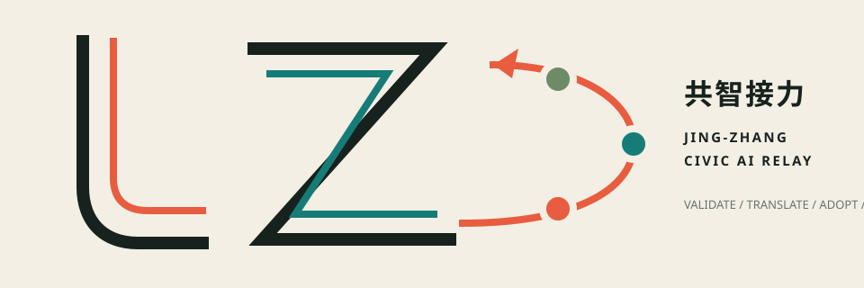
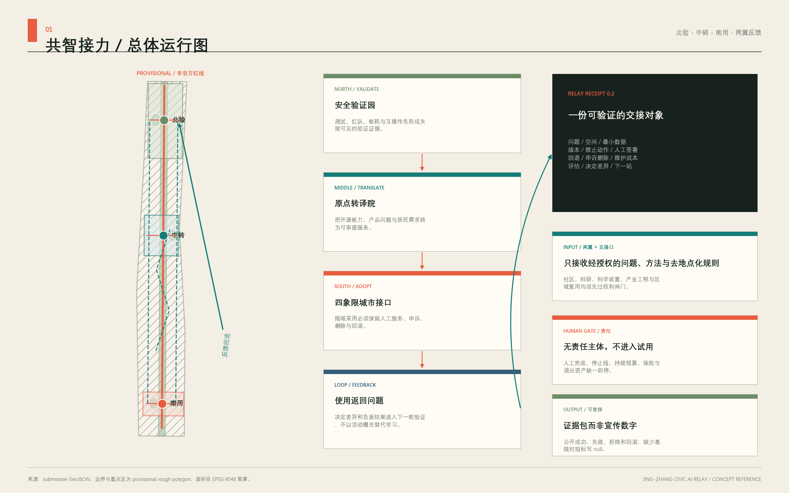
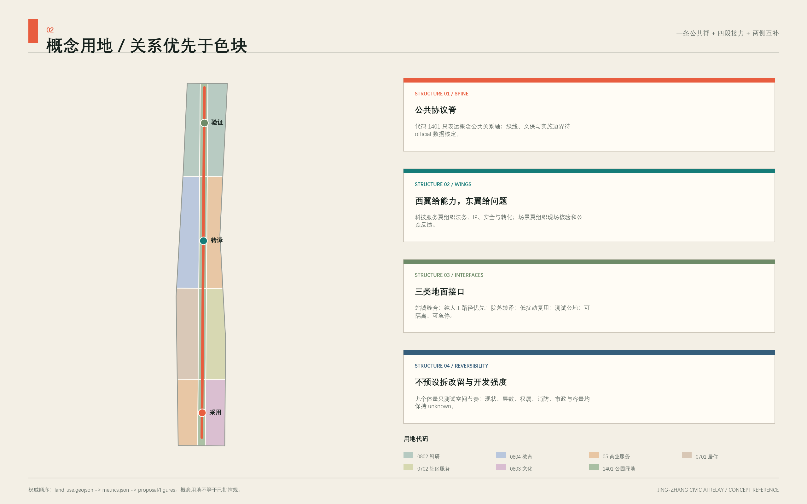
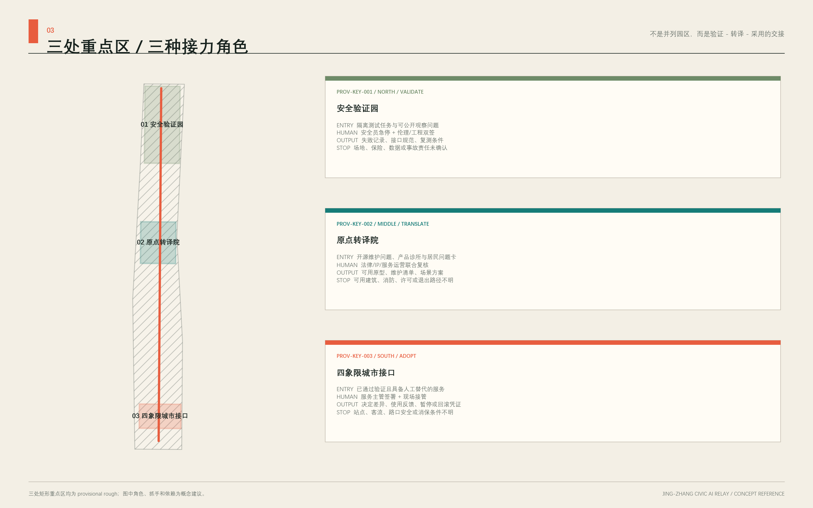
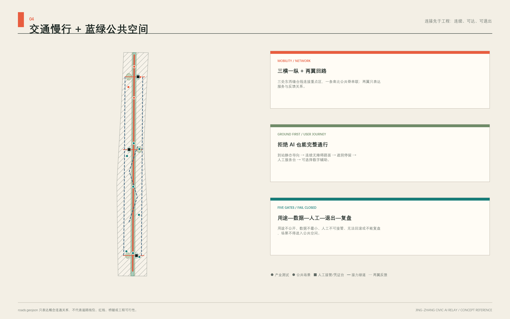
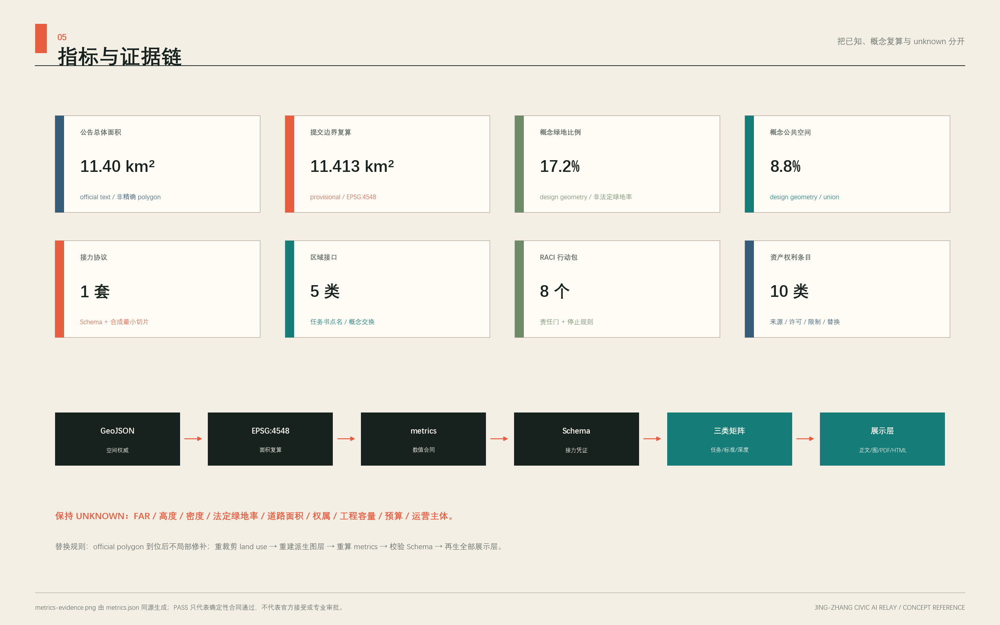

# 共智接力：百年京张 AI 城市学习带

**主名称：京张共智接力带** 
**英文名：Jing-Zhang Civic AI Relay** 
**核心判断：不是把三个园区串在一条“展示轴”上，而是让公共问题、技术验证、产业转译、城市使用、社会反馈和再验证沿京张走廊持续接力；每次交接都留下能被质询、拒绝和回滚的凭证。**

## 设计依据与资料清单

本方案首先区分证据等级。公告和清权任务书决定任务边界；仓库登记为 `usable_for_formal=yes` 的来源支撑正式事实；处理后的 fact pack 只作阅读导航；临时 polygon 只作生成、图示和 intake 自检；全球案例只作背景机制参照。由此，方案不会把粗略边界、开放底图、案例经验或智能体推断升级为官方红线、法定控规或政府承诺。[source:OFFICIAL-ANNOUNCEMENT] [source:AGENT-TASKBOOK] [source:SOURCE-REGISTRY] [source:PROCESSED-FACT-PACK] [source:SITE-PACKAGE]

设计前建立了“目标—空间—产业—人群—文化—运营—治理—证据”关系图，而不是先列项目：目标是形成世界级 AI 创新生态且增进公共利益；空间以京张公共协议脊连接北部验证、中部转译、南部应用，并由东西两翼反馈；产业用问题池、测试证据和采用服务形成闭环；人群覆盖研发者、创业团队、居民、学生、通勤者、运营者和访客；文化把铁路工程精神、中关村创新文化与可质询的 AI 新文化连续表达；运营以年度循环维护场景；治理要求最小数据、知情选择、人工复核、申诉和回滚；证据则落到 GeoJSON、metrics、矩阵、图纸和来源登记。[standard:PROJECT-AGENT-OPEN-CALL-TASKBOOK] [depth:existing_conditions_diagnosis]

整体情境比选采用七项等权判断，每项 1—5 分：整体效应、公共利益、AI 原生性、空间可转化性、长期运营、证据强度、对数据缺口的敏感性。A“三区园区增长”得 19 分，产业落位清楚但公共回路弱；B“未来地标走廊”得 18 分，传播强但容易形成一次性展示；C“城市学习接力”得 34 分，能把技术验证、公共使用和再验证闭合，且在官方 polygon 缺失时仍可按关系而非伪精确地块表达。因此 C 为主方案；A 作为产业分期备选逻辑，B 仅保留为识别系统和节点设计的传播工具。该比选是基于论文分析提炼的整体主义推断框架，不代表王红扬本人意见，也不替代现场调研、法定规划或专业工程判断。[source:BOUNDARY-SOURCE] [source:KEY-AREA-SOURCE]

当前正式包使用 EPSG:4326 表达坐标、EPSG:4548 复算面积。总体设计临时边界必须保持 `geometry_role=provisional_constraint`、`official_boundary=false`、`boundary_precision=provisional_rough`；三处重点区同样不具有法定效力。[data:geometry/site_boundary.geojson#SITE-001] [data:geometry/key_areas.geojson#PROV-KEY-001] 公告文字约 11.4 平方公里与临时 polygon 复算 11,412,825.386 平方米并列披露，差异约 0.1125%；公告三处重点区合计 3,684,000 平方米，临时 polygon 合计 3,692,893.005 平方米。两组值不相互替代，official polygon 到位后统一重建图层和复算。[metric:announced_overall_design_area_sqm] [metric:site_area_sqm] [metric:provisional_site_area_difference_ratio] [metric:announced_key_area_area_sqm] [metric:provisional_key_area_area_sqm]

## 三层范围工作框架

三层范围承担不同责任，不把同一套图放大缩小重复使用。[standard:PROJECT-OFFICIAL-ANNOUNCEMENT] [depth:three_level_scope_framework]

| 层级 | 公告任务 | 本方案的判断尺度 | 成果与诚实边界 |
| --- | --- | --- | --- |
| 统筹研究范围 | 约 43.6 平方公里产业生态、战略与未来城市研究 | 判断“创新带作为整体如何运行” | 产业—公共生活—运营关系图；没有 official polygon，不作精确面积或用地统计 |
| 总体设计范围 | 约 11.4 平方公里城市更新和控规深度城市设计 | 把接力机制转译为用地、建筑接口、慢行、蓝绿、公共服务和分期 | 采用临时总体边界；法定强度、道路红线和工程容量均为 unknown |
| 重点区域范围 | 三处约 368.4 公顷详细设计 | 用三个关键局部验证整条带的链式反应 | 临时重点区只作概念落位；拆改留、权属、文保和工程结论待专业核查 |

总体空间结构为“**一脊三站、两翼回流、十二场景节点**”。一脊是京张遗址公园方向的公共协议脊，不是新增红线；三站是北部“安全验证园”、中部“原点转译院”、南部“四象限城市接口”；中关村科技服务翼提供知识、资本与专业服务方向，小月河场景赋能翼承接城市问题与使用反馈。北部验证所得证据向中部转译，中部将能力和标准送往南部城市接口，东西两翼把企业、社区和公共服务的反馈送回北部再测试。[data:geometry/roads.geojson#ROAD-001] [data:geometry/public_space.geojson#PUBLIC-001] [depth:overall_spatial_structure]

三大定位在同一回路中分工：百年京张文化带保存“工程—开放—接力”的时间叙事；都市 AI 生活体验带让居民在可退出、可申诉的日常服务中感知 AI；AI 融合创新带把测试证据变成可采用的产品和公共能力。五大功能也不各占一块孤岛：全栈自主创新由北部验证支撑，世界级创新生态由中部转译连接，AI+ 场景赋能在东翼和南部接口验证，智能化活力城市由全带公共服务承载，AI 治理话语权来自公开证据、人工复核和可回滚机制。三区两翼因此形成闭环，而不是五块招商标签。[source:AGENT-TASKBOOK]

命名体系采用“带—站—节点—场景—凭证”五级语法：`京张共智接力带 / Civic AI Relay` 为总名，三个关键局部使用“验证—转译—接口”的动词型名称，公共节点使用“标、墙、厅、刻度”等可辨认名，场景卡统一使用 `SC-01…SC-12`，每次运行生成 `RELAY-RECEIPT`。独立 SVG 主标由 J/Z 双轨、三个接力点和一条回授弧构成；文化导视可调用双轨和刻度，但不能变形或替代主标。不得直接使用企业标识、人物肖像或未授权字体。视觉以纸白、墨黑、铁路信号橙、治理青和蓝绿色为主，形成“铁路时刻表 + 公共证据册”的工业编辑语言。[data:assets/relay-mark.svg]

## 统筹研究范围产业与未来城市研究

产业策略不以未经核实的企业清单、产值或招商承诺开场，而以一个可运营的采用链开场：**公共问题池 → 合规数据说明 → 多主体测试 → 证据卡 → 产品/服务转译 → 城市场景限域试用 → 用户反馈 → 再测试**。北部提供安全与互操作测试，中部提供开源维护、产品诊所、人才和专业服务，南部提供低风险城市接口，东西两翼分别组织科技服务与场景反馈。土地、空间、产业、资金、人才、算力、数据和场景八类要素均采用“可供专业团队深化研究”的机制建议，不绑定供应商，不承诺财政资源或审批结果。

全球案例只提取可迁移机制，不以案例规模、排名或宣传语替代本地证据：

| 背景案例 | 可核验机制 | 京张转译，不照搬 |
| --- | --- | --- |
| Vector Institute [source:CASE-VECTOR] | 从研究连接到可信采用 | 在北部形成“测试记录—风险说明—人工签署”的采用前证据卡 |
| Mila [source:CASE-MILA] | 研究共同体、创业支持与公共利益并置 | 原点社区设置开源维护、产品诊所和公共利益评议三类时段 |
| STATION F [source:CASE-STATIONF] | 历史大空间由持续项目而非单次装修激活 | 对适宜遗产载体只提出可逆、轻触的轮换计划，落位待文保核查 |
| LaunchPad @ one-north [source:CASE-LAUNCHPAD] | 模块空间、共享设施与社区运营并行 | 用可替换接口单元承载测试、路演、法律和安全服务，不预判建筑拆改 |
| Punggol Digital District [source:CASE-PUNGGOL] | 产学城与开放数字平台、生活实验结合 | 形成“高校—园区—社区”限域测试协议和公开退出机制 |
| London Knowledge Quarter [source:CASE-KQ] | 跨机构联盟与明确地理品牌协同 | 建立问题与能力目录，不虚构成员名单；以共同议题而非行政隶属协作 |
| AI Singapore [source:CASE-AISG] | 研究、工程采用、人才与治理成体系 | 把项目池、导师池、测试池、证据池、采用池串成年度运营台账 |

这些案例均登记为背景主来源，不能支撑海淀本地边界、产业数量或政策事实。它们的共同启示是：世界级生态并非“更多楼宇 + 更多活动”，而是让研究、工程、人才、公共问题和采用证据之间的转换成本持续降低。京张的本地优势应由后续正式调研验证，本方案只提供可被调研填充的结构。[standard:MOHURD-URBAN-DESIGN-MEASURES]

区域协同不虚构签约、成员或既有项目，只把任务书点名对象转译为待确认的“问题—能力—凭证”接口。任何一项协同都须由对应主体另行同意，交换去标识化材料，并保留拒绝、撤回和不互认的权利。[source:AGENT-TASKBOOK] [metric:regional_interface_count]

| 协同对象（任务书点名） | 京张提出的概念输入 | 可交换的最小输出 | 接收与退出闸门 |
| --- | --- | --- | --- |
| 北纬社区 | 居民问题、无障碍与非数字服务体验 | 去标识化问题卡、人工服务缺口、关闭原因 | 社区代表和服务运营者确认；不得把参与推定为同意部署 |
| 未来科学城 | 端侧模型、具身设备与测试方法方向 | 模型卡、设备护照、失败清单、复测条件 | 测试责任、知识产权和安全范围明确；不自动互认结果 |
| 怀柔科学城 | 科学装置、测量与专业验证方法方向 | 校准说明、测量不确定性、独立复核问题 | 数据许可与专业责任确认；不以合作设想代替真实资源 |
| 经开区 | 工程化、制造、供应链与场景转化方向 | 互操作证据、维护要求、停产/召回条件 | 企业自愿且消费者权益审查通过；不承诺采购或落地 |
| 京津冀 | 跨城共性问题与规则复用方向 | 去地点化 Schema、负面结果、版本差异 | 各地依法复核；不得复制本地坐标、个人数据或审批结论 |

中关村科技服务翼承担“能力目录、法律/IP、安全和转化接口”，小月河场景赋能翼承担“问题入口、现场核验和公众反馈”；上述五类外部接口只在两翼形成可追踪的输入输出，不直接穿透到公共场景。协同成效不以签约数或曝光量衡量，而看复用协议数、负面结果披露率、问题回应率和本地基本服务是否改善；目前这些均无运行基线，不填绩效值。

未来城市形态因此采用“可学习的公共基础设施”：空间能提示当前场景采集什么、谁负责、何时删除、如何退出；运营方定期发布问题、失败、修复和复测摘要；市民既是使用者也是提出问题和拒绝技术的权利主体。AI 原生性不来自屏幕数量，而来自多智能体在受限任务中协作、留下证据、接受人工裁决并可回滚。产业价值则通过测试周期、证据完备率、采用转化和公共反馈关闭率来观察，具体目标值须在运营主体、数据基础和基线调查明确后另行确定。

## 总体设计范围城市更新与控规深度城市设计

总体设计把接力逻辑转译为三类空间：连续公共协议脊负责步行、文化、告知与反馈；三处关键局部负责验证、转译和城市使用；两翼接力线把专业服务和社区场景接入。十二个用地分区使用同一组横向切线和三列纵向切线，地块共享坐标、覆盖临时提交边界且不作法定地类结论。[data:geometry/land_use.geojson#LU-001] [metric:land_use_coverage_ratio] [metric:land_use_total_area_sqm] [depth:land_use_layout]

三个关键局部是能触发空间、产业、公共生活和运营链式反应的“最小充分干预”：

1. **北部安全验证园**把技术测试、标准共创、公众观察窗和清河方向绿色交往放在同一运行协议下；一次测试同时产出产业证据、公共解释和治理反馈。
2. **中部原点转译院**把高校知识、开源维护、创业服务、人才学习和成果发布组织为日常院落式时序；它把“能运行的模型”翻译成“能被采用、能被质询的服务”。
3. **南部四象限城市接口**把轨道接驳、智能原生服务、文化体验和无障碍步行放入同一公共界面；它既是城市入口，也是把真实使用问题送回北部的反馈端。

体量图层只布置九个概念接口单元，用于检查空间关系和图面可读性；现状建筑轮廓、用途、年代、层数、结构、权属和拆改留条件均未取得。[data:geometry/buildings.geojson#BLDG-001] [metric:building_footprint_area_sqm] [metric:conceptual_building_coverage_ratio] 容积率、建筑高度、建筑密度、绿地率法定指标、退线、道路红线、轨道边界、停车供给、市政容量和四线资料保持 unknown，不以概念几何反推控制值。[standard:MOHURD-CONTROL-DETAILED-PLANNING] [depth:development_intensity_controls]

总体设计的深化顺序是：先取得 official polygon 和法定控制资料；再做现状建筑、产权、文保、交通、市政、生态和人群调查；随后确定保留—修缮—改造—拆除的专业判断；最后才校核地块指标、工程线位、容量和实施主体。当前图层是问题与关系的容器，不是审批图。

## 重点区域详细设计

三处重点区均采用组织方临时粗略 polygon，仅用于概念落位与自检；其矩形边不得解释为道路、地块或权属边界。[data:geometry/key_areas.geojson#PROV-KEY-001] [data:geometry/key_areas.geojson#PROV-KEY-002] [data:geometry/key_areas.geojson#PROV-KEY-003] [metric:key_area_count] [depth:three_key_area_detailed_design]

**众智园 AI 自主创新加速区—安全验证园。** 功能建议包括具身智能多主体安全验证、端侧模型能耗与韧性测试、开源红队和互操作验证；空间建议由共享实验接口、公众观察窗、标准解释廊和绿色交往庭组成；运营采用预约测试、风险分级、独立复核、失败公开和复测闭环；数据只保留完成测试所需的最小日志。清河文化、生态、对外交通、平台资质、测试责任和实际可用建筑须由专业团队核查。本区不承诺“国家平台”落地，不把测试通过等同于监管批准。

**北京 AI 原点社区—原点转译院。** 功能建议包括开源维护者席位、产品诊所、成果解释发布、人才共学、社区问题门诊和生活支持；空间建议用可逆隔断组织上午共学、下午诊所、晚间公众讲解的时序共享，连接校园、园区、社区和轨道方向；运营记录问题来源、维护贡献、采用障碍和后续责任人。高校、企业、住房、既有建筑和站点关系均待实测，不以概念点位推定可进入的权属空间。

**大钟寺 AI 产业聚集区—四象限城市接口。** 功能建议包括轨道四象限步行助理、智能体消费沙箱、数字内容体验、公共法律服务分诊和京张记忆共读；空间建议以地面优先的可达界面、可撤回信息组件、安静等候点和跨象限连续导向为先，桥隧、地下连通和站城工程只列为待论证选项；运营以无障碍测试、消费者保护、内容审核、人工服务台和申诉处理为前提。站点边界、客流、绿地、路口安全、工程条件和商业权属未取得。

三区不是三个独立品牌：北部产生验证证据，中部维护知识和组织采用，南部暴露真实问题；中关村科技服务翼提供法律、标准、资本和国际连接方向，小月河场景赋能翼组织社区问题与公共服务试用方向。每个季度必须有一批问题完成“南部提出—中部转译—北部复测—全带公开”的闭环，否则“接力”退化为活动口号。

## AI 创新生态、人才画像与 AI+ 场景

七类用户画像不是营销人群，而是权限、风险和服务路径的设计输入。[metric:persona_count]

| 画像 | 核心任务 | 需要的空间与服务 | 权利/风险关注 |
| --- | --- | --- | --- |
| 研发者与开源维护者 | 测试、复现、修复、发布 | 可预约测试台、版本档案、同伴评议 | 署名选择、许可证、失败记录不被包装 |
| 初创与产品团队 | 找到问题、合规验证、采用支持 | 产品诊所、法律安全时段、演示接口 | 不承诺投资或采购，明确责任边界 |
| 社区居民与老年人 | 获得日常服务并反馈问题 | 线下人工台、低门槛说明、安静等候 | 不因拒绝 AI 失去服务，不进行持续画像 |
| 学生与青年学习者 | 学习、贡献、获得可验证经历 | 共学桌、开放任务、导师与成果说明 | 未成年人保护、贡献可撤回、避免诱导 |
| 通勤者与行动不便者 | 连续、可靠地通过站点和公共空间 | 无障碍导航、故障替代路线、人工指引 | 定位最小化，不以算法输出替代安全责任 |
| 场景运营与一线服务者 | 配置、监控、暂停、复盘 | 运营台账、熔断按钮、事件分级 | 明确值守、升级和问责，不让自动化隐去劳动 |
| 国际访客与治理观察者 | 理解技术、城市与规则 | 双语证据卡、公开演示、参访路径 | 不夸大成效，区分演示、测试和批准运营 |

以下 12 张场景卡全部是概念建议，不是已批准运营。每张卡都同时写明服务对象、空间、运营、最小数据、隐私、人工复核、非 AI 替代、申诉和停止条件；其中 SC-01 至 SC-04 为产业测试验证场景。[metric:scenario_node_count] [metric:industry_test_scenario_count] [metric:scenario_governance_field_count] [data:geometry/public_space.geojson#SC-01]

| ID / 场景 | 主要用户与空间 | 运营和最小数据 | 人工门、非 AI 替代与停止条件 |
| --- | --- | --- | --- |
| SC-01 具身智能多主体安全验证 | 研发者；北部受控测试接口与公众观察窗 | 预约制；仅记版本、任务、碰撞/失效和修复 | 安全员急停；公众可只看静态解释；越界、失联或接管失败立即停测 |
| SC-02 端侧模型能耗与韧性测试 | 产品团队；可计量测试台 | 比较离线、断网、降级和能耗；只存设备级测量 | 工程师签署；纸面报告可替代交互；无法隔离个人内容或安全断电即停止 |
| SC-03 开源模型红队与标准共创 | 维护者、治理观察者；隔离红队室 | 保存脱敏提示类别、失效类型、修补版本和复测证据 | 伦理/安全复核披露粒度；可提交人工缺陷单；出现可利用高危漏洞即封存 |
| SC-04 城市服务接口互操作测试 | 公共服务人员、开发者；模拟服务柜台 | 仅用合成工单检查状态、人工转接和日志接口 | 服务主管签署；人工柜台脚本始终可用；误转高风险事项或日志缺失即失败 |
| SC-05 开源维护者产品诊所 | 初创、维护者；原点转译院 | 按周接诊；登记问题、依赖、许可证和后续责任 | 法律/安全人员转介；现场预约替代；未授权经营信息进入记录即删除并暂停 |
| SC-06 可解释学习伙伴 | 学生、教师；共学花园与室内席位 | 只保存主动提交的任务和反馈；可使用访客模式 | 教师复核；纸质学习包并行；长期画像、诱导或无法说明来源即停用 |
| SC-07 无障碍慢行导航 | 行动不便者、访客；原点东西缝合线 | 公开路网加现场核验障碍；精确位置短时处理 | 人工热线和静态图兜底；错误导向安全风险或人工通道不可用即下线 |
| SC-08 社区健康服务导航 | 居民、老年人；社区人工服务台 | 只检索公开服务与预约入口；不存病历 | 工作人员复核并提供纯人工路径；输出诊断、遗漏紧急转介或无法退出即停止 |
| SC-09 公共法律服务分诊 | 居民、创业团队；南部公共服务点 | 只识别问题类别、材料清单和公共服务入口 | 法律人员确认；纸面目录可用；生成法律结论、泄露材料或误导时暂停 |
| SC-10 轨道四象限步行助理 | 通勤者、访客；南部城市接口 | 实测可达性和临时障碍；不追踪个人轨迹 | 现场人员确认；静态导向始终可见；安全信息过期或现场冲突即切回静态 |
| SC-11 智能体消费沙箱 | 消费者、产品团队；限定展示界面 | 显示代理权限、预算、确认步骤；只存模拟日志 | 每步人工确认；普通商品信息并行；接入真实支付、暗黑模式或撤销失败即关闭 |
| SC-12 京张记忆共读器 | 居民、访客；公共协议脊 | 只用清权史料和自愿投稿；标注出处与争议状态 | 编辑核史；静态时间线并行；来源不明、权利争议或撤回未执行即隐藏 |

场景治理共用十个字段：公共目的、服务对象、空间边界、最小数据、模型/工具权限、人工责任、非 AI 替代、申诉删除、评估方法、停止/回滚。全部字段缺一不可；运营台账按“提议—筛查—沙箱—限域试用—暂停/拒绝—采用—退役/回滚”表达状态，不出现“已部署”“全覆盖”等无证据措辞。[source:AGENT-TASKBOOK] [metric:scenario_governance_field_count]

### 接力凭证协议与最小可复现切片

`visual/assets/relay-receipt.schema.json` 是本案的机器可读 `Relay Receipt 0.2` 草案。[metric:machine_readable_protocol_count] 它把一次场景运行的公共问题、空间引用、数据保留、模型和工具版本、禁止动作、人工签署、非 AI 回退、申诉、维护责任、成本状态、评估和下一站交接放入同一对象；状态转换必须留下 `decision_diff`，缺少基线时指标值为 `null` 而不是估算。Schema 是概念治理接口，不是现行政府系统、法定档案或已上线平台。[data:visual/assets/relay-receipt.schema.json]

最小切片选择风险最低且不需要真实个人数据的 SC-04：`visual/assets/example-sc04-relay-receipt.json` 使用四份合成工单，演示“提议—沙箱—人工签署—不进入真实业务”的完整记录。示例明确 `deployment_status=sandbox_only`、`performance_results=null`，列出误转高风险事项、日志中断和人工接管失败三个硬停止条件；它可通过 JSON Schema 校验，但这只证明结构可执行，不证明接口正确、服务可用或现实部署安全。[metric:minimum_reproducible_slice_count] [data:visual/assets/example-sc04-relay-receipt.json]

空间上的三个接力点因此对应三类不可互换的对象：北部出具 `TestEvidence`，中部维护 `AdoptionPackage`，南部形成 `UseFeedback`；只有人工签署的 `RelayReceipt` 能把对象交给下一站。任何主体都不能靠多智能体投票绕过人类责任、扩大工具权限、自动分配预算、关闭公共工单或改变法定空间控制。

为使“人工负责”不是抽象口号，`public_space.geojson` 在三处 agent 生成的概念公共空间内新增 `HG-01`—`HG-03` 三个人工接管与凭证台候选点，分别承接验证签署、转译责任和采用反馈。[metric:human_handoff_gate_count] [data:geometry/public_space.geojson#HG-01] [data:geometry/public_space.geojson#HG-02] [data:geometry/public_space.geojson#HG-03] 三点只表达“必须有可见人工柜台和纸质/人工替代”的空间接口，不代表现状设施、官方点位或已安排人员；official 边界、权属、流线和无障碍调查到位后必须重新选址。

## 用地、建筑规模与拆改留方案

用地图是概念功能分区，不是控规调整。十二个共享边界分区采用国土空间用途分类代码，中央四段均为 1401 公园绿地方向；两侧按北部科研、中部教育/商务、生活支持、南部商务/文化方向组织。各类面积来自临时 polygon 在 EPSG:4548 下复算，因边界和控制资料缺失，不能作为法定用地规模。[standard:MNR-LAND-USE-CLASSIFICATION-GUIDE]

| 概念用途代码 | 功能角色 | 复算面积证据 |
| --- | --- | --- |
| 05 商业服务业用地 | 原点成果转译与南部智能原生服务方向 | [metric:land_use_05_area_sqm] |
| 0701 城镇住宅用地 | 生活支持方向，不推定具体住房项目 | [metric:land_use_0701_area_sqm] |
| 0702 城镇社区服务设施用地 | 社区问题征集与人工服务方向 | [metric:land_use_0702_area_sqm] |
| 0802 科研用地 | 北部验证、研发和标准共创方向 | [metric:land_use_0802_area_sqm] |
| 0803 文化用地 | 南部文化解释和公共体验方向 | [metric:land_use_0803_area_sqm] |
| 0804 教育用地 | 原点共学、开源维护和人才协作方向 | [metric:land_use_0804_area_sqm] |
| 1401 公园绿地 | 连续公共协议脊和三个绿色交往节点 | [metric:land_use_1401_area_sqm] |

九个建筑基底只是“接口体量”：用于检验共享实验、公众观察、共学、产品诊所、人工服务和文化解释之间的关系。其基底并非现状测绘，不包含层数或高度，不能换算建筑规模、容积率或建筑密度。官方建筑密度、官方绿地率、总建筑面积和容积率仍为 unknown。[metric:total_floor_area_sqm] [metric:floor_area_ratio] [metric:official_building_density] [metric:official_green_ratio]

拆改留不在当前资料条件下给结论，而采用五闸门流程：第一闸取得现状建筑测绘、年代、用途和结构；第二闸核查文物、历史建筑和京张遗产控制；第三闸核查权属、租约和在用主体；第四闸评估碳排、无障碍、消防和适应性改造；第五闸比较保留、修缮、改造、拆除的全生命周期公共收益。只有五项证据齐备后，专业团队才能逐栋分类。[depth:retain_renovate_demolish] [depth:height_massing_character]

建筑风貌不规定伪精确高度，而规定关系：沿公共协议脊保持可进入、可停留和能看见服务责任人的界面；新增组件轻触、可逆、可维护；重要历史视廊和遗产本体优先避让；广告化屏幕不占据公共空间主导位置；夜间信息使用低亮度、分时和可关闭策略。具体高度、天际线和材料须在 official 控制条件、视线分析和样板评审后确定。[standard:MOHURD-ARCH-DESIGN-DEPTH-2016]

## 交通、轨道、市政与公共服务设施

交通图层表达七条关系线，不表达道路红线或工程线位：南北共智接力绿道、三条重点区东西缝合线、两条翼线和一条公共体验回游线。[data:geometry/roads.geojson#ROAD-001] 概念中心线总长约 31,025.594 米，只用于比较网络连续性；道路面积保持 unknown，因为没有红线、断面和站点边界。[metric:road_centerline_length_m] [metric:road_area_sqm] [depth:traffic_rail_slow_parking]

交通优先级是步行与无障碍连续性、骑行接力、公共交通换乘、服务与应急可达，最后才是新增机动车容量。三个重点区都先做地面层诊断：过街等待、坡度、台阶、遮阴、夜间照明、非机动车停放、施工占道和断点；若地面可修复，不以桥隧或地下空间作为默认答案。大钟寺“四象限”是问题框架，不是已论证的地下连通方案。轨道站点一体化、停车供给和道路微循环须以客流、红线、交通模型和安全评估深化。

市政和新型基础设施采用“小单元、可断开、可计量”原则：测试节点可预留受控网络接口、端侧算力柜、独立计量、紧急断电和日志导出方向；公共空间优先提供电力、遮阴、饮水、座椅、卫生间、无障碍和人工服务，再配置 AI 体验。能源负荷、通信容量、给排水、消防、市政管线和设备位置均未测算，不构成工程设计。[depth:municipal_new_infrastructure]

公共服务采用“双通道”：任何 AI 导航、分诊、预约或解释服务都必须保留不使用 AI 的线下/电话/静态信息通道。运营者在现场可识别，错误可上报，高风险事项只能转人工。该原则让技术失效不等于公共服务失效，也让居民拒绝数据处理时不受惩罚。

## 蓝绿空间、公共空间与城市风貌

连续绿脊、清河验证花园、原点共学花园和大钟寺城市客厅绿岛构成概念蓝绿系统。[data:geometry/green_space.geojson#GREEN-001] 临时边界内概念绿地复算 1,962,400.999 平方米，占 17.1947%；这不是法定绿地率，也不替代绿线和生态调查。[metric:green_space_area_sqm] [metric:green_ratio] 公共协议步行脊及三个公共场地复算 1,008,388.866 平方米，占 8.8356%；部分空间与绿地可复合，因此不能把两类面积简单相加。[data:geometry/public_space.geojson#PUBLIC-001] [metric:public_space_area_sqm] [metric:public_space_ratio] [depth:blue_green_public_space]

公共空间组件遵循“能读懂、能拒绝、能修复”：证据牌显示目的、数据、责任人和结束日期；静态刻度提供无设备也可阅读的铁路与创新时间线；人工服务桌提供替代路径；可移动测试台只在活动期间出现；安静座椅和遮阴不附加数据交换条件；停止按钮和故障标识处于可见位置。智能设施不得侵占基本通行和休息权。

四个朝圣/荣誉节点均为轻触概念，数量为 4。[metric:landmark_count] **零号信号标**把“开始测试”变成公开承诺；**开源年轮墙**按版本和维护贡献记录可撤回的署名；**城市回声厅**展示问题、失败、修复和复测，不只展示成功；**百年接力刻度**把铁路建设、开放创新与 AI 治理的时间层叠在一条可步行标尺上。[data:geometry/public_space.geojson#LM-01] 任何落位须避让文保范围、绿线、交通安全和权属空间，不使用人脸识别或强制互动。

文化叙事由三层构成：京张铁路代表长期工程、公共连接和代际接力；中关村创新文化代表求证、开放协作和知识转化；AI 新文化应补上可解释、可质询、承认失败和尊重退出。导视系统用“双轨线—站点圆—回授弧”表达接力；整体 Logo 与文化标识分开管理，前者识别一带，后者解释具体历史。国际传播短句为：**A railway of shared intelligence—tested in public, translated with care, returned to the city.** 历史事实和遗产范围须由正式史料与文保专业团队校核。

## 更新项目清单、实施政策与分期计划

项目清单共 8 项，均是概念行动包，不代表立项、投资或施工安排。[metric:renewal_project_count] [depth:renewal_project_list]

| 编号 | 行动包 | 最小交付 | 启动前置条件 |
| --- | --- | --- | --- |
| P1 | 公共协议脊 | 连续步行诊断、证据牌规则、静态替代导向 | official 边界、遗产/绿线、无障碍和权属核查 |
| P2 | 安全验证公地 | 四类产业测试协议、急停、公众观察窗 | 测试责任、场地安全、数据影响和保险审查 |
| P3 | 原点转译院 | 共学、产品诊所、开源维护和成果解释时段 | 可用建筑、运营主体、知识产权和消防核查 |
| P4 | 四象限城市接口 | 地面可达诊断、人工台、消费沙箱 | 站点/路口数据、交通安全、消费者保护评审 |
| P5 | 两翼接力站 | 科技服务目录与社区问题入口 | 机构自愿参与、真实服务能力和退出规则 |
| P6 | 场景证据账本 | 状态、风险、人工裁决、失败和复测摘要 | 数据分类、公开粒度、申诉和安全响应机制 |
| P7 | 百年接力识别系统 | Logo、导视、时间刻度、四类可逆组件 | 历史事实、版权、文保和样板审查 |
| P8 | 年度共智接力计划 | 问题征集、开发测试、公众体验、年度复盘 | 运营章程、责任预算、无障碍和应急保障 |

为避免“有项目、无责任人”，八个行动包使用概念 RACI。`A` 只表示未来经授权且对结果负责的单一牵头角色，本案不擅自指定政府部门、产权人或企业；`R` 是实际执行所需专业和运营角色；`C` 是进入决定前必须参与的权利人、公众和监管专业；`I` 是通过公开凭证持续获知进展的使用者。下列服务目标是试点校准起点，不是现行服务标准、采购条款、预算承诺或政府时限。[metric:raci_action_package_count] [data:visual/assets/operations-matrix.json]

| 行动包 | 概念 A / R / C-I | 公共价值闸门 | 候选响应与停止规则 |
| --- | --- | --- | --- |
| P1 公共协议脊 | A：经授权公共空间管理方；R：规划、交通、景观、无障碍、维护；C-I：沿线权利人和所有使用者 | 开放前连续路径与非 AI 导向审计覆盖全部试点段 | 严重安全缺口立即隔离；普通问题 1 个工作日内确认，未形成处置路径不得扩段 |
| P2 安全验证公地 | A：经授权测试责任方；R：模型安全、能源、设备和现场安全；C-I：受影响人群与独立专业人员 | 急停、权限隔离、失败记录与复测条件完整 | 严重风险立即停测；24 小时内形成事件初记，人工接管失败不得恢复 |
| P3 原点转译院 | A：经授权服务运营方；R：开源维护、法务、知识产权、产品、伦理；C-I：开发者与权利人 | 每项建议标注来源、许可、责任边界和后续责任人 | 2 个工作日内确认受理；不能承诺投资、订单或审批，权利争议先停止传播 |
| P4 四象限城市接口 | A：经授权站城/公共服务运营方；R：交通、消费者保护、服务和无障碍；C-I：通勤者、居民、商户 | 地面普通路径、人工台和投诉入口先于智能功能可用 | 安全冲突或人工通道中断即关闭增强层；不以桥隧和地下工程作为默认答案 |
| P5 两翼接力站 | A：经授权协同牵头方；R：能力目录、社区联络、数据和安全；C-I：自愿参与主体 | 输入、输出、许可、失效日期和退出责任均登记 | 对方未确认、数据超范围或能力不可核实则不发布；不以签约数替代成效 |
| P6 场景证据账本 | A：经授权数据责任方；R：安全、法律、档案、运维；C-I：申诉者和公众监督者 | 正负结果、人工修改、删除与回滚均可追溯 | 严重事件实时升级；删除到期或申诉超时则暂停对应场景，不得静默结案 |
| P7 识别与荣誉系统 | A：经授权品牌/文化责任方；R：设计、历史、文保、版权、展陈；C-I：贡献权利人和公众 | 来源、授权、争议和撤回入口覆盖全部展示对象 | 权属争议 1 个工作日内先隐藏；核验失败或撤回未执行则不得恢复 |
| P8 年度共智接力 | A：经授权年度运营牵头方；R：活动、安全、社区、开发者和维护团队；C-I：使用者与评议者 | 每年同时公开继续、调整和停止的项目，不只发布成功 | 主体、许可、持续预算、值守或退出后资产处置任一不清楚，则缩小或取消 |

资源采用“五本账”而不是先报总投资：人员账记录值守、专业复核、申诉和维护工时；空间账记录使用时段、替代用途与撤场条件；设备账记录采购/租赁、能耗、备件和退役；数据账记录采集、存储、安全、删除与审计成本；公共价值账记录基本服务改善、负面结果和机会成本。当前没有运营主体、服务量、设备选型、人工排班和市场报价，因此所有金额保持 unknown。首个开放周期只用于校准工单量、值守容量、维护频率和成本区间；若承担 `A` 的角色、持续预算、保险、许可、数据责任或退出资产处置任一项不清楚，相应行动包不得进入常态运营。[assumption:A-OPERATIONS-001]

三期 polygon 只表达从小范围协议试点到三个关键局部、再到全带关系网络的概念扩展，不代表开发时序。第一阶段约 312,202.227 平方米，先验证 P2/P3/P4 的规则和人工能力；第二阶段约 1,606,526.574 平方米，连接三处关键局部与两翼服务；第三阶段约 9,494,102.999 平方米，只在前两阶段证据表明公共价值、可维护性和安全性后讨论全带扩展。[data:geometry/phasing.geojson#PHASE-001] [metric:phase_1_area_sqm] [metric:phase_2_area_sqm] [metric:phase_3_area_sqm] [depth:phasing_implementation]

年度运营建议形成四季循环：第一季度发布城市问题和公共利益审查；第二季度开展开发者协作、红队和互操作测试；第三季度组织低风险公众体验与国际交流周；第四季度公开失败、修复、采用和退出情况，更新贡献荣誉。开发者社区不以一次黑客松结束，而以维护者轮值、问题负责人、复测义务和版本档案延续。场景转化路径为“问题入池—伦理/数据/无障碍筛查—合成数据测试—限域试用—人工评议—采用或关闭—年度复盘”。

公众参与不是末端征询。进入沙箱前由服务对象和一线人员共同定义问题；开放前由残障人士、老年人、非智能手机使用者、维护人员和相关专业者走查普通路径、告知、退出与人工接管；运行中允许匿名反馈和正式申诉；结束时公开采纳、未采纳、暂停和回滚理由。当前成果只完成了机器结构校验、浏览器键盘/响应式预检和 PDF 渲染检查，尚未发生真实公众参与、残障用户测试、现场走查、服务容量测试或接管演练，不得把设计声明写成已验证包容性。[self_check:ACCESSIBILITY_PRECHECK] [self_check:PDF_VISUAL_QA]

政策机制只提出条件：可研究跨主体场景协议、共享测试责任模板、公共问题采购前证据卡、失败复盘披露和贡献可撤回机制；是否采用、由谁出资、谁运营、是否招商或采购，必须由政府、产权人、专业机构和公众依法另行决定。

## 指标体系、面积复算与合规矩阵

机器数据优先于展示层。面积和长度从 GeoJSON 复算，指标再驱动正文、五张核心图、A3/A0 PDF 和离线 HTML；展示层不得另造数值。[depth:metrics_recalculation]

| 指标组 | 当前机器值与解释 |
| --- | --- |
| 边界 | 临时 site 11,412,825.386㎡ [metric:site_area_sqm]；公告文字 11,400,000㎡ [metric:announced_overall_design_area_sqm]；差异比 0.001125 [metric:provisional_site_area_difference_ratio] |
| 重点区 | 3 处 [metric:key_area_count]；临时 polygon 3,692,893.005㎡ [metric:provisional_key_area_area_sqm]；公告文字 3,684,000㎡ [metric:announced_key_area_area_sqm] |
| 用地拓扑 | 全覆盖比 1.0 [metric:land_use_coverage_ratio]；分区并集复算约 11,412,859.020㎡ [metric:land_use_total_area_sqm]。与 site 的约 33.6㎡差异来自经纬度共享边分段后投影弦线的数值细分，空间复核未发现超过 1㎡容差的两两重叠，也无超过相对容差的缺口；official polygon 到位后重算 |
| 概念建筑 | 基底并集 63,849.271㎡ [metric:building_footprint_area_sqm]；相对临时 site 比例 0.005595 [metric:conceptual_building_coverage_ratio]，不代表建筑密度 |
| 蓝绿与公共空间 | 概念绿地 1,962,400.999㎡ [metric:green_space_area_sqm]、比例 0.171947 [metric:green_ratio]；概念公共空间 1,008,388.866㎡ [metric:public_space_area_sqm]、比例 0.088356 [metric:public_space_ratio] |
| 网络 | 概念中心线 31,025.594m [metric:road_centerline_length_m]；道路面积 unknown [metric:road_area_sqm] |
| 内容交付 | 场景 12 [metric:scenario_node_count]，其中产业测试 4 [metric:industry_test_scenario_count]；画像 7 [metric:persona_count]；地标 4 [metric:landmark_count]；项目 8 [metric:renewal_project_count]；必选合规项 23 [metric:compliance_requirement_count] |

开发强度相关指标保持 unknown：总建筑面积、容积率、官方建筑密度和官方绿地率没有可批准的来源。不能因机器格式要求就用假定值填充。[metric:total_floor_area_sqm] [metric:floor_area_ratio] [metric:official_building_density] [metric:official_green_ratio]

合规矩阵逐条覆盖公告 1.3、1.4、1.5 和 agent.1—agent.6；标准矩阵覆盖公告、任务书、城市设计、控规、用地分类和建筑设计深度六类依据；设计深度矩阵覆盖现状诊断、三层范围、总体结构、用地、强度、风貌、拆改留、交通、市政、蓝绿、三个重点区、项目、分期、指标和风险十五项。每条矩阵同时指向章节、图层、指标、图纸、来源、假设和自检项，避免正文与机器成果脱节。[standard:MOHURD-URBAN-DESIGN-MEASURES] [standard:MOHURD-CONTROL-DETAILED-PLANNING]

## 风险、版权与合规说明

首要风险不是“设计不够精确”，而是用缺失资料制造伪精确。约束登记为空并不表示没有约束，只表示公开包尚未提供可清权的控规、道路红线、轨道边界、权属、建筑底数、市政、文保控制线、绿线和蓝线 geometry。[data:geometry/constraints.geojson#CONSTRAINT-REGISTER] [depth:risk_missing_data] 取得新资料后的替换顺序为：确认来源及许可 → 更新 official constraint → 重建所有派生图层 → EPSG:4548 统一复算 → 重渲染图纸/HTML/PDF → 重跑全套自检；不得局部平移临时方案冒充校准。

规划风险边界明确：容积率、高度、建筑密度、绿地率、退线、拆改留、道路/轨道/桥隧/管线、投资、权属、审批和开发时序均未形成结论。所有空间、政策、活动、品牌和运营内容均是“概念建议”“参考方案”或“可供专业团队深化研究”，不构成政府、投资、招商、采购或工程承诺。

数据与 AI 风险采用预防原则：不使用未清权地图、未清权数据或个人隐私；不依赖持续生物识别；高风险公共决策不得由模型自动完成；每个场景保留人工复核、非 AI 替代、申诉、暂停、回滚和删除机制。合成数据测试不自动证明真实环境安全，限域试用也不自动证明可规模化部署。

版权方面，正文、结构化数据、图示、HTML 和 PDF 由本次智能体工作流基于仓库清权材料和自行生成的几何、排版与文字形成；使用系统字体渲染，不上传字体文件；没有使用商业地图截图、远程瓦片、未授权照片、商标、肖像或论文图像。全球案例仅作文字机制总结并回引原始机构页面，不能复用其视觉资产。`visual/assets/asset-rights.json` 逐项登记正文、Logo/VI、GeoJSON、图纸、PDF、HTML、Schema、示例数据、字体使用和外部案例摘要的来源、生成方式、再分发内容与限制，避免用一段总声明代替资产审计。[metric:asset_rights_entry_count] [data:visual/assets/asset-rights.json] 许可与展示范围以 `COMMUNITY-DISPLAY-ONLY` 和 copyright statement 为准。

本方案采用的整体主义方法是从公开论文分析报告中提炼的推断性框架，仅用于组织目标、空间、产业、人群、文化、运营、治理和证据的关系；它不代表王红扬本人意见，不替代现场调研、法定规划、公众参与、文保审查、交通/市政/建筑专业设计或政府审定。最终判断仍由维护者、评审者、专业团队与相关公众作出。

## 参考资料

1. 北京市规划和自然资源委员会海淀分局，《百年京张 AI 创新带城市设计国际方案征集资格预审公告》。[source:OFFICIAL-ANNOUNCEMENT]
2. 《面向全球智能体开展百年京张 AI 创新带城市设计开源征集任务书摘录》。[source:AGENT-TASKBOOK]
3. 仓库 site package、允许设计空间、枚举、schema 与标准索引。[source:SITE-PACKAGE]
4. 公开来源登记和用途边界。[source:SOURCE-REGISTRY]
5. Agent fact pack，仅作阅读导航。[source:PROCESSED-FACT-PACK]
6. 总体设计临时粗略边界及其推导说明。[source:BOUNDARY-SOURCE]
7. 三处重点区域临时粗略 polygon 及其推导说明。[source:KEY-AREA-SOURCE]
8. 住房和城乡建设部，《城市设计管理办法》。[source:URBAN-DESIGN-MEASURES]
9. 《城市、镇控制性详细规划编制审批办法》。[source:CONTROL-DETAILED-PLANNING]
10. 《国土空间调查、规划、用途管制用地用海分类指南》。[source:LAND-USE-GUIDE]
11. Vector Institute 官方 About 页面。[source:CASE-VECTOR]
12. Mila 官方机构页面。[source:CASE-MILA]
13. STATION F 官方 About 页面。[source:CASE-STATIONF]
14. JTC LaunchPad @ one-north 官方页面。[source:CASE-LAUNCHPAD]
15. JTC Punggol Digital District 官方页面。[source:CASE-PUNGGOL]
16. London Knowledge Quarter 官方页面。[source:CASE-KQ]
17. AI Singapore 官方页面。[source:CASE-AISG]

标准响应同时引用 [standard:PROJECT-OFFICIAL-ANNOUNCEMENT]、[standard:PROJECT-AGENT-OPEN-CALL-TASKBOOK]、[standard:MOHURD-URBAN-DESIGN-MEASURES]、[standard:MOHURD-CONTROL-DETAILED-PLANNING]、[standard:MNR-LAND-USE-CLASSIFICATION-GUIDE]、[standard:MOHURD-ARCH-DESIGN-DEPTH-2016]。设计深度由 [depth:existing_conditions_diagnosis]、[depth:three_level_scope_framework]、[depth:overall_spatial_structure]、[depth:land_use_layout]、[depth:development_intensity_controls]、[depth:height_massing_character]、[depth:retain_renovate_demolish]、[depth:traffic_rail_slow_parking]、[depth:municipal_new_infrastructure]、[depth:blue_green_public_space]、[depth:three_key_area_detailed_design]、[depth:renewal_project_list]、[depth:phasing_implementation]、[depth:metrics_recalculation]、[depth:risk_missing_data] 逐项回查。
