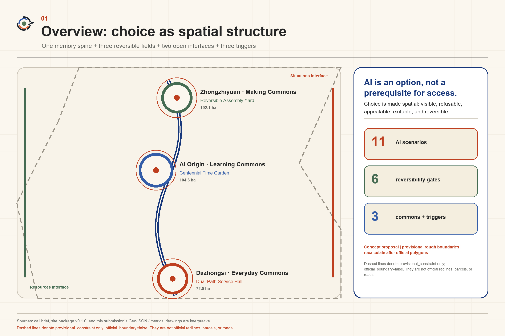
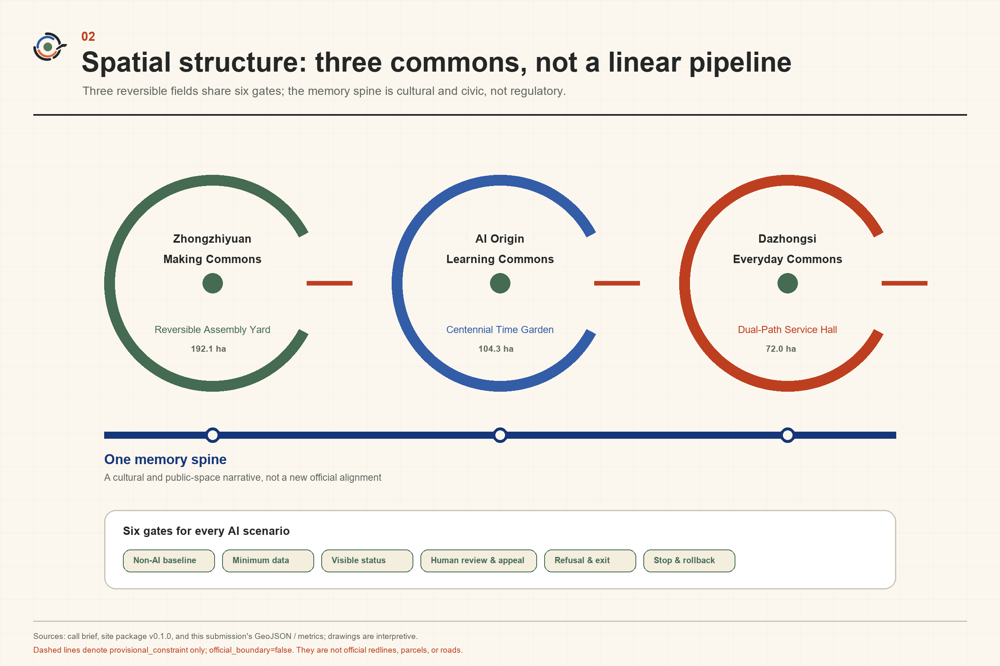
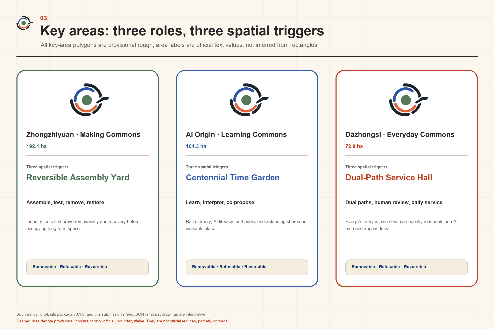
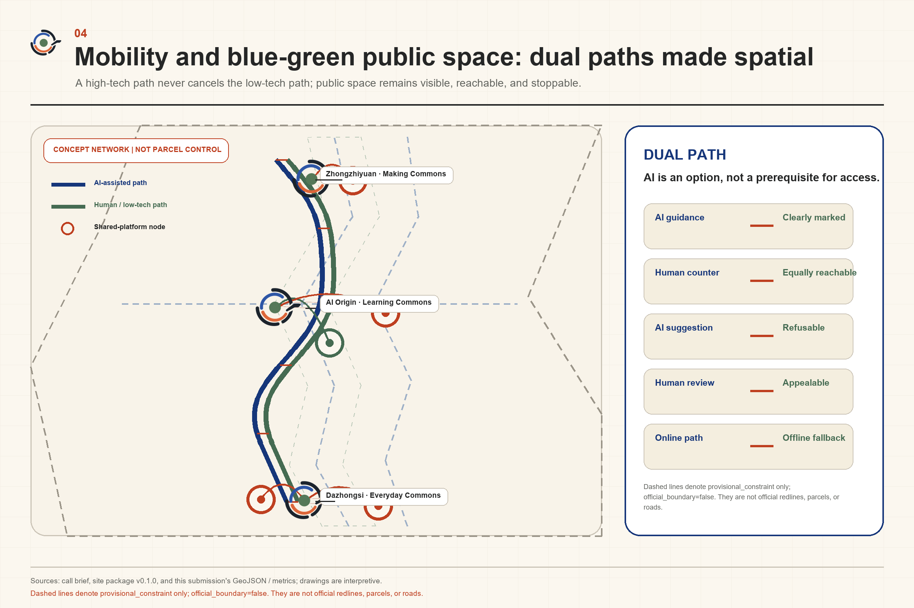
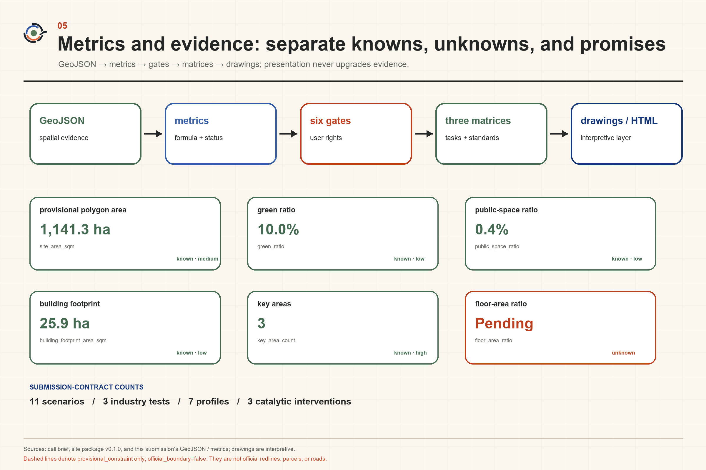

# Centennial Jing-Zhang Reversible Commons

**AI is an option, not a prerequisite for access.**

## Design Basis and Source List

This proposal restarts from a question in the brief: when AI enters research and development, public services, and everyday urban life at the same time, how can the intensity of innovation rise without reducing people’s capacity to choose? The answer is not a longer list of smart devices. It is a common spatial condition in which a person can refrain from using AI, see it before entering, transfer to a human, appeal, exit, and roll back a failed intervention. The “Reversible Commons” therefore means spatial and operational capacity that is used and learned from in common while retaining a proposal-defined capacity to exit. “Commons” does not determine ownership, management rights, or statutory public status; all specific owners and operators remain `unknown` until authoritative information is supplied. [source:DATA-SRC-AGENT-TASKBOOK-20260518] [depth:existing_conditions_diagnosis]

Evidence is used in four distinct states. `official` is limited to the three positionings, five functions, Three Zones and Two Wings, and written areas registered as public official constraints in the announcement and taskbook: 43.6 km² for the Coordinated Research Area, 11.4 km² for the Overall Design Area, and 368.4 ha for the Key-Area Detailed Design Area, comprising 192.1 ha at Zhongzhiyuan, 104.3 ha at the Origin Community, and 72.0 ha at Dazhongsi. The six agent tasks are cleared contractual project inputs; they do not extend into site facts or government commitments. Written official areas are not official polygons. Exact official polygons for the three scope levels and three key areas are unavailable; submitted geometry must remain `geometry_role=provisional_constraint`, `official_boundary=false`, and `boundary_precision=provisional_rough`. Regulatory controls, roads, buildings, ownership, heritage controls, municipal capacity, and public-facility baselines remain `unknown`. Arrangements lacking owner or site consent are `not_authorized`; experiments and performance not yet run are `not_run`. [source:DATA-SRC-OFFICIAL-ANNOUNCEMENT-20260509] [source:DATA-SRC-PROVISIONAL-BOUNDARIES-20260605]

The design method uses the inferential holistic framework of `wanghongyang-perspective`: first draw the objective–space–industry–people–culture–operation–governance–evidence relationship map, then compare whole-system scenarios, and finally identify catalytic local interventions. This framework is a secondary synthesis from an analysis of papers. It does not represent Wang Hongyang’s personal opinion and does not replace fieldwork, statutory planning, or professional engineering judgement. Registered materials on urban design, regulatory planning, land-use classification, generative AI, and accessibility define the professional boundary; full provenance, licences, access dates, and limitations are recorded in `sources.json`. [source:DATA-SRC-MOHURD-URBAN-DESIGN-MEASURES] [standard:MOHURD-URBAN-DESIGN-MEASURES]

## Three-Level Scope Framework

The relationship map sets “innovation increases without reducing choice” as its objective. Space provides three commons and two interfaces. Industry treats responsible capability and low-barrier testing as coequal product requirements. Residents, visitors, developers, enterprises, operators, and people requiring accessible support define problems together. Railway time, Zhongguancun’s culture of experimentation, and accountable AI culture together explain what may change and what must remain. Operation follows an open-problem–bounded-trial–shared-observation–sunset-review cycle. Governance turns notice, refusal, human review, appeal, exit, and rollback into entrances, counters, bypasses, and shifts. Evidence determines what may be mapped and what must remain a question. A local intervention belongs to the whole proposal only if it supports these relationships simultaneously. [source:DATA-SRC-AGENT-TASKBOOK-20260518] [depth:three_level_scope_framework]

Three substantively different overall scenarios were compared before selecting the proposal. Scores range from 1 to 5. The data-gap item measures robustness, where 5 means the concept can still hold when official spatial and operational data are missing. These values are a design-reasoning device, not an official score.

| Scenario | Overall effect | Public interest | AI-native quality | Spatial transformation | Long-term operation | Evidence strength | Gap robustness | Total / 35 |
| --- | ---: | ---: | ---: | ---: | ---: | ---: | ---: | ---: |
| AI production enclave | 3 | 2 | 5 | 4 | 3 | 3 | 2 | 22 |
| Blanket smart services | 4 | 2 | 5 | 4 | 2 | 2 | 1 | 20 |
| Reversible Commons | 5 | 5 | 4 | 5 | 4 | 4 | 5 | **32** |

The AI production enclave makes equipment concentration and industrial display straightforward, but it assumes known capacity, ownership, municipal services, and development intensity; public life can become a mere amenity of the park. Blanket smart services offer an immediate experience but presume continuous sensing, cross-entity data, and unified operation, making refusal and exit costly. Reversible Commons instead establishes low-impact, demountable, dual-path public conditions first. Even if a technical trial fails, shade and seating, accessible passage, human service, knowledge material, and governance learning remain. It is therefore more robust under present evidence gaps.

The three scope levels are not separate sets of drawings. The Coordinated Research Area asks how responsible capability becomes a competitive strength of an AI ecosystem. The Overall Design Area organises three concurrent commons and a conceptual public network. The Key-Area Detailed Design Area tests three catalytic prototypes. The same judgement applies at all levels, but provisional geometry is never promoted to an Official Boundary and temporary areas do not imply development capacity. [data:geometry/site_boundary.geojson] [metric:site_area_sqm]

## Coordinated Research Area: Industry and Future City Research

The overall structure is one principle, three commons, and two interfaces. The principle is “AI is an option, not a prerequisite for access.” Zhongzhiyuan Making Commons tests models, materials, robots, and low-carbon computing in demountable settings. Origin Learning Commons makes knowledge, limitations, and failures legible to developers, students, residents, and operators. Dazhongsi Everyday Commons tests AI against convenience, fairness, and exit in frequent daily encounters. The three are not sequential stages and have no fixed direction of flow. Any one can originate a problem, host learning, initiate a trial, or request a stop. [source:DATA-SRC-OFFICIAL-ANNOUNCEMENT-20260509] [depth:overall_spatial_structure]

The Zhongguancun Technology Services Wing is only a capability interface, conceptually connecting intellectual-property, legal, capital, standards, evaluation, and international-cooperation expertise as needed. The Xiaoyue River Scenario Enablement Wing is only a scenario interface, conceptually connecting questions from community life, recreation, ecological observation, and urban services. Neither wing is an upstream or terminal node, and neither implies that any organisation has committed to participate. The industrial ecosystem avoids unverified enterprise lists and investment figures. It consists of six replaceable roles: problem proposers, AI makers, spatial hosts, professional reviewers, human service providers, and knowledge stewards. The conversion path is verified problem → small prototype → public and professional review → modification or stop → reusable module and knowledge → separate authorisation for further development. Display is not procurement, and submission is not implementation. [source:DATA-SRC-AGENT-TASKBOOK-20260518] [standard:PROJECT-AGENT-OPEN-CALL-TASKBOOK]

Six primary cases contribute mechanisms only. Helsinki’s AI Register informs public-readable registration. Amsterdam’s rules for sensing in public space inform the principle that sensing must first be visible. Barcelona’s Decidim informs linked online and offline participation. Singapore’s Punggol Digital District informs bounded trials in real urban settings. Mila informs an ecosystem combining research, education, and responsible capability. Utrecht’s Werkspoorkwartier informs the relationship between heritage production space and new work. None proves that Jing-Zhang has the same law, land system, finance, platform, actors, or performance, and none constitutes a local partnership endorsement. [source:EXT-HEL-AI-REGISTER-20260813] [source:EXT-BCN-DECIDIM-20260813] [source:EXT-SG-PUNGGOL-DIGITAL-DISTRICT-20260813]

The brand does not compete through unverifiable claims such as biggest, smartest, or already leading. The Chinese name “百年京张·可逆公地” and English name “Centennial Jing-Zhang Reversible Commons” combine long time, public choice, and AI innovation. Its annual international question is: “Can a city adopt AI without making AI mandatory?” Stops, corrections, and human service become communicable innovation outcomes rather than hidden failures.

## Overall Design Area: Urban Renewal and Regulatory-Plan-Level Urban Design

Without verified roads, parcels, buildings, and ownership, the overall design does not fabricate a completed master plan. It proposes an urban-renewal grammar of permanent public base + demountable trial layer + legible information layer. The permanent base expresses continuous passage, accessibility, shade, seating, and a public-service baseline subject to later professional checks. The demountable layer hosts temporary components, devices, and events. Before entry, the information layer shows purpose, sensing extent, human path, exit method, and operating state. Every demountable layer receives a sunset review; after removal, the public base remains usable. [source:DATA-SRC-MOHURD-CONTROL-DETAILED-PLANNING] [standard:MOHURD-CONTROL-DETAILED-PLANNING] [depth:land_use_layout]

Three catalytic local interventions make that grammar spatially recognisable. The **Reversible Assembly Yard** hosts industrial tests of model and material resources, robot courtesy, and low-carbon computing in a shared yard. The **Dual-Path Service Hall** gives equal visibility to human/non-AI service and an informed AI-assisted path at the same entrance, with switching allowed mid-task. The **Centennial Time Garden** layers railway history, contemporary innovation, and future disputes through low-impact demountable displays and seasonal public activity. All three are spatial prototypes rather than selected construction sites. Before heritage, structure, fire, municipal, and operational conditions are verified, they specify no permanent foundation, precise construction, or capacity. [source:DATA-SRC-PROVISIONAL-BOUNDARIES-20260605] [depth:development_intensity_controls]

Land use, buildings, roads, green space, public space, and phasing GeoJSON within the Overall Design Area serve the submission’s structured-data contract only. Full land-use coverage does not give a temporary subdivision regulatory effect. Building geometry represents prototype bases, not surveyed existing buildings or a completed Demolish–Renovate–Retain classification. Roads show conceptual relationships, not engineering alignments. Floor Area Ratio, Building Height, Building Coverage Ratio, setbacks, construction volume, and municipal loads remain `unknown` and cannot be inferred from a temporary polygon or diagrammatic buildings. [data:geometry/land_use.geojson] [data:geometry/buildings.geojson]

## Detailed Design of Key Areas

The Zhongzhiyuan AI Independent Innovation Acceleration Area becomes the **Making Commons**. The Reversible Assembly Yard is not a closed laboratory; it is a shared test setting with a public bypass, observable boundary, and a proposed human-operated stop mechanism whose actual authority must be lawfully assigned by a future responsible actor. RC-01 Model & Material Library, RC-02 Robot Courtesy Street, and RC-03 Low-Carbon Compute Exchange Station form three industrial tests. The first checks the conditions attached to models, data, and materials. The second asks whether low-speed embodied systems genuinely yield to people. The third compares task scheduling with legible device-energy information. Site permission, participation scale, safety thresholds, insurance, and responsible actors are `unknown` or `not_authorized`; actual performance is `not_run`. [source:DATA-SRC-OFFICIAL-ANNOUNCEMENT-20260509] [depth:three_key_area_detailed_design]

Beijing AI Origin Community becomes the **Learning Commons**. The Centennial Time Garden works with the Open-Source Learning Table, AI Use-Notice Gallery, and Public Proposal Workshop. Researchers must explain not only model capability but also purpose, data, limits, human review, and stopping conditions. Residents, students, developers, and operators can contribute different counterexamples. The area is not a transfer stage between north and south, and the proposal does not presume that universities, parks, or streets have consented to renewal. Intellectual property, research material, event space, and building relationships require separate authorisation; this submission defines only a spatial–operational prototype for a university-adjacent innovation district.

The Dazhongsi AI Industry Cluster becomes the **Everyday Commons**. The Dual-Path Service Hall organises the Non-AI Service Counter, Accessible Journey Rehearsal, Opportunity Navigator with Human Review, and Quiet-Night Companion as frequent, lower-risk encounters. People who decline AI should not be penalised through entrances, waiting, price, information quality, or accessible conditions. Information affecting employment opportunities, rights, or safety must be passed to a human for confirmation. The proposal does not present station quadrants, roads, or enterprise surroundings as approved renewal and assumes no commercial participant has joined. [source:DATA-SRC-AGENT-TASKBOOK-20260518] [data:geometry/key_areas.geojson]

The three catalytic interventions are also three AI pilgrimage landmarks. The Yard symbolises permission to experiment and fail. The Hall symbolises retained choice. The Garden symbolises change subjected to time. Their landmark value comes from an actionable public capability, not an operationally empty monument. Provisional key-area polygons are used only for location and relationship diagrams. Once official polygons, ownership, heritage controls, and engineering conditions arrive, professional teams must recalculate the whole package and reconsider exact siting. [metric:key_area_count]

## AI Innovation Ecosystem, Personas, and AI+ Scenarios

All 11 scenario cards use the same six-gate contract: (1) non-AI baseline; (2) prior notice and data minimisation; (3) Human Review or takeover; (4) refusal and exit; (5) stop and rollback; and (6) authorisation, evidence, and run status. The first three are Testing and Validation Scenarios. Every scenario is `not_run` before an actual trial. This structure locates AI-native quality in the governable relationship formed when a model enters the city, not in adding a chat interface to a conventional service. [source:DATA-SRC-AGENT-TASKBOOK-20260518] [source:DATA-SRC-GENERATIVE-AI-INTERIM-MEASURES]

| ID / scenario | AI role and setting | Six-gate contract |
| --- | --- | --- |
| **RC-01 Model & Material Library — industrial test** | Compare model, data-sheet, material, and edge-component fitness in the Making Commons | Baseline: human catalogue and physical samples; notice: legible purpose/licence/limits, with no secret or personal data entered; review: people approve material and model sheets; refuse: paper and physical browsing remains; stop: unclear source or safety removes an item; status: site and test `not_authorized`, performance `not_run` |
| **RC-02 Robot Courtesy Street — industrial test** | Test yielding, stopping, and human–robot negotiation at low speed within the Reversible Assembly Yard | Baseline: complete walking and accessible bypass; notice: visible operating area, sensing type, and attendant; review: staff take over; refuse: non-participant route is not degraded; stop: entering a safety envelope, blocking access, or failed takeover stops the trial; status: safety threshold `unknown`, `not_run` |
| **RC-03 Low-Carbon Compute Exchange Station — industrial test** | Compare local inference, task queues, and legible device-energy feedback | Baseline: equipment remains manually operable; notice: only necessary device-level data; review: professionals verify energy and “saving” claims; refuse: a basic task can proceed without exchange; stop: anomalous load or purpose drift rolls back; status: municipal capacity `unknown`, performance `not_run` |
| RC-04 Open-Source Learning Table | Generate exercises, counterexamples, and multilingual explanations of chosen difficulty in the Learning Commons | Baseline: paper course and human tutor; notice: no persistent learning profile; review: educator/host approves content; refuse: no login required and session can be cleared; stop: misinformation, bias, or failed child protection stops service; status: operator `unknown` |
| RC-05 AI Use-Notice Gallery | Turn purpose, data, limits, and suggested contact into public-readable notices at commons entrances | Baseline: fixed text, graphic, and tactile information; notice: displayed before activation; review: publisher and spatial host both check; refuse: sensing area can be bypassed; stop: a system cannot start when registration is absent or state conflicts; status: conceptual governance facility |
| RC-06 Non-AI Service Counter | Offer human/paper service equal to the AI path in the Dual-Path Service Hall | Baseline: this scenario is the baseline; notice: both paths’ capabilities and waiting conditions appear together; review: a human decides sensitive matters; refuse: declining AI brings no price or quality penalty; stop: an illusory counter pauses AI expansion; status: staffing and service standard `unknown` |
| RC-07 Accessible Journey Rehearsal | Rehearse a lower-step, lower-stimulus, or easier-to-understand conceptual route using voluntary inputs | Baseline: fixed accessible signs and human directions; notice: route is not an engineering or safety guarantee; review: people verify critical passage information; refuse: no persistent location tracking; stop: stale road data or unverified continuity withdraws advice; status: road lines and field data `unknown` |
| RC-08 Centennial Time Mirror | Use local retrieval to layer verified historical material, contemporary interpretation, and future questions in the Time Garden | Baseline: screen-free text, tactile content, and human interpretation; notice: source material and generated interpretation are visibly separated; review: historical facts are individually sourced; refuse: no facial or persistent location tracking; stop: unresolved copyright, fact, or heritage risk removes content; status: specific heritage relationship pending |
| RC-09 Public Proposal Workshop | Compare rules and spatial scenarios using anonymous, synthetic, or authorised aggregate data | Baseline: offline table and human facilitator; notice: assumptions, error, and representativeness limits are visible; review: human discussion decides whether a recommendation exists; refuse: offline submission remains; stop: exclusion created by data or facilitation reopens the process; status: output has no statutory effect |
| RC-10 Opportunity Navigator with Human Review | Help talent, teams, and residents understand public opportunities and general service entrances | Baseline: human list and original public notice; notice: no private scraping and no eligibility promise; review: opportunity-affecting matches go to a human/original publisher; refuse: browse the original directly; stop: stale source, discrimination, or inaccessible appeal stops service; status: no procurement, hiring, or government commitment |
| RC-11 Quiet-Night Companion | Provide lower-stimulus routes, event information, and multilingual communication on active request in the Everyday Commons | Baseline: fixed signs, staffed help, and places to pause; notice: no persistent tracking or emotion inference; review: a person confirms safety and closing information; refuse: exit and clear the session at any time; stop: conflict with field conditions returns to fixed information; status: night operation and safety conditions `unknown` |

Seven personas test whether the scenarios are genuinely usable. P1, a nearby older resident with low digital confidence, needs legibility and an available person. P2, a visitor with mobility, visual, hearing, or cognitive access needs, requires continuous passage and multisensory information. P3, a developer, needs low-barrier testing but cannot treat the public as free data. P4, a start-up or SME product lead, needs capability interfaces rather than false implementation promises. P5, a front-line operator, needs visible state, takeover, and a stop mechanism. P6, a child and accompanying adult, need protection from persistent profiling. P7, international talent and short-term visitors, need human-verified critical multilingual information. Every persona may enter from any commons; there is no fixed spatial sequence. All seven use each scenario’s non-AI baseline to test whether access remains possible, but that document-level check is not evidence of real participation or usability testing. [source:DATA-SRC-BARRIER-FREE-ENVIRONMENT-LAW] [depth:blue_green_public_space]

## Land Use, Building Scale, and Retain-Renovate-Demolish Strategy

Land-use representation follows the nationally registered classification system, but this proposal does not invent a statutory land-use class called “Reversible Commons.” Full coverage in `land_use.geojson` satisfies the structured-data contract and supports conceptual allocation. “Making, Learning, and Everyday” are overlaid spatial–operational attributes; they do not change statutory use. Areas derived from temporary polygons serve submission consistency checks only and cannot establish official land-use balance or precise capacity. [source:DATA-SRC-MNR-LAND-USE-CLASSIFICATION-202311] [standard:MNR-LAND-USE-CLASSIFICATION-GUIDE]

The building strategy has three levels rather than premature Demolish–Renovate–Retain decisions. At level one, professional teams must first verify legality, structure, fire safety, accessibility, ownership, and actual use before identifying a continuing public base. Level two may investigate reversible partitions, demountable furniture, readable interfaces, and human service points, but still requires owner and operator consent. Level three—new construction or major alteration—remains `not_authorized` until official regulatory controls, measured existing conditions, heritage constraints, and municipal conditions are available. Diagrammatic building footprints are proposal prototypes, not surveyed buildings or approved construction. [depth:retain_renovate_demolish] [data:geometry/buildings.geojson]

The three catalytic local interventions follow the same order. The Reversible Assembly Yard prioritises an open base and independent components and does not depend on a permanent building. The Dual-Path Service Hall begins by reorganising counters, waiting, signs, and shifts rather than presuming demolition. The Centennial Time Garden prioritises displays and seasonal activities that can leave without touching heritage fabric. Floor Area Ratio, Building Height, Building Coverage Ratio, total floor area, setbacks, Retain–Renovate–Demolish status, and underground space remain `unknown`. Once official polygons and professional evidence arrive, they must be reconsidered from the whole relationship rather than by adding false precision to current diagrams. [metric:building_footprint_area_sqm]

The decision test for building intervention is not whether an AI device fits. It is whether the public baseline improves. An intervention that breaks an accessible route, compresses human service, permanently occupies common space, or locks in irreversible sensing should pause. A low-impact adaptation has a reason to cross the next gate only when shade, seating, learning, passage, or human help remains after the trial is withdrawn. Field, ownership, architectural, and engineering review is still required.

## Transport, Rail, Municipal Infrastructure, and Public Services

The transport strategy makes “a person who refuses AI can still travel” the Walking and Cycling Network baseline. The conceptual network first expresses continuous walking, cycling, accessibility, fixed signs, human directions, and optional digital assistance. AI only rehearses a lower-step, lower-stimulus, or easier-to-understand route after an active request. Because official road lines, sections, junctions, station interiors, congestion evidence, and field accessibility surveys are absent, drawn lines show connections to investigate, not approved roads, bridges, tunnels, or Transit-Station Integration works. [source:DATA-SRC-OFFICIAL-ANNOUNCEMENT-20260509] [depth:traffic_rail_slow_parking]

Robot Courtesy Street may only be tested in a bounded environment with site authorisation and cannot be extrapolated directly to a public road. Spatial prerequisites include an unobstructed walking and accessible bypass, prominent operating limits, human attendance, on-site stop control, and emergency access. Speed, separation distance, device performance, road permission, insurance, and accident responsibility are `unknown`. Accessible Journey Rehearsal likewise cannot replace fixed signs or safety judgement; stale information withdraws its route advice. [data:geometry/roads.geojson]

Municipal and New Infrastructure follow a conceptual “minimum connection, measurable use, safe disconnection” principle. Until electricity, heat rejection, fire, noise, network, and carbon-accounting evidence is obtained, the Low-Carbon Compute Exchange Station compares only device-level tasks and information display; it claims no verified energy saving, emission reduction, or capacity. Anomalous load or purpose drift disconnects the layer and restores manual operation. Public services use a dual path: an AI-assisted entrance cannot displace the human counter, paper information, accessible communication, or on-site takeover. Staffing, service scope, and operating cost must be determined later. [depth:municipal_new_infrastructure]

## Blue-Green Network, Public Space, and Urban Character

Jing-Zhang Railway Heritage Park is not a conveyor that turns the three zones into sequential processing stages. It is a public time-space for asking what may change and what must be retained. Centennial railway culture provides a long time horizon. Zhongguancun innovation culture provides a horizon of experimentation. AI culture provides a horizon of responsibility. They meet in the Centennial Time Garden. Each historical event, heritage location, significance, and control area requires verified sourcing. Generated imagery cannot masquerade as archival material, and no foundation, permanent structure, or construction touching heritage is proposed before formal heritage controls are known. [source:DATA-SRC-OFFICIAL-ANNOUNCEMENT-20260509] [standard:MOHURD-URBAN-DESIGN-MEASURES]

The Blue-Green Network and Public Space put the baseline before devices. Shade, seating, continuous passage, lower-stimulus pause spaces, screen-free interpretation, human help, and seasonal public activity remain usable without AI. Sensors, robots, and interactive installations may enter only as a demountable layer. Transparent AI use notice and a non-participant bypass must exist before a device starts. Current green space, waterways, park paths, walking gaps, and ecological conditions lack official evidence sufficient for engineering judgement. GeoJSON expresses conceptual public relationships only, and ratios derived from provisional geometry are submission recalculations rather than statutory Green Space or Public Space indicators. [data:geometry/green_space.geojson] [metric:green_ratio]

The three landmarks are public capabilities. The Reversible Assembly Yard lets a failed trial leave while the yard continues to serve people. The Dual-Path Service Hall makes declining technology different from declining service. The Centennial Time Garden subjects innovation to history, people, and time. The logo is an “open commons ring”: an unclosed circle represents shared space, its opening and short outward stroke represent entry, refusal, and exit, and the central green point represents public value that remains after technology leaves. It contains neither a letter-shaped nor a railway-shaped mark. The visual direction is the **Warm Civic Atlas**, using paper white, deep ink, ultramarine, persimmon, and moss, while line, texture, and text accompany colour coding. System or explicitly cleared bundled fonts support offline reading; colour pairs, type sizes, line weights, and focus states are checked against WCAG AA rather than treated as a property guaranteed by a font. [depth:height_massing_character]

Honour display does not rank popularity or generic “technical advancement.” It uses time-limited **Public Evidence Plaques**: a prototype may be displayed only after passing its relevant evidence gate, and its plaque must show purpose, current state, beneficiary, limits, failure or stop record, human path, review date, and removal condition. The minimum public-space component family comprises the open-commons marker, dual-path threshold, Human Review table, notice–appeal board, demountable observation bay, and time-evidence plaque. Every component retains a non-AI use; accessible dimensions, materials, fire safety, and structural conditions still require professional confirmation. The three landmarks, honour-display rule, and component library therefore form an auditable system rather than isolated objects.

The cultural proposition is: a century ago, the railway changed how people and knowledge reached the city; today, the Reversible Commons asks how AI should enter the city while leaving people another way. This is conceptual communication, not a substitute for historical research, and it does not imply that any landmark has been approved or built.

## Renewal Projects, Implementation Policy, and Phasing

Renewal projects advance through four evidence gates rather than a schedule of device construction. G0 Concept Package allows only a relationship map, scenario cards, provisional spatial expression, and governance list. G1 Device-Free Public Prototype may test paper signs, tabletop processes, demountable component samples, and rehearsed human service. G2 Low-Risk Bounded Trial permits devices and models only after legal basis, data, safety, accessibility, insurance, maintenance, exit, and emergency arrangements receive professional confirmation. G3 Decision on Expansion waits for official data and actual review and requires independent governmental and professional procedures. Failure at any gate means modify, shrink, withdraw, or restore the prior baseline. [depth:phasing_implementation] [data:geometry/phasing.geojson]

| Project cluster | Key output | Current state | Evidence required for the next gate |
| --- | --- | --- | --- |
| P-01 Reversible Assembly Yard | RC-01–03 industrial tests and public base | Conceptual Recommendation; `not_authorized`; `not_run` | Site ownership, survey, fire, equipment safety, data impact, insurance, and responsible actor |
| P-02 Dual-Path Service Hall | RC-06, 07, 10, 11 and human shifts | Conceptual Recommendation; operator `unknown` | Facility baseline, user need, staffing, accessibility review, and appeal process |
| P-03 Centennial Time Garden | RC-04, 05, 08, 09 and three-culture narrative | Conceptual Recommendation; exact location `unknown` | Historical sources, heritage controls, landscape conditions, copyright, site and event permission |
| P-04 Two interfaces | Professional capability list and scenario problem library | No actor commitment | Willingness, service authorisation, verified public problem, and intellectual-property boundary |

Annual operation follows a four-season cycle. Open Problem Season receives questions through offline tables, accessible channels, and an optional digital entrance without treating clicks as representation. Small Prototype Season requires purpose, baseline, data, Human Review, and exit descriptions. Shared Observation Season lets residents, operators, developers, and professionals separately record usability, exclusion, safety, and maintenance. Sunset Review Season publishes what is retained, modified, paused, or withdrawn. The annual brand “Room to Choose Week / 留有余地周” may gather failure explanations, dual-path observation, demountable assembly, Time Garden narratives, and international mechanism dialogues. Dates, budget, organiser, frequency, and event permissions remain `unknown` and are not a confirmed programme. [source:DATA-SRC-AGENT-TASKBOOK-20260518] [depth:renewal_project_list]

The developer community follows an exit-capable lifecycle rather than a one-off contest. Open Problem Season publishes human-verified problem cards. Onboarding explains data, licences, accessibility, and the non-AI baseline. Participants choose maintainer, prototype contributor, public observer, or documentation custodian roles. Before acceptance, technical, operational, public-interest, and affected-user perspectives review a contribution. Stage results enter a public knowledge package. Work without a maintainer, with expired evidence, or with rising risk is archived and handed over; individuals may exit without exchanging persistent tracking for participation. Recruitment scale, platform, maintaining organisation, and intellectual-property arrangement remain `unknown`; this paragraph does not claim that a community already exists.

Regional collaboration creates authorisable exchange interfaces rather than invented partnerships. With Beiwei Community, Future Science City, Huairou Science City, the Beijing Economic-Technological Development Area, and the Beijing–Tianjin–Hebei region, exchangeable objects are verified problem cards, test conditions, component specifications, de-identified reviews, and sunset decisions. Personal data, uncleared models, site authority, funding, personnel, and partnership names do not travel through the interface. A future responsible actor must confirm purpose, licence, responsibility, retention, and exit for every exchange; all are presently Conceptual Recommendations and `not_authorized`. [source:DATA-SRC-AGENT-TASKBOOK-20260518]

The durable public assets are verified problems, reusable modules, accessibility and human-service conditions, stop cases, de-identified reviews, and bilingual knowledge materials—not registration volume. Procurement, investment, policy, enterprise settlement, government collaboration, and construction sequence cannot be promised before separate authorisation.

## Metrics, Area Recalculation, and Compliance Matrix

Metrics have three classes. The first is **submission-contract metrics**, recorded directly in `metrics.json` and reviewable now: 11/11 scenarios have all six gates; 3/11 are identified as industrial tests and marked `not_run`; personas P1–P7 all use the same non-AI-baseline check; 3/3 catalytic interventions state the public value retained after withdrawal; and all three key areas remain provisional. Pairing of the Chinese and English proposals, five figures, A3/A0 outputs, report, and visual is a file contract. Whether their numbers, references, figure positions, and states actually match is determined jointly by the final files, `self_check.json`, and manual bilingual sampling, not asserted absolutely in advance here. These measures prove design-package completeness, not field performance. [source:DATA-SRC-AGENT-TASKBOOK-20260518] [depth:metrics_recalculation]

The second class is **spatial recalculation metrics**. Submitted boundary area, layer area, and counts are recalculated only from current GeoJSON and display its provisional source. Official written values—43.6 km², 11.4 km², 368.4 ha, and the three component areas—remain separate and are neither challenged nor replaced by a temporary polygon. When official polygons arrive, site boundary, key areas, land use, buildings, roads, green space, public space, phasing, and all derivatives must be recalculated together. Floor Area Ratio, height, coverage, setbacks, and facility standards lack statutory evidence and remain `unknown`. [metric:site_area_sqm] [data:geometry/key_areas.geojson]

The third class is **future operational metrics**, all presently `not_run`: actual availability of the human path; service difference after declining AI; accessible task completion; Human Review workload; appeal types and outcomes; public understanding of data purpose; Public Space usability after prototype removal; and the share of prototypes modified, stopped, or passed to the next gate. Targets, samples, methods, periods, and responsible actors must be jointly defined later. Visits, model calls, check-ins, media exposure, and registrations cannot alone prove Public Interest and Inclusivity, spatial quality, or industrial conversion.

The three positionings and five functions retain the taskbook’s official Chinese names; the working English translations below explain each as a spatial, scenario, and operating relationship. These mappings are proposal interpretations, not an approved allocation of responsibilities. [standard:PROJECT-OFFICIAL-ANNOUNCEMENT]

| Taskbook positioning / function | Proposal interpretation | Spatial, scenario, and operating evidence | Evidence still missing |
| --- | --- | --- | --- |
| 百年京张文化带 / Centennial Jing-Zhang Cultural Belt | Railway time, Zhongguancun experimentation, and AI responsibility jointly test what may change and what must remain | Memory Spine, Centennial Time Garden, RC-08/09, source-checking rule | Heritage controls, authoritative history, and exact location |
| 都市 AI 生活体验带 / Urban AI Life-Experience Belt | Every AI encounter first retains a non-AI route, human service, and exit capacity | Dual-Path Service Hall, RC-06/07/10/11, six-gate contract | Facility baseline, sampled needs, and operator |
| AI 融合创新带 / AI-Integrated Innovation Belt | Research, learning, public testing, and sunset review proceed concurrently; display is not conversion | Three commons, two interfaces, RC-01–05 | Enterprise needs, collaboration authorisation, and conversion results |
| AI 全栈自主创新体系 / Full-Stack Independent AI Innovation System | Models, materials, robots, low-carbon computing, and responsibility conditions enter one bounded test chain | RC-01–03, Making Commons, G0–G3 | Technical performance, site safety, and permissions |
| 世界级 AI 创新生态 / World-Class AI Innovation Ecosystem | Research, talent, enterprise, operation, community, and public-interest roles collaborate around reusable problems | Learning Commons, developer lifecycle, six mechanism cases | Partner willingness, organisation, and finance |
| AI+ 场景赋能新范式 / New Paradigm for AI+ Scenario Enablement | A scenario enters space through a six-gate governance contract, not as an added interface | 11 scenario cards, 11 conceptual nodes, stop and rollback | Real user tasks and trial results |
| 智能化 AI 活力城市 / Intelligent and Vibrant AI City | Everyday vitality comes from basic public space and optional AI together | Everyday Commons, dual path, four-season cycle, Room to Choose Week | Participation, accessibility, and maintenance tests |
| AI 治理全球话语权 / Global Voice in AI Governance | Visible registers, Public Evidence Plaques, Human Review, and sunset decisions create exchangeable material | Six gates, evidence plaques, bilingual knowledge package, case translation | Statutory duties, international agreements, and external evaluation |

The compliance matrix further connects Three Zones and Two Wings, agent.1–agent.6, 11 scenarios, three spatial levels, metrics, governance, and operation. If the text says “reversible,” geometry must distinguish public base from demountable layer. If the text says “appealable,” scenarios, website, and operation must show human and appeal entrances.

| Agent task | Proposal relationship | Reviewable output |
| --- | --- | --- |
| agent.1 overall concept | Chinese/English names, core proposition, three commons and two interfaces, open-commons-ring logo | Proposals, overall diagram, visual hero, and brand section |
| agent.2 innovation ecosystem | Six industrial roles and six primary mechanism cases | Ecosystem relationship, `sources.json`, and professional matrices |
| agent.3 AI+ scenarios | 11 six-gate cards, 3 industrial tests, and 7 personas | Scenario table, nodes, metrics, and governance states |
| agent.4 Public Space and landmarks | Three catalytic interventions, the Public Evidence Plaque rule, and six minimum components | Key-area figure, Public Space, and conceptual service layers |
| agent.5 cultural narrative | Railway time, innovation experiment, and AI responsibility define “may change / must remain” | Time Garden, provenance, and copyright statement |
| agent.6 long-term operation | Four-season cycle, developer lifecycle, regional exchange interfaces, Room to Choose Week, and international communication | G0–G3, phasing layer, and `not_run` operating metrics |

## Risk, Copyright, and Compliance

Privacy defaults to operation without collection. When data is necessary, the scenario must state purpose, minimum fields, processing location, retention and sharing boundaries, deletion method, and suggested contact. Public Space does not default to facial recognition, persistent identity tracking, or cross-scenario profiling. Local processing, edge inference, or anonymisation is not automatically secure or lawful. Where rules for public-facing generative AI services apply, their actual scope must be checked; this proposal neither expands a specific provision into a general licence for every urban system nor invents a universal statutory response deadline. [source:DATA-SRC-GENERATIVE-AI-INTERIM-MEASURES] [depth:risk_missing_data]

Human Review covers rights, safety, opportunity, fees, health, law, and public-service accessibility. An interface should show transfer to a human. The site should include a human-operated pause mechanism lawfully authorised by a future responsible actor. Review should explain whether a result changed and why. However, staff qualifications, numbers, training, and workload are `unknown`, so a human cannot be treated as a cost-free fallback. Suggested appeal routes include on-site, text/telephone, and accessible alternatives. Appeals may concern an outcome, data use, inability to exit, discriminatory effect, or a failed human path. The future responsible operator must lawfully determine service times. Declining AI should not degrade basic passage, service, price, waiting, information, or accessibility. [source:DATA-SRC-BARRIER-FREE-ENVIRONMENT-LAW]

A stop review is triggered at minimum by unclear authorisation or legal basis, safety events or data breaches, unavailable human paths, obstructed accessible routes, critical errors that cannot be reviewed, complaints indicating systemic exclusion, operator inability to take over, or expiry of a sunset period without renewed review. The response first stops new processing and device action, restores the non-AI baseline, preserves legally necessary audit evidence, provides affected people with explanation and an appeal entrance, and then lets professionals decide whether to modify, shrink, withdraw, or restart. Thresholds, command authority, and emergency procedures remain `unknown` until a responsible actor is appointed.

The logo, figures, and web visual language are authored in this submission. External cases are represented only by mechanism summaries and links; their logos, restricted images, and design assets are not copied. Any generative visual used for explanation must be labelled conceptual and record tool, model, prompt, references, and rights boundaries; it cannot pose as a site photograph, resident participation, or built fact. HTML operates offline and loads no CDN, remote font, tile, script, iframe, form, API, or tracker. Every spatial action is an Open Co-Creation Conceptual Recommendation. It is not a statutory plan, government approval, investment commitment, or engineering-feasibility conclusion. [standard:PROJECT-AGENT-OPEN-CALL-TASKBOOK]

## References

The principal task and professional sources are the official Centennial Jing-Zhang AI Innovation Belt announcement, `DATA-SRC-OFFICIAL-ANNOUNCEMENT-20260509`; the agent-facing taskbook, `DATA-SRC-AGENT-TASKBOOK-20260518`; Measures for Urban Design Administration, `DATA-SRC-MOHURD-URBAN-DESIGN-MEASURES`; measures for preparing and approving regulatory detailed plans, `DATA-SRC-MOHURD-CONTROL-DETAILED-PLANNING`; the notice on land and sea-use classification, `DATA-SRC-MNR-LAND-USE-CLASSIFICATION-202311`; Interim Measures for the Management of Generative AI Services, `DATA-SRC-GENERATIVE-AI-INTERIM-MEASURES`; and the Barrier-Free Environment Construction Law, `DATA-SRC-BARRIER-FREE-ENVIRONMENT-LAW`. Provisional geometry, `DATA-SRC-PROVISIONAL-BOUNDARIES-20260605`, supports generation, discussion, and recalculation only and is not an Official Boundary. [source:DATA-SRC-OFFICIAL-ANNOUNCEMENT-20260509] [source:DATA-SRC-PROVISIONAL-BOUNDARIES-20260605]

The six primary external mechanism sources are [Helsinki AI Register](https://ai.hel.fi/en/ai-register/), `EXT-HEL-AI-REGISTER-20260813`; [Amsterdam public-space sensing](https://www.amsterdam.nl/innovatie/digitalisering-technologie/digitale-veiligheid/sensoren-openbare-ruimte/) and its public playbook, `EXT-AMS-RESPONSIBLE-SENSING-20260813`; [Barcelona Decidim](https://ajuntament.barcelona.cat/digital/en/technology-accessible-everyone/accessible-and-participatory/accessible-and-participatory-5), `EXT-BCN-DECIDIM-20260813`; [Punggol Digital District](https://www.jtc.gov.sg/punggoldigitaldistrict/), `EXT-SG-PUNGGOL-DIGITAL-DISTRICT-20260813`; [Mila](https://mila.quebec/en/about/about-mila) and its education portal, `EXT-CA-MILA-ECOSYSTEM-20260813`; and [Utrecht Werkspoorkwartier area vision](https://omgevingsvisie.utrecht.nl/gebiedsbeleid/gebiedsbeleid-wijk-west/omgevingsvisie-deelgebied-werkspoorkwartier), `EXT-NL-WERKSPOORKWARTIER-20260813`. Only the sequence public registration → visible sensing → linked online/offline participation → bounded trials → talent conversion → heritage production space is translated. Local conditions, actors, law, performance, and partnerships are not inferred. [source:EXT-AMS-RESPONSIBLE-SENSING-20260813] [source:EXT-CA-MILA-ECOSYSTEM-20260813] [source:EXT-NL-WERKSPOORKWARTIER-20260813]

The final relationship-consistency check is as follows. One core proposition organises the task positionings. The three commons simultaneously support industry, public life, and culture. The two wings are interfaces on demand. The three catalytic local interventions trigger spatial–industrial–user–operational effects. Eleven scenarios implement governance through the six-gate contract. Three metric classes distinguish submission completeness, spatial recalculation, and field performance. G0–G3 control expansion through evidence. The major uncertainties remain official boundaries, regulatory controls, roads, existing conditions, ownership, heritage, municipal systems, facilities, and real operating data. The proposal therefore makes reversible prototypes and decision rules explicit while refusing to present a concept diagram as a construction master plan or `not_run` as performance. [standard:MOHURD-CONTROL-DETAILED-PLANNING] [depth:risk_missing_data]
