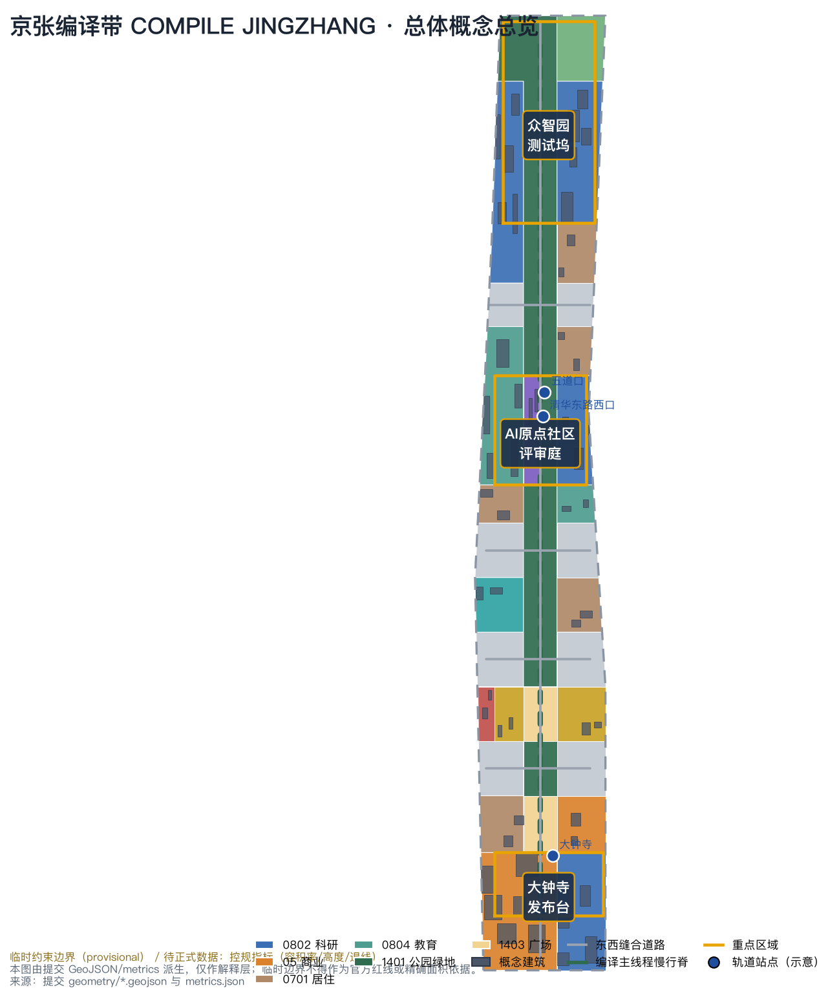
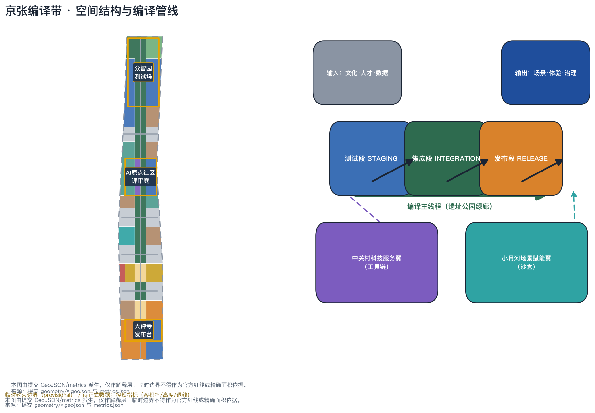
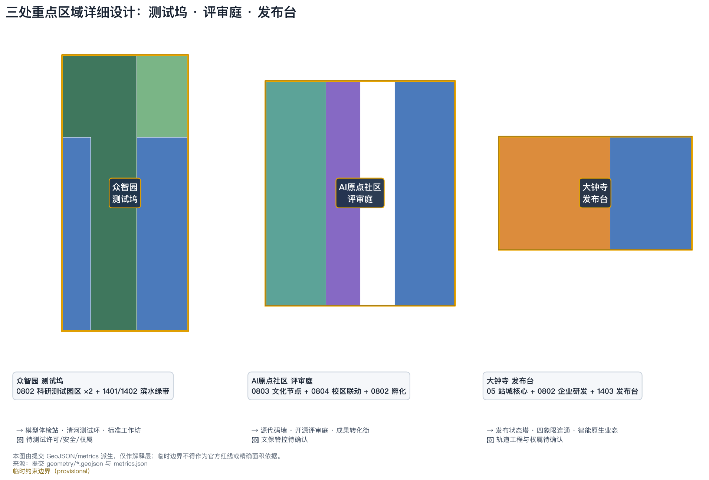
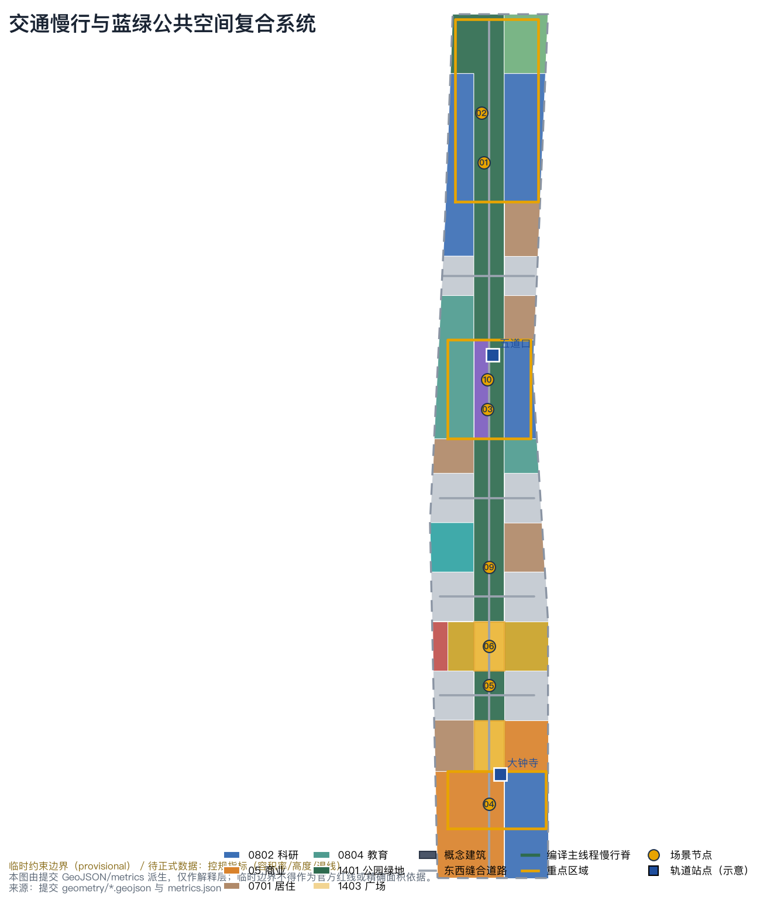
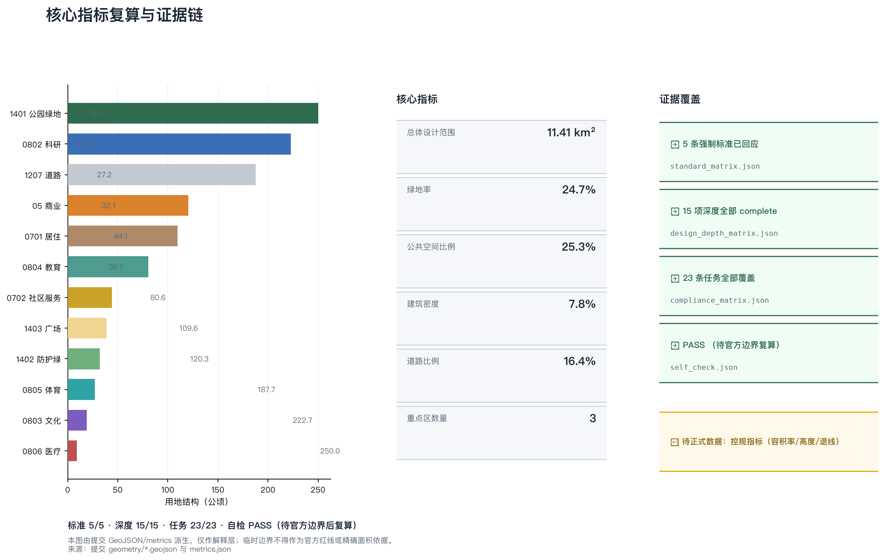

# COMPILE JINGZHANG: Turning the Source Code of a Century-Old Railway into a Runnable AI Innovation Belt

## Design Basis and Source List

This proposal takes the official prequalification announcement of the Centennial Jing-Zhang AI Innovation Belt International Urban Design Call (Haidian Sub-bureau of the Beijing Municipal Commission of Planning and Natural Resources) as its primary basis, the open-call agent taskbook as its co-creation basis, and the repository site package (design brief, allowed design space, enums, planning limits, schemas) as its machine-readable basis [source:OFFICIAL-ANNOUNCEMENT] [source:AGENT-TASKBOOK] [source:SITE-PACKAGE]. The narrative keeps only claim-adjacent evidence markers; complete sources, metrics, standards, design-depth, and task coverage are kept in `sources.json`, `metrics.json`, `standard_matrix.json`, `design_depth_matrix.json`, and `compliance_matrix.json`.

As of this version, no official precise redlines or key-area polygons are publicly available. Following repository policy, this package uses the maintainer-registered provisional rough boundaries, and every layer, the narrative, the HTML, and the drawings are labelled `provisional_constraint`: usable for generation, visualization, and design discussion only, not as an official redline, approval basis, precise-area basis, or statutory control conclusion [source:PROVISIONAL-BOUNDARIES] [source:SOURCE-REGISTRY]. Once official polygons are released, the site boundary, key areas, land use, buildings, roads, green space, public space, phasing, and all metrics must be recalculated as a whole; the judging side's decisions on eligibility, scoring and acceptance follow its formal rules, and this package makes no prediction about them [assumption:A-PROVISIONAL-001].

All content is an open co-creation conceptual proposal: every spatial suggestion is worded as a "conceptual suggestion", "reference scheme", or "material for professional teams to deepen", and does not replace statutory planning, constitute a government-approved conclusion, or make regulatory-plan adjustments, FAR/height decisions, demolition-renovation rulings, engineering alignments, investment estimates, or approval judgments [standard:PROJECT-AGENT-OPEN-CALL-TASKBOOK] [depth:existing_conditions_diagnosis]. Generation method, sources, and limits are disclosed in `sources.json`, `assumptions.json`, and the risk chapter.

## Three-Level Scope Framework

The announcement defines three working scopes: the coordinated research area of about 43.6 km2 (north to the 5th Ring Road, east to the Jingzang Expressway, south to Xizhimen Outer Street, west to Wanquanhe Road), the overall design area of about 11.4 km2 (the 1-2 km urban and industrial area around the Jing-Zhang Heritage Park), and the key detailed-design area of about 368.4 ha (from north to south: Zhongzhiyuan AI Acceleration Area, Beijing AI Origin Community, Dazhongsi AI Industry Cluster) [source:OFFICIAL-ANNOUNCEMENT] [metric:site_area_sqm]. The three levels answer three progressive questions - where industry and urban form go, how renewal and character land on the ground, and how the key areas are implemented at detail - mapped one by one in `compliance_matrix.json` for announcement tasks 1.3, 1.4, and 1.5 [depth:three_level_scope_framework].

The proposal applies one "compiling" method across all three levels: the coordinated research area is requirements analysis and architecture design (AI ecosystem, factor flows, synergy loops); the overall design area is code organization and build (compiling industry strategy into land use, buildings, roads, green space, public space, and phasing layers with recomputable structure); the key areas are unit tests and integration (detail design at the depth of a comprehensive implementation plan). All levels share one coordinate policy (EPSG:4326 exchange, EPSG:4548 area recalculation) and one evidence chain [data:geometry/site_boundary.geojson#SITE-001] [metric:key_area_count].

## Coordinated Research Area: Industry and Future City Research

### Overall concept: COMPILE JINGZHANG

The core judgment of the coordinated research area is: the Jing-Zhang Railway is the "source code" of China's self-built engineering, Zhongguancun is the "compiler" of China's code and open-source culture, and the AI Innovation Belt should become an open build pipeline that compiles talent, data, and scenarios into runnable urban scenes. The proposal therefore names the belt "Jingzhang Compiling Belt", English name COMPILE JINGZHANG, subtitle "The Compiling Belt: from China's first self-built railway to the open-source city".

The naming system uses a "one belt - one line - three nodes - two wings - twelve grids" hierarchy: the belt itself; the "Compile Main Thread" along the Jing-Zhang Heritage Park (a city-scale open build pipeline: testing in the north, review/merge in the middle, release/runtime in the south); three nodes named "TEST DOCK" (Zhongzhiyuan), "REVIEW COURT" (AI Origin Community), and "RELEASE DECK" (Dazhongsi); two wings - the "TOOLCHAIN WING" (Zhongguancun technology-service wing) and the "SANDBOX WING" (Xiaoyuehe scenario-empowerment wing); and twelve grids as replicable public-space component units. The naming maps one-to-one onto the three positionings: the century-old culture belt is the "historical source code", the urban AI life-experience belt is the "runtime", and the AI integration belt is the "compiler" itself [source:AGENT-TASKBOOK] [standard:PROJECT-AGENT-OPEN-CALL-TASKBOOK] [depth:overall_spatial_structure].

Logo and visual identity direction: the skeleton of Zhan Tianyou's zigzag ("人"-shaped) alignment merges with code braces "{ }" and the compile arrow "→", translating the railway alignment into a code pipeline mark. Primary colors are Jing-Zhang Green (heritage), Code Blue (innovation), and Signal Yellow (runtime status), reused in wayfinding, scenario status lights, and event visuals. All type and graphics are self-designed directions; no existing city, park, or enterprise marks are copied, and no trademark conclusion is made [source:AGENT-TASKBOOK].

### Three positionings, five functions, and the three-areas-two-wings loop

The three positionings (century-old culture belt, urban AI life-experience belt, AI integration belt) are translated into three identities of the compiling belt: the culture belt is a read-only historical source repository (heritage conservation and narrative); the experience belt is a runnable public runtime (scenarios everyone can experience); the innovation belt is a continuously iterating build environment (industry and governance). The five functions land spatially: the full-stack self-reliant innovation system is built and tested at the Zhongzhiyuan Test Dock; the world-class AI innovation ecosystem is reviewed and merged at the AI Origin Review Court; the AI+ scenario empowerment paradigm is scenario-tested at the Xiaoyuehe Sandbox Wing; the intelligent vibrant AI city runs on the Compile Main Thread; and global AI governance voice is published and publicly audited at the Dazhongsi Release Deck [source:AGENT-TASKBOOK] [depth:three_level_scope_framework].

The three areas and two wings form a "dependency injection" synergy loop: the Zhongguancun Toolchain Wing (west) supplies capital, IP, computing, and factor allocation as "development tools"; the Xiaoyuehe Sandbox Wing (east) supplies real scenarios, data, and test fields as "test environments"; the three key areas serve as staging, integration, and production environments connected by the Compile Main Thread, forming a continuous integration loop of "requirements up, outcomes down". The loop adds no administrative boundary and serves only as an industry-space synergy framework [data:geometry/key_areas.geojson#PROV-KEY-001] [data:geometry/key_areas.geojson#PROV-KEY-002] [data:geometry/key_areas.geojson#PROV-KEY-003].

### Global AI ecosystem cases (6)

| Case | Ecosystem trait | Transferable mechanism (conceptual) |
| --- | --- | --- |
| Silicon Valley, USA (Stanford - Sand Hill Road corridor) | University seeding, dense venture capital, global talent flow | Continuous campus-park-street interface at the Origin Community, incubation-to-roadshow mechanism [source:CASE-SILICON-VALLEY] |
| King's Cross, London | Railway industrial heritage renewed into a knowledge quarter (Central Saint Martins, etc.) | Heritage-plus-innovation renewal model along the Compile Main Thread [source:CASE-KINGS-CROSS] |
| Jurong Innovation District / Punggol Digital District, Singapore | Government-led planned test environment, early AV and digital-service pilots | "Test first, open later" public test fields and licensing sandbox at Zhongzhiyuan [source:CASE-SINGAPORE] |
| Nanshan High-Tech Zone, Shenzhen | Anchor-firm driven, full-stack hardware and software, compact city-industry | Full-stack system at Zhongzhiyuan with open interfaces to anchor firms [source:CASE-SHENZHEN] |
| West City Science & Innovation Corridor, Hangzhou | Platform-firm traction, regional synergy, scenario spillover | Scenario-data-operation spillover path of the Xiaoyuehe Sandbox Wing [source:CASE-HANGZHOU] |
| Pangyo Techno Valley, South Korea | Government-built startup cluster, city-industry integration | Operations and branding mechanism for the Dazhongsi native-AI business quarter [source:CASE-PANGYO] |

The cases are background learning material only and imply no commitment about any firm, investment, or policy; their mechanisms are translated into spatial and operational suggestions with conceptual status [source:AGENT-TASKBOOK].

## Overall Design Area: Urban Renewal and Regulatory-Plan-Level Urban Design

The overall design area is organized at regulatory-plan urban design depth: the Compile Main Thread (a roughly 300 m wide north-south green corridor, the 1401 park-green sequence in `geometry/land_use.geojson`) forms the backbone, and four east-west "stitch road bands" (1207 road land) form the cross axes, giving a "one spine, four cross roads, three nodes, two wings" structure [data:geometry/land_use.geojson#LU-026] [data:geometry/roads.geojson#ROAD-001] [depth:land_use_layout]. The land-use partition fully covers the submitted boundary without gaps or overlaps: research 222.7 ha (19.5%), commercial 120.3 ha (10.5%), residential 109.6 ha (9.6%), education 80.6 ha (7.1%), park green 250.0 ha (21.9%), road land 187.7 ha (16.4%), plus plazas, sports, medical, community services, and protection green [metric:land_use_0802_area_sqm] [metric:land_use_05_area_sqm] [metric:land_use_1401_area_sqm].

Urban renewal uses a "preserve the main line, mend the interfaces, insert scenarios" framework: the Compile Main Thread is preserved and strengthened with no demolition conclusion; street blocks along the line are mainly interface mending plus scenario insertion, with directional suggestions for function change and public-space renewal; renewal projects in the three key areas are listed as conceptual items pending regulatory-plan, ownership, and engineering confirmation [standard:MOHURD-CONTROL-DETAILED-PLANNING] [depth:retain_renovate_demolish]. Statutory controls (FAR, height, building density, green ratio, setbacks, road redlines) are missing from official materials and are all listed as "pending official regulatory-plan confirmation", never replaced by inferred values [metric:floor_area_ratio] [depth:development_intensity_controls].

Building scale uses a dual track of "conceptual estimate + pending approval": the 52 conceptual building footprints in `geometry/buildings.geojson`, combined with per-type floor-count assumptions, recompute a conceptual total floor area of about 4.81 million m2 (conceptual, low confidence) as a reference magnitude for spatial-supply discussion; final building scale follows approved regulatory plans and architectural schemes [metric:total_floor_area_sqm_concept] [metric:building_footprint_area_sqm]. Building density 7.8%, green ratio 24.7%, public-space ratio 25.3%, and road ratio 16.4% are all recomputed from geometry; formulas and sources are in `metrics.json` [metric:building_density] [metric:green_ratio]. Road ratio and public-space ratio are recorded in metrics.json.

## Detailed Design of Key Areas

The three key areas are detailed as three compile environments - Test Dock, Review Court, Release Deck - at the depth of a comprehensive implementation plan, anchored by the three provisional key-area features in `geometry/key_areas.geojson` [data:geometry/key_areas.geojson#PROV-KEY-001] [depth:three_key_area_detailed_design]. The three areas are not exclusive boundaries; they are three stages of one pipeline.

### Zhongzhiyuan AI Acceleration Area (TEST DOCK, approx. 192.1 ha)

Positioning: the "test environment" of the full-stack self-reliant AI innovation system. Spatial structure: the Qinghe waterfront protection green (1402) and the north section of the green corridor (1401) flank two research/test campus groups (0802), forming a garden-style test quarter with "green edges embracing the campus" [data:geometry/land_use.geojson#LU-022] [data:geometry/land_use.geojson#LU-023] [metric:key_area_zhongzhiyuan_ai_acceleration_area_sqm]. Design moves: a public "Model Health Check Station" test interface and a conceptual Qinghe low-speed autonomous-driving test loop inside the research groups; a low-carbon innovation exchange gallery along the Qinghe interface for industry showcases, standards workshops, and safety-governance discussion; external transport direction via the 5th Ring Road and Qinghe Road corridors - all worded as conceptual suggestions for professional teams to deepen. Implementation risks: test fields depend on road, municipal, safety, and ownership conditions [source:OFFICIAL-ANNOUNCEMENT] [depth:three_key_area_detailed_design].

### Beijing AI Origin Community (REVIEW COURT, approx. 104.3 ha)

Positioning: the "review and merge environment" of a world-class AI innovation ecosystem; the core of campus-adjacent innovation, outcome conversion, and open-source collaboration. Spatial structure: the central "Source Code Wall" culture node (0803, around y=39.988 near the Qinghuayuan station heritage site) is embedded in the green corridor, with campus-linked education land (0804) to the west, incubator/research groups (0802) to the east, and residential (0701) and community services completing the mix [data:geometry/land_use.geojson#LU-030] [data:geometry/land_use.geojson#LU-021] [metric:key_area_beijing_ai_origin_community_sqm]. Design moves: a conceptual "Open-Source Review Court" (a composite public facility for contribution review, outcome release, and a talent special zone); campus-park-street slow-traffic stitching with improved walking access to Wudaokou and Qinghua East Road West stations; an honor-display system at the culture node pairing developer name walls with the Jing-Zhang engineers' name wall. Implementation risks: the Qinghuayuan station heritage site is under heritage protection; the culture node is only a conceptual suggestion for its surroundings and must not touch the protected structure or its buffer zone [source:AGENT-TASKBOOK] [standard:MOHURD-URBAN-DESIGN-MEASURES].

### Dazhongsi AI Industry Cluster (RELEASE DECK, approx. 72.0 ha)

Positioning: the "production/release environment" of native-AI business and AI governance disclosure. Spatial structure: a station-city commercial core (05) along Dazhongsi station, enterprise R&D groups (0802) to the east, and the Release Deck plaza (1403) connecting the core to the south section of the green corridor (1401) [data:geometry/land_use.geojson#LU-001] [data:geometry/land_use.geojson#LU-028] [metric:key_area_dazhongsi_ai_industry_cluster_sqm]. Design moves: a conceptual four-quadrant pedestrian connection and station-city integration at Dazhongsi station; a "Release Status Tower" public signal installation on the Release Deck plaza (three-state display: building, testing, released/rollback-able) plus a compliant display interface for data elements and digital assets; guidance for agents, smart terminals, and content-consumption businesses to cluster in the commercial core, with compound use of planned green space (event lawns, test pop-ups) as a buffer between business and public space. Implementation risks: station and commercial-space changes involve engineering and ownership conditions and are all treated as pending confirmation [source:OFFICIAL-ANNOUNCEMENT] [depth:traffic_rail_slow_parking].

## AI Innovation Ecosystem, Personas, and AI+ Scenarios

### Personas (6)

| Persona | Typical needs | Spatial response | Privacy and review boundary |
| --- | --- | --- | --- |
| Open-source developer | Release, review, collaboration, community reputation, night work | Review Court open-source living room, Source Code Wall honor display, night-run socializing on the Main Thread [data:geometry/land_use.geojson#LU-030] | No personal behavior tracking; contribution data aggregated only |
| Startup team | Low-cost offices, compute access, test fields, fundraising | Zhongzhiyuan shared test fields, edge-compute service points, Toolchain Wing liaison [data:geometry/land_use.geojson#LU-022] | Compute and data services require separate authorization |
| Anchor AI firm employee | R&D, showcase, business, international reception | Dazhongsi R&D groups and international roadshow hall [data:geometry/land_use.geojson#LU-020] | Firm marks and cases require cleared rights |
| University faculty and students | Outcome conversion, cross-campus collaboration, practice classes | Campus-linked education land and outcome-conversion street in the Origin Community [data:geometry/land_use.geojson#LU-019] | Campus data and research outcomes require authorization |
| Local residents (incl. elderly) | Commuting, leisure, community services, low-disruption renewal | Community service band (0702), medical point (0806), accessible AI navigation [data:geometry/land_use.geojson#LU-024] | No commercial profiling; human service channels retained [standard:BARRIER-FREE-ENVIRONMENT-LAW] |
| International visitors and developer tourists | Cultural tours, scenario experience, events | Heritage AR guide, pilgrimage route, Release Week [data:geometry/land_use.geojson#LU-026] | Minimal guide data; no cross-scenario linkage |

### AI scenario cards (12, of which 3 are industry test/validation scenarios)

| No. | Scenario card | Spatial carrier | Users | Data and privacy boundary | Human review | Operator (conceptual) |
| --- | --- | --- | --- | --- | --- | --- |
| SC-01 | **Model Health Check Station (industry test 1)** | Zhongzhiyuan Test Dock | model firms, evaluators, public | Only public results and anonymized metrics | Methods and results reviewed by professional bodies | test-field operator + professional evaluators |
| SC-02 | **Qinghe low-speed AV test loop (industry test 2)** | Zhongzhiyuan Qinghe interface | AV and robotics firms | Test data stays within authorized scope | Road testing requires statutory permits and safety review | park operator + traffic authority |
| SC-03 | **Open-Source Review Hall (industry test 3)** | Origin Review Court | open-source communities, universities, firms | Code and reviews public per open-source license | Review conclusions verified by maintainers and experts | open-source community council |
| SC-04 | Release Status Tower | Dazhongsi Release Deck plaza | public, media, firms | Only authorized scenario status shown | Display content audited by operator | Release Deck operator |
| SC-05 | Heritage AR guide | Compile Main Thread | visitors, residents | Location data only for guidance, can be disabled | Historical narratives vetted by culture experts | park operator + cultural institutions |
| SC-06 | Accessible AI navigation | Main Thread and stations | elderly, people with disabilities | No health or trajectory profiling | Human guidance and phone channels retained | public service center |
| SC-07 | Community AI health cabin | medical band (0806) | residents, elderly | Health data stays within medical authorization | Final review by medical staff [standard:BARRIER-FREE-ENVIRONMENT-LAW] | medical institutions + community |
| SC-08 | Smart retail pop-up grid | Dazhongsi commercial core | consumers, brands | Minimal consumer data | Promotions and prices manually audited | commercial operator |
| SC-09 | Developer night school and night run | Compile Main Thread | developers, residents | Registration data for event organization only | Safety plans manually approved | community operator |
| SC-10 | Campus AI practice class | campus-linked plots | students | Education data stays within campus authorization | Curriculum vetted by teachers | universities and schools |
| SC-11 | Urban digital-twin showcase | Release Deck | public, decision-makers | Only public aggregated data | Display metrics reviewed by data-governance council | urban operations center |
| SC-12 | Scenario sandbox application kiosk | Xiaoyuehe Sandbox Wing | firms, developers | Tiered authorization for applications and test data | Scenario launch requires human review | sandbox operator |

All scenario cards map to concrete layers and spatial nodes and follow data minimization, public sources, explainability, and human review [source:AGENT-TASKBOOK] [standard:GENERATIVE-AI-INTERIM-MEASURES]. Immature technologies are always worded as testing/validation stages, never as fully deployable; test scenarios are never described as approved operations [depth:risk_missing_data].

## Land Use, Building Scale, and Retain-Renovate-Demolish Strategy

Land-use classification follows the national land-sea classification guide and the project enum codes; no self-invented categories are used [standard:MNR-LAND-USE-CLASSIFICATION-GUIDE]. `geometry/land_use.geojson` fully covers the submitted boundary without gaps or overlaps; the 31 land-use features' codes and areas are all recomputable from `metrics.json` [data:geometry/land_use.geojson#LU-001] [depth:land_use_layout].

Buildings use a directional "retain - renovate - new-build" expression without parcel-level demolition/renovation conclusions: the Main Thread and heritage-related interfaces are primarily retained and repaired; low-efficiency street blocks are primarily interface mending and function change; industrial and public facilities in the three key areas are primarily conceptual new builds/updates - all pending ownership, regulatory-plan, and engineering confirmation [data:geometry/buildings.geojson#BLDG-001] [depth:retain_renovate_demolish]. The 52 conceptual footprints in `geometry/buildings.geojson` all sit inside buildable parcels and do not touch green or road zones; their types (research, commercial, residential, education, cultural, sports, medical, community service) map to floor-count assumptions for the conceptual scale estimate [metric:building_footprint_area_sqm] [metric:total_floor_area_sqm_concept].

Height, massing, and character control are directional only (low-rise high-density interfaces along the green corridor, recognizable nodes, roof and signal-color coordination); no numeric heights or setback conclusions are given; height and intensity controls follow official regulatory plans [depth:height_massing_character] [metric:building_height_m].

## Transport, Rail, Municipal Infrastructure, and Public Services

The transport strategy follows "one spine, four cross roads": the Compile Main Thread slow spine (about 7.4 km conceptual north-south slow main line) carries walking, cycling, and events, while four east-west stitch roads (about 1.0-1.1 km each) connect blocks and station directions [data:geometry/roads.geojson#ROAD-009] [data:geometry/roads.geojson#ROAD-001] [metric:road_centerline_length_m]. Rail interchanges focus on Wudaokou, Qinghua East Road West, and Dazhongsi stations, with directional proposals for slow-traffic priority, accessible continuity, bicycle parking, and event-day traffic organization [depth:traffic_rail_slow_parking]. Parking, non-motorized strategy, road redlines, and cross-sections must be deepened after formal traffic and regulatory-plan data are confirmed [assumption:A-CONTROLS-001].

Municipal and new infrastructure propose a "public base" direction: conceptual locations along the Main Thread for distributed energy, edge-compute service points, and data-compliance display interfaces, forming a public-service network with the community service band (0702), medical services (0806), education (0804), and commercial services [data:geometry/land_use.geojson#LU-024] [depth:municipal_new_infrastructure]. Utility lines, fire, flood control, and sponge-city metrics are missing and are all listed as preconditions for formal deepening, with no capacity or load conclusions [assumption:A-MUNICIPAL-001].

## Blue-Green Network, Public Space, and Urban Character

The blue-green system is centered on the Compile Main Thread: the north-south green corridor (1401, about 250.0 ha) links the Zhongzhiyuan waterfront in the north to the Dazhongsi station-city core in the south, with the Qinghe protection green (1402) and two plaza nodes (1403) as secondary anchors, forming a "one line, multiple nodes" blue-green network [data:geometry/green_space.geojson#GREEN-026] [metric:green_ratio] [metric:public_space_ratio]. Green ratio 24.7% and public-space ratio 25.3% support "green encounter density": high green and public-space ratios are widely regarded as important conditions for knowledge workers' location choices and innovation exchange; the indicator is used to argue for talent-life quality of spatial supply, not as a statutory green-ratio conclusion [depth:blue_green_public_space].

### AI pilgrimage landmarks and honor-display system (3)

1. **"First Line of Code" Source Code Wall** (Origin Community, around the Qinghuayuan station heritage site): pairs the Jing-Zhang engineers' name wall with open-source contributors' name wall, meaning "from self-built engineering to open-source collaboration"; placed only in public surroundings outside the heritage protection scope, never touching the protected structure [data:geometry/land_use.geojson#LU-030] [source:AGENT-TASKBOOK].
2. **Model Health Check Station observation window** (Zhongzhiyuan): a public window into AI model testing, turning "testing" itself into a visitable public event; a conceptual facility whose built form awaits professional deepening [data:geometry/land_use.geojson#LU-022].
3. **Release Status Tower** (Dazhongsi Release Deck plaza): a green/yellow/red signal-light system disclosing scenario status (building, testing, released/rollback-able), turning the operating state of an AI city into public language; a public-art and information-device direction with no engineering conclusions [data:geometry/land_use.geojson#LU-028] [metric:land_use_1403_area_sqm].

The honor-display system works with the "twelve grids" public-space component library: contributor plaques, scenario status lights, changelog screens, and rollback-explanation boards are standardized and reusable at the three key areas and Main Thread nodes. Character control follows the direction of "green corridor as base, recognizable nodes, signal colors as accents"; the wayfinding and signage system follows the compiling-belt visual identity and keeps a hierarchy with the belt-level logo rather than mixing the two [standard:MOHURD-URBAN-DESIGN-MEASURES] [source:AGENT-TASKBOOK].

### Cultural narrative: confluence of three sources

The narrative line is a "confluence of three sources": the century-old Jing-Zhang Railway's self-built engineering source code (China's first self-designed trunk railway, the zigzag alignment, Qinghuayuan station) - Zhongguancun's code and open-source culture (from electronics street to open-source community) - the AI-era compilable city (talent, data, and scenarios continuously built and rolled back). The zigzag alignment is translated as "the earliest branch-and-merge": the railway merged height with two switchbacks, and the innovation belt merges industry and life with three areas and two wings; from "trains on time" to "code on time" to "scenarios on time", punctuality becomes the time aesthetic of the belt. A suggested international narrative: "China's first self-built railway is now the open-source operating system of an AI city." The narrative is based on public historical facts and conceptual translation only; it does not distort history or use culture as decoration [source:AGENT-TASKBOOK] [depth:overall_spatial_structure].

## Renewal Projects, Implementation Policy, and Phasing

### Renewal project list (conceptual)

| No. | Project | Type | Location | Dependencies | Phase |
| --- | --- | --- | --- | --- | --- |
| JZ-01 | Main Thread south section connection | public space / slow mobility | Main Thread south green [data:geometry/land_use.geojson#LU-026] | road redlines, under-bridge space, traffic review | near term |
| JZ-02 | Release Deck plaza and status tower | public space / brand | Dazhongsi Release Deck [data:geometry/land_use.geojson#LU-028] | public-space permits, event safety, rights clearance | near term |
| JZ-03 | Dazhongsi station-city integration core | renewal / rail interchange | Dazhongsi commercial core [data:geometry/land_use.geojson#LU-001] | station, ownership, utilities | mid term |
| JZ-04 | Source Code Wall culture node | culture / honor display | Origin culture node [data:geometry/land_use.geojson#LU-030] | heritage controls, public-environment permits | mid term |
| JZ-05 | Open-Source Review Court | industry service / public facility | Origin Community [data:geometry/land_use.geojson#LU-021] | campus boundaries, ownership, ground-floor uses | mid term |
| JZ-06 | Model Health Check Station and test loop | industry test / public display | Zhongzhiyuan research groups [data:geometry/land_use.geojson#LU-022] | test permits, safety, compute and data authorization | mid term |
| JZ-07 | Qinghe waterfront innovation interface | blue-green / industry display | Zhongzhiyuan Qinghe interface [data:geometry/land_use.geojson#LU-031] | river blue line, ecology, flood control | long term |
| JZ-08 | Xiaoyuehe Scenario Sandbox Wing | scenario operation / new infrastructure | Sandbox Wing direction | data authorization, scenario review, operator | near term (mechanism first) |

Phasing follows "mechanism first, light pilots, backbone formed, full network operation": near term (1-3 years) starts the south-section connection, the Release Deck pilot, and the scenario sandbox mechanism - all lightweight facilities and operations requiring no major engineering; mid term (3-5 years) builds the Review Court, Test Dock, and station-city core and completes the Main Thread backbone; long term (5-10 years) achieves full-network operation. Phase extents are expressed in `geometry/phasing.geojson` and their areas are recomputable from `metrics.json` [data:geometry/phasing.geojson#PH-001] [metric:phase_near_term_area_sqm] [depth:phasing_implementation].

### Global AI events system and long-term operation (conceptual)

**Annual events** "Jingzhang Compile Four-Season Rhythm": March Spring Build Day (scenario and project roadshows kick off), June Merge Season (outcome release linked with Zhongguancun Forum), September Release Week (scenarios go live with public experience), December Retro (annual data review and roadmap update). **Developer community**: a "Jingzhang Committers" chapter system and contributor honor display linked to the Source Code Wall, building a durable community-reputation mechanism. **Open scenario operation**: a four-step sandbox mechanism - apply, review, test, release, rollback - with human review and data-governance sign-off before launch; any scenario can be rolled back. **Public experience**: night runs/rides and the pilgrimage route (Test Dock - Review Court - Release Deck) as year-round public products. **International communication and conversion**: a global AI city compiling invitational, scenario-launch livestreams, bilingual narratives, and a "outcome - team - space - policy liaison" conversion path. All events, investment attraction, funding, and policy arrangements are conceptual suggestions or deepening directions, never stated as confirmed government arrangements [source:AGENT-TASKBOOK] [depth:renewal_project_list].

## Metrics, Area Recalculation, and Compliance Matrix

Metrics are managed in three classes: **spatial metrics** (directly recomputed from submitted geometry) - overall design area 1,141.3 ha [metric:site_area_sqm], key-area areas 192.9/104.3/72.0 ha [metric:key_area_zhongzhiyuan_ai_acceleration_area_sqm] [metric:key_area_beijing_ai_origin_community_sqm] [metric:key_area_dazhongsi_ai_industry_cluster_sqm], green ratio 24.7%, public-space ratio 25.3%, building density 7.8%, road ratio 16.4%, land-use areas by code, and phase areas; **control metrics** (pending official regulatory plans) - FAR, height, building density, green ratio, setbacks, road redlines [metric:floor_area_ratio] [metric:building_height_m]; **performance metrics** (pending operations calibration) - AI innovation index, talent density, scenario usage frequency, event participation, slow-mobility satisfaction. The three classes enter `metrics.json`, `assumptions.json`, and `compliance_matrix.json` respectively, so operational visions are never written as approved planning conditions [depth:metrics_recalculation].

Compliance coverage: every mandatory task of announcement sections 1.3, 1.4, and 1.5 and the six agent tasks agent.1-agent.6 are mapped one by one in `compliance_matrix.json` to sections, layers, metrics, drawings, HTML, and self-checks [standard:PROJECT-OFFICIAL-ANNOUNCEMENT] [standard:PROJECT-AGENT-OPEN-CALL-TASKBOOK]. The five mandatory professional standards are addressed one by one in `standard_matrix.json`, led by urban design, regulatory planning and land-use classification [standard:MOHURD-URBAN-DESIGN-MEASURES] [standard:MOHURD-CONTROL-DETAILED-PLANNING] [standard:MNR-LAND-USE-CLASSIFICATION-GUIDE].

All fifteen required design-depth items are complete, with land-use layout, traffic and slow mobility and blue-green public space as the core depths [depth:land_use_layout] [depth:traffic_rail_slow_parking] [depth:blue_green_public_space]. Key-area detail design and the risk and missing-data list are also complete in the depth matrix.

## Risk, Copyright, and Compliance

Main risks and boundaries: (1) the provisional rough boundary serves only this version's generation and display; all spatial layers and metrics must be recalculated as a whole once official polygons arrive [assumption:A-PROVISIONAL-001]; (2) regulatory-plan, ownership, road-redline, municipal, and engineering conditions are missing; related conclusions are all pending confirmation [assumption:A-CONTROLS-001] [assumption:A-MUNICIPAL-001]; (3) heritage controls (e.g., Qinghuayuan station heritage site) and ecological blue lines (Qinghe, Xiaoyuehe) lack GIS layers, so related designs are conceptual surroundings only [assumption:A-HERITAGE-001]; (4) all AI scenarios follow data minimization, human review, and rollback; no privacy profiling; test scenarios are never described as approved operations [standard:GENERATIVE-AI-INTERIM-MEASURES]; (5) naming, logo, landmarks, and events are conceptual directions and constitute no trademark, approval, or commitment.

Copyright and compliance: all content is generated from public or cleared materials; OSM background elements are used within ODbL attribution boundaries [source:OSM]. All images, drawings, icons, and data assets state their sources and licenses in `sources.json` and `report/copyright_statement.md`; no non-public data, personal privacy, or unauthorized material is included; the HTML is a static offline page loading no remote resources. This proposal claims no official approval, approved regulatory plan, final ownership, building scale, or guaranteed implementation; the AI agent is accountable for facts, sources, copyright, spatial data, metrics, and expression [source:SITE-PACKAGE].

## References

- Centennial Jing-Zhang AI Innovation Belt International Urban Design Call prequalification announcement (Haidian Sub-bureau, Beijing Municipal Commission of Planning and Natural Resources, 2026-05-09) [source:OFFICIAL-ANNOUNCEMENT]
- Open-call agent taskbook excerpt for the Centennial Jing-Zhang AI Innovation Belt (user-provided cleared material)
- Design brief, allowed design space, enums, planning limits, and validation schemas (repository site package)
- Provisional rough boundaries and three key-area polygons with derivation basis (maintainer-registered)
- Public source registry and processed materials (data/source_registry.json, data/processed/)
- Urban Design Administration Measures (MOHURD); Measures for the Formulation and Approval of Regulatory Detailed Plans for Cities and Towns (MOHURD); National Land-Sea Use Classification Guide (MNR)
- OpenStreetMap copyright and license (ODbL)
- Global AI ecosystem case background (Silicon Valley, King's Cross, Singapore, Shenzhen, Hangzhou, Pangyo public materials)
- Complete machine indexes: `sources.json`, `metrics.json`, `compliance_matrix.json`, `standard_matrix.json`, `design_depth_matrix.json`
