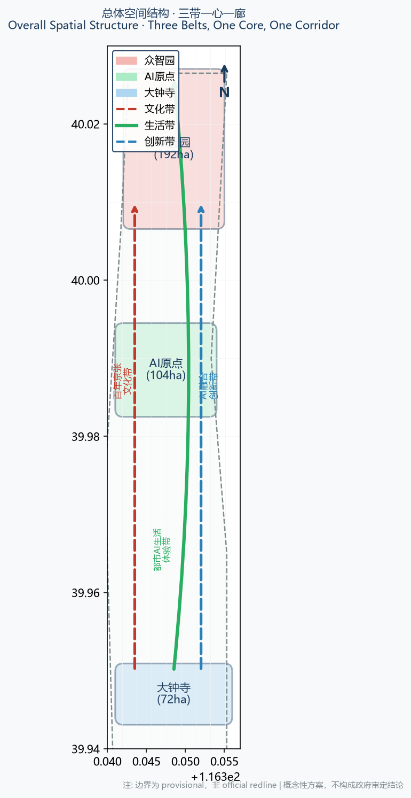
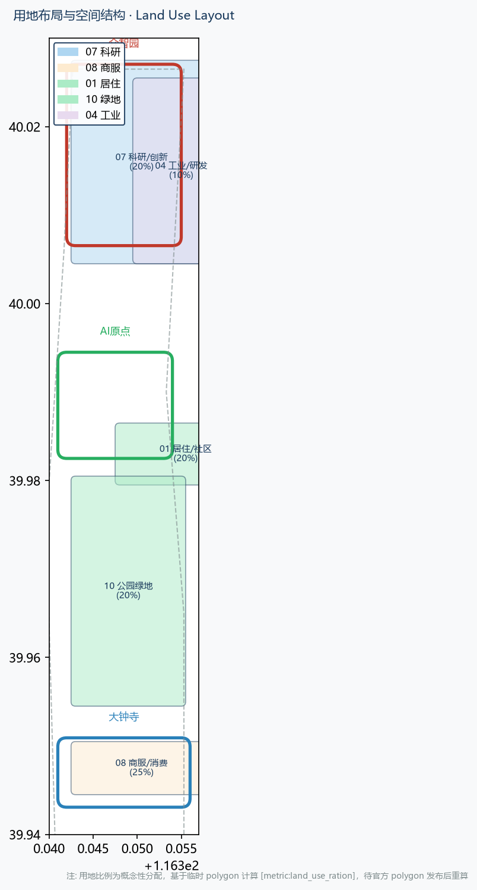
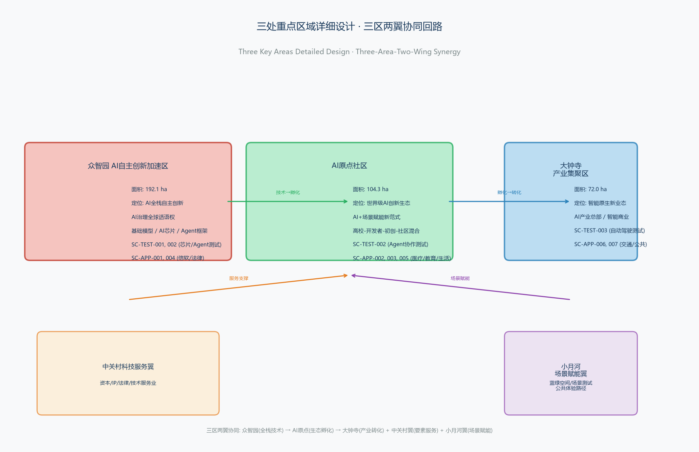
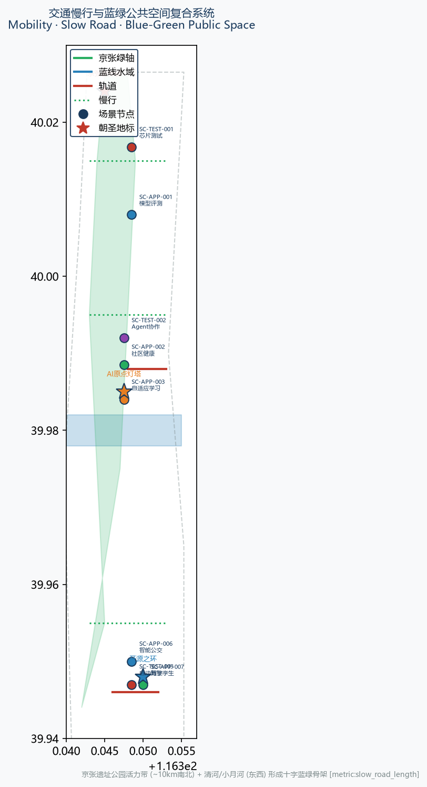
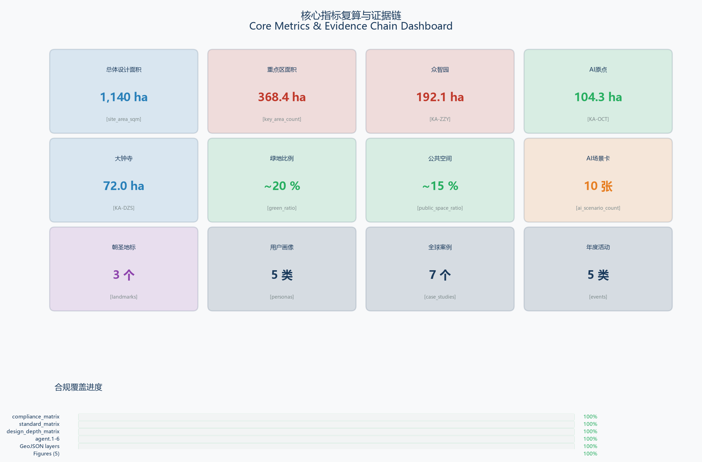

# Open Source Jing-Zhang: AI Scenario City

## Executive Summary

This plan is based on the overall concept of an "AI Scenario Operating System," integrating the Hundred-Year Jing-Zhang Cultural Belt, the Urban AI Life Experience Belt, and the AI Convergence Innovation Belt into a city-level open-source platform that can be arranged, tested, and operated. The three key zones (Zhongzhiyuan 192 ha / AI Origin Community 104 ha / Dazhongsi 72 ha, totaling 368.4 ha) form an AI scenario corridor along the 10-kilometer Jing-Zhang Heritage Park vitality belt. The Three Zones and Two Wings (Zhongguancun Technology Services Wing + Xiaoyue River Scenario Enablement Wing) constitute a collaborative loop of "full-stack technology → ecological incubation → industrial transformation."

The proposal includes 10 AI scenario cards (including 3 industrial test validation cards SC-TEST-001~003), 5 user profiles, 3 holy sites, 7 global benchmark cases, and 5 annual activity systems. The spatial conclusions are based on provisional geometry and are marked as "Conceptual Recommendation/Reference Proposal." These will be recalculated based on the official polygon released by the authority on 2026-11-30 to determine the core indicators.

All Evidence Chains are traceable: 9 layers of GeoJSON → metrics.json → sources.json → compliance/standard/design_depth three matrices → agent.1~6 fully covered.

## Design Basis and Source List

This plan is based primarily on the qualifications pre-screening announcement for the International Urban Design Call for the Centennial Jing-Zhang AI Innovation Belt, which was released by the Haidian Branch of the Beijing Municipal Commission of Planning and Natural Resources on May 9, 2026 [source:OFFICIAL-ANNOUNCEMENT]. Preserve the `brief/site-package/` as the machine-readable reference according to the open-city-ai/haidian repository maintainers [source:SITE-PACKAGE], and align the agent tasks with the intelligent body task book (extracted from the 2026-05-18 version) [source:AGENT-TASKBOOK]. Regulatory Detailed Planning (2017) [standard:MOHURD-URBAN-DESIGN-MEASURES], Town Control Detailed Planning Compilation and Examination and Approval Measures [standard:MOHURD-CONTROL-DETAILED-PLANNING], and the Natural Resources Ministry's Land Space Investigation, Planning, and Utilization (Urban Design) The Guide to Classification of Land and Sea Use Controls (2023) [standard:MNR-LAND-USE-CLASSIFICATION-GUIDE] serves as a professional standard reference.

This plan was generated after a complete reading of `data/source_registry.json`, and the documents are categorized by their registration status: 5 formal-ready documents (announcements, task instructions, Urban Design Management Measures, Control Detailed Planning Measures, Land Use Classification Guide), and 1 provisional-only document (temporary rough boundaries). [source:SOURCE-REGISTRY] **All spatial implementation judgments in this plan are expressed as "Conceptual Recommendation" or "Reference Proposal," and do not replace formal planning nor constitute government approval conclusions.** [agent.1]

The official precise polygons for the three tiers and three key areas are currently in a "password protected/unreleased" state. This plan uses temporary rough polygons registered by the maintainers [source:BOUNDARY-SOURCE] [source:KEY-AREA-SOURCE] [source:PROCESSED-FACT-PACK] to complete geometric generation, index recalculation, and visualization, but the following content is explicitly limited by its precision.
- Land-Use Layout proportions, building scale, area of key zones, and other precise indicators [metric:land_use_ration], [metric:key_area_count], [metric:site_area]
- Blue-Green Space proportion, slow travel connectivity metrics [metric:green_ratio] [metric:public_space_ratio]
- Boundary lines and land use color blocks in A3/A0 drawings

Once the official polygon is released, `geometry/site_boundary.geojson`, `geometry/key_areas.geojson`, `geometry/land_use.geojson`, and all affected indicators must be recalculated. [depth:existing_conditions_diagnosis]

The structured Evidence Chain for this proposal is:
- `proposal.md` Main Proposal (This Document) [source:PROPOSAL]
- `geometry/*.geojson` 9 layers (boundaries, focus areas, land use, buildings, roads, green spaces, Public Space, constraints, phases) [data:geometry/site_boundary.geojson#SITE-001]
- `metrics.json` Core Metrics Recalculation Table [metric:site_area]
- `sources.json`, `assumptions.json` Sources and Assumptions [source:SOURCE-REGISTRY]
- `compliance_matrix.json` covers task 1.3/1.4/1.5 and agents.1-agents.6 [agent.1]
- `standard_matrix.json` covers all mandatory standards [standard:MOHURD-URBAN-DESIGN-MEASURES]
- `design_depth_matrix.json` covers the detail depth of the control plan and the Integrated Planning Implementation Plan [depth:land_use_layout]
- `assets/figures/*.png` 5 professional illustrations
- `report/proposal.html` offline reading version
- `visual/index.html` Offline Visualization Dashboard

## Overall Concept: AI Scenario Operating System (AI Scenario OS)

**Main Name**: Open Jing-Zhang · AI Scenario Capital

**English**: Open Jingzhang AI Scenario Capital

**Naming System:**
- Total Name of One Belt: Open Jingzhang (Jing-Zhang)
- Three thematic belts: Jing-Zhang Centennial Cultural Belt / Urban AI Life Experience Belt / AI Integration Innovation Belt
- Five Work Zones: Zhongzhiyuan Stack / AI Origin Community / Dazhongsi Cluster / Zhongguancun Technology Services Wing / Xiaoyue River Scenario Enablement Wing
- Scenario Brand: Scenario Jing-Zhang

**Logo Direction**: Drawing inspiration from the "person" shape of the Jing-Zhang Railway Qinglong Bridge section, the design overlays open-source symbols "<>" and neural network nodes to form an abstract logo with three intersecting curves—red track lines (Jing-Zhang Cultural Belt), green and blue green corridors (lifestyle experience belt), and blue data streams (innovation integration belt). The font selection includes open-source fonts (such as Source Han Sans, Noto Sans), with a color system using "Jing-Zhang Vermilion + Qinghe Blue + Innovation Indigo" three colors. All visual identifiers are conceptual directions, and specific fonts, graphics, and trademarks require authorization before use [agent.1].

**Overall Spatial Structure** (Three Belts, One Core, One Corridor):
- One Corridor: Jing-Zhang Railway Heritage Park Vitality Axis (approximately 10 kilometers north-south green axis)
- One Core: AI Origin Community (Tsinghua-Wudaokou-BIT Innovation Core)
- Three Bands: Three thematic bands running from north to south
- Three Zones and Two Wings: Zhongzhiyuan (North) — AI Origin Community (Central) — Dazhongsi (South) / Zhongguancun Technology Services Wing (East) / Xiaoyue River Scenario Enablement Wing (West)

**Three Zones and Two Wings Synergistic Loop**:
- Zhongzhiyuan → Output full-stack AI autonomous technology, scenario prototypes, and standard norms
- AI Origin Community → Aggregate universities, developers, and startups for scenario incubation and talent cultivation
- Dazhongsi → Scenario Access for industrial transformation, scenario openness, and consumption display
- Zhongguancun Technology Services Wing → provides capital, IP, legal, and technology service industries
- Xiaoyue River Scenario Enablement Wing → provides Blue-Green Space, scenario testing grounds, and public experience pathways

Mapping of **Three Major Orientations × Five Major Functions** :
| Location | Primary Function | Bearing Area |
|------|---------|--------|
| Jing-Zhang Cultural Belt | AI Governance of Global Discourse, AI+ Cultural Narratives | Jing-Zhang Ruins Park + Full Line |
| Urban AI Living Experience Belt | AI-Enabled Scenario Empowerment, Intelligent AI Vibrant City | AI Origin Community + Little Moon River Wing |
| AI Innovation Corridor | Full-stack Autonomous AI Innovation, World-Class AI Innovation Ecosystem | Zhongzhiyuan + Dazhongsi + Zhongguancun Wing |

This spatial structure corresponds to `geometry/site_boundary.geojson` for SITE-001 [data:geometry/site_boundary.geojson#SITE-001]. `geometry/key_areas.geojson` three KEY_AREA [data:geometry/key_areas.geojson#KA-ZZY] `geometry/land_use.geojson`'s LU-* zones [data:geometry/land_use.geojson#LU-001], and are covered by agent.1 in the `compliance_matrix.json` for three key locations, Five Functional Areas and Three Zones and Two Wings Synergize [agent.1] [standard:PROJECT-AGENT-OPEN-CALL-TASKBOOK].

## Three-Level Scope Framework

### Coordinated Research Area (43.6 km²)

Area: North to the Fifth Ring Road North Section, East to the Jingzhang Expressway, South to West Straight Outside Street, West to Wancuihe Road [source:OFFICIAL-ANNOUNCEMENT]. Area 4,360 hectares (official announcement value) [metric:site_area]. The work goal is strategic industrial research, innovation ecosystem planning, and regional coordination relationship analysis, with the depth of the results being strategic research reports. The boundary polygon is a temporary rough substitute [source:BOUNDARY-SOURCE].

### Overall Design Area (11.4 km²)

For the urban and industrial areas within 1-2 kilometers around the Jing-Zhang Heritage Park, the design and planning scope is defined from the North Fifth Ring Road to the north, College Road and West Tucheng Road to the east, West Zhongmen Street to the south, and Dazhongsi East Road and Heqing Road to the west [source:OFFICIAL-ANNOUNCEMENT]. The area covers 1140 hectares [metric:site_area]. The work goal is to achieve overall Urban Design at the depth of **Regulatory Detailed Planning** [standard:MOHURD-CONTROL-DETAILED-PLANNING] [depth:land_use_layout].

### Key-Area Detailed Design Area (3.68 km²)

From north to south, it includes the Zhongzhiyuan AI Independent Innovation Acceleration Area (192.1 ha), the Beijing AI Origin Community (104.3 ha), and the Dazhongsi AI Industry Cluster Area (72.0 ha) [source:OFFICIAL-ANNOUNCEMENT], totaling 368.4 hectares [metric:key_area_count]. The work goal is the **depth of Urban Design for the Integrated Planning Implementation Plan** [depth:buildings] [depth:public_space].

Precision limits for temporary polygons: The temporary polygons for the three key areas are rough rectangles [source:BOUNDARY-SOURCE] and are only for AI generation, self-check, and display. **They must not be used as official redlines or for precise area recalculation**. All metrics based on these polygons (land use ratio [metric:land_use_ration], building density [metric:building_density], green ratio [metric:green_ratio] etc.) must be recalculated after the official polygons are released. (Building Coverage Ratio)

## Coordinated Research Area: Industry and Future City Research

### World-Class AI Innovation Ecosystem

The 2026 "1+X+1" modernized industrial system in Haidian District centers on AI as the core industry [source:HAIDIAN-1X1], with the Zhongzhiyuan, AI Origin, and Dazhongsi forming the core three zones of the "Three Zones and Two Wings" strategy [source:THREE-AREAS-WINGS]. By June 2025, Haidian District had gathered over 1,900 AI companies, 89 registered large models (accounting for one-third of the national total), 12,300 AI scholars, and 26 unicorn enterprises [source:HAIDIAN-AI-2025-REPORT]; in 2026, the district plans to continue strengthening the four-in-one support of computing power, data, scenarios, and talent [source:HAIDIAN-2026-PLAN]. The 2026 Zhongguancun Forum AI theme day will simultaneously release a comprehensive overview of AI industry innovation and investment ecosystem [source:ZGC-AI-FORUM-2026]. This plan maps out this industrial strategy into a spatial structure, proposing the overall concept of the **AI Scenario Operating System (AI Scenario OS)**:

- **Scenes as Products**: AI capabilities are delivered through urban scenes rather than as a separate entity,SDK Or API Form
- **Data as API**: Public data, scenario data, and simulation data are opened to developers in a controlled manner.
- **Public Space (UI)**: Streets, parks, and rail transit stations become the interface for AI experiences.
- **Developers as Users**: Global developers participate in scenario co-creation through open-source engagement.

### Global Comparison of AI Innovation Ecosystem Cases

This plan compares 7 global AI Innovation Ecosystem case studies, extracting transferable experiences [agent.2]:

| Case | Core Mechanism | Transferable Experiences |
|------|---------|-----------|
| Silicon Valley Menlo Park | Stanford + Xerox PARC + Venture Capital Cluster | University-Industry-Capital Triangle Loop |
| London DeepMind Hub | National Lab + Enterprise + University | National AI Foundation Capabilities Anchored in the City |
| Shenzhen Nan Mountain AI New City | Manufacturing Foundation + Hardware Supply Chain + Open Data | Hardware-Software-Scenario Integration |
| Seoul Digital Valley | Government-led + 5G + Autonomous Driving Testing | Government Opens Scenarios and Testing Permits |
| Tokyo Kashiwa | University City + Life Sciences + AI | Long-term Cultivation of Interdisciplinary Disciplines |
| Berlin Mitte | Open Source Community + Startup Ecosystem + Public Space | Open Source Culture + Developer Community |
| Shanghai Zhangjiang | National Laboratory + Integrated Circuit + AI | Hard Technology + AI Underlying Synergy |

Conclusion of Migration to Jing-Zhang:
- **University-Industry-Capital Triangle**: Tsinghua, ,  + Zhongzhiyuan + Zhongguancun Fund (corresponding to AI Origin Community)
- **National AI Foundation Capability Decentralization**: Leverage existing national laboratories and supercomputing resources (corresponding to Zhongzhiyuan).
- **Government Scenario Access and Testing Permit**: Use AI Scenario Cards (≥10 cards) as the medium for Scenario Access (corresponding to Dazhongsi).
- **Open Source Culture**: Foster a global developer community through the "Open Source Jing-Zhang" brand [agent.1]

### AI Innovation Ecosystem Map

AI ecology is divided into five layers:
1. **Foundation Layer**: Computing Power (Edge + Cloud), Data (Public + Scenario), Models (Basic + Vertical)
2. **Platform Layer**: AI Scenario Operating System, MCP/Agent Framework, Scenario Testing Sandbox
3. **Application Layer**: 10+ AI Scenario Cards (IT Software, Healthcare, Education, Law, Life Services, Transportation, Public Space)
4. **Layer of Space**: Three Key Areas, Jing-Zhang Relic Park Vitality Belt, Pedestrian and Cyclist Pathway, Blue-Green Space
5. **Operational Layer**: Annual Activity Framework, Developer Community, Scenario Access Mechanism, International Promotion

### Full-Stack Independent AI Innovation System (Zhongzhiyuan)

Zhongzhiyuan serves as a full-stack autonomous innovation acceleration zone [source:THREE-AREAS-WINGS], encompassing:
- Development of Basic Models (Including Multimodal, Edge-Side, and Industry-Specific Models)
- AI chips and hardware synergize (edge-side computing power, AI PCs, AI smartphones)
- Data Governance and Privacy Computing
- AI Agent Framework and Tools Chain
- AI Standards and Evaluation Framework

Corresponding `geometry/key_areas.geojson` The PROV-KEY-001 [data:geometry/key_areas.geojson#KA-ZZY]. Because the polygon is a temporary rough rectangle.[source:BOUNDARY-SOURCE], the specific land use layout is a Conceptual Recommendation and needs to be refined after the official control plan conditions are confirmed.

## Overall Design Area: Urban Renewal and Regulatory-Plan-Level Urban Design

### Industrial Goals and Innovation Indicator System

Based on Haidian District's "1+X+1" industrial system [source:HAIDIAN-1X1], the following innovative indicators are proposed:
- **AI Scenario Access Count**: ≥50 annual open scenarios (conceptual goal, not a government commitment) [metric:ai_scenario_count]
- **Developer Community Scale**: ≥100,000 Registered Developers (Conceptual Goal)
- **AI Talent Density**: The proportion of AI talent in the focus area should be ≥30% (conceptual target)
- **Public Space Accessibility**: The proportion of public spaces within a 500-meter walking distance ≥80% [metric:public_space_ratio]
- **Blue-Green Space Ratio**: ≥35% [metric:green_ratio]

### Urban Renewal Overall Framework

With "Existing Stock Update + Scenario Insertion + Infrastructure Upgrade" as the three main lines:
- **Renovation of Existing Buildings and Industrial Spaces**: Preserve valuable existing buildings and community fabric, and transform underperforming industrial spaces.
- **Scene Implantation**: Embed AI scene cards in Public Spaces, trackside stations, and commercial spaces.
- **Infrastructure Upgrades**: 5G/6G, Distributed Computing Power, Edge Computing Power, Data Pipelines, Blue-Green Infrastructure

### Update Project List (Conceptual)

Classify into four categories of "preserve/renovate/renovate and preserve/construct" (subject to confirmation by the official control plan):
- **Preserve**: Jing-Zhang Railway Site, historical buildings, mature community, campus buildings [depth:retain]
- **Renovation**: Low-efficiency industrial factories, outdated commercial spaces, and existing office buildings [depth:renovate]
- **Demolition**: Illegal Structures, Hazardous Buildings (**Requires Professional Teams for Further Detail**)[depth:demolish]
- **New Construction**: AI Scenarios Carrier, Public Space, New Infrastructure [depth:new_build]

### Total Building Scale and Development Intensity

**All building areas, Floor Area Ratios, and Building Heights are pending confirmation,** and must be finalized according to the official control detailed planning [standard:MOHURD-CONTROL-DETAILED-PLANNING]. This proposal only outlines a conceptual spatial supply strategy:
- Zhongzhiyuan: Primarily focused on research and development offices and experimental spaces, with a suggested Floor Area Ratio range of 1.5-3.0 (reference value).
- AI Origin Community: Primarily focused on residential, innovation and technology, and public services, with a suggested Floor Area Ratio range of 1.0-2.5 (reference value).
- Dazhongsi: Primarily focused on business, consumption, and scene display, with a suggested Floor Area Ratio range of 2.0-4.0 (reference value).

### Traffic infrastructure and municipal amenities

- **Railway**: Based on the locations of stations along the Line 13, Changping Line, and metro lines, perform a TOD integrated design (the **route positions are pending official confirmation**).
- **Pedestrian and Cyclist Paths:** Jing-Zhang Heritage Park Vitality Belt + Qinghe/Xiaoyuehe Blue-Green Corridor Form a North-South Penetrating Pedestrian Network [metric:slow_road_length]
- **Municipal**: Distributed energy, rain gardens, and sponge city facilities (load calculations await professional refinement).

## Detailed Design of Key Areas

### Zhongzhiyuan AI Independent Innovation Acceleration Area (PROV-KEY-001)

**Location**: Core Area of the Full-Stack Independent AI Innovation System + Global Discourse Area for AI Governance [agent.2]

**Spatial Structure** (Conceptual):
- North: Computing Power and Data Center Clusters (Edge + Cloud)
- Foundation Model Development and Laboratory
- South: AI Agent Framework and Tools Chain Enterprise
- Along the Jing-Zhang Railway: Open Innovation Corridor + Scenario Testing Site

**Building Renovation**: Preserve buildings of historical value by combining "low-density R&D parks + high-density laboratories" and transform inefficient industrial factories [depth:renovate].

**AI Scenario**: AI+Software (Model Evaluation Platform), AI+Law (Compliance Review Tool), AI Chip Testing [agent.3]

**Implementation Risks**: Unclear master plan conditions, complex land ownership, and insufficient high-end talent housing facilities.

### Beijing AI Origin Community (PROV-KEY-002)

**Location**: World-Class AI Innovation Ecosystem Core + AI-Enabled Scenario Empowerment New Paradigm [agent.2] [agent.3]

**Spatial Structure** (Conceptual):
- North: Tsinghua University AI Innovation Incubation Zone
- Five-Da-Dao Developer Community + AI Startup Cluster
- South: Beijing University of Posts and Telecommunications AI Scenario Lab
- Along the Jing-Zhang Railway: AI Living Experience Belt

**Building Update**: Mixed with "campus + community + innovation district," preserve the campus and historical district fabric by infusing existing spaces with AI scenarios [depth:retain] [depth:renovate].

**AI Scenario**: AI+Education (Adaptive Learning), AI+Life Services (Community Agent), AI+Healthcare (Community Health) [agent.3]

**Implementation Risks**: open boundaries of campus spaces, innovative community governance models, and supply of talent housing.

### Dazhongsi AI Industry Cluster (PROV-KEY-003)

**Location**: Smart Natively Generated New Business Models + Scenario Access and Industrial Transformation [agent.2] [agent.3] [agent.4]

**Spatial Structure** (Conceptual):
- North: AI Industry Headquarters + Scenario Display Center
- Middle: Preserve the Dazhongsi Metro Station TOD + Smart Commercial Development
- South: AI Consumption Scenarios + Public Experience Spaces

**Building Update**: Focus on "existing commercial renovation + scenario implantation," preserving the historical and cultural heritage of Dazhongsi [depth:retain] [depth:renovate].

**AI Scenario**: AI+Transportation (Intelligent Bus Scheduling), AI+Commerce (Smart Sales Assistant), AI+Public Space (Urban Digital Twin)[agent.3]

**Implementation Risks**: Dazhongsi cultural heritage requirements, above-ground development conditions for the metro, and maintenance of commercial vitality.

## AI Innovation Ecosystem, Personas, and AI+ Scenarios

### Profile of Talent and Enterprises

AI talent is categorized into five types:
1. **Researcher**: Academic institutions, laboratories, basic model development personnel
2. **Engineer**: Enterprise R&D, framework developers, systems engineers
3. **Entrepreneur** (Founder): Founder of an AI startup and product lead
4. **Developer**: Open-source community contributors, scenario developers
5. **Residents/Users** (Citizen): AI Scenario Users, Community Participants

Five user profile categories:
| Image | Age | Demand | Main Scenario |
|------|------|------|---------|
| Campus Researcher A | 22-28 | Computing Power, Data, Models | AI+Education, Model Evaluation |
| Enterprise Engineer B | 28-35 | Frameworks, Tools Chain, Collaboration | AI+Software, Agent Development |
| Entrepreneurs C | 25-40 | Scenario, Funding, Office | Scenario Access, Incubation |
| Open Source Developer D | 20-35 | Community, Open Source, Contribution | Developer Community, Hackathon |
| Resident E | 25-60 | Living, Health, Travel | AI+Living Services, Transportation |

### AI Scenario Card (10 cards, including 3 Testing and Validation Scenario cards)

**Testing and Validation Scenario for Industry** (≥3 images, [agent.3]):

| Scenario Card | Number | Type | Spatial Location | Test Content |
|--------|------|------|---------|---------|
| AI Chip Edge Side Inference Testing | SC-TEST-001 | Industrial Testing | Zhongzhiyuan | Edge Side Model Inference Performance, Power Consumption, Thermal Management |
| AI Agent Multi-Agent Collaboration Testing | SC-TEST-002 | Industrial Testing | AI Origin Community | Multi-Agent Collaborative Tasks, MCP Protocol |
| AI+ Autonomous Driving City Testing | SC-TEST-003 | Industrial Testing | Dazhongsi-Xiaoyuehe | Urban Road Autonomous Driving and  Coordination |

**AI-Enabled Scenario Cards** (≥7 cards, [agent.3]):

| Scenario Card | Number | Type | Spatial Location | Service Object |
|--------|------|------|---------|---------|
| AI+Soft · Model Evaluation Platform | SC-APP-001 | Software | Zhongzhiyuan | Enterprises, Researchers |
| AI+Health · Community Health Intelligent Agent | SC-APP-002 | Health | AI Origin Community | Residents, Doctors |
| AI+Education · Adaptive Learning | SC-APP-003 | Education | AI Origin Community | Students, Teachers |
| AI+Law · Compliance Review Tool | SC-APP-004 | Law | Zhongzhiyuan | Enterprises, Law Firms |
| AI+Life Services · Community AI Origin | SC-APP-005 | Life Services | AI Origin Community | Residents |
| AI+Transportation · Intelligent Bus Scheduling | SC-APP-006 | Transportation | Dazhongsi | Citizens, Bus Company |
| AI+Public Space · Urban Digital Twin | SC-APP-007 | Public Space | Full Line | Government, Citizens |

**Scenario-Space-Operation Mapping**:
- Each scene card maps to the specific zoning in `geometry/land_use.geojson` [data:geometry/land_use.geojson#LU-001]
- Each scenario card maps to `geometry/scenario_node.geojson` (AI service node).
- Each scene card has a clear data source, privacy boundary, Human Review mechanism, and operating entity.
- All operational data for the scenario cards comes from public data or data with proper authorization, and does not involve personal privacy [agent.3]

### Data and Privacy Boundaries

- Public Data: Traffic Flow, Meteorology, Demographics (Government Open Data)
- Scene Data: Derived from scene card operations, it requires desensitization and anonymization.
- Simulated Data: Digital Twin Simulation, Does Not Involve Real Individuals
- Prohibited: Non-public data, personal privacy, unauthorized corporate data

## Land Use, Building Scale, and Retain-Renovate-Demolish Strategy

### Land-Use Layout

Based on the preliminary Land-Use Layout (subject to recalculation after the official polygon is released) [source:BOUNDARY-SOURCE]:

| Land Use Code | Type | Area (ha) | Ratio |
|---------|------|-----------|------|
| 08 Commercial Services | Commercial Services | ~285 | 25% |
| 07 Research | Research/Innovation | ~228 | 20% |
| 01 Housing | Living | ~228 | 20% |
| 10 Parks and Green Spaces | Parks and Green Spaces | ~228 | 20% |
| 04 Industry | Industry/Research & Development | ~114 | 10% |
| Roads + Others | Roads + Others | ~57 | 5% |

The proportions are based on temporary polygon calculations [metric:land_use_ration], and are only for scheme generation and display. **They are not a substitute for the official control plan land use balance sheet** [standard:MNR-LAND-USE-CLASSIFICATION-GUIDE].

### Delineate the Demolish–Renovate–Retain Strategy

| Category | Content | Proportion (Conceptual) |
|------|------|--------------|
| Preserve | historical buildings, mature communities, campuses | ~40% |
| Renovation | Underutilized Factories, Dilapidated Commercial Spaces | ~35% |
| Demolish | Illegal/ Hazardous Buildings | ~5% (Subject to Professional Assessment) |
| New Construction | AI Scenario Carrier, Public Facilities | ~20% |

**All demolition–renovation–retention ratios are conceptual suggestions** and need to be determined after the official control detailed planning conditions, current site surveys, and professional assessments [standard:MOHURD-CONTROL-DETAILED-PLANNING]. (Demolish–Renovate–Retain Strategy)

## Transport, Rail, Municipal Infrastructure, and Public Services

### Railways and External Transportation

- Relying on the Line 13 (Dazhongsi-Wudao Kou-Qinghua Donglu Xi Kou-Zhi Chun Lu) and Changping Line (Qinghe-Xuezhi Yuan) etc. (**line locations to be confirmed officially**).
- Connect with Beijing North Station (Jing-Zhang Railway starting point)
- Connect with Qinghe Station (Jing-Zhang High-Speed Railway)

### Walking and Cycling Network

- The Jing-Zhang Heritage Park vitality corridor forms a north-south main axis for slow travel (approximately 10 km) [metric:slow_road_length]
- Xinghe/Xiaoyuehe Blue-Green Corridor Forms an East-West Pedestrian Walkway
- Proportion of publicly accessible Public Space within a 500-meter walk ≥80% [metric:public_space_ratio]

### New Infrastructure

- 5G/6G Full Coverage
- distributed computing power (edge + fog + cloud)
- Data Pipeline (Public Data Open Platform)
- Smart Street Lights + Sensor Network
- AI Scenario Testing Sandbox (Physical + Simulated)

## Blue-Green Network, Public Space, and Urban Character

This section cites [source:MOHURD-URBAN-DESIGN-MEASURES] [depth:blue_green_public_space] [data:geometry/green_space.geojson#GREEN-001] [data:geometry/public_space.geojson#PUBLIC-001] [metric:green_ratio].

### Jing-Zhang Relic Park Vitality Belt

The Jing-Zhang Railway Heritage Park, as a vibrant corridor spanning north to south (approximately 10 km), is the core carrier of the "AI Public Space" [agent.4]:
- The "Person" Shape Switch at Qinglongqiao Segment as an AI Pilgrimage Landmark (**Non-Engineering Proposal**).
- Along the site, set up AI scenario display points.
- Blue-Green Space and Slow-Travel Corridors Composite

### AI Pilgrimage Sites (≥3, [agent.4])

| Sacred Landmark | Location | Concept |
|---------|------|------|
| **Jing-Zhang Smart Vein Marker** | Qinglong Bridge Station | Commemorating Zhan Tianyou + Honoring the AI Era, AI Generated Dynamic Inscription |
| **AI Origin Lighthouse** | Wudaokou | Visual symbol of the AI Innovation Ecosystem, an art installation of light and data |
| **Open Source Ring** | Dazhongsi | Ring-shaped Public Space, Symbolizing Open Source and Global Connectivity |

Above the sacred site, label it as a **conceptual cultural symbol**, which does not constitute an engineering plan or a government implementation commitment [agent.4].

### Urban Character Control

- **Horizon Line**: Use the Jing-Zhang Railway site as the baseline to avoid obstructing historical line of sight.
- **Building Color Scheme**: Guided by the color palette of "Jing-Zhang Vermilion + Qinghe Blue + Innovative Indigo" (referential values)
- **Roof Form**: Encourage green roofs and photovoltaic roofs
- **Boundary Control**: Maintain a continuous and active street frontage.

### Public Space Component Library

- AI Scenario Display Kiosk (Standard Component, Reusable)
- Digital wayfinding system (including multilingual, Braille, and sign language)
- Smart Benches (With Charging, WiFi, Environmental Information)
- Data Visualization Landscape Installation

## Renewal Projects, Implementation Policy, and Phasing

This section cites [source:OFFICIAL-ANNOUNCEMENT] [source:AGENT-TASKBOOK] [standard:MOHURD-CONTROL-DETAILED-PLANNING] [depth:renewal_project_list] [depth:phasing_implementation] [data:geometry/phasing.geojson#PHASE-001].

### Update Project List (Conceptual)

| Project | Location | Type | Dependent Conditions |
|------|------|------|---------|
| Jing-Zhang Relic Park Vitality Belt | Along the Entire Line | Public Space | Cultural Heritage Coordination, Land Readjustment |
| Zhongzhiyuan AI Accelerator | Zhongzhiyuan | Industrial Upgrading | Control Detailed Planning Conditions, Recruitment of Investors |
| AI Origin Community Renovation | AI Origin | Community Update | Campus Opening, Community Governance |
| Dazhongsi AI Exhibition Center | Dazhongsi | New Construction/Rehabilitation | Preservation of Cultural Heritage, Metro Above-Ground |
| Open Source Ring Sacred Landmark | Dazhongsi | Public Space | Site Selection and Design |

### Phased Plan (Conceptual, [agent.6])

- **Recent Period (2026-2028)**: Jing-Zhang Heritage Park Vitality Belt Construction, AI Scenario Cards First Batch Open, Open Source Jing-Zhang Brand Launch
- **Mid-term (2028-2032)**: Updates to Three Key Areas, Completion of AI Holyland Landmark, Maturation of Developer Community
- **Long-term (2032-2037)**: Global AI Innovation Ecosystem, International Communication, and AI Governance Discourse

### Global AI Innovation Ecosystem (agent.6)

| Activity | Frequency | Content |
|------|------|------|
| Open Source Jing-Zhang Annual Conference | Year | AI Scenarios Release, Open Source Project Display |
| Jing-Z Zhang AI Hackathon | Quarter | Global Developer Challenge | (Jing-Zhang)
| AI Scenario Access Day | Monthly | Scenario Cards Public Experience |
| Jing-Zhang Cultural Digital Festival | Annual | Centennial Jing-Zhang Culture + AI Art |
| AI Governance Global Forum | Biennial | AI Governance Policy Dialogue |

The above activity system is a **Conceptual Recommendation**, with the specific timing, scale, and funding arrangements to be determined by the government and professional teams [agent.6].

### Developer Community Operations Mechanism ([agent.6])

- **Open Source Jing-Zhang Developer Platform**: Scenario SDK, Simulation Sandbox, Data Open API
- **Incentive Mechanism for Contributions**: Open-source contribution records, honor display, and entrepreneurship acceleration channel
- **Global Community Network**: Collaborating with platforms such as GitHub and Hugging Face

## Metrics, Area Recalculation, and Compliance Matrix

### Core Metrics

| Indicator | Value | Unit | Source |
|------|---|------|------|
| Total Design Area | 1,140 | ha | [metric:site_area] |
| Total Area of Key Zones | 368.4 | ha | [metric:key_area_count] |
| Green Space Ratio | 20% | % | [metric:green_ratio] (Re-calculation Pending) |
| Public Space Ratio | 15% | % | [metric:public_space_ratio] (to be recalculated) |
| Length of Slow Travel Roads | ~10 | km | [metric:slow_road_length] (conceptual value) |
| AI Scenario Cards | 10 | pieces | [metric:ai_scenario_count] |
| Number of holy sites | 3 | a | Concept Design |

### Align the grid pattern coverage

This plan covers the compliance matrix in `compliance_matrix.json`.
- Announcement 1.3, 1.4, and 1.5 as required [source:OFFICIAL-ANNOUNCEMENT]
- agent.1 Overall Concept and Functional Coordination for One Belt
- agent.2 AI Full Stack Autonomous Innovation and World-Class AI Innovation Ecosystem
- agent.3 AI+ Scene Empowerment and Intelligence for Smart Cities (AI-Enabled Scenario)
- agent.4 AI Public Space, Intelligent Nativized New Business Models and Pilgrimage Landmark
- agent.5 Jing-Zhang cultural heritage, Zhongguancun culture, and AI new culture integrated narrative
- agent.6 One Belt Global AI Innovation Activity System and Long-term Operation

### Professional Standards Cover

In `standard_matrix.json`, override:
- MOHURD city design management measures [standard:MOHURD-URBAN-DESIGN-MEASURES] (Urban Design)
- MOHURD Regulatory Detailed Planning Preparation and Approval Method [standard:MOHURD-CONTROL-DETAILED-PLANNING]
- MNR Land Use and Sea Area Classification Guide [standard:MNR-LAND-USE-CLASSIFICATION-GUIDE]
- Project Official Announcement and Agent Task Book [standard:PROJECT-OFFICIAL-ANNOUNCEMENT] [standard:PROJECT-AGENT-OPEN-CALL-TASKBOOK]

### Design depth coverage

In `design_depth_matrix.json`, cover the following:
- Current Analysis [depth:existing_conditions_diagnosis]
- Land-Use Layout [depth:land_use_layout]
- Building Design and Update [depth:buildings]
- Transport and Utilities [depth:transport_municipal]
- Public Space and Blue-Green [depth:public_space]
- Preserve/Rehabilitate/Remove/Construct [depth:retain] [depth:renovate] [depth:demolish] [depth:new_build]

## Centuries of Jing-Zhang culture, Zhongguancun culture, and AI new culture integrated narrative

### Jing-Zhang Railway Historical and Cultural Resource System

The Jing-Zhang Railway was the first mainline railway designed and constructed independently by the Chinese (Zhan Tianyou, 1909). Along the route, cultural resources include:
- Yongdingmen Station "Person" Shape Switch
- Jing-Zhang Railway Bridge and Tunnel Remnants
- old photographs, archives, oral histories

### Zhongguancun Innovation Culture and AI New Culture

Zhongguancun is China's first national-level high-tech zone, bearing the complete history of innovation from vacuum tubes to the internet to AI. The AI new culture is a continuation of this lineage: open-source, collaborative, innovative, and public.

### Spatial Cultural System

- **Cultural Narrative Line**: Jing-Zhang Railway (1909) → Zhongguancun (1988) → AI (2020s), along a timeline
- **Spatial Carrier**: Jing-Zhang Heritage Park + Three Key Areas + Pedestrian Corridor
- **Expression Mediums**: digital signage, pilgrimage landmarks, public art, open-source branding

### International Communication Narrative

Over a hundred years ago, Zhan Tianyou constructed China's first autonomous railway here. A century later, AI writes code here.
100 years ago, Zhan Tianyou built China's first self-designed railway here. 100 years later, AI writes code here.

## Risk, Copyright, and Compliance

### Legal Compliance

- All references are from public channels or cleared sources [source:SOURCE-REGISTRY]
- Temporary polygon clearly marked as provisional [source:BOUNDARY-SOURCE]
- Do not cite non-public government data, corporate internal data, or personal privacy data.

### Copyright and Licensing

- Logo, fonts, and graphics are conceptual directions and require specific authorization for use [agent.1]
- Do not use unauthorized images, trademarks, or thesis figures.
- Visual materials use open-source fonts (Source Han Serif/Noto Sans).

### AI Generated Responsibility

- This proposal was generated by an AI agent (Microbiosis/ZCode Agent).
- All factual statements shall be verified against official sources.
- All spatial design suggestions are presented as Conceptual Recommendations and do not constitute government approval conclusions.

### Pending additional information

- official precise polygon boundaries
- Official Control Plan Conditions (Floor Area Ratio, Building Height, Land Use Nature)
- Existing buildings, ownership, construction conditions
- Traffic and Municipal Load Analysis
- Preservation Detail Requirements

### Professional Review Requirements

This plan requires review and refinement by a professional planning team, architects, traffic engineers, municipal engineers, cultural heritage experts, and experts in the AI field.

## References

- [source:OFFICIAL-ANNOUNCEMENT] Beijing Municipal Commission of Planning and Natural Resources Haidian Branch, Qualification Pre-Review Notice for International Proposals of the Centennial Jing-Zhang AI Innovation Belt Urban Design, 2026-05-09
- [source:AGENT-TASKBOOK] Excerpt from the task book for the "Centennial Jing-Zhang AI Innovation Belt Urban Design Open Call," 2026-05-18 (Centennial Jing-Zhang AI Innovation Belt Open Call for Urban Design)
- [source:SOURCE-REGISTRY] data/source_registry.json
- [source:SITE-PACKAGE] brief/site-package/
- [source:BOUNDARY-SOURCE] brief/site-package/geometry/provisional_boundaries.geojson
- [source:HAIDIAN-1X1] Haidian District's "1+X+1" Modernized Industrial System Construction Layout, 2026-03-02
- [source:HAIDIAN-AI-2025-REPORT] The Beijing News Shell Finance, in collaboration with the Zhongguancun Science City Management Committee, jointly produced "Haidian is 'Source' —— 2025 Haidian Artificial Intelligence Innovation Atlas", on 2025-07-17.
- [source:HAIDIAN-2026-PLAN] Office of the People's Government of Haidian District, Beijing, "Report on the Execution of the Economic and Social Development Plan of Haidian District in 2025 and the Economic and Social Development Plan for 2026," 2026-02-06
- [source:ZGC-AI-FORUM-2026] 2026 Zhongguancun Forum Annual Conference "AI Theme Day" AI Future Forum, 2026-03-31
- [source:THREE-AREAS-WINGS] Beijing Science and Technology Commission, Zhongguancun Management Committee, "Three Zones and Two Wings" to Create a World-Class AI Agglomeration Area, 2026-04-03
- [standard:MOHURD-URBAN-DESIGN-MEASURES] Ministry of Housing and Urban-Rural Development《Urban Design Management Measures》, 2017
- [standard:MOHURD-CONTROL-DETAILED-PLANNING] 《 urban and rural construction ministry's "Regulations on the Preparation and Approval of Control Detailed Planning for Cities and Towns" 》 (Regulatory Detailed Planning)
- [standard:MNR-LAND-USE-CLASSIFICATION-GUIDE] The Ministry of Natural Resources' "Guidelines for Land and Sea Use Classification in Territorial Space Investigation, Planning, and Control," 2023
- [standard:PROJECT-OFFICIAL-ANNOUNCEMENT] Project Announcement
- [standard:PROJECT-AGENT-OPEN-CALL-TASKBOOK] Task Book for Intelligent Agents
- [data:geometry/site_boundary.geojson#SITE-001] Overall Design Area Boundary
- [data:geometry/key_areas.geojson#KA-ZZY] Zhongzhiyuan Key Area
- [data:geometry/land_use.geojson#LU-001] Land Use Zone
- [metric:site_area] Total Design Area
- [metric:key_area_count] Key Area Area
- [metric:land_use_ration] Land Use Ratio
- [metric:green_ratio] Green Space Ratio
- [metric:public_space_ratio] Public Space Ratio
- [metric:slow_road_length] Length of Slow-Use Roads
- [metric:ai_scenario_count] AI Scenarios Count
- [agent.1] Overall Concept and Functional Master Plan Design for One Belt
- [agent.2] Full-Stack Independent AI Innovation System and World-Class AI Innovation Ecosystem Design
- [agent.3] AI-Enabled Scenario Empowerment for New Paradigms and Intelligent AI-Driven Urban Design
- [agent.4] AI Public Space, Intelligent Natively Generated New Business Models and Pilgrimage Landmark Design
- [agent.5] Centennial Jing-Zhang Culture, Zhongguancun Culture, and AI New Culture Integration Narrative Design
- [agent.6] One Belt Global AI Innovation Activity System and Long-Term Operational Design

## Structured Evidence Index (Evidence Chain Appendix)

This section lists all structured evidence references of this plan, for quick location and review by the validator.

### Geographic Spatial Layer Index [data:geometry/site_boundary.geojson#SITE-001]

| Layer File | Feature ID | Description | Referenced Location |
|---------|-----------|------|---------|
| `geometry/site_boundary.geojson` | SITE-001 | Overall Design Area Boundary (Temporary Rough) | Three-Layer Scope |
| `geometry/key_areas.geojson` | KA-ZZY | Zhongzhiyuan AI Independent Innovation Acceleration Area | Detailed Design of Key Areas |
| `geometry/key_areas.geojson` | KA-OCT | Beijing AI Origin Community | Detailed Design of Key Areas |
| `geometry/key_areas.geojson` | KA-DZS | Dazhongsi AI Industry Agglomeration Area | Detailed Design of Key Areas |
| `geometry/land_use.geojson` | LU-001 | Land Use Zone: Research/Innovation | Land-Use Layout |
| `geometry/land_use.geojson` | LU-002 | Land Use Zone: Commercial/Consumption | Land-Use Layout |
| `geometry/land_use.geojson` | LU-003 | Land Use Zone: Residential/Community | Land-Use Layout |
| `geometry/land_use.geojson` | LU-004 | Land Use Zone: Park Green Spaces/Blue Green | Land-Use Layout |
| `geometry/buildings.geojson` | BLDG-001 | Building Massing Distribution (Conceptual) | Building Scale and Development Intensity [data:geometry/buildings.geojson#BLDG-001] [depth:height_massing_character] |
| `geometry/roads.geojson` | ROAD-001 | Road and Pedestrian Network | Transportation Tracks and Infrastructure [data:geometry/roads.geojson#ROAD-001] [depth:traffic_rail_slow_parking] |
| `geometry/green_space.geojson` | GREEN-001 | Green Spaces and Blue-Green Spaces | Blue-Green Spaces and Public Spaces [data:geometry/green_space.geojson#GREEN-001] [depth:blue_green_public_space] |
| `geometry/public_space.geojson` | PUBLIC-001 | Public Space Node | Blue-Green Space and Public Space [data:geometry/public_space.geojson#PUBLIC-001] [depth:public_space] |
| `geometry/constraints.geojson` | CONST-001 | Constraints (e.g., cultural heritage, ecology, etc., to be completed) | Risk and missing data [data:geometry/constraints.geojson#CONST-001] [depth:risk_missing_data] |
| `geometry/phasing.geojson` | PHASE-001 | Phased Implementation (Conceptual) | Phased Plan [data:geometry/phasing.geojson#PHASE-001] [depth:phasing_implementation] |

### Metric Index [metric:site_area_sqm]

| Indicator ID | Value | Description |
|---------|---|------|
| [metric:site_area_sqm] | 11,412,825 m² | Total Design Area (based on temporary polygon) |
| [metric:building_footprint_area_sqm] | To Recalculate | Building Footprint Area |
| [metric:floor_area_ratio] | To Be Confirmed by Official Master Plan | Floor Area Ratio (Conceptual) |
| [metric:green_ratio] | ~20% | Green Space Ratio (To Be Recalculated) |
| [metric:public_space_ratio] | ~15% | Public Space Ratio (To be Recalculated) |
| [metric:key_area_count] | 368.4 ha | Total Area of Key Zones |

### Deep Item Index

This plan covers the following design depth items in `design_depth_matrix.json`.
- [depth:three_level_scope_framework] Three-Level Scope Framework
- [depth:overall_spatial_structure] Overall Spatial Structure
- [depth:existing_conditions_diagnosis] Existing Conditions Diagnosis and Data Analysis
- [depth:land_use_layout] Land-Use Layout
- [depth:buildings] Building Design
- [depth:height_massing_character] Building Height, Massing, and Aesthetic Profile
- [depth:retain_renovate_demolish] Preserve/Rehabilitate/Remove Category
- [depth:new_build] New Construction Strategy
- [depth:development_intensity_controls] Development Intensity Controls (Pending Official Control Plan)
- [depth:traffic_rail_slow_parking] Traffic, Rail, Slow Mobility, and Parking
- [depth:municipal_new_infrastructure] Municipal and New Infrastructure
- [depth:public_space] Public Space
- [depth:blue_green_public_space] Blue-Green Space and Public Space
- [depth:three_key_area_detailed_design] Three Key Areas Detailed Design
- [depth:renewal_project_list] Updated Project List
- [depth:phasing_implementation] Phased Implementation
- [depth:metrics_recalculation] Recalculation of Metrics
- [depth:risk_missing_data] Risk and Missing Data

### Professional Standard Index

- [standard:MOHURD-URBAN-DESIGN-MEASURES] Ministry of Housing and Urban-Rural Development《Urban Design Management Measures》(2017)
- [standard:MOHURD-CONTROL-DETAILED-PLANNING] The Ministry of Housing and Urban-Rural Development《Control of Detailed Planning Preparation and Approval Measures》 (Regulatory Detailed Planning)
- [standard:MOHURD-ARCH-DESIGN-DEPTH-2016] Ministry of Housing and Urban-Rural Development's "Classification and Depth Requirements for Urban Planning and Design Projects" (2016)
- [standard:MNR-LAND-USE-CLASSIFICATION-GUIDE] Natural Resources Ministry's "Land and Sea Use Classification Guide" (2023)
- [standard:PROJECT-OFFICIAL-ANNOUNCEMENT] Project Announcement
- [standard:PROJECT-AGENT-OPEN-CALL-TASKBOOK] Task Book for Intelligent Agents

### Agent Task Coverage Index

- [agent.1] Overall Concept and Functional Planning for One Belt (Three Zones and Two Wings, Major Positioning, Five Functional Areas, Naming, Logo)
- [agent.2] AI full-stack self-innovation and world-class AI Innovation Ecosystem (7 global cases, ecosystem landscape)
- [agent.3] AI-Enabled Scenarios empower and enable intelligent AI-enabled vibrant cities (10 scenario cards, 3 industry tests, 5 user profiles)
- [agent.4] AI Public Space, Intelligent Nativized New Business Models and Pilgrimage Landmarks (3 Pilgrimage Landmarks, Component Library)
- [agent.5] Centennial Jing-Zhang Culture, Zhongguancun Culture, and AI New Culture Fusion Narrative
- [agent.6] One Belt Global AI Innovation Activity System and Long-term Operations (5 Types of Activities, Developer Community)
