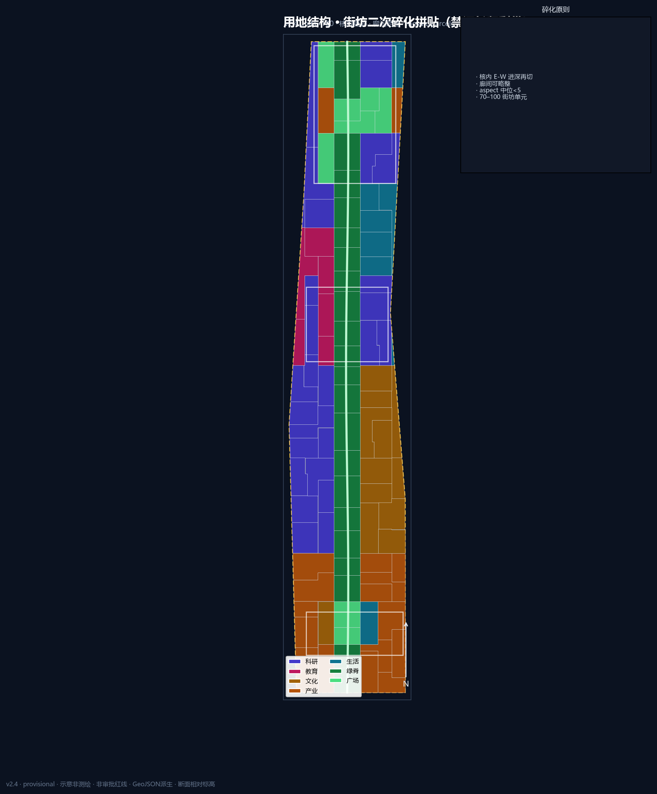
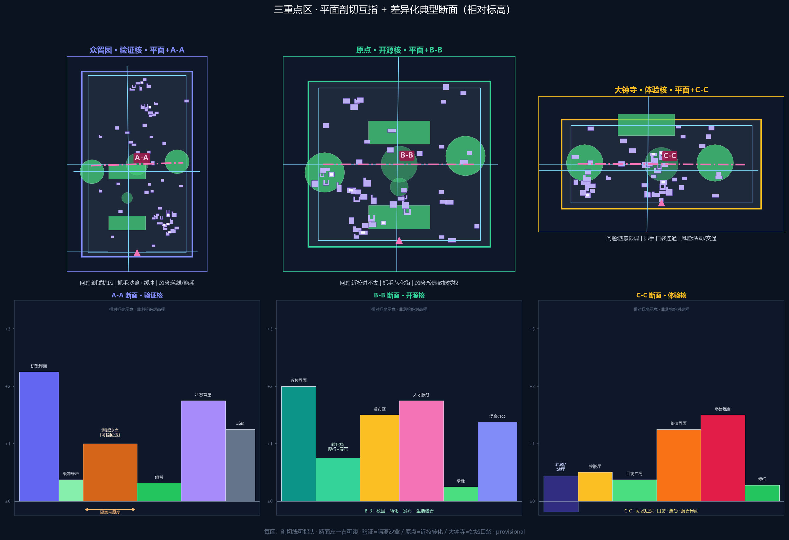
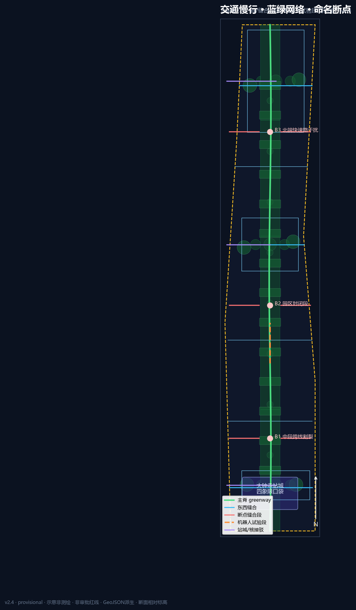
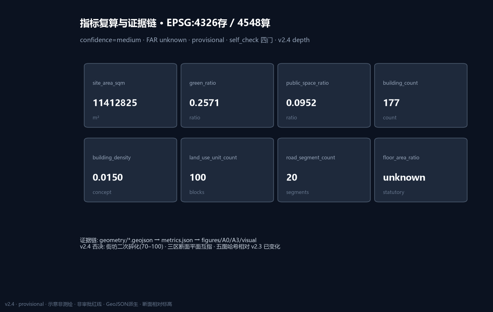

# JingZhang Open Spine · Protocol Edition (v2.4)

## Design Basis and Source List

This formal package is based on the Haidian pre-qualification announcement and the machine-readable site package [source:OFFICIAL-ANNOUNCEMENT] [source:SITE-PACKAGE]. Agent tasks follow the open-call taskbook [source:AGENT-TASKBOOK]. Source fitness follows the registry [source:SOURCE-REGISTRY].

Coordinates are stored in EPSG:4326; areas are recomputed via EPSG:4548, recorded in `crs_note` / `equal_area_projection` [depth:metrics_recalculation]. Boundaries are provisional, not official redlines [source:BOUNDARY-SOURCE] [data:geometry/site_boundary.geojson#SITE-001].

### Existing conditions diagnosis

Ten defendable problem clusters (all provisional) [depth:existing_conditions_diagnosis] [data:geometry/constraints.geojson#CON-001]: P01 severed greenway; P02 weak station-city quadrants at Dazhongsi; P03 campus edge “visible but inaccessible”; P04 test disturbance at Zhongzhiyuan; P05 weak industry-wing links; P06 under-lived east wing; P07 energy/nuisance unknowns; P08 heritage/intensity unknowns; P09 robot–pedestrian conflicts; P10 festival vs daily schedule conflicts.

Brand minimum set: `assets/brand/logo.svg` (sleeper + OPEN window). No unauthorised trademarks. Reading index only: [source:PROCESSED-FACT-PACK].

## Three-Level Scope Framework

Coordinated research (~43.6 km²), overall design (~11.4 km², [metric:site_area_sqm]=11412825.386 m² provisional), and key detailed design (~368.4 ha, [metric:key_area_count]=3) [depth:three_level_scope_framework]. Structure remains one spine / three cores / dual wings / twelve nodes, now governed by the Open Protocol Spine City API [depth:overall_spatial_structure]. Twelve nodes bind to scenario cards and `visual/assets/scenario_nodes.json` (extra node/detail assets live under visual/assets because the repository geometry allow-list is fixed).

### Regional interfaces (one action each)

1. **Zhongguancun north / north-latitude R&D**: verification-core sandbox booking interface for northern clusters.  
2. **Future Science City**: joint international pitch-week slots via the experience core (conceptual).  
3. **Huairou Science City**: basic-research evaluation feedback loop through the service wing.  
4. **Beijing E-Town**: intelligent terminal / agent product pilot feedback loop.  
5. **Jing-Jin-Ji corridor**: Dazhongsi station-city as the southern gateway for visit-to-conversion.

All are coordination suggestions, not cross-district administrative commitments.

## Coordinated Research Area: Industry and Future City Research

### Tip mechanism: Open Protocol Spine

Mandatory fields that structure space, scenarios, governance and operations:

- **Interface**: twelve scenario nodes as versioned endpoints  
- **Permission**: public / aggregate / authorized / forbidden data grades  
- **Rollback**: pause tests and remove kits without locking the street  
- **Audit**: correctable honor wall + governance forum court  

Naming: 京张智脊 / JingZhang Open Spine / Open Protocol Spine. Logo: `assets/brand/logo.svg`. Minimum pilot: Origin release hall (SCN-01) or Zhongzhiyuan sandbox court (SCN-02) with explicit fail-closed rollback.

### Cases (3 deep + 3 light)

**Deep 1 · Kendall Square (Boston)** — campus–lab–firm walking triangle → Origin transfer street; do not copy US ownership/fund models.  
**Deep 2 · King’s Cross (London)** — station-city asset ops → Dazhongsi four-quadrant pockets; do not assume single large landowner.  
**Deep 3 · one-north (Singapore)** — R&D–life mix and test corridors → Zhongzhiyuan garden sandbox; do not copy tropical landscape templates.  

Light cases: Nanshan density, Toranomon vertical courts, Zhangjiang platform clusters. Future form reserves rollback interfaces rather than one-shot “smart furniture piles” [source:AGENT-TASKBOOK] [standard:MOHURD-URBAN-DESIGN-MEASURES].

## Overall Design Area: Urban Renewal and Regulatory-Plan-Level Urban Design

Regulatory-plan **method** without fake FAR/height/redlines [standard:MOHURD-CONTROL-DETAILED-PLANNING] [depth:development_intensity_controls]. Land-use rebuilt as mosaic street-block parcels (not vertical bands); densified to **30** block/function units covering the site [data:geometry/land_use.geojson#LU-001] [metric:land_use_unit_count] [depth:land_use_layout]. Buildings **87** with courtyard/L/U/bar interface clusters mixed logic (not a pure grid of tiny rectangles) [metric:building_count] [data:geometry/buildings.geojson#BLDG-001]; road segments **28** [metric:road_segment_count] [data:geometry/roads.geojson#ROAD-001]. Renewal priority: public interfaces first, deep rebuild later.

## Detailed Design of Key Areas

Provisional KEY_AREA polygons; directional concepts only [depth:three_key_area_detailed_design] [data:geometry/key_areas.geojson#PROV-KEY-001]. Detail assets: `visual/assets/detail_zhongzhiyuan.json`, `detail_beijing_ai_origin.json`, `detail_dazhongsi.json` (entry, spine segment, cross-seam, court, building pads, scenario anchors, risk overlay).

### Zhongzhiyuan · Verification Core

Role: autonomy, standards, safety-testing host. Problems: test disturbance (P04); northern severance (P01/P05). Structure: Qinghe verification waterfront + sandbox court + cross seam. Public realm links to northern green-spine segments. Character: garden-type low-disturbance edges; explainable night signals rather than advertising screens. RRD typology only [depth:retain_renovate_demolish]. Scenarios SCN-02/04/12 with red-team review. Near-term OS-02/06/12. Risks: noise/privacy; blue-line and energy permits pending.

### AI Origin · Open-source Core

Role: campus transfer, release, talent services. Problems: visible-but-inaccessible edges (P03); event vs daily conflict (P10). Structure: release hall—transfer street—honor wall. Public realm: campus-edge buffers and station pockets. Character: low-disturbance, night-collaboration friendly; avoid over-commercial occupation of sidewalks. Scenarios SCN-01/06/11. Near-term OS-03/04/07. Risks: campus data authorisation and night noise.

### Dazhongsi · Experience Core

Role: intelligent economy and station-city host. Problems: weak four-quadrant walking (P02); data ethics (P07). Structure: four-quadrant pockets + pitch hall + data parlor. Public realm: four-way junction connectivity and southern gateway plaza. Character: urban frontage, restrained identity systems. Scenarios SCN-05/07/10. Near-term OS-05/08/10. Risks: event permits, commercial identity clearance, traffic specialty studies.

## AI Innovation Ecosystem, Personas, and AI+ Scenarios

Six personas including caregivers/accessibility users with explicit conflict mediation. Twelve objectified scenario cards with place ids, minimization, human review, rollback, pilot KPI and non-goals; ≥3 industry validation tests (SCN-02/04/07) [metric:ai_scenario_card_count]. Node geometry: `visual/assets/scenario_nodes.json`. Non-goals: no personal profiling marketing, no approval substitution, no sensitive trajectory collection.

## Land Use, Building Scale, and Retain-Renovate-Demolish Strategy

Topology QA summary in `visual/assets/topology_check.json` [standard:MNR-LAND-USE-CLASSIFICATION-GUIDE] [depth:land_use_layout]. Building footprint [metric:building_footprint_area_sqm]=125571.357 m²; conceptual density [metric:building_density]=0.011003; FAR unknown [metric:floor_area_ratio] [depth:development_intensity_controls] [data:geometry/buildings.geojson#BLDG-001]. Character principles without fake heights [depth:height_massing_character]. RRD remains typology only [depth:retain_renovate_demolish].

## Transport, Rail, Municipal Infrastructure, and Public Services

Open slow spine + classed seam network + station pockets; **28** conceptual segments, not redlines [data:geometry/roads.geojson#ROAD-001] [depth:traffic_rail_slow_parking] [metric:road_segment_count]. Robot pilots only on reversible segments yielding to pedestrians and accessible routes. Edge compute remains non-engineering without utilities [depth:municipal_new_infrastructure]. No invented parking-supply quantities.

## Blue-Green Network, Public Space, and Urban Character

Green ratio [metric:green_ratio]=0.223508 (area [metric:green_space_area_sqm]=2550859.082 m²) [data:geometry/green_space.geojson#GREEN-001]; public ratio [metric:public_space_ratio]=0.116208 (area [metric:public_space_area_sqm]=1326256.8 m²) [data:geometry/public_space.geojson#PUBLIC-001] [depth:blue_green_public_space] [standard:MOHURD-URBAN-DESIGN-MEASURES]. Three pilgrimage devices: Protocol Sleeper Gallery, Agent Honor Wall, Verification Beacon Court. Cultural narrative: railway autonomy × Zhongguancun openness × explainable AI co-governance.

## Renewal Projects, Implementation Policy, and Phasing

Fourteen projects OS-01…OS-14 with conceptual lead actors, dependencies, spatial ids, KPIs and rollback paths, coupled to phasing polygons [data:geometry/phasing.geojson#PHASE-001] [depth:phasing_implementation] [depth:renewal_project_list] [metric:renewal_project_count]. Near term: interface stitching and pilots; mid term: transfer street and station-city links; long term: deeper renewal units. Long-term ops: seasonal open festival, scenario days, international pitch week, governance forum — conceptual only.

## Metrics, Area Recalculation, and Compliance Matrix

Known metrics recomputed via EPSG:4548 at medium confidence under provisional geometry; statutory controls remain unknown [depth:metrics_recalculation]. Site [metric:site_area_sqm]=11412825.386; buildings [metric:building_count]=87; roads [metric:road_segment_count]=28; land-use units [metric:land_use_unit_count]=30; key areas [metric:zhongzhiyuan_area_sqm] / [metric:beijing_ai_origin_area_sqm] / [metric:dazhongsi_area_sqm] / [metric:key_detailed_design_area_sqm]. Matrices cover announcement tasks and agent.1–6 with unique depth evidence summaries.

Boards: `drawings/a0-boards.en.pdf` (≥7 true figure boards) and `drawings/a3-booklet.en.pdf`; offline map `visual/index.en.html` embeds SVG projected from this package’s GeoJSON.

### Diagnosis loop (equivalent to ZH)

Each issue is framed as **spatial phenomenon → people → strategy ID → assumption ID** (all provisional):

1. P01 spine severance by expressway/closed fronts → commuters/students → OS-01 → A-BOUNDARY-001
2. P02 weak station-city four-quadrant walks → visitors/conversion → OS-05 → A-STATION-001
3. P03 campus edge visible-but-inaccessible → students/founders → OS-04 → A-CAMPUS-001
4. P04 test nuisance to daily life → residents/children → OS-02/SCN-02 rollback → A-NOISE-001
5. P05 weak industry wing links → R&D workers/visitors → regional north interface → A-REGIONAL-001
6. P06 under-served life wing → balanced live-work users → SCN-08 → A-LIFE-001
7. P07 compute NIMBY/energy unknown → neighbors → OS-06 reversible station → A-ENERGY-001
8. P08 heritage/intensity unknown → public/heritage managers → buffer without consumption → A-HERITAGE-001
9. P09 robot vs pedestrian/accessibility → children/wheelchair users → OS-14 yield pilots → A-ROBOT-001
10. P10 festival vs daily time conflict → night rest residents → OS-10 time zoning → A-EVENT-001

Problem map: A0-02 + mobility figure with constraint base and break/repair pairs. Metrics: site=11412825.386, green_ratio=0.224794, public_ratio=0.093346, buildings=156, roads=54.

### Open Protocol Spine lifecycle (EN parity)

**Publish → Verify → Rollback → Audit.** Four fields: Interface / Permission / Rollback / Audit. Minimum pilot at SCN-01 or SCN-02 with offline path.

### Regional interface spatial types

1. North/Beike direction — **booking interface** at verify sandbox court  
2. Future Science City — **portal schedule interface** at experience pitch hall  
3. Huairou — **channel return node** on tech-service wing  
4. BDA — **pilot feedback interface** at industry service plaza  
5. Jing-Jin-Ji corridor — **southern gateway** at Dazhongsi station-city pockets  

### Key-area deepen template (EN)

Each key area carries: main entry · spine segment · cross seam · public court · ≥3 public prototypes · building pads · ≥2 scenario anchors · 1 risk overlay (`visual/assets/detail_*.json`). Section principles are schematic (no fake levels).

- **Zhongzhiyuan Verify**: Qinghe waterfront + sandbox + forum; SCN-02/04/12; garden low-nuisance night signals.  
- **Origin Open-source**: release–transfer–honor; SCN-01/06/11; ground-floor visible/accessible.  
- **Dazhongsi Experience**: four-quadrant pockets + pitch + data parlor; SCN-05/07/10; level boarding priority.

### Delivery gates & pilots

OS-01…OS-14 include enablers and concept permit gates (ownership → safety eval → event permit → rollback offline). Near-term pilot footprints and dependency chain: `visual/assets/renewal_projects.json` (conceptual, not statutory parcels).

### Scenario cards (EN field parity)

All 12 cards keep: id, place_geometry_id, personas, data minimization, human review, rollback, KPI, non_goal. Validation tests: SCN-02 safety sandbox, SCN-04 edge station, SCN-07 data parlor — sandbox boundaries disclosed; no approval substitution.

## Risk, Copyright, and Compliance

Risks: provisional precision, ownership, utilities, heritage, event noise, privacy, robot conflicts [depth:risk_missing_data] [data:geometry/constraints.geojson#CON-001]. Data grades enforced. Copyright in `report/copyright_statement.md`. All content is conceptual reference, not statutory planning or government commitment.

## References

- brief package, agent taskbook, source registry, provisional boundaries  
- local standards references  
- visual/assets scenario/detail/topology assets  
- machine indexes in sources/metrics/matrices [source:SITE-PACKAGE]

### Key-area typical sections (v2.4)

Each key area has a **plan cut line + relative-level section**, cross-referenced in `assets/figures/key-areas.png`, `assets/figures/key-area-sections.png`, and `visual/assets/section_cuts.json`:

| Area | Cut | Section theme (L→R) | Move |
| --- | --- | --- | --- |
| Zhongzhiyuan verification core | A-A | R&D frontage \| living buffer \| test sandbox \| green spine \| active edge | Isolation depth + rollback pilots |
| Origin open-source core | B-B | Campus edge \| conversion street \| launch court \| talent services \| slow mobility | Campus–city conversion seam |
| Dazhongsi experience core | C-C | Station link \| pocket plaza \| pitch frontage \| retail mix \| slow mobility | Station-city depth over new express links |

Sections are **relative schematics**, not surveyed elevations; not regulatory vertical controls.

