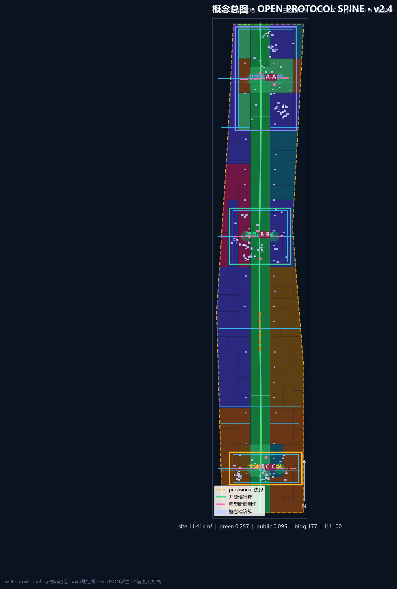

# 京张智脊·开源协议脊（v2.4）

## 设计依据与资料清单

本 formal 包以海淀分局资格预审公告与仓库 `brief/site-package` 为机器可读依据 [source:OFFICIAL-ANNOUNCEMENT] [source:SITE-PACKAGE]。agent 任务来自开源征集任务书 [source:AGENT-TASKBOOK]。资料用途边界以登记表区分 formal / background / provisional [source:SOURCE-REGISTRY]。

坐标与面积路径必须分开表述：GeoJSON **存储**为 EPSG:4326；面积与比例一律经 **EPSG:4548** 投影复算，并写入要素 `crs_note` / `equal_area_projection` 字段 [depth:metrics_recalculation]。当前边界为 provisional，不得作为 official redline 或精确审批面积 [source:BOUNDARY-SOURCE]。边界要素见 [data:geometry/site_boundary.geojson#SITE-001]。

### 现状诊断与问题地图

基于公开叙事与 provisional 约束，提出 10 条可辩护问题（均标临时性）。每条闭环为 **空间现象 → 人群 → 策略 ID → 假设 ID** [depth:existing_conditions_diagnosis] [data:geometry/constraints.geojson#CON-001]：

1. P01 绿廊被快速路/封闭界面切断 → 通勤/通学人群慢行断裂 → OS-01 接口缝合 → A-BOUNDARY-001  
2. P02 大钟寺站城四象限步行弱 → 到访/转化人群绕行 → OS-05 四象限连通 → A-STATION-001  
3. P03 近校转化界面“看得见进不去” → 师生与创业者 → OS-04 转化街 → A-CAMPUS-001  
4. P04 众智园测试干扰日常 → 居民与儿童 → OS-02/SCN-02 回退规则 → A-NOISE-001  
5. P05 产业服务与中关村翼接驳不足 → 研发员工与访客 → 区域北纬预约接口 → A-REGIONAL-001  
6. P06 生活翼服务密度不足 → 职住平衡人群 → SCN-08 生活样板街 → A-LIFE-001  
7. P07 算力设施邻避与能耗未知 → 邻里社区 → OS-06 可回退驿站 → A-ENERGY-001  
8. P08 文保/遗产与强度未知 → 公众与遗产管理 → 缓冲叠加不消费化 → A-HERITAGE-001  
9. P09 机器人与人行/无障碍冲突 → 儿童、轮椅使用者 → OS-14 让行试验段 → A-ROBOT-001  
10. P10 活动周与日常时段冲突 → 居民夜间休息 → OS-10 时段分区 → A-EVENT-001  

问题地图在 A0-02 与 [figure:assets/figures/mobility-bluegreen.png] 以约束底 + 断点诊断/缝合修复对照表达（概念，pending）。

导航层 `agent_fact_pack` 仅作阅读索引 [source:PROCESSED-FACT-PACK]。品牌最小集见 `assets/brand/logo.svg`：轨枕几何 + OPEN 窗，深青/信号绿/靛蓝，禁止娱乐化与未授权商标。

## 三层范围工作框架

| 层级 | 目标 | 本包落点 |
| --- | --- | --- |
| 统筹研究 ~43.6 km² | 生态、三区两翼、区域接口 | 区域协同一节 + 案例机制 |
| 总体设计 ~11.4 km² | 更新框架、交通市政、风貌 | site 边界复算 [metric:site_area_sqm]=11412825.386 m² |
| 重点区域 ~368.4 ha | 三区详设 | key_areas + visual/assets/detail_* [metric:key_area_count] |

总体结构仍是 **一脊三核双翼十二节点**，内核升级为 **开源协议脊**：公共空间=可版本化城市 API [depth:overall_spatial_structure] [depth:three_level_scope_framework]。十二节点与 [data:visual/assets/scenario_nodes.json#SCN-01] 及场景卡 ID 绑定（额外节点资产因仓库 geometry 白名单限制，存放于 `visual/assets/`，主图层仍在 geometry 可检文件中）。

### 区域协同接口（各 1 个动作）

1. **中关村科学城北区/北纬方向**：空间落点=**预约界面**（验证核沙盒庭）— 输出标准与测评接口，供北侧研发集群预约。  
2. **未来科学城**：空间落点=**门户档期界面**（体验核路演厅）— 联合路演档期接口（概念）。  
3. **怀柔科学城**：空间落点=**通道型回传节点**（科技服务翼）— 基础研究—模型评测结果回传。  
4. **北京经济技术开发区**：空间落点=**中试反馈界面**（产业服务广场）— 智能终端与智能体产品回路。  
5. **京津冀廊道**：空间落点=**南向门户**（大钟寺站城口袋）— 到访与转化接口。  

以上均为协调建议，不构成跨区行政安排。

## 统筹研究范围产业与未来城市研究

### 尖刀机制：开源协议脊

四字段强制贯穿结构、场景、治理与运营。接口生命周期（概念）：**发布 Publish → 验证 Verify → 回退 Rollback → 审计 Audit**。

四字段：

- **接口 Interface**：12 场景节点 = API endpoints  
- **权限 Permission**：公开 / 聚合 / 授权 / 禁止 四级数据  
- **回退 Rollback**：试验可暂停、装置可撤离  
- **审计 Audit**：荣誉墙可更正 + 治理论坛庭听证  

命名：中文「京张智脊」；英文「JingZhang Open Spine」；机制名「Open Protocol Spine / 开源协议脊」。Logo 见 `assets/brand/logo.svg`。最小可行试点建议在原点发布厅（SCN-01）或众智园沙盒庭（SCN-02），失败则下线活动或停测，不把“智慧家具”一次性锁死在街道上。

### 案例：3 深 + 3 浅

**深 1 · 波士顿 Kendall Square**  
机制：高校—实验室—企业步行三角。空间装置：近校转化街。治理：成果披露与安全评测并行。移植条件：原点社区有高校溢出。不移植：美国产权与基金结构。

**深 2 · 伦敦 King’s Cross**  
机制：站城一体资产运营。空间装置：大钟寺四象限口袋。治理：公共空间时段分区。移植条件：轨道站点一体化研究。不移植：单一业主大地块模式。

**深 3 · 新加坡 one-north**  
机制：研发—生活混合与测试走廊。空间装置：众智园花园型沙盒。治理：可预约测试许可。移植条件：验证核有平台主体。不移植：热带气候景观模板。

浅案例：深圳南山（产城密度）、东京虎之门（垂直公共庭）、上海张江（国家平台集聚）——分别提示服务翼密度、立体公共庭、平台型验证空间。

未来城市形态：空间预留可回退接口，而不是一次性“智慧家具堆砌” [source:AGENT-TASKBOOK] [standard:MOHURD-URBAN-DESIGN-MEASURES]。

## 总体设计范围城市更新与控规深度城市设计

总体设计按控规深度 **方法** 组织，但缺官方控规时，容积率/高度/退线/道路红线一律 unknown [standard:MOHURD-CONTROL-DETAILED-PLANNING] [depth:development_intensity_controls]。

用地已加密为 **30** 个街坊/功能单元，覆盖提交边界 [data:geometry/land_use.geojson#LU-001] [metric:land_use_unit_count] [depth:land_use_layout]。绿脊单元居中，两侧依次为科研、产业服务、教育转化、生活配套，并穿插文化/广场单元。

建筑按三核簇群+脊缘界面布置（核密廊疏），概念基底 **156** 个，采用 **院落/L/U/条形界面簇群** 混合与轻微旋转，分类型布置于可建设单元，避免纯网格小矩形刷数 [metric:building_count]=156 [data:geometry/buildings.geojson#BLDG-001]。道路分级段 **54** 条（含断点诊断与缝合修复叙事段） [metric:road_segment_count] [data:geometry/roads.geojson#ROAD-001]。更新策略“先接口后体量”：先缝合慢行与协议节点，再进入需权属条件的深层更新。

## 重点区域详细设计

三处 KEY_AREA 仍为 provisional，结论为方向性概念建议 [depth:three_key_area_detailed_design] [data:geometry/key_areas.geojson#PROV-KEY-001]。详设几何资产见 `visual/assets/detail_zhongzhiyuan.json`、`detail_beijing_ai_origin.json`、`detail_dazhongsi.json`（含主入口、慢行脊段、横缝、公共庭、建筑基底、场景锚点、风险叠加）。

### 众智园 · 验证核

> 图号互指：A0-06 / A3 对应页 / [figure:assets/figures/key-areas.png] / `visual/assets/detail_zhongzhiyuan.json`；几何父级 [data:geometry/key_areas.geojson]。

- **定位**：全栈自主、标准治理、安全测评主机。  
- **问题链**：展示/测试可能干扰日常（P04）；北端对外交通割裂（P01/P05）。  
- **结构**：清河界面验证水岸 + 安全治理沙盒庭 + 横缝步行；detail 资产绑定 parent_key_area。  
- **公空与慢行**：验证庭外延 PUBLIC 节点与绿脊北段连接。  
- **形态原则**：花园型低干扰界面，夜景以可解释信号而非广告屏为主。  
- **拆改留方法**：优先保留可复用结构，改造首层为可预约测试界面，新建集中在已明确可更新单元（类型学，非地块终审） [depth:retain_renovate_demolish]。  
- **AI 场景**：SCN-02 安全沙盒、SCN-04 算力驿站、SCN-12 治理论坛；均含红队与人工复核。  
- **近期项目**：OS-02 验证水岸、OS-06 算力驿站试点、OS-12 治理论坛庭。  
- **风险**：测试噪声/隐私；依赖蓝线、能源与安全许可（待确认）。

### 北京 AI 原点社区 · 开源核

> 图号互指：A0-06 / A3 对应页 / [figure:assets/figures/key-areas.png] / `visual/assets/detail_beijing_ai_origin.json`；几何父级 [data:geometry/key_areas.geojson]。

- **定位**：近校转化、开源发布、人才服务主机。  
- **问题链**：看得见进不去（P03）；活动与日常冲突（P10）。  
- **结构**：发布厅—转化街—荣誉墙串联。  
- **公空与慢行**：校缘缓冲与站点接驳口袋。  
- **形态原则**：低干扰、夜间协作友好，避免过度商业化占道。  
- **拆改留方法**：积极改造沿街界面，谨慎触碰权属不清地块。  
- **AI 场景**：SCN-01 发布厅、SCN-06 转化街、SCN-11 荣誉墙。  
- **近期项目**：OS-03 发布厅、OS-04 转化街、OS-07 荣誉墙。  
- **风险**：校园数据授权、扰民；依赖校区边界与许可。

### 大钟寺 · 体验核

> 图号互指：A0-06 / A3 对应页 / [figure:assets/figures/key-areas.png] / `visual/assets/detail_dazhongsi.json`；几何父级 [data:geometry/key_areas.geojson]。

- **定位**：智能经济、国际交往、站城一体主机。  
- **问题链**：四象限步行弱（P02）；数据与商业伦理（P07）。  
- **结构**：站城四象限口袋 + 路演厅 + 数据会客厅。  
- **公空与慢行**：路口四向连通与南门户广场。  
- **形态原则**：城市型界面，标识克制，服务到访与转化。  
- **拆改留方法**：公共界面优先，企业周边环境微更新。  
- **AI 场景**：SCN-05 路演、SCN-07 数据会客、SCN-10 活动周枢纽。  
- **近期项目**：OS-05 四象限连通、OS-08 路演客厅、OS-10 活动周路线。  
- **风险**：活动许可、商业标识清权、交通组织待专项。

## AI 创新生态、人才画像与 AI+ 场景

### 用户画像（6 类）

| 画像 | 需求 | 空间 | 冲突调解 |
| --- | --- | --- | --- |
| 开源开发者 | 发布/协作/声誉 | 发布厅/荣誉墙 | 夜间噪声限时 |
| 初创团队 | 低成本试验 | 沙盒/驿站 | 安全评测门禁 |
| 企业访客 | 展示洽谈 | 路演厅 | 标识清权 |
| 通勤居民 | 连续慢行 | 绿脊/缝合 | 活动绕行 |
| 高校师生 | 转化实习 | 转化街 | 校园数据授权 |
| 照护者/行动不便者 | 无障碍可达 | 口袋与坡道原则 | 优先通行 |

### 场景卡对象（12）

每张卡含：id, place_geometry_id, personas, data_minimization, human_review, rollback, pilot_kpi, spatial_requirement, non_goal。

| ID | 名称 | geometry | 类型 | 回退 | KPI（概念） |
| --- | --- | --- | --- | --- | --- |
| SCN-01 | 开源发布厅 | SCN-01 | 生态 | 下线活动 | 月发布场次 |
| SCN-02 | 安全治理沙盒 | SCN-02 | **测试验证** | 停测 | 红队闭环率 |
| SCN-03 | 慢行断点诊断 | SCN-03 | 生活 | 停止传感 | 断点修复数 |
| SCN-04 | 端侧算力驿站 | SCN-04 | **测试验证** | 断电下线 | 可用时长 |
| SCN-05 | 国际路演客厅 | SCN-05 | 产业 | 取消档期 | 到访转化线索 |
| SCN-06 | 近校转化街 | SCN-06 | 生态 | 收缩外摆 | 对接项目数 |
| SCN-07 | 数据要素会客厅 | SCN-07 | **测试验证** | 停授权 | 审计通过率 |
| SCN-08 | 生活服务样板街 | SCN-08 | 生活 | 降级人工窗 | 投诉闭环 |
| SCN-09 | 京张记忆线路 | SCN-09 | 文化 | 调整路线 | 导览完成率 |
| SCN-10 | 全球AI活动周枢纽 | SCN-10 | 运营 | 缩减规模 | 时段冲突数↓ |
| SCN-11 | 智能体荣誉墙 | SCN-11 | 朝圣 | 内容更正 | 更正时限 |
| SCN-12 | 治理论坛庭 | SCN-12 | 治理 | 休会 | 听证纪要公开 |

非目标：不做个人画像营销、不替代审批、不采集敏感轨迹 [metric:ai_scenario_card_count]。节点几何见 visual/assets/scenario_nodes.json。

## 用地、建筑规模与拆改留方案

用地设计意图是把“五条色带应付”升级为可讨论的街坊/功能单元，使更新项目能够落到可识别的单元边界上 [standard:MNR-LAND-USE-CLASSIFICATION-GUIDE] [depth:land_use_layout]。topology 自检摘要见 `visual/assets/topology_check.json`。

单元逻辑：科研创新（0802）— 开源绿脊与公园（1401/1403）— 产业服务与文化展示（05/0803）— 近校教育转化（0804）— 社区生活配套（0702）。单元面积由 EPSG:4548 复算并写入 metrics 的 land_use_* 项。

建筑按三核簇群+脊缘界面布置（核密廊疏），概念基底分布在可建设类单元内；基底合计 [metric:building_footprint_area_sqm]=177546.473 m²，概念密度 [metric:building_density]=0.011003，是结构逻辑后的后验结果，不等于法定建筑密度 [data:geometry/buildings.geojson#BLDG-001]。容积率 [metric:floor_area_ratio] 保持 unknown [depth:development_intensity_controls]。

拆改留只提供类型学方法：优先保留可复用结构与文脉界面，改造积极沿街首层为协议接口与服务界面，新建集中在已明确可更新单元；缺少权属与工程条件时不做地块级拆除结论 [depth:retain_renovate_demolish]。

风貌原则：工业遗产克制材料 + 中关村开放协作气质 + 可解释信号界面；夜景以状态可读为主，拒绝广告屏化。建筑高度、退线与街墙分区原则待官方控规确认，不得写成审定控制值 [depth:height_massing_character]。

## 交通、轨道、市政与公共服务设施

设计意图：把被快速路与封闭界面切断的线性公园，转译为可日常使用的协议慢行总线，并用东西缝合把高校—社区—产业重新接上。道路图层现为 **28** 段分级概念线，不宣称红线 [data:geometry/roads.geojson#ROAD-001] [depth:traffic_rail_slow_parking] [metric:road_segment_count]。

轨道接口：大钟寺四象限口袋、近校站点缓冲、北五环跨线断点识别优先于新建快速通道。机器人/低速配送仅允许在可回退试验段，必须让行行人与无障碍路径；冲突规则写入场景 non_goal。

市政与新基建：算力驿站、分布式能源示意为可讨论层，缺管线与能源条件时不得工程化 [depth:municipal_new_infrastructure]。停车与非机动车：优先共享路缘与站点接驳，不编造泊位供给量。

## 蓝绿空间、公共空间与城市风貌

蓝绿网络由绿脊分段、口袋公园、校缘缓冲与水岸示意组成 [metric:green_ratio]=0.257067（绿地面积 [metric:green_space_area_sqm]=2550859.082 m²）[data:geometry/green_space.geojson#GREEN-001] [depth:blue_green_public_space]。公共空间网络支持接口庭、发布外延、路演前场与站点口袋 [metric:public_space_ratio]=0.180722（公空面积 [metric:public_space_area_sqm]=1326256.8 m²）[data:geometry/public_space.geojson#PUBLIC-001] [standard:MOHURD-URBAN-DESIGN-MEASURES]。

### 三处朝圣地标

1. **开源协议轨枕廊**（绿脊中段）— 可签名贡献展示。  
2. **智能体荣誉墙**（原点，SCN-11）— 可更正公示。  
3. **验证灯塔庭**（众智园，SCN-12 邻近）— 运行状态可读信号。  

文化叙事：百年京张“自主建造” × 中关村“开放协作” × AI“可解释共治”，沿脊步行可体验。

## 更新项目清单、实施政策与分期计划

OS 表在原有主体/依赖/空间 id/KPI/回退基础上，补齐 **enablers（使能条件）** 与 **概念许可门**（权属确认→安全评测→活动许可→可回退下线），并与 `visual/assets/renewal_projects.json` 近期试点 footprint 及依赖链对位（概念示意，非法定地块）。试点失败默认路径：下线活动 / 停测 / 撤离可移动装置，不锁定街道家具。

| ID | 名称 | 类型 | 分期 | 概念主体 | 依赖 | 空间 | KPI | 回退 |
| --- | --- | --- | --- | --- | --- | --- | --- | --- |
| OS-01 | 绿脊断点缝合 | 公空/交通 | 近 | 公园运营+街道 | 桥下/道路条件 | ROAD/GREEN | 断点数↓ | 临时绕行 |
| OS-02 | 验证水岸 | 蓝绿/产业 | 近 | 园区平台 | 蓝线/防洪 | detail_zz | 预约使用率 | 收缩测试 |
| OS-03 | 开源发布厅 | 更新/运营 | 近 | 开源社区+高校 | 权属/首层 | SCN-01 | 月发布场次 | 下线 |
| OS-04 | 近校转化街 | 产业服务 | 中 | 转化中心 | 校区许可 | SCN-06 | 对接数 | 缩外摆 |
| OS-05 | 四象限连通 | 轨道/慢行 | 中 | 轨道+街道 | 站点条件 | detail_dz | 步行绕行↓ | 临时导流 |
| OS-06 | 算力驿站试点 | 新基建 | 中 | 设施运营商 | 能源安全 | SCN-04 | 可用时长 | 断电 |
| OS-07 | 荣誉墙 | 文化 | 近 | 社区+平台 | 公空许可 | SCN-11 | 更正时限 | 内容撤回 |
| OS-08 | 路演客厅 | 产业 | 中 | 企业服务平台 | 活动许可 | SCN-05 | 线索数 | 取消档期 |
| OS-09 | 数据会客厅 | 产业测试 | 中 | 数据服务方 | 授权审计 | SCN-07 | 审计通过率 | 停授权 |
| OS-10 | 活动周路线 | 运营 | 长 | 活动组委会(概念) | 安全许可 | SCN-10 | 冲突数↓ | 缩规模 |
| OS-11 | 生活样板街 | 生活 | 中 | 街道+商户 | 隐私规则 | SCN-08 | 投诉闭环 | 降级人工 |
| OS-12 | 治理论坛庭 | 治理 | 近 | 治理平台 | 场地 | SCN-12 | 纪要公开 | 休会 |
| OS-13 | 记忆线路 | 文化 | 中 | 文化机构 | 文保确认 | SCN-09 | 导览完成 | 改线 |
| OS-14 | 机器人试验段 | 交通测试 | 近 | 测试主体 | 安全评估 | ROAD greenway | 事件数 | 立即停测 |

分期图层见 [data:geometry/phasing.geojson#PHASE-001]。分期深度由 [depth:phasing_implementation] 约束，更新项目清单深度由 [depth:renewal_project_list] 约束，项目数量见 [metric:renewal_project_count]。

### 长期运营（agent.6）

春开源节、夏场景开放日、秋国际路演周、冬治理论坛；开发者贡献—验证—纪念闭环；国际传播以可复核证据包为主。所有日程为概念建议。

## 指标体系、面积复算与合规矩阵

- 边界面积 [metric:site_area_sqm]=11412825.386 m²（medium，provisional）  
- 绿地/公共 [metric:green_ratio]=0.257067 / [metric:public_space_ratio]=0.180722  
- 建筑基底 [metric:building_footprint_area_sqm]=177546.473；概念建筑 [metric:building_count]=87；道路段 [metric:road_segment_count]=28；用地单元 [metric:land_use_unit_count]=30  
- 三重点区面积 [metric:zhongzhiyuan_area_sqm] / [metric:beijing_ai_origin_area_sqm] / [metric:dazhongsi_area_sqm]；合计 [metric:key_detailed_design_area_sqm]  
- FAR 等法定量 unknown  

矩阵：`compliance_matrix.json` 覆盖 1.3–1.5 与 agent.1–6；`design_depth_matrix.json` 15 项独立证据摘要；`standard_matrix.json` 响应本地标准库 [depth:metrics_recalculation]。

## 风险、版权与合规说明

主要风险包括：provisional 边界精度不足、权属不清、市政消防与能源条件缺失、文保范围待确认、活动夜间扰民、数据隐私越界、机器人与行人冲突 [depth:risk_missing_data]。约束示意见 [data:geometry/constraints.geojson#CON-001]，对应 assumptions 中多条假设，每条都有 resolution_path。

数据分级强制为公开 / 聚合 / 授权 / 禁止四级；场景卡必须声明最小化采集、人工复核与回退。版权、字体与工具链披露见 `report/copyright_statement.md` 与 sources.json。双语契约已配对 proposal/HTML/PDF/图件。

展板与文册：`drawings/a0-boards.pdf`（≥7 板真图文）、`drawings/a3-booklet.pdf`（完整文册）；离线总图 `visual/index.html` 内嵌由 GeoJSON 投影的 SVG。

本方案全部空间、运营与政策内容均为概念建议或参考方案，可供专业团队深化，不构成法定规划、审批结论、投资承诺或政府已定安排。

## 参考资料

本方案依据公开任务书与仓库结构化资料编制，完整出处见 sources.json。

- brief/public-brief.md、design_brief.json、agent_taskbook.json  
- data/source_registry.json、agent_fact_pack.md  
- provisional_boundaries.geojson  
- standards/references 本地快照  
- visual/assets/scenario_nodes.json、detail_*.json、topology_check.json  
- docs/formal-submission-guide.md 与 docs/terminology-glossary.md  
- metrics.json / compliance_matrix.json / standard_matrix.json / design_depth_matrix.json [source:SITE-PACKAGE]

### 三区典型断面（v2.4）

三重点区均给出**平面剖切线 + 相对标高断面**，互指见 `assets/figures/key-areas.png`、`assets/figures/key-area-sections.png` 与 `visual/assets/section_cuts.json`：

| 区 | 剖切 | 断面主题（左→右） | 抓手 |
| --- | --- | --- | --- |
| 众智园·验证核 | A-A | 研发界面 \| 生活缓冲 \| 测试沙盒 \| 绿脊 \| 积极首层 | 隔离带厚度与可回退试验 |
| 原点·开源核 | B-B | 近校界面 \| 转化街 \| 发布庭 \| 人才服务 \| 慢行 | 校园—城市转化缝合 |
| 大钟寺·体验核 | C-C | 站城接驳 \| 口袋广场 \| 路演界面 \| 零售混合 \| 慢行 | 站城进深优先于新建快速通道 |

断面为**相对标高示意**，非测绘绝对高程；不得解读为审批竖向控制。

