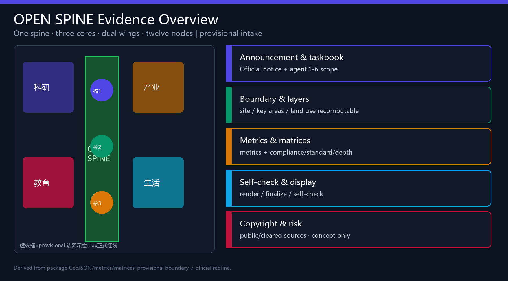
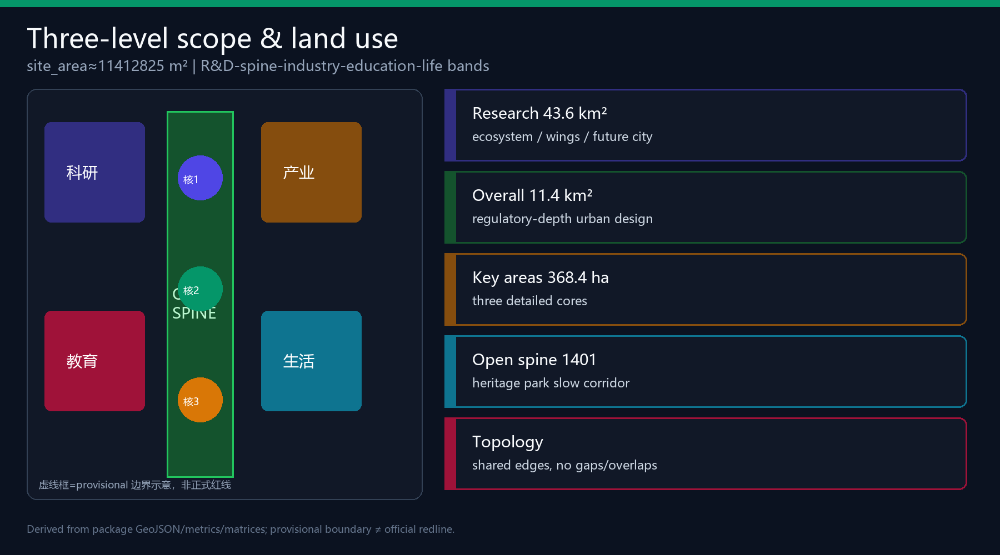
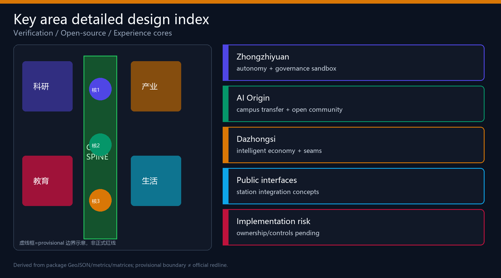
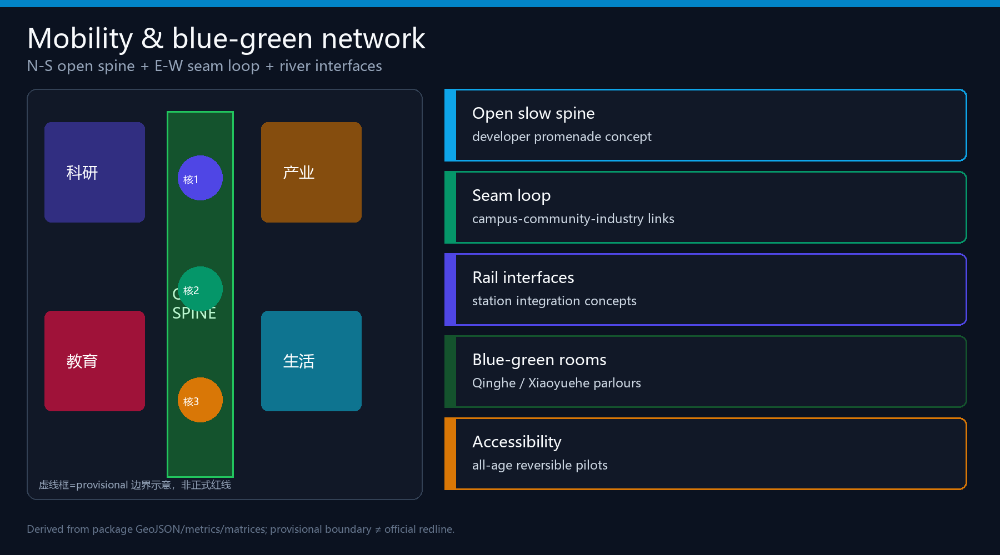
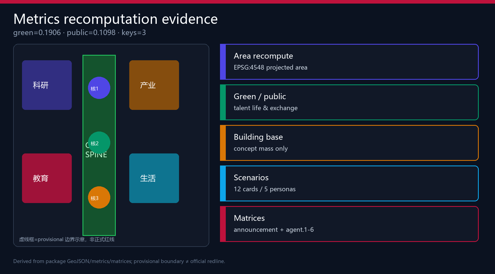

# JingZhang Open Spine · AI Innovation Corridor

## Design Basis and Source List

This formal package is based on the Haidian pre-qualification announcement for the Centennial Jing-Zhang AI Innovation Belt and the machine-readable site package constraints [source:OFFICIAL-ANNOUNCEMENT] [source:SITE-PACKAGE] [source:SOURCE-REGISTRY]. Agent tasks follow the open-call taskbook [source:AGENT-TASKBOOK] [standard:PROJECT-AGENT-OPEN-CALL-TASKBOOK].

Formal claims use only formal-ready or cleared sources. Provisional geometry is for generation, visualisation and intake self-check only, not official redlines or precise area scoring evidence [source:BOUNDARY-SOURCE] [source:KEY-AREA-SOURCE]. Organiser data gaps do not block content scoring but must stay disclosed. The processed fact pack is a navigation layer, not a new authority [source:PROCESSED-FACT-PACK] [depth:existing_conditions_diagnosis].

Submitted `site_boundary` and `key_areas` are provisional_constraint features. After official polygons arrive, land use, buildings, roads, green/public space, phasing and all known metrics must be recomputed [data:geometry/site_boundary.geojson#SITE-001] [metric:site_area_sqm].

## Three-Level Scope Framework

Work is organised in three levels [depth:three_level_scope_framework] [standard:PROJECT-OFFICIAL-ANNOUNCEMENT]: coordinated research (~43.6 km²), overall design (~11.4 km²), and key detailed design (~368.4 ha). Submitted overall design area recalculates to [metric:site_area_sqm]=11412825.386 m² under provisional geometry.

Spatial structure: **one spine, three cores, dual wings, twelve nodes** [depth:overall_spatial_structure] — Open Green Spine; Verification/Open-source/Experience cores; Zhongguancun service wing and Xiaoyuehe scenario wing; twelve scenario anchors.

## Coordinated Research Area: Industry and Future City Research

### Naming and visual identity (agent.1)

- Chinese: 京张智脊
- English: JingZhang Open Spine
- Subtitle: AI Innovation Corridor
- Logo direction: rail-sleeper geometry as an open protocol spine with an OPEN window; deep teal + signal green + indigo. No unauthorised trademarks or likenesses.

Three positionings and five functions follow the taskbook; three-area/two-wing loop moves capability from verification to open-source translation to market experience, with dual wings supplying capital/IP and everyday scenario rollout [source:AGENT-TASKBOOK] [standard:MOHURD-URBAN-DESIGN-MEASURES].

### Global ecosystem cases (agent.2)

Six transferable cases: Kendall Square (campus triangle), King’s Cross (station-city ops), one-north (R&D-life mix), Nanshan (industry-city density), Toranomon Hills (vertical public rooms), Zhangjiang (national platforms). Mechanisms map to Origin, Dazhongsi, Zhongzhiyuan and the service wing [data:geometry/land_use.geojson#LU-001] [depth:overall_spatial_structure].

## Overall Design Area: Urban Renewal and Regulatory-Plan-Level Urban Design

Regulatory-plan urban design depth is addressed as a method and evidence structure, while FAR, height, setbacks and road redlines remain pending without official controls [standard:MOHURD-CONTROL-DETAILED-PLANNING] [depth:development_intensity_controls] [depth:land_use_layout].

Land use is a topology-safe five-band partition: R&D (0802), open spine park (1401), industry services (05), education transfer (0804), community support (0702) [data:geometry/land_use.geojson#LU-001] [data:geometry/land_use.geojson#LU-002]. Renewal priority: public seams first, then industry interfaces, then deep rebuild units after ownership/engineering clarity.

Concept building footprints [data:geometry/buildings.geojson#BLDG-001] [metric:building_footprint_area_sqm]=787181.46 m²; roads express N-S spine, E-W seam loop and station links [data:geometry/roads.geojson#ROAD-001] [depth:traffic_rail_slow_parking].

## Detailed Design of Key Areas

All three KEY_AREA polygons are provisional; conclusions are directional concept suggestions [depth:three_key_area_detailed_design] [data:geometry/key_areas.geojson#PROV-KEY-001].

**Zhongzhiyuan · Verification Core**: garden-type full-stack autonomy and governance sandbox; Qinghe blue-green interface; cautious retain/renovate method without parcel demolition verdicts [depth:retain_renovate_demolish].

**AI Origin · Open-source Core**: campus-adjacent transfer street, open release hall, talent services, station walkability seams.

**Dazhongsi · Experience Core**: four-quadrant station connectivity, intelligent economy rooms, international pitch parlour and data-element interface.

## AI Innovation Ecosystem, Personas, and AI+ Scenarios

Five personas: open-source developers, startups, enterprise visitors, nearby residents, campus users — each with space response and privacy limits [metric:user_persona_count].

Twelve scenario cards (≥10, with ≥3 industry validation tests): open release hall; safety sandbox (**test**); slow-path diagnosis; edge compute stop (**test**); international pitch; campus transfer street; data parlor (**test**); living-service lane; memory trail; global AI week route; agent honor wall; governance forum [metric:ai_scenario_card_count] [data:geometry/public_space.geojson#PUBLIC-001] [data:geometry/roads.geojson#ROAD-001] [metric:public_space_ratio].

## Land Use, Building Scale, and Retain-Renovate-Demolish Strategy

Land-use coverage is complete and non-overlapping [data:geometry/land_use.geojson#LU-001] [standard:MNR-LAND-USE-CLASSIFICATION-GUIDE]. Statutory FAR/height remain unknown [metric:floor_area_ratio] [depth:height_massing_character]. RRD is a method only until ownership and regulatory conditions exist [depth:retain_renovate_demolish]. Building footprints are conceptual discussion quantities only.

## Transport, Rail, Municipal Infrastructure, and Public Services

The transport intent is to convert the heritage park from a corridor cut by roads into an everyday open slow spine, then reconnect campuses, communities and industry edges with an east-west seam loop. `geometry/roads.geojson` expresses the N-S spine, E-W seam and outer loop as concept geometry, not statutory road redlines [data:geometry/roads.geojson#ROAD-001]. Continuity is co-explained with the public-space ratio [metric:public_space_ratio] under the mobility depth item [depth:traffic_rail_slow_parking].

Rail/station integration stays at interface principles: four-quadrant walk pockets around Dazhongsi Station, campus-adjacent transfer buffers near Wudaokou/Tsinghua East Road West Gate, and break-point repair at North Fifth Ring crossings rather than new express cuts. Without official redlines, station control areas and intersection designs, these remain conceptual.

Municipal and new infrastructure ideas—edge compute stops, distributed energy sketches, innovation service desks and talent living services—must be deepened with service radii, fire rescue and power capacity. The public package cannot support utility-grade conclusions yet [depth:municipal_new_infrastructure]. Low-speed delivery and robot pilots are limited to reversible test segments with human takeover paths.

Pending data: official road redlines, rail station controls, parking standards, utility composites, fire and flood conditions. Until then this chapter supports urban-design discussion and scenario placement only.

## Blue-Green Network, Public Space, and Urban Character

Open Green Spine links Qinghe and Xiaoyuehe interfaces for walk/cycle/stay [depth:blue_green_public_space] [data:geometry/green_space.geojson#GREEN-001] [metric:green_ratio]=0.190579. Public-space ratio [metric:public_space_ratio]=0.10981 supports daily exchange and festival routes [data:geometry/public_space.geojson#PUBLIC-001] [standard:MOHURD-URBAN-DESIGN-MEASURES].

Three pilgrimage landmarks (agent.4): Open Protocol Sleeper Gallery; Agent Honor Wall; Verification Beacon Court [metric:ai_pilgrimage_landmark_count]. Character mixes industrial heritage restraint, Zhongguancun openness and explainable AI interfaces [depth:height_massing_character].

## Renewal Projects, Implementation Policy, and Phasing

Eight concept projects (OS-01…OS-08) cover spine seams, verification waterfront, open release hall, transfer street, four-quadrant links, edge compute pilot, honor wall/memory trail, and annual AI week operations [data:geometry/phasing.geojson#PHASE-001] [depth:phasing_implementation] [depth:renewal_project_list] [metric:renewal_project_count].

Long-term operations (agent.6): seasonal open festival, scenario open days, international pitch week and governance forum — conceptual, not government-committed schedules. Cultural narrative (agent.5) braids railway autonomy, Zhongguancun collaboration and explainable AI co-governance along the walkable spine.

## Metrics, Area Recalculation, and Compliance Matrix

Known metrics are recomputed in EPSG:4548 from package geometry [depth:metrics_recalculation]: site [metric:site_area_sqm]=11412825.386; green [metric:green_ratio]=0.190579; public [metric:public_space_ratio]=0.10981; building footprint [metric:building_footprint_area_sqm]=787181.46; key areas [metric:key_area_count]=3; scenarios/personas/landmarks/cases as structured counts. Compliance, standard and design-depth matrices cover announcement tasks 1.3–1.5 and agent.1–agent.6.

## Risk, Copyright, and Compliance

Key risks: provisional geometry precision, missing regulatory/ownership/municipal conditions, heritage unknowns, privacy/event safety [depth:risk_missing_data] [data:geometry/constraints.geojson#CONSTRAINTS]. No official approval claims, no pseudo-precise redlines, no sensitive personal data, no uncleared assets. All spatial, operational and policy ideas are conceptual references for professional deepening. Bilingual counterparts pair HTML/PDF/figures; licenses appear in `sources.json` and `report/copyright_statement.md`.

## References

- brief/public-brief.md, design_brief.json, agent_taskbook.json
- data/source_registry.json, agent_fact_pack.md
- provisional_boundaries.geojson
- formal-submission-guide.md, terminology-glossary.md
- Full machine indexes in `sources.json`, `metrics.json` and the three matrices [source:SITE-PACKAGE]
