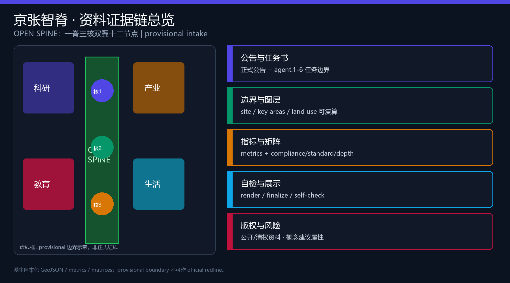
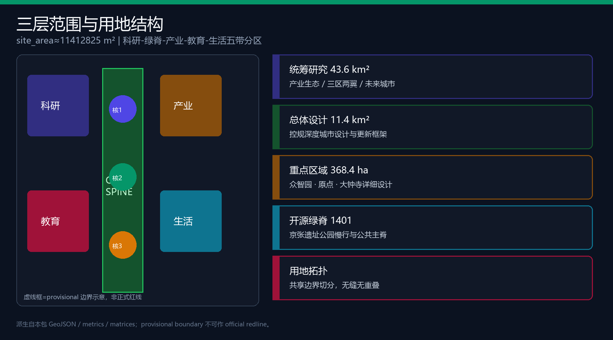
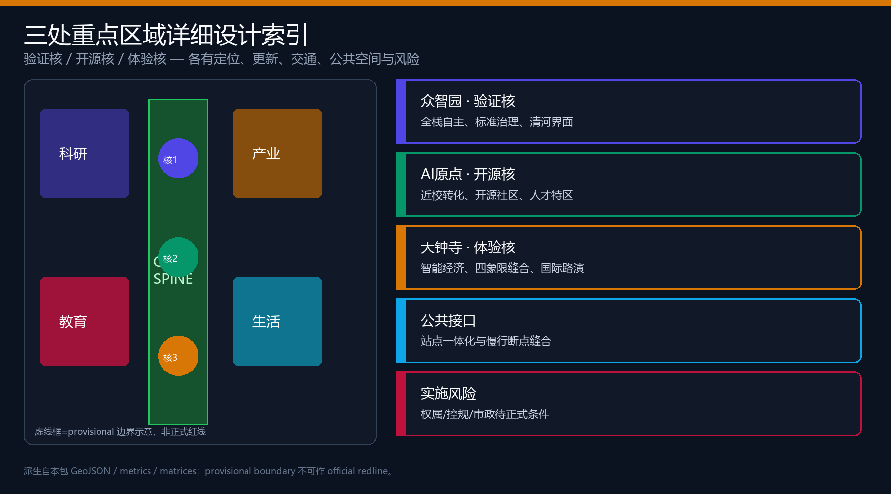
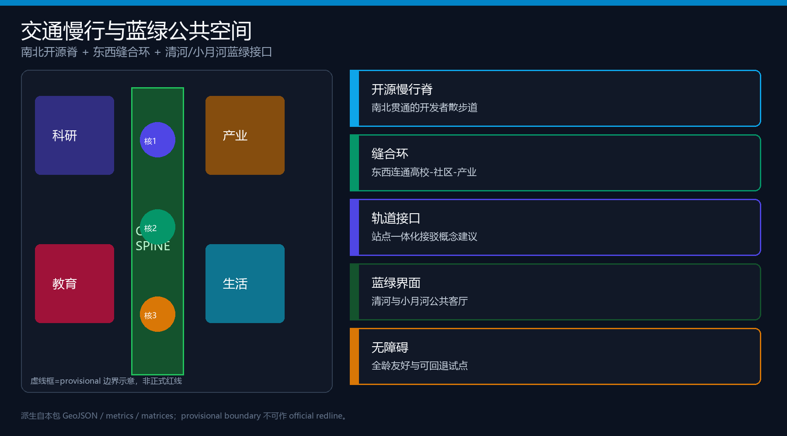
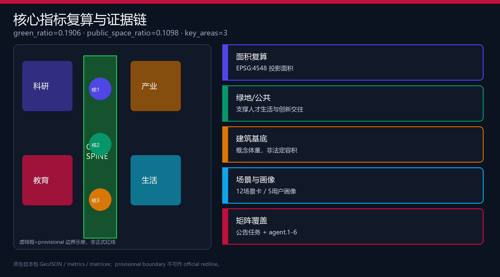

# 京张智脊·AI 创新廊道

## 设计依据与资料清单

本 formal 方案以北京市规划和自然资源委员会海淀分局《百年京张AI创新带城市设计国际方案征集资格预审公告》为第一依据，并以 `brief/site-package/` 中的临时粗略边界、重点区域、枚举、指标、来源清单与 `data/source_registry.json` 为机器可读约束 [source:OFFICIAL-ANNOUNCEMENT]。场地包约束见 [source:SITE-PACKAGE]。资料用途边界另见 [source:SOURCE-REGISTRY]。agent 任务边界来自面向智能体任务书 [source:AGENT-TASKBOOK]，并以 [standard:PROJECT-AGENT-OPEN-CALL-TASKBOOK] 作为本地标准响应。

资料使用边界：formal 结论只引用 usable_for_formal 或已清权资料；provisional 边界仅用于生成、可视化与 intake 自检，不得升级为 official redline、审批依据或精确面积结论 [source:BOUNDARY-SOURCE] [source:KEY-AREA-SOURCE]。组织方数据缺口本身不阻断内容评分，但必须在正文、HTML、sources、assumptions 中持续披露。

阅读导航层 `data/processed/agent_fact_pack.md` 帮助建立任务与缺口清单，但不替代原始公告与登记表 [source:PROCESSED-FACT-PACK]。现状诊断深度项要求把证据链写清楚 [depth:existing_conditions_diagnosis]。

本包 `geometry/site_boundary.geojson` 与 `geometry/key_areas.geojson` 均标注 `provisional_constraint`、`official_boundary=false`。替换 official polygon 后，用地、建筑、道路、绿地、公共空间、分期与全部 known 指标必须重算 [data:geometry/site_boundary.geojson#SITE-001] [metric:site_area_sqm]。

## 三层范围工作框架

方案按三层递进组织工作 [depth:three_level_scope_framework] [standard:PROJECT-OFFICIAL-ANNOUNCEMENT]：

| 层级 | 官方文字面积 | 本包工作目标 | 证据 |
| --- | --- | --- | --- |
| 统筹研究范围 | 约 43.6 km² | 产业生态、三区两翼、全球案例与文化叙事 | compliance_matrix / agent.1-2 |
| 总体设计范围 | 约 11.4 km² | 控规深度城市设计、更新框架、交通市政与风貌 | [data:geometry/site_boundary.geojson#SITE-001] |
| 重点区域范围 | 约 368.4 ha | 三处片区详细设计 | [data:geometry/key_areas.geojson#PROV-KEY-001] |

总体设计范围提交边界面积复算为 [metric:site_area_sqm]=11412825.386 m²（provisional）。总体空间结构为 **一脊三核双翼十二节点** [depth:overall_spatial_structure]：脊=京张开源绿脊；三核=众智园验证核、AI原点开源核、大钟寺体验核；双翼=中关村科技服务翼与小月河场景赋能翼；十二节点=12 张场景卡的空间锚点。

## 统筹研究范围产业与未来城市研究

### 命名与视觉识别（agent.1）

- **中文主名称**：京张智脊
- **英文主名称**：JingZhang Open Spine
- **副标题**：AI 创新廊道
- **命名体系**：脊（Spine）=公共主线；核（Core）=重点片区；翼（Wing）=两侧赋能；节（Node）=场景接口
- **Logo 方向**：纵向铁路轨枕抽象为可开源的“协议脊柱”，中段开窗显示“OPEN”，配色为深青（历史）+ 信号绿（开放）+ 靛蓝（计算）。字体与标识均为原创几何示意，不使用未授权商标或肖像。

三大定位：百年京张文化带、都市AI生活体验带、AI融合创新带。五大功能：AI全栈自主创新体系、世界级AI创新生态、AI+场景赋能新范式、智能化AI活力城市、AI治理全球话语权。三区两翼协同回路：验证核产出标准与底座能力 → 开源核完成近校转化 → 体验核完成产业与消费闭环；科技服务翼注入资本与中关村IP，场景赋能翼把能力送入日常生活 [source:AGENT-TASKBOOK] [standard:MOHURD-URBAN-DESIGN-MEASURES]。

### 全球 AI 创新生态案例（agent.2）

| 案例 | 可转化机制 | 本带落点 |
| --- | --- | --- |
| 1 波士顿 Kendall Square | 高校-医院-实验室步行三角 | 原点社区近校转化街 |
| 2 伦敦 King’s Cross | 站城一体与知识资产运营 | 大钟寺站四象限缝合 |
| 3 新加坡 one-north | 研究园区与生活混合 | 众智园花园型自主街区 |
| 4 深圳南山科技园 | 产城融合与企业服务密度 | 中关村科技服务翼 |
| 5 东京虎之门之丘 | 垂直城市与公共庭 | 大钟寺体验核公共客厅 |
| 6 上海张江科学城 | 国家平台与开放实验室 | 众智园验证核沙盒 |

未来城市形态判断：城市不只“应用AI”，而是预留可回退的测试接口、可审计的公共数据面与可步行的创新日常。所有机制均为概念建议，不构成政府实施承诺 [data:geometry/land_use.geojson#LU-001] [depth:overall_spatial_structure]。

## 总体设计范围城市更新与控规深度城市设计

总体设计达到控制性详细规划的城市设计深度表述要求，但在缺少官方控规条件时，容积率、建筑高度、退线与道路红线一律记为待确认，不得伪装审定 [standard:MOHURD-CONTROL-DETAILED-PLANNING] [depth:development_intensity_controls] [depth:land_use_layout]。

用地按共享边界拓扑切分五带：科研创新（0802）、开源绿脊（1401）、产业服务（05）、教育转化（0804）、生活配套（0702），覆盖提交边界且无重叠 [data:geometry/land_use.geojson#LU-001] [data:geometry/land_use.geojson#LU-002]。更新总体框架采用“先公后产、先缝后填”：优先打通慢行断点与公共接口，再推进产业服务与近校转化界面，最后进入需要权属与工程条件的深层更新。

建筑基底为概念示意 [data:geometry/buildings.geojson#BLDG-001] [metric:building_footprint_area_sqm]=787181.46 m²；建筑密度为概念量 [metric:building_density]，不等于法定控制值。道路与慢行廊道表达南北脊、东西缝合环与站点接驳关系 [data:geometry/roads.geojson#ROAD-001] [depth:traffic_rail_slow_parking]。

## 重点区域详细设计

三处重点区均使用 provisional KEY_AREA，详细结论为方向性概念建议 [depth:three_key_area_detailed_design] [data:geometry/key_areas.geojson#PROV-KEY-001]。

### 众智园AI自主创新加速区 · 验证核

定位：花园型全栈自主创新与安全治理街区。空间动作：强化清河蓝绿界面为“验证水岸”；组织产业展示、标准工作坊与可预约沙盒；对外交通与低碳交往庭院作为公共客厅。拆改留：缺少现状权属时，只给出“保留骨架-改造首层-谨慎新建”的方法，不做地块级结论 [depth:retain_renovate_demolish]。AI场景：安全治理沙盒、端侧算力驿站、治理论坛庭。

### 北京AI原点社区 · 开源核

定位：近校成果转化与开源协作社区。空间动作：缝合校区-园区-街区慢行；设置开源发布厅、成果转化街与人才服务嵌入点；轨道站点一体化接驳为概念建议。风貌：低干扰界面、夜间协作友好、避免过度商业化占用公共地面。AI场景：开源发布厅、近校转化街、生活服务样板街。

### 大钟寺AI产业聚集区 · 体验核

定位：城市型智能经济与国际交往街区。空间动作：大钟寺站四象限步行连通、商业与内容消费界面、企业公共环境更新与数据要素会客厅。公共空间强调可停留、可展示、可回退。AI场景：国际路演客厅、数据要素会客厅、全球AI活动周路线。

| 重点片区 | 定位 | 空间主动作 | 证据 |
| --- | --- | --- | --- |
| 众智园 | 验证核 | 清河界面 + 沙盒 + 低碳庭 | [data:geometry/key_areas.geojson#PROV-KEY-001] |
| AI原点 | 开源核 | 近校缝合 + 发布厅 + 人才服务 | [data:geometry/key_areas.geojson#PROV-KEY-002] |
| 大钟寺 | 体验核 | 四象限连通 + 路演 + 智能经济 | [data:geometry/key_areas.geojson#PROV-KEY-003] |

## AI 创新生态、人才画像与 AI+ 场景

### 五类用户画像（≥5）

| 画像 | 核心需求 | 空间响应 | 隐私边界 |
| --- | --- | --- | --- |
| 开源开发者 | 发布、协作、声誉 | 原点开源发布厅/代码墙 | 仅聚合活动统计 |
| 初创团队 | 低成本试验与算力入口 | 众智园共享测试场 | 算力服务另行授权 |
| 头部企业访客 | 展示、洽谈、招聘 | 大钟寺路演客厅 | 企业标识须清权 |
| 周边居民 | 通勤、休闲、低扰动 | 开源绿脊与社区嵌入 | 不用于商业推荐 |
| 高校师生 | 转化、实习、日常慢行 | 近校转化街与驿站 | 校园数据需授权 |

### 十二张 AI 场景卡（≥10，含≥3 测试验证）

| 编号 | 场景 | 空间 | 类型 | 运营与复核 |
| --- | --- | --- | --- | --- |
| 01 | 开源发布厅 | 原点社区 | 生态 | 社区自治+平台审核 |
| 02 | 安全治理沙盒 | 众智园 | **产业测试验证** | 标准机构+人工红队 |
| 03 | 慢行断点诊断 | 遗址公园脊 | 生活/交通 | 公开数据+现场复核 |
| 04 | 端侧算力驿站 | 总体节点 | **产业测试验证** | 能源/安全双审 |
| 05 | 国际路演客厅 | 大钟寺 | 产业 | 活动许可+内容清权 |
| 06 | 近校成果转化街 | 原点 | 生态 | 法务/知产人工复核 |
| 07 | 数据要素会客厅 | 大钟寺 | **产业测试验证** | 授权清单+审计日志 |
| 08 | 生活服务样板街 | 社区商业交汇 | 生活 | 最小必要数据 |
| 09 | 京张记忆线路 | 一带公共空间 | 文化 | 文保条件待确认 |
| 10 | 全球AI活动周路线 | 一带 | 运营 | 年度可回退编排 |
| 11 | 智能体荣誉墙 | 原点/公园节点 | 朝圣地标 | 贡献公示可更正 |
| 12 | 治理论坛庭 | 众智园 | 治理 | 听证记录公开 |

场景落到公共空间与慢行图层 [data:geometry/public_space.geojson#PUBLIC-001] [data:geometry/roads.geojson#ROAD-001]。公共空间比例与场景卡数量分别由 [metric:public_space_ratio] 与 [metric:ai_scenario_card_count] 复核。

## 用地、建筑规模与拆改留方案

用地完整覆盖提交边界 [data:geometry/land_use.geojson#LU-001] [standard:MNR-LAND-USE-CLASSIFICATION-GUIDE]。建筑规模与 FAR/高度在公开包缺失时 `status=unknown` [metric:floor_area_ratio] [depth:height_massing_character]。拆改留只提供分类方法：优先保留文脉骨架与可复用结构，改造积极界面，新建集中在已明确可更新单元；具体地块结论待权属与控规 [depth:retain_renovate_demolish]。

概念建筑基底 [metric:building_footprint_area_sqm]=787181.46 m²，仅为讨论体量，不等于审批建设规模。

## 交通、轨道、市政与公共服务设施

交通设计意图是把京张遗址公园从“被道路切开的线性公园”转译为可日常使用的开源慢行主脊，并用东西向缝合环把高校、社区与产业界面重新接上。本包 `geometry/roads.geojson` 用南北脊线、东西缝合线与外围环线表达这一概念结构，不宣称道路红线或工程线位 [data:geometry/roads.geojson#ROAD-001]。慢行与公共空间连续度通过公共空间比例共同解释 [metric:public_space_ratio]，专业深度由交通慢行与停车组织项约束 [depth:traffic_rail_slow_parking]。

轨道与站点一体化只提出接口原则：在大钟寺站周边组织四象限步行连通口袋，在五道口/清华东路西口等近校节点预留接驳缓冲与非机动车停放，在北五环跨线点优先识别慢行断点而非新建快速通道。缺少官方道路红线、站点出入口与交叉口渠化资料时，上述内容保持为概念建议，待交通专项条件确认。

市政与新型基础设施同步作为可讨论层：端侧算力驿站、分布式能源示意、创新服务平台与人才生活服务嵌入，应与公共服务半径、消防救援和电力承载一并深化，当前公开包不足以支撑管线级结论 [depth:municipal_new_infrastructure]。低速配送与机器人通行只在慢行环的试验段讨论，必须保留人工接管与可回退路径，避免把测试车道写成法定路权。

数据缺口包括：正式道路红线、轨道站点控制范围、停车配建标准、市政管线综合图、消防与防洪条件。在这些资料到位前，交通市政章节只服务城市设计讨论与场景落位，不进入审批图纸。

## 蓝绿空间、公共空间与城市风貌

蓝绿骨架以京张开源绿脊串联清河与小月河接口，形成可步行、可骑行、可停留的公共主线 [depth:blue_green_public_space] [data:geometry/green_space.geojson#GREEN-001] [metric:green_ratio]=0.190579。公共空间比例 [metric:public_space_ratio]=0.10981，用于支撑日常交往、场景开放与活动周路线 [data:geometry/public_space.geojson#PUBLIC-001] [standard:MOHURD-URBAN-DESIGN-MEASURES]。

### 三处 AI 朝圣地标（agent.4）

1. **开源协议轨枕廊**（绿脊中段）：把铁路轨枕转译为可签名的开源贡献展示廊。  
2. **智能体荣誉墙**（原点社区）：记录入选方案与贡献者 GitHub 名，可更正、可追加。  
3. **验证灯塔庭**（众智园清河界面）：以可理解的运行状态信号展示测试与治理节奏。

风貌基调：工业遗产的克制材料 + 中关村开放协作气质 + AI 可解释界面；禁止娱乐化过度与未清权品牌符号 [depth:height_massing_character]。

## 更新项目清单、实施政策与分期计划

| 编号 | 项目 | 类型 | 分期 | 依赖 |
| --- | --- | --- | --- | --- |
| OS-01 | 开源绿脊慢行断点缝合 | 公共/交通 | 近期 | 道路与桥下条件 |
| OS-02 | 众智园验证水岸 | 蓝绿/产业 | 近期 | 河道蓝线/防洪 |
| OS-03 | 原点开源发布厅 | 更新/运营 | 近期 | 权属与首层业态 |
| OS-04 | 近校成果转化街 | 产业服务 | 中期 | 校区边界与许可 |
| OS-05 | 大钟寺四象限连通 | 轨道/慢行 | 中期 | 站点与交叉口 |
| OS-06 | 端侧算力驿站试点 | 新基建 | 中期 | 能源与安全 |
| OS-07 | 智能体荣誉墙与记忆线路 | 文化 | 近期 | 公共空间许可 |
| OS-08 | 全球AI活动周体系 | 运营 | 长期 | 活动安全与清权 |

分期图层见 [data:geometry/phasing.geojson#PHASE-001]。分期与更新项目深度分别由 [depth:phasing_implementation] 与 [depth:renewal_project_list] 约束，项目数量见 [metric:renewal_project_count]。

### 长期运营（agent.6）

概念建议的年度节奏：春季开源节、夏季场景开放日、秋季国际路演周、冬季治理论坛。开发者社区以“可贡献-可验证-可纪念”为闭环；场景开放采用预约、聚合统计与可回退原则；国际传播以可复核证据包而非口号为主。所有活动安排不是政府已定日程。

### 文化叙事（agent.5）

百年京张提供“自主建造”的历史主线；中关村提供“开放协作”的创新主线；AI 新文化提供“可解释共治”的未来主线。三者在开源绿脊上交汇为可步行叙事：南端体验核看产业与生活，中段开源核看转化与社区，北端验证核看底座与治理。

## 指标体系、面积复算与合规矩阵

核心 known 指标均由本包几何在 EPSG:4548 复算 [depth:metrics_recalculation]：

- 总体边界面积 [metric:site_area_sqm]=11412825.386 m²  
- 绿地比例 [metric:green_ratio]=0.190579  
- 公共空间比例 [metric:public_space_ratio]=0.10981  
- 建筑基底 [metric:building_footprint_area_sqm]=787181.46 m²  
- 重点区数量 [metric:key_area_count]=3  
- 场景卡数量见 [metric:ai_scenario_card_count]；用户画像见 [metric:user_persona_count]；朝圣地标见 [metric:ai_pilgrimage_landmark_count]；全球案例见 [metric:global_ai_ecosystem_case_count]

FAR 等法定管控指标保持 unknown。`compliance_matrix.json` 覆盖公告 1.3、1.4、1.5 与 agent.1-agent.6；`standard_matrix.json` 与 `design_depth_matrix.json` 保存专业标准与深度证据。

## 风险、版权与合规说明

主要风险：provisional 边界精度、控规与权属缺失、市政消防未明、文保条件待确认、活动与数据隐私边界 [depth:risk_missing_data] [source:SITE-PACKAGE]。本方案不声称官方批准、不给出伪精确红线、不采集个人敏感数据、不使用未清权资产。全部空间落地、活动运营与政策机制均为概念建议、参考方案或可供专业团队深化研究。

双语契约：`proposal.en.md` 为完整英文译稿；HTML、PDF 与图件按语言副本配对。图片、字体与工具链许可见 `report/copyright_statement.md` 与 `sources.json`。

## 参考资料

- brief/public-brief.md、brief/site-package/design_brief.json、agent_taskbook.json
- data/source_registry.json、data/processed/agent_fact_pack.md
- brief/site-package/geometry/provisional_boundaries.geojson
- docs/formal-submission-guide.md、docs/terminology-glossary.md
- 完整机器索引见 `sources.json`、`metrics.json` 与三个矩阵文件 [source:SITE-PACKAGE]
