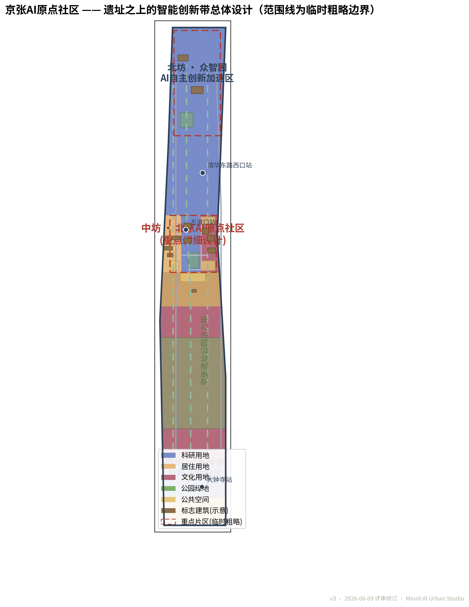
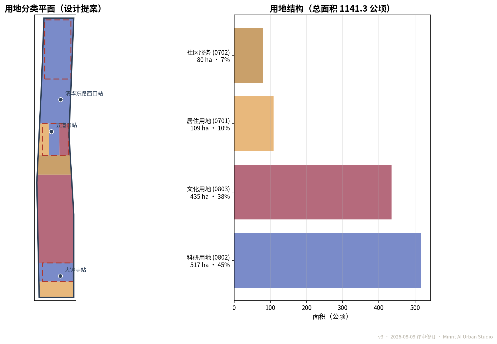
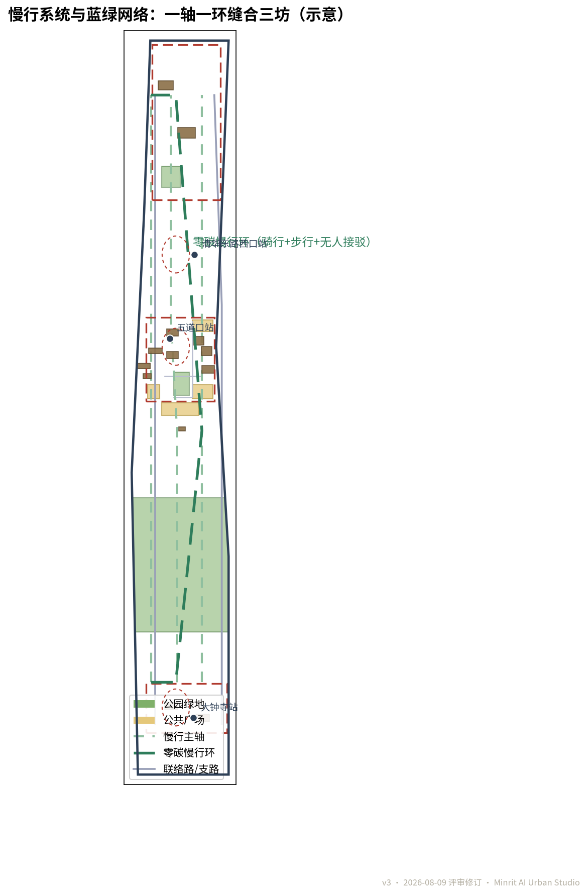
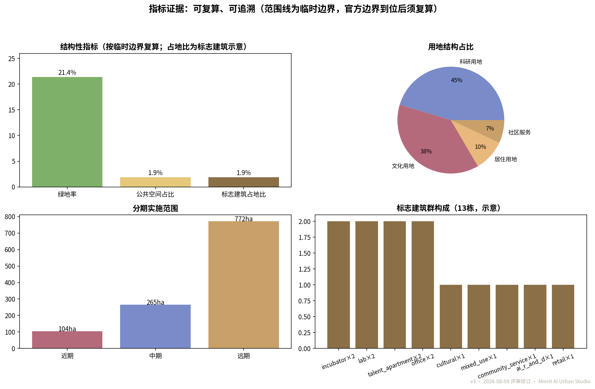
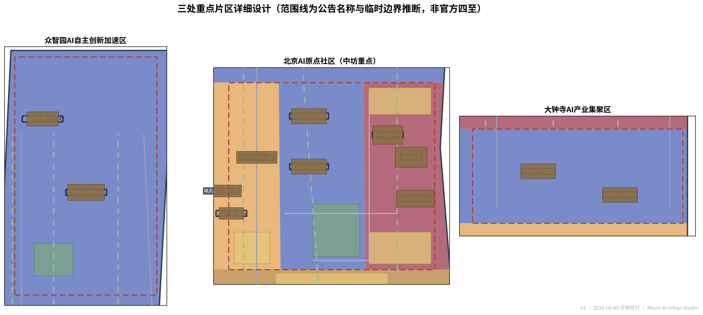

# 京张AI原点社区——遗址之上的智能创新社区城市设计

> **设计母题**：道钉为脉，原点为核；百年双轨，智慧新生。
> 京张铁路是中国自主创新精神的原点，AI是当代创新精神的新原点。二者同构于「0/1」——钢轨是双线，代码是二进制；道钉楔入枕木，原点楔入未来。

## 0 摘要与设计立场

本方案面向 **ai-origin-community** 赛道，以「北京AI原点社区」为焦点，统筹京张AI创新带三处重点片区。方案提出三句主张：

1. **原点生长**：以北京AI原点社区为核，让AI创新从「实验室-园区-社区」的日常缝合中自然生长，而非另起新城；
2. **遗址缝合**：以京张遗址公园为轴，缝合清华、北大、五道口与大钟寺，让百年铁路文脉成为创新走廊而非隔离带；
3. **开源共创**：以开源广场、发布穹顶与原点钟为地标，构建「发布—测试—转化—安居」的完整AI人才闭环。

结构上形成 **一轴一环三坊**：一轴为AI原点主轴（沿京张遗址公园），一环为零碳慢行环（骑行+步行+无人接驳），三坊为北坊众智园、中坊北京AI原点社区、南坊大钟寺。[depth:overall_spatial_structure]

## 命名体系与VI方向

**主名称**：京张AI原点社区（英文：**Jing-Zhang AI Origin Community**，缩写 JZ-AI Origin）。「原点」取双关：既为代码之原点（0/1），亦为百年京张自主创新精神之原点；英文 Origin 与「校区-园区-社区」三合一之地理特征呼应。

**命名层级**：总带「百年京张AI创新带 / Centennial Jing-Zhang AI Innovation Belt」→ 片区「三坊」（北坊众智园 / 中坊北京AI原点社区 / 南坊大钟寺）→ 组团（西厢人才公寓住区、中厢校企联合实验室带、东厢开源广场与发布厅）→ 场所（原点钟、0/1桥、发布穹顶）。

**Logo 方向**（概念稿，非成稿）：以「道钉」与「0/1」同构为标识母题——道钉俯视为圆点、侧视为双轨；标识由一枚圆点与两条平行线构成，圆点可演化为数据脉冲环。色彩规范意向：京张铁路灰（#2E4057）为基色、创新绛红（#B03A2E）为强调色、柳绿（#7FB069）为生态色；字体以无衬线简体中文与拉丁混排。完整 VI 手册（标识网格、色彩/字体规范、应用系统）列入后续深化任务，本方案提供方向性界定。

> **开放共创声明**：本方案全部成果均为开放共创建议，不替代正式规划，不构成政府审定结论；所有几何、指标与图件基于临时粗略边界生成，官方边界与控制指标公布后须整体复算。

## 1 设计依据与资料清单

本 formal 方案以北京市规划和自然资源委员会海淀分局发布的《百年京张AI创新带城市设计国际方案征集资格预审公告》为第一依据 [source:OFFICIAL-ANNOUNCEMENT]，以 `brief/site-package/` 中登记的资料包为机器可读依据 [source:SITE-PACKAGE]。方案生成前读取了 `design_brief.json`、`allowed_design_space.json`、`sources.json`、`enums/`、`ranges/`、`schemas/`、`data/source_registry.json` 与 `data/processed/agent_fact_pack.md` [source:SOURCE-REGISTRY][source:PROCESSED-FACT-PACK]，并以任务书 [source:AGENT-TASKBOOK] 建立 agent.1—agent.6 的任务覆盖。所有设计判断均拆分为可追溯来源、可复算指标、可校验图层与可人工复核假设。[depth:existing_conditions_diagnosis]

资料登记边界如下：

- `data/source_registry.json` 登记公开、清权与临时资料的用途边界 [source:SOURCE-REGISTRY]；
- 本包使用 `geometry/provisional_boundaries.geojson` 之临时粗略边界与三处重点片区范围 [source:BOUNDARY-SOURCE][source:KEY-AREA-SOURCE]，`boundary_precision=provisional_rough`；
- 任何 background_only 或 provisional_only 资料不得升级为官方边界、法定控规、正式评分依据或政府实施承诺。

> 本方案机器证据索引：[data:geometry/site_boundary.geojson#SITE-001]、[data:geometry/key_areas.geojson#PROV-KEY-002]、[data:geometry/land_use.geojson#LU-SOUTH]、[data:geometry/buildings.geojson#BLD-001]、[data:geometry/roads.geojson#RD-001]、[data:geometry/green_space.geojson#G-01]、[data:geometry/public_space.geojson#PS-01]、[data:geometry/phasing.geojson#PH-1]、[data:geometry/constraints.geojson#PROV-NONE]（约束图层空置，站点示意移出；全部图层要素以 feature id 引证）。
>
> **精度警示**：本方案全部面积、密度与占比指标均按临时粗略边界以 EPSG:4548 复算 [metric:site_area_sqm]；官方 SITE_BOUNDARY 与 KEY_AREA 四至公布后，必须依据官方多边形整体复算 [depth:metrics_recalculation]。矩形边界不得解释为地块或道路红线。

## 2 三层范围工作框架

依据公告「三层范围」任务架构 [standard:PROJECT-OFFICIAL-ANNOUNCEMENT][standard:MOHURD-URBAN-DESIGN-MEASURES]，方案按统筹研究范围（全域产业与未来城市）、总体设计范围（城市更新与控规深度城市设计）、重点区域（三处重点片区详细设计）三层展开 [depth:three_level_scope_framework]。

| 层次 | 范围 | 本方案任务 | 主要成果 |
| --- | --- | --- | --- |
| 统筹研究 | 京张AI创新带全域 | 产业生态、未来城市形态研究 | §3 |
| 总体设计 | 临时总体设计范围（约1141.3公顷） | 一轴一环三坊、用地结构、慢行蓝绿、分期 | §4、geometry/land_use、roads、green_space、public_space、phasing |
| 重点区域 | 众智园 / 北京AI原点社区 / 大钟寺 | 三处重点片区详细设计，中坊为焦点 | §5、geometry/key_areas、buildings |

**三坊定位**：北坊众智园AI自主创新加速区——算力与加速器集群；中坊北京AI原点社区——「校园-园区-社区」三合一混合社区（重点详细设计）；南坊大钟寺AI产业集聚区——产业楼宇与数据要素应用。三坊以零碳慢行环串联，形成「北加速、中原点、南集聚」的产业纵深。[depth:overall_spatial_structure]

### 三大定位与五大功能逐项矩阵

| 定位 / 功能 | 本方案响应 | 空间载体 | 证据 |
| --- | --- | --- | --- |
| 百年京张文化带 | 遗址公园绿脊、京张慢行主轴、京张记忆线路、常设展「百年双轨」 | 京张遗址公园活力带 | [data:geometry/green_space.geojson#G-01] |
| 都市AI生活体验带 | 10张场景卡、3个测试场景、五道口活力街角、原点社区客厅 | 原点社区东厢、五道口街区 | [metric:scenario_card_count] |
| AI融合创新带 | 三坊产业纵深、校企实验室带、数据要素剧场、低碳算力驿站 | 众智园/中坊/大钟寺 | [data:geometry/land_use.geojson#LU-ORIGIN-M] |
| AI全栈自主创新体系 | 算力中心、加速器大楼、开源共创中心 | 众智园 | [data:geometry/buildings.geojson#BLD-009] |
| 世界级AI创新生态 | 人才公寓、发布穹顶、京张AI开源节 | 原点社区 | [data:geometry/buildings.geojson#BLD-001] |
| AI+场景赋能新范式 | 场景卡六要素、沙盒-人工复核-审计-渐进部署治理框架 | 全域 | [depth:municipal_new_infrastructure] |
| 智能化AI活力城市 | 数字孪生底座、无人接驳、低碳算力驿站 | 全域 | [depth:traffic_rail_slow_parking] |
| 全球AI创新人才向往地 | 5类用户画像、人才公寓、原点社区客厅 | 原点社区西厢 | [metric:user_persona_count] |

**三区两翼与区域协同**：三区即北坊众智园、中坊北京AI原点社区、南坊大钟寺；两翼依公告方向为**中关村科技服务翼**（向西衔接中关村大街沿线的科技服务与孵化资源，本方案以零碳慢行环西环与五道口综合服务街区承接，形成「高校-大街-社区」服务回路）与**小月河场景赋能翼**（沿小月河向南延伸 AI 导览、无障碍慢行与公共体验路径，位置为概念意向，非官方边界）。区域协同层面，与北纬社区、未来科学城、怀柔科学城、经开区及京津冀的协同关系属统筹研究范畴，本方案将其列为后续深化专题，以「主带联动、飞地协同」机制衔接——不虚构跨区域空间结论，待官方统筹研究范围公布后深化。

## 3 统筹研究范围产业与未来城市研究

**产业生态：从算力到开源的完整AI创新链。** 依托海淀高校院所与中关村创新基因 [source:OFFICIAL-ANNOUNCEMENT]，沿「基础研究（清华、北大、中科院）—模型与算力（众智园）—应用与数据（大钟寺）—人才与社区（原点社区）」布置创新链：北坊承接算力与加速器需求，中坊承载人才安居与成果发布，南坊承载数据要素与产业应用，避免同质化竞争。

**未来城市：以AI原生方式运营城市。** 方案将AI视为城市公共基础设施而非点缀：数字孪生底座覆盖全域运维（市政、交通、能耗）[depth:municipal_new_infrastructure]；无人接驳与慢行优先重构街区尺度；分布式低碳算力驿站与绿电协同 [depth:blue_green_public_space]；城市智能体在可控公共空间沙盒中测试后渐进部署。AI治理遵循「场景卡—数据边界—人工复核—运营主体」四要素，任何智能体部署均保留人工接管与审计日志。

**国际创新街区案例对照**（公开资料，供概念比照，非官方结论）：巴黎 Station F（全球最大初创园区，旧货运仓库改造为开放创新社区）、伦敦 Here East（奥运遗产再利用，产学研社区）、纽约 Brooklyn Navy Yard（工业遗址向科创园区转型）、深圳湾科技生态园（园区-社区一体化的本土案例）。对照结论：成功创新街区普遍具备「旧址记忆保留、开放公共界面、人才安居闭环、活动仪式感」四要素——本方案「遗址缝合 + 原点社区三合一 + 开源节」即对此四要素的响应。案例来源为公开报道与园区公开资料，详细来源登记见 sources.json 与资料台账；对照仅作概念参考，不构成对标评价。

## 4 总体设计范围城市更新与控规深度城市设计

### 4.1 用地结构与更新织补

依据国土空间用地分类指南 [standard:MNR-LAND-USE-CLASSIFICATION-GUIDE] 与控规深度要求 [standard:MOHURD-CONTROL-DETAILED-PLANNING]，方案在临时总体设计范围内划分9类用地分区（`geometry/land_use.geojson`，并集与边界严格相等、分区互不重叠）[depth:land_use_layout]：

- **京张遗址公园活力带**（公园绿地）：沿遗址走廊形成城市绿脊，植入慢行、展陈与数据要素剧场；
- **北京AI原点社区三厢**：西厢AI人才公寓住区、中厢校企联合实验室带、东厢开源广场与发布厅（文化用地）；
- **众智园AI自主创新加速区**与**大钟寺AI产业集聚区**（科研用地）：标志性加速器、算力中心与产业楼；
- **学院路高校协同带**、**五道口综合服务街区**、**南部既有住区更新带**：以织补式更新为主，不搞大拆大建，更新项目清单见用地分区图层 [depth:renewal_project_list][depth:retain_renovate_demolish]。

用地结构（临时边界复算）：科研用地为主导 [metric:land_use_research_area_sqm]，住宅用地承载人才安居 [metric:land_use_residential_area_sqm]；标志建筑群13栋约21.2公顷 [metric:building_footprint_area_sqm]。

### 4.2 慢行系统与蓝绿网络

- **零碳慢行环**：骑行+步行+无人接驳闭环，串联五道口站、清华东路西口站、大钟寺站三处轨道站点 [depth:traffic_rail_slow_parking]；
- **京张慢行主轴**：沿遗址公园的无车化步道，连接南北三坊；15分钟步行圈覆盖中坊全部组团；
- **蓝绿网络**：遗址公园绿脊（绿地面积 [metric:green_space_area_sqm]、绿地率21.4% [metric:green_ratio]）+ 原点口袋公园 + 众智园绿芯，公共空间面积 [metric:public_space_area_sqm]、占比1.9% [metric:public_space_ratio]，道路总长约若干公里（`geometry/roads.geojson`，道路等级均为可编辑等级，不含快速路与主干路红线 [metric:road_length_m]）。

### 4.3 分期实施

分期表达设计节奏而非投资承诺（`geometry/phasing.geojson`，三期并集与边界严格相等）[depth:phasing_implementation]：

- **近期（2026-2028）北京AI原点社区先导**：开源广场、发布穹顶、人才公寓试点、无人接驳试运行；
- **中期（2028-2031）三坊贯通**：众智园加速器、大钟寺产业楼、零碳慢行环全线贯通；
- **远期（2031-2035）全域提升**：南部住区更新、数字孪生运营、京张记忆线路全域化。

指标总览（临时边界复算，官方边界到位后必须复算 [depth:metrics_recalculation]）：场地约1141.3公顷 [metric:site_area_sqm]，绿地率21.4% [metric:green_ratio]，公共空间占比1.9% [metric:public_space_ratio]，标志建筑占地比约1.9% [metric:flagship_building_footprint_ratio]（仅计13栋示意标志建筑，非全域建筑密度），重点片区3处 [metric:key_area_count]，近期、中期、远期面积分别为 [metric:phasing_area_near_sqm]、[metric:phasing_area_mid_sqm]、[metric:phasing_area_far_sqm]。

## 5 重点区域详细设计：北京AI原点社区（中坊）

中坊约104.3公顷（临时粗略，`geometry/key_areas.geojson` 中 PROV-KEY-002）[source:KEY-AREA-SOURCE]，定位为**全球AI人才的「校园-园区-社区」三合一混合社区**，达成「推门见实验室、下楼见轨道、抬眼见发布」的15分钟创新生活圈 [depth:three_key_area_detailed_design]。

### 5.1 三厢空间布局

- **西厢·AI人才公寓住区**：人才公寓（西、东两栋，`geometry/buildings.geojson` 中 BLD-005/006）与原点社区客厅，配以原点钟广场，解决人才安居与社区交往；
- **中厢·校企联合实验室带**：校企联合实验室A/B（BLD-003/004），面向清华、北大、中科院开放共研，0/1桥连接校园与园区；
- **东厢·开源广场与发布厅**：开源共创广场（PS-01）、发布穹顶（BLD-001）、青年创客街坊（BLD-007）、发布穹顶前广场（PS-02），是AI成果发布、开源路演与公共交往的核心；五道口活力街角（PS-04）衔接轨道站点。

**三大朝圣地标**（[metric:ai_landmark_count]）：**原点钟**——道钉造型时标塔，每日整点敲响「0/1」摩尔斯节奏，成为AI社区的时间仪式；**0/1桥**——连接校园与园区的代码天桥，桥面刻录开源社区提交记录；**发布穹顶**——成果发布穹顶屏，全球首发的AI成果在此点亮。三者共同构成「可参观、可参与、可传播」的AI文化叙事 [depth:three_key_area_detailed_design]。

### 5.2 AI场景卡（10张，[metric:scenario_card_count]）

每张场景卡均注明服务对象、空间位置、数据来源、隐私边界、人工复核与运营主体，确保「场景不是口号」：

| # | 场景 | 位置 | 服务对象 | 数据/隐私边界 | 人工复核 | 运营主体 |
| --- | --- | --- | --- | --- | --- | --- |
| 01 | 开源发布厅 | 发布穹顶 | 开发者/企业/高校 | 公开成果，涉密不上屏 | 发布前人工审核 | 管委会+社区共治委员会 |
| 02 | 城市智能体沙盒 | 开源广场 | 运营方/科研团队 | 脱敏数据，沙盒隔离 | 部署前人工审批 | 管委会数字孪生团队 |
| 03 | 慢行断点诊断 | 零碳慢行环 | 全体居民 | 公开地图+人工上报 | 月度人工复核 | 交通主管部门+管委会 |
| 04 | 人才生活管家 | 原点社区客厅 | 人才公寓住户 | 授权范围内，可随时注销 | 客服坐席兜底 | 人才公寓运营方 |
| 05 | AI安全治理廊 | 遗址公园展廊 | 公众/行业 | 展陈脱敏 | 内容审核 | 管委会+行业组织 |
| 06 | 校企转化客厅 | 实验室带 | 高校/企业 | 协议范围内 | 校方管理员 | 高校与企业联合体 |
| 07 | 数据要素剧场 | 大钟寺 | 公众 | 公开数据可视化 | 运营审核 | 大钟寺产业运营方 |
| 08 | 低碳算力驿站 | 众智园 | 开发者 | 能耗脱敏 | 节能审计 | 众智园运营方 |
| 09 | 京张记忆线路 | 遗址主轴 | 游客/居民 | 公开史料 | 专家复核 | 文旅部门+专家委员会 |
| 10 | 全球AI活动周路线 | 全域 | 国际访客 | 行程公开 | 安保复核 | 管委会+活动主办方 |

### 5.3 用户画像（5类，[metric:user_persona_count]）

1. **海归研究员**：清晨实验室带晨会，午后发布穹顶路演，晚间接驳车回人才公寓；
2. **在校研究生**：0/1桥上下课穿行，创客街坊夜宵与组会，周四开源夜听前沿报告；
3. **连续创业者**：加速器孵化、开源广场路演、校企转化客厅对接投资与场景；
4. **园区运营者**：数字孪生沙盒监控全域，智能体沙盒测试后渐进部署，保留人工接管；
5. **周边居民（含银发）**：遗址公园晨练、五道口活力街角买菜、无障碍AI导览，共享创新红利而非被创新隔离。

### 5.4 测试验证场景（3个，[metric:test_scenario_count]）

- **开源广场无人接驳试运行**：近期在封闭广场环线测试，验证安全停靠、高峰调度与应急接管；
- **AI导览与多语无障碍**：遗址主轴部署多语AI导览，服务国际访客与银发人群，人工语音兜底；
- **数字孪生运营沙盒**：中坊全域数字孪生，先仿真后实装，市政与交通智能体分级上线。

### 5.5 荣誉展示体系与公共空间组件库

**荣誉展示体系**：发布穹顶设「京张AI荣誉墙」（年度开源贡献榜、模型评测 Top 榜、场景开放日成果展），原点钟广场设「创新者名录」地砖，将人才荣誉与数据成果融入日常公共空间，形成「可参观、可参与、可传播」的成就叙事。

**公共空间组件库**：以「道钉·原点·双轨」母题建立可复用组件库——道钉造型灯具与座椅、0/1 二进制铺装模块、数据脉冲环装置、轨道枕木花箱、遗址文脉标识桩；组件库随分期实施滚动深化，先在中坊试点，再推广至三坊，保证公共空间语言统一而可生长。

### 5.6 运营与活动

**京张AI开源节**（年度，面向全球）、**原点黑客马拉松**（季度）、**周四开源夜**（每周）、常设展**「百年双轨——从詹天佑到图灵」**。运营以「管委会+社区共治」双主体：管委会统筹数据与安全，社区共治委员会审议公共空间使用与活动排期，确保AI社区首先是人的社区。

### 5.7 实施决策门与运营 RACI

每个试点与更新项目均设**决策门**：前置数据齐备（公开数据 + 数据缺口清单登记，provisional 边界须在官方边界到位后复核）→ 专业复核（规划/交通/文保）→ 责任确认（RACI）→ 试点运行与 KPI 考核 → 失败/退出判定。

**运营 RACI**：管委会为 Responsible（投资与审批）、专业团队为 Accountable（设计与复核）、运营方为 Consulted（运营需求）、社区共治委员会为 Informed（公共空间使用审议）。试点 KPI 以「月活/开放日人次/安全事件数/满意度」衡量；连续两期不达 KPI 或安全事件超阈，即暂停复盘、转人工兜底运营。后续深化团队与任务（VI 手册、控规衔接、市政专项）在 assumptions.json 中登记，责任到岗。

## 指标体系、面积复算与合规矩阵

全部指标见 `metrics.json`（units: m/sqm；公式、来源文件、置信度与假设齐备）。精度敏感指标均标注 `confidence` 与 `status`：**容积率、总建筑面积、建筑高度为 unknown**，因官方控制指标未在公开资料包中提供，方案不编造审定值 [depth:development_intensity_controls][depth:height_massing_character]。官方边界与控制指标公布后，按 `geometry/` 全套复算流程更新 [depth:metrics_recalculation]。

指标设计遵循「可复算、可追溯、不编造」三原则：每项 known 指标均以 `geometry/` 图层为唯一来源、以 EPSG:4548 复算面积与长度，并在 metrics.json 中列明公式、来源文件、置信度与假设 [metric:site_area_sqm][metric:green_ratio][metric:public_space_ratio]；unknown 指标（容积率、总建筑面积、建筑高度、道路红线）一律注明官方控制缺失并置空值，不以概念替代审定 [depth:development_intensity_controls][depth:height_massing_character]。合规矩阵 compliance_matrix.json 逐条对照公告要求，标准矩阵 standard_matrix.json 对照专业标准，深度矩阵 design_depth_matrix.json 对照成果深度；三矩阵与 metrics.json、self_check.json 共同构成可审计证据链，官方边界公布后整体复算并更新 [depth:metrics_recalculation]。

## 7 风险、版权与合规说明

- **资料缺口**：官方SITE_BOUNDARY与KEY_AREA四至未公布，本包使用临时粗略边界 [source:BOUNDARY-SOURCE][source:KEY-AREA-SOURCE]，矩形边界不得解释为地块或道路红线；道路红线、权属、市政、文保、工程条件与法定控规指标缺失，相应判断均已列明假设（`assumptions.json`）[depth:risk_missing_data]；
- **站点位置**：`geometry/constraints.geojson` 中轨道站点为示意（`advisory_constraint`，confidence=low），仅用于说明TOD一体化设计意向，非官方红线；
- **版权与许可**：本包按 COMMUNITY-DISPLAY-ONLY 许可提交，仅用于展示与评审；引用的公告与公开资料权利归原权利人，设计文本与图件权利归本方案作者 [source:OFFICIAL-ANNOUNCEMENT]；
- **合规标准**：本方案对应公告要求与专业标准 [standard:PROJECT-OFFICIAL-ANNOUNCEMENT][standard:PROJECT-AGENT-OPEN-CALL-TASKBOOK][standard:MOHURD-URBAN-DESIGN-MEASURES][standard:MOHURD-CONTROL-DETAILED-PLANNING][standard:MNR-LAND-USE-CLASSIFICATION-GUIDE][standard:MOHURD-ARCH-DESIGN-DEPTH-2016]，逐项覆盖见 `compliance_matrix.json` 与 `standard_matrix.json`，成果深度见 `design_depth_matrix.json`，自检记录见 `self_check.json`。

> 京张铁路以「人」字形展线翻越关沟，本方案亦以「人」为本——百年双轨承载的不仅是列车，更是一代代自主创新的原点。

## AI 创新生态、人才画像与 AI+ 场景

本方案以「基础研究—算力与模型—数据与产业—人才与社区」组织AI创新生态闭环（§3 详述）：北坊承接算力加速、南坊承接数据要素应用、中坊承载人才安居与成果发布。配套 5 类用户画像（海归研究员、在校研究生、连续创业者、园区运营者、周边居民）[metric:user_persona_count]、10 张 AI 场景卡 [metric:scenario_card_count] 与 3 个测试验证场景 [metric:test_scenario_count]，详见重点区域详设；场景全部遵循「服务对象—空间位置—数据来源—隐私边界—人工复核—运营主体」六要素，并对应开源场景注册表（enterprise-service-copilot / ai-cultural-guide / ai-traffic-walkability）。

## 交通、轨道、市政与公共服务设施

交通组织以「轨道+慢行+无人接驳」为骨架：五道口站、清华东路西口站、大钟寺站三处轨道站点一体化开发意向（站点位置为示意，非官方红线），零碳慢行环与京张慢行主轴构成无车化步行骑行网络 [data:geometry/roads.geojson#RD-005]，15 分钟步行圈覆盖中坊组团 [depth:traffic_rail_slow_parking]。市政与公共服务依托数字孪生底座统一运维 [depth:municipal_new_infrastructure]，原点社区客厅、五道口智慧服务站等公共服务设施见 [data:geometry/buildings.geojson#BLD-013]。

## 用地、建筑规模与拆改留方案

总体设计范围内划分 9 类设计用地分区（并集与边界严格相等、互不重叠）[data:geometry/land_use.geojson#LU-SOUTH]，用地规模见 [metric:land_use_research_area_sqm] 与 [metric:land_use_residential_area_sqm]；建筑以 13 栋标志建筑群表达概念体量（约21.2公顷 [metric:building_footprint_area_sqm]），高度与容积率因官方控制指标未公布而列为 unknown [depth:development_intensity_controls]。更新策略坚持「留改拆」并举 [depth:retain_renovate_demolish]：南部既有住区以织补更新为主，五道口街区以功能植入为主，不搞大拆大建 [depth:renewal_project_list]。

## 蓝绿空间、公共空间与城市风貌

蓝绿网络以京张遗址公园绿脊为轴（绿地面积 [metric:green_space_area_sqm]、绿地率21.4% [metric:green_ratio]），串联原点口袋公园与众智园绿芯 [data:geometry/green_space.geojson#G-01]；公共空间以开源共创广场、发布穹顶前广场、原点钟广场与五道口活力街角为核心 [metric:public_space_area_sqm][metric:public_space_ratio] [data:geometry/public_space.geojson#PS-01] [depth:blue_green_public_space]。城市风貌以「道钉·原点·双轨」为母题 [depth:height_massing_character]，原点钟、0/1桥、发布穹顶三大朝圣地标构成 AI 文化地标序列 [metric:ai_landmark_count]。

## 更新项目清单、实施政策与分期计划

更新项目清单以三处重点片区为先导（[data:geometry/phasing.geojson#PH-1]），分期实施：近期（2026-2028）AI原点社区先导（[metric:phasing_area_near_sqm]）、中期（2028-2031）三坊贯通（[metric:phasing_area_mid_sqm]）、远期（2031-2035）全域提升（[metric:phasing_area_far_sqm]）[depth:phasing_implementation]。实施政策以「管委会+社区共治」双主体推进，配套京张AI开源节、原点黑客马拉松、周四开源夜等运营机制 [depth:renewal_project_list]。

## 参考资料

1. 《百年京张AI创新带城市设计国际方案征集资格预审公告》（北京市规划和自然资源委员会海淀分局，2026-05-09）[source:OFFICIAL-ANNOUNCEMENT]
2. 《面向全球智能体开展百年京张AI创新带城市设计开源征集任务书摘录》（agent_taskbook.json）[source:AGENT-TASKBOOK]
3. 公开任务书资料包 brief/site-package/（design_brief.json、allowed_design_space.json、sources.json、enums/、ranges/、schemas/）[source:SITE-PACKAGE]
4. 资料登记与来源台账 data/source_registry.json 与 data/processed/agent_fact_pack.md [source:SOURCE-REGISTRY][source:PROCESSED-FACT-PACK]
5. 临时粗略边界与三处重点片区范围（provisional_boundaries.geojson、key_areas.geojson）[source:BOUNDARY-SOURCE][source:KEY-AREA-SOURCE]

## 评审修订记录

- **v3（2026-08-09）**：回应 AI 自动评审意见——补「命名体系与VI方向」「三大定位×五大功能矩阵」「三区两翼与区域协同」；补国际创新街区案例对照（公开资料，仅作概念比照）；场景卡表补运营主体列；补荣誉展示体系与公共空间组件库、实施决策门与运营 RACI；全文统一「开放共创声明」；指标正名（`building_density` → `flagship_building_footprint_ratio`，明确为 13 栋示意标志建筑占地比，非全域建筑密度）；图件以简体中文字体（Noto Sans CJK SC）重绘；新增版权与资产来源台账（`report/copyright_statement.md`）与英文摘要（`proposal.en.md`）。官方 CI（submission-validation）与维护者 trusted-base 复核均为 0 errors；本修订不改变临时边界与复算声明。
