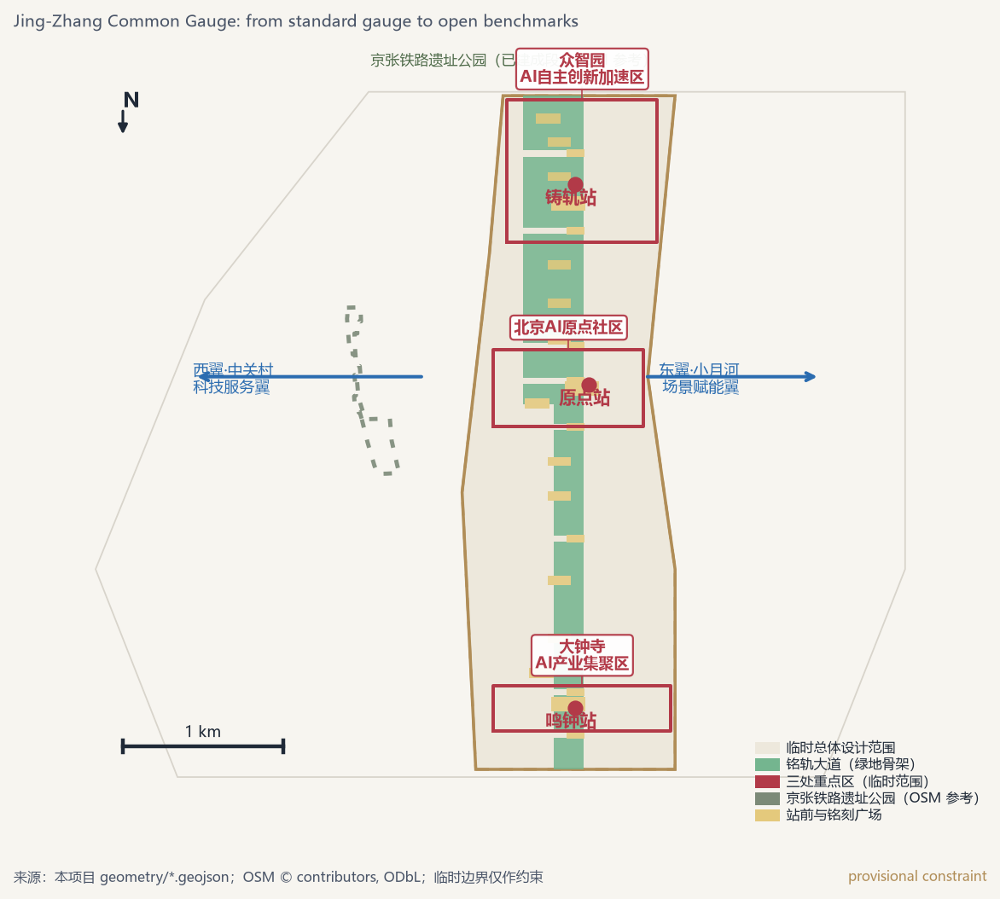
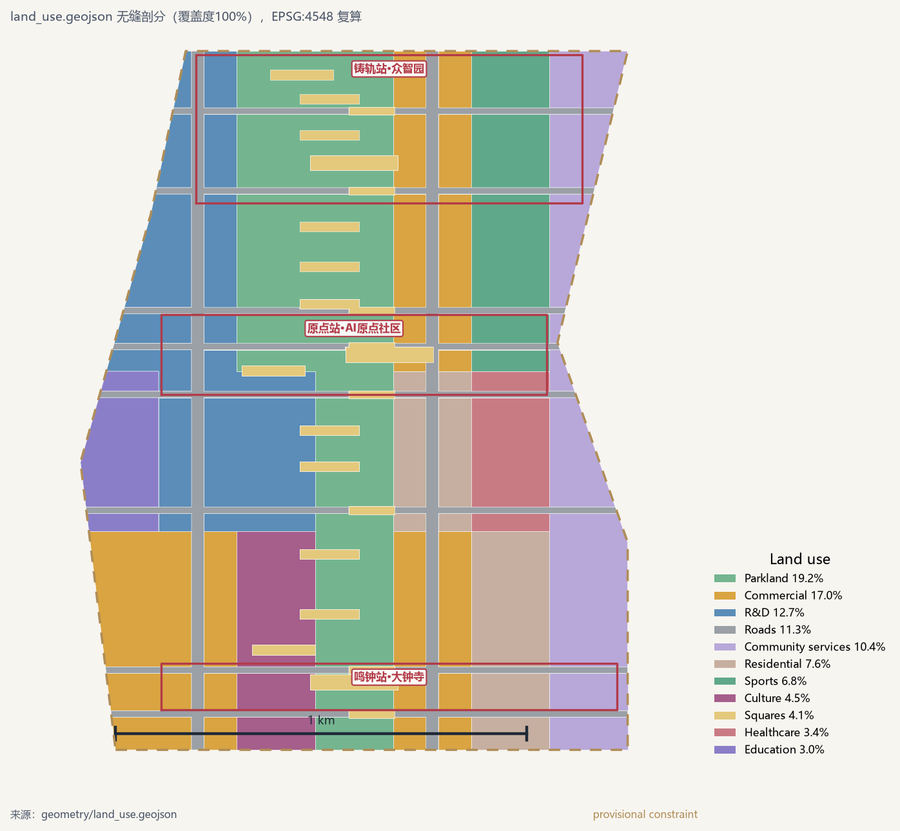
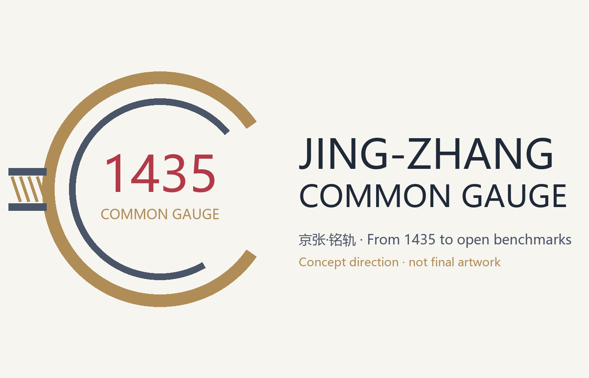
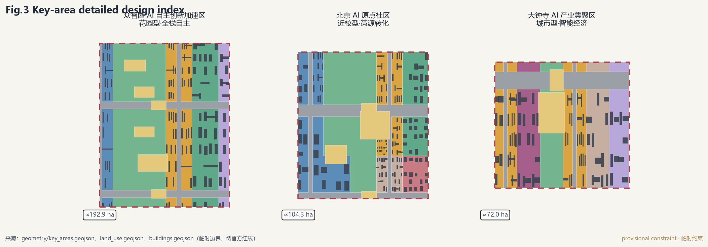
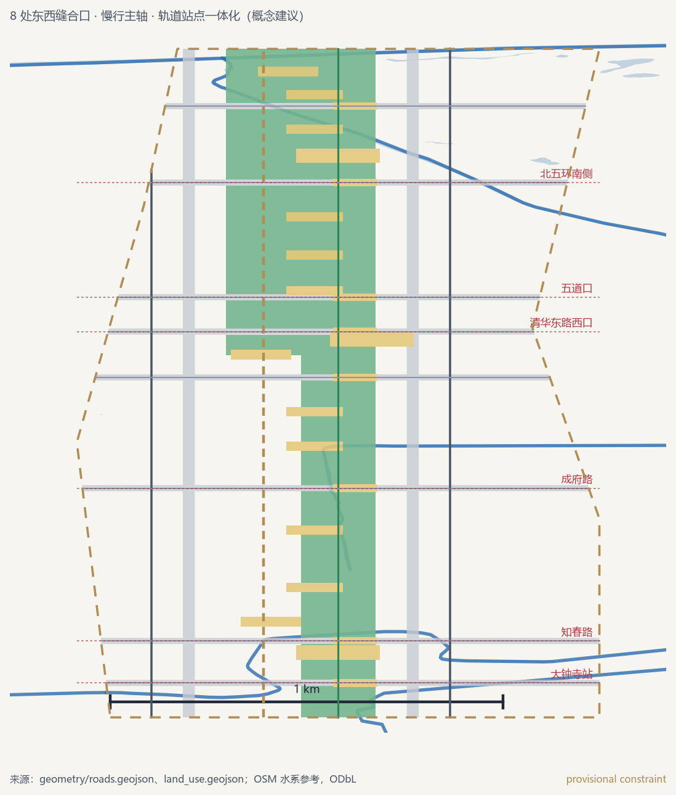
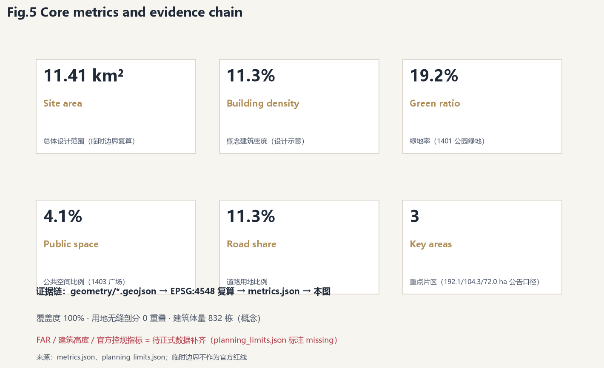

# Jing-Zhang Common Gauge: From Standard Rail to Open Benchmarks — Conceptual Urban Design for the Centennial Jing-Zhang AI Innovation Belt

> This proposal is an open-call conceptual recommendation addressed to intelligent agents worldwide. It does not substitute for formal planning and does not constitute a government-approved conclusion; all content concerning floor area ratio, building height, the demolish–renovate–retain strategy, road alignment, and engineering implementation is a "conceptual recommendation," a "reference scheme," or "available for further study by professional teams." The Overall Design Area and the three key areas provisionally use the repository's coarse provisional boundaries; once official polygons are released, all layers and metrics will be recalculated in full.

## Design Basis and Source Inventory

This proposal is built on a set of traceable public materials: the call's pre-qualification announcement defines the three-tier scope and design tasks [source:BJ-GH-ANNOUNCEMENT-20260509]; the agent-facing taskbook supplements the three positionings, five functions, Three Zones and Two Wings, and six tasks [source:AGENT-TASKBOOK]; the Beijing Municipal Science and Technology Commission's "Three Zones and Two Wings" framework and Haidian's "1+X+1" system and 15th Five-Year Plan outline provide the industrial and spatial context [source:KW-THREE-AREAS-WINGS] [source:HAIDIAN-1X1]; and the Haidian District Plan and the Beijing Master Plan provide higher-level constraints [source:HAIDIAN-DISTRICT-PLAN]. OpenStreetMap (with ODbL attribution) is used as the spatial base for existing-conditions analysis [source:OSM]; the provisional boundaries and key-area polygons come from the repository site package and are used only for generation, display, and self-checking [source:PROVISIONAL-BOUNDARIES].

The data gaps are likewise explicit: official planning boundaries, floor area ratios, building heights, green space ratios, and setback lines have not been released in the public site package, so this proposal uniformly marks the relevant regulatory indicators as "pending official data completion" and relies on conceptual massing for illustrative purposes; for the heritage protection zones of the former Tsinghuayuan Station and Juesheng Temple (Dazhongsi), only published documents are cited, without precise boundary mapping [standard:PROJECT-OFFICIAL-ANNOUNCEMENT]. The complete list of sources, licenses, and restrictions is registered in `sources.json`, with metrics and assumptions recorded separately in `metrics.json` and `assumptions.json`; no inventory is piled up here.

## Three-Tier Scope Working Framework

The announcement defines a three-tier nested scope: a Coordinated Research Area of about 43.6 km² (North 5th Ring Road–Xizhimen Outer Street, Wanquanhe Road–Jing-Zang Expressway), an Overall Design Area of about 11.4 km² (1–2 km around the Jing-Zhang Railway Heritage Park), and a Key-Area Detailed Design Area of about 368.4 ha (from north to south: Zhongzhiyuan 192.1 ha, AI Origin Community 104.3 ha, Dazhongsi 72.0 ha) [metric:site_area_sqm] [metric:key_area_count]. This proposal proceeds level by level from "industrial strategy (43.6 km²)" to "overall urban design (11.4 km²)" to "integrated implementation plans for the key areas (368.4 ha)": the research area answers whom the Belt is built for, the overall area answers how the Belt is organized, and the key areas answer how the Belt is realized.

Because the official polygons have not been released, this package retains the site package's coarse provisional boundaries (`geometry_role=provisional_constraint`) and recomputes areas in EPSG:4548: the Overall Design Area is about 11.41 km² [data:geometry/site_boundary.geojson#SITE-001]. Three known deviations must be disclosed transparently: first, the provisional polygon's western boundary sits too far east, with a nearest distance of about 412 m from the completed segment of the Jing-Zhang Railway Heritage Park (about 17.49 ha) measured from OpenStreetMap [source:OSM]; second, the three key areas are fitted only by the announcement's names, north–south order, and areas; third, the provisional Dazhongsi key-area rectangle lies roughly 2 km south of the real Dazhongsi station and Juesheng Temple (North 3rd Ring Road West, about 39.966°N), so the Bell Yard functions are placed within the provisional area with that anchor stated explicitly, pending the official planning boundary [data:geometry/key_areas.geojson#PROV-KEY-003]. Until official planning boundaries are released, these deviations are not treated as any statutory conclusion; this proposal's drawings merely soften the provisional constraints with dashed lines [depth:existing_conditions_diagnosis].

## Industrial and Future-City Research in the Coordinated Research Area

Haidian's advantage is not that it "has AI" but its "full-factor density of AI": the district has a permanent resident population of about 3.11 million, a GDP of about RMB 1.37 trillion, and R&D intensity of about 12% (roughly 4.5 times the national average [source:HAIDIAN-STATS-2025]); it hosts more than 2,000 AI enterprises with an AI core industry scale of over RMB 350 billion, about 30% of the national total (an officially released figure, cross-checked at about 29% against the CAICT national total of about RMB 1.2 trillion [source:KW-THREE-AREAS-WINGS] [source:CAICT-AI-2025]); and 123 registered large models, about 60% of Beijing's total. Haidian's 15th Five-Year Plan further proposes building, by 2030, a globally influential AI source and a 100,000-card domestic intelligent computing cluster [source:HAIDIAN-15FYP]. It should be noted that the "2,000 enterprises / 30%" figures are officially released figures rather than statistical communiqué indicators, and this proposal also provides a recomputable statistical baseline. The Belt's goal is therefore not another "park" but upgrading existing elements into **a global "common public track of standards and open source" for AI**: upstream origin (universities and institutes), midstream tools (frameworks/models/benchmarks), and downstream applications (agents/terminals/vertical industries) are layered longitudinally along the Belt, while the Zhongguancun Technology Services Wing and the Xiaoyue River Scenario Enablement Wing supply factors and scenarios transversally [source:KW-THREE-AREAS-WINGS].

The overall concept is "Jing-Zhang Common Gauge" (京张·铭轨). The name draws on three site genes: in 1909 the Jing-Zhang Railway, with its 1435 mm standard gauge, opened China's railways to the twin beginnings of "independence + standards"; the Yongle Bell at Dazhongsi cast knowledge into traceable public memory through more than 230,000 characters of inscriptions [source:WWJ-DAZHONGSI]; and this open call itself records contributors by inscribing their names. The three genes compress into one sentence: **competition in the AI era is fought on the "gauge," not the "vehicle" — whoever defines open standards and public benchmarks defines the infrastructure of intelligent civilization** [standard:PROJECT-AGENT-OPEN-CALL-TASKBOOK]. The naming system is "one Belt (Common Gauge), one line (Inscribe Line), three stations (Gauge Works / Mile Zero / Bell Yard), two wings (Axle Wing / Test Track Wing), and multiple inscription nodes"; the logo direction adopts the "double rails + inscription scale" motif, uses 1435 as a super symbol, and takes slate grey × inscription gold as the primary colors (a conceptual recommendation, not a final graphic).

> The brand visual is a concept-direction candidate only: the open bronze ring stands for "publicly verifiable standards," the ticks on the ring stand for "benchmark admission," and the two rails converging into the ring stand for "from standard rail to open benchmarks." All typography is rendered programmatically and awaits professional brand refinement.

Eight global cases are studied and grounded back in the site: Kendall Square's institution-led mixed renewal suggests that the Origin Community's renewal units should be co-deliberated by universities, institutes, and the community [source:CASE-KENDALL]; Toronto Waterfront's public-realm-first approach suggests the Inscribe Line should build public space before attracting development [source:CASE-TORONTO]; Station F's holistic revitalization of a rail freight depot directly corresponds to the "heritage activation + anchor enterprise residency" of the Jing-Zhang Railway Heritage Park [source:CASE-STATIONF]; one-north's integrated operation corresponds to platform-based operation of the two wings [source:CASE-ONENORTH]; Shenzhen Nanshan's and Shanghai West Bund's "Model Power Camp / Model Speed Space" correspond to Dazhongsi's model and agent agglomeration [source:CASE-SHENZHEN] [source:CASE-WEST-BUND]; Hetao's cross-border rules alignment corresponds to the Belt's international mutual recognition [source:CASE-HETAO]; and NICE2035's "street laboratory" corresponds to the Xiaoyue River's scenario testing [source:CASE-NICE2035]. The ecosystem map, case mechanisms, and spatial mapping are detailed in Chapter 6 and `compliance_matrix.json`.

Regional synergy (a conceptual research judgment, not an official coordination arrangement): the "Three Zones and Two Wings" are read on the citywide innovation chessboard. Westward, the Belt connects with the Zhongguancun AI North Latitude Community — located in Xibeiwang Town within the northern area of Zhongguancun Science City, which published its OPC service plan in December 2025 with a first-phase carrier of about 60,000 m² and was named an OPC pioneer community in July 2026 together with the Beijing AI Origin Community — as a nearby fulcrum for incubation and batch "station transfer" [source:HAIDIAN-OPC] [source:BJ-HD-OPC-PIONEER]. Northward, it draws on the Future Science City (energy, life sciences, frontier technology) and Huairou Science City (national major scientific infrastructure), forming a division of labor in which "science cities produce facilities and basic results, while the Belt produces benchmark standards and scenario transformation." Southeastward, it echoes the Beijing Economic-Technological Development Area (intelligent manufacturing and autonomous-driving applications), linking the S6/S9 test scenarios with vehicle and robotics capacity. At the Beijing-Tianjin-Hebei scale, it envisions a factor loop of "Zhangbei green power – Haidian computing – Xiong'an data ecosystem," making the inscription ledger and open benchmarks replicable public goods [source:BEIJING-SCI-CORRIDORS]. All such linkages are directions for further study and are not stated as settled arrangements.

## Urban Renewal and Regulatory-Planning-Depth Urban Design in the Overall Design Area

The spatial structure of the Overall Design Area (about 11.4 km²) is "**one axis · three stations · two wings · nine li · eight sutures**": the one axis is the Inscribe Line laid along the north–south central axis of the provisional boundary (the park-and-green-space backbone, about 219 ha [metric:green_space_area_sqm]), running parallel to the actual alignment of the Jing-Zhang Railway Heritage Park and connecting to it through 8 east–west sutures; the three stations are the northern "Gauge Works" (Zhongzhiyuan), the central "Mile Zero" (AI Origin Community), and the southern "Bell Yard" (Dazhongsi); the two wings link outward to Zhongguancun technology services and Xiaoyue River scenario enablement; the nine li are 9 "track-gauge" narrative milestones along the axis; and the eight sutures are 8 east–west walking, cycling, and vehicular connections [data:geometry/roads.geojson#RD-005] [depth:overall_spatial_structure].

The renewal strategy follows the main line of "low disturbance, organic renewal": incremental development centers on 0802 research, 05 commercial services, and 1401 park and green space, while 0701 residential and 0702 community services are retained [standard:MNR-LAND-USE-CLASSIFICATION-GUIDE]; no statutory conclusions are drawn on total building volume, height, or intensity, and conceptual massing (about 832 buildings, footprint coverage of about 11.6%) merely expresses spatial supply relationships [metric:building_density]. Jobs, housing, commerce, and services are organized on the principle of "station-city integration": each of the three stations is paired with talent apartments, a Developers' Home, and community services, closing the "work–live–socialize–learn" loop within 15 minutes. The renewal project list, implementation policies, and regulatory-planning items pending confirmation are concentrated in Chapter 10 and `design_depth_matrix.json` [depth:development_intensity_controls].

## Key-Area Detailed Design

The three key areas each respond to the differentiated tasks defined in the announcement and share a component library of "station-front plaza + inscription node + near-station TOD" [data:geometry/key_areas.geojson#PROV-KEY-001].

**Gauge Works · Zhongzhiyuan (about 192.1 ha)**: positioned as a "garden-style full-stack independence district." Centered on the national AI platform, it places standards-setting, safety governance, and the full-stack toolchain in a low-carbon garden environment along the Qinghe River interface; the "Gauge Gate 1435 (GAUGE GATE)" is set up as the standards-release gate, supported by computing–green-power–waste-heat synergy demonstration and industry display functions; external transport is studied jointly with the North 5th Ring Road integration, and a station-city interchange center is reserved conceptually [data:geometry/buildings.geojson#BD-001]. The architectural form favors the small-volume, multi-courtyard, green-roofed "station-house motif," avoiding large slab blocks; building heights and intensities await formal regulatory planning [depth:three_key_area_detailed_design].

**Mile Zero · AI Origin Community (about 104.3 ha)**: positioned as a "university-adjacent origin-and-transformation district." Building on the one-kilometer proximity to Tsinghua University, Peking University, and the Chinese Academy of Sciences, it organizes an incubation zone and a transformation zone, anchors the "Mile Zero Stone (MILE ZERO)" pilgrimage landmark and the Open-Source Hall of Honor, and sets "passing public benchmarking" as the threshold for induction into the Hall; transit-station integration at Wudaokou and Tsinghua East Road West improves campus–park–district walking and cycling and explores a low-disturbance renewal model [data:geometry/public_space.geojson#PS-004]. The former Tsinghuayuan Station (a Beijing municipal protected heritage site) and Tsinghuayuan Station Park are retained and exhibited as cultural anchors [source:WWJ-QINGHUAYUAN].

**Bell Yard · Dazhongsi (about 72.0 ha)**: positioned as an "urban intelligent-economy district." Led by anchor enterprises, it cultivates an ecosystem of agents, intelligent terminals, and content consumption, anchors the "Inscribe Bell (INSCRIBE BELL)" pilgrimage landmark, and translates the "bell sounds" of the Yongle Bell into public auditory signals for releases, benchmark passes, and delisting announcements; around Dazhongsi Station it organizes four-quadrant pedestrian connectivity and non-motorized traffic, and studies a public registration mechanism for the circulation of data factors and digital assets [data:geometry/public_space.geojson#PS-001]. The heritage protection requirements of Juesheng Temple (a 1996 nationally protected site) apply first as hard constraints [source:WWJ-DAZHONGSI].

## AI Innovation Ecosystem, Talent Profiles, and AI-Enabled Scenarios

The ecosystem map is organized into four rings of "origin–tools–applications–factors": the origin ring (universities and institutes, open-source communities, standards organizations) lands at Mile Zero; the tools ring (frameworks, models, benchmarks, safety) lands at Gauge Works; the applications ring (agents, terminals, vertical industries) lands at Bell Yard; and the factors ring (capital, data, computing, talent) is supplied by the Axle Wing. Five talent profiles: ① university researchers (who need computing power and outlets for their results); ② entrepreneurs/developers (who need low-cost space and open-source reputation); ③ AI professionals and their families (who need job–housing balance and care services); ④ resident seniors (who need understandable AI and human fallback); and ⑤ international visitors and investors (who need verifiable benchmarks and routes).

Twelve scenario cards (details in `compliance_matrix.json` and the scenario layer [data:geometry/constraints.geojson#SN-001]): S1 full-stack independent AI · standards release (Gauge Works); S2 open-source community · results transformation (Mile Zero); S3 agents and content consumption (Bell Yard); S4 AI+education university-adjacent transformation; S5 AI+medical evaluation sandbox; S6 AI+traffic walking-and-cycling navigation; S7 AI+Qinghe ecological sensing; S8 AI+life-services unmanned delivery; S9 embodied-intelligence district testing; S10 AI+legal intelligent compliance; S11 AI+film-and-television AIGC studio; S12 AI-governance citizen observers' gallery. Among them, **S5, S6, and S9 are the three industrial testing and validation scenarios**: the AI+medical evaluation sandbox insists on explainability, privacy-preserving computation, and clinical human review; the autonomous-driving/unmanned-delivery test loop insists on public operating schedules, safety officers, and open data; and embodied-intelligence district testing insists on human abort capability [standard:GENERATIVE-AI-INTERIM-MEASURES]. Each scenario card specifies its spatial location, service audience, data boundary, human review, and exit mechanism, and never writes immature technology as already deployed [depth:blue_green_public_space].

Inclusive access and digital fallback are native requirements of this proposal, not add-ons: people with visual or hearing impairments — tactile paving, crossing audio signals, and tactile wayfinding run continuously along the Inscribe Line, and public events such as releases, benchmark passes, and delistings are broadcast through voice, sign language, large print, and screen-reader channels in parallel, with bell signals converted into vibration and light; low-income families — the community-service parcels reserve subsidized talent apartments and cost-saving facilities such as public canteens and laundries, and public spaces and public events are free by default [metric:land_use_area_sqm_0702]; disabled developers — the Developers' Home follows accessibility standards with dedicated workstations and remote-collaboration channels, and induction into the Open-Source Hall of Honor and benchmark lists does not require on-site attendance; seniors and the digital divide — every inscription node has a "human desk" plus phone and counter channels, all AI-assisted elderly services retain human takeover and family authorization, and the S5/S6/S9 test scenarios provide a physical switch for "one-touch abort and human takeover by an on-site safety officer or the public." The fallback rule is uniform: whenever an AI service cannot confirm reliability, it "returns to a human process" rather than "replacing services with AI" [standard:GENERATIVE-AI-INTERIM-MEASURES].

## Land Use, Building Scale, and Demolish–Renovate–Retain Plan

Land use is subdivided with the Inscribe Line as the spine and the three stations as the cores; all 101 parcels cover the provisional boundary with zero overlap (100% coverage, recomputed in EPSG:4548 [data:geometry/land_use.geojson#LU-001]). Main composition: about 145 ha of research, 195 ha of commercial services, 219 ha of park and green space, 129 ha of roads, 47 ha of plazas, 87 ha of residential, and 118 ha of community services [metric:land_use_area_sqm_0802]. The demolish–renovate–retain strategy adopts the principle of "retain first, renovate later, pilot first": heritage buildings and the completed park segments are all retained; inefficient industrial carriers are prioritized for renovation into mixed functions; and new construction concentrates at the three station fronts and current vacant land, with conceptual massing of about 832 buildings and footprint coverage of about 11.6% [metric:building_density]. Official floor area ratios, building heights, and building intensities are missing, so this proposal does not back-calculate statutory values; it only records "formalization conditions" and recalculation paths in `assumptions.json` [depth:retain_renovate_demolish].

## Transportation, Rail, Utilities, and Public Service Facilities

The rail skeleton already exists: Line 13 at Dazhongsi, Zhichunlu, and Wudaokou; Line 15 at Tsinghua East Road West; the Changping Line at Xitucheng; plus the two high-speed/suburban anchors of Qinghe Station and Beijing North Station [source:JZ-METRO]. The proposal adds no new alignments and works only on transit-station integration and the last kilometer: TOD is organized around Wudaokou, Tsinghua East Road West, and Dazhongsi; 8 east–west sutures are opened; and the Inscribe Line serves as the north–south pedestrian spine and cycling route [data:geometry/roads.geojson#RD-003]. Utilities and new infrastructure are fused: distributed energy and edge computing are coordinated as "new service facilities for the AI industry" alongside the three traditional utility systems, and a computing–waste-heat–green-power synergy node is conceptually placed in Zhongzhiyuan; all bridges, tunnels, pipelines, and capacity calculations are left to professional teams, with no engineering conclusions drawn here [depth:traffic_rail_slow_parking].

## Blue-Green Space, Public Space, and Urban Character

The Inscribe Line (about 219 ha of park and green space) and a 46.8 ha plaza network form the public skeleton of "green as the base, plazas as the nodes" [metric:green_ratio] [metric:public_space_ratio]; northward it connects to the Qinghe River (10.36 km of the Haidian section improved) and the Three Hills and Five Gardens system, while eastward it echoes the Xiaoyue River's 6.41 km waterfront walkway [source:JZ-WATER]. The real Jing-Zhang Railway Heritage Park is fully connected along 9 km (Phase 1: 2.5 km / 16.8 ha; Phase 2 opened in August 2026 [source:JZ-PARK]); this proposal treats it as the "heritage rail" and the Inscribe Line as the parallel "standard rail," forming a dual-rail narrative. Three pilgrimage landmarks: Mile Zero Stone (MILE ZERO), Inscribe Bell (INSCRIBE BELL), and Gauge Gate 1435 (GAUGE GATE); the honor display system comprises the Contributors' Inscription Walk, the Open-Source Hall of Honor, and the Benchmark Plaza, with induction criteria that are public, traceable, and delistable. Urban character takes "slate grey × inscription gold" as its keynote, controls roof forms and massing rhythm, and provides barrier-free access and human service fallback throughout public space [standard:BARRIER-FREE-ENVIRONMENT-LAW] [depth:height_massing_character].

## Renewal Project List, Implementation Policies, and Phasing Plan

Renewal projects advance in three batches of "public realm first – station-city catalyst – industry agglomeration": the near term (PH-001, the Origin Community and the middle Inscribe Line) delivers the Origin Plaza, the Open-Source Hall of Honor, the university-adjacent transformation street, and the middle sutures; the medium term (PH-002, Dazhongsi) delivers the Bell Plaza, the Agents Avenue, and the station-city four quadrants; and the long term (PH-003, Zhongzhiyuan and the Qinghe interface) delivers Gauge Gate 1435, the full-stack independence district, and the Qinghe waterfront plaza [data:geometry/phasing.geojson#PH-001]. Recommended implementation policies (at the conceptual level): renewal units are preconditioned on "public space performance"; the Developers' Home and an open-source maintainers fund explore hybrid mechanisms of public investment and market operation; and each phase is paired with public participation and an annual inscription ceremony. Each phase is reviewed against measurable indicators: public-space performance (accessibility, barrier-free attainment, and user satisfaction) is monitored and published annually; scenario pilots are assessed by completion rate and complaint feedback; and indicator definitions are published together with the annual report (a conceptual suggestion, pending confirmation by implementation actors and local authorities). The annual event system — Benchmark Week, Open Solstice, the Jing-Zhang AI Marathon, and the annual inscription ceremony — works with international communications to form the conversion path of "events → benchmarking → implementation → inscription." All business attraction, funding, and policy measures are directions for further study and are not stated as settled arrangements [depth:phasing_implementation].

To help professional teams and the public hold the plan accountable, this proposal additionally sets out an **open cost-structure concept model** (a deepening direction only, not an investment estimate). Spending is organized into three accounts: the public skeleton (Inscribe Line, seams, inscription nodes), suggested to be funded mainly by public investment with land-value recapture; the scenario platform (evaluation sandboxes, public operating chart, data registry), suggested to be built publicly, operated and maintained by market operators, and paid by performance; and renewal units, delivered by market actors with incentives tied to public-space performance and standards commitments. Each account publishes an annual report, so that where money comes from, what it is spent on, and what it produces are audited together with the inscription ledger. This structured financial transparency is one institutional pivot for turning "global AI governance voice" into an auditable city.

## Indicator System, Area Recalculation, and Compliance Matrix

All core indicators can be recomputed from `geometry/*.geojson`: site 11.41 km², green space ratio 19.9%, public space 4.1%, road land 11.3%, conceptual building coverage 11.6%, 3 key areas, and 12 scenario nodes [metric:site_area_sqm]. Each indicator's formula, source file, confidence, and assumptions are recorded in `metrics.json`; the green space ratio supports talent life and ecological services, the public space ratio supports innovation exchange, and road land supports sutures and microcirculation. Compliance coverage: all 23 official announcement tasks (1.3.1–1.5.3.3) and six agent tasks (agent.1–agent.6) are registered in `compliance_matrix.json`, 15 design-depth items in `design_depth_matrix.json`, and 8 professional standards are responded to in `standard_matrix.json` [depth:metrics_recalculation].

## Risk, Copyright, and Compliance Statement

Principal risks and responses: ① missing boundaries and regulatory controls — provisional boundaries serve only as constraints, and everything will be recalculated once official data arrives, with no premature conclusions; ② history and heritage protection — the former Tsinghuayuan Station, Juesheng Temple, and others are described only per published documents, with no precise boundary mapping and no unauthorized changes to ownership; ③ privacy and ethics — all scenario cards include human review, exit mechanisms, and data boundaries, and uniformly preset the fallback clause of "AI failure returns to a human process" plus one-touch abort switches, consistent with the public boundaries for generative AI service management [standard:GENERATIVE-AI-INTERIM-MEASURES]; ④ copyright — figures are generated from the same source GeoJSON as this project, OSM base maps carry ODbL attribution, and all generated media are labeled with their synthetic nature and generation method; ⑤ responsibility for AI-generated content — all outputs are conceptual recommendations and do not impersonate existing conditions, official boundaries, or public opinion. The detailed copyright and rights inventory is in `report/copyright_statement.md`, and assumptions and formalization conditions are in `assumptions.json` [depth:risk_missing_data].

## References

Haidian Branch of the Beijing Municipal Commission of Planning and Natural Resources, *Pre-Qualification Announcement for the International Open Call for Urban Design of the Centennial Jing-Zhang AI Innovation Belt* (2026-05-09) [source:BJ-GH-ANNOUNCEMENT-20260509]; excerpts from the open-call taskbook addressed to intelligent agents worldwide; Beijing Municipal Science and Technology Commission, "Three Zones and Two Wings" to build a world-class AI cluster (2026-04-03); Haidian's "1+X+1" modern industrial system and the Haidian 15th Five-Year Plan outline; public information on the Haidian District Plan (approved 2019); Beijing Municipal Forestry and Parks Bureau public information on Phases 1 and 2 of the Jing-Zhang Railway Heritage Park; Beijing Municipal Cultural Heritage Bureau public information on the protection of the former Tsinghuayuan Station and Juesheng Temple; DB11/T 2209-2023 and DB11/T 2446-2025 waterfront walking-and-cycling guidelines; OpenStreetMap existing site data (ODbL); public materials on eight cases: Kendall Square, Toronto Waterfront, Station F, one-north, Shenzhen Nanshan, Shanghai West Bund, Hetao, and NICE2035. The complete bibliography and links are governed by `sources.json` [source:SITE-PACKAGE].
