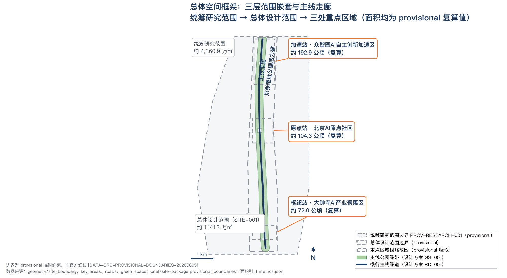
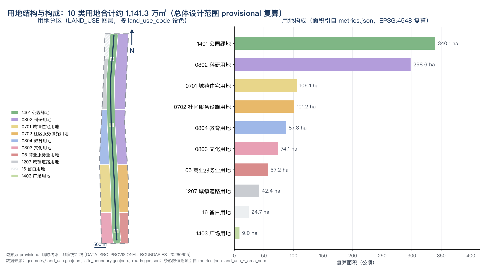
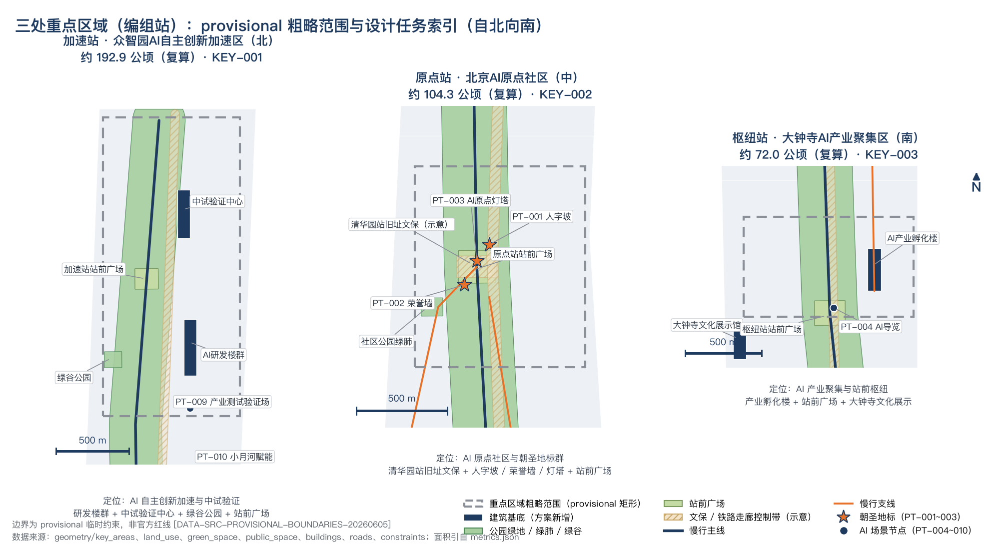
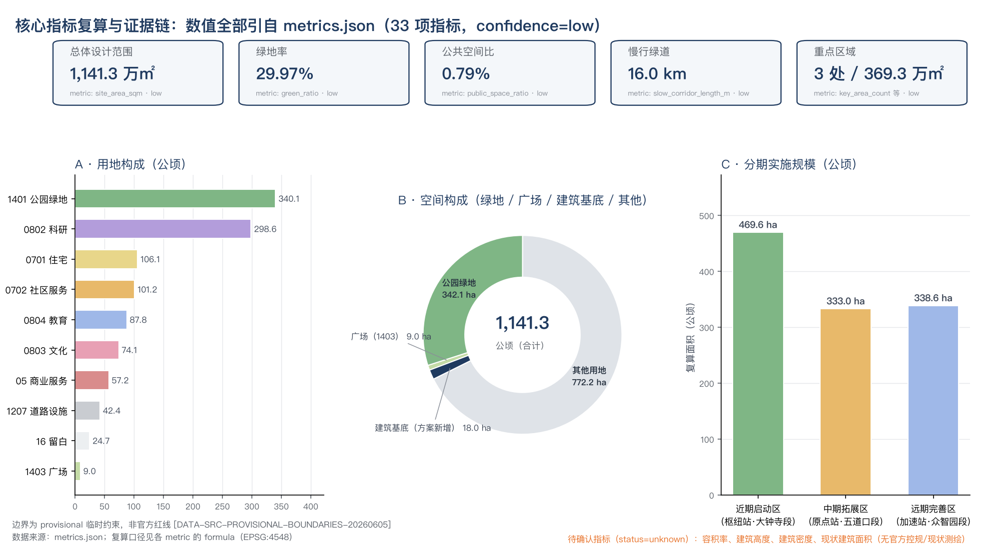

# Jing-Zhang AI Mainline

This document is the formal submission text for the "Centennial Jing-Zhang AI Innovation Belt Urban Design International Call for Ideas," with the overall concept named "Jing-Zhang AI Mainline." The promotional slogan is "From the First Railway to the First AI Mainline," which translates the spirit of the autonomous mainline represented by the Jing-Zhang Railway into a conceptual urban innovation organization for the age of artificial intelligence. All spatial and operational recommendations in the document are conceptual suggestions and reference solutions, available for further in-depth research by professional teams. All spatial boundaries are provisional boundaries and are not official planning boundaries. Formal data will need to be recalculated after their release. (Conceptual Recommendation) (Provisional Boundary) (Official Planning Boundary)

## Design Basis and Source List

This scheme is based on the qualification pre-review announcement for the international design proposal of the Centennial Jing-Zhang AI Innovation Belt issued by the Haidian Branch of the Beijing Municipal Commission of Planning and Natural Resources [source:OFFICIAL-ANNOUNCEMENT], which outlines the tasks, scope, and depth requirements as per [standard:PROJECT-OFFICIAL-ANNOUNCEMENT]. The six open-source tasks for intelligent entities are based on [source:AGENT-TASKBOOK] and [standard:PROJECT-AGENT-OPEN-CALL-TASKBOOK]. Design judgment: This scheme does not introduce any non-public materials. All design conclusions are derived solely from the announcement, task book, public standards, and registered temporary documents. This approach is taken because the submission policy for the call for entries clearly states that structured data is the authoritative reference and prohibits the fabrication of certainty [fabricated_certainty_forbidden]. Therefore, the textual narrative must correspond one-to-one with the GeoJSON layers, indicator tables, and registered documents. (Urban Design)

`data/source_registry.json` currently registers 6 entries: 5 formal-ready (official announcements, agent task book, Urban Design management guidelines, control plan depth standards, land and sea use classification guide), and 1 provisional-only (Provisional Boundary) [source:SOURCE-REGISTRY]. Use of boundaries: formal-ready materials support the task scope and terminology, while provisional-only materials are only used for scheme generation, self-inspection, and visualization, and must not be upgraded to official planning boundaries, statutory control plans, formal scoring criteria, or government implementation commitments. The enumeration, range, and design brief in `brief/site-package/` are machine-readable inputs [source:SITE-PACKAGE]; `data/processed/agent_fact_pack.md` is merely a reading navigation layer and is not a new authoritative source [source:PROCESSED-FACT-PACK]. (Official Planning Boundary)

The main text references correspond to the five attached documents: `sources.json` registers the evidence sources (currently 13: 7 base evidence sources + 6 CASE-* items from Chapter 3, global examples); `assumptions.json` registers assumptions and pending confirmations; `compliance_matrix.json` covers the 23 optional tasks required by the notice and the task order; `standard_matrix.json` covers 6 standards; `design_depth_matrix.json` covers 15 depth items. Among these, the current diagnosis, recalculation of indicators, and risks due to missing data correspond to [depth:existing_conditions_diagnosis], [depth:metrics_recalculation], and [depth:risk_missing_data]. Land use classification terminology follows [standard:MNR-LAND-USE-CLASSIFICATION-GUIDE], Urban Design and control detailed planning depth follow [standard:MOHURD-URBAN-DESIGN-MEASURES] and [standard:MOHURD-CONTROL-DETAILED-PLANNING]; architectural design depth documents [standard:MOHURD-ARCH-DESIGN-DEPTH-2016] are treated as data_gap in the standard matrix due to limited public access, and are only referenced for deepening directions.

Boundaries are based on [source:BOUNDARY-SOURCE] and [source:KEY-AREA-SOURCE], corresponding to the submitted layers [data:geometry/site_boundary.geojson#SITE-001] and three features of key areas; the Overall Design Area recalculates to an area of approximately 1,141.3 hectares ([metric:site_area_sqm], confidence=low). **Provisional Declaration: All spatial boundaries in this plan are provisional boundaries, not official planning boundaries. Formal data release requires recalculations.** Data gaps: Official Boundary polygons, Regulatory Detailed Planning indicators, as-built building surveys, land ownership, municipal utility lines, and cultural heritage surveys have not been publicly obtained. All content related to Floor Area Ratio, Building Height, Demolish–Renovate–Retain strategy, road alignments, and investment estimates are listed as pending confirmation and are included in the `assumptions.json` and Chapter 12 Risk List. (Provisional Boundary) (Official Planning Boundary) (Demolish–Renovate–Retain Strategy)

## Three-Level Scope Framework

Announcement 1.3 and 1.4 specify a three-layer work scope [standard:PROJECT-OFFICIAL-ANNOUNCEMENT]. Design judgment: The three layers are not three isolated plans, but a "strategy—structure—implementation" progressive validation chain—Coordinated Research Area determines the industrial and urban form judgments, the Overall Design Area grounds these judgments in land use, transportation, and Public Space structure, and the Key-Area Detailed Design Area verifies the implementability of specific districts. The three layers progressively backtrack and validate each other [depth:three_level_scope_framework].

| Level | Official Area | Provisional Boundary Recalculation Value | Spatial Boundary (Announcement Text Boundaries) | Design Depth and Outcomes |
| --- | --- | --- | --- | --- |
| Coordinated Research Area | 43.6 square kilometers | Approximately 4,360.9 thousand square meters ([metric:research_area_sqm]) | North to the Fifth Ring Road North, East to the Jingzhang Expressway, South to West Straight Outer Street, West to Wanquanhe Road | Research on Industrial Ecology and Future Cities, Overall Spatial Structure |
| Overall Design Area | 11.4 square kilometers | Approximately 1,141.3 thousand square meters ([metric:site_area_sqm]) | Jing-Zhang Relic Park perimeter within 1-2 kilometers; north to the North Fifth Ring Road, east to University Road and West Tucheng Road, south to West Zhongmen Avenue, west to Dazhongsi East Road and Heqing Road | Urban Design at the control detail plan depth, land use, buildings, roads, green spaces, and Public Space layers |
| Key-Area Detailed Design Area | 368.4 hectares | Approximately 369.3 hectares ([metric:key_scope_area_sqm], [metric:key_area_count]=3 locations) | From north to south: Zhongzhiyuan AI Independent Innovation Acceleration Area, Beijing AI Origin Community, Dazhongsi AI Industry Cluster Area | In-depth Integrated Planning Implementation Plan, see Chapter 5 |

The current three boundaries have no official polygons. This plan uses temporary alternative boundaries derived from `brief/site-package/geometry/provisional_boundaries.geojson` (official_boundary=false, boundary_precision=provisional_rough) [source:BOUNDARY-SOURCE][source:KEY-AREA-SOURCE], corresponding to submitted layers [data:geometry/site_boundary.geojson#SITE-001] and [data:geometry/key_areas.geojson#KEY-001], [data:geometry/key_areas.geojson#KEY-002], [data:geometry/key_areas.geojson#KEY-003]. **Provisional Limitation Statement: The Provisional Boundary is a rough reference and not the Official Planning Boundary. It is only to be used for concept generation, self-checking, visualization, and design discussions and should not be used as the official planning boundary, for accurate area calculations, or as a legal control conclusion.** The discrepancy between recalculated areas and the official figures (such as key areas at 369.3 hectares versus 368.4 hectares) is due to the rough boundary. After the formal data release, all calculations must be recalculated: the site boundary, key areas, land use, roads, green space, public space, buildings, phasing, and all area and ratio indicators must be recalculated and re-self-checked, and not just a single file replaced.

A three-layer framework simultaneously serves as the spatial carrier for the conceptual system: the main line (Jing-Zhang Ruins Park Vitality Belt) runs through the Overall Design Area; three grouped stations (Acceleration Station, Origin Station, Hub Station) are three key areas; two branch lines (Element Branch Line, Scenario Branch Line) connect the Zhongguancun Technology Services Wing with the Xiaoyue River Scenario Enablement Wing at the Coordinated Research Area level. The complete definition of the naming system is detailed in Chapter 3, while this chapter only locks down the Evidence Chain for scope, area, and depth. Data gaps: the official boundaries and area confirmation for the three layers are pending formal data release. (Official Boundary)

## Coordinated Research Area: Industry and Future City Research

The core output of the Coordinated Research Area (Provisional Boundary recalculated to be approximately 4,360.9 million square meters, [metric:research_area_sqm]) is the concept and structural judgment. Design judgment: the main name is "Jing-Zhang AI Mainline" (Jing-Zhang Intelligent Mainline), with the tagline "From the First Railway to the First AI Mainline." Why this judgment: the Jing-Zhang Railway was completed in 1909, being the first railway line designed, constructed, and surveyed by Chinese people, with Zhan Tianyou resolving the elevation difference at Qinglong Bridge using a "person" shaped return curve, a well-documented historical fact; the "autonomous mainline" theme aligns naturally with the "Full-Stack Independent AI Innovation System," and railway language (mainline, marshalling station, branch line, station, timetable) can translate the abstract industrial ecosystem into a spatial system that can be plotted, operated, and disseminated [source:AGENT-TASKBOOK][standard:PROJECT-AGENT-OPEN-CALL-TASKBOOK].

Naming System (Railway Language Runs Through, Mapped to All Layers):

| Railway Language | Urban Design Object | Layer Landing |
| --- | --- | --- |
| Mainline | Jing-Zhang Heritage Park Vitality Belt | [data:geometry/green_space.geojson#GS-001], [data:geometry/roads.geojson#RD-001] |
| Yards | Three Key Areas: Acceleration Station (Zhongzhiyuan), Origin Station (Beijing AI Origin Community), Hub Station (Dazhongsi) | [data:geometry/key_areas.geojson#KEY-001], [data:geometry/key_areas.geojson#KEY-002], [data:geometry/key_areas.geojson#KEY-003] |
| Branches | Wings: Zhongguancun Technology Services Wing=factorial branch, Xiaoyue River Scenario Enablement Wing=scenario branch | [data:geometry/roads.geojson#RD-002], [data:geometry/roads.geojson#RD-003] |
| Stations | Along-line AI Scenographic Nodes (7 locations) | [data:geometry/public_space.geojson#PT-004] to PT-010 |
| Timetable | Annual Activity Framework (Conceptual Recommendation from Chapter 10) | Aligns with [data:geometry/phasing.geojson#PHASE-001] Phase Geometry Layers |
| Pilgrimage | AI Pilgrimage Route (3 Sacred Sites) | [data:geometry/public_space.geojson#PT-001], [data:geometry/public_space.geojson#PT-002], [data:geometry/public_space.geojson#PT-003] |
| Station Platform Nameplate | Honor Display System | [data:geometry/public_space.geojson#PT-002] Open Source Honor Wall |

Conceptual Recommendation for Logo Direction (Text Description, All Graphics Hand-Drawn and Clear Rights): Translate the "person" shape of Zhan Tianyou's "person" character track into a growing data stream — two track lines intersect in the center and then fork upwards, both reading as "person" and as the distribution and convergence of data; the colors are Midnight Blue + Signal Orange, with Midnight Blue corresponding to the memory of railway industrial history and trust, and Signal Orange corresponding to safety alerts and activation. No external fonts, trademarks, portraits, or corporate logos are used. This direction is a conceptual recommendation, available for professional teams to further develop.

Three key orientations mapped to three layers of space: the century-old Jing-Zhang cultural belt = the heritage layer (site parks and cultural protection nodes), the urban AI life experience belt = the scene layer of the station (Chapter 6 scenario cards), and the AI integration innovation belt = the industrial layer of the marshalling station (Chapter 5 key areas). Five functional zones are divided according to the marshalling station's division of labor: the acceleration station bears the Full-Stack Independent AI Innovation System and global AI governance discourse, the origin station bears the world-class AI Innovation Ecosystem, the hub station bears intelligent native new business models and intelligent AI vibrant city interfaces, while the two wings support overall elements and scene supply. The Three Zones and Two Wings collaborative loop (Conceptual Recommendation): the element feeder line injects the capital, technological services, and intellectual property rights from Zhongguancun into the marshalling station; the marshalling station completes research and development, transformation, and exhibition; the main line translates the results into public experiences; the scene feeder line runs along Xiaoyuehe to open real-city testing and feeds back demands to the research end, forming a "element injection—research and development transformation—public exhibition—scene feedback" loop [depth:overall_spatial_structure].

Conceptual Recommendation for the Future Urban Form: AI does not alter a single building type, but rather the spatiotemporal organization of work, learning, living, and public services. Research and development require testable real environments, talent demands low-cost collaborative and interaction spaces, and public services need intelligible and verifiable smart interfaces. Therefore, this plan grounds the industrial strategy in locatable functional zones, nodes, and corridors (Chapter 4 Land Use Structure, Chapter 5 Key Areas, Chapter 6 Scene Cards), rather than remaining at the level of technical vision. Any global activities, developer communities, and pilgrimage routes are conceptual recommendations, not confirmed government arrangements.

The following 6 global case studies only document verifiable facts publicly available for calibrating the above structural and mechanism assessments:

**Case 1 | Boston Cambridge Kendall Square** [source:CASE-KENDALL]: Kendall Square, adjacent to , gradually transformed from industrial and warehousing uses in the latter half of the 20th century into a hub for technology and life sciences innovation. Its experience demonstrates that "university proximity + incremental renewal + mixed experimental functions" can sustain long-term innovation density. For the transformation of this plan: the spatial logic (Conceptual Recommendation) of the original campus innovation and acceleration station's "R&D + pilot testing mixed" functions is retained.

**Case 2 | London Knowledge Quarter** [source:CASE-KNOWLEDGE-QUARTER]: The King's Cross—Euston area in London is composed of a partnership network of knowledge institutions such as the British Library, universities, and research institutions, driving the area's brand and space sharing through institutional collaboration rather than developer-led initiatives. Transformation: The operational mechanism for the elements branch adopts a "partnership network" approach (Conceptual Recommendation) instead of single-owner recruitment.

**Case 3 | Toronto Sidewalk Labs Quayside (Lessons)** [source:CASE-SIDEWALK-QUAYSIDE]: The Quayside smart community plan, announced in 2017, was terminated in May 2020, throughout which there was public controversy over data governance and privacy arrangements. Lesson: Data governance and public trust must precede technological deployment. All scenario cards in this plan are to be written with privacy boundaries and Human Review (Chapter 6), with Scenario Access contingent upon "regulable and revocable" conditions.

**Case 4 | Pittsburgh Robotics Ecosystem** [source:CASE-PITTSBURGH-ROBOTICS]: The Robotics Institute at Carnegie Mellon University was established in 1979, and long-term talent and research accumulation enabled Pittsburgh to gradually form a cluster for robotics and AI R&D after the decline of the steel industry. **Conceptual Recommendation**: Transformation: Long-termism of research institutions is more critical than short-term recruitment efforts. Acceleration stations should be configured with pilot testing and standard governance functions.

**Case 5 | Shenzhen Qianhai** [source:CASE-QIANHAI]: The Qianhai-Shenzhen-Hong Kong Modern Service Industry Cooperation Zone received approval from the State Council in 2010 for its overall development plan, which organizes the concentration of modern service industries through institutional innovation and rule alignment. Transformation: AI governance requires a dual carrier of "rules + scenarios," and the concept of data element display and governance sandbox at the hub station follows this logic (Conceptual Recommendation).

**Case 6 | New York Cornell Tech** [source:CASE-CORNELL-TECH]: In 2011, the city of New York introduced Cornell University and the Israel Institute of Technology through an Open Call to establish a graduate campus, which was operational at the Roosevelt Island campus in 2017. This initiative bound talent and industry with the "university new campus + Urban Renewal site." Transformation: The strategy of stitching together the "university—campus—community" at the original transit hub (Conceptual Recommendation).

Data gaps: The current status data of industries, enterprises, and talents within the scope of the coordinated plan are not publicly available, limiting the analysis to only the structural level of the supply chain; this plan does not make judgments on the list of enterprises, investment amounts, and output values, with case studies sourced from [Case Study Sources].URL Registered `sources.json` The CASE-* item.

## Overall Design Area: Urban Renewal and Regulatory-Plan-Level Urban Design

The Overall Design Area ([metric:site_area_sqm] approximately 1,141.3 hectares, Provisional Boundary recalculated) has a spatial structure of "one main line, three marshalling stations, and two branch lines": the main line is the Jing-Zhang Heritage Park Vitality Axis, which includes the main line park green space [data:geometry/land_use.geojson#LU-001], Main green space [data:geometry/green_space.geojson#GS-001] and pedestrian and cyclist mainline [data:geometry/roads.geojson#RD-001] are composite components; Triple-track station corresponds to [data:geometry/key_areas.geojson#KEY-001], [data:geometry/key_areas.geojson#KEY-002], [data:geometry/key_areas.geojson#KEY-003]; Two branches are the West Wing Element Branch [data:geometry/roads.geojson#RD-002] and the East Wing Scenario Branch [data:geometry/roads.geojson#RD-003]. Design judgment: use the heritage park as the structural axis rather than peripheral green spaces, as it simultaneously carries the functions of heritage display, slow travel connectivity, and public life, serving as the organizational backbone of the updated framework [depth:overall_spatial_structure][standard:MOHURD-URBAN-DESIGN-MEASURES].

Land use is classified according to [standard:MNR-LAND-USE-CLASSIFICATION-GUIDE], with the layers fully covering the Provisional Boundary [depth:land_use_layout]. The functional proportions (as per the design recommendation scope, not the control plan indicators) are as follows:

| Land Use Code | Category | Recalculated Area | Ratio | Evidence |
| --- | --- | --- | --- | --- |
| 1401 | Park Green Spaces | Approx. 340,100 square meters | Approximately 29.8% | [metric:land_use_1401_area_sqm], [data:geometry/land_use.geojson#LU-001] |
| 0802 | Research and Development Land | Approximately 298.6 hectares | Approximately 26.2% | [metric:land_use_0802_area_sqm], [data:geometry/land_use.geojson#LU-009], [data:geometry/land_use.geojson#LU-011] |
| 0701 | Residential land in towns | Approx. 106,100 square meters | Approx. 9.3% | [metric:land_use_0701_area_sqm], [data:geometry/land_use.geojson#LU-008] |
| 0702 | Town community service facilities land use | Approx. 101,200 square meters | Approx. 8.9% | [metric:land_use_0702_area_sqm], [data:geometry/land_use.geojson#LU-007] |
| 0804 | Educational facilities | Approx. 87,800 square meters | Approx. 7.7% | [metric:land_use_0804_area_sqm], [data:geometry/land_use.geojson#LU-010] |
| 0803 | Cultural Land Use | Approximately 74.1 Thousand Square Meters | Approximately 6.5% | [metric:land_use_0803_area_sqm], [data:geometry/land_use.geojson#LU-006] |
| 05 | Commercial and Service Industries Land Use | Approx. 57.2 thousand square meters | Approximately 5.0% | [metric:land_use_05_area_sqm], [data:geometry/land_use.geojson#LU-005] |
| 1207 | Urban Road Land Use | Approximately 42.4 Thousand Square Meters | Approximately 3.7% | [metric:land_use_1207_area_sqm], [data:geometry/land_use.geojson#LU-012] |
| 16 | Vacant Land | Approximately 24.7 Thousand Square Meters | Approximately 2.2% | [metric:land_use_16_area_sqm], [data:geometry/land_use.geojson#LU-013] |
| 1403 | Plaza Land Use | Approximately 9.0 hectares | About 0.8% | [metric:land_use_1403_area_sqm] and [data:geometry/land_use.geojson#LU-002], etc., 3 front station plazas |

Note: The totals of individual items differ from the boundary recalculation by approximately 10 square meters, which falls within the provisional_rough accuracy range. Design judgment: The combined area for innovative functions (research and development + education + culture + commercial services) is approximately 45%, residential and community services account for about 18%, and parks and green spaces take up about 31%. The structure can support an update direction centered on "R&D as the main focus, living at the base, and parks as the axis"; the blank land uses the flexibility to accommodate uncertain industrial evolution (Conceptual Recommendation).

Urban Renewal in general framework focuses on preservation with functional replacement and insertions as the Conceptual Recommendation; the Demolish–Renovate–Retain Strategy is only a method and not a conclusion—specific parcels' retention, renovation, demolition, and new construction must await confirmation of ownership, current building survey, and control plan conditions [depth:retain_renovate_demolish]. Conceptual Building Footprints total approximately 18.0 million square meters ([metric:building_footprint_area_sqm], corresponding to [data:geometry/buildings.geojson#BLDG-001] and 6 other conceptual footprints), which only express the intent of functional layout and do not constitute the architectural scheme. Building Height, massing, and facade only serve as visual guidance [depth:height_massing_character]. **No Official Control Standards:** The Floor Area Ratio [metric:floor_area_ratio], Building Height [metric:building_height_m], Building Coverage Ratio [metric:building_density], and the Existing Building Area [metric:existing_building_area_sqm] are all listed as unknown in the indicator system, and are to be confirmed. These cannot be replaced by speculative values for the approved control standards [standard:MOHURD-CONTROL-DETAILED-PLANNING][depth:development_intensity_controls].

Blue-Green and Public Space: Green spaces cover approximately 342.1 million square meters, with a green space ratio of about 30.0% ([metric:green_space_area_sqm], [metric:green_ratio]), and the park green space framework is sufficient. Public Space in the form of plazas covers approximately 9.0 million square meters, representing about 0.8% ([metric:public_space_area_sqm], [metric:public_space_ratio]), relatively few in number —— Design Judgment: Pocket parks and plazas should be added along the main line and at the three station nodes for a combined use. As part of the Public Space actions (Conceptual Recommendation) [depth:blue_green_public_space]. Transportation and municipal bearing: slow-moving green corridors recalculated to approximately 16.0 kilometers ([metric:slow_corridor_length_m]). All submitted centerlines are greenways (with a length of [metric:road_length_m] equal to the length of the slow travel network), and there are no public records for the urban road network, road right-of-way, or conditions for connecting to the rail. The traffic organization conclusions are listed as pending confirmation [depth:traffic_rail_slow_parking]; end-side computational power, distributed energy, and other New Infrastructure are only conceptually laid out, and load and pipe calculations are pending confirmation [depth:municipal_new_infrastructure]. Data gaps: control plan conditions, current surveying and mapping, ownership, municipal and cultural heritage data are all pending recalculations after the formal data is released.

## Detailed Design of Key Areas

Three key areas, from north to south, are the Acceleration Station (Zhongzhiyuan), Origin Station (Beijing AI Origin Community), and Hub Station (Dazhongsi), totaling approximately 369.3 hectares ([metric:key_scope_area_sqm], [metric:key_area_count]=3). **All three polygons are provisional boundaries, not official planning boundaries. Formal data release will require recalculations,** and all conclusions in this section can only serve as directional design. (Provisional Boundary) (Official Planning Boundary) Each district is organized according to "orientation + spatial structure + building renewal + traffic slow zones + Public Space + AI scenarios + implementation risks," with the depth of Urban Design controlled according to the Integrated Planning Implementation Plan.[depth:three_key_area_detailed_design][standard:PROJECT-OFFICIAL-ANNOUNCEMENT].

### Accelerate Zone · Zhongzhiyuan AI Independent Innovation Acceleration Area

Location: Undertake the Full-Stack Independent AI Innovation System and AI governance discourse; the form is a garden-type R&D district (Conceptual Recommendation); the gross plot area is approximately 192.9 hectares ([metric:key_area_zhongzhiyuan_sqm], official figure 192.1 hectares) [data:geometry/key_areas.geojson#KEY-001]. Spatial structure: the R&D industrial zone [data:geometry/land_use.geojson#LU-011] serves as the main body, the Green Valley Park [data:geometry/green_space.geojson#GS-003] as the central open space, and the front station square [data:geometry/public_space.geojson#PS-003] as the display and dispersal node, forming the "R&D Ring Green Valley" structure (Conceptual Recommendation). Building Update: The concept base is the R&D building cluster [data:geometry/buildings.geojson#BLDG-001] and the pilot test and validation center [data:geometry/buildings.geojson#BLDG-007]. It is suggested to preserve the existing garden buildings, and to insert spaces for pilot testing and exhibitions. The specific demolition-renovation-retention strategy will be determined after the property rights and current surveying are confirmed [depth:retain_renovate_demolish]. Traffic Slow-Down: Integrate the northern extension segment of the main pedestrian route [data:geometry/roads.geojson#RD-001], and organize the Green Valley pedestrian loop within the area (Conceptual Recommendation); the external traffic and parking organization will be determined after the road traffic data is confirmed. Public Space: The Green Valley Park and the station square will be integrated to host open testing demonstrations and standard release activities (Conceptual Recommendation); the blue line, ecological, and flood control conditions of the Qinghe interface need to be confirmed. (Demolish–Renovate–Retain Strategy) AI Scenario: AI industry test and validation field node [data:geometry/public_space.geojson#PT-009] and smart shaded promenade node [data:geometry/public_space.geojson#PT-007], corresponding to Scenario Cards 07 and 08 in Chapter 6. Implementation Risk: Included in the long-term improvement area [data:geometry/phasing.geojson#PHASE-003] (calculated at approximately 338.6 million square meters, [metric:phase_long_area_sqm]), dependent on planning conditions, blue line re-examination, and land ownership coordination; updates to the project and phased arrangements are Conceptual Recommendations [depth:renewal_project_list][depth:phasing_implementation].

### Origin Station·Beijing AI Origin Community

Location: To serve as a world-class AI Innovation Ecosystem source, the form will be a near-campus innovation community that integrates "university—campus—community" (Conceptual Recommendation); the recalculated area is approximately 104.3 hectares ([metric:key_area_origin_sqm], official figure 104.3 hectares) [data:geometry/key_areas.geojson#KEY-002]. Spatial structure: The East Wing Research Zone [data:geometry/land_use.geojson#LU-009] and the Wudaokou University Education Zone [data:geometry/land_use.geojson#LU-010] respond to each other north and south, with the community park [data:geometry/green_space.geojson#GS-002] serving as a public green lung, and the station square [data:geometry/public_space.geojson#PS-002] connecting to the direction of Tsinghua University Station. Building Update: The conceptual base is the R&D Courtyard [data:geometry/buildings.geojson#BLDG-002] and the Education and Training Center [data:geometry/buildings.geojson#BLDG-005]; the first-floor activities and courtyard openness are Conceptual Recommendations, with the demolish–renovate–retain strategy to be confirmed [depth:retain_renovate_demolish]. Traffic Slow-Travel: The secondary greenway element [data:geometry/roads.geojson#RD-002] connects the west wing residential and living area, stitching the campus, park, and neighborhood slow-travel systems; the Transit-Station Integration plan is pending confirmation of the track data. Public Space: The community park, station forecourt, and open courtyard spaces form a three-tier system (conceptual recommendation). (Demolish–Renovate–Retain Strategy) Pilgrimage landmarks for the Character Slope Memorial Node [data:geometry/public_space.geojson#PT-001], Open Source Honor Wall [data:geometry/public_space.geojson#PT-002], and AI Origin Lighthouse [data:geometry/public_space.geojson#PT-003] are all located within this segment (conceptual, spatial sequence details see Chapter 9). AI Scenario: AI Education Experience Node [data:geometry/public_space.geojson#PT-008], corresponding to Scenario Card 09 in Chapter 6. Implementation Risk: Included in the Mid-Phase Expansion Zone [data:geometry/phasing.geojson#PHASE-002] (calculated at approximately 333.0 million square meters, [metric:phase_mid_area_sqm]). Conceptual Recommendation for any construction within the conservation control range of the Old Tsinghua Garden Railway Station Site [data:geometry/constraints.geojson#CONS-001] must avoid the area until confirmed by cultural heritage mapping. The campus boundaries and ownership are yet to be confirmed [depth:renewal_project_list][depth:phasing_implementation].

### Hub Station · Dazhongsi AI Industry Cluster

Location: To bear the functions of new intelligent native industries and international exchanges, the form will be an urban-type intelligent economic district (Conceptual Recommendation); the gross floor area is approximately 72.0 hectares ([metric:key_area_dazhongsi_sqm], official figure 72.0 hectares) [data:geometry/key_areas.geojson#KEY-003]. Spatial structure: Commercial service area [data:geometry/land_use.geojson#LU-005] and cultural display area [data:geometry/land_use.geojson#LU-006] are arranged in wings east and west, with the station square [data:geometry/public_space.geojson#PS-001] as the core public node. Building renewal: The conceptual base will be the industrial incubation building [data:geometry/buildings.geojson#BLDG-003] and the cultural display hall [data:geometry/buildings.geojson#BLDG-004]. Update focus on the surrounding public environment of the enterprises, not involving the renovation of enterprise-owned buildings (Conceptual Recommendation). Demolish–Renovate–Retain Strategy: The demolition–renovation–retention strategy is pending confirmation [depth:retain_renovate_demolish]. Traffic Slow-Moving: A conceptual recommendation for integrating the Dazhongsi station with a pedestrian connection in the four quadrants of the intersection. Access the slow-moving mainline [data:geometry/roads.geojson#RD-001] and the scenario side-line [data:geometry/roads.geojson#RD-003]. Public Space: A combined cultural display and performance function in the station forecourt (conceptual recommendation). AI Scenario: An AI tour guide service node [data:geometry/public_space.geojson#PT-004], corresponding to Scenario Card 01 in Chapter 6. Implementation Risk: Included in the near-term activation zone [data:geometry/phasing.geojson#PHASE-001] (re-calculated to be approximately 469.6 million square meters, [metric:phase_near_area_sqm], including the hub station and surrounding areas). Conceptual Recommendation to initiate with lightweight facilities and operational activities in the near term, relying on a review of the intersection's municipal utilities and track conditions [depth:renewal_project_list][depth:phasing_implementation].

## AI Innovation Ecosystem, Personas, and AI+ Scenarios

Design Judgment: The spatial carrier for the AI Innovation Ecosystem is not the confines of an industrial park, but rather the daily network of "depot—branch—station"—talent commutes and interacts on the main line, companies conduct R&D and testing at the depot, and the public experiences and provides feedback at the station-level nodes. AI scenario nodes are named as "stations" in the naming system: the layer registers a total of 10 concept Point nodes, among which there are 7 AI scenario nodes and 3 AI landmarks, [metric:ai_scenario_node_count]=10, [metric:ai_landmark_count]=3 (landmarks see Chapter 9). The requirement to organize into 10 cards is based on the task book, which stipulates at least 10 AI scenario cards, at least 3 Testing and Validation Scenario cards, and at least 5 user profile categories [source:AGENT-TASKBOOK][standard:PROJECT-AGENT-OPEN-CALL-TASKBOOK]. This plan is structured around 6 registered standard scenarios (ai-cultural-guide, ai-health-service-navigation, ai-traffic-walkability, enterprise-service-copilot, public-safety-operations-review, robot-delivery-low-speed), and supplements them with 4 local solution cards, each of which maps to a specific layer feature, rather than stopping at mere slogans.

User Profiles (6 categories, covering talent, enterprises, residents, and governance needs):

| User Profile | Typical Needs | Spatial Response (Layer) | Data and Self-Inspection Boundaries |
| --- | --- | --- | --- |
| AI Researchers and University Students and Faculty | Technology Transfer, Inter-Institutional Collaboration, Experimental Environment | Research and Education Zone [data:geometry/land_use.geojson#LU-009], Training Center [data:geometry/buildings.geojson#BLDG-005] | Campus Data and Research Outputs Must Be Authorized |
| AI Entrepreneurs and Startup Teams | Low-Cost Office Space, Pilot Testing, Policy Navigation | Research and Industrial Zone [data:geometry/land_use.geojson#LU-011], Pilot Testing Center [data:geometry/buildings.geojson#BLDG-007] | Computational Power and Data Services Require Separate Authorization |
| Developers and Open Source Community Members (including Guest Developers) | Publishing, Collaboration, Community Reputation, Tour Experience | Open Source Honor Wall [data:geometry/public_space.geojson#PT-002], Mainline Station Sequence | No individual behavior tracking, activity data only for aggregated statistics |
| Surrounding Community Residents | Commuting, Leisure, Health, and Living Services, Low-Impact Updates | Community Park [data:geometry/green_space.geojson#GS-002], Health Kiosk [data:geometry/public_space.geojson#PT-006], West Wing Greenway [data:geometry/roads.geojson#RD-002] | Resident Profiles Not Used for Commercial Recommendations |
| Corporate Visitors and Business Guests | Exhibitions, Pitching, International Reception | Hub Station Forecourt [data:geometry/public_space.geojson#PS-001], Business Service Area [data:geometry/land_use.geojson#LU-005] | Corporate Identity and Case Studies Must Clear Rights |
| Urban Operations and Governance Staff | Activity Safety, Facility Maintenance, Scene Supervision | Three Station Forecourt Squares and Activity Routes [data:geometry/public_space.geojson#PS-001] | Safety Judgment Provided as a Reminder, Human Review as a Backup |

Testing and Validation Scenario Cards (10 in total, including cards 06, 07, and 10):

**Scene Card 01 | AI Guided Tour and Cultural Narrative (Standard Scene ai-cultural-guide)**
- Scene Name: AI Guided Tour and Cultural Narration ("Tour Guide" System); Service Targets: Visitors, Students, Residents, Activity Participants
- Location: Hub Station AI Guided Tour Service Node [data:geometry/public_space.geojson#PT-004] and Person-Sloped Roof Memorial Node [data:geometry/public_space.geojson#PT-001], connecting the main line station sequence.
- Run Data: Public Historical Records, Authorized Image Text, Curated Text by Hand, Public Event Information
- Privacy Boundary: Do not collect individual trajectories or facial images; only anonymize and aggregate passenger counts.
- Human Review: The tour text, images, and narratives about individuals/institutions are reviewed by cultural, copyright, and fact-checking personnel.
- Operating Entity: The Conceptual Recommendation will be developed in collaboration between the heritage park operators and the curatorial team, subject to authorization.
- Risk: historical inaccuracies, unclear copyright of materials, confusion between AI-generated content and factual information

**Scene Card 02 | AI+Traffic Slow-Travel Assessment (Standard Scene ai-traffic-walkability)**
- Scene Name: AI+Traffic Slow Travel Assessment; Service Objects: Residents, Students, Tourists, Commuters
- Location: Slow Travel Main Line [data:geometry/roads.geojson#RD-001] with West Wing and East Wing Branch Greenways [data:geometry/roads.geojson#RD-002], [data:geometry/roads.geojson#RD-003]
- Data Run: Public road and transit station data, field surveys, authorized feedback
- Privacy Boundaries: Low-Intrusion Anonymous Counting, No Facial Recognition or Personal Trajectory Tracking
- Human Review: The space optimization recommendations have been reviewed by planning, transportation, accessibility, and public engagement procedures.
- Operating Entity: The Conceptual Recommendation is to be developed in collaboration between the transportation research team and the local operating party, subject to confirmation.
- Risk: Insufficient data representativeness; the route suggestions must be misunderstood as a definitive traffic plan. All outputs must be labeled as "Conceptual Recommendation."

**Scene Card 03｜AI+ Medical and Health Services Navigation (Standard Scene ai-health-service-navigation)**
- Scene Name: AI+ Medical and Health Service Navigation; Service Target: Park Youth, Residents, Tourists
- Location: AI Health Service Kiosk [data:geometry/public_space.geojson#PT-006] (West Wing Residential Living Area [data:geometry/land_use.geojson#LU-008])
- Run Data: Public service information, authorized activity information, manually curated service directory
- Privacy Boundary: For public service navigation only, no personal health information is collected.
- Human Review: Medical-related content is reviewed by medical, legal, and data security professionals.
- Operating Entity: The Conceptual Recommendation is to collaborate between the community health service institutions and the operating party, pending confirmation.
- Risk: Overstepping Medical Advice Boundaries, Outdated Service Information, Miscollection of Personal Health Data

**Scene Card 04 | Enterprise Service Copilot (Standard Scenario enterprise-service-copilot)**
- Scene Name: Enterprise Copilot; Service Targets: AI Enterprises, Startup Teams, Developers, Park Operators
- Location: Acceleration Station Research and Industry Zone [data:geometry/land_use.geojson#LU-011] Enterprise Service Window (Concept) and Pilot Validation Center [data:geometry/buildings.geojson#BLDG-007]
- Run Data: Public Policies, Public Service Catalog, Authorized Park Activities Information, Manual Maintained Q&A
- Privacy Boundaries: Do not access internal company data, and minimize retention of consultation records.
- Human Review: Policy, legal, intellectual property, and data compliance content are reviewed by professionals, and an artificial consultation entry is retained.
- Operating Entity: The Conceptual Recommendation will be developed in collaboration between the park operator and professional service providers, subject to confirmation.
- Risk: Excessive Policy Interpretation, Replacing Professional Legal Advice, Delayed Updates to Service Catalogue

**Scene Card 05 | Public Safety and Activity Operations Review (Standard Scene public-safety-operations-review)**
- Scene Name: Review of Public Safety and Event Operations; Service Targets: Maintainers, Operations Team, Public Engagement Team
- Location: Three station forecourt squares [data:geometry/public_space.geojson#PS-001], [data:geometry/public_space.geojson#PS-002], [data:geometry/public_space.geojson#PS-003] and the annual event route.
- Run Data: Activity information, manual patrol records, authorized feedback, public space management rules
- Privacy Boundaries: Oppose Overmonitoring — No Personal Identification, Only Risk Mode Alerts
- Human Review: All safety judgments are merely advisories and will be verified by public safety, operations, accessibility, and public engagement mechanisms.
- Operating Entity: The Conceptual Recommendation will be developed in collaboration between the Public Space operator and the local management mechanism, subject to confirmation.
- Risk: misjudgment of risk levels, tendency towards over-monitoring, public safety judgments being replaced by automation

**Scenario Card 06｜Robot Low-Speed Delivery (Standard Scenario robot-delivery-low-speed) [Industrial Testing and Validation Scenario]**
- Scene Name: Robot Low-Speed Delivery Pilot; Service Targets: Park Employees, Merchants, Residents, Visitors
- Location: Testing Node for Unmanned Delivery [data:geometry/public_space.geojson#PT-005] (East Wing Community Service Area [data:geometry/land_use.geojson#LU-007]), low-speed, regulated, and reversible route
- Run Data: Public road and sidewalk information, on-site manual survey data, authorized operational data
- Privacy Boundary: Vehicle-mounted sensing does not collect facial or personal identity information, and data is processed locally.
- Human Review: The pilot boundaries, speed, yielding rules, and operational responsibilities are reviewed by the traffic, safety, operations, and public engagement teams.
- Operating Entity: The Conceptual Recommendation must be developed in collaboration between the Testing Subject and the Regulatory Mechanism. It can only be piloted after evaluation by the Relevant Authority and a professional team. It is not an approved operating entity.
- Risk: Safety for mixed pedestrian and vehicular traffic, noise pollution, and insufficient public acceptance

**Scenario Card 07｜Testing and Validation Scenario for Pilot Production and Testing in the AI Industry【Testing and Validation Scenario】**
- Scene Name: AI Industry Pilot and Testing Validation Site; Service Objects: AI Enterprises, Research Institutes, Standard and Governance Teams
- Location: AI Industry Testing and Validation Node [data:geometry/public_space.geojson#PT-009] and Pilot Validation Center [data:geometry/buildings.geojson#BLDG-007] (Acceleration Station Research and Industry Zone)
- Run Data: Authorized Test Data, Public Standard Text, Manual Evaluation Records
- Privacy Boundary: Test Data Hierarchical Authorization, In-Domain Testing, No Involvement of Personal Data
- Human Review: The testing procedures and safety assessment are reviewed by standards and safety governance experts.
- Operating Entity: The Conceptual Recommendation will be developed in collaboration between the park operator and a third-party evaluation agency, subject to authorization.
- Risks: Testing safety boundaries breached, overextraction of results, and immature technologies being misinterpreted as fully deployable.

**Scene Card 08 | Smart Canopy Walkway and Public Health Experience**
- Scene Name: Smart Canopy Slow Run Path; Service Object: Residents, Young Talent, Visitors
- Location: Smart Canopy Slow Run Node [data:geometry/public_space.geojson#PT-007] (Midsection of Main Green Belt [data:geometry/green_space.geojson#GS-001])
- Run Data: Anonymized usage counts, publicly available environmental data (meteorological, air quality)
- Privacy Boundary: Does Not Collect Personal Movement Data or Provide Medical Advice
- Human Review: Facilities safety and content warnings are reviewed by the Operations and Public Safety team.
- Operating Entity: The Conceptual Recommendation will be maintained by the park operator and will be confirmed.
- Risk: Misuse of health data, lack of facility maintenance

**Scene Card 09 | AI Education Experience and Public Science Training**
- Scene Name: AI Education Experience and Public Training; Service Objects: College Students, Middle and Primary School Students, General Public
- Location: AI Education Experience Node [data:geometry/public_space.geojson#PT-008] and Fifth Ring Road AI Education Training Center [data:geometry/buildings.geojson#BLDG-005] (Fifth Ring Road Higher Education Area [data:geometry/land_use.geojson#LU-010])
- Run Data: Public Courses and Scientific Content, Authorized Teaching Materials
- Privacy Boundary: No Data Collection or Profiling of Minors
- Human Review: Educational content is reviewed by content and education reviewers.
- Operating Entity: Conceptual Recommendation by collaboration between a university and a science popularization institution, subject to authorization.
- Risk: Appropriateness of Content and Educational Equity

**Scenario Card 10 | Xiao Yuehe Scene Empowerment Open Experiment [Industrial Testing and Validation Scenario]**
- Scene Name: Xiao Yuehe Scene Empowerment Open Experiment; Service Objects: AI Companies, Developers, Community Residents
- Location: Xiao Yuehe Scene Empowerment Node [data:geometry/public_space.geojson#PT-010] (East Wing North Segment), connecting to the Scene Side Greenway [data:geometry/roads.geojson#RD-003]
- Run Data: Authorized Scenario Data, Public Urban Operation Data, Manually Maintained Open Scenario Directory
- Privacy Boundaries: Scenario Access is based on the premise of "controllable and reversible," with data tiered authorization.
- Human Review: Scene Access applications and data compliance are reviewed by the Data Compliance and Operations team. (Scenario Access)
- Operating Entity: Conceptual Recommendation to be developed through scenario branch operational mechanisms in collaboration with local stakeholders. Further confirmation required.
- Risk: Scenario Access safety, data compliance, public expectation management

All scenarios adhere to the principles of data minimization, public sources, explainability, Human Review, and people-centric governance (Task Book Co-Creation Charter charter.10) [source:AGENT-TASKBOOK]: Urban Agents assist in identifying pedestrian and cyclist bottlenecks, Public Space usage intensity, facility maintenance, and business service needs, but do not replace planning approvals, do not output unauthorized personal profiles, and do not claim official implementation commitments; three industrial Testing and Validation Scenarios (Card 06, 07, 10) are all Conceptual Recommendations that must be evaluated by the relevant authorities and professional teams before pilot testing, and must not be described as approved operations. Data gaps: the operational entities, data authorizations, and pilot permits for each scenario are yet to be confirmed and will be included in the `assumptions.json` and Chapter 12 risk list.

## Land Use, Building Scale, and Retain-Renovate-Demolish Strategy

Land use classification follows the logic in [standard:MNR-LAND-USE-CLASSIFICATION-GUIDE]. The land_use layer consists of 13 polygons (from [data:geometry/land_use.geojson#LU-001] to LU-013) that are closed and clipped by the Provisional Boundary. The classification and recalculated areas are listed item by item in Chapter 4: 1401 Park and Green Spaces approximately 340.1 hectares ([metric:land_use_1401_area_sqm]), 0802 Research and Development Land approximately 298.6 hectares ([metric:land_use_0802_area_sqm]), 0701 Urban Residential Land approximately 106.1 hectares ([metric:land_use_0701_area_sqm]), 0702 Urban Community Service Facilities Land approximately 101.2 hectares ([metric:land_use_0702_area_sqm]). 0804 Educational land use approximately 87.8 hectares ([metric:land_use_0804_area_sqm]), 0803 Cultural land use approximately 74.1 hectares ([metric:land_use_0803_area_sqm]), 05 Commercial and Service Land use approximately 57.2 hectares ([metric:land_use_05_area_sqm]), 1207 Urban Road Land use approximately 42.4 hectares ([metric:land_use_1207_area_sqm]), 16 Blank Land use approximately 24.7 hectares ([metric:land_use_16_area_sqm]), 1403 Square Land use approximately 9.0 hectares ([metric:land_use_1403_area_sqm]) [depth:land_use_layout]. This chapter does not repeat the individual assessment of each item, but only supplements three things: the land use deepening rules, the building scale criteria, and the framework of the demolish–renovate–retain strategy. (Demolish–Renovate–Retain Strategy)

Conceptual Recommendation for Land Use Deepening Rules: Prioritize through-connection and integrated utilization for the mainline park green space. Maintain the ratio structure of research and education land use as determined in Chapter 4, "Research and Development as the Main Focus, Living as the Foundation, and Parks as the Axis." The flexible land use for industrial evolution is preserved in the blank land use [data:geometry/land_use.geojson#LU-013]. Any adjustment in land use category must be based on official control plans and ownership data. This plan does not provide conclusions on land use nature changes at the plot level [standard:MOHURD-CONTROL-DETAILED-PLANNING].

Building Scale Scope: The submitted layers contain only 7 conceptual Building Footprints, totaling approximately 18.0 million square meters ([metric:building_footprint_area_sqm], [data:geometry/buildings.geojson#BLDG-001], etc.), which only express the functional layout intent and do not constitute a building scheme. The Floor Area Ratio ([metric:floor_area_ratio]), Building Height ([metric:building_height_m]), Building Density ([metric:building_density]), and the current building area ([metric:existing_building_area_sqm]) are all unknown in the indicator system, listed as pending confirmation items. Speculative values must not be used to substitute for determined indicators ([depth:development_intensity_controls], [depth:height_massing_character]). (Building Coverage Ratio)

The Demolish–Renovate–Retain Strategy only writes the classification strategy framework, not the specific plot conclusions [depth:retain_renovate_demolish]: **Retain Category** —— Structures that are safe and whose functions can be continued, including all cultural heritage objects, should be preserved through restoration, maintenance, and functional continuity; **Renovate Category** —— Buildings whose structures can be reused but whose functions need to be replaced, should be renovated with a focus on functional updates, facade restoration, and activating the ground floor; **New Construction Category** —— Inserted constructions on blank plots or confirmed update plots based on ownership and control plan, with functions limited to those shown in Chapter 4 and 5; **To Be Confirmed Category** —— All plots lacking in ownership, current surveying, or control plan conditions should not be concluded as retained, renovated, or demolished. The prerequisite for implementing the classification is the surveying of existing structures, ownership documentation, and control plan conditions, which should all be entered into Chapter 12 Risk List and `assumptions.json`.

## Transport, Rail, Municipal Infrastructure, and Public Services

In traffic organization, only the slow travel system can currently be directly plotted and recalculated: the total length of the main and two branch greenways is approximately 16.0 kilometers ([metric:slow_corridor_length_m]), which is equal to [metric:road_length_m]. (Walking and Cycling Network) Due to all the current submissions being greenways) — the main slow-moving route [data:geometry/roads.geojson#RD-001] (Dazhongsi Station—Qinghua Yuan Station—North Extension), West Wing Branch [data:geometry/roads.geojson#RD-002], and East Wing Branch [data:geometry/roads.geojson#RD-003]. Design Judgment: The pedestrian and cyclist network is the only traffic evidence that can be represented on the plan in this scheme. Therefore, this chapter's stance is "pedestrian and cyclist network can be shown on the plan, while the rest should only indicate direction." The strategy should not be written as a final condition.

Conceptual Recommendation for Track Transfer and Roadways (Directional Strategy): The hub station focuses on the integrated study of the Dazhongsi station and the pedestrian connectivity in the four quadrants at the intersection, while the origin station emphasizes the station front connection at the Jinghua Yuan station direction. The North station focuses on the connection of the slow-moving mainline extension northward and the external access. The gaps in the pedestrian connections at the North Fifth Ring Road crossing node, Wudaokou, and the West end of Jingshang Road, as well as the crossing node of the Jing-Zhang Heritage Park, are included in the project list in Chapter 10. The parking and non-motorized vehicle parking are organized according to the concept of "diverting traffic around the marshalling station and providing decentralized supplies at station-level nodes." Track station data, road right-of-way and cross-sections, and municipal pipeline information at the intersections have not been publicly obtained, and any line positions, cross-sections, and engineering feasibility conclusions are listed as pending confirmation [depth:traffic_rail_slow_parking].

Municipal and Public Service Facilities (Conceptual Recommendation) [depth:municipal_new_infrastructure]: AI industry service facilities are based on the acceleration station pilot test center [data:geometry/buildings.geojson#BLDG-007] and the Wodao Kou AI education training center [data:geometry/buildings.geojson#BLDG-005]. End-side computing power, distributed energy, and other New Infrastructure are only conceptually sited; load and pipe calculations are pending confirmation. Water supply and drainage, fire protection, flood control, and sponge city conditions, which are traditional municipal conditions, have not been publicly obtained and are listed as formal deepening prerequisite conditions. This plan does not draw conclusions on pipeline relocation or fire lanes. Public service facilities are organized conceptually in two levels: at the marshalling station level, they are based on three front plazas [data:geometry/public_space.geojson#PS-001], etc., and at the station level, they are based on seven AI scenario nodes. The baseline data for these facilities have not been publicly obtained and no capacity commitments are made. Any transportation and municipal concepts within the current Jing-Zhang Railway Corridor Control Zone (indicative) [data:geometry/constraints.geojson#CONS-002] must await confirmation with specialized documentation.

## Blue-Green Network, Public Space, and Urban Character

Blue-Green Skeleton: Green space area is approximately 342.1 million square meters, with a green space ratio of about 30.0% ([metric:green_space_area_sqm], [metric:green_ratio]), composed of the main green belt [data:geometry/green_space.geojson#GS-001], the origin station community park [data:geometry/green_space.geojson#GS-002], and the acceleration station green valley park [data:geometry/green_space.geojson#GS-003], forming a "one corridor and two lungs"; Public Space in the form of plazas covers approximately 9.0 million square meters, representing about 0.8% ([metric:public_space_area_sqm], [metric:public_space_ratio]), which is relatively few—design recommendations suggest supplementing with pocket parks along the main axis and the three station nodes, and promoting the mixed-use of plazas (Conceptual Recommendation) [depth:blue_green_public_space][standard:MOHURD-URBAN-DESIGN-MEASURES]. The blue lines, ecological, and flood control conditions of Qinghe and Xiaoyuehe interfaces have not been publicly disclosed, and the riverside strategy is only written in terms of direction and listed as pending confirmation.

The Pilgrimage system is anchored by three holy sites, [metric:ai_landmark_count]=3, all falling within the public_space layer and connecting to the main pedestrian route; the three landmarks are all located within the AI Origin station segment, arranged sequentially from north to south as the Arch Slope Memorial Node, AI Origin Lighthouse, and Open Source Honor Wall.

**Person Roof Memorial Node** [data:geometry/public_space.geojson#PT-001]: Located on one side of the original station forecourt [data:geometry/public_space.geojson#PS-002], this is the northernmost of the three holy sites, marking the starting point of the pilgrimage sequence from north to south. Design Concept: The ground paving and sequence devices are inspired by the "person" character-shaped turnaround line designed by Zhan Tianyou, translating the "mainline spirit" into a walkable memorial scene; all graphics are self-drawn and rights are cleared, without using portraits, calligraphy fonts, or trademarks (Conceptual Recommendation).

**Open Source Honor Wall** [data:geometry/public_space.geojson#PT-002]: Located on the side of the main station platform, adjacent to Community Park [data:geometry/green_space.geojson#GS-002], this is the southernmost of the three pilgrimage landmarks, marking the end node of the southern segment of the pilgrimage sequence. Design concept: An "platform nameplate" (Nameplate) honor system as the operational mechanism—open source projects, developers, and contributing institutions are showcased through a nomination, review, and regular rotation system (Conceptual Recommendation). The content of the nameplates must undergo copyright and factual verification. Displayed data is aggregated for statistical purposes only and does not collect individual behavioral data. The operational entity and authorization mechanism are yet to be confirmed.

**AI Origin Lighthouse** [data:geometry/public_space.geojson#PT-003]: Located on one side of the Origin Station Community Park, this serves as a landmark in the middle segment of the procession sequence (one of the three landmarks with a mid-latitude position). Design concept: The "Beijing AI Origin" is marked by a lightweight structure, with nighttime lighting and activities serving as the Conceptual Recommendation. Any construction concept must avoid the conservation control area of the Old Tsinghua Garden Station (indicated) [data:geometry/constraints.geojson#CONS-001], and must await confirmation from the conservation survey.

Urban Character (Guiding Conceptual Recommendation): Integrate the industrial memory of the Jing-Zhang Railway, the innovation culture of Zhongguancun, and the new culture of AI. The Building Height, massing, and facade are only used for character guidance [depth:height_massing_character], not providing pseudo-precise control lines without heritage protection and control plan support; signboards, cultural symbols, and international communication narratives follow the naming system and logo direction outlined in Chapter 3, with all rights secured and no external fonts, trademarks, images, or corporate logos used. The character control is expressed in three levels: official management (pending formal data release), design recommendations (content of this chapter), and conditions to be confirmed (Chapter 12 list).

## Renewal Projects, Implementation Policy, and Phasing

Update the project list by organizing it into near, medium, and long-term phases, with phased spatial evidence as [data:geometry/phasing.geojson#PHASE-001] (near-term activation area, recalculated at approximately 469.6 million square meters, [metric:phase_near_area_sqm]), [data:geometry/phasing.geojson#PHASE-002] (mid-term expansion area, approximately 333.0 million square meters, [metric:phase_mid_area_sqm]), and [data:geometry/phasing.geojson#PHASE-003] (long-term completion area, approximately 338.6 million square meters, [metric:phase_long_area_sqm]) [depth:phasing_implementation]. All projects are Conceptual Recommendations, with the implementation subject being a conceptual suggestion, and do not constitute authorization, commitment, or investment conclusions [depth:renewal_project_list].

| Issue | Project Name | Type | Location (Layer Mapping) | Prerequisites | Conceptual Implementation Subject Recommendation |
| --- | --- | --- | --- | --- | --- |
| Recent | Activation of the Forecourt of a Hub Station | Public Space/Operation | [data:geometry/public_space.geojson#PS-001] | Public Space Usage Permit, Safety Assessment for Events | Conceptual Recommendation by the Public Space Operator in Collaboration with the Local Authority, Subject to Authorization |
| Recent | Reconnection of the South Segment Break in the Pedestrian Mainline | Transportation/Pedestrian | [data:geometry/roads.geojson#RD-001] | Review of Road Rights-of-Way, Underbridge Spaces, and Traffic Organization | Conceptual Recommendation by the Transportation Research Team in Collaboration with the Local Area, Subject to Confirmation |
| Mid-term | Person-shaped Slope Memorial Node and Pilgrimage Route (Original Station Segment) | Cultural/Public Space | [data:geometry/public_space.geojson#PT-001] | Copyright Clearance and Revalidation of Cultural Heritage Conditions | Conceptual Recommendation by the heritage site park operator in collaboration with the curatorial team, subject to authorization |
| Mid-term | Original Station Near-School Transformation District | Urban Renewal/Industrial Services | [data:geometry/buildings.geojson#BLDG-002], [data:geometry/land_use.geojson#LU-009] | Campus boundary, ownership, and first-floor business confirmation | Conceptual Recommendation by the university, park operator, and community in collaboration, subject to authorization |
| Mid-term | Open Source Honor Wall and Badge Honor System | Cultural/Operational | [data:geometry/public_space.geojson#PT-002] | Nomination Review Mechanism, Content Copyright Verification | Conceptual Recommendation by collaborating between the open source community mechanism and the operators, subject to authorization |
| Mid-term | AI Education Training and Public Awareness | Public Services | [data:geometry/buildings.geojson#BLDG-005], [data:geometry/public_space.geojson#PT-008] | Education Content Review, Mechanism for Protecting Minors | Conceptual Recommendation by collaboration between universities and science popularization institutions, subject to authorization |
| Long-term | Accelerate the pilot test verification center and test validation field | Industry/New Infrastructure | [data:geometry/buildings.geojson#BLDG-007], [data:geometry/public_space.geojson#PT-009] | Control and Regulation Conditions, Testing Procedures, and Safety Assessment | Conceptual Recommendation by the park operator in collaboration with a third-party evaluation agency, subject to authorization |
| Long-term | Green Valley Park and Qinghe Interface Deepening | Blue-Green Space | [data:geometry/green_space.geojson#GS-003] | River Blue Line, Ecological and Flood Control Conditions | Conceptual Recommendation by Landscape and Water Resources Professional Teams, Subject to Confirmation |
| Long-term | Xiaoyuehe Scenario Empowerment Access Experiment Belt | Scenario/Operation | [data:geometry/public_space.geojson#PT-010], [data:geometry/roads.geojson#RD-003] | Data Compliance, Scenario Access Approval | Conceptual Recommendation by Scenario Branch Operation Mechanism and Local Collaboration, Pending Confirmation |

Policy Recommendations (Conceptual Recommendation): Urban Renewal should be implemented in accordance with the principle of "prioritizing lightweight facilities and operational activities, with engineering projects to follow when conditions permit" —— in the short term, lightweight facilities, operational activities, and service platforms should be initiated, while engineering projects must wait for the formal control plan, municipal, traffic, and ownership conditions to be confirmed; specific policy tools for spatial supply, operational mechanisms, industrial services, public participation, data governance, and property rights coordination are not subject to definitive statements and are intended for in-depth research by professional teams. The 100-day design cycle for the submissions is a time requirement for the results, separate from the implementation schedule, and must not be conflated.

Scenario Access refers to the "Timetable" in the naming system, which aligns with the phased layers, all as conceptual recommendations [source:AGENT-TASKBOOK]: **Annual Conference** —— Conceptual Recommendation focuses on the main carrier of the hub station forecourt and cultural display area, with an annual frequency, targeting the industrial and governance clientele; **Developer Season** —— Conceptual Recommendation uses the original station and the open-source honor wall as the main carrier, with a quarterly frequency, targeting developers and university communities; **Scenario Access Day** —— Conceptual Recommendation rotates hosting at 7 AI scenario nodes, targeting public experience and feedback collection; **Tour** —— Conceptual Recommendation connects the main line with three holy sites, serving as a permanent public experience route. The operational entities, approval paths, responsibility boundaries, and transformation paths for the four categories of activities are yet to be confirmed, and they should not remain at the level of promotional slogans; activity safety and public nature are guaranteed by the review mechanism in Chapter 6, Scenario Card 05.

## Metrics, Area Recalculation, and Compliance Matrix

The indicator system is managed in three categories [depth:metrics_recalculation]. The first category consists of spatial metrics that can be recalculated directly from the submitted geometry: range and parcel area ([metric:research_area_sqm], [metric:site_area_sqm], [metric:key_scope_area_sqm], [metric:key_area_zhongzhiyuan_sqm], [metric:key_area_origin_sqm], [metric:key_area_dazhongsi_sqm], [metric:key_area_count]), land use area by land category ([metric:land_use_05_area_sqm], [metric:land_use_0701_area_sqm], [metric:land_use_0702_area_sqm], [metric:land_use_0802_area_sqm], [metric:land_use_0803_area_sqm], [metric:land_use_0804_area_sqm], [metric:land_use_1207_area_sqm], [metric:land_use_1401_area_sqm], [metric:land_use_1403_area_sqm], [metric:land_use_16_area_sqm]), blue-green and Public Space([metric:green_space_area_sqm], [metric:green_ratio], [metric:public_space_area_sqm], [metric:public_space_ratio]), Building Footprint [metric:building_footprint_area_sqm], pedestrian and road length([metric:slow_corridor_length_m], [metric:road_length_m]),  AI nodes ([metric:ai_scenario_node_count], [metric:ai_landmark_count]) and phased area ([metric:phase_near_area_sqm], [metric:phase_mid_area_sqm], [metric:phase_long_area_sqm]). Their design implications: the scope indicators lock in the work boundary and deep division of labor, while the land and ratio indicators support the structural judgment of "R&D as the main focus, living as the foundation, and parks as the axis." The slow travel and node indicators correspond to the "main line—station" experience network, and the phased indicators correspond to the implementation rhythm described in Chapter 10. All indicators have a confidence level of low, as the boundaries are provisional substitutes (as stated in Chapter 2).

The second category are control indicators that require official controlled plan or task book attachments for support: the Floor Area Ratio [metric:floor_area_ratio], Building Height [metric:building_height_m], Building Density [metric:building_density], and the existing building area [metric:existing_building_area_sqm] are all unknown. The reason is that the official controlled plan and current surveying data have not been publicly obtained. The formal submission of preconditions requires recalculating after obtaining the official attachments, and it is not permissible to use speculative values as substitute review indicators. The third category are performance indicators that require continuous calibration with operational data (such as activity participation rates, frequency of scene usage, service satisfaction, etc.). This plan does not set numerical values but only retains the position for the metrics to avoid mistakenly writing operational visions as review planning conditions. (Building Coverage Ratio)

Area Calculation Scope: All areas are recalculated in EPSG:4548, with the formulas recorded individually in `metrics.json`. The discrepancies between the recalculated values and the official figures (e.g., approximately 369.3 hectares vs. 368.4 hectares for key areas) are provisional and reflect rough accuracy. Once the official data is released, the nine layers, total area, and all ratio-based indicators must be recalculated and re-self-inspected as a whole, and not just individual files. The compliance matrix `compliance_matrix.json` covers requirements 1.3, 1.4, 1.5, and agents.1–agent.6, totaling 23 mandatory tasks, each linked to a report section, layer, metric, drawing, visualization block, source, assumption, and self-inspection item. The standard matrix `standard_matrix.json` covers six standards (five addressed, one data gap), and the design depth matrix `design_depth_matrix.json` covers 15 depth items (all complete). Any optional task not addressed shall prevent entry into formal professional scoring. `scripts/spatial_review.py` and `scripts/visual_review.py` provide spatial and visualization review evidence for formal self-check, with their results run and updated at the time of submission draft [source:SITE-PACKAGE].

## Risk, Copyright, and Compliance

List of Data Gaps (Corresponding to the nine items in `data/processed/missing_data_checklist.csv`, all entered into `assumptions.json`):[depth:risk_missing_data]: Third-layer boundaries and key area official polygons missing (GAP-BOUNDARY-001/002) — current boundaries are provisional substitutes, **not official planning boundaries; formal data release requires recalculation**; control conditions missing (GAP-CONTROL-001) — Floor Area Ratio (), Building Height, Building Coverage Ratio () remain unknown; road boundaries and cross-sections missing (GAP-ROAD-001) — traffic is only conceptually organized; current parcel and ownership data missing (GAP-PARCEL-001) — the project update only includes conceptual zoning and pending conditions; building survey data missing (GAP-BUILDING-001) — Demolish–Renovate–Retain () strategy only includes methods, no land parcel conclusions. (Official Planning Boundary) (Demolish–Renovate–Retain Strategy) Preserve control range mapping for heritage sites (GAP-HERITAGE-001) —— Avoidance and confirmation required within the heritage protection control range for the Old Tsinghua Garden Railway Station [data:geometry/constraints.geojson#CONS-001]; municipal infrastructure, fire safety, and flood control conditions missing (GAP-MUNICIPAL-001) —— City policies are limited to system recommendations. Public service facilities data missing (GAP-SERVICE-001) — no commitment to facility capacity [standard:MOHURD-CONTROL-DETAILED-PLANNING].

Privacy Boundaries: All AI scenarios adhere to the principles of data minimization, public sources, transparency, Human Review, and human-centric governance—no collection of facial data or personal trajectories, no generation of personal profiles, no collection of health or minor data, and only aggregate statistics for activity data; industrial Testing and Validation Scenarios must be based on the premise of "regulated and reversible" and must undergo evaluation by the relevant authorities and professional teams before pilot testing can commence, and must not be described as approved for operation [source:AGENT-TASKBOOK].

Conceptual Recommendation: This scheme text, structured layers, indicator recalculation, and graphics are generated and responsible for by the submitting intelligent entity (see `agent.json`); all spatial and operational recommendations are conceptual suggestions and reference solutions, and do not claim official approval, final land use control, ultimate land ownership, final construction scale, or implementation commitment; maintainers and professional reviewers may revise or reject based on self-inspection results, spatial verification, and grid requirements. Any conclusions lacking official land use control, road red lines, ownership, municipal, fire safety, or cultural heritage conditions shall be downgraded to pending confirmation items.

Copyright Attribution and Usage Boundaries: A full statement can be found in `report/copyright_statement.md` — the text and code are AI-generated, while five graphics are self-drawn based on the submitted geometry and metrics, and no external images, fonts, trademarks, or celebrity images are used; global case studies are from publicly available secondary sources and are registered in `sources.json`; this submission license is COMMUNITY-DISPLAY-ONLY, intended for community display and design discussion, not as an official planning document; the reuse of third-party materials must return to their original sources for authorization [source:SOURCE-REGISTRY][source:SITE-PACKAGE][source:PROCESSED-FACT-PACK].

## References

Official and Project Documents:
- Announcement for Qualification Pre-Review of International Proposals for Urban Design of the Centennial Jing-Zhang AI Innovation Belt (Haidian District, Beijing Municipal Commission of Planning and Natural Resources, released on 2026-05-09) [source:OFFICIAL-ANNOUNCEMENT], local snapshot `brief/site-package/standards/references/project-official-announcement.md`
- Excerpt from the Global Intelligent Agent Open Call Task Book [source:AGENT-TASKBOOK]: `brief/site-package/agent_taskbook.json` and `brief/site-package/standards/references/agent-open-call-taskbook-0518.md`
- Draft Public Brief for the **Centennial Jing-Zhang AI Innovation Belt** (Project Maintainer Draft): `brief/public-brief.md`; Guidance on Public/Reviewable Document Boundaries: `brief/README.md`

Machine-readable Input and Registration:
- `brief/site-package/`: `design_brief.json`, `allowed_design_space.json`, `enums/`, `ranges/planning_limits.json`, `standards/standards.json`, `geometry/provisional_boundaries.geojson` [source:SITE-PACKAGE]
- `data/source_registry.json`: 6 records of data availability registered (5 formal-ready, 1 provisional-only) [source:SOURCE-REGISTRY]
- `data/processed/`: `agent_fact_pack.md`, `project_scope_summary.csv`, `agent_task_requirements.csv`, `source_use_matrix.csv`, `missing_data_checklist.csv` [source:PROCESSED-FACT-PACK]
- Provisional Boundary based on: `brief/site-package/geometry/provisional_boundaries.geojson` and `provisional_boundaries_basis.md` (rough source, not the Official Planning Boundary) [source:BOUNDARY-SOURCE][source:KEY-AREA-SOURCE]

Professional Standards (registered in `brief/site-package/standards/standards.json`, local snapshot in `standards/references/`):
- [standard:PROJECT-OFFICIAL-ANNOUNCEMENT], [standard:PROJECT-AGENT-OPEN-CALL-TASKBOOK], [standard:MOHURD-URBAN-DESIGN-MEASURES] (Urban Design Management Measures), [standard:MOHURD-CONTROL-DETAILED-PLANNING](), [standard:MNR-LAND-USE-CLASSIFICATION-GUIDE](), (Regulatory Detailed Planning) [standard:MOHURD-ARCH-DESIGN-DEPTH-2016] (Code for Preparation of Architectural Design Documents 2016 Edition, publicly accessible with restrictions, treat as data_gap)

Global Case Studies (Public Secondary Sources, for Structural Calibration, Registered as CASE-* Entries in `sources.json`):
- Boston Cambridge Kendall Square [source:CASE-KENDALL], London Knowledge Quarter [source:CASE-KNOWLEDGE-QUARTER], Toronto Sidewalk Labs Quayside [source:CASE-SIDEWALK-QUAYSIDE], Pittsburgh Robotics Ecosystem [source:CASE-PITTSBURGH-ROBOTICS], Shenzhen Qianhai [source:CASE-QIANHAI], New York Cornell Tech [source:CASE-CORNELL-TECH]

Machine-readable citation index: [depth:metrics_recalculation], [depth:risk_missing_data], [data:geometry/site_boundary.geojson#SITE-001], [metric:site_area_sqm]
