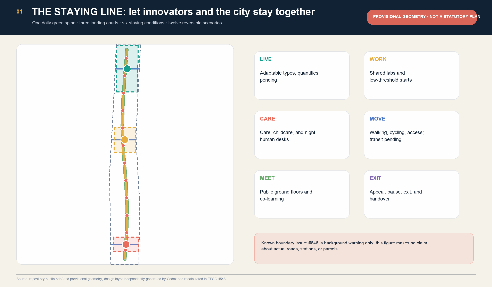
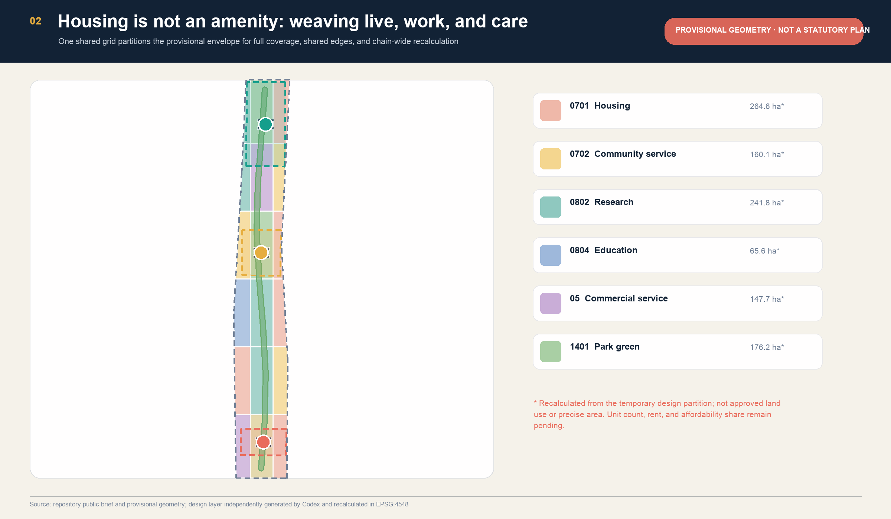
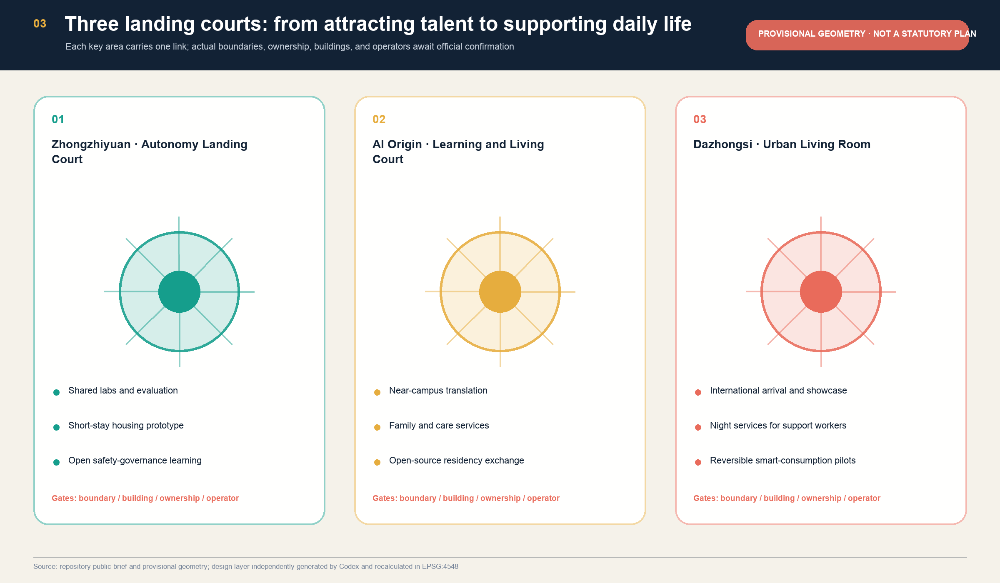
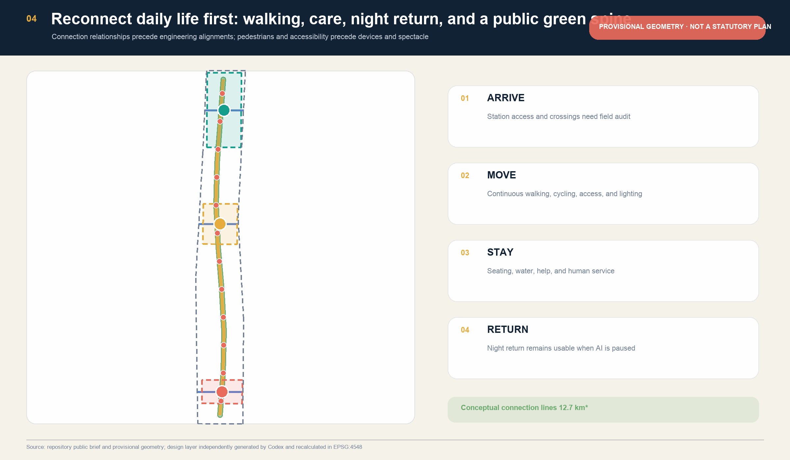
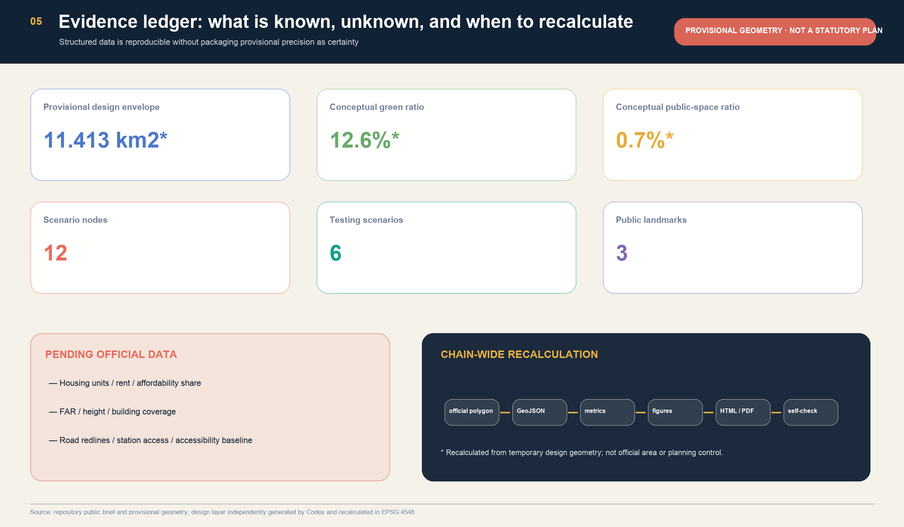

# THE STAYING LINE / 京张留城: From Talent Attraction to Affordable Staying

## Design Basis and Source List

This proposal addresses an urban question often hidden by the phrase “talent attraction.” After a person arrives in an AI innovation district, can they afford to stay, access experimental space, find childcare and care, travel safely, take part in public life, and appeal or exit when an algorithmic service is unsuitable? The announcement explicitly calls for coordination among jobs, housing, commerce, and services and for an integrated work–life–social–learning system. “The capacity to stay” therefore translates the official people–city–industry objective into everyday urban form rather than inventing a separate brief. [source:OFFICIAL-ANNOUNCEMENT] [standard:PROJECT-OFFICIAL-ANNOUNCEMENT]

The formal basis comprises the official prequalification announcement, the cleared Agent open-call taskbook, the MOHURD urban-design and regulatory-detailed-planning rules, and the MNR land-use classification guide. `data/source_registry.json` defines what each item may support; `data/processed/` is navigation only. The repository currently lacks official polygons, approved controls, a housing and rent baseline, verified buildings and ownership, road redlines, heritage controls, and municipal evidence. This proposal does not manufacture those facts. [source:SOURCE-REGISTRY] [depth:existing_conditions_diagnosis]

The spatial layer retains the maintainer-provided `provisional_boundaries.geojson` and explicitly accepts the warning in community Issue #846: the temporary Overall Design Area materially diverges from another observation path based on the heritage park, street centrelines, and related locations. Yet OSM and text-derived alternatives are not official boundaries either and cannot silently replace it. All coordinates, recalculated areas, ratios, nodes, and building envelopes are therefore for intake, design discussion, and chain-wide recalculation only; they make no claim about actual parcels. [data:geometry/site_boundary.geojson#SITE-001] [source:COMMUNITY-ISSUE-846]

OpenAI Codex generated this package independently in a new sparse worktree and did not read or reuse the earlier Kimi proposal’s narrative, GeoJSON, figures, or generation scripts. Six international cases are used only to compare mechanisms; no drawings, images, ratios, or quantities are copied. The package contains ten locally generated bilingual figures, four PDFs, and two offline visual pages. The complete generation and rights boundary is recorded in `report/copyright_statement.md`. [source:AGENT-TASKBOOK]

## Three-Level Scope Framework

The Staying Line assigns a distinct type of decision to each official scope. The Coordinated Research Area asks who can stay and what industry, housing, service, and public-space support chains they need. The Overall Design Area asks how those supports form a continuous, accessible, and operable network. The Key-Area Detailed Design Area tests three different combinations through three “landing courts.” This transmission uses official scope names and announced approximate areas but never treats provisional polygons as official boundaries. [standard:PROJECT-OFFICIAL-ANNOUNCEMENT] [depth:three_level_scope_framework]

| Level | Core question | Proposal response | Auditable location |
| --- | --- | --- | --- |
| Coordinated Research Area | How do innovation resources become a long-term capacity to stay? | Connect talent, innovation, service, and housing-support chains through six staying conditions | Sources, case-mechanism table, compliance matrix |
| Overall Design Area | How can daily life and innovation space become mutually accessible? | One daily green spine, three east–west arrival links, a complete live–work–care land-use weave, and twelve reversible scenarios | Land use, roads, green space, public space |
| Key-Area Detailed Design Area | How can the three areas carry different links in the chain? | Zhongzhiyuan Autonomy Landing Court, AI Origin Learning and Living Court, and Dazhongsi Urban Living Room | Key areas, building prototypes, bilingual drawings |

The six-part Staying Contract is the spatial core. **Live** means adaptable housing support without fabricated quantities. **Work** means shared experimentation, incubation, and validation. **Care** means childcare, care, night services, and human fallback desks. **Move** means walking, cycling, accessibility, and transit connection. **Meet** means public ground floors, co-learning, and deliberation. **Exit** means appeal, pause, deletion, and operational handover. Each part requires a spatial carrier, accountable operator, verification measure, and exit condition. [source:AGENT-TASKBOOK] [depth:overall_spatial_structure]

The identity direction folds two railway lines into an open doorway. The twin lines refer both to the Jing-Zhang Railway and to work and life as inseparable tracks; six short marks inside the door stand for the six conditions. Teal represents open collaboration, gold railway memory, and coral visible risk and human intervention. The final mark still requires professional design, rights clearance, and trademark review, and may not use corporate marks, portraits, or unlicensed fonts.

## Coordinated Research Area: Industry and Future City Research

A world-class innovation ecosystem should not be described only through company, capital, or publication counts. For urban design, the ecosystem also includes arrival, first launch, shared work, family formation and long-term relationships, team changes, and the ability to leave a system safely. When housing, care, night services, and civic encounter are treated as external amenities, the district transfers access barriers and living costs to individuals. The Staying Line therefore treats the capacity to remain as a public performance of industrial space rather than an investment promise. [source:OFFICIAL-ANNOUNCEMENT] [standard:PROJECT-AGENT-OPEN-CALL-TASKBOOK]

Six first-party institutional cases offer mechanisms, not transferable planning numbers:

| Case | Mechanism | Jing-Zhang translation | Explicitly not copied |
| --- | --- | --- | --- |
| Singapore one-north | Work–live–play–learn integration with public space, learning, accommodation, and research | Put all six conditions into space and operation | Scale, building counts, investment, and transport frequencies [source:CASE-ONE-NORTH] |
| Paris STATION F / Flatmates | Startup campus linked to flexible shared housing and communal services | A “start” includes arrival, housing, and neighbourhood support, not only a desk | Rent, eligibility, and matching systems [source:CASE-STATION-F] |
| Paris-Saclay Moulon | Research and education integrated with student and family housing, commerce, public facilities, and walking | Connect near-campus innovation with family life in the AI Origin court | Construction quantities, transport promises, and delivery timing [source:CASE-PARIS-SACLAY] |
| Barcelona 22@ | Innovation transformation combined with housing, green space, public transport, and city services | Require housing and public space to enter the renewal brief together | Legal tools, density, and land policy [source:CASE-BARCELONA-22AT] |
| Cambridge Kendall MXD | Innovation space and diverse housing within one mixed-use and publicly reviewed process | Place housing-fairness review at the renewal gate rather than after delivery | Zoning clauses, housing counts, and approval outcomes [source:CASE-KENDALL-MXD] |
| Toronto MaRS | Research, startups, corporations, adoption partners, and public-interest purpose curated by a platform | Give each court an operator, users, and a public review interface | Company lists, performance, finance, or local partnerships [source:CASE-MARS] |

The local translation creates a Three Zones and Two Wings support loop. Zhongzhiyuan carries the **launch loop** for full-stack independent innovation and visible validation. AI Origin carries the **learning loop** connecting universities, translation, shared learning, and everyday housing support. Dazhongsi carries the **exchange loop** for market translation, AI-native consumption, international arrival, and night services. The Zhongguancun Technology Services Wing provides legal, intellectual-property, capital, talent, and enterprise-service interfaces; the Xiaoyue River Scenario Enablement Wing provides daily services, public experience, and field feedback. These are functional types, not claims that named organisations have agreed to participate.

The six conditions also answer the five official functions. Work and Exit support full-stack innovation and AI governance; Live, Care, and Meet support a world-class ecosystem; Move and Meet support AI-enabled scenarios; the daily green spine supports an active AI city; and visible audit, appeal, and exit create an experiential governance interface. Regional collaboration is structured as open challenge, resident team, controlled pilot, public retrospective, and method archive, not through invented partner lists. [depth:overall_spatial_structure]

## Overall Design Area: Urban Renewal and Regulatory-Plan-Level Urban Design

The overall structure is “one spine, three courts, two wings, twelve stations.” The spine is the daily green spine; the courts correspond to the three key areas; the wings are technology-service and scenario-support loops; and the stations are reversible AI scenario nodes. The structure prioritises daily access relationships rather than unverified engineering alignments. `land_use.geojson` contains eighteen shared-edge polygons generated by intersecting one grid with `SITE-001`, covering the provisional envelope without designed gaps or overlaps. It is a reproducible conceptual-function plan, not approved land use. [data:geometry/land_use.geojson#LU-001] [depth:land_use_layout]

Renewal follows “survey first, share second, build last.” First verify buildings, time-based vacancy, public ground floors, accessibility barriers, service gaps, and operator responsibility. Next test reversible furniture, shared scheduling, temporary permissions, and human service to determine whether new space is necessary. Only after official boundaries, ownership, approved controls, structural safety, heritage, municipal evidence, and public input are available should professional teams decide renovation or new construction. This order prevents a persuasive concept envelope from becoming a demolition or construction conclusion. [standard:MOHURD-CONTROL-DETAILED-PLANNING] [depth:retain_renovate_demolish]

The spatial weave distributes housing, research, education, community services, commercial services, and park green space across six north–south bands and three east–west columns. Housing is not a closed enclave, and community service is not residual land; each research segment should have adjacent housing support, care, or civic encounter. The building layer contains twelve small prototypes that test adjacency among housing, experimentation, care, and neighbourhood living rooms. Height, total floor area, housing units, rent, and affordability share all remain pending official data. [data:geometry/buildings.geojson#BLDG-001] [metric:building_footprint_area_sqm]

“Regulatory-plan-level urban design” is represented here by a complete machine-readable partition, a strict distinction between known and unknown metrics, stable IDs for every function and phase, a dedicated gap ledger, and one evidence chain across text, figures, HTML, PDF, and GeoJSON. It is not represented by fabricated FAR, height, road redlines, or engineering feasibility. Statutory regulatory planning and integrated implementation planning remain the responsibility of qualified professional teams and lawful approval procedures. [depth:development_intensity_controls]

## Detailed Design of Key Areas

The three key areas are not three identical AI campuses; they are different stations in the process of staying. Their polygons all come from the repository’s provisional data, and their rectangular edges and area fitting do not represent roads, parcels, or ownership. Detailed design therefore addresses functional combinations, public interfaces, operation, and required evidence rather than claiming final physical boundaries. [data:geometry/key_areas.geojson#PROV-KEY-001] [depth:three_key_area_detailed_design]

**Zhongzhiyuan · Autonomy Landing Court.** Its purpose is to lower the spatial threshold for a first validation: shared labs and evaluation, a short-stay housing prototype, open learning about standards and safety governance, public exhibition, and a low-carbon exchange garden organised around a walkable civic centre. Any industry test requires accountable ownership, defined data, booking, human release, stop conditions, and incident review. Official polygons, Qinghe and green-line evidence, buildings, Fifth Ring transport, energy capacity, fire safety, and an operator must be confirmed. No national platform, company, or government participation is implied. [data:geometry/key_areas.geojson#PROV-KEY-001]

**Beijing AI Origin · Learning and Living Court.** Its purpose is to make near-campus innovation more than a short commute. Translation, open-source learning, visiting-researcher housing, family life, childcare, care, and community services share accessible ground floors. Kitchens, laundry, learning, child-friendly and quiet-work spaces are core infrastructure rather than secondary amenities. Walking links express campus–park–street intent only; actual Wudaokou and Qinghuadongluxikou entrances require field audit. Housing and facility baselines, university and ownership consent, buildings, transit access, accessibility, heritage, and noise evidence are required. [data:geometry/key_areas.geojson#PROV-KEY-002]

**Dazhongsi · Urban Living Room.** Its purpose is to place international arrival, Agent and terminal display, content consumption, night services for support workers, and ordinary neighbourhood life in one urban interface. Four-quadrant pedestrian connection is a question for professional verification, not a decided bridge or tunnel. Showcases, food, rest, charging, human service, and civic deliberation must continue to function when smart displays close. Station access, intersection conditions, road redlines, commerce and service baselines, heritage, cycling, and night-safety evidence are required. [data:geometry/key_areas.geojson#PROV-KEY-003]

All three courts use a gradient from public ground floor to shared court, quiet work or housing, and back-of-house support. Landmarks are not oversized icons but legible and maintainable public facilities. Each court begins with a reversible prototype and public retrospective; expansion may be discussed only after professional review confirms public value, maintenance capability, and side effects. [standard:MOHURD-URBAN-DESIGN-MEASURES]

## AI Innovation Ecosystem, Personas, and AI+ Scenarios

“AI talent” is not treated as a single young researcher. Six personas test fairness: a time- and capital-constrained first-time startup team; a research family with children or care responsibilities; an international visitor without local language or credit history; support workers who sustain labs, food, logistics, cleaning, and maintenance; existing residents who value quiet and human services; and disabled users, temporarily injured users, and carers. Personas are not individual profiles and may not drive commercial recommendation or automated eligibility decisions. [source:AGENT-TASKBOOK] [depth:three_key_area_detailed_design]

| Scenario | Type and place | Minimum data | Human review, exit, and responsibility |
| --- | --- | --- | --- |
| 01 Housing-source navigator | Service desks in three courts | Public listings, eligibility rules, required documents | Explains options only; authorised institutions decide; offline service remains |
| 02 Shared-lab scheduler | Zhongzhiyuan industry test | Equipment slots, certification, risk tier | Manager release, appeal, and immediate suspension on anomalies |
| 03 Childcare and care relay | AI Origin public service | Necessary needs submitted with explicit consent | No inference of health or family status; human confirmation for each service |
| 04 Accessible arrival companion | Green spine public test | Field-verified slopes, barriers, opening times | Users report errors; invalid routes are removed; physical signs remain authoritative |
| 05 Safe night-return companion | Dazhongsi and spine public test | Lighting, staffing, help points; no face recognition | Human takeover, ordinary passage retained, public incident review |
| 06 Housing fairness audit | Three courts industry test | De-identified rule inputs and allocation outputs | Does not allocate housing; explains differences, supports appeal and pause |
| 07 Newcomer city onboarding | Arrival nodes | Public transport, services, community, and cultural information | Multilingual human desk with source and update date |
| 08 Community energy negotiation | Shared ground floors, industry test | Authorised aggregate load and equipment state | Professional systems and staff control equipment; residents may refuse |
| 09 Low-speed delivery window | Zhongzhiyuan and Dazhongsi public test | Limited time, path, and equipment status | Pedestrians first; site manager can pause immediately; incidents logged |
| 10 Jing-Zhang memory co-curation | Three landmarks | Rights-cleared history and contributor record | Sources, dissent, and revisions visible; no fabricated history |
| 11 Night services for support workers | Dazhongsi urban living room | Public hours for food, rest, charging, and help | No worker tracking; human services first; regular deliberation |
| 12 Global residency exchange | Three courts and two wings | Public applications, outputs, and community return | Clear duration, accommodation, and responsibility; retrospective and handover |

The twelve nodes are recorded in `public_space.geojson`. Scenarios 02, 04, 05, 06, 08, and 09 are testing and validation scenarios with explicit pause and human takeover. The node count is an auditable design inventory, not a deployment count. [data:geometry/public_space.geojson#SCN-01] [metric:scenario_node_count]

Three public landmarks are the **Landing Gate** at Zhongzhiyuan, which displays test conditions, responsibility, and status; the **Co-Living Ledger** at AI Origin, which displays aggregate housing, care, use, appeal, and missing-data records; and the **Homeward Beacon** at Dazhongsi, which makes night human services, accessibility, and help status legible. They may be delivered through light signs, seats, lighting, and information interfaces and do not presume large structures or engineering feasibility. [metric:pilgrimage_landmark_count]

## Land Use, Building Scale, and Retain-Renovate-Demolish Strategy

The land-use layer uses the project-enumerated codes 0701 residential, 0702 community service, 0802 research, 0804 education, 05 commercial service, 1401 park green space, and 1403 public square. Eighteen polygons are cut by intersecting one shared grid with provisional `SITE-001`, so neighbours share edges, the envelope is covered, and areas can be recalculated in EPSG:4548. Every polygon states `official_land_use=false` so conceptual colour cannot be mistaken for an approved use. [standard:MNR-LAND-USE-CLASSIFICATION-GUIDE] [data:geometry/land_use.geojson#LU-001]

Residential land means that housing must be discussed inside the innovation district; it is not a supply promise. It is interwoven with research, education, and commerce and supported by community services and green space. After parcel, ownership, housing-stock, household, rent, vacancy, and facility evidence is available, professional teams must reconsider what can be retained, shared, renovated, or built. Any unit count, rent band, affordability share, or eligibility rule requires a lawful operator and public definition; those metrics remain pending. [metric:land_use_0701_area_sqm]

The twelve building envelopes form four combinable types: adaptable housing, shared lab, childcare/care and human service, and public kitchen/neighbourhood living room. They test adjacency at an approximately hundred-metre scale. `floor_area_sqm` and `height_m` are null, while every `drr_strategy` remains pending building and ownership survey. This lets reviewers understand building–public-space relationships without crossing into retain, renovate, demolish, structural, fire, heritage, or regulatory decisions. [data:geometry/buildings.geojson#BLDG-001] [depth:height_massing_character]

Urban-character guidance has three parts: create continuous, transparent, and enterable public ground floors along the daily green spine; translate railway culture through sleeper rhythm, joined details, mileage, maintenance, and handover rather than copying historic objects; and reduce large bright screens at housing and quiet-work interfaces while making service and maintenance visible. Height, roofs, colour, and massing require official controls and professional urban design.

## Transport, Rail, Municipal Infrastructure, and Public Services

The transport layer expresses relationships, not roads. `ROAD-001` is a north–south daily walking-and-cycling spine; three additional lines express east–west arrival intent at the key areas. Their length in the temporary geometry checks file consistency only. Professional development must first obtain station entrances, road redlines and sections, crossings, slopes, accessibility, traffic, cycling, parking, and incident evidence and conduct accompanied field audits with the slowest and most assistance-dependent users. [data:geometry/roads.geojson#ROAD-001] [depth:traffic_rail_slow_parking]

Transit-station integration uses four checks: **arrive**, with identifiable exits and human help; **move**, with continuous walking, cycling, crossings, and accessibility; **stay**, with seating, water, toilets, shelter, charging, and help; and **return**, with basic passage at night, after events, and when smart systems pause. Specific changes at Wudaokou, Qinghuadongluxikou, and Dazhongsi remain questions for field review, not approved bridges, tunnels, or intersection works.

Municipal and new infrastructure should be small, distributed, isolatable, and stoppable. Edge compute, charging, sensing, and energy-negotiation nodes may combine with public service ground floors, but actual capacity, load, utilities, cooling, noise, fire, cybersecurity, and maintenance responsibility require professional evidence. Doors, lighting, accessible passage, help, and human service may not fail when an AI service fails. [depth:municipal_new_infrastructure]

Public services use one visible human desk, one public digital directory, and one accountable referral chain. Housing, childcare, care, legal and IP support, entrepreneurship, health navigation, and night services identify responsibility, hours, and appeal before introducing an assistant. Because facility and operator baselines are missing, the proposal supplies a spatial and service brief but does not claim that new facilities, staff, or budgets are confirmed. [source:OFFICIAL-ANNOUNCEMENT]

## Blue-Green Network, Public Space, and Urban Character

The daily green spine is generated by buffering a conceptual movement line, joining it to three landing gardens, and clipping it to provisional `SITE-001`. It expresses the priority of continuous public life, not an official green line, water system, or delivered park boundary. Each garden supports open validation, learning and living, or urban exchange. Its minimum contract is seating, drinking water, shelter, help, human service, and continued basic use when devices stop. [data:geometry/green_space.geojson#GREEN-001] [depth:blue_green_public_space]

The current conceptual green ratio is approximately 12.6%, while the three public courts represent approximately 0.7% of the temporary envelope. These ratios prove consistency among GeoJSON, metrics, figures, and HTML only; they are not planning targets or comparison scores. Official boundaries, green and blue lines, trees, heritage, and approved controls trigger chain-wide recalculation. [metric:green_ratio] [metric:public_space_ratio]

The character narrative moves “from a railway that carried material to an open line that carries everyday relationships.” Jing-Zhang history is not decoration on AI equipment; mileage, timetables, signals, inspection, and responsibility handover become public language. Zhongguancun culture contributes open problems, prototyping, and translation. AI culture requires that models, data, responsibility, failure, and exit are publicly legible. Wayfinding has three distinct layers: belt identity and six conditions, railway-cultural mileage, and scenario status and responsibility. Corporate brands do not replace them.

The Landing Gate, Co-Living Ledger, and Homeward Beacon form three pilgrimage and recognition nodes. Contribution includes research and enterprise but also maintenance, care, accessibility repair, public retrospective, and the decision to stop an unsuitable pilot. Displays retain provenance, licence, role, and a route for correction instead of becoming corporate advertising walls. [standard:MOHURD-URBAN-DESIGN-MEASURES]

## Renewal Projects, Implementation Policy, and Phasing

Projects are ordered by verifiability, stoppability, and handover rather than imagined investment: P1 builds boundary, housing, building, mobility, facility, and heritage baselines; P2 establishes a service directory and human desk; P3 completes accompanied accessibility and night-return audits; P4 tests one shared-ground-floor and garden prototype in each court; P5 operates housing-fairness review and six controlled tests; P6 establishes a global residency, community return, and archive. All are conceptual recommendations, not commitments of government project, finance, land, or operation. [data:geometry/phasing.geojson#PHASE-01] [depth:renewal_project_list]

Five implementation policies follow. **Baseline before target:** do not fill numbers without housing and facility evidence. **Sharing before construction:** test time-sharing and reversible conversion first. **Public return with every pilot:** each industry test provides a visible public service. **Human fallback in the operating contract:** it cannot remain an afterthought. **Exit and handover count as success:** stopping an unsuitable system is a governance achievement. Lawful bodies and professional teams must assess these recommendations; they are not current policy.

Three gated phases are used. Phase 1, Evidence and Service Baseline, adds public data, field survey, responsibility records, and human desks. Phase 2, Reversible Pilots in Three Courts, permits only small-scale, limited-duration prototypes with defined users and incident response. Phase 3, Network Expansion after Evaluation, requires public review of equity, accessibility, maintenance burden, complaints, data minimisation, and public value. The three polygons in `phasing.geojson` are a machine-readable gate diagram, not a construction schedule. [depth:phasing_implementation]

The annual operation concept forms a four-season loop: a spring Staying Baseline Week publishes problems and gaps; a summer Co-Living Test Season opens controlled pilots; an autumn Jing-Zhang Residency Exchange links developers, residents, and international partners; and a winter Shutdown and Handover Day reviews failure, exit, and maintenance. Developer communities begin with real urban questions and public evidence. Resident teams return documentation, data dictionaries, risks, and community benefit at the end. Names and dates are concepts, not confirmed events. [source:AGENT-TASKBOOK]

## Metrics, Area Recalculation, and Compliance Matrix

Every known spatial metric is recalculated from the submitted GeoJSON after projection to EPSG:4548. The temporary design envelope is approximately 11.413 km²; conceptual green space is about 143.36 ha and 12.6%; the three public courts total about 7.96 ha and 0.7%; conceptual building footprints total about 8.49 ha; and conceptual connection lines total about 12.69 km. The design inventory contains three key areas, twelve scenarios, six testing and validation scenarios, three landmarks, and three gated phases. Every area and ratio remains affected by provisional geometry and is not an official indicator. [metric:site_area_sqm] [depth:metrics_recalculation]

Metrics deliberately kept unknown include total floor area, FAR, building coverage, height, housing units, rent, affordability share, current vacancy, service capacity, and real travel time. `unknown` is a safeguard against promoting temporary shapes, external cases, or Agent inference into statutory fact. When official polygons arrive, the chain must be rebuilt in the order `official polygon → GeoJSON → metrics → figures → HTML/PDF → self-check`; changing only a displayed number is invalid. [metric:floor_area_ratio]

`compliance_matrix.json` maps twenty-three announcement and Agent requirements. `standard_matrix.json` responds to six registered standards, preserving a data gap for the architectural-depth reference that lacks an official file. `design_depth_matrix.json` covers fifteen formal-depth items. Matrices carry exhaustive audit relationships while prose keeps one to three claim-adjacent anchors. The A3 booklet has seven pages and the A0 board set two pages, each with an English or Chinese counterpart; figures, visual HTML, PDF, and structured data share one source. [standard:PROJECT-AGENT-OPEN-CALL-TASKBOOK]

Local verification distinguishes four layers: GeoJSON and metrics are reproducible design facts; provisional warnings are limitations; validator PASS indicates basic eligibility for machine and content review only; and professional scoring, selection, approval, and implementation are separate decisions. Any later manual edit requires refreshed manifest hashes and rerunning render, finalize, self-check, and participant preflight.

## Risk, Copyright, and Compliance

The largest risk is boundary misreading. Issue #846 reports a material mismatch between the repository provisional envelope and another observation path. This proposal neither hides the issue nor silently replaces the boundary with OSM-derived geometry. Every figure uses a low-contrast dashed temporary constraint, while the proposal, sources, assumptions, metrics, HTML, and self-check require chain-wide recalculation after official polygons arrive. [source:COMMUNITY-ISSUE-846] [depth:risk_missing_data]

A second risk is false quantification or automated exclusion in housing. Without local housing, rent, household, and affordability definitions, the proposal reports no unit count, rent, share, or population quota. Future data must be lawful, necessary, and explainable and may not use sensitive attributes to automate eligibility. The housing navigator explains public information only; the fairness audit compares outputs and supports human appeal; authorised bodies retain every allocation decision.

A third risk is expanded surveillance. Scenarios default against face recognition, continuous personal tracking, private corporate data, and opaque scoring. They require minimum necessary data, short retention, role-based access, public logs, human review, complaint, pause, deletion, and exit. Safety, energy, delivery, accessibility, and care scenarios require risk assessment and professional or regulatory review; “pilot” status does not waive legal, safety, or ethical responsibility. [source:AGENT-TASKBOOK]

A fourth risk is mistaking concept diagrams for engineering. Buildings, roads, green space, landmarks, phases, and operation are marked conceptual. Without ownership consent, approved controls, structural and fire evidence, heritage, utilities, and transport evidence, the proposal makes no parcel-level retain-renovate-demolish, bridge, tunnel, road, utility, load, investment, approval, or delivery-timing conclusion. Qualified teams and lawful bodies make final decisions through public participation. [standard:MOHURD-CONTROL-DETAILED-PLANNING]

The package embeds no external map, photograph, logo, portrait, or case drawing. Text, JSON, GeoJSON, HTML, PNG, and PDF are independently generated by Codex; system fonts are used for rendering but font files are not distributed. Case records retain institution, public URL, mechanism summary, and limitations only. The announcement’s intellectual-property clauses, source licences, and the front-matter `COMMUNITY-DISPLAY-ONLY` term apply together; rights holders and organisers must confirm any further reuse.

## References

The formal task basis is the Haidian Branch official prequalification announcement, the repository’s cleared Agent taskbook, MOHURD’s Measures for the Administration of Urban Design and regulatory-detailed-planning rules, and MNR’s land-use classification guide. They support the task, urban-design and character principles, statutory-control boundary, and terminology respectively; none supplies the missing official polygons or project-specific approved controls. [source:OFFICIAL-ANNOUNCEMENT] [source:AGENT-TASKBOOK]

Spatial generation uses only `brief/site-package/geometry/provisional_boundaries.geojson`, with `data/source_registry.json`, the processed fact pack, planning limits, and schemas as audit conditions. Issue #846 discloses provisional-boundary risk only and is not upgraded into official fact or replacement geometry. Actual uses, access dates, allowed uses, and prohibited uses are listed in `sources.json`; six prerequisite gaps are recorded in `assumptions.json`. [source:BOUNDARY-SOURCE] [source:SOURCE-REGISTRY]

International mechanism cases are JTC one-north, STATION F Flatmates, EPA Paris-Saclay Moulon, Barcelona 22@, Cambridge Kendall MXD, and Toronto MaRS. They compare work–live–play–learn integration, flexible shared housing, research with family life, housing and public space inside innovation renewal, public review, and public-interest platforms. This proposal copies none of their numbers, drawings, legal tools, company lists, or performance and does not imply that these institutions participate in Jing-Zhang.

The authority order is GeoJSON, metrics, three matrices, manifest/sources/assumptions/self-check, proposal, figures, HTML, and PDF. Visuals explain rather than independently support boundary, area, planning-control, or implementation claims. Chinese controls interpretation, while this file is the complete aligned English counterpart; any ambiguity should be checked against the Chinese text and structured data together.
