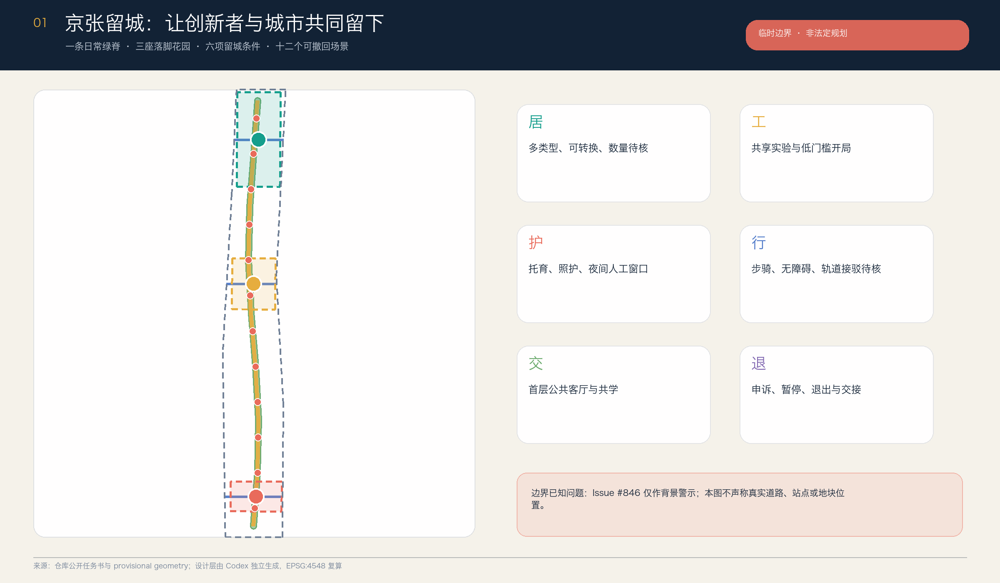
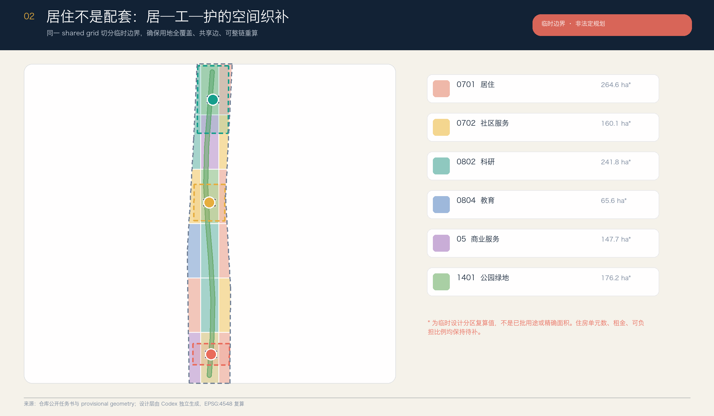
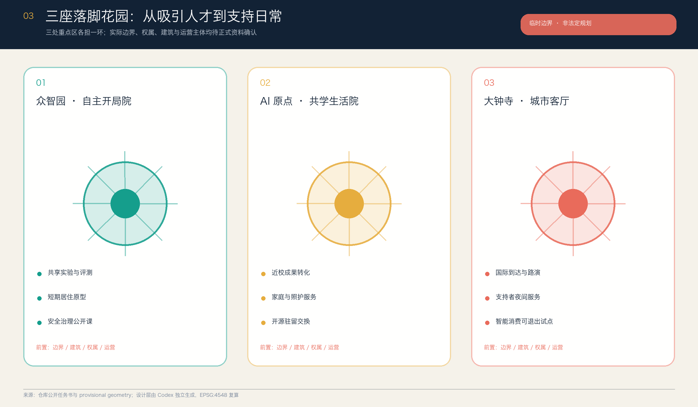
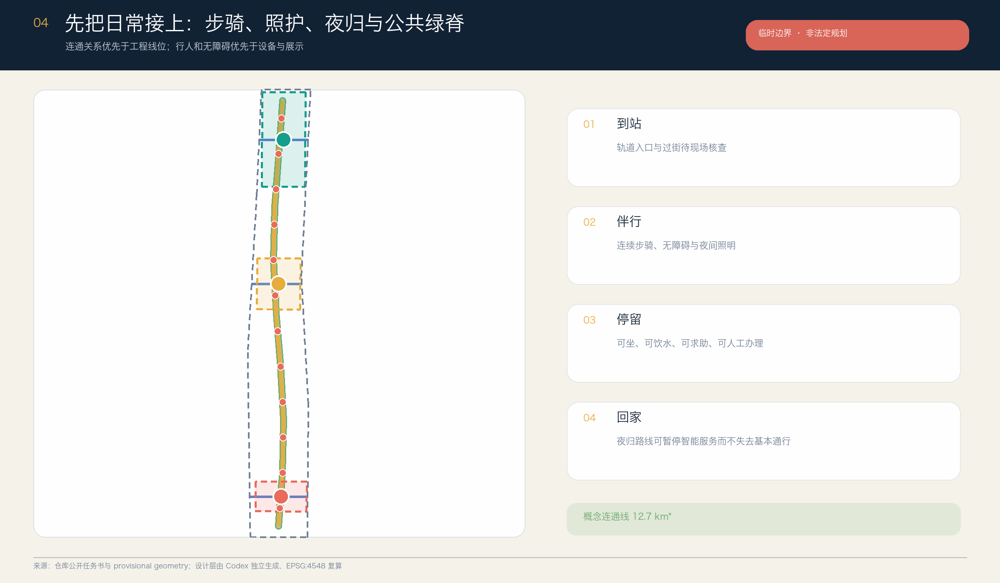
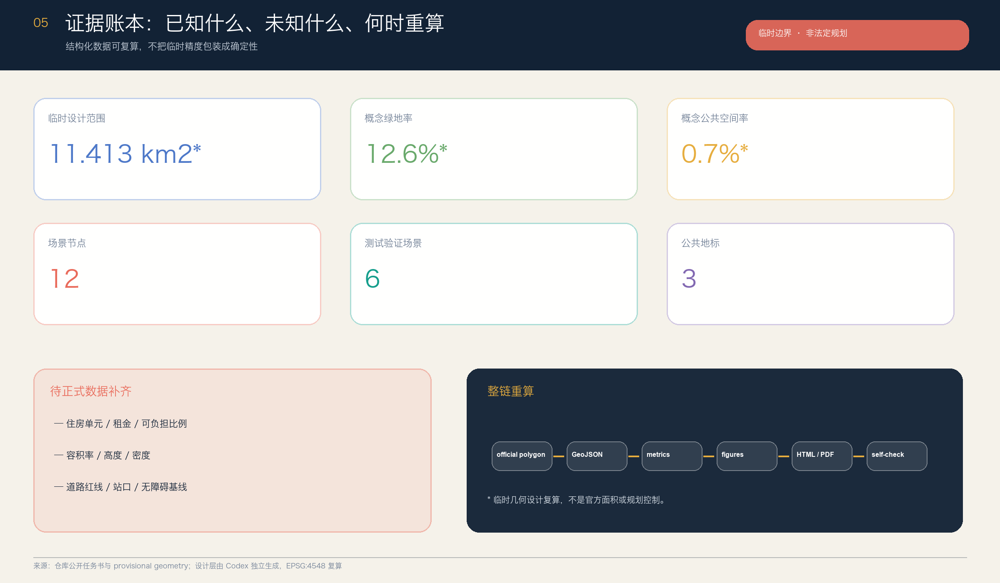

# 京张留城 / THE STAYING LINE：从人才吸引到可负担停留

## 设计依据与资料清单

本方案选择一个常被“人才吸引”口号遮蔽的城市问题：一个人来到 AI 创新带之后，是否住得起、进得去实验空间、找得到托育和照护、能安全通勤、能参与公共生活，也能在算法或服务不合适时申诉和退出。公告已明确要求协调职住商服，并建立“工作—生活—社交—学习”一体化空间系统；因此“留得下”不是新增赛题，而是把官方的人—城—产目标落实到日常城市尺度。[source:OFFICIAL-ANNOUNCEMENT] [standard:PROJECT-OFFICIAL-ANNOUNCEMENT]

正式依据包括：官方资格预审公告；用户清权的面向智能体任务书；住建部《城市设计管理办法》和控规编制审批办法；自然资源部用地分类指南。仓库 `data/source_registry.json` 用于判断每项资料可以支撑什么，`data/processed/` 只作阅读导航。当前没有 official polygon、控规条件、住房和租金基线、现状建筑权属、道路红线、文保和市政资料，故本方案不制造这些事实。[source:SOURCE-REGISTRY] [depth:existing_conditions_diagnosis]

空间层沿用仓库维护者提供的 `provisional_boundaries.geojson`，并明确接受社区 Issue #846 的警示：该临时总体设计范围与另一路径观察到的京张遗址公园、道路中线和相关点位存在明显偏差；但 OSM 与文字四至推导同样不是官方红线，不能直接替换。故所有坐标、复算面积、比例、节点和建筑轮廓只承担 intake、设计讨论与整链重算测试，不声称真实地块位置。[data:geometry/site_boundary.geojson#SITE-001] [source:COMMUNITY-ISSUE-846]

方案产物由 OpenAI Codex 在新的 sparse worktree 中独立生成，未读取或复用此前 Kimi 版本的正文、GeoJSON、图件或生成脚本。六个国际案例只比较机制，不复制图纸、图片、比例或数值；本包使用本地生成的十张中英图件、四份 PDF 和双语离线 HTML。完整生成与版权边界见 `report/copyright_statement.md`。[source:AGENT-TASKBOOK]

## 三层范围工作框架

“京张留城”把三层范围组织成三种不同的判断尺度。统筹研究范围讨论“谁能留下”及其所需的产业、住房、服务和公共空间支持链；总体设计范围讨论这些支持如何形成连续、可达、可运营的空间网络；重点区域范围用三座“落脚花园”测试不同组合。此传导关系只使用公告所确认的层级名称和约面积，不把临时 polygon 当作官方边界。[standard:PROJECT-OFFICIAL-ANNOUNCEMENT] [depth:three_level_scope_framework]

| 层级 | 核心问题 | 本方案回答 | 可核验落点 |
| --- | --- | --- | --- |
| 统筹研究范围 | 创新资源怎样转成长期留下能力 | 以居、工、护、行、交、退六项“留城条件”连接人才链、创新链、服务链与住房支持链 | `sources.json`、案例机制表、任务覆盖矩阵 |
| 总体设计范围 | 日常生活和创新空间怎样互相可达 | 一条日常绿脊、三条东西到达线、居—工—护完整用地织补、十二个可撤回场景 | `land_use`、`roads`、`green_space`、`public_space` |
| 重点区域范围 | 三处片区如何各担一环 | 众智园“自主开局院”、AI 原点“共学生活院”、大钟寺“城市客厅” | `key_areas`、建筑原型、双语图纸 |

“留城六约”是本方案的空间合同：**居**是多类型、可转换且不虚报数量的居住支持；**工**是共享实验、孵化和验证；**护**是托育、照护、夜间服务和人工窗口；**行**是步骑、无障碍和轨道接驳；**交**是公共首层、共学与议事；**退**是申诉、暂停、数据删除和运营交接。六约不是宣传口号，每一约都必须有空间载体、责任主体、核验指标和退出条件。[source:AGENT-TASKBOOK] [depth:overall_spatial_structure]

视觉识别以“两道轨线折成一扇开门”为 Logo 方向：双线既指京张铁路，也指工作与生活两条不可分离的轨道；门内六个短刻度对应六约；青色代表开放协作，金色代表铁路记忆，珊瑚色代表需要被看见的风险与人工介入。标识不得使用企业商标、人物肖像或未经授权字体，最终 Logo 仍需专业设计和商标检索。

## 统筹研究范围产业与未来城市研究

世界级创新生态不应只用企业、资本或论文数量描述。对城市设计而言，生态还包括“抵达—开局—共同工作—形成家庭或长期关系—更换团队—退出系统”这一完整人生与组织过程。若住房、照护、夜间服务和公共交往被当作园区外部配套，创新带会把进入门槛和生活成本转嫁给个人；本方案因此把“留城能力”作为产业空间的公共性能，而非招商承诺。[source:OFFICIAL-ANNOUNCEMENT] [standard:PROJECT-AGENT-OPEN-CALL-TASKBOOK]

六个一手机构案例提供机制参照，但不提供可直接搬用的规划指标：

| 案例 | 可转化机制 | 京张转译 | 明确不复制 |
| --- | --- | --- | --- |
| 新加坡 one-north | work-live-play-learn 与公共空间、学习、居住和科研设施共同组织 | 六约同时进入空间和运营表 | 规模、建筑数量、投资和交通班次 [source:CASE-ONE-NORTH] |
| 巴黎 STATION F / Flatmates | 创业校园与灵活共享居住、公共餐饮、洗衣和活动空间连接 | “开局”不只给工位，也给到达、居住和邻里支持 | 租金、资格和平台匹配机制 [source:CASE-STATION-F] |
| Paris-Saclay Moulon | 高校科研、学生及家庭住房、商业、学校、托育和慢行共同成为 urban campus | AI 原点以共学生活院连接近校创新与家庭日常 | 建设量、交通承诺和开发时序 [source:CASE-PARIS-SACLAY] |
| Barcelona 22@ | 创新转型与住房、绿地、公共交通和城市服务并置 | 用地织补必须同时回应生活与公共空间 | 法律工具、密度和土地政策 [source:CASE-BARCELONA-22AT] |
| Cambridge Kendall MXD | 创新空间、多类型住房与公开审查纳入同一混合更新过程 | 把住房公平审计放入更新门，而非事后补偿 | 分区条款、住房数量和审批结论 [source:CASE-KENDALL-MXD] |
| Toronto MaRS | 研究、初创、企业、采用伙伴与公共利益使命由平台组织 | 三院各有运营者、使用者和公开复盘界面 | 企业名单、绩效、资金或本地合作关系 [source:CASE-MARS] |

本地转译形成“三区两翼支持回路”：众智园承担全栈自主创新与公开验证的**开局环**；AI 原点承担高校策源、成果转化、共享学习和日常居住支持的**共学环**；大钟寺承担市场转化、智能原生消费、国际抵达和夜间服务的**交换环**。中关村科技服务翼提供法务、知识产权、资本、人才和企业服务接口；小月河场景赋能翼提供生活服务、公共体验和现场反馈。所有机构和项目名称均是功能类型，不暗示现有单位已承诺参与。

六约也对应五大功能：工与退支撑 AI 全栈自主创新和治理；居、护、交支撑世界级创新生态；行与交支撑 AI+ 场景；日常绿脊形成智能化活力城市；公开审计、申诉和退出为 AI 治理话语提供可体验界面。区域协同不以虚构企业名实现，而以“开放问题—驻留团队—受控试点—公开复盘—方法归档”的协议，与北京其他创新节点及京津冀伙伴建立可移植合作接口。[depth:overall_spatial_structure]

## 总体设计范围城市更新与控规深度城市设计

总体结构为“一脊、三院、两翼、十二站”：一脊是日常绿脊；三院对应三处重点区；两翼是科技服务与场景赋能支持回路；十二站是可撤回的 AI 场景节点。结构强调**日常可达关系**，不画未经证实的工程线位。`land_use.geojson` 由同一 shared grid 与 `SITE-001` 相交生成 18 个共享边分区，完整覆盖临时边界且不重叠；这是一张可复算的概念功能图，不是已批用地。[data:geometry/land_use.geojson#LU-001] [depth:land_use_layout]

更新策略采用“先盘点、再共用、后建设”。第一优先是核验现状建筑、空置时段、公共首层、无障碍断点、服务缺口和运营责任；第二优先是用可逆家具、共享排程、临时许可和人工服务，测试是否真的需要新增空间；只有在官方边界、权属、控规、结构安全、文保、市政和公众意见齐备后，才由专业团队判断改造或新建。此顺序避免把漂亮的概念建筑直接变成拆迁或建设结论。[standard:MOHURD-CONTROL-DETAILED-PLANNING] [depth:retain_renovate_demolish]

空间织补把居住、科研、教育、社区服务、商业服务和公园绿地分布在六个南北段、三个东西列中。住宅不是封闭大区，社区服务也不是边角设施；每个研究片段旁必须能找到居住支持、照护或公共交往界面。建筑层仅提交十二个小尺度原型，测试“居住—实验—照护—公共客厅”的邻接与首层关系；其高度、总建筑面积、住房单元、租金和可负担比例全部保持待正式数据补齐。[data:geometry/buildings.geojson#BLDG-001] [metric:building_footprint_area_sqm]

控规深度在本包中体现为：完整的机器可读分区；已知与未知指标分开；每个功能、道路、建筑和分期有稳定 ID；法定控制缺口单独登记；正文、图件、HTML、PDF 与 GeoJSON 使用同一来源。它不体现为伪造容积率、高度、道路红线或工程可行性。正式控规与规划综合实施方案仍须由有资质的专业团队依合法程序编制、审查和批准。[depth:development_intensity_controls]

## 重点区域详细设计

三处重点区不是三个相同的“AI 园区”，而是创新者长期留下过程中的三个不同站点。其 polygon 全部来自仓库临时资料，矩形边界和面积拟合不表示道路、宗地或权属；设计只描述功能组合、公共界面、运营逻辑和需要补齐的资料。[data:geometry/key_areas.geojson#PROV-KEY-001] [depth:three_key_area_detailed_design]

**众智园 · 自主开局院。** 目标是降低“第一次验证”的空间门槛：共享实验与评测空间、短期居住原型、标准与安全治理公开课、公共展示和低碳交往花园围绕一个可步行公共核心组织。产业测试只能在明确责任、数据范围、预约、人工放行、停止条件和事故复盘后开放。需补 official polygon、清河和绿线资料、现状建筑、五环相关交通条件、能源容量、消防与运营主体；未经核验不声称国家平台、企业或政府已参与。[data:geometry/key_areas.geojson#PROV-KEY-001]

**北京 AI 原点 · 共学生活院。** 目标是让近校创新不等于短期通勤：成果转化、开源共学、访学居住、家庭生活、托育照护和社区服务共享同一组可达首层；公共厨房、洗衣、学习、儿童友好与安静工作空间不被视为次要配套。慢行只表达校—园—街连接意向，五道口、清华东路西口的具体站口和路线必须现场审计。需补住房与设施基线、校地和权属同意、现状建筑、站点、无障碍、文保及噪声资料。[data:geometry/key_areas.geojson#PROV-KEY-002]

**大钟寺 · 城市客厅。** 目标是把国际到达、智能体和终端展示、内容消费、支持者夜间服务与普通社区生活放进同一城市界面。四象限步行连通是待专业团队验证的问题，不是已定桥隧方案；路演、餐饮、休息、充电、人工办事与公共议事应在智能展示关闭后仍可使用。需补大钟寺站口与路口现状、道路红线、商业和公共服务底数、古钟及京张相关文保条件、非机动车与夜间安全调查。[data:geometry/key_areas.geojson#PROV-KEY-003]

三院共同遵守“公共首层—共享庭院—安静工作／居住—后勤服务”的梯度；地标不追求高大或网红化，而用可读、可维护的公共设施形成记忆。每院先做一组可撤回原型和公开复盘，专业评审确认其公共价值、维护能力和副作用后，方讨论扩展。[standard:MOHURD-URBAN-DESIGN-MEASURES]

## AI 创新生态、人才画像与 AI+ 场景

本方案不用“AI 人才”指代单一的年轻研发者，而以六类画像检查空间是否公平：①首次创业、资金与时间都紧的初创团队；②带儿童或照护责任的研究家庭；③短期访问、语言和本地信用记录不足的国际研究者；④保障实验、餐饮、物流、清洁和运维的支持者；⑤熟悉社区历史、重视安静和人工服务的原有居民；⑥使用轮椅、低视力、听障、认知差异或临时受伤的使用者及陪护。画像不对应个人数据，不用于商业推荐或资格自动判断。[source:AGENT-TASKBOOK] [depth:three_key_area_detailed_design]

| 场景 | 类型与空间 | 最小数据 | 人工复核、退出与责任 |
| --- | --- | --- | --- |
| 01 住源导航 | 三院服务台／生活服务 | 公开房源、资格和办理材料 | 只解释选项；资格由授权机构判断；可线下办理 |
| 02 共享实验排程 | 众智园，产业测试 | 设备时段、认证、风险等级 | 管理员放行；冲突可申诉；异常立即停用 |
| 03 托育照护接力 | AI 原点，公共服务 | 用户主动提交的必要需求 | 不推断健康或家庭状态；人工确认每次服务 |
| 04 无障碍到达伴行 | 日常绿脊，公共测试 | 现场核验的坡度、障碍、开放时段 | 用户可报错；路线失效即撤下，不替代现场导视 |
| 05 夜归安全同行 | 大钟寺—日常绿脊，公共测试 | 照明、值守、求助点，不用人脸 | 人工值守接管；保留普通通行；公开事件复盘 |
| 06 居住公平审计 | 三院，产业测试 | 去标识化的规则输入与分配结果 | 不自动分房；解释差异；设独立申诉和暂停门 |
| 07 新人城市入门 | 到达节点，公共服务 | 公开交通、办事、社区与文化信息 | 多语人工窗口；显示来源与更新时间 |
| 08 社区能源协商 | 共享首层，产业测试 | 经授权的聚合负荷和设备状态 | 专业系统与人员决定控制；居民可拒绝参与 |
| 09 低速配送窗口 | 大钟寺／众智园，公共测试 | 限定时段、路径、设备状态 | 行人优先；现场管理者可一键暂停；事故留档 |
| 10 京张记忆共编 | 三处地标，文化场景 | 清权史料与贡献者说明 | 出处、异议、修订并列；不生成伪历史 |
| 11 支持者夜间服务 | 大钟寺城市客厅 | 公开营业、休息、充电与求助信息 | 不追踪劳动者；人工服务优先；定期共议 |
| 12 全球驻留交换 | 三院与两翼，运营场景 | 公开项目申请、成果与社区回馈 | 明确期限、住宿与责任；结束后公开复盘和交接 |

十二个节点写入 `public_space.geojson`，其中 02、04、05、06、08、09 为六个测试验证场景；每个都有明确的暂停和人工接管条件。场景节点数是设计清单的可核验事实，不是已部署数量。[data:geometry/public_space.geojson#SCN-01] [metric:scenario_node_count]

三处公共地标分别是：众智园“**开局门**”，把测试条件、责任人和当前状态公开在入口；AI 原点“**共栖账本**”，展示住房、照护、空间使用和申诉的聚合结果与缺口；大钟寺“**归家灯塔**”，把夜间人工服务、无障碍和求助状态变成清晰公共信号。地标可由轻型标识、座椅、照明和信息界面组成，不预设高大构筑物或工程可行性。[metric:pilgrimage_landmark_count]

## 用地、建筑规模与拆改留方案

用地分区采用项目枚举中的 0701 居住、0702 社区服务、0802 科研、0804 教育、05 商业服务、1401 公园绿地和 1403 广场用地。18 个 polygon 来自一套共享格网对临时 `SITE-001` 的相交切分，故相邻边共享、总体无缝、面积可在 EPSG:4548 下复算。每个 polygon 的 `official_land_use=false`，防止概念色块被误读为已批用地。[standard:MNR-LAND-USE-CLASSIFICATION-GUIDE] [data:geometry/land_use.geojson#LU-001]

居住分区表达的是“应在创新带内讨论居住”，不是给出住房供应量。它与科研、教育和商业交错，并通过社区服务和绿地形成日常支持；专业团队拿到现状宗地、权属、住房存量、人口家庭、租金、空置和设施数据后，应重新判断哪些空间适合保留、共享、改造或建设。任何单位数、租金档、保障比例和资格规则都须有合法主体与公开口径，当前指标保持待正式数据补齐。[metric:land_use_0701_area_sqm]

十二个建筑轮廓是四类可组合原型：可转换居住、共享实验、托育照护／人工服务、公共厨房／邻里客厅。它们只测试约百米尺度内的邻接关系，`floor_area_sqm` 与 `height_m` 均为空；`drr_strategy` 统一为“待现状建筑和权属调查”。这既满足人类评审对建筑—公共空间关系的理解，也不越过具体拆改留、结构安全、消防、文保或控规判断。[data:geometry/buildings.geojson#BLDG-001] [depth:height_massing_character]

风貌建议不是未来感造型竞赛，而是三条可深化原则：沿日常绿脊形成连续、透光、可进入的公共首层；用轨枕节奏、铆接细部和清晰里程信息转译京张工程文化，而非复制历史构件；居住和安静工作界面减少强光大屏，把设备、后勤和维护界面诚实呈现。建筑高度、屋顶、色彩和体量须在官方控制与专业城市设计中确定。

## 交通、轨道、市政与公共服务设施

交通层只表达关系，不把概念线当道路。`ROAD-001` 是南北日常慢行主线，另外三条线表达重点区与两侧城市的东西到达意向；其在临时 geometry 中的复算长度仅用于检查文件一致性。正式深化须先取得站口、道路红线、断面、交叉口、坡度、无障碍、交通量、非机动车、停车和事故资料，并以最慢、最需要帮助的使用者完成现场同行审计。[data:geometry/roads.geojson#ROAD-001] [depth:traffic_rail_slow_parking]

轨道站点一体化采取“到站—伴行—停留—回家”四段检查：到站须能辨认出口和人工服务；伴行须有连续步骑、过街和无障碍；停留须有座椅、饮水、卫生间、遮蔽、充电和求助；回家须在夜间、活动结束和智能系统暂停时仍保有基本通行。五道口、清华东路西口和大钟寺的具体改善皆为待核问题，不声明已批准连桥、地下通道或路口改造。

市政与新型基础设施遵循“小型、分布、可隔离、可停机”。端侧算力、共享充电、环境感知和能源协商节点可以与公共服务首层组合，但真实容量、负荷、管线、散热、噪声、消防、网络安全和运维责任必须经专业核验。AI 服务失效时，门禁、照明、无障碍通行、求助和人工办理不得同时失效。[depth:municipal_new_infrastructure]

公共服务采用“一个可见人工窗口 + 一套公开数字目录 + 一条转介责任链”：住房、托育、照护、法律、知识产权、创业、医疗导航和夜间支持均先明确谁负责、何时开放、如何申诉，再讨论 AI 助手。由于设施底数和运营者缺失，本方案只给空间与服务 brief，不声称新增设施、编制或经费已确定。[source:OFFICIAL-ANNOUNCEMENT]

## 蓝绿空间、公共空间与城市风貌

日常绿脊由概念慢行线缓冲并与三座落脚花园合并，再裁切于临时 `SITE-001`；它表达连续公共生活的优先级，不是官方绿线、水系或公园实施范围。三座花园分别服务开放验证、共学生活和城市交换，其最小配置是可坐、可饮水、可遮蔽、可求助、可人工办理、可在设备停机时继续使用。[data:geometry/green_space.geojson#GREEN-001] [depth:blue_green_public_space]

当前复算的概念绿地率约 12.6%，三座公共庭院的概念公共空间率约 0.7%。这两个比例只证明 GeoJSON—metrics—图件—HTML 的一致性，不是规划目标，也不用于与其他方案比较；官方边界、绿线、水系、树木、文保和控规到位后必须整链重算。[metric:green_ratio] [metric:public_space_ratio]

城市风貌叙事为“从运送物资的铁路，到承载日常关系的开放线”：京张历史不是贴在 AI 设备上的装饰，而是里程、时刻、信号、检修和责任交接的公共语言；中关村文化体现开放问题、原型和成果转化；AI 新文化则要求模型、数据、责任、失败和退出可被公众读懂。导视分三层：全带 Logo 与六约、京张文化里程系统、场景状态与责任标识，三者不得混用企业品牌。

“开局门、共栖账本、归家灯塔”形成三处朝圣／荣誉节点：贡献不只记录论文、融资和产品，也记录维护、照护、无障碍修复、公开复盘和停止了一个不合适试点的人。荣誉展示必须保留出处、许可、贡献角色和异议渠道，避免把城市空间变成企业广告墙。[standard:MOHURD-URBAN-DESIGN-MEASURES]

## 更新项目清单、实施政策与分期计划

项目清单按“可先验证、可停、可交接”排序，而非按想象投资额排序：P1 建立边界、住房、建筑、交通、设施和文保证据基线；P2 建立统一服务目录与人工窗口；P3 完成三处同行式无障碍和夜归审计；P4 在三院各做一组共享首层与公共花园原型；P5 运行住房公平审计与六个受控测试场景；P6 建立全球驻留、社区回馈和成果归档机制。项目均为概念建议，不代表政府立项、资金、土地或运营承诺。[data:geometry/phasing.geojson#PHASE-01] [depth:renewal_project_list]

实施政策建议有五条：其一，**基线先于指标**，没有住房和设施底数就不填数字；其二，**共用先于新建**，先测试时段共享和可逆改造；其三，**公共回报随试点进入**，每个产业测试同时提供可见公共服务；其四，**人工兜底写入运营合同**，不得作为临时补丁；其五，**退出与交接计入成功**，停止不合适的系统也是治理成果。政策建议需由法定主体和专业团队评估，不构成现行政策。

三阶段门控如下：阶段一“证据与服务基线”，补公开数据、现场调查、责任台账和人工窗口；阶段二“三院可撤回试点”，只做小尺度、有限时段、明确用户和事故响应的原型；阶段三“评估后网络化扩展”，以公平性、可达性、维护负担、公众投诉、数据最小化和公共价值的公开复盘为进入条件。`phasing.geojson` 的三块空间只是机器可读的门控示意，不是建设时序。[depth:phasing_implementation]

年度运营形成四季循环：春季“住城基线周”公开问题与缺口；夏季“共栖试验季”开放受控测试；秋季“京张驻留汇”连接开发者、居民和国际伙伴；冬季“停机与交接日”复盘失败、退出和维护。开发者社区以真实城市问题和公开证据为入口；驻留团队结束时须交还文档、数据字典、风险记录和社区回馈。活动名称与日期均为概念，不是已确定安排。[source:AGENT-TASKBOOK]

## 指标体系、面积复算与合规矩阵

所有已知空间指标均从提交 GeoJSON 投影至 EPSG:4548 后复算：临时设计边界约 11.413 km²，概念绿地面积约 143.36 ha、绿地率约 12.6%，三处公共庭院约 7.96 ha、公共空间率约 0.7%，概念建筑基底约 8.49 ha，概念连通线约 12.69 km；另有 3 个重点区、12 个场景、6 个测试验证场景、3 个公共地标和 3 个门控阶段。所有带面积和比例的值都受临时边界影响，不是官方指标。[metric:site_area_sqm] [depth:metrics_recalculation]

刻意保持未知的指标包括：总建筑面积、容积率、建筑密度、高度、住房单元数、租金、可负担住房比例、现状空置率、服务容量和真实旅行时间。`unknown` 不是缺乏设计，而是防止将临时形状、外部案例或 AI 推断升级为法定事实。取得官方 polygon 后须按 `official polygon → GeoJSON → metrics → figures → HTML/PDF → self-check` 的顺序整链重算，不能只改图面数字。[metric:floor_area_ratio]

`compliance_matrix.json` 覆盖 23 条公告与 agent 要求；`standard_matrix.json` 响应 6 条已登记标准，其中缺官方文件的建筑深度规定保留 data gap；`design_depth_matrix.json` 覆盖 15 项 formal 深度。矩阵保存完整审计关系，正文只在具体判断旁放 1—3 条证据，避免编号堆叠。A3 文册 7 页、A0 展板 2 页，并各有英语对应件；双语图件、HTML 和 PDF 与结构化数据同源。[standard:PROJECT-AGENT-OPEN-CALL-TASKBOOK]

本地自检区分四层事实：GeoJSON 和 metrics 是可复算设计事实；临时边界警示是明确限制；validator PASS 只表示包可进入机器检查和内容评审；专业评分、入选、批准与实施均须另行判断。任何后续手工改动都必须刷新 manifest hash 并重跑 render、finalize、self-check 和 participant preflight。

## 风险、版权与合规说明

最大风险是边界误读。Issue #846 已指出仓库 provisional envelope 与另一路径观察存在明显偏差；本方案既不掩盖问题，也不擅自用 OSM 推导替换官方边界。所有图面用低对比虚线标注临时约束，正文、sources、assumptions、metrics、HTML 和 self_check 均要求 official polygon 到位后整链重算。[source:COMMUNITY-ISSUE-846] [depth:risk_missing_data]

第二类风险是住房议题被伪量化或变成筛选工具。没有本地住房、租金、家庭和可负担口径，故本方案不报单元数、租金、比例和人群配额；未来数据必须合法、必要、可解释，并避免用敏感属性自动决定居住资格。住源导航只解释公开信息，居住公平审计只比较规则输出并提供人工申诉，任何分配仍由授权主体依法办理。

第三类风险是城市智能体扩大监控。场景默认不用人脸、连续个人轨迹、私有企业数据或不可解释评分；采用最小必要数据、短期保留、角色权限、公开日志、人工复核、投诉、暂停、删除和退出。公共安全、能源、配送、无障碍和照护场景都必须先完成风险评估与专业／主管部门审查，不能以“试验”规避法律、安全和伦理责任。[source:AGENT-TASKBOOK]

第四类风险是概念图被误作工程成果。建筑、道路、绿地、地标、分期和运营均写明 conceptual；没有权属同意、控规、结构、消防、文保、市政和交通资料，不给具体拆改留、桥隧、道路、管线、负荷、投资、审批或开发时序结论。专业深化需公众参与，并由有资质团队与法定主体作最终判断。[standard:MOHURD-CONTROL-DETAILED-PLANNING]

版权方面，本包未嵌入外部地图、照片、商标、人物肖像或案例图纸。文字、JSON、GeoJSON、HTML、PNG 和 PDF 为 Codex 独立生成；系统字体仅用于渲染而未分发字体文件；案例只保留机构名称、公开 URL、机制摘要和用途限制。公告知识产权条款、来源许可与 `COMMUNITY-DISPLAY-ONLY` 条款并行适用，具体再利用需由权利人和主办／维护者确认。

## 参考资料

本方案的正式任务依据为：北京市规划和自然资源委员会海淀分局《百年京张AI创新带城市设计国际方案征集资格预审公告》；仓库清权的面向全球智能体任务书；住建部《城市设计管理办法》《城市、镇控制性详细规划编制审批办法》；自然资源部用地分类指南。它们分别支撑任务、空间与风貌原则、法定控制边界和用地术语，不支撑本项目尚未取得的 official polygon 或控规指标。[source:OFFICIAL-ANNOUNCEMENT] [source:AGENT-TASKBOOK]

空间生成仅采用仓库 `brief/site-package/geometry/provisional_boundaries.geojson`，并把 `data/source_registry.json`、处理事实包、规划限制和 schema 作为审计条件。Issue #846 仅用于披露临时边界风险，不被升级为官方事实或替代 geometry。所有实际使用记录、访问日期、允许用途和禁止用途详见 `sources.json`；六项待补前置条件详见 `assumptions.json`。[source:BOUNDARY-SOURCE] [source:SOURCE-REGISTRY]

国际机制案例为 JTC one-north、STATION F Flatmates、EPA Paris-Saclay Moulon、Barcelona 22@、Cambridge Kendall MXD 与 Toronto MaRS。它们帮助比较 work-live-play-learn、灵活共享居住、科研与家庭生活混合、住房和公共空间进入创新更新、公开审查及公共利益平台等机制；本方案不复制其数值、图纸、法律工具、企业清单或绩效，并不声称这些机构参与京张项目。

结构化成果的权威顺序为 GeoJSON、metrics、三类矩阵、manifest／sources／assumptions／self_check、proposal、图件、HTML、PDF。图面用于解释，不能单独支撑边界、面积、规划控制或实施结论。中文主稿控制解释，英语稿为完整对照译文；如两者有歧义，以中文和结构化数据共同复核。
