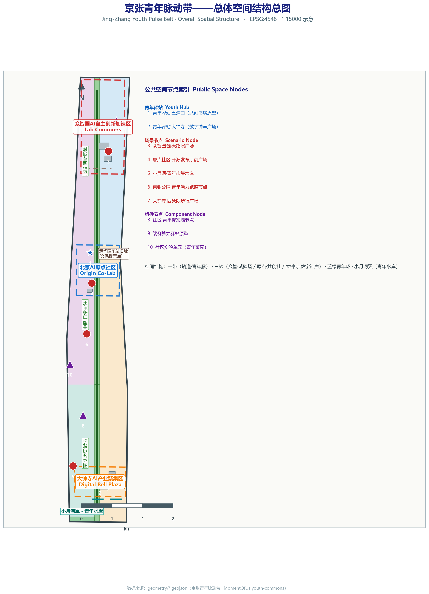
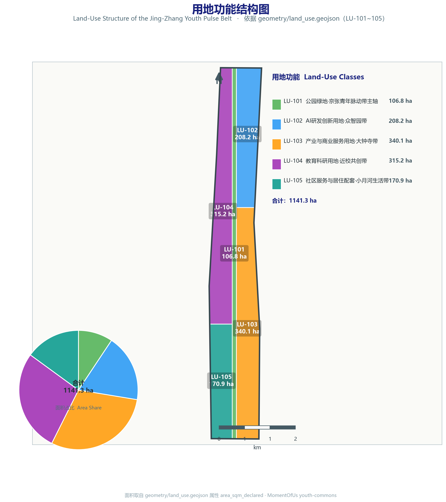
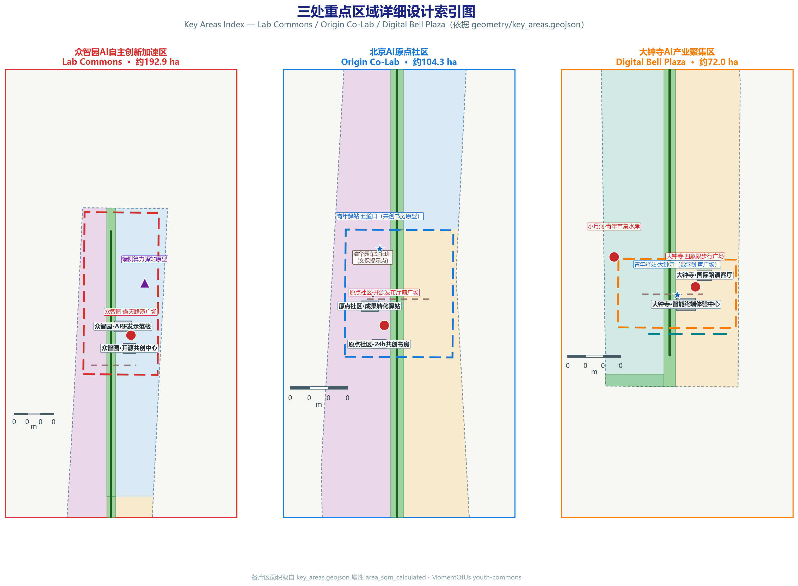
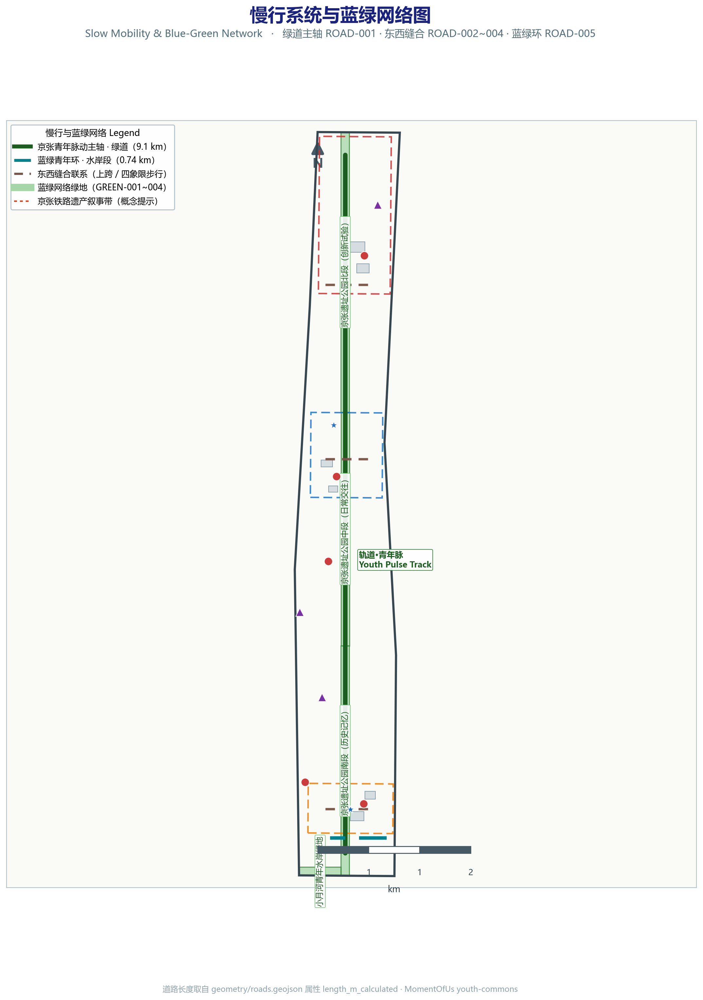

# Jing-Zhang Heritage Park AI Youth Co-Creation Vitality Belt — Youth-Friendly Public Space and AI Scenario Empowerment Design Proposal

This proposal addresses the "Youth-Friendly Public Space" track, shaping the century-old Jing-Zhang Heritage Park and its surrounding urban areas into a public-space spine where young talent can "be willing to come, stay, and co-create." The scheme takes the trinity of a Third Space system, AI invisible infrastructure, and community co-creation mechanisms as its main thread, proposing the overall concept of the "Jing-Zhang Youth Pulse Belt" and a spatial structure of One Belt, Three Cores, Multiple Nodes plus the Blue-Green Youth Loop. Through 12 AI scenario cards, 6 user personas, the Youth-Friendly Seven-Piece Kit component library, 3+1 pilgrimage landmarks, a three-layer cultural narrative, and an annual events system, the concept is translated into design deliverables that are discussable, verifiable, and implementable. The full text comprises thirteen chapters, sequentially responding to the mandatory tasks of Announcement sections 1.3, 1.4, 1.5 and agent.1 through agent.6; all geometry and metrics are based on the provisional boundary, with precision caveats and recalculation requirements centrally explained in the three chapters "Design Basis and Data Inventory," "Indicator System, Area Recalculation and Compliance Matrix," and "Risk, Copyright and Compliance Statement."

## Design Basis and Data Inventory

This scheme takes the "Centennial Jing-Zhang AI Innovation Belt Urban Design International Scheme Solicitation Prequalification Announcement" issued by the Haidian Sub-bureau of the Beijing Municipal Commission of Planning and Natural Resources as its primary basis, and takes the track definition "Youth-Friendly Public Space" (youth-friendly-public-space) as its organizing perspective, making the daily stays, socializing, learning, exercise, nighttime vitality, and Third Space use of young talent, startup teams, residents, and visitors the design thread running through all chapters [source:OFFICIAL-ANNOUNCEMENT] [source:AGENT-TASKBOOK]. The scheme also uses the temporary coarse boundaries, key areas, enums, metrics, and source inventories registered by maintainers in `brief/site-package/` as machine-readable basis. Before generating the scheme, the AI agent must read `design_brief.json`, `allowed_design_space.json`, `sources.json`, `enums/`, `ranges/`, `schemas/`, `data/source_registry.json`, and `data/processed/agent_fact_pack.md`, and use `project_scope_summary.csv`, `agent_task_requirements.csv`, `source_use_matrix.csv`, and `missing_data_checklist.csv` to establish inventories of tasks, scope, material usage, and gaps. Every design judgment must be decomposed into traceable sources, recalculable metrics, verifiable layers, and manually reviewable assumptions [depth:existing_conditions_diagnosis].

The announcement requires the scheme to reach the urban design depth of a regulatory detailed plan and of a comprehensive implementation plan, and further refines this through the agent-facing taskbook into three levels of scope, three key areas, and the six generation tasks agent.1 through agent.6. Text narrative cannot substitute for the GeoJSON, metric tables, A3 booklet, A0 boards, and HTML electronic display deliverables; the role of the main text is to place the most critical basis next to the judgment, so reviewers can enter the evidence chain from a single sentence without first reading machine numbers. This scheme is organized on three levels of "statement, evidence citation, and deliverable anchor": the statement articulates the design judgment, the evidence citation provides source, standard, depth, layer, and metric, and the deliverable anchor states which A3/A0/HTML deliverables correspond to that judgment. Reviewers may read this proposal along three paths: read the design logic sequentially by chapter, verify evidence along the annotation chain (source, standard, depth, data, metric), or check the completeness of A3/A0/HTML deliverables against the deliverable inventory. All three paths converge on `compliance_matrix.json` and `metrics.json`, ensuring consistency among "readable main text, verifiable evidence, and checkable deliverables."

The usage boundaries of the data registration table are as follows [source:SOURCE-REGISTRY]: `data/source_registry.json` registers the usage boundaries of public, rights-cleared, and temporary materials; the current registration summary is 5 formal-usable materials, 0 background materials, and 1 provisional-only material; the agent must not upgrade background_only or provisional_only materials into official boundary, statutory regulatory plans, formal scoring basis, or government implementation commitments. `data/processed/agent_fact_pack.md` is a reading navigation layer rather than a new authoritative source [source:PROCESSED-FACT-PACK]; factual judgments must still return to the registered original materials, and the complete source relationships are preserved in `sources.json`.

Key bases are graded by usage boundary as follows:

| Material | Role | Usage boundary |
| --- | --- | --- |
| Solicitation announcement (prequalification announcement) | Primary basis | Formal task source, covering the three-level requirements of 1.3, 1.4, 1.5 |
| data/processed/agent_task_requirements.csv | Task decomposition | Original text of official tasks and agent.1 to agent.6, mapped item by item in the compliance matrix |
| brief/site-package/geometry/provisional_boundaries.geojson | Temporary geometry | provisional_only; must be replaced and fully recalculated once official boundaries are published |
| data/source_registry.json | Material rights registration | Distinguishes the three usage boundaries of formal, background, and provisional |
| data/processed/missing_data_checklist.csv | Gap inventory | All entries enter assumptions.json and the risk chapter of the main text |

Until the official `SITE_BOUNDARY` or the three `KEY_AREA` polygons are obtained, this scheme uses `brief/site-package/geometry/provisional_boundaries.geojson` to generate the temporary formal package. Both `geometry/site_boundary.geojson` and `geometry/key_areas.geojson` in the submission package are marked as `provisional_constraint` with `official_boundary=false`, and may only be used for scheme generation, self-check, visualization, and design discussion — not as official redline, approval basis, precise-area basis, or statutory control conclusions. This data gap on the organizer side does not itself block content scoring; after the official polygons are substituted, site boundary, key areas, land use, roads, green space, public space, buildings, phasing, and metrics must all be recalculated. Accordingly, the spatial structure, scenarios, projects, and metrics in the main text are written under the principle of "discussable, verifiable, and recalculable after official boundary substitution"; when the official boundary and key-area polygons are updated, the scaffold, self-check, and drawing/HTML generation must be re-run, not merely single files replaced. The source registration of the temporary boundary and key-area geometry is in `data/source_registry.json` [source:BOUNDARY-SOURCE].

For the Youth-Friendly Public Space track, the three baselines most affected by the provisional boundary are: the current-use baseline of public spaces (e.g., crowd activity periods, site use intensity), the precise connection relationships between rail stations and the slow-traffic network, and nighttime activity and lighting conditions. Where official sources for these three data categories are missing, this scheme treats them as "conceptual recommendations + pending confirmation of formal regulatory-plan conditions" and registers them in `missing_data_checklist.csv` and `assumptions.json`, without speculative filling. Boundary interpretation can return to the overall-scope layer and area recalculation [data:geometry/site_boundary.geojson#SITE-001] [metric:site_area_sqm]; the three key areas are checked against independent layers and count metrics [data:geometry/key_areas.geojson#PROV-KEY-001] [metric:key_area_count]. Complete source and standard coverage is preserved respectively in `sources.json`, `standard_matrix.json`, and `design_depth_matrix.json`.

The deliverables corresponding to this proposal's submission package include: the main text (this file), the English translation `proposal.en.md`, nine GeoJSON geometry layers, metric and compliance matrices (`metrics.json`, `compliance_matrix.json`), source and standard matrices (`sources.json`, `standard_matrix.json`, `design_depth_matrix.json`), five key figures (assets/figures/*.png), the A3 booklet and A0 board layouts, and the HTML electronic display. The deliverables correspond one-to-one with the chapters of the main text; any omission is registered in the self-check.

## Three-Level Scope Working Framework

The scheme organizes work according to the three levels defined in the announcement: the coordination research scope focuses on the AI industry ecosystem, strategic positioning, innovation chain, and future urban form of 43.6 square kilometers (registered value, pending recalculation with official data); the overall design scope focuses on the 1-to-2-kilometer urban and industrial areas surrounding the 11.4-square-kilometer Jing-Zhang Heritage Park, requiring an overall urban renewal framework, industrial spatial layout, transport and municipal support, and urban character control; the key-area scope focuses on three detailed design areas totaling 368.4 hectares (registered sum of the three key areas, pending recalculation with official polygons), requiring clear functional programs, building scale, retain/renovate/demolish classification, public-space connectivity, and transport organization. The three levels are mapped item by item in `compliance_matrix.json`, ensuring that every mandatory task of announcement sections 1.3, 1.4, 1.5 and agent.1 through agent.6 has chapter, layer, metric, drawing, and HTML evidence [standard:PROJECT-OFFICIAL-ANNOUNCEMENT].

The three levels are not a disconnected set of drawings. The coordination research determines judgments on the industry chain and urban form; the overall design translates those judgments into renewal projects, spatial structure, and facility capacity; and the key-area detailed design verifies the implementability of specific parcels, buildings, transport, public space, and AI application scenarios. When generating the scheme, the agent must first lock the official or provisional boundary and constraints adopted by the current submission, then generate land use, buildings, roads, green space, public space, phasing, and AI service nodes, and finally recalculate metrics from those layers and explain which conclusions remain limited by the provisional boundary. Any area, ratio, scale, or project count that cannot be recalculated from structured data must not be written into formal conclusions [depth:three_level_scope_framework] [depth:overall_spatial_structure].

Agent generation follows a fixed "task-to-layer" protocol: first parse the three-level scope and task requirements, then generate layers in the order "boundary, land use, buildings, roads, green space, public space, phasing, AI nodes," and finally recalculate metrics and write them back to `metrics.json`. Every step retains its generation basis (source_id, standard, depth item), ensuring reviewers can trace back layer by layer along the annotations in the main text to the original materials, rather than treating the main text as baseless talk. The correspondence between the three levels and tasks: the coordination research scope corresponds to the ecosystem cases and map of agent.2 and the overall goals of announcement 1.3.1 through 1.3.3; the overall design scope corresponds to the overall concept of agent.1 and the overall design and regulatory-plan-depth tasks of announcement 1.5.2.x; the key-area scope corresponds to the public space and pilgrimage landmarks of agent.4 and the detailed design tasks of announcement 1.5.3.x. agent.3, agent.5, and agent.6 are cross-cutting tasks that run through all three levels, anchoring the youth-friendly main thread into every level of deliverable in scenarios, narrative, and operations respectively.

The overall concept recommended by this scheme is the "Jing-Zhang Youth Pulse Belt" (京张青年脉动带), replacing the earlier scaffold phrasing "Jing-Zhang Intelligent Symbiosis Belt." The one-sentence concept: let the pulse of AI innovation beat through the everyday public life of young people, along the track of China's first self-built railway. The core idea is the trinity of "Third Space system + AI invisible infrastructure + community co-creation mechanisms": AI is not a show-off device but invisible infrastructure that lowers participation thresholds, enhances spatial adaptability, and amplifies youth co-creation; all scenarios are explainable, verifiable, and manually overrideable. The spatial organization is "One Belt, Three Cores, Multiple Nodes + Blue-Green Youth Loop," where "One Belt" is not an extra newly drawn redline but a translation of the announcement's three-level scope into working method; "Three Cores" correspond to the three key areas; "Multiple Nodes" correspond to rail stations and community-level Youth Hubs; and the "composite loop" corresponds to the linkage of slow traffic, green space, public space, and nighttime vitality routes [data:geometry/roads.geojson#ROAD-001] [data:geometry/green_space.geojson#GREEN-001].

agent.1 of the agent-facing taskbook requires completing the overall concept and functional coordination scheme design of the Belt, including the primary name, English name, naming system, Logo direction, three major positionings, five major functions, and the three-zone two-wing coordination loop, and must not submit slogan-style naming only. The naming system of this scheme is as follows:

| Level | Chinese | English | Description |
| --- | --- | --- | --- |
| Primary name of the Belt | 京张青年脉动带 | Jing-Zhang Youth Pulse Belt | Echoes the three major positionings of "Centennial Jing-Zhang Cultural Belt, Urban AI Life Experience Belt, AI Integration Innovation Belt" |
| Spatial main axis | 轨道·青年脉 | Youth Pulse Track | The linear public-life main axis along the Jing-Zhang Heritage Park |
| Three-core scenario names | 众智·试验场 / 原点·共创社 / 大钟寺·数字钟声 | Lab Commons / Origin Co-Lab / Digital Bell Plaza | Corresponding respectively to Zhongzhi Park, the AI Origin Community, and Dazhongsi |
| Composite loop | 蓝绿青年环 | Youth Blue-Green Loop | Composite loop of slow traffic + green space + nighttime vitality |
| Xiaoyue River wing | 青年水岸 | Youth Waterfront | Xiaoyue River scenario wing |
| Community nodes | 青年驿站 | Youth Hub | Rail station and community-level public-space nodes |

Logo direction (conceptual): using "railway sleepers + heartbeat pulse" as the visual motif — sleepers metaphorize the Jing-Zhang Railway's history, and the pulse curve metaphorizes AI and youth vitality; it can be extended as the basis of the wayfinding symbol system (see the "Blue-Green Space, Public Space and Urban Character" chapter). The Logo and naming serve the three major positionings and five major functions; their relationship to the industry ecosystem, public space, and cultural resources is developed in this section and the "Coordination Research Scope" section; the rights-clearing and authorization status of specific fonts, graphics, and brand assets is registered in `sources.json`, and trademark fonts must not be used without authorization.

The five major functions are translated, per the taskbook requirements, into a verifiable functional coordination loop (conceptual recommendation, pending verification against official definitions): R&D and experimentation (Zhongzhi Park), achievement commercialization (Origin Community), public experience (the Belt and pilgrimage landmarks), cultural dissemination (the Jing-Zhang narrative interface), and community services (the Youth Hub network). The five functions are not spread evenly but follow a time-phased strategy of "high-frequency daily, mid-frequency weekend, low-frequency festival" based on youth activity frequency: high-frequency daily services (co-creation reading rooms, seating groups, hubs) are placed close to rail stations and residential areas; mid-frequency weekend services (roadshows, markets, sports) are laid out along the park belt; low-frequency festival services (developer conference, Digital Bell New Year countdown) anchor the three cores. The three-zone two-wing coordination loop takes the three key areas as the "three zones," the Xiaoyue River waterfront (Youth Waterfront) and the university green-belt interface as the "two wings," forming a feedback loop among programming, operations, and spatial renewal: the three zones generate content and activities, the two wings absorb spillover and daily-life scenarios, the Belt acts as a channel transmitting people and content in both directions, and operational data (aggregated statistics, de-identified) returns to the three zones to guide the next round of spatial actions.

The correspondence between the three major positionings and the five major functions is as follows: the Centennial Jing-Zhang Cultural Belt is carried by the cultural dissemination function and the cultural narrative layer; the Urban AI Life Experience Belt is carried by the public experience and community service functions and the AI scenario cards; the AI Integration Innovation Belt is carried by the R&D experimentation and achievement commercialization functions and the industry ecosystem map. The positioning is the general outline, the functions are the division of labor, and the spatial structure (belt, core, loop, node) is the implementation carrier; the three levels of expression stay consistent across naming, drawings, and operations, avoiding a disconnect between concept and implementation. The key directions raised in the announcement are translated one by one into spatial actions in this scheme: services for AI talent and enterprises are undertaken by the hub network and co-creation spaces; shaping the Jing-Zhang Heritage Park vitality belt is undertaken by One Belt Three Cores Multiple Nodes and the Blue-Green Youth Loop; integrating the three-layer culture is undertaken by narrative and wayfinding; AI technology application scenarios are undertaken by the 12 scenario cards. The translation results are checked item by item against the announcement's key directions in the compliance matrix, ensuring nothing is missed.

The application of the naming system is not limited to text; it also serves as the unified recognition layer of the wayfinding system (sleeper + pulse motif), event branding (developer conference, youth night-run season, Digital Bell New Year countdown), and the international communication interface (bilingual place names, pilgrimage routes), ensuring that the same name points to the same spatial concept across drawings, web pages, boards, and event materials. The correspondence between Chinese names, English names, and symbols enters the translation management of `docs/terminology-glossary.md`, avoiding cross-language drift.

| Level | Design question | Scheme answer | Data anchor |
| --- | --- | --- | --- |
| Coordination research scope | How to organize the AI industry ecosystem and future urban form | Establish the innovation chain of "university incubation—open-source collaboration—enterprise commercialization—public experience—international dissemination," with young people as the torchbearers | compliance_matrix.json, standard_matrix.json |
| Overall design scope | How to map industrial space, urban renewal, transport/municipal, and character | Jointly expressed by land use, buildings, roads, green space, public space, and phasing layers | [data:geometry/land_use.geojson#LU-101]、[data:geometry/roads.geojson#ROAD-001] |
| Key-area scope | How the three areas reach detailed design depth | Respective positioning, spatial actions, AI scenarios, and implementation dependencies | [data:geometry/key_areas.geojson#PROV-KEY-001]、[data:geometry/key_areas.geojson#PROV-KEY-002]、[data:geometry/key_areas.geojson#PROV-KEY-003] |

## Coordination Research Scope: Industry and Future City Research

The core task of the coordination research scope is to build a world-class AI innovation ecosystem and answer how AI changes work, life, socializing, learning, transport, and public services. For the Youth-Friendly Public Space track, the anchor of industry research is not a list of enterprises but "what kind of people, at what frequency, participate in innovation in what spaces": the daily stays and interactions of six groups — developers, startup teams, university students, young residents, young park employees, and visitors — constitute the real spatial demand of the industry ecosystem. The scheme should sort out Haidian's universities and research institutes, leading enterprises, computing-power/algorithm/data-element resources, incubation platforms, listed companies, unicorns, and technology-service resources (specific lists subject to public rights-cleared materials), propose a spatial coordination framework of the AI innovation chain, industry chain, talent chain, and urban service chain, and write industry-strategy metrics, the AI innovation index, talent density, spatial-supply types, and AI+ vertical application key areas into the indicator system, marking which are official, which are design recommendations, and which remain pending calibration with formal data [source:AGENT-TASKBOOK] [standard:PROJECT-AGENT-OPEN-CALL-TASKBOOK].

agent.2 of the agent-facing taskbook requires 5 to 8 global AI innovation ecosystem cases and an AI innovation ecosystem map. The following table is a benchmarking reference compiled from public materials, used to distill design principles and not constituting an industry-data commitment:

| # | Case | Features confirmable from public materials | Lessons for youth-friendly public space |
| --- | --- | --- | --- |
| 1 | Silicon Valley, USA | Long-chain coordination of university incubation and industrial commercialization | Strong industry but public life needs proactive design; everyday interaction spaces for youth cannot wait for natural growth |
| 2 | one-north, Singapore | Integration of campus, community, and park; walkable innovation community | Green space and slow-traffic systems are the adhesive of an innovation community |
| 3 | Shenzhen Bay Science and Technology Ecological Park | Combination of vertical campus and public platforms; industry-chain agglomeration | High-intensity parks need ample ground-level public living rooms and interaction nodes |
| 4 | Hangzhou Future Sci-Tech City (West Science Innovation Corridor) | Combination of job-housing balance and youth-talent policy space | Talent housing, living support, and innovation space must be supplied in sync |
| 5 | Station F, Paris | Renovation of existing buildings into a startup community, driven by event operations | Third Space and events systems are key to activating old spaces at low cost |
| 6 | Digital Media City (DMC), Seoul | Combination of content industry and public experience | Digital content needs a consumable, experienceable public interface |
| 7 | Shibuya and Miyashita Park, Tokyo | Three-dimensional public space and nighttime vitality; small-scale renewal | Nighttime vitality and three-dimensional stitching significantly raise youth willingness to stay |
| 8 | Zhangjiang Science City, Shanghai | Complex of large science facilities and innovation blocks | From research to community needs a continuous public-service and interaction corridor |

Three commonalities can be distilled from the above cases as design principles for this scheme: first, successful innovation districts invest in "informal interaction space" as infrastructure — the density of cafés, plazas, trails, and green space matters as much as industrial density; second, the nighttime period is the second battlefield of youth-friendly districts — lighting grading and nightlife operations decide whether a district "retains people"; third, small-scale, replicable spatial components are more sustainable than one-off large landmarks, consistent with the logic of this scheme's "Youth-Friendly Seven-Piece Kit" component library. These principles are implemented through the spatial structure, scenario cards, and operations system in this scheme, and case data is not used to impersonate Haidian's current conditions.

AI innovation ecosystem map (conceptual structure): university incubation (Haidian universities, institutes, and research organizations) → open-source collaboration (developer communities and co-creation spaces) → enterprise commercialization (industrial parks and acceleration zones) → public experience (the Jing-Zhang Youth Pulse Belt and pilgrimage landmarks) → international dissemination (roadshows, conferences, and festival events), with young talent as the torchbearers and mobile carriers of each link. Every link in the map has a corresponding spatial carrier: the incubation link corresponds to the Origin Community's campus-adjacent interface, the collaboration link to the open-source release hall and co-creation reading rooms, the commercialization link to Zhongzhi Park and on-device computing-power hubs, the public-experience link to the Belt and pilgrimage landmarks, and the dissemination link to the Digital Bell Plaza and the annual events system. The map corresponds one-to-one with the spatial functions of the three key areas, avoiding the split of "industry to industry, space to space." The spatial anchors and youth roles of each link of the map are as follows:

| Innovation-chain link | Spatial carrier | Youth role | Data anchor |
| --- | --- | --- | --- |
| University incubation | Origin Community campus-adjacent interface, AI+ education experience points | Learning, internship, achievement output | [data:geometry/key_areas.geojson#PROV-KEY-002] |
| Open-source collaboration | Open-source release hall, 24h co-creation reading rooms | Collaboration, release, community reputation | [data:geometry/public_space.geojson#PUBLIC-001] |
| Enterprise commercialization | Zhongzhi Park, on-device computing-power hubs | Entrepreneurship, experimentation, standard governance | [data:geometry/land_use.geojson#LU-102] |
| Public experience | The Belt, pilgrimage landmarks S1 to S3 | Experience, dissemination, consumption | [data:geometry/green_space.geojson#GREEN-001] |
| International dissemination | Digital Bell Plaza, annual events system | Exchange, roadshow, branding | [data:geometry/key_areas.geojson#PROV-KEY-003] |

The industry chain, talent chain, and urban service chain coordinate in space: the industry chain determines the layout of functional zones (the gradient of R&D, incubation, exhibition, and interaction), the talent chain determines the type and density of service amenities (housing, reading rooms, sports, childcare), and the urban service chain determines the daily support of public space (hubs, lighting, proposal walls). On the youth-friendly track, the three chains converge into the composite goal of "making innovation happen, making people stay, and making community participate"; the absence of any one chain weakens the effect of the other two. From the talent perspective, this scheme divides the population into two categories: "innovation in transit" and "innovation settling down": those in transit (developers, startup teams, students) need low-threshold, bookable, high-frequency-accessible spaces; those settling down (young residents, young park employees) need stable, everyday, childcare-compatible public life. The two groups meet at the Blue-Green Youth Loop and the Youth Hub network, forming intergenerational and cross-profession mixed public life — the core that distinguishes youth-friendly public space from a single-industry park space.

The future urban form research should implement the requirement of announcement 1.3.3, "create a high-quality urban area coveted by global AI innovation talent," responding to the spatial system integrating work, life, socializing, and learning, and to AI+ urban service scenarios. This scheme translates this requirement into spatial commitments along four dimensions: the work dimension provides a continuous gradient from formal offices to public desks, letting startup teams switch at low cost between co-creation reading rooms and open-air roadshow plazas; the life dimension uses the Youth Hub network to guarantee basic services such as charging, drinking water, rest, and rental within walking distance; the social dimension creates low-threshold encounter opportunities through youth seating groups, co-creation tables, and community experiment units; the learning dimension supports lifelong learning through 24h co-creation reading rooms and AI+ education experience points. Nighttime vitality, as a fifth cross-cutting dimension, runs through all four dimensions via the three-tier lighting and events system. AI+ urban service scenarios follow the announcement directions into operable small-scale spaces: AI+ healthcare provides health-query and first-aid information interfaces at Youth Hubs, AI+ education and learning is carried by 24h co-creation reading rooms and education experience points, AI+ legal and life services provide compliance consultation and life guidance at community-level hubs — all premised on manual review and not substituting professional services. If global AI innovation events, developer communities, open scenarios, or pilgrimage routes are proposed, they are all written as "conceptual recommendations / reference schemes / available for professional teams to deepen," and must not be written as already-determined government events or implementation arrangements [standard:MOHURD-URBAN-DESIGN-MEASURES].

New infrastructure is designed under the three principles of "service-oriented, on-device, and governable": on-device computing-power hubs supply computing power as a public service rather than a commercial facility; robot delivery and patrol are area-limited, governable, and can be stopped at any time; distributed energy and low-carbon computing combine with park and campus interfaces to support scenario operation. The capacity and coverage of infrastructure are registered as "pending confirmation of formal conditions," and prototype-testing scales are not written as final supply scales.

## Overall Design Scope: Urban Renewal and Regulatory-Plan-Depth Urban Design

The overall design scope must reach the urban design depth of a regulatory detailed plan. The scheme must propose the overall urban renewal spatial structure, identification of inefficient space, a renewal project list, implementation policy recommendations, industrial functional proportions, spatial organization models, total building scale, and comprehensive capacity assessment, and implement the requirement of announcement 1.5.2.2, "overall urban renewal framework." `geometry/land_use.geojson` should completely cover the design boundary without overlap, `geometry/buildings.geojson` should express renewal building footprints or retained building footprints, `geometry/roads.geojson` should express micro-circulation, slow traffic, and rail connection relationships, and `metrics.json` should recalculate core areas, ratios, and layer counts.

This section breaks the regulatory-plan-depth content into reviewable objects per [standard:MOHURD-CONTROL-DETAILED-PLANNING]: the land-use structure is seen in land-use zones such as [data:geometry/land_use.geojson#LU-101] and [data:geometry/land_use.geojson#LU-102]; building footprints in [data:geometry/buildings.geojson#BLDG-001]; transport organization in [data:geometry/roads.geojson#ROAD-001]; building footprint area verification in [metric:building_footprint_area_sqm]; and deliverable depth is constrained by [depth:land_use_layout] and [depth:development_intensity_controls]. The overall concept "Jing-Zhang Youth Pulse Belt" is implemented at this level as a reviewable spatial framework: the Jing-Zhang Heritage Park as the public-life main axis, the three key areas as innovation anchors, rail stations and community nodes as the Youth Hub network, and the Blue-Green Youth Loop connecting slow traffic, green space, and nighttime vitality.

The regulatory-plan depth and the comprehensive implementation plan depth form a division of labor in this section: the regulatory-plan depth answers "what is allowed to be built," expressed through land-use classification, development intensity, and building controls; the comprehensive implementation plan depth answers "how to land," expressed through renewal projects, implementation policies, and phasing plans. The two depths map respectively to the land-use and metric verification tables of the A3 booklet, the overall spatial structure and key areas of the A0 boards, and the metric-layer linkage of the HTML; any depth lacking its corresponding deliverable is registered as a failed self-check item.

Inefficient-space identification uses four verifiable criteria (conceptual method; no fabrication of current-condition data): first, building and site use intensity (qualitative judgment based on public imagery and land-use registration), second, slow-traffic and rail accessibility (based on current road and station layouts), third, public-space and green-space supply (based on the green_space and public_space layers), and fourth, completeness of industrial services and life amenities. The identification results are used to screen parcels with renewal potential and enter the renewal project list; where ownership, current buildings, and regulatory-plan conditions are lacking, the potential judgment states only the method, not conclusions. Industrial functional proportions are recommended to be set by functional zone at the regulatory-plan stage; the main text gives no pseudo-precise numbers and uniformly states "pending confirmation of formal regulatory-plan conditions."

The comprehensive capacity assessment covers four aspects (conceptual recommendation): the pressure of population and employment capacity on public service facilities, the support of slow traffic and rail for commuting and daily trips, the regulation of ecology and stormwater by blue-green space, and the carrying boundary of new infrastructure (computing power, energy). The assessment results are used to verify the Youth Hub layout, lighting grading, and facility standards, avoiding the writing of capacity visions as approved capacities. Urban renewal is premised on low disturbance: retain what can be retained, renovate what can be renovated, and renew only what truly needs renewal; retain/renovate/demolish conclusions must be premised on ownership, current buildings, and regulatory-plan conditions, and where these are missing, only the method is given, not conclusions [depth:retain_renovate_demolish].

The spatial organization model is made explicit at this level as the regulatory-plan expression of four element types — "belt, core, loop, node": the belt (Jing-Zhang Youth Pulse Belt) corresponds to green-space and slow-traffic corridor control; the core (three key areas) corresponds to renewal parcel and functional-zone control; the loop (Blue-Green Youth Loop) corresponds to control of green lines, blue lines, and slow-traffic connections; the node (Youth Hubs and AI nodes) corresponds to control of facility networks and new infrastructure. The four element types fall respectively into the land_use, green_space, roads, and public_space layers, ensuring that youth-friendly spatial intent is verifiable and transferable at regulatory-plan depth.

The connection between renewal projects and regulatory-plan conditions uses a "project-querying-conditions" method: each renewal project lists the regulatory-plan conditions it requires at project initiation (land-use nature, floor area ratio, redlines, setback lines, facility standards); projects whose conditions are unconfirmed are downgraded to conceptual recommendations and upgraded to implementation projects once conditions are confirmed. `compliance_matrix.json` records each project's condition status, so reviewers can see which projects are implementable and which are pending confirmation, avoiding treating all projects alike.

## Key-Area Detailed Design

Key-area detailed design is mandatory; the three areas correspond respectively to the three core scenario names: Lab Commons (众智·试验场), Origin Co-Lab (原点·共创社), and Digital Bell Plaza (大钟寺·数字钟声). In addition to meeting the industry requirements of announcement 1.5.3.1, 1.5.3.2, and 1.5.3.3, each area must answer the three questions "what do young people do here, when do they come, and with whom," reaching the depth of a comprehensive implementation plan (architectural and engineering expression referencing the "Regulations on the Depth of Architectural Engineering Design Document Preparation" [standard:MOHURD-ARCH-DESIGN-DEPTH-2016]), checked by [depth:three_key_area_detailed_design]. Descriptions of only "building a demonstration zone" without evidence of functions, buildings, transport, public space, and implementation projects should be treated as incomplete. The three areas share a baseline of youth-friendly actions: first, each area provides at least one bookable public space (roadshow plaza, release hall, or Digital Bell Plaza) supporting youth content production; second, each area sets at least one 24-hour-available hub or service point supporting nighttime vitality; third, each area's public space is directly connected to a rail station or the slow-traffic main axis, ensuring low-threshold access; fourth, each area's AI scenarios comply with the three boundaries of explainability, verifiability, and manual override. The four baseline actions are consistent with the task requirements of agent.3 and agent.4 and are checked item by item in the compliance matrix.

**Lab Commons (Zhongzhi Park AI Independent Innovation Acceleration Zone, [data:geometry/key_areas.geojson#PROV-KEY-001]).** Positioned as a garden-style full-stack independent-innovation block, with a registered area of approximately 192.1 hectares in the announcement and approximately 192.9 hectares by geometric recalculation (both provisional, pending official polygon confirmation). The functional program focuses on proprietary-model R&D, standard setting, safety governance, and industry exhibition, supplemented by low-carbon innovation interaction spaces. Spatial actions are organized in three groups: first, the open-source co-creation dome, carrying the code contribution wall, honor displays, and open collaboration; second, the open-air roadshow plaza, carrying startup roadshows, the developer conference, and hackathons; third, the safety-governance sandbox, translating evaluation and red-team testing into visitable, bookable, governable exhibition nodes. Building scale and retain/renovate/demolish follow the low-disturbance principle, retaining valuable existing building footprints ([data:geometry/buildings.geojson#BLDG-001] is a design-recommendation example, not an approved scale), with additions expressed as "pending confirmation of formal regulatory-plan conditions." Public space strengthens the Qinghe interface, organizing low-carbon innovation interaction and green-space AI scenarios; transport organization strengthens external connections and campus slow traffic, responding to the North Fifth Ring Road direction; implementation depends on river blue-line, ecological, flood-control, and redline conditions.

**Origin Co-Lab (Beijing AI Origin Community, [data:geometry/key_areas.geojson#PROV-KEY-002]).** Positioned as a campus-adjacent achievement-commercialization and talent community. The functional program focuses on open-source collaboration, achievement release, special talent-zone services, and residential life amenities. Spatial actions are organized around stitching the campus, park, and blocks through slow traffic: the campus-adjacent co-creation street carries the daily flow of university teachers and students, the 24h co-creation reading rooms provide bookable, identity-free learning and collaboration spaces, and the achievement release hall provides release and small roadshows for universities and open-source communities. Building retain/renovate/demolish emphasizes low-disturbance renewal and does not write university, park, or block renovations as already having ownership consent; public space supplements achievement display, talent services, and open-source collaboration interfaces; transport organization implements rail-station integration and campus-park slow-traffic connections. Implementation depends on campus boundaries, ownership, and ground-floor program conditions, all marked "pending confirmation of formal regulatory-plan conditions."

**Digital Bell Plaza (Dazhongsi AI Industry Cluster, [data:geometry/key_areas.geojson#PROV-KEY-003]).** Positioned as an urban smart-economy and international-exchange block. The functional program focuses on agents, smart terminals, content consumption, data elements, and commercial services. Spatial actions are organized in three groups: first, the Digital Bell Plaza, carrying smart-terminal experiences and content consumption, as well as New Year and festival events; second, four-quadrant pedestrian connectivity, organizing pedestrian and static traffic in the four quadrants around Dazhongsi station; third, the international roadshow living room, organizing display, negotiation, and media releases in the public environment around key enterprises. Public space combines with planned green space for compound use; transport organization implements Dazhongsi station integration and static traffic; implementation depends on rail-station, road-intersection, and municipal-pipeline conditions, and the Dazhongsi station integration renovation is not written as an approved project.

| Key area | Three-core scenario name | Design positioning | Spatial actions | Youth-friendly actions | AI industry and operations scenarios | Evidence citation |
| --- | --- | --- | --- | --- | --- | --- |
| Zhongzhi Park AI Independent Innovation Acceleration Zone | 众智·试验场 (Lab Commons) | Garden-style full-stack independent-innovation block | Strengthen the Qinghe interface, industry exhibition, low-carbon innovation interaction, and external transport organization; use green space to carry open testing and standard-governance displays | Open-source co-creation dome, open-air roadshow plaza, garden-style innovation interaction, safety-governance sandbox visits | Proprietary-model testing, standard-setting workshops, safety-governance displays, low-carbon computing experiences | [data:geometry/key_areas.geojson#PROV-KEY-001]、[depth:three_key_area_detailed_design] |
| Beijing AI Origin Community | 原点·共创社 (Origin Co-Lab) | Campus-adjacent achievement-commercialization and talent community | Organize campus, park, and block slow-traffic stitching; supplement achievement release, talent services, residential life, and open-source collaboration spaces | Campus-adjacent co-creation street, 24h co-creation reading rooms, achievement release hall, campus-park slow-traffic stitching | Open-source community, achievement release, special talent-zone services, campus-adjacent incubation | [data:geometry/key_areas.geojson#PROV-KEY-002]、[source:AGENT-TASKBOOK] |
| Dazhongsi AI Industry Cluster | 大钟寺·数字钟声 (Digital Bell Plaza) | Urban smart-economy and international-exchange block | Around Dazhongsi station integration, four-quadrant pedestrian connectivity, commercial services, and public-environment renewal around key enterprises | Digital Bell Plaza, content consumption and smart-terminal experiences, international roadshow living room, nighttime vitality sections | Agent and smart-terminal display, content consumption, data elements, and international roadshows | [data:geometry/key_areas.geojson#PROV-KEY-003]、[metric:key_area_count] |

The three key areas must appear in `geometry/key_areas.geojson`. If official polygons are provided in the repository, they should be used as `official_constraint`; if missing, `provisional_constraint` may be used temporarily, but the main text, HTML, sources, assumptions, and self_check must state that they cannot serve as formal scoring or approval basis. `compliance_matrix.json` should separately cover announcement 1.5.3.1, 1.5.3.2, and 1.5.3.3. The design expression should include functional programs, building scale, building form, retain/renovate/demolish classification, public-space systems, transport organization, slow-traffic connectivity, and implementation projects; the HTML page should be able to switch among the three key areas, and the A3 booklet and A0 boards should include at least the key-area general plan, partial detailed drawings, and metric explanations. The intelligent-native new business types required by agent.4 of the agent-facing taskbook are landed in the three areas as: the on-device computing-power experimentation and standard-governance business type in Zhongzhi Park, the co-creation reading room and achievement release business type in the Origin Community, and the content-consumption and smart-terminal experience business type in Dazhongsi — all marked "conceptual recommendation / pilot," not government commitments. The source registration of the temporary key-area geometry is in `data/source_registry.json` [source:KEY-AREA-SOURCE].

The composition of the detailed design deliverables (for organizing the A3 booklet and A0 boards): each area should output six types of drawings — functional program map, building scale and retain/renovate/demolish classification map, public-space system map, transport organization and slow-traffic connectivity map, AI scenario node map, and implementation project and phasing map — together with metric explanations. The six drawing types correspond one-to-one with layers, so reviewers can trace from drawings back to layers and from layers back to metrics, avoiding a disconnect between drawings and data.

The three areas are not isolated demonstration zones but three nodes of the "One Belt, Three Cores, Multiple Nodes" structure: Lab Commons outputs open testing and standard-governance content to the Belt, Origin Co-Lab outputs open-source collaboration and achievement release content to the Belt, and Digital Bell Plaza outputs content consumption and international exchange content to the Belt; the Belt acts as a channel connecting the content and flow of the three cores into a walkable experience route. Together with the Belt and the Blue-Green Youth Loop, the three areas form a complete picture; the absence of any one area weakens the continuity of the overall youth-friendly experience.

## AI Innovation Ecosystem, Talent Personas and AI+ Scenarios

The scheme should establish spatial demand personas for AI talent and enterprises, covering R&D offices, open-source collaboration, achievement release, enterprise services, talent housing, social learning, consumer life, sports and leisure, and international exchange. agent.3 of the agent-facing taskbook requires no fewer than 10 AI scenario cards, no fewer than 3 industry test-and-verification scenarios, and no fewer than 5 user personas. Anchored to the Youth-Friendly Public Space track, this scheme proposes 6 user personas and 12 scenario cards; each scenario states its service targets, spatial location, data sources, privacy boundaries, manual-review mechanism, and operations entity, and proposes no scenario involving privacy infringement, excessive surveillance, or inability to be manually reviewed.

The six personas are not abstract labels but correspond to real spatial moments: open-source developers maintain community reputation through nighttime collaboration after work; startup teams complete product experiments between co-creation reading rooms and roadshow plazas; university students switch between learning and socializing between co-creation reading rooms and the Youth Waterfront; young residents push strollers along the Blue-Green Youth Loop and post proposals on the community proposal wall; young park employees recover energy in the park belt during lunch breaks and after work; visitors come for an event or a pilgrimage journey. Each persona has a set of "spatial moments" and a set of "data boundaries": spatial moments determine facility and service layout, and data boundaries determine the privacy design of AI scenarios.

| User persona | Age range | Typical needs | Spatial response | Self-check boundary |
| --- | --- | --- | --- | --- |
| Open-source developer | 22-35 | Release, collaboration, testing, community reputation | Origin Community open-source release hall, public code wall, nighttime collaboration spaces | No collection of personal behavior trajectories; activity data aggregated statistics only |
| Startup team | 25-40 | Low-cost offices, computing-power access, product testing ground | Zhongzhi Park co-creation reading rooms, on-device computing-power service points, open-air roadshow plaza | Computing and data services require separate authorization |
| University student | 18-28 | Learning, socializing, internship, low-cost living | Co-creation reading rooms, Youth Waterfront, AI+ education experience points | Campus data and research achievements require authorization |
| Young resident / new citizen | 25-40 | Commuting, leisure, childcare, community participation | Blue-Green Youth Loop, community proposal wall, community experiment units | Resident personas not used for commercial recommendation |
| Young enterprise employee in the park | 22-35 | Recovery between work, socializing, sports | Youth seating groups, nighttime vitality running track, Youth Hubs | No workplace-level trajectory collection |
| Visitor / event participant | 18-45 | Cultural experience, events, consumption | Digital Bell Plaza, youth market, guided tour system | Content consumption data requires authorization; imagery requires event authorization |

The 12 scenario cards are grouped by purpose into three groups: the first group serves the innovation industry (open-source release hall, 24h youth co-creation reading room, open-air roadshow plaza, safety-governance sandbox, on-device computing-power hub, AI+ education experience point), answering "where do young people develop, release, collaborate, and learn"; the second group serves public life (nighttime vitality running track, AI slow-traffic navigation, Digital Bell Plaza, Xiaoyue River Youth Waterfront), answering "where do young people exercise, travel, experience, and consume"; the third group serves community co-creation (community proposal wall, robot low-speed delivery pilot), answering "how do young people participate in governance and receive services." The three groups share the same set of privacy and review rules, as follows:

| Scenario card | Spatial carrier | Service targets | Privacy / review boundary |
| --- | --- | --- | --- |
| 01 Open-source release hall | Origin Co-Lab | Developers / startups | No behavior-trajectory collection; aggregated statistics only |
| 02 24h youth co-creation reading room | Origin Community / Youth Hub | Students / youth | Bookable; no identity recognition |
| 03 Open-air roadshow plaza | Lab Commons | Startup teams | Public events; imagery requires authorization |
| 04 Nighttime vitality running track | Central section of Jing-Zhang Park | Young residents | Lighting grading; no surveillance personas |
| 05 AI slow-traffic navigation | Entire Belt | Everyone | Explainable wayfinding; no individual tracking |
| 06 Safety-governance sandbox | Lab Commons | Developers / institutions | Display data de-identified; manual review |
| 07 Digital Bell Plaza | Digital Bell Plaza | Visitors / residents | Content consumption data requires authorization |
| 08 Xiaoyue River Youth Waterfront | Youth Waterfront | Young residents | Activity data aggregated only |
| 09 On-device computing-power hub | Overall-scope nodes | Developers / residents | Computing services require separate authorization |
| 10 Community proposal wall | Community-level hubs | Residents / youth | Topics de-identified; manual review |
| 11 Robot low-speed delivery pilot | Park / park-internal roads | Everyone | Area-limited, governable |
| 12 AI+ education experience point | Campus-adjacent nodes | Students / teachers | Teaching content manually curated |

The scenario cards and personas are not one-to-one but cross-serving: the same nighttime vitality running track card serves both young residents and young park employees, and the same community proposal wall serves both young residents and visitors. Scenario cards mark operational intensity by the three frequencies of "daily, weekend, festival": daily scenarios rely mainly on unattended and self-service operations, festival scenarios mainly on event organization and on-site services; the operational-intensity differences enter the operations plan and cost assumptions, not as approved commitments.

The operations entity of each scenario follows a type convention (conceptual recommendation): public-life scenarios are operated daily by area operations institutions or youth stewards; industry-service scenarios are undertaken by park operators and professional institutions; new-infrastructure scenarios (on-device computing power, robot pilots) are undertaken by technology operators within authorized scope; operations entities, service standards, and complaint feedback channels are registered in the scenario cards, and operations responsibility is not pushed to an entity-less "platform." The manual-review link corresponds to the decision points of each scenario, ensuring every automatic recommendation has a traceable basis. Scenario cards are managed as "living documents": continuously updated as public materials and pilot feedback arrive, with each update recording version, basis, and reviewer, and not treated as one-off deliverables; the update history links with the compliance matrix, ensuring reviewers see a scenario system consistent with current materials.

Industry test-and-verification scenarios (no fewer than 3, all conceptual recommendations / pilots, not government commitments): ① the on-device computing-power hub, as a new-infrastructure prototype, combined with public services and low-carbon energy strategies; ② the safety-governance sandbox, translating standard setting, safety evaluation, and model red-team testing into visitable, bookable, governable display and collaboration nodes; ③ the robot low-speed delivery pilot, limited to park and park-internal routes, governable. AI scenarios must land within spatial and governance boundaries: public-space scenarios cite [data:geometry/public_space.geojson#PUBLIC-001], slow-traffic and transport scenarios cite [data:geometry/roads.geojson#ROAD-001], open-space scenarios cite [data:geometry/green_space.geojson#GREEN-001] and [metric:public_space_ratio], [metric:green_ratio].

Agent-generated AI governance recommendations must comply with the principles of data minimization, public sources, explainability, and manual review. Urban agents may assist in identifying slow-traffic gaps, public-space heat, facility maintenance, event safety risks, and youth-need feedback, but must not substitute for planning approval, output unauthorized personal personas, or claim official implementation commitments. The AI scenarios of this scheme comply with three hard boundaries: first, "explainability first" — every automatic recommendation or prompt provides a basis and is traceable; second, "manual override first" — event safety, topic review, and facility-fault handling retain manual-review links; third, "de-identification first" — public-space scenarios use aggregated statistics only and do not track individual behavior trajectories. All AI scenario nodes should enter structured layers or the compliance matrix, so reviewers can see their relationship to industry, space, and public interest. The count and classification of scenarios and personas simultaneously satisfy the taskbook [metric:scenario_card_count] [metric:persona_count] [metric:ai_test_scenario_count].

## Land Use, Building Scale and Retain/Renovate/Demolish Scheme

The land-use scheme should be expressed per public standards for territorial spatial survey, planning, and use regulation classification, forming complete, closed, seamless land-use zones [standard:MNR-LAND-USE-CLASSIFICATION-GUIDE]. The land-use layers of this scheme are organized around youth-friendly public space as the core: the Jing-Zhang Heritage Park belt as the park-green main axis ([data:geometry/land_use.geojson#LU-101], registered area approximately 106.8 hectares, pending recalculation with official data), the Zhongzhi Park belt as AI R&D innovation land ([data:geometry/land_use.geojson#LU-102], registered area approximately 208.2 hectares, pending recalculation), and the remaining land-use zones ([data:geometry/land_use.geojson#LU-103] through [data:geometry/land_use.geojson#LU-105]) covering residential, commercial/service, public administration, and transport types, with the complete enumeration governed by `land_use.geojson`. Land-use classification is checked against [depth:land_use_layout] to ensure the layers are complete, closed, and non-overlapping; any coverage gap of a land-use type within the submission boundary enters `missing_data_checklist.csv` as an item to be supplemented. The correspondence between land-use classification and youth-friendliness: park green space carries the Blue-Green Youth Loop and daily interaction, R&D innovation land carries co-creation and experimentation, residential land carries youth life amenities, commercial/service land carries content consumption and nighttime vitality, and public administration and transport land carries hubs and service facilities. Each land-use type gives functional direction and amenity recommendations at regulatory-plan depth, but specific ratios, floor area ratios, and heights are all governed by the official regulatory plan; the main text makes no speculation.

The building scheme should distinguish retained, renovated, renewed, new, or pending-confirmation objects, and clarify the recommendation levels of building footprint, function, scale, character, roof, massing, and height control [depth:height_massing_character]. In `geometry/buildings.geojson`, [data:geometry/buildings.geojson#BLDG-001] through [data:geometry/buildings.geojson#BLDG-006] are design-recommendation building footprints (e.g., the registered footprint of the Zhongzhi Park AI R&D demonstration building is approximately 3.08 hectares, pending confirmation of formal conditions), expressing renewal or retained building footprints rather than approved construction scale. The retain/renovate/demolish method is managed by [depth:retain_renovate_demolish] and handled in four categories: retained (valuable historic buildings and structurally sound existing buildings, such as around the Qinghuayuan Station Historic Site), renovated (functional replacement and facade renewal, such as ground-floor program adjustments near campus), renewed (inefficient buildings truly requiring demolition and reconstruction, premised on ownership and regulatory-plan conditions), and pending confirmation (insufficient baseline data, registered only as to-be-verified). The principle is low-disturbance renewal: retain what can be retained, renovate what can be renovated, and renew only what truly needs renewal; where current buildings, ownership, regulatory-plan, and engineering conditions are lacking, the scheme may only propose methods and a calibration checklist, not fabricate retain/renovate/demolish conclusions.

Building scale and intensity metrics must be consistent with `metrics.json` and the layers. Where total building scale, floor area ratio, building height, building density, green ratio, setback lines, and building control lines lack official conditions, they should be listed as unknown or pending_control in the indicator system, uniformly written as "pending confirmation of formal regulatory-plan conditions," and must not create an illusion of precision with fixed numbers. The design meaning of the green ratio and public-space ratio is explained in the "Blue-Green Space, Public Space and Urban Character" chapter, with complete recalculation preserved in `metrics.json`.

Building scale and character control is expressed at the overall level as "zonal recommendation, tiered control": directional recommendations are given for the building form and interface control of each land-use zone (e.g., setbacks at park interfaces, open ground floors along streets, roof-greening guidance), but specific height and massing numbers are all registered as "pending confirmation of formal regulatory-plan conditions," avoiding pseudo-precise control lines without regulatory-plan basis. The character recommendations stay in the same language as the wayfinding, cultural narrative, and landmark system of the "Blue-Green Space, Public Space and Urban Character" chapter. The A3 booklet should provide a renewal project list and metric verification tables, the A0 boards should clearly express the key spatial structure and key areas, and the HTML page should provide metric and layer linkage viewing.

## Transport, Rail, Municipal and Public Service Facilities

The transport scheme should respond to the requirements of announcement 1.5.2.3 on rail-station integration, road micro-circulation, slow-traffic gaps, external transport, parking, non-motorized vehicle parking, and green transport systems, covering the North Fifth Ring Road, the Jing-Zhang Heritage Park ring-road crossing nodes, Wudaokou, the west entrance of Tsinghua East Road, Dazhongsi station, and transport connections around key enterprises [standard:MOHURD-URBAN-DESIGN-MEASURES]. The road and slow-traffic layers should remain within the submission boundary and be cross-checked with public space, green space, industry nodes, and key areas; if the submission boundary is provisional, transport conclusions can only serve as temporary design discussion [depth:traffic_rail_slow_parking].

For the Youth-Friendly Public Space track, the focus of transport design is not motor-vehicle capacity expansion but "how young people reach and stay at low cost and high frequency." The scheme is organized at three levels: the first level is rail-station integration, combining stations such as Wudaokou, Dazhongsi, and the west entrance of Tsinghua East Road with Youth Hubs (PUBLIC nodes) to provide information, rest, rental, and unattended services [data:geometry/public_space.geojson#PUBLIC-001]; the second level is slow-traffic gap stitching, connecting the Jing-Zhang Youth Pulse main axis (park slow-traffic greenway, registered length approximately 9.1 kilometers, [data:geometry/roads.geojson#ROAD-001]) with the slow-traffic connections along the line ([data:geometry/roads.geojson#ROAD-002] through [data:geometry/roads.geojson#ROAD-005]), focusing on the ring-road crossing nodes and the park's north and south ends, combined with four-quadrant pedestrian optimization at intersections and underpass-space activation (conceptual recommendation, pending redline and engineering-condition confirmation); the third level is last-kilometer connections, including non-motorized vehicle parking, shared-bicycle parking zones, and slow-traffic wayfinding, lowering the time and cost thresholds of youth travel. Parking and static traffic organization serves the surroundings of key enterprises and the four quadrants of Dazhongsi station.

The youth roles of the three key stations are differentiated by station attributes (conceptual recommendation): Wudaokou station as a campus-adjacent vitality gateway, combined with the Youth Hub · co-creation reading room prototype ([data:geometry/public_space.geojson#PUBLIC-001]), serving high-frequency arrivals and departures of students and entrepreneurs; Dazhongsi station as a four-quadrant pedestrian connectivity hub, linked with the Digital Bell Plaza, serving visitors, residents, and international exchange; the west entrance of Tsinghua East Road station as the interface between the park belt and the university green belt, serving young residents' commutes and daily park use. Station integration follows the principle of "arrive by rail, go home by slow traffic"; the station-city interface prioritizes seating groups, hubs, and rental services, and station renovations are not written as approved projects.

Parking and non-motorized vehicle parking follow the principle of "station priority, sharing priority, small-scale and decentralized" (conceptual recommendation): concentrated shared-bicycle and e-bike parking zones are placed around rail stations, temporary parking and shared-ride transfer points at park entrances, and underground and multi-level parking around key enterprises to relieve ground pressure; specific berth counts and marking locations are registered as "pending confirmation of formal regulatory-plan conditions," not passing speculative values off as approved parking scale. Slow-traffic gaps are registered as an inventory by type: ring-road and river-crossing gaps require engineering demonstration, intersection gaps are resolved through four-quadrant pedestrian optimization, underpass-space gaps through space activation, and park north/south-end gaps through entrance and hub connections; each gap type gives a handling direction and dependent conditions, with specific alignments and engineering schemes registered as "pending confirmation of formal regulatory-plan conditions," entering project JZ-01.

The transport and municipal professional depths are respectively constrained by [depth:traffic_rail_slow_parking] and [depth:municipal_new_infrastructure]; where road redlines, cross-sections, pipelines, fire protection, and municipal conditions are missing, this should be stated as pending supplementation through assumptions rather than writing strategy as approved engineering conclusions [data:geometry/constraints.geojson#CONST-001].

