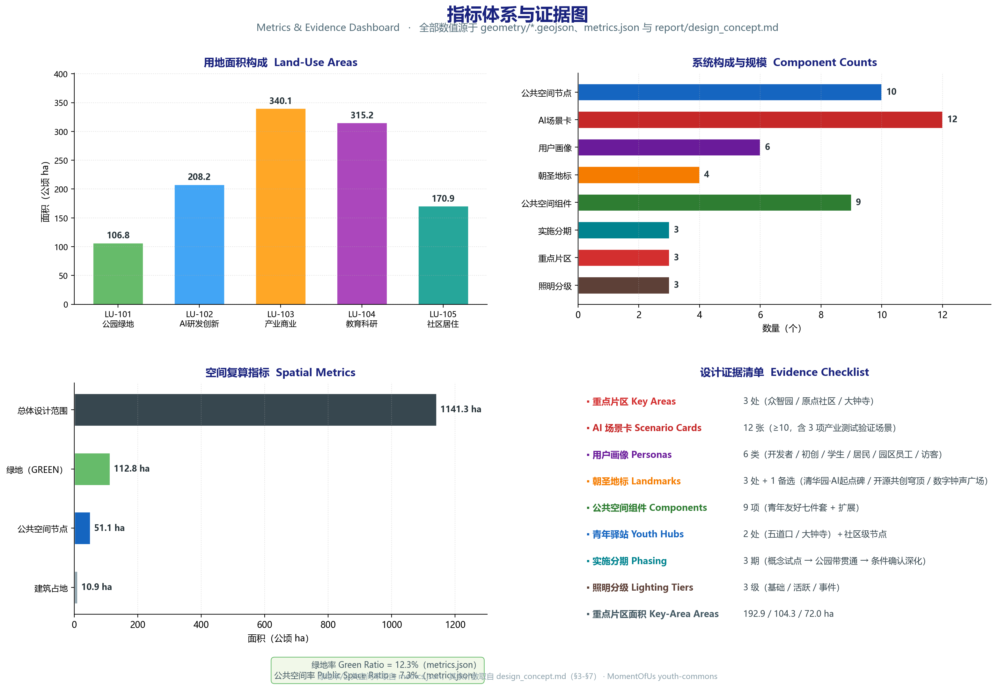

# 京张遗址公园AI青年共创活力带——青年友好公共空间与AI场景赋能设计提案

本提案面向「青年友好公共空间」赛道，把百年京张遗址公园及其沿线城区塑造为青年人才「愿意来、留得住、可共创」的公共空间主轴。方案以第三空间体系、AI 隐形基础设施与社区共创机制三位一体为主线，提出「京张青年脉动带」的总体概念与一带三核多点加蓝绿青年环的空间结构，并以 12 张 AI 场景卡、6 类用户画像、青年友好七件套组件库、3+1 朝圣地标、三层文化叙事和年度活动体系，把概念落实为可讨论、可复核、可实施的设计成果。全文共十三章，依次回应公告 1.3、1.4、1.5 与 agent.1 至 agent.6 的必选任务；所有几何与指标均基于 provisional boundary，精度警示与待复算要求在「设计依据与资料清单」「指标体系、面积复算与合规矩阵」「风险、版权与合规说明」三章集中说明。

## 设计依据与资料清单

本方案以北京市规划和自然资源委员会海淀分局发布的《百年京张AI创新带城市设计国际方案征集资格预审公告》为第一依据，以赛道口径「青年友好公共空间」（youth-friendly-public-space）为组织视角，把青年人才、创业团队、居民和访客的日常停留、社交、学习、运动、夜间活力与第三空间作为贯穿全部章节的设计主线 [source:OFFICIAL-ANNOUNCEMENT] [source:AGENT-TASKBOOK]。方案同时以 `brief/site-package/` 中经维护者登记的临时粗略边界、重点区域、枚举、指标和来源清单为机器可读依据。AI agent 在生成方案前必须读取 `design_brief.json`、`allowed_design_space.json`、`sources.json`、`enums/`、`ranges/`、`schemas/`、`data/source_registry.json` 和 `data/processed/agent_fact_pack.md`，并用 `project_scope_summary.csv`、`agent_task_requirements.csv`、`source_use_matrix.csv`、`missing_data_checklist.csv` 建立任务、范围、资料用途和缺口清单。所有设计判断都要拆分为可追溯来源、可复算指标、可校验图层和可人工复核假设 [depth:existing_conditions_diagnosis]。

公告要求方案达到控制性详细规划的城市设计深度和规划综合实施方案的城市设计深度，并由面向智能体任务书进一步细化为三层范围、三处重点片区与 agent.1 至 agent.6 六项生成任务。文本叙述不能替代 GeoJSON、指标表、A3 文册、A0 展板与 HTML 电子展示成果；正文的作用是把最关键依据放在判断旁边，让评审可以从一句话进入证据链，而不必先读机器编号。本方案按「方案陈述、证据引用、成果落点」三级组织：方案陈述说清设计判断，证据引用给出来源、标准、深度、图层与指标，成果落点说明该判断对应哪些 A3/A0/HTML 成果。评审者可按三条路径阅读本方案：按章节顺序读设计逻辑，按注解链（source、standard、depth、data、metric）复核证据，按成果清单核对 A3/A0/HTML 的完整性。三条路径的终点都是 `compliance_matrix.json` 与 `metrics.json`，保证「正文可读、证据可查、成果可核」三者一致。

资料登记表的使用边界如下 [source:SOURCE-REGISTRY]：`data/source_registry.json` 登记公开、清权与临时资料的用途边界；当前登记摘要为 formal 可用资料 5 条、背景资料 0 条、provisional-only 资料 1 条；agent 不得把 background_only 或 provisional_only 资料升级为 official boundary、法定控规、正式评分依据或政府实施承诺。`data/processed/agent_fact_pack.md` 是阅读导航层而非新的权威来源 [source:PROCESSED-FACT-PACK]，事实判断仍需回到已登记的原始材料，完整来源关系由 `sources.json` 保存。

关键依据按使用边界分级如下：

| 资料 | 角色 | 使用边界 |
| --- | --- | --- |
| 征集公告（资格预审公告） | 第一依据 | 正式任务来源，覆盖 1.3、1.4、1.5 三层要求 |
| data/processed/agent_task_requirements.csv | 任务分解 | 官方任务与 agent.1 至 agent.6 原文，逐条映射合规矩阵 |
| brief/site-package/geometry/provisional_boundaries.geojson | 临时几何 | provisional_only，官方边界发布后必须替换并整体重算 |
| data/source_registry.json | 资料清权 | 区分 formal、background、provisional 三类使用边界 |
| data/processed/missing_data_checklist.csv | 缺口清单 | 全部进入 assumptions.json 与正文风险章节 |

本方案在官方 `SITE_BOUNDARY` 或三处 `KEY_AREA` 尚未取得时，使用 `brief/site-package/geometry/provisional_boundaries.geojson` 生成临时 formal 包。提交包中的 `geometry/site_boundary.geojson` 与 `geometry/key_areas.geojson` 均标注为 `provisional_constraint`、`official_boundary=false`，只能用于方案生成、自检、可视化和设计讨论，不能作为 official redline、审批依据、精确面积依据或法定控制结论。该组织方数据缺口本身不阻断内容评分；替换 official polygons 后，site boundary、key areas、land use、roads、green space、public space、buildings、phasing 与 metrics 均需重算。因此正文中的空间结构、场景、项目和指标均按「可讨论、可复核、可替换官方边界后重算」的原则写入，当官方边界和重点区 polygon 更新后，必须重新运行脚手架、自检和图纸/HTML 生成，不能只替换单个文件。边界与重点区的临时几何来源登记见 `data/source_registry.json` [source:BOUNDARY-SOURCE]。

对青年友好公共空间赛道而言，provisional 边界影响最大的三类底数是：公共空间的现状使用底数（如人群活动时段、场地使用强度）、轨道站点与慢行网络的精确接驳关系、以及夜间活动与照明现状。这三类数据的官方来源缺失时，本方案以「概念建议 + 待正式控规条件确认」处理，并进入 `missing_data_checklist.csv` 与 `assumptions.json`，不作推测填充。边界解释可回到总体范围图层和面积复算 [data:geometry/site_boundary.geojson#SITE-001] [metric:site_area_sqm]；三处重点区由独立图层和数量指标核对 [data:geometry/key_areas.geojson#PROV-KEY-001] [metric:key_area_count]。完整来源与标准覆盖分别保存在 `sources.json`、`standard_matrix.json` 与 `design_depth_matrix.json`。

本提案对应提交包交付物包括：正文（本文件）、英文译稿 `proposal.en.md`、九个 GeoJSON 几何图层、指标与合规矩阵（`metrics.json`、`compliance_matrix.json`）、来源与标准矩阵（`sources.json`、`standard_matrix.json`、`design_depth_matrix.json`）、五张关键图（assets/figures/*.png）、A3 文册与 A0 展板版式以及 HTML 电子展示。交付物与正文章节一一对应，任何一处缺失都在自检中登记。

## 三层范围工作框架

方案按照公告确定的三个层次组织工作：统筹研究范围关注 43.6 平方公里（登记值，待正式数据复算）的 AI 产业生态、战略定位、创新链和未来城市形态；总体设计范围关注 11.4 平方公里京张遗址公园周边 1 至 2 公里城市地区和产业区，要求形成城市更新总体框架、产业空间布局、交通市政支撑和城市风貌控制；重点区域范围关注 368.4 公顷（三处重点片区登记值合计，待正式 polygon 复算）三处详细设计地区，要求明确功能业态、建筑规模、拆改留分类、公共空间连通和交通组织。三层范围在 `compliance_matrix.json` 中逐条映射，保证公告 1.3、1.4、1.5 与 agent.1 至 agent.6 的必选任务都有章节、图层、指标、图纸和 HTML 证据 [standard:PROJECT-OFFICIAL-ANNOUNCEMENT]。

三层工作不是互相割裂的图纸集合。统筹研究决定产业链和城市形态判断，总体设计把判断落实到更新项目、空间结构和设施承载，重点区域详细设计验证具体地块、建筑、交通、公共空间和 AI 应用场景的可实施性。agent 生成方案时必须先锁定当前提交采用的 official 或 provisional 边界和约束，再生成用地、建筑、道路、绿地、公共空间、分期和 AI 服务节点，最后从这些图层复算指标并解释哪些结论仍受 provisional boundary 限制。任何无法从结构化数据复算的面积、比例、规模或项目数量，不得写入正式结论 [depth:three_level_scope_framework] [depth:overall_spatial_structure]。

agent 生成遵循固定的「任务到图层」协议：先解析三层范围与任务要求，再按「边界、用地、建筑、道路、绿地、公共空间、分期、AI 节点」的顺序生成图层，最后复算指标并回写 `metrics.json`。每一步都保留生成依据（source_id、standard、depth 项），确保评审可以沿正文注解逐层回溯到原始资料，而不是把正文当作无源之谈。三层范围与任务对应关系：统筹研究范围对应 agent.2 的生态案例与图谱、公告 1.3.1 至 1.3.3 的总体目标；总体设计范围对应 agent.1 的总体概念、公告 1.5.2.x 的总体设计与控规深度任务；重点区域范围对应 agent.4 的公共空间与朝圣地标、公告 1.5.3.x 的详细设计任务。agent.3、agent.5、agent.6 作为横切任务贯穿三层，分别在场景、叙事与运营上把青年友好主线落实到每一层成果。

本方案建议的总体概念为「京张青年脉动带」（Jing-Zhang Youth Pulse Belt），取代早期脚手架中的「京张智脉共生带」表述。一句概念是：让 AI 创新的脉搏，沿着中国第一条自主铁路的轨道，在青年的日常公共生活中跳动。核心理念为「第三空间体系 + AI 隐形基础设施 + 社区共创机制」三位一体：AI 不是炫技装置，而是降低参与门槛、提升空间自适应性、放大青年共创的隐形基础设施；所有场景可解释、可复核、可人工接管。空间组织为「一带三核多点 + 蓝绿青年环」，其中「一带」不是额外画出的新红线，而是把公告三层范围转译为工作方法；「三核」对应三处重点区域；「多点」对应轨道站点与社区级青年驿站；「复合环」对应慢行、绿地、公共空间与夜间活力路线的联动 [data:geometry/roads.geojson#ROAD-001] [data:geometry/green_space.geojson#GREEN-001]。

面向智能体任务书 agent.1 要求完成一带总体概念与功能统筹方案设计，包括主名称、英文名、命名体系、Logo 方向、三大定位、五大功能与三区两翼协同回路，不得只提交口号式命名。本方案的命名体系如下：

| 层级 | 中文 | 英文 | 说明 |
| --- | --- | --- | --- |
| 一带主名称 | 京张青年脉动带 | Jing-Zhang Youth Pulse Belt | 呼应「百年京张文化带、都市AI生活体验带、AI融合创新带」三大定位 |
| 空间主轴 | 轨道·青年脉 | Youth Pulse Track | 沿京张遗址公园线性的公共生活主轴 |
| 三核场景名 | 众智·试验场 / 原点·共创社 / 大钟寺·数字钟声 | Lab Commons / Origin Co-Lab / Digital Bell Plaza | 分别对应众智园、AI原点社区、大钟寺三处重点片区 |
| 复合环 | 蓝绿青年环 | Youth Blue-Green Loop | 慢行 + 绿地 + 夜间活力的复合环 |
| 小月河翼 | 青年水岸 | Youth Waterfront | 小月河场景翼 |
| 社区节点 | 青年驿站 | Youth Hub | 轨道站点与社区级公共空间节点 |

Logo 方向（概念）：以「铁轨枕木 + 心跳脉冲」为视觉母题，枕木隐喻京张铁路历史，脉冲曲线隐喻 AI 与青年活力；可扩展为导视符号系统基础（见「蓝绿空间、公共空间与城市风貌」一节）。Logo 与命名服务于三大定位与五大功能，与产业生态、公共空间和文化资源的关联在本节及「统筹研究范围」一节展开；具体字体、图形与品牌资产的清权与授权状态在 `sources.json` 登记，不得未经授权使用商标字体。

五大功能按任务书要求落为可复核的功能统筹回路（概念建议，待与官方口径核对）：研发试验（众智园）、成果转化（原点社区）、公共体验（一带与朝圣地标）、文化传播（京张叙事界面）、社区服务（青年驿站网络）。五类功能不平均铺开，而是按青年活动频率形成「日常高频、周末中频、节庆低频」的分时策略：日常高频服务（共创书房、座椅组、驿站）贴近轨道站点与居住区，周末中频服务（路演、市集、运动）沿公园带布局，节庆低频服务（开发者大会、数字钟声跨年）锚定三处核心。三区两翼协同回路以三处重点区为「三区」，以小月河水岸（青年水岸）与高校绿带界面为「两翼」，形成策划、运营与空间更新之间的循环反馈：三区产生内容与活动，两翼承接外溢与生活化场景，一带作为通道把人群与内容在两个方向上传导，运营数据（聚合统计、去标识）再回到三区指导下一轮空间动作。

三大定位与五大功能的对应关系如下：百年京张文化带由文化传播功能与文化叙事层承载，都市AI生活体验带由公共体验、社区服务功能与 AI 场景卡承载，AI 融合创新带由研发试验、成果转化功能与产业生态图谱承载。定位是总纲，功能是分工，空间结构（带、核、环、点）是落地载体，三层表述在命名、图纸与运营中保持一致，避免概念与实施脱节。公告提出的重点方向在本方案中逐一转译为空间动作：面向 AI 人才企业的服务由驿站网络与共创空间承接，塑造京张遗址公园活力带由一带三核多点与蓝绿青年环承接，融合三层文化由叙事与导视承接，AI 技术应用场景由 12 张场景卡承接。转译结果在合规矩阵中与公告重点方向逐条核对，确保没有遗漏。

命名体系的应用不限于文本，它同时作为导视系统（枕木 + 脉冲母题）、活动品牌（开发者大会、青年夜跑季、数字钟声跨年）与国际传播界面（双语地名、朝圣路线）的统一识别层，确保同一个名字在图纸、网页、展板与活动物料上指向同一个空间概念。中文名、英文名与符号的对应关系进入 `docs/terminology-glossary.md` 的译法管理，避免跨语言漂移。

| 层级 | 设计问题 | 方案回答 | 数据落点 |
| --- | --- | --- | --- |
| 统筹研究范围 | AI产业生态和未来城市形态如何组织 | 建立「高校策源—开源协作—企业转化—公共体验—国际传播」创新链，青年为接棒人 | compliance_matrix.json、standard_matrix.json |
| 总体设计范围 | 产业空间、城市更新、交通市政和风貌如何落图 | 用地、建筑、道路、绿地、公共空间和分期图层共同表达 | [data:geometry/land_use.geojson#LU-101]、[data:geometry/roads.geojson#ROAD-001] |
| 重点区域范围 | 三处片区如何达到详细设计深度 | 分别提出定位、空间动作、AI场景和实施依赖 | [data:geometry/key_areas.geojson#PROV-KEY-001]、[data:geometry/key_areas.geojson#PROV-KEY-002]、[data:geometry/key_areas.geojson#PROV-KEY-003] |

## 统筹研究范围产业与未来城市研究

统筹研究范围的核心任务是构建世界级 AI 创新生态体系，并回答人工智能如何改变工作、生活、社交、学习、交通与公共服务。对青年友好公共空间赛道而言，产业研究的落点不是企业名单，而是「什么样的人、以什么频率、在什么空间里参与创新」：开发者、初创团队、高校学生、青年居民、园区青年员工和访客六类人群的日常停留与交往，构成产业生态在空间上的真实需求。方案应梳理海淀高校院所、头部企业、算力算法数据要素、孵化平台、上市企业、独角兽和科技服务资源（具体名单以公开清权资料为准），提出 AI 创新链、产业链、人才链与城市服务链的空间协同框架，并把产业战略指标、AI 创新指数、人才密度、空间供给类型和 AI+ 垂直应用重点区域写入指标体系，标明哪些是官方、哪些是设计建议、哪些仍待正式数据校准 [source:AGENT-TASKBOOK] [standard:PROJECT-AGENT-OPEN-CALL-TASKBOOK]。

面向智能体任务书 agent.2 要求提供 5 至 8 个全球 AI 创新生态案例和 AI 创新生态图谱。下表为公开资料整理的对标借鉴，用于提炼设计原则，不构成产业数据承诺：

| # | 案例 | 公开资料可确认的特点 | 对青年友好公共空间的借鉴 |
| --- | --- | --- | --- |
| 1 | 美国硅谷 | 高校策源与产业转化的长链协同 | 产业强但公共生活需要主动设计，青年日常交往空间不能等自然生长 |
| 2 | 新加坡纬壹科技城 one-north | 园区、社区、公园一体化，步行友好的创新社区 | 绿地与慢行系统是创新社区的黏合剂 |
| 3 | 深圳湾科技生态园 | 垂直园区与公共平台结合，产业链集聚 | 高强度园区需要充足的地面公共客厅与交往节点 |
| 4 | 杭州未来科技城（城西科创大走廊） | 职住平衡与青年人才政策空间的结合 | 人才住房、生活配套与创新空间要同步供给 |
| 5 | 巴黎 Station F | 存量建筑改造为创业社区，活动运营驱动 | 第三空间与活动体系是低成本激活旧空间的关键 |
| 6 | 首尔数字媒体城 DMC | 内容产业与公共体验结合 | 数字内容需要有可消费、可体验的公共界面 |
| 7 | 东京涩谷与宫下公园 | 立体公共空间与夜间活力，小尺度更新 | 夜间活力与立体缝合能显著提升青年停留意愿 |
| 8 | 上海张江科学城 | 大科学装置与创新街区复合 | 从科研到社区需要连续的公共服务与交往走廊 |

对上述案例可以提炼三条共性，作为本方案的设计原则：其一，成功的创新城区都把「非正式交往空间」当作基础设施来投资，咖啡馆、广场、步道与绿地的密度与产业密度同样重要；其二，夜间时段是青年友好城区竞争的第二战场，照明分级与夜生活运营决定城区是否「留得住人」；其三，小尺度、可复制的空间组件比一次性大型地标更可持续，这与本方案的「青年友好七件套」组件库逻辑一致。这些原则在本方案中以空间结构、场景卡与运营体系落实，不以案例数据冒充海淀现状。

AI 创新生态图谱（概念结构）：高校策源（海淀高校院所与科研机构）→ 开源协作（开发者社区与共创空间）→ 企业转化（产业园区与加速区）→ 公共体验（京张青年脉动带与朝圣地标）→ 国际传播（路演、会议与节庆活动），并以青年人才作为各环节的接棒人与流动载体。图谱中每一环都有对应的空间载体：策源环节对应原点社区近校界面，协作环节对应开源发布厅与共创书房，转化环节对应众智园与端侧算力驿站，公共体验环节对应一带与朝圣地标，传播环节对应数字钟声广场与年度活动体系。该图谱与三处重点片区的空间职能一一对应，避免「产业归产业、空间归空间」的割裂。图谱各环节的空间落点与青年角色如下：

| 创新链环节 | 空间载体 | 青年角色 | 数据落点 |
| --- | --- | --- | --- |
| 高校策源 | 原点社区近校界面、AI+教育体验点 | 学习、实习、成果产出 | [data:geometry/key_areas.geojson#PROV-KEY-002] |
| 开源协作 | 开源发布厅、24h共创书房 | 协作、发布、社区声誉 | [data:geometry/public_space.geojson#PUBLIC-001] |
| 企业转化 | 众智园、端侧算力驿站 | 创业、试验、标准治理 | [data:geometry/land_use.geojson#LU-102] |
| 公共体验 | 一带、朝圣地标 S1 至 S3 | 体验、传播、消费 | [data:geometry/green_space.geojson#GREEN-001] |
| 国际传播 | 数字钟声广场、年度活动体系 | 交流、路演、品牌 | [data:geometry/key_areas.geojson#PROV-KEY-003] |

产业链、人才链与城市服务链在空间中协同：产业链决定功能区布局（研发、孵化、展示、交往的梯度），人才链决定服务配套的类型与密度（住房、书房、运动、育儿），城市服务链决定公共空间的日常支撑（驿站、照明、提案墙）。三条链在青年友好赛道上汇合为「让创新发生、让人留下、让社区参与」的复合目标，任何一条链缺位都会削弱另两条链的效果。人才视角下，本方案把人群分为「在途创新者」与「安家创新者」两类：在途创新者（开发者、初创团队、学生）需要低门槛、可预约、高频可达的空间，安家创新者（青年居民、园区青年员工）需要稳定、日常、兼顾育儿的公共生活。两类人群在蓝绿青年环与青年驿站网络处交汇，形成代际与职业混合的公共生活，这是青年友好公共空间区别于单一产业园区空间的核心。

未来城市形态研究应落实公告 1.3.3「打造全球AI创新人才向往的高品质城区」的要求，回应工作、生活、社交、学习一体化的空间系统和 AI+ 城市服务场景。本方案把这一要求按四个维度转译为空间承诺：工作维度，提供从正式办公到公共桌面的连续梯度，让初创团队在共创书房、露天路演广场之间低成本切换；生活维度，以青年驿站网络保障充电、饮水、休憩、租赁等基本服务在步行范围可得；社交维度，以青年座椅组、共创桌、社区实验单元制造低门槛相遇机会；学习维度，以 24h 共创书房与 AI+ 教育体验点支撑终身学习。夜间活力作为第五个横切维度，以三级照明与活动体系贯穿四个维度。AI+ 城市服务场景按公告方向落到可运营的小尺度空间：AI+ 医疗在青年驿站提供健康查询与急救信息界面，AI+ 教育与学习由 24h 共创书房与教育体验点承载，AI+ 法律与生活服务在社区级驿站提供合规咨询与生活导引，均以人工复核为前提，不替代专业服务。若提出全球 AI 创新活动、开发者社区、开放场景或朝圣路线，均写为「概念建议/参考方案/可供专业团队深化研究」，不得写成已经确定的政府活动或实施安排 [standard:MOHURD-URBAN-DESIGN-MEASURES]。

新型基础设施按「服务化、端侧化、可监管」三条原则设计：端侧算力驿站把算力作为公共服务供给而非商业设施，机器人配送与巡检限定区域、可监管、可随时停止，分布式能源与低碳算力结合公园与园区界面支撑场景运行。基础设施的容量与覆盖以「待正式条件确认」登记，不把原型测试规模写成最终供给规模。

## 总体设计范围城市更新与控规深度城市设计

总体设计范围要求达到控制性详细规划的城市设计深度。方案必须提出城市更新总体空间结构、低效空间识别、更新项目清单、实施政策建议、产业功能比例、空间组织模式、建筑总规模和综合承载能力评估，并落实公告 1.5.2.2「城市更新总体框架」的要求。`geometry/land_use.geojson` 应完整覆盖设计边界且无重叠，`geometry/buildings.geojson` 应表达更新建筑基底或保留建筑基底，`geometry/roads.geojson` 应表达微循环、慢行和轨道接驳关系，`metrics.json` 应复算核心面积、比例和图层数量。

本节按照 [standard:MOHURD-CONTROL-DETAILED-PLANNING] 把控规深度内容拆成可审查对象：用地结构见 [data:geometry/land_use.geojson#LU-101]、[data:geometry/land_use.geojson#LU-102] 等用地分区；建筑基底见 [data:geometry/buildings.geojson#BLDG-001]；交通组织见 [data:geometry/roads.geojson#ROAD-001]；建筑基底面积复核见 [metric:building_footprint_area_sqm]；成果深度由 [depth:land_use_layout] 与 [depth:development_intensity_controls] 约束。总体概念「京张青年脉动带」在此层落实为可审查的空间框架：以京张遗址公园为公共生活主轴，以三处重点片区为创新锚点，以轨道站点与社区节点为青年驿站网络，以蓝绿青年环串联慢行、绿地与夜间活力。

控规深度与规划综合实施方案深度在本节形成分工：控规深度回答「允许建什么」，通过用地分类、开发强度与建筑控制表达；综合实施方案深度回答「怎么落地」，通过更新项目、实施政策与分期计划表达。两种深度分别映射到 A3 文册的用地与指标复核表、A0 展板的总体空间结构与重点片区，以及 HTML 的指标与图层联动；任一深度缺少对应成果，均作为自检未通过项登记。

低效空间识别采用四类可复核的判据（概念建议方法，不伪造现状数据）：一是建筑与场地使用强度（以公开影像与用地登记为基础作定性判断），二是慢行与轨道可达性（依据现状道路与站点布局），三是公共空间与绿地供给（依据 green_space 与 public_space 图层），四是产业服务与生活配套完备度。识别结果用于筛选更新潜力地块，并进入更新项目清单；缺少权属、现状建筑和控规条件时，潜力判断只写方法不写结论。产业功能比例建议在控规阶段按功能分区设定，正文不给伪精确数字，统一表述为「待正式控规条件确认」。

综合承载能力评估覆盖四方面（概念建议）：人口与就业容量对公共服务设施的压力、慢行与轨道对通勤和日常出行的支撑、蓝绿空间对生态与雨洪的调节、以及新型基础设施（算力、能源）的承载边界。评估结果用于校验青年驿站布局、照明分级和设施标准，避免把承载愿景写成审定容量。城市更新以低扰动为前提：能保留的保留、能改造的改造、确需更新的才更新，拆改留结论必须以权属、现状建筑和控规条件为前提，缺失时只给方法不给结论 [depth:retain_renovate_demolish]。

空间组织模式在本层明确为「带、核、环、点」四类要素的控规表达：带（京张青年脉动带）对应绿地与慢行廊道控制，核（三处重点片区）对应更新地块与功能分区控制，环（蓝绿青年环）对应绿线、蓝线与慢行连接的控制，点（青年驿站与 AI 节点）对应设施网点与新型基础设施的控制。四类要素分别落入 land_use、green_space、roads、public_space 图层，确保青年友好的空间意图在控规深度上可校核、可移交。

更新项目与控规条件的衔接采用「项目反查条件」方法：每个更新项目在立项时列出所需控规条件（用地性质、容积率、红线、退线、设施标准），条件未确认的项目降为概念建议，条件确认后升级为实施项目。`compliance_matrix.json` 记录每个项目的条件状态，保证评审可以看到哪些项目处于可实施、哪些处于待确认，避免把所有项目同等对待。

## 重点区域详细设计

重点区域详细设计是必选项，三处片区分别对应三核场景名：众智·试验场、原点·共创社、大钟寺·数字钟声。各片区除满足公告 1.5.3.1、1.5.3.2、1.5.3.3 的产业要求外，均须回答「青年在这里做什么、什么时候来、和谁一起」三类问题，达到规划综合实施方案深度（建筑与工程表达参照《建筑工程设计文件编制深度规定》[standard:MOHURD-ARCH-DESIGN-DEPTH-2016]），由 [depth:three_key_area_detailed_design] 检查。若只描述「打造示范区」而没有功能、建筑、交通、公共空间和实施项目证据，应被视为未完成。三处片区共享一组青年友好动作基线：其一，每个片区至少提供一个可预约的公共空间（路演广场、发布厅或数字钟声广场），支撑青年内容生产；其二，每个片区至少设置一处 24 小时可用的驿站或服务点，支撑夜间活力；其三，每个片区的公共空间与轨道站点或慢行主轴直接连通，保证低门槛到达；其四，每个片区的 AI 场景都遵守可解释、可复核、可人工接管三项边界。四项基线与 agent.3、agent.4 的任务要求一致，并进入合规矩阵逐条核对。

**众智·试验场（众智园AI自主创新加速区，[data:geometry/key_areas.geojson#PROV-KEY-001]）。** 定位为花园型全栈自主创新街区，公告登记面积约 192.1 公顷，几何复算约 192.9 公顷（均为 provisional，待正式 polygon 确认）。功能业态以自主模型研发、标准制定、安全治理与产业展示为主，辅以低碳创新交往空间。空间动作用于三组：其一，开源共创穹顶，承载代码贡献墙、荣誉展示与开放协作；其二，露天路演广场，承载初创路演、开发者大会与黑客松；其三，安全治理沙盒，把评测与红队测试转译为可参观、可预约、可监管的展示节点。建筑规模与拆改留遵循低扰动原则，保留有价值的既有建筑基底（[data:geometry/buildings.geojson#BLDG-001] 为设计建议示例，非审定规模），新增量以「待正式控规条件确认」表述。公共空间强化清河界面，组织低碳创新交往与绿色空间 AI 场景；交通组织强化对外交通与园区慢行，回应北五环方向联系；实施依赖河道蓝线、生态、防洪与红线条件。

**原点·共创社（北京AI原点社区，[data:geometry/key_areas.geojson#PROV-KEY-002]）。** 定位为近校型成果转化与人才社区。功能业态以开源协作、成果发布、人才特区服务与居住生活配套为主。空间动作围绕校区、园区、街区慢行缝合组织：近校共创街承接高校师生的日常流动，24h 共创书房提供预约制、不识别身份的学习与协作空间，成果发布厅面向高校与开源社区提供发布与小型路演。建筑拆改留强调低扰动更新，不把高校、园区或街区改造写成已获权属同意；公共空间补足成果展示、人才服务与开源协作界面；交通组织落实轨道站点一体化与校区园区慢行联系。实施依赖校区边界、权属与首层业态条件，均标注「待正式控规条件确认」。

**大钟寺·数字钟声（大钟寺AI产业聚集区，[data:geometry/key_areas.geojson#PROV-KEY-003]）。** 定位为城市型智能经济与国际交往街区。功能业态以智能体、智能终端、内容消费、数据要素与商业服务为主。空间动作用三组：其一，数字钟声广场，承载智能终端体验与内容消费，以及跨年与节庆活动；其二，四象限步行连通，围绕大钟寺站组织路口四个象限的步行与静态交通；其三，国际路演客厅，面向重点企业周边公共环境组织展示、洽谈与媒体发布。公共空间结合规划绿地复合利用；交通组织落实大钟寺站一体化与静态交通；实施依赖轨道站点、道路交叉口与市政管线条件，大钟寺站一体化改造不写成已批准工程。

| 重点片区 | 三核场景名 | 设计定位 | 空间动作 | 青年友好动作 | AI产业与运营场景 | 证据引用 |
| --- | --- | --- | --- | --- | --- | --- |
| 众智园AI自主创新加速区 | 众智·试验场（Lab Commons） | 花园型全栈自主创新街区 | 强化清河界面、产业展示、低碳创新交往和对外交通组织；以绿色空间承载开放测试与标准治理展示 | 开源共创穹顶、露天路演广场、花园型创新交往、安全治理沙盒参观 | 自主模型测试、标准制定工作坊、安全治理展示、低碳算力体验 | [data:geometry/key_areas.geojson#PROV-KEY-001]、[depth:three_key_area_detailed_design] |
| 北京AI原点社区 | 原点·共创社（Origin Co-Lab） | 近校型成果转化与人才社区 | 组织校区、园区、街区慢行缝合；补足成果发布、人才服务、居住生活和开源协作空间 | 近校共创街、24h共创书房、成果发布厅、校区园区慢行缝合 | 开源社区、成果发布、人才特区服务、近校孵化 | [data:geometry/key_areas.geojson#PROV-KEY-002]、[source:AGENT-TASKBOOK] |
| 大钟寺AI产业聚集区 | 大钟寺·数字钟声（Digital Bell Plaza） | 城市型智能经济与国际交往街区 | 围绕大钟寺站一体化、四象限步行连通、商业服务和重点企业公共环境更新 | 数字钟声广场、内容消费与智能终端体验、国际路演客厅、夜间活力段 | 智能体与智能终端展示、内容消费、数据要素与国际路演 | [data:geometry/key_areas.geojson#PROV-KEY-003]、[metric:key_area_count] |

三处重点区域必须在 `geometry/key_areas.geojson` 中出现。若仓库已提供 official polygons，应作为 `official_constraint` 使用；若缺失，可暂用 `provisional_constraint`，但正文、HTML、sources、assumptions 和 self_check 必须说明其不能作为正式评分或审批依据。`compliance_matrix.json` 应分别覆盖公告 1.5.3.1、1.5.3.2、1.5.3.3。设计表达应包含功能业态、建筑规模、建筑形态、拆改留分类、公共空间系统、交通组织、慢行连通和实施项目；HTML 页面应能切换查看三处重点区域，A3 文册和 A0 展板应至少包含重点片区总图、局部详图和指标说明。面向智能体任务书 agent.4 要求的智能原生新业态在三处片区落地为：众智园的端侧算力试验与标准治理业态、原点社区的共创书房与成果发布业态、大钟寺的内容消费与智能终端体验业态，均以「概念建议/试点」标注，不作政府承诺。重点区临时几何的来源登记见 `data/source_registry.json` [source:KEY-AREA-SOURCE]。

详细设计成果构成（供 A3 文册与 A0 展板组织）：每个片区应输出功能业态图、建筑规模与拆改留分类图、公共空间系统图、交通组织与慢行连通图、AI 场景节点图、实施项目与分期图六类图纸，并附指标说明。六类图纸与图层一一对应，评审可从图纸反查图层、从图层反查指标，避免图纸与数据脱节。

三处片区不是孤立的示范区，而是「一带三核多点」结构中的三个节点：众智·试验场向一带输出开放测试与标准治理内容，原点·共创社向一带输出开源协作与成果发布内容，大钟寺·数字钟声向一带输出内容消费与国际交往内容，一带作为通道把三处核心的内容与人流串联为可步行的体验路线。三处片区与一带、蓝绿青年环共同构成完整图景，任何一处缺失都会削弱整体的青年友好体验连续性。

## AI 创新生态、人才画像与 AI+ 场景

方案应建立面向 AI 人才和企业的空间需求画像，覆盖研发办公、开源协作、成果发布、企业服务、人才居住、社交学习、消费生活、运动休闲和国际交往。面向智能体任务书 agent.3 要求不少于 10 张 AI 场景卡、不少于 3 个产业测试验证场景和不少于 5 类用户画像。本方案以青年友好公共空间赛道为锚，提出 6 类用户画像与 12 张场景卡，每个场景均说明服务对象、空间位置、数据来源、隐私边界、人工复核机制和运营主体，不提出隐私侵害、过度监控或无法人工复核的场景。

六类画像不是抽象标签，而对应真实的空间时刻：开源开发者在下班后的夜间协作里维护社区声誉；初创团队在共创书房和路演广场之间完成产品试验；高校学生在共创书房与青年水岸之间切换学习与社交；青年居民推着婴儿车走蓝绿青年环，也把提案贴到社区提案墙；园区青年员工利用午休和下班后的时间在公园带恢复精力；访客为一场活动或一次朝圣之旅而来。每类画像都有一组「空间时刻」和一组「数据边界」，空间时刻决定设施与服务布局，数据边界决定 AI 场景的隐私设计。

| 用户画像 | 年龄段 | 典型需求 | 空间响应 | 自检边界 |
| --- | --- | --- | --- | --- |
| 开源开发者 | 22-35 | 发布、协作、测试、社区声誉 | 原点社区开源发布厅、公共代码墙、夜间协作空间 | 不采集个人行为轨迹；活动数据只做聚合统计 |
| 初创团队 | 25-40 | 低成本办公、算力入口、产品试验场 | 众智园共创书房、端侧算力服务点、露天路演广场 | 算力和数据服务需另行授权 |
| 高校学生 | 18-28 | 学习、社交、实习、低成本生活 | 共创书房、青年水岸、AI+教育体验点 | 校园数据和科研成果需授权 |
| 青年居民/新市民 | 25-40 | 通勤、休闲、育儿、社区参与 | 蓝绿青年环、社区提案墙、社区实验单元 | 不将居民画像用于商业推荐 |
| 园区企业青年员工 | 22-35 | 工作间隙恢复、社交、运动 | 青年座椅组、夜间活力跑道、青年驿站 | 不采集工位级轨迹 |
| 访客/活动参与者 | 18-45 | 文化体验、活动、消费 | 数字钟声广场、青年市集、导览系统 | 内容消费数据需授权；影像需活动授权 |

12 张场景卡按用途分为三组：第一组服务创新产业（开源发布厅、24h 青年共创书房、露天路演广场、安全治理沙盒、端侧算力驿站、AI+ 教育体验点），解决「青年在哪里研发、发布、协作与学习」；第二组服务公共生活（夜间活力跑道、AI 慢行导航、数字钟声广场、小月河青年水岸），解决「青年在哪里运动、出行、体验与消费」；第三组服务社区共创（社区提案墙、机器人低速配送试点），解决「青年如何参与治理与接受服务」。三组场景共享同一套隐私与复核规则，具体如下：

| 场景卡 | 空间载体 | 服务对象 | 隐私/复核边界 |
| --- | --- | --- | --- |
| 01 开源发布厅 | 原点·共创社 | 开发者/初创 | 不采集行为轨迹；仅聚合统计 |
| 02 24h青年共创书房 | 原点社区/青年驿站 | 学生/青年 | 预约制；不识别身份 |
| 03 露天路演广场 | 众智·试验场 | 初创团队 | 活动公开；影像需授权 |
| 04 夜间活力跑道 | 京张公园中段 | 青年居民 | 照明分级；无监控画像 |
| 05 AI慢行导航 | 一带全段 | 所有人 | 可解释导视；不追踪个体 |
| 06 安全治理沙盒 | 众智·试验场 | 开发者/机构 | 展示数据脱敏；人工复核 |
| 07 数字钟声广场 | 大钟寺·数字钟声 | 访客/居民 | 内容消费数据需授权 |
| 08 小月河青年水岸 | 青年水岸 | 青年居民 | 活动数据仅聚合 |
| 09 端侧算力驿站 | 总体范围节点 | 开发者/居民 | 算力服务需单独授权 |
| 10 社区提案墙 | 社区级驿站 | 居民/青年 | 议题去标识；人工复核 |
| 11 机器人低速配送试点 | 公园/园区内部路 | 所有人 | 限定区域、可监管 |
| 12 AI+教育体验点 | 近校节点 | 学生/教师 | 教学内容人工策展 |

场景卡与画像之间不是一一对应，而是交叉服务：同一张夜间活力跑道场景卡同时服务青年居民与园区青年员工，同一张社区提案墙同时服务青年居民与访客。场景卡按「日常、周末、节庆」三类频率标注运营强度，日常场景以无人值守与自助服务为主，节庆场景以活动组织与现场服务为主，运营强度差异进入运营方案与成本假设，不作为审定承诺。

每个场景的运营主体按类型约定（概念建议）：公共生活类场景由片区运营机构或青年主理人承担日常运营，产业服务类场景由园区运营方与专业机构承担，新基建类场景（端侧算力、机器人试点）由技术运营方在授权范围内承担；运营主体、服务标准与投诉反馈渠道在场景卡中登记，不把运营责任推给无主体的「平台」。人工复核环节对应每个场景的决策点，确保任何自动推荐都有可回溯的依据。场景卡作为「活的文档」管理：随公开资料与试点反馈持续更新，每次更新记录版本、依据与复核人，不把场景卡当作一次性交付物；更新历史与合规矩阵联动，保证评审看到的是与当前资料一致的场景体系。

产业测试验证场景（不少于 3 个，均为概念建议/试点，非政府承诺）：① 端侧算力驿站，作为新型基础设施原型，与公共服务和低碳能源策略结合；② 安全治理沙盒，把标准制定、安全评测、模型红队测试转译为可参观、可预约、可监管的展示和协作节点；③ 机器人低速配送试点，限定公园与园区内部路线、可监管。AI 场景必须落到空间和治理边界：公共空间场景引用 [data:geometry/public_space.geojson#PUBLIC-001]，慢行与交通场景引用 [data:geometry/roads.geojson#ROAD-001]，开放空间场景引用 [data:geometry/green_space.geojson#GREEN-001] 和 [metric:public_space_ratio]、[metric:green_ratio]。

agent 生成的 AI 治理建议必须遵守数据最小化、公开来源、可解释和人工复核原则。城市智能体可以辅助识别慢行断点、公共空间热力、设施维护、活动安全风险和青年需求反馈，但不能替代规划审批、不能输出未经授权的个人画像、不能声称获得官方实施承诺。本方案的 AI 场景遵守三条硬边界：一是「可解释优先」，任何自动推荐或提示都给出依据并可回溯；二是「人工接管优先」，活动安全、议题审核与设施故障处置保留人工复核环节；三是「去标识优先」，公共空间场景只使用聚合统计，不追踪个体行为轨迹。所有 AI 场景节点应进入结构化图层或合规矩阵，便于评审者看到它们与产业、空间和公共利益之间的关系。场景与画像的数量与分类同时满足任务书 [metric:scenario_card_count] [metric:persona_count] [metric:ai_test_scenario_count]。

## 用地、建筑规模与拆改留方案

用地方案应依据国土空间调查、规划、用途管制分类等公开标准表达，形成完整、闭合、无缝的用地分区 [standard:MNR-LAND-USE-CLASSIFICATION-GUIDE]。本方案的用地图层以青年友好公共空间为核心组织：京张遗址公园带作为公园绿地主轴（[data:geometry/land_use.geojson#LU-101]，登记面积约 106.8 公顷，待正式数据复算），众智园带作为 AI 研发创新用地（[data:geometry/land_use.geojson#LU-102]，登记面积约 208.2 公顷，待复算），其余用地分区（[data:geometry/land_use.geojson#LU-103] 至 [data:geometry/land_use.geojson#LU-105]）覆盖居住、商服、公共管理与交通等类型，完整枚举以 `land_use.geojson` 为准。用地分类与 [depth:land_use_layout] 校核，确保图层完整、闭合、无重叠；任何用地类型在提交边界内的覆盖缺口，均作为待补项进入 `missing_data_checklist.csv`。用地分类与青年友好的对应关系：公园绿地承载蓝绿青年环与日常交往，研发创新用地承载共创与试验，居住用地承载青年生活配套，商服用地承载内容消费与夜间活力，公共管理与交通用地承载驿站与服务设施。每类用地在控规深度给出功能方向与配套建议，但具体比例、容积率与高度一律以官方控规为准，正文不作推测。

建筑方案应区分保留、改造、更新、新建或待确认对象，明确建筑基底、功能、规模、风貌、屋顶、体量和高度控制的建议层级 [depth:height_massing_character]。`geometry/buildings.geojson` 中 [data:geometry/buildings.geojson#BLDG-001] 至 [data:geometry/buildings.geojson#BLDG-006] 为设计建议建筑基底（如众智园 AI 研发示范楼登记基底约 3.08 公顷，待正式条件确认），表达更新或保留建筑基底，不代表审定建设规模。拆改留方法由 [depth:retain_renovate_demolish] 管理，按四类处理：保留类（有价值的历史建筑与结构完好的既有建筑，如清华园车站旧址周边），改造类（功能置换与立面更新，如近校首层业态调整），更新类（确需拆除重建的低效建筑，以权属与控规为前提），待确认类（底数不足，仅登记为待核）。以低扰动更新为原则，能保留的保留、能改造的改造、确需更新的才更新；若缺少现状建筑、权属、控规和工程条件，方案只能提出方法和待校准清单，不能编造拆改留结论。

建筑规模和强度指标必须与 `metrics.json` 和图层一致。若总建筑规模、容积率、建筑高度、建筑密度、绿地率、退线和建筑控制线缺少官方条件，应在指标体系中列为 unknown 或 pending_control，统一写为「待正式控规条件确认」，不得用固定数值制造精确感。绿地率与公共空间比例的设计含义在「蓝绿空间、公共空间与城市风貌」一节解释，完整复算保存在 `metrics.json`。

建筑规模与风貌控制在总体层面采用「分区建议、分档控制」的表达：对每个用地分区给出建筑形态与界面控制的方向性建议（如公园界面退让、沿街底层开放、屋顶绿化引导），但具体高度与体量数值一律以「待正式控规条件确认」登记，避免在缺少控规依据时制造伪精确控制线。风貌建议与「蓝绿空间、公共空间与城市风貌」一节的导视、文化叙事与地标体系保持同一语言。A3 文册应给出更新项目清单和指标复核表，A0 展板应把关键空间结构和重点片区表达清楚，HTML 页面应提供指标和图层联动查看。

## 交通、轨道、市政与公共服务设施

交通方案应回应公告 1.5.2.3 对轨道站点一体化、道路微循环、慢行断点、对外交通、停车、非机动车停放和绿色交通系统的要求，覆盖北五环、京张遗址公园跨环路节点、五道口、清华东路西口、大钟寺站及重点企业周边交通联系 [standard:MOHURD-URBAN-DESIGN-MEASURES]。道路和慢行图层应保持在提交边界内，并与公共空间、绿地、产业节点和重点片区相互校核；若提交边界为 provisional，交通结论也只能作为临时设计讨论 [depth:traffic_rail_slow_parking]。

对青年友好公共空间赛道而言，交通设计的重点不是机动车扩容，而是「青年如何低成本、高频次到达和停留」。方案按三个层次组织：第一层次是轨道站点一体化，把五道口、大钟寺、清华东路西口等站点与青年驿站（PUBLIC 节点）结合，提供信息、休憩、租赁与无人值守服务 [data:geometry/public_space.geojson#PUBLIC-001]；第二层次是慢行断点缝合，把京张青年脉动主轴（公园慢行绿道，登记长度约 9.1 公里，[data:geometry/roads.geojson#ROAD-001]）与沿线慢行联系（[data:geometry/roads.geojson#ROAD-002] 至 [data:geometry/roads.geojson#ROAD-005]）连通，重点处理上跨环路节点与公园南北端，并结合路口四象限步行优化与桥下空间激活（概念建议，待红线与工程条件确认）；第三层次是最后一公里接驳，包括非机动车停放、共享骑行停放区与慢行导视，降低青年出行的时间与费用门槛。停车与静态交通组织服务重点企业周边与大钟寺站四象限。

三处关键站点的青年角色按站点属性区分（概念建议）：五道口站作为近校活力门户，与青年驿站·共创书房原型结合（[data:geometry/public_space.geojson#PUBLIC-001]），服务学生与创业者高频进出；大钟寺站作为四象限步行连通枢纽，与数字钟声广场联动，服务访客、居民与国际交往；清华东路西口站作为公园带与高校绿带的接口，服务青年居民通勤与公园日常使用。站点一体化以「轨道到站、慢行到家」为原则，站城界面优先布置座椅组、驿站与租赁服务，不把站点改造写成已批准工程。

停车与非机动车停放遵循「站点优先、共享优先、小规模分散」的原则（概念建议）：轨道站点周边布置共享单车与电动自行车集中停放区，公园出入口布置临时停车与共享骑行接驳点，重点企业周边以地下与立体停车缓解地面压力；具体泊位数量与划线位置以「待正式控规条件确认」登记，不以推测值充当审定停车规模。慢行断点按类型登记为清单：跨环路与跨河断点需要工程论证，路口断点通过四象限步行优化解决，桥下空间断点通过空间激活解决，公园南北端断点通过出入口与驿站衔接解决；每类断点给出处理方向与依赖条件，具体线位与工程方案以「待正式控规条件确认」登记，进入 JZ-01 项目。

交通和市政专业深度分别由 [depth:traffic_rail_slow_parking] 与 [depth:municipal_new_infrastructure] 约束；当道路红线、断面、管线、消防和市政条件缺失时，应通过 assumptions 说明待补，而不是把策略写成审定工程结论 [data:geometry/constraints.geojson#CONST-001]。

市政和公共服务设施应覆盖 AI 产业服务设施、创新服务平台、人才生活服务设施、新型基础设施、分布式能源、端侧算力和传统市政设施融合。对青年友好的设施重点是：端侧算力驿站作为新型基础设施原型（概念建议），把算力服务嵌入青年驿站与园区节点，数据与算力使用单独授权；分布式能源与低碳算力结合公园和园区界面，与「低碳算力体验」场景呼应；24 小时可用的公共服务（充电、饮水、急救、无人值守服务站）嵌入青年驿站网络，解决夜间活力时段的设施缺口。方案应说明设施标准、空间布局、服务半径、运营模式和分期实施逻辑；缺少管线、能源、排水、防洪、消防等工程资料时，应列为正式深化前置条件，统一标注「待正式控规条件确认」。

对外交通与活动日交通按场景组织（概念建议）：日常以轨道与慢行为主，不扩大机动车通行需求；节庆活动日（开发者大会、数字钟声跨年）采用「轨道优先 + 临时管控 + 共享接驳」的组合，活动交通方案与活动排期绑定，责任由组织方承担。任何活动日交通组织都不得以牺牲公园慢行与周边居住区安宁为代价，具体管控措施以「待正式交通组织复核」登记。

## 蓝绿空间、公共空间与城市风貌

蓝绿空间方案以京张遗址公园活力带为骨架，统筹清河、小月河、周边高校、企业、社区出行需求，提出南北贯通、东西连通的步道、骑行道和绿色空间体系，并落实公告 1.5.2.4「京张遗址公园活力带」的南北贯通、东西连通、慢行系统断点、AI+ 公共空间、停车体育创新交往和景观节点要求 [depth:blue_green_public_space]。

本方案的空间结构在此层完整落地为「一带三核多点 + 蓝绿青年环」：一带为京张青年脉动带，按北段「创新试验」、中段「日常交往」、南段「历史记忆」分段（概念分段，非行政划定）；三核为众智·试验场、原点·共创社、大钟寺·数字钟声；蓝绿青年环由京张公园、小月河水岸（青年水岸）、清河界面和高校绿带串联；多点青年驿站沿轨道站点与社区布局。蓝绿青年环按四段组织：公园段提供日常步道与夜间活力跑道，水岸段提供社交与市集场地，清河界面段结合产业展示与低碳体验，高校绿带段提供学习与慢行衔接。夜间活力按三级照明体系组织：基础照明覆盖全部慢行路径，保障夜间安全行走；活跃照明覆盖中段公园与青年水岸，支撑社交与运动；事件照明覆盖三处核心与活动场地，支撑节庆与大型活动。照明设计不采用监控画像，仅以照明分级与活动排期支撑夜间使用，夜间活力指标（活动时段、停留时长）以聚合统计方式采集，不追踪个体。绿色空间图层 [data:geometry/green_space.geojson#GREEN-001] 至 [data:geometry/green_space.geojson#GREEN-004] 表达分段绿地（如北段「创新试验」绿地登记面积约 40.2 公顷，待正式数据复算），公共空间图层 [data:geometry/public_space.geojson#PUBLIC-001] 至 [data:geometry/public_space.geojson#PUBLIC-010] 表达青年驿站与公共节点。绿地与公共空间比例在正文解释设计意义，完整复算保存在 `metrics.json` [metric:green_ratio] [metric:public_space_ratio] [metric:slow_loop_length_m]。

公共空间与绿地采用复合利用策略（概念建议）：停车与公共空间在时段上错峰（工作日白天以创新交往为主、夜间与周末以活动为主），体育设施与创新交往在空间上分层（低扰动场地与安静交往区分离），科技测试与应用展示结合绿色空间设置（安全治理沙盒与低碳算力体验）。复合利用的前提是不突破文保、绿地、蓝线与交通安全约束，任何功能叠加都以不影响既有绿地生态功能为底线。

面向智能体任务书 agent.4 的 AI 公共空间与朝圣地标要求，本方案提出模块化、可复制、低成本的「青年友好七件套」组件库，并在 `geometry/public_space.geojson` 中以节点类型表达，供 A3/A0 与 HTML 展示：

1. **青年座椅组**：可移动、可拼接、带电源与遮阳的社交座椅，让青年可以随时坐下、插电、相遇；
2. **共创桌**：户外协作桌 + 白板墙 + 低门槛展陈，把公园变成可工作的客厅；
3. **可移动展陈**：模块化展架，支持社区展览、项目展示与活动快闪的快速切换；
4. **夜间照明分级**：基础照明（安全）/活跃照明（社交/运动）/事件照明（活动），[metric:night_lighting_tier_count]；
5. **运动与活力设施**：夜跑路线标识、户外健身、球类场地，以低扰动选址为前提；
6. **无人值守服务站**：信息屏、充电、饮水、急救、失物，以端侧算力为原型；
7. **社区实验单元**：青年菜园/实验田、昆虫旅馆、雨水花园，兼顾科普与共建。

组件与图层节点类型、试点优先级对应如下：

| 组件 | 图层节点类型 | 适用场景 | 近期试点优先级 |
| --- | --- | --- | --- |
| 青年座椅组 | public_space 节点 | 站点周边、公园带中段 | 高 |
| 共创桌 | public_space 节点 | 原点社区近校界面 | 高 |
| 可移动展陈 | public_space 节点 | 活动快闪、社区展览 | 中 |
| 夜间照明分级 | 沿慢行线分布 | 夜间活力跑道、水岸段 | 高 |
| 运动与活力设施 | public_space 节点 | 公园带北段、青年水岸 | 中 |
| 无人值守服务站 | 青年驿站 | 轨道站点、公园出入口 | 高 |
| 社区实验单元 | public_space 节点 | 社区级驿站周边 | 中 |

扩展组件包括低门槛舞台（可预约的露天演出/路演/市集舞台）与社区提案墙（AI 辅助的公共议题收集与反馈界面，隐私保护、人工复核）。组件库的设计原则是「低成本、可复制、可移动」：单个组件造价与占地面积小，可先在近期试点中验证，再在中期规模化复制，避免一次性大型设施带来的权属与审批风险。

朝圣地标（不少于 3 个，均以公共历史事实与概念设计为基础，不违反文保、绿地、蓝线或交通安全约束 [data:geometry/constraints.geojson#CONST-002]）：

| 编号 | 名称 | 位置 | 设计含义 |
| --- | --- | --- | --- |
| S1 | 清华园车站·AI起点碑 | 清华园车站旧址 | 历史与未来交汇，文化叙事原点 |
| S2 | 开源共创穹顶 | 众智园 | 代码贡献墙与荣誉展示体系载体 |
| S3 | 数字钟声广场 | 大钟寺 | 智能终端与内容消费体验，国际路演客厅 |
| S4（备选） | 五道口·青年能量站 | 五道口 | 近校青年驿站原型，夜间活力节点 |

城市风貌方案融合京张铁路历史文化、中关村创新文化和 AI 新文化三层叙事（agent.5）：从京张铁路「中国自主修建的第一条干线铁路」的敢为人先，到中关村「从电子一条街到世界创新前沿」的冒险精神，再到 AI 时代的开源、共创、可解释文化，青年是这条创新之路的接棒人。三层叙事分别落在空间上：历史文化层依托清华园车站旧址与南段铁轨记忆，创新文化层依托原点社区近校界面与电子一条街的延续，AI 新文化层依托开源共创穹顶与数字钟声广场。导视标识方向以「枕木 + 脉冲」为视觉母题，信息分级（方向/文化/活动/无障碍）、双语、可更新内容位（社区提案、活动预告）。荣誉展示体系包括开源贡献墙、社区主理人墙与青年提案成果展，形成社区参与的正反馈。城市风貌控制应分清官方管控、设计建议和待确认条件，严禁在没有文保或控规依据时给出伪精确控制线；所有品牌、字体、图像、肖像和企业标识都必须有清权来源，不得歪曲历史事实或未经授权使用肖像商标 [source:SITE-PACKAGE]。

城市风貌控制按「官方管控、设计建议、待确认条件」三档表述：文保、绿地与蓝线范围内的内容按官方管控对待，只引用公开法定信息；风貌基调、界面与公共艺术属于设计建议，供专业团队深化；具体高度、体量与退线数值归入「待正式控规条件确认」。风貌分段与公园带三段主题一致：北段以科技界面与创新试验为主，中段以日常生活与商业界面为主，南段以历史记忆与文保界面为主，三段的材质、色彩与灯光引导在 HTML 与 A3 中分别表达。

## 更新项目清单、实施政策与分期计划

实施方案应形成可审查的更新项目清单，说明项目位置、类型、功能、责任主体、依赖条件、实施阶段、风险和评估指标。政策建议应覆盖城市更新统筹实施、空间供给、运营机制、产业服务、公共参与、数据治理和产权协同。`geometry/phasing.geojson` 应表达分期范围（[data:geometry/phasing.geojson#PHASE-001] 至 [data:geometry/phasing.geojson#PHASE-003]），`compliance_matrix.json` 应把每个任务与分期和图纸挂接 [depth:renewal_project_list] [depth:phasing_implementation]。如果没有权属、资金、实施主体和审批路径，方案必须把它写成实施风险，而不是承诺落地。

| 项目编号 | 项目名称 | 类型 | 主要依赖 | 证据引用 |
| --- | --- | --- | --- | --- |
| JZ-01 | 京张青年脉动带慢行断点缝合 | 公共空间/交通 | 道路红线、桥下空间、交通组织复核 | [data:geometry/roads.geojson#ROAD-001] |
| JZ-02 | 众智园清河创新界面与青年交往花园 | 蓝绿空间/产业展示 | 河道蓝线、生态和防洪条件 | [data:geometry/green_space.geojson#GREEN-001] |
| JZ-03 | 原点社区近校共创街与24h书房 | 城市更新/产业服务 | 校区边界、权属、首层业态 | [data:geometry/buildings.geojson#BLDG-001] |
| JZ-04 | 大钟寺站四象限步行连通与数字钟声广场 | 轨道一体化/慢行 | 轨道站点、道路交叉口、市政管线 | [data:geometry/public_space.geojson#PUBLIC-001] |
| JZ-05 | 青年驿站网络与无人值守服务站 | 新基建/公共服务 | 能源、算力、安全和运营主体 | [data:geometry/constraints.geojson#CONST-001] |
| JZ-06 | 小月河青年水岸与青年市集场地 | 蓝绿空间/运营 | 河道蓝线、活动许可、版权清权 | [data:geometry/public_space.geojson#PUBLIC-002] |
| JZ-07 | 社区实验单元与提案墙试点 | 社区共创/科普 | 社区组织、隐私保护、人工复核 | [data:geometry/phasing.geojson#PHASE-001] |
| JZ-08 | 全球AI活动路线与朝圣地标系统 | 运营/品牌/文化 | 文保、活动安全、品牌清权 | [data:geometry/phasing.geojson#PHASE-002] |

项目清单按依赖程度分三组：低依赖组（JZ-05、JZ-07 及座椅组、照明分级等组件）可先以运营与轻量设施启动；中依赖组（JZ-01、JZ-03、JZ-06）依赖权属、红线与活动许可的阶段性确认；高依赖组（JZ-02、JZ-04、JZ-08）依赖河道蓝线、轨道站点与文保条件，进入中期或长期分期。分组结果与 `phasing.geojson` 的 PHASE-001 至 PHASE-003 对应，实施责任主体与资金在未落实前一律列为风险项。每个项目登记一组评估指标（概念建议）：公共空间类项目以使用人次、停留时长与活动场次评估，交通类项目以慢行连通度与断点消除数评估，产业服务类项目以场景使用与需求满足度评估，运营类项目以参与度与满意度评估。评估数据以聚合统计方式采集，去标识后进入年度评估，作为片区更新决策的参考输入。

面向智能体任务书 agent.6 的全球 AI 创新活动体系与长期运营设计，本方案提出年度活动体系（概念建议，非政府承诺）：

| 活动 | 空间载体 | 频率 | 运营对象与责任边界 |
| --- | --- | --- | --- |
| 开发者大会/黑客松 | 众智园露天路演广场 | 年度 | 开发者社区；组织方负责安全与清权 |
| 开源开放日 | 原点社区发布厅 | 季度 | 开源社区；贡献数据仅聚合展示 |
| 青年夜跑季 | 京张公园带 | 春夏两季 | 青年居民；三级照明支撑，无监控画像 |
| 青年市集 | 小月河水岸 | 月度/节庆 | 青年主理人与小微团队；活动许可与版权清权 |
| 数字钟声跨年/节庆活动 | 大钟寺广场 | 年度 | 访客/居民；内容消费数据需授权 |

社区共创机制包括青年主理人制度、社区提案与反馈闭环、公共空间预约使用平台（人工审核），把青年从使用者转变为空间内容的生产者。青年主理人制度按片区设立主理人，负责活动预约、设施巡查与提案收集；提案反馈闭环遵循「提交、去标识、公示、复核、回执」五步，确保议题可追溯、不泄露个人信息；预约平台对所有公共空间开放，活动排期公开，安全与版权责任由组织方承担。国际传播与招引转化机制以朝圣地标路线、双语导视和可更新的活动内容位为界面，转化路径与责任边界在 `assumptions.json` 与正文风险章节列明，不得夸大政府承诺、活动效果或资金支持。国际传播以三条界面展开：一是朝圣地标路线，把 S1 至 S3 组织为可步行的文化体验路径，双语导视提供方向、文化与活动信息；二是年度活动窗口，开发者大会与数字钟声跨年等活动作为国际传播的事件载体；三是可更新的内容位，社区提案与活动预告在驿站信息屏与提案墙上持续更新。三条界面的内容生产、审核与发布责任在运营方案中明确，版权与清权状态进入 `report/copyright_statement.md`。政策建议（均属概念建议，待主管部门确认）：

- 指标常态化：将青年友好公共空间指标（停留时长、夜间使用、活动参与、提案采纳）纳入片区更新年度评估；
- 弹性审批：为轻量设施、临时展陈与运营活动提供低于工程审批门槛的弹性通道，缩短试点到推广的周期；
- 数据治理：建立公共空间数据的最小化采集、去标识与聚合发布规则，隐私与安全责任由运营主体承担；
- 参与衔接：把社区提案墙的议题去标识后汇入片区更新议题库，由主管部门定期回应与公示；
- 产权协同：对权属分散的桥下空间、公园界面与站点周边用地，以统筹运营协议推动共建共管。

分期应与 100 天征集设计周期区分：征集周期是提交成果的时间要求，实施分期是城市更新和项目建设的推进路径 [depth:phasing_implementation]。近期（概念试点）以轻量设施、运营活动与青年驿站原型先行，优先启动座椅组、照明分级、市集与共创书房等低依赖项目，对应 [data:geometry/phasing.geojson#PHASE-001]；中期（公园带贯通 + 组件库规模化）完成慢行断点缝合、青年水岸与驿站网络扩展，对应 [data:geometry/phasing.geojson#PHASE-002]；长期（与控规、市政、交通和权属条件确认后深化）推进数字钟声广场、穹顶等重大项目，对应 [data:geometry/phasing.geojson#PHASE-003]。所有实施依赖在 `assumptions.json` 与风险章节列明，正文不得把轻量试点写成已批准工程。运营分期与空间分期解耦：运营活动可按季度滚动，不依赖工程完工；空间设施按近期、中期、长期推进；两者在 `assumptions.json` 中分别登记责任与依赖，避免把活动效果当成工程承诺，或把工程条件当成运营前置。

## 指标体系、面积复算与合规矩阵

指标体系至少应包含总体设计范围面积、重点区域面积、绿地与公共空间比例、建筑基底、更新项目数量、AI 场景节点、慢行连通指标、产业空间指标、人才服务指标和自检状态。所有 known 指标必须能从 GeoJSON 或可信来源复算；unknown 指标必须给出原因和正式提交前置条件。`scripts/spatial_review.py` 和 `scripts/visual_review.py` 的结果是 formal 自检的重要证据 [depth:metrics_recalculation]。

| 指标 | 类型 | 登记值/状态 | 证据引用 |
| --- | --- | --- | --- |
| site_area_sqm | 空间复算 | 约 11.4 km²（SITE-001，待复算） | [data:geometry/site_boundary.geojson#SITE-001] [metric:site_area_sqm] |
| green_ratio | 空间复算 | 以 green_space 图层复算 | [data:geometry/green_space.geojson#GREEN-001] [metric:green_space_area_sqm] [metric:green_ratio] |
| public_space_ratio | 空间复算 | 以 public_space 图层复算 | [data:geometry/public_space.geojson#PUBLIC-001] [metric:public_space_area_sqm] [metric:public_space_ratio] |
| key_area_count | 空间复算 | 3 | [data:geometry/key_areas.geojson#PROV-KEY-001] [metric:key_area_count] |
| landmark_count | 设计建议 | 3（+1 备选） | [metric:landmark_count] |
| scenario_card_count | 设计建议 | 12（≥10） | [metric:scenario_card_count] |
| persona_count | 设计建议 | 6（≥5） | [metric:persona_count] |
| youth_hub_count | 设计建议 | 以 PUBLIC 节点计 | [data:geometry/public_space.geojson#PUBLIC-001] [metric:youth_hub_count] |
| slow_loop_length_m | 空间复算 | 主轴登记约 9.1 km | [data:geometry/roads.geojson#ROAD-001] [metric:slow_loop_length_m] |
| road_length_m | 空间复算 | 道路网络约 11.6 km | [data:geometry/roads.geojson#ROAD-001] [metric:road_length_m] |
| transit_station_800m_coverage | 待核 | 缺底数，pending | [metric:transit_station_800m_coverage] |
| night_lighting_tier_count | 设计建议 | 3 | [metric:night_lighting_tier_count] |
| ai_test_scenario_count | 设计建议 | 3（≥3） | [metric:ai_test_scenario_count] |

正式深化时，agent 还应把每个指标分为三类：第一类是可由提交几何直接复算的空间指标，例如边界面积、绿地比例、公共空间比例、建筑基底面积和分期面积，此类指标由空间复核脚本从 GeoJSON 直接计算；第二类是需要官方控规或任务书附件支撑的管控指标，例如容积率、建筑高度、建筑密度、退线、道路红线和设施标准，缺失时统一标注「待正式控规条件确认」，禁止以推测值填充；第三类是需要运营或产业数据持续校准的绩效指标，例如 AI 创新指数、人才密度、产业服务满意度、慢行可达性、活动参与度和场景使用频次，此类指标以设计目标或基线形式登记，不作为审定结论。三类指标分别进入 `metrics.json`、`assumptions.json` 和 `compliance_matrix.json`，避免把运营愿景误写成审定规划条件。

面积复算采用概念公式并标注数据状态：绿地率（green_ratio）＝绿地图层面积合计 ÷ 总体范围面积；公共空间比例（public_space_ratio）＝公共空间图层面积合计 ÷ 总体范围面积；慢行环长度（slow_loop_length_m）＝相关慢行线要素长度合计。公式输入全部来自提交 GeoJSON，输出在 `metrics.json` 登记并标注 provisional；任何输入图层更新，指标即须重算。

合规矩阵是任务响应性的主控文件。每条公告任务和 agent_taskbook 任务必须对应到报告章节、图层、指标、图纸、HTML 页面、来源、假设和自检项。本方案针对青年友好公共空间赛道，重点核对公告 1.3.3（高品质城区与 AI+ 城市服务）、1.5.2.4（京张遗址公园活力带）与 1.5.3.x（三处重点片区），以及 agent.1 至 agent.6 全部任务；未能覆盖任一必选任务，方案不得进入 formal professional scoring。指标的设计含义在正文解释，完整数值、公式、来源文件和置信度保存在 `metrics.json`；面积复算的结果统一标注 provisional 状态，官方边界替换后必须整体重算。提交与更新设置自检门禁：空间复核（图层闭合、无重叠、面积一致）、指标复核（公式可复算、状态标注完整）、合规复核（任务全覆盖、无缺口遗漏）、表达复核（双语、图件、清权、无远程资源）四项全部通过后才可 finalize。任一门禁未过，包状态保持 draft，不得进入 formal professional scoring。主要任务与章节、图层、指标的映射如下：

| 任务 | 报告章节 | 图层/指标 |
| --- | --- | --- |
| 公告 1.3.3 高品质城区 | AI 创新生态、人才画像与 AI+ 场景 | scenario_card_count、persona_count |
| 公告 1.5.2.2 城市更新总体框架 | 总体设计范围城市更新与控规深度城市设计 | land_use.geojson、phasing.geojson |
| 公告 1.5.2.3 交通轨道市政 | 交通、轨道、市政与公共服务设施 | roads.geojson、constraints.geojson |
| 公告 1.5.2.4 遗址公园活力带 | 蓝绿空间、公共空间与城市风貌 | green_space.geojson、slow_loop_length_m |
| 公告 1.5.3.1 众智园 | 重点区域详细设计 | key_areas.geojson#PROV-KEY-001 |
| 公告 1.5.3.2 原点社区 | 重点区域详细设计 | key_areas.geojson#PROV-KEY-002 |
| 公告 1.5.3.3 大钟寺 | 重点区域详细设计 | key_areas.geojson#PROV-KEY-003 |
| agent.1 概念与命名 | 三层范围工作框架 | terminology-glossary、命名体系表 |
| agent.2 生态案例与图谱 | 统筹研究范围产业与未来城市研究 | case table、ecosystem map |
| agent.3 场景与画像 | AI 创新生态、人才画像与 AI+ 场景 | scenario_card_count、persona_count、ai_test_scenario_count |
| agent.4 公共空间与朝圣地标 | 蓝绿空间、公共空间与城市风貌 | PUBLIC-001…010、landmark_count |
| agent.5 文化叙事与导视 | 蓝绿空间、公共空间与城市风貌 | copyright_statement.md、导视分级 |
| agent.6 活动体系与运营 | 更新项目清单、实施政策与分期计划 | phasing.geojson、assumptions.json |

## 风险、版权与合规说明

**要求双语言。** 方案主文件为中文，通过 `proposal.en.md` 提供完整对照译文；A3/A0、HTML 和含文字图件也必须提供对应语言副本，并优先使用 `docs/terminology-glossary.md` 的赛事推荐译法。v2 包缺少任一必需译稿、语言映射或有效文件时，finalize 与 CI 会阻断提交。所有图片、图纸、图标、数据和代码资产必须在 `sources.json` 或 `report/copyright_statement.md` 中说明来源、许可和授权状态。HTML 页面不得加载远程脚本、远程地图瓦片、远程字体、iframe、表单或外部 API，不得跟踪评审者行为；本提案图件仅引用本地 `assets/figures/*.png`。

本方案的全部几何基于 provisional boundary，官方边界、重点区 polygon、控规、红线、权属、文保、市政与公服底数缺失时，一律采用「概念建议/待确认条件」表述，不编造容积率、建筑高度、企业名单、投资额、产值或政府承诺。`missing_data_checklist.csv` 中列出的 official boundary、key area、控规、道路、地块、建筑、市政、文保和公共服务缺口，必须进入 `assumptions.json`、自检和正文风险章节。风险和缺资料清单由风险深度项、约束图层和场地包共同校核 [depth:risk_missing_data] [data:geometry/constraints.geojson#CONST-001] [source:SITE-PACKAGE]。风险按四类登记：数据风险（官方边界与底数缺失导致的精度问题）、合规风险（版权、清权、隐私与文保约束）、工程风险（红线、管线、消防、防洪条件未确认）、运营风险（权属、资金、实施主体与审批路径未落实）。四类风险及其应对登记如下：

| 风险类别 | 主要表现 | 应对与前置条件 |
| --- | --- | --- |
| 数据风险 | 官方边界与底数缺失 | 待正式 polygon 发布后整体复算，全部标注 provisional |
| 合规风险 | 版权、清权、隐私、文保约束 | 清权登记、去标识处理、人工复核 |
| 工程风险 | 红线、管线、消防、防洪未确认 | 统一标注「待正式控规条件确认」 |
| 运营风险 | 权属、资金、主体、审批未落实 | 写入 assumptions.json，不承诺落地 |

任何缺少官方控规、道路红线、权属、市政、消防或文保条件的结论，都必须降级为待确认事项。

版权与资产说明：本方案使用的地理底图、历史图片、字体与品牌符号均以清权状态使用，引用来源在 `sources.json` 登记；未清权或来源不明的资产一律不使用。提交包中的原创图纸、指标与文本按社区展示许可（COMMUNITY-DISPLAY-ONLY）开放，任何商业使用需另行授权。AI 生成的辅助内容保留可解释的记录，不声称人类专家审定结论。

本方案不声称官方批准、审定控规、最终土地权属、最终建设规模或保证实施。历史叙事经事实核查，不歪曲京张铁路与中关村史实；品牌、字体、图像、肖像和企业标识均需清权；AI 场景不采集个人行为轨迹，不输出未经授权的个人画像。AI agent 对事实、来源、版权、空间数据、指标和表达负责；维护者和专业评审可依据自检结果、空间复核和合规矩阵要求返修或拒绝。

## 参考资料

- brief/public-brief.md（百年京张 AI 创新带公开任务书草案）
- brief/site-package/design_brief.json
- brief/site-package/allowed_design_space.json
- brief/site-package/enums/
- brief/site-package/ranges/planning_limits.json
- brief/site-package/geometry/provisional_boundaries.geojson
- data/processed/agent_fact_pack.md
- data/processed/project_scope_summary.csv
- data/processed/agent_task_requirements.csv（含 agent.1 至 agent.6 与公告 1.3.3、1.5.2.4、1.5.3.x 任务原文）
- data/processed/source_use_matrix.csv
- data/processed/missing_data_checklist.csv
- report/copyright_statement.md（图片、图纸、图标、数据与代码资产的来源与授权状态）
- geometry/site_boundary.geojson、land_use.geojson、roads.geojson、green_space.geojson、public_space.geojson、buildings.geojson、key_areas.geojson、phasing.geojson、constraints.geojson
- assets/figures/site-overview.png、land-use-structure.png、key-areas.png、mobility-bluegreen.png、metrics-evidence.png
- 完整机器索引：见 `sources.json`、`metrics.json`、`compliance_matrix.json`、`standard_matrix.json` 与 `design_depth_matrix.json`
- 本节书目入口依据场地包登记，完整出处和许可见结构化来源清单 [source:SITE-PACKAGE]
- 自检与复核入口：`scripts/spatial_review.py`、`scripts/visual_review.py`、`compliance_matrix.json`、`standard_matrix.json`、`design_depth_matrix.json` 与 `assumptions.json`
