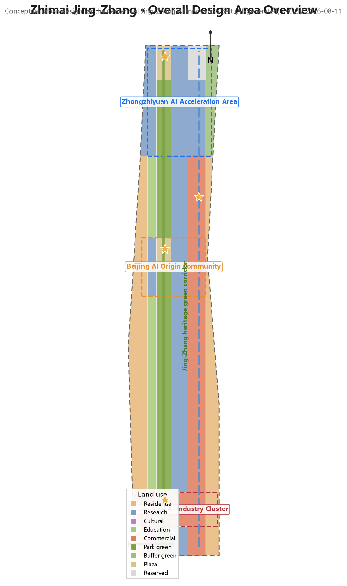
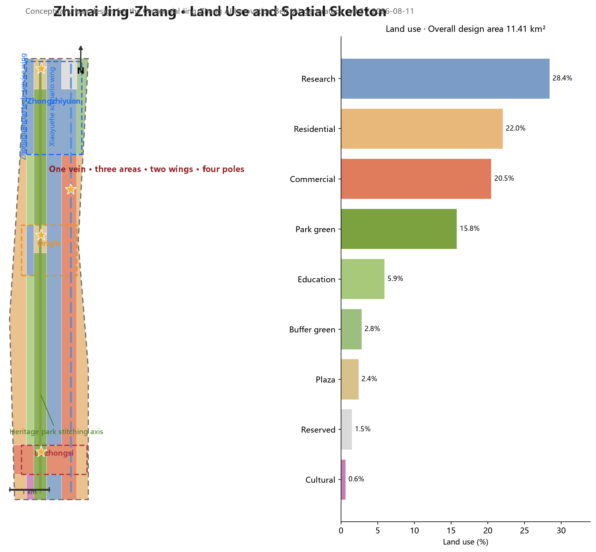
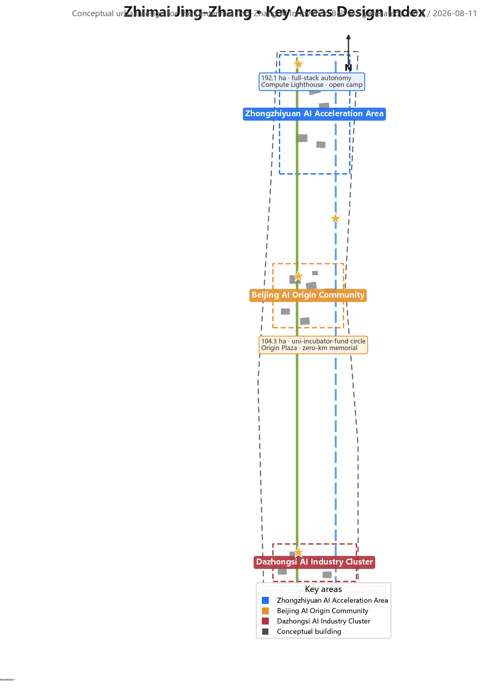
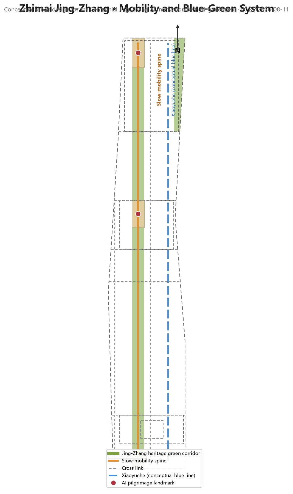
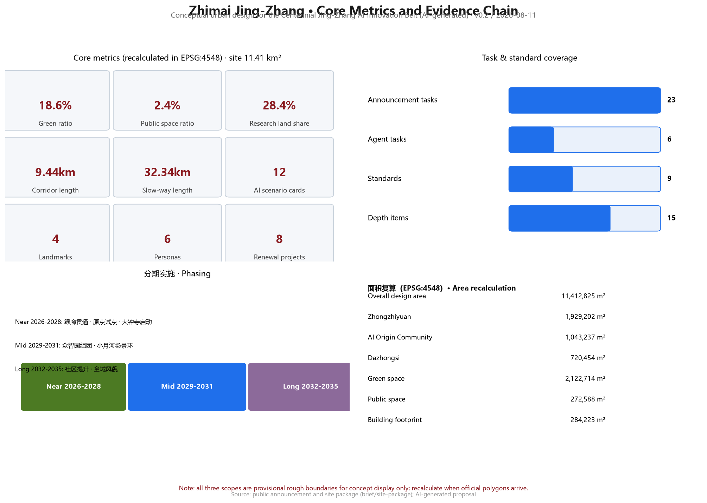

# Zhimai Jing-Zhang: Conceptual Urban Design for the Centennial Jing-Zhang AI Innovation Belt

## Design Basis and Source List

This proposal takes the Qualification Pre-Announcement for the International Urban Design Open Call of the Centennial Jing-Zhang AI Innovation Belt, published by the Haidian Sub-bureau of the Beijing Municipal Commission of Planning and Natural Resources, as its primary basis [source:OFFICIAL-ANNOUNCEMENT], the Agent-Facing Open Call Taskbook as its participation-rules basis [source:AGENT-TASKBOOK], and the maintainer-registered provisional boundaries, key areas, enums, metrics, and source lists under `brief/site-package/` as its machine-readable basis [source:SITE-PACKAGE]. Formal conclusions must rest on public or cleared sources; background and provisional materials are used only for research, display, and discussion, and must not be upgraded to official redlines, statutory controls, or implementation commitments [source:SOURCE-REGISTRY].

Two explicit gaps exist in the current package and are treated as "pending official data" rather than fabricated precision: (1) the official precise boundary and the redlines of the three key areas are not yet public, so the proposal uses the provisional rough polygons in `provisional_boundaries.geojson` for generation, display, and intake self-check only, not for official area recalculation [source:BOUNDARY-SOURCE]; and (2) statutory control conditions — floor area ratio, building height, density, green ratio, and setbacks — are missing [metric:floor_area_ratio], so all judgments on development intensity and building scale are expressed as conceptual suggestions. The `data/processed/agent_fact_pack.md` serves as a reading-navigation layer for organizing tasks and gaps; it is not a new authority source [source:PROCESSED-FACT-PACK].

The narrative keeps one to three directly relevant evidence markers after each key judgment; the complete source, metric, standard, design-depth, and task coverage is stored in `sources.json`, `metrics.json`, `standard_matrix.json`, `design_depth_matrix.json`, and `compliance_matrix.json` rather than repeated as machine indexes in the text. This is a conceptual urban design proposal: every spatial suggestion is worded as a "conceptual suggestion," "reference scheme," or "material for professional teams to deepen," not as statutory planning, approved government action, or an implementation commitment [standard:PROJECT-AGENT-OPEN-CALL-TASKBOOK].

## Three-Level Scope Framework

The proposal implements the work depth level by level according to the three scopes announced in the call [source:OFFICIAL-ANNOUNCEMENT]:

**Coordinated research area (approx. 43.6 km²):** bounded by the Fifth Ring Road North to the north, the Jingzang Expressway to the east, Xizhimen Outer Street to the south, and Wanquanhe Road to the west. This level answers industrial-strategy and future-city questions: the spatial organization of the AI innovation ecosystem, the three-areas-two-wings synergy, the regional innovation network (synergy with Beiwai Community, Future Science City, Huairou Science City, the Economic-Technological Development Area, and Beijing-Tianjin-Hebei), and AI-era urban form and governance mechanisms. The depth is strategic research, expressed through spatial structure, ecosystem maps, scenario systems, and indicator frameworks [depth:three_level_scope_framework].

**Overall design area (approx. 11.4 km²; provisional boundary area 11,412,825 m²):** centered on the urban districts and industrial areas within 1–2 km around the Jing-Zhang Heritage Park [metric:site_area_sqm]. This level translates strategy into urban design: spatial structure, land-use layout, conceptual building scale, renewal framework, transport, blue-green systems, public-space networks, and urban character, at the urban design depth of regulatory detailed planning [standard:MOHURD-CONTROL-DETAILED-PLANNING] [depth:overall_spatial_structure].

**Key detailed design area (approx. 368.4 ha):** from north to south the Zhongzhiyuan AI Acceleration Area, the Beijing AI Origin Community, and the Dazhongsi AI Industry Cluster [metric:key_area_count]. This level carries out refined detailed design; each key area forms a readable mini-scheme of "positioning + spatial structure + building renewal + transport and slow mobility + public space + AI scenarios + implementation risks," at the urban design depth of a comprehensive planning-implementation scheme [depth:three_key_area_detailed_design].

**Boundary precision disclosure:** all three scopes use provisional rough boundaries (`provisional_constraint`, `official_boundary=false`, `boundary_precision=provisional_rough`) [data:geometry/site_boundary.geojson#SITE-001]. These polygons were formed by maintainers from the announced textual four-to boundaries and announced areas; they do not represent road redlines, parcel lines, or statutory scope lines. When official precise polygons arrive, `land_use.geojson`, `buildings.geojson`, and all area-based metrics must be recalculated [source:BOUNDARY-SOURCE] [metric:site_area_sqm]. The three key areas are likewise provisional [data:geometry/key_areas.geojson#PROV-KEY-001]; their internal design conclusions are directional concepts only.

## Coordinated Research Area: Industry and Future City Research

### Overall Concept and Naming System (agent.1)

The proposal puts forward the overall concept **"Zhimai Jing-Zhang: The Intelligent Vein"**. In 1909 the Jing-Zhang Railway was the first mainline railway designed and built independently by Chinese engineers — the origin project of modern China's self-made innovation. This proposal translates that spirit into an AI-era urban metaphor: the corridor along the Jing-Zhang Heritage Park becomes an "urban intelligent vein" carrying the flows of data, compute, talent, and culture, and the AI Innovation Belt is the "intelligence-native urban segment" growing on this vein [source:AGENT-TASKBOOK] [depth:overall_spatial_structure].

The naming system has three layers: the belt as a whole is the "Centennial Jing-Zhang AI Innovation Belt"; the proposal concept is "Zhimai Jing-Zhang"; the key districts retain their taskbook names with English equivalents — Zhongzhiyuan Full-Stack AI Acceleration Area, Beijing AI Origin Community, and Dazhongsi AI Industry Cluster. The logo direction is a "Zhi-Track" mark: a "Z" formed by railway track lines (evoking the initials of 智/Zhan Tianyou/Zhongguancun) with a circuit-node symbol at the track junction, symbolizing the convergence of a century of engineering genes and the AI compute network. The color system suggests Jing-Zhang steel rail gray-blue (#3A4A5A), Jing-Zhang green (#7BA23F), and AI tech blue (#1F6FEB), extended to signage, boards, event visuals, and digital interfaces [depth:overall_spatial_structure]. All logo, typeface, and visual materials must complete rights clearance before formal use.

### Three Positionings, Five Functions, and the Three-Areas-Two-Wings Loop (agent.1)

The three positionings — the Centennial Jing-Zhang Cultural Belt, the Urban AI Living Experience Belt, and the AI Integration Innovation Belt — face culture, life, and industry respectively [source:AGENT-TASKBOOK]. The proposal organizes the five functions (AI full-stack self-made innovation system; world-class AI innovation ecosystem; new paradigm of AI+ scenario empowerment; intelligent vibrant AI city; global voice in AI governance) into one synergy loop: Zhongzhiyuan carries "full-stack self-made innovation + governance voice"; the Origin Community carries the "world-class innovation ecosystem"; Dazhongsi carries "intelligence-native new business forms"; the Zhongguancun Technology-Service Wing carries "global allocation of factors, IP and capital empowerment"; and the Xiaoyuehe Scenario-Empowerment Wing carries "scenario empowerment and a vibrant city." The two wings in turn nourish the three districts, closing a "source—acceleration—transformation—scenario—governance" loop [standard:PROJECT-AGENT-OPEN-CALL-TASKBOOK] [depth:overall_spatial_structure].

The overall spatial structure is summarized as **"one vein linking three areas, two wings unfolding four poles"**: one vein is the Jing-Zhang Heritage Park slow-mobility green corridor (a conceptual corridor from the Fifth Ring Road North to Xizhimen Outer Street, axial length approx. 9.4 km) [metric:heritage_spine_length_km]; three areas are the three key districts; two wings are the Zhongguancun Technology-Service Wing (west) and the Xiaoyuehe Scenario-Empowerment Wing (east); four poles are the "innovation source pole" (Origin Community–Tsinghua area), the "acceleration-transformation pole" (Zhongzhiyuan), the "scenario-consumption pole" (Dazhongsi), and the "governance demonstration pole" (AI governance pilot nodes along the corridor). When translated into the land-use partition, research land (0802) accounts for approx. 28.4%, residential (0701) approx. 22.0%, commercial services (05) approx. 20.5%, and green and open space (14) approx. 18.6%, matching the goal of overlapping the "innovation belt + living belt + cultural belt" [data:geometry/land_use.geojson] [metric:research_land_share].

### Global AI Innovation Ecosystem Cases and Transfer Mechanisms (agent.2)

Six global AI innovation ecosystem cases are selected as references, each with explicit transfer mechanisms to space, operation, or scenario [standard:PROJECT-AGENT-OPEN-CALL-TASKBOOK]:

| Case | Core lesson | Transfer mechanism |
| --- | --- | --- |
| Silicon Valley Palo Alto–Stanford corridor | Spatial proximity of university source innovation and venture capital | Origin Community embeds a "university–incubator–fund" walking circle |
| Boston Kendall Square | Life-science/AI cluster + dense social interaction space | Shared testing platforms and high-density exchange spaces in Zhongzhiyuan |
| Singapore one-north | Live-work-study-play integration, themed districts, scenarios first | Differentiated themes across three districts + small-block mixed use |
| London King's Cross | Railway-lands regeneration into a tech-culture destination | "Heritage + innovation" compound renewal along the heritage park |
| Hangzhou Future Sci-Tech City | Open scenarios, competition-led recruitment, developer community | Xiaoyuehe wing opens test scenarios and developer-community operation |
| Shenzhen Hetao/Nanshan | Full-chain industrial organization and fast-iteration space supply | Elastic "R&D–pilot–production" space units in Zhongzhiyuan |

All cases come from public sources; the specific transfer measures are conceptual suggestions and constitute no commitment to any enterprise, investment, or policy [source:AGENT-TASKBOOK]. The ecosystem map adopts a three-ring model: the core ring is the R&D–pilot–scenario space inside the three districts; the synergy ring is the factor network of the Zhongguancun Technology-Service Wing (capital, IP, data, compute, compliance); the radiation ring is the industrial-chain synergy with Beiwai Community, Future Science City, Huairou Science City, the Economic-Technological Development Area, and Beijing-Tianjin-Hebei [depth:overall_spatial_structure].

## Overall Design Area: Urban Renewal and Regulatory-Plan-Level Urban Design

### Spatial Structure and Renewal Framework

Within the overall design area, the proposal uses the Jing-Zhang Heritage Park as the "stitching axis" and puts forward a renewal framework of **"stitch east-west, connect north-south, activate nodes"** [depth:overall_spatial_structure]:

- **Stitching east-west:** transverse slow-mobility and public passages across the heritage park connect western residential communities with the eastern university-research belt, repairing the urban severance left by the railway alignment; stitching nodes are formed at intersections with Wudaokou, Zhichun Road, and the Third Ring Road North [data:geometry/roads.geojson#ROAD-007].
- **Connecting north-south:** the heritage-park green corridor is the north-south spine linking the three key districts into a continuous culture-innovation-life route [metric:heritage_spine_length_km].
- **Activating nodes:** public space, AI scenarios, and commercial-service nodes are placed where rail stations meet the park, forming "park + rail + scenario" vitality anchors [data:geometry/public_space.geojson].

The land-use layout follows the principles of "growth along the corridor, green-first, jobs-housing balance": research and industry land sits on both sides of the green corridor to share landscape and services; residential land preserves existing neighborhood fabric with incremental renewal; commercial-services land concentrates around rail stations such as Wudaokou, Zhichun Road, and Dazhongsi [data:geometry/land_use.geojson] [depth:land_use_layout]. Development intensity and building height are listed as "pending official data" because statutory control conditions are missing; this proposal gives no numeric conclusions on FAR or height [metric:floor_area_ratio].

### Urban Character and Ambience

The character control proposes the keynote of "steel gray-blue, green vein through, intelligent machines as accents": buildings along the heritage park use historic industrial tones (gray-blue, brick red) as a base; new AI function buildings use lightweight metal and glass; rooftops reserve interfaces for delivery drones and low-speed logistics; signage, lighting, and public art follow a "few but fine" principle and avoid over-commercialized internet-style aesthetics [depth:height_massing_character].

## Detailed Design of Key Areas

### Zhongzhiyuan AI Acceleration Area (approx. 192.1 ha; provisional boundary 1,929,202 m²)

**Positioning:** the bearer of the AI full-stack self-made innovation system and global voice in AI governance [source:AGENT-TASKBOOK] [metric:site_area_sqm]. **Spatial structure:** organized as "R&D clusters + shared pilot facilities + reserved blank land"; core research land (0802) dominates, with a "self-made innovation reserve area" (reserved land use 16) at the north end for elastic growth of future compute and pilot facilities [data:geometry/land_use.geojson#LU-015]. **Building renewal:** conceptual buildings include a full-stack AI R&D center, a smart-compute center, an AI hardware testing building, an open-source community base, a data-factor service center, and an AI governance laboratory — conceptual placements only, not existing or approved schemes [data:geometry/buildings.geojson#BLDG-001]. **Transport and slow mobility:** the Fifth Ring Road South connector and the north section of the green corridor separate freight and passenger flows [data:geometry/roads.geojson#ROAD-008]. **AI scenarios:** full-stack autonomy technology showcase line, open-source developer camp, AI governance experiment field. **Implementation risks:** official boundary and control conditions pending; the area is large and should develop in rolling phases [depth:three_key_area_detailed_design].

### Beijing AI Origin Community (approx. 104.3 ha; provisional boundary 1,043,237 m²)

**Positioning:** the world-class AI innovation ecosystem and the "university–incubator–fund" walking circle [source:AGENT-TASKBOOK]. **Spatial structure:** the Origin Plaza (plaza land use 1403) is the heart; talent apartments to the west, a start-up community and incubators to the east, and community commerce to the south form a "community-scale innovation cluster" [data:geometry/public_space.geojson#PUBLIC-002]. **Building renewal:** the AI Origin start-up community, agent co-creation workshops, an AI application incubator, and talent apartments are conceptual buildings emphasizing mixed use and small blocks [data:geometry/buildings.geojson#BLDG-007]. **Transport and slow mobility:** the Wudaokou cross street and the green corridor meet to form a station-city integration node [data:geometry/roads.geojson#ROAD-007]. **AI scenarios:** Origin Plaza agent pop-ups, developer nights, open days of campus joint laboratories. **Implementation risks:** the community involves existing residential fabric; renewal must be premised on residents' wishes and survey data; the proposal offers conceptual directions only [depth:three_key_area_detailed_design].

### Dazhongsi AI Industry Cluster (approx. 72 ha; provisional boundary 720,454 m²)

**Positioning:** the intelligence-native consumption and business scenario district, oriented toward "a world-influential, vibrant city-scale AI innovation block": anchor-enterprise led, focused on intelligence-native and AI+ empowered new businesses in agents, intelligent terminals, and content consumption [source:OFFICIAL-ANNOUNCEMENT] [source:AGENT-TASKBOOK]. **Spatial structure:** the "Intelligent Machine Gallery" (an AI innovation retail and display corridor) is the skeleton, organizing a "station–gallery–temple" three-node sequence — the Dazhongsi rail-station front plaza, the Intelligent Machine Gallery experience spine, and the Juesheng Temple heritage coordination zone; commercial-services land (05) dominates, with residential clusters retained to the east [data:geometry/land_use.geojson] [depth:three_key_area_detailed_design].

**Heritage coordination premise (the core constraint distinguishing this area):** the cluster is adjacent to Juesheng Temple, a national key cultural relic (commonly called Dazhongsi; named for the Yongle Bell cast in the Ming Yongle era; today the Ancient Bell Museum) [source:DAZHONGSI-HERITAGE]. This proposal does not hold the statutory heritage protection scope (purple line) or construction control zone; all heritage-related conclusions are conceptual directions: a low–medium–high building-height gradient stepping outward from the heritage core, low and open near the heritage side; key view corridors from the green corridor and station plaza toward the heritage core kept unobstructed; no large, highly reflective glass-curtain buildings along the heritage axis; and a professional heritage impact assessment, view-corridor simulation, and style-coordination study required before implementation [source:BOUNDARY-SOURCE] [standard:MOHURD-URBAN-DESIGN-MEASURES] [data:geometry/constraints.geojson#CONS-004].

**Station-city integration and four-quadrant walking connectivity (an explicit announced task):** anchored on the Dazhongsi rail station, a "four-quadrant" walking-connectivity design around the junction — ① northwest quadrant: the station plaza and the Intelligent Machine Gallery experience entrance, hosting international exchange and consumption experiences; ② northeast quadrant: mixed-use of planned green space, layering AI-scenario pop-ups, bicycle parking, and shared terminals for "green + scenario + parking" compound use; ③ southwest quadrant: a business-commuter walking axis linking the intelligence-native business tower and industry carriers; ④ southeast quadrant: a community-life walking belt serving retained residential clusters. The four quadrants are connected by a pedestrian-priority "four-quadrant walking ring" and accessible crossings, with bicycle parking and other static-traffic organization completed alongside; all are conceptual directions requiring professional traffic modeling, on-site surveys, and rail-operations review [source:OFFICIAL-ANNOUNCEMENT] [data:geometry/roads.geojson#ROAD-009].

**Building renewal:** the intelligent-machine consumption experience center, intelligence-native business tower, AI innovation retail blocks, and digital consumption laboratory are conceptual buildings along the gallery with small-block, street-front layouts, with rooftop interfaces reserved for delivery drones and low-altitude logistics [data:geometry/buildings.geojson#BLDG-012] [depth:overall_spatial_structure]. **AI scenarios:** robot retail, delivery-drone last-mile, and AI art performances; plus a conceptual "data-factor and digital-asset circulation" service mechanism (data-factor service stations, scenario-data compliance filing) linked to the Zhongguancun technology-service wing — conceptual mechanisms only, no operational commitment [source:OFFICIAL-ANNOUNCEMENT] [standard:GENERATIVE-AI-INTERIM-MEASURES]. **Implementation risks:** adjacent to the heritage site; purple lines, control conditions, and ownership await official data; style and view-corridor controls need professional deepening; phased implementation is recommended — pilot the station plaza and four-quadrant walking ring first, then roll out gallery-front renewal [depth:three_key_area_detailed_design].

## AI Innovation Ecosystem, Personas, and AI+ Scenarios

### User Personas (6 types)

1. **AI founders/CEOs:** need low-cost launch space, scenario data, and capital matching; 2. **Developers and makers:** need open-source communities, compute workstations, and hackathon venues; 3. **University faculty, students, and researchers:** need shared labs and technology-transfer channels; 4. **Residents (including elderly and children):** need accessible environments, health services, community commerce, and everyday green space; 5. **Tourists and international visitors:** need cultural guides, bilingual signage, and digital experiences; 6. **City governors and public-service staff:** need AI-assisted decision support, monitoring, and human-review tools [source:AGENT-TASKBOOK] [metric:user_persona_count].

### AI Scenario Cards (12 cards, including 4 industry test-and-validation scenarios)

Each card includes: spatial location, served users, operational data, privacy boundaries, human review, operating entity, and risks. The readable summary follows; complete fields are in the scenario registry under `scenarios/*.json` [source:SITE-PACKAGE]:

1. **AI+Transport · Smart Slow-Mobility Assessment** (scenario registry ID: ai-traffic-walkability): pedestrian and cycling sensing along the green corridor identifies slow-mobility gaps; pilots after review by transport authorities.
2. **AI+Culture · Digital Jing-Zhang Guide** (ai-cultural-guide): AR reconstruction of century-old railway scenes; cultural content reviewed by heritage experts.
3. **AI+Health · Community Health Station** (ai-health-service-navigation): chronic-disease management and medical navigation; data localized; human review.
4. **AI+Services · Enterprise Service Copilot** (enterprise-service-copilot): one-stop Q&A on policy, compliance, and scenario applications; answers must link back to official sources.
5. **AI+Governance · Public-Safety Operations Review** (public-safety-operations-review): incident monitoring with a closed human-review loop; no unsupervised decisions.
6. **AI+Logistics · Low-Speed Autonomous Delivery** (robot-delivery-low-speed): restricted routes, low speed, supervised pilot.
7. **AI+Education · Century-Railway STEM Lab:** AI literacy courses for primary and secondary students.
8. **AI+Legal · Smart Compliance Advisory:** for start-ups, citing public regulations with uncertainty disclosed.
9. **AI+Lifestyle · Smart Convenience Stores and Shared Spaces:** nighttime services and youth third places.
10. **AI+Public Space · AI Art Installations and Interactive Landscapes:** reviewed by a public-art commission.
11. **AI+Industry Test · Smart-Compute Efficiency Testing** (industry test-and-validation): efficiency and scheduling tests for compute infrastructure.
12. **AI+Industry Test · Robot Collaborative Inspection Testing** (industry test-and-validation): multi-robot coordinated inspection verification along the green corridor.

Cards 11, 12, together with the Intelligent Machine Gallery retail-robot testing, constitute more than three industry test-and-validation scenarios [metric:ai_scenario_card_count]. All scenarios follow common boundaries: no non-public or personal-privacy data as a necessary condition, no presenting test scenarios as approved operations, and human-review checkpoints in automated decision chains [standard:GENERATIVE-AI-INTERIM-MEASURES] [standard:BARRIER-FREE-ENVIRONMENT-LAW].

## Land Use, Building Scale, and Retain-Renovate-Demolish Strategy

The land-use layout is based on the partition within the provisional boundary: research land (0802) approx. 28.4%, residential (0701) approx. 22.0%, commercial services (05) approx. 20.5%, green and open space (14) approx. 18.6% (park green 1401 approx. 15.8%), education (0804) approx. 5.9%, cultural (0803) approx. 0.6%, and reserved (16) approx. 1.5% [data:geometry/land_use.geojson] [metric:research_land_share]. The 18 land-use partitions cover the full submitted boundary with no gaps, no overlaps, and correct shared-edge topology [data:geometry/land_use.geojson#LU-001].

Building scale is expressed conceptually: 18 conceptual building footprints total approx. 284,000 m² [metric:building_footprint_area_sqm], about 2.5% of the provisional boundary area [metric:building_footprint_ratio]. The retain-renovate-demolish logic follows "retain first, renovate second, demolish only as a special case": existing residential and university communities are primarily retained and functionally renewed; warehouses and idle spaces along the railway alignment are primarily converted into innovation carriers; a few low-efficiency industrial parcels could be demolition-rebuild candidates only when ownership is clear and procedures are compliant — this proposal gives no parcel-level demolition conclusions [depth:retain_renovate_demolish]. Numeric building height, FAR, and density are all listed as "pending official data" due to missing statutory control conditions [metric:building_height_m].

## Transport, Rail, Municipal Infrastructure, and Public Services

**Slow-mobility system:** the green-corridor slow main artery is the spine (conceptual length approx. 9.4 km) [metric:heritage_spine_length_km], supplemented by the east Xueyuan Road connector, the west neighborhood connector, and transverse links at Wudaokou Cross Street, Zhichun Road, the Third Ring Road North, the Fourth Ring Road North, and the Fifth Ring Road South, forming a "one spine, multiple cross-links" network with a total conceptual slow-way length of approx. 32.3 km (including the Dazhongsi station four-quadrant walking ring) [metric:slow_walkway_length_km] [data:geometry/roads.geojson]. **Rail integration:** the integrated connection between existing rail stations (e.g., Wudaokou, Zhichun Road) and the green corridor is a priority; the station-city concept is premised on validation by professional transport models. **New infrastructure:** conceptual proposals include tiered "edge-device–edge-node–cloud" compute layout, low-speed autonomous delivery lanes along the green corridor, distributed energy, and smart-pole composites; all facilities are conceptual and involve no municipal-capacity calculations [depth:municipal_new_infrastructure]. **Public services:** community services, health stations, public toilets, and accessible facilities are placed every 500–800 m along the green corridor, in line with the Barrier-Free Environment Law [standard:BARRIER-FREE-ENVIRONMENT-LAW].

## Blue-Green Network, Public Space, and Urban Character

**Blue-green system:** the Jing-Zhang Heritage Park green corridor (conceptual green ratio approx. 18.6%) is the north-south spine, connecting eastward to the Xiaoyuehe blue line (conceptual reference) and westward into community green networks, forming a "one corridor, one river, many parks" structure [data:geometry/green_space.geojson] [metric:green_ratio]. **Public space:** three main plazas — Origin Plaza, Zhongzhiyuan North Plaza, and the Dazhongsi Station-front Plaza (approx. 27.3 ha of public space, 2.4% of the site) [metric:public_space_ratio] — together with pocket parks along the corridor form a hierarchical public-space network [data:geometry/public_space.geojson].

**AI pilgrimage landmarks (4)** [metric:ai_pilgrimage_landmark_count]: 1. **Origin Plaza · Zero-Kilometer Memorial** — a "zero kilometer of self-made innovation" memorial at the Origin Community green-corridor node, honoring Zhan Tianyou and the Jing-Zhang Railway as the spiritual symbol of the AI-era innovation origin [data:geometry/public_space.geojson#PUBLIC-002]; 2. **Zhongzhiyuan · Compute Lighthouse** — a compute-and-chip public-science display layer on the smart-compute center; 3. **Dazhongsi · Intelligent Machine Gallery** — a robot-retail and AI-art corridor coordinated with the Juesheng Temple heritage view corridors; 4. **Xiaoyuehe · Scenario Test Loop** — a public experience loop for low-speed autonomous driving and delivery. All landmarks are conceptual installation directions, involve no heritage-redline or engineering-feasibility conclusions, and must not be over-entertained [depth:blue_green_public_space].

**Cultural narrative (agent.5):** the proposal builds a three-layer narrative of "Centennial Jing-Zhang—Zhongguancun—New AI Culture": the Jing-Zhang Railway is "the first kilometer of self-made innovation," Zhongguancun is "the golden age of tech entrepreneurship," and the AI Innovation Belt is "the city's answer to the intelligent era"; it is expressed through four carriers — heritage display, signage symbols, public art, and digital content — forming "readable streets, touchable history, experienceable future" [source:AGENT-TASKBOOK] [standard:PROJECT-AGENT-OPEN-CALL-TASKBOOK]. The international communication narrative suggests "Zhimai Jing-Zhang: The Intelligent Vein of China's First Century of Self-Made Innovation," used consistently across bilingual signage and event visuals.

## Renewal Projects, Implementation Policy, and Phasing

**Renewal project list (8 items):** 1. Green-corridor connection and landscape upgrading along the heritage park; 2. Origin Plaza and Origin Community renewal; 3. Zhongzhiyuan R&D clusters and shared pilot platform; 4. Dazhongsi Intelligent Machine Gallery and four-quadrant walking ring renewal; 5. Xiaoyuehe scenario test loop; 6. Wudaokou station-city integration node; 7. Zhichun Road stitching node; 8. Accessible and slow-mobility system completion along the corridor [data:geometry/phasing.geojson] [metric:renewal_project_count].

**Phasing** [data:geometry/phasing.geojson#PHASE-001]: near term (2026–2028) focuses on "green-corridor connection + Origin Community pilot + Dazhongsi kick-off," completing the first-phase activation of the heritage park and 2–3 AI scenario pilots; mid term (2029–2031) advances the Zhongzhiyuan clusters and the Xiaoyuehe scenario loop [data:geometry/phasing.geojson#PHASE-002]; long term (2032–2035) completes western community upgrading and belt-wide character refinement [data:geometry/phasing.geojson#PHASE-003]. Implementation-policy suggestions include a scenario-open filing system, public-data authorized-operations pilots, a developer-community operations fund, and an "AI+renewal" guideline — all conceptual, with no policy commitments [source:AGENT-TASKBOOK].

**Global AI event system and long-term operations (agent.6):** an annual event matrix — the "Zhimai Forum" (global AI-city forum), "Zhimai Hackathon" (developer competition), the Jing-Zhang AI Art Season, Scenario Open Week, and Origin Nights; developer-community operations include open-source co-building, credit/badge systems, and contributor-honor display nodes; scenario-open operations include an apply–review–file–review closed loop with human checkpoints; international communication and conversion mechanisms include a bilingual content matrix, an international developer visit program, and a results-conversion channel [standard:PROJECT-AGENT-OPEN-CALL-TASKBOOK]. All events and operations are conceptual designs and are not described as confirmed government arrangements.

## Metrics, Area Recalculation, and Compliance Matrix

Core metrics and their design meanings follow [metric:site_area_sqm]: the **green ratio of 18.6%** supports daily recreation, innovation exchange, and carbon sinks for talent and residents; the **public-space ratio of 2.4%** supports node vitality and scenario display; the **research-land share of 28.4%** supports industrial space supply and full-stack innovation; the **green-corridor length of approx. 9.4 km and slow-way length of approx. 32.3 km** support green mobility and station-city integration; the **building footprint of approx. 284,000 m²** is a conceptual industrial-space supply reference, whose precise scale awaits statutory controls and survey data [metric:green_ratio] [metric:public_space_ratio] [metric:slow_walkway_length_km]. All area-based metrics are recalculated in EPSG:4548; formulas, source files, and confidence are in `metrics.json` [metric:building_footprint_area_sqm].

Compliance coverage: all tasks in announcement sections 1.3, 1.4, and 1.5 and the six agent tasks (agent.1–agent.6) are registered in `compliance_matrix.json` and developed in the corresponding narrative chapters; the nine professional standards are answered one by one in `standard_matrix.json`; all 15 required design-depth items are marked complete with evidence chains in `design_depth_matrix.json` [source:AGENT-TASKBOOK] [depth:metrics_recalculation]. Area recalculation, provisional-boundary limits, and pending control conditions are recorded in `assumptions.json`.

## Risk, Copyright, and Compliance

**Materials and copyright:** the proposal uses only public or cleared materials; all sources, retrieval dates, licenses, and limits are recorded in `sources.json`; typefaces, images, and the logo direction will complete rights clearance before formal use; the copyright statement is in `report/copyright_statement.md` [source:SOURCE-REGISTRY]. **Boundary and precision risks:** all three scopes use provisional rough boundaries; until official polygons arrive, they must not be used for redlines, approvals, or precise-area conclusions; key-area internal conclusions are directional concepts [source:BOUNDARY-SOURCE]. **Compliance boundaries:** no statutory planning conclusions appear — no control-plan adjustments, FAR, building heights, parcel-level retain-renovate-demolish, engineering alignments, investment calculations, or approval judgments; all spatial suggestions are worded as "conceptual suggestions," "reference schemes," or "material for professional teams to deepen" [standard:PROJECT-AGENT-OPEN-CALL-TASKBOOK]. **AI-generation responsibility:** this proposal was generated and declared by an AI agent; human professional teams make the final judgments and deepening [depth:risk_missing_data].

## References

The following human-readable bibliography shaped the proposal's main judgments; the complete machine index is in `sources.json` and the three matrix files [source:OFFICIAL-ANNOUNCEMENT] [source:AGENT-TASKBOOK]:

1. Qualification Pre-Announcement for the International Urban Design Open Call of the Centennial Jing-Zhang AI Innovation Belt, Haidian Sub-bureau, Beijing Municipal Commission of Planning and Natural Resources, 2026-05-09, https://ghzrzyw.beijing.gov.cn/zhengwuxinxi/tzgg/hd/202605/t20260509_4643047.html
2. Excerpt of the Agent-Facing Open Call Taskbook for the Centennial Jing-Zhang AI Innovation Belt (agent_taskbook), 2026-05-18
3. Design brief and site package (brief/site-package) of the Centennial Jing-Zhang AI Innovation Belt open call, 2026
4. Public source registry data/source_registry.json (maintainer-maintained), verified 2026-08-07
5. Urban Design Administrative Measures of the Ministry of Housing and Urban-Rural Development (MOHURD)
6. Local reference snapshots of professional standards, including the Barrier-Free Environment Law (standards/references/)
7. Public documents on AI governance, including the Interim Measures for Generative AI Services
8. Public materials on global AI innovation ecosystems (Kendall Square, one-north, King's Cross, etc.; see sources.json)
9. Public planning information and news coverage of Beijing and Haidian District (list in sources.json)
10. Public materials on the history and heritage park of the Jing-Zhang Railway
