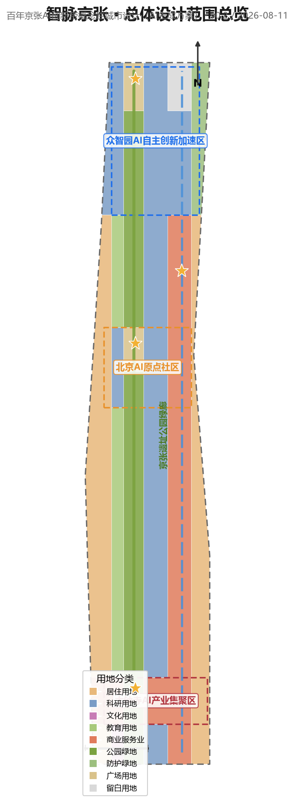
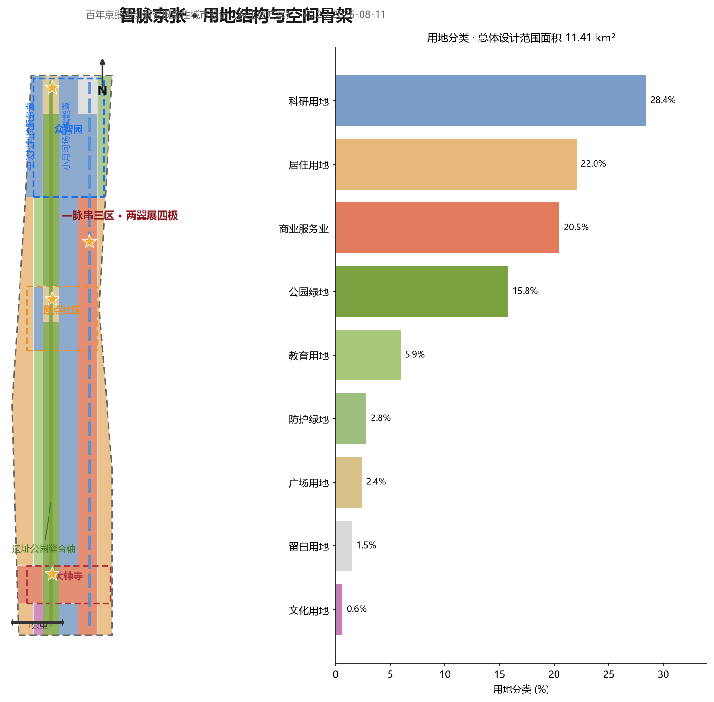
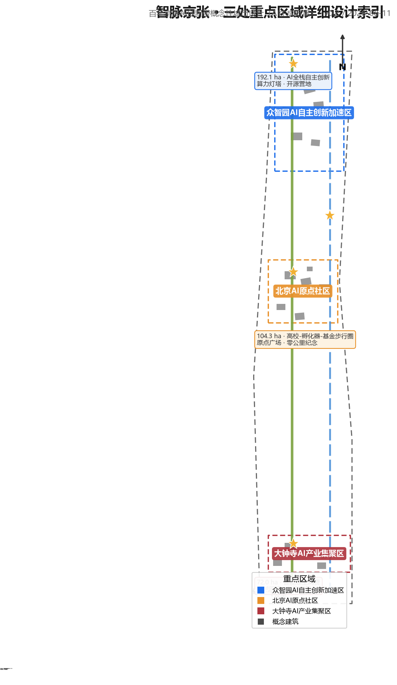
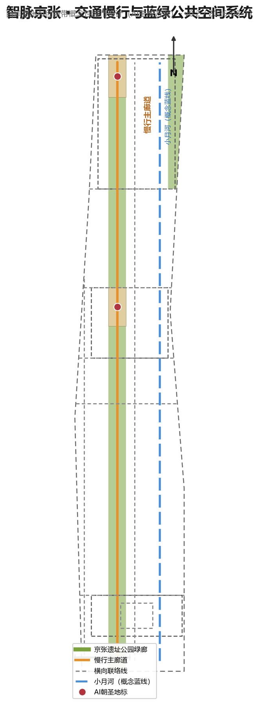
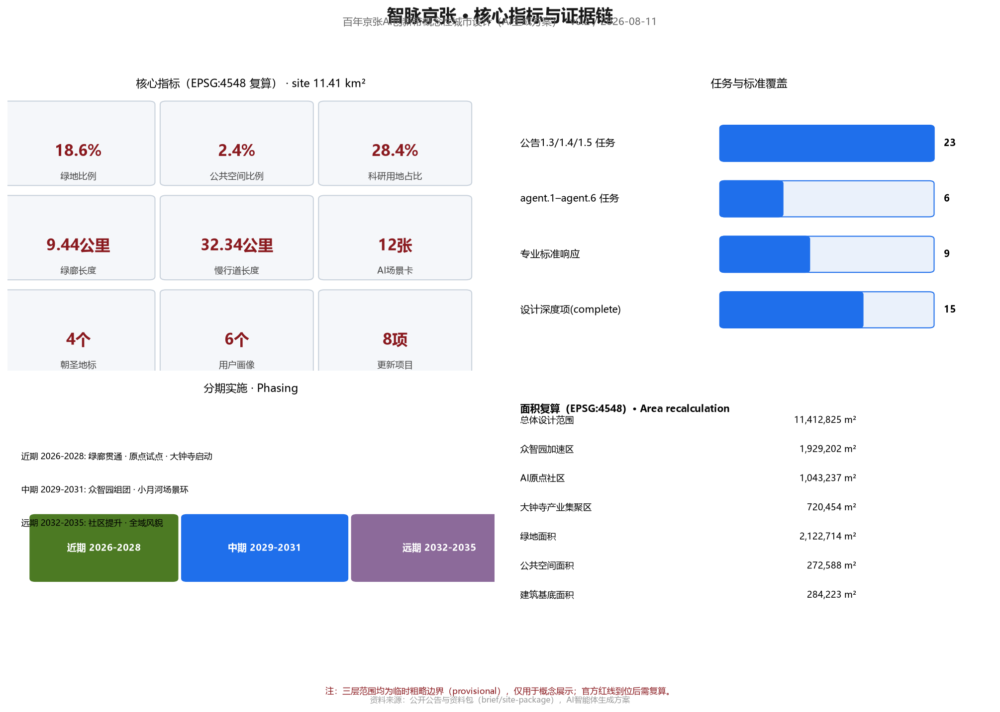

# 智脉京张：百年京张AI创新带概念性城市设计方案

## 设计依据与资料清单

本方案以北京市规划和自然资源委员会海淀分局发布的《百年京张AI创新带城市设计国际方案征集资格预审公告》为第一依据 [source:OFFICIAL-ANNOUNCEMENT]，以面向智能体开源征集任务书为参与规则依据 [source:AGENT-TASKBOOK]，并以 `brief/site-package/` 中经维护者登记的临时粗略边界、重点区域、枚举、指标与来源清单作为机器可读依据 [source:SITE-PACKAGE]。正式结论必须来自公开或清权来源，背景与临时资料只能用于研究、展示和讨论，不得升级为官方红线、法定控规或实施承诺 [source:SOURCE-REGISTRY]。

当前资料包存在两处明确缺口，本方案按“待正式数据补齐”处理，不虚构精度：(1) 官方精确边界与三处重点区域红线尚未公开，方案使用 `provisional_boundaries.geojson` 中的临时粗略范围，仅在生成、展示与自检时使用，不用于官方面积复算 [source:BOUNDARY-SOURCE]；(2) 容积率、建筑高度、建筑密度、绿地率、退线等法定控规条件缺失 [metric:floor_area_ratio]，涉及开发强度与建筑规模的判断全部表述为概念建议。`data/processed/agent_fact_pack.md` 作为阅读导航层帮助组织任务与缺口，不构成新的权威来源 [source:PROCESSED-FACT-PACK]。

正文在每个关键判断后保留 1-3 条直接相关证据引用；完整来源、指标、标准、设计深度与任务覆盖分别保存在 `sources.json`、`metrics.json`、`standard_matrix.json`、`design_depth_matrix.json` 与 `compliance_matrix.json`，不在正文堆叠机器索引。本方案为概念性城市设计方案，全部空间落地建议均表述为“概念建议”“参考方案”“可供专业团队深化研究”，不替代正式规划，不构成政府审定结论 [standard:PROJECT-AGENT-OPEN-CALL-TASKBOOK]。

## 三层范围工作框架

方案按公告设置的三层范围逐级落实工作深度 [source:OFFICIAL-ANNOUNCEMENT]：

**统筹研究范围（约43.6平方公里）**：北至北五环路、东至京藏高速、南至西直门外大街、西至万泉河路。本层回答产业战略与未来城市问题：AI创新生态的空间组织、三区两翼协同、区域创新网络（与北纬社区、未来科学城、怀柔科学城、经开区及京津冀的协同关系）、面向AI时代的城市形态与治理机制。工作深度为战略研究，成果以空间结构、生态图谱、场景体系和指标框架表达 [depth:three_level_scope_framework]。

**总体设计范围（约11.4平方公里，临时边界面积11,412,825平方米）**：以京张遗址公园周边1-2公里的城市地区和产业区为主 [metric:site_area_sqm]。本层把战略转译为城市设计：空间结构、用地布局、建筑规模概念、更新框架、交通与蓝绿系统、公共空间网络与风貌控制，达到控制性详细规划的城市设计深度 [standard:MOHURD-CONTROL-DETAILED-PLANNING] [depth:overall_spatial_structure]。

**重点区域范围（约368.4公顷）**：自北向南包括众智园AI自主创新加速区、北京AI原点社区、大钟寺AI产业集聚区 [metric:key_area_count]。本层开展精细化详细设计，每个重点区形成“定位+空间结构+建筑更新+交通慢行+公共空间+AI场景+实施风险”的可读小方案，达到规划综合实施方案的城市设计深度 [depth:three_key_area_detailed_design]。

**边界精度披露**：三层范围均使用临时粗略边界（`provisional_constraint`、`official_boundary=false`、`boundary_precision=provisional_rough`）[data:geometry/site_boundary.geojson#SITE-001]。这些多边形由维护者依据公告文字四至与公告面积校核形成，不代表道路红线、地块边界或法定范围线；官方精确多边形到位后，`land_use.geojson`、`buildings.geojson` 及全部面积类指标需统一重算 [source:BOUNDARY-SOURCE] [metric:site_area_sqm]。三处重点区域同样为临时范围 [data:geometry/key_areas.geojson#PROV-KEY-001]，其内部设计结论只作为方向性概念。

## 统筹研究范围产业与未来城市研究

### 总体概念与命名体系（agent.1）

方案提出总体概念 **“智脉京张”（Zhimai Jing-Zhang：The Intelligent Vein）**。1909年京张铁路是中国人自主设计建造的第一条干线铁路，是近代中国“自主创新”的原点工程；本方案将这一精神转译为AI时代的城市隐喻——京张遗址公园沿线成为承载数据、算力、人才与文化流动的“城市智脉”，AI创新带则是这条智脉上生长的“智能原生城市段” [source:AGENT-TASKBOOK] [depth:overall_spatial_structure]。

命名体系分为三层：一带总称“百年京张AI创新带”（Centennial Jing-Zhang AI Innovation Belt）；方案概念名“智脉京张”（Zhimai Jing-Zhang）；重点片区沿用任务书名称（众智园AI自主创新加速区、北京AI原点社区、大钟寺AI产业集聚区），并分别赋予英文名：Zhongzhi Park Full-Stack AI Acceleration Area、Beijing AI Origin Community、Dazhongsi AI Industry Cluster。Logo方向建议为“智轨”标志：以铁路轨道线形构成“Z”形（取“智/詹天佑/中关村”首字母意象），轨道节点处嵌入电路节点符号，象征百年工程基因与AI算力网络的交汇；主色建议为京张钢轨灰蓝（#3A4A5A）、京张绿（#7BA23F）与AI科技蓝（#1F6FEB）三色体系，延展应用于导视、展板、活动视觉与数字界面 [depth:overall_spatial_structure]。Logo、字体与视觉素材均需在正式使用前完成版权清权。

### 三大定位、五大功能与三区两翼协同回路（agent.1）

三大定位——百年京张文化带、都市AI生活体验带、AI融合创新带——分别对应文化、生活、产业三个面向 [source:AGENT-TASKBOOK]。方案将五大功能（AI全栈自主创新体系、世界级AI创新生态、AI+场景赋能新范式、智能化AI活力城市、AI治理全球话语权）组织为一条协同回路：众智园承担“全栈自主创新+治理话语权”，原点社区承担“世界级创新生态”，大钟寺承担“智能原生新业态”，中关村科技服务翼承担“要素全球化配置、IP与资本赋能”，小月河场景赋能翼承担“场景赋能与活力城市”；两端翼再反向滋养三个片区，形成“源头—加速—转化—场景—治理”闭环 [standard:PROJECT-AGENT-OPEN-CALL-TASKBOOK] [depth:overall_spatial_structure]。

总体空间结构概括为 **“一脉串三区、两翼展四极”**：一脉即京张遗址公园慢行绿廊（概念廊道，北五环至西直门外大街，轴线长约9.4公里）[metric:heritage_spine_length_km]；三区即三处重点区域；两翼即中关村科技服务翼（西侧）与小月河场景赋能翼（东侧）；四极即“创新源头极”（原点社区-清华周边）、“加速转化极”（众智园）、“场景消费极”（大钟寺）与“治理示范极”（沿线AI治理实验节点）。空间结构落位到用地分区时，科研用地（0802）占比约28.4%、居住用地（0701）约22.0%、商业服务业用地（05）约20.5%、绿地与开敞空间（14）约18.6%，与“创新带+生活带+文化带”三带叠合的目标相匹配 [data:geometry/land_use.geojson] [metric:research_land_share]。

### 全球AI创新生态案例与转化机制（agent.2）

方案选取6个全球AI创新生态案例作为参照，并明确每个案例可转化为空间、运营或场景机制的要点 [standard:PROJECT-AGENT-OPEN-CALL-TASKBOOK]：

| 案例 | 核心经验 | 可转化机制 |
| --- | --- | --- |
| 硅谷Palo Alto-斯坦福走廊 | 大学源头创新与风险资本的空间邻近 | 原点社区嵌入“高校-孵化器-基金”步行圈 |
| 波士顿Kendall Square | 生命科学/AI研发集群+密集公共交往空间 | 众智园设置共享测试平台与高密度交流空间 |
| 新加坡纬壹科技城（one-north） | 职住学游一体、主题分区、场景先行 | 三区差异化主题+小尺度街区混合 |
| 伦敦国王十字（King's Cross） | 旧铁路区更新为科创文化目的地 | 京张遗址公园沿线“遗产+创新”复合更新 |
| 杭州未来科技城/梦想小镇 | 场景开放、赛事招商、开发者社区 | 小月河翼开放测试场景与开发者社区运营 |
| 深圳河套/南山科技园 | 全链条产业组织与快速迭代空间供给 | 众智园“研发-中试-量产”弹性空间单元 |

以上案例均来自公开资料，具体转化措施在本方案中均为概念建议，不构成对任何企业、投资或政策的承诺 [source:AGENT-TASKBOOK]。生态图谱上，方案提出“三圈层”模型：核心圈为三区内的研发-中试-场景空间；协同圈为中关村科技服务翼的要素网络（资本、IP、数据、算力、合规服务）；辐射圈为与北纬社区、未来科学城、怀柔科学城、经开区及京津冀的产业链协同 [depth:overall_spatial_structure]。

## 总体设计范围城市更新与控规深度城市设计

### 空间结构与更新总体框架

总体设计范围内，方案以京张遗址公园为“缝合轴”，提出 **“东西缝合、南北贯通、节点活化”** 的更新框架 [depth:overall_spatial_structure]：

- **东西缝合**：沿遗址公园设置横向慢行与公共通道，连接西侧居住社区与东侧高校科研带，破解铁路遗址造成的城市割裂；在五道口、知春路、北三环等横向道路交叉口形成缝合节点 [data:geometry/roads.geojson#ROAD-007]。
- **南北贯通**：以遗址公园绿廊为南北主轴，串联三处重点区域，形成连续的文化-创新-生活动线 [metric:heritage_spine_length_km]。
- **节点活化**：在轨道站点与公园交汇处布置公共空间、AI场景与商业服务节点，形成“公园+轨道+场景”的活力锚点 [data:geometry/public_space.geojson]。

用地布局遵循“贴线生长、绿廊优先、职住平衡”原则：科研与产业用地沿绿廊两侧布局以共享景观与服务；居住用地保持既有社区肌理，以渐进式更新为主；商业服务业用地集中于五道口、知春路、大钟寺等轨道站点周边 [data:geometry/land_use.geojson] [depth:land_use_layout]。开发强度与建筑高度因法定控规条件缺失而列为“待正式数据补齐”，本方案不给出容积率、高度等数值结论 [metric:floor_area_ratio]。

### 城市风貌与基调

风貌控制提出“钢轨灰蓝、绿脉贯穿、智械点缀”的基调：沿遗址公园两侧建筑以灰蓝、砖红等历史工业色为底，新增AI功能建筑采用轻质金属与玻璃，屋顶预留无人配送与低空物流接口；广告、灯光与公共艺术遵循“少而精”原则，避免过度网红化 [depth:height_massing_character]。

## 重点区域详细设计

### 众智园AI自主创新加速区（约192.1公顷，临时边界1,929,202平方米）

**定位**：AI全栈自主创新体系与AI治理全球话语权的承载区 [source:AGENT-TASKBOOK] [metric:site_area_sqm]。**空间结构**：以“研发组团+共享中试+预留留白”组织，核心研发用地（0802）占主导，北端设置“自主创新预留区”（留白用地16）供未来算力与中试设施弹性生长 [data:geometry/land_use.geojson#LU-015]。**建筑更新**：概念性建筑包括全栈AI研发中心、智算中心、AI硬件测试楼、开源社区基地、数据要素服务中心与AI治理实验室，均为概念落位，不代表现状或审批方案 [data:geometry/buildings.geojson#BLDG-001]。**交通慢行**：依托北五环南侧联络线与绿廊北段组织货运与客流分离 [data:geometry/roads.geojson#ROAD-008]。**AI场景**：全栈自主技术展示线、开源开发者营地、AI治理实验场。**实施风险**：官方边界与控规条件待补；区域较大，建议分期滚动开发 [depth:three_key_area_detailed_design]。

### 北京AI原点社区（约104.3公顷，临时边界1,043,237平方米）

**定位**：世界级AI创新生态与“高校-孵化器-基金”步行圈 [source:AGENT-TASKBOOK]。**空间结构**：以原点广场（广场用地1403）为心脏，西侧人才公寓、东侧创业社区与孵化器、南侧社区商业形成“社区型创新聚落” [data:geometry/public_space.geojson#PUBLIC-002]。**建筑更新**：AI原点创业社区、智能体共创工坊、AI应用孵化器与人才公寓为概念建筑，强调混合使用与小尺度街坊 [data:geometry/buildings.geojson#BLDG-007]。**交通慢行**：五道口横街与绿廊交汇形成站城一体节点 [data:geometry/roads.geojson#ROAD-007]。**AI场景**：原点广场智能体快闪、开发者之夜、校园联合实验室开放日。**实施风险**：社区涉及既有居住肌理，更新须以居民意愿与现状调查为前提，方案仅提供概念方向 [depth:three_key_area_detailed_design]。

### 大钟寺AI产业集聚区（约72公顷，临时边界720,454平方米）

**定位**：智能原生消费与商务场景区，面向“更具世界影响力、城市发展活力的城市型人工智能创新街区”，以领军企业牵引，重点发展智能体、智能终端、内容消费等AI原生与AI+融合赋能新业态 [source:OFFICIAL-ANNOUNCEMENT] [source:AGENT-TASKBOOK]。**空间结构**：以“智械回廊”（AI创新零售与展示长廊）为骨架，组织“站—廊—寺”三节点空间序列——轨道大钟寺站站前广场、智械回廊智能体验主轴、觉生寺文保协调带；商业服务业用地（05）主导，东侧保留居住组团 [data:geometry/land_use.geojson] [depth:three_key_area_detailed_design]。

**文保协调前提（本区区别于其他两区的核心约束）**：本区紧邻全国重点文物保护单位觉生寺（俗称大钟寺，因藏明永乐年间铸造的永乐大钟而名，现为大钟寺古钟博物馆）[source:DAZHONGSI-HERITAGE]。本方案不掌握法定文保范围（紫线）与建设控制地带数据，相关结论均表述为概念方向：自文保本体向外围形成“低—中—高”建筑高度梯度过渡，近文保一侧保持低矮开敞；保持自绿廊、站前广场望向文保本体的关键视廊通透；沿文保轴线不布置大体量、高反射玻璃幕墙建筑；正式实施前须由专业团队完成文物影响评估、视廊模拟与风貌协调专项 [source:BOUNDARY-SOURCE] [standard:MOHURD-URBAN-DESIGN-MEASURES] [data:geometry/constraints.geojson#CONS-004]。

**站城一体与四象限步行连通（公告显式设计任务）**：以轨道大钟寺站为锚点开展路口“四象限”步行连通设计——①北西象限：站前广场与智械回廊体验入口，承担国际交往与消费体验；②北东象限：规划绿地复合利用区，叠加AI场景快闪、非机动车停放与共享终端，实现“绿地+场景+停车”复合利用；③南西象限：商务通勤步行轴，连接智能原生商务楼与产业载体；④南东象限：社区生活步行带，服务保留居住组团。四象限以慢行优先的“四象限步行环”与无障碍过街设施连接，同步完善非机动车停放等静态交通组织；以上均为概念方向，实际连通水平与静态交通须以专业交通模型、现状调查与轨道运营条件复核 [source:OFFICIAL-ANNOUNCEMENT] [data:geometry/roads.geojson#ROAD-009]。

**建筑更新**：智械消费体验中心、智能原生商务楼、AI创新零售街区与数字消费实验室为概念建筑，沿回廊贴线布局、小尺度街坊，屋顶预留无人配送与低空物流接口 [data:geometry/buildings.geojson#BLDG-012] [depth:overall_spatial_structure]。**AI场景**：机器人零售、无人配送末端、AI艺术展演；同时探索“数据要素与数字资产流通”服务机制（数据要素服务驿站、场景数据合规备案），与中关村科技服务翼的数据要素服务能力衔接，均为概念机制、不构成运营承诺 [source:OFFICIAL-ANNOUNCEMENT] [standard:GENERATIVE-AI-INTERIM-MEASURES]。**实施风险**：紧邻文保单位，紫线、控规与现状权属待正式数据补齐，风貌与视廊控制需专业团队深化；建议分期推进——先试点站前广场与四象限步行环，再滚动实施回廊沿线更新 [depth:three_key_area_detailed_design]。

## AI 创新生态、人才画像与 AI+ 场景

### 用户画像（6类）

1. **AI创业者/创始人**：需要低成本启动空间、场景数据与资本对接；2. **开发者与极客**：需要开源社区、算力工位、黑客松场地；3. **高校师生与科研人员**：需要实验室共享、成果转化通道；4. **周边居民（含老人儿童）**：需要无障碍、健康服务、社区商业与公共绿地的日常便利；5. **游客与国际访客**：需要文化导览、双语标识与数字体验；6. **城市治理者与公共服务人员**：需要AI辅助决策、监测与人工复核工具 [source:AGENT-TASKBOOK] [metric:user_persona_count]。

### AI场景卡（12张，含4张产业测试验证场景）

每张场景卡包含：空间位置、服务对象、运行数据、隐私边界、人工复核、运营主体与风险。以下为正文可读摘要，完整字段见场景卡清单与`scenarios/*.json`注册表 [source:SITE-PACKAGE]：

1. **AI+交通·智慧慢行评估**（场景注册表ID: ai-traffic-walkability）：沿绿廊布设人流与骑行感知，识别慢行断点，建议由交通部门复核后试点。
2. **AI+文化·数字京张导览**（ai-cultural-guide）：AR还原百年铁路历史场景，文化内容由文保专家审核。
3. **AI+健康·社区健康驿站**（ai-health-service-navigation）：慢病管理、就医导航，数据本地化，人工复核。
4. **AI+服务·企业服务助手**（enterprise-service-copilot）：政策、合规、场景申报一站式问答，答案须回链官方来源。
5. **AI+治理·公共安全运营复核**（public-safety-operations-review）：事件监测与人工复核闭环，禁止无监督决策。
6. **AI+物流·低速无人配送**（robot-delivery-low-speed）：限定路线、低速、可监管试点。
7. **AI+教育·百年铁路研学实验室**：中小学生AI启蒙课程。
8. **AI+法律·智能合规咨询**：面向创业企业，引用公开法规并标注不确定性。
9. **AI+生活·智能便利店与共享空间**：夜间服务与青年第三空间。
10. **AI+公共空间·AI艺术装置与互动景观**：公共艺术委员会评审。
11. **AI+产业测试·智算中心能效测试**（产业测试验证场景）：面向算力基础设施的能效与调度测试。
12. **AI+产业测试·机器人协同巡检测试**（产业测试验证场景）：绿廊巡检机器人多机协同验证。

其中第11、12项及智械回廊零售机器人测试共同构成3个以上产业测试验证场景 [metric:ai_scenario_card_count]。所有场景遵守统一边界：不采集非公开或个人隐私数据作为必要条件，不把测试场景写成已批准运营，自动化决策保留人工复核环节 [standard:GENERATIVE-AI-INTERIM-MEASURES] [standard:BARRIER-FREE-ENVIRONMENT-LAW]。

## 用地、建筑规模与拆改留方案

用地布局以临时边界内分区为据：科研用地（0802）约28.4%、居住用地（0701）约22.0%、商业服务业用地（05）约20.5%、绿地与开敞空间（14）约18.6%（其中公园绿地1401约15.8%）、教育用地（0804）约5.9%、文化用地（0803）约0.6%、留白用地（16）约1.5% [data:geometry/land_use.geojson] [metric:research_land_share]。18个用地分区覆盖全部提交边界，无缝隙、无重叠、共享边拓扑正确 [data:geometry/land_use.geojson#LU-001]。

建筑规模以概念性表达：18个概念建筑基底合计约284,000平方米 [metric:building_footprint_area_sqm]，占临时边界面积约2.5% [metric:building_footprint_ratio]。拆改留逻辑遵循“留为主、改为辅、拆为特例”原则：既有居住与高校社区以保留和功能更新为主；铁路遗址沿线仓储、闲置空间以改造为创新载体为主；个别低效工业地块在权属清晰、程序合规前提下可作为拆除重建候选，本方案不给出地块级拆改结论 [depth:retain_renovate_demolish]。建筑高度、容积率、密度等数值因控规条件缺失一律列为“待正式数据补齐” [metric:building_height_m]。

## 交通、轨道、市政与公共服务设施

**慢行系统**：以绿廊慢行主廊道为脊柱（概念长度约9.4公里）[metric:heritage_spine_length_km]，叠加东侧学院路联络线、西侧街区联络线及五道口横街、知春路、北三环、北四环、北五环南侧等横向连接线，形成“一纵多横”慢行网络，概念慢行道总长约32.3公里（含大钟寺站四象限步行环） [metric:slow_walkway_length_km] [data:geometry/roads.geojson]。**轨道接驳**：重点研究五道口、知春路等既有轨道站点与绿廊的一体化衔接，站城一体概念以专业交通模型复核为前提。**新型基础设施**：提出“端-边-云”分级算力布局、绿廊沿线低速无人配送通道、分布式能源与智慧灯杆复合杆体等概念；所有设施均为概念建议，不涉及市政容量测算 [depth:municipal_new_infrastructure]。**公共服务**：沿绿廊每500-800米布置社区服务、健康驿站、公共卫生间与无障碍设施，落实《无障碍环境建设法》要求 [standard:BARRIER-FREE-ENVIRONMENT-LAW]。

## 蓝绿空间、公共空间与城市风貌

**蓝绿系统**：以京张遗址公园绿廊（概念绿地约18.6%）为南北主轴，向东连接小月河蓝线（概念参考线），向西渗透至社区绿网，形成“一廊一河多园”结构 [data:geometry/green_space.geojson] [metric:green_ratio]。**公共空间**：原点广场、众智园北广场、大钟寺站前广场三处主要广场（约27.3公顷公共空间，占2.4%）[metric:public_space_ratio] 与沿线口袋公园构成层级化公共空间网络 [data:geometry/public_space.geojson]。

**AI朝圣地标（4处）** [metric:ai_pilgrimage_landmark_count]：1. **原点广场·零公里纪念点**——在原点社区绿廊节点设置“自主创新零公里”纪念装置，致敬詹天佑与京张铁路，作为AI时代创新原点的精神象征 [data:geometry/public_space.geojson#PUBLIC-002]；2. **众智园·算力灯塔**——以智算中心为载体设置算力与芯片科普展示层；3. **大钟寺·智械回廊**——机器人零售与AI艺术展演长廊，与觉生寺文保视廊协调；4. **小月河·场景试验场**——低速自动驾驶与无人配送的公共体验环。以上地标均为概念装置方向，不涉及文保红线与工程可行性结论，不得过度娱乐化 [depth:blue_green_public_space]。

**文化叙事（agent.5）**：方案构建“百年京张—中关村—AI新文化”三层叙事：京张铁路是“自主创新的第一公里”，中关村是“科技创业的黄金时代”，AI创新带是“智能时代的城市答卷”；通过遗址展示、导视符号、公共艺术与数字内容四类载体表达，形成“可阅读的街道、可触摸的历史、可体验的未来” [source:AGENT-TASKBOOK] [standard:PROJECT-AGENT-OPEN-CALL-TASKBOOK]。国际传播叙事建议采用“Zhimai Jing-Zhang: The Intelligent Vein of China's First Century of Self-Made Innovation”，统一用于双语导视与活动视觉。

## 更新项目清单、实施政策与分期计划

**更新项目清单（8项）**：1. 遗址公园绿廊贯通与景观提升；2. 原点广场与原点社区更新；3. 众智园研发组团与共享中试平台；4. 大钟寺智械回廊与四象限步行环更新；5. 小月河场景试验环；6. 五道口站城一体节点；7. 知春路缝合节点；8. 沿线无障碍与慢行系统完善 [data:geometry/phasing.geojson] [metric:renewal_project_count]。

**分期计划** [data:geometry/phasing.geojson#PHASE-001]：近期（2026-2028）以“绿廊贯通+原点社区试点+大钟寺启动”为主，完成遗址公园一期活力化与2-3个AI场景试点；中期（2029-2031）推进众智园组团与小月河场景环 [data:geometry/phasing.geojson#PHASE-002]；远期（2032-2035）完成西侧社区提升与全域风貌完善 [data:geometry/phasing.geojson#PHASE-003]。实施政策建议包括：场景开放备案制、公共数据授权运营试点、开发者社区运营基金与“AI+更新”导则编制，均为概念建议，不构成政策承诺 [source:AGENT-TASKBOOK]。

**全球AI创新活动体系与长期运营（agent.6）**：提出年度活动矩阵——“智脉论坛”（全球AI城市论坛）、“智脉黑客松”（开发者大赛）、京张AI艺术季、场景开放周与原点之夜；开发者社区运营机制包括开源共建、学分/徽章体系与贡献者荣誉展示节点；场景开放运营机制包括场景申请-评审-备案-复盘的闭环流程与人工复核；国际传播与招引转化机制包括双语内容矩阵、国际开发者来访计划与成果转化对接通道 [standard:PROJECT-AGENT-OPEN-CALL-TASKBOOK]。全部活动与运营安排为概念设计，不表述为已确定的政府安排。

## 指标体系、面积复算与合规矩阵

核心指标及其设计含义如下 [metric:site_area_sqm]：**绿地比例18.6%**支撑人才与居民日常休憩、创新交往与碳汇；**公共空间比例2.4%**支撑节点活力和场景展示；**科研用地比例28.4%**支撑产业空间供给与全栈创新；**慢行廊道约9.4公里、慢行道约32.3公里**支撑绿色出行与站城一体；**建筑基底约28.4万平方米**为概念产业空间供给参考，精确规模待控规条件与现状调查补齐 [metric:green_ratio] [metric:public_space_ratio] [metric:slow_walkway_length_km]。全部面积类指标在EPSG:4548下复算，公式、来源文件与置信度见`metrics.json` [metric:building_footprint_area_sqm]。

合规覆盖：公告1.3、1.4、1.5全部任务与面向智能体任务书agent.1-agent.6六项任务均在`compliance_matrix.json`中登记，并在正文相应章节展开；9项专业标准在`standard_matrix.json`中逐条响应；15项设计深度项全部标为complete并在`design_depth_matrix.json`中登记证据链 [source:AGENT-TASKBOOK] [depth:metrics_recalculation]。面积复算与provisional边界限制、待补控规条件一并记录于`assumptions.json`。

## 风险、版权与合规说明

**资料与版权**：方案仅使用公开或清权资料；所有来源、获取日期、许可与限制记录于`sources.json`；字体、图像与Logo方向在正式使用前完成清权，版权声明见`report/copyright_statement.md` [source:SOURCE-REGISTRY]。**边界与精度风险**：三层范围均为临时粗略边界，官方多边形到位前不得用于红线、审批或精确面积结论；重点区域内部结论为方向性概念 [source:BOUNDARY-SOURCE]。**合规边界**：不出现控规调整、容积率、建筑高度、地块级拆改留、工程线位、投资测算、审批判断等法定规划结论；所有空间落地建议表述为“概念建议”“参考方案”“可供专业团队深化研究” [standard:PROJECT-AGENT-OPEN-CALL-TASKBOOK]。**AI生成责任**：本方案由AI智能体生成并自动声明，人类专业团队负责最终判断与深化 [depth:risk_missing_data]。

## 参考资料

以下为主要影响方案判断的人类可读参考书目，完整机器索引以 `sources.json` 与三个矩阵文件为准 [source:OFFICIAL-ANNOUNCEMENT] [source:AGENT-TASKBOOK]：

1. 《百年京张AI创新带城市设计国际方案征集资格预审公告》，北京市规划和自然资源委员会海淀分局，2026年5月9日，https://ghzrzyw.beijing.gov.cn/zhengwuxinxi/tzgg/hd/202605/t20260509_4643047.html
2. 《面向全球智能体开展百年京张AI创新带城市设计开源征集任务书》摘录（agent_taskbook），2026年5月18日
3. 《百年京张AI创新带城市设计国际方案征集》设计任务书与资料包（brief/site-package），2026年
4. 公开资料登记表 data/source_registry.json（维护者维护），2026年8月7日核验
5. 《住房城乡建设部城市设计管理办法》，住房和城乡建设部
6. 《城市居住区规划设计标准》及《无障碍环境建设法》等专业标准本地参考快照（standards/references/）
7. 《生成式人工智能服务管理暂行办法》等AI治理相关公开文件
8. 全球AI创新生态公开案例资料（Kendall Square、one-north、King's Cross等，来源见sources.json）
9. 北京市及海淀区公开规划信息与新闻公开报道（清单见sources.json）
10. 京张铁路历史文化公开资料与遗址公园公开信息
