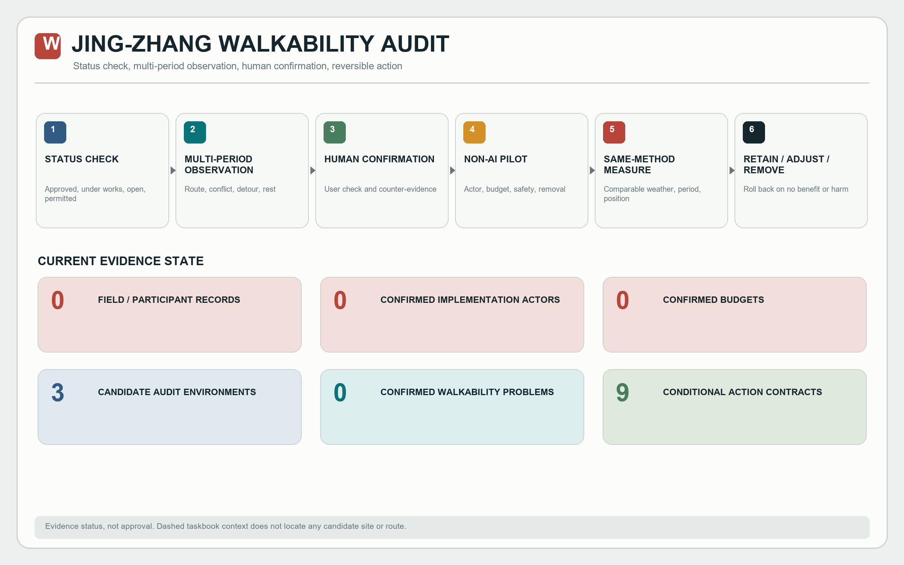
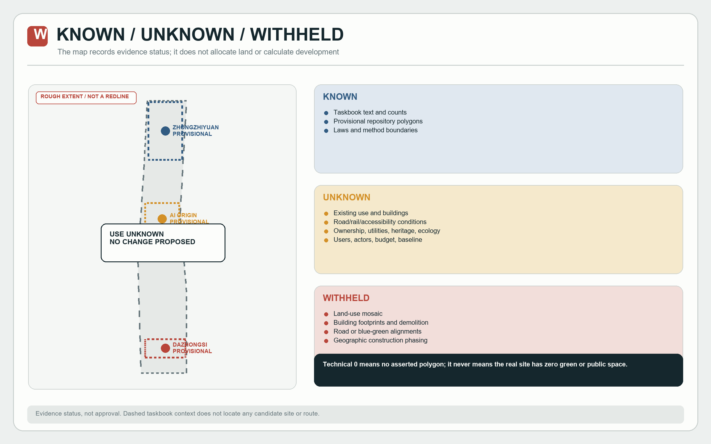
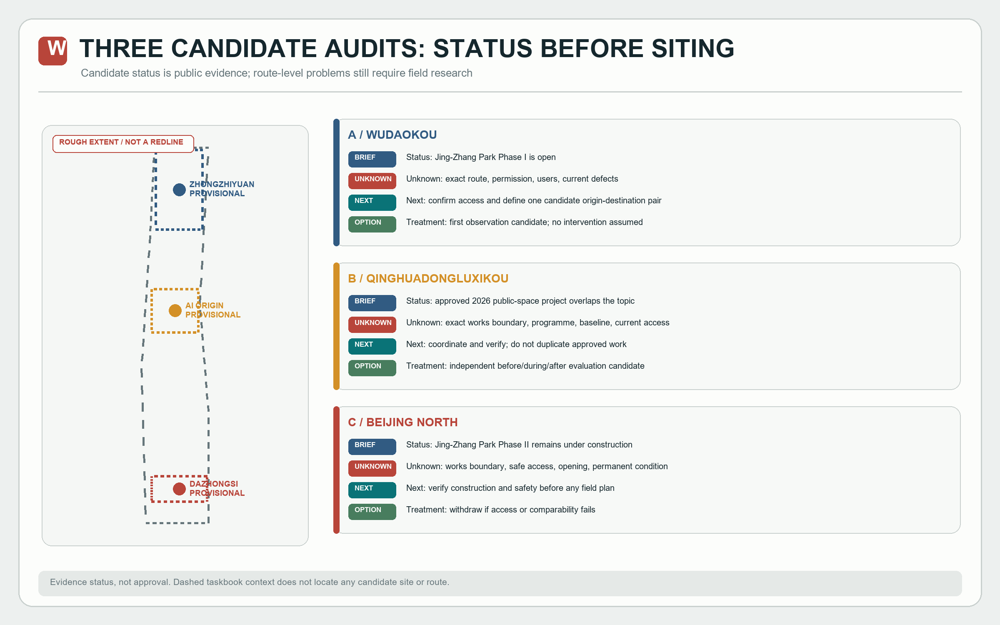
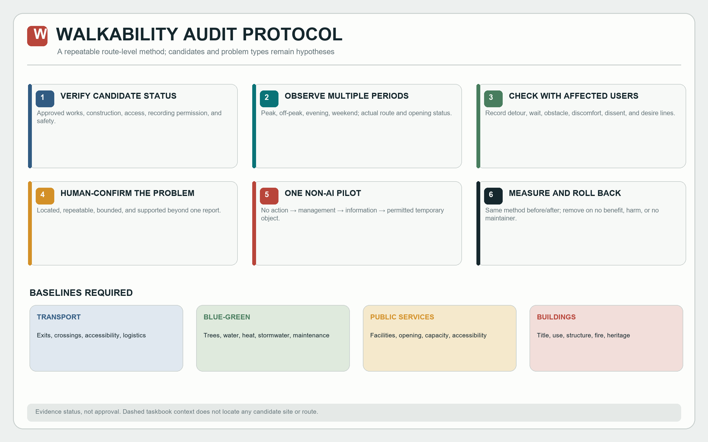
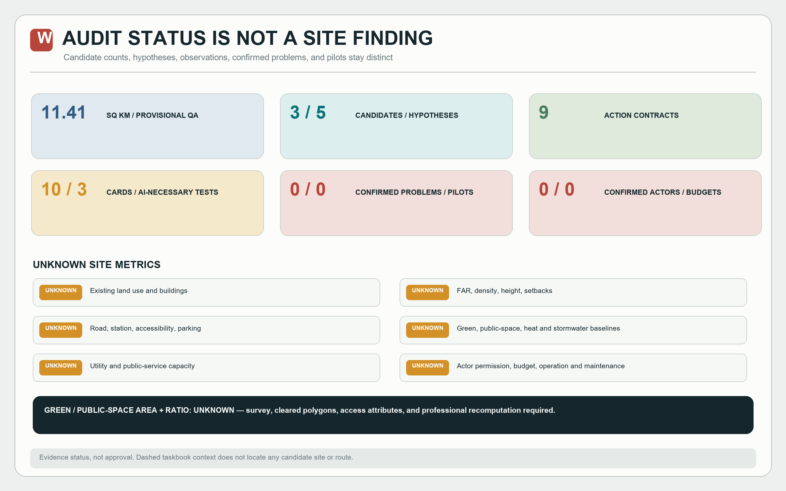

# JING-ZHANG WALKABILITY AUDIT: Connection Research and Reversible Micro-Renewal

**This proposal does not presume that Jing-Zhang is difficult to traverse; it defines a walkability-audit protocol that can confirm, falsify, and withdraw an action.** The announcement identifies park walking/cycling gaps and station connections around Wudaokou and Qinghuadongluxikou as official concerns. That establishes the assignment, not a defect at any candidate site. The sequence is: **verify project status → observe across periods → check with users → human-confirm a problem → one non-AI reversible pilot → same-method before/after measurement → retain, adjust, or remove.** [source:OFFICIAL-ANNOUNCEMENT] [metric:confirmed_walkability_problem_count]

“JING-ZHANG WALKABILITY AUDIT” is the submission's working title, not a government programme name or an established local brand. Its original visual language uses parallel rail lines, measurement ticks, status cards, and a return arrow for route continuity, repeatable observation, evidence limits, and withdrawal after failure.

## Design Basis and Source List

The proposal uses evidence levels E0-E5: E0 is Agent-generated or unverified hypothesis; E1 is a repository package, provisional geometry, or reproducible technical record; E2 is an official announcement, law, or formal standard; E3 is structured observation; E4 is an interview, survey, or joint walk-through; E5 is a direct participant statement. A source type is not automatic proof. Issue #1061 establishes that one author who identifies as a local student and resident published a specific objection; it cannot establish what residents generally think. [source:ISSUE-1061] [source:SOURCE-REGISTRY]

The announcement and taskbook support the assignment. Repository rough polygons support generation and checking only. Additional official pages confirm that the first park phase near Wudaokou is open, a public-space project south of Qinghuadongluxikou has been approved, and the second park phase remains under construction. They classify candidate status but cannot replace route-level observation. [source:OFFICIAL-WUDAOKOU-PHASE1] [source:OFFICIAL-QINGHUA-EAST-2026] [source:OFFICIAL-JINGZHANG-PHASE2-2026]

National urban-design, regulatory-planning, land-use, accessibility, personal-information, and generative-AI rules provide method and risk boundaries, not Haidian site facts. Punggol, Kalasatama, The Foundry, metropolitan innovation districts in Paris, and Vector Institute are mechanism comparisons only. [standard:PROJECT-OFFICIAL-ANNOUNCEMENT] [standard:MOHURD-URBAN-DESIGN-MEASURES]

Missing inputs include official boundaries, road and station access, buildings and ownership, public spaces and facilities, vegetation and water, heat and stormwater baselines, utilities, heritage controls, behavioural observation, stakeholder research, confirmed actors, budgets, and evaluation baselines. Unsupported items remain unknown; design language does not fill them. [depth:existing_conditions_diagnosis] [data:geometry/constraints.geojson#CON-PROV-001]

## Three-Level Scope Framework

The announced approximately 43.6 sq km, approximately 11.4 sq km, and approximately 368.4 hectares across three key areas are textual task extents. The repository polygon recalculates to about 11.41 sq km in EPSG:4548. That is a geometry-pipeline QA result, not an official redline area and not a basis for FAR, land balance, or investment. [metric:site_area_sqm] [data:geometry/site_boundary.geojson#SITE-001]

The three levels are not one concept enlarged three times. The strategic level asks which relations among industry, talent, research, public service, and governance have evidence. The overall level asks whether existing conditions, access, ownership, ecology, facilities, and controls permit an intervention. The key-area level asks what minimum trial, if any, can follow the taskbook direction. A failed upstream evidence gate prevents downstream siting and quantity claims. [depth:three_level_scope_framework]

The GeoJSON layers follow the same rule. Site and key-area files preserve provisional repository constraints. Land use contains one coverage polygon explicitly labelled “existing and planned use unknown; no change proposed.” Roads, green space, and public space contain map-annotation gap markers, not site features. Phasing marks the whole provisional envelope as evidence phase zero, not geographic construction sequencing. [source:PROVISIONAL-BOUNDARY] [data:geometry/phasing.geojson#PH-EVIDENCE-0]

## Coordinated Research Area: Industry and Future City Research

The taskbook names a Centennial Jing-Zhang Culture Belt, a Metropolitan AI Life Experience Belt, an AI Integrated Innovation Belt, and innovation, ecosystem, validation, urban vitality, and observation functions. This submission does not claim they already exist. It converts them into five research questions: what institutions and enterprises are actually present; who frames public problems; what resources can lawfully be shared; who owns testing, data, and human takeover; and what evidence justifies further investment. Authorised directories, interviews, policies, and site research are still missing. [source:AGENT-TASKBOOK] [depth:overall_spatial_structure]

| Taskbook direction | Confirmed now | Next evidence | If absent |
| --- | --- | --- | --- |
| Full-stack AI innovation | The assignment exists | Authorised institution, capability, facility, and partnership study | Do not draw an ecosystem network |
| Talent and innovation ecosystem | The assignment exists | Research with different workers, families, students, and service providers | Do not invent need profiles |
| Scenario validation | The assignment exists | Public problem, non-AI comparator, actor, and safety conditions | Do not start a trial |
| Vital city | The assignment exists | Everyday-facility, opening-hour, and use observation | Do not presume a facility deficit |
| Global observation window | The assignment exists | Public evaluation and failure records | Do not make promotional rankings |

The five cases yield questions rather than imports. Punggol prompts checks on platform governance and data permission; Kalasatama prompts participatory and measurable goals; The Foundry prompts checks on community access and operation; Paris prompts before-and-after evaluation; Vector prompts real institutional agreements. None supplies a Jing-Zhang site, indicator, actor, or policy conclusion. [source:CASE-PUNGGOL] [source:CASE-KALASATAMA]

An audit does not automatically diagnose a defect. Every walkability claim moves through candidate, observed, user-checked, intervention-ready, and evaluated states. The options are no action, management change, information change, temporary physical action, and professional engineering. Permanent construction is considered only after separate planning, ownership, heritage, ecology, utilities, fire, funding, and maintenance review. [depth:renewal_project_list]

## Overall Design Area: Urban Renewal and Regulatory-Plan-Level Urban Design

The overall area is a **walkability survey and decision frame**, not a self-drawn spine, stitch network, or programme mosaic. Seven auditable packages verify current and approved projects; identify candidate station-to-park/campus/community/employment pairs; observe walking, cycling, crossing, accessibility, parking, wayfinding, and rest conditions across periods; check observations through joint walks and anonymous feedback; human-confirm problems and dissent; confirm ownership, permission, operation, budget, maintenance, and removal; and select one non-AI reversible pilot only after a baseline. Evidence is produced before spatial geometry. [data:geometry/land_use.geojson#LU-UNKNOWN-001] [depth:land_use_layout]

“The last 300-800 metres” and “7-14 consecutive observation days” are proposed sampling frames, not known problem extents or official standards. A first-round record contains time, location, observer, user group, issue type, description, photo/video references, geometry reference, frequency, severity estimate, confidence, and notes. Faces, licence plates, and other personal information require human exclusion or de-identification first. [source:PIPL] [metric:walkability_hypothesis_count]

Regulatory-depth land use, intensity, height, coverage, setbacks, transport, utilities, and public services cannot be supplied without approved controls. A qualified future team must receive formal CAD/GIS and approval documents, align coordinates and versions, overlay existing and statutory conditions, and independently check areas and topology before drawing a plan. [standard:MOHURD-CONTROL-DETAILED-PLANNING] [depth:development_intensity_controls]

The renewal rule is retain first, investigate first, and prefer reversibility. Without building age, structure, use, fire, ownership, and value assessments, this proposal makes no retain-renovate-demolish decision. Without road redlines and engineering information, it draws no new road, bridge, or underground connection. Without ecological baselines, it draws no blue-green network. “Complete” in the depth matrix means that the gap, responsibility, and next professional step are disclosed; it does not mean that a missing site design is complete. [depth:retain_renovate_demolish] [depth:risk_missing_data]

## Detailed Design of Key Areas

The three key areas use provisional repository polygons and retain only taskbook names and directions. They are not walkability-problem zones and receive no unresearched local role. [data:geometry/key_areas.geojson#PROV-KEY-001] [depth:three_key_area_detailed_design]

| Key area | Taskbook content | Unknown now | Minimum next step | Conditional interface only |
| --- | --- | --- | --- | --- |
| Zhongzhiyuan AI Independent Innovation Acceleration Area | Independent AI innovation, full-stack technology, scenario validation | Official boundary, institutions, facilities, test permission, traffic safety, operator | Boundary and institution/facility survey; responsibility and safety review | Controlled-test disclosure and stop interface; no building or route assumed |
| Beijing AI Origin Community | University proximity, talent, and community direction | Actual user groups, housing/services, campus access, public space, title | Grouped research and facility/opening-hour inventory | Problem-hearing and research-record interface; no Agent-created resident need |
| Dazhongsi AI Industry Cluster | AI industry, commerce, and services | Merchant and worker mix, consumer problems, station exits, permission, maintenance | Merchant, worker, and user research plus title and connection walk-through | Trial-status, complaint, refund, and exit interface; no market or landmark building assumed |

Any interface requires public access, accessibility, title permission, a maintainer, content updates, complaint handling, and removal. Otherwise it remains a paper register or offline webpage. Formal areas, internal programmes, building scale, landscape, and engineering design are outside the present evidence capability. [source:PROVISIONAL-BOUNDARY] [metric:key_area_count]

### Three candidate walkability-audit sites: status before survey

| Candidate | Confirmed public status | Not established | Treatment in this submission |
| --- | --- | --- | --- |
| A Wudaokou Station–Jing-Zhang Park Phase I vicinity | Park Phase I is open, allowing consideration as an operating-space observation setting | No claim that station-to-park, campus, or employment routes are defective | First candidate; define a route only after access and recording permission [source:OFFICIAL-WUDAOKOU-PHASE1] |
| B Qinghuadongluxikou Station–park connection | A 2026 approved project already covers bicycle parking and walking/cycling connection issues | Do not present an approved-project issue as this submission's original discovery or duplicate its works | Candidate for independent before/during/after evaluation, or move to a non-overlapping segment [source:OFFICIAL-QINGHUA-EAST-2026] |
| C Beijing North Station–southern Jing-Zhang end | The second park phase remains in the construction process | Do not assume construction access or treat temporary construction effects as long-term defects | Verify works boundary, opening, and safety first; withdraw from field piloting if the gate fails [source:OFFICIAL-JINGZHANG-PHASE2-2026] |

These are not substitutes for the three taskbook key-area boundaries, and no precise points or routes are submitted. Three is a research-design count; confirmed walkability problems remain zero. [metric:candidate_audit_site_count] [metric:confirmed_walkability_problem_count]

## AI Innovation Ecosystem, Personas, and AI+ Scenarios

### Seven research groups, not demographic personas

The brief asks for at least five profiles. This proposal labels seven recruitment frames `hypothesis_persona`: nearby residents; students and young people; institutional workers; merchants, service workers, and couriers; older, disabled, and pram-pushing users; visitors and transit users; and testing, operations, and maintenance workers. No population, need, or attitude is claimed. Each study needs recruitment, sample limits, consent, dissent, and non-generalisation notes. [metric:hypothesis_group_count] [source:ISSUE-1061]

### Ten compliance cards: AI organises evidence and accepts comparison

| ID / problem | Card | AI necessity | Non-AI comparator | Entry and exit |
| --- | --- | --- | --- | --- |
| SC-01 / H1-H2 | Observation-record format and terminology aid | Helpful, not necessary | Human table review | Preserve the original record; return to human work on mapping errors |
| SC-02 / H2 | Accessibility, detour, and conflict categorisation aid | Helpful, not necessary | Paper form, manual timing, numbered photos | Never auto-certify accessibility or severity |
| SC-03 / H2 | Anonymous-feedback deduplication aid | Helpful, not necessary | Dual human deduplication | Preserve original text and disagreement; split false merges |
| SC-04 / H2 | Temporal and spatial issue clustering | Helpful, not necessary | Human grouping and map annotation | A hotspot is only a lead; never auto-rank public value |
| SC-05 / H2 | Desire-line record organisation | Helpful, not necessary | Human origin/destination and detour records | Do not auto-label an informal path as misconduct or a justified route |
| SC-06 / H2 | Uploaded-image privacy pre-screen | Helpful, not necessary | Human image review | Stop image upload on missed personal information; minimise original storage |
| SC-07 / H5 | Comparable before/after period matching | Helpful, not necessary | Human matching by weather, period, and position | Publish rules; do not turn association into causation |
| SC-08 / H3 | Controlled low-speed robot-pedestrian coexistence test | Necessary only as test object | Human cart/delivery baseline | Route, safety, actor, emergency stop, takeover; stop on near miss or exclusion |
| SC-09 / H4 | AI clustering vs human coding cost/quality comparison | Necessary only as comparator | Dual human coding | Compare time, omissions, and dissent retention on one anonymous sample; stop AI if no advantage |
| SC-10 / H4 | AI-assisted multilingual wayfinding reliability comparison | Necessary only as comparator | Human translation and static signs | Controlled questions, human review, appeal; take offline if errors affect navigation |

The ten cards are brief responses and trial hypotheses, not a project list. Only SC-08 to SC-10 are necessary because AI itself is the object under examination. They still require problem evidence, a baseline, a non-AI comparator, accountable operation, and data/safety review. Ordinary tools remain the default elsewhere. H4, “AI lowers organisation cost,” can only survive the same-sample comparison in SC-09. [metric:scenario_count] [metric:ai_necessary_scenario_count]

### Three brief-mandated landmarks become information-interface tests

The count comes from the brief and does not prove a need for permanent structures. Candidate interfaces are an Evidence Status Board, Problem Hearing Desk, and Trial Stop Board. They show what is known, source and limitation, candidate responsibility, next gate, correction, and stop route. Temporary installation is allowed only after official key areas, public access, title, accessibility, operation, and maintenance are confirmed. Otherwise paper and offline HTML are the alternative. [metric:landmark_interface_count] [standard:PROJECT-AGENT-OPEN-CALL-TASKBOOK]

## Land Use, Building Scale, and Retain-Renovate-Demolish Strategy

No new land-use allocation is proposed. The single polygon in `land_use.geojson` says “existing and planned use awaiting formal verification; no change proposed.” It is an `analysis_helper` without a land-use code. It ensures that the formal topology check reads the entire provisional envelope as explicitly unknown instead of a drawing omission. [data:geometry/land_use.geojson#LU-UNKNOWN-001] [standard:MNR-LAND-USE-CLASSIFICATION-GUIDE]

`buildings.geojson` is an empty FeatureCollection because no cleared existing-building layer exists and fabricated footprints have been removed. Building footprint, FAR, coverage, height, setbacks, retain-renovate-demolish objects, and new floor area are unknown. Future work requires a building survey, title and use, age and value, structure and fire, heritage, daylight, and approved controls. [metric:building_footprint_area_sqm] [depth:height_massing_character]

The only current candidate for spatial testing is not a building. After ACT-001 through ACT-005, one verified problem may receive one non-AI, temporary, removable pilot. Information/management actions may include temporary wayfinding or parking-boundary information; temporary physical actions may include a permitted movable rest element. Markings, barriers, lighting, paving, junctions, and accessibility works require relevant professional approval and do not become “cheap and ready” merely because they are small. Type, count, dimensions, material, location, budget, and duration remain pending baseline and responsibility. [depth:retain_renovate_demolish]

## Transport, Rail, Municipal Infrastructure, and Public Services

The public package cannot establish station exits, bus connections, crossings, walking, cycling, accessibility, parking, logistics, fire, or construction conditions. `roads.geojson` therefore contains no Agent-drawn centreline. It contains one map annotation, “route awaits joint walk-through,” which is not a transport node or alignment. [data:geometry/roads.geojson#RD-SURVEY-MARKER] [depth:traffic_rail_slow_parking]

A transport and accessibility team must define station/destination pairs with affected users, then record actual route, effective width, detour distance, crossing wait, slope/steps, temporary obstruction, walking/cycling conflict, lighting, wayfinding, and opening at peak, off-peak, evening, and weekend periods. A DESIRE_LINE records an informal path and its origin/destination without first labelling it uncivil. Engineering begins only after a repeatable problem, permission, and conditions are established and management or information changes prove insufficient. A robot test must preserve the main human route, physical emergency stop, on-site takeover, and an equivalent non-AI service. [standard:GB55019-2021] [depth:traffic_rail_slow_parking]

Utilities and public services also need baselines. Water, drainage, power, communications, sanitation, fire, emergency, and edge-compute infrastructure require capacity, interface, redundancy, asset, and maintenance information. Education, health, eldercare, culture, sport, childcare, toilets, drinking water, and shelter require location, opening, service capacity, and accessibility. “New infrastructure” in the taskbook does not authorise equipment, capacity, or investment claims. [metric:municipal_capacity_index] [depth:municipal_new_infrastructure]

## Blue-Green Network, Public Space, and Urban Character

`green_space.geojson` and `public_space.geojson` each contain one map-annotation gap marker, not a green-space or public-space polygon. Actual green-space area, green ratio, public-space area, and public-space ratio remain pending an existing-condition survey. Spatial review may report zero computable polygon area in this package, but that technical result is not an existing-condition or planning metric. [data:geometry/green_space.geojson#GR-SURVEY-MARKER] [metric:green_space_area_sqm]

Blue-green research must cover trees and habitat, water and drainage, heat, stormwater, soil, seasonal change, access boundaries, and maintenance. Public-space research must cover access, seating, shade, drinking water, toilets, lighting, consumption thresholds, day/night, and weekday/weekend opening. Until a baseline exists, this proposal draws no greenway, sponge system, plaza, or public living room. Any pilot avoids tree removal, heritage harm, and unassigned maintenance. [standard:MOHURD-URBAN-DESIGN-MEASURES] [depth:blue_green_public_space]

Urban character is not inferred from generic railway red or technology blue. Jing-Zhang heritage extent, protection status, narrative, and usable imagery require official heritage material and professional curation. Building interface, height, and material require survey, street observation, approved controls, and public research. The Walkability Audit graphic belongs to submission information design, not a conclusion about local character. [depth:height_massing_character]

## Renewal Projects, Implementation Policy, and Phasing

The project list is replaced by nine Action Contracts, not construction packages. Every actor is candidate or unknown, every budget is unknown, and no government, school, enterprise, community, or operator is described as committed. [metric:action_contract_count] [depth:phasing_implementation]

| Action | Beneficiary/problem | Candidate lead, unconfirmed | Next gate | Failure and exit |
| --- | --- | --- | --- | --- |
| ACT-001 candidate-status verification | All research participants / avoid conflict with works and approvals | Authorised data or planning team | Project boundary, opening, access, and recording permission are traceable | Remove the candidate from this round if status stays unclear |
| ACT-002 multi-period route/accessibility walk | Walking, cycling, and disabled users / H1-H2 | Transport/accessibility team | Time-, place-, and limitation-tagged observation set | Redesign or stop on sample, safety, or permission failure |
| ACT-003 anonymous feedback and user check | Seven research groups / prevent observers speaking for users | Independent participation team | Recruitment, consent, bias, minority views, and deletion route complete | Stop generalisation on privacy or representation failure |
| ACT-004 human problem confirmation | Affected groups / H1-H3 | Cross-disciplinary human review | Problem is located, repeatable, bounded, and includes counter-evidence | Keep as candidate if evidence conflicts or records one event only |
| ACT-005 title-permission-operation-maintenance matrix | Users and asset maintainers / H3 | Implementation/asset team | Permission, resource, complaint, insurance, and removal complete | Do not site if any responsibility is absent |
| ACT-006 one non-AI reversible pilot | A group confirmed by research / one confirmed problem | Confirmed space operator | Intervention class, baseline, budget basis, and safety review complete | Cancel if it cannot preserve access, safety, or reversibility |
| ACT-007 same-method before/after evaluation | Public and reviewers / H5 | Independent evaluation team | Weather, period, position, and method are as comparable as practical | Make no effect claim if conditions are not comparable |
| ACT-008 AI-human organisation comparison | Research and decision staff / H4 | Confirmed data/evaluation actor | Same-sample comparison of time, omissions, dissent, and privacy | Stop AI if no clear advantage or explanation |
| ACT-009 public status and rollback record | Public and maintainers / reject “built equals success” | Confirmed public-information maintainer | Each action shows evidence, status, appeal, review, and removal | Take offline if unmaintained or mistaken for an official conclusion |

Phasing is conditional, not dated or geographic. Phase 0 receives data, researches conditions, and confirms responsibility. Phase 1 permits one non-AI reversible pilot. Phase 2 permits a controlled AI comparison only if the non-AI baseline is inadequate and AI necessity is testable. Phase 3 discusses scaling only after effect, public value, legality, safety, funding, maintenance, and exit all pass. Any failed gate can stop or return the action. [data:geometry/phasing.geojson#PH-EVIDENCE-0] [depth:renewal_project_list]

Implementation policy is limited to procedure: publish versions and limits; retain objections; disclose actor status; publish data, takeover, complaint, and exit before testing; use the same metric for before/after and AI/non-AI comparison; and record negative findings. These are recommendations for future confirmation, not current local policy or fiscal commitments. [source:PIPL] [source:GENAI-MEASURES]

## Metrics, Area Recalculation, and Compliance Matrix

Metrics have three scopes. **Task/document status** counts three taskbook areas, three candidate audits, five hypotheses, ten cards, three AI-necessary tests, seven hypothesis recruitment groups, three information interfaces, and nine Action Contracts. **Technical QA** recalculates the provisional envelope as 11,412,825.386 sqm; spatial review separately reports computable submitted polygon areas without converting “no polygon asserted” into a site ratio. **Site and implementation metrics** - green and public-space area/ratio, confirmed walkability problems, observation/feedback records, implemented pilots, actors, budget, FAR, height, and utility capacity - remain pending survey, pending formal data, or record zero confirmations. [metric:confirmed_walkability_problem_count] [metric:field_research_record_count]

| Metric | Status | What it says | What it does not say |
| --- | --- | --- | --- |
| Provisional boundary QA area | Known / low confidence | File and CRS pipeline are reproducible | Official redline or precise planning area |
| Three key areas | Known | Taskbook count | Official polygons or internal design |
| 3 candidates, 5 hypotheses, 9 actions, 10 cards | Known | Research design and task-response completeness | Site need or implementation count |
| Zero confirmed walkability problems and implemented pilots | Known | No problem or project is presented as an established fact | The site has no problems or should never receive action |
| Zero field-research records | Known | No site or participant research has been completed in this draft | The site has no problems or users |
| Zero confirmed actors and budgets | Known | No implementation commitment exists | No potential actor or funding exists |
| Green/public-space areas and actual ratios | Unknown | Cleared polygons, access attributes, and professional recomputation are required | No submitted polygon means the site equals zero |
| Land, building, transport, utility, and other blue-green baselines | Unknown | Professional data and research are required | Agent geometry may substitute |

In the compliance, standard, and depth matrices, addressed/complete means that a requirement has a narrative response, gap disclosure, layer, and next step. It does not mean missing site design is complete. Trusted inputs trigger regeneration of geometry, metrics, images, HTML, and PDFs, followed by deterministic, spatial, visual, and professional-evidence checks. [depth:metrics_recalculation] [metric:confirmed_actor_count]

## Risk, Copyright, and Compliance

The main risk is representing assignment language, provisional geometry, one individual opinion, or Agent-generated material as a site fact. Privacy controls use minimum data, consent, irrelevant-data exclusion, human review, and deletion/appeal. Safety uses professional review, physical stop, human takeover, and an equivalent non-AI route. Equity uses multiple participation modes, accessibility, and a right to refuse. Implementation uses visible actor status, unknown budget, maintenance, and exit gates. [standard:GB-T35273-2020] [source:PIPL]

Spatial-dispute risk remains high because official boundaries, title, and existing conditions are missing. Policy uncertainty remains high because no recommendation is described as adopted by a government, school, enterprise, or community. Technology maturity is card-specific: an ordinary register remains non-AI; robots and generative services enter only controlled comparison. Public acceptance must come from study and trial records, not one Issue #1061 author or the taskbook. [source:ISSUE-1061] [depth:risk_missing_data]

All text, tables, graphics, GeoJSON, and programmatic layout were generated or rewritten by Codex in the local workspace. No peer submission text, graphic, or name is copied. Official materials, standards, and case pages are briefly summarised and linked. Candidate sites, problem types, and sampling periods are explicitly labelled as research design or hypothesis. System fonts are rendered but not redistributed as standalone files. Human confirmation of GitHub identity, copyright statement, English terminology, and all public materials remains required before submission. [source:TOOL-CODEX]

## References

1. Haidian Branch of the Beijing Municipal Commission of Planning and Natural Resources, qualification announcement, 2026-05-09. [source:OFFICIAL-ANNOUNCEMENT]
2. open-city-ai/haidian, Agent open-call taskbook excerpt and site package. [source:AGENT-TASKBOOK]
3. Repository provisional rough boundaries and source registry, limited to generation, display, and checking. [source:PROVISIONAL-BOUNDARY]
4. GitHub Issue #1061, a public objection by one author self-identified as a local student/resident; used only as an individual view and homogeneity-audit lead. [source:ISSUE-1061]
5. National urban-design, regulatory-planning, and land-use documents. [standard:MOHURD-CONTROL-DETAILED-PLANNING]
6. Personal Information Protection Law, GB/T 35273-2020, GB 55019-2021, and Interim Measures for Generative AI Services. [source:GENAI-MEASURES]
7. Official/project pages for Punggol Digital District, Smart Kalasatama, The Foundry, metropolitan innovation districts in Paris, and Vector Institute; mechanism comparison only. [source:CASE-VECTOR]
8. Beijing Municipal Forestry and Parks Bureau, opening information for Jing-Zhang Railway Heritage Park Phase I; used only for operating-status classification near Wudaokou. [source:OFFICIAL-WUDAOKOU-PHASE1]
9. Beijing Municipal Commission of Development and Reform, 2026 report on the approved public-space project south of Qinghuadongluxikou; used only for project-status and overlap checks. [source:OFFICIAL-QINGHUA-EAST-2026]
10. Beijing Municipal Government portal, 2026 progress on Jing-Zhang Railway Heritage Park Phase II; used only for construction-status classification. [source:OFFICIAL-JINGZHANG-PHASE2-2026]

This is not a construction, approval, procurement, investment, or operating document. Its reviewable value is narrower and more concrete: state what is unknown, identify the next evidence and responsible role, permit only the smallest justified trial, and show how to stop when it fails.
