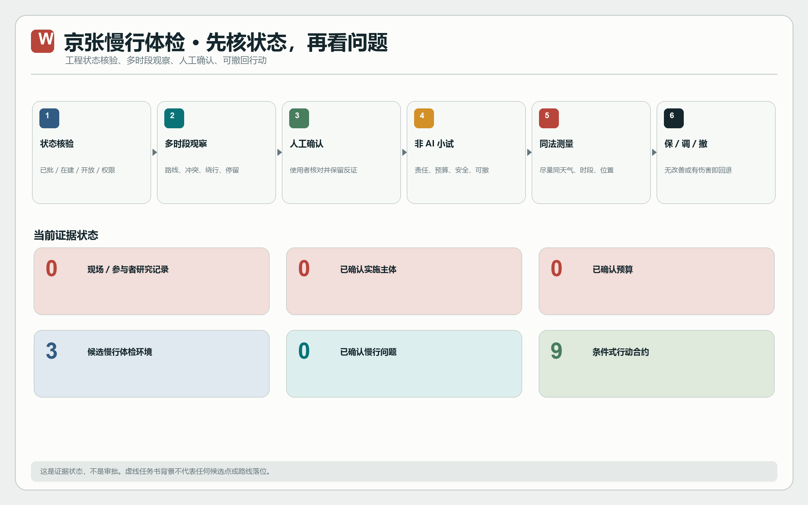
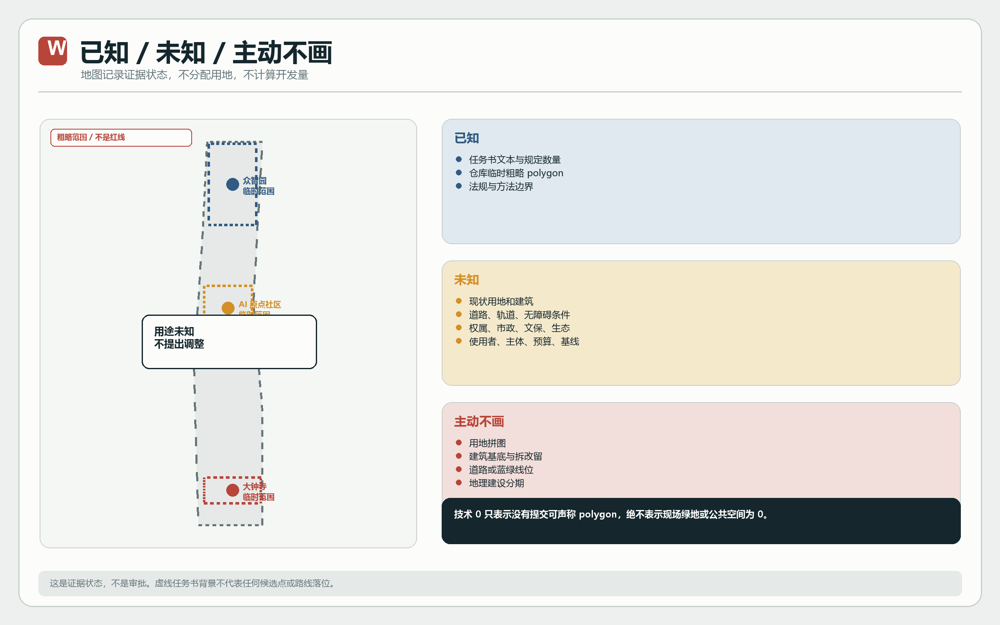
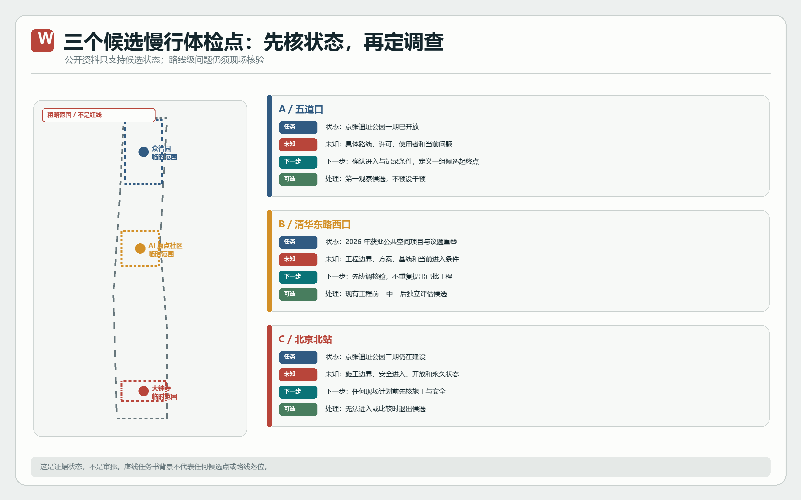
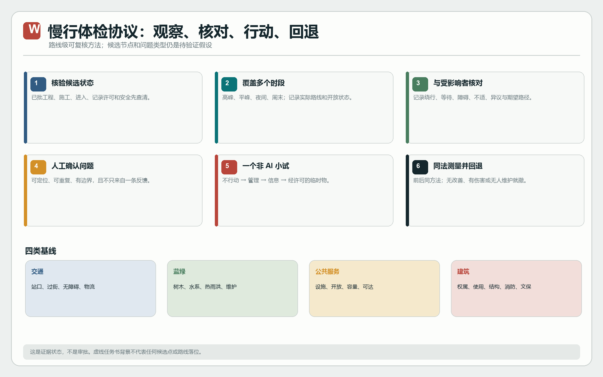
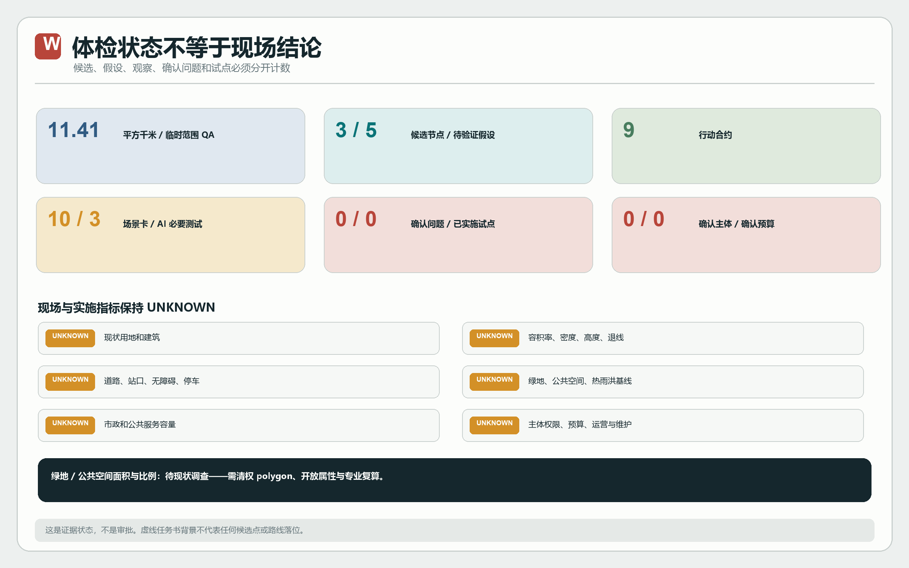

# 京张慢行体检：沿线接驳调查与可逆微更新计划

**结论先行：本方案不预设京张沿线“有问题”，而是建立一套能证实、证伪并撤回行动的慢行体检协议。** 官方公告明确要求关注京张铁路遗址公园慢行断点以及五道口、清华东路西口等站点周边的步行联系；这只能证明“慢行接驳是正式任务”，不能证明任何候选点已经存在绕行、冲突、无障碍中断或设施不足。本稿因此采用：**工程状态核验 → 多时段观察 → 公众/使用者核对 → 人工确认问题 → 非 AI 可逆小试 → 同法前后测量 → 保留、调整或撤除**。[source:OFFICIAL-ANNOUNCEMENT] [metric:confirmed_walkability_problem_count]

“京张慢行体检 / JING-ZHANG WALKABILITY AUDIT”是本次投稿的工作名称，不是政府项目名称或场地品牌事实。视觉识别采用平行轨线、测量刻度、状态卡和回退箭头四类原创图形，分别对应连续通行、可重复观察、证据限制和失败撤回。

## 设计依据与资料清单

本稿采用 E0-E5 证据等级：E0 为 Agent 生成或未经核验的假设；E1 为仓库任务包、临时几何或可复算技术记录；E2 为官方公告、法规和正式标准；E3 为结构化观察；E4 为访谈、问卷或共同踏勘；E5 为直接参与者意见。证据等级描述来源类型，不自动代表结论强弱；一条 E5 个人意见也不能替代有招募和样本说明的群体研究。Issue #1061 只证明一名自述在地学生/居民的公开批评存在，不能被写成“居民普遍认为”。[source:ISSUE-1061] [source:SOURCE-REGISTRY]

目前可用于任务定义的材料是官方公告与仓库任务书；仓库临时粗略边界只可做生成和自检。补充官方资料能够确认：五道口附近的京张遗址公园一期已经开放；清华东路西口南侧已有获批公共空间提升项目；京张遗址公园二期仍在建设。它们只能用于候选点状态分类，不能代替路线级现场观察。[source:OFFICIAL-WUDAOKOU-PHASE1] [source:OFFICIAL-QINGHUA-EAST-2026] [source:OFFICIAL-JINGZHANG-PHASE2-2026]

国家城市设计、控规编制、用地分类、无障碍、个人信息保护与生成式 AI 规则只提供方法和风险边界，不提供海淀现场事实。Punggol、Kalasatama、The Foundry、巴黎都市创新街区和 Vector Institute 仅用于比较“共同研究、真实环境小试、社区进入、评估后扩展”等机制，不能证明这些机制在京张已经存在或适用。[standard:PROJECT-OFFICIAL-ANNOUNCEMENT] [standard:MOHURD-URBAN-DESIGN-MEASURES]

公开包的关键缺口包括：正式总体与重点区边界、道路和轨道出入口、现状建筑和权属、公共空间和设施、树木水系和热雨洪、市政容量、文保范围、行为观察、利益相关者研究、责任主体、预算和评估基线。以下所有“建议”均受这些缺口约束；没有相应证据的内容保持 unknown，而不是用设计语言填满。[depth:existing_conditions_diagnosis] [data:geometry/constraints.geojson#CON-PROV-001]

## 三层范围工作框架

公告给出的约 43.6 平方千米、约 11.4 平方千米和三处重点区约 368.4 公顷是文本层面的任务范围。仓库 polygon 在 EPSG:4548 下复算约 11.41 平方千米，仅是几何管线的 QA 值，不是官方红线面积，也不用于容积率、土地平衡或投资测算。[metric:site_area_sqm] [data:geometry/site_boundary.geojson#SITE-001]

三层不是同一概念逐级放大。统筹研究层回答“产业、人才、科研、公共服务和治理之间有哪些已被证据支持的关系”；总体设计层回答“现状、权属、可达、生态、设施和控制条件是否允许干预”；重点区层回答“任务书指定功能在什么前提下可以开展一个最小试验”。若上一级证据门未通过，下一级不落位、不计量、不承诺建设。[depth:three_level_scope_framework]

提交 GeoJSON 的作用也分层：`site_boundary` 与 `key_areas` 保存仓库临时约束；`land_use` 只用一个“现状和规划用途待核验”的覆盖面满足机器拓扑检查；道路、绿地和公共空间文件只放置明确标注为 map annotation 的缺口标记；`phasing` 表示全域先进入证据阶段，不是南北建设时序。任何读者都不应从这些图层推导场地现状。[source:PROVISIONAL-BOUNDARY] [data:geometry/phasing.geojson#PH-EVIDENCE-0]

## 统筹研究范围产业与未来城市研究

任务书提出百年京张文化带、都市 AI 生活体验带和 AI 综合创新带，以及创新、生态、验证、活力城市和观察窗口等功能。本稿不声称它们已在本地形成，而把它们改写成五个研究问题：现有机构和企业的关系是什么；真实公共问题由谁提出；哪些资源可以合法共享；测试责任、数据边界和人工接管由谁承担；哪些结果足以支持继续投入。回答这些问题需要机构名录、授权访谈、公开政策和现场研究，当前均未完成。[source:AGENT-TASKBOOK] [depth:overall_spatial_structure]

| 任务书方向 | 当前能确认 | 下一项证据 | 未通过时的处理 |
| --- | --- | --- | --- |
| AI 全栈自主创新 | 任务要求存在 | 经授权的机构、能力、设施与合作关系调查 | 不画“生态网络” |
| 人才与创新生态 | 任务要求存在 | 不同人才、家庭、学生和服务者研究 | 不生成需求画像 |
| 场景验证 | 任务要求存在 | 真实问题、非 AI 对照、责任和安全条件 | 不启动测试 |
| 活力城市 | 任务要求存在 | 日常设施、开放时间和使用观察 | 不预设设施缺口 |
| 全球观察窗口 | 任务要求存在 | 可公开的评估与失败记录 | 不做宣传性排名 |

五个国际案例只形成核对问题：Punggol 提醒核对共享平台的治理与数据权限；Kalasatama 提醒先定义居民参与和可测目标；The Foundry 提醒核对社区进入和运营；巴黎都市创新街区提醒小试前后评估；Vector 提醒长期伙伴关系需要真实机构和合同。它们不提供京张的选址、指标、主体或政策结论。[source:CASE-PUNGGOL] [source:CASE-KALASATAMA]

“体检”不是自动判病。它把每个慢行主张分为候选、已观察、经使用者核对、可干预、已评估五种状态；选项依次是不行动、管理调整、信息调整、临时物理干预和工程深化。永久建筑只在正式规划、权属、文保、生态、市政、消防、资金和维护全部另行审查后才可讨论。[depth:renewal_project_list]

## 总体设计范围城市更新与控规深度城市设计

总体设计范围目前只被用作**慢行调查与决策框**，不自绘主轴、缝合路线或功能拼图。工作被拆为七个可审计包：①核验在建/已批项目、正式资料和版本；②建立站点—公园—校园—社区—园区候选起终点清单；③在工作日高峰、平峰、夜间和周末记录步行、骑行、过街、无障碍、停车、导向与停留；④用共同踏勘和匿名反馈核对观察；⑤人工确认问题、少数意见与影响范围；⑥确认权属、许可、运营、预算、维护和撤除；⑦只为一个已证实问题建立非 AI 可逆小试。每个包先产生证据，再决定是否产生空间图形。[data:geometry/land_use.geojson#LU-UNKNOWN-001] [depth:land_use_layout]

“最后 300—800 米”和“连续观察 7—14 天”只作为建议采样框架，不是已知问题范围或官方标准。首轮记录至少包含时间、位置、观察者、使用群体、问题类型、文字描述、照片/视频引用、几何引用、出现频率、严重度估计、置信度和备注；涉及人脸、车牌等个人信息时先人工筛除或去标识化。[source:PIPL] [metric:walkability_hypothesis_count]

控规深度要求的用地、开发强度、高度、建筑密度、退线、交通、市政和公共服务不能在缺少已批条件时补写。本稿将这些字段保持 unknown，并给出专业补齐路径：由有资质团队接收正式 CAD/GIS 与批复文件，统一坐标和版本，完成现状与法定控制叠合，经独立面积和拓扑复核后再产生方案图。[standard:MOHURD-CONTROL-DETAILED-PLANNING] [depth:development_intensity_controls]

更新判断遵循“保留优先、调查在先、可逆优先”。因为没有建筑年代、结构、使用、消防、权属和价值评估，本稿不作拆、改、留对象判断；因为没有道路红线和工程条件，本稿不画新路、桥或地下连接；因为没有树木、水系、热环境和雨洪基线，本稿不画蓝绿网络。这里的“完成”只表示缺口、责任和下一专业步骤已经说明，不表示设计结论已经完成。[depth:retain_renovate_demolish] [depth:risk_missing_data]

## 重点区域详细设计

三处重点区域使用仓库临时粗略 polygon，并只保留任务书明确的名称和方向。它们不是慢行问题分区，也不被赋予未经调查的地方角色。[data:geometry/key_areas.geojson#PROV-KEY-001] [depth:three_key_area_detailed_design]

| 重点区 | 任务书明确内容 | 当前未知 | 最小下一步 | 可讨论界面（条件通过后） |
| --- | --- | --- | --- | --- |
| 众智园 AI 自主创新加速区 | AI 自主创新、全栈技术和场景验证方向 | 正式范围、现有机构/设施、测试权限、交通安全、运营主体 | 正式边界与机构/设施调查，责任和安全评审 | 受控测试说明与停止界面，不预设建筑或路线 |
| 北京 AI 原点社区 | 邻近高校、人才与社区相关方向 | 实际使用群体、居住/服务供给、校园开放、公共空间和产权 | 分群研究、日常设施和开放时间盘点 | 问题听证与研究记录界面，不替居民生成需求 |
| 大钟寺 AI 产业聚集区 | AI 产业、商业与服务相关方向 | 产业/商户构成、消费者问题、站点出入口、场地权限和维护 | 商户/劳动者/使用者研究，权属和接驳踏勘 | 试验状态与投诉/退款/退出界面，不预设市场或地标建筑 |

任何界面都必须满足公共可进入、无障碍、权属许可、维护主体、内容更新、投诉和撤除条件；否则只保留纸质或离线网页。三处重点区的正式面积、内部功能、建筑规模、景观和工程方案均不在当前证据能力内。[source:PROVISIONAL-BOUNDARY] [metric:key_area_count]

### 三个候选慢行体检节点：先核状态，再决定是否调查

| 候选节点 | 已确认的公开状态 | 当前不能声称 | 本稿处理 |
| --- | --- | --- | --- |
| A 五道口站周边—京张公园一期 | 公园一期已开放，可作为运营中空间的候选观察环境 | 不声称站口至公园、高校或园区存在通行问题 | 第一顺位候选；取得进入与记录许可后再定义具体路线 [source:OFFICIAL-WUDAOKOU-PHASE1] |
| B 清华东路西口站—公园连接区域 | 2026 年获批项目已包含共享单车停放和步行/骑行衔接等内容 | 不把已批项目问题写成本稿原创发现，不重复提出同类工程 | 降级为现有工程的独立前—中—后评估候选，或另选未重叠路段 [source:OFFICIAL-QINGHUA-EAST-2026] |
| C 北京北站—京张南端 | 京张遗址公园二期仍处建设进程 | 不假定施工期可进入，不把临时施工影响当作长期问题 | 先核施工边界、开放状态和安全条件；未通过则不开展现场试点 [source:OFFICIAL-JINGZHANG-PHASE2-2026] |

三处节点不是 taskbook 三个重点区的替代边界，也没有提交精确点位或路线。候选数量是研究设计计数；已确认慢行问题仍为 0。[metric:candidate_audit_site_count] [metric:confirmed_walkability_problem_count]

## AI 创新生态、人才画像与 AI+ 场景

### 七类待研究群体，而非“居民画像”

任务书要求 5 类以上画像。本稿用 `hypothesis_persona` 标记七类招募框，不对其人数、需求或态度作结论：附近居民；学生与青年；园区/机构职工；商户、服务人员与骑手；老人、残障者和推车照护者；访客和公共交通使用者；测试、运营与维护人员。每一类都需要招募方法、样本限制、知情同意、反对意见和不可外推范围。[metric:hypothesis_group_count] [source:ISSUE-1061]

### 十张合规场景卡：AI 只整理和接受对照

| ID / 问题 | 场景卡 | AI 必要性 | 非 AI 对照 | 进入条件与退出 |
| --- | --- | --- | --- | --- |
| SC-01 / H1-H2 | 观察记录格式与术语辅助规范化 | helpful，不必要 | 人工表格复核 | 不改变原始记录；字段映射错误即退回人工 |
| SC-02 / H2 | 无障碍、绕行和冲突记录辅助归类 | helpful，不必要 | 纸表、人工计时和照片编号 | 不得自动判定“可达”或严重度 |
| SC-03 / H2 | 匿名反馈辅助去重 | helpful，不必要 | 双人手工去重 | 保留原文和不同意见；误合并即拆回 |
| SC-04 / H2 | 时间与空间问题辅助聚类 | helpful，不必要 | 人工分组与地图标注 | 热点只作待核线索，不自动生成优先级 |
| SC-05 / H2 | 期望路径记录整理 | helpful，不必要 | 人工起终点与绕行记录 | 不把非正式路径自动定义为违规或合理 |
| SC-06 / H2 | 上传图片隐私风险预筛 | helpful，不必要 | 人工逐张审核 | 工具漏检时停止上传功能；原图最小化保存 |
| SC-07 / H5 | 前后测可比时段辅助匹配 | helpful，不必要 | 人工按天气、时段和位置配对 | 匹配规则公开；不能把相关性写成因果 |
| SC-08 / H3 | 低速机器人与行人共存受控测试 | necessary，仅测试对象 | 非机器人配送/人工推车基线 | 路径、安全、责任、急停、人工接管齐备；近失或排斥即停 |
| SC-09 / H4 | AI 聚类与人工编码成本/质量对照 | necessary，仅比较对象 | 双人手工编码 | 同一匿名样本比较耗时、漏判和异议保留；无优势即停用 AI |
| SC-10 / H4 | AI 辅助多语导向可靠性对照 | necessary，仅比较对象 | 人工翻译与静态导向 | 受控题库、人工复核和申诉；错误影响找路即下线 |

十张卡是任务书响应和试验假设，不是项目清单。只有 SC-08 至 SC-10 因“被检验对象就是 AI”而标记 necessary；它们仍需问题证据、基线、非 AI 对照、责任主体、数据和安全审查。其余卡若普通工具足够，应使用普通工具。H4“AI 降低整理成本”只有在 SC-09 的同样本对照后才可能成立。[metric:scenario_count] [metric:ai_necessary_scenario_count]

### 三处任务书规定的“地标”降级为信息界面

数量来自任务书，不证明永久建筑必要。候选界面分别是“证据状态板”“问题听证台”“试验停止板”，显示已知/未知、来源、候选责任、下一门槛、纠错和停止方式。它们只有在正式重点区、公共可进入性、权属、无障碍、运营和维护全部确认后才可临时试装；否则使用纸质登记表和离线网页。三者均不使用人脸、企业标志或未经授权的京张历史图片。[metric:landmark_interface_count] [standard:PROJECT-AGENT-OPEN-CALL-TASKBOOK]

## 用地、建筑规模与拆改留方案

本稿不提出新的用地分区。`land_use.geojson` 的一个覆盖面仅表示“现状用途和规划用途待正式资料核验，不提出用途调整”，其 `geometry_role` 为 `analysis_helper`，没有用地代码。它存在是为了让仓库的形式化拓扑检查知道整个临时范围都被标记为未知，而不是空白漏画。[data:geometry/land_use.geojson#LU-UNKNOWN-001] [standard:MNR-LAND-USE-CLASSIFICATION-GUIDE]

`buildings.geojson` 为空 FeatureCollection，因为没有清权现状建筑，也不再提交虚构的设计基底。建筑基底面积、容积率、建筑密度、高度、退线、拆改留对象和新增规模均为 unknown。后续需要建筑普查、产权/使用、年代和价值、结构消防、文保、日照和已批控制，才能形成逐栋“保留—修缮—改造—拆除—新建”建议。[metric:building_footprint_area_sqm] [depth:height_massing_character]

当前唯一可能进入空间试验的对象不是建筑，而是在 ACT-001 至 ACT-005 完成后，从已证实问题中选择一个非 AI、临时、可撤的小试。信息/管理类可包括临时导向或停车边界提示；临时物理类可包括经许可的可移动休息设施；标线、隔离、照明、铺装、路口和无障碍工程必须进入相应专业审批，不能因为尺度小就被写成“便宜且可直接实施”。具体类型、数量、尺寸、材料、位置、预算和周期均待基线与责任确认。[depth:retain_renovate_demolish]

## 交通、轨道、市政与公共服务设施

现有公开包不能判断轨道站点出入口、公交接驳、过街、步行骑行、无障碍、停车、物流、消防或施工条件。`roads.geojson` 因此不再包含 Agent 自绘中心线，只保留一个“路线待共同踏勘”的 map annotation 点；它不是道路节点或推荐线位。[data:geometry/roads.geojson#RD-SURVEY-MARKER] [depth:traffic_rail_slow_parking]

下一步交通工作是由交通和无障碍专业团队与相关使用者共同确定“站点/目的地候选对”，在工作日高峰、平峰、夜间和周末记录实际路线、有效通行宽度、绕行距离、过街等待、坡度/台阶、临时障碍、骑行冲突、照明、导向与开放状态。DESIRE_LINE 只记录非正式路径及其起终点，不先贴“不文明”标签。只有问题可重复观察、权属和工程条件明确、管理或标识调整不足时，才进入工程方案。低速机器人测试不得占用人的主要通道，必须有物理急停、现场接管和无 AI 等价服务。[standard:GB55019-2021] [depth:traffic_rail_slow_parking]

市政和公共服务同样先做基线：供水排水、电力、通信、环卫、消防、应急和算力边缘设施需要容量、接口、冗余、资产和维护资料；教育、医疗、养老、文化、体育、托育、厕所、饮水和避护需要位置、开放时间、服务能力和可达性。任务书的“新基建”不授权本稿指定设备、容量或投资主体。[metric:municipal_capacity_index] [depth:municipal_new_infrastructure]

## 蓝绿空间、公共空间与城市风貌

`green_space.geojson` 和 `public_space.geojson` 各只有一个 map annotation 缺口点，不是绿地或公共空间 polygon。真实绿地面积、绿地率、公共空间面积和公共空间率均保持“待现状调查”；空间自检可以报告本包可计算 polygon 面积为 0，但该技术结果不进入现状或规划指标结论。[data:geometry/green_space.geojson#GR-SURVEY-MARKER] [metric:green_space_area_sqm]

蓝绿调查需包含现状树木与生境、水系与排水、热环境、雨洪、土壤、季节变化、开放边界和维护；公共空间调查需包含可进入性、座椅、遮阴、饮水、厕所、照明、消费门槛、昼夜与周末开放。没有这些基线，不提出绿道、海绵设施、广场或“公共客厅”。后续小试必须避免砍移树木、破坏遗产或形成长期维护负担。[standard:MOHURD-URBAN-DESIGN-MEASURES] [depth:blue_green_public_space]

城市风貌也不从“铁路红”“科技蓝”等通用意象反推地方特征。京张铁路遗产范围、保护级别、历史叙事和可用图像需由正式文保资料与专业策展确认；建筑界面、高度和材料需在现状测绘、街景观察、已批控制和公众研究之后提出。“京张慢行体检”的图形只属于本次投稿的信息设计，不应被当作地区风貌结论。[depth:height_massing_character]

## 更新项目清单、实施政策与分期计划

“项目清单”被改写为九份 Action Contract，而不是建设清单。所有责任主体均为 candidate/unknown，预算均为 unknown；任何政府、学校、企业、社区或运营方都没有被本稿写成已承诺主体。[metric:action_contract_count] [depth:phasing_implementation]

| 行动 | 为谁/解决什么 | 候选牵头（未确认） | 成功或进入下一门槛 | 失败与退出 |
| --- | --- | --- | --- | --- |
| ACT-001 候选节点状态核验 | 所有调查参与者 / 防止与在建或已批项目冲突 | 授权资料维护或专业规划团队 | 项目边界、开放状态、进入与记录许可可追溯 | 状态不清则该节点退出本轮 |
| ACT-002 多时段路线与无障碍踏勘 | 步行、骑行及行动不便者 / H1-H2 | 交通/无障碍专业团队 | 形成带时间、位置和限制的可复核观察集 | 样本、安全或许可不足则重做或停止 |
| ACT-003 匿名反馈与使用者核对 | 七类待研究群体 / 防止观察者替使用者发言 | 独立公众参与团队 | 招募、同意、偏差、少数意见和删除机制完整 | 隐私或代表性风险未处理则停止外推 |
| ACT-004 人工问题确认 | 受影响群体 / H1-H3 | 跨专业人工评审组 | 问题可定位、可重复、影响明确且有反证记录 | 证据冲突或仅为一次事件则保持候选 |
| ACT-005 权属—许可—运营—维护矩阵 | 使用者和资产维护方 / H3 | 实施统筹/资产专业团队 | 权限、资源、投诉、保险和撤除路径齐全 | 任一责任缺失则不落位 |
| ACT-006 一个非 AI 可逆小试 | 经研究确认的具体群体 / 一个已确认问题 | 经确认的空间运营主体 | 干预等级、基线、预算依据与安全审查完成 | 无法保持通行、安全或可撤即取消 |
| ACT-007 同法前后测 | 公众与评审 / H5 | 独立评估团队 | 尽量同天气、时段、位置和方法完成比较 | 条件不可比则不作效果结论 |
| ACT-008 AI—人工整理对照 | 调研与决策人员 / H4 | 经确认的数据与评估主体 | 同样本比较耗时、漏判、异议保留和隐私 | 无明确优势或不能解释即停用 AI |
| ACT-009 公开状态与回退记录 | 公众和维护方 / 防止“建成即成功” | 经确认的公开信息维护主体 | 每项行动显示证据、状态、申诉、复核和撤除结果 | 无人维护或被误认官方结论即下线 |

分期是条件门而不是日期表或地理分区：阶段 0 只接收资料、调查和确认责任；阶段 1 只做一个非 AI 可逆小试；阶段 2 仅在非 AI 基线不足且 AI 有可检验必要性时做受控对照；阶段 3 只有效果、公共价值、合法性、安全、资金、维护和退出均通过才讨论扩大。任一门失败都可以回退或终止。[data:geometry/phasing.geojson#PH-EVIDENCE-0] [depth:renewal_project_list]

实施政策建议只限程序：公开数据版本和限制；保留反对意见；明确 actor status；试验前公布数据、人工接管、投诉和退出；采用同一指标做前后与 AI/非 AI 比较；把负结果记录为公共知识。它们是供后续主体确认的建议，不是现行地方政策或财政承诺。[source:PIPL] [source:GENAI-MEASURES]

## 指标体系、面积复算与合规矩阵

指标分三类。第一类是**任务或文件状态**：3 个重点区来自任务书；3 个候选慢行体检节点、5 条待验证假设、10 张场景卡、3 个 AI 必要测试、7 类假设招募组、3 个信息界面和 9 份行动合约是本稿内容计数。第二类是**技术 QA**：临时边界复算 11,412,825.386 平方米；空间自检另行报告本包可计算 polygon 的面积，不把“没有提交 polygon”改写为场地比例。第三类是**现场与实施指标**：绿地与公共空间面积/比例、已确认慢行问题、观察/反馈记录、已实施试点、确认主体、预算、容积率、高度和市政容量等，当前均为待调查、待正式资料或 0 条确认记录。[metric:confirmed_walkability_problem_count] [metric:field_research_record_count]

| 指标 | 状态 | 能说明什么 | 不能说明什么 |
| --- | --- | --- | --- |
| 临时边界复算面积 | known / low confidence | 文件与 CRS 管线可复算 | 官方红线或精确规划面积 |
| 重点区数量 3 | known | 任务书规定数量 | 正式 polygon 和内部方案 |
| 候选节点 3、假设 5、行动 9、场景 10 | known | 本稿研究设计与任务响应完整性 | 现场需求或实施项目数量 |
| 已确认慢行问题 0、已实施试点 0 | known | 当前没有问题或项目被冒充为既成事实 | 场地没有问题或未来不应行动 |
| 现场研究记录 0 | known | 截止本稿未开展现场/参与者研究 | 场地没有问题或没有使用者 |
| 已确认 actor 0、预算 0 | known | 没有实施承诺 | 没有潜在主体或资金 |
| 绿地/公共空间面积与真实比例 | unknown | 需要清权 polygon、开放属性与专业复算 | 没有提交 polygon 等于现场为 0 |
| 用地、建筑、交通、市政及其他蓝绿基线 | unknown | 需要专业资料与调查 | 可以用 Agent 图形替代 |

`compliance_matrix.json`、`standard_matrix.json` 和 `design_depth_matrix.json` 中的 addressed/complete 表示“任务要求已被正文、缺口说明、图层和下一步响应”，不表示缺失的现场设计已经完成。正式资料到位后必须整包重建 geometry、metrics、图片、HTML 和 PDF，并重新运行确定性、空间、视觉和专业证据检查。[depth:metrics_recalculation] [metric:confirmed_actor_count]

## 风险、版权与合规说明

主要风险不是某个造型失败，而是把任务书要求、临时几何、个人意见或 Agent 生成内容误写为场地事实。数据隐私风险通过最少数据、知情同意、去除无关个人信息、人工复核和删除/申诉处理；安全风险通过专业审查、物理急停、人工接管和非 AI 等价；公平风险通过多种参与方式、无障碍和保留拒绝权；实施风险通过 actor status、预算 unknown、维护与退出门公开。[standard:GB-T35273-2020] [source:PIPL]

空间争议风险保持高：没有正式边界、权属和现状时不落位。政策不确定性保持高：本稿不声称任何建议已被政府、学校、企业或社区采纳。技术成熟度按场景评估：信息表格优先非 AI，机器人和生成式服务只在受控环境比较。公众接受度必须由研究和试验记录获得，不能从 Issue #1061 的一名发帖者或任务书推断。[source:ISSUE-1061] [depth:risk_missing_data]

所有文字、表格、图形、GeoJSON 和程序化排版由 Codex 在本地工作区生成或改写；未复制其他投稿的文本、图形或命名。官方公告、任务书、标准和案例只做短摘要与链接；候选节点、问题类型和调查周期均明确标记为研究设计或假设。系统字体仅用于渲染，不作为独立文件分发。正式提交前仍需要参与者确认 GitHub 身份、版权声明、英文术语和全部公开材料。[source:TOOL-CODEX]

## 参考资料

1. 北京市规划和自然资源委员会海淀分局，《百年京张 AI 创新带城市设计国际方案征集资格预审公告》，2026-05-09。[source:OFFICIAL-ANNOUNCEMENT]
2. open-city-ai/haidian，《面向全球智能体开展百年京张 AI 创新带城市设计开源征集任务书摘录》与 site package。[source:AGENT-TASKBOOK]
3. open-city-ai/haidian，临时粗略边界与来源登记；用途明确限制为生成、展示和自检。[source:PROVISIONAL-BOUNDARY]
4. GitHub Issue #1061，一名自述在地学生/居民对早期 Agent 投稿的公开批评；仅作为个人意见和同质化审计线索。[source:ISSUE-1061]
5. 住房和城乡建设部，《城市设计管理办法》《城市、镇控制性详细规划编制审批办法》；自然资源部，用地用海分类指南。[standard:MOHURD-CONTROL-DETAILED-PLANNING]
6. 《中华人民共和国个人信息保护法》、GB/T 35273-2020、GB 55019-2021 与《生成式人工智能服务管理暂行办法》，用于隐私、无障碍和 AI 风险边界。[source:GENAI-MEASURES]
7. Punggol Digital District、Smart Kalasatama、The Foundry、Quartiers Métropolitains d'Innovation、Vector Institute 官方或项目方页面；只作机制比较。[source:CASE-VECTOR]
8. 北京市园林绿化局京张铁路遗址公园一期开放信息；仅支持五道口附近公园已开放的状态判断。[source:OFFICIAL-WUDAOKOU-PHASE1]
9. 北京市发展和改革委员会 2026 年清华东路西口南侧公共空间提升项目报道；仅支持已有项目范围与目标的状态核验。[source:OFFICIAL-QINGHUA-EAST-2026]
10. 首都之窗 2026 年京张铁路遗址公园二期进展；仅支持二期在建与计划进度判断。[source:OFFICIAL-JINGZHANG-PHASE2-2026]

本方案仍不是可直接施工、审批、招商或采购的成果。它可被审查的价值在于：明确说出现在不知道什么，先由谁补哪类证据，在什么条件下只做多小的试验，以及失败后如何停止。
