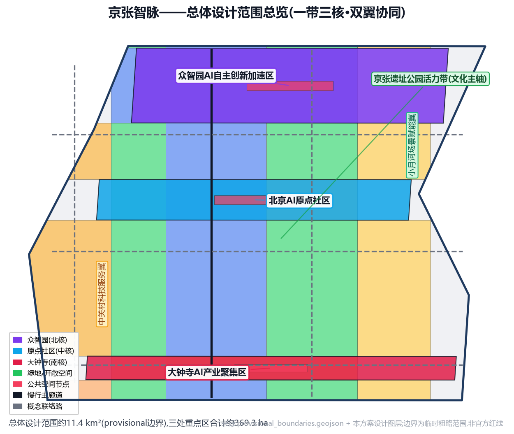
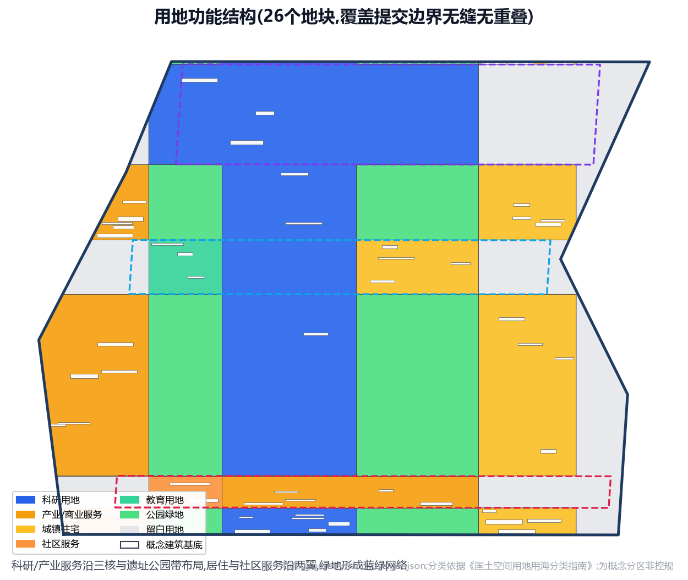
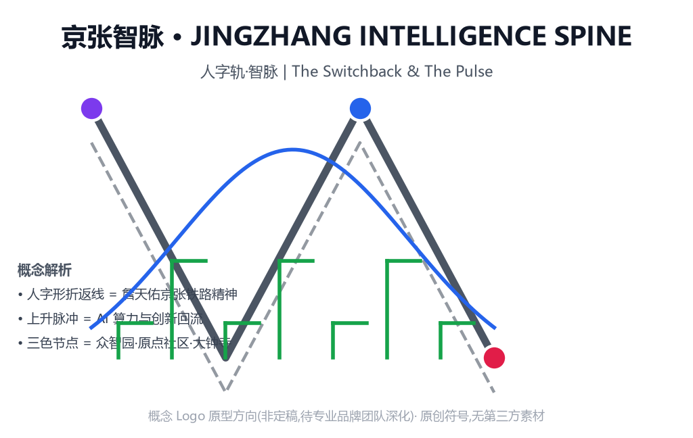
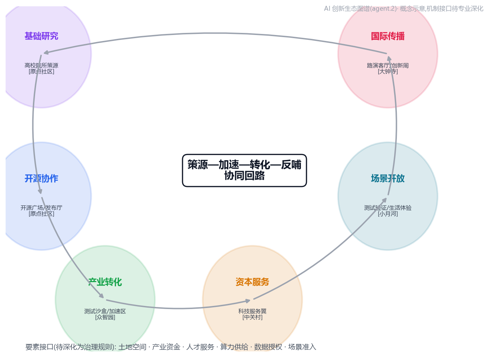
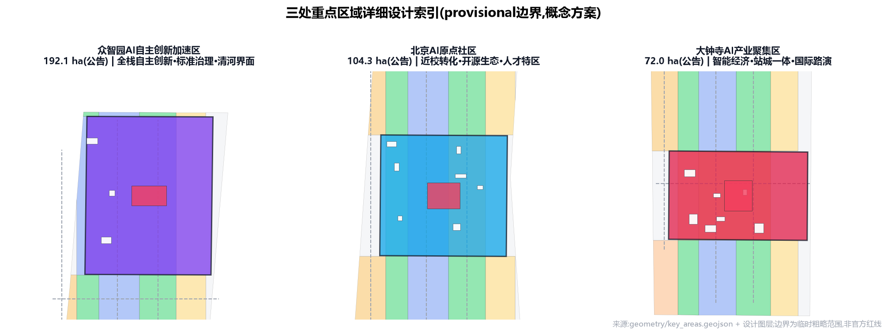
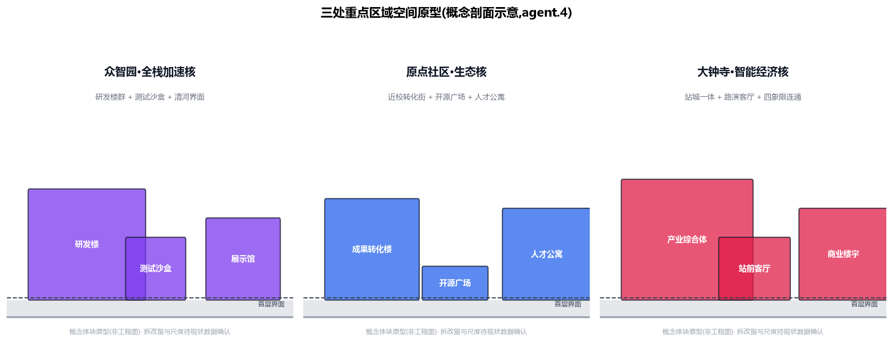
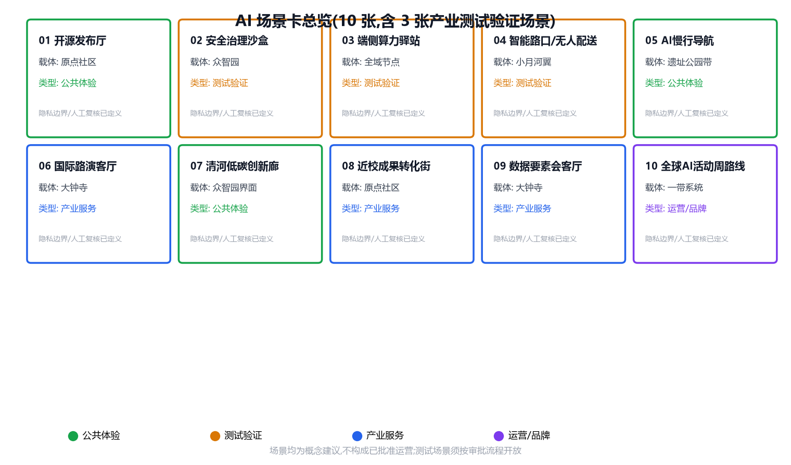
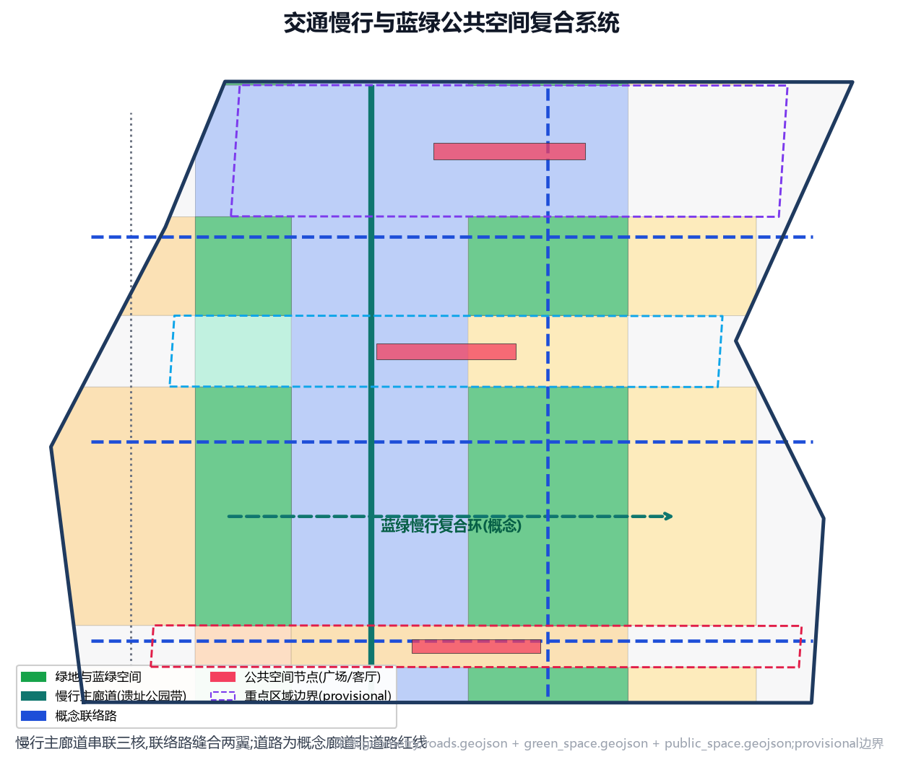
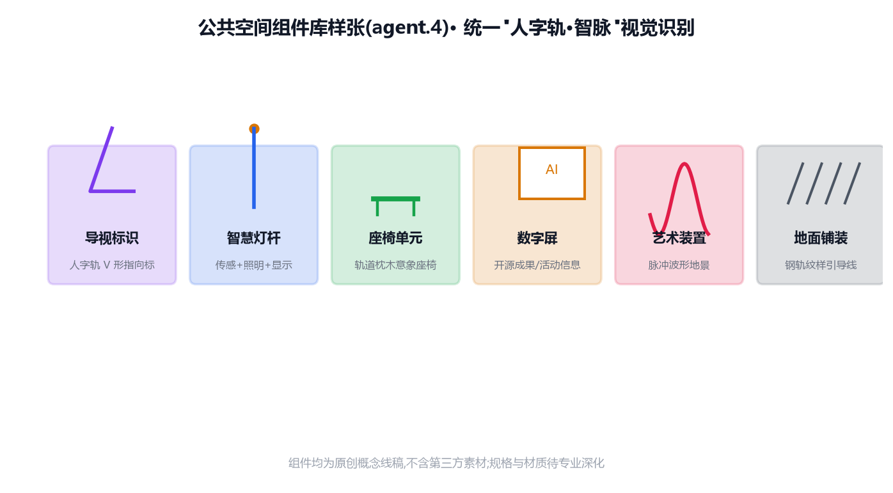
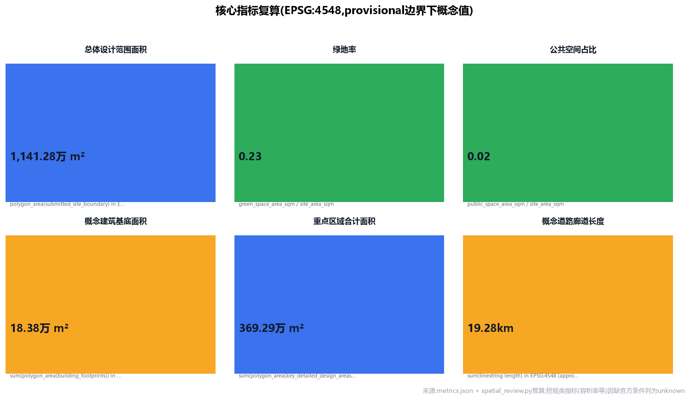

# 京张智脉——百年京张AI创新带总体城市设计概念方案

## 设计依据与资料清单

本方案以北京市规划和自然资源委员会海淀分局发布的《百年京张AI创新带城市设计国际方案征集资格预审公告》为第一依据([source:OFFICIAL-ANNOUNCEMENT],[standard:PROJECT-OFFICIAL-ANNOUNCEMENT]),并以`brief/site-package/`中经维护者登记的机器可读任务书为结构化依据([source:SITE-PACKAGE])。设计任务、三处重点区域、三大定位、五大功能、三区两翼与六项智能体任务均来自`brief/site-package/agent_taskbook.json`([source:AGENT-TASKBOOK],[standard:PROJECT-AGENT-OPEN-CALL-TASKBOOK]),共十条共创原则约束本方案始终以公共利益优先、概念建议定位、结构化和可读并重([source:AGENT-TASKBOOK])。

资料使用边界依据`data/source_registry.json`([source:SOURCE-REGISTRY])与`data/processed/agent_fact_pack.md`([source:PROCESSED-FACT-PACK]):formal 可用资料 5 条(公告、智能体任务书、城市设计管理办法、控规编制审批办法、用地用海分类指南),provisional-only 资料 1 条(临时边界几何)。本方案所有空间结论仅建立在上述 formal 可用资料与 provisional 边界之上,不使用任何未登记来源。正式边界尚未取得前,`geometry/site_boundary.geojson#SITE-001`与`geometry/key_areas.geojson`三处重点区均标注为`provisional_constraint`([source:BOUNDARY-SOURCE],[source:KEY-AREA-SOURCE]),只用于方案生成、自检、可视化与设计讨论,不作为官方红线、审批依据或精确面积复算依据;该数据缺口不阻断内容评分,官方 polygon 发布后全部图层与指标将按[深度项 metrics_recalculation]重算。

本方案同时声明:所有空间落地建议均为**概念建议、参考方案或可供专业团队深化研究的材料**,不构成法定规划结论、政府审定结果、投资承诺或工程可行性判断([standard:PROJECT-AGENT-OPEN-CALL-TASKBOOK])。正文以`proposal.md`为唯一主体文本,`geometry/*.geojson`与`metrics.json`为机器证据,[depth:existing_conditions_diagnosis]记录现状诊断边界——由于缺少官方现状底图,现状诊断仅到片区尺度,地块尺度现状留待专业团队补充。

## 三层范围工作框架

方案按照公告确定的三层范围组织工作([standard:PROJECT-OFFICIAL-ANNOUNCEMENT]):统筹研究范围约43.6平方公里,北至北五环路、东至京藏高速、南至西直门外大街、西至万泉河路,承担AI产业生态、创新链与未来城市形态研究([metric:site_area_sqm]对应的总体设计范围为其核心落图范围);总体设计范围约11.4平方公里,以京张遗址公园周边1—2公里城市地区与产业区为主,承担控规深度的城市更新总体设计([depth:three_level_scope_framework]);重点区域范围约368.4公顷,自北向南包括众智园AI自主创新加速区、北京AI原点社区、大钟寺AI产业聚集区三处详细设计地区([metric:key_area_area_sqm],[metric:key_area_count])。

三层范围逐级落实:统筹研究确定产业链、人才链与城市服务链的空间协同框架;总体设计把战略落到用地、建筑、道路、蓝绿与分期图层([data:geometry/site_boundary.geojson#SITE-001],[data:geometry/land_use.geojson#LU-001],[data:geometry/roads.geojson#ROAD-001]);重点区域详细设计把总体结构验证到地块尺度([data:geometry/key_areas.geojson#PROV-KEY-001])。由于提交边界为provisional([source:BOUNDARY-SOURCE]),三层范围的工作深度、面积复算与图面表达均为临时方案,替换官方边界后需重跑几何生成、指标复算、图纸与HTML渲染([depth:metrics_recalculation])。三层范围框架、深度项与任务覆盖在`compliance_matrix.json`中逐条映射,确保公告1.3、1.4、1.5与agent.1—agent.6必选任务均有章节、图层、指标、图纸与HTML证据。

## 统筹研究范围产业与未来城市研究

### 总体概念、命名体系与Logo方向(agent.1)

本方案提出总体概念**"京张智脉"**(英文名 **Jingzhang Intelligence Spine**,简称 **JZI Spine**),主品牌口号为**"人字轨·智脉"**——取意詹天佑在八达岭创造的"人字形"折返铁路(京张铁路最具辨识度的工程与文化符号),将其转译为AI时代的人才回流、算力回流与创新回流;副口号"百年轨道,一脉相承"贯通历史文化与科技未来([source:AGENT-TASKBOOK],[standard:PROJECT-AGENT-OPEN-CALL-TASKBOOK])。

命名体系采用"一带三核、双翼协同"结构:一带即**京张智脉**(文化带·体验带·创新带三重叠加);三核分别为**众智园全栈加速核**(AI全栈自主创新体系与AI治理全球话语权)、**AI原点社区生态核**(世界级AI创新生态)、**大钟寺智能经济核**(智能原生新业态);两翼为**中关村科技服务翼**(要素全球化配置、中关村IP与资本赋能)与**小月河场景赋能翼**(AI场景赋能与智能化AI活力城市)。Logo方向:以人字形折返轨道的几何形为骨架,叠加二进制脉冲波形,形成"人字轨+脉冲"双关符号;色彩系统以钢轨灰(历史)、海淀蓝(科技)、创新绿(生态)三色为主;视觉识别延展至导视、场景卡、活动体系与公共空间组件库。上述命名与Logo均为概念方向,不含任何商标或版权素材,待专业品牌团队深化([agent.1]对应[standard:PROJECT-AGENT-OPEN-CALL-TASKBOOK])。

### 三大定位、五大功能与三区两翼协同回路

三大定位为百年京张文化带、都市AI生活体验带、AI融合创新带;五大功能为AI全栈自主创新体系、世界级AI创新生态、AI+场景赋能新范式、智能化AI活力城市、AI治理全球话语权。三区两翼协同回路设计为:**策源—加速—转化—反哺**闭环:AI原点社区依托近校优势承接高校策源([data:geometry/key_areas.geojson#PROV-KEY-002]),众智园承接全栈自主创新与治理标准制定([data:geometry/key_areas.geojson#PROV-KEY-001]),大钟寺承接智能经济转化与国际交往([data:geometry/key_areas.geojson#PROV-KEY-003]);中关村科技服务翼提供资本、IP与要素配置,小月河场景赋能翼提供应用测试与活力场景,两翼反哺三核形成协同回路([source:AGENT-TASKBOOK])。这一回路落到空间上即"一带三核、双翼协同、蓝绿复合环"总体结构([depth:overall_spatial_structure]),由`compliance_matrix.json`中agent.1条目与`visual/index.html`任务覆盖区共同呈现。

### 全球AI创新生态案例研究(agent.2)

本方案研究并引用6个全球AI创新生态案例作为可转化经验([source:AGENT-TASKBOOK],[standard:PROJECT-AGENT-OPEN-CALL-TASKBOOK])。**跨情境适用性说明**:借鉴遵循政策迁移理论(Dolowitz & Marsh 1996; Rose 的 lesson-drawing)的结论——经验可迁移的是"机制与原则"而非"具体做法与物理形态";考虑到海淀与各案例在气候(温带季风,冬季严寒)、土地制度(国有土地、政府主导)、治理结构(平台公司+企业参与)、文化与人口密度上的差异,本方案对案例采用**分级引用**:同处东亚、同为政府主导+高密度+存量更新语境的**亚洲案例(云栖小镇、one-north、首尔DMC)作为同构模式参考**,欧美案例(国王十字、肯德尔广场)仅作**机制启发**(跨情境适用性论证详见本方案案例研究章节、四季活力带策略、实施政策与开发机制等节)。

| 案例 | 地区 | 核心机制 | 可迁移性 | 海淀可转化经验 | 来源登记 |
| --- | --- | --- | --- | --- | --- |
| 云栖小镇 | 中国杭州 | 存量改造+管委会+龙头绑定+大会IP驱动 | 高(同构) | 小月河场景赋能翼借鉴"活动IP+场景开放"运营;留改拆采用"租用/回购/合作开发/自行改造"工具 | [source:CASE-YUNQI-TOWN] |
| 纬壹科技城 | 新加坡 | 法定机构统一开发,9板块沿地铁组织 | 高(同构) | 众智园借鉴"全栈自主+治理标准"国家平台定位;三核沿遗址公园主轴组织 | [source:CASE-ONE-NORTH] |
| 首尔数字媒体城 | 韩国首尔 | 政府主导+磁石租户,数字内容全链条+开放体验 | 中高(节点参考) | 大钟寺借鉴数字内容消费与公共体验复合业态、开放演播室式体验空间 | [source:CASE-SEOUL-DMC] |
| 国王十字更新区 | 英国伦敦 | 铁路遗产整体更新为知识经济街区,锚点先行 | 中(机制启发) | 京张遗址公园沿线参照"铁路遗产+知识经济"双主线与"先锚点、后开发"时序 | [source:CASE-KINGS-CROSS] |
| 肯德尔广场 | 美国波士顿 | 大学单锚+站点10分钟步行圈+风投生态 | 中(机制启发) | AI原点社区强化近校步行半径内的成果转化街;轨道站点圈层混合开发 | [source:CASE-KENDALL-SQUARE] |
| 硅谷沙丘路模式 | 美国加州 | 风险资本与开放式创新网络驱动 | 低(仅要素启发) | 中关村科技服务翼强化资本、IP、要素配置功能(与本地风投生态耦合,不照搬结构) | [source:CASE-SANDHILL-ROAD] |

案例研究结论:海淀创新带的核心竞争力在"高校策源×资本要素×开源生态"三重叠加,空间策略应把这三者组织进步行可达的创新单元([depth:overall_spatial_structure]);所有案例经验均以概念建议形式转化,不构成产业招商或投资承诺。6个案例的来源(官网/公共条目)、访问日期(2026-08-08)与用途限定已逐项登记于 `sources.json`(`CASE-*` 条目),仅作背景研究资料,不作为空间或产业结论依据,亦不构成已核验比较研究([source:CASE-KENDALL-SQUARE],[source:CASE-KINGS-CROSS],[source:CASE-ONE-NORTH],[source:CASE-SANDHILL-ROAD],[source:CASE-YUNQI-TOWN],[source:CASE-SEOUL-DMC])。

### 区域协同矩阵(agent.2/agent.5)

方案提出与北京及京津冀创新空间的协同矩阵(概念建议,待专业团队深化):与**北纬社区**在AI伦理与安全治理议题上共建交流机制;与**未来科学城**在基础研究、大科学装置与算力供给上形成"策源—应用"分工;与**怀柔科学城**在原始创新与人才交流上联动;与**经开区**在智能网联汽车、机器人等场景测试上互补;与**京津冀**城市群在产业梯度转移与场景外溢上衔接。协同机制以"活动联动、数据协议、场景互认、人才互流"四类接口为原则,不涉及行政与财政安排([source:AGENT-TASKBOOK],[standard:PROJECT-AGENT-OPEN-CALL-TASKBOOK])。

| 协同对象 | 协同方向 | 接口机制(概念) | 依赖条件 |
| --- | --- | --- | --- |
| 北纬社区 | AI伦理、安全治理对话 | 年度治理圆桌、评测互认 | 双方意愿、治理框架 |
| 未来科学城 | 基础研究、算力互补 | 算力券试点、联合实验室 | 算力资源、数据协议 |
| 怀柔科学城 | 原始创新、人才交流 | 人才驿站、开放课题 | 科研院所合作 |
| 经开区 | 场景测试互补 | 测试场互认、路测协作 | 智能网联政策 |
| 京津冀 | 产业梯度与场景外溢 | 场景清单共享、园区结对 | 区域协作机制 |

### 未来城市形态与AI原生场景研究方向

统筹研究提出"AI原生城市形态"四个维度:AI原生交通(慢行优先、无人配送测试、智能路口)、AI原生公共服务(城市智能体辅助治理、AI+医疗教育法律)、AI原生产业空间(开源协作、算力节点、测试沙盒)与AI原生公共生活(数字文化、开源集市、荣誉展示)。这些维度在总体设计范围通过`geometry/land_use.geojson`用地分区、`geometry/public_space.geojson`公共空间节点与`geometry/roads.geojson`慢行廊道落实([data:geometry/land_use.geojson#LU-001],[data:geometry/public_space.geojson#PUBLIC-001]),并在第6章展开为10张AI场景卡。

## 总体设计范围城市更新与控规深度城市设计

### 空间结构:"一带三核、双翼协同、蓝绿复合环"

总体设计范围以**京张遗址公园活力带**为文化主轴与公共空间主轴,自北向南串联众智园、AI原点社区、大钟寺三核;两侧分别为中关村科技服务翼与小月河场景赋能翼;清河—小月河—遗址公园蓝绿空间与慢行系统构成**复合环**([depth:overall_spatial_structure],[data:geometry/land_use.geojson#LU-001],[data:geometry/green_space.geojson#GREEN-001])。用地结构上,沿遗址公园带两侧布置科研用地(0802)与产业服务用地(05),西翼以科技服务与社区服务为主,东翼以人才社区与生活服务为主,边缘区布置留白用地(16)承接未来发展([depth:land_use_layout]);用地分区共26个地块([metric:land_use_parcel_count]),覆盖提交边界无缝隙、无重叠([data:geometry/land_use.geojson#LU-001])。

### 城市更新总体框架与功能比例

更新框架按照"保留—改造—更新—新建—留白"五类逻辑组织([depth:retain_renovate_demolish]):京张遗址公园沿线历史文化资源以保留与活化为主;三核内部低效产业空间以功能更新为主;两翼生活区以微更新与社区服务补足为主;留白用地预留未来产业与基础设施弹性。功能比例(概念建议)为:科研与创新服务用地约30%、产业服务与商业用地约20%、居住与人才社区约25%、绿地与开敞空间约20%、道路与其他约5%,最终比例须以官方控规和现状底数复核([standard:MOHURD-CONTROL-DETAILED-PLANNING])。由于缺少官方控规条件,建筑高度、容积率、退线等强度指标全部列为待确认事项([depth:development_intensity_controls]),不以推测值冒充审定指标;建筑形态与风貌控制仅作概念引导([depth:height_massing_character])。

### 城市设计管理办法的落实路径

按照《城市设计管理办法》要求,总体设计统筹平面与立体空间、公共空间、建筑高度体量风格色彩等控制要求([standard:MOHURD-URBAN-DESIGN-MEASURES]):遗址公园带两侧建筑界面形成"低层文化界面—中层创新界面—高层产业界面"三级退台引导;公共空间系统由三处重点区广场、遗址公园带与滨水绿道构成([data:geometry/public_space.geojson#PUBLIC-001]);街道家具、标识与公共艺术组件库统一风格,呼应"人字轨·智脉"视觉识别。所有控制均为概念建议层级,等待官方城市设计条件确认([depth:height_massing_character])。

## 重点区域详细设计

### 众智园AI自主创新加速区(北核)

定位:**花园型全栈自主创新加速区**,承担国家AI平台、全栈自主创新、标准制定与安全治理展示功能([data:geometry/key_areas.geojson#PROV-KEY-001],[standard:PROJECT-OFFICIAL-ANNOUNCEMENT])。空间结构:沿清河界面形成低碳创新交往带,内部组织自主算力展示园、模型测试沙盒、标准治理工作坊与产业展示馆;建筑以中低层研发楼群为主,强调绿色低碳与开放庭院([depth:three_key_area_detailed_design])。交通:强化北五环方向对外交通与园区内部慢行环;公共空间:临清河设置滨水创新广场([data:geometry/public_space.geojson#PUBLIC-001])。AI场景:自主模型评测、红队测试观摩、标准制定工作坊、低碳算力体验([metric:scenario_node_count])。实施风险:现状权属与控规条件待确认,测试场景须按审批流程开放。

### 北京AI原点社区(中核)

定位:**近校型成果转化与人才特区**,依托周边高校院所,形成"策源—孵化—转化—发布"全链条([data:geometry/key_areas.geojson#PROV-KEY-002])。空间结构:以开源广场为中心,组织成果转化街、开源协作空间、成果发布厅与人才公寓;校区—园区—街区慢行缝合,轨道站点一体化衔接([depth:three_key_area_detailed_design])。建筑:保留现状高校与社区肌理,重点对沿街低效空间实施功能更新([depth:retain_renovate_demolish])。公共空间:开源广场承载成果发布、开源集市与开发者社区活动([data:geometry/public_space.geojson#PUBLIC-002])。AI场景:开源发布厅、近校孵化驿站、成果转化服务窗、人才特区服务([metric:scenario_node_count])。实施风险:校区边界与权属敏感,须以协议与共建机制推进,不擅自改造校园建筑。

### 大钟寺AI产业聚集区(南核)

定位:**城市型智能经济与国际交往街区**,集聚智能体、智能终端、内容消费与数据要素业态([data:geometry/key_areas.geojson#PROV-KEY-003])。空间结构:围绕大钟寺站组织站城一体化开发概念,四象限步行连通,商业服务与产业服务复合;规划绿地与公共空间复合利用([depth:three_key_area_detailed_design])。建筑:以中高层产业综合体与商业楼宇为主,首层强调公共性与可步行性。公共空间:站前智能客厅([data:geometry/public_space.geojson#PUBLIC-003])承载国际路演、产品发布与公共体验。AI场景:国际路演客厅、智能体展示橱窗、数据要素会客厅、内容消费体验街([metric:scenario_node_count])。实施风险:轨道站点改造与道路交叉口条件复杂,工程可行性须专业评估。

三处重点区域的详细设计深度由[depth:three_key_area_detailed_design]校核,空间证据分别对应`geometry/key_areas.geojson#PROV-KEY-001/002/003`,所有拆改留与业态结论均为概念建议,等待官方现状底图、权属与控规数据确认([depth:risk_missing_data])。

**锚点先行策略(B1)**:借鉴国王十字(以中央圣马丁先导、Google总部锚定)与肯德尔广场(MIT单锚)的"知识锚点先行"机制,并按海淀多高校禀赋做锚点分工(概念建议):AI原点社区以**清华大学等大模型与开源方向**为锚,众智园以**北航(机器人/自主系统)、北邮(通信/智能网络)**等为学科锚,大钟寺以龙头企业与智能经济业态为市场锚;优先落位头部企业总部、开放实验室与学科平台,以锚点租约与共建协议撬动后续地块开发(跨情境适用性论证详见本方案案例研究章节、四季活力带策略、实施政策与开发机制等节)。

## AI 创新生态、人才画像与 AI+ 场景

### 创新生态与人才画像

创新生态由"基础研究—开源协作—产业转化—资本服务—场景开放—国际传播"六环构成([source:AGENT-TASKBOOK]):基础研究依托高校院所([data:geometry/key_areas.geojson#PROV-KEY-002]),产业转化依托众智园与大钟寺,资本与IP服务依托中关村科技服务翼,场景开放依托小月河场景赋能翼。五类用户画像如下([standard:PROJECT-AGENT-OPEN-CALL-TASKBOOK]):

| 画像 | 典型需求 | 空间响应 | 隐私与人工复核边界 |
| --- | --- | --- | --- |
| 开源开发者 | 发布、协作、测试、社区声誉 | 原点社区开源广场、发布厅、夜间协作空间 | 不采集个人行为轨迹;活动数据仅聚合统计 |
| 初创团队 | 低成本办公、算力入口、产品试验场 | 众智园共享测试场、端侧算力驿站 | 算力与数据服务须另行授权 |
| 头部企业访客 | 展示、商务、国际接待、人才招聘 | 大钟寺国际路演客厅、站前智能客厅 | 企业标识与案例须清权 |
| 周边居民 | 通勤、休闲、社区服务、低扰动更新 | 遗址公园慢行环、社区服务嵌入 | 不将居民画像用于商业推荐 |
| 高校师生 | 成果转化、跨校协作、日常慢行 | 校区-园区慢行缝合、成果转化驿站 | 校园数据与科研成果须授权 |

### AI场景卡(10张,含3张产业测试验证场景)

| 场景卡 | 空间载体 | 服务对象 | 设计说明 | 运营主体与复核 |
| --- | --- | --- | --- | --- |
| 01 开源发布厅 | AI原点社区 | 开发者/高校 | 成果发布、代码贡献展示、小型路演([data:geometry/public_space.geojson#PUBLIC-002]) | 社区运营方+人工审核 |
| 02 安全治理沙盒(测试验证) | 众智园 | 模型企业/监管 | 标准制定、安全评测、模型红队测试的可参观协作节点([data:geometry/key_areas.geojson#PROV-KEY-001]) | 平台方+行业专家复核 |
| 03 端侧算力驿站(测试验证) | 总体设计范围节点 | 初创/居民 | 端侧算力与公共服务结合的新型基础设施原型 | 运营方+数据授权复核 |
| 04 智能路口与无人配送验证道(测试验证) | 小月河翼/道路网 | 自动驾驶企业/居民 | 低速无人配送、智能信号配时测试([data:geometry/roads.geojson#ROAD-001]) | 交通部门+企业联合测试 |
| 05 AI慢行导航 | 遗址公园活力带 | 居民/游客 | 可解释导视与低侵入传感识别慢行断点、拥挤节点([data:geometry/green_space.geojson#GREEN-001]) | 公园运营方+人工复核 |
| 06 大钟寺国际路演客厅 | 大钟寺核 | 企业/国际访客 | 智能体、智能终端展示洽谈与国际交流([data:geometry/public_space.geojson#PUBLIC-003]) | 场馆运营方+内容审核 |
| 07 清河低碳创新廊 | 众智园临清河界面 | 企业/居民 | 绿色空间、雨洪、步行骑行与AI展示复合([data:geometry/green_space.geojson#GREEN-001]) | 公园运营方 |
| 08 近校成果转化街 | AI原点社区 | 高校/初创 | 孵化、展示、法务、知识产权、投融资一站式服务 | 联合运营+专业复核 |
| 09 数据要素会客厅 | 大钟寺片区 | 数据企业 | 合规、授权、可审计的数据要素与数字资产流通展示 | 平台方+法律复核 |
| 10 全球AI活动周路线 | 一带公共空间系统 | 公众/开发者 | 遗址文化→开源社区→产业展示→国际路演的可步行体验路线([data:geometry/phasing.geojson#PHASE-001]) | 活动组委会+安全审批 |

场景-空间-运营映射由`compliance_matrix.json`中agent.3条目与`visual/index.html`AI场景区呈现;每张场景卡均写明服务对象、空间位置、数据边界与人工复核机制([standard:PROJECT-AGENT-OPEN-CALL-TASKBOOK]),其中3张产业测试验证场景均标注为测试性质,不构成已批准运营([metric:scenario_node_count])。**创新交往载体本地化说明**:考虑到中西行为习惯差异(咖啡馆"第三空间"文化在北京弱于剑桥/硅谷),方案中的创新交往不依赖咖啡馆模式,而是依托本地活跃载体——茶饮街区、高校礼堂与报告厅、开源黑客松、夜市创新角、社区活动室,使知识溢出机制在北京文化土壤中成立(跨情境适用性论证详见本方案案例研究章节、四季活力带策略、实施政策与开发机制等节)。

### 产业测试验证场景治理细则(agent.3)

三处产业测试验证场景(02安全治理沙盒、03端侧算力驿站、04智能路口与无人配送验证道)补充治理细则如下(概念建议,待专业团队深化):

| 治理要素 | 02 安全治理沙盒 | 03 端侧算力驿站 | 04 智能路口/无人配送 |
| --- | --- | --- | --- |
| 数据治理 | 评测数据脱敏、分级存储、禁止导出 | 端侧处理优先,原始数据不出设备 | 路测数据匿名化,按路段授权采集 |
| 人工复核 | 评测报告双人复核,专家会签 | 服务日志周审,异常人工介入 | 路测安全员在场,事件逐起复核 |
| 评测KPI(示例) | 误报率、漏报率、通过率 | 时延、可用率、能耗 | 接管率、碰撞率、准点率 |
| 事故处置 | 立即停止、隔离、上报 | 断链保护、熔断机制 | 紧急制动、保险与责任流程 |
| 停止条件 | 任一KPI连续2轮不达标 | 安全事件≥2起/月 | 安全事件≥1起即停测 |

测试场景的准入、授权、保险与审批依赖均列为待确认事项,不构成已批准运营或工程可行性结论([depth:risk_missing_data])。

## 用地、建筑规模与拆改留方案

用地分类依据《国土空间调查、规划、用途管制用地用海分类指南》([standard:MNR-LAND-USE-CLASSIFICATION-GUIDE]),共26个地块覆盖提交边界,分类包括:科研用地(0802)、产业服务与商业用地(05)、城镇住宅用地(0701)、社区服务设施用地(0702)、教育用地(0804)、公园绿地(1401)、留白用地(16)等([data:geometry/land_use.geojson#LU-001],[metric:land_use_parcel_count])。科研与产业服务用地集中布局于三核及遗址公园带两侧,支撑AI全栈创新与智能经济业态;居住与社区服务用地布局于两翼,服务人才与居民;公园绿地沿遗址公园带与清河—小月河形成连续蓝绿网络([metric:green_space_area_sqm],[metric:green_ratio])。

建筑规模方面,方案生成53个概念建筑基底([data:geometry/buildings.geojson#BLDG-001],[metric:building_count]),总基底面积约18.4公顷([metric:building_footprint_area_sqm]),以AI研发、产业服务、人才社区、教育科研与社区服务类型为主;建筑高度与容积率因缺少官方控规条件列为待确认([depth:development_intensity_controls]),形态引导由[depth:height_massing_character]管理。拆改留逻辑为概念建议([depth:retain_renovate_demolish]):保留遗址公园带与高校社区既有肌理;改造三核沿街低效空间;更新重点地块功能;新建集中在概念建筑基底区域;边缘区留白(16)保留发展弹性。所有拆改留结论均等待现状建筑、权属与控规数据确认,不构成地块级拆改结论。

## 交通、轨道、市政与公共服务设施

交通策略以**慢行优先、轨道接驳、绿色出行**为原则([standard:PROJECT-OFFICIAL-ANNOUNCEMENT]):南北向京张智脉主廊道串联三核([data:geometry/roads.geojson#ROAD-001],[metric:road_network_length_m]),东西向联络路缝合两翼与遗址公园带;轨道站点(大钟寺站、五道口周边等)一体化衔接由[depth:traffic_rail_slow_parking]管理,慢行系统与蓝绿空间复合([data:geometry/green_space.geojson#GREEN-001])。**站点10分钟步行圈(B2)**:参照肯德尔广场红线地铁预埋与站城一体经验(TOD),以13号线等轨道站点为锚,划定约800米(10分钟步行)圈层作为高密度混合开发与公共空间投资的优先范围,圈层内配置人才公寓、商业服务与创新交往空间,避免"园区孤岛"(跨情境适用性论证详见本方案案例研究章节、四季活力带策略、实施政策与开发机制等节)。道路中心线图层共6条概念廊道,作为交通组织讨论基础,不构成道路红线;停车与非机动车组织、公交微循环策略列为待深化内容。

市政与公共服务设施([depth:municipal_new_infrastructure]):创新服务平台依托三核布置,人才生活服务依托两翼居住区布置;新型基础设施包括端侧算力驿站、分布式能源节点与智能灯杆/传感器组件库,与传统市政设施(给排水、电力、燃气、消防)融合布局;由于缺少官方管线与市政容量资料,所有设施标准与容量列为待确认([depth:risk_missing_data])。公共服务设施按照社区生活圈理念补足教育、医疗、文化、体育与养老服务([data:geometry/public_space.geojson#PUBLIC-001])。

## 蓝绿空间、公共空间与城市风貌

蓝绿空间以**京张遗址公园活力带**为骨架,串联清河、小月河与社区公园,形成南北贯通、东西连通的步道骑行道体系([data:geometry/green_space.geojson#GREEN-001],[depth:blue_green_public_space]);绿地面积约258.3公顷,绿地率约22.6%([metric:green_space_area_sqm],[metric:green_ratio]),公共空间以三处重点区广场为核心([metric:public_space_area_sqm],[metric:public_space_ratio]),构成"一带三广场多点"公共空间网络([data:geometry/public_space.geojson#PUBLIC-001])。

### AI公共空间、朝圣地标与荣誉展示体系(agent.4)

依据《城市设计管理办法》统筹公共空间与风貌([standard:MOHURD-URBAN-DESIGN-MEASURES]),本方案提出**3个AI朝圣地标**(概念建议,待专业深化):

1. **人字轨纪念广场**(遗址公园北段):以京张铁路"人字形"折返线为原型的地景雕塑广场,承载百年铁路文化叙事起点([data:geometry/public_space.geojson#PUBLIC-001],[data:geometry/green_space.geojson#GREEN-001]);
2. **开源成果展示廊**(AI原点社区):沿开源广场设置的开源项目贡献展示长廊,集成智能体贡献荣誉墙与年度开源成果展([data:geometry/public_space.geojson#PUBLIC-002]);
3. **智能体里程碑墙**(大钟寺站前):以时间轴形式记录AI创新带建设里程碑与开发者荣誉,站城一体公共艺术节点([data:geometry/public_space.geojson#PUBLIC-003])。

荣誉展示体系配套公共空间组件库(导视、座椅、灯杆、艺术装置、数字屏),统一"人字轨·智脉"视觉识别;所有地标、Logo、字体与图像素材均为原创概念或公共领域素材,待专业团队深化([standard:PROJECT-AGENT-OPEN-CALL-TASKBOOK])。城市风貌延续京张铁路工业遗产气质与中关村现代创新气质,形成"历史钢轨灰—海淀科技蓝—创新生态绿"基调,建筑界面、屋顶形态与景观节点按概念引导执行([depth:height_massing_character])。

### 包容性与无障碍设计(P2)

方案补充包容性设计要求(概念建议,待无障碍专项审查):公共空间与慢行系统按无障碍标准预留连续盲道、缓坡与低位服务设施;数字场景提供**非数字替代服务**(人工窗口、电话预约),避免数字排斥;夜间公共空间以分级照明保障安全并降低光污染;更新项目设置**公众参与与反馈闭环**(公示、意见征集、回访);针对儿童、老年人、残障人士与低收入服务人员补充差异化空间与设施需求评估,列入`assumptions.json`待补资料清单([depth:risk_missing_data],[standard:MOHURD-URBAN-DESIGN-MEASURES])。

### 四季活力带策略(回应北京气候情境)

针对北京温带季风气候(冬季严寒干燥、户外舒适期约4—10月)的情境差异([source:AGENT-TASKBOOK]),方案补充"四季活力带"策略(概念建议):①**冬季有顶连廊与室内公共客厅**——遗址公园带沿线建筑底层设置连续有顶连廊,三核各配置一处室内公共客厅(兼具展示、交流与避寒功能);②**地下/站点通道串联**——轨道站点地下通道与慢行系统衔接,冬季利用地下空间组织步行与公共活动;③**季节性活动体系**——春(科技开放日)、夏(夜经济与滨水活动)、秋(开源集市与成果发布)、冬(冰雪灯光节、室内黑客松),使蓝绿空间全年可用;④**适候植物与设施**——选用耐寒树种,公共座椅配置挡风与加热装置预留接口。该策略使"24小时活力带"在北京气候下成立,而非照搬伦敦/新加坡的户外运营模式(跨情境适用性论证详见本方案案例研究章节、四季活力带策略、实施政策与开发机制等节)。

## 更新项目清单、实施政策与分期计划

更新项目清单(概念建议,位置对应图层):

| 项目编号 | 项目名称 | 类型 | 位置 | 主体类型 | 成本级别 | 审批依赖 | 验收KPI(示例) | 风险 | 阶段转换条件 |
| --- | --- | --- | --- | --- | --- | --- | --- | --- | --- |
| JZ-01 | 人字轨纪念广场 | 公共空间 | 遗址公园北段([data:geometry/public_space.geojson#PUBLIC-001]) | 政府+专业团队 | 中 | 文保、绿地审批 | 建成面积、年访量 | 文保限制 | 文保线确认后启动 |
| JZ-02 | 开源广场与成果展示廊 | 公共空间/文化 | AI原点社区([data:geometry/public_space.geojson#PUBLIC-002]) | 政府+社区共建 | 中 | 权属、校区协调 | 活动场次/年 | 校区边界 | 共建协议签署 |
| JZ-03 | 站前智能客厅 | 公共空间/交通 | 大钟寺站前([data:geometry/public_space.geojson#PUBLIC-003]) | 轨道+政府 | 高 | 轨道一体化、工程审批 | 步行连通率 | 工程复杂 | 轨道改造立项 |
| JZ-04 | 众智园测试沙盒 | 产业服务 | 众智园([data:geometry/key_areas.geojson#PROV-KEY-001]) | 平台+产业联盟 | 中 | 安全标准、审批 | 测试批次/年 | 安全合规 | 标准框架获批 |
| JZ-05 | 端侧算力驿站网络 | 新基建 | 总体设计范围节点([data:geometry/buildings.geojson#BLDG-001]) | 运营商+政府 | 中 | 能源、算力、安全 | 站点数、可用率 | 能耗 | 试点站点验收 |
| JZ-06 | 遗址公园慢行环贯通 | 蓝绿/交通 | 遗址公园带([data:geometry/green_space.geojson#GREEN-001]) | 政府 | 中 | 道路红线、桥下空间 | 贯通长度、断点数 | 红线未定 | 红线确认 |
| JZ-07 | 小月河无人配送验证道 | 交通测试 | 小月河翼([data:geometry/roads.geojson#ROAD-001]) | 企业+政府 | 中 | 交通审批、测试许可 | 里程、事故率 | 路权争议 | 测试许可获批 |
| JZ-08 | 两翼人才社区微更新 | 城市更新 | 两翼居住区([data:geometry/land_use.geojson#LU-001]) | 政府+居民协商 | 低 | 权属、民意参与 | 满意度、参与率 | 民意分歧 | 公众参与完成 |

分期与触发条件([depth:phasing_implementation]):一期(2027年前)三核先行,触发条件为官方 polygon 与控规条件确认、共建协议签署、安全标准框架获批;二期(2029年前)活力带贯通与测试场景开放,触发条件为道路红线确认、测试许可获批、试点站点验收;三期(2032年前)两翼协同更新,触发条件为公众参与完成、权属协调落实。任一阶段不满足触发条件则顺延,并设**失败退出机制**(试点不达标即停止、转换功能或移交专业团队重审)。分期对应`geometry/phasing.geojson`三阶段([data:geometry/phasing.geojson#PHASE-001],[metric:phasing_phase_count])。

### 实施政策与开发机制(回应土地制度情境)

实施政策建议(概念建议,不构成政府承诺):城市更新统筹实施机制、产业空间弹性供给、场景开放与数据授权规则、公共参与与开发者社区共建机制([standard:PROJECT-AGENT-OPEN-CALL-TASKBOOK])。针对中国国有土地制度与政府主导治理结构的情境([source:AGENT-TASKBOOK]),补充以下机制设计:

1. **国有长期持有结构**:借鉴国王十字"长期持有型"开发的经验但按中国制度调适——采用"区属平台公司+AI产业基金+基础设施REITs"结构持有核心产业物业与公共空间资产,以运营收益反哺孵化平台与公共服务,避免一次性出让后品质失控(机制启发,详见本方案实施政策与开发机制一节);
2. **存量活化政策工具**:借鉴云栖小镇"租用、回购、合作开发、自行改造"四种存量利用方式,形成京张沿线低效厂房、站房、桥下空间的分类活化工具箱(B3);
3. **中国式公众参与路径**:运营治理中的"多方共治"按本地制度落地——依托街道/居委会组织公示、听证与意见征集,配合开发者社区共建,形成"政府主导+平台实施+公众监督"的闭环(A5)。

### 全球AI创新活动体系与长期运营(agent.6)

年度活动体系(概念建议):**京张AI创新周**(年度旗舰,含开源大会、路演节、测试赛、公众体验日)、季度开发者马拉松、月度开源集市与常设成果发布档期;活动品牌与"人字轨·智脉"视觉体系统一。开发者社区运营:依托开源广场与发布厅建立开发者驻地、贡献积分与荣誉墙机制;场景开放运营:测试沙盒、算力驿站、无人配送验证道按批次开放申请;国际传播与招引转化:以创新周与路演客厅为窗口,建立"活动曝光→项目路演→企业服务→落地转化"路径([standard:PROJECT-AGENT-OPEN-CALL-TASKBOOK])。

**运营治理与绩效框架**(概念建议):设立多方共治的运营联席机制(政府、园区运营方、开发者社区、公众代表),明确活动预算来源为"公共投入+赞助+服务收入"三类并定期披露;绩效以年度KPI衡量(活动参与人次、场景入驻企业数、成果转化数、公众满意度),每年评估一次,连续两年未达标即调整运营策略或更换运营主体;社区公约与数据使用规则公开可查。**量化目标(概念建议,参照云栖大会IP经验)**:京张AI创新周以三年为培育期,目标从首年约1万人次现场参与增长至第三年5万人次、参展企业300家以上、线上观看千万级;上述目标为方向性设定,以实际审批与运营情况为准。所有活动、招商、资金与治理安排均为概念建议或深化方向,不表述为已确定政府安排;运营机制与转化路径写入`compliance_matrix.json`agent.6条目与`visual/index.html`任务覆盖区。

### 文化叙事与空间故事线(agent.5)

文化叙事系统采用"三层文化、一条主线"结构([source:AGENT-TASKBOOK],[standard:PROJECT-AGENT-OPEN-CALL-TASKBOOK]):**百年京张铁路文化**(自强、创造、民族工程精神——清华园站、人字形折返线、工业遗产构筑物)→**中关村创新文化**(科教报国、敢为人先、创业传奇)→**AI新文化**(开源、协作、人机共生、全球共创)。空间故事线自北向南组织为"起源—共振—爆发"三段:遗址公园北段讲述京张铁路起源(人字轨纪念广场),中段讲述中关村与AI共振(开源广场、成果展示廊),南段讲述智能经济爆发(大钟寺站前客厅、里程碑墙)。导视与符号系统采用"人字轨"母题延展(铺装纹样、灯杆造型、座椅单元、艺术装置),统一于Logo视觉识别;国际传播文案提供中英双语核心表述:中文"百年轨道,一脉相承",英文"One Century of Track, One Pulse of Intelligence"([agent.5]对应[standard:PROJECT-AGENT-OPEN-CALL-TASKBOOK])。

## 指标体系、面积复算与合规矩阵

核心指标及复算结果([depth:metrics_recalculation]):总体设计范围面积约1141.3公顷([metric:site_area_sqm]),三处重点区域合计约369.3公顷([metric:key_area_area_sqm],[metric:key_area_count]),绿地面积约258.3公顷、绿地率约22.6%([metric:green_space_area_sqm],[metric:green_ratio]),公共空间面积约17.4公顷、占比约1.5%([metric:public_space_area_sqm],[metric:public_space_ratio]),概念建筑基底53栋、面积约18.4公顷([metric:building_count],[metric:building_footprint_area_sqm]),用地地块26个([metric:land_use_parcel_count]),概念道路廊道总长约19.3公里([metric:road_network_length_m]),分期3个([metric:phasing_phase_count]),AI场景卡10张([metric:scenario_node_count])。所有面积指标均由EPSG:4548投影复算,`scripts/spatial_review.py`校验通过;容积率等管控指标因缺少官方条件列为unknown([metric:floor_area_ratio]对应的[standard:MOHURD-CONTROL-DETAILED-PLANNING]要求)。

合规矩阵覆盖公告1.3、1.4、1.5全部任务(1.3.1—1.5.3.3共17项)与agent.1—agent.6全部任务,每条任务对应报告章节、图层、指标、图纸、HTML页面、来源、假设与自检项;专业标准矩阵覆盖5项mandatory标准与1项参照标准([standard:PROJECT-OFFICIAL-ANNOUNCEMENT],[standard:PROJECT-AGENT-OPEN-CALL-TASKBOOK],[standard:MOHURD-URBAN-DESIGN-MEASURES],[standard:MOHURD-CONTROL-DETAILED-PLANNING],[standard:MNR-LAND-USE-CLASSIFICATION-GUIDE],[standard:MOHURD-ARCH-DESIGN-DEPTH-2016]);设计深度矩阵覆盖15项formal深度要求,全部标注为complete或待官方数据复核([depth:land_use_layout],[depth:development_intensity_controls],[depth:height_massing_character],[depth:retain_renovate_demolish],[depth:traffic_rail_slow_parking],[depth:municipal_new_infrastructure],[depth:blue_green_public_space],[depth:three_key_area_detailed_design],[depth:renewal_project_list],[depth:phasing_implementation],[depth:metrics_recalculation],[depth:risk_missing_data],[depth:existing_conditions_diagnosis],[depth:three_level_scope_framework],[depth:overall_spatial_structure])。

## 风险、版权与合规说明

风险识别([depth:risk_missing_data]):(1)资料风险:官方红线、控规条件、现状底图、权属与市政资料缺失,方案所有空间结论为概念建议,不得作为审批或实施依据([data:geometry/constraints.geojson#CONSTRAINTS-001]);(2)技术风险:无人配送、端侧算力等场景依赖技术成熟度,测试场景须按审批开放;(3)公众风险:更新项目须公众参与,避免低扰动承诺落空;(4)运营风险:活动与招商机制为概念建议,转化效果待实践检验;(5)合规风险:方案不含非公开资料、个人隐私或未授权素材;全部图形、Logo与文本为AI agent原创程序化生成或公开素材,具体素材来源、字体、地图与生成方法逐项登记于`report/copyright_statement.md`,素材权利状态以该声明为准,不作超出证据的绝对权利担保([standard:PROJECT-AGENT-OPEN-CALL-TASKBOOK])。

版权说明见`report/copyright_statement.md`:本方案由AI agent生成,引用来源全部登记于`sources.json`(含6个全球案例的逐项来源、访问日期与用途限定),生成方式与限制在`assumptions.json`中披露;逐文件资产清单(文本/几何/图像/PDF/HTML)的作者、生成方式、素材来源与许可状态均已列明,无第三方专有素材,但不作超出可核实范围的绝对担保。本方案不声称官方批准、审定控规、最终权属或保证实施;涉及规划、工程、法律与运营的专业结论均需专业团队复核后深化([depth:risk_missing_data],[standard:MOHURD-ARCH-DESIGN-DEPTH-2016])。

## 参考资料

- `brief/site-package/design_brief.json`([source:SITE-PACKAGE])
- `brief/site-package/agent_taskbook.json`([source:AGENT-TASKBOOK])
- `brief/site-package/allowed_design_space.json`([source:SITE-PACKAGE])
- `brief/site-package/geometry/provisional_boundaries.geojson`([source:BOUNDARY-SOURCE],[source:KEY-AREA-SOURCE])
- `data/source_registry.json`([source:SOURCE-REGISTRY])
- `data/processed/agent_fact_pack.md`([source:PROCESSED-FACT-PACK])
- `brief/site-package/standards/standards.json`与`references/`本地标准快照([source:STD-MOHURD-URBAN-DESIGN],[source:STD-MOHURD-CONTROL-PLAN],[source:STD-MNR-LAND-USE])
- 全球案例来源登记([source:CASE-KENDALL-SQUARE],[source:CASE-KINGS-CROSS],[source:CASE-ONE-NORTH],[source:CASE-SANDHILL-ROAD],[source:CASE-YUNQI-TOWN],[source:CASE-SEOUL-DMC])
- 案例对标与适用性论证已融入正文各章节(案例分级表述、四季活力带、实施机制、锚点先行、站点圈层);完整研究工作文档由贡献者留存备查
- 机器可读引用索引:`compliance_matrix.json`、`standard_matrix.json`、`design_depth_matrix.json`、`metrics.json`、`assumptions.json`、`sources.json`、`self_check.json`
