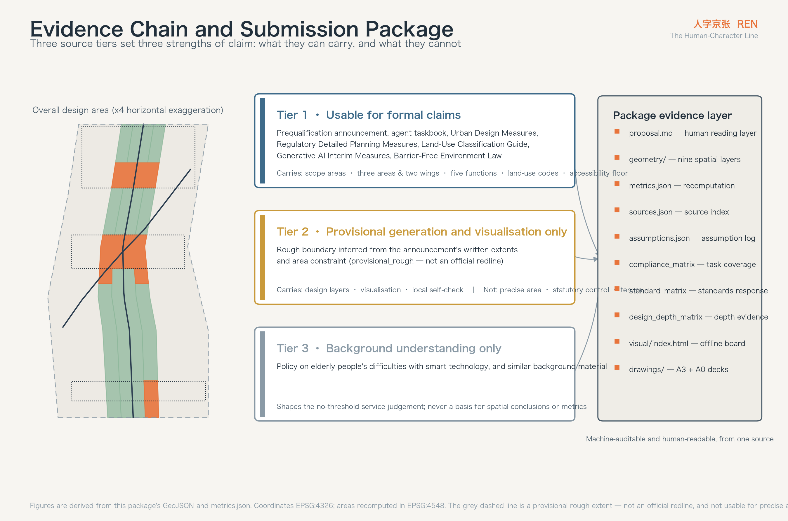
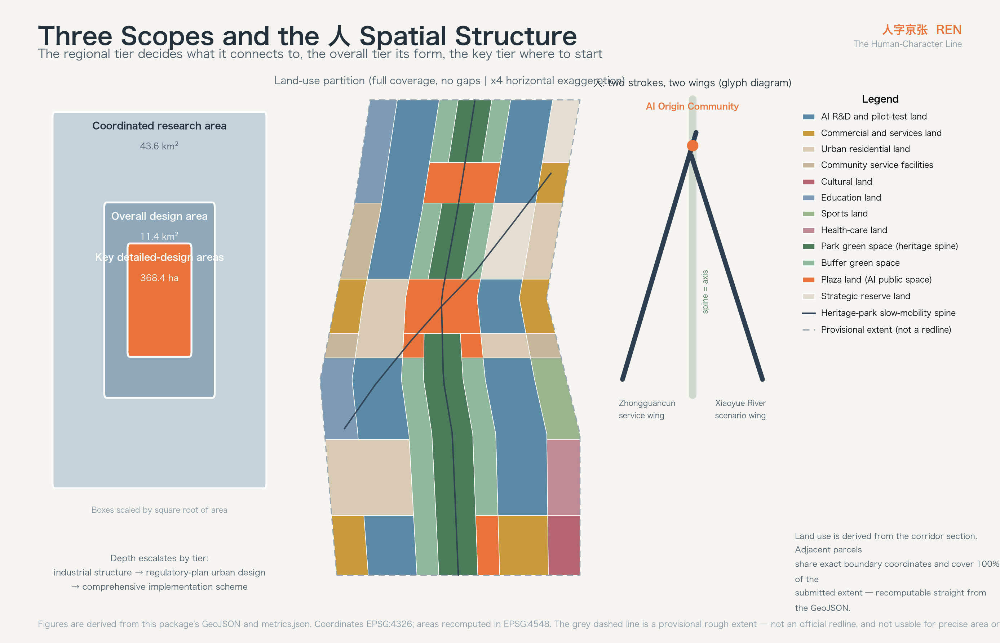
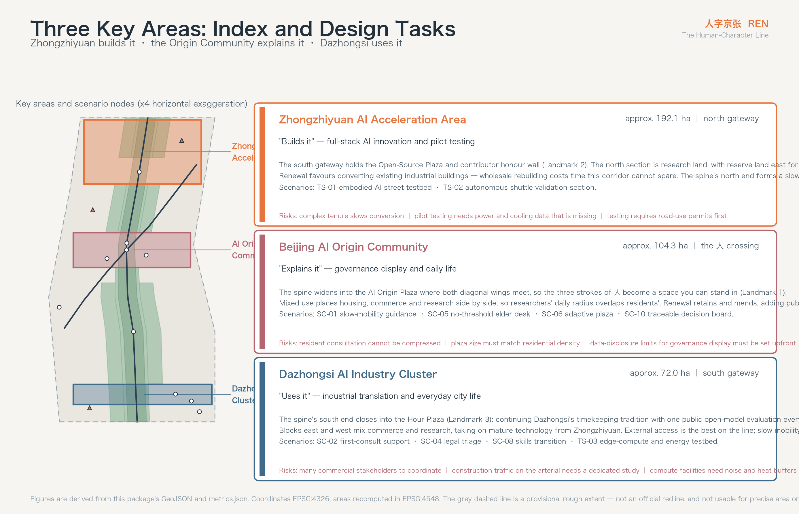
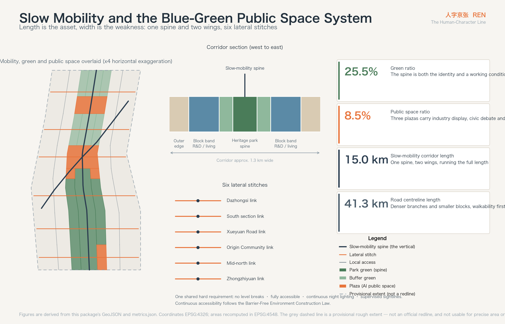
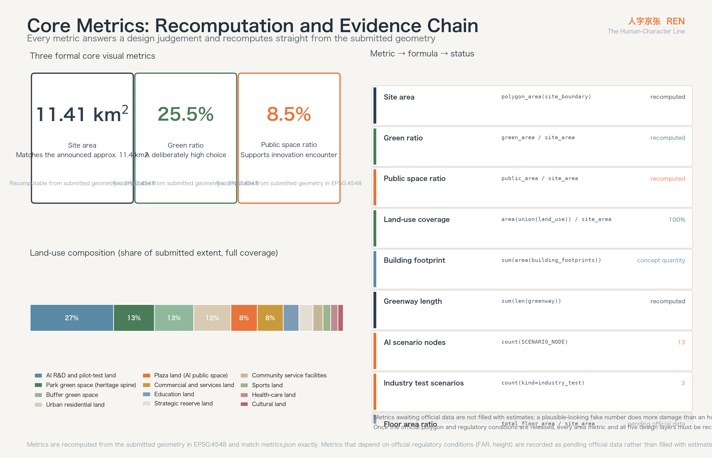

# REN — The Human-Character Line

**人字京张 · Urban Design Proposal for the Centennial Jing-Zhang AI Innovation Belt**

A little over a century ago, the Jing-Zhang railway met a grade at Qinglongqiao it could not climb. The conventional answers were a long detour or a long tunnel, and China could afford neither. Zhan Tianyou's answer was to make the train write the character 人: enter the station, reverse, and climb again — buying height with a movement that looks like going backwards. That line became China's first answer sheet for designing a trunk railway on its own terms.

The slope this corridor faces today is a different one. Artificial intelligence is already strong enough, but its route into the real city is still the detour: capability matures in the lab and fails in the street, and while capability grows, trust does not grow with it.

This proposal argues that the second slope should not be taken by detour either — it should be climbed by writing 人 again. Spatially, the three strokes map exactly onto the three areas and two wings the announcement establishes: the vertical is the Jing-Zhang heritage park green spine running the full length, one stroke reaches south-west to the Zhongguancun service wing, the other north-east to the Xiaoyue River scenario wing, and all of them meet at the Beijing AI Origin Community. In meaning, 人 is the governance contract for this belt: however strong the algorithm becomes, a person remains the subject of this line.

---

## Design Basis and Source Inventory

Every factual basis in this proposal comes from public or cleared material. No non-public map, internal table, or unlicensed dataset was used. Sources are used in three tiers, and the tier directly determines how strong a claim it can carry.

**Tier one** is material usable for formal claims: this call's prequalification announcement, the taskbook excerpt for the global agent open call, and the standards and regulations in force — the Urban Design Management Measures, the Measures for Formulating and Approving Regulatory Detailed Plans, the Guide to Land and Sea Use Classification for territorial-space survey, planning and control, the Interim Measures for Generative AI Services, and the Barrier-Free Environment Construction Law [source:OFFICIAL-ANNOUNCEMENT] [source:AGENT-TASKBOOK] [source:SOURCE-REGISTRY]. This proposal's scope areas, three-areas-two-wings structure, five functions, six agent tasks, land-use codes and accessibility requirements are all anchored here.

**Tier two** is spatial data usable only for provisional generation and visualisation. Official polygons for the three scopes and three key areas have not been released; the site package provides a rough boundary inferred from the announcement's written extents and area constraint [source:BOUNDARY-SOURCE] [source:SITE-PACKAGE]. All geometry in this proposal is built on that provisional boundary, so it must be said plainly: **it is not an official redline, and it cannot be used for precise area accounting, statutory control, or tenure judgement**. Every area and ratio recomputed from it is a design-model output, not an approved indicator. Once the official polygon is published, five layers — land use, green space, public space, building footprints and phasing — and every area metric require full recomputation; the recomputation path is recorded in `assumptions.json`.

**Tier three** is material for background understanding only, such as the Implementation Plan on Resolving Elderly People's Difficulties in Using Smart Technology [source:SOURCE-REGISTRY]. It shaped this proposal's judgement about no-threshold services, but it is never a direct basis for any spatial conclusion or metric.

Beyond these, the proposal cites several publicly verifiable international cases (see the coordinated research section and the references at the end). They are used for method transfer and make no factual claim about local conditions.

Four data gaps must be stated upfront: official regulatory conditions (FAR, building height, density, setback) are missing, as are existing-building and tenure data, road redlines, and municipal capacity data [source:SITE-PACKAGE]. The direct consequence is that this proposal can give structural judgements and concept design quantities, but not statutory control values. Every affected metric is recorded in `metrics.json` as pending official data rather than dressing an estimate up as a settled conclusion.

The complete source inventory, metric formulas, assumption log, standards response and design-depth coverage live in `sources.json`, `metrics.json`, `assumptions.json`, `standard_matrix.json` and `design_depth_matrix.json` for machine review; the prose marks only the most relevant evidence entry at the point where a judgement is made [standard:MOHURD-URBAN-DESIGN-MEASURES].

---

## Three-Level Scope Framework

The announcement divides the work into three tiers. Each asks a different question, and they should not share a depth [source:OFFICIAL-ANNOUNCEMENT].

**The coordinated research area, approx. 43.6 km²**, runs north to the Fifth Ring Road, east to the Jingzang Expressway, south to Xizhimenwai Street and west to Wanquanhe Road. This tier answers industrial and regional coordination: where this belt sits among Zhongguancun, Shangdi, Qinghe and Xueyuan Road, what it should take on, and what it should not duplicate. No land-use scheme here — only structural judgement and resource interfaces.

**The overall design area, approx. 11.4 km²**, takes the city districts and industrial areas within 1–2 km of the Jing-Zhang heritage park as its corridor [source:OFFICIAL-ANNOUNCEMENT]. This is the main field of work, at regulatory-plan urban design depth: spatial structure, land-use layout, the public space system, mobility, concept building quantities, renewal classification and phasing all land here [depth:overall_spatial_structure] [depth:land_use_layout]. Recomputed from the submitted boundary geometry, this tier measures 11,412,825 m², consistent with the announced approx. 11.4 km² [metric:site_area_sqm].

**The key detailed-design areas, approx. 368.4 ha**, run north to south: the Zhongzhiyuan AI Acceleration Area (approx. 192.1 ha), the Beijing AI Origin Community (approx. 104.3 ha) and the Dazhongsi AI Industry Cluster (approx. 72.0 ha) [source:KEY-AREA-SOURCE]. This tier reaches the depth of a comprehensive implementation scheme and must produce actionable projects, interfaces and implementation risks [depth:three_key_area_detailed_design].

The transmission between tiers is explicit: the regional tier decides **what this belt connects to**, the overall tier decides **what it looks like**, and the key tier decides **where it starts**. The one-spine-two-wings structure is the skeleton all three share — a direction of resource interfaces at the regional tier, an organising axis for land use and public space at the overall tier, and the connective relationship between three gateways at the key tier.

On the limits of the provisional boundary, specifics matter. The submitted extent is a rough corridor inferred from the announcement's written extents and the approx. 11.4 km² constraint, marked `provisional_rough`, with the geometry role of a provisional constraint [data:geometry/site_boundary.geojson#SITE-001]. It can carry three things: provisional generation of design layers, human-readable visualisation, and local self-check. It cannot carry three others: an official redline, precise area accounting, or a statutory control basis. Once the official polygon is released, recomputation must cover land-use boundaries and areas, green ratio, public space ratio, total building footprint, phasing areas, and the interface relationships at the key areas.

---

## Coordinated Research Area: Industry and Future-City Strategy

### Naming: why 人

This belt needs a name that can be remembered, translated, and printed on wayfinding and badges. The name proposed here is **REN — The Human-Character Line**, in Chinese **人字京张** [source:AGENT-TASKBOOK].

Three reasons justify the character, and it holds only because all three are true at once.

**The first is spatial.** The Qinglongqiao switchback is this railway's most famous technical symbol, and the strokes of 人 can carry exactly the three-areas-two-wings structure the announcement establishes: the vertical is the heritage park green spine running north to south, one stroke reaches south-west to the Zhongguancun service wing, the other north-east to the Xiaoyue River scenario wing [source:OFFICIAL-ANNOUNCEMENT]. The name does not label the structure; it is the structure's own shape.

**The second is historical.** The switchback's logic is retreat-to-advance: buying height with one reversal of direction. That is the real rhythm of independent innovation — never a straight climb, but a path of one's own found under constraint. The Zhongguancun culture this belt inherits worked the same way; from the electronics street onward, it never travelled in a straight line.

**The third is ethical.** The taskbook requires governance grounded in human dignity and public welfare, with agents used to extend human capability rather than replace human judgement [source:AGENT-TASKBOOK]. 人 turns that requirement into something visible every day: every AI scenario on this belt must be able to answer the question "at which step is the person?"

### Logo and visual identity direction

The mark's primary form is the two strokes of 人, but they are not calligraphic: each stroke takes the geometry of a rail section, slightly concave, with a solid dot at the crossing point standing for the Beijing AI Origin Community. That dot is also the belt's coordinate origin — every wayfinding distance, scenario number and event number counts from it.

The palette takes three colours with provenance: Jing-Zhang slate-blue (the inherent colour of rail and platform), Origin Orange (the railway signal warning orange, used on every interface that requires human confirmation) and Heritage Green (the base tone of the park's existing planting). One hard rule governs it: **any interface where AI takes part in a decision must carry Origin Orange.** On this belt the colour is not decoration; it is a public convention meaning "an algorithm is involved here, and a person must check it".

Typography is a bilingual sans family: a tightened Chinese gothic for narrow wayfinding, and a geometric sans for Latin. The three letters of REN take the same rail-section cut as the mark so they stay legible down to 16 pixels.

In application, 人 appears in three physical places: the paving at the spine's turning nodes, the facade signage of the three pilgrimage landmarks, and the developer community's contribution badge. The badge gives contributors a visible identity in physical space — a concrete way to bring the honour mechanism of open-source collaboration into the city.

All naming, mark, colour and application above are concept suggestions and reference schemes for professional teams to develop; they constitute no settled brand decision [standard:PROJECT-AGENT-OPEN-CALL-TASKBOOK].

### Where the three positions and five functions land

The announcement establishes three positions — Centennial Jing-Zhang Culture Belt, Urban AI Life Experience Belt, AI Integrated Innovation Belt — and five functions: a full-stack independent AI innovation system, a world-class AI innovation ecosystem, a new paradigm of AI+ scenario enablement, an intelligent and vital AI city, and a global voice in AI governance [source:OFFICIAL-ANNOUNCEMENT] [source:AGENT-TASKBOOK].

Rather than list them in parallel, this proposal assigns them to different strokes so that each has a definite spatial bearer.

**The vertical — the heritage park green spine — carries the Centennial Jing-Zhang Culture Belt.** It is the only continuous element along the whole corridor, approx. 9.7 km long, and the only public space touching all three key areas. Cultural narrative, heritage display, slow-mobility continuity and everyday experience all hang from it [data:geometry/green_space.geojson#GRN-001].

**The south-west stroke — the Zhongguancun service wing — carries the full-stack innovation system and the world-class ecosystem.** It connects to Zhongguancun's existing research institutions, investment services, and legal and IP services. Its spatial task is not to build a second Zhongguancun but to bring service resources onto this belt, which is why it lands as a corridor and an interface rather than a park [data:geometry/roads.geojson#ROAD-002].

**The north-east stroke — the Xiaoyue River scenario wing — carries AI+ scenario enablement and the vital intelligent city.** It connects to real city scenarios that can be opened: water, communities, streets, municipal facilities. Industry test-and-validation scenarios sit mainly along this wing [data:geometry/roads.geojson#ROAD-003].

**The crossing — the Beijing AI Origin Community — carries the global voice in AI governance.** Governance cannot float in the abstract; it needs a specific place people can reach and watch. The Origin Community is where the three strokes meet, and where this proposal places governance display and public deliberation.

The coordination loop among the three areas follows from this: Zhongzhiyuan **builds it** (independent innovation and pilot testing), the Origin Community **explains it** (governance rules and public communication), and Dazhongsi **uses it** (industrial translation and everyday city life). The spine connects them into one walkable, cyclable, exhibitable line rather than three self-contained parks [metric:greenway_length_m].

### Five transferable global cases

The following are publicly verifiable urban renewal and innovation-district practices, used for method transfer only, making no factual claim about local conditions.

**King's Cross and the Knowledge Quarter, London** is the closest analogue to this project: a railway brownfield that, over two decades, retained its goods buildings, opened its public space, and drew in research institutions and technology firms to become a knowledge-economy cluster. Two lessons transfer. First, retained heritage buildings are a source of identity rather than a burden. Second, public space comes first — the squares and pedestrian network were finished before the firms arrived, and that was the precondition for what followed. This directly supports putting the spine and the three plazas into the near-term phase [depth:phasing_implementation].

**one-north, Singapore** shows how a state-led research district sustains long-term continuity: a single spatial framework permitting phased, parcel-by-parcel development, with national research institutions as immovable anchors. The transferable lesson is "fix the anchors, keep the slack", which supports this proposal's reserve land — leaving uncertain futures in the space rather than filling them in advance [data:geometry/land_use.geojson#LU-039].

**Mila and the Quartier de l'innovation, Montreal** embed research institutions deep in city blocks rather than in a separate campus, so researchers' daily radius overlaps with residents'. The transferable lesson is "no walls", which supports the mixed-use rather than pure-research layout in the Origin Community.

**Munich Urban Colab** puts city administration, firms and startups in one building and drives projects from real urban problems. The transferable lesson is "publish the problem list" — the city posts its own difficulties openly and lets technical teams claim them. This proposal's scenario-opening mechanism borrows directly from it.

**Kashiwa-no-ha Smart City, Tokyo** contributes on operations: a data-driven city operating platform connecting energy, health and mobility services, held long-term by a stable operating entity. The transferable lesson is "name the operator during planning", which supports listing suggested implementing bodies alongside the renewal project list.

What does not transfer must be said as well: land tenure, fiscal mechanisms and approval paths differ from the domestic context. This proposal borrows spatial and operational method only, not institutional arrangements [standard:MOHURD-URBAN-DESIGN-MEASURES].

---

## Overall Design Area: Urban Renewal at Regulatory-Plan Urban Design Depth

### Spatial structure: one spine, two wings, three areas, six segments

The overall design area is a strip roughly 9.7 km north to south and 1.3 km east to west. That shape decides two things by itself: longitudinal continuity is this belt's greatest asset, and lateral connection is its greatest weakness. The Jing-Zhang railway historically cut the two sides of the city apart; the heritage park reconnected the length, but the width is still severed — this is the core spatial problem to solve at the overall tier [depth:existing_conditions_diagnosis].

The structure is therefore "one spine, two wings, six segments stitched".

**The spine** is the Jing-Zhang heritage park green spine, running the length of the corridor as the only continuous public space skeleton and the shared forecourt of all three key areas [data:geometry/green_space.geojson#GRN-001]. It is not a constant-width strip: it widens into plazas at the three key areas and narrows into tree-lined paths between segments, so that a change in width tells you which segment you are in.

**The two wings** are diagonal corridors leaving the Origin Community for the south-west and north-east, tying the longitudinal spine to regional resources. The south-west wing connects Zhongguancun's service resources; the north-east wing connects the Xiaoyue River blue-green system and openable scenarios. Within the overall design area they appear as diagonal public corridors; beyond it they are interface directions belonging to the regional tier, and this proposal does not design them [data:geometry/roads.geojson#ROAD-002].

**The six segments** divide the 9.7 km into operational units. From south to north: the Dazhongsi industry cluster segment, the southern renewal transition, the Xueyuan Road education-link segment, the Origin Community segment (with its southern transition), the mid-north industrial conversion segment, and the Zhongzhiyuan acceleration segment (with its south gateway). Segmentation lets renewal advance in blocks instead of waiting for conditions to align along the whole line [data:geometry/phasing.geojson#PHASE-001].

Lateral stitching is done by six cross-spine links at Dazhongsi, the southern segment, Xueyuan Road, the Origin Community, the mid-north segment and Zhongzhiyuan [data:geometry/roads.geojson#ROAD-018]. Each carries one and the same design requirement: continuous, no level break, fully accessible along the whole length, lit at night with supervised sightlines. That requirement comes directly from the Barrier-Free Environment Construction Law's provisions on continuity in public space [source:SOURCE-REGISTRY].

### The logic of the land-use layout

Land use is derived from the corridor section, divided laterally into seven bands: west edge, west block, west buffer, central spine, east buffer, east block, east edge. Each segment assigns its seven bands according to its functional theme; adjacent parcels share boundary coordinates, and the partition covers the whole extent with no gaps and no overlaps [metric:land_use_coverage_ratio] [data:geometry/land_use.geojson#LU-001].

Three judgements govern the structure.

**Industrial space sits in the block bands, not on the spine.** Research land (0802) occupies the bulk of the west and east block bands, with its frontage facing the spine [source:SITE-PACKAGE]. Putting industry on the spine would privatise public space; putting it too far away would forfeit the value of a shared forecourt. Fronting the spine is the answer between those two.

**Living functions concentrate in the Origin Community and southern transition segments.** Residential land (0701) and community service land (0702) sit mainly in these two segments, so the AI talent community and the existing residential fabric form one continuous area rather than an island. The Origin Community segment mixes residential, commercial and research deliberately, so researchers' daily radius overlaps residents' — the most transferable lesson from the Montreal case.

**Reserve land is part of the structure, not what is left over.** Reserve land (16) sits in the mid-north conversion segment and east of Zhongzhiyuan, with its area recomputed from geometry [data:geometry/land_use.geojson#LU-039]. The reasoning is direct: the shape of the AI industry turns over every three to five years, and space filled in today is most likely filled wrongly. Leaving the uncertainty in the space is more useful than leaving it on paper.

### The overall renewal framework

This corridor's renewal object is not empty land but an existing city. Renewal divides into four classes — retain, convert, demolish, build new. But a boundary must be explicit: **without an existing-building survey, tenure data and official regulatory conditions, this proposal draws no retain/convert/demolish conclusion for any specific parcel** [source:SITE-PACKAGE]. What follows are classification principles and the order of judgement, for professional teams to apply once the data exists.

The order is: heritage and structural value first, then condition of use, then renewal return. Any structure directly associated with Jing-Zhang railway heritage — station buildings, trackbed, bridges, culverts, switches and ancillary works — enters the retain sequence, with functional activation preferred over static preservation. Among industrial buildings, those structurally sound and dimensionally suited to research and pilot-test use are converted rather than rebuilt. Demolition should be limited to buildings assessed as unsafe and to badly mismatched temporary construction. New building concentrates in reserve land and defined renewal parcels [depth:retain_renovate_demolish].

### Building quantity and development intensity

From the submitted concept building footprints, the total footprint across the extent recomputes to 2,225,453 m², a concept building density of approx. 19.5% [metric:building_footprint_area_sqm] [metric:building_density_ratio].

The nature of those two numbers must be explicit: they are **concept design quantities** recomputed from design geometry, used to sanity-check the order of magnitude of spatial supply. They are not statutory density control values and represent no approved construction scale. Official control values for FAR, height, density and setback depend on regulatory conditions that have not been published, and are recorded uniformly as pending official data [metric:floor_area_ratio] [depth:development_intensity_controls].

Character direction can be given now: massing on both sides should form a gradient — low along the spine, higher outward — so the spine keeps sunlight and sky view; frontage along the spine should hold a continuous public ground floor and avoid long blank walls; the roofscape enters design control, because this corridor will sit permanently in aerial and civic display sightlines [depth:height_massing_character]. Specific height zoning waits on regulatory conditions.

---

## Detailed Design for the Three Key Areas

The three key areas play different parts in the 人 structure: Zhongzhiyuan builds it, the Origin Community explains it, Dazhongsi uses it. Each is given position, spatial structure, building renewal, mobility, public space, AI scenarios and implementation risk [depth:three_key_area_detailed_design] [data:geometry/key_areas.geojson#PROV-KEY-001].

Because all three polygons are currently provisional rough extents, the conclusions below are directional design. Interface positions, parcel divisions and project boundaries must be reviewed once official extents are released [source:KEY-AREA-SOURCE].

### Zhongzhiyuan AI Acceleration Area (approx. 192.1 ha, north gateway)

**Position** is the "builds it" end of the line: full-stack independent AI innovation, carrying research and pilot-test functions for algorithms, chips and embodied intelligence. It is the most industrial of the three areas and the one that most needs large-scale test space.

**Spatial structure** is two-part: south gateway plus north research. The south gateway holds the Zhongzhiyuan Open-Source Plaza as the ceremonial north entrance to the belt and the first pilgrimage landmark; the north section is predominantly research land, with reserve land east to take pilot-test demand that does not exist yet [data:geometry/public_space.geojson#PUB-002].

**Building renewal** favours conversion. This segment has a high proportion of existing industrial buildings; those structurally suited to research use should be converted first, avoiding the time cost of wholesale rebuilding. New construction concentrates in reserve land and gateway nodes.

**Mobility**'s key task is to catch the spine's north end. The spine meets the Zhongzhiyuan lateral link here, forming the northern slow-mobility hub; internal streets densify with branch roads to control block size and put walking distance within reach of the main research entrances [data:geometry/roads.geojson#ROAD-023].

**Public space** centres on the Open-Source Plaza. Its function is not assembly but display: a contributor honour wall turning repository contribution records into a physical public installation, giving abstract open-source collaboration a visible form in the city.

**AI scenarios** here are industry test and validation: cards TS-01 (embodied-AI street testbed) and TS-02 (autonomous shuttle validation section).

**Implementation risks** are three: complex tenure in existing industrial buildings may slow conversion; pilot-test functions demand power and cooling well above ordinary offices, and current capacity data is missing; test scenarios require road-use permits and need traffic-authority and local coordination upfront. All three require professional verification once official data exists.

### Beijing AI Origin Community (approx. 104.3 ha, the 人 crossing)

**Position** is the "explains it" end, and the coordinate origin of the whole belt. It carries governance display, public deliberation, everyday life and international exchange — the only one of the three areas whose subject is people rather than industry.

**Spatial structure** is the most consequential design move in this proposal: the spine here is no longer a green strip but widens into the AI Origin Plaza, where both diagonal wings meet, so the three strokes of 人 become a space you can actually stand in [data:geometry/public_space.geojson#PUB-001]. Mixed use surrounds the plaza — residential, commercial and research together — so the place is occupied on weekdays and weekends alike.

**Building renewal** retains and mends. This segment has a high proportion of existing housing, and the goal of renewal is not to replace residents but to complete the public services: community service land sits around the plaza so new provision covers arriving researchers and long-term residents at once.

**Mobility**'s key task is removing severance. The Origin Community lateral link is the highest-grade of the six cross-spine links, required to be fully accessible, level, continuously lit at night, and connected directly into the plaza [data:geometry/roads.geojson#ROAD-021].

**Public space** is led by the AI Origin Plaza, which holds this proposal's first pilgrimage landmark — the Origin Marker: a public installation recording the continuous lineage from the Zhongguancun electronics street to today's AI industry, and the zero point from which every wayfinding distance and scenario number is counted.

**AI scenarios** here are public service and governance: SC-01 slow-mobility guidance, SC-05 the no-threshold elder desk, SC-06 adaptive plaza sound and flow, and SC-10 the traceable decision board.

**Implementation risks** are three: renewal in an existing community requires resident consultation, and that time cannot be compressed; plaza size must match surrounding residential density or it will read as empty; governance display touches the limits of open data, and which data may be published and which must be anonymised has to be settled during scenario design.

### Dazhongsi AI Industry Cluster (approx. 72.0 ha, south gateway)

**Position** is the "uses it" end: industrial translation and everyday civic life. It has the closest ties to existing city life of the three areas, and is the most likely to show results in the near term.

**Spatial structure** organises around an Hour Plaza and translation blocks. The spine's south end closes into the Dazhongsi Hour Plaza as the southern gateway and third pilgrimage landmark; blocks east and west mix commercial services and research land, taking on mature technology translated down from Zhongzhiyuan [data:geometry/land_use.geojson#LU-004].

**Building renewal** is conversion-led with limited new build. Commerce and industry are mixed here and the existing stock has real conversion potential; new construction should be strictly limited to gateway nodes and genuinely needed translation space.

**Mobility**'s key task is catching external flow. This segment is close to Xizhimenwai Street and has the best external accessibility on the line, so its slow-mobility network must be stitched into the existing street network rather than circulating only within the belt [data:geometry/roads.geojson#ROAD-017].

**Public space** is led by the Hour Plaza, where this proposal's cultural narrative is most concentrated. Dazhongsi's historic function was timekeeping — providing the whole city with one public, shared time reference. This proposal continues that tradition as a "public hour" for the AI era; the design is described under blue-green and public space below.

**AI scenarios** here are civic services and edge compute: SC-02 first-consult support, SC-04 legal triage, SC-08 skills transition, and TS-03 the edge-compute and distributed-energy testbed.

**Implementation risks** are three: many commercial stakeholders mean a large coordination load; proximity to an arterial road means construction-period traffic impact needs a dedicated study; edge-compute facilities bring noise and heat, requiring buffer distance from residential functions.

---

## AI Innovation Ecosystem, Talent Profiles and AI+ Scenarios

### Five user personas

The common failure of innovation districts is designing for one kind of person — young, highly educated, fluent with smart devices. This proposal splits the served population into five, three of whom are not AI professionals. That is not tokenism: a real city corridor already houses these people, and a design serving only one group excludes the other four from the belt.

**Persona 1 · Returning researcher (approx. 35, with partner and school-age children).** Concerns run in order: children's schooling, partner's employment, housing, commute. Work intensity is high and appetite for exploring the city is low. Spatial needs concentrate in the Origin Community: education within walking distance, housing within a 15-minute slow-mobility radius of research space. This group decides whether the belt retains senior talent, and their deciding factors often have nothing to do with industrial policy.

**Persona 2 · Startup engineer (approx. 27, shared rental).** Concerns are rent, compute availability, peer density and night-time activity. Spatial needs are low-cost workspace, shared compute access, and informal places to talk. This group is the most price-sensitive to space and the first to leave when costs rise.

**Persona 3 · Long-term elderly resident (approx. 72, does not use a smartphone).** Concerns are medical care, groceries, neighbourhood relationships, and not being excluded by new things. Spatial needs are no-threshold service interfaces — no app to download, no account to register, a real person to speak to. This persona sets this proposal's **accessibility floor**: any AI scenario that cannot be used by this group must provide an equivalent human channel [source:SOURCE-REGISTRY].

**Persona 4 · Dual-income parent of school-age children (approx. 40).** Concerns are the school run, after-school safety and usable public space. Spatial needs are safe continuous walking routes, play space within supervised sightlines, and public space you can linger in. This group's peak hours are offset from the research population's, which is exactly what keeps public space alive all day.

**Persona 5 · City maintenance and commuting manual worker (approx. 45).** Concerns are work safety, commuting cost and somewhere to rest. Spatial needs are public rest nodes, clear work routes, and — where AI takes part in scheduling — the right to know how their own work is being arranged. This group is usually invisible in innovation-district planning, yet they are the people who actually keep the belt running day to day.

**Extended persona · International visitors and open-source contributors.** Short stays, concerned with intelligibility and participation. Spatial needs are bilingual wayfinding, bookable open scenarios, and something to take away as proof of participation — precisely what the developer badge mechanism serves.

### AI+ scenario cards

Of the thirteen cards below, the first ten are city-service scenarios and the last three are industry test-and-validation scenarios. Each states location, users, data source, privacy boundary, human review, suggested operator and principal risk.

All scenario cards are concept suggestions; their operational status is uniformly "not authorised, not running", and none constitutes an approved construction or operating arrangement [standard:PROJECT-AGENT-OPEN-CALL-TASKBOOK].

**SC-01 Slow-mobility guidance.** Location: the Origin Community link and the six cross-spine nodes. Users: all pedestrians and cyclists, especially personas 3 and 4. Data: anonymous aggregate counts of density and transit time in public space; no facial or identity data. Privacy: aggregate counts only, raw video never written to disk. Human review: guidance is advisory, never enforced; anomalies escalate to staff. Suggested operator: the local public-space operator. Risk: inadequate night lighting defeats the scenario, so it must be designed alongside lighting [data:geometry/roads.geojson#ROAD-021].

**SC-02 Community first-consult support with human review.** Location: health-care land in the Dazhongsi segment. Users: personas 3 and 5. Data: self-reported symptoms; no access to existing medical records. Privacy: sessions are not retained and are not linked to identity. Human review: **every output must be confirmed by a qualified clinician before it counts as advice**; the system must not issue a diagnosis on its own. Suggested operator: the local health institution. Risk: liability boundaries must be written into the service agreement, or it should not go live.

**SC-03 Youth AI literacy open class.** Location: education land in the Xueyuan Road segment. Users: persona 4's children and nearby students. Data: course interaction records; no grades or personal evaluations collected. Privacy: minors' data is separately anonymised, and guardians can view and delete it. Human review: teacher-led, with AI as teaching support. Suggested operator: local education authorities with universities. Risk: must avoid becoming disguised subject tutoring.

**SC-04 Legal enquiry triage.** Location: public service facilities in the Dazhongsi segment. Users: personas 3, 5 and 2. Data: the text of the enquiry. Privacy: no party identity or case material collected; sessions not retained. Human review: classification and procedural guidance only — **never legal advice**; any specific case goes to a person. Suggested operator: the local public legal service body. Risk: users may mistake triage output for legal advice, so the interface needs persistent, strong disclosure.

**SC-05 No-threshold elder desk.** Location: the Origin Plaza and community service facilities in each segment. Users: persona 3. Data: voice requests, processed locally by preference. Privacy: no registration, no login, no file. Human review: staffed positions on site, switchable at any moment; the user can always ask for a person. Suggested operator: the local sub-district and community service centre. Risk: this is the proposal's accessibility floor — without an equivalent human channel, the scenario should not be built at all [source:SOURCE-REGISTRY].

**SC-06 Adaptive plaza sound and flow.** Location: the AI Origin Plaza, Open-Source Plaza and Hour Plaza. Users: everyone. Data: aggregate sound-pressure and density statistics. Privacy: no individual identification, no audio stored. Human review: parameter changes require human confirmation; late hours drop automatically to silent mode. Suggested operator: the plaza operator. Risk: over-automation drains public space of spontaneity, so parameter ranges should stay conservative [data:geometry/public_space.geojson#PUB-001].

**SC-07 Open-model public evaluation.** Location: the Open-Source Plaza and Origin Community. Users: personas 2 and 6. Data: public models and public benchmarks, fully reproducible. Privacy: no personal data involved. Human review: methods and results are public and contestable, with disputes handled through an open process. Suggested operator: the developer community with third-party evaluators. Risk: leaderboards can be abused as commercial endorsement, so the rules must limit how results may be cited commercially.

**SC-08 Skills transition and re-employment navigation.** Location: community service facilities in the Dazhongsi and southern transition segments. Users: personas 5 and 3. Data: self-reported skills and intent; no employment or credit records. Privacy: sessions unlinked to identity. Human review: all recommendations released only after employment-service staff check them. Suggested operator: the local human-resources service body. Risk: AI recommendations can entrench existing occupational bias, so periodic bias audits are required.

**SC-09 Jing-Zhang oral history, multilingual restoration.** Location: heritage nodes along the spine and the Hour Plaza. Users: everyone, especially persona 6. Data: **licensed** oral-history recordings and public archival material. Privacy: used within the scope of the interviewee's authorisation, revocable at any time. Human review: factual content must be checked by a professional institution before release, and AI-generated portions clearly labelled. Suggested operator: local cultural authorities and archives. Risk: the boundary between AI restoration and the historical record must remain visible in the interface so visitors never mistake it for an original recording.

**SC-10 Traceable public decision board.** Location: the AI Origin Plaza. Users: all citizens. Data: the purpose, data scope, responsible party, human-review method and exit mechanism of every AI scenario on this belt. Privacy: mechanism information only, never individual case data. Human review: content changes require operator confirmation and leave a trace. Suggested operator: local government with a third-party monitor. Risk: a board left un-updated loses its credibility, so update responsibility must be assigned [standard:PROJECT-AGENT-OPEN-CALL-TASKBOOK].

**TS-01 Embodied-AI street testbed (industry test and validation).** Location: internal branch roads and plaza surrounds in the Zhongzhiyuan segment. Users: persona 2 and robotics firms. Data: operating logs of test vehicles and robots, plus public environmental data inside the test area. Privacy: the test boundary is physically visible and the public may route around it; no data collected outside the area. Human review: supervised throughout, with physical takeover always available. Suggested operator: the park operator with the local regulator. Risk: road-use permits and safety assessment must come first; without them, testing must not proceed [data:geometry/key_areas.geojson#PROV-KEY-001].

**TS-02 Autonomous shuttle and mixed-traffic validation section (industry test and validation).** Location: the longitudinal branch from the Origin Community to Zhongzhiyuan. Users: firms and commuters. Data: vehicle operating data and mixed-traffic conflict events. Privacy: no passenger identity captured; in-vehicle imagery never leaves the vehicle. Human review: a safety driver on board whose authority outranks the system. Suggested operator: firms with the traffic authority. Risk: mixed traffic touches public safety, so permits must be obtained at every level and a degraded-mode fallback defined.

**TS-03 Edge compute and distributed energy testbed (industry test and validation).** Location: industrial blocks in the Dazhongsi segment. Users: compute and energy firms. Data: energy consumption, load and thermal operating data. Privacy: no personal data involved. Human review: changes to load-dispatch strategy require human approval. Suggested operator: an energy company with the park operator. Risk: noise and heat affect adjacent residential functions, requiring buffer distance and a dedicated assessment [depth:municipal_new_infrastructure].

### Ecosystem mechanisms: turning scenarios into durable supply

If these thirteen cards are built as isolated installations, half will be dormant in three years. Three mechanisms keep them running.

**Publish the problem list.** Following the Munich Urban Colab practice, the local authority periodically publishes real urban management problems for technical teams to claim, instead of leaving technology providers to invent applications for themselves. This turns scenario building from "technology looking for a problem" into "a problem looking for technology".

**One human-review standard.** Every scenario follows the same rule: results touching health, law, administration, payment or safety must be confirmed by an authorised person. That rule is not negotiated scenario by scenario; it is the belt's condition of entry.

**Exit mechanisms first.** Before going live, every scenario must state its failure conditions and exit path — under what circumstances it is suspended, who decides, and how service falls back to human provision. A scenario without an exit mechanism does not go live. This is exactly what the SC-10 board publishes.

---

## Land Use, Building Scale, and Retain / Convert / Demolish / Build

### Land-use composition and industrial space supply

The land-use scheme follows the classification system of the Guide to Land and Sea Use Classification, covering the full 11,412,825 m² of the overall design area with no gaps and no overlaps [standard:MNR-LAND-USE-CLASSIFICATION-GUIDE] [metric:land_use_coverage_ratio].

The configuration logic runs as follows. Research land (0802) carries AI R&D and pilot testing, concentrated in the block bands on both sides with frontage onto the spine [source:SITE-PACKAGE]. Commercial and services land (05) sits at both gateways and in the Origin Community, taking on AI-native business types whose online capability is tightly bound to a physical place and which therefore need street-accessible space. Residential land (0701) and community service land (0702) concentrate in the Origin Community and southern transition segments, forming a continuous area between the AI talent community and existing housing. Park green (1401) and buffer green (1402) form the spine and the corridor's green system. Plaza land (1403) carries the three pilgrimage landmarks and public activity. Reserve land (16) sits in the mid-north conversion segment and east of Zhongzhiyuan [data:geometry/land_use.geojson#LU-039].

On the order of magnitude of industrial supply: research land plus commercial and services land form the belt's productive capacity, and together with a concept building footprint of 2,225,453 m² they can support an industrial scale with a complete research–pilot–translation chain [metric:building_footprint_area_sqm]. This is a magnitude check, not a commitment to scale.

### The limits on building quantity and intensity

One hard boundary bears repeating: **the taskbook forbids writing FAR, height, intensity, or specific retain/convert/demolish decisions as statutory planning, approval, or engineering conclusions** [source:AGENT-TASKBOOK]. Until official regulatory conditions, an existing-building survey, tenure data and engineering constraints exist, this proposal's approach is as follows.

What can be given: concept design quantities recomputed from this package's geometry (total building footprint, concept density approx. 19.5%), explicitly labelled as low-confidence design quantities [metric:building_density_ratio]; and directional judgements on form (a low-along-the-spine, higher-outward gradient, a continuous public ground floor, and the roofscape under design control).

What cannot be given: specific control values for FAR, height, density and setback. All four are recorded in `metrics.json` as pending official data, with the required source and recomputation path stated [metric:floor_area_ratio] [depth:development_intensity_controls].

### Principles for retain, convert, demolish and build

The judgement runs in three steps, and the order is itself part of the conclusion [depth:retain_renovate_demolish].

**Step one: heritage and structural value.** Station buildings, trackbed, bridges, culverts, switches and ancillary works directly associated with Jing-Zhang railway heritage all enter the retain sequence, with functional activation preferred over static preservation — a heritage node you can only look at, on a corridor in daily use, quickly becomes a blind spot.

**Step two: condition of use.** Among existing industrial buildings, those structurally sound with floor heights and column grids suited to research and pilot-test use are converted first. Conversion's advantage over new build is not only cost but time: a corridor that must show results in the near term cannot absorb a full rebuild cycle.

**Step three: renewal return.** Demolition should be limited to buildings assessed as unsafe and to badly mismatched temporary construction. New building concentrates, as a rule, in reserve land and defined renewal parcels.

These are principles, not parcel-level decisions. Parcel conclusions must be drawn by qualified professional teams once the survey, tenure verification and official regulatory conditions are complete.

---

## Transport, Rail, Municipal and Public Service Facilities

### Slow mobility and removing severance

The core transport problem here is not motor traffic but lateral severance. The railway historically cut the two sides apart; the heritage park reconnected the length, but crossing still depends on a small number of existing crossings [depth:traffic_rail_slow_parking].

The slow-mobility system has three parts: a longitudinal spine (running the full approx. 9.7 km along the heritage park), two diagonal wings (from the Origin Community to the south-west and north-east), and six lateral cross-spine links. The combined length of spine and wings is recomputed from geometry [metric:greenway_length_m] [data:geometry/roads.geojson#ROAD-001].

The six lateral links share four hard requirements: no level breaks, fully accessible along their length, continuously lit at night, and covered by supervised sightlines. These are not design aspirations — continuous accessibility is an explicit requirement of the Barrier-Free Environment Construction Law [source:SOURCE-REGISTRY].

### Road network and rail integration

The road system densifies branch roads and controls block size, with longitudinal branches in the block bands forming a grid with the lateral links [metric:road_network_length_m]. The purpose is walkability, not vehicular throughput — on a corridor whose core asset is public space, the latter directly erodes the former.

On rail: the corridor's south end is near existing rail resources toward Xizhimenwai Street, and its north end approaches the Fifth Ring Road. This proposal's judgement is that **the quality of the connection between stations and the spine matters more than the number of stations**. Specific station locations, entrance placement and integrated design require official rail planning conditions, and this proposal draws no station-level conclusion — the available public material does not support that depth.

Parking and cycle organisation follow one principle: motor parking moves into block interiors and underground, keeping the spine frontage clear; cycle parking is consolidated at each lateral link node and plaza edge to stop disorderly parking from occupying slow-mobility space.

### Municipal and new infrastructure

On conventional utilities, existing capacity data is missing, and this proposal draws no conclusion about network capacity [source:SITE-PACKAGE]. What can be said: pilot-test and compute functions demand markedly more power and cooling than ordinary offices, so municipal capacity in the Zhongzhiyuan and Dazhongsi segments must be assessed before implementation, or it becomes the hidden bottleneck for industrial delivery.

On new infrastructure, three concept suggestions [depth:municipal_new_infrastructure]. **Distributed edge compute**: place compute nodes across the three key areas rather than in one location, reducing single-point thermal and power pressure while putting compute resources within local reach. **Energy and compute co-testing**: set up a joint testbed in the Dazhongsi segment (TS-03), treating energy-compute coordination as a verifiable industrial scenario rather than mere back-of-house provision. **Physical carriers for public data interfaces**: place public data display and access points at the three plazas, so the public nature of data acquires a visible spatial form.

All of the above are concept suggestions; specific technical schemes, capacities and siting must be developed by professional teams under official conditions.

### Public service facilities

Public services follow one principle: complete, do not replace. Renewal in the Origin Community and southern transition segments aims not to displace residents but to bring education, health, elderly care and community services up to a level that covers new arrivals and long-term residents together. The Xueyuan Road segment places education land linking existing academic resources; the Dazhongsi segment places health-care land carrying SC-02; community service land in each segment carries the SC-05 no-threshold desk [data:geometry/land_use.geojson#LU-012].

---

## Blue-Green Space, Public Space and Urban Character

### The Jing-Zhang heritage park vitality belt

The spine is this belt's most important public asset, with a recomputed green area of 2,915,608 m² and a green ratio of 25.5% [metric:green_ratio] [metric:green_space_area_sqm]. For a corridor carrying intensive research functions, that ratio is deliberately high, for two reasons. First, the heritage park is the belt's source of identity, and weakening it means surrendering its most distinctive asset. Second, demand for accessible green space rises with the intensity of cognitive work — here green space is a condition of production, not landscape decoration.

The spine is designed with rhythm: it widens into plazas at the three key areas and narrows into tree-lined paths between segments. That variation is not a formal device — it lets users register which segment they are in by the width of the space, building orientation within a 9.7 km linear environment.

On the blue-green system, the north-east wing connects the Xiaoyue River. Its bank line, water quality and ecological condition require official water-authority material; this proposal offers only a directional judgement: the scenario-enablement function of this wing must advance in step with public access to the water, or the wing degrades into a purely circulatory corridor [depth:blue_green_public_space].

### Three AI pilgrimage landmarks

Public space recomputes to 964,759 m², a public space ratio of 8.5%, of which three are landmark-grade nodes [metric:public_space_ratio] [metric:pilgrimage_landmark_count].

**Landmark 1 · The AI Origin Marker (Origin Plaza, the 人 crossing).** This is where the three strokes meet and the belt's coordinate origin. The marker records not a manifesto but a continuous lineage: from the Zhongguancun electronics street, through the internet era, to today's AI industry, presented through verifiable dates. Every wayfinding distance, scenario number and event number counts from this marker, making it functional rather than commemorative [data:geometry/public_space.geojson#PUB-001].

**Landmark 2 · The open-source contributor honour wall (Open-Source Plaza, north gateway).** This wall in the Zhongzhiyuan segment makes repository contribution records physical: contributor handle, project, and merge date, presented in an updatable physical form in city space. It is this proposal's spatial answer to the principle that contribution should be remembered — open-source honour has lived only online, and this wall gives it a place you can bring your family to see [data:geometry/public_space.geojson#PUB-002].

**Landmark 3 · The public hour installation (Hour Plaza, south gateway).** Dazhongsi's historic function was timekeeping: providing the whole city with one public, shared time reference. This proposal continues that as a "public hour" for the AI era — at a fixed hour each day, an open-model public evaluation runs on the plaza, with results displayed live on the installation and methods and data fully public and reproducible (this is SC-07). The essence of timekeeping is making public something that could have stayed private, which is exactly the meaning of open evaluation [data:geometry/public_space.geojson#PUB-003].

All three landmarks are concept suggestions and reference schemes, constituting no approved construction project; every mark, typeface, image, person and corporate identity involved must be cleared during development [standard:PROJECT-AGENT-OPEN-CALL-TASKBOOK].

### Cultural narrative: three cultures, one sentence

Three cultures need joining here: the railway culture of the centennial Jing-Zhang, the innovation culture of Zhongguancun, and the AI culture now forming. They appear to belong to different eras, but they share one sentence — **an independent choice made under constraint.**

The Jing-Zhang railway matters not for its length but because Chinese engineers designed and built it themselves under constrained technology and funding, and the switchback is the direct product of that constrained choice. Zhongguancun matters not for its scale but because, starting from an electronics street with no precedent to follow, it found its own path. Today's AI industry faces the same condition: full-stack independent innovation is not a slogan but a choice that has to be made under constraint.

人 stitches the three together: it is the shape of the switchback, the metaphor for independence, and the promise of governance. The narrative lands not as a museum but as a line you can read by walking it — heritage nodes along the spine, the Origin Marker's industrial lineage, the honour wall's contribution records, and the Hour installation's public evaluation together form a story you can finish on foot rather than a text that needs explaining.

### Urban character

Four directional judgements on character control: low along the spine and higher outward, protecting the spine's sunlight and sky view; a continuous public ground floor along the spine, with long blank walls prohibited; the roofscape brought under design control, since this corridor will sit permanently in aerial and civic display sightlines; and a neutral base palette coordinated with the park's existing environment, with the identity colour (Origin Orange) reserved for interfaces that require human confirmation [depth:height_massing_character].

Specific height zoning, frontage control indicators and colour guidelines must be set once official regulatory conditions are clear.

---

## Renewal Project List, Implementation Policy and Phasing

### Phasing

Phasing is organised in three stages, with extents recorded in the phasing layer [metric:phase_count] [data:geometry/phasing.geojson#PHASE-001]. The order is "establish the point, anchor the ends, then stitch the line", because a 9.7 km corridor started everywhere at once leaves both public and industrial space as a building site for years, which delays results rather than accelerating them.

**Near term · demonstration start (Origin Community and southern transition).** Build the AI Origin Plaza and Origin Marker, complete the Origin Community lateral link, and bring four public-service scenarios online: SC-01, SC-05, SC-06 and SC-10. The goal of this phase is not industrial output but giving the belt one place that can be reached, understood and watched. Following the King's Cross lesson, finishing public space before industrial clustering is the precondition for the attraction that follows.

**Mid term · anchoring both ends (Dazhongsi, Zhongzhiyuan and the southern transition).** Build the Open-Source Plaza and honour wall, the Hour Plaza and public hour installation, start the three industry test-and-validation scenarios TS-01, TS-02 and TS-03, and advance conversion of existing industrial buildings. This phase establishes the belt's industrial identity.

**Long term · stitching the whole line (Xueyuan Road link and mid-north conversion).** Complete the remaining lateral links, activate reserve land, complete the education-link functions, and bring the spine and slow-mobility network to full continuity.

### Renewal project list

The list below is a set of concept suggestions; project types, locations, dependencies and suggested implementing bodies are all material for professional teams to develop, and constitute no government investment, construction or investment-attraction commitment [depth:renewal_project_list].

**Public space:** the AI Origin Plaza and Origin Marker (Origin Community segment; depends on existing-community consultation and plaza-scale verification); the Zhongzhiyuan Open-Source Plaza and honour wall (Zhongzhiyuan south gateway; depends on park interface coordination); the Dazhongsi Hour Plaza and public hour installation (Dazhongsi segment; depends on the street-side traffic scheme); full-length slow-mobility continuity works on the spine (phased; depends on the heritage park's existing management interface).

**Connection:** six lateral cross-spine links (depends on confirmation of railway heritage protection extents and dedicated accessibility design); two diagonal wing corridors (depends on resource-interface coordination within the coordinated research area).

**Industrial space:** conversion of existing industrial buildings at Zhongzhiyuan (depends on tenure verification and structural assessment); conversion of the Dazhongsi translation blocks (depends on multi-stakeholder coordination); scenario-ready reservation of reserve land (depends on future industrial demand assessment).

**Scenarios:** phased launch of the thirteen AI scenarios (each depends on its own permits, data compliance and human-review mechanism).

Every category shares one dependency: official regulatory conditions, an existing-conditions survey, and tenure data. Without those four, the project list can only remain at the level of type [source:SITE-PACKAGE].

### Implementation policy suggestions

Three policy directions for development, all suggestions rather than settled arrangements.

**A scenario-opening list system.** The local authority periodically publishes a list of openable city scenarios with their entry conditions, and technical teams apply against the list rather than negotiating case by case. This turns scenario opening from individual approval into routine supply.

**A conversion-first tolerance mechanism.** For conversion of existing industrial buildings that are structurally sound and functionally suited, approval steps are simplified above the safety floor, so that conversion holds a genuine time advantage over new build.

**A contributor identity mechanism.** Developer community contribution records connect to physical badges, scenario booking rights and honour-wall display, linking online contribution to offline identity. This is the concrete way open-source collaboration mechanisms enter city operations.

### Global AI event system and long-term operations

The event system is organised at three tempos — daily, weekly, annual — so the belt stays alive on ordinary days without a major event [depth:phasing_implementation].

**Daily tempo · the public hour.** At a fixed hour each day, an open-model public evaluation runs at the Hour Plaza, methods and data fully public and reproducible. This is the belt's heartbeat: something that happens every day, that anyone can come and watch, and whose results cannot be privatised.

**Weekly tempo · scenario open day.** Each week a set of AI scenarios opens for visits and trials, bookable by the public and developers alike. The point is not to display results but to collect real user feedback, which feeds directly into the next iteration.

**Annual tempo · the REN Conference.** An annual international conference on one fixed theme: "at which step is the person?" It does not benchmark model capability; it benchmarks the design quality of human-machine collaboration mechanisms. That framing keeps it distinct from existing technical conferences and answers the taskbook's global-governance-voice function directly [source:AGENT-TASKBOOK].

**Developer community operations.** Open-source contribution is the connective tissue: contributors receive physical badges, honour wall display and priority scenario booking. The key is making online contribution visible in physical space — this is the belt's distinctive value relative to a purely online community.

**International communication.** The 人 mark needs no translation, and REN is pronounceable in most languages; the public hour and the REN Conference provide a steady annual supply of content. Communication should foreground mechanism rather than achievement: reproducible evaluation methods, a public scenario list, and a traceable governance board build international credibility better than any promotional material.

**Long-term brand assets.** Name, mark, colour, badges and the distance-numbering system form a set of brand assets that accumulates over time. A stable operating entity should hold and manage them so the brand does not leak away with project cycles — the most transferable lesson from the Kashiwa-no-ha case.

All events, investment attraction, funding and operating arrangements above are concept suggestions and development directions, and constitute no settled government arrangement or investment commitment [standard:PROJECT-AGENT-OPEN-CALL-TASKBOOK].

---

## Metrics, Area Recomputation and the Compliance Matrix

### Core metrics and their design meaning

Metrics are not a form to fill in; each answers a design judgement. Complete formulas, source files, confidence levels and assumptions live in `metrics.json` [depth:metrics_recalculation].

**Site area 11,412,825 m²** [metric:site_area_sqm]. Recomputed from the submitted provisional extent in EPSG:4548, consistent with the announced approx. 11.4 km². That consistency underpins every area judgement in this proposal; full recomputation follows the official polygon.

**Green ratio 25.5% (2,915,608 m²)** [metric:green_ratio]. Green space is recomputed as the union of park green and buffer green in the land-use layer, matching the green-space layer exactly, so the two can be cross-verified. The 25.5% is a deliberately high choice: the spine is the belt's identity and a necessary support for intensive cognitive work, and the construction volume gained by compressing it would not repay the loss.

**Public space ratio 8.5% (964,759 m²)** [metric:public_space_ratio]. Public space is recomputed from plaza land in the land-use layer, matching the public-space layer. What this ratio supports is innovation encounter — the three plazas simultaneously serve industrial display, public deliberation and everyday civic use; too low a ratio leaves the belt with circulation alone.

**Land-use coverage 100%** [metric:land_use_coverage_ratio]. The land-use partition fully covers the submitted extent, with adjacent parcels sharing boundary coordinates, no gaps and no overlaps. This is the base quality metric that makes the spatial data checkable.

**Building footprint 2,225,453 m², concept density approx. 19.5%** [metric:building_footprint_area_sqm] [metric:building_density_ratio]. These are low-confidence concept design quantities used to check the order of magnitude of industrial space supply, not statutory control values.

**Slow-mobility and road lengths, key-area count, pilgrimage landmark count and phase count** are each recomputed from their layers [metric:greenway_length_m] [metric:road_network_length_m].

**FAR, building height, density and setback** are recorded uniformly as pending official data, because official regulatory conditions have not been published [metric:floor_area_ratio]. These four are not filled with estimates, because a metric that looks complete but is false does more damage than an honest gap.

### Recomputation path

Every area metric follows one path: read geometry from the submitted GeoJSON → project to EPSG:4548 → compute area or length → divide by the extent area for ratios. Green space and public space can be verified from two independent sources — merging classes in the land-use layer, and summing the dedicated layer directly — and their agreement is the evidence that the data is internally consistent [standard:MOHURD-CONTROL-DETAILED-PLANNING].

### Task coverage and compliance

Coverage of announcement tasks 1.3, 1.4 and 1.5 and of the six taskbook requirements agent.1 to agent.6 is recorded in `compliance_matrix.json`; professional standards response is in `standard_matrix.json`; the completion of fifteen design-depth items is in `design_depth_matrix.json` [standard:PROJECT-OFFICIAL-ANNOUNCEMENT] [standard:MOHURD-ARCH-DESIGN-DEPTH-2016].

The six agent tasks appear in the prose as follows: naming and logo direction in the coordinated research section, along with the global ecosystem cases; the thirteen scenario cards, five user personas and three industry test-and-validation scenarios in the AI ecosystem section; the three pilgrimage landmarks and cultural narrative in the blue-green and public space section; the event system, developer community and long-term operations in the renewal and phasing section.

---

## Risk, Copyright and the Limits of Official Claims

### Data and material compliance

All material comes from public or cleared sources; no non-public map, internal table, commercial map tile or unlicensed dataset was used [source:SOURCE-REGISTRY]. The three-tier usage rule is set out in the design basis section, and material limited to background understanding has not been promoted into any spatial conclusion or metric.

International cases cited are publicly verifiable urban renewal and innovation-district practices, used for method transfer. They make no factual claim about local conditions and no representative statement on behalf of the institutions involved.

### The boundary between provisional geometry and statutory conclusions

This proposal uses a provisional rough boundary, and **it is not an official redline**. Every area and ratio recomputed from it is a design-model output and cannot be used for precise area accounting, statutory control or tenure judgement [source:BOUNDARY-SOURCE]. Once the official polygon is released, five layers — land use, green space, public space, building footprints and phasing — and every area metric require full recomputation.

All spatial proposals here are concept suggestions, reference schemes, or material for professional teams to develop. They **do not replace statutory planning and constitute no government approval, investment commitment, engineering feasibility judgement, or parcel-level retain/convert/demolish conclusion** [source:AGENT-TASKBOOK]. Every scenario, project, event and operating arrangement described carries the operational status "not authorised, not running".

### AI generation responsibility and content labelling

This proposal was generated by an AI agent; the generation method, model information and generation boundaries are recorded in `agent.json` and `report/copyright_statement.md`. The figures are derived from the submitted GeoJSON and metrics for human reading and do not displace the authority of the structured data. The boundary between any AI-generated interpretive content and the historical record must remain visible in the display interface (the design requirement behind SC-09) [source:SOURCE-REGISTRY].

### Privacy and the accessibility floor

The thirteen scenario cards share three floors: results touching health, law, administration, payment or safety must be confirmed by an authorised person; every scenario must offer an equivalent human channel that does not depend on a smart device; and every scenario must state its failure conditions and exit path. The second corresponds directly to the Barrier-Free Environment Construction Law and to policy on elderly people's difficulties with smart technology, and is the floor this proposal treats as non-negotiable.

### Items requiring professional verification

The following must be verified by qualified professional teams once official data exists, and this proposal draws no conclusion on them: official regulatory conditions and control indicators; existing-building survey, structural assessment and tenure; road redlines and transport studies; municipal capacity; railway heritage protection extents and the purple line; water bank lines and ecological conditions; rail station locations and integrated design; and the safety assessments and permits for each test-and-validation scenario [depth:risk_missing_data].

---

## References

1. Beijing Municipal Commission of Planning and Natural Resources, *Prequalification Announcement for the International Solicitation of Urban Design Schemes for the Centennial Jing-Zhang AI Innovation Belt*, May 2026. The basis for the three scopes, area constraints, three positions, five functions and design tasks.
2. *Taskbook Excerpt for the Global Agent Open Call on Urban Design for the Centennial Jing-Zhang AI Innovation Belt*, May 2026. The basis for the six agent tasks, participation principles and submission boundaries.
3. Ministry of Housing and Urban-Rural Development, *Urban Design Management Measures*. Used to establish urban design depth and deliverable requirements.
4. Ministry of Housing and Urban-Rural Development, *Measures for the Formulation and Approval of Regulatory Detailed Plans for Cities and Towns*. Used to establish the regulatory-plan depth standard for the overall design area.
5. Ministry of Natural Resources, *Guide to Land and Sea Use Classification for Territorial-Space Survey, Planning and Use Control*, November 2023. The basis for the land-use code system.
6. *Interim Measures for the Administration of Generative Artificial Intelligence Services*. The basis for data, labelling and responsibility boundaries in the AI scenarios.
7. *Barrier-Free Environment Construction Law of the People's Republic of China*. The mandatory basis for slow-mobility continuity and no-threshold service interfaces.
8. General Office of the State Council, *Implementation Plan on Effectively Resolving the Difficulties Faced by Elderly People in Using Smart Technology* (Guo Ban Fa [2020] No. 45). Background material only; it shaped the no-threshold service judgement.
9. Public material on King's Cross and the Knowledge Quarter, London. Reference for railway brownfield renewal and a public-space-first strategy.
10. Public material on one-north, Singapore. Reference for a "fix the anchors, keep the slack" spatial framework.
11. Public material on Mila and the Quartier de l'innovation, Montreal. Reference for embedding research institutions in city blocks.
12. Public material on Munich Urban Colab. Reference for publishing the urban problem list.
13. Public material on Kashiwa-no-ha Smart City, Tokyo. Reference for long-term operating entities and brand asset holding.

The authoritative machine-readable source index is `sources.json`; complete coverage records for metrics, standards and design depth are `metrics.json`, `standard_matrix.json` and `design_depth_matrix.json` [source:SOURCE-REGISTRY] [standard:MOHURD-URBAN-DESIGN-MEASURES] [depth:risk_missing_data].
