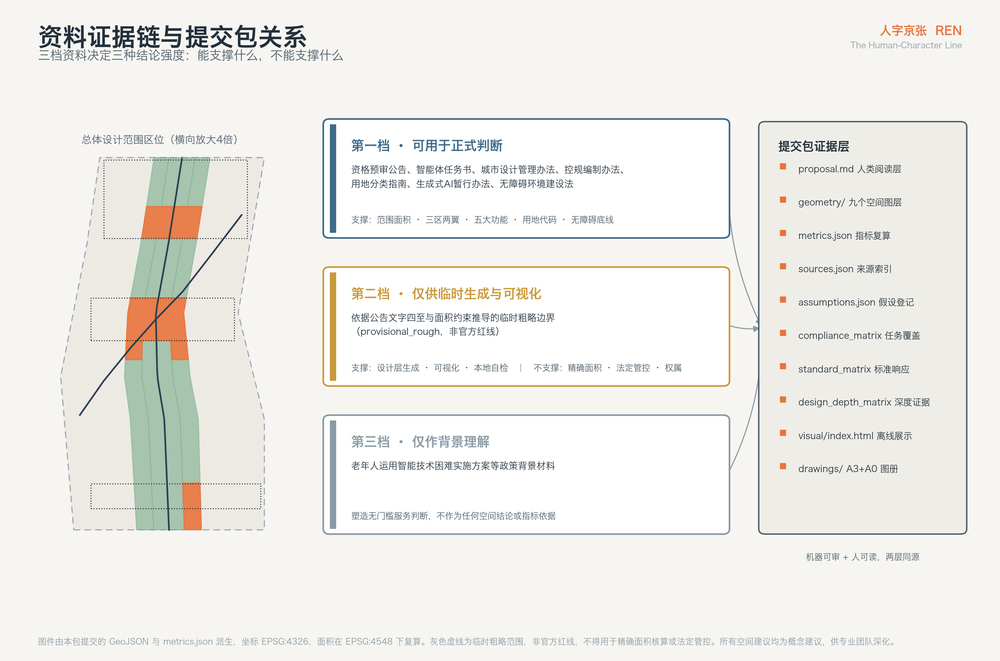
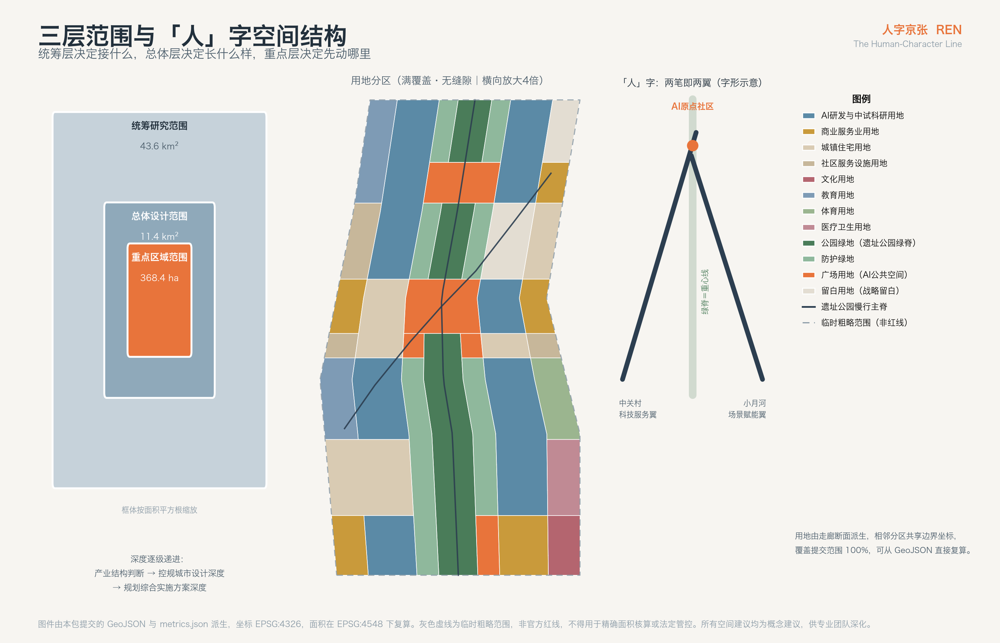
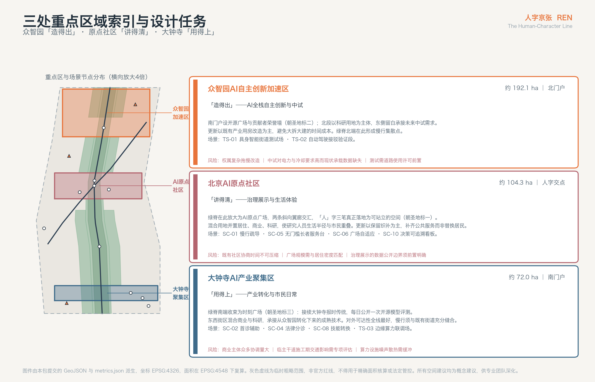
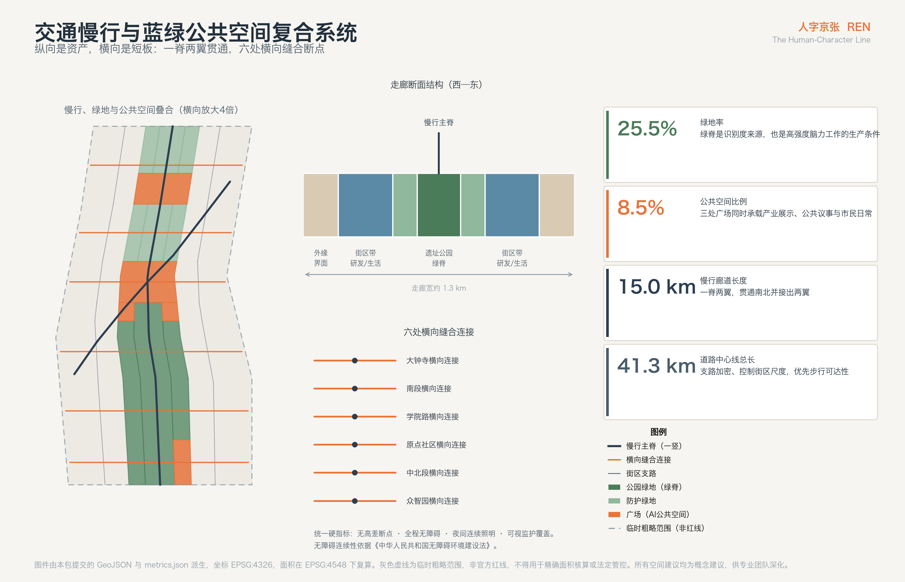
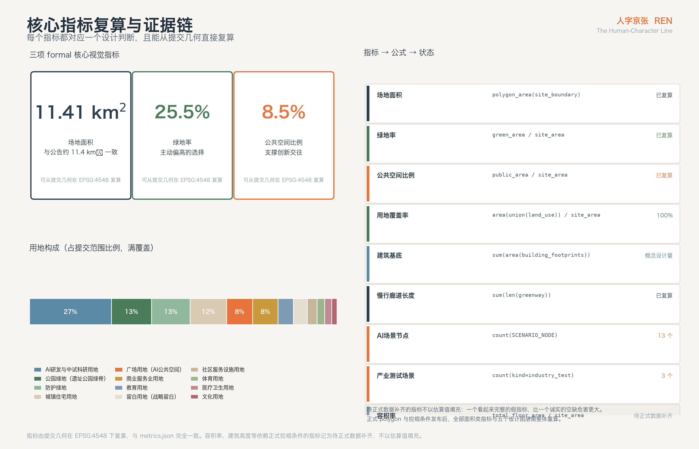

# 人字京张 · 百年京张AI创新带城市设计方案

**REN — The Human-Character Line**

一百多年前，京张铁路在青龙桥遇到了一道过不去的坡。当时的常规解法是绕远或者打长隧道，两条路中国都负担不起。詹天佑的选择是让列车走一个"人"字：进站、换向、再爬升，用一次看似倒退的折返换来了高度。这条线因此成为中国人自主设计干线铁路的第一份答卷。

今天这条走廊要回答的是另一道坡：人工智能已经足够强，但它进入真实城市的路径仍然是绕远的——技术在实验室里成熟，在城市里失效；能力在增长，信任却没有同步增长。

本方案的判断是：这道坡同样不该靠绕远解决，而应该重走一次"人"字。空间上，"人"字的三笔正好对应公告确定的三区两翼——一竖是贯通南北的京张遗址公园绿脊，一撇是向西南衔接中关村的科技服务翼，一捺是向东北衔接小月河的场景赋能翼，三笔交汇于北京AI原点社区。含义上，"人"字是这条带的治理契约：无论算法多强，人始终是这条线的主语。

---

## 设计依据与资料清单

本方案的全部事实基础来自公开或已清权资料，没有使用任何非公开地图、内部表格或未授权数据。资料分三档使用，档位直接决定了它能支撑多强的结论。

第一档是可用于正式判断的公开材料，包括本次征集的资格预审公告、面向全球智能体的开源征集任务书摘录，以及《城市设计管理办法》《城市、镇控制性详细规划编制审批办法》《国土空间调查、规划、用途管制用地用海分类指南》《生成式人工智能服务管理暂行办法》《中华人民共和国无障碍环境建设法》等现行法规与技术规范 [source:OFFICIAL-ANNOUNCEMENT] [source:AGENT-TASKBOOK] [source:SOURCE-REGISTRY]。本方案的范围面积、三区两翼结构、五大功能、六项智能体任务、用地分类代码和无障碍要求都直接锚定在这一档。

第二档是只能用于临时生成和可视化的空间数据。本次征集尚未公开三层范围与三处重点区的正式 polygon，站点包提供的是依据公告文字四至和面积约束推导的临时粗略边界 [source:BOUNDARY-SOURCE] [source:SITE-PACKAGE]。本方案的所有几何都建立在这套临时边界之上，因此必须明确：**它不是官方红线，不能用于精确面积核算、法定管控或权属判断**。方案中所有由它复算出的面积和比例，都属于设计模型输出而非审定指标；正式 polygon 一旦发布，用地、绿地、公共空间、建筑基底和分期五个图层以及全部面积类指标都需要整体重算，重算路径已记录在 `assumptions.json` 中。

第三档是只能作为背景理解的材料，例如《关于切实解决老年人运用智能技术困难实施方案》[source:SOURCE-REGISTRY]。它塑造了本方案对"无门槛服务"的判断，但不作为任何空间结论或指标的直接依据。

除此之外，本方案还引用了若干可公开查证的国际案例（详见"统筹研究范围产业与未来城市研究"一节与文末参考资料）。这些案例用于方法借鉴，不构成对本地条件的事实主张。

需要提前说明的资料缺口有四项：正式控规条件（容积率、建筑高度、建筑密度、退线）缺失，现状建筑与权属数据缺失，道路红线缺失，市政管线承载能力缺失 [source:SITE-PACKAGE]。这四项缺失的直接后果是：本方案可以给出结构性判断和概念设计量，但不能给出法定管控值。所有受影响的指标在 `metrics.json` 中统一记为待正式数据补齐，而不是用估算值伪装成确定结论。

完整的来源清单、指标公式、假设登记、标准响应与设计深度覆盖记录，分别保存在 `sources.json`、`metrics.json`、`assumptions.json`、`standard_matrix.json` 和 `design_depth_matrix.json` 中，供机器复核；正文只在判断发生处标注最相关的证据入口 [standard:MOHURD-URBAN-DESIGN-MEASURES]。

---

## 三层范围工作框架

公告把工作分成三个层次，每层的问题不同，深度也不该相同 [source:OFFICIAL-ANNOUNCEMENT]。

**统筹研究范围约 43.6 平方公里**，北至北五环路，东至京藏高速，南至西直门外大街，西至万泉河路。这一层回答的是产业与区域协同问题：这条带在中关村、上地、清河、学院路这些既有创新资源之间处于什么位置，能承接什么，又不该重复什么。这一层不做用地方案，只做结构判断和资源接口设计。

**总体设计范围约 11.4 平方公里**，以京张遗址公园周边 1—2 公里的城市地区和产业区为走廊 [source:OFFICIAL-ANNOUNCEMENT]。这一层是本方案的主战场，达到控制性详细规划的城市设计深度：空间结构、用地布局、公共空间系统、交通慢行组织、建筑规模概念量、更新对象分类和分期时序都在这一层落地 [depth:overall_spatial_structure] [depth:land_use_layout]。基于提交的边界几何，这一层的复算面积为 11,412,825 平方米，与公告的约 11.4 平方公里一致 [metric:site_area_sqm]。

**重点区域范围约 368.4 公顷**，自北向南包括众智园AI自主创新加速区（约 192.1 公顷）、北京AI原点社区（约 104.3 公顷）和大钟寺AI产业聚集区（约 72.0 公顷）[source:KEY-AREA-SOURCE]。这一层达到规划综合实施方案的城市设计深度，需要给出可操作的项目、界面和实施风险 [depth:three_key_area_detailed_design]。

三层之间的传导关系是明确的：统筹层决定这条带**接什么**，总体层决定它**长什么样**，重点层决定它**先动哪里**。本方案的"一脊两翼"结构就是三层共用的骨架——在统筹层它是资源接口的方向，在总体层它是公共空间和用地的组织轴，在重点层它是三个门户的连接关系。

关于临时边界的限制，这里需要具体说明。提交的范围线是依据公告文字四至和约 11.4 平方公里面积约束推导的粗略走廊，精度标注为 `provisional_rough`，几何角色为临时约束 [data:geometry/site_boundary.geojson#SITE-001]。它可以支撑三件事：临时生成设计层、供人阅读的可视化、以及本地自检。它不能支撑三件事：官方红线、精确面积核算、法定管控依据。正式 polygon 发布后需要重算的内容包括用地分区边界与面积、绿地率、公共空间比例、建筑基底总量、分期范围面积，以及重点区界面的衔接关系。

---

## 统筹研究范围产业与未来城市研究

### 命名体系：为什么是"人"字

这条带需要一个能被记住、能被翻译、能被印在导视和徽章上的名字。本方案提出的命名是**人字京张**，英文 **REN — The Human-Character Line** [source:AGENT-TASKBOOK]。

选择"人"字有三重理由，它们同时成立才使这个名字站得住。

第一重是空间的。青龙桥的"人"字形展线是这条铁路最著名的技术符号，而"人"字的三笔恰好可以承载公告确定的三区两翼结构：一竖是贯通南北的京张遗址公园绿脊，一撇向西南衔接中关村科技服务翼，一捺向东北衔接小月河场景赋能翼 [source:OFFICIAL-ANNOUNCEMENT]。命名不是给结构贴标签，而是结构本身的形状。

第二重是历史的。人字形展线的解法本质上是"以退为进"——用一次方向倒转换取高度。这正是自主创新的真实节奏：不是一路直上，而是在受限条件下找到属于自己的路径。这条带承接的中关村文化同样如此，从电子一条街到今天，走的从来不是一条直线。

第三重是伦理的。任务书明确要求以人的尊严与公共福祉为治理基础，智能体用于增强人的能力而非替代人的判断 [source:AGENT-TASKBOOK]。"人"字把这条要求变成了每天都能看见的东西：这条带上每一个 AI 场景，都要能回答"人在哪一步"。

### Logo 与视觉识别方向

标志的主形是汉字"人"的两笔，但笔画不做书法处理，而是取铁轨断面的几何形——撇与捺各是一条带内凹的轨条，交点位置落一个实心圆点，代表北京AI原点社区。这个圆点同时是这条带的坐标原点：所有导视里程、场景编号和活动编号都从它起算。

配色取三个有来源的颜色：京张灰蓝（钢轨与站台的固有色）、原点橙（铁路信号灯的警示橙，用于所有需要人确认的界面）、遗址绿（遗址公园既有绿化的基调）。这套配色有一条硬规则：**凡是 AI 参与决策的界面，必须出现原点橙**。橙色在这条带上不是装饰，而是"此处有算法、此处需人核"的公共约定。

字体方向为无衬线中英双语字族，中文取方正黑体系的收紧字形以适配窄幅导视，英文取几何无衬线；"REN"三个字母采用与标志相同的轨条切口，保证缩至 16 像素仍可辨识。

应用层面，"人"字将出现在三处实体：遗址公园地面铺装的转折节点、三个朝圣地标的立面标识、以及开发者社区的贡献徽章。徽章设计使贡献者在物理空间中获得可见身份——这是把开源协作的荣誉机制搬进城市空间的具体做法。

以上命名、标志、配色与应用均为概念建议与参考方案，供专业团队深化，不构成已确定的品牌决策 [standard:PROJECT-AGENT-OPEN-CALL-TASKBOOK]。

### 三大定位与五大功能的空间落位

公告确定的三大定位是百年京张文化带、都市AI生活体验带、AI融合创新带；五大功能是 AI 全栈自主创新体系、世界级 AI 创新生态、AI+场景赋能新范式、智能化 AI 活力城市、AI 治理全球话语权 [source:OFFICIAL-ANNOUNCEMENT] [source:AGENT-TASKBOOK]。

本方案不把它们并列陈述，而是把它们分配到"人"字的不同笔画上，使每条定位都有确定的空间承担者：

**一竖（京张遗址公园绿脊）承担百年京张文化带**。它是唯一贯通全线的连续要素，长度约 9.7 公里，也是唯一同时触及三个重点区的公共空间。文化叙事、遗产展示、慢行连通和日常生活体验都挂在这条脊上 [data:geometry/green_space.geojson#GRN-001]。

**一撇（中关村科技服务翼）承担 AI 全栈自主创新体系与世界级创新生态**。向西南方向，这条带对接的是中关村既有的科研机构、投融资服务、法律与知识产权服务资源。这一翼的空间任务不是再造一个中关村，而是把服务资源引到这条带上来——因此它的落地形式是廊道和接口，不是园区 [data:geometry/roads.geojson#ROAD-002]。

**一捺（小月河场景赋能翼）承担 AI+场景赋能新范式与智能化活力城市**。向东北方向，这一翼对接的是可开放的真实城市场景：水系、社区、道路、市政设施。产业测试验证场景主要沿这一翼布置 [data:geometry/roads.geojson#ROAD-003]。

**交点（北京AI原点社区）承担 AI 治理全球话语权**。治理不能悬在空中，它需要一个具体的、可到达的、可被围观的地方。原点社区是三笔交汇处，也是本方案设定的治理展示与公共议事的物理位置。

三区之间的协同回路由此形成：众智园负责"造得出"（自主创新与中试），原点社区负责"讲得清"（治理规则与公共沟通），大钟寺负责"用得上"（产业转化与市民日常）。三者通过绿脊连成一条可步行、可骑行、可展示的连续线路，而不是三个各自为政的园区 [metric:greenway_length_m]。

### 五个可借鉴的全球案例

以下案例均来自公开可查证的城市更新与创新区实践，用于方法借鉴，不构成对本地条件的事实主张。

**伦敦国王十字与知识片区（King's Cross / Knowledge Quarter）**是与本项目最接近的类比：一片铁路棕地，通过保留货运建筑、贯通公共空间、引入研究机构与科技企业，在二十余年里转变为知识经济集聚区。可转化的经验有两条：其一，遗产建筑的保留不是负担而是识别度来源；其二，公共空间先行——广场和步行网络在企业入驻之前就完成，是后续集聚的前提。这直接支持了本方案把绿脊和三个广场放进近期分期的判断 [depth:phasing_implementation]。

**新加坡纬壹科技城（one-north）**展示了政府主导的科研城区如何维持长期连续性：统一的空间框架下允许分期分块开发，同时以国家级科研机构作为不可移动的锚点。可转化的经验是"锚点先定、弹性留够"，这支持了本方案设置留白用地的做法——把不确定的未来场景留在空间里，而不是提前填满 [data:geometry/land_use.geojson#LU-039]。

**蒙特利尔 Mila 与创新街区（Quartier de l'innovation）**的特点是研究机构深度嵌入城市街区而非独立园区，研究人员的日常生活半径与市民重叠。可转化的经验是"不要围墙"，这支持了本方案在原点社区采用混合用地而非纯研发用地的布局。

**慕尼黑城市实验室（Munich Urban Colab）**把城市管理部门、企业和创业团队放进同一栋建筑，用真实的城市问题驱动创新项目。可转化的经验是"问题清单公开化"——城市把自己的难题公开挂出来，让技术团队认领。本方案的场景开放运营机制直接借鉴了这一点。

**东京柏之叶智慧城市（Kashiwa-no-ha）**的经验偏向运营：以数据驱动的城市运营平台连接能源、健康和交通服务，且长期由稳定的运营主体持有。可转化的经验是"运营主体要在规划阶段就明确"，这支持了本方案在更新项目清单中同时列出实施主体建议的做法。

需要同时指出这些案例的不可直接移植之处：它们的土地权属结构、财政机制和审批路径与国内不同，本方案只借鉴其空间与运营方法，不照搬制度安排 [standard:MOHURD-URBAN-DESIGN-MEASURES]。

---

## 总体设计范围城市更新与控规深度城市设计

### 空间结构：一脊、两翼、三区、六段

总体设计范围是一条南北长约 9.7 公里、东西宽约 1.3 公里的狭长走廊。这个形状本身决定了两件事：纵向的连续性是这条带最大的资产，而横向的贯通是它最大的短板。京张铁路遗址在历史上把两侧城市切开，遗址公园建成后纵向通了，横向的断裂却仍然存在——这是本方案在总体层要解决的核心空间问题 [depth:existing_conditions_diagnosis]。

结构由此确定为"一脊两翼、六段织补"。

**一脊**是京张遗址公园绿脊，沿走廊中轴贯通南北，是全线唯一连续的公共空间骨架，也是三个重点区的共同前场 [data:geometry/green_space.geojson#GRN-001]。绿脊不是一条等宽绿带：它在三个重点区放大为广场，在段与段之间收窄为林荫慢行道，用宽窄变化提示使用者"到了哪一段"。

**两翼**是两条斜向廊道，从原点社区分别指向西南和东北，把纵向的脊接到区域资源上。西南翼衔接中关村科技服务资源，东北翼衔接小月河蓝绿与可开放场景。两翼在总体设计范围内表现为斜向的公共廊道，超出范围的部分属于统筹研究层的接口方向，本方案不做落地设计 [data:geometry/roads.geojson#ROAD-002]。

**六段**是把 9.7 公里走廊按功能切分的操作单元，自南向北为：大钟寺产业聚集段、南部城市更新过渡段、学院路科教衔接段、原点社区段（含南过渡）、中北部产业转换段、众智园加速区段（含南门户）。分段的意义在于让更新可以分块推进，而不必等待全线条件齐备 [data:geometry/phasing.geojson#PHASE-001]。

横向织补由六条跨脊连接完成，分别落在大钟寺、南段、学院路、原点社区、中北段和众智园 [data:geometry/roads.geojson#ROAD-018]。每条连接的设计要求是同一条：连续、无高差断点、全程无障碍，且在夜间有照明和可视监护。这条要求直接来自《中华人民共和国无障碍环境建设法》对公共空间连续性的规定 [source:SOURCE-REGISTRY]。

### 用地布局逻辑

用地方案由走廊断面派生，横向分为七带：西外缘、西街区、西缘绿带、中央脊、东缘绿带、东街区、东外缘。每一段的七带按该段的功能主题赋予不同用地性质，相邻分区共享边界坐标，全范围无缝隙无重叠覆盖 [metric:land_use_coverage_ratio] [data:geometry/land_use.geojson#LU-001]。

用地结构的三条判断如下。

**产业空间集中在两侧街区带，而不是脊上。** 科研用地（0802）占据西街区与东街区的主体，直接面向绿脊布置界面 [source:SITE-PACKAGE]。这样做的原因是：把产业放在脊上会私有化公共空间，把产业放得太远则失去共享前场的价值；沿脊布置界面是两者之间的解。

**生活功能集中在原点社区段和南部过渡段。** 住宅用地（0701）与社区服务设施用地（0702）主要落在这两段，使 AI 人才社区与既有居住区连片而非孤岛。原点社区段采用居住、商业、科研混合布局，目的是让研究人员的生活半径与市民重叠——这是蒙特利尔案例中最值得借鉴的一点。

**留白用地是结构的一部分，不是剩余。** 中北部转换段与众智园段东侧设置留白用地（16），总面积由几何复算得出 [data:geometry/land_use.geojson#LU-039]。留白的理由很直接：AI 产业形态三到五年就会变化一轮，现在填满的空间大概率填错。把不确定性留在空间里，比留在纸面上有用。

### 城市更新总体框架

这条走廊的更新对象不是空地，而是既有城市。本方案把更新分为四类：保留、改造、拆除、新建。但必须明确一个边界——**在缺少现状建筑普查、权属数据和正式控规条件的情况下，本方案不对任何具体地块作出拆改留结论** [source:SITE-PACKAGE]。这里给出的是分类原则和判断顺序，供专业团队在数据到位后落地。

判断顺序是：先判遗产与结构价值，再判使用状况，最后判更新收益。凡与京张铁路遗产直接相关的构筑物、站房、路基和附属设施，一律进入保留序列并优先考虑功能激活；产业用房中结构安全、层高适配的优先改造为研发和中试空间，而非拆除重建；确需拆除的应限于安全隐患建筑和严重不适配的临时建设；新建集中在留白用地和明确的更新项目地块内 [depth:retain_renovate_demolish]。

### 建筑规模与开发强度

基于提交的概念建筑基底，全范围建筑基底总量复算为 2,225,453 平方米，对应概念建筑密度约 19.5% [metric:building_footprint_area_sqm] [metric:building_density_ratio]。

必须明确这两个数的性质：它们是由设计几何复算出的**概念设计量**，用于校核空间供给的量级是否合理，不是法定建筑密度控制值，也不代表任何审定建设规模。容积率、建筑高度、建筑密度和退线的正式控制值依赖尚未公开的控规条件，本方案统一记为待正式数据补齐 [metric:floor_area_ratio] [depth:development_intensity_controls]。

风貌方向可以先给判断：走廊两侧建筑应形成"沿脊低、向外高"的梯度，使绿脊获得充足日照和天空视野；沿脊界面强调连续的公共底层，避免出现连续封闭墙面；屋顶第五立面纳入设计控制，因为这条走廊将长期处于航拍与城市展示的视野中 [depth:height_massing_character]。具体高度分区需在控规条件明确后确定。

---

## 重点区域详细设计

三个重点区在"人"字结构中承担不同角色：众智园"造得出"，原点社区"讲得清"，大钟寺"用得上"。以下分别给出定位、空间结构、建筑更新、交通慢行、公共空间、AI 场景和实施风险 [depth:three_key_area_detailed_design] [data:geometry/key_areas.geojson#PROV-KEY-001]。

由于三个重点区的 polygon 目前是临时粗略范围，以下结论均为方向性设计，界面位置、地块划分和项目边界须在正式范围发布后复核 [source:KEY-AREA-SOURCE]。

### 众智园AI自主创新加速区（约 192.1 公顷，北门户）

**定位**是全线的"造得出"一端：面向 AI 全栈自主创新，承担算法、芯片、具身智能等方向的研发与中试功能，是三区中产业属性最强、也最需要大尺度试验空间的一段。

**空间结构**采用"南门户 + 北研发"的两段式。南门户段设众智园开源广场，作为进入这条带的北端仪式性入口和第一个朝圣地标；北段以科研用地为主体，东侧保留留白用地承接未来不确定的中试需求 [data:geometry/public_space.geojson#PUB-002]。

**建筑更新**方向是以改造为主：这一段既有产业用房比例较高，结构条件适配研发功能的应优先改造，避免大拆大建带来的时间成本。新建集中在留白用地和门户节点。

**交通慢行**的关键任务是把绿脊北端接住。绿脊在此与众智园横向连接交汇，形成北端的慢行集散点；园区内部道路以支路网加密为主，控制单个街区尺度，使步行可达性覆盖研发建筑主要出入口 [data:geometry/roads.geojson#ROAD-023]。

**公共空间**以开源广场为核心。广场的功能设定不是集会，而是展示：这里设置开源贡献者荣誉墙，把代码仓库中的贡献记录实体化为可触摸的公共装置，使抽象的开源协作在城市空间中获得可见形式。

**AI 场景**以产业测试验证为主，具体见场景卡 TS-01（具身智能街道测试场）和 TS-02（自动驾驶接驳验证段）。

**实施风险**有三项：现状产业用房权属复杂可能拖慢改造进度；中试功能对市政承载（尤其是电力与冷却）要求高，而现状承载能力数据缺失；测试场景涉及道路使用许可，需要交管与属地的前置协调。三项均需专业团队在正式数据到位后核实。

### 北京AI原点社区（约 104.3 公顷，人字交点）

**定位**是全线的"讲得清"一端，也是整条带的坐标原点。这里承担 AI 治理展示、公共议事、生活体验和国际交往功能，是三区中唯一以"人"而非以"产业"为主语的一段。

**空间结构**是本方案最关键的一处设计：绿脊在此不再是绿带，而是放大成 AI 原点广场，两条斜向翼廊在广场处交汇，"人"字的三笔在这里真正落地为可以站上去的空间 [data:geometry/public_space.geojson#PUB-001]。广场四周布置混合用地——居住、商业、科研并置，使这里在工作日与周末都有人。

**建筑更新**以保留和织补为主。这一段既有居住区比例高，更新的目标不是替换居民，而是把公共服务补齐：社区服务设施用地沿广场周边布置，使新增服务同时覆盖新来的研究人员和原住居民。

**交通慢行**的关键任务是消除断点。原点社区横向连接是六条跨脊连接中等级最高的一条，要求全程无障碍、无高差、夜间照明连续，并直接接入广场 [data:geometry/roads.geojson#ROAD-021]。

**公共空间**由 AI 原点广场统领。广场上设置本方案的第一个朝圣地标——"原点碑"：一块记录这条带从中关村电子一条街到今天 AI 产业连续谱系的公共装置，同时是所有导视里程和场景编号的起算点。

**AI 场景**以公共服务和治理为主：SC-01 慢行断点智能疏导、SC-05 无门槛长者服务台、SC-06 广场声环境与人流自适应、SC-10 公共决策可追溯看板均落在这一段。

**实施风险**有三项：既有社区更新涉及居民协商，时间不可压缩；广场规模需与周边居住密度匹配，过大则空旷；治理展示功能涉及公开数据的边界，需要在场景设计阶段就明确哪些数据可以公开、哪些必须脱敏。

### 大钟寺AI产业聚集区（约 72.0 公顷，南门户）

**定位**是全线的"用得上"一端：面向市民日常和产业转化，是三区中与既有城市生活联系最紧密、也最容易在近期见效的一段。

**空间结构**以"时刻广场 + 转化街区"组织。绿脊南端在此收束为大钟寺时刻广场，作为南端门户和第三个朝圣地标；东西两侧街区以商业服务业用地和科研用地混合布置，承接从众智园转化下来的成熟技术 [data:geometry/land_use.geojson#LU-004]。

**建筑更新**方向是改造为主、局部新建。这一段商业与产业混合，既有建筑改造潜力大；新建应严格限于门户节点和确有需求的转化空间。

**交通慢行**的关键任务是接住外部人流。这一段临近西直门外大街，是全线对外可达性最好的一端，慢行系统需要与既有城市街道网络充分缝合，而不是只在带内自循环 [data:geometry/roads.geojson#ROAD-017]。

**公共空间**由时刻广场统领。这里是本方案文化叙事最集中的一处：大钟寺的历史功能是报时——为整座城市提供一个公共的、共享的时间基准。本方案把这个传统接续为 AI 时代的"公共时刻"，具体设计见"蓝绿空间、公共空间与城市风貌"一节。

**AI 场景**以民生服务和边缘算力为主：SC-02 社区首诊辅助、SC-04 法律咨询前置分诊、SC-08 技能转换导航，以及 TS-03 边缘算力与分布式能源联调场。

**实施风险**有三项：商业主体众多，改造需协调的利益相关方数量大；临近主干道，施工期交通影响需专项评估；边缘算力设施的选址涉及噪声与散热，需与居住功能保持缓冲。

---

## AI 创新生态、人才画像与 AI+ 场景

### 五类用户画像

创新区的常见失败模式是只为一种人设计——年轻、高学历、熟练使用智能设备的从业者。本方案把服务对象拆成五类，其中三类不是 AI 从业者。这不是政治正确的配平，而是因为一条真实的城市走廊本来就住着这些人，如果设计只服务其中一类，另外四类就会被这条带排除出去。

**画像一 · 归国研究员（约 35 岁，携配偶与学龄子女）。** 关注点依次是子女教育、配偶就业、住房和通勤时间，工作强度高但对城市探索意愿低。空间需求集中在原点社区段：教育设施步行可达、住房与研发空间距离在 15 分钟慢行圈内。这类人群决定这条带能否留住高端人力，但他们的决定因素往往与产业政策无关。

**画像二 · 初创团队工程师（约 27 岁，合租）。** 关注点是租金、算力可获得性、同行密度和夜间活动。空间需求是低成本工位、可共享的算力接口、以及非正式交流场所。这类人群对空间的敏感度最高，也最容易因为成本上升而迁出。

**画像三 · 原住社区长者（约 72 岁，不使用智能手机）。** 关注点是就医、买菜、社区人际关系和不被新事物排除。空间需求是无门槛的服务界面——不需要下载应用、不需要注册账号、可以对着真人说话。这一类是本方案设定的**无障碍底线**：任何一个 AI 场景，如果不能被这类用户使用，就必须提供等效的人工通道 [source:SOURCE-REGISTRY]。

**画像四 · 双职工家庭学龄儿童家长（约 40 岁）。** 关注点是接送时间、课后安全和公共空间可用性。空间需求是安全连续的步行路径、有监护视线的活动场地、以及能停留的公共空间。这类人群的使用高峰与研发人群错开，正好维持公共空间的全时活力。

**画像五 · 城市运维工人与通勤蓝领（约 45 岁）。** 关注点是作业安全、通勤成本和休息空间。空间需求是可休息的公共节点、清晰的作业动线，以及在 AI 参与调度时对自身工作安排的知情权。这一类通常在创新区规划中被完全忽略，但他们是这条带日常运行的实际承担者。

**扩展画像 · 国际访客与开源贡献者。** 短期停留，关注点是可理解性与可参与性。空间需求是双语导视、可预约的开放场景、以及能带走的参与凭证——这正是开发者徽章机制的服务对象。

### AI+ 场景卡

以下十三张场景卡中，前十张为城市服务场景，后三张为产业测试验证场景。每张卡都给出空间位置、服务对象、数据来源、隐私边界、人工复核方式、运营主体建议和主要风险。

所有场景卡均为概念建议，其运行状态统一记为"尚未获得许可、尚未运行"，不构成任何已批准的建设或运营安排 [standard:PROJECT-AGENT-OPEN-CALL-TASKBOOK]。

**SC-01 慢行断点智能疏导。** 位置：原点社区横向连接及六处跨脊连接节点。对象：全部步行与骑行使用者，重点是画像三、四。数据：公共空间人流密度与通行时长的匿名统计，不采集人脸与身份。隐私边界：仅存聚合计数，原始视频不落盘。人工复核：疏导建议只作提示，不做强制引导；异常情况转人工值守。主体建议：属地公共空间运营单位。风险：夜间照明不足会使疏导失效，需与照明设计同步 [data:geometry/roads.geojson#ROAD-021]。

**SC-02 社区首诊辅助与人工复核。** 位置：大钟寺段医疗卫生用地。对象：画像三、五。数据：使用者自述症状，不接入既有病历。隐私边界：单次会话不留存，不与身份关联。人工复核：**所有输出必须由具备资质的医务人员确认后方可作为建议**，系统不得独立给出诊断结论。主体建议：属地医疗机构。风险：责任边界必须在服务协议中写明，否则不应上线。

**SC-03 青少年 AI 通识开放课。** 位置：学院路科教衔接段教育用地。对象：画像四的子女、周边学校学生。数据：课程互动记录，不采集成绩与个人评价。隐私边界：未成年人数据单独脱敏，监护人可查可删。人工复核：授课教师主导，AI 仅作教学辅助。主体建议：属地教育部门与高校联合。风险：需避免变相学科培训。

**SC-04 法律咨询前置分诊。** 位置：大钟寺段公共服务设施。对象：画像三、五、二。数据：咨询问题文本。隐私边界：不采集当事人身份与案情材料，会话不留存。人工复核：仅提供问题分类与办事指引，**不提供法律意见**；涉及具体案件一律转人工。主体建议：属地公共法律服务机构。风险：使用者可能将分诊结果误解为法律意见，界面需持续强提示。

**SC-05 无门槛长者服务台。** 位置：原点社区广场与各段社区服务设施。对象：画像三。数据：语音请求，本地处理优先。隐私边界：不注册、不登录、不建档。人工复核：现场配备人工坐席，随时可切换；用户随时可要求"找个人来"。主体建议：属地街道与社区服务中心。风险：这是本方案的无障碍底线场景，若无法提供等效人工通道则整个场景不应建设 [source:SOURCE-REGISTRY]。

**SC-06 广场声环境与人流自适应。** 位置：AI 原点广场、开源广场、时刻广场。对象：全部使用者。数据：声压级与人流密度的聚合统计。隐私边界：不识别个体，不录音存储。人工复核：设备调节参数变更需人工确认；深夜时段自动降级为静默模式。主体建议：广场运营单位。风险：过度自动化会使公共空间失去自发性，参数区间应保守 [data:geometry/public_space.geojson#PUB-001]。

**SC-07 开源模型公共评测台。** 位置：众智园开源广场与原点社区。对象：画像二、六。数据：公开模型与公开评测集，全部可复现。隐私边界：不涉及个人数据。人工复核：评测方法与结果全部公开可质疑，争议由公开流程处理。主体建议：开发者社区与第三方评测机构。风险：评测榜单可能被滥用为商业背书，需在规则中限制商业引用方式。

**SC-08 技能转换与再就业导航。** 位置：大钟寺段与南部过渡段社区服务设施。对象：画像五、三。数据：使用者自述技能与意向，不接入就业与征信记录。隐私边界：会话不与身份绑定。人工复核：所有推荐由就业服务人员复核后发出。主体建议：属地人力资源服务机构。风险：AI 推荐可能强化既有职业偏见，需定期做偏差审查。

**SC-09 京张口述史多语种复原。** 位置：绿脊沿线遗产节点与时刻广场。对象：全部使用者，重点是画像六。数据：**已获授权**的口述史录音与公开史料。隐私边界：受访者授权范围内使用，可随时撤回。人工复核：史实性内容须经专业机构核校后发布，AI 生成部分明确标注。主体建议：属地文化部门与档案机构。风险：AI 复原内容与史实的边界必须在展示界面上可见，不得使观众误认为原始记录。

**SC-10 公共决策可追溯看板。** 位置：AI 原点广场。对象：全部市民。数据：这条带上各 AI 场景的用途、数据范围、责任主体、人工复核方式和退出机制。隐私边界：只公开机制信息，不公开个案数据。人工复核：看板内容变更须经运营主体确认并留痕。主体建议：属地政府与第三方监督机构。风险：若看板内容长期不更新则丧失公信力，需要明确更新责任 [standard:PROJECT-AGENT-OPEN-CALL-TASKBOOK]。

**TS-01 具身智能街道测试场（产业测试验证）。** 位置：众智园段内部支路与开源广场周边。对象：画像二及机器人研发企业。数据：测试车辆与机器人的运行日志，测试区域内的公共环境数据。隐私边界：测试区边界物理可见，公众可选择绕行；不采集区域外数据。人工复核：全程有人监护，具备随时物理接管能力。主体建议：园区运营方与属地监管部门联合。风险：需要道路使用许可与安全评估前置，未取得许可不得开展 [data:geometry/key_areas.geojson#PROV-KEY-001]。

**TS-02 自动驾驶接驳与混行验证段（产业测试验证）。** 位置：原点社区至众智园的纵向支路段。对象：研发企业与通勤人群。数据：车辆运行数据与混行冲突事件记录。隐私边界：不采集乘客身份，车内影像不外传。人工复核：安全员在车，接管权限高于系统。主体建议：企业与交管部门联合。风险：混行段涉及公共安全，必须逐级申请许可并设置降级方案。

**TS-03 边缘算力与分布式能源联调场（产业测试验证）。** 位置：大钟寺段产业街区。对象：算力与能源相关企业。数据：能耗、负载与散热运行数据。隐私边界：不涉及个人数据。人工复核：负载调度策略变更须人工审批。主体建议：能源企业与园区运营方。风险：噪声与散热对邻近居住功能有影响，需要缓冲距离与专项评估 [depth:municipal_new_infrastructure]。

### 生态机制：把场景变成可持续的供给

十三张场景卡如果只是单点建设，三年后大概率会有一半停摆。本方案提出三条机制保证它们持续运行。

**问题清单公开化。** 借鉴慕尼黑城市实验室的做法，由属地把真实的城市管理难题定期公开挂出，让技术团队认领，而不是由技术方自行寻找应用场景。这使场景建设从"技术找问题"转为"问题找技术"。

**统一的人工复核标准。** 所有场景遵循同一条规则：涉及健康、法律、行政、支付、安全的结果，必须由具备权限的人确认。这条规则不是逐场景协商的，而是这条带的准入条件。

**退出机制前置。** 每个场景在上线前必须写明失效条件和退出路径——什么情况下停用、由谁决定、停用后如何回退到人工服务。没有退出机制的场景不予上线。这一条直接对应 SC-10 看板的公开内容。

---

## 用地、建筑规模与拆改留方案

### 用地构成与产业空间供给

用地方案按《国土空间调查、规划、用途管制用地用海分类指南》的分类体系组织，覆盖总体设计范围全部 11,412,825 平方米，无缝隙无重叠 [standard:MNR-LAND-USE-CLASSIFICATION-GUIDE] [metric:land_use_coverage_ratio]。

主要用地类型的配置逻辑如下。科研用地（0802）承担 AI 研发与中试，集中在两侧街区带并沿绿脊布置界面，是这条带的产业主体。商业服务业用地（05）布置在两端门户和原点社区，承接智能原生新业态——这类业态的特点是线上能力与线下场所深度绑定，需要临街可达的实体空间。城镇住宅用地（0701）与社区服务设施用地（0702）集中在原点社区段和南部过渡段，构成 AI 人才社区与既有居住区的连片区域。公园绿地（1401）与防护绿地（1402）构成绿脊与沿线绿地系统。广场用地（1403）承载三处朝圣地标与公共活动。留白用地（16）设在中北部转换段与众智园东侧 [data:geometry/land_use.geojson#LU-039]。

产业空间供给的量级判断：科研用地与商业服务业用地合计构成这条带的产业承载主体，配合概念建筑基底 2,225,453 平方米的量级，可以支撑一个具备完整研发—中试—转化链条的产业规模 [metric:building_footprint_area_sqm]。这个判断是量级校核，不是规模承诺。

### 建筑规模与强度的边界

必须重申一条硬边界：**任务书禁止把容积率、建筑高度、开发强度或具体拆改留写成法定规划、审批或工程实施结论** [source:AGENT-TASKBOOK]。在正式控规条件、现状建筑普查、权属数据和工程条件到位之前，本方案的做法是：

可以给出的是——由本包几何复算的概念设计量（建筑基底总量、概念建筑密度约 19.5%），并明确标注为低置信度设计量 [metric:building_density_ratio]；空间形态的方向性判断（沿脊低、向外高的梯度，连续的公共底层，第五立面纳入控制）。

不能给出的是——容积率、建筑高度、建筑密度、退线的具体控制值。这四项在 `metrics.json` 中统一记为待正式数据补齐，并写明所需数据来源与复算路径 [metric:floor_area_ratio] [depth:development_intensity_controls]。

### 拆改留分类原则

分类的判断顺序是三步，顺序本身就是结论的一部分 [depth:retain_renovate_demolish]。

**第一步判遗产与结构价值。** 与京张铁路遗产直接相关的站房、路基、桥涵、道岔和附属设施，一律进入保留序列，优先考虑功能激活而非静态保护——一个只能看不能用的遗产节点，在一条日常使用的走廊上会迅速变成盲区。

**第二步判使用状况。** 既有产业用房中结构安全、层高与柱网适配研发中试功能的，优先改造。改造相对新建的优势不只是成本，更是时间：一条需要在近期见效的走廊承受不起全面重建的周期。

**第三步判更新收益。** 确需拆除的应限于经鉴定的安全隐患建筑和严重不适配的临时建设。新建原则上集中在留白用地和已明确的更新项目地块内。

以上为分类原则，不针对任何具体地块。地块级结论必须在现状普查、权属核查和正式控规条件齐备后，由具备资质的专业团队作出。

---

## 交通、轨道、市政与公共服务设施

### 慢行系统与断点消除

这条走廊的交通核心问题不是机动车，而是横向断裂。铁路在历史上把两侧城市切开，遗址公园建成后纵向连通了，但横向穿越仍然依赖有限的几处过街设施 [depth:traffic_rail_slow_parking]。

本方案的慢行系统由三部分构成：一条纵向主脊（沿遗址公园全线贯通，长度约 9.7 公里）、两条斜向翼廊（自原点社区分别向西南和东北）、六条横向跨脊连接。慢行主脊与翼廊合计长度由几何复算得出 [metric:greenway_length_m] [data:geometry/roads.geojson#ROAD-001]。

六条横向连接的设计要求统一为四条硬指标：全程无高差断点、全程无障碍、夜间连续照明、可视监护覆盖。这四条不是设计愿望，其中无障碍连续性是《中华人民共和国无障碍环境建设法》的明确要求 [source:SOURCE-REGISTRY]。

### 道路网络与轨道衔接

道路系统采用"支路加密、控制街区尺度"的策略，在两侧街区带布置纵向支路，配合横向连接形成网格 [metric:road_network_length_m]。这样做的目的是提高步行可达性，而不是提高机动车通行能力——在一条以公共空间为核心资产的走廊上，后者会直接削弱前者。

轨道衔接方面，这条走廊南端临近西直门外大街方向的既有轨道资源，北端接近北五环。本方案的判断是：**轨道站点与绿脊的接驳质量比站点数量更重要**。具体站点位置、出入口设置和一体化设计需要以正式的轨道规划条件为依据，本方案不作站点级结论——现有公开资料不足以支撑这一深度的判断。

停车与非机动车组织的原则是：机动车停车向街区内部和地下集中，避免占用沿脊界面；非机动车停放在每个横向连接节点和广场边缘设置集中区域，防止无序停放侵占慢行空间。

### 市政与新型基础设施

传统市政方面，现状管线承载能力数据缺失，本方案不对管网容量作出结论 [source:SITE-PACKAGE]。可以给出的判断是：中试与算力功能对电力和冷却的需求显著高于常规办公，众智园段与大钟寺段的市政承载能力必须在项目实施前专项核算，否则会成为产业落地的隐性瓶颈。

新型基础设施方面，本方案提出三项概念建议 [depth:municipal_new_infrastructure]。**端侧算力分布式布置**：把算力节点分散布置在三个重点区而非集中于一处，降低单点散热与供电压力，同时使算力资源在空间上可被就近使用。**分布式能源与算力联调**：在大钟寺段设置联调试验场（TS-03），把能源与算力的协同作为一个可验证的产业场景，而不只是配套设施。**公共数据接口的物理载体**：在三处广场设置公共数据展示与接入点，使数据的公共属性获得可见的空间形式。

以上均为概念建议，具体技术方案、容量和选址须由专业团队在正式条件下深化。

### 公共服务设施

公共服务的配置原则是"补齐而非替换"。原点社区段和南部过渡段的更新目标不是替换居民，而是把教育、医疗、养老和社区服务补齐到能同时覆盖新增人口与原住居民的水平。学院路科教衔接段布置教育用地，衔接既有科教资源；大钟寺段布置医疗卫生用地，承载 SC-02 场景；各段社区服务设施用地承载 SC-05 无门槛服务台 [data:geometry/land_use.geojson#LU-012]。

---

## 蓝绿空间、公共空间与城市风貌

### 京张遗址公园活力带

绿脊是这条带最重要的公共资产，复算绿地面积 2,915,608 平方米，绿地率 25.5% [metric:green_ratio] [metric:green_space_area_sqm]。这个比例对一条需要承载高强度研发功能的走廊来说是偏高的选择，理由有两条：一是遗址公园本身是这条带的识别度来源，弱化它等于放弃最独特的资产；二是高强度脑力工作对可达绿地的需求高于常规办公，绿地在这里是生产条件而非景观装饰。

绿脊的设计原则是"宽窄有节奏"：在三个重点区放大为广场，在段与段之间收窄为林荫慢行道。这种变化不是形式手法，而是让使用者通过空间宽窄感知自己所处的段落，在一条 9.7 公里的线性空间里建立方位感。

蓝绿系统方面，东北翼衔接小月河水系。水系的具体岸线、水质和生态条件需要以正式水务资料为依据，本方案只作方向性判断：东北翼的场景赋能功能应与水系的公共可达性同步推进，否则这一翼会退化为一条单纯的交通廊道 [depth:blue_green_public_space]。

### 三处 AI 朝圣地标

公共空间复算面积 964,759 平方米，公共空间比例 8.5%，其中三处为朝圣地标级节点 [metric:public_space_ratio] [metric:pilgrimage_landmark_count]。

**地标一 · AI 原点碑（原点广场，人字交点）。** 这是三笔交汇的位置，也是整条带的坐标原点。碑体记录的不是宣言，而是一条连续的谱系：从中关村电子一条街，到互联网，到今天的 AI 产业——用可查证的时间节点呈现这条带的产业连续性。所有导视里程、场景编号和活动编号都从这块碑起算，使它成为功能性的原点而非纪念性的摆设 [data:geometry/public_space.geojson#PUB-001]。

**地标二 · 开源贡献者荣誉墙（开源广场，北门户）。** 众智园段的这面墙把代码仓库中的贡献记录实体化：贡献者的标识、贡献的项目、合入的时间，以可更新的物理形式呈现在城市空间中。这是本方案对"贡献可记忆"这一原则的空间回应——开源协作的荣誉长期只存在于线上，这面墙让它获得一个可以带家人来看的地方 [data:geometry/public_space.geojson#PUB-002]。

**地标三 · 公共时刻装置（时刻广场，南门户）。** 大钟寺的历史功能是报时：为整座城市提供一个公共的、共享的时间基准。本方案把这个传统接续为 AI 时代的"公共时刻"——每日固定时刻，在广场上公开进行一次开源模型的公共评测，结果实时呈现在装置上，方法与数据全部公开可复现（对应 SC-07）。报时的本质是把一件本可私有的事情变成公共的，这与开源评测的意义完全一致 [data:geometry/public_space.geojson#PUB-003]。

三处地标均为概念建议与参考方案，不构成已批准的建设项目；所有涉及的标识、字体、图像、人物与企业标识须在深化阶段完成清权 [standard:PROJECT-AGENT-OPEN-CALL-TASKBOOK]。

### 文化叙事：三种文化的同一句话

这条带上有三种文化需要被接到一起：百年京张的铁路文化、中关村的创新文化、以及正在形成的 AI 新文化。它们看起来分属不同时代，但共享同一句话——**受限条件下的自主选择**。

京张铁路的意义不在于它有多长，而在于它是中国人在技术和资金都受限的条件下自己设计建成的，人字形展线就是这种受限选择的直接产物。中关村的意义同样不在规模，而在于它从电子一条街开始，在没有先例的条件下走出了自己的路径。今天的 AI 产业面对的是同样的处境：全栈自主创新不是口号，而是在受限条件下必须做出的选择。

"人"字把这三段历史缝在一起：它是展线的形状，是自主的隐喻，也是治理的承诺。文化叙事的落地方式不是建一座博物馆，而是让这条线本身可读——绿脊沿线的遗产节点、原点碑的产业谱系、荣誉墙的贡献记录、时刻装置的公开评测，四者共同构成一条可以走完的叙事，而不是一段需要被讲解的文字。

### 城市风貌

风貌控制的方向性判断有四条：沿脊低、向外高，保证绿脊的日照与天空视野；沿脊界面保持连续的公共底层，禁止长段封闭墙面；第五立面纳入设计控制，因为这条走廊长期处于航拍与城市展示视野；色彩基调采用与遗址公园既有环境协调的中性色系，识别色（原点橙）只用于需要人确认的功能界面 [depth:height_massing_character]。

具体的高度分区、界面控制指标和色彩控制导则须在正式控规条件明确后制定。

---

## 更新项目清单、实施政策与分期计划

### 分期时序

分期按三期组织，复算范围记录在分期图层中 [metric:phase_count] [data:geometry/phasing.geojson#PHASE-001]。分期的排序逻辑是"先立点，再固两端，最后织补全线"，理由是这条 9.7 公里的走廊如果全线同时启动，公共空间和产业空间都会长期处于工地状态，反而拖慢见效。

**近期 · 示范起步（原点社区段与南过渡段）。** 建设 AI 原点广场与原点碑，打通原点社区横向连接，上线 SC-01、SC-05、SC-06、SC-10 四个公共服务场景。这一期的目标不是产业产出，而是让这条带先有一个可到达、可理解、可被围观的地方。借鉴国王十字的经验，公共空间先于产业集聚完成，是后续吸引力的前提。

**中期 · 两端锚固（大钟寺段、众智园段与南部过渡段）。** 建设开源广场与荣誉墙、时刻广场与公共时刻装置，启动 TS-01、TS-02、TS-03 三个产业测试验证场景，推进既有产业用房改造。这一期确立这条带的产业身份。

**远期 · 全线织补（学院路科教衔接段与中北部转换段）。** 完成剩余横向连接，激活留白用地，补齐科教衔接功能，使全线绿脊与慢行系统完整贯通。

### 更新项目清单

以下项目清单为概念建议，项目类型、位置、依赖条件与实施主体建议均供专业团队深化，不构成政府投资、建设或招商承诺 [depth:renewal_project_list]。

**公共空间类：** AI 原点广场及原点碑（原点社区段，依赖既有社区协商与广场规模校核）；众智园开源广场及荣誉墙（众智园南门户段，依赖园区界面协调）；大钟寺时刻广场及公共时刻装置（大钟寺段，依赖临街交通组织方案）；绿脊全线慢行贯通工程（分段实施，依赖遗址公园既有管理界面）。

**连接类：** 六条横向跨脊连接（依赖铁路遗产保护范围核定与无障碍专项设计）；两条斜向翼廊（依赖统筹研究范围内的资源接口协调）。

**产业空间类：** 众智园既有产业用房改造（依赖权属核查与结构鉴定）；大钟寺转化街区改造（依赖多主体协调）；留白用地的场景化预留（依赖未来产业需求评估）。

**场景类：** 十三个 AI 场景的分批上线（依赖各自的许可、数据合规与人工复核机制建设）。

每一类项目的共同依赖条件是同一项：正式控规条件、现状普查与权属数据。这四项数据不到位，项目清单只能停留在类型层面 [source:SITE-PACKAGE]。

### 实施政策建议

三条政策方向供深化参考，均为建议而非既定安排。

**场景开放清单制度。** 由属地定期发布可开放的城市场景清单和对应的准入条件，技术团队按清单申请，而不是逐个协商。这把场景开放从个案审批变成常态供给。

**改造优先的容缺机制。** 对结构安全、功能适配的既有产业用房改造，在满足安全底线的前提下简化审批环节，使改造相对新建具备时间优势。

**贡献者身份机制。** 开发者社区的贡献记录与实体徽章、场景预约权限、荣誉墙展示挂钩，形成线上贡献与线下身份的对应关系。这是把开源协作机制引入城市运营的具体做法。

### 全球 AI 创新活动体系与长期运营

活动体系按"日、周、年"三个节奏组织，目的是让这条带在没有大型活动的日常也保持活性 [depth:phasing_implementation]。

**日常节奏 · 公共时刻。** 每日固定时刻在时刻广场进行一次开源模型公共评测，方法与数据全部公开可复现。这是这条带的心跳——一件每天都发生、任何人都能来看、结果无法私有化的事情。

**周节奏 · 场景开放日。** 每周开放一批可参观、可试用的 AI 场景，公众与开发者均可预约。开放日的核心不是展示成果，而是收集真实使用者的反馈，反馈直接进入下一轮场景迭代。

**年度节奏 · 人字大会。** 年度国际会议，主题固定为"人在回路的哪一步"——不评比模型能力，而是评比人机协作机制的设计质量。这个定位使它不与既有的技术会议重复，也直接呼应任务书中 AI 治理全球话语权的功能定位 [source:AGENT-TASKBOOK]。

**开发者社区运营。** 以开源贡献为纽带，贡献者获得实体徽章、荣誉墙展示和场景预约优先权。社区运营的关键是让线上贡献在物理空间中可见——这是这条带相对纯线上社区的独特价值。

**国际传播。** "人"字标志无需翻译，REN 的发音在多数语言中可直接读出；公共时刻与人字大会提供稳定的年度内容供给。传播的重点应放在机制而非成果：可复现的评测方法、公开的场景清单、可追溯的治理看板，这些比任何宣传材料更能建立国际可信度。

**长期品牌资产。** 命名、标志、色彩、徽章、里程编号体系构成一套可持续积累的品牌资产。建议由稳定的运营主体统一持有和管理，避免品牌随项目周期流失——这是柏之叶案例中最值得借鉴的一条。

以上活动、招商、资金与运营安排均为概念建议与深化方向，不构成已确定的政府安排或投资承诺 [standard:PROJECT-AGENT-OPEN-CALL-TASKBOOK]。

---

## 指标体系、面积复算与合规矩阵

### 核心指标与设计含义

指标不是为了填表，每一项都对应一个设计判断。完整的公式、来源文件、置信度和假设记录在 `metrics.json` 中 [depth:metrics_recalculation]。

**场地面积 11,412,825 平方米** [metric:site_area_sqm]。由提交的临时范围线在 EPSG:4548 下复算，与公告的约 11.4 平方公里一致。这个一致性是本方案全部面积类判断的基础；正式 polygon 发布后需整体重算。

**绿地率 25.5%（2,915,608 平方米）** [metric:green_ratio]。绿地由用地图层中公园绿地与防护绿地的合并复算得出，与绿地图层完全一致，可交叉验证。25.5% 是一个主动偏高的选择：绿脊是这条带的识别度来源和高强度脑力工作的必要支撑，压缩它换取的建设量得不偿失。

**公共空间比例 8.5%（964,759 平方米）** [metric:public_space_ratio]。公共空间由用地图层中广场用地复算得出，与公共空间图层一致。这个比例支撑的是创新交往——三处广场同时是产业展示、公共议事和市民日常活动的场所，比例过低则这条带只剩通行功能。

**用地覆盖率 100%** [metric:land_use_coverage_ratio]。用地分区完整覆盖提交范围，相邻分区共享边界坐标，无缝隙无重叠。这是本方案在空间数据上可复核的基础质量指标。

**建筑基底 2,225,453 平方米，概念建筑密度约 19.5%** [metric:building_footprint_area_sqm] [metric:building_density_ratio]。这是低置信度的概念设计量，用于校核产业空间供给的量级，不是法定控制值。

**慢行与道路长度、重点区数量、朝圣地标数量、分期数量**分别由对应图层复算 [metric:greenway_length_m] [metric:road_network_length_m]。

**容积率、建筑高度、建筑密度、退线**统一记为待正式数据补齐，原因是正式控规条件尚未公开 [metric:floor_area_ratio]。这四项不用估算值填充，因为一个看起来完整的假指标比一个诚实的空缺危害更大。

### 复算路径

所有面积类指标的复算路径一致：从提交的 GeoJSON 读取几何 → 投影至 EPSG:4548 → 计算面积或长度 → 与范围面积相除得比例。绿地与公共空间的数值可以从两个独立来源交叉验证（用地图层的分类合并与专门图层的直接求和），两者一致是数据自洽的证据 [standard:MOHURD-CONTROL-DETAILED-PLANNING]。

### 任务覆盖与合规

公告 1.3、1.4、1.5 各项任务与任务书 agent.1 至 agent.6 六项要求的覆盖情况记录在 `compliance_matrix.json`；专业标准响应记录在 `standard_matrix.json`；十五项设计深度的完成情况记录在 `design_depth_matrix.json` [standard:PROJECT-OFFICIAL-ANNOUNCEMENT] [standard:MOHURD-ARCH-DESIGN-DEPTH-2016]。

六项智能体任务在正文中的展开位置如下：命名体系与 Logo 方向见"统筹研究范围产业与未来城市研究"；全球生态案例见同节；十三张场景卡、五类用户画像与三个产业测试验证场景见"AI 创新生态、人才画像与 AI+ 场景"；三处朝圣地标与文化叙事见"蓝绿空间、公共空间与城市风貌"；活动体系、开发者社区与长期运营见"更新项目清单、实施政策与分期计划"。

---

## 风险、版权与合规说明

### 数据与资料合规

本方案全部资料来自公开或已清权来源，未使用非公开地图、内部表格、商业地图瓦片或未授权数据 [source:SOURCE-REGISTRY]。资料的三档使用规则在"设计依据与资料清单"中已说明，其中只能用于背景理解的材料没有被提升为任何空间结论或指标依据。

引用的国际案例均来自公开可查证的城市更新与创新区实践，用于方法借鉴，不构成对本地条件的事实主张，也不构成对相关机构的代表性陈述。

### 官方边界与法定结论的边界

本方案使用的是临时粗略边界，**它不是官方红线**。由它复算出的所有面积和比例都是设计模型输出，不能用于精确面积核算、法定管控或权属判断 [source:BOUNDARY-SOURCE]。正式 polygon 发布后，用地、绿地、公共空间、建筑基底、分期五个图层与全部面积类指标需要整体重算。

本方案的全部空间建议均为概念建议、参考方案或供专业团队深化的材料。它们**不替代正式规划，不构成政府审定结论、投资承诺、工程可行性判断或地块级拆改留结论** [source:AGENT-TASKBOOK]。文中出现的所有场景、项目、活动与运营安排，运行状态统一为尚未获得许可、尚未运行。

### AI 生成责任与内容标注

本方案由 AI 智能体生成，生成方式、模型信息与生成边界记录在 `agent.json` 与 `report/copyright_statement.md` 中。方案中的图件由提交的 GeoJSON 与指标派生，用于人类阅读，不替代结构化数据的权威性。任何 AI 生成的解释性内容与史实之间的边界，必须在展示界面上保持可见（对应 SC-09 的设计要求）[source:SOURCE-REGISTRY]。

### 隐私与无障碍底线

十三张场景卡统一遵循三条底线：涉及健康、法律、行政、支付、安全的结果必须由具备权限的人确认；任何场景必须提供不依赖智能设备的等效人工通道；每个场景必须写明失效条件与退出路径。第二条直接对应《中华人民共和国无障碍环境建设法》与老年人智能技术困难相关政策的要求，是本方案设定的不可让渡底线。

### 待专业复核事项

以下事项必须由具备资质的专业团队在正式数据到位后复核，本方案不作结论：正式控规条件与管控指标；现状建筑普查、结构鉴定与权属；道路红线与交通专项；市政管线承载能力；铁路遗产保护范围与紫线；水系岸线与生态条件；轨道站点位置与一体化设计；各测试验证场景的安全评估与许可 [depth:risk_missing_data]。

---

## 参考资料

1. 北京市规划和自然资源委员会：《百年京张AI创新带城市设计国际方案征集资格预审公告》，2026 年 5 月。本方案的三层范围、面积约束、三大定位、五大功能与设计任务均以此为依据。
2. 《面向全球智能体开展"百年京张AI创新带城市设计开源征集"任务书摘录》，2026 年 5 月。本方案的六项智能体任务、参与原则与提交边界以此为依据。
3. 住房和城乡建设部：《城市设计管理办法》。用于确定城市设计的编制深度与成果要求。
4. 住房和城乡建设部：《城市、镇控制性详细规划编制审批办法》。用于确定总体设计范围的控规深度标准。
5. 自然资源部：《国土空间调查、规划、用途管制用地用海分类指南》，2023 年 11 月。用地分类代码体系的依据。
6. 《生成式人工智能服务管理暂行办法》。AI 场景的数据、标注与责任边界依据。
7. 《中华人民共和国无障碍环境建设法》。慢行连续性与无门槛服务界面的强制性依据。
8. 国务院办公厅：《关于切实解决老年人运用智能技术困难实施方案》（国办发〔2020〕45 号）。仅作为背景理解材料，塑造了本方案的无门槛服务判断。
9. 伦敦国王十字与知识片区（King's Cross / Knowledge Quarter）公开资料。铁路棕地更新与公共空间先行策略的参照。
10. 新加坡纬壹科技城（one-north）公开资料。锚点先定、弹性留够的空间框架参照。
11. 蒙特利尔 Mila 与创新街区（Quartier de l'innovation）公开资料。研究机构嵌入城市街区的参照。
12. 慕尼黑城市实验室（Munich Urban Colab）公开资料。城市问题清单公开化机制的参照。
13. 东京柏之叶智慧城市（Kashiwa-no-ha）公开资料。长期运营主体与品牌资产持有机制的参照。

完整的机器可读来源索引以 `sources.json` 为准；指标、标准与设计深度的完整覆盖记录以 `metrics.json`、`standard_matrix.json` 和 `design_depth_matrix.json` 为准 [source:SOURCE-REGISTRY] [standard:MOHURD-URBAN-DESIGN-MEASURES] [depth:risk_missing_data]。
