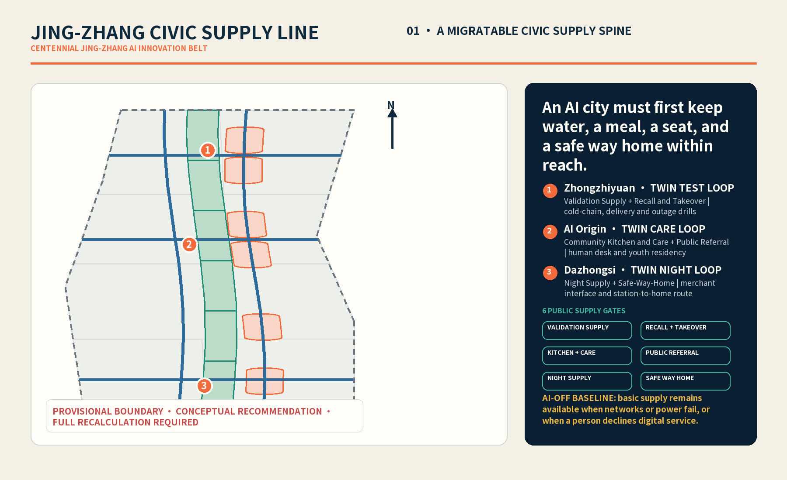
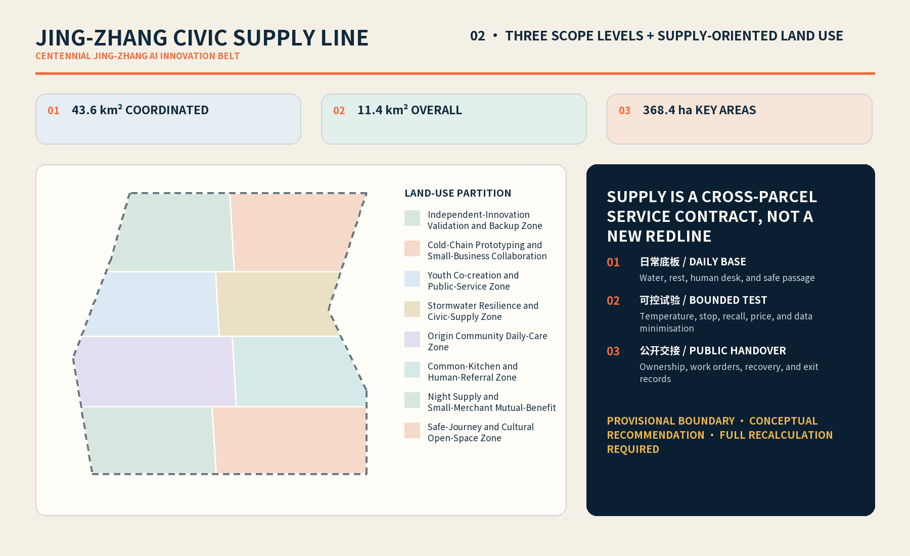
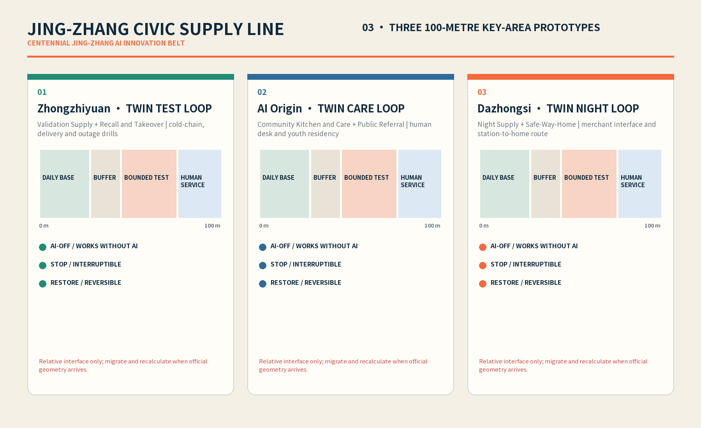
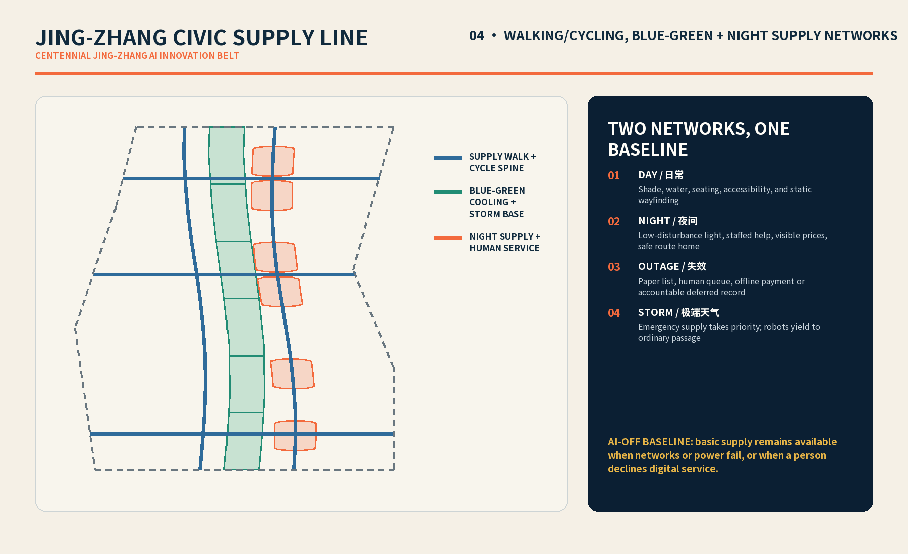
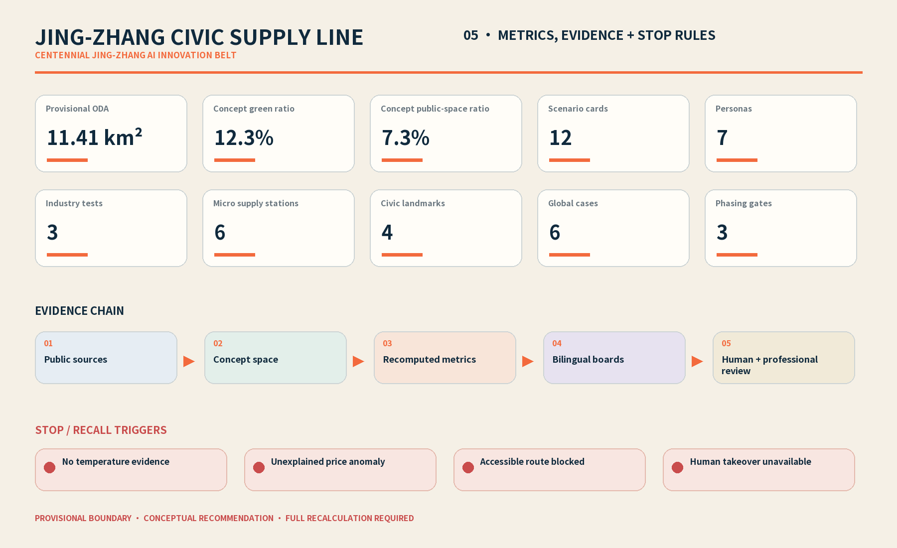

# JING-ZHANG CIVIC SUPPLY LINE: AI Innovation That Keeps Daily Life Within Reach

> **One-sentence public commitment: without an app, during a network or power outage, in extreme weather, or amid nighttime price volatility, a cup of water, a meal, a seat, and a safe way home will remain within reach; every AI pilot will have an accountable owner, a human alternative, stop, recall, and exit mechanisms, and a public ledger.**

This document is a conceptual urban-design recommendation for public discussion and professional deepening. It is not a statutory plan, government approval, investment commitment, engineering-feasibility conclusion, or parcel-level decision to demolish or alter buildings. “Supply” here covers water, meals, rest, and a safe way home, as well as the institutional capacity to stop, hold accountable, and remove a technology trial.

## Design Basis and Source Inventory

The proposal starts from the three-level scope and Agent tasks of the Centennial Jing-Zhang AI Innovation Belt Open Call for Urban Design and translates “world-class AI innovation” into a question that anyone can test: when digital systems are least reliable and urban stress is greatest, does daily life remain within reach? The design therefore prioritizes continuity of basic services, human takeover, and visible accountability over app downloads, robot counts, or spectacular devices.[source:OFFICIAL-ANNOUNCEMENT] [source:AGENT-TASKBOOK]

Evidence follows a four-tier boundary: the announcement and rights-cleared taskbook define the tasks; the site package and Source Registry distinguish formal-ready, background-only, and provisional material; the processed fact pack serves only as a reading guide; and GeoJSON, metrics, and matrices support recomputation and audit. When a source's rights or intended use is unclear, it is not promoted into an official control conclusion.[source:SITE-PACKAGE] [source:SOURCE-REGISTRY] [source:PROCESSED-FACT-PACK]

| Evidence tier | Use in this proposal | Boundary that must not be crossed |
| --- | --- | --- |
| Announcement and Agent taskbook | Define the three-level scope, three positioning statements, five functions, and six tasks | They do not mean this proposal has been approved |
| Site package and Source Registry | Check usable material, standards, enums, and gaps | Background-only or provisional material cannot support statutory conclusions |
| Provisional boundary and three key areas | Support concept generation, spatial discussion, and current recomputation | They are not Official Planning Boundaries and cannot support approval or precise ownership judgments |
| Structured submission files | Preserve geometry, metrics, assumptions, standards, and task coverage | Prose does not replace machine audit, and machine files do not replace public explanation |

The current overall boundary and three key areas are used as provisional constraints. Once trusted official polygons are obtained, land use, building footprints, roads, green space, public space, phasing, and every derived metric must be recomputed together rather than changing only one image.[source:BOUNDARY-SOURCE] [source:KEY-AREA-SOURCE] [data:geometry/site_boundary.geojson#SITE-001]

## Three-Level Scope Framework

The three levels are not three unrelated drawing sets but one decision chain from regional coordination through overall renewal to key-area validation. The Coordinated Research Area asks how industry, culture, and governance work together; the Overall Design Area asks how the supply network enters land use, public space, mobility, and facilities; and the Key-Area Detailed Design Area uses three prototypes to test whether accountability, human alternatives, and exit are genuinely operable.[depth:three_level_scope_framework] [standard:PROJECT-OFFICIAL-ANNOUNCEMENT]

| Work level | Core question in this proposal | Conceptual output | Item pending professional deepening |
| --- | --- | --- | --- |
| Coordinated Research Area | How can AI industrial capacity become public resilience? | Three positioning statements, five functions, Three Zones and Two Wings coordination, and mechanisms from global cases | Regional industry data, cross-district actors, and policy authority |
| Overall Design Area | How can basic supply be embedded in renewal, mobility, and public space? | One Line, Six Points, Two Wings, One Ledger spatial framework and service network | Official boundaries, regulatory controls, ownership, municipal capacity, and traffic engineering |
| Key-Area Detailed Design Area | How can AI be tested under real everyday stress while retaining an immediate return to human service? | Differentiated prototypes at Zhongzhiyuan, AI Origin, and Dazhongsi | Site survey, building safety, health permits, insurance, and operating authorization |

The “One Line” is a conceptual public-supply spine along and around the Jing-Zhang Railway Heritage Park and its walking connections; the “Six Points” are two complementary micro-supply points in each key area: Zhongzhiyuan's Validation Supply Point / Recall and Takeover Point, AI Origin's Community Kitchen and Care Point / Public Referral Point, and Dazhongsi's Night Supply Point / Safe-Way-Home Point; the “Two Wings” respectively provide compliance, insurance, and supply-chain services, and blue-green cooling, stormwater, and supply support; the “One Ledger” publishes each pilot's accountability, status, human alternative, incident, recall, and exit. Current areas are recomputed only against the submitted boundary and are not approved land-use quantities.[data:geometry/site_boundary.geojson#SITE-001] [metric:site_area_sqm] [metric:key_area_count]

## Coordinated Research Area: Industry and Future-City Study

### Three Positioning Statements

| Taskbook positioning | Translation through the Civic Supply Line | Requirement for space and operations |
| --- | --- | --- |
| Centennial Jing-Zhang Cultural Belt | Translate the railway memory of connection, maintenance, and public transport into “daily urban life without disconnection” | Bring heritage narrative into wayfinding, walking routes, and the public ledger rather than reducing culture to technological decoration |
| Metropolitan AI Life Experience Belt | Let the public first experience accessible water, meals, seats, and a safe way home, and only then experience algorithms | Place a no-app, paper, or staffed entrance beside every digital interface |
| AI Integration Innovation Belt | Treat accountability, insurance, supply chains, and exit capacity as part of innovation alongside experimental capability | Trials must be controlled, pausable, recallable, and reviewable |

### Five Functions and the Coordination Loop

| Five functions | Concrete response in this proposal |
| --- | --- |
| Full-Stack Independent AI Innovation System | Establish a conceptual controlled cold-chain and low-speed delivery test field at Zhongzhiyuan to validate sensing, dispatch, edge operation, and human takeover rather than deploy directly across the city |
| World-Class AI Innovation Ecosystem | Use the Zhongguancun Technology Services Wing as a conceptual interface for compliance, insurance, supply-chain, intellectual-property, and professional services |
| New Paradigm for AI-Enabled Scenarios | Bind technology, space, operation, privacy, human alternatives, and stopping conditions through twelve scenario cards |
| Vibrant Intelligent AI City | Return innovation to everyday experiences across ages and incomes through the AI Origin community kitchen and Dazhongsi night supply |
| Global Voice in AI Governance | Create a reusable governance model through public pilot ledgers, AI-OFF drills, incident recall, and exit reports |

All three positioning statements and five functions share a “public service before technology display” threshold. A technically effective pilot that makes basic service harder to obtain does not count as success.[source:AGENT-TASKBOOK] [standard:PROJECT-AGENT-OPEN-CALL-TASKBOOK] [depth:overall_spatial_structure]

### Three Zones and Two Wings

| Component | Conceptual role | What it contributes to the other areas |
| --- | --- | --- |
| Zhongzhiyuan AI Independent Innovation Acceleration Area | Controlled cold-chain and low-speed delivery validation field with a Validation Supply Point and Recall and Takeover Point | Test records, recall procedures, equipment lessons, and human-takeover experience |
| Beijing AI Origin Community | A Community Kitchen and Care Point and Public Referral Point host the community kitchen, care meals, public-service referral, and youth service residency | Real needs, inclusion evaluation, and community feedback |
| Dazhongsi AI Industry Cluster | A Night Supply Point and Safe-Way-Home Point link the small-merchant interface to the station-city way home | Feedback on nighttime supply and demand, price anomalies, and usability for small merchants |
| Zhongguancun Technology Services Wing | Compliance, insurance, supply chain, and professional services | Admission checklist, responsibility configuration, insurance, and supply-chain support |
| Xiaoyue River Scenario Enablement Wing | Blue-green cooling, stormwater retention, and emergency supply | Resilience scenarios for heat, heavy rain, and power outages |

### Naming, Logo, and Identity Direction

“JING-ZHANG CIVIC SUPPLY LINE” is not a logistics brand but an observable public commitment. The suggested logo uses two parallel tracks and four open nodes representing water, a meal, a seat, and a way home; a deliberate break in the middle signifies that the system must allow human takeover and exit. The Chinese name is fixed as “京张补给线” and the English name as “JING-ZHANG CIVIC SUPPLY LINE.” The graphic uses only original geometry and rights-cleared typefaces, with no corporate marks, portraits, or unauthorized railway imagery. The six supply points share four states—service available, human takeover, paused, and exited—but text, shapes, and tactile markers accompany color so that access never depends only on vision or a phone.

## Global Cases and Transferable Mechanisms

The six cases are used only to compare mechanisms. The proposal does not copy investment, scale, or performance numbers and does not claim that practices from different land and governance systems directly apply to Haidian. Any later quantitative comparison must return to the original material, rights, and like-for-like verification.[metric:global_case_count] [source:SOURCE-REGISTRY]

| Case | Qualitative mechanism | Translation to the Civic Supply Line | Explicitly not copied |
| --- | --- | --- | --- |
| Station F, Paris | Place startup support, shared facilities, and community operation in one accessible venue | Give pilot teams a shared admission, compliance, and human-takeover desk [source:CASE-STATION-F] | Tenant counts, investment outcomes, and closed membership culture |
| King’s Cross, London | Coordinate phased renewal, heritage reuse, and public-realm stewardship | Validate public paths and daily services before deciding whether to expand technical scenarios [source:CASE-KINGS-CROSS] | Land governance, development intensity, and project returns |
| one-north, Singapore | Form a close network of research, industry, transit, and everyday amenities | Connect Zhongzhiyuan testing, services from both Wings, and community feedback into a loop [source:CASE-ONE-NORTH] | State land mechanisms, enterprise composition, and any area metric |
| Kalasatama, Helsinki | Organize urban experiments and resident feedback around real-life problems | Evaluate pilots through AI-OFF, reduced everyday burden, and public retrospectives [source:CASE-KALASATAMA] | Assumptions about digital capability, resident consent, and infrastructure maturity |
| 22@Barcelona | Advance industrial renewal together with urban infrastructure and community issues | Retain productive-space and small-merchant interfaces so innovation space does not displace daily services [source:CASE-22BARCELONA] | Renewal intensity, industrial ratios, and attraction outcomes |
| MaRS, Toronto | Connect research, health, entrepreneurship, and professional services through a translation platform | Let the Technology Services Wing provide referrals for compliance, insurance, procurement, and supply chains [source:CASE-MARS] | Replacing the corridor network with one hub, institutional rosters, and financing data |

## Overall Design Area: Urban Renewal and Urban Design at Regulatory Detailed Planning Depth

The overall structure is a “daily-supply base network + controlled industrial test network + continuous public way home + public governance ledger.” The daily-supply base network enters walkable public interfaces and existing ground floors first; the test network operates only where boundaries, hours, accountability, and human takeover are clear; the public way home links transit exits, supply stations, lighting, and staffed nodes; and the governance ledger records status consistently across all three key areas. This is a reference scheme for professional deepening, not a land-use change or road-redline conclusion.[data:geometry/land_use.geojson#LU-001] [depth:land_use_layout] [standard:MOHURD-CONTROL-DETAILED-PLANNING]

| Spatial layer | Conceptual move | Observable result | Professional condition to be completed |
| --- | --- | --- | --- |
| Daily-supply base network | Place water, meals, seats, staffed consultation, and paper wayfinding at the three prototypes and corridor public interfaces | People without an app can still enter the service | Existing-service inventory, operating authorization, health, and accessibility checks |
| Controlled industrial test network | Restrict cold-chain, low-speed delivery, and small-merchant interface tests to times and places that can be contained and recalled | Failure does not automatically spread into public systems | Equipment safety, insurance, cybersecurity, and site-management plans |
| Continuous public way home | Conceptually link transit stations, walking routes, night supply, and blue-green refuge nodes | A recognizable route remains at night and in extreme weather | Traffic organization, lighting, security, fire safety, and accessibility design |
| Public governance ledger | Display the owner, service status, human alternative, price rules, and exit conditions both online and on site | The public can identify accountability without understanding the model | Ledger publisher, removal of personal information, and complaint handling |

The renewal priority is not “demolish first, build later.” It begins by inventorying buildings and services that retain public value, then fills gaps with reversible, lightweight, removable components. Every suggestion concerning ground-floor access, links, loading, energy, or temporary structures requires site survey and confirmation of ownership, heritage, fire, accessibility, health, and engineering conditions before deepening.[depth:existing_conditions_diagnosis] [data:geometry/constraints.geojson#CONSTRAINTS]

## Key-Area Detailed Design

The three key areas carry different failure risks and cannot repeat one generic “smart park” template. Their current boundaries are provisional constraints; all spatial, scale, and activity arrangements below are conceptual recommendations. Once official polygons, existing-building data, ownership, and utility information are available, planning, architecture, mobility, municipal, landscape, and operations teams should deepen them together.[depth:three_key_area_detailed_design] [metric:key_area_count]

### Zhongzhiyuan AI Independent Innovation Acceleration Area: Keep Higher-Risk Tests in a Controlled Field

Two complementary micro-supply points form the suggested “receiving inspection—cold holding—controlled test loop—human takeover—recall quarantine—public observation” sequence: the Validation Supply Point hosts controlled cold-chain and low-speed delivery trials, while the Recall and Takeover Point hosts human takeover, batch quarantine, and recall. Low-speed delivery operates only during defined periods and on a conceptual test path, with public walking taking priority. The cold-chain model provides only warning and dispatch support; named people decide batch release, quarantine, and recall. A failure of positioning, communications, temperature control, braking, or the chain of accountability immediately stops the test and moves goods into human inspection or quarantine.[data:geometry/key_areas.geojson#PROV-KEY-001]

### Beijing AI Origin Community: Place Innovation Inside Care and Mutual Aid

Two complementary micro-supply points form the suggested walkable service cluster: the Community Kitchen and Care Point hosts the community kitchen and care meals, while the Public Referral Point hosts public-service referral and youth service residency. AI may assist demand aggregation, shift planning, routing, and public-information retrieval, but it may not automatically determine benefit eligibility, medical judgment, or care priority; an on-site counter, telephone, paper ticket, and named service staff provide the human alternative. Youth residency centers on service shifts and community contribution and does not present discounted housing or work opportunities as committed resources.[data:geometry/key_areas.geojson#PROV-KEY-002]

### Dazhongsi AI Industry Cluster: Protect Nighttime Prices and a Safe Way Home

Two complementary micro-supply points link the station-city interface: the Night Supply Point hosts essential goods and a small-merchant console, while the Safe-Way-Home Point hosts seating, offline wayfinding, and staffed help for the journey home. Small merchants can use low-threshold inventory and order assistance, but must retain posted prices, cash or an equivalent human channel, and a record of manual price changes; AI can flag anomalies but cannot create unexplained prices under shortage or nighttime pressure. Safe-route assistance does not continuously track individuals, and people can choose a paper map, reflective wayfinding, or help from staff.[data:geometry/key_areas.geojson#PROV-KEY-003]

## AI Innovation Ecosystem, Talent Personas, and AI-Enabled Scenarios

The proposal understands the innovation ecosystem as an accountability loop: real needs enter scenario cards; controlled tests produce auditable records; the Technology Services Wing supplies compliance, insurance, and supply-chain support; and feedback from communities and small merchants determines whether to continue, revise, or exit. Data minimization, human review, and no-app entry are prerequisites for admission rather than appendices.[source:AGENT-TASKBOOK] [standard:PROJECT-AGENT-OPEN-CALL-TASKBOOK]

### Seven Personas

| ID | Persona | Risk most easily overlooked | Baseline guarantee in this proposal |
| --- | --- | --- | --- |
| P1 | Older people who do not use smartphones or are unfamiliar with digital services | A QR code becomes the only entrance | Staff, telephone, paper ticket, clear prices, and seated waiting |
| P2 | Night-shift workers and late commuters | Nighttime shortage, price volatility, and unsafe routes | Night supply, public prices, staffed nodes, and an offline way-home map |
| P3 | Caregivers and care-meal users | An algorithm misreads need, dietary restrictions, or the recipient | Human confirmation, batch labels, telephone review, and recall |
| P4 | Young students, graduates, and short-term service residents | Opaque opportunity matching or service exchanged for uncertain promises | Public shifts, human coordination, freedom to exit, and an appeal channel |
| P5 | Corridor small merchants and sole traders | Proprietary-platform lock-in, algorithmic repricing, or repurposed data | Exportable records, paper workflows, explicit authorization, and non-exclusive interfaces |
| P6 | Cold-chain, delivery, cleaning, and maintenance workers | Automation obscures labor accountability and on-site risk | Named crews, stop authority, training, human takeover, and incident records |
| P7 | People with reduced mobility, adults with children, and temporarily disconnected visitors | Inaccessible routes, seats, and service interfaces | Accessible staffed entry, continuous seating, tactile/text wayfinding, and service without location tracking |

The seven personas are a scenario-design checklist, not labels for scoring individuals. The structured metric checks the persona count and its mapping to scenarios.[metric:persona_count]

### Twelve Scenario Cards

| ID / scenario | Space and users | Minimum data and privacy boundary | AI role and human alternative | Suggested accountable role; stop, recall, or exit condition |
| --- | --- | --- | --- | --- |
| TVS-01 Controlled cold-chain anomaly validation (industry test) | Zhongzhiyuan; goods batches and cold-chain workers | Batch temperature, equipment, and handover status; no facial data | AI warning; human temperature checks, quarantine, and paper handover | Cold-chain test owner; a traceability break or temperature anomaly stops the test and recalls the batch |
| TVS-02 Human takeover for low-speed delivery (industry test) | Controlled Zhongzhiyuan loop; delivery and maintenance workers | Vehicle state, conceptual path, and handover point; no continuous identification of passersby | AI-assisted dispatch; human driving, handcart, and on-site stop | Site-mobility test owner; failure of communication, braking, positioning, or people-vehicle separation stops and exits the test |
| TVS-03 Small-merchant interface interoperability stress test (industry test) | Dazhongsi mock console; voluntarily participating small merchants | Authorized product, inventory, order, and price records; no cross-purpose profiling | AI forecast and anomaly flag; paper order, telephone, and human pricing | Merchant-interface test owner; unexplained repricing, data overreach, or instability triggers rollback and suspension |
| S-04 Community-kitchen demand aggregation | AI Origin; residents and kitchen workers | Voluntarily supplied meal count, time, and dietary tags; no disease inference | AI-assisted preparation forecast; on-site registration, telephone, and human count | Community-kitchen operator; tag mismatch, rising waste, or failure of the human channel returns planning to people |
| S-05 Care-meal review and delivery | AI Origin; care-meal users and caregivers | Minimum contact, meal, and handover data; people decide eligibility | AI-assisted routing; people verify recipient, restrictions, and receipt | Care-meal operator; wrong delivery, allergy risk, or inability to contact stops automated allocation and triggers recall |
| S-06 Public-service information referral | AI Origin; residents seeking help | Inquiry content recorded only as needed; no automatic sensitive profile | AI retrieves public information; counter staff give the final explanation | Public-service desk owner; an outdated source, conflicting answer, or eligibility decision transfers the case to a person |
| S-07 Youth service-residency shift planning | AI Origin; young people and community service points | Skills, available hours, and explicit consent; no irrelevant history | AI suggests matches; a coordinator confirms shifts and exits | Residency coordinator; discriminatory results, missing safety protection, or unclear promises suspend matching |
| S-08 Nighttime essential-goods price watch | Dazhongsi; late returners and small merchants | Aggregated stock, posted price, and anomaly records; no individual consumption profile | AI only flags volatility; posted prices, human checkout, and logged manual repricing | Night-station owner; if an electronic price cannot be verified or an anomaly explained, use the posted human price or suspend the merchant interface |
| S-09 Safe-way-home route suggestion | Dazhongsi to corridor nodes; late returners and disconnected visitors | Users may decline location; temporary location use ends with the session | AI offers candidate routes; paper map, reflective wayfinding, and staff assistance | Way-home duty owner; flooding, construction, lighting failure, or uncertainty removes the algorithmic route |
| S-10 Heat cooling and drinking-water supply | Xiaoyue River Wing and six points; people outdoors | Environmental, equipment, and stock status; no identity needed | AI-assisted demand forecast; people open stations, distribute water, and inspect | Blue-green operations owner; unconfirmed water quality, stock, or cooling equipment closes the device and activates an alternative point |
| S-11 Heavy-rain supply relocation | Xiaoyue River Wing and safe nodes; public and operations workers | Public weather, flooding, and facility state; no personal movement tracking | AI aggregates alerts; people decide route closure and supply relocation | Emergency liaison owner; where site and model conflict, on-site closure prevails and recommendation stops |
| S-12 Corridor-wide AI-OFF continuity drill | Six Points and Two Wings; all personas | Only system availability, service volume, and response; no personal identity | AI monitors transition; people command, keep paper ledgers, and distribute offline | Each pilot's service owner; failure to preserve any of water, meal, seat, or way home suspends expansion and triggers remediation or exit |

The first three of the twelve cards are industry testing and validation scenarios. Machine metrics check the six complementary micro-supply points, total scenario count, and industry-test count. A scenario without a named accountable role, human alternative, or stopping condition cannot enter public operation.[metric:scenario_count] [metric:industry_test_count] [metric:supply_station_count]

## Land Use, Building Scale, and Demolish–Renovate–Retain Strategy

The land-use and building layers express only the spatial carriers of the current concept. The proposal prioritizes existing public services and adaptable ground floors, minimizes permanent construction, and designs pilot equipment to be repairable, removable, and able to restore the site. Land-use expression follows a consistent classification logic, but this document cannot derive statutory land-use changes.[data:geometry/land_use.geojson#LU-001] [standard:MNR-LAND-USE-CLASSIFICATION-GUIDE]

| Category | Conceptual strategy | Prerequisite for a decision |
| --- | --- | --- |
| Retain | Prioritize buildings and small-merchant interfaces that retain public value, are structurally safe, and can remain in use | Site survey and structural, fire, ownership, and operations investigations |
| Renovate | Conceptually adapt ground-floor service interfaces, accessible entrances, loading, and staffed points | Building approval plus health, accessibility, heritage, and municipal checks |
| Demolish | Make no parcel or building demolition conclusion; only suggest removing temporary test equipment and restoring the site on exit | Professional assessment, ownership negotiation, and statutory procedure |
| New build | Where a verified gap exists, study lightweight and reversible supply kiosks, sheltered seats, and equipment interfaces | Official controls, engineering feasibility, permits, maintenance owner, and life-cycle cost |

The current building-footprint layer represents one conceptual carrier. Its area can be recomputed but is not an existing-condition survey or approved scale; total floor area, Floor Area Ratio, Building Height, and Building Coverage Ratio remain pending official regulatory and building data.[data:geometry/buildings.geojson#BLDG-001] [metric:building_footprint_area_sqm] [metric:floor_area_ratio]

## Traffic, Rail, Municipal, and Public-Service Facilities

The mobility strategy places walking and accessible continuity ahead of delivery efficiency. The conceptual supply line connects transit stations, the three prototypes, public seats, and blue-green refuge nodes. Low-speed devices may operate only on a defined test path, schedule, and on-site management regime and may not occupy accessible routes, fire lanes, or emergency-egress space. The road layer represents proposal connections rather than a road redline or engineering design.[data:geometry/roads.geojson#ROAD-001] [metric:road_length_m] [depth:traffic_rail_slow_parking]

| System | Conceptual recommendation | AI-OFF state |
| --- | --- | --- |
| Rail and station-city interface | Place legible walking interchange, night supply, and staffed nodes at station-city interfaces such as Dazhongsi | Use paper guidance, reflective signs, and on-site staff |
| Walking, cycling, and accessibility | Prioritize continuous seating, shelter, crossing cues, and accessible detours | Keep physical routes open and stop advice that depends on live positioning |
| Low-speed delivery and loading | Use controlled time windows, human observation, emergency stop, and fixed handover points | Shift to handcarts or human delivery rather than transferring system failure to the public |
| Conventional municipal and new infrastructure | Prioritize normal water and power; use edge devices, backup power, and sensing only as enhancements | Disconnect noncritical devices while preserving lighting, human communication, and basic supply |
| Public-service facilities | Combine water, meals, seats, consultation, and way-home information across the six points according to their roles | On-site stock, paper ledgers, telephone chains, and named staff take over |

## Blue-Green Space, Public Space, and Urban Character

The Xiaoyue River Scenario Enablement Wing is not a landscape accessory but supply infrastructure for heat, heavy rain, and power outages. Shade, permeable space, stormwater routes, sheltered seating, and drinking-water points form a recognizable resilience sequence. Water engineering, sponge-city measures, planting, and facility scale all await professional deepening based on site and statutory conditions.[data:geometry/green_space.geojson#GREEN-001] [metric:green_ratio] [depth:blue_green_public_space]

Public space follows “enable staying before interaction”: seating requires no purchase, service requires no scan, and displays do not displace movement. The Public Space Ratio only recomputes the current design layer and is not an approved planning indicator.[data:geometry/public_space.geojson#PUBLIC-001] [metric:public_space_ratio]

### Four Pilgrimage Landmarks and Honor-Display Nodes

| Landmark | Suggested place and form | Public value and honor display | Exit and rights boundary |
| --- | --- | --- | --- |
| Supply Line Kilometer Zero | Shared table, offline map, and service-status board at AI Origin | Record community service workers, maintainers, and public improvements rather than only models or companies | Use original graphics and rights-cleared materials; events and structures await approval |
| Accountability Signal | A low status node or facade information band at Zhongzhiyuan, not a predetermined tower project | Show pilot owner, running/paused/recalled state, and latest retrospective | Remove if unsafe or unmaintainable; do not use unauthorized corporate marks |
| Night-Return Light Porch | Sheltered seating, reflective wayfinding, and a staffed help point at the Dazhongsi station-city interface | Recognize night workers, small merchants, and public-service contributors | No continuous facial or trajectory data; lighting and facilities require professional deepening |
| Xiaoyue River Resilience Waystation | A shaded resting, staffed supply, and stormwater-status node in the Xiaoyue River Wing | Recognize ecological maintenance, emergency support, and field-inspection contributions | Presume no hydraulic-engineering conclusion; adjust or remove if it conflicts with flood conveyance or safety conditions |

Together the four landmarks tell one cultural story: the Jing-Zhang Railway's spirit of connection and maintenance, Zhongguancun's culture of open innovation, and an AI culture of explainability, stoppability, ecological resilience, and shared care. They are conceptual public nodes, not approved construction projects; the metric checks their count.[metric:landmark_count] [source:AGENT-TASKBOOK]

## Governance, RACI, Resources, and Authorization

Before launch, every pilot must publish at least these ledger fields: pilot ID, service goal, place and hours, accountable owner, operating state, data categories, human alternative, price rule, stop trigger, recall scope, incident and response, exit date, and site-restoration status. The ledger must not publish personal information or use “the algorithm decided” in place of named accountability.[standard:PROJECT-AGENT-OPEN-CALL-TASKBOOK] [source:AGENT-TASKBOOK]

### RACI Responsibility Matrix

R = Responsible, A = Accountable, C = Consulted, and I = Informed. The roles below are recommended configurations and do not mean that any real institution has accepted authorization or resource responsibility.

| Decision | A — Accountable | R — Responsible | C — Consulted | I — Informed |
| --- | --- | --- | --- | --- |
| Scenario admission and spatial boundary | Legally authorized project/site-responsibility entity | Pilot service owner | Planning, architecture, mobility, municipal, safety, accessibility, and community representatives | Public and participating merchants |
| Daily operation and human takeover | Pilot service owner | Human shift supervisor and operating crew | Technology provider, supplier, and facility maintainer | Service users |
| Change in data or model purpose | Data-responsibility entity | Data administrator and human reviewer | Legal, privacy, security, and community representatives | Affected groups |
| Essential-goods and service price rules | Participating operations-responsibility entity | On-site merchant or service staff | Consumer representative, supply chain, and audit role | Public |
| Stop, recall, and incident response | Site/service accountable entity | Shift supervisor and emergency liaison | Insurer, professional safety role, and relevant public bodies | Public and affected participants |
| Closure, exit, and site restoration | Authorization and asset-responsibility entity | Operations, equipment, data, and site-restoration teams | Community representative, auditor, and professional team | Public and contributors |

### Resource and Authorization Gates

| Gate | Must be confirmed before launch | Treatment if unconfirmed |
| --- | --- | --- |
| Site and space | Ownership consent, use boundary, fire, accessibility, heritage, and mobility conditions | Do not enter the site; retain only a tabletop exercise |
| People and labor | Named owner, shift staff, training, stop authority, and labor protection | Do not open a public service |
| Goods and supply chain | Water and food safety, cold-chain traceability, stock, recall, and alternative supply | Do not use AI to amplify an unreliable supply chain |
| Technology and data | Minimum data, permissions, logs, cybersecurity, human alternative, and deletion plan | Use only offline or human workflow, or stop the scenario |
| Funding, insurance, and maintenance | Verified budget source, insurance, compensation path, maintenance, and exit resources | Do not present an implementation commitment and do not expand the pilot |

## Negative Tabletop Exercises and AI-OFF Basic Services

A successful demonstration does not prove urban resilience. The proposal uses negative tabletop exercises to check whether the system still respects the public under worst-case conditions. The constraints layer records current known and missing conditions, and people with appropriate authority and expertise must review every exercise result.[data:geometry/constraints.geojson#CONSTRAINTS] [depth:risk_missing_data]

### Six Negative Tabletop Exercises

| Negative case | Prohibited reaction | Immediate action | Pass threshold and exit condition |
| --- | --- | --- | --- |
| Network and power outage during the dinner peak | Require users to keep scanning or leave nobody accountable | Switch to paper tickets, human count, posted prices, and named command | All four basic services remain; failure of any one suspends expansion and triggers remediation |
| Conflicting cold-chain readings during extreme heat | Let a model majority override the on-site anomaly | Stop release, recheck manually, quarantine the batch, and initiate recall | If traceability and safety cannot be restored, destroy/return the batch and exit automation |
| Nighttime shortage with a sudden price increase | Reprice automatically without explanation | Freeze the interface, use the posted human price, and record the supply cause | If the change cannot be explained or corrected, suspend that merchant's digital interface |
| Low-speed device blocks an accessible route or creates a near miss | Make pedestrians bear detour risk | Emergency stop, clear the route, switch to human delivery, and record the event | Do not reopen before cause and accountability close; repeated failure exits the scenario |
| Public-service referral gives outdated or wrong information | Treat model output as an eligibility decision | Explicitly retract, transfer to the staffed desk, and notify potentially affected users | Disable the relevant question-answering function until sources and review are repaired |
| Algorithm still recommends an obstructed route during heavy rain | Keep pushing the route to preserve availability metrics | Remove the route, follow on-site closure, and broadcast an offline route | Remain AI-OFF while field information cannot be returned reliably |

### AI-OFF Service Ladder

1. **AI-ON:** AI assists only within an authorized boundary, with people continuously able to take over.
2. **Degraded operation:** When data, network, or model stability falls, stop automated decisions and retain only prompts with human review.
3. **AI-OFF:** Disable model and network dependencies and sustain service through telephone, paper, cash or equivalent human payment, on-site stock, and named crews.
4. **Safe closure and alternative:** If the place itself is unsafe, close the point and direct people to a human-confirmed alternative. Closure cannot leave the public in an unowned gap.

| Basic service | No-app / network-and-power-outage guarantee | Extreme-weather or nighttime-price-volatility guarantee |
| --- | --- | --- |
| A cup of water | Visible on-site stock, human distribution, and paper batch record | Close unsafe equipment and point to a human-confirmed alternative drinking-water location |
| A meal | On-site/telephone registration, fixed human menu, paper ticket, and human check | Retain human priority judgment for care meals; recall rather than distribute when food safety cannot be assured |
| A seat | Physical seating without a purchase requirement and with human queue management | Open safe sheltered points during heat and rain; close dangerous points promptly and provide an alternative |
| A safe way home | Offline maps, reflective/tactile wayfinding, and staffed help points | Prioritize on-site closure and human confirmation; remove algorithmic routes that cannot be verified |

## Renewal Project List, Implementation Policies, and Phasing Plan

The project list is a conceptual deepening package, not a government investment, construction schedule, or operating commitment. Suggested projects are: a public accountability ledger and offline identity system; Zhongzhiyuan's Validation Supply Point and Recall and Takeover Point; AI Origin's Community Kitchen and Care Point and Public Referral Point; Dazhongsi's Night Supply Point and Safe-Way-Home Point; Xiaoyue River blue-green cooling, stormwater, and emergency supply; and the four landmarks with corridor-wide no-app wayfinding. Every item must first pass the resource and authorization gates.[data:geometry/phasing.geojson#PHASE-001] [depth:renewal_project_list]

| Phase | Conceptual action | Entry condition | Phase exit / stop condition |
| --- | --- | --- | --- |
| 1 Authorization preparation | Complete boundary, existing-condition, ownership, permit, accountability, insurance, and human-alternative work; run tabletop exercises | Sources and authorizations are verifiable, and the four basic services have a human baseline | Missing critical accountability or authorization prevents public testing |
| 2 Controlled validation | First validate cold chain, low-speed delivery, human takeover, and recall at Zhongzhiyuan's Validation Supply Point and Recall and Takeover Point | Test boundary, staff, stop, insurance, and quarantine conditions are ready | Failed AI-OFF or recall drill, or an unresolved major safety incident, stops the phase |
| 3 Linkage, extension, and exit | Validate kitchens, referrals, merchant interfaces, and way-home service at AI Origin and Dazhongsi; connect only mechanisms that demonstrate public value and reversibility to the Wings and corridor | Community and merchant participation is voluntary, human channels are stable, price rules are public, and independent review and site-restoration resources are clear | Reduced accessibility, privacy overreach, uncorrected price anomalies, insufficient public value, unsustainable maintenance, or conflicting professional conditions trigger rollback, no extension, or orderly exit |

The `phase_count` metric checks the three phases and the phasing layer carries their spatial expression. Authorization, controlled validation, linkage, extension, and exit all have gates; no phase is an irreversible construction commitment.[metric:phase_count] [depth:phasing_implementation]

Long-term operation is suggested as a lightweight annual loop: “Civic Supply Line Open Test Week” makes controlled trials visible; “AI-OFF Day” drills network and power outages; a “Repair and Civic Benefit Workshop” brings maintainers, small merchants, and residents into improvements; and an “Urban AI Accountability Review” publishes incident, recall, and exit reports. Event names, frequency, venues, budgets, and international collaboration remain subject to confirmation by operators, communities, and professional teams and are not established arrangements.

The common exit rule is to stop adding users and data, notify affected people, switch to human or alternative service, complete goods recall and compensation handoff, export records and minimize retention, delete data without a lawful purpose, remove equipment, restore the site, and publish the closure reason and unresolved items. Exit is not a hidden failure but a normal capability that an innovation system must possess.

## Indicator System, Area Recomputation, and Compliance Matrices

Indicators fall into two groups: geometry indicators explain the current conceptual layers, while task indicators check whether the proposal delivers its commitments. `metrics.json` is the audit authority for every value, formula, unit, source file, confidence level, and assumption; the prose explains only design meaning. Results recomputed against provisional boundaries must not be called approval indicators.[depth:metrics_recalculation] [standard:PROJECT-OFFICIAL-ANNOUNCEMENT]

| Metric ID | Meaning in this proposal | Current interpretation boundary |
| --- | --- | --- |
| `site_area_sqm` | Area of the submitted overall boundary | Recomputed from SITE-001; the provisional boundary is not an Official Planning Boundary |
| `building_footprint_area_sqm` | Conceptual Building Footprint area | Recomputed from BLDG-001; pending existing-condition survey and architectural review |
| `green_ratio` | Conceptual green-space layer as a share of the submitted boundary | Used to compare blue-green support, not an approved Green Ratio |
| `public_space_ratio` | Conceptual public-space layer as a share of the submitted boundary | Used to check public interfaces, not a statutory open-space indicator |
| `floor_area_ratio` | Relationship between total floor area and official site area | Official control and total floor area are missing; remains pending official data |
| `key_area_count` | Three key areas | Fixed check of Zhongzhiyuan, AI Origin, and Dazhongsi |
| `road_length_m` | Length of conceptual connection roads/paths | Recomputed from ROAD-001; not a road redline or engineering length |
| `scenario_count` | Number of scenario cards in the report | 12 in this proposal |
| `industry_test_count` | Number of industry testing and validation scenarios | 3 in this proposal, meeting the task requirement of at least 3 |
| `persona_count` | Number of user personas in the report | 7 in this proposal |
| `landmark_count` | Number of pilgrimage landmarks and honor nodes | 4 conceptual nodes in this proposal |
| `global_case_count` | Number of qualitative global cases | 6 in this proposal, with no fabricated figures |
| `supply_station_count` | Number of complementary micro-supply points in the three key areas | 6 points in this proposal, 2 per key area |
| `phase_count` | Number of conceptual phase gates | 3 in this proposal, each stoppable or exitable |

Fixed features connect the geometry evidence: overall boundary SITE-001; key areas PROV-KEY-001 through 003; land use LU-001; building BLDG-001; road ROAD-001; green space GREEN-001; public space PUBLIC-001; constraints CONSTRAINTS; and phasing PHASE-001. The three matrices retain full task, standard, and depth coverage so that raw identifiers do not overwhelm the report.[data:geometry/site_boundary.geojson#SITE-001] [data:geometry/constraints.geojson#CONSTRAINTS]

## Risk, Copyright, and Compliance Statement

### Risks and Items Pending Confirmation

| Risk | Control in this proposal | Further confirmation required |
| --- | --- | --- |
| Boundaries and statutory controls | Label every spatial and scale move as conceptual and allow recomputation after replacing provisional boundaries | Official boundaries, regulatory plan, ownership, roads, municipal systems, heritage, and engineering conditions |
| Food, cold chain, and product safety | Prioritize human release, batch traceability, quarantine, and recall | Health permits, testing, insurance, suppliers, and emergency procedures |
| Mobility and public-space safety | Walking priority, controlled tests, emergency stop, and on-site supervisor | Traffic organization, fire, accessibility, lighting, and security design |
| Privacy and algorithmic bias | Minimum data, optional location, human review, and reauthorization for purpose changes | Data responsibility, retention, security assessment, and appeal process |
| Nighttime prices and small-merchant fairness | Posted prices, logged human repricing, and rollback on anomaly | Voluntary participation, consumer protection, supply stability, and audit arrangements |
| Operation and exit | Resource gates, AI-OFF, recall, equipment removal, and site restoration | Named operator, funding, insurance, maintenance, and compensation capacity |

The proposal uses no secret maps, non-public personal data, unauthorized corporate material, or fabricated official endorsement. The submitter remains responsible for checking facts and rights in AI-generated text and graphics.[source:SOURCE-REGISTRY] [depth:risk_missing_data]

### Rights Ledger

| Asset category | Current rights status and permitted use | Responsibility and update action |
| --- | --- | --- |
| Announcement, taskbook, and site package | Cite within the public or rights-cleared scope registered by the repository; do not expand sublicensing | Retain source, access path, and limitation; recheck when materials change |
| Boundaries, GeoJSON, and metrics | Use only according to registered provenance and provisional/official status | Recompute and update figures, metrics, assumptions, and ledger when the source changes |
| Global-case summaries | Include only independently written qualitative mechanisms; copy no images, drawings, or copyright-protected long text | Retain CASE records and access dates; fabricate no numbers |
| Logo, icons, typefaces, and wayfinding | Use original geometry; final figures and PDFs embed only Google Noto Sans SC under the SIL Open Font License 1.1; include no third-party photos, map tiles, or logos | Record the font license and generation process; do not distribute the source font file in the submission package |
| AI-generated text, diagrams, and translation | Treat as submitter-generated content requiring human checks of facts, bilingual equivalence, and figure consistency | Record model/tool, prompt scope, human edits, and version |
| Photos, people, corporate marks, and historical images | Not included in this report; authorization and attribution required before future use | Exclude unless rights-cleared; online visibility does not equal permission |
| Scenario-operation and public-feedback data | No real personal data collected now; future use only with explicit authority and minimum necessity | Set retention, access control, withdrawal/deletion, and anonymized-publication rules |
| Incident, recall, and exit records | Publish de-identified facts and responses while retaining necessary audit evidence | Named accountable entity maintains them without exposing personal or security-sensitive information |

See `report/copyright_statement.md` for the detailed copyright statement. The display license used by this proposal does not automatically cover third-party materials, future field data, or external trademarks; every later professional team must recheck the rights ledger.[source:SITE-PACKAGE] [standard:MOHURD-URBAN-DESIGN-MEASURES]

## References

1. Haidian Branch of the Beijing Municipal Commission of Planning and Natural Resources, Qualification Pre-Announcement for the Centennial Jing-Zhang AI Innovation Belt International Urban Design Solicitation; used for tasks, scope, and deliverable-depth judgments.[source:OFFICIAL-ANNOUNCEMENT]

2. Extract of the Taskbook for the Centennial Jing-Zhang AI Innovation Belt Urban Design Open Call to Global Agents; used for the three positioning statements, five functions, six Agent tasks, and conceptual-recommendation boundary.[source:AGENT-TASKBOOK]

3. Repository site package, Source Registry, and processed fact pack; used for source-use tiers, gap identification, and machine-readable navigation.[source:SITE-PACKAGE] [source:SOURCE-REGISTRY] [source:PROCESSED-FACT-PACK]

4. Local official-text snapshot of the Ministry of Housing and Urban-Rural Development's Measures for the Administration of Urban Design; used for professional responses on urban design, public space, and character.[standard:MOHURD-URBAN-DESIGN-MEASURES]

5. Ministry of Housing and Urban-Rural Development, Measures for the Preparation and Approval of Regulatory Detailed Plans for Cities and Towns; used to distinguish statutory controls, conceptual recommendations, and matters pending confirmation.[standard:MOHURD-CONTROL-DETAILED-PLANNING]

6. Ministry of Natural Resources, Guidelines for the Classification of Land and Sea Use for Territorial-Space Survey, Planning, and Use Control; used for consistent land-use expression.[standard:MNR-LAND-USE-CLASSIFICATION-GUIDE]

7. Registered case material for Station F, King’s Cross, one-north, Kalasatama, 22@Barcelona, and MaRS; used only to extract qualitative mechanisms, not figures or copyright-protected assets.[metric:global_case_count]

8. This package's GeoJSON, `metrics.json`, assumptions, compliance matrix, standard matrix, and design-depth matrix; used for recomputation and audit rather than professional approval.[data:geometry/site_boundary.geojson#SITE-001] [depth:metrics_recalculation]

Whenever materials, Issues, review comments, or structured files change, the proposal should update both language versions, figures, and ledgers together and rerun bilingual, rendering, and self-check gates. Completion is not “the AI demo worked”; it is that the public knows whether a service is available, who is accountable, how failure returns to people, and when an orderly exit occurs.
