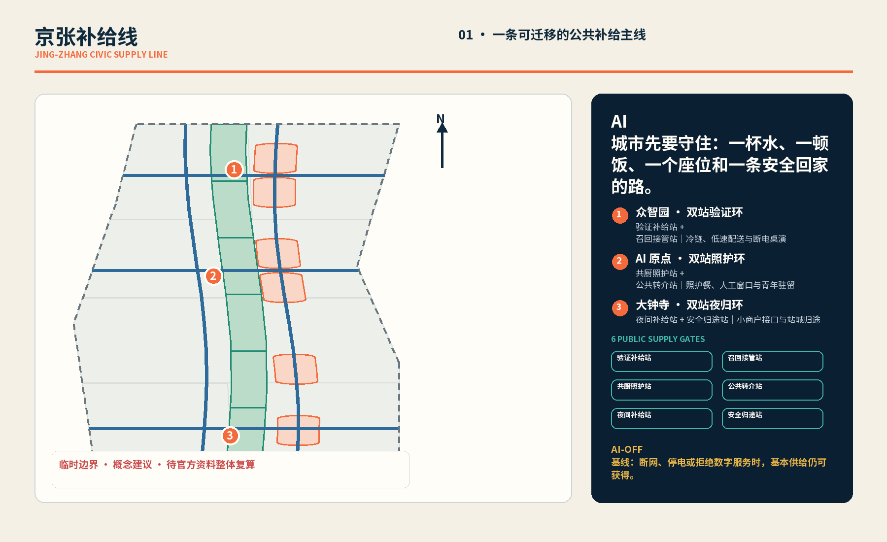
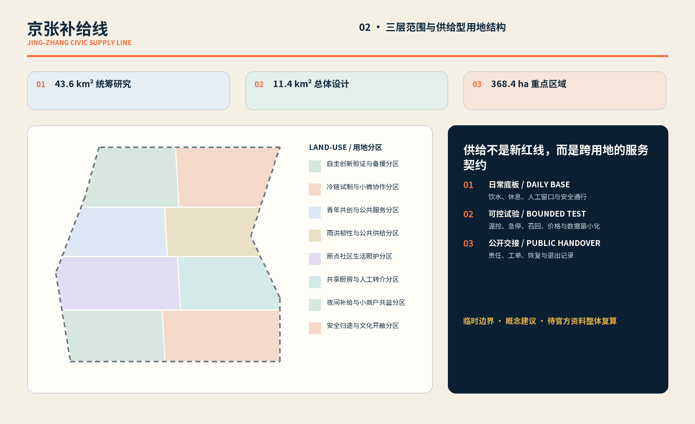
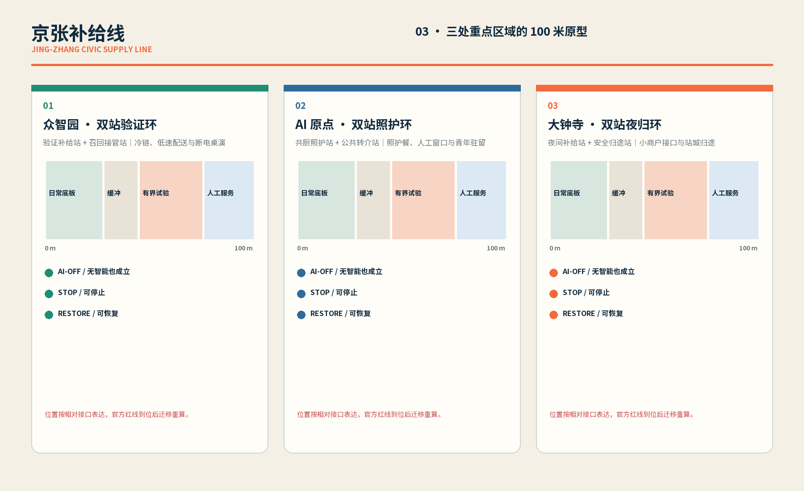
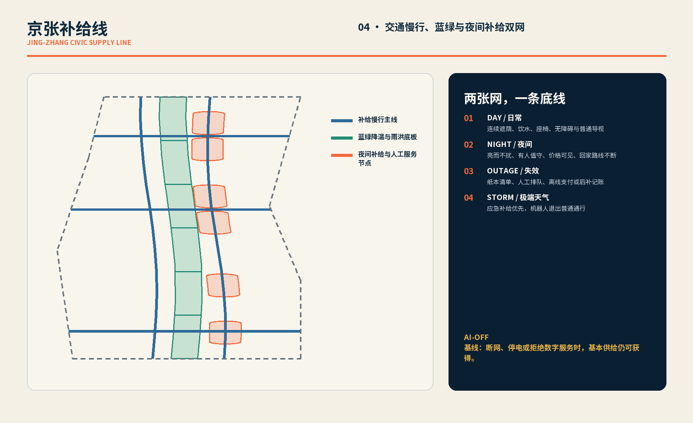
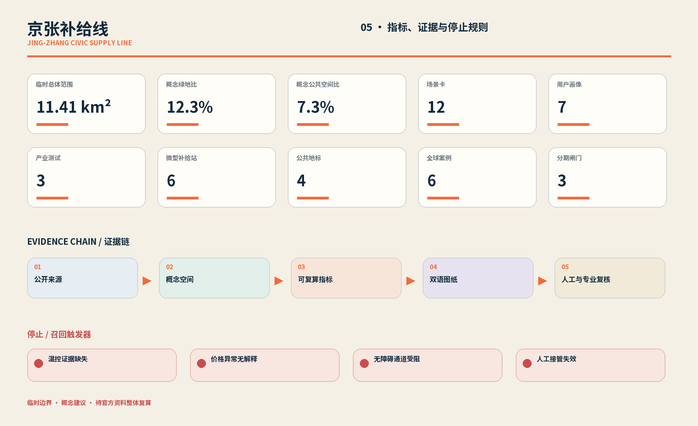

# 京张补给线：让 AI 创新先守住城市日常

> **一句话公众承诺：无 App、断网或停电、极端天气、夜间价格波动时，一杯水、一顿饭、一个座位与一条安全回家路仍可获得；每个 AI 试点都要有责任人、人工替代、停止、召回、退出和公开台账。**

本稿是一份供公开讨论和专业深化的城市设计概念建议，不是法定规划、政府批准、招商承诺、工程可行性结论或地块拆改决定。这里所说的“补给”既包括水、餐食、休息和安全归途，也包括让技术试验能够被停止、被追责和被撤出的制度能力。

## 设计依据与资料清单

方案从《百年京张 AI 创新带城市设计开源征集》的三层范围与智能体任务出发，把“世界级 AI 创新”翻译成一个可被普通人检验的问题：当数字系统最不可靠、城市压力最大时，日常生活是否仍在可达范围内。设计因此不以 App 下载量、机器人数量或炫技装置为目标，而以基本服务连续性、人工接管能力和责任可见性为先。[source:OFFICIAL-ANNOUNCEMENT] [source:AGENT-TASKBOOK]

证据采用四级边界：公告和已清权任务书用于界定任务；场地资料包和来源登记表用于区分正式可用、仅作背景与临时资料；加工事实包只作为阅读导航；GeoJSON、指标和矩阵承担复算与审计。任何来源的权限或适用性不清时，不把它升级为官方控制结论。[source:SITE-PACKAGE] [source:SOURCE-REGISTRY] [source:PROCESSED-FACT-PACK]

| 资料层 | 本稿用途 | 不可越过的边界 |
| --- | --- | --- |
| 公告与智能体任务书 | 确定三层范围、三大定位、五大功能和六项任务 | 不等于本方案获得批准 |
| 场地资料包与来源登记表 | 核对可用资料、标准、枚举和缺口 | 仅作背景或临时用途的资料不得支撑法定结论 |
| 临时边界与三处重点区 | 支撑概念生成、空间讨论和当前复算 | 不是官方红线，不用于审批或精确权属判断 |
| 提交包结构化文件 | 保存几何、指标、假设、标准与任务覆盖 | 正文不替代机器审计，机器文件也不替代公众解释 |

当前总体边界和三处重点区均按临时约束范围使用；获得可信官方多边形后，应整体重算用地、建筑基底、道路、绿地、公共空间、分期和全部派生指标，而不是只替换一张图。[source:BOUNDARY-SOURCE] [source:KEY-AREA-SOURCE] [data:geometry/site_boundary.geojson#SITE-001]

## 三层范围工作框架

三层范围不是三套互不相干的图纸，而是一条从区域协同、总体更新到重点区验证的决策链。统筹研究范围回答产业、文化与治理如何协同；总体设计范围回答补给网络如何进入用地、公共空间、交通和设施；重点区域范围则以三个原型检验责任、人工替代和退出是否真的可操作。[depth:three_level_scope_framework] [standard:PROJECT-OFFICIAL-ANNOUNCEMENT]

| 工作层级 | 本方案的核心问题 | 概念成果 | 待专业深化事项 |
| --- | --- | --- | --- |
| 统筹研究范围 | 如何让 AI 产业能力转化为公共韧性 | 三大定位、五大功能、三区两翼协同与全球案例机制 | 区域产业数据、跨区协作主体与政策权限 |
| 总体设计范围 | 如何把基本补给嵌入更新、交通和公共空间 | “一线六点两翼一账本”空间结构与服务网络 | 官方边界、控规条件、权属、市政容量与交通工程 |
| 重点区域范围 | 如何在真实日常压力下验证 AI 且可随时退回人工 | 众智园、AI 原点、大钟寺三处差异化原型 | 现场测绘、建筑安全、卫生许可、保险和运营授权 |

“一线”是沿京张铁路遗址公园及其周边慢行联系提出的概念性公共补给骨架；“六点”是三处重点区内每区两个互补微型补给点：众智园“验证补给站 / 召回接管站”、AI 原点“共厨照护站 / 公共转介站”、大钟寺“夜间补给站 / 安全归途站”；“两翼”分别提供合规、保险、供应链服务，以及蓝绿降温、雨洪和补给支撑；“一账本”公开每个试点的责任、状态、人工替代、事故、召回与退出。当前面积只按提交边界复算，不解释为审定用地规模。[data:geometry/site_boundary.geojson#SITE-001] [metric:site_area_sqm] [metric:key_area_count]

## 统筹研究范围产业与未来城市研究

### 三大定位

| 任务书定位 | “京张补给线”的转译 | 对空间与运营的要求 |
| --- | --- | --- |
| 百年京张文化带 | 把铁路的连接、维护与公共运输记忆转化为“城市日常不断线” | 遗产叙事进入导视、步行路径和公共台账，不把文化降为科技装饰 |
| 都市 AI 生活体验带 | 公众先体验可获得的水、餐、座位和安全归途，再体验算法 | 每个数字界面旁都有无 App、纸面或人工入口 |
| AI 融合创新带 | 把试验能力与责任、保险、供应链和退出能力一并视为创新 | 测试必须受控、可暂停、可召回、可复核 |

### 五大功能与协同回路

| 五大功能 | 本方案的具体响应 |
| --- | --- |
| AI 全栈自主创新体系 | 在众智园设置受控冷链与低速配送验证场，验证感知、调度、边缘运行和人工接管，而非直接面向全城部署 |
| 世界级 AI 创新生态 | 以中关村科技服务翼组织合规、保险、供应链、知识产权与专业服务的概念接口 |
| AI+ 场景赋能新范式 | 以十二张场景卡把技术、空间、运营、隐私、人工替代和停止条件绑定 |
| 智能化 AI 活力城市 | 以 AI 原点的社区共厨和大钟寺夜间补给，让创新回到跨年龄、跨收入的日常体验 |
| AI 治理全球话语权 | 公开试点台账、AI-OFF 演练、事故召回和退出报告，形成可被复用的治理样板 |

三大定位和五大功能均以“公共服务先于技术展示”为共同门槛；技术有效但基本服务变得更难获得的试点，不计为成功。[source:AGENT-TASKBOOK] [standard:PROJECT-AGENT-OPEN-CALL-TASKBOOK] [depth:overall_spatial_structure]

### 三区两翼

| 组成 | 概念角色 | 向其他区域输出 |
| --- | --- | --- |
| 众智园 AI 自主创新加速区 | 受控冷链与低速配送验证场，包含验证补给站和召回接管站 | 测试记录、召回流程、设备与人工接管经验 |
| 北京 AI 原点社区 | 共厨照护站和公共转介站承载社区共厨、照护餐、公共服务转介与青年服务驻留 | 真实需求、包容性评估和社区反馈 |
| 大钟寺 AI 产业聚集区 | 夜间补给站和安全归途站连接小商户界面与站城归途 | 夜间供需、价格异常和小商户可用性反馈 |
| 中关村科技服务翼 | 合规、保险、供应链和专业服务 | 准入清单、责任配置、保险与供应链支持 |
| 小月河场景赋能翼 | 蓝绿降温、雨洪调蓄与应急补给 | 高温、强降雨和停电条件下的韧性场景 |

### 名称、Logo 与识别系统方向

“京张补给线”不是物流品牌，而是一份可观察的公共承诺。Logo 建议由两条平行轨迹和四个开放节点构成，分别对应水、餐、座位与归途；中间的断点表示系统必须允许人工接管和退出。中文使用“京张补给线”，英文固定使用“JING-ZHANG CIVIC SUPPLY LINE”。图形仅用原创几何和可清权字体，不使用企业商标、人物肖像或未经授权的铁路图形。六个补给点采用统一的“服务可用 / 人工接管 / 暂停 / 退出”四色状态，但颜色之外同时使用文字、形状和触觉标识，避免把可达性押在视觉或手机上。

## 全球案例与可迁移机制

六个案例只用于比较机制，不复制其投资、规模、绩效数字，也不把不同土地制度和治理环境下的做法直接宣称适用于海淀。任何后续定量比较都必须回到原始资料、许可与同口径核验。[metric:global_case_count] [source:SOURCE-REGISTRY]

| 案例 | 借鉴的定性机制 | 转化到京张补给线 | 明确不复制的内容 |
| --- | --- | --- | --- |
| 巴黎 Station F | 把创业支持、共享设施和社群运营放在同一可进入场所 | 为试点团队设置共用准入、合规与人工接管服务台 [source:CASE-STATION-F] | 租户数量、投资效果与封闭会员文化 |
| 伦敦 King’s Cross | 分期更新、遗产再利用与公共空间运营协同 | 先验证公共路径和日常服务，再决定是否扩大技术场景 [source:CASE-KINGS-CROSS] | 土地治理结构、开发强度和项目收益 |
| 新加坡 one-north | 研究、产业、交通与日常配套形成近距离网络 | 把众智园测试、两翼服务和社区反馈连成循环 [source:CASE-ONE-NORTH] | 国家土地机制、企业构成和任何面积指标 |
| 赫尔辛基 Kalasatama | 以真实生活问题组织城市实验和居民反馈 | 用 AI-OFF、节省日常负担和公开复盘评估试点 [source:CASE-KALASATAMA] | 对数字能力、居民同意和基础设施成熟度的假设 |
| 巴塞罗那 22@ | 产业更新与城市基础设施、社区议题同步推进 | 保留生产与小商户接口，避免创新空间挤出日常服务 [source:CASE-22BARCELONA] | 更新容积、产业比例和招商结果 |
| 多伦多 MaRS | 连接研究、健康、创业和专业服务的转化平台 | 由科技服务翼提供合规、保险、采购与供应链转介 [source:CASE-MARS] | 单一枢纽替代全线网络、机构名单和融资数据 |

## 总体设计范围城市更新与控规深度城市设计

总体结构建议为“日常补给底网 + 受控产业测试网 + 连续公共归途 + 公开治理账本”。日常补给底网优先进入可步行到达的公共界面和既有首层；测试网只在边界、时段、责任与人工接管明确的场所运行；公共归途连接轨道出入口、补给站、照明与有人值守节点；治理账本则跨越三处重点区统一记录状态。该结构是专业团队深化的参考方案，不是土地用途变更或道路红线结论。[data:geometry/land_use.geojson#LU-001] [depth:land_use_layout] [standard:MOHURD-CONTROL-DETAILED-PLANNING]

| 空间层 | 概念动作 | 可观察结果 | 需要补齐的专业条件 |
| --- | --- | --- | --- |
| 日常补给底网 | 在三处原型和沿线公共界面布置水、餐、座位、人工咨询与纸面导视 | 无 App 人群仍能进入服务 | 现状服务盘点、运营授权、卫生和无障碍核验 |
| 受控产业测试网 | 将冷链、低速配送和小商户接口测试限制在可封控、可召回的时间与空间 | 失败不会自动扩散到公共系统 | 设备安全、保险、网络安全和现场管理方案 |
| 连续公共归途 | 概念连接轨道站、慢行路径、夜间补给和蓝绿避险节点 | 夜间或极端天气仍有可识别路线 | 交通组织、照明、安防、消防和无障碍专业设计 |
| 公开治理账本 | 在线与现场同步显示负责人、服务状态、人工替代、价格规则和退出条件 | 公众无需理解模型即可判断谁负责 | 台账发布主体、个人信息去除和投诉处理机制 |

更新优先级不是“先拆后建”，而是先盘点仍有公共价值的建筑和服务，再用可逆、轻量、可撤除的组件补足缺口。所有首层开放、连廊、装卸、能源和临时构筑物建议，都要在现场测绘、权属、文保、消防、无障碍、卫生和工程条件确认后才能深化。[depth:existing_conditions_diagnosis] [data:geometry/constraints.geojson#CONSTRAINTS]

## 重点区域详细设计

三处重点区承担不同的失败风险，不能复制同一种“智慧园区”模板。其当前边界均为临时约束范围，以下空间、规模和活动安排都是概念建议；在正式多边形、现状建筑、权属和管线资料补齐后，应由规划、建筑、交通、市政、景观和运营团队共同深化。[depth:three_key_area_detailed_design] [metric:key_area_count]

### 众智园 AI 自主创新加速区：把高风险测试留在受控场

建议由两个互补微型补给点形成“收货检查—冷链暂存—受控测试环—人工接管—召回隔离—公开观察”的原型序列：“验证补给站”承载受控冷链与低速配送测试，“召回接管站”承载人工接管、批次隔离和召回。低速配送只在明确时段和概念性测试路径运行，公共步行优先；冷链模型只做预警和调度辅助，批次放行、隔离与召回由具名人员决定。若定位、通信、温控、制动或责任链任一失效，测试立即停止，货品进入人工核验或隔离流程。[data:geometry/key_areas.geojson#PROV-KEY-001]

### 北京 AI 原点社区：把创新放进照护与互助

建议以两个互补微型补给点组成可步行服务簇：“共厨照护站”承载社区共厨与照护餐，“公共转介站”承载公共服务转介和青年服务驻留。AI 可辅助需求汇总、排班、路线和公开信息检索，但不得自动决定福利资格、医疗判断或照护优先级；现场柜台、电话、纸票和具名服务人员构成人工替代。青年驻留以服务时段和社区回馈为核心，不把低价居住或岗位机会写成已获资源承诺。[data:geometry/key_areas.geojson#PROV-KEY-002]

### 大钟寺 AI 产业聚集区：守住夜间价格与安全归途

建议以两个互补微型补给点连接轨道站城界面：“夜间补给站”承载基本商品与小商户操作台，“安全归途站”承载座位、离线导视和有人值守的归途帮助。小商户可以使用低门槛库存与订单辅助，但必须保留纸面价格、现金或等效人工渠道以及人工改价记录；AI 只能提示异常，不得在缺货或夜间压力下自动形成不可解释的价格。安全路线不持续追踪个人，公众可选择纸面地图、反光导视或现场人员协助。[data:geometry/key_areas.geojson#PROV-KEY-003]

## AI 创新生态、人才画像与 AI+ 场景

本方案把创新生态理解为一条责任闭环：真实需求进入场景卡，受控测试产生可审计记录，科技服务翼补上合规、保险和供应链，社区与小商户反馈决定继续、修改或退出。数据最小化、人工复核和无 App 入口不是附加条款，而是进入场景的前置条件。[source:AGENT-TASKBOOK] [standard:PROJECT-AGENT-OPEN-CALL-TASKBOOK]

### 七类画像

| ID | 画像 | 最容易被忽视的风险 | 本方案的基本保障 |
| --- | --- | --- | --- |
| P1 | 不使用智能手机或不熟悉数字服务的老年人 | 二维码成为唯一入口 | 现场人员、电话、纸票、清晰标价和可坐等候 |
| P2 | 夜班工作者与晚归通勤者 | 夜间缺货、价格波动和路线不安全 | 夜间补给、公开价格、有人节点和离线归途图 |
| P3 | 照护者与照护餐使用者 | 算法误判需求、饮食禁忌或送错对象 | 人工确认、批次标签、电话复核和召回 |
| P4 | 青年学生、毕业生与短期服务驻留者 | 机会匹配不透明或以服务换取不确定承诺 | 公开班次、人工协调、退出自由和申诉渠道 |
| P5 | 沿线小商户与个体经营者 | 被专有平台锁定、算法改价或数据被挪用 | 可导出记录、纸面流程、明确授权和非排他接口 |
| P6 | 冷链、配送、保洁和维护人员 | 自动化掩盖劳动责任与现场风险 | 具名班组、停机权、培训、人工接管和事故记录 |
| P7 | 行动不便者、携幼者与临时断联访客 | 路线、座位和服务界面不可达 | 无障碍人工入口、连续座位、触觉/文字导视和免定位服务 |

七类画像是场景设计的检查清单，不是对个人进行标签化评分；画像数量与场景映射由结构化指标核对。[metric:persona_count]

### 十二张场景卡

| ID / 场景 | 空间与对象 | 最小数据及隐私边界 | AI 作用与人工替代 | 建议责任角色；停止、召回或退出条件 |
| --- | --- | --- | --- | --- |
| TVS-01 受控冷链异常验证（产业测试） | 众智园；批次货品与冷链人员 | 批次温度、设备和交接状态；不采集人脸 | AI 预警；人工测温、隔离和纸面交接 | 冷链测试负责人；追溯中断或温控异常即停测并召回批次 |
| TVS-02 低速配送人工接管验证（产业测试） | 众智园受控环；配送与维护人员 | 车辆状态、概念路径和交接点；不持续识别路人 | AI 辅助调度；人工驾驶、手推车和现场停机 | 场地移动测试负责人；通信、制动、定位或人车分流失效即停机退出 |
| TVS-03 小商户接口互操作压力测试（产业测试） | 大钟寺模拟台；自愿参与的小商户 | 经授权的商品、库存、订单和价格记录；不得跨用途画像 | AI 做预测与异常提示；纸单、电话和人工定价 | 商户接口测试负责人；不可解释改价、数据越权或接口不稳即回滚并暂停 |
| S-04 社区共厨需求汇总 | AI 原点；居民与厨房人员 | 自愿提交的份数、时段和饮食标签；不推断疾病 | AI 辅助备餐量；现场登记、电话和人工清点 | 共厨运营负责人；标签错配、浪费扩大或人工渠道失灵即退回人工排产 |
| S-05 照护餐核对与送达 | AI 原点；照护餐使用者与照护者 | 最少联系、餐食和交接信息；资格由人判断 | AI 辅助路线；人工复核对象、禁忌和签收 | 照护餐负责人；错送、过敏风险或无法联系即停止自动分配并召回 |
| S-06 公共服务信息转介 | AI 原点；需要办事帮助的居民 | 咨询内容按需记录；不自动建立敏感画像 | AI 检索公开信息；柜台人员作最终解释 | 公共服务台负责人；来源过期、答复冲突或涉及资格决定即转人工 |
| S-07 青年服务驻留排班 | AI 原点；青年与社区服务点 | 技能、可服务时段和明确同意；不采集无关经历 | AI 提供匹配建议；协调员确认班次和退出 | 驻留协调负责人；歧视性结果、无安全保障或承诺不清即暂停匹配 |
| S-08 夜间基本商品价格守望 | 大钟寺；晚归者与小商户 | 聚合库存、公开标价和异常记录；不构建个人消费画像 | AI 仅提示波动；现场价签、人工结算和留痕改价 | 夜间站负责人；电子价格不可核验或异常无法解释即采用公示人工价或暂停该商户接口 |
| S-09 安全回家路线建议 | 大钟寺至沿线节点；晚归者与断联访客 | 用户可选择不提交位置；会话结束即停止使用临时位置 | AI 提供候选路线；纸图、反光导视和人员协助 | 归途值守负责人；积水、施工、照明故障或信息不确定即撤下算法建议 |
| S-10 高温降温与饮水补给 | 小月河翼及六点；户外人员 | 环境、设备和库存状态；不需要身份 | AI 辅助需求预判；人工开站、发水和巡检 | 蓝绿运营负责人；水质、库存或降温设备不可确认即停用相关设备并启用替代点 |
| S-11 强降雨补给迁移 | 小月河翼与安全节点；公众与运营人员 | 公开天气、积水和设施状态；不追踪个人轨迹 | AI 汇总告警；人员决定关闭路线和迁移物资 | 应急联络负责人；现场与模型冲突时以现场封控为准并停止推荐 |
| S-12 全线 AI-OFF 连续服务演练 | 六点两翼；全部画像 | 仅记录系统可用性、服务量和处置，不记录个人身份 | AI 监测切换；人工指挥、纸面台账和线下发放 | 各试点服务负责人；演练无法保住水、餐、座位、归途任一项即暂停扩展并进入整改或退出 |

十二张卡中前三张是产业测试验证场景；六个互补微型补给点、场景总数和产业测试数量分别由机器指标核对。任何场景若缺少具名责任角色、人工替代或停止条件，不得进入公众运行。[metric:scenario_count] [metric:industry_test_count] [metric:supply_station_count]

## 用地、建筑规模与拆改留方案

用地和建筑图层只表达当前概念方案的空间载体。建议以既有公共服务和可适应性首层为优先，把永久建设降到最低，并将试点设备设计为可维修、可拆卸和可恢复场地。用地分类遵循统一分类逻辑，但不得由本稿推导法定用途调整。[data:geometry/land_use.geojson#LU-001] [standard:MNR-LAND-USE-CLASSIFICATION-GUIDE]

| 分类 | 概念策略 | 决策前置条件 |
| --- | --- | --- |
| 保留 | 优先保留仍有公共价值、结构安全且可继续使用的建筑和小商户界面 | 现场测绘、结构、消防、权属和运营调查 |
| 改造 | 概念性改造首层服务界面、无障碍入口、装卸和人工值守点 | 建筑审批、卫生、无障碍、文保与市政核验 |
| 拆除 | 不作地块或建筑拆除结论；只建议在退出时撤除临时测试设备并恢复场地 | 专业评估、产权协商和法定程序 |
| 新建 | 如确有缺口，可研究轻量、可逆的补给亭、遮蔽座位和设备接口 | 官方控制、工程可行性、许可、维护主体与全寿命成本 |

当前建筑基底图层用于表达一个概念载体，其面积可复算但不等于现状调查或批准规模；总建筑面积、容积率、建筑高度和密度均待正式控规与建筑资料补齐。[data:geometry/buildings.geojson#BLDG-001] [metric:building_footprint_area_sqm] [metric:floor_area_ratio]

## 交通、轨道、市政与公共服务设施

交通策略把人行和无障碍连续性置于配送效率之前。概念性补给线连接轨道站点、三处原型、公共座位和蓝绿避险节点；低速设备只能在明确测试路径、时段和现场管理下运行，不得占用无障碍通道、消防通道或紧急疏散空间。道路图层只表示方案联系，不是道路红线或工程设计。[data:geometry/roads.geojson#ROAD-001] [metric:road_length_m] [depth:traffic_rail_slow_parking]

| 系统 | 概念建议 | AI-OFF 状态 |
| --- | --- | --- |
| 轨道与站城 | 在大钟寺等站城界面设置清晰的步行换乘、夜间补给和有人节点 | 使用纸面导向、反光标识和现场人员 |
| 步行、骑行与无障碍 | 连续座位、遮蔽、路口提示和无障碍绕行优先 | 保持物理通道开放，停止依赖实时定位的建议 |
| 低速配送与装卸 | 采用受控时窗、人工观察、紧急停机和固定交接点 | 转为手推车或人工配送，不把系统故障转嫁给公众 |
| 传统市政与新基础设施 | 常规供水供电优先，边缘设备、备电和感知只作增强 | 断开非关键设备，保留照明、人工通信和基础补给 |
| 公共服务设施 | 六点按各自职责组合提供水、餐、座位、咨询和归途信息 | 现场库存、纸面台账、电话链和具名人员接管 |

## 蓝绿空间、公共空间与城市风貌

小月河场景赋能翼不是景观附属物，而是高温、强降雨和停电时的补给基础设施。绿荫、可渗透空间、雨洪路径、遮蔽座位和饮水点形成可识别的韧性序列；具体水工、海绵、种植和设施规模均待专业团队依据现场与法定条件深化。[data:geometry/green_space.geojson#GREEN-001] [metric:green_ratio] [depth:blue_green_public_space]

公共空间采用“先能停留，再谈互动”的原则：座位无需消费，服务无需扫码，展示不得挤占通行。公共空间比例只表示当前设计图层的复算结果，不代表审批指标。[data:geometry/public_space.geojson#PUBLIC-001] [metric:public_space_ratio]

### 四个朝圣地标与荣誉展示节点

| 地标 | 建议位置与形式 | 公共价值与荣誉展示 | 退出与清权边界 |
| --- | --- | --- | --- |
| 补给零公里 | AI 原点的共享长桌、离线地图和服务状态牌 | 记录社区服务者、维护者和公开改进，不只展示模型或企业 | 采用原创图形和可清权材料；活动与构筑均待审批 |
| 责任信号塔 | 众智园的低矮状态节点或立面信息带，而非预设高塔工程 | 显示试点负责人、运行/暂停/召回状态和最近复盘 | 若影响安全或无法维护则撤除；不得使用未授权企业标识 |
| 夜归灯廊 | 大钟寺站城界面的遮蔽座位、反光导视和有人求助点 | 展示夜班劳动者、小商户和公共服务贡献 | 不持续采集人脸或轨迹；照明与设施须经专业深化 |
| 小月河韧性驿 | 小月河翼的遮荫停留、人工补给与雨洪状态提示节点 | 展示生态维护、应急保障和现场巡检贡献 | 不预设水工工程结论；若与行洪或安全条件冲突则调整或撤除 |

四个地标共同讲述一条文化线索：京张铁路的连接与维护精神、中关村的开放创新文化，以及 AI 新文化中的可解释、可停止、生态韧性和共同照护。它们是概念性公共节点，不是已批准建设项目；数量由指标核对。[metric:landmark_count] [source:AGENT-TASKBOOK]

## 治理、RACI、资源与授权

每个试点在启动前必须公开最少台账字段：试点编号、服务目标、位置与时段、责任人、运行状态、使用的数据类别、人工替代、价格规则、停止触发、召回范围、事故与处置、退出日期和场地恢复情况。台账不得公开个人信息，也不得用“算法决定”代替具名责任。[standard:PROJECT-AGENT-OPEN-CALL-TASKBOOK] [source:AGENT-TASKBOOK]

### RACI 责任矩阵

R = 执行，A = 最终负责，C = 会签/咨询，I = 被告知。下表中的角色是建议配置，不代表任何现实机构已经接受授权或资源责任。

| 决策 | A 最终负责 | R 执行 | C 会签/咨询 | I 公开告知 |
| --- | --- | --- | --- | --- |
| 场景准入与空间边界 | 依法具有权限的项目/场地责任主体 | 试点服务负责人 | 规划、建筑、交通、市政、安全、无障碍与社区代表 | 公众与参与商户 |
| 日常运行与人工接管 | 试点服务负责人 | 当班人工主管和运营班组 | 技术方、供应商与设施维护方 | 服务使用者 |
| 数据与模型用途变更 | 数据责任主体 | 数据管理员与人工复核员 | 法律、隐私、安全和社区代表 | 受影响人群 |
| 基本商品与服务价格规则 | 参与运营责任主体 | 现场商户或服务人员 | 消费者代表、供应链与审计角色 | 公众 |
| 停止、召回与事故处置 | 场地/服务最终责任主体 | 当班主管和应急联络人 | 保险、专业安全与相关公共部门 | 公众及受影响参与者 |
| 关闭退出与场地恢复 | 授权和资产责任主体 | 运营、设备、数据与场地恢复团队 | 社区代表、审计和专业团队 | 公众与贡献者 |

### 资源与授权闸门

| 闸门 | 必须在启动前确认 | 未确认时的处理 |
| --- | --- | --- |
| 场地与空间 | 权属同意、用途边界、消防、无障碍、文保和交通条件 | 不进入现场，只保留桌面推演 |
| 人员与劳动 | 具名负责人、当班人员、培训、停机权和劳动保障 | 不开放公众服务 |
| 物资与供应链 | 水和食品安全、冷链追溯、库存、召回与替代供应 | 不使用 AI 放大不可靠供应 |
| 技术与数据 | 最小数据、权限、日志、网络安全、人工替代和删除计划 | 只使用离线或人工流程，或停止场景 |
| 资金、保险与维护 | 经核实的预算来源、保险、赔付路径、维护和退场资源 | 不写成实施承诺，不扩大试点 |

## 负例桌演与 AI-OFF 基本服务

“成功演示”不能证明城市韧性；本方案用负例桌演检查系统在最不利条件下是否仍尊重公众。约束图层记录当前已知和待补条件，桌演结论必须由具备权限与专业能力的人复核。[data:geometry/constraints.geojson#CONSTRAINTS] [depth:risk_missing_data]

### 六项负例桌演

| 负例 | 禁止出现的反应 | 立即动作 | 通过门槛与退出条件 |
| --- | --- | --- | --- |
| 晚餐高峰断网并停电 | 要求用户继续扫码或无人负责 | 切换纸票、人工清点、现场价签和具名指挥 | 四项基本服务不断线；任一项无法维持则暂停扩展并整改 |
| 高温下冷链读数冲突 | 让模型多数票覆盖现场异常 | 停止放行、人工复测、隔离批次并启动召回 | 追溯和安全无法恢复则销毁/退回批次并退出自动流程 |
| 夜间缺货伴随价格突涨 | 自动抬价且不给解释 | 冻结接口、启用公示人工价、记录供应原因 | 无法解释或纠正则暂停该商户数字接口 |
| 低速设备阻挡无障碍路径或出现险情 | 让行人承担绕行风险 | 现场急停、清空路径、人工配送并记录事件 | 原因和责任未闭环前不得复开；重复失效则退出场景 |
| 公共服务转介给出过期或错误答案 | 把模型输出当资格结论 | 明确撤回、转人工柜台、通知可能受影响者 | 来源和复核机制未修复前停用相关问答 |
| 暴雨中算法仍推荐受阻路线 | 继续推送以维持可用率 | 撤下路线、采用现场封控、广播离线路径 | 现场信息无法稳定回传时保持 AI-OFF |

### AI-OFF 服务阶梯

1. **AI-ON：** AI 只在已授权边界内辅助，人工持续可接管。
2. **降级运行：** 数据、网络或模型不稳定时，停止自动决策，只保留提示和人工复核。
3. **AI-OFF：** 关闭模型与联网依赖，以电话、纸面、现金或等效人工支付、现场库存和具名班组维持服务。
4. **安全关闭与替代：** 若现场本身不安全，关闭该点并指向经人工确认的替代点；关闭不等于把公众留在无人负责的空白中。

| 基本服务 | 无 App / 断网停电保障 | 极端天气或夜间价格波动保障 |
| --- | --- | --- |
| 一杯水 | 现场可见库存、人工发放和纸面批次记录 | 不安全时关闭设备并指向人工确认的替代饮水点 |
| 一顿饭 | 现场/电话登记、固定人工菜单、纸票和人工核对 | 保留照护餐优先的人工判断；无法保证食品安全即召回而非冒险发放 |
| 一个座位 | 无消费门槛的物理座位和人工秩序维护 | 高温、降雨时开放可安全使用的遮蔽点，危险点及时关闭并替代 |
| 一条安全回家路 | 离线地图、反光/触觉导视和有人求助点 | 以现场封控和人工确认优先，撤下无法验证的算法路线 |

## 更新项目清单、实施政策与分期计划

项目清单是概念性深化包，不构成政府投资、建设时序或运营承诺。建议项目包括：公开责任台账与离线标识；众智园验证补给站和召回接管站；AI 原点共厨照护站和公共转介站；大钟寺夜间补给站和安全归途站；小月河蓝绿降温、雨洪和应急补给；四个地标及全线无 App 导视。每项都须先通过资源与授权闸门。[data:geometry/phasing.geojson#PHASE-001] [depth:renewal_project_list]

| 阶段 | 概念行动 | 进入条件 | 阶段退出 / 停止条件 |
| --- | --- | --- | --- |
| 1 授权准备 | 补齐边界、现状、权属、许可、责任、保险和人工替代；完成桌演 | 来源和授权可核验，四项基本服务有人工基线 | 任何关键责任或授权缺失则不进入公众测试 |
| 2 受控验证 | 先在众智园验证补给站和召回接管站进行冷链、低速配送、人工接管和召回验证 | 测试边界、人员、停机、保险和隔离条件齐备 | AI-OFF 或召回演练失败、重大安全事件未闭环即停止 |
| 3 联动扩展与退出 | 在 AI 原点和大钟寺验证共厨、转介、商户接口与归途；只把已证明公共价值且可退出的机制连接到两翼和沿线 | 社区和商户自愿参与，人工渠道稳定，价格规则公开，独立复核和场地恢复资源明确 | 可达性下降、隐私越权、价格异常无法纠正、公共价值不足、维护不可持续或专业条件冲突即回退、不扩展或有序退出 |

三个阶段的数量由 `phase_count` 核对，空间表达由分期图层承载；授权、受控验证、联动扩展与退出均设有闸门，任何阶段都不是不可逆建设承诺。[metric:phase_count] [depth:phasing_implementation]

长期运营建议采用轻量年度循环：“补给线开放测试周”公开受控试验，“AI-OFF 日”演练断网停电，“修复与共益工作坊”邀请维护者、小商户和居民共同改进，“城市 AI 责任审阅会”发布事故、召回与退出报告。活动名称、频率、场地、预算和国际合作均待运营主体、社区和专业团队确认，不表述为已确定安排。

统一退出规则是：停止新增用户和数据，通知受影响者，切换人工或替代服务，完成货品召回与赔付衔接，导出并最小化留存记录，删除无合法目的的数据，撤除设备，恢复场地，公开关闭原因和未解决事项。退出不是失败隐瞒，而是创新系统必须具备的正常能力。

## 指标体系、面积复算与合规矩阵

指标分成两类：几何指标解释当前概念图层，任务指标核对本稿是否交付承诺。所有数值、公式、单位、来源文件、置信度和假设以 `metrics.json` 为审计依据；正文只解释其设计含义。临时边界下的复算结果不得被称为审批指标。[depth:metrics_recalculation] [standard:PROJECT-OFFICIAL-ANNOUNCEMENT]

| 指标 ID | 本稿对应含义 | 当前解释边界 |
| --- | --- | --- |
| `site_area_sqm` | 提交总体边界面积 | 按 SITE-001 复算，临时边界不是官方红线 |
| `building_footprint_area_sqm` | 概念建筑基底面积 | 按 BLDG-001 复算，待现状测绘与建筑专业核验 |
| `green_ratio` | 绿地概念图层占提交边界比例 | 用于比较蓝绿支撑，不是审定绿地率 |
| `public_space_ratio` | 公共空间概念图层占提交边界比例 | 用于检查公众可达界面，不是法定开放空间指标 |
| `floor_area_ratio` | 总建筑面积与官方用地面积关系 | 正式控制和总建筑面积缺失，保持待正式数据补齐 |
| `key_area_count` | 三处重点区 | 固定核对众智园、AI 原点和大钟寺 |
| `road_length_m` | 概念联系道路/路径长度 | 由 ROAD-001 复算，不是道路红线或工程长度 |
| `scenario_count` | 正文场景卡数量 | 本稿为 12 张 |
| `industry_test_count` | 产业测试验证场景数量 | 本稿为 3 张，满足不少于 3 张的任务要求 |
| `persona_count` | 正文用户画像数量 | 本稿为 7 类 |
| `landmark_count` | 朝圣地标与荣誉节点数量 | 本稿为 4 处概念节点 |
| `global_case_count` | 定性全球案例数量 | 本稿为 6 个，不含虚构数字 |
| `supply_station_count` | 三处重点区互补微型补给点数量 | 本稿为 6 点，每区 2 点 |
| `phase_count` | 概念分期闸门数量 | 本稿为 3 阶段，均可停止或退出 |

几何证据由固定要素联结：总体边界 SITE-001、三处重点区 PROV-KEY-001 至 003、用地 LU-001、建筑 BLDG-001、道路 ROAD-001、绿地 GREEN-001、公共空间 PUBLIC-001、约束 CONSTRAINTS 和分期 PHASE-001。完整任务、标准和深度覆盖分别留在三个矩阵中，避免在正文堆砌编号。[data:geometry/site_boundary.geojson#SITE-001] [data:geometry/constraints.geojson#CONSTRAINTS]

## 风险、版权与合规说明

### 风险与待确认事项

| 风险 | 本稿控制方式 | 必须进一步确认 |
| --- | --- | --- |
| 边界与法定控制 | 所有空间和规模均标为概念建议，临时边界可替换复算 | 官方边界、控规、权属、道路、市政、文保与工程条件 |
| 食品、冷链与产品安全 | 人工放行、批次追溯、隔离和召回优先 | 卫生许可、检测、保险、供应商和应急程序 |
| 交通与公共空间安全 | 人行优先、受控测试、急停与现场主管 | 交通组织、消防、无障碍、照明和安防设计 |
| 隐私与算法偏差 | 最小数据、可拒绝定位、人工复核和用途变更再授权 | 数据责任、保存期限、安全评估和申诉机制 |
| 夜间价格与小商户公平 | 公开价签、人工改价留痕、异常即回滚 | 自愿参与、消费者保护、供应稳定和审计安排 |
| 运营与退出 | 资源闸门、AI-OFF、召回、设备撤除和场地恢复 | 具名运营主体、资金、保险、维护和赔付能力 |

本方案不使用秘密地图、非公开个人数据、未经授权的企业素材或伪造官方背书；人工智能生成的文字和图形仍由投稿者承担核验与清权责任。[source:SOURCE-REGISTRY] [depth:risk_missing_data]

### Rights ledger（权利台账）

| 资产类别 | 当前权利状态与允许用途 | 责任与更新动作 |
| --- | --- | --- |
| 公告、任务书与场地资料包 | 按仓库登记的公开或已清权范围引用；不扩张再许可 | 保留来源、访问路径和限制，资料更新时复核 |
| 边界、GeoJSON 与指标 | 仅按登记来源和临时/官方状态使用 | 更换来源后重算并更新图、指标、假设和台账 |
| 全球案例摘要 | 仅写自行归纳的定性机制，不复制图片、图纸或受版权保护长文 | 保留 CASE 来源记录和访问日期，不编造数字 |
| Logo、图标、字体与导视 | 采用原创几何；最终图件与 PDF 仅嵌入 Google Noto Sans SC（SIL Open Font License 1.1）；不含第三方照片、地图瓦片或 Logo | 记录字体许可与生成过程；生成用字体文件不随提交包分发 |
| AI 生成文字、图表与翻译 | 作为投稿者生成内容，需人工核对事实、双语等义和图文一致 | 记录模型/工具、提示范围、人工修改与版本 |
| 照片、人物、企业标识与历史图像 | 本稿不纳入；未来使用前必须取得授权并标注 | 未清权即排除，不以“网上可见”替代许可 |
| 场景运行与公众反馈数据 | 当前不采集真实个人数据；未来仅在明确授权和最小必要范围内使用 | 设保存期限、访问控制、撤回/删除和匿名公开规则 |
| 事故、召回与退出记录 | 公开去标识化事实与处置，保留必要审计记录 | 由具名责任主体维护，避免泄露个人或安全敏感信息 |

详细版权声明见 `report/copyright_statement.md`。本稿采用的展示许可不自动覆盖第三方材料、未来现场数据或外部商标；任何后续专业深化团队都需要重新核对 rights ledger。[source:SITE-PACKAGE] [standard:MOHURD-URBAN-DESIGN-MEASURES]

## 参考资料

1. 北京市规划和自然资源委员会海淀分局，《百年京张 AI 创新带城市设计国际方案征集资格预审公告》；用于任务、范围与成果深度判断。[source:OFFICIAL-ANNOUNCEMENT]

2. 《面向全球智能体开展百年京张 AI 创新带城市设计开源征集任务书摘录》；用于三大定位、五大功能、六项智能体任务和概念建议边界。[source:AGENT-TASKBOOK]

3. 仓库场地资料包、来源登记表与加工事实包；用于资料用途分级、缺口识别和机器可读导航。[source:SITE-PACKAGE] [source:SOURCE-REGISTRY] [source:PROCESSED-FACT-PACK]

4. 住建部《城市设计管理办法》本地官方文本快照；用于城市设计、公共空间和风貌的专业响应。[standard:MOHURD-URBAN-DESIGN-MEASURES]

5. 住建部《城市、镇控制性详细规划编制审批办法》；用于区分法定控制、概念建议与待确认事项。[standard:MOHURD-CONTROL-DETAILED-PLANNING]

6. 自然资源部《国土空间调查、规划、用途管制用地用海分类指南》；用于统一用地分类表达。[standard:MNR-LAND-USE-CLASSIFICATION-GUIDE]

7. Station F、King’s Cross、one-north、Kalasatama、22@Barcelona 与 MaRS 的登记案例资料；只提炼定性机制，不复制数值或受版权保护素材。[metric:global_case_count]

8. 本提交包的 GeoJSON、`metrics.json`、假设、合规矩阵、标准矩阵和设计深度矩阵；用于复算与审计，不替代专业审批。[data:geometry/site_boundary.geojson#SITE-001] [depth:metrics_recalculation]

本方案应在每次资料、Issue、评审意见或结构化文件变化后同步更新中英文主稿、图件和台账，并重新运行双语、渲染和自检。它的完成标准不是“AI 演示成功”，而是公众知道服务是否可用、谁负责、失败时如何回到人工，以及何时有序退出。
