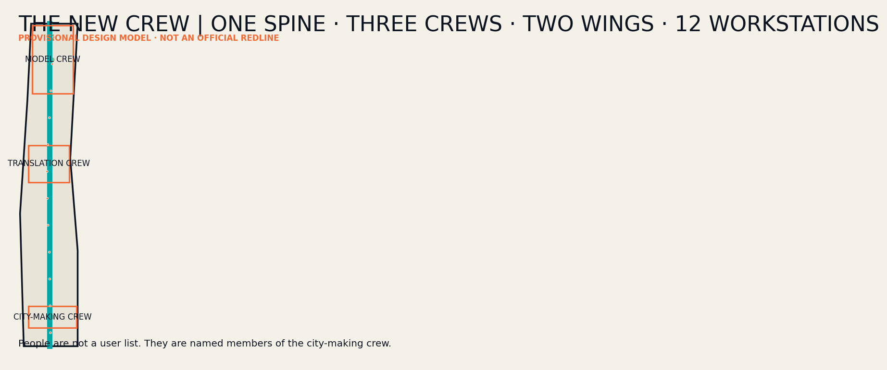
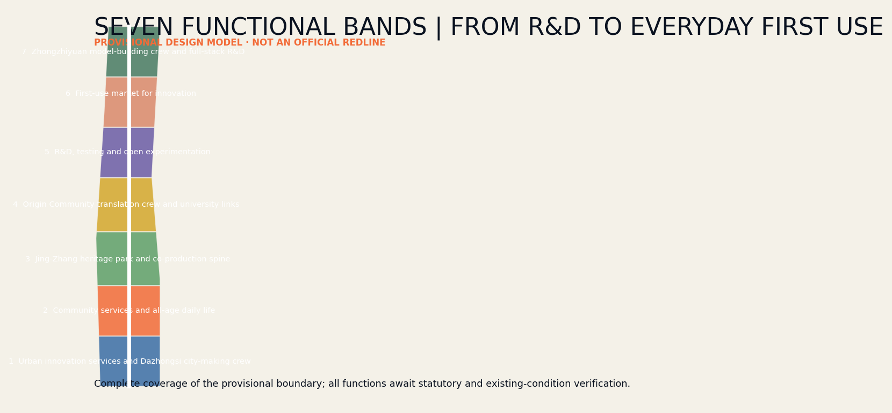
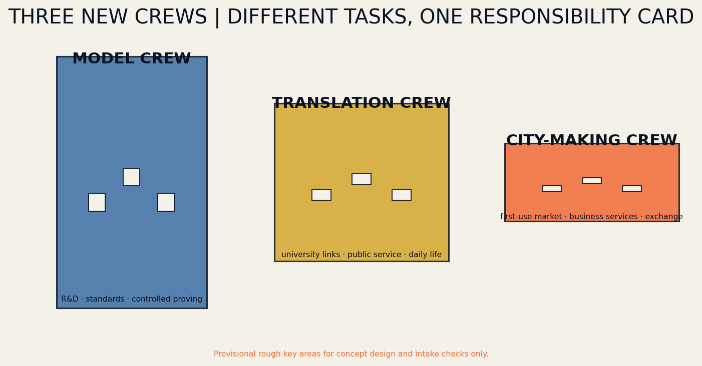
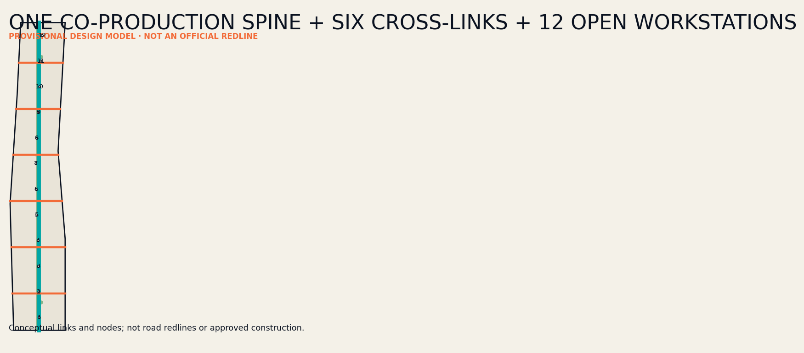
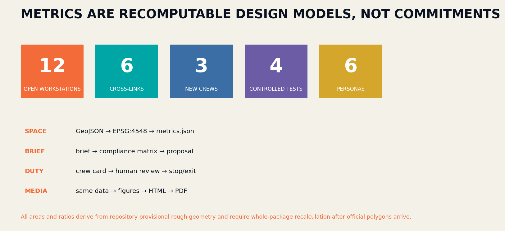

# THE NEW CREW / 京张新工班

> Entrant: Neo / 阿南 (GitHub: Nan-findf)  
> One Line · Three Crews · Two Wings · Twelve Workstations.

## Design Basis and Source List

The proposal treats the official announcement, the Agent taskbook, the repository site package, and national urban-design guidance as four distinct evidence layers. It does not convert competition language into statutory control. The announcement defines a 43.6-square-kilometre coordinated research area, an 11.4-square-kilometre overall design area, and three key areas totalling 368.4 hectares. The repository presently supplies only rough provisional polygons. Every area, ratio, and location is therefore a recalculable conceptual model, not a red line, approval, or construction promise. When official polygons arrive, boundary, land use, roads, green space, public space, buildings, phasing, metrics, figures, HTML, and PDFs must be regenerated together [source:OFFICIAL-ANNOUNCEMENT] [source:SITE-PACKAGE] [metric:site_area_sqm].

The working method is a closed loop of fact, value, space, delivery, and verification. Known facts, missing data, and design assumptions are separated first; public benefit, innovation production, and heritage continuity establish priorities; decisions are then encoded as GeoJSON and projects; metrics, compliance matrices, and human review close the loop. Six external cases contribute mechanisms only: mixed innovation districts, public-space networks, venture translation, renewal governance, research-life integration, and cross-border collaboration. No external drawing, identity, or site conclusion is copied [standard:PROJECT-OFFICIAL-ANNOUNCEMENT] [depth:existing_conditions_diagnosis].

## Three-Level Scope Framework

The three scopes form one decision chain rather than three disconnected drawing sets. The coordinated research level asks how Haidian can connect universities, models, firms, professional services, open scenarios, and global exchange into a durable ecosystem. The overall design level asks how renewal, mobility, blue-green space, and public facilities along the Jingzhang Railway Heritage Park can carry that ecosystem. The key-area level tests whether function, buildings, public space, operation, and governance can work in Zhongzhiyuan, the AI Origin Community, and Dazhongsi. Every strategic claim requires spatial or project evidence below it, while every local action must state its belt-wide contribution [depth:three_level_scope_framework] [data:geometry/key_areas.geojson#PROV-KEY-001].

The structure is “One Line, Three Crews, Two Wings, Twelve Workstations.” The line is a human–Agent co-production spine. The crews are the Model Crew at Zhongzhiyuan, Translation Crew at the AI Origin Community, and City-making Crew at Dazhongsi. The wings are Zhongguancun professional services and Xiaoyuehe real-life testing. Twelve lightweight, bookable, and reversible public workstations distribute service and accountability. The structure creates no administrative boundary. Seven provisional land-use bands cover the temporary polygon; a central slow-mobility green spine and six east–west links express connectivity intent pending official roads, parcels, ownership, and survey data [data:geometry/land_use.geojson#LU-01] [data:geometry/roads.geojson#ROAD-SPINE].

## Coordinated Research Area: Industry and Future City Research

THE NEW CREW rejects the innovation belt as a corridor of showrooms. The historic railway was made by generations of crews; an AI city should likewise be produced by researchers, companies, professionals, residents, maintainers, and Agents. The ecosystem is recast as an operating chain: originate, prove, translate, first-use, maintain, and review. Universities generate knowledge; Zhongzhiyuan validates sovereign models and safety; the Origin Community translates research into ventures and public services; Dazhongsi provides a city first-use market; the two wings supply legal, financial, standards, international, and real-life testing services. Every deployment must document a public return [source:AGENT-TASKBOOK] [depth:overall_spatial_structure].

The identity combines rail, brackets, and a handover stamp. Parallel lines represent tracks as well as the parallel responsibilities of human and Agent; cross-members are sleepers and recorded handovers; an open bracket invites another participant into an unfinished civic problem. The Chinese name is 京张新工班, the English name THE NEW CREW, and the line is “Build intelligence. Hand over the city.” Original geometry, typography, and generated data graphics are used throughout; no external logo is embedded. The identity becomes a working protocol visible on every workstation, Crew Card, annual open week, and public audit record [standard:PROJECT-AGENT-OPEN-CALL-TASKBOOK] [depth:height_massing_character].

## Overall Design Area: Urban Renewal and Regulatory-Plan-Level Urban Design

Seven continuous functional bands test a complete north–south programme: Dazhongsi city innovation services, all-age daily life, Jingzhang heritage park, Origin translation, open-test R&D, innovation first-use market, and Zhongzhiyuan full-stack R&D. They are conceptual programme zones across the temporary boundary, not proposed statutory rezoning. Renewal starts with existing ground floors, underused sites, spaces beneath infrastructure, and campus edges. Small insertions create a service network before any major construction is considered. Retain-renovate-demolish choices and development intensity require verified ownership, building condition, statutory planning, infrastructure capacity, and heritage evidence [data:geometry/land_use.geojson#LU-01] [depth:land_use_layout] [depth:development_intensity_controls].

The spatial skeleton contains the central co-production line, six cross-links, twelve workstations, three crew courtyards, and three pilgrimage landmarks. The central line privileges walking, cycling, accessibility, heritage interpretation, and low-speed maintenance; cross-links connect neighbourhoods, stations, universities, firms, and rivers. Workstations provide advice, exhibition, booking, feedback, and an emergency exit. The Centennial Crew Archive, Human–Agent Co-work Shed, and Urban Handover Desk form a public narrative from memory to work to accountability. Nine building footprints are type prototypes only; height, floor area, road lines, infrastructure capacity, and retention status remain unknown [data:geometry/buildings.geojson#BLDG-01-01] [metric:building_footprint_area_sqm].

## Detailed Design of Key Areas

The Zhongzhiyuan Model Crew converts a closed research campus into a garden-based verification district. A low-carbon Qinghe edge links a Model Proving Room, Open Tool Room, and Centennial Crew Archive in a sequence from safety evaluation to public understanding. Controlled tests cover sovereign-model safety, low-carbon computing-load adjustment, and campus walking assistance. A qualified professional signs each technical conclusion; visitors can see purpose, minimum data, uncertainty, and stop conditions. The building prototypes express open ground floors, shared courts, and adaptable testing rather than a fixed development quantum [data:geometry/key_areas.geojson#PROV-KEY-001] [depth:three_key_area_detailed_design].

The Origin Translation Crew connects academic knowledge to daily city life. A City Translation Room converts papers and models into legible service questions; a Human Service Desk receives cases that an Agent cannot resolve; a Human–Agent Co-work Shed allows students, founders, residents, and public bodies to test together. The Dazhongsi City-making Crew combines a First-use Market, City-making Studio, and Urban Handover Desk, linking products to responsible procurement and demonstrations to maintenance while reconnecting four quadrants around the metro. Each crew names a leader, onsite operator, professional reviewer, and holder of stop authority. Parcels, station interfaces, roads, ownership, heritage, and utilities remain mandatory inputs for later design [data:geometry/key_areas.geojson#PROV-KEY-002] [data:geometry/key_areas.geojson#PROV-KEY-003].

## AI Innovation Ecosystem, Personas, and AI+ Scenarios

Six personas continuously test the proposal. Open-source developers need trusted release and contribution records; start-ups need affordable validation, legal support, and first customers; corporate visitors need international reception and city-scale demonstration; neighbours need low-disturbance services, recreation, and appeal channels; university communities need near-campus translation and interdisciplinary work; frontline maintainers need interpretable alerts, training, and final authority. Personas are never used for personal tracking or commercial recommendation. They are design checks against missing real people [source:AGENT-TASKBOOK] [depth:ai_ecosystem_scenarios].

Twelve Crew Cards correspond to twelve public workstations: open-source release, model-safety sandbox, edge-compute stop, accessible walking assistant, international demo room, Qinghe low-carbon corridor, near-campus translation, data-compliance room, all-age service, railway-memory guide, maintenance coordination, and annual city handover. Every card names the problem owner, technology provider, professional duty holder, onsite operator, stop authority, minimum data, human review, public return, and exit route. Cards 02, 04, 06, and 11 are controlled tests: limited in space and time and halted when false alerts, disturbance, energy, or safety thresholds are crossed [data:geometry/public_space.geojson#WORKSTATION-01] [metric:test_scenario_count].

## Land Use, Building Scale, and Retain-Renovate-Demolish Strategy

The seven land-use bands employ permitted national land-use codes, cover the temporary boundary without overlap, and test the combination of R&D, translation, daily life, heritage, first-use, and professional services. Green areas and twelve workstations are measured as overlays so public-space quantities are not confused with primary land use. The provisional model covers about 1,141.28 hectares; green overlays equal about 9.56 percent and the twelve workstations about 0.25 percent. These are model outputs rather than planning commitments and will be regenerated when official geometry becomes available [data:geometry/land_use.geojson#LU-03] [metric:green_ratio] [metric:public_space_ratio].

Retain-renovate-demolish decisions pass four gates: identify heritage, public value, and structural safety; verify ownership, operation, and embodied carbon; compare lifetime benefits of retention, light retrofit, reuse, and rebuilding; obtain planning, architecture, structure, fire, and heritage sign-off. The nine current footprints are only three spatial tools in each crew: prove/tool/archive, translate/service/co-work, and first-use/city-making/handover. Location, outline, and use are conceptual and cannot establish demolition, gross floor area, floor-area ratio, or height [data:geometry/buildings.geojson#BLDG-02-02] [depth:retain_renovate_demolish].

## Transport, Rail, Municipal Infrastructure, and Public Services

Mobility repairs the separation between the north–south heritage landscape and east–west everyday city rather than adding a fast road. The central line carries walking, cycling, accessibility, interpretation, and slow maintenance. Six cross-links connect crews, stations, universities, firms, neighbourhoods, and rivers. Twelve workstations provide rest, supplies, wayfinding, feedback, and night safety. Lines are conceptual centrelines, not road reservations. Official station entrances, road hierarchy, crossings, underpass clearance, flows, fire access, and underground services must be overlaid before engineering decisions [data:geometry/roads.geojson#ROAD-SPINE] [depth:traffic_rail_slow_parking].

Municipal and digital systems use plug-in, metered, and removable workstation interfaces. Edge computing processes only necessary data and defaults to keeping sensitive information on the device. Aggregated energy, stormwater, lighting, and equipment data may support maintenance, but automated advice always retains human confirmation and a non-digital fallback. Public services first occupy existing community facilities and campus ground floors rather than isolated AI centres. Power, communications, drainage, flood, waste, fire, and data-security capacity are presently missing and remain prerequisites in assumptions and compliance records [data:geometry/constraints.geojson#CONSTRAINTS] [depth:municipal_new_infrastructure].

## Blue-Green Network, Public Space, and Urban Character

The Jingzhang Railway Heritage Park is the continuous public spine; Qinghe, Xiaoyuehe, and neighbourhood links become ecological and everyday branches. The green overlay combines a central buffer and three crew courtyards for stormwater, shade, low-carbon encounter, exercise, and small tests. Twelve workstations remain compact, reversibly installed, and universally accessible. River boundaries, flood conditions, mature trees, historic setting, and underground space require official evidence; visual continuity cannot substitute for engineering feasibility [data:geometry/green_space.geojson#GREEN-SPINE] [depth:blue_green_public_space].

Urban character derives from the restraint, repetition, and durability of railway infrastructure instead of nostalgic imitation. Ink records responsibility, cyan denotes public collaboration, orange identifies a point requiring human confirmation, and a sleeper grid structures signs and paving. The three landmarks make a pilgrimage from arrival to co-work to handover: the Archive records engineering and open contributions, the Shed displays live civic tasks, and the Desk publishes annual outcomes, failures, and work for the next crew. Future use of company marks, portraits, or historical images requires rights clearance [standard:MOHURD-URBAN-DESIGN-MEASURES] [metric:pilgrimage_landmark_count].

## Renewal Projects, Implementation Policy, and Phasing

The near-term “Form a Crew” phase is cheap and reversible: verify official data, install three pilot workstations and one Crew Card protocol, test accessible walking, model safety, and low-carbon maintenance, and establish appeals, stop, and audit procedures. The mid-term “Link Crews” phase delivers priority cross-links, opens three crew courtyards, and embeds legal, intellectual-property, procurement, talent, and international services. The long-term “Hand Over” phase expands to twelve workstations, an annual open week, and inter-district service agreements. Progress depends on evidence of public value, operational capacity, and safety from the preceding phase [data:geometry/phasing.geojson#PHASE-01] [depth:phasing_implementation].

Ten project packages cover the co-production line, six cross-links, twelve workstations, three crews, three landmarks, and annual New Crew Open Week. Every package requires a spatial object, operator, professional duty holder, funding and approval dependencies, stop condition, maintenance budget, and evaluation measure. Policy should enable small first-use projects with explicit reversibility while preventing Agents from replacing approval, professional sign-off, emergency judgement, or public accountability. Activities without a responsible operator and maintenance path do not proceed [depth:renewal_project_list] [source:OFFICIAL-ANNOUNCEMENT].

## Metrics, Area Recalculation, and Compliance Matrix

Core spatial metrics are recomputed from GeoJSON projected to EPSG:4548: a provisional overall boundary of about 11,412,825 square metres, green overlay of about 9.5619 percent, twelve public workstations occupying about 0.2452 percent, seven land-use bands, nine building prototypes, seven routes, three key areas, and three implementation phases. Repository checks examine land coverage and overlap, boundary containment, geometry validity, and metric consistency. Because the boundary is provisional, all core metrics have low confidence. Their purpose is cross-media consistency, not false precision [metric:site_area_sqm] [metric:green_ratio] [depth:metrics_recalculation].

Operational metrics are grouped as input, process, outcome, and guardrail. Inputs include open hours and professional staffing; process measures Crew Card completeness, human-review rate, and feedback response; outcomes concern walking connectivity, enterprise first use, resident benefit, and maintenance time; guardrails track false alerts, complaints, data incidents, energy, and stops. Twelve scenarios, four controlled tests, six personas, and three landmarks are registered in metrics. The compliance matrix maps announcement clauses 1.3–1.5 and Agent tasks 1–6. Unknown statutory controls retain a reason and acquisition path rather than invented values [metric:scenario_card_count] [metric:persona_count] [standard:PROJECT-AGENT-OPEN-CALL-TASKBOOK].

## Risk, Copyright, and Compliance

The first risk is mistaking temporary geometry for official red lines, so Chinese and English narratives, figures, PDFs, and HTML carry a visible warning. The second is technology spectacle displacing public benefit; each scenario therefore names a problem owner, professional duty holder, onsite operator, and stop authority. The third is automation overreach: Agents may retrieve, compare, generate, monitor, and advise, while planning approval, professional judgement, emergency action, and public accountability remain human. The fourth is hollow operation: projects without maintainers, budget, training, and exit do not advance [depth:risk_missing_data] [data:geometry/constraints.geojson#CONSTRAINTS].

The package uses repository materials, original writing, programmatically generated graphics, and self-generated spatial layers. Six cases are cited only for textual mechanism research; protected images, maps, and logos are not embedded. All geometry is conceptual. Existing buildings, ownership, statutory plans, roads, rail interfaces, utilities, flood, fire, heritage, and tree data require professional verification before detailed design. Offline HTML loads no remote script, map tile, font, iframe, form, or API and performs no visitor tracking [source:SOURCE-REGISTRY] [standard:MNR-LAND-USE-CLASSIFICATION-GUIDE].

## References

Primary competition evidence comprises the announcement, Agent taskbook, site package, allowed design space, planning limits, source registry, enumerations, and national urban-design and land-use guidance. Machine indexes are contained in `sources.json`, `standard_matrix.json`, and `design_depth_matrix.json`. Key repository entries include `brief/public-brief.md`, `brief/site-package/design_brief.json`, `brief/site-package/allowed_design_space.json`, `data/processed/agent_fact_pack.md`, and `data/processed/missing_data_checklist.csv` [source:PROCESSED-FACT-PACK] [source:SOURCE-REGISTRY].

Mechanism cases are JTC one-north, the City of Cambridge Kendall Square public-space programme, MaRS Discovery District, Barcelona 22@, EPA Paris-Saclay, and the Shenzhen Hetao cooperation zone. They respectively inform mixed-district management, public-space networking, innovation translation, existing-city renewal, research-life integration, and cross-regional service coordination. None is treated as a site fact or endorsement. Access dates, limited purpose, licensing caution, and the statement that no external image was copied are recorded in `sources.json` and `report/copyright_statement.md` [source:CASE-ONE-NORTH] [source:CASE-PARIS-SACLAY] [depth:risk_missing_data].
