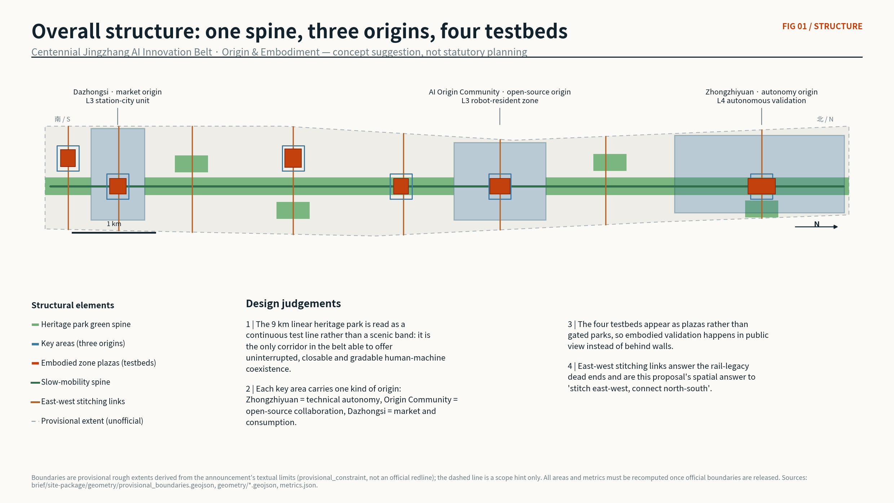
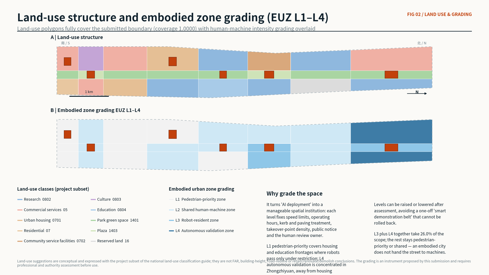
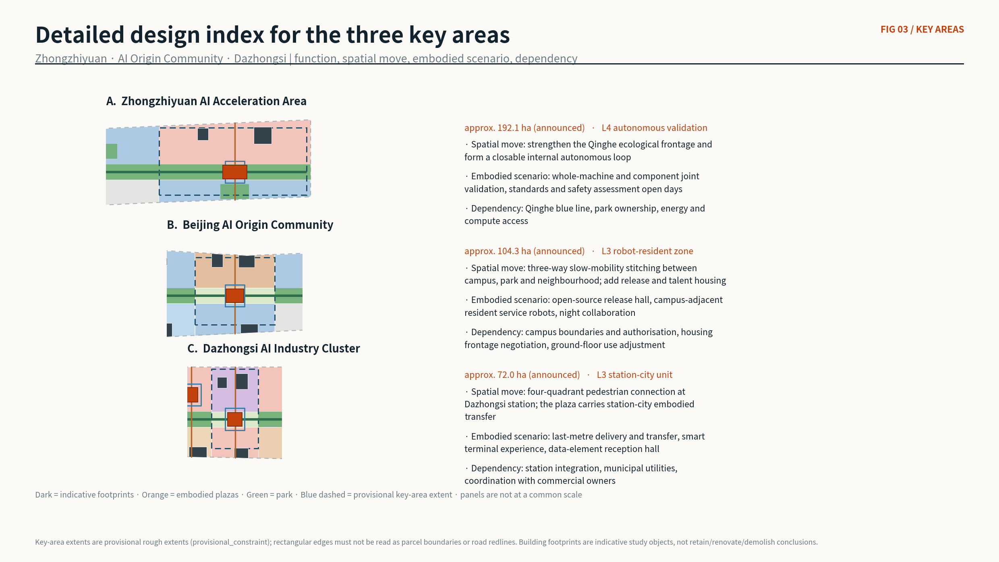
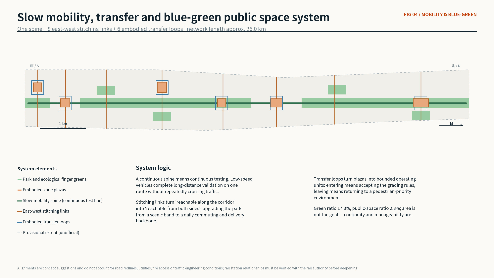
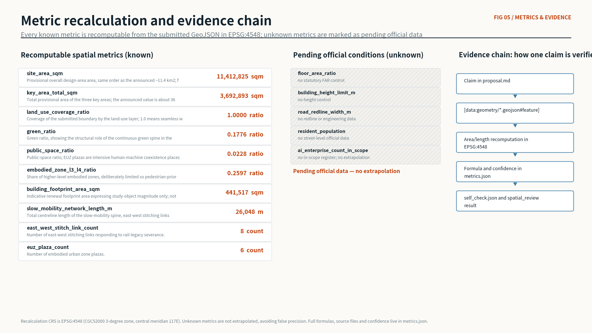

# Origin & Embodiment — A Jingzhang AI-Native Community and Embodied-Intelligence Urban Testbed

**Main name: Jingzhang Origin Belt | Proposal code: Origin & Embodiment**

This proposal makes one central claim: **Haidian does not lack the "brain" of artificial intelligence; it lacks the urban spatial institution that gives artificial intelligence a "body."** The belt is therefore not designed as another industrial corridor but as a gradable, manageable and reversible **embodied-intelligence urban testbed**, where AI enters public space in physical form — robots, low-speed vehicles, smart terminals and interactive facilities — and is subject to human observation, judgement and takeover.

## Design Basis and Source List

The primary basis is the official pre-qualification announcement for the Centennial Jingzhang AI Innovation Belt international urban design open call, complemented by the agent open-call taskbook extract that defines the three-level scope, three positionings, five functions, three areas and two wings, and the mandatory tasks agent.1 to agent.6 [source:OFFICIAL-ANNOUNCEMENT] [source:AGENT-TASKBOOK]. Spatial and enumeration bases come from the repository site package, including the land-use class subset, layer enumerations, road classes, building types, planning limits and validation schemas [source:SITE-PACKAGE].

Source usability follows the public registry: only formal-ready records support formal claims, while background-only and provisional-only records may serve as background or temporary generation inputs and must never be promoted into official boundaries, statutory controls, formal scoring evidence or implementation commitments [source:SOURCE-REGISTRY]. Additional public material collected for this submission — Haidian AI industry statistics, public reporting on the Jingzhang heritage park, and public information on six global innovation districts — is registered in `sources.json` with publisher, URL, retrieval date, coverage and limitations, and is used in the narrative as public reporting rather than as an approved conclusion.

**The boundary limitation must be stated first.** The organiser has not yet released official polygons for the `SITE_BOUNDARY` or the three `KEY_AREA` extents. All layers here are therefore generated from the repository's provisional rough boundaries and flagged `official_boundary=false`, `geometry_role="provisional_constraint"` and `boundary_precision="provisional_rough"` [data:geometry/site_boundary.geojson#SITE-001]. Rectangular edges must not be read as parcel boundaries or road redlines, and areas may only be treated as order-of-magnitude references. Once official data is published, land use, green space, public space, buildings, roads, phasing and every metric must be recomputed as a whole rather than file by file [depth:existing_conditions_diagnosis].

## Three-Level Scope Framework

The three announced scope levels carry three different kinds of work rather than three scales of one drawing. The coordinated research area of about 43.6 km² answers how the AI industry and the future urban form should be organised. The overall design area of about 11.4 km² answers how a linear heritage space becomes an urban backbone and an institutional carrier. The key detailed-design areas of about 368.4 ha answer how three districts reach a depth that professional teams can continue [source:OFFICIAL-ANNOUNCEMENT] [data:geometry/site_boundary.geojson#SITE-001].

The three levels are connected by one chain: **industry judgement, then spatial institution, then specific district.** Research concludes that Haidian's advantage in models and talent is already accumulated and that the bottleneck has moved to real-world validation. The overall design answers with the Embodied Urban Zone grading instrument. The key areas then carry three operating intensities of that instrument [depth:three_level_scope_framework] [data:geometry/key_areas.geojson#PROV-KEY-001].

| Level | Design question | Answer in this proposal | Verifiable anchor |
| --- | --- | --- | --- |
| Coordinated research 43.6 km² | How to organise the AI ecosystem and future urban form | Move from a model highland to a validation highland by opening the real city as a graded test resource | Cases and public statistics in `sources.json` |
| Overall design 11.4 km² | How linear space becomes backbone and institution | One continuous spine, EUZ L1–L4 grading, eight east-west stitching links | [data:geometry/land_use.geojson#LU-001] |
| Key areas 368.4 ha | How three districts reach detailed-design depth | Autonomy origin, open-source origin, market origin at L4, L3, L3 | [data:geometry/key_areas.geojson#PROV-KEY-002] |

The scope areas above are announcement figures, not measurements produced here. The recomputed area of the submitted provisional overall design boundary is 11,412,825 square metres, the same order as the announced 11.4 km², and is used only for internal consistency checking [metric:site_area_sqm]. It must not be quoted as an official area.

## Coordinated Research Area: Industry and Future City Research

**Factual basis of the industry judgement.** Public reporting states that by June 2025 Haidian hosted more than 1,900 artificial-intelligence enterprises, about seventy per cent of Beijing's total; that 89 large models had been filed in the district, roughly one third of the national total; that about 12,300 AI scholars work there, over eighty per cent of Beijing's total; and that 37 universities in the district include every 985 and 211 institution in Beijing, with 21 offering AI undergraduate programmes. By the 2025 government work report the district recorded 122 filed large models, more than 1,900 AI enterprises and 26 unicorns [source:HAIDIAN-AI-2025] [source:HAIDIAN-GOV-2025-REPORT]. These numbers do not say that more models are needed. They say that **model-side supply is already abundant while real-world validation supply is scarce.**

**That scarcity is the starting point of this proposal.** Embodied intelligence differs from pure software in one decisive way: its capability ceiling is set by how many real situations it can safely fail in, not by parameter count. Beijing has explicitly listed embodied-intelligence dataset supply among its priority actions [source:BEIJING-AI-FIRST-CITY]. A nine-kilometre linear corridor that can provide continuous, closable and gradable human-machine coexistence is therefore the scarcest and least reproducible strategic asset Haidian holds for the next phase [depth:overall_spatial_structure].

**Six global AI ecosystem cases.** The selection covers six models — campus-city fusion, platform aggregation, industry-city integration, closed testbed, smart district and research-institution sharing — in order to answer which model the belt should and should not become.

| Case | Public facts | Model | Implication for the belt |
| --- | --- | --- | --- |
| Kendall Square, Cambridge, USA | MIT has advanced district renewal with the community since 2010; described as the most innovative square mile on the planet, with over 50,000 people working in the area | Campus-city fusion, public realm feeding innovation | University density must be translated into streets where people stay, not into closed campuses |
| Station F, Paris | A 1929 freight hall converted into a 34,000 m² campus for about 1,000 startups, opened by the French president in 2017 | Rail heritage becomes an innovation platform | The closest direct precedent for reusing Jingzhang rail heritage |
| Pangyo Techno Valley, Seongnam, Korea | Officially reported 1,780 resident companies, 83,465 employees and 454,964 m² of total area | Industry-city integration at scale | Efficient at scale but weak in public life; not a model to copy |
| Toyota Woven City, Shizuoka, Japan | Officially launched in September 2025 as a real-world test course for mobility; phase one covers about 50,000 m² with roughly 300 residents | Closed corporate test city | High validation efficiency but closed; the belt should be its open counterpart |
| Punggol Digital District, Singapore | A 50-hectare smart business district developed by JTC covering cybersecurity, AI, robotics and fintech, expected to create 28,000 jobs | Smart district with campus integration and an open digital platform | The institutionalisation of the digital platform and autonomous goods delivery is worth learning from |
| ETH Zurich Center for Robotics | The renovated Machine Laboratory Hall was inaugurated in November 2025 to host the Center for Robotics with shared test zones | Research-institution shared test infrastructure | Shared test infrastructure should open to society, not only inward |

**Three things the belt should not do.** It should not become a closed corporate test city, because that efficiency is bought by giving up urbanity. It should not become an office-scale industry-city unit with thin public life. It should not become a "smart demonstration zone" that exists only as signage and slogans. The belt's unique position is that it combines university density, rail heritage, continuous linear public space and real residents — a combination with no direct global counterpart [source:AGENT-TASKBOOK].

**Future urban form.** When embodied intelligence enters daily life, urban form changes first not in building height or street density but in **street sections, kerbs, paving, signage and liability rules**: who may pass, at what speed, in which hours, where handover happens, and who takes over when something fails. This proposal turns that judgement into the EUZ instrument instead of leaving it as a vision statement [standard:MOHURD-URBAN-DESIGN-MEASURES].

## Overall Design Area: Urban Renewal and Regulatory-Plan-Level Urban Design

### Naming system and visual identity direction (agent.1)

**Main name: Jingzhang Origin Belt.** "Origin" carries a double narrative: the 1909 Jingzhang railway was the origin of railways designed and built by Chinese engineers, and Haidian today is an origin of Chinese AI. The naming system uses one main name and three sub-names: **Autonomy Origin — Zhongzhiyuan**, **Open Origin — AI Origin Community**, and **Market Origin — Dazhongsi**. Embodied zones are named "Origin Unit" plus a number. No company, product or personal names are used, avoiding trademark and portrait risk [source:AGENT-TASKBOOK].

**Logo direction (a direction, not a finished mark).** The famous "herringbone" switchback of the Jingzhang railway is abstracted into two meeting strokes whose meeting point is the origin. The stroke can extend into progress bars, routes and numbering slots for events, wayfinding and honour display. The palette pairs rail grey with origin orange, where orange is reserved for human-machine coexistence information so that one semantic reads consistently at city scale. All typefaces and graphics must use commercially licensed resources with certificates provided on delivery; this submission contains no uncleared fonts or images [depth:brand_identity_direction].

### The Embodied Urban Zone: the core spatial and governance instrument

The EUZ turns "AI deployment" from a slogan into a manageable spatial institution. The belt is graded into four levels of human-machine coexistence intensity, each fixing both a spatial treatment and a governance requirement.

| Level | Meaning | Spatial treatment | Governance requirement | Land share |
| --- | --- | --- | --- | --- |
| L1 pedestrian priority | Housing and education frontages | Continuous accessible footways, no robot lanes | Robots pass under time and speed limits with human accompaniment | about 31.3% |
| L2 shared human-machine | Corridor streets and plazas | Paving differentiation, kerb ramps, takeover points every 200 m | Operating hours and responsible party published | about 42.8% |
| L3 robot-resident | Origin Community and Dazhongsi | Dedicated charging and handover bays, refuge areas, graded night lighting | Registration, insurance and public incident review | about 10.1% |
| L4 autonomous validation | Internal loop at Zhongzhiyuan | Temporarily closable loop, separation strips, emergency stopping bays | Windowed operation, full recording, staffed takeover desk | about 15.8% |

The point of grading is **reversibility**: any level can be downgraded after assessment, which avoids declaring the whole belt a smart demonstration zone with no way back. L3 and L4 together take about 25.97 per cent, leaving roughly three quarters pedestrian-priority or shared — an embodied city does not hand the street to machines [metric:embodied_zone_l3_l4_ratio] [data:geometry/land_use.geojson#LU-018].

### Land use and spatial structure

Land use follows a three-column structure — a western living and research frontage, a central heritage green spine, an eastern industry and service frontage — crossed by eight longitudinal segments, producing 24 land-use units that cover the submitted boundary without gaps or overlaps at a coverage of 0.999993 [metric:land_use_coverage_ratio] [data:geometry/land_use.geojson#LU-001]. The central spine is the only fully continuous element; the two flanking columns carry housing, research, education, culture, commercial services and reserved land by segment [standard:MNR-LAND-USE-CLASSIFICATION-GUIDE].

**Renewal follows stitching before densification.** Public reporting records that the rail line historically severed east-west movement and left dead ends on both sides, and that phase one of the heritage park removed fences and walls to reconnect movement in four directions [source:JINGZHANG-PARK-2023]. This proposal continues that logic with eight new east-west stitching links, upgrading "reachable along the corridor" to "reachable from both sides" — the highest value-for-effort spatial move available in this belt [metric:east_west_stitch_link_count] [depth:land_use_layout].

On development intensity: **no floor area ratio, building height, density or road redline values are proposed.** These belong to statutory control, and stating numbers without official conditions would be false precision. The related metrics are marked pending official data in `metrics.json` [metric:floor_area_ratio] [depth:development_intensity_controls].

## Detailed Design of Key Areas

The three key areas carry three operating intensities of the EUZ instrument and answer the announcement's specific requirements [data:geometry/key_areas.geojson#PROV-KEY-001] [depth:three_key_area_detailed_design].

### Autonomy Origin — Zhongzhiyuan AI Acceleration Area (about 192.1 ha, L4)

**Role:** full-stack autonomy and governance validation core. **Spatial move:** organise an ecological and innovation forecourt along the Qinghe frontage so the district gains a temporarily closable internal autonomous loop; the loop meets the city slow-mobility spine at two points, each with a staffed takeover desk and a public notice board [data:geometry/public_space.geojson#PUBLIC-004]. **Embodied scenarios:** whole-machine and component joint validation, standards and safety assessment open days, low-carbon compute experience. **Buildings:** three space types are proposed — laboratory cluster, standards and governance workshop, autonomous interchange hub — as indicative study objects rather than retain-renovate-demolish conclusions [data:geometry/buildings.geojson#BLDG-001]. **Dependencies:** the Qinghe blue line and ecological conditions, district ownership, energy and compute access; until all three are confirmed, no L4 operating window may open.

### Open Origin — Beijing AI Origin Community (about 104.3 ha, L3)

**Role:** open-source collaboration and talent-life origin core. **Spatial move:** stitch campus, park and neighbourhood in three directions at walking scale, connecting university output, startup teams and residents; add release, talent housing and community service space [data:geometry/buildings.geojson#BLDG-005]. **Embodied scenarios:** open-source release hall, campus-adjacent resident service robots, night collaboration. **Key judgement:** this is the only area in the belt with campus, startup and housing frontages at once, so it is set at L3 rather than L4 — **robots may reside, but not operate without a human able to take over.** The housing frontage stays L1, producing an explicit intensity gradient [data:geometry/public_space.geojson#PUBLIC-003]. **Dependencies:** campus boundaries and authorisation, housing frontage negotiation, ground-floor use adjustment.

### Market Origin — Dazhongsi AI Industry Cluster (about 72.0 ha, L3)

**Role:** station-city intelligent consumption and market core. **Spatial move:** organise four-quadrant pedestrian connection around Dazhongsi station, with the station forecourt carrying station-city embodied transfer so that last-metre delivery and passenger interchange are layered in plan rather than in conflict [data:geometry/public_space.geojson#PUBLIC-001]. **Embodied scenarios:** last-metre delivery and transfer, smart terminal experience, data-element reception hall. **Programme judgement:** intelligent-native retail is not a mall with an AI label; it means reorganising the ground floor so that handover bays, temporary storage and unattended pick-up points are designed in rather than retrofitted [data:geometry/buildings.geojson#BLDG-007]. **Dependencies:** station integration conditions, municipal utilities, coordination with commercial owners.

## AI Innovation Ecosystem, Personas, and AI+ Scenarios

### Personas (six, above the five required)

| Persona | Core need | Spatial response | Privacy and governance boundary |
| --- | --- | --- | --- |
| Open-source developer | Publishing, collaboration, night work, community reputation | Open Wall, 24-hour collaboration space, release hall | Contribution display requires consent; no behavioural tracking |
| Embodied-intelligence engineer | Real test slots, tolerance for failure, data recovery | L3 and L4 zones, takeover desks, test booking | Test records serve safety review only, never commercial profiling |
| Startup team | Low-cost desks, compute access, testbed admission | Campus-adjacent incubator, shared testbed, edge compute stations | Compute and data services require separate authorisation |
| Nearby resident | Commuting, leisure, low disturbance, sense of safety | L1 pedestrian-priority zones, graded night lighting, direct complaint channel | Residents are never included in any test dataset by default |
| University student or staff | Technology transfer, cross-campus collaboration, daily walking | Campus-park stitching links, transfer stations | Campus data and research outputs require authorisation |
| International visitor or client | Presentation, negotiation, an intelligible city narrative | Dazhongsi pitch lounge, bilingual wayfinding, pilgrimage route | Company marks and cases require clearance before use |

### AI scenario cards (twelve, above the ten required)

Each card states the user, the spatial carrier, the EUZ level and the data and human-review boundary.

| ID | Scenario | Carrier | Level | Data and human-review boundary |
| --- | --- | --- | --- | --- |
| SC-01 | Open-source release hall | AI Origin Community | L3 | Public commit records only; display requires contributor consent |
| SC-02 | Safety governance sandbox open day | Zhongzhiyuan | L4 | Sessions recorded for review; recordings not used for identification |
| SC-03 | Edge compute station | Corridor service nodes | L2 | Load and energy logged; task content never logged |
| SC-04 | Walking severance detection | Park spine | L2 | Low-intrusion sensing outputs aggregates only, no imagery stored |
| SC-05 | Last-metre delivery and handover | Dazhongsi forecourt | L3 | Handover bays published; delivery records stored apart from identity |
| SC-06 | Campus-adjacent resident service robots | AI Origin Community | L3 | Night speed limits; every unit has a searchable responsible party |
| SC-07 | Accessible companion navigation | Belt-wide spine | L2 | User-initiated only, never passive following |
| SC-08 | Data-element reception hall | Dazhongsi | L3 | Only authorised, auditable data-circulation cases are shown |
| SC-09 | International pitch lounge | Dazhongsi | L2 | Publishing footage requires consent of those present |
| SC-10 | Qinghe low-carbon innovation gallery | Zhongzhiyuan river frontage | L3 | Ecological monitoring data is public and contains no personal data |
| SC-11 | AI cultural interpretation | Tsinghuayuan station segment | L1 | Historical content requires human curation and source checking |
| SC-12 | Global AI week route | Belt-wide public space | L2 | Levels rise temporarily during events and fall back automatically |

**Common governance principles:** data minimisation, public sources, explainability, human takeover and after-the-fact review. No scenario may require personal identity capture as a precondition, and every automated judgement must have a human review entry point [source:AGENT-TASKBOOK] [depth:ai_scenario_system].

### Industry test and validation scenarios (four, above the three required)

1. **Whole-machine and component joint validation field (Zhongzhiyuan, L4)** for robot bodies, sensing and control components, offering a closable loop with real slopes, paving and weather; the output is a public description of test conditions, not a ranking of companies.
2. **Last-metre delivery urban validation field (Dazhongsi, L3)** for delivery robots and low-speed vehicles, testing station handover, lift interfaces and peak-hour avoidance; the output is reusable handover-bay design parameters.
3. **Campus-adjacent service robot validation field (AI Origin Community, L3)** for service and companion robots living alongside residents and students; this field requires a resident participation mechanism and an exit mechanism.
4. **Public-space accessibility validation field (park spine, L2)** for accessibility devices and navigation systems, testing continuity, gradient and severance; the output feeds directly back into the renewal project list.

All four are **concept suggestions**. Opening them requires authority permission, safety assessment, insurance and public notice, and none of them constitutes an approved operating arrangement [source:AGENT-TASKBOOK].

## Land Use, Building Scale, and Retain-Renovate-Demolish Strategy

Land use is expressed with the project subset of the national land-use classification guide, producing 24 closed units with no gaps or overlaps [standard:MNR-LAND-USE-CLASSIFICATION-GUIDE] [data:geometry/land_use.geojson#LU-012]. Thirteen indicative building footprints total about 441,517 square metres, expressing only the magnitude of the study objects [metric:building_footprint_area_sqm].

**A method, not a conclusion, for retain-renovate-demolish.** Without a building survey, ownership records, statutory controls or engineering conditions, no parcel-level judgement is offered. Instead a four-step method is proposed: first identify rail heritage and cultural value objects, such as the retained Tsinghuayuan station building; second identify objects that physically block east-west stitching; third identify objects whose ground floor cannot accommodate embodied services; and only fourth enter ownership and economic feasibility assessment. The first three steps can be completed from public information; the fourth must be done by professional teams together with rights holders [depth:retain_renovate_demolish] [data:geometry/buildings.geojson#BLDG-011].

Character and massing guidance follows a "low along the spine, rising outward" principle, with transparent ground floors and visible takeover points required around L3 and L4 zones. All height, setback and frontage controls are marked pending official data and no values are given [depth:height_massing_character] [metric:building_height_limit_m].

## Transport, Rail, Municipal Infrastructure, and Public Services

The slow-mobility system has three parts: one continuous spine that doubles as the test line, eight east-west stitching links and six embodied-zone transfer loops, with a total centreline length of about 26.0 kilometres [metric:slow_mobility_network_length_m] [data:geometry/roads.geojson#ROAD-001]. A continuous spine means continuous testing: low-speed vehicles complete long-distance validation on one route instead of repeatedly crossing traffic [depth:traffic_rail_slow_parking].

**Rail integration concentrates at Dazhongsi station.** Four-quadrant pedestrian connection is not only a pedestrian question but a delivery question: the forecourt must host passenger interchange and robot handover at once, and the proposal layers them in plan rather than separating them in time. Everything touching rail facilities, bridges, tunnels or underground space is a concept suggestion requiring verification with the rail and transport authorities [source:OFFICIAL-ANNOUNCEMENT].

**Municipal and new infrastructure.** Edge compute stations, distributed energy connection points and robot charging and handover bays should be planned together as a new class of embodied municipal facility, located against EUZ units rather than sited independently. In public services, L3 zones should receive talent services, community services and a direct complaint entry at the same time — **a complaint channel for embodied facilities must be built together with the facility**, or governance costs concentrate after operations begin [depth:municipal_new_infrastructure] [data:geometry/constraints.geojson#CONSTRAINTS-SITE]. Missing utility, energy, drainage, flood and fire conditions are all listed as prerequisites for formal deepening.

## Blue-Green Network, Public Space, and Urban Character

The blue-green system is structured on the park spine, with a green ratio of about 17.76 per cent and a public-space ratio of about 2.28 per cent [metric:green_ratio] [metric:public_space_ratio]. Public space is not maximised: six embodied-zone plazas total about 260,000 square metres, and their value lies in clear boundaries, publishable rules and manageability rather than in size [data:geometry/green_space.geojson#GREEN-001] [depth:blue_green_public_space].

### AI pilgrimage landmarks (four, above the three required)

| Landmark | Location | Narrative core | Honour display mechanism |
| --- | --- | --- | --- |
| Origin Marker | Tsinghuayuan station segment | The 1909 railway origin overlaid on today's intelligence origin | Public historical milestones and open-source milestones, updated annually |
| The Open Wall | AI Origin Community | Makes contribution a public fact the city can see | Authorised contributors and commit records, with a removal request path |
| Embodiment Plaza | Dazhongsi forecourt | The everyday scene of people and machines sharing space, not a stage | Displays the devices currently operating and their responsible parties |
| Testbed Zero | Zhongzhiyuan | The place where failure is recorded, published and learned from | Publishes test conditions and review conclusions, never company rankings |

**All four share an anti-viral principle:** landmarks win on verifiable facts rather than photogenic form; no unauthorised portraits, company marks or trademarks are used; no over-entertained expression [source:AGENT-TASKBOOK] [depth:landmark_and_honor_system].

### Cultural narrative and wayfinding (agent.5)

The Jingzhang railway, completed in 1909, was the first trunk railway surveyed, designed and built by Chinese engineers. In 2019 the Jingzhang high-speed railway opened, and the 6,020-metre Tsinghuayuan tunnel took the line underground through the urban section, releasing the linear space used today [source:JINGZHANG-HIGHSPEED-2019]. The heritage park is planned along about nine kilometres from Beijing North Station to the North Fifth Ring Road, touching multiple sub-districts and nearly seventy communities, with phase one opened in 2023 [source:JINGZHANG-PARK-2023].

**The narrative structure is "three acts of autonomy":** railway technology in 1909, industrial technology since Zhongguancun, and full-stack AI capability today. The three share one spatial thread, which is why culture here is not decoration but **the explanation of why "origin" and "autonomy" are the core words of this proposal** [depth:culture_narrative]. Wayfinding is layered against the belt logo: the logo identifies, the wayfinding explains, and it must carry both cultural interpretation and EUZ rule notices in Chinese and English with accessible legibility. Historical content requires human curation and source verification and may never be posted directly from generated text [standard:MOHURD-URBAN-DESIGN-MEASURES].

## Renewal Projects, Implementation Policy, and Phasing

| ID | Project | Type | Phase | Main dependency |
| --- | --- | --- | --- | --- |
| JZ-01 | Continuity of the park slow-mobility spine | Public space and transport | 1 | Severance survey, road redlines, space under bridges |
| JZ-02 | Eight east-west stitching links | Transport and renewal | 1–3 | Ownership, redlines, traffic review |
| JZ-03 | Open Wall and release hall in the Origin Community | Public space and industry service | 1 | University authorisation, ground-floor adjustment |
| JZ-04 | Four-quadrant pedestrian connection at Dazhongsi station | Rail integration | 2 | Station integration, utilities, commercial coordination |
| JZ-05 | EUZ rule pilots at two zones | Governance and operations | 1 | Authority permission, safety assessment, insurance |
| JZ-06 | Qinghe innovation frontage and autonomous loop | Blue-green and industry | 3 | Blue line, ecology, energy and compute |
| JZ-07 | Embodied municipal facilities: charging and handover bays | New infrastructure | 2 | Energy connection, operating entity |
| JZ-08 | Global AI week public route | Operations and brand | 1–3 | Public-space permits, event safety, copyright clearance |

Phasing has three stages centred on the Origin Community, Dazhongsi and Zhongzhiyuan respectively [data:geometry/phasing.geojson#PHASE-001] [depth:phasing_implementation]. **The sequence is rules first, facilities second, scale third.** Phase one verifies at minimum cost whether the EUZ rules can actually run, since a rule pilot needs little construction. Phase two fixes verified rules into facility standards. Only phase three enters high-intensity autonomous validation construction. This order avoids the common failure where facilities arrive before rules.

### Long-term operations and event system (agent.6)

**Annual events** are proposed as a two-layer structure: an annual Origin Week carrying international communication and result release, and a monthly open test day that turns validation itself into public content. **Developer community operations** anchor on the Open Wall as a physical node, with public contribution records as participation credentials, forming a loop from online contribution to physical display to use of city space; community rules must forbid vote farming and identity impersonation. **Scenario opening** requires four instruments: a scenario catalogue, an application process, safety assessment and an exit mechanism, because any opened scenario must be closable. **Conversion pathway:** developer, startup team, then established company, matched respectively to testbed admission, incubation space and industrial space.

All of the above are **concept suggestions and reference schemes**. They do not constitute government event arrangements, investment promotion commitments, funding support or settled policy [source:AGENT-TASKBOOK].

## Metrics, Area Recalculation, and Compliance Matrix

Every known metric is recomputable from the submitted GeoJSON in EPSG:4548 (CGCS2000 three-degree zone, central meridian 117°E), with formulas, source files and confidence stored in `metrics.json` [metric:site_area_sqm] [depth:metrics_recalculation]. Metrics fall into three classes: spatial metrics recomputable directly from geometry, control metrics that need official statutory conditions, and performance metrics that need continuing operational calibration. The second and third classes are all marked pending official data in this submission and are never extrapolated [metric:floor_area_ratio].

`compliance_matrix.json` covers every task in announcement sections 1.3, 1.4 and 1.5 as well as agent.1 to agent.6, mapping each to sections, layers, metrics, drawings, HTML pages, sources, assumptions and self-check items. `standard_matrix.json` covers all mandatory professional standards, and `design_depth_matrix.json` records the completion state of fifteen design-depth items [standard:PROJECT-OFFICIAL-ANNOUNCEMENT] [standard:MOHURD-CONTROL-DETAILED-PLANNING]. A reader can start from any claim in the narrative, follow its evidence marker into layers and metrics, and confirm recomputability from the self-check result.

## Risk, Copyright, and Compliance

**First risk class: data gaps.** Official boundaries, key-area polygons, statutory controls, road redlines, ownership, utilities and heritage conditions are all missing, so every area, ratio and spatial relation here is an order-of-magnitude reference under provisional geometry rather than an approved conclusion [data:geometry/constraints.geojson#CONSTRAINTS-HERITAGE-001] [depth:risk_missing_data]. The Tsinghuayuan station building and rail heritage sensitive area appear in the constraints layer as an indicative alert extent; the actual protection extent follows the heritage authority's publication.

**Second risk class: governance risks specific to embodied intelligence.** These include human-machine conflict and injury, occupation of accessible routes, noise and night disturbance, unclear liability, missing incident review, and reuse of test data for commercial purposes. The response is to write these risks into the spatial institution — grading, takeover points, notice boards and direct complaint entries — rather than leaving them to operations. Even so, opening any L3 or L4 zone still requires authority permission, safety assessment, insurance and public notice.

**Third risk class: overstatement.** Every spatial suggestion here is a **concept suggestion, a reference scheme or material for professional teams to deepen**. Nothing replaces statutory planning or constitutes a government decision, an investment commitment, an engineering feasibility conclusion or a parcel-level demolition decision.

**Copyright and generation disclosure.** All text, diagrams, GeoJSON, HTML and PDF in this package were generated by an AI agent from public material. Public reporting and institutional information are registered in `sources.json` with publisher, URL and retrieval date and are paraphrased rather than reproduced at length. No uncleared typeface, image, trademark, portrait or company mark is used. The HTML pages are fully offline static documents that load no remote scripts, map tiles, fonts, iframes, forms or tracking code. The full statement is in `report/copyright_statement.md`.

## References

- Announcement and taskbook: `brief/site-package/standards/references/project-official-announcement.md`, `agent-open-call-taskbook-0518.md`
- Site package: `brief/site-package/design_brief.json`, `allowed_design_space.json`, `enums/`, `ranges/planning_limits.json`, `schemas/`
- Source registry: `data/source_registry.json`
- External public material (publisher, URL, retrieval date and limitations in `sources.json`): Haidian AI industry statistics and government work report, public reporting on the Jingzhang heritage park, Kendall Square, Station F, Pangyo Techno Valley, Toyota Woven City, Punggol Digital District and the ETH Zurich Center for Robotics
- Complete machine index: `sources.json`, `metrics.json`, `compliance_matrix.json`, `standard_matrix.json`, `design_depth_matrix.json` [source:SITE-PACKAGE]
